# 二、量子计算的数学基础和假设

> *我们必须知道！我们会知道的！*
> 
> —戴维·希尔伯特

量子力学比经典力学更基础，在微观和宏观层面都起作用。然而，对于高速运动的微观领域中的粒子和系统，量子力学的表现变得更加重要。关于量子力学的解释方面仍然存在问题。然而，在操作层面上，它能以很高的精确度处理广泛的现象。量子力学的数学比经典力学简单得多，作为一种计算设备，量子力学取得了巨大的成功。在这一章中，我们将讨论线性代数中的一些主题，然后转向量子力学的基本原理。

## 线性代数话题

因为量子系统的态存在于希尔伯特空间中，并且态上的算符是线性的，所以线性代数在量子力学的研究中变得至关重要。在第 [1](1.html) 章中，我们触及了线性代数中的几个主题，以便对量子力学和量子计算有所了解。然而，更严格的线性代数知识是理解量子力学和量子计算的核心。在这一章中，我们将着眼于线性代数中对量子态、量子进化和量子测量的核心思想。

### 向量的线性无关性

两个向量|*v*T2】1⟩和|*v*T6】2⟩被称为线性无关，如果一个不能被表示为另一个的线性缩放。数学上讲，| *v* 1 ⟩和| *v* 2 ⟩线性无关如果|*v*1⟩≦*k*|*v*2⟩对于某常数 *k* 。一组 *n* 向量|*v*t32】1⟩，|*v*t36】2⟩….|*v**n*⟩∈ℝ*m*如果它们都不能表示为其他的线性组合，则称它们是线性无关的。要检查给定的一组 *n* 向量是否线性无关，必须检查*c*1|*v*1⟩+*c*2|*v*2+…*c**n 如果我们把向量| *v* 1 ⟩到|*v**n*⟩排列成一个矩阵 *A* 的向量，我们就可以表示出*c*t102】1*|*v*t106】1⟩+*c*

只有当系数向量[*c*T4】1，*c*T8】2 时，方程 [2-1](#Equ1) 才应该为零。。 *c* 一个维数为 *m* × *n* 的矩阵 *A* 如果其秩等于 *m* 和 *n* 中的最小值，则称其为满秩。对于等式 [2-1](#Equ1) 中的矩阵为满秩，其秩必须为 *n* ，假设 *m* > *n* 。如果矩阵是方阵 *n* × *n* 矩阵，我们可以通过保证矩阵的行列式不为零来验证矩阵是满秩的。

如果一组 *n* 向量|*v*T4】1⟩，|*v*t8】2⟩，。。|*v**n*⟩∈ℝ*n*是线性无关的，向量跨越整个 *n* 维向量空间。跨越 *n 个*向量意味着通过对 *n 个*向量进行线性组合可以产生不同的其他向量。因此，使用一组 *n* 线性独立的向量，可以产生ℝnt31】中所有可能的向量。如果向量|*v*t34】1⟩，|*v*t38】2⟩，。。|*v**n*⟩不是线性独立的，那么它们会在ℝ*内跨越一个更小的子空间ℝ *k* 。让我们试着用一个例子来说明向量跨度的概念。*

 *假设我们有一个向量|*v*1⟩=【1，2，3】*t*。利用这一点，我们可以在三维空间中只跨越一个维度，因为所有的向量都将是形式*a*∣*v*T12】1⟩，其中 *a* 是定标器乘数。

现在如果我们取另一个向量|*v*2⟩=【5 9 7】*t*那不是∣ *v* 1 ⟩的定标乘数，我们可以取形式为*a*|*v*1⟩+*b*∣*v*2】2 的线性组合

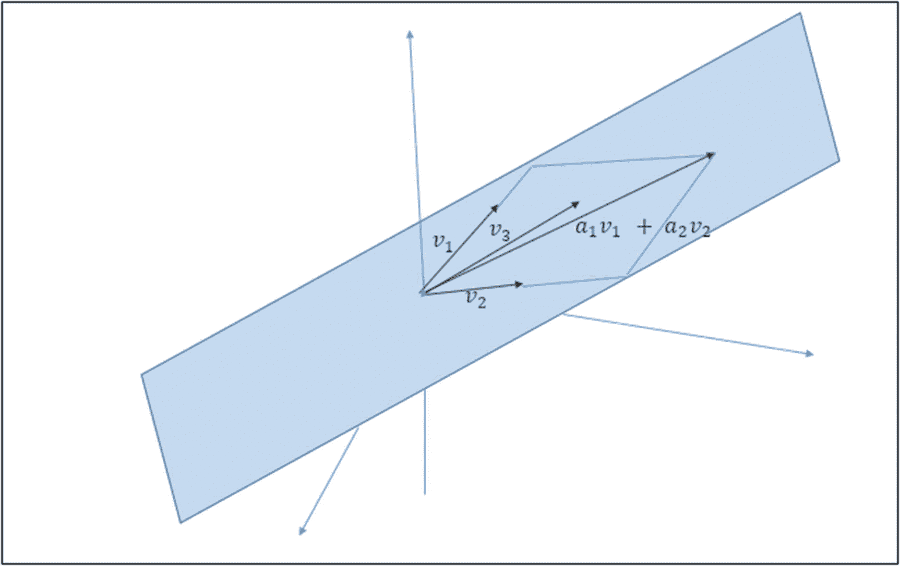

图 2-1

三维向量空间中的二维子空间

现在如果我们在我们的向量集中再增加一个向量|*v*3⟩=[4 8 1]*t*我们就可以跨越整个ℝ 3 向量空间既然| *v* 1 ⟩、∣ *v* 2 ⟩、∣ *v* 3 ⟩是线性无关的，

如果我们把∣*v*T2】3⟩看成是∣*v*T6】1⟩和∣*v*T10】2⟩的线性组合，那么就不可能跨越整个三维空间。我们将被限制在由∣*v*t14】1⟩和∣*v*t18】2⟩.所生成的二维子空间中

## 基本向量

一组 *n* 线性无关向量|*v*T4】1⟩，|*v*t8】2⟩，。。|*v**n*⟩形成了在 *n* 维向量空间中表示任何给定向量的基础。使用一次 *n* 个基向量的线性组合，可以在 *n* 维向量空间中创建任意向量。

## 标准正交基

当基集中的向量元素彼此正交时，称向量空间具有正交基。一组基向量| *ϕ* 1 ⟩，|*ϕ*2⟩……∣*ϕ**n*⟩据说构成一个标准正交基，如果下列条件成立:

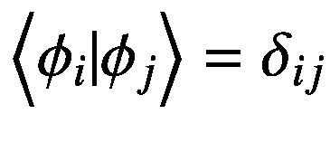

(2-2)

术语*δ*T3】ijT5】称为克罗内克δ，其性质如下:

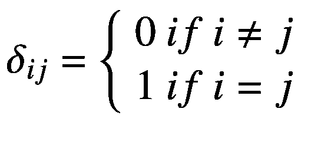

(2-3)

我们不需要明确地引用线性独立性作为标准正交基的条件，因为向量的标准正交性将总是确保向量的线性独立性。

在量子力学中，我们总是用正交基来表示希尔伯特空间中的量子态。

## 线性算子

量子态存在于复杂的希尔伯特空间中。在线性幺正算符的影响下，量子态从一个状态演化到另一个状态。

线性算子 *A* 是将向量空间 *V* 中的向量| *v* ⟩取至向量空间 *W* 中的向量| *w* ⟩的函数，并且在其输入中是线性的。如果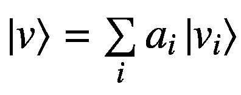那么对于一个线性算子，我们可以写成:

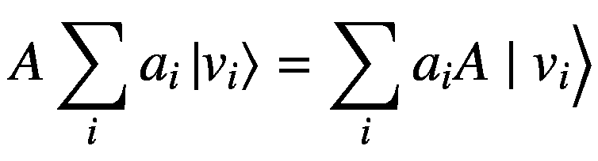

(2-4)

由于任何向量都可以表示为其基向量的线性和，所以要理解线性算子如何变换向量空间中的任何给定向量，知道线性算子如何变换其基向量就足够了。当向量| *v* ⟩和| *w* ⟩的维数匹配时，我们可以把 a 看成是从 *V* 到 *V* 的线性算子。

向量空间上的两个平凡算子是保持向量不变的恒等式 *I* 算子和将任何向量转换为零向量的零算子。

如果 *A* 是从向量空间 *V* 到向量空间 *W* 的线性算子，如果 *B* 是从向量空间 *W* 到向量空间 *Y* 的线性算子，那么可以通过将向量| *v* ⟩ ∈ *V* 映射到向量|*y*的合成来定义线性算子 *BA*

## 将线性算子解释为矩阵

向量可以用底层基来表示。例如，当我们将一个量子位的状态|*ψ*⟩=*α*|0⟩+*β*|1⟩表示为![$$ \left[\begin{array}{c}\alpha\ \\ {}\beta \end{array}\right] $$](img/495362_1_En_2_Chapter_TeX_IEq2.png)时，这个量子位的列向量表示是关于基向量|0⟩和|1⟩.的类似地，矩阵表示相对于两个基的线性变换:一个基用于它操作的输入向量空间，另一个基用于它线性变换输出的向量空间。除非特别说明，给定的矩阵表示相对于通常基的变换。假设我们有一个线性算子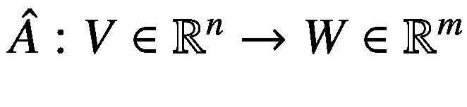，我们使用一个矩阵 *A* 的维度 *m* × *n* 来实现线性运算的功能。同样，假设矩阵 *A* 分别表示相对于输入和输出基*b*t18】1 和*b*t22】2 的变换，其中*b*t26】1 由基向量|*ϕ*t30】0⟩、|*ϕ*t34】1⟩….组成|*ϕ**n*—1⟩和 *B* 2 组成基矢| * ω *  0  ⟩，|*ω*1⟩…|*ω**m*—1⟩.我们现在尝试在*B*B1中的每个基本向量和*B*B2中的基本向量之间建立联系。任何基矢|*ϕ**k*⟩在其自身基 *B* 1 中都会被表示为第 *k* 行中除 1 以外全为 0 的列矢，如下所示:

![$$ {\left|{\phi}_k\right\rangle}_{B_1}=\left[\begin{array}{c}0\\ {}..\\ {}1\\ {}..\\ {}0\end{array}\right]\leftarrow index\ k $$](img/495362_1_En_2_Chapter_TeX_Equ6.png)

(2-6)

在等式 [2-6](#Equ6) 中，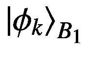代表| * ϕ *  * k *  ⟩相对于基 *B* 1 的表示。

因此，| *ϕ* *k* ⟩相对于基 *B* 1 的变换将产生∣ *w* ⟩相对于基 *B* 2 的向量，如下所示:

![$$ {\left|w\right\rangle}_{B_2}=\hat{A}\left|{\phi}_k\right\rangle =A{\left|{\phi}_k\right\rangle}_{B_1}=A\left[\begin{array}{c}0\\ {}..\\ {}1\\ {}..\\ {}0\end{array}\right]=\left[\begin{array}{c}{a}_{0k}\\ {}{a}_{1k}\\ {}..\\ {}{a}_{\left(m-1\right)k}\end{array}\right] $$](img/495362_1_En_2_Chapter_TeX_Equ7.png)

(2-7)

现在如果我们想把向量扩展到通常的基表示∣ *w* ⟩，我们可以这样做，如下所示:

![$$ \left[|{\omega}_1\Big\rangle\ |{\omega}_2\Big\rangle .|{\omega}_m\Big\rangle\ \right]{\left|w\right\rangle}_{B_2}=\left[|{\omega}_1\Big\rangle\ |{\omega}_2\Big\rangle .|{\omega}_m\Big\rangle\ \right]\left[\begin{array}{c}{a}_{0k}\\ {}{a}_{1k}\\ {}..\\ {}{a}_{\left(m-1\right)k}\end{array}\right]=\sum \limits_{i=0}^{m-1}{a}_{ik}\mid {w}_i\Big\rangle $$](img/495362_1_En_2_Chapter_TeX_Equ8.png)

(2-8)

如果我们把等式 [2-7](#Equ7) 和 [2-8](#Equ8) 组合起来，我们得到如下:

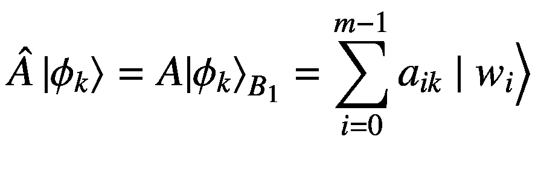

(2-9)

因此，等式 [2-9](#Equ9) 捕捉了线性算子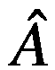的基元或其对应矩阵 *A* 相对于两个基的关系。一般来说，线性算子也可以被认为是关于通常基的矩阵。在本书中，我们不会对线性算子和它对应的矩阵做任何区分。除非另有说明，矩阵变换将是关于通常的基础。在量子力学中，线性算子是方阵，因此向量空间 *V* 上的线性算子可以被认为是从 *V* 到 *V* 的变换。此外，对于形式为*A*:*V*→*V*的线性算子，如果没有明确规定，我们将假设通常的基础。

既然我们在定义线性算符和它们对应的矩阵时特别注重基础，让我们花些时间来了解量子位状态的通常基础。对于单量子位系统，通常的基矢是|0⟩ = [1 0] *T* 和|1⟩ = [0 1] *T* 。

类似地，对于两个量子位的系统，通常的基向量将是各个量子位通常的基状态的张量积，即，| *i* ⟩ ⊗ ∣ *j* ⟩，其中 *i* 表示量子位 1 的通常的基状态， *j* 表示量子位 2 的通常的基状态。我们可以有四种这样的组合:|0⟩ ⊗ |0⟩、|0⟩ ⊗ |1⟩、|1⟩ ⊗ ∣ 0⟩和|1⟩ ⊗ ∣1⟩.它们的列向量表示可以通过展开张量积得到。下面举个例子:|1⟩⊗|0⟩=[0 1]*t*⊗[1 0]*t*=[0 0 1 0]*t*。一般来说，对于一个*n*-量子位系统，将有 2 个 *n* 形式的基态向量|*k**o*⟩⊗|*k*1⟩⊗|*k*2⟩…⊗∣*k**n*

得到一个*n*-量子比特基态|*k**o*⟩⊗|*k*1⟩⊗|*k*2⟩…⊗∣*k**n*⟩的列向量表示 可以将二进制字符串*k**o**k*1*k*2…*k**n*-1展开为其对应的十进制数，并在 2  * n 的列向量中设置与 *k* 对应的条目*

## 用外积表示的线性算子

我们可以从向量空间 *V* 到 *W* 定义一个线性算子 *A* 为∣ *w* ⟩⟨ *v* ∣其中|*v*⟩*v*和|*w*⟩*w*。我们来看看线性算子 *A* 对任意向量的作用|*v*t22】1⟩∈*v*。

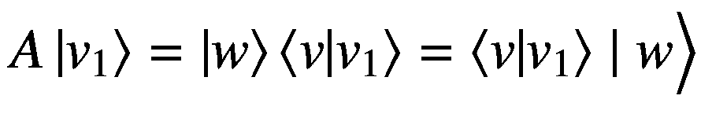

(2-10)

从方程 [2-10](#Equ10) 中，线性算子的作用可以解释为取向量空间 *V* 中的任意向量到向量| *w* ⟩ ∈ *W* 的缩放版本。缩放基于任意向量∣*v*T10】1⟩∈v 与向量∣*v*⟩*v*的重叠程度。如果*v*1⊥*v*，即 *v* 1 与 *v* 2 正交，那么输入矢量将映射到 *W* 中的零矢量。

在等式 [2-10](#Equ10) 中需要注意的另一件有趣的事情是，线性算子 *A* 只会沿着向量∣ *w* ⟩.在一维上投影向量这实质上意味着线性算子 *A* 的秩是 1。

假设向量空间 *V* 的维数为 *m* ，向量空间 *W* 的维数为 *n* 。还假设 *m* ≥ *n* 。我们可以定义一个线性运算符*B*:*V*→*W*来生成跨越整个 *W* 的向量，如下所示:

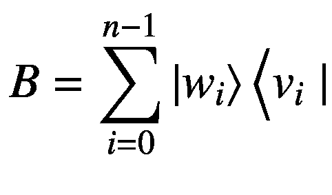

(2-11)

向量∣*w**I*⟩∈*w*和向量|*v**I*⟩∈*v*被选择为线性无关。现在如果我们取任意向量|*v**k*⟩∈*v*，线性算子 *B* 对它的作用可以写成:

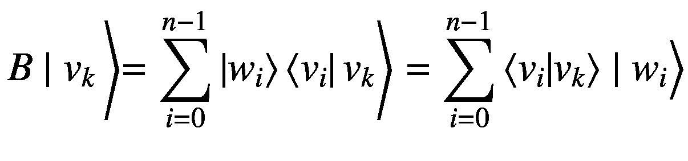

(2-12)

术语⟨*v**I*|*v**k*⟩表示输入向量|*v**k*⟩与每个向量|*v**I*⟩∈*v*的重叠，最终输出向量表示为

如果我们有正交基矢集，∣*ϕ*T2】1⟩，∣*ϕ*T6】2⟩，…∣*ϕ**n*⟩，他们个人的外积之和会给出这里所示的单位矩阵:

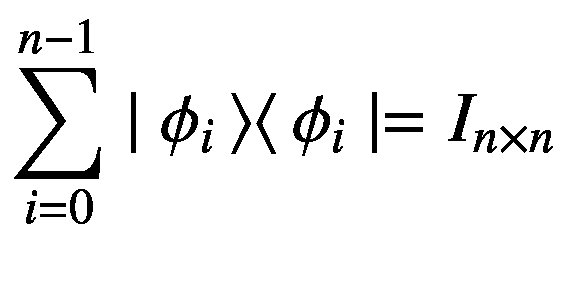

(2-13)

方程 [2-13](#Equ13) 被称为*完备关系*。

## Pauli 算子及其外积表示

我们在第 [1](1.html) 章简单地提到了泡利矩阵。四个泡利矩阵相对于计算基础∣0⟩和∣1⟩.是线性算子

我们可以用外积表示来表示每个泡利矩阵。四个泡利矩阵如下图:

![$$ {\sigma}_0=I=\left[\begin{array}{cc}1&amp; 0\\ {}0&amp; 1\end{array}\right] $$](img/495362_1_En_2_Chapter_TeX_Equa.png)

![$$ {\sigma}_x=X=\left[\begin{array}{cc}0&amp; 1\\ {}1&amp; 0\end{array}\right] $$](img/495362_1_En_2_Chapter_TeX_Equb.png)

![$$ {\sigma}_y=Y=\left[\begin{array}{cc}0&amp; -i\\ {}i&amp; 0\end{array}\right] $$](img/495362_1_En_2_Chapter_TeX_Equc.png)

![$$ {\sigma}_z=Z=\left[\begin{array}{cc}1&amp; 0\\ {}0&amp; -1\end{array}\right] $$](img/495362_1_En_2_Chapter_TeX_Equ14.png)

(2-14)

将泡利矩阵表示为外积的最简单的方法是确定当由泡利矩阵操作时计算基态向量的变换。例如，如果我们取泡利矩阵*∑**z*，它把基态∣0⟩变换成∣0⟩，把基态∣1⟩变换成∣1⟩.因此，根据等式 [2-11](#Equ11) ，我们可以写出如下:

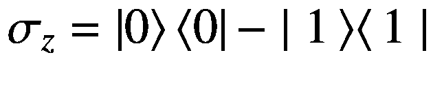

(2-15)

按照同样的程序，我们可以用外积形式表示其他泡利矩阵，如下所示:

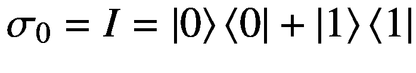

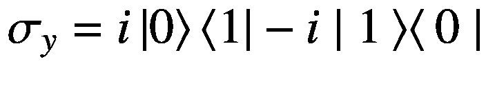

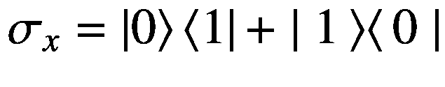

(2-16)

## 线性算子的特征向量和特征值

向量空间 *V* 上的线性算子 *A* 的特征向量是向量∣ *v* ⟩使得*a*∣*v*⟩=*λ*∣*v*⟩.这里， *λ* 为特征值，∣ *v* ⟩为特征值 *λ* 对应的特征向量。图 [2-2](#Fig2) 显示了一个特征向量的变换。

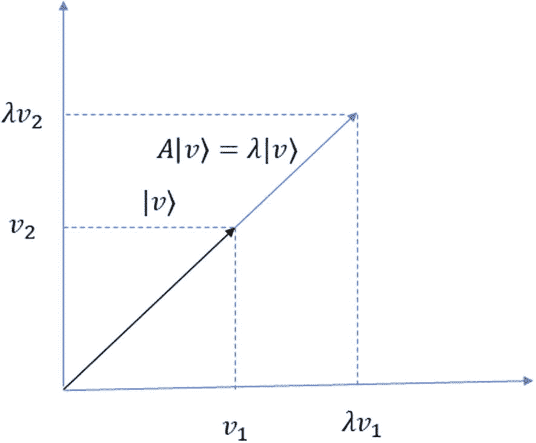

图 2-2

特征向量和特征值

通过求解由 det |*A**λI*| = 0 给出的特征方程，可以找到线性算子 *A* 的特征值。线性算子 *A* 的特征方程对应的特征函数定义为*c*(*λ*)= det∣*a*—*λI*∣.特征方程自然来自特征向量方程，如下:

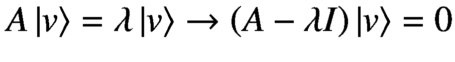

(2-17)

方程 [2-17](#Equ17) 可以有两个解，平凡的一个是| *v* ⟩ = 0。然而，更有趣的解决方案是当(*A*-*λI*)的列向量不是线性独立时。在这种情况下，矩阵(*A*-*λI*)不是满秩的，因此其行列式*det*(*A*-*λI*)应该为零。这给了我们著名的特征值解的特征方程如下:

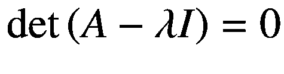

(2-18)

将求解特征方程得到的特征值代入*a*∣*v*⟩=*λ*∣*v*⟩，找到对应的特征向量。

## 算子的对角表示

如果用∣ *k* ⟩表示的算子 *A* 的特征向量是正交的，并且它们对应的特征值用 *λ* *k* 表示，那么算子 *A* 可以表示为:

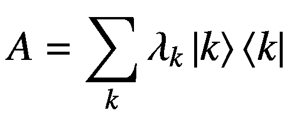

(2-19)

这种表示被称为算子的*对角表示*。如果相对于作为基础的特征向量以对角矩阵形式表示算子，则对应于算子 *A* 的矩阵将是对角的。不是所有的矩阵或算子都有对角表示。这里所示的线性算子 *A* 相对于通常的计算基础有一个对角表示:

![$$ A=\left[\begin{array}{cc}3&amp; 0\\ {}0&amp; 4\end{array}\right]=3\times \left|0\right\rangle \left\langle 0\right|+4\left|1\right\rangle \Big\langle 1\mid $$](img/495362_1_En_2_Chapter_TeX_Equ20.png)

(2-20)

在这种情况下，特征向量是对应于特征值 3 和 4 的∣0⟩和∣1⟩。

让我们考虑另一个算符，其关于通常基的表示由泡利矩阵**x*给出。*

*![$$ {\sigma}_x=\left[\begin{array}{cc}0&amp; 1\\ {}1&amp; 0\end{array}\right] $$](img/495362_1_En_2_Chapter_TeX_Equ21.png)*

*(2-21)

求解![$$ \mathit{\det}\ \left|\left[\begin{array}{cc}0&amp; 1\\ {}1&amp; 0\end{array}\right]-\lambda I\right|=0 $$](img/495362_1_En_2_Chapter_TeX_IEq7.png)得到矩阵的特征值*λ*T3】1= 1 和*λ*2= 1。对应于 *λ*  1  = 1 的特征向量为![$$ \left|{\lambda}_1\right\rangle ={\left[\frac{1}{\sqrt{2}}\ \frac{1}{\sqrt{2}}\right]}^T $$](img/495362_1_En_2_Chapter_TeX_IEq8.png)，对应于*λ*2= 1 的特征向量为![$$ \left|{\lambda}_2\right\rangle ={\left[\frac{1}{\sqrt{2}}-\frac{1}{\sqrt{2}}\right]}^T $$](img/495362_1_En_2_Chapter_TeX_IEq9.png)。此外，特征向量彼此正交。这个泡利矩阵*σ*T22】x本身不是对角的；然而，它可以表示为相对于基向量|*λ*t27】1⟩和|*λ*t31】2⟩.的对角矩阵同样对应的矩阵表示如下:

![$$ \left[\begin{array}{cc}{\lambda}_1&amp; 0\\ {}0&amp; {\lambda}_2\end{array}\right]=\left[\begin{array}{cc}1&amp; 0\\ {}0&amp; -1\end{array}\right] $$](img/495362_1_En_2_Chapter_TeX_Equ22.png)

(2-22)

对角矩阵本质上具有作为其对角线的特征值。

## 算子的伴随

希尔伯特空间中算子 *A* 的伴随算子*a*T2 是另一个算子使得对于任意两个向量| *v* 1 ⟩，|*v*2⟩∈*v*，以下关系成立:

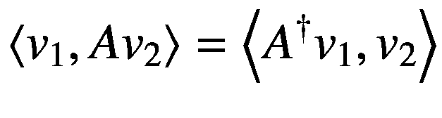

(2-23)

伴随算子也被称为埃尔米特共轭算子。在第 [1](1.html) 章中，我们将伴随算子称为算子的共轭转置，因为如果我们引用算子的矩阵符号，这就是它的精确含义。向量| *v* ⟩的共轭转置，我们记为⟨ *v* |在伴随符号中也可以表示为|*v*⟩。

伴随算子的一些性质概述如下:

*   对于两个线性算子 *A* 和 *B* ，(*AB*)=*B**A*。

*   算子的伴随算子的伴随算子返回相同的算子。换句话说，(*A*)=*A*。

*   一般来说，算子 *A* 和它的伴随算子*A*T4 不相等。同样，一般情况下，算子 *A* 与其伴随不交换；即*AA*一般不等于*A**A*。

## 自伴或埃尔米特算子

当一个算子 *A* 等于它的伴随算子，即*A*=*A*T6】+时，则称该算子为*自伴*或*厄米算子*。厄米算符的一些相关性质如下:

*   厄米算符总是有实特征值。

*   对于不是退化的厄米算子，即每个特征值仅对应于一个特征向量，厄米算子的特征向量彼此正交。

下面的矩阵 *A* 是埃尔米特算子的一个例子:

![$$ A=\left[\begin{array}{cc}1&amp; 3-4i\\ {}3+4i&amp; 2\end{array}\right] $$](img/495362_1_En_2_Chapter_TeX_Equ24.png)

(2-24)

## 正规算子

如果一个线性算子 *A* 与它的伴随算子*A*T4 交换，则称它是正规的。所以，对于一个正常的操作者来说，*AA*=*A*A。下面概述了普通运算符的一些重要属性:

*   埃尔米特算子 *A* 自然是正规算子，因为对于埃尔米特算子 *A* = *A* + ，因此关系*AA*+A=*A*+T14+T16】A 总是成立的。然而，一个正常的运营商不需要埃尔米特。

*   正常的操作者允许一个*光谱分解。*在谱分解形式中，可以将正规算子 a 表示为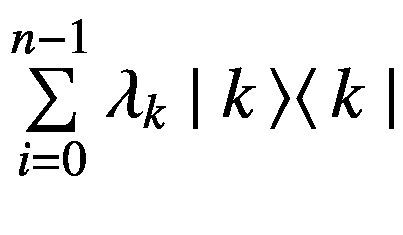，其中 *λ* * k * 代表对应于特征向量∣ * k * ⟩.的特征值我们将在随后的章节中更详细地研究频谱分解。

## 酉算子

我们在第 [1](1.html) 章详细讨论了幺正算符，因为量子系统状态上允许的所有变换本质上都应该是幺正的。对于任意一个酉算子 *U* ，我们知道*UU*+U=+U*U*=*I*，这就自动满足了正常算子的条件:*UU*+T20】U+T22+T24】U= 0。因此，所有酉算子都是正规算子。

因此，正规算子族包含厄米算子和酉算子，如图 [2-1](#Fig1) 所示。同样，几个酉算子可以是厄米的，反之亦然。例如，哈达玛矩阵既是酉矩阵又是埃尔米特矩阵。

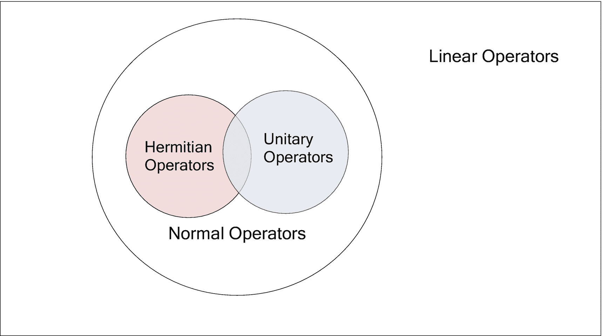

图 2-3

线性算子维恩图

## 线性算子的谱分解

任何正规矩阵 *A* 都可以写成对角表示，如下图:

(2-25)

这被称为线性算子的*谱分解*，其中正常算子的特征值和对应的特征向量分别由 *λ* *k* 和| *k* ⟩。我们在第 [1 章](1.html)中广泛使用的 Hadamard 门是一个普通运算符。提醒您一下，Hadamard 算子的矩阵表示由![$$ H=\frac{1}{\sqrt{2}}\left[\begin{array}{cc}1&amp; 1\\ {}1&amp; -1\end{array}\right] $$](img/495362_1_En_2_Chapter_TeX_IEq11.png)给出

*H* 的特征值为 *λ* 1 = 1 和*λ*2= 1。对应的特征向量是![$$ \left|{\lambda}_1\right\rangle =\left[\begin{array}{c}\frac{1}{\sqrt{4-2\sqrt{2}}}\\ {}\frac{1}{\sqrt{2\sqrt{2}}}\end{array}\right] $$](img/495362_1_En_2_Chapter_TeX_IEq12.png)和![$$ \left|{\lambda}_2\right\rangle =\left[\begin{array}{c}\frac{1}{\sqrt{4+2\sqrt{2}}}\\ {}-\frac{1}{\sqrt{2\sqrt{2}}}\end{array}\right] $$](img/495362_1_En_2_Chapter_TeX_IEq13.png)。

特征向量彼此正交，这可以通过它们的内积为零的事实来验证(见下文):

![$$ \left\langle {\lambda}_1|{\lambda}_2\right\rangle ={\left[\frac{1}{\sqrt{4-2\sqrt{2}}}\kern0.5em \frac{1}{\sqrt{2\sqrt{2}}}\right]}^T\left[\frac{1}{\sqrt{4+2\sqrt{2}}}\kern0.5em -\frac{1}{\sqrt{2\sqrt{2}}}\right]=0 $$](img/495362_1_En_2_Chapter_TeX_Equ26.png)

(2-26)

频谱分解表示确实给出了哈达玛算子，如下所示:

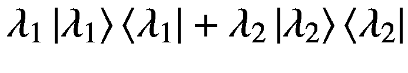

![$$ =\left[\begin{array}{c}\frac{1}{\sqrt{4-2\sqrt{2}}}\\ {}\frac{1}{\sqrt{2\sqrt{2}}}\end{array}\right]\left[\frac{1}{\sqrt{4-2\sqrt{2}}}\kern0.5em \frac{1}{\sqrt{2\sqrt{2}}}\right]-\left[\begin{array}{c}\frac{1}{\sqrt{4+2\sqrt{2}}}\\ {}-\frac{1}{\sqrt{2\sqrt{2}}}\end{array}\right]\left[\begin{array}{cc}\frac{1}{\sqrt{4+2\sqrt{2}}}&amp; -\frac{1}{\sqrt{2\sqrt{2}}}\end{array}\right] $$](img/495362_1_En_2_Chapter_TeX_Equg.png)

![$$ =\frac{1}{\sqrt{2}}\left[\begin{array}{cc}1&amp; 1\\ {}1&amp; -1\end{array}\right] $$](img/495362_1_En_2_Chapter_TeX_Equ27.png)

(2-27)

## 线性算子的迹

线性算子的迹可以定义为其对角线元素的和。矩阵迹的一些性质如下:

*   线性算子的特征值之和等于算子的迹。

*   如果∣ *u* ⟩和∣ *v* ⟩是向量空间中的两个向量 *V* 和 *A* 是 *V* 上的一个算子，那么我们有这个:

    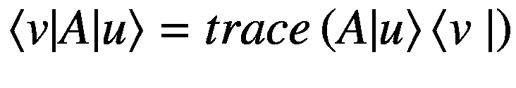

    (2-28)

    正如我们将在整本书中看到的，线性算子的轨迹的前一个属性在量子计算中会派上用场。

*   对于两个线性算子 *A* 和 *B* :

    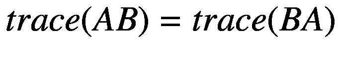

    (2-29)
*   对于两个线性算子 *A* 和 *B* :

    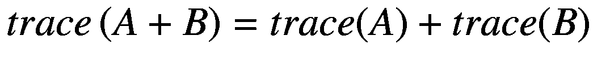

    (2-30)
*   对于线性算子 *A* 和常数 *k* ∈ *ℂ* :

    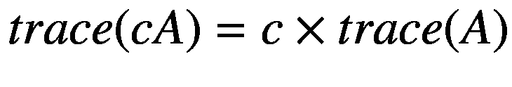

    (2-31)
*   线性算子的迹对于酉相似变换是不变的:

    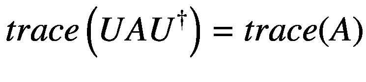

    (2-32)

## 向量张量积上的线性算子

如果 *A* 和 *B* 分别是向量空间 *V* 和 *W* 中向量∣ *v* ⟩和∣ *w* ⟩上的线性算子，那么向量| *v* ⟩ ⊗ ∣ *w* ⟩上的线性算子由 *A* ⊗ *B* 给出。

线性算子 *A* ⊗ *B* 作用于| *v* ⟩ ⊗ | *w* ⟩如下:

(2-33)

所以， *A* ⊗ *B* be 可以认为是由 *V* ⊗ *W* 给出的向量空间 *V* 和 *W* 的张量积上的线性算子。

对于任意两个向量|*v*⟩∈*ℝ*t5】m和|*w*⟩∈*ℝ**n*，正如我们已经讨论过的，我们计算它们的张量积如下:

![$$ \left|v\right\rangle \otimes \left|w\right\rangle =\left[\begin{array}{c}{v}_1\\ {}{v}_2\\ {}.\\ {}.\\ {}{v}_m\end{array}\right]\otimes \left[\begin{array}{c}{w}_1\\ {}{w}_2\\ {}.\\ {}.\\ {}{w}_n\end{array}\right]=\left[\begin{array}{c}{v}_1\mid w\Big\rangle \\ {}{v}_2\left|w\right\rangle \\ {}\dots \\ {}{v}_m\mid w\Big\rangle \end{array}\right] $$](img/495362_1_En_2_Chapter_TeX_Equ34.png)

(2-34)

例如，![$$ \left|v\right\rangle =\left[\begin{array}{c}1\\ {}2\end{array}\right] $$](img/495362_1_En_2_Chapter_TeX_IEq14.png)和![$$ \left|w\right\rangle =\left[\begin{array}{c}3\\ {}4\\ {}5\end{array}\right] $$](img/495362_1_En_2_Chapter_TeX_IEq15.png)的张量积如下:

![$$ \left|v\right\rangle \otimes \left|w\right\rangle =\left[\begin{array}{c}1\\ {}2\end{array}\right]\otimes \left[\begin{array}{c}3\\ {}4\\ {}5\end{array}\right]=\left[\begin{array}{c}1\left[\begin{array}{c}3\\ {}4\\ {}5\end{array}\right]\\ {}2\left[\begin{array}{c}3\\ {}4\\ {}5\end{array}\right]\end{array}\right]=\left[\begin{array}{c}3\\ {}4\\ {}5\\ {}6\\ {}8\\ {}10\end{array}\right] $$](img/495362_1_En_2_Chapter_TeX_Equ35.png)

(2-35)

同样，维数为 *m* × *n* 和维数为 *p* × *q* 的两个矩阵 *A* 的张量积可以写成:

![$$ A\otimes B=\left[\begin{array}{ccc}{a}_{11}B&amp; \cdots &amp; {a}_{1n}B\\ {}\vdots &amp; \ddots &amp; \vdots \\ {}{a}_{m1}B&amp; \cdots &amp; {a}_{mn}B\end{array}\right] $$](img/495362_1_En_2_Chapter_TeX_Equ36.png)

(2-36)

为了说明两个矩阵的张量积，让我们以泡利矩阵 *X* 和 *Y* 为例，根据等式 [2-36](#Equ36) 计算它们的张量积。

![$$ X\otimes Y=\left[\begin{array}{cc}0&amp; 1\\ {}1&amp; 0\end{array}\right]\otimes \left[\begin{array}{cc}0&amp; -i\\ {}i&amp; 0\end{array}\right] $$](img/495362_1_En_2_Chapter_TeX_Equh.png)

![$$ =\left[\begin{array}{cc}0\left[\begin{array}{cc}0&amp; -i\\ {}i&amp; 0\end{array}\right]&amp; 1\left[\begin{array}{cc}0&amp; -i\\ {}i&amp; 0\end{array}\right]\\ {}1\left[\begin{array}{cc}0&amp; -i\\ {}i&amp; 0\end{array}\right]&amp; 0\left[\begin{array}{cc}0&amp; -i\\ {}i&amp; 0\end{array}\right]\end{array}\right] $$](img/495362_1_En_2_Chapter_TeX_Equi.png)

![$$ =\left[\begin{array}{cccc}0&amp; 0&amp; 0&amp; -i\\ {}0&amp; 0&amp; i&amp; 0\\ {}0&amp; -i&amp; 0&amp; 0\\ {}i&amp; 0&amp; 0&amp; 0\end{array}\right] $$](img/495362_1_En_2_Chapter_TeX_Equ37.png)

(2-37)

两个线性算子 *A* 和 *B* 的张量积的几个性质如下:

*   *A* ⊗ *B* 的复共轭由(*a*⊗*b*)∑=*a*∑⊗*b*∑给出。

*   *A* ⊗ *B* 的转置由(*a*⊗*b*)*t*=*a**t*⊗*b**t*给出。

*   *A* ⊗ *B* 的复共轭或共轭由(*a*⊗*b*)=*a*⊗*b*给出。

## 正规算子的函数

任何正规算子 *A* 都可以根据其谱分解表示为其中 *λ* * i * 表示特征值，∣*λ**I*⟩表示相应的特征向量。因此， *A* 上的任意函数 *f* 可以定义为对其特征值起作用，如下所示:

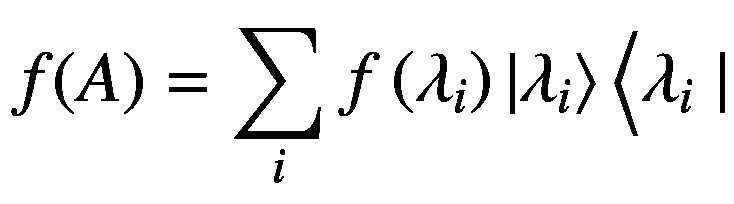

(2-38)

指数函数在量子力学中是最重要的，这一点我们将在本章后面的量子力学基本原理中看到。我们可以如下定义正规算子 a 上的指数函数，其中*c*∑*ℂ*是任意常数。根据等式 [2-38](#Equ38) ，我们可以将 exp( *cA* )写成如下:

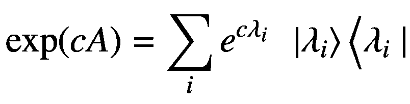

(2-39)

另一种在一般线性算子上定义指数函数的方法是，不需要对正常算子做任何假设，将它的指数展开记为:

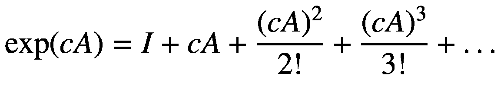

(2-40)

现在，如果我们把 *A* 作为一个普通的算子，使得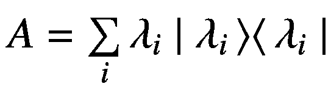我们可以写如下:

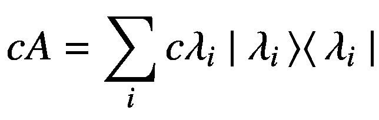

(2-41)

平方 *cA* 从方程 [2-41](#Equ41) ，我们得到如下:

(2-42)

由于正规算子的特征向量对于每个外索引 *i* 彼此正交，所以只有当 *j* 等于 *i* 时，点积⟨*λ*T4】t5】IT7】|*λ*t11】jt13】⟩才会非零。假设特征向量被选择为正交的，等式 [2-42](#Equ42) 简化为如下:

(2-43)

用同样的方法展开高阶项可以看出，对于任意阶的 *k* ，我们有这样的:

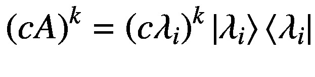

(2-44)

利用方程 [2-43](#Equ43) ，我们可以将方程 [2-40](#Equ40) 表示为:

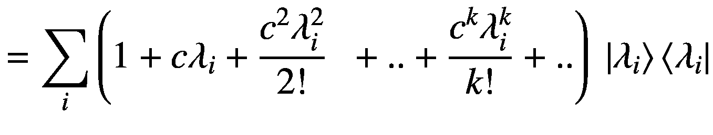

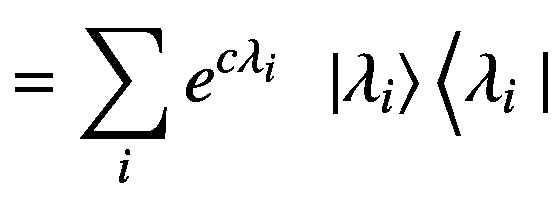

(2-45)

## 换位子和反换位子运算符

两个线性算子 *M* 和 *N* 的换位子算子如下:

![$$ \left[M,N\right]= MN- NM $$](img/495362_1_En_2_Chapter_TeX_Equ46.png)

(2-46)

对于两个交换的算符，换位子算符为零。如果两个算子对换，可以同时对角化。

两个线性算子 *M* 和 *N* 的反换位子算子是这样的:

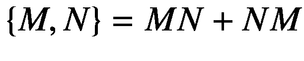

(2-47)

两个矩阵 *M* 和 *N* 的乘积可以表示为换位子和反换位子算符的和，如下图:

![$$ MN=\left[M,N\right]+\kern0.5em \left\{M,N\right\} $$](img/495362_1_En_2_Chapter_TeX_Equ48.png)

(2-48)

## 量子力学的假设

在这一节，我们将讨论量子力学的基本假设。这些假设充当了物理量子世界和量子力学数学公式之间的桥梁。

### 假设 1:量子态

量子系统的状态由复希尔伯特空间中的矢量| *ψ* ⟩表示。希尔伯特空间是配有由内积导出的范数的完备向量空间。

*   状态向量∣ *ψ* ⟩包含了量子系统在给定时间的所有信息。

*   状态向量是单位向量，因此状态向量的范数是 1；即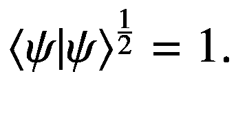

*   基于我们选择的基础，状态可以代表不同的物理可观测量。例如，我们可以相对于∣0⟩和∣1⟩计算基础状态来看量子位状态，并将量子位表示为|*ψ*⟩=*α*|0⟩+*β*∣1⟩.这里 *α* 和 *β* 是对应于|0⟩和|1⟩状态的概率振幅，量子位处于∣0⟩和|1⟩.的叠加态对于自旋电子量子位，状态 0 和 1 对应于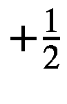和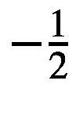自旋状态。所以，| * α * | 2 表示电子处于自旋态的概率，而| * β * | 2 表示电子处于态的概率。同样，我们可以将∣ + ⟩和∣-⟩基中的量子比特态| * ψ * ⟩表示为|*ψ*⟩=*γ*|+⟩+*η*∣\\,其中| * γ * | 2 和| * η * | 2 表示量子比特的概率

### 假设 2:量子进化

封闭量子系统的状态在幺正算符的影响下演化。一个量子系统从时间 *t* 0 到 *t* 1 的状态演化可以写成:

(2-49)

在方程 [2-49](#Equ49) ， *U* ( *t* 1 ， *t* 0 )是将量子系统从状态|*ψ*(*t**o*)⟩到| *ψ* ( *t* 的幺正算符

#### 量子态时间演化的薛定谔方程

让我们试着看看幺正算符 *U* ( *t* 1 ， *t* 0 )是如何与量子力学中最重要的方程之一:薛定谔方程联系起来的。

根据薛定谔方程，封闭系统的量子态按照以下方程演化:

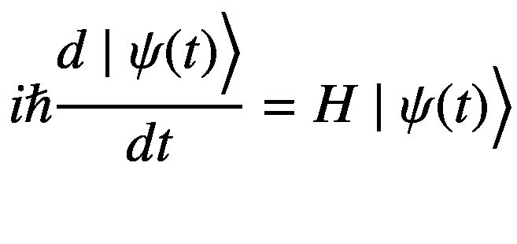

(2-50)

在上式中， *ℏ* 是归一化的普朗克常数，并且等于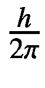，其中 *h* 是普朗克常数。术语 *H* 在这里指的是封闭量子系统的哈密顿量，不要与哈达玛变换混淆。哈密顿量是厄米算符，因此具有如下的谱分解:

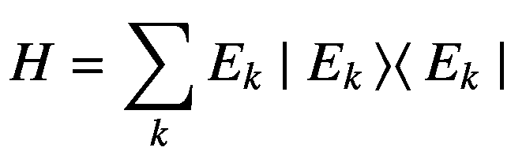

(2-51)

特征值有意表示为 *E* *k* 来表示能量。我们用∣ *E* *k* ⟩.来表示相应的本征态一个处于最低能量状态的量子系统将处于本征态∣*e**min*⟩对应的最小能量本征值*e**min*。由于哈密顿算符是厄米算符，我们只能有实能级。

薛定谔方程的解由下面给出:

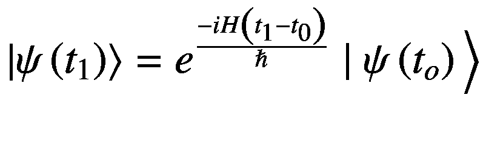

(2-52)

表达式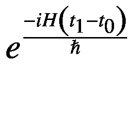是取一个哈密顿量为 *H* 的量子系统从状态|*ψ*(*t*T7】0)⟩在时间*t*t11】0 到|*ψ*(*t*t17】1)⟩在时间*t*t21】1。正是等式 [2-49](#Equ49) 中的酉运算符*U*(*t*1， *t* 0 )，因此我们可以这样说:

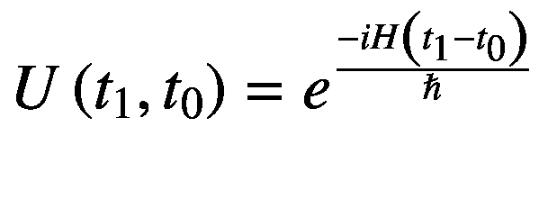

(2-53)

酉进化算子的一些性质如下:

*   如果哈密顿算符的谱分解为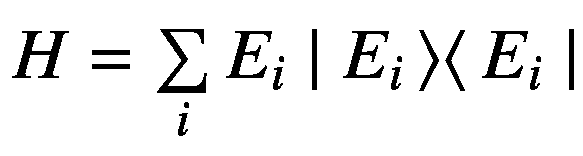，那么*U*(*t*T5】1，*t*T9】0 的谱分解如下:

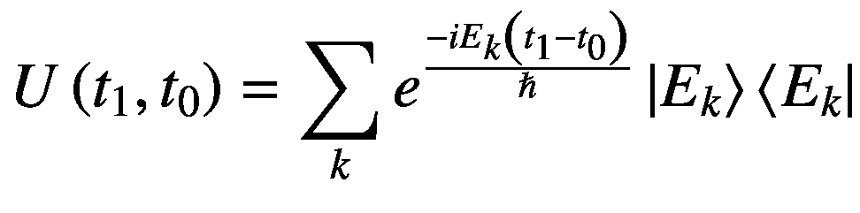

(2-54)

基本上， *U* ( *t* 1 ， *t* 0 )与*h 具有相同的特征向量∣*e**k*特征值是哈密顿特征值 *E* * k * 。*

### 假设 3:量子测量

我们早先已经确定，我们可以用一个合适的正交基来表示状态，这个正交基代表某些可测量的物理量。态| *ψ* ⟩一般可以表示为这些正交基态的叠加。如果我们试图在∣0⟩和|1⟩基态中测量量子位的状态，给定量子位是|*ψ*⟩=*α*|0⟩+*β*∣1⟩，测量将产生状态 0 或 1 之一。

*   测量产生状态 0 的概率是| *α* | 2 ，而状态 1 的概率是| *β* | 2 。

*   量子位的测量后状态是测量的基础状态。例如，如果我们再次测量∣0⟩的量子位状态，我们将得到∣0⟩.的相同状态

当我们进行测量时，量子系统不再是封闭的，因为它与测量过程相互作用。因此，在测量时，量子态不再根据薛定谔方程演化。

### 通用测量运算符

量子态的测量| *ψ* ⟩是根据测量算符的集合{*m**k*} =*m*0，*m*1…*m**m*—1来定义的。这些测量操作员处理被测系统的状态∣ *ψ* ⟩。结果 *k* 的测量运算符由运算符 *M* *k* 定义，测量结果为 *k* 的概率由下式给出:

(2-55)

量子系统在测量结果 *k* 后的状态由下式给出:

(2-56)

度量运算符{ *M* *k* }应满足完备性方程，如下所示:

(2-57)

这个完备性等式来自于这样的事实，即属于集合{ *M* *k* }中不同测量算子的概率之和应该等于 1。通过对等式 [2-55](#Equ55) 中所示的不同结果的概率求和，也可以证明这一点。

(2-58)

只有当等于单位矩阵 *I* 时，方程 [2-58](#Equ58) 中的关系才成立。

到目前为止，我们还没有对这些测量算子{ *M* *k* }的结构做任何假设。只要它们满足完备性方程并产生有效的正概率值，它们就是有效的度量算子。现在让我们看看，当你打算测量不同的计算基态时，如何定义这些测量算符。如果使用正交计算基状态{ |*ϕ**k*⟩}，那么可以将度量运算符定义为*m**k*= |*ϕ**k*⟩⟨*ϕ**k*|。很容易验证，对于一个状态∣ *ψ* ⟩表示为计算基础{ |*ϕ*t35】k⟩}为测量运算符*m**k*= |*ϕ**k*⟩⟨*ϕ**k*

**

**

*(2-59)*

属于给定正交基的度量算子遵循完备性方程，如下所示:

(2-60)

测量运算符的一些重要属性如下:

*   测量算子是厄米算子。

*   度量算子 *M* *k* 本质上是幂等的，即实际上对于一个幂等矩阵来说，其中 *N* 是大于 1 的任意整数。幂等属性是测量运算符 *M* * k * 的期望属性。这是因为一旦进行了测量 *k* 之后，状态就崩溃到状态|*ϕ*t20】t21】kt23】⟩关于结果 *k* ，因此无论我们测量系统多少次，我们都应该始终测量状态|*ϕ*t28】t29】kt31】⟩.

*   通过测量算符，我们可以可靠地区分正交正态。如果我们有一个标准正交基|*ϕ*T2】0⟩，|*ϕ*T6】1⟩，。。∣*ϕ**n*—1⟩，我们可以为每个正交基向量定义形式为*m**k*=∣*ϕ**k*⟩⟨*ϕ**k*∣的度量算子。对于任何给定的状态|*ϕ**k*⟩，只有测量算子状态*m**k*=∣*ϕ**k*⟩⟨*ϕ**k*∣能够以概率 1 检测到它，如下所示:

(2-61)

现在我们来说一下基础集|*ϕ*T2】0⟩，|*ϕ*T6】1⟩，。。∣*ϕ**n*—1⟩是非正交的，我们像以前一样定义测量算子*m**k*=∣*ϕ**k*⟩⟨*ϕ**k*∣用于检测结果 *k 现在由于状态是非正交的，即使是除了∣*ϕ**k*⟩之外的一个基准状态，用∣*ϕ*—*k*⟩表示，也可以与∣*ϕ**k*ԍ(即〃*⒇*有非零重叠 因此测量算子 *M* *k* 检测到除了 *k* 之外的状态的概率是非零的。*

**

*(2-62)*

### 投影测度算子

投影测量是一种将单个测量操作符 *P* 0 ， *P* 1 ，…。*p**n*—1对应的正交基向量| *ϕ* 0 ⟩，| *ϕ* 1 ⟩，。。∣*ϕ*t24】T25】n1⟩.射影测量算子 *M* 是厄米算子，其具有由下面给出的表示:

(2-63)

注意，虽然运算符 *P* 0 ， *P* 1 ，…*P**N*—1关于单个基态是酉的，射影测量算符 *M* 不是酉算符。

既然*p**k*=∣*ϕ**k*⟩⟨*ϕ**k*∣算符 *P* * k * 可以认为是将算符 *M* 的特征值投影到算符*的特征空间上*

在测量状态∣ *ψ* ⟩时测量结果 *k* 的概率由下式给出:

(2-64)

给定结果 *m* 发生的后测量状态由下面给出:

(2-65)

单个投影仪操作符 *P* *m* 是幂等的，即。幂等性确保了如果结果 *k* 出现在状态∣ * ψ * ⟩的测量上，那么在测量后状态的重复测量上，将观察到相同的结果 *k* 。此外，由于概率总和必须为 1，因此投影算子遵循完备性方程，如下所示:

(2-66)

现在，为了使方程 [2-66](#Equ66) 成立，必须等于单位矩阵，这给出了投影算子的完备性方程如下:

(2-67)

投影算子 *P* *k* ，在服从完备性方程并产生有效概率的同时，应遵循以下关系:

(2-68)

本质上，等式 [2-68](#Equ68) 表示投影操作将一般状态向量∣ *ψ* ⟩投影到正交子空间中。这可以很容易地验证，因为对于*m*≦*n*从等式 [2-68](#Equ66) 我们有如下:

(2-69)

等式 [2-69](#Equ69) 中的 0 *N* × *N* 属于全 0 项的 *N* × *N* 方阵。

同样，当*P**n*=*P**m*时，我们有如下:

(2-70)

因此，从方程 [2-69](#Equ69) 和方程 [2-70](#Equ70) 中，我们看到方程 [2-68](#Equ68) 中的关系成立。

投影测量运算符在计算可由正交基表示的结果的统计属性时非常有用。例如，我们可以根据一个量子系统的状态| *ϕ* ⟩如下计算它的平均结果:

![$$ E\left[M\right]=\sum \limits_k kp(k) $$](img/495362_1_En_2_Chapter_TeX_Equ71.png)

(2-71)

让我们把测量基中的量子态表示为

胜负的概率 *k* 可以表示为*p*(*k*)=⟨*ψ*|*p**k*||*ψ*⟩自。使用这些信息，我们可以将测量操作符 *M* 的期望表达如下:

![$$ E\left[M\right]=\sum \limits_k kp(k)=\kern0.5em \sum \limits_kk\Big\langle \psi \mid {P}_k\left|\psi \right\rangle $$](img/495362_1_En_2_Chapter_TeX_Equq.png)

(2-72)

我们通常将与测量算子相关的结果的期望表示为⟨⟩.

标准差∈*M*可以用测量算子 *M* 表示如下:

![$$ {\left(\Delta  M\right)}^2=E\left[{M}^2\right]-E{\left[M\right]}^2=\left\langle {M}^2\right\rangle -{\left\langle M\right\rangle}^2 $$](img/495362_1_En_2_Chapter_TeX_Equ73.png)

(2-73)

投射算符 *M* 的标准偏差是对结果扩散的度量，如果人们要制作量子态∣ *ψ* ⟩的几个相同副本，并相对于测量算符 *M* 基向量进行测量。投影测量算子的标准偏差导致了著名的海森堡测不准原理，将在下一节中说明。

### 广义海森堡测不准原理

海森堡测不准原理给出了两个投影测量算子的标准偏差的乘积的下限，比如说给定一个量子态∣*ψ*⟩.的 *M* 和 *N*

假设我们有两个测量算符 *M* 和 *N* ，我们做了多个拷贝，比如说 2 个 *n* ，量子系统的精确态∣ *ψ* ⟩.现在，如果我们对算符 *M* 进行 *n* 测量，对算符 *N* 进行 *n* 测量，我们将看到 *M* 和 *N* 结果的标准偏差遵循以下关系:

![$$ \Delta  M\Delta  N\ge \frac{1}{2}\left\Vert \left\langle \psi \left|\left[M,N\right]\right|\psi \right\rangle \right\Vert $$](img/495362_1_En_2_Chapter_TeX_Equ74.png)

(2-74)

方程 [2-74](#Equ74) 称为广义海森堡测不准原理。

为了证明海森堡测不准原理，我们将进行一个数学插曲，看看柯西-施瓦兹不等式。参见图 [2-4](#Fig4) 。

图 2-4

三角形不等式

对于任意两个向量∣*v*T2】1⟩和∣*v*T6】2⟩，其范数之和大于其和的范数。这就是俗称的*三角形不等式*，表述如下:

(2-75)

现在如果我们平方这个三角形两边的表达式不等式，我们得到如下:

(2-76)

请注意，不等式的符号在平方时不会改变，因为三角形不等式处理的是两边向量的范数，而范数是非负的。除去不等式双方的共同术语，我们只剩下下面的表达式:

(2-77)

现在对于任意两个向量|*v*T2】1⟩和|*v*T6】2⟩∈*ℂ**n*在 n 维复向量空间中，我们有如下:

(2-78)

现在复数的实数部分的范数总是小于复数的范数，于是就有了这个:

(2-79)

这是复向量空间中向量的柯西-施瓦兹不等式，我们将用它来证明海森堡测不准原理。

首先， *M* 和 *N* 作为射影测度算子，是厄米的。让我们以∣ *ϕ* 1 ⟩和∣ *ϕ* 2 ⟩这两个状态为例，它们是对系统状态| *ψ* ⟩应用射影测量算子 *M* 和*的结果，定义如下:*

**

*(2-80)

(2-81)*

代入|*v*T2】1⟩为∣ *ϕ* 1 ⟩和| *v* 2 ⟩为∣ *ϕ* 2 ⟩，左边的柯西—史华兹可以简化为以下:

现在⟨*ψ*|*m*2|*ψ*⟩和⟨*ψ*|*n*|2|*ψ*⟩是测量操作者 *M* 2 和 *N* 2 对状态|的期望因此，我们可以根据度量算子的期望符号将方程 [2-82](#Equ82) 写成如下形式:

(2-83)

我们可以代入| *v* 1 ⟩与∣ *ϕ* 1 ⟩与| *v* 2 ⟩与∣ *ϕ* 2 ⟩右侧的柯西-施瓦茨不等式而得到

现在(*MN*-*NM*)是换位子算符[ *M* ， *N* ]，因此等式 [2-84](#Equ84) 可以表示为:

![$$ \left\Vert \left\langle {\phi}_1|{\phi}_2\right\rangle +\left\langle {\phi}_2|{\phi}_1\right\rangle \right\Vert =\left\Vert \left\langle \psi \left|\left[M,N\right]\right|\psi \right\rangle \right\Vert $$](img/495362_1_En_2_Chapter_TeX_Equ85.png)

(2-85)

利用柯西-施瓦茨不等式中的方程 [2-83](#Equ83) 和 [2-85](#Equ85) ，我们得到如下:

![$$ \to 2{\left\langle {M}^2\right\rangle}^{\frac{1}{2}}{\left\langle {N}^2\right\rangle}^{\frac{1}{2}}\ge \left\Vert \left\langle \psi \left|\left[M,N\right]\right|\psi \right\rangle \right\Vert $$](img/495362_1_En_2_Chapter_TeX_Equac.png)

![$$ \to {\left\langle {M}^2\right\rangle}^{\frac{1}{2}}{\left\langle {N}^2\right\rangle}^{\frac{1}{2}}\ge \frac{1}{2}\left\Vert \left\langle \psi \left|\left[M,N\right]\right|\psi \right\rangle \right\Vert $$](img/495362_1_En_2_Chapter_TeX_Equ86.png)

(2-86)

在这一点上，我们即将证明海森堡测不准原理。和可以被认为是操作者 *M* 和 *N* 的标准偏差，他们的期望值⟨ * M * ⟩和⟨ * N * ⟩为零。我们可以将方程 [2-86](#Equ86) 中的 *M* 和 *N* 分别替换为(m⟨*m*⟩)和(n⟨*n*⟩)来表达算子 *M* 和 *N* 的标准差。这样做，我们可以将方程 [2-86](#Equ86) 改写如下:

![$$ {\left\langle {M}^2\right\rangle}^{\frac{1}{2}}{\left\langle {N}^2\right\rangle}^{\frac{1}{2}}\ge \frac{1}{2}\left\Vert \left\langle \psi \left|\left[M,N\right]\right|\psi \right\rangle \right\Vert $$](img/495362_1_En_2_Chapter_TeX_Equad.png)

![$$ \to {\left\langle {\left(M-\left\langle M\right\rangle \right)}^2\right\rangle}^{\frac{1}{2}}{\left\langle {\left(N-\left\langle N\right\rangle \right)}^2\right\rangle}^{\frac{1}{2}}\ge \frac{1}{2}\left\Vert \left\langle \psi \left|\left[M-\left\langle M\right\rangle, N-\left\langle N\right\rangle \right]\right|\psi \right\rangle \right\Vert $$](img/495362_1_En_2_Chapter_TeX_Equ87.png)

(2-87)

换向器运算符[*m*——⟨*m*⟩，*n*——⟨*n*⟩]等于[ *M* ， *N* ]。如果我们将 *M* 的标准差，即用∈*M*表示，将 *N* 的标准差，即用∈*N*表示，那么从等式[2-87](#Equ87):

![$$ \Delta  M\Delta  N\ge \frac{1}{2}\left\Vert \left\langle \psi \left|\left[M,N\right]\right|\psi \right\rangle \right\Vert $$](img/495362_1_En_2_Chapter_TeX_Equ88.png)

(2-88)

对于两个测量算子 *M* 和 *N* ，等式 [2-88](#Equ88) 中的不等式是海森堡测不准原理的最一般版本。如果选择算符 *M* 和 *N* 为位置算符和动量算符，那么将换位子算符![$$ \left[\hat{x},\hat{p}\right]=\hat{x}\hat{p}-\hat{p}\hat{x}= i\mathit{\hslash} $$](img/495362_1_En_2_Chapter_TeX_IEq42.png)代入方程 [2-88](#Equ86) ，可以得到与位置和动量有关的海森堡测不准原理如下:

(2-89)

鼓励有兴趣了解量子力学更多细节的读者推导出关系式![$$ \left[\hat{x},\hat{p}\right]=\hat{x}\hat{p}-\hat{p}\hat{x}= i\mathit{\hslash} $$](img/495362_1_En_2_Chapter_TeX_IEq43.png)

### POVM 运算符

一般测量算子和投影测量算子不仅给出了测量各种结果概率的规则，而且给出了测量后状态的清晰表述。然而，在各种应用中，测量后的状态对于实验来说并不重要；衡量各种结果概率的能力是唯一重要的事情。在这种情况下，POVM 测量方案被证明是一个方便的公式。我们可以定义一个正算子 *E* *k* 使得在测量状态∣ *ψ* ⟩时 *k* 的结果概率如下:

(2-90)

希尔伯特空间 *V* 中的正算子 *A* 是满足⟨*ψ*|*a*|*ψ*⟩≥0 for every |*ψ*⟩∈*v*的算子。因此，确保算子 *E* *k* 为正，将确保我们得到由 *P* ( *k* ) ≥ 0 表示的概率。如果我们有我们感兴趣的 *N* 个结果，我们将不得不构建正算子 *E* *k* 以满足完备性方程；即运算符 *E* * k * 称为 POVM 元素，而全集{*E**k*}称为 POVM。与射影测量运算符{*P**k*}不同，POVM 运算符{*E**k*】不需要满足关系*E**n**E**m*=因此，正测量算子{*E**k*}并不局限于仅测量与一组正交基状态相关的结果。因此，在这个意义上，POVM 比投影测度算子更一般，而后者实际上是前者的一个特例。与其将投影测量作为 POVM 的特例，不如让我们来看看 POVM 不同于投影测量的更有趣的情况。假设我们想检测两个不一定正交的状态。我们可以把两个状态分别取为| * ψ *  1  ⟩ = ∣0⟩和。不用说，由于∣ * ψ *  1  ⟩和∣ * ψ *  2  ⟩.这两个国家之间的重叠，我们不可能完全确定地衡量这两个国家让我们按如下方式定义三个 POVM 元素，并看看如何最好地检测这两个事件:

(2-91)

如果测量的状态是|*ψ*T2】1⟩=|0⟩，那么*e*T6】1 将永远不会被观察到，因为它对应于正交状态∣1⟩.但是，如果检测到 *E* 1 ，我们可以有把握地推断，被测量的状态必须是类似线上的状态，如果检测到 *E* 2 ，则必须是状态| * ψ *  1  ⟩ = ∣ 0⟩.它不可能是状态，因为它正交于(| 0⟩−| 1⟩).当检测到*E*T24】3 时，我们无法肯定地说出被测状态。这里的中心点是，使用 POVM，我们永远不会错误地识别我们要测量的状态。只是有时我们无法确定我们所呈现的真实状态。

### 密度算子

到目前为止，我们一直使用状态向量| *ψ* ⟩来表示一个量子系统。量子系统也可以用密度算符 *ρ* 来表示。对于一个与周围环境隔离的量子系统，我们到目前为止一直在研究的纯量子态，密度算符只不过是状态向量∣ *ψ* ⟩与其自身的外积。于是，我们有了这个:

(2-92)

密度算子的迹为 1，如下图:

(2-93)

#### 混合量子态的密度算符

有时很难确定量子系统所处的确切量子状态。我们可以有一个量子态在 *n* 纯量子态∣ *ψ* *i* ⟩中的任一个具有经典概率 *p* *i* 。在这种情况下，密度算符就派上了用场，我们可以将这样一个混合量子态系统的密度算符定义如下:

(2-94)

因此，混合量子态的密度算符只不过是它的每个纯态的密度算符的平均值。

混合态的密度算符的迹也是 1。请看下面:

(2-95)

#### 混合量子态密度算符的演化

对于一个封闭的量子系统，态矢的演化由|*ψ*(*t*T4】2⟩=*u*(*t*T10】2，*t*t14】1)|*ψ*(*t*t20】1)⟩.给出让我们看看当系统处于混合态时，密度算符是如何演化的。注意，在混合量子态中，n 个不同的可能态∣、ψ、I 和⟩就像纯态一样演化。所以，如果系统处于状态∣*ψ**I*(*t*1)⟩以概率 *p* *i* 经过酉演化后，它将处于状态*u*(*t*2， *t* 所以，幺正演化后混合态的密度算符*ρ*T74】2 可以写成幺正演化后纯态的密度算符的平均值，如下所示:

(2-96)

#### 使用密度算子进行测量

假设我们有一个测量算子*M*T3】MT5】对应结果 *m* 。测量运算符*m**m*=∣*ϕ**m*⟩⟨*ϕ**m*∣对应基向量∣*ϕ**m*⟩.假设我们知道量子系统处于纯态∣*ψ*t34】t35】It37】⟩，则结局的概率 *m* 由条件概率*p*(*m*/*I*给出。

(2-97)

对所有不同的纯态求和的结果的概率由下面给出:

(2-98)

利用 trace 技巧，我们可以写出 = ，这样就把方程 [2-98](#Equ98) 简化为:

(2-99)

#### 密度操作员发布测量结果

如果我们测量结果 *m* ，那么由 *i* 索引的每个纯状态中的后测量状态将由下面给出:

(2-100)

对应的密度算子由下式给出:

(2-101)

测量结果 *m* 后的密度算子 *ρ* ( *m* ) 是在给定结果 *m* 的情况下对不同纯态的条件分布的期望，即*P*(*I*/*m*)。

(2-102)

现在 *P* ( *i* / *m* )可以使用等式 [2-97](#Equ97) 和 [2-99](#Equ99) 计算如下。

(2-103)

将方程 [2-103](#Equ103) 中的 *P* ( *i* / *m* )和方程 [2-101](#Equ101) 中的代入方程 [2-102](#Equ102) 中，我们得到如下:

(2-104)

#### 密度算符的混合态与纯态

在前面的章节中，我们看到了混合态和纯态在表象上的不同。然而，给定一个密度算符，我们可以通过检查密度算符平方的迹来检查它是纯态还是混合态。对于纯态，*tr*(*ρ*2)= 1，而对于混合态，*tr*(*ρ*2)<1。鼓励读者做数学来验证这一说法。

#### 多量子系统的联合密度算符

具有密度算符 *ρ* 1 ，*ρ*2……*ρ**n*的量子系统的密度算符 *ρ* 可以表示为一个张量积，如下所示:

(2-105)

例如，如果我们有两个量子比特，它们的密度算符为*ρ*T2】1 和*ρ*T6】2，那么这两个量子比特系统的密度算符由*ρ*=*ρ*1⊗*ρ*2给出。

#### 约化密度算子

假设我们有两个量子系统 *A* 和 *B* ，它们的组合密度算符由 *ρ* *AB* 给出。系统 A 的密度算子可以通过在 B 上取偏迹得到，如下所示:

(2-106)

给定一个状态*ρ**ab*=∣*ψ**a*1⟩⟨*ψ*t15】a2∣⊗|*ψ*t21】b1⟩⟨*ψ*t27】b2 *ψ**a*1⟩和∣*ψ**a*2⟩是系统对应的状态 *A* 和|*ψ**b*1⟩和∣*ψ**b*2

#### 贝尔态上的部分迹线

贝尔态的密度算符由下式给出:

(2-108)

对等式 [2-107](#Equ108) 中的项展开，我们得到如下:

(2-109)

我们可以进一步简化这四项中的每一项，并将它们表示为量子位基本密度算符的张量积。

T2】

现在对量子位 B 进行部分追踪，我们从方程 [2-110](#Equ108) 得到如下:

(2-111)

在方程 [2-111](#Equ111) 中，第二项和第三项将会消失，因为点积涉及到 *B* 的正交基态，这给了我们 *A* 的密度算符如下:

(2-112)

如果我们仔细观察 *A* 即的密度算符平方的轨迹，我们看到它不等于 1。

(2-113)

这意味着量子位 *A* 处于混合状态。这是一个有趣的观察结果，因为两个量子位的联合态处于纯态，而单个量子位处于混合态。这种奇怪的行为与量子纠缠现象有关。

#### 延期计量原则

在许多量子电路中，经常在电路的中间部分进行测量，测量的结果用于有条件地控制后续的量子门。例如，在第 [1](1.html) 章中，我们观察到在量子隐形传态电路中，对 Alice 的两个量子位的测量被用来控制 Bob 的量子位上的幺正算符。图 [2-5](#Fig5) 展示了量子隐形传态电路供参考，其中前两个量子位 *Q* 1 和 *Q* 2 属于爱丽丝，而量子位 *Q* 3 属于鲍勃。

图 2-5

通用量子门集

对爱丽丝量子位的测量产生 *M* 、T2【1】T3 和 *M* 、T6】 2 作为控制鲍勃量子位上酉运算和的测量结果。Alice 量子位的两个测量值都可以移到电路的末端，而不会影响结果，如图 [2-6](#Fig6) 所示。

图 2-6

利用量子隐形传态电路的延迟测量原理

实际上，在图 [2-5](#Fig5) 的量子隐形传态电路中，在测量爱丽丝的量子位时，我们得到经典信息 *M* 1 和*M*T8】2，这些信息用于有条件地控制相继应用于鲍勃量子位的幺正算符 *X* 和 *Z* 。在图 [2-6](#Fig6) 的量子隐形传态中，我们所做的不同之处在于，根据 Alice 量子位的量子信息(状态)对 Bob 量子位上的 *X* 和 *Z* 操作符进行调节，然后测量 Alice 量子位，直到电路结束。

有人可能会说图 [2-5](#Fig5) 中的量子电路更加直观和易于理解，因为它需要将经典信息从爱丽丝传递给鲍勃；然而，中心思想是图 [2-5](#Fig5) 和图 [2-6](#Fig6) 中的电路都是等效的。这种把测量推到电路末端的方法叫做*延迟测量原理*。

为了总结延迟测量状态的原理，可以将电路中间部分的测量移动到电路末端。此外，如果电路中间部分的测量用于经典地控制电路其他部分的幺正运算，它们可以被条件量子运算代替。延迟测量原理的一个结果是，测量与调节操作互换。

#### 逼近酉算子

在传统的计算模式中，一小组门，如与门、或门和非门，可以用来实现任何传统的功能。因此，这样一组门被认为是经典计算的通用门。在量子计算范例中，如果任何给定的幺正算符可以被由通用集合中的这些门组成的量子电路近似到任意精度，则一组门被认为是通用的。在第 [1](1.html) 章中，我们在实现一些量子算法的时候已经触及了 CNOT 门和哈达玛门。这两个门以及相位和门被认为是通用的，因为使用这些门可以将任何酉门近似到任意精度。图 [2-7](#Fig7) 显示了四个门及其酉变换，以供参考。

图 2-7

通用量子门集

现在让我们看看用一组离散的量子门来近似酉变换意味着什么。让我们对同一个状态∣ *ψ* ⟩进行两次酉变换 *U* 和 *V* ，其中 *U* 是我们想要实现的酉变换，而 *V* 是我们能够使用离散门集实现的酉变换。我们可以将用 *V* 逼近 *U* 的误差定义如下:

(2-114)

误差 *E* ( *U* ， *V* )，我们在方程 [2-114](#Equ114) 中可以看到，是用 *V* 代替 *U* 作为酉算子时，期望变换状态与实际变换状态之差的最大范数。还必须注意变换中的误差 *E* ( *U* ， *V* )与测量变换状态时的误差的关系。如果我们有一组 *n* 测量运算符 *M* 1 ， *M* 2 …。。、 *M* *n* 属于一个正交集合| *ϕ* 1 ⟩、| *ϕ* 2 ⟩、…。、|**n*⟩，则每个测量元素 *M* *k* 给出测量状态的概率为|**k*如果期望的酉算符 *U* 可以被模拟，那么∣*ϕ**k*⟩跟随状态的变换∣ *ψ* ⟩将产生概率*p**k**u*如下**

 **类似地，代替 *U* ，如果我们使用 *V* 作为对∣ *ψ* ⟩的酉变换，并接着使用测量运算符 *M* *k* 对基本状态∣*ϕ*T9】k⟩进行测量，那么测量状态∣*ϕ*t21】k

结合方程 [2-115](#Equ115) 和 [2-116](#Equ116) ，测量基态∣ *ϕ* *k* ⟩的概率误差可以写成:

(2-117)

如果我们用∣ *δ* ⟩来表示期望变换 U∣ *ψ* ⟩与实际变换 *V* ∣ *ψ* ⟩之差的*l*2 范数，那么我们就有了这个:

(2-118)

从方程 [2-118](#Equ116) 我们得到*u*∣*ψ*⟩= |*δ*⟩+*v*∣*ψ*⟩和⟨*ψ*∣*v*=⟨*ψ*∣*u*利用这些表达式对于 *U* ∣ *ψ* ⟩和⟨*ψ*∣*v*vt35】在方程 [2-117](#Equ117) 中，我们有这样的:

(2-119)

利用方程 [2-119](#Equ119) 上的柯西-施瓦茨不等式，我们得到如下:

(2-120)

现在| *δ* ⟩的最大范数是 *E* ( *U* ， *V* )，如公式 [2-114](#Equ114) 所示。这允许我们将方程 [2-120](#Equ118) 绑定为:

(2-121)

等式 [2-121](#Equ119) 中的不等式告诉我们，如果用 *E* ( *U* ， *V* )给出的 *V* 逼近一个算子 *U* 的误差小，那么实测概率与实际概率的差异也小。实际上误差的范数是以 *V* 逼近 *U* 的误差为上界，即 2 *E* ( *U* ， *V* )。

不等式推广到由一系列 *n* 酉算子*V*T20】1、*V*V2、…、 *U* *n* 逼近的一系列 *n* 酉算子 *U* 1 、*U*U2】U2】2、…、等通过归纳可以看出，与用一系列 *n* 酉运算进行近似相关的误差遵循以下关系:

(2-122)

为了证明这一点，我们先来证明由 *V* 1 、 *V* 2 近似的一列酉算子 *U* 1 、 *U* 2 的关系。误差*E*(*U*2*U*1，*V*2*V*1)可以表示为:

(2-123)

加减*v*2*u*1∣*ψ*⟩在等式右边的范数内然后应用三角不等式，我们有如下:

(2-124)

由于 *U* 1 和 *V* 2 是酉算子，它们对范数的贡献是 1，因此我们可以将方程 [2-124](#Equ124) 写成如下:

(2-125)

因此，我们看到对于 *n* = 2，该关系为真。通过归纳，我们可以将这种关系推广到任意一列酉算子 *U* 1 ， *U* 2 …， *U* *n* 近似为 *V* 1 ， *V* 2 ..*V*T26*n*T29】。

#### 索洛维-基塔耶夫定理

每当我们在寻找空间 *U* 中的近似元素时，我们都在寻找该空间中元素的更小子集 *W* ，这很容易实现。通过组合使用来自更小子集 *W* 的元素，我们形成了一个在 *U* 中密集的空间 *V* 。在拓扑学中，如果 *V* 的闭包等于集合 *U* ，则称子集 *V* 是 *U* 的稠密子集。非正式地说，密集集合 *V* 中的每个元素任意接近集合 *U* 中的一个元素。稠密集的最好例子是由 *ℚ* 表示的有理数集，它是由 *ℝ* 表示的实直线的子集。每个实数要么是有理数，要么任意接近于 1。使用 *V* 的元素以任意精度表示 *U* 的元素时， *U* 的密集子集 *V* 会很有用。例如，经典计算机只能处理有理数，因为比特是二进制表示的。然而，由于有理数形成实数直线 *ℝ* 的稠密子集，我们可以高精度地近似一个实数无理数。同样，在量子计算的情况下，可能的门的集合形成了一个连续体，并不总是能够用来自 *SU* ( *d* )的元素精确地构造一个门。

设 *SU* ( *d* )表示 d 维希尔伯特状态空间中的酉算子群。

solovay-kita ev 指出，如果 *V* ⊆ *SU* ( *d* )是逆闭的通用门族(即，如果*x*∑*v*，则*x*—1∑*v*和 *V* 生成 *SU* 的稠密子集) *ϵ* > 0，存在元素 *v* 1 ，*v*2…*v**k*∑*v*使得和因此，索洛瓦伊-基塔耶夫定理给出了对通用集合*所需门的近似数目的估计 逼近幺正算子的可接受误差越小，构建这种幺正门所需的通用集合中的门的数量就越大。*

#### ERP 悖论、局部实在论和贝尔不等式

在经典世界中，每当我们想到任何物体时，我们都假设该物体的物理性质是存在的，不管我们是否观察到它。对这样一个物体的任何测量仅仅揭示了它的物理性质。然而，根据量子力学，一个物体没有任何独立于其测量的物理属性。事实上，只有在系统上进行测量时，这种物理性质才会出现。这种对只在测量中拥有物理属性的物体的解释被称为*哥本哈根解释*。例如，根据量子力学，电子不具有任何特定的能级，如基态或激发态，除非测量特定的能级。量子力学给我们的是一组假设，告诉我们给定一个电子的状态，当测量时，电子处于特定状态的概率是多少。

1920 年至 1930 年期间，包括爱因斯坦在内的几位物理学家并不相信量子力学必须提供的这一新观点。著名论文《物理现实的量子力学描述能被认为是完整的吗？由爱因斯坦、罗森和波多尔斯基(统称为 EPR)详细阐述了一个思想实验来反驳哥本哈根解释。他们的论点基于量子纠缠的概念。让我们假设我们有一个角动量为零的量子系统，它同时发射两个光子 *P* 1 和*P*T6】2。由于光子具有自旋，角动量必须守恒，如果一个光子具有自旋向上的状态，另一个光子必须具有自旋向下的状态，以确保系统处于零角动量。我们把自旋向上的状态记为∣0⟩，把自旋向下的状态记为∣1⟩.这种现象被称为*纠缠*，其中两个光子不是独立的。假设每个光子粒子具有相同的处于自旋向上和自旋向下状态的倾向，则两个粒子的联合状态由给出。如果其中一个光子的自旋是已知的，则另一个光子的自旋是瞬时已知的。假设我们把光子分开 1 光年的大天文距离，大约是 9.46×1012km。如果我们测量其中一个光子 *P* 1 ，我们将有 50%的机会测量到自旋向上，50%的机会测量到自旋向下。现在假设我们测量到*p*t19】1 处于自旋状态的∣0⟩，然后我们快速测量，比如说在 1 秒钟内，pt23】2 的状态。我们看到光子*P*T27】2 将总是测量自旋。量子力学指出，粒子的状态不是预先确定的，只有在测量后才变得可用。这意味着 *P* 1 的测量信息必须传播得比光快得多，才能在 1 秒钟内到达 *P* 2 ，以便 *P* 2 能够根据测量时的降速条件调整其状态。EPR 认为，根据特殊相对定律，没有什么能比光传播得更快，这应该会使哥本哈根解释失效。这种理论化的违反特殊相对性被称为 *ERP 悖论*。

相反，ERP 提出了另一个可能的量子纠缠理论，该理论指出，两个光子的状态从一开始就被预先确定，光子 *P* 1 处于自旋向上的状态，光子 *P* 2 处于自旋向下的状态。这些信息隐藏在光子粒子的内部，所以当它们分开时，不会发生任何通讯。这被称为*局部隐变量理论*。这就好像两个光子粒子是一副手套，如果一个是左手的，另一个就是右手的。一旦我们找到了左手对，我们就知道宇宙中的另一对肯定是右手对。从 1935 年到 1964 年的近 30 年里，局部隐变量理论一直是量子力学的有效解释，直到爱尔兰物理学家约翰·贝尔出现在舞台上，并提出了一个实验，根据他著名的贝尔方程来验证局部隐变量理论是否正确。

要使 ERP 提出的主张无效，我们需要理解贝尔不等式。贝尔不等式不涉及量子力学。我们进行了一个思维实验，以推导贝尔不等式，对普通世界如何运作或爱因斯坦、波多尔斯基和罗森认为自然应该如何服从有类似的感受。我们用一个量子力学分析来跟进这个共同世界分析，以表明它与共同世界分析不一致。

我们进行了如图 [2-8](#Fig8) 所示的实验，裁判 Colin 为 Alice 和 Bob 准备了两个粒子，并将粒子发送给他们进行测量。

图 2-8

贝尔不等式的实验装置

一旦爱丽丝收到她的粒子，她可以选择测量与可观测的 *Q* 有关的物理性质*P*T3】QT5】，或者她可以选择测量与可观测的 *R* 有关的物理性质 *P* *R* 。Alice 收到她的粒子后，扔出一枚硬币来决定她想要测量的属性。

如图 [2-8](#Fig8) 所示，每个物性测量可以有两种结果:+1 或-1。与 Alice 类似，Bob 在接收到他的粒子时会测量两个物理属性中的一个*P*T5】S或 *P* *T* 属于可观测的 *S* 和 *T* 。在收到粒子之前，鲍伯不会预先选择他要测量的性质。Alice 和 Bob 同时进行测量，因此一方的测量结果不会改变另一方的测量结果。

我们现在来看看这个简单的量(*QS*+*RS*+*RT*-*QT*)并尝试计算它的期望值。关于简化表达式，我们得到如下:

(2-126)

从等式 [2-126](#Equ126) 中，很容易看出在某一时刻 *S* ( *Q* + *R* )或*T*(*R*-*Q*)中的任何一个都是非零的，并且非零值将是+2 或-2。于是:

(2-127)

对于任何由 *Q* = *q* 、 *R* = *r* 、 *S* = *s* 、 *T* = *t* 给出的爱丽丝和鲍勃粒子的广义测量状态，我们期望得到*QS*+*RS*+*RT*-*QT*

现在既然和的期望等于期望的和，我们可以把方程 [2-128](#Equ128) 改写如下:

![$$ \mathbbm{E}\left[ QS\left]+\mathbbm{E}\left[ RS\right]+\mathbbm{E}\left[ RT\right]-\mathbbm{E}\right[ QT\right]\le 2 $$](img/495362_1_En_2_Chapter_TeX_Equ129.png)

(2-129)

方程 [2-129](#Equ127) 被称为*贝尔不等式*。这个结果也被称为 CHSH 不等式，以它的四个发明者的首字母命名。

现在让我们来分析一下，对于量子系统，贝尔不等式是否成立。这里科林准备了两个量子比特的纠缠量子态如下:

(2-130)

科林将第一个量子位传给爱丽丝，将第二个量子位传给鲍勃进行测量。爱丽丝对可观测量 *Q* 和 *R* 进行测量，我们分配如下:

(2-131)

同样，鲍勃对可观测量 *S* 和 *T* 进行测量，我们分配如下:

(2-132)

在方程 [2-131](#Equ131) 和 [2-132](#Equ132) ， *Z* 和 *X* 是泡利矩阵。就像之前一样，我们在量子力学的意义上计算了关于纠缠态∣的期望值例如，![$$ \mathbbm{E}\left[ QS\right] $$](img/495362_1_En_2_Chapter_TeX_IEq62.png)相对于状态| * ψ * ⟩可以表述如下:

![$$ \mathbbm{E}\left[ QS\right]={\left\langle Q\otimes S\right\rangle}_{\psi }=\left\langle \psi \left|Q\otimes S\right|\psi \right\rangle $$](img/495362_1_En_2_Chapter_TeX_Equay.png)

![$$ =\frac{1}{\sqrt{2}}\left(\right\langle 01\mid -\left\langle 10\mid \right)\left[\begin{array}{cc}1&amp; 0\\ {}0&amp; -1\end{array}\right]\otimes \left[\begin{array}{cc}0&amp; 1\\ {}1&amp; 0\end{array}\right]\frac{1}{\sqrt{2}}\left(\left|01\right\rangle -|10\Big\rangle \right) $$](img/495362_1_En_2_Chapter_TeX_Equba.png)

(2-133)

计算![$$ \mathbbm{E}\left[ QS\left]+\mathbbm{E}\left[ RS\right]+\mathbbm{E}\left[ RT\right]-\mathbbm{E}\right[ QT\right] $$](img/495362_1_En_2_Chapter_TeX_IEq63.png)中每一项的期望值，我们会看到如下:

![$$ \mathbbm{E}\left[ QS\right]=\mathbbm{E}\left[ RS\right]=\mathbbm{E}\left[ RT\right]=\frac{1}{\sqrt{2}\kern0.5em } $$](img/495362_1_En_2_Chapter_TeX_Equbb.png)

![$$ \mathbbm{E}\left[ QT\right]=-\frac{1}{\sqrt{2}} $$](img/495362_1_En_2_Chapter_TeX_Equ134.png)

(2-134)

因此，![$$ \mathbbm{E}\left[ QS\left]+\mathbbm{E}\left[ RS\right]+\mathbbm{E}\left[ RT\right]-\mathbbm{E}\right[ QT\right] $$](img/495362_1_En_2_Chapter_TeX_IEq64.png)的总体期望结果如下:

![$$ \mathbbm{E}\left[ QS\left]+\mathbbm{E}\left[ RS\right]+\mathbbm{E}\left[ RT\right]-\mathbbm{E}\right[ QT\right]=2\sqrt{2} $$](img/495362_1_En_2_Chapter_TeX_Equ135.png)

(2-135)

在等式 [2-129](#Equ129) 中，我们可以看到，使用普通世界如何工作或者 ERP 如何感知世界的敏感度给了我们一个上界期望![$$ \mathbbm{E}\left[ QS\left]+\mathbbm{E}\left[ RS\right]+\mathbbm{E}\left[ RT\right]-\mathbbm{E}\right[ QT\right] $$](img/495362_1_En_2_Chapter_TeX_IEq65.png)为 2。然而，我们可以看到，量子力学对期望![$$ \mathbbm{E}\left[ QS\left]+\mathbbm{E}\left[ RS\right]+\mathbbm{E}\left[ RT\right]-\mathbbm{E}\right[ QT\right] $$](img/495362_1_En_2_Chapter_TeX_IEq67.png)产生了一个值，这违反了贝尔不等式。这意味着我们在推导贝尔不等式时所做的一个或多个假设一定是错误的。贝尔不等式或爱因斯坦、罗森和波多尔斯基在这方面可能做出的错误假设可以总结如下:

*   *现实性假设*:假设物理性质具有不依赖于观察或测量的确定值

*   *位置假设*:假设 Alice 执行她的测量不影响 Bob 的测量结果

这两个假设合在一起被称为*局部实在论*，违反贝尔不等式证明其中至少有一个肯定是错的。因此，我们从违反贝尔不等式中学到的是，尽管局部现实主义符合我们的日常经验，但它并不适用于世界如何在最基本的层面上运作。根据最近的实验证据，物理学家的结论是，局域性和实在论中的一个或两个应该从我们对世界的常识性观点中去掉，以获得对量子力学的深刻直觉理解。

## 哈密尔顿模拟和特里特尔化

量子系统在常数哈密顿量 *H* 下的演化由薛定谔方程给出。薛定谔方程的解给出了态矢∣ * ψ * ⟩在时间*t*T7】0 和 *t* 之间的幺正演化为|*ψ*(*t*1)⟩=*u*(*t*1， *t* 

在哈密顿模拟中，给定一个哈密顿量 *H* 和一个演化时间 *t* ，我们需要组合一系列门来实现酉算符。哈密顿模拟是使用绝热计算的算法的一个重要组成部分，例如我们将在第 [7](7.html) 章中研究的量子近似优化算法(QAOA)。大多数物理系统中的哈密顿量可以表示为仅仅几个粒子的局部相互作用之和。这样，对于一个 *n* 体量子系统，我们可以把哈密顿量写成如下:

(2-136)

每一个 *H* *k* 哈密顿量往往就像两个身体的相互作用一样简单。这里要强调的一点是，比酉算子*e**iHt*更容易用量子门构建，因为它在局部级别上作用于更小的子系统。如果我们能够表达，那么轻松构建的能力将会非常有用。然而，一般来说，是因为一般来说单个局域哈密顿量不可交换，即*H**k**H**l*≦*H**l**H**k*。事实证明，即使两个哈密顿量 *H* 1 和 *H* 2 不交换，也可以利用 Trotter 公式模拟单个哈密顿量来模拟整体哈密顿量。

两个埃尔米特矩阵 *H* 1 和 *H* 2 的托特公式表示如下:

(2-137)

我们来试着推导一下托特公式的证明。首先，可以展开为:

(2-138)

O 的*(。)表示大 O 的计算复杂度。*

结合对和的展开，我们得到以下结果:

(2-139)

取方程 [2-139](#Equ137) 两边的 n 次方，我们有这个:

![$$ =I+\sum \limits_{k=1}^n\left(\genfrac{}{}{0pt}{}{n}{k}\right)\ \frac{{\left(-1\right)}^k}{n^k}\left[i\Big(\ {H}_1+{H}_2\right)t\Big]{}^k\kern0.5em +O\left(\frac{1}{n}\right) $$](img/495362_1_En_2_Chapter_TeX_Equ1138.png)

(2-140)

通过一点计算，我们可以将简化为如下:

(2-141)

利用方程 [2-141](#Equ139) ，我们可以将 [2-140](#Equ138) 简化如下:

![$$ {\left({e}^{\frac{-i{H}_1t}{n}}{e}^{\frac{-i{H}_2t}{n}}\right)}^n=I+\sum \limits_{k=1}^n\frac{\left[-i\Big(\ {H}_1+{H}_2\right)t\Big]{}^k}{k!}\kern0.5em +O\left(\frac{1}{n}\right) $$](img/495362_1_En_2_Chapter_TeX_Equ1140.png)

(2-142)

取 [2-140](#Equ1138) 两侧的极限 *n* → ∞我们得到这个:

![$$ =\underset{n\to \infty }{\lim }I+\sum \limits_{k=1}^n\frac{\left[-i\Big(\ {H}_1+{H}_2\right)t\Big]{}^k}{k!}\kern0.5em +O\left(\frac{1}{n}\right) $$](img/495362_1_En_2_Chapter_TeX_Eqube.png)

![$$ =\underset{n\to \infty }{\lim }\ \sum \limits_{k=0}^n\frac{\left[-i\Big(\ {H}_1+{H}_2\right)t\Big]{}^k}{k!}\kern0.5em +O\left(\frac{1}{n}\right) $$](img/495362_1_En_2_Chapter_TeX_Equbf.png)

(2-143)

基于 Trotter 公式，可以通过在如下的 *H* 1 和 *H* 2 之间交替获得的一系列酉算子来实现酉算子:

(2-144)

如果哈密顿量 *H* 1 和 *H* 2 比*H*=*H*1+*H*2更容易模拟，那么应用 [2-142](#Equ1140) 中的幺正算子序列证明是有用的命题。

Trotter 公式可以推广到两个以上哈密顿量之和。例如，如果我们有*H*=*H*1+*H*2+*H*3，我们可以通过酉算子的序列如下推演出 *H* 的酉演化:

(2-145)

## 摘要

至此，我们来到第 [1](2.html) 章的结尾。在这一章中，我们主要讲述了量子力学的数学及其基本原理，以便更好地帮助我们理解和实现不同的基于量子的算法以及量子机器学习。我们详细研究了测量及其不同的变体，如投影测量和 POVM，因为测量是基于量子的算法的一个组成部分。此外，我们讨论了线性代数中对量子力学表述很重要的特定主题。

在下一章中，我们将学习前两章的知识，实现几种基于量子计算的算法，例如量子隐形传态、Deutsch–Jozsa、Grover 算法和 Bernstein–Vazirani 等。我们将在 Google 的`Cirq`和 IBM 的`Qiskit`中实现这些量子算法。****