# 3.量子算法导论

> *“如果你认为你懂量子力学，那你就是不懂量子力学。”*
> 
> —理查德·费曼

1981 年，理查德·费曼提出了一个想法，即由遵守量子力学定律的量子力学元件构建的计算机可以有效地模拟量子系统。量子计算的工作原理是量子力学性质的定律，如叠加、纠缠和干涉。与经典计算不同，在量子计算机中，由于叠加特性，寄存器可以同时存在于所有可能的状态中。只有当一个量子系统被测量时，我们才观察到一个可能的状态。这种系统是有利的，因为当测量时，每个状态可以以在测量之前的状态中编码的某个概率出现。量子计算的工作原理是将期望状态的概率增加到足够高的值，这样就可以用最少的测量次数获得高置信度的期望状态。在这方面，由量子叠加产生的量子干涉起了很大的作用，因为它允许对应于给定状态的概率振幅相互干涉和抵消。量子干涉的这一特性使测量偏向于我们希望作为量子算法结果的一组状态。同样，量子纠缠允许人们在量子对象之间建立强关联，尤其是量子位，这有利于量子算法，正如你将在本章中看到的。

在这一章中，我们将着眼于量子算法，目的是理解这些算法相对于经典算法的量子优势。我们已经在第 [1](1.html) 章中看到了量子隐形传态算法和利用量子并行性制定算法的方法。在这一章中，我们将实现其他几个量子计算算法，如 Deutsch Jozsa、贝尔不等式、Bernstein–Vajirani 算法和 Grover 算法，以扩大我们理解的量子算法的范围。对于这些新算法，我们将在实现之前首先研究它们的技术推导。我们将使用谷歌的`Cirq`作为实现这些算法的量子计算框架。然而，我们将在 IBM 的`Qiskit`中实现其中的一些算法，以获得多量子计算框架的经验。在这些量子计算框架中实现这些量子计算算法将为我们提供一个不同的视角，并有助于填补我们在研究其技术细节时可能存在的任何空白。

## Cirq

`Cirq`是谷歌研究院于 2018 年发布的开源量子计算软件库。开发人员可以构建和运行包含所有相关一元、二元和三元门的量子算法。Cirq 目前不提供对谷歌量子计算机的访问。我们将使用`Cirq's`量子计算模拟器，称为模拟器，在本地执行量子算法。

## 带哈达玛门的 Cirq 仿真

让我们先通过一个简单的量子电路模拟来熟悉`the Cirq`语言。在`Cirq`语言中，量子位通常使用`a LineQubit`或`GridQubit`选项来定义。`LineQubit`允许你在一维晶格上定义量子位，而`GridQubit`允许你在二维晶格上定义量子位。

使用`Cirq's GridQubit`功能，我们定义了一个在基态|0⟩初始化的量子位，并对其应用哈达玛变换![$$ H=\frac{1}{\sqrt{2}}\left[\begin{array}{cc}1&amp; 1\\ {}1&amp; -1\end{array}\right] $$](img/495362_1_En_3_Chapter_TeX_IEq1.png)。Cirq 中的 Hadamard 变换定义为`H`本身。然后，我们使用`Cirq`中的测量功能`measure`测量计算基础中的新状态。Measurement 并不要求您像许多其他量子计算软件包那样，显式定义一个经典寄存器来存储测量结果。在`Cirq`中，量子比特上的所有操作都以量子`circuit`的形式定义。一旦定义了电路，您就可以使用 Cirq `Simulator`对相同的电路进行 100 次仿真，并测量结果。Cirq 有`histogram`工具来获取每个测量结果的计数。量子电路中任何状态的测量都可以和一把钥匙联系起来。一旦模拟器运行，就可以通过键访问结果，正如您在清单 [3-1](#PC1) 中看到的例子。

```py
# Import the Package cirq
import cirq
# Define a Qubit
qubit = cirq.GridQubit(0,0)

# Create a Cirquit in cirq
circuit = cirq.Circuit([cirq.H(qubit),
                       cirq.measure(qubit,key='m')])
print("Circuit Follows")
print(circuit)
sim = cirq.Simulator()
output = sim.run(circuit,repetitions=100)
print("Measurement Output:")
print(output)
print("Histogram stats follow")
print(output.histogram(key='m')

Listing 3-1Measurements After a Hadamard Transform on a Qubit Using Cirq

```

**输出:**

```py
Circuit Follows

(0, 0): ───H───M('m')───
Measurement Output:
m=1000111111111101111011100101000101011000010000110110101000101100111011101001001001000000010000001000
Counter({0: 54, 1: 46})

```

你可以从清单 [3-1](#PC1) 的输出中看到，在测量处于相等叠加态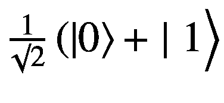的量子位的相同副本时，我们在状态 0 得到 54 个测量值，在状态 1 得到 46 个测量值，如图 [3-1](#Fig1) 所示。

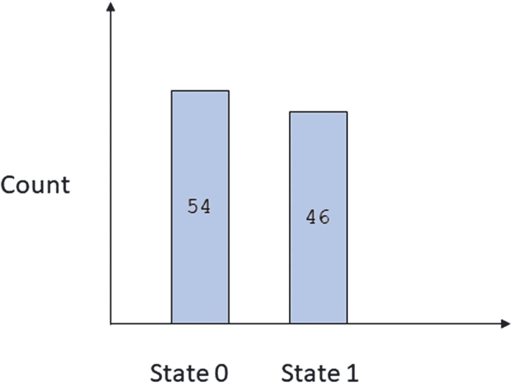

图 3-1

测量时状态 0 和 1 的计数

正如预期的那样，在两个计算基础状态 0 和 1 上，分布几乎是均匀的。如果我们增加我们进行测量的拷贝数，每个状态的概率将趋向于如果 *n* 是我们进行测量的量子态的拷贝数，并且 *P* <sub> * n * </sub> (0)和*P*<sub>*n*</sub>(1)是从这些 *n* 拷贝的测量中确定的概率，那么下面成立:

现在让我们针对不同的 *n* 值模拟前面的代码，看看概率序列如何收敛到它们的理想值。

我们创建一个名为`hadamard_state_measurement`的函数来计算不同的 *n* 的概率，如清单 [3-2](#PC3) 所示。

```py
# Import the Package cirq
import cirq
import matplotlib.pyplot as plt

def hadamard_state_measurement(copies):
    # Define a Qubit

    qubit = cirq.GridQubit(0, 0)
    # Create a Circuit in cirq
    circuit = cirq.Circuit([cirq.H(qubit)
             ,cirq.measure(qubit, key="m")])
    print("Circuit Follows")
    print(circuit)
    sim = cirq.Simulator()
    output = sim.run(circuit, repetitions=copies)
    res = output.histogram(key='m')
    prob_0 = dict(res)[0] / copies
    print(prob_0)
    return prob_0

def main(copies_low=10, copies_high=1000):
    probability_for_zero_state_trace = []
    copies_trace = []
    for n in range(copies_low, copies_high):
        copies_trace.append(n)
        prob_0 = hadamard_state_measurement(n)
        probability_for_zero_state_trace.append(prob_0)
    plt.plot(copies_trace, probability_for_zero_state_trace)
    plt.xlabel('No of Measurements')
    plt.ylabel("Probability of the State 0")
    plt.title("Convergence Sequence of Probability for State 0")
    plt.show()

if __name__ == '__main__':
    main()

Listing 3-2Measurement Convergence to Expected Probability of Outcomes

```

在清单 [3-2](#PC3) 中，我们从状态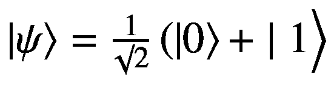的相同副本的不同测量来计算状态∣0⟩的概率。从图 [3-2](#Fig2) 中的曲线图可以看出，随着拷贝数从 100 增加到 500，状态∣0⟩的概率随着振荡的减小逐渐向理论值收敛。

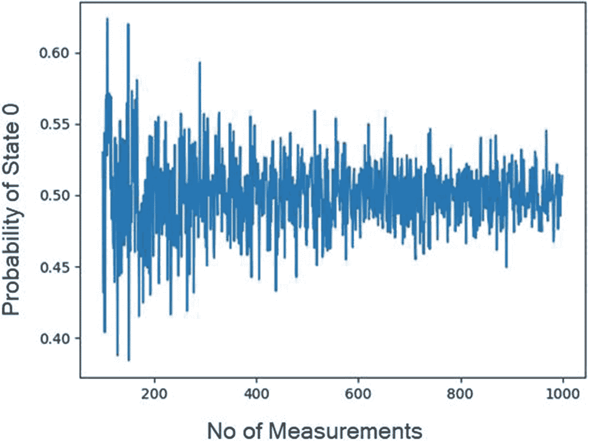

图 3-2

随着测量次数的增加，概率收敛

## Qiskit

`Qiskit`是 IBM 于 2017 年发布的开源量子计算软件库。Qiskit 代表量子信息科学工具包，其量子计算堆栈中有四个主要组件，如下所示:

1.  `Qiskit Terra` `:`这为构建量子电路提供了所有必不可少的元件。

2.  使用 Aer 工具，您可以开发噪声模型来模拟真实量子计算设备中可能发生的真实噪声模拟。Aer 还提供了一个 C++模拟器框架。

3.  `Qiskit Ignis` `:`这是一个分析和最小化量子电路中噪声的框架。

4.  `Qiskit Agua` `:`这包含了跨域的算法和在量子真实设备或模拟器上运行这些算法的逻辑。

在本书中，你会不时用到`Qiskit`编程语言。为了熟悉`Qiskit`的基本编码语法，您将实现与前面 Cirq:在 Hadamard 变换后测量一个量子位中所示相同的程序。见清单 [3-3](#PC4) 。

```py
"""
Measure a qubit after Hadamard Transform
"""
import numpy as np
from qiskit import QuantumCircuit, execute, Aer
from qiskit.visualization import plot_histogram

# Use Aer's qasm_simulator
simulator = Aer.get_backend('qasm_simulator')

# Create a Quantum Circuit with 1 Qubit
circuit = QuantumCircuit(1, 1)

# Add a H gate on Qubit 0
circuit.h(0)

# Map the quantum measurement to the classical register
circuit.measure([0], [0])

# Execute the circuit on the qasm simulator
job = execute(circuit, simulator, shots=100)

# Grab results from the job
result = job.result()

# Returns counts
counts = result.get_counts(circuit)
print("\nTotal count for 0 and 1 are:",counts)

# Draw the circuit
print(circuit.draw(output='text'))

Listing 3-3Measurements After a Hadamard Transform on a Qubit Using Qiskit

```

**输出**

```py
Total count for 0 and 1 are: {'0': 51, '1': 49}
     ┌───┐┌─┐
q_0: ┤ H   ├┤M  ├
     └───┘└╥┘
c_0: ══════╩═

```

在 Qiskit 中，我们使用`QuantumCircuit`选项定义了一个量子电路。此外，我们在通过`QuantumCircuit`选项定义电路本身时定义了所需的量子位。`QuantumCircuit option`的其他输入是存储测量结果所需的经典位。因为我们测量的是相等叠加态的量子比特，所以我们需要一个经典比特来测量。与`Cirq in Qiskit`不同，我们必须明确定义经典寄存器或位来存储测量结果。`Qiskit`中的哈达玛变换 *H* 通过使用`QuantumCircuit`创建的电路来定义。我们使用`circuit.h(0)`在唯一的量子位上定义哈达玛变换。需要注意的一点是，用于保存测量结果的经典位并没有隐含地绑定到`Qiskit`上的量子位，我们将不得不在使用电路的`measure`功能进行测量时对这种映射进行编码。我们正在使用的模拟器是从`Qiskit`中的`Aer`框架导入的。很像`Cirq`中模拟量子电路的`run`命令，我们在`Qiskit`中使用`execute`命令。

## 贝尔态的产生和测量

我们在第 [1](1.html) 章讨论量子纠缠和量子隐形传态等算法时讨论了贝尔态。两个量子位 A 和 B 的贝尔态由下式给出:

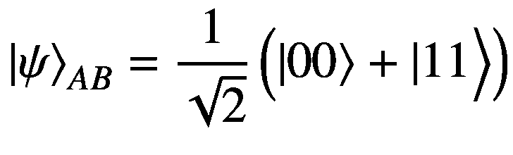

在清单 [3-4](#PC6) 中，我们通过首先对在状态|*ψ*<sub>*a*</sub>⟩=∣0⟩初始化的量子位 a 应用哈达玛变换 *H* 来创建贝尔态，以创建叠加态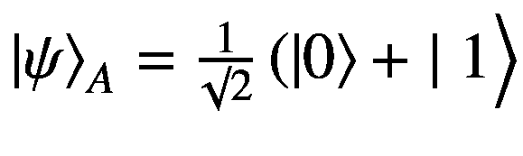。然后，我们基于量子位 a 作为控制位，对在状态|*ψ*⟩<sub>b*b*t16】=∣0⟩初始化的量子位 b 应用受控非门，通常称为 CNOT。</sub>

```py
import cirq
# Define the two qubits using LineQubit
q_register = [cirq.LineQubit(i) for i in range(2)]
# Define the Cirquit with a Hadamard Gate on the qubit 0
# followed by CNOT operation
cirquit = cirq.Circuit([cirq.H(q_register[0]), cirq.CNOT(q_register[0], q_register[1])])
# Measure both the qubits
cirquit.append(cirq.measure(*q_register,key='z'))
print("Circuit")
print(cirquit)
# Define the Simulator
sim = cirq.Simulator()
# Simulate the cirquit for 100 iterations

output = sim.run(cirquit, repetitions=100)
print("Measurement Output")
print(output.histogram(key='z'))

Listing 3-4Bell State Creation and Measurement Using Cirq

```

**输出**

```py
Circuit
0: ───H───@───M('z')───
             │    │
1: ───────X───M────────
Measurement Output
Counter({0: 56, 3: 44})

```

在清单 [3-4](#PC6) 中，我们使用`Cirq`的`LineQubit`选项来定义参与贝尔态的两个量子位。

清单 [3-4](#PC6) 的输出显示量子电路为`cirq`。在测量铃态时，我们得到几乎相等比例的整数结果:0 和 3。整数结果 0 代表|00⟩，而结果 3 代表∣11⟩.

我们现在在`Qiskit`中实现贝尔状态创建和测量，如清单 [3-5](#PC8) 所示。

```py
"""
Quantum Entanglement Example with Qiskit
"""
import numpy as np
from qiskit import QuantumCircuit, execute, Aer
from qiskit.visualization import plot_histogram

# Use Aer's qasm_simulator
simulator = Aer.get_backend('qasm_simulator')

# Create a Quantum Circuit acting on the q register
circuit = QuantumCircuit(2, 2)

# Add a H gate on Qubit 0
circuit.h(0)

# Add a CX (CNOT) gate on control qubit 0 and target qubit 1
circuit.cx(0, 1)

# Map the quantum measurement to the classical bits

circuit.measure([0,1], [0,1])

# Execute the circuit on the qasm simulator
job = execute(circuit, simulator, shots=100)

# Grab results from the job
result = job.result()

# Returns counts
counts = result.get_counts(circuit)
print("\nTotal count for 00 and 11 are:",counts)

# Draw the circuit
print(circuit.draw(output='text'))

Listing 3-5Bell State Creation and Measurement Using Qiskit

```

**输出**

```py
Total count for 00 and 11 are: {'00': 51, '11': 49}
      ┌──┐         ┌─┐
q_0:  ┤H    ├──■──┤M  ├───
      └──┘ ┌─┴─┐ └╥┘┌─┐
q_1: ─────┤ X   ├─╫─┤M├
           └───┘      ║ └╥┘
c_0: ═══════════╩══╬═
                   ║
c_1: ══════════════╩═

```

我们可以从清单 [3-5](#PC8) 的输出中看到，Qiskit 在测量 Bell 州时对∣00⟩州和∣11⟩州进行了几乎相等的采样。

## 量子隐形传送

量子隐形传态是不使用任何通信信道在发送者和接收者之间传输量子态的方法。就像在第 [1](1.html) 章一样，我们将量子态的发送者命名为 Alice，将量子态的接收者命名为 Bob，以保持引用的一致性。图 [3-3](#Fig3) 显示了量子隐形传态电路的高级电路。

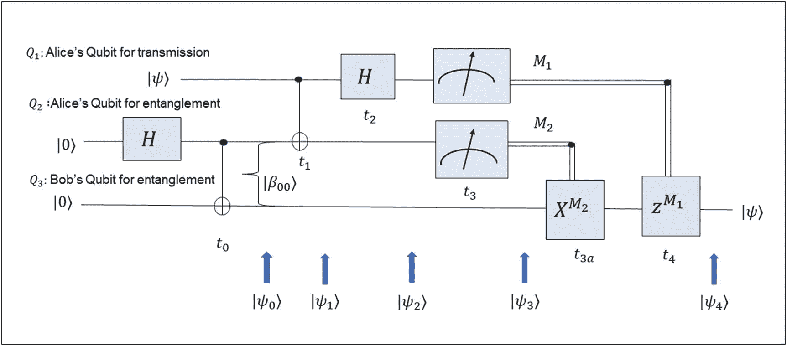

图 3-3

量子隐形传态电路

我们在本章开始时指出，量子算法通过在量子位之间创建有意义的关联而受益于量子纠缠。这些相关性的本质比经典系统所能实现的更强，因为量子粒子即使相隔无限远也能表现出高度的相关性。

在量子隐形传态中，爱丽丝和鲍勃通过量子纠缠让他们的控制量子位共享一个贝尔态。爱丽丝想给鲍勃发送一个量子比特状态，| *ψ* ⟩。我们将这个用于传输的量子位称为`Q1`，爱丽丝和鲍勃用来共享一个钟形状态的控制量子位称为`Q2`和`Q3`。

以下是与量子隐形传态算法相关的步骤:

1.  将控制量子位`Q2`和`Q3`初始化为∣0⟩状态，将量子位`Q1`初始化为| *ψ* ⟩状态，以进行传输。

2.  通过首先对`Q2`应用哈达玛变换`H`，然后对`Q3`进行`CNOT`运算，在`Q2`和`Q3`之间创建贝尔状态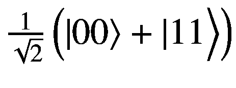，其中`Q2`充当控制量子位。

3.  一旦在爱丽丝和鲍勃的控制量子位`Q2`和`Q3`之间建立了贝尔态，对爱丽丝的两量子位`Q1`和`Q2`应用 CNOT 算符，其中`Q1`充当控制量子位，`Q2`充当目标量子位。

4.  对量子位`Q1`应用哈达玛变换，然后测量爱丽丝的量子位`Q1`和`Q2`。我们将`Q1`和`Q2`的测量状态表示为`M1`和`M2`。

5.  基于控制量子位的测量状态`M2 as`对鲍勃的量子位`Q3`应用 CNOT 算符。最后，对鲍勃的量子位`Q3`测量状态`M1`应用条件`Z`算符。

6.  在这个阶段，鲍勃的量子位`Q3`具有爱丽丝传输的∣ *ψ* ⟩状态。

我们在`Cirq`中实现量子隐形传态算法，并通过传输相等的叠加态来说明。一般要传输的状态∣ * ψ * ⟩可以通过将∣0⟩状态转换到所需状态∣ * ψ * ⟩.所需的电路来指定为此，我们在`quantum_teleportation`例程中使用了`qubit_to_send_op`变量。例如，为了传输相等的叠加状态变量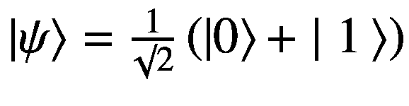，我们通过变量`qubit_to_send_op`向`quantum_teleportation`例程发送`cirq.H`操作符。哈达玛算符将在∣0⟩态初始化的量子位`Q1`转换到相等的叠加态。建议读者尝试使用`qubit_to_send_op`传输不同的状态。一旦量子位状态被传输，我们就测量 Bob 的量子位`Q3`，看看测量值的分布是否等于传输波形的概率分布。清单 [3-6](#PC10) 展示了量子隐形传态算法的详细实现。

```py
import cirq

def quantum_teleportation(qubit_to_send_op='H',
    num_copies=100):
    Q1, Q2, Q3 = [cirq.LineQubit(i) for i in range(3)]
    cirquit = cirq.Circuit()
    """
    Q1 : Alice State qubit to be sent to Bob
    Q2: Alices control qubit
    Q3: Bobs control qubit
    Set a state for Q1 based on qubit_to_send_op :
    Implemented operators H,X,Y,Z,I
    """
    if qubit_to_send_op == 'H':
        cirquit.append(cirq.H(Q1))
    elif qubit_to_send_op == 'X':
        cirquit.append(cirq.X(Q1))
    elif qubit_to_send_op == 'Y':
        cirquit.append(cirq.X(Q1))
    elif qubit_to_send_op == 'I':
        cirquit.append(cirq.I(Q1))
    else:
        raise NotImplementedError("Yet to be implemented")

    # Entangle Alice and Bob's control qubits : Q2 and Q3
    cirquit.append(cirq.H(Q2))
    cirquit.append(cirq.CNOT(Q2, Q3))
    # CNOT Alice's data Qubit Q1 with control Qubit Q2
    cirquit.append(cirq.CNOT(Q1, Q2))
    # Transform Alice's data Qubit Q1
    # on +/- basis using Hadamard Transform

    cirquit.append(cirq.H(Q1))
    # Measure Alice's qubit Q1 and Q2
    cirquit.append(cirq.measure(Q1, Q2))
    # Do a CNOT on Bob's qubit Q3 using Alice's
    # control qubit Q2 after measurement
    cirquit.append(cirq.CNOT(Q2, Q3))
    # Do a Conditioned Z Operation on Bob's qubit Q3
    # using Alice's control qubit Q1 after measurement
    cirquit.append(cirq.CZ(Q1, Q3))
    # Measure the final transmitted state to Bob in Q3
    cirquit.append(cirq.measure(Q3, key="Z"))
    print("Circuit")
    print(cirquit)
    sim = cirq.Simulator()
    output = sim.run(cirquit, repetitions=num_copies)
    print("Measurement Output")
    print(output.histogram(key='Z'))

if __name__ == '__main__':
    quantum_teleportation(qubit_to_send_op='H')

Listing 3-6Simulating Quantum Teleportation

```

**输出**

```py
Circuit
0: ───H───────@───H───M───────@──────────
                    │           │          │
1: ───H───@───X───────M───@───┼──────────
            │                    │     │
2: ──────X───────────────X───@───M('Z')───
Measurement Output
Counter({1: 51, 0: 49})

```

从测量结果中，我们看到 Alice 已经把相等的叠加态传递给了 Bob。

## 量子随机数发生器

经典计算机中的大多数随机数发生器不是真正随机的，因为它们是通过算法以确定性的方式产生的，因此遵守再现性的规范。准确地说，传统的随机数生成器从初始种子状态开始，使用种子状态生成的随机数序列总是相同的。因此，我们看到这些随机数生成器生成的数字序列模拟了随机数序列的属性，同时具有确定性。这些确定性随机数生成器例程被称为*伪随机数生成器*。伪随机数具有可再现性和速度的优点，但是不能安全地用于诸如使用随机密钥来安全传输数据的密码术之类的应用。

与伪随机数发生器相反的是硬件随机数发生器，它利用量子过程、光电效应等物理过程产生随机数。由于这些物理过程是高度不可预测的，因此它们为可用于加密等安全应用的真随机数发生器提供了良好的基础。

在这一节中，我们将说明一个使用多个量子位的随机整数生成器例程。这个想法很简单，如下图所示:

1.  确定代表要采样的整数值范围所需的量子位数量。例如，如果我们必须从 0 到 7 的八个整数中取样，我们将需要 *log* <sub>2</sub> (8) = 3 个量子位。

2.  通过对最初处于∣0⟩态的每个量子位应用哈达玛变换，创建一个相等的叠加态。相等的叠加状态由下式给出:

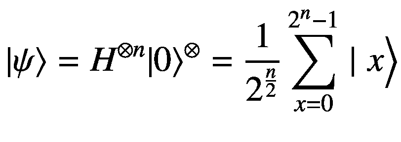

(3-2)

这里∣ *x* ⟩代表计算基状态∣*x*T4】0T6】xt8】1 的整数值。*x*<sub>*n*—1</sub>⟩凡各*x*<sub>*I*</sub>∈{ 0，1}。

1.  将计算基础状态映射到实际整数，并将映射存储在字典`s2n_map`中。如果要采样的整数范围从零开始，则从计算基础状态到实际整数的字典可以是由以下等式给出的二进制到十进制的转换:

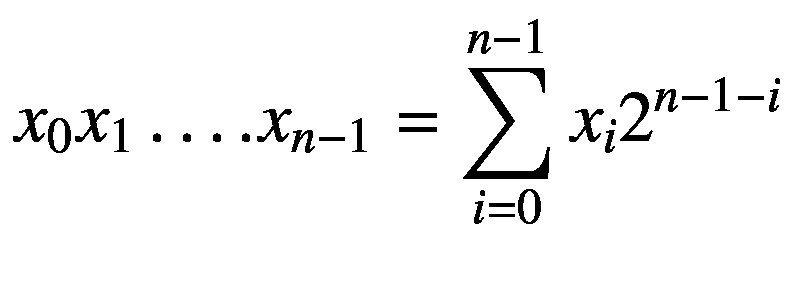

(3-3)

如果范围从偏移量 *b* 开始，我们可以从计算基状态到采样的整数值进行映射，如下所示:

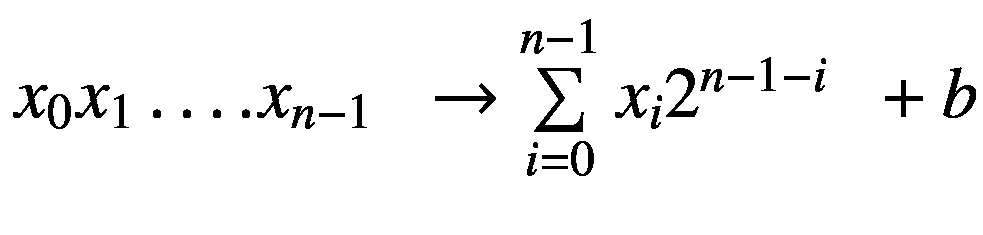 = 0 (3-4)

1.  一旦我们定义了映射，我们可以对相等的叠加态| *ψ* ⟩进行测量，并使用字典映射`s2n_map`将测量的计算基态映射到整数值。

在清单 [3-7](#PC12) 中，我们使用 10 个量子位生成从 0 到 2 <sup>10</sup> 的随机数。因为我们从 0 开始采样，所以我们算法的偏移 *b* 是 0。

```py
import cirq
import numpy as np

def random_number_generator(low=0,high=2**10,m=10):
    """

    :param low: lower bound of numbers to be generated
    :param high: Upper bound of numbers to be generated
    :param number m : Number of random numbers to output
    :return: string of random numbers
    """
    # Determine the number of Qubits required
    qubits_required = int(np.ceil(np.log2(high - low)))
    print(qubits_required)
    # Define the qubits
    Q_reg = [cirq.LineQubit(c) for c
                in range(qubits_required)]
    # Define the circuit

    circuit = cirq.Circuit()
    circuit.append(cirq.H(Q_reg[c]) for c
                      in range(qubits_required))
    circuit.append(cirq.measure(*Q_reg, key="z"))
    print(circuit)
    # Simulate the circuit
    sim = cirq.Simulator()

    num_gen = 0
    output = []
    while num_gen <= m :
        result = sim.run(circuit,repetitions=1)
        rand_number = result.data.get_values()[0][0] + low
        if rand_number < high :
            output.append(rand_number)
            num_gen += 1
    return output

if __name__ == '__main__':
    output = random_number_generator()
  print(output)

Listing 3-7Quantum Random Number Generator

```

**输出**

```py
0: ───H───M('z')───
            │
1: ───H───M────────
            │
2: ───H───M────────
            │
3: ───H───M────────
            │
4: ───H───M────────
            │
5: ───H───M────────
            │
6: ───H───M────────
            │
7: ───H───M────────
            │
8: ───H───M────────
            │
9: ───H───M────────

Sampled Random Numbers

[568, 377, 113, 1022, 775, 310, 696, 175, 568, 910, 445, 6, 504, 167, 29, 727, 660, 794, 864, 804, 216]

Mean of the Sampled Random Numbers 510.95

```

从随机数发生器电路中，我们可以看到它包括对每个量子位应用 Hadamard 算子，然后进行测量。从量子随机数生成器的输出中，我们看到它生成的 20 个数的样本均值是 510.95。这接近于从中抽取随机数的数的平均值，即假设均匀分布的 0 到 2 <sup>10</sup> 。

## Deutsch–Jozsa 算法实现

Deutsch–Jozsa 算法使用了我们在第 [1](1.html) 章中简要讨论过的量子并行性。Deutsch–Jozsa 算法计算二元函数是平衡的还是常数。一个函数 *f* ( *x* )被称为*平衡的*，如果其定义域中一半的值计算为 0，另一半计算为 1。常数函数对于其定义域中的所有值总是计算为相同的二进制值 0 或 1。例如，如果我们使用三个量子位的系统，我们可以有 2 个 <sup>3 个</sup> = 8 个形式为∣*x*T12】1t14】xt16】2t18】xt20】3⟩的计算基态，其中每个*x*t24】T25】It27】∈{ 0，1}。如果我们定义一个函数*f*(*x*)=*f*(*x*<sub>1</sub>， *x* <sub>2</sub> ， *x* <sub>3</sub> )在这八个计算基状态上，如果其中一半的值为 1，另一半的值为 0，我们说这个函数是平衡的。图 [3-4](#Fig4) 显示了 Deutsch–Jozsa 算法的高级图。

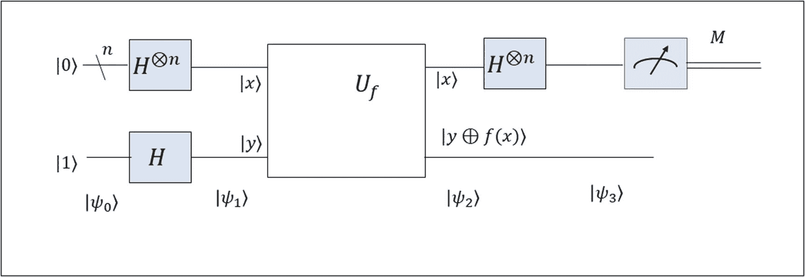

图 3-4

德国-乔萨赛道

Deutsch–Jozsa 算法的步骤可以总结如下:

1.  基于函数域的大小，我们定义了输入量子位的数量。例如，如果 *f* ( *x* )的域有四个值，那么我们需要 *log* <sub>2</sub> (4) = 2 个量子位。所以一般来说，如果我们在函数的定义域中有 2 个 <sup>*n 个*</sup> 值，我们就需要处理 *n 个*输入量子位。此外，该算法需要一个目标量子位来保存 *f* ( *x* )的值。

2.  在状态|0⟩<sup>⊗*n*T3】初始化的输入量子位通过在每个输入量子位上应用哈达玛变换 *H* 被变换到相等的叠加状态。</sup>

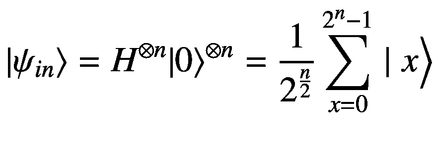

(3-5)

1.  通过连续应用非变换 *X* 和哈达玛变换 *H* ，在状态|0⟩初始化的目标量子位被变换到负状态|−⟩，如下所示:


(3-6)

这给了我们输入和目标量子位的组合状态如下:

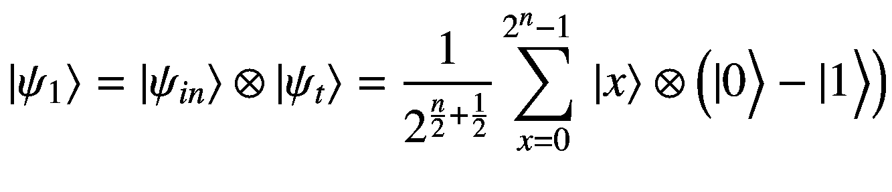

(3-7)

1.  我们有一个 Oracle*U*<sub>*f*</sub>，它接受每个计算基态二进制串 *x* 作为输入，并输出目标量子位中的 *f* ( *x* )，如下所示:


(3-8)

所以，对于任何计算基态∣ *x* ⟩，酉变换*u*T4】t5】fT7】on |*x*⟩⊗(| 0⟩−|1⟩)可以表示为:

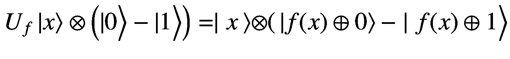

(3-9)

当 *f* ( *x* ) = 0 时，我们有:


当 *f* ( *x* ) = 1 时，我们有如下:

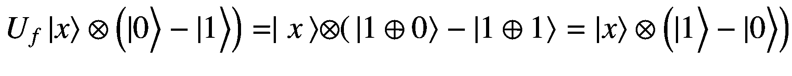

对 *f* ( *x* )的任意二进制值进行概化，我们得到如下:

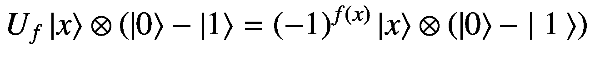

(3-10)

基于此，我们可以说甲骨文变换 *U* <sub>*f*</sub> 在组合态∣*ψ*t8】1 上的应用所有量子位的⟩可以表示为:

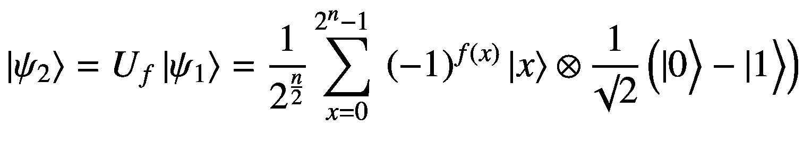

(3-11)

这里要做的一个有趣的观察是，通过在叠加的目标量子位上应用酉变换，我们可以得到函数值 *f* ( *x* )出现在全局相位中。这通常被称为*阶段的回扣伎俩。*

1.  接下来，我们对每个输入量子位应用 Hamdard 变换 *H* ，这改变了输入量子位的计算基础。新状态|*ψ*T4】3⟩如下图所示:


(3-12)

新的计算基础∣ *z* ⟩是二进制 sting∣*z*T4】0，*z*<sub>1</sub>……*z*<sub>*n*—1</sub>⟩对应于 *n* 个输入量子位的整数表示。术语 *x* ⊙ *z* 指的是 *x* 和 *z* 模 2 的二进制串之间的点积。

1.  我们在| *ψ* <sub>3</sub> ⟩的几个相同副本上进行测量，并且仅将我们的注意力集中在所有输入量子位测量为零状态的情况，即*z*<sub>0</sub>=*z*<sub>1</sub>=…=*z*<sub>*n*-1</sub>= 0。此时我们可以忽略目标量子位，因为它的状态不与输入量子位纠缠。这个输入量子位状态的振幅如下:

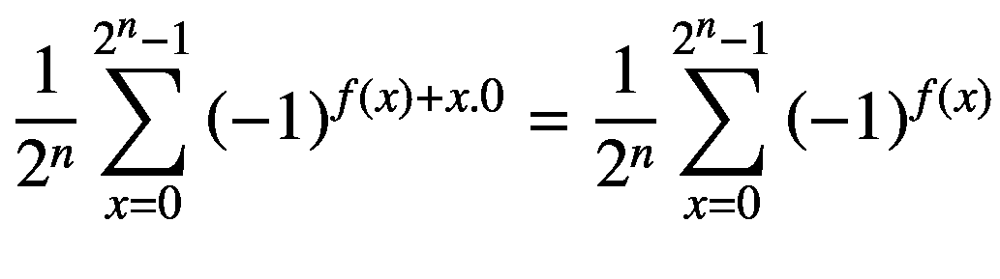

(3-13)

从等式 [3-13](#Equ12) 我们可以看到，如果函数 *f* ( *x* )是一个平衡函数，那么幅度将为零，因为对应于 *f* ( *x* ) = 0 的+1 将抵消对应于 *f* ( *x* ) = 1 的 1。这意味着对于一个平衡态，我们将无法观察到状态| *z* ⟩ = ∣0⟩对应于*z*<sub>0</sub>=*z*<sub>1</sub>=…=*z*<sub>*n*-1</sub>= 0。另一方面，如果我们有一个常数函数，概率振幅将会是 1，我们将会以 100%的概率在我们的测量中观察到状态| *z* ⟩ = ∣0⟩。

我们为函数 *f* ( *x* )实现了域大小为 4 的 Deutsch–Jozsa 算法，这意味着我们需要两个量子位用于输入寄存器，一个量子位用于目标寄存器。清单 [3-6](#PC10) 显示了详细的代码。oracle 转换是通过 oracle 函数实现的。

我们通过不对状态∣*ψ*T2】1⟩.应用任何变换来为常数函数定义预言不对状态应用任何转换可以认为是通过 Oracle*U*<sub>*f*</sub>实现了常数函数 *f* ( *x* ) = 0 作为恒等式转换。因此，恒等式变换后的输出状态∣*ψ*2⟩等于输入状态∣*ψ*t20】1⟩.

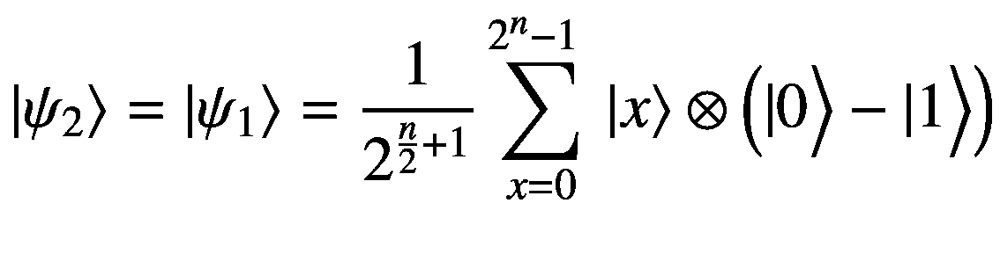

(3-14)

我们通过基于作为控制量子位的输入量子位的状态在目标量子位上应用 CNOT 变换来定义平衡函数 *f* ( *x* )的预言。通过连续的 CNOT 变换，我们用真值表实现了平衡函数的预言，如表 [3-1](#Tab1) 所示。

表 3-1

平衡函数真值表

<colgroup><col class="tcol1 align-left"> <col class="tcol2 align-left"></colgroup> 
| 

输入量子位状态∣ ***x*** ⟩

 | 

***f***(***x***

 |
| --- | --- |
| 00 | Zero |
| 01 | one |
| 01 | one |
| Eleven | Zero |

清单 [3-8](#PC14) 显示了 Deutsch–Jozsa 算法的详细实现。

```py
import cirq
import numpy as np

Listing 3-8Deutsch–Jozsa Implementation

```

`oracle`函数实现了平衡函数和常量函数的 oracle。对于常量函数，我们没有应用任何转换，因此它最终实现了常量函数 *f* ( *x* ) = 0。或者，我们基于连续的两个输入量子位状态，在目标量子位上使用 CNOT 变换来实现四个计算基础状态的平衡功能。对于双量子位输入的|*x*<sub>1</sub>*x*<sub>2</sub>⟩给出的计算基态，实现的平衡函数可以写成*f*(*x*)=*f*(*x*<sub>0</sub>， *x* <sub>1</sub> ) = 【T27

```py
def oracle(data_reg, y_reg, circuit, is_balanced=True):
    if is_balanced:
        circuit.append([cirq.CNOT(data_reg[0], y_reg)
                     , cirq.CNOT(data_reg[1], y_reg)])

    return circuit

def deutsch_jozsa(domain_size: int,
            func_type_to_simulate: str = "balanced",
            copies: int = 1000):
    """

    :param domain_size: Number of inputs to the function
    :param oracle: Oracle simulating the function
    :return: whether the function is balanced or constant
    """
    #  Define the data register and the target qubit

    reqd_num_qubits = int(np.ceil(np.log2(domain_size)))
    #Define the input qubits
    data_reg = [cirq.LineQubit(c) for c
                 in range(reqd_num_qubits)]
    # Define the Target qubits
    y_reg = cirq.LineQubit(reqd_num_qubits)
    # Define cirq Circuit
    circuit = cirq.Circuit()
    # Define equal superposition state for the input qubits
    circuit.append(cirq.H(data_reg[c]) for c
                     in range(reqd_num_qubits))
    # Define Minus superposition state
    circuit.append(cirq.X(y_reg))
    circuit.append(cirq.H(y_reg))

    # Check for nature of function : balanced/constant
    # to simulate and implement Oracle accordingly

    if func_type_to_simulate == 'balanced':
        is_balanced = True
    else:
        is_balanced = False

    circuit = oracle(data_reg, y_reg,
    circuit, is_balanced=is_balanced)
    # Apply Hadamard transform on each of the input qubits
    circuit.append(cirq.H(data_reg[c]) for
                     c in range(reqd_num_qubits))
    # Measure the input qubits
    circuit.append(cirq.measure(*data_reg, key="z"))
    print("Circuit Diagram Follows")
    print(circuit)
    sim = cirq.Simulator()
    result = sim.run(circuit, repetitions=copies)
    print(result.histogram(key='z'))

if __name__ == '__main__':
    print("Execute Deutsch Jozsa for a Balanced Function of Domain size 4")
    deutsch_jozsa(domain_size=4, func_type_to_simulate="balanced",
    copies=1000)

    print("Execute Deutsch Jozsa for a Constant Function of Domain size 4")
    deutsch_jozsa(domain_size=4,
     func_type_to_simulate='',
     copies=1000)

```

**输出**

```py
Execute Deutsch Jozsa for a Balanced Function of Domain size 4

Circuit Diagram Follows
0: ───H───────@───H───────M('z')─────
                  │              │
1: ───H───────┼───@───H───M─────────
                  │    │
2: ───X───H────X───X────────────────
Histogram of outcomes
Counter({3: 1000})

Execute Deutsch Jozsa for a Constant Function of Domain size 4

Circuit Diagram Follows

0: ───H───H───M('z')─────
                   │
1: ───H───H───M────────
Counter({0: 1000})

```

从平衡函数的输出，我们看到所有的状态都是 3，对应于∣11⟩.的二进制量子比特状态由于在我们的测量中没有任何对应于∣00⟩的状态，这证实了该函数确实是平衡的。

类似地，对于常数函数，我们看到所有的测量值都是 0，对应于预期的二进制量子比特态∣00⟩。

## 伯恩斯坦-瓦吉拉尼算法

Bernstein–Vajirani 算法可以看作是 Deutsch–Jozsa 算法的扩展。与 Deutsch–Jozsa 算法非常相似，我们遇到了一个未知函数，它将 0 和 1 的二进制字符串作为输入，并输出 0 或 1 的二进制值。进一步给出函数输出可以写成:

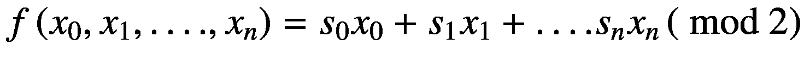

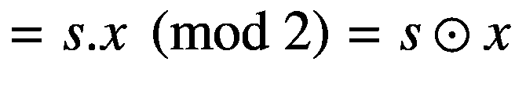

(3-15)

伯恩斯坦-瓦吉拉尼算法的目标是找出秘密的二进制字符串*s*=*s*T4】0， *s* <sub>1</sub> …。，*s*<sub>*n*—1</sub>定义函数。由于函数是由其秘密字符串 *s* 定义的，所以我们将黑盒函数称为*f*<sub>*s*</sub>(*x*)。

在经典的计算体系中，人们可以通过查询黑盒函数 *n* 次来找出秘密字符串。在每一个 *n* 次中，只能将一个输入位设置为 1，其余的设置为 0，然后观察输出。例如，通过评估输入模式 10000 的函数..0，它将输出秘密位*s*T6】0 因为以下为真:

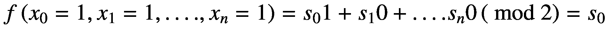

(3-16)

在量子计算范式中，我们可以像 Deutsch–Jozsa 一样使用量子并行来找出秘密字符串 *s* ，只需调用一次定义黑盒函数的 oracle。我们将参考 Deutsch–Jozsa 电路中的图 [3-4](#Fig4) ，同时参考 Bernstein–Vajirani 算法中的不同中间状态，因为两者的高级电路图是相同的。

以下是伯恩斯坦-瓦吉拉尼算法的详细步骤:

1.  基于函数 *f* ( *x* )的定义域，定义所需的输入量子比特数。例如，如果函数有 2 个 <sup>*n 个*</sup> 输入，那么我们将需要 *n 个*量子位。我们将所有的输入量子位初始化为∣0⟩.状态我们还定义了一个在∣0⟩态初始化的目标量子位。

我们对输入量子位应用哈达玛变换 *H* 来定义相等的叠加态。

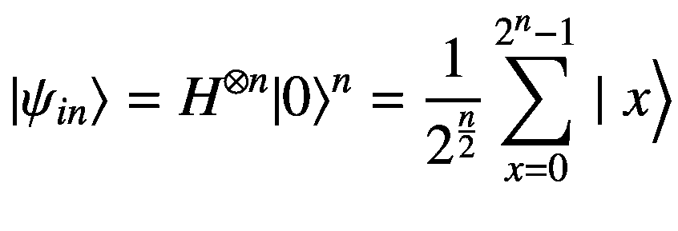

(3-17)

通过连续应用非变换 *X* 和哈达玛变换 *H* ，目标量子位被变换到负态。

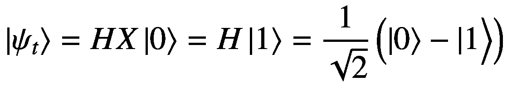

(3-18)

这给了我们输入和目标量子位的组合状态| *ψ* <sub>1</sub> (见图 [3-4](#Fig4) )如下:

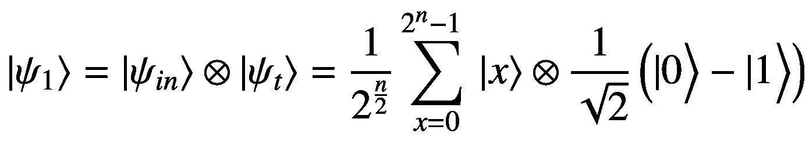

(3-19)

1.  未知函数*f*<sub>*s*</sub>(*x*)的神谕 *U* <sub>*f*</sub> 在计算基上输入量子位的状态∣ *x* ⟩和目标量子位的状态∣ *y* ⟩应该这样工作:

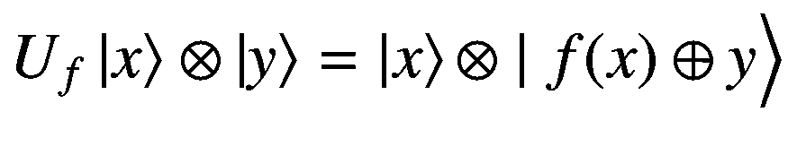

(3-20)

使用与 Deutsch–jozsa 相同的，我们得到新的状态|*ψ*T2】2⟩(见图 [3-4](#Fig4) ，如下图:

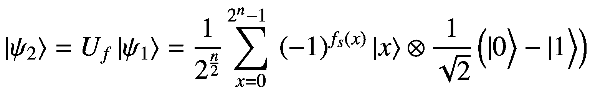

(3-21)

请参考 Deutsch–Jozsa 算法，看看我们如何通过相位反冲技巧使 *f* ( *x* )值出现在全局相位中。

1.  像 Deutsch–jozsa 算法一样，我们对组合状态∣*ψ*T4】2⟩中的每个输入量子位应用哈达玛变换 *H* 以到达状态∣*ψ*t8】3⟩，如下所示:


(3-22)

在方程 [3-22](#Equ21) 中，∣ *z* ⟩表示第 *n* 个输入量子位的新计算基础。术语 *x* ⊙ *z* 表示二进制字符串表示形式 *x* 和 *z* 模 2 之间的点积。

1.  我们知道函数*f*<sub>*s*</sub>(*x*)=*s*⊙*x*，因此我们可以重写| *ψ* <sub>3</sub> ⟩，如下所示:


(3-23)

如果我们忽略目标量子位，看任意输入计算基态∣ *z* ⟩的振幅，振幅由下式给出:

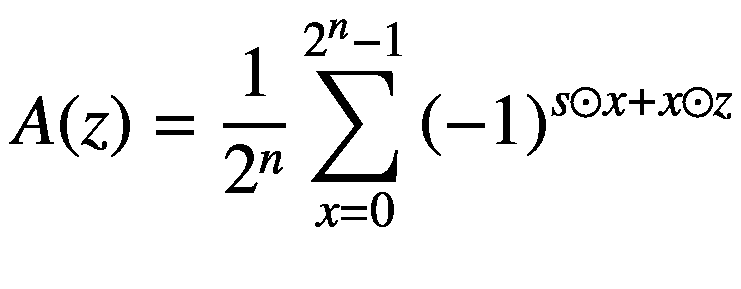

(3-24)

1.  The amplitude of the input computational basis state z when it equals the secret string *s* is given by the following:

    

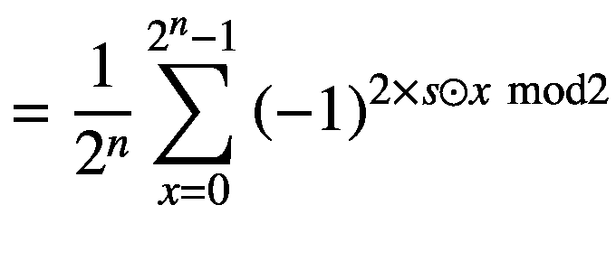

( 3-25)

因为 2 *× s ⊙ x* 可以被 2 整除，所以 2 *× s ⊙ x* mod 2 将总是等于零。这就给出了计算基状态的振幅∣***z***⟩**=**∣***s***⟩如下:

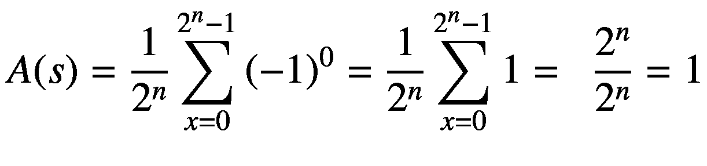

(3-26)

1.  由于秘密串 ***s*** 对应的计算基态的振幅为 1，这里如果我们测量输入的量子位，我们将以 100%的概率得到状态∣ ***s*** ⟩。

我们以一种通用的方式为任意数量的输入量子位实现 Bernstein–Vajirani 算法，并为六个输入量子位执行该算法。六个量子位的函数域中的输入数量是 2 <sup>6</sup> = 64。对于每个输入量子位，其对应的秘密位被设置为 1，我们在目标量子位上应用 CNOT 变换，输入量子位作为控制量子位。这种变换确保每当秘密串 *s* 和计算基础状态串 *x* 之间的点积为偶数时，目标量子位上的合成变换为零。另一方面，当这个点积是奇数时，目标量子位经历非运算。总结一下，这个转换实现了 Oracle 转换:

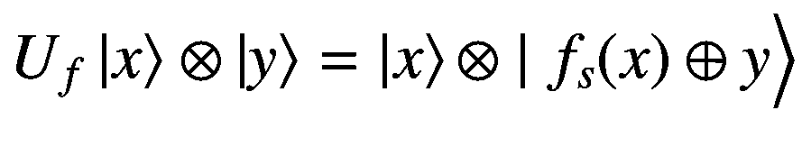

(3-27)

当秘密串 *s* 与计算基态串 *x* 的点积为偶数时，则*f*<sub>*s*</sub>(*x*)= 0，因此|*f*<sub>*s*</sub>(*x*)⊕*y*⟩=∣*y*⟩.正如我们在这种情况下看到的，目标量子位∣ *y* ⟩的状态保持不变。当这个点积为奇数时，*f*<sub>*s*</sub>(*x*)= 1，于是|*f*<sub>t37】s</sub>(*x*)⊕*y*⟩= ∣1⊕*y*⟩.在这种情况下，我们可以看到一个非运算被应用到目标量子位的状态。清单 [3-9](#PC17) 显示了 Bernstein–Vajirani 算法的详细实现。

```py
import cirq
import numpy as np

def func_bit_pattern(num_qubits):
    """
    Create the Oracle function Parameters
    :param num_qubits:
    :return:
    """
    bit_pattern = []
    for i in range(num_qubits):
        bit_pattern.append(np.random.randint(0, 2))
    print(f"Function bit pattern: \
         {''.join([str(x) for x in bit_pattern]) }")
    return bit_pattern

def oracle(input_qubits,target_qubit,circuit,
           num_qubits,bit_pattern):
    """
    Define the oracle
    :param input_qubits:
    :param target_qubit:
    :param circuit:
    :param num_qubits:
    :param bit_pattern:
    :return:
    """
    for i in range(num_qubits):
        if bit_pattern[i] == 1:
                circuit.append(cirq.CNOT(input_qubits[i],
        target_qubit))
    return circuit

def BV_algorithm(num_qubits, bit_pattern):
    """

    :param num_qubits:
    :return:
    """
    input_qubits = [cirq.LineQubit(i) for
                   i in range(num_qubits)]
    target_qubit = cirq.LineQubit(num_qubits)
    circuit = cirq.Circuit()
    circuit.append([cirq.H(input_qubits[i]) for
                   i in range(num_qubits)])
    circuit.append([cirq.X(target_qubit)
                  , cirq.H(target_qubit)])
    circuit = oracle(input_qubits,target_qubit,
                  circuit,num_qubits,bit_pattern)
    circuit.append([cirq.H(input_qubits[i])
                    for i in range(num_qubits)])
    circuit.append(cirq.measure(*input_qubits,key='Z'))
    print("Bernstein Vajirani Circuit Diagram")
    print(circuit)
    sim = cirq.Simulator()
    results = sim.run(circuit, repetitions=1000)
    results = dict(results.histogram(key='Z'))
    print(results)
    results_binary = {}
    for k in results.keys():
        results_binary["{0:b}".format(k)] = results[k]
    print("Distribution of bit pattern output
                from Bernstein Vajirani Algorithm")
    print(results_binary)

def main(num_qubits=6, bit_pattern=None):
    if bit_pattern is None:
        bit_pattern = func_bit_pattern(num_qubits)

    BV_algorithm(num_qubits, bit_pattern)

if __name__ == '__main__':
    main()

Listing 3-9Implementing the Bernstein–Vajirani Algorithm

```

**输出**

```py
Function bit pattern: 111011
Bernstein Vajirani Circuit Diagram
0: ───H───────@───H───────────────────M('Z')────
                  │                                │
1: ───H───────┼───@───H───────────────M────────
                  │    │                          │
2: ───H───────┼───┼───@───H────────────M────────
                  │    │    │                     │
3: ───H───H───┼───┼───┼────────────────M────────
                  │    │    │                     │
4: ───H───────┼───┼───┼───@───H────────M────────
                  │    │    │    │                │
5: ───H───────┼───┼───┼───┼───@───H────M────────
                  │    │    │    │    │
6: ───X───H───X───X───X───X───X────────────────

Distribution of bit pattern output from Bernstein Vajirani Algorithm
{'111011': 1000}

```

我们可以从输出中看到，Bernstein–Vajirani 算法在测量输入量子位时以 100%的概率正确识别了秘密字符串 111011。建议读者对较大的域执行该算法，并查看该算法是否如预期的那样工作。

## 贝尔不等式检验

贝尔不等式测试说明了这样一个事实，即通过使用量子纠缠，人们可以在两个或更多无法相互通信的方之间实现比传统可能更强的相关性。虽然纠缠可以在两个量子对象之间产生强相关性，但是它本身在通信中是没有用的，因为仅仅对一个量子对象的纠缠态测量使得对另一个量子对象的测量完全确定。例如，对于爱丽丝和鲍勃共享的贝尔态，爱丽丝对∣0⟩或∣1⟩的测量完全决定了鲍勃量子位的状态，反之亦然。然而，如果爱丽丝和鲍勃都可以在纠缠后进行测量，并影响测量的最终结果，那么就可以在爱丽丝和鲍勃之间建立有用的关联，这在经典设置中是不可能的。我们将通过爱丽丝和鲍勃之间的合作游戏来激发贝尔不等式测试。然而，在我们进入贝尔不等式测试之前，让我们推导出不同结果的概率，如果爱丽丝在正交基下测量她的量子位| * α * ⟩，∣*α*t5】⊥⟩，而鲍勃在正交基下测量他的量子位| * β * ⟩，∣ * β * <sub> ⊥ </sub> ⟩，假设他们共享贝尔态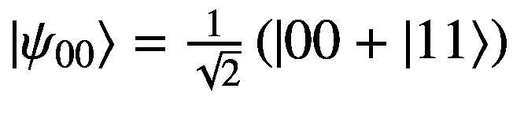。合作博弈的获胜策略需要这些概率的知识。

我们用∣ *α* ⟩和∣*α*T4】⊥⟩来表示爱丽丝基的一般度量基，其中 *α* 是∣ *α* ⟩与∣0⟩态所成的角度。因此，我们可以将它们表示为:

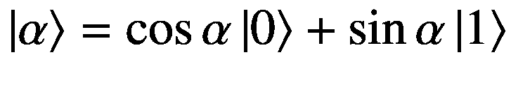

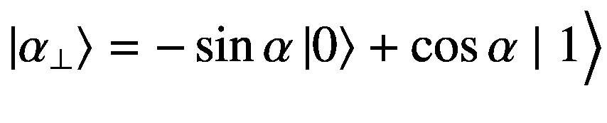

(3-28)

计算基态∣0⟩在基态∣ *α* ⟩和∣*α*T4】⊥⟩上的投影是⟨0| *α* ⟩ = cos *α* 和〈0 |*α*T12】ͥ⾯= sin*α*。同样，计算基态∣1⟩在∣ *α* ⟩上的投影是⟨1| *α* ⟩ = sin *α* 和在|*α*t24】⊥⟩上的投影是⟨1|*α*t28】ͥ々= cos*α*。利用这些信息，我们可以把∣0⟩和∣1⟩写在基数{| *α* ⟩，| *α* <sub>⊥</sub> ⟩}如下:

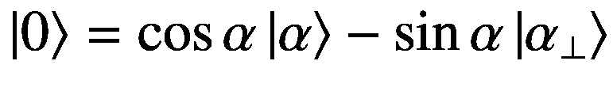

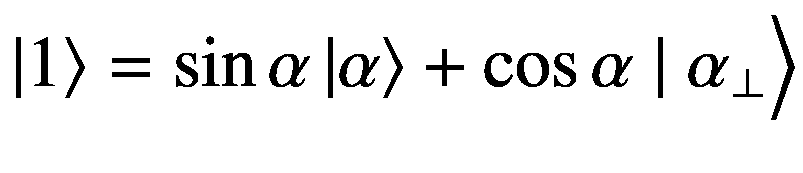

(3-29)

同样，我们可以用另一个基组来表示|0⟩和|1⟩{ |*β*⟩，|*β*T4】⊥⟩}其中 *β* 是基状态| *β* ⟩与|0⟩状态的夹角如下:

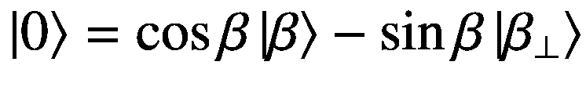

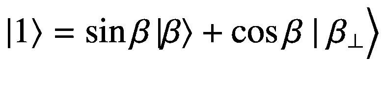

(3-30)

现在，如果艾丽丝在{| *α* ⟩、|*α*T4】⊥⟩}基中测量她的量子位，而鲍勃在{| *β* ⟩、|*β*T10】⊥⟩}基中测量他的量子位，纠缠贝尔态可以用下面的术语来表示:

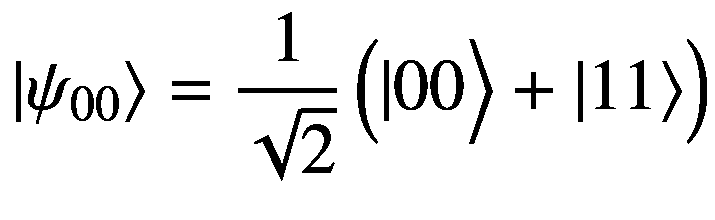

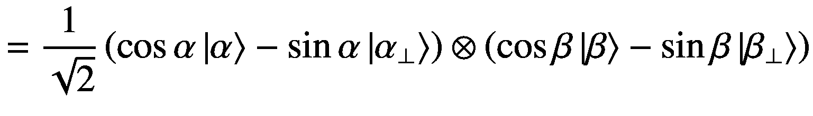

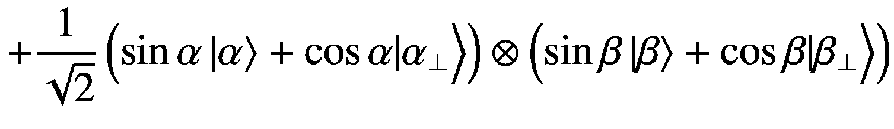

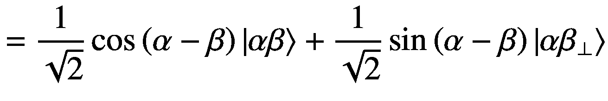

表 [3-2](#Tab2) 显示了爱丽丝的测量基态，即{| *α* ⟩，| *α* <sub>⊥</sub> ⟩}，以及鲍勃的测量基态，即{| *β* ⟩，| *β* <sub>⊥</sub> ⟩}.，每种结果的概率

表 3-2

结果

<colgroup><col class="tcol1 align-left"> <col class="tcol2 align-left"></colgroup> 
| 

计算基础状态

 | 

可能性

 |
| --- | --- |
| &#124; *抗体* ⟩ |  |
| &#124;*αβ*T2】⊥⟩ | 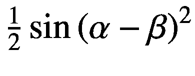 |
| &#124; > t0<sub>*β*</sub> |  |
| &#124; > t0<sub>*【β】*</sub> | 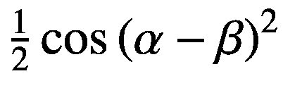 |

现在让我们讨论爱丽丝和鲍勃之间的合作博弈，以说明贝尔不等式测试。这个游戏包括两个玩家，爱丽丝和鲍勃，以及一个裁判。爱丽丝和鲍勃离得很远，他们之间没有任何通信渠道。在每一轮中，裁判向爱丽丝发送一个比特 *x* <sub>1</sub> ，向鲍勃发送一个比特 *x* <sub>2</sub> 。基于接收到的位，Alice 和 Bob 应该分别返回位*a*(*x*T12】1)和*b*(*x*T18】2)。如果满足以下条件，爱丽丝和鲍勃赢得这一轮:

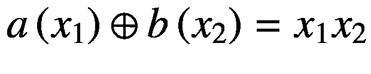

(3-32)

表 [3-3](#Tab3) 显示了所有对*x*T4】1 和*x*T8】2 赢得比赛的真值表。

表 3-3

赢得游戏的真值表

<colgroup><col class="tcol1 align-left"> <col class="tcol2 align-left"></colgroup> 
| 

*x*T2 1T4 xT6】2

 | 

*a*(*x*<sub>1</sub>)*b*(*x*2

 |
| --- | --- |
| 00 | Zero |
| 01 | Zero |
| Ten | Zero |
| Eleven | one |

在一个经典的世界里，爱丽丝和鲍勃能想出的最佳策略最多有 75%的机会让他们赢得比赛。这里，策略类似于爱丽丝和鲍勃用来发送回比特的决策函数*a*(*x*T4】1)和*b*(*x*T10】2)。人们可以证明，在经典意义上，Alice 和 Bob 博弈的最佳策略是发送回相同的比特。因此，给出 75%成功概率的两个最佳策略如下:

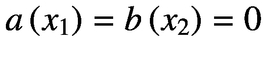

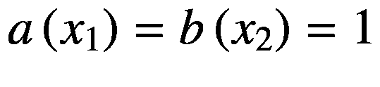

(3-33)

现在让我们看看爱丽丝和鲍勃是否可以用量子策略做得更好，假设他们共享贝尔态,这里有一个这样的策略:

1.  如果 Alice 接收到比特*x*T2】1= 0，她在与 *α* = 0 相关的{ ∣0⟩，∣ *π* /2⟩}基中测量她的量子比特，这给了我们标准的{|0⟩,| 1⟩}计算基。如果她收到位 *x* <sub>1</sub> = 1，她在{∣*π*4⟩，∣3 *π* /4⟩}的基础上测量她的量子位。

2.  鲍勃选择了一个类似的策略，其中他测量{ ∣ *π* /8 ⟩，∣5 *π* /8⟩}或者{ ∣− *π* /8 ⟩，∣3 *π* /8⟩}中的量子位，基于他是否接收到比特*x*T10】2= 0 或者*x*2= 1。

对于每个测量基{| *k* ⟩，|*k*T4】⊥⟩}爱丽丝和鲍勃将为| *k* ⟩发回 0，为∣*k*T10】⊥⟩.发回 1 这是很重要的一点，因为它将决定 Alice 和 Bob 返回的*a*(*x*<sub>1</sub>)和*b*(*x*<sub>2</sub>)的值。

**当*****x***<sub>**1**</sub>=**0**，***x***<sub>**2**</sub>=**0**

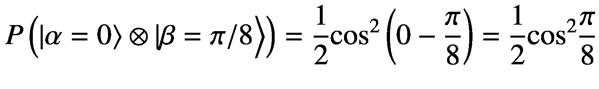

(3-34)

现在|*α*=0⟩⊗∣*β*=*π*/8⟩对应*a*(*x*T10】1)= 0，*b*(*x*<sub>2</sub>)= 0。于是，我们有了*a*(*x*<sub>1</sub>)⊕*b*(*x*<sub>2</sub>)= 0⊕0 = 0 =*xy*= 0×0 = 0 当( *x* <sub>1</sub> = 0， *x* <sub>2</sub> = 0)

同样:


(3-35)

还有，|*α*T2】⊥， *α* = 0⟩ ⊗ ∣ *β* <sub>⊥</sub> ， *β* = *π* /8⟩对应*a*(*x*t18】1)= 1，*b*(*x*<sub>2</sub>= 1 于是，我们有了*a*(*x*<sub>1</sub>)⊕*b*(*x*<sub>2</sub>)= 1⊕1 = 0 =*xy*= 0×0 = 0 当( *x* <sub>1</sub> = 0， *x* <sub>2</sub> = 0)

结合方程 [3-34](#Equ33) 和方程 [3-35](#Equ34) ，我们可以说当(*x*T6】1= 0，*x*T10】2= 0)，爱丽丝和鲍勃有的获胜概率。

**当*****x***<sub>**1**</sub>=**0**，***x***<sub>**2**</sub>=**1:**


(3-36)

现在|*α*=0⟩⊗∣*β*=*π*/8⟩对应*a*(*x*T10】1)= 0，*b*(*x*<sub>2</sub>)= 0。于是，*a*(*x*t22】1)⊕*b*(*x*t28】2)= 0⊕0 = 0 =*xy*= 0×1 = 0 当( *x* <sub>1</sub> = 0， *x* <sub>2</sub> = 1)以概率

同样:


(3-37)

状态|*α*T2】⊥， *α* = 0⟩ ⊗ ∣ *β* <sub>⊥</sub> ，*β*=—*π*/8⟩对应*a*(*x*t18】1)= 1，*b*(*x*<sub>2</sub>)= 1 于是，*a*(*x*<sub>1</sub>)⊕*b*(*x*<sub>2</sub>)= 1⊕1 = 0 =*xy*= 0×1 = 0 当( *x* <sub>1</sub> = 0， *x* <sub>2</sub> = 1)以概率

结合方程 [3-36](#Equ35) 和方程 [3-37](#Equ36) ，我们可以说当(*x*T6】1= 0，*x*T10】2= 1)时，爱丽丝和鲍勃有的获胜概率。

类似地，使用所采用的策略可以推断，对于剩余的两个条件(*x*T3】1= 1，*x*T7】2= 0)和( *x* <sub>1</sub> = 1，*x*x<sub>2</sub>= 1)，爱丽丝和鲍勃也有 0.85 的获胜概率。建议读者对这两个条件进行数学计算，并验证这一说法是否正确。

因此，对比特*x*T2 1 和*x*T6】2 的所有可能组合使用所采用的策略， 爱丽丝和鲍勃设法发回了*a*(*x*T12】1)和*b*(*x*t18】2)以确保*a*(*x*t24】1)⊕*b*(*x*t30】2)=) 这比传统游戏中 0.75%的最大获胜概率要高。

我们通过对清单 [3-10](#PC19) 中爱丽丝和鲍勃的合作博弈建模，实现了`Cirq`中的贝尔不等式。合作博弈使用了我们刚刚讨论过的策略。

```py
import cirq
import numpy as np

def bell_inequality_test_circuit():
    """
    Define 4 qubits

    0th qubit - Alice
    1st qubit - contains the bit sent to Alice by the referee
    2nd qubit - Bob's qubit
    3rd qubit - contains the bit sent to Bob by the referee
        :return: cirq circuit
    """
    qubits = [cirq.LineQubit(i) for i in range(4)]
    circuit = cirq.Circuit()
    # Entangle Alice and Bob to the Bell state
    circuit.append([cirq.H(qubits[0]),
            cirq.CNOT(qubits[0], qubits[2])])
    # Apply X^(-0.25) on Alice's Qubit
    circuit.append([cirq.X(qubits[0])**(-0.25)])
    # Apply Hadamard transform to the referee Qubits
    # for Alice and Bob
    # This is done to randomize the qubit
    circuit.append([cirq.H(qubits[1]), cirq.H(qubits[3])])
    # Perform a Conditional X^0.5 on Alice and Bob
    # Qubits based on corresponding referee qubits
    circuit.append([cirq.CNOT(qubits[1], qubits[0])**0.5])
    circuit.append([cirq.CNOT(qubits[3], qubits[2])**0.5])
    # Measure all the qubits
    circuit.append(cirq.measure(qubits[0], key="A"))
    circuit.append(cirq.measure(qubits[1], key="r_A"))
    circuit.append(cirq.measure(qubits[2], key="B"))
    circuit.append(cirq.measure(qubits[3], key="r_B"))
    return circuit

def main(iters=1000):
    # Build the Bell inequality test circuit
    circuit = bell_inequality_test_circuit()
    print("Bell Inequality Test Circuit")
    print(circuit)
    #Simulate for several iterations
    sim = cirq.Simulator()
    result = sim.run(circuit, repetitions=iters)
    A = result.measurements['A'][:, 0]
    r_A = result.measurements['r_A'][:, 0]
    B = result.measurements['B'][:, 0]
    r_B = result.measurements['r_B'][:, 0]

    win = (np.array(A) + np.array(B)) % 2 == (np.array(r_A)
         & np.array(r_B))
    print(f"Alice and Bob won {100*np.mean(win)} %
           of the times")

if __name__ == '__main__':
    main()

Listing 3-10Bell’s Inequality

```

**输出**

```py
Bell Inequality Test Circuit

0: ───H───@───X^-0.25───X─────────M('A')─────
            │    │          │
1: ───H───┼───────────@^0.5──────M('r_A')────
            │
2: ───────X───X────────M('B')───────────────
                 │
3: ───H───────@^0.5─────M('r_B')─────────────

Alice and Bob won 85.7 % of the times

```

## 西蒙算法

在西蒙的问题中，我们给定了一个函数 *f* ( *x* )，通过一个黑盒变换 *U* <sub>*f*</sub> 对它的访问被限制为查询，这与 Deutsch–Jozsa 和 Bernstein–Vajirani 算法非常相似。作为西蒙问题的一部分，我们需要做以下工作:

1.  找出函数是否是一对一函数，即输入的每个值都映射到唯一的输出。

2.  确定函数是否为二对一函数，即每个输入值恰好映射到两个输入。当函数为二对一时，则有一个秘密的二进制字符串 *s* 将每对具有相同输出的输入*x*T4】1 和*x*t8】2，即*f*(*x*t14】1)=*f*(*x*t20】2)如果我们需要为确定的二对一函数确定秘密字符串 *s* 。

3.  此外，假设输入函数总是一对一或二对一函数。

Simon 的算法是其他重要算法的前身，例如 Shor 的整数的质因数分解算法。图 [3-5](#Fig5) 说明了西蒙算法的高级流程图。


图 3-5

西蒙算法

以下是与西蒙算法相关的步骤:

1.  我们从基于问题领域的 *n* 个输入量子位开始。同样，我们定义一组 *n* 量子位作为目标量子位来保存 *f(x)* 的值。所有的量子位都被初始化为零。2 个 *n 个*量子位的初始状态可以写成如下:


(3-38)

1.  我们对每个输入量子位应用哈达玛变换，为输入创造一个相等的叠加态。哈达玛变换后 2 个 *n 个*量子位的组合状态由下式给出:


(3-39)

1.  在下一阶段中，我们通过 Oracle 变换*<sub>*f*将函数 *f* ( *x* )应用于每个计算基状态*x*=*x*<sub>*o*</sub>*x<sub>1</sub>…*x*<sub>*n*—1</sub>所以对于每个计算基态| *x* ⟩，我们有这个:*</sub>*

 *

(3-40)

在等式 [3-40](#Equ39) 中，| *y* ⟩是每个 *n* 目标量子位的初始状态，因此 *y* = 0。这给了我们新的状态| *ψ* <sub>2</sub> ⟩如下:


(3-41)

请注意，与之前的算法不同，在西蒙的算法中没有*相位反冲*，因为我们已经设置了目标量子位的初始状态 *y* = 0。

我们对输入量子位应用哈达玛变换以获得最终状态∣*ψ*T2】3⟩如下:

t5】T6】(3-42)

1.  现在让我们看看当秘密字符串 *s* = 0000…0 时会发生什么，即函数是一对一的。当函数是一对一函数时，那么 *f* ( *x* )的每个值都绑定到一个特定的输入字符串 *x* 。所以，如果我们测量目标量子位，观察∣ *f* ( *x* )⟩，我们将只得到一个对应的 *x* 。对于每一个输入的∣ *z* ⟩状态，我们观察到的目标量子比特的状态为∣ *f* ( *x* )⟩的概率幅度由给出。因此相应的∣ * z * ⟩状态的概率给定，我们观察到目标量子位的状态为∣ * f * ( * x * )⟩由给出。因为概率对于所有的 *z* 都是相同的，所以对于每个目标量子位状态 *f(x)* ，我们得到输入状态 *z* 的均匀分布。

2.  现在我们来讨论秘密串 *s* 不全为零的情况；即该函数是二对一函数。一旦我们测量了目标量子位并观察到状态∣ *c* ⟩，将会有两个值 *x* ，比如说*x*t8】1 和*x*T12】2，这将给出*f*(*x*t18】1【t19)=*f*(*x*t24】2 对于目标量子位的每个测量状态 *c* ，每个输入量子位状态∣ *z* ⟩的概率幅度由下式给出:

![$$ \frac{1}{2^{\frac{n}{2}+\frac{1}{2}}}\left[{\left(-1\right)}^{x_1\odot z}+{\left(-1\right)}^{x_2\odot z}\ \right] $$](img/495362_1_En_3_Chapter_TeX_Equ42.png)

(3-43)

对于任何状态∣ *z* ⟩有一个非零的概率幅度，下面应该成立:


(3-44)

对于一个二选一的函数，我们知道*x*T2】1 和*x*T6】2 被关系*x*T10】1⊕*x*t14】2=*s*所绑定，这也暗示了*x*<sub>2</sub>=*x*t24】1

现在我们通过替换*x*t14】2=(*x*<sub>1</sub>⊕*s*)来简化*x*1⊙*z*=*x*=<sub>x<sub>2</sub><sub>z。</sub></sub>


(3-45)

由于我们两边都有 *x* <sub>1</sub> ⊙ *z* ，标识简化为 *s* ⊙ *z* = 0。

这意味着当我们得到测量任何输入状态的非零概率 *z* ，那么 *s* ⊙ *z* = 0。

我们可以测量输入量子位，并观察不同的*n*z 值*。基于观察到的 *z* 值，我们可以求解如下所示的一组 *n* 方程来找到秘密字符串:*

**

 ** 


(3-46)

通过高斯消元等算法可以方便地求解 *n* 方程。

清单 [3-11](#PC21) 说明了西蒙算法的详细实现。秘密串 110 用于演示实现中的西蒙算法。

```py
import cirq
import numpy as np

def oracle(input_qubits, target_qubits, circuit):
     # Oracle for Secret Code 110
    circuit.append(cirq.CNOT(input_qubits[2],target_qubits[1]))
    circuit.append(cirq.X(target_qubits[0]))
    circuit.append(cirq.CNOT(input_qubits[2], target_qubits[0]))
    circuit.append(cirq.CCNOT(input_qubits[0],input_qubits[1],target_qubits[0]))
    circuit.append(cirq.X(input_qubits[0]))
    circuit.append(cirq.X(input_qubits[1]))
    circuit.append(cirq.CCNOT(input_qubits[0], input_qubits[1], target_qubits[0]))
    circuit.append(cirq.X(input_qubits[0]))
    circuit.append(cirq.X(input_qubits[1]))
    circuit.append(cirq.X(target_qubits[0]))
    return circuit

def simons_algorithm_circuit(num_qubits=3,copies=1000):
    """
    Build the circuit for Simon's Algorithm

    :param num_qubits:
    :return: cirq circuit
    """
    input_qubits = [cirq.LineQubit(i) for
                          i in range(num_qubits)]
    target_qubits = [cirq.LineQubit(k) for
                k in range(num_qubits, 2 * num_qubits)]
    circuit = cirq.Circuit()
    # Create Equal Superposition state for the
    # Input qubits through Hadamard Transform
    circuit.append([cirq.H(input_qubits[i]) for
                       i in range(num_qubits)])
    # Pass the Superposition state through the oracle
    circuit = oracle(input_qubits, target_qubits, circuit)
    # Apply Hadamard transform on the input corners
    circuit.append([cirq.H(input_qubits[i]) for
                            i in range(num_qubits)])
    # Measure the input and the target qubits
    circuit.append(cirq.measure(*(input_qubits
                          + target_qubits), key="Z"))
    print("Circuit Diagram for Simons Algorithm follows")
    print(circuit)
    #Simulate Algorithm
    sim = cirq.Simulator()
    result = sim.run(circuit,repetitions=copies)
    out = dict(result.histogram(key='Z'))
    out_result = {}
    for k in out.keys():
        new_key =  "{0:b}".format(k)
        if len(new_key) < 2*num_qubits:
            new_key = (2*num_qubits –
                        len(new_key))*'0' + new_key
        out_result[new_key] = out[k]
    print(out_result)

if __name__ =='__main__':
    simons_algorithm_circuit()

Listing 3-11Simon’s Algorithm

```

**输出**

```py
Circuit Diagram for Simons Algorithm follows
                     ┌──┐
0: ───H───────────@─────X───@───X───H────────M('Z')──────
                       │            │                     │
1: ───H───────────@─────X───@───X───H────────M─────────
                       │            │                     │
2: ───H───@───@───┼H────────┼────────────────M─────────
            │    │    │            │                     │
3: ───X───┼───X───X─────────X───X───M('T')─────M─────────
            │                                 │           │
4: ───────X────────────────────────M────────M─────────
                                               │           │
5: ───────────────────────────────M────────M─────────
                     └──┘
{'110110': 62, '110010': 69, '000100': 56, '111010': 59, '111000': 71, '001110': 66, '110100': 65, '001010': 59, '001000': 62, '111110': 68, '000010': 68, '000000': 57, '001100': 63, '110000': 46, '111100': 73, '000110': 56}

```

基于西蒙算法的输出，人们可以通过选择两个结果来容易地找到秘密串，其中 *f* ( *x* )值(存储在组合的|*x*⟩|*f*(*x*)⟩状态)的最后 3 位中)匹配。如果我们取两个结果`111010`和`001010`，我们可以看到两个结果的输出位相同，等于`010`。因此，如果我们对两个输入`111`和`001,`做模 2 加法，我们将得到我们的密码。所以，密码是`111` ⊕ `001`，这给了我们`110`，它与我们选择的密码相匹配。建议读者使用类似的逻辑编写一个小函数来自动完成密钥查找过程。

## 格罗弗算法

量子计算相对于经典计算的潜在优势之一是它可以访问数据库元素的速度。Grover 算法就是这样一种算法，它可以在从数据库中搜索项目时提供二次加速。格罗弗的算法使用了*振幅放大技巧*，这不仅有助于数据库搜索任务，而且可以广泛用于多种应用。

假设我们在数据库中有 *N* = 2 <sup>*n*</sup> 个商品，我们想要搜索由 *k* 索引的商品，我们称之为*赢家*。我们可以通过对应于 *n 个*输入量子位的计算基态∣ *x* ⟩来定义 *N 个*项。oracle 对每个计算基状态| *x* ⟩ ∈ {0，1} <sup>*n*</sup> 进行操作，并返回一个函数输出 *f* ( *x* ) = 1 表示胜出项，0 表示剩余项。在量子计算范式中，我们可以把甲骨文 *U* <sub>*f*</sub> 看作是作用于计算基态∣ *x* ⟩的幺正算符，如下图:


(3-47)

对于计算基状态∣ *k* ⟩引用的胜者项，甲骨文变换的效果如下所示:


(3-48)

现在我们有了一些关于神谕的信息，让我们看看格罗弗算法的步骤:

1.  基于数据库中项目的数量*n*= 2<sup>= T3】n</sup>，我们使用哈达玛变换，即，定义了初始化为|0⟩ <sup> ⊗ *n* 的 *n* 量子位上的相等叠加态。我们还将一个在∣0⟩初始化的目标量子位置于负态，我们用它来实现*相位反冲技巧*。这给了我们输入和目标量子位的组合状态| * ψ * <sub> 1 </sub> ⟩如下:</sup>


(3-49)

1.  下一步，我们实现 oracle *U* <sub>*f* ，</sub>，它对输入和目标的计算基状态起作用，如*u*<sub>*f*</sub>|*x*⟩∣*y*⟩= |*x*⟩∣*f*(*x*)⊕*y*⟩应用*u*<sub>*f*</sub>on |*ψ*<sub>1</sub>⟩通过*相位反冲技巧*给我们∣ *ψ* <sub>2</sub> ⟩，我们已经在 Deutsch–jozsa 算法中举例说明。状态∣ *ψ* <sub>2</sub> ⟩经甲骨文酉*<sub>*f*</sub>变换后由下式给出:*

 *

(3-50)

正如我们所看到的，目标量子位状态保持不变，我们能够得到每个计算基态∣ *x* ⟩.对应的相位中的函数值 *f* ( *x* 因此，向前看，我们可以丢弃目标量子位，并认为甲骨文 *U* <sub>*f*</sub> 在任何计算基础状态下的变换为*u*<sub>*f*</sub>|*x*⟩=(1)<sup>*f*(*x【t24)*</sup>|*x*⟩.既然我们已经完全根据输入量子位建立了预言函数，我们将不再涉及目标量子位。甲骨文在某种意义上实现了函数 *f* ( *x* )，当 *x* 为胜者状态时为 1，其他地方为 0。


图 3-6

Grover 算法的几何解释

1.  我们可以把相等的叠加态想象成两个相互正交的向量的线性组合:我们用∣ * k * ⟩和向量∣ * c * ⟩来表示的被搜索的*或*获胜项*这是通过从相等的叠加态| t11】ψ*t13】⟩.中去除向量∣ * k * ⟩的分量而获得的单位向量图 [3-6(a)](#Fig6) 对此进行了说明。

这就允许我们把| *ψ* <sub>*中的*</sub> ⟩中的两个向量∣ *k* ⟩和| *c* ⟩(见图 [3-6](#Fig6) (a))写成如下:


(3-51)

在等式 [3-51](#Equ50) 中，我们有 *cosθ* = 和

1.  现在，一旦我们将甲骨文变换 *U* <sub>*f*</sub> 应用于 ⟩中的状态∣ *ψ* <sub>*，与获胜者项目状态∣ *k* ⟩对应的相位将乘以 1，因此输出状态∣*ψ*<sub>*mid*</sub>⟩可以表示如下:*</sub>


(3-52)

所以，酉甲骨文变换 *U* <sub>*f*</sub> 基本上具有应用关于矢量∣ *c* ⟩的反射的效果，如图 [3-6(b)](#Fig6) 所示。反射具有抵消胜利者状态∣ *k* ⟩.的振幅的效果

1.  最后，我们反映出向量| *ψ* <sub>*中期*</sub> ⟩超过向量|*ψ*<sub>*eq*</sub>⟩其中|*ψ*<sub>*eq*</sub>⟩是对于 *n* 量子位的相等叠加态，即， 沿一个矢量的反射|*ψ*<sub>*eq*</sub>⟩由下式给出:变换在| * c * ⟩和| * k * ⟩的这个二维基中，我们可以把|*ψ*<sub>*eq*</sub>⟩写成![$$ \left|{\psi}_{eq}\right\rangle =\left[\begin{array}{c} cos\theta \\ {} sin\theta \end{array}\right] $$](img/495362_1_En_3_Chapter_TeX_IEq34.png)。

这使得酉变换为:

![$$ {U}_{\psi_{eq}}=2\left|{\psi}_{eq}\right\rangle \left\langle {\psi}_{eq}\right|-I=\left[\begin{array}{cc}\mathit{\cos}2\theta &amp; \mathit{\sin}2\theta \\ {}\mathit{\sin}2\theta &amp; -\mathit{\cos}2\theta \end{array}\right] $$](img/495362_1_En_3_Chapter_TeX_Equ52.png)

(3-53)

在∣ *c* ⟩和∣ *k* ⟩的二维基础上，对|*ψ*T3】T4】midT6】⟩进行酉变换*cosθ*T9】sinθ<sup>*t*</sup>，得到∣*ψ*<sub>*out*</sub>

= ![$$ \left[\begin{array}{c}\mathit{\cos}3\theta \\ {}\mathit{\sin}3\theta \end{array}\right]=\mathit{\sin}3\theta \left|k\right\rangle +\mathit{\cos}3\theta \mid c\Big\rangle $$](img/495362_1_En_3_Chapter_TeX_IEq37.png) (3-54)

于是，随着逐次酉变换 *U* <sub>*f*</sub> 接着是我们已经从状态|*ψ**⟩=*辛θ * | * k * ⟩ + *科斯θ * ∣ * c * ⟩到| * ψ * <sub> *出来*由于在第一象限内 *sin* 单调递增而 *cos* 单调递减，不难看出 *sin* 项给出的| * k * ⟩的幅度从 *sinθ* 增加到 *sin* 3 *θ* ，而∣ * c * ⟩给出的其余状态的幅度从 *cos 减小*</sub>*

 *1.  连续迭代地应用酉变换 *U* <sub>*f*</sub> 然后是允许我们通过向其放大振幅来收敛到胜利者状态∣ * k * ⟩。我们可以将这两种变换组合为，称之为格罗夫变换 *G* 。因此，如果我们对 m 次迭代应用格罗弗变换，最终输出状态将非常接近∣⟩.

当我们使用属于具有四个项目的神谕的两输入量子位，即 *N* = 4 时，我们有以下:


(3-55)

所以，获胜项目的初始振幅对应的概率是。既然，那就意味着 *θ* = 30 。在酉变换 *U* <sub>* f *</sub> 后跟*U*<sub>*eq*</sub>之后，获胜项目的新振幅为*sin*3*θ*= sin(3×30<sup>【T22)=*sin*90<sup>= 1。这意味着在仅仅一次迭代中， ⟩中的起始状态| * ψ * <sub> *已经被转换为获胜项状态∣ * k * ⟩。*</sub></sup></sup>

1.  oracle 提供的 *U* <sub>*f*</sub> 转换与 Deutsch–Jozsa 和 Bernstein–Vajirani 算法中的相同。

2.  我们需要一种方法，根据量子算符得出酉变换。就哈达玛门而言，可以写成如下:


(3-56)

我们前面讨论过，的作用是反映一个关于相等叠加态的矢量我们可以简化如下图:


= 2(*h*<sup>*n*</sup>| 0*)(【0 |<sup>【t】</sup>*

 *= 2(*h*<sup>*n*</sup>| 0*)(【0 |<sup>【t】</sup>*

 *现在*h*T2】⊗*n*t5】|0⟩<sup>⊗*n*T9】什么都不是，而是等于叠加态为 *n* 个量子位，因此where*n*= 2<sup>*n*</sup>。同样，由于哈达玛变换 *H* 是幂等的，我们有*H*T23】2</sup>=*I*。使用这些信息，我们可以重写等式 [3-57](#Par201) ，如下所示:


(3-58)

2 |*ψ*<sub>*eq*</sub>⟩⟨*ψ*<sub>*eq*</sub>|-*I*正是关于向量⟨*ψ*<sub>*eq*</sub>|。

既然我们已经证明了*h*T2】⊗*n*t5(2 |0⟩<sup>⊗*n*T9】⟨0|<sup>⊗*n*t13—*I**h*<sup>⊗*n*</sup>确实是关于反思的酉变换|*ψ*<sub>T25</sub></sup></sup>

1.  看看如何实现(2 |0⟩<sup>⊗*n*T3】⟨0|<sup>⊗*n*T7*I*)让我们看看这个变换对基态∣ *x* ⟩.做了什么</sup></sup>
    1.  When the basis state is |*x*⟩ = |0⟩<sup>⊗*n*</sup>:

        

    2.  When the basis state is |*x*⟩ ≠ |0⟩<sup>⊗*n*</sup>:

        


因此，当基态不是|0⟩<sup>⊗*n*T3】时，变换翻转相位。</sup>

这种条件相位翻转算子可以通过使用 CNOT、X 和 H 门的组合来实现，正如我们将在两个量子位的 Grover 算法实现中看到的那样。

1.  请注意，输入到格罗弗变换| *ψ* <sub>*中的状态*</sub> ⟩等于|*ψ*<sub>*eq*</sub>⟩只在格罗弗变换的第一次迭代中。你不应该假设每次迭代都是这样，因为从第二次迭代开始， ⟩态中的∣ *ψ* <sub>*到格罗弗的迭代会不同。*</sub>

既然我们已经详细讨论了格罗弗算法的所有不同方面，我们可以将格罗弗算法的高级流程图放在一起，如图 [3-7](#Fig7) 所示。


图 3-7

格罗弗算法的高级流程图

如前所述，我们使用大小为 4 的数据库实现 Grover 算法。同样，我们构建 Oracle*U*<sub>*f*</sub>来为我们的示例搜索元素 **01** 。对于预言的一般实现，我们反转输入量子位的状态，对应于胜利者元素位是零。这确保了胜出的计算基态被转换成由|1⟩<sup>⊗*n*T12】给出的全 1 态，其中 *n* 是输入量子比特的数量。下一步，我们基于作为控制量子位的所有输入量子位，对目标量子位应用条件非变换。由于胜利者计算基态是|1⟩<sup>⊗*n*t18】，目标量子位上的条件 NOT 变换只会为胜利者态设置 *f* ( *x* ) = 1。由于*相位反冲*，设置 *f* ( *x* ) = 1 的获胜者计算状态将在其幅度中引入所需的 1 翻转系数。使用`Toffoli gate`实现条件非变换。一旦实现了期望的翻转，我们需要撤销条件 NOT 运算，以便获胜者计算基础状态从|1⟩<sup>⊗*n*t32】恢复到其原始值。</sup></sup></sup>

该算法的另一个重要部分是构建反射操作符，它将反映在 oracle 变换之后∣*ψ*T3】T4】中期 T6】⟩实现的状态*u*T9】T10】fT12】关于相等叠加状态∣*ψ*t15】t16】eqt18】⟩.对于大小为 4 的数据库，我们可以按照图 [3-8](#Fig8) 中 Grover 算法的电路图来实现。甲骨文*U*T23】T24】fT26】和弯曲运算符组成格罗弗迭代器。通过 Grover 迭代器的几轮应用，人们应该能够以很高的概率测量赢家状态。对于使用两个量子位的计算基础状态索引的由四个项目组成的数据库，我们在一个 Grover 迭代器中收敛到赢家状态。


图 3-8

四项数据库的 Grover 算法电路

建议读者考虑包括∣00⟩在内的不同基态，并验证条件相位翻转算符是否按预期工作。Grover 算法的一次迭代足以收敛到赢家状态 01，正如我们之前在图 [3-8](#Fig8) 中看到的。请参见清单 [3-12](#PC23) 中的详细实现。

```py
import cirq
import numpy as np

def oracle(input_qubits, target_qubit,
       circuit, secret_element="01"):
    print(f"Element to be searched: {secret_element}")

    # Flip the qubits corresponding to the bits containing 0
    for i, bit in enumerate(secret_element):
        if int(bit) == 0:
            circuit.append(cirq.X(input_qubits[i]))
    # Do a Conditional NOT using all input qubits as control
    # qubits
    circuit.append(cirq.TOFFOLI(*input_qubits, target_qubit))
    # Revert the input qubits to the state prior to Flipping
    for i, bit in enumerate(secret_element):
        if int(bit) == 0:
            circuit.append(cirq.X(input_qubits[i]))
    return circuit

def grovers_algorithm(num_qubits=2, copies=1000):
    # Define input and Target Qubit
    input_qubits = [cirq.LineQubit(i)
              for i in range(num_qubits)]
    target_qubit = cirq.LineQubit(num_qubits)
    # Define Quantum Circuit

    circuit = cirq.Circuit()
    # Create equal Superposition State
    circuit.append([cirq.H(input_qubits[i])
                for i in range(num_qubits)])
    # Take target qubit to minus state |->
    circuit.append([cirq.X(target_qubit)
         ,cirq.H(target_qubit)])
    # Pass the qubit through the Oracle
    circuit = oracle(input_qubits, target_qubit, circuit)
    # Construct Grover operator.
    circuit.append(cirq.H.on_each(*input_qubits))
    circuit.append(cirq.X.on_each(*input_qubits))
    circuit.append(cirq.H.on(input_qubits[1]))
    circuit.append(cirq.CNOT(input_qubits[0]
            ,input_qubits[1]))
    circuit.append(cirq.H.on(input_qubits[1]))
    circuit.append(cirq.X.on_each(*input_qubits))
    circuit.append(cirq.H.on_each(*input_qubits))

    # Measure the result.
    circuit.append(cirq.measure(*input_qubits, key="Z"))
    print("Grover's algorithm follows")
    print(circuit)
    sim = cirq.Simulator()
    result = sim.run(circuit, repetitions=copies)
    out = result.histogram(key='Z')

    out_result = {}
    for k in out.keys():
        new_key = "{0:b}".format(k)
        if len(new_key) < num_qubits:
            new_key = (num_qubits - len(new_key))*'0'
                         + new_key
        out_result[new_key] = out[k]
    print(out_result)

if __name__ =='__main__':
    grovers_algorithm(2)

Listing 3-12Grover’s Algorithm

```

**输出**

```py
Element to be searched: 01
Grover's algorithm follows
0: ───H───X───@───X───H───X───@───X───H───────M('Z')─────
                  │                    │                   │
1: ───H───────@───H───X───H───X───H───X───H───M────────
                  │
2: ───X───H───X──────────────────────────────────────
{'01': 1000}

```

从输出中我们可以看到，Grover 的算法已经以 100%的概率收敛到赢家项。

## 摘要

就这样，我们来到了第三章[的结尾。在这一章中，我们在某种程度上熟悉了`Cirq and`中的量子计算编程范例。在本章中，我们研究了各种量子计算算法，如 Deutsch–Jozsa 算法、Bernstein-Vajirani 算法、贝尔不等式、Grover 算法和 Simon 算法。所有这些量子算法通过利用叠加、纠缠、干涉和其他与量子力学相关的微妙的量子力学特性，在计算上比它们的经典算法更有效。建议读者彻底浏览不同的算法及其基础数学，以便更好地理解计算的量子范式。](3.html)

在下一章中，我们将着眼于基于量子傅立叶变换的算法，这些算法构成了量子计算以及量子机器学习范式中一组重要算法的主干。期待您的参与！*****