# 四、量子傅里叶变换及相关算法

> *“过去、现在和未来的区别只是一种顽固坚持的幻觉。”*
> 
> —爱因斯坦

在这一章中，我们将研究量子傅立叶变换及其在不同量子算法中的应用。对于经典计算机来说，诸如将整数分解成质数或者寻找 T2 周期这样的问题是计算上难以解决的问题，因为涉及到大量的指数运算。使用大量基于量子傅立叶变换的量子相位估计算法可以有效地解决整数分解和周期寻找。或者，由于量子相位估计旨在找到对应于酉算子的特征向量的特征值，所以它是优化中的重要算法的骨干，例如 HHL 算法(以 Hassim、Harrow 和 Lloyd 命名)，其用作量子计算中的矩阵求逆例程。我们从修正傅立叶变换及其离散对应物*离散傅立叶变换*的概念开始这一章，然后转移到量子傅立叶变换和量子相位估计算法的激动人心的领域。接下来，我们将讨论和实现一些与量子傅立叶变换相关的算法，比如分解一个数和寻找周期。在这一章的结尾，我们简要地介绍群论的基础，试图解释隐藏的子群问题，以及它如何与几个基于傅立叶变换的算法相关。

## 傅里叶级数

实变量的周期函数可以展开为正弦和余弦形式的傅立叶级数，或者一般来说可以展开为复指数函数。我们可以将这样一个周期函数 *f* ( *x* )在一段长度为 *L* 的周期后重复出现，用傅里叶级数展开形式表示如下:

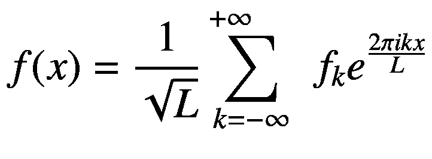

(4-1)

任何函数 *f* ( *x* )都可以被认为是在其定义域内 *x* 的不同值上的函数值的向量。如果 *x* 为实数，那么 *x* 在任一给定区间内有无穷多个值，函数可以认为是无穷维向量。方程 [4-1](#Equ1) 中的指数函数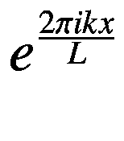通过代入 *k* 的不同值得到，作为基函数，就像向量基一样。在此函数空间中，任意两个函数 *f* 和 *g* 在域区间 *a* 、 *b* 上的点积，其中*L*=*b*-*a*由下式给出:

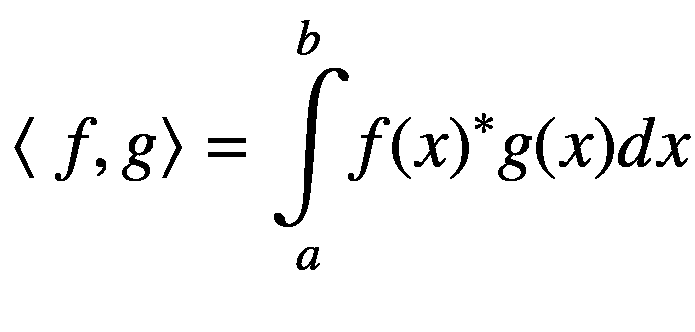

(4-2)

其中*f*(*x*)<sup>∫</sup>表示 *f* ( *x* )的复共轭函数。

让我们来计算对应于 *k* = *k* <sub>1</sub> 和 *k* = *k* <sub>2</sub> 的值的两个复指数函数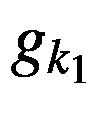和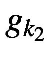的点积。

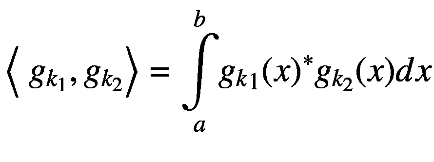

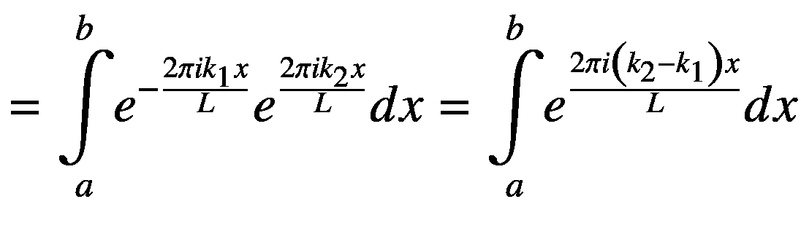

![$$ =L{\left[\ \frac{\ {e}^{2\pi i\left({k}_2-{k}_1\right)x}}{2\pi i\left({k}_2-{k}_1\right)}\right]}_a^b $$](img/495362_1_En_4_Chapter_TeX_Equc.png)

![$$ =L\left[\ \frac{\ {e}^{\frac{2\pi i\left({k}_2-{k}_1\right)b}{L}}-{e}^{\frac{2\pi i\left({k}_2-{k}_1\right)a}{L}}}{2\pi i\left({k}_2-{k}_1\right)}\right] $$](img/495362_1_En_4_Chapter_TeX_Equd.png)

![$$ =L{e}^{\frac{2\pi i\left({k}_2-{k}_1\right)a}{L}}\left[\ \frac{\ {e}^{\frac{2\pi i\left({k}_2-{k}_1\right)\left(b-a\right)}{L}}-1}{2\pi i\left({k}_2-{k}_1\right)}\right] $$](img/495362_1_En_4_Chapter_TeX_Eque.png)

![$$ =L{e}^{\frac{2\pi i\left({k}_2-{k}_1\right)a}{L}}\left[\ \frac{\ {e}^{2\pi i\left({k}_2-{k}_1\right)}-1}{2\pi i\left({k}_2-{k}_1\right)}\right] $$](img/495362_1_En_4_Chapter_TeX_Equ3.png)

(4-3)

由于 *k* <sub>1</sub> 、 *k* <sub>2</sub> 为实型离散值，*k*<sub>2</sub>—*k*—<sub>1</sub>=*t*对于 *k* <sub>1</sub> 和 *k* <sub>2</sub> 的所有可能值始终为整数。这里强调了两种可能性。

**案例 1:**

当*k*<sub>2</sub>≦*k*<sub>1</sub>，*k*<sub>2</sub>—*k*<sub>1</sub>为非零整数。对于*k*T18】2 至*k*T22】1、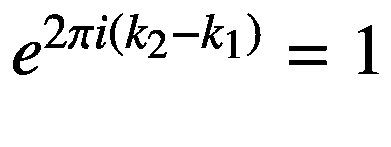的任意非零整数值。这使得方程 [4-3](#Equ3) 中的点积表达式为零。

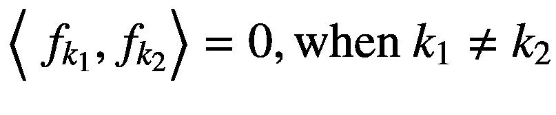

(4-4)

**案例二:**

当*k*<sub>2</sub>=*k*<sub>1</sub>，*k*<sub>2</sub>—k<sub>1</sub>= 0。我们不能直接将等式 [4-3](#Equ3) 中的*k*<sub>2</sub>—*k*—<sub>1</sub>= 0 代入分母*k*<sub>2</sub>—*k*—<sub>1</sub>会使表达式不明确。我们反而可以评价的是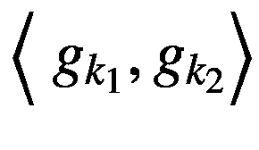的极限为*k*<sub>1</sub>—*k*<sub>2</sub>→0。

![$$ \underset{k_2-{k}_1\to 0\ }{\lim}\left\langle\ {g}_{k_1},{g}_{k_2}\right\rangle =\underset{k_2-{k}_1\to 0\ }{\lim }{e}^{\frac{2\pi i\left({k}_2-{k}_1\right)a}{L}}\left[\ \frac{\ {e}^{2\pi i\left({k}_2-{k}_1\right)}-1}{2\pi i\left({k}_2-{k}_1\right)}\right] $$](img/495362_1_En_4_Chapter_TeX_Equ5.png)

【4-5】

![$$ =L{e}^0\underset{k_2-{k}_1\to 0\ }{\lim}\left[\ \frac{\ {e}^{2\pi i\left({k}_2-{k}_1\right)}-1}{2\pi i\left({k}_2-{k}_1\right)}\right] $$](img/495362_1_En_4_Chapter_TeX_Equf.png)

![$$ =L{e}^0\underset{k_2-{k}_1\to 0\ }{\lim}\left[\ \frac{\ {e}^{2\pi i\left({k}_2-{k}_1\right)}-1}{2\pi i\left({k}_2-{k}_1\right)}\right] $$](img/495362_1_En_4_Chapter_TeX_Equg.png)

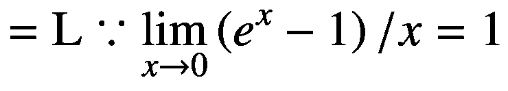

(4-6)

我们可以从方程 [4-4](#Equ4) 和方程 [4-6](#Equ6) 推断，复指数函数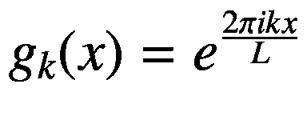构成了所有基本周期长度为 *L* 的周期函数的正交基。还有，我们从方程 [4-6](#Equ6) 中注意到，⟨给出的 *g* <sub>* k *</sub> 的范数的平方*g*<sub>*k*</sub>*g*<sub>*k*</sub>⟩=*g*<sub>*k*</sub>我们可以将*g*<sub>*k*</sub>(*x*)按其范数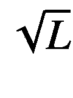归一化，使得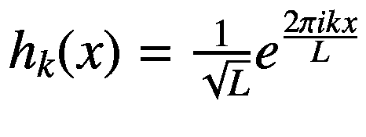给出的指数基函数是单位范数的，从而形成正交基。

术语 *k* 可以解释为某种形式的频率。 *k* 的不同取值会导致一个周期函数中出现多个频率的不同谐波。

对应于不同频率 *k* 的每个谐波的系数可以计算为 *f* ( *x* )与单位基向量*h*<sub>*k*</sub>(*x*)的点积，如下:

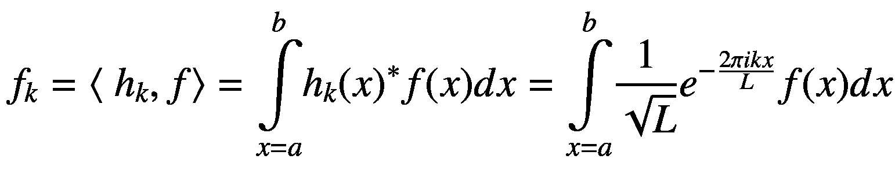

(4-7)

## 傅里叶变换

傅立叶变换是傅立叶级数的自然扩展，我们试图用复指数函数来表示非周期函数。你可以把一个非周期函数想象成一个周期长度为 *L* → ∞的函数，因此它的一个周期 *L* 的下限和上限分别由 *a* 和 *b* 表示，分别趋于∞和+∞。类似地，非周期函数中的谐波不再是离散的，而是占据连续的频率。非周期函数的傅里叶变换表示可以写成傅里叶级数的一种极限情况，如下图:

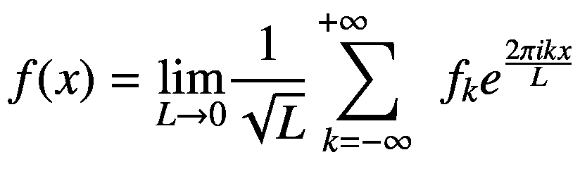

(4-8)

可以进行替换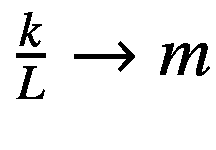以获得如下的傅立叶变换表示:

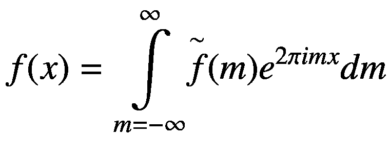

(4-9)

为了用 *k* 在不同变换中一致地引用频率变量，让我们再次将变量 *m* 改为 *k* ，并且将非周期函数 *f* ( *x* )的傅立叶变换表示如下:

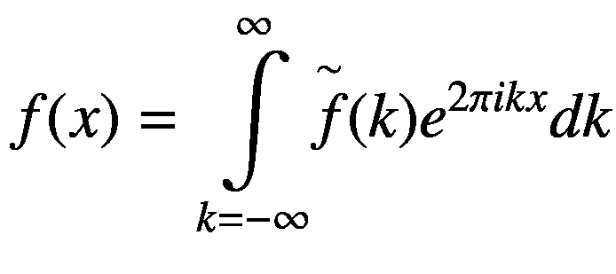

(4-10)

谐波的系数函数现在在连续域中，它与 *f* ( *x* )的关系如下:

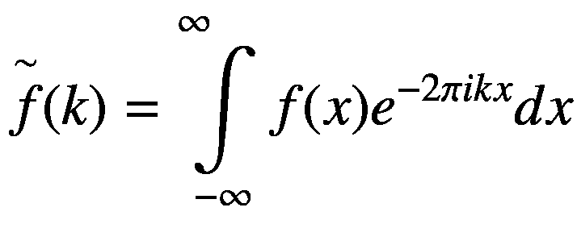

(4-11)

一般来说，系数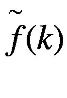称为函数 *f* ( *x* )的*频响*。从 *f* ( *x* )到其频率响应的变换称为傅里叶变换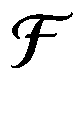，表示如下:

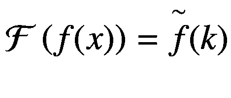

(4-12)

类似地，可以应用傅里叶逆变换从函数的频率响应到函数本身，如下所示。

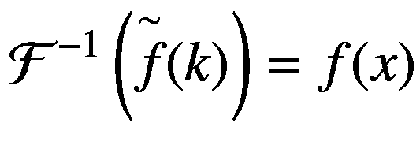

(4-13)

需要注意的一点是，周期函数的傅立叶变换是它的傅立叶级数表示。

## 离散傅里叶变换

我们前面定义的傅立叶变换只适用于连续函数。如果我们在离散输入变量上有一个函数 *f* <sub>*n*</sub> ，我们可以使用离散傅立叶变换来代替。任何函数 *f* <sub>*o*</sub> ， *f* <sub>1</sub> ， *f* <sub>2</sub> …，*f*<sub>*N*—1</sub>都可以用其离散傅立叶变换(DFT)展开式表示如下:

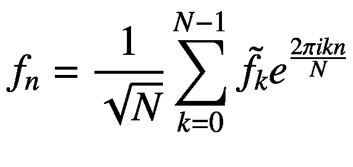

(4-14)

离散傅立叶变换的频率响应函数如下所示:

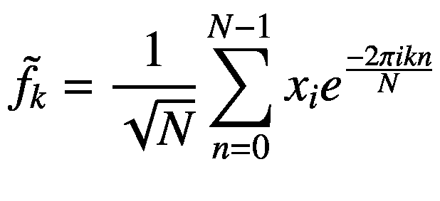

(4-15)

## 克罗内克德尔塔函数

克罗内克德尔塔*δ*<sub>T3】nmT5(见图 [4-1](#Fig1) )是一个仅对于离散变量 *n* 的值 *m* 等于 1 的函数。在 *n* 的所有其他值下，该函数的值为 0。</sub>

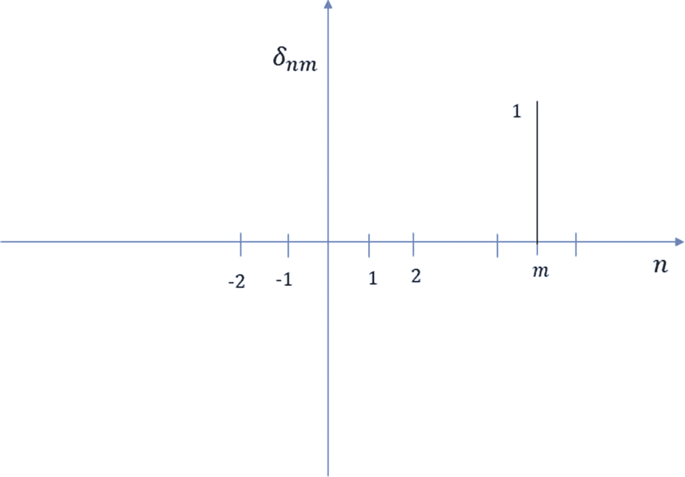

图 4-1

克罗内克德尔塔函数

克罗内克德尔塔函数可以被认为是 *N* 维向量，其仅在 *n* 的一个离散值处假设值为 1。两个克罗内克德尔塔函数 *δ* <sub>*nm*</sub> 和*δ*<sub>*no*</sub>的点积为 0，而克罗内克德尔塔的范数，即*δ*<sub>*nm*</sub>的点积，本身为 1。因此，Kronecker delta 函数可用于定义表示非频域中离散函数的标准正交基。例如，一个离散函数 *f* <sub>*n*</sub> 可以表示为其代表的克罗内克德尔塔函数的线性和，如下所示:

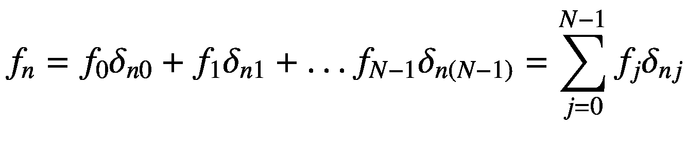

(4-16)

现在，如果我们想要检索函数在任意 *n* = *j* 的值，只有 *δ* <sub>*nj*</sub> = 1，因此我们得到的是函数 *f* <sub>*j*</sub> 的值。

我们实际上可以把克罗内克德尔塔函数*δ*T2】T3】NJt5】写成单位向量| *j* ⟩.这将方程 [4-16](#Equ16) 中的离散函数 *f* <sub>*n*</sub> 简化为以下形式:

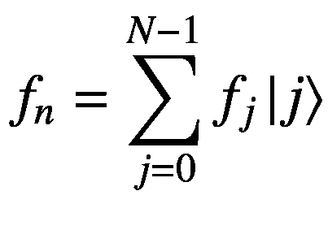

(4-17)

Kronecker delta 的这种矢量表示在量子傅里叶变换公式中会派上用场。

## 利用 Kronecker Delta 函数激发量子傅里叶变换

克罗内克德尔塔函数的频率响应可使用等式 [4-15](#Equ15) :

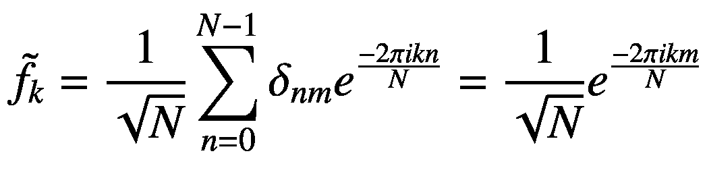

(4-18)计算如下

基于频率响应，我们可以使用离散傅立叶变换展开式(见等式 [4-14](#Equ14) )将 *δ* <sub>*nm*</sub> 写成如下:

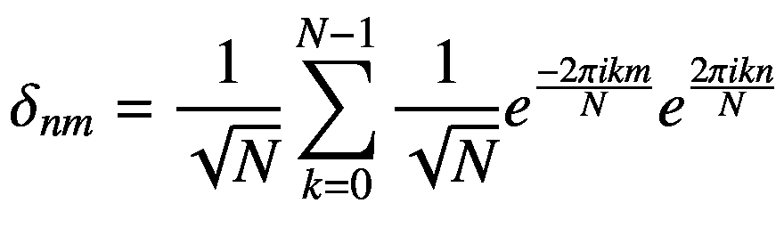

(4-19)

像在傅立叶级数中一样，复指数函数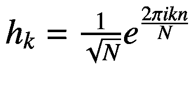即使在离散傅立叶变换的情况下，对于不同值的 *k* ，也会形成正交基。我们可以将这些复指数函数 *h* <sub>* k *</sub> 表示为单位范数的 *N* 维基向量，并使用狄拉克符号将它们表示为| * k * ⟩.换句话说，我们有这样的:

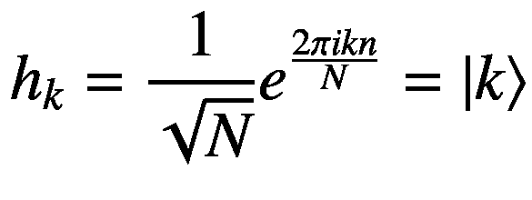

(4-20)

复指数函数的这种向量表示允许我们将方程 [4-19](#Equ19) 中的函数δ<sub>*【nm】*</sub>表示简化如下:

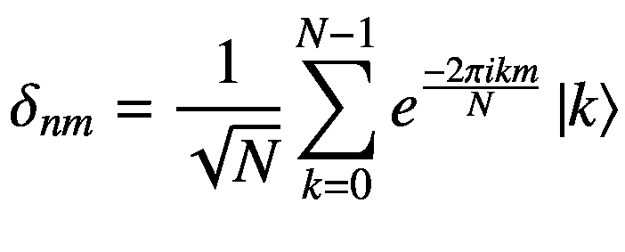

(4-21)

或者，我们可以将 *δ* <sub>*nm*</sub> 表示为 Kronecker delta 基中的| *m* ⟩，因此方程 [4-21](#Equ21) 可以写成全基方程，如下所示:

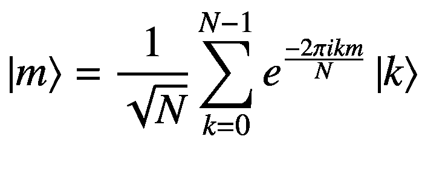

(4-22)

量子傅立叶变换被视为两组基函数之间的变换:由 kronecker delta*δ*T2】T3】nmt5】= |*m*⟩给出的空间或时域基函数以及由指数函数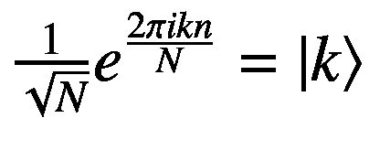给出的频率基函数。

在这点上，等式 [4-22](#Equ22) 是重要的表示，因为量子傅立叶变换是酉变换 *U* ，其采用由| *m* ⟩给出的任何广义空间或时间域基函数，并在频域基| *k* ⟩中表示它，如这里所示:

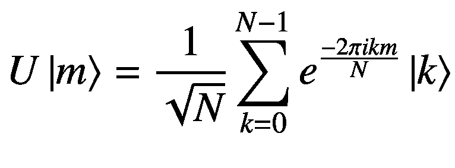

(4-23)

由于傅里叶变换酉算子 *U* 是线性的，任何离散函数的傅里叶变换都可以计算为其基函数上傅里叶级数变换的线性和，如下所示:

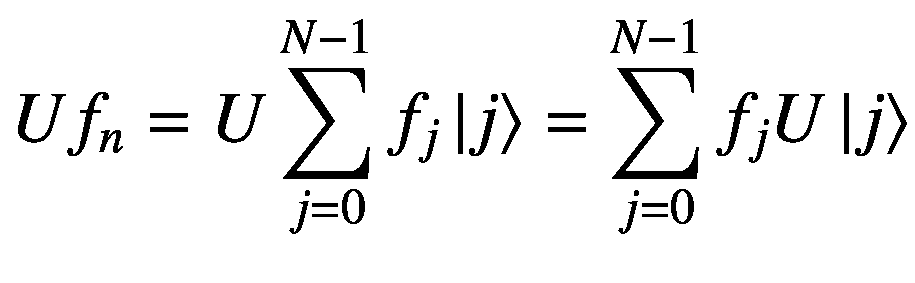

(4-24)

根据 [4-24](#Equ24) 中的公式 [4-23](#Equ23) 代入 *U* | *j* ⟩，我们得到:

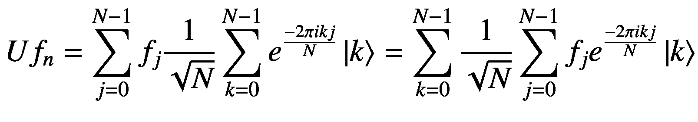

(4-25)

现在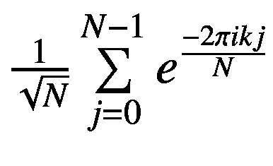是频率 *k* 的傅立叶频率响应，我们可以用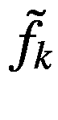表示。代入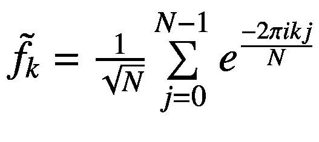，我们看到方程 [4-25](#Equ25) 可以写成:

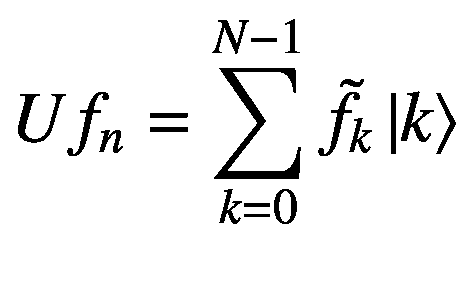

(4-26)

通过将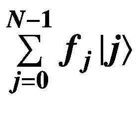写成克罗内克德尔塔基，我们可以将方程 [4-26](#Equ26) 改写如下:


(4-27)

方程 [4-27](#Equ27) 通过理解频谱/时域和频域之间的基函数关系，为我们提供了一种对任何给定离散函数进行傅里叶变换的通用方法。需要注意的一点是，酉变换 *U* 只是改变了进行傅里叶变换的函数的表示基础。这种傅里叶变换的方法是我们理解和执行量子傅里叶变换所需要的，我们将在本章的其余部分看到。

## 量子傅立叶变换

在本节中，我们将研究量子傅里叶变换电路，以了解傅里叶变换在量子计算领域的确切工作原理。利用 *n* 量子位，我们可以定义形式为|*x*T4】1T6】xt8】2…*x*<sub>*n*</sub>⟩=∣*x*⟩其中 *x* 是二进制串*x*t22】1t24】x*的十进制展开*

用 *n* 个量子比特，我们可以得到*N*= 2<sup>T5】N</sup>个计算基态。

为了明确起见，每个量子位的计算基础状态由 *x* <sub>*i*</sub> ∈ {0，1}表示。

你需要了解任意广义计算基态的变换|x⟩= |*x*T2】1T4】xT6】2…*x*<sub>*n*</sub>⟩由图 [4-2](#Fig2) 中的傅里叶变换电路，计算基态| *x* ⟩不过是克罗内克δ函数*δ*<sub>*NX*</sub>。

量子电路中使用的门是哈达玛门 *H* 和旋转门*R*<sub>T5】n</sub>给出如下:

![$$ {R}_m=\left[\begin{array}{cc}1&amp; 0\\ {}0&amp; {e}^{-\frac{2\pi i}{2^m}}\end{array}\right] $$](img/495362_1_En_4_Chapter_TeX_Equ29.png)

(4-29)

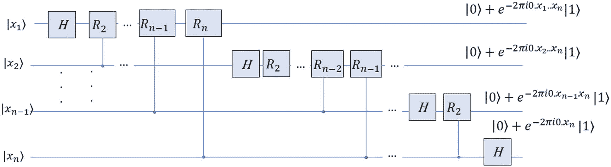

图 4-2

量子傅立叶变换电路

我们从第一个量子位开始，通过电路中的各种门来观察它的状态转换。

哈达玛门 *H* 将量子位的状态从|*x*T4】1⟩变为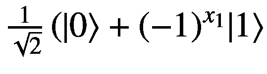。我们可以用*e*T9*πI*T12】来代替-1 的值，或者更方便地称为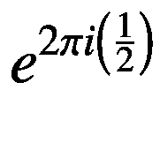。这让我们重写量子位的状态如下:

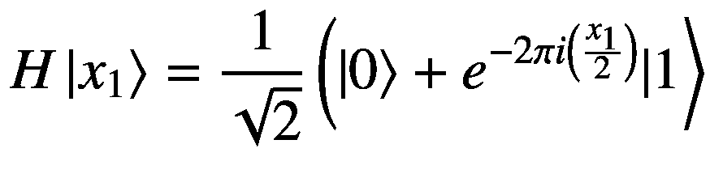

(4-30)

现在就像我们把一个二进制字符串*x*<sub>1</sub>*x*<sub>2</sub>…*x*<sub>*n*</sub>以整数形式写成 x =*x*<sub>1</sub>2<sup>*n*—1</sup>+*x*<sub>2</sub>2<sup>*n*x*<sub>1</sub>*x*<sub>2</sub>…*x*<sub>*n*</sub>表示一个二进制小数如下:*</sup>

*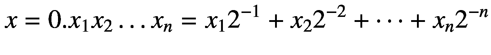*

*(4-31)*

使用这种符号，我们可以将写成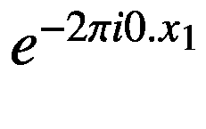，因此在哈达玛乘积之后量子位 1 的状态(在方程 [4-31](#Equ31) 中)可以重写如下:


(4-32)

根据具有状态|*x*<sub>*m*</sub>⟩.的第 m <sup>个</sup>量子位的值，旋转矩阵 *R* <sub>*m*</sub> 被连续应用以状态|*x*<sub>*m*</sub>中第

![$$ \overset{\sim }{R_m}=\left[\begin{array}{cc}1&amp; 0\\ {}0&amp; {e}^{-\frac{2\pi i{x}_m}{2^m}}\end{array}\right] $$](img/495362_1_En_4_Chapter_TeX_Equ33.png)

个量子位的值为条件的 *R* <sub>*m*</sub> 的变换可以表示如下:

![$$ \overset{\sim }{R_m}=\left[\begin{array}{cc}1&amp; 0\\ {}0&amp; {e}^{-\frac{2\pi i{x}_m}{2^m}}\end{array}\right] $$](img/495362_1_En_4_Chapter_TeX_Equ33.png)

(4-33)

如果量子位 *m* 处于|0⟩状态，指数项变为 1，因此条件变换变为恒等变换。利用等式 [4-32](#Equ32) ，第二量子位进行条件变换后第一量子位的状态可以写成:

![$$ \left[\begin{array}{cc}1&amp; 0\\ {}0&amp; {e}^{-\frac{2\pi i{x}_2}{2^2}}\end{array}\right]\frac{1}{\sqrt{2}}\left(\left|0\right\rangle +{e}^{-2\pi i0.{x}_1}|1\right\rangle $$](img/495362_1_En_4_Chapter_TeX_Equh.png)


(4-34)

现在可以写成 0.0*x*T3】2。因此，简化为 0。*x*<sub>1</sub>*x*<sub>2</sub>旋转后第一个量子位的状态 *R* <sub>2</sub> 以第二个量子位为条件变成如下:


(4-35)

以这种方式进行，在所有条件旋转之后，量子位 1 的状态可以表示如下:


(4-36)

现在我们把注意力转移到第二个量子位的转换上。如果我们观察图 [4-2](#Fig2) ，我们会看到与量子位 1 相同的转换模式对量子位 2 重复。因此，通过归纳，我们可以将量子位 2 上的变换写成如下:


(4-37)

一般来说，对于任意一个量子位 *m* ，变换可以写成:


(4-38)

结合所有量子位上的变换，我们可以把基向量上的整体变换写成|*x*T2】1T4】xT6】2…*x*<sub>*n*</sub>⟩如下:


(4-39)

接下来，我们使用交换操作符来交换量子位的状态，使得索引为 *m* 的任何量子位与索引为*n**m*的量子位交换其状态(见图 [4-3](#Fig3) )。在交换操作之后，量子位的总体状态如下:


(4-40)


图 4-3

量子傅里叶变换电路中的末态交换操作

我们在前面看到(方程 [4-22](#Equ22) )任何基矢*δ*<sub>*NX*</sub>= |*x*⟩允许我们在复指数频率基中表示它如下:


(4-41)

代入 *N* = 2 <sup>*n*</sup> 和*x*=*x*<sub>1</sub>*x*<sub>2</sub>…*x*<sub>*N*</sub>，我们得到如下:


(4-42)

现在*k*=*k*<sub>1</sub>2<sup>*n*1</sup>+*k*<sub>2</sub>2<sup>*n*-2</sup>+…+*k*<sub>*n*</sub>2<sup>0</sup>，因而。将此代入方程 [4-42](#Equ42) ，我们得到如下:


(4-43)

我们可以把状态|*k*⟩= |*k*<sub>1</sub>*k*<sub>2</sub>…*k*<sub>*n*</sub>⟩在状态的张量积中表示为于是我们有了这个:


(4-44)

方程 [4-44](#Equ44) 中的求和可以在每个量子位基态上运行，而指数项的乘积可以附加到每个量子位上。这就把方程 [4-44](#Equ44) 简化为如下:


(4-45)

展开每个量子位的基态求和，写出张量积的每一项，我们得到:


(4-46)

现在*x*=*x*<sub>1</sub>2<sup>*n*1</sup>+*x*<sub>2<sup>*n*2</sup>+…+*x*<sub>*n*</sub>2<sup>0</sup>，因而*x*2</sub>

让我们通过在等式 [4-47](#Equ47) 中代入 *p* 的不同值来计算*x*2<sup>—*p*</sup>。

当 *p* = 1 时，

*x*2<sup>1</sup>=*x*T6】12<sup>T9】n2</sup>+*x*2<sup>T15】n3</sup>+*x*<sub>T21】n1</sub>0+*x*<sub>*n*</sub>

除了最后一项，所有项都大于或等于 1。将等式 [4-48](#Par69) 中的*x*2<sup>1</sup>代入表达式，得到:


由于除了最后一项*x*<sub>T3】nT5】2<sup>1</sup>之外的所有项都大于或等于 1，因为我们知道*e*<sup>—2*πim*</sup>对于 *m* 的任意整数值都是 1，所以它们将贡献一个因子 1。这将简化为如下:</sub>


(4-49)

同样，当 *p* = 2 时，我们会得到*x*2<sup>2</sup>=*x*<sub>1</sub>2<sup>*n*-3</sup>+*x*2<sup>+T17】n-4</sup>+*x*<sub>*n*-1</sub>2<sup>于是，我们有了这个:</sup>


(4-50)

利用方程 [4-49](#Equ48) 和方程 [4-50](#Equ49) 的观测值，我们可以将方程 [4-46](#Equ46) 简化如下:


(4-51)

因此，我们看到从方程 [4-51](#Equ50) 中的定义导出的复指数或频率基中|*x*T2】1T4】x2…*x*<sub>*n*</sub>⟩的傅立叶变换展开与通过量子傅立叶变换电路实现的傅立叶变换展开精确匹配(参见方程 [4-39](#Equ39) )。

需要注意的一点是，当我们一般地谈论傅立叶变换(量子计算之外)时，我们谈论由| *k* ⟩.表示的每个复指数基的复系数或权重在量子傅立叶变换电路中，这些系数与它们的复合基态| * k * ⟩处于叠加态。叠加是有利的，因为它将傅立叶系数连同它们的基以和的形式组合，这变成了复指数基| * k * ⟩.中的输入函数信号表示于是，量子变换在基|*x*<sub>1</sub>*x*<sub>2</sub>…*x*<sub>*n*</sub>⟩的基础上变成了|*x*<sub>1</sub>*x*<sub>2</sub>…*x*<sub>*n*函数的傅立叶变换和函数在频率基中的傅立叶变换展开有时可以互换使用。需要记住的重要的一点是，傅立叶变换对|*x*<sub>1</sub>*x*<sub>2</sub>…*x*<sub>*n*</sub>⟩允许我们写出|*x*<sub>1</sub>*x*<sub>2</sub>…*x*<sub>*n*</sub></sub>

证明量子傅立叶电路与离散傅立叶变换做着同样的变换是一项长期而严格的工作。建议读者仔细阅读这一推导，因为它构成了与量子傅立叶变换相关的几种算法的基础。

## Cirq 中的 QFT 实施

我们以模块化的方式实现傅立叶变换，以便我们可以在其他基于傅立叶变换的实现中重用它。类`QFT`可以通过输入`basis_to_transform`接受每个基态，并输出其傅立叶变换。或者，它可以接受给定数量量子位的叠加态，并实现傅立叶变换。我们使用`QFT`类中的`qft_circuit`函数迭代构建量子傅立叶变换电路。一旦量子位状态通过哈达玛变换和随后的以其他量子位为条件的旋转被改变，T4 函数就交换量子位的状态。在`qft_circuit`中，我们使用`cirq`中的`inverse`功能，通过使用量子傅立叶变换电路来创建傅立叶逆变换电路。我们重新使用量子傅里叶逆变换(IQFT)进行量子相位估计及其相关实现。在这个`QFT`实现中，我们使用`IQFT`来验证 QFT 电路的正确性。

清单 [4-1](#PC1) 通过使用 QFT 电路说明了 QFT 算法的实现和基于基态∣0000⟩的 QFT 输出。

```py
import cirq
import numpy as np
import fire
from elapsedtimer import ElapsedTimer

class QFT:
    """
    Quantum Fourier Transform
    Builds the QFT circuit iteratively
    """

    def __init__(self, signal_length=16,
                 basis_to_transform='',
                 validate_inverse_fourier=False,
                 qubits=None):

        self.signal_length = signal_length
        self.basis_to_transform = basis_to_transform

        if qubits is None:
            self.num_qubits = int(np.log2(signal_length))
            self.qubits = [cirq.LineQubit(i)
                     for i in range(self.num_qubits)]
        else:
            self.qubits = qubits
            self.num_qubits = len(self.qubits)

        self.qubit_index = 0
        self.input_circuit = cirq.Circuit()

        self.validate_inverse_fourier = validate_inverse_fourier
        self.circuit = cirq.Circuit()
        # if self.validate_inverse_fourier:
        self.inv_circuit = cirq.Circuit()

        for k, q_s in enumerate(self.basis_to_transform):
            if int(q_s) == 1:
                # Change the qubit state from 0 to 1
                self.input_circuit.append(cirq.X(self.qubits[k]))

Listing 4-1Quantum Fourier Transform Implementation

```

在`qft_circuit_iter`中，我们逐个检查量子位，对于索引为 *k* 的每个量子位，我们对它之前的(*k*1)个量子位应用条件旋转。我们接着对索引为 *k* 的量子位进行哈达玛变换。

```py
def qft_circuit_iter(self):

    if self.qubit_index > 0:
        # Apply the rotations on the prior qubits
        # conditioned on the current qubit
        for j in range(self.qubit_index):
            diff = self.qubit_index - j + 1
            rotation_to_apply = -2.0 / (2.0 ** diff)
            self.circuit.append(cirq.CZ(self.qubits[
            self.qubit_index],
            self.qubits[j]) ** rotation_to_apply)
    # Apply the Hadamard Transform
    # on current qubit
            self.circuit.append(cirq.H(self.qubits[
            self.qubit_index]))
    # set up the processing for next qubit
    self.qubit_index += 1

```

函数`qft_circuit`调用`qft_circuit_iter`通过条件旋转和哈达玛变换构建电路。在那之后，量子位的状态被使用`swap_qubits`功能交换。最后，我们通过在已定义的量子傅立叶变换电路上调用`cirq.inverse`方法来定义一个量子傅立叶逆变换电路。

```py
    def qft_circuit(self):

        while self.qubit_index < self.num_qubits:
            self.qft_circuit_iter()
            # See the progression of the Circuit built
            print(f"Circuit after processing
                      Qubit: {self.qubit_index - 1} ")
            print(self.circuit)
        # Swap the qubits to match qft definititon
        self.swap_qubits()
        print("Circuit after qubit state swap:")
        print(self.circuit)
        # Create the inverse Fourier Transform Circuit
        self.inv_circuit = cirq.inverse(self.circuit.copy())

    def swap_qubits(self):
        # Swap the states of pair of qubits whose indices sum to n
        for i in range(self.num_qubits // 2):
            self.circuit.append(cirq.SWAP(self.qubits[i], self.qubits[self.num_qubits - i - 1]))

    def simulate_circuit(self):
        sim = cirq.Simulator()
        result = sim.simulate(self.circuit)
        return result

def main(signal_length=16,
         basis_to_transform='0000',
         validate_inverse_fourier=False):

    # Instantiate QFT Class
    _qft_ = QFT(signal_length=signal_length,
            basis_to_transform=basis_to_transform,
            validate_inverse_fourier=validate_inverse_fourier)

    # Build the QFT Circuit
    _qft_.qft_circuit()

    # Create the input Qubit State

    if len(_qft_.input_circuit) > 0:
        _qft_.circuit = _qft_.input_circuit + _qft_.circuit

    if _qft_.validate_inverse_fourier:
        _qft_.circuit += _qft_.inv_circuit

    print("Combined Circuit")
    print(_qft_.circuit)
    # Simulate the circuit

    output state = _qft_.simulate_circuit()
    # Print the Results
    print(output_state)

if __name__ == '__main__':
    with ElapsedTimer('Execute Quantum Fourier Transform'):
        fire.Fire(main)

```

作为这个练习的一部分，我们对四个量子比特的∣0000⟩状态进行量子傅立叶变换。

**输出**

```py
Combined Circuit

                   ┌─────┐ ┌─────────┐┌─────┐
0: ──H──@────────@──────────@─────────────────────────────×──
         │          │             │                                          │
1: ─────@^-0.5───H┼─────@────┼───────@─────────────────×────┼──
                     │       │     │          │                       │      │
2: ─────────────@^-0.25─@^-0.5┼──────H┼─────────@───────×────┼──
                                    │         │             │                │
3: ────────────────────────@^(-1/8)──@^-0.25─────@^-0.5───H─────×──
                   └─────┘ └─────────┘└─────┘

Output Vector

 [0.24999997+0.j 0.24999997+0.j 0.24999997+0.j 0.24999997+0.j
 0.24999997+0.j 0.24999997+0.j 0.24999997+0.j 0.24999997+0.j
 0.249999 97+0.j 0.24999997+0.j 0.24999997+0.j 0.24999997+0.j
 0.24999997+0.j 0.24999997+0.j 0.24999997+0.j 0.24999997+0.j]

```

从输出中，您可以看到 QFT 例程返回了预期的相等叠加状态。相等的叠加是在复指数频率基函数上。

此外，我们在另一个基态∣0011⟩上执行量子傅立叶变换，然后执行逆量子傅立叶变换，以验证我们是否可以正确地恢复输入，从而检查 QFT 实现的正确性。我们通过`basis_to_transform`输入发送`0011`，并将`validate_inverse_fourier`设置为真来进行这个实验。

**输出**

```py
output vector: |0011⟩

```

我们可以从输出中看到，通过对输入基态连续应用 QFT 和逆 QFT，我们已经能够成功地恢复基态∣0011⟩。

## 作为傅立叶变换的哈达玛变换

可以注意到，哈达玛变换是对长度为 2 的离散信号的傅立叶变换，即 *N* = 2。 *n 个*量子位的任意基态的傅里叶变换如下:


(4-52)

量子位态∣0⟩的傅立叶变换可以通过将等式 [4-52](#Equ51) 中的 *x* 代入 0，将 *n* 代入 1 得到，如下图:


(4-53)

类似地，将等式 [4-52](#Equ51) 中的 *x* 代入 1，我们得到状态∣1⟩的傅立叶变换如下:


(4-54)

从方程 [4-53](#Equ52) 和方程 [4-54](#Equ53) 我们可以看到，∣0⟩和∣1⟩的傅里叶变换与∣0⟩和∣1⟩.的哈达玛变换相同

事实上， *n* 量子位上的哈达玛变换可以被认为是大小为 2 的各个维度上的 *n* 维离散傅立叶变换。

## 量子相位估计

使用量子傅立叶变换的最重要的算法之一是量子相位估计。反过来，量子相位估计算法是许多复杂算法的关键组成部分，例如周期寻找和数字因式分解，这些都是经典计算机难以解决的问题。在给定酉变换的特征向量的情况下，高层的量子相位估计算法试图估计特征值。酉矩阵的特征值是单位范数的。所以，对于一个已知的酉矩阵 *U* ，如果我们有一个特征向量| *u* ⟩和一个对应的特征值*e*T6】2*πI*ϕ，那么量子相位估计的目标就是估计相位 *ϕ* 。图 [4-4](#Fig4) 是量子相位估计算法的初始电路。


图 4-4

量子相位估计的初始电路

量子相位估计算法使用两个寄存器(见图 [4-4](#Fig4) )。第二个寄存器保存特征向量| *u* ⟩，我们希望找到它的特征值相位 *ϕ* 。第一个寄存器由 *n* 个量子位组成。为第一寄存器选择 *n* 是基于我们期望的 *ϕ* 估计的精度水平以及我们希望量子相位估计算法成功的概率。

量子相位算法需要一个先知，它可以基于第一寄存器量子位有条件地对特征向量| *u* ⟩应用酉变换 *U* 。以下是量子相位算法中的步骤:

1.  *初始化量子位寄存器*:将第一个寄存器中的量子位初始化为|0⟩状态。第一寄存器中的量子位通常被称为*副量子位*。第二个寄存器应该包含我们想要找到特征值的特征向量| *u* ⟩的状态。

2.  *第一寄存器*的相等叠加状态:我们对第一寄存器中的每个量子位*q*<sub>T5】I</sub>执行哈达玛变换，使得每个量子位处于相等叠加状态。或者，第一寄存器中的所有量子位处于由给出的相等叠加状态

3.  *本征向量上的酉变换*:对于每个量子位 *q* <sub>*m*</sub> ，酉算子 *U* 被应用 2 次<sup>*n*—*m*</sup>到第二寄存器本征向量| *u* ⟩.对本征向量 2<sup>*n*-*m*</sup>次应用酉变换后，*q<sub>*m*</sub>寄存器的整体状态如下所示:*

    

    (4-55)  

由于我们正在应用基于作为控制量子位的 *q* <sub>*i*</sub> 的酉变换，因此仅对于|1⟩态，酉变换 *U* 将被应用于第二寄存器中的特征向量| *u* ⟩。对于本征向量| *u* ⟩的酉变换的每个应用，本征值*e*t14】2*πI*ϕ将要出来并与状态|1⟩相关联，如下所示:


(4-56)

酉变换不改变特征向量 *u* 的状态，而只是累加相位。因此，可以认为将寄存器量子位 *q* <sub>* m *</sub> 的状态从改变为状态。我们可以说任意量子位 *q* <sub>* m *</sub> 经过酉变换后的一般状态如下:


(4-57)

我们可以认为 *ϕ* 有一个确切的 *n* 位二进制展开如下:


(4-58)

对于量子位*q*T2】1 的值*ϕ*2<sup>T7】nmt11】=*ϕ*2<sup>t15】n1</sup>=*ϕ*t20】12<sup>t23】n2</sup>+*ϕ*。+*ϕ*<sub>*n*-1</sub>2</sup>+*ϕ*<sub>*n*</sub>2<sup>-1</sup>，也就是说除了*【ϕ*<sub>*n*</sub>2<sup>-1</sup>之外，所有术语都有大于 1 的整数值。所有大于或等于 1 的整数项都贡献一个因子 1，因为对于整数 *t* ≥ 1，*e*<sup>—2*πit*</sup>= 1。于是，我们有了这个:


同理，对于*中的量子位*q*<sub>2</sub>ϕ*2<sup>*n*—*m*</sup>=*ϕ*2<sup>*n*—2</sup>=*ϕ*<sub>1</sub>2<sup>*n*—3</sup>+*ϕ【t27。+*ϕ*<sub>*n*-1</sub>2<sup>-1</sup>+*ϕ*<sub>*n*</sub>2<sup>-2</sup>，除*ϕ*<sub>*n*-1</sub>2<sup>-1</sup>+*ϕ**

一般来说，对于量子位 *m* 我们会这样:


(4-59)

基于方程 [4-59](#Equ58) ，我们可以将幺正变换后量子位*q*<sub>T5】m</sub>的状态写成:


(4-60)

于是，组合状态|*ψ*⟩=∣*q*T4】1T6】qt8】2。。 *q* <sub>*n*</sub> 酉变换后第一个寄存器的所有 *n* 个量子位的⟩如下:

![$$ \left|\boldsymbol{\psi} \right\rangle =\frac{\mathbf{1}}{{\mathbf{2}}^{\frac{\boldsymbol{n}}{\mathbf{2}}}}\left(|\mathbf{0}\Big\rangle +{\boldsymbol{e}}^{-\mathbf{2}\boldsymbol{\pi } \boldsymbol{i}\left(\mathbf{0}.{\boldsymbol{\phi}}_{\boldsymbol{n}}\right)}|\mathbf{1}\Big\rangle \right)\left(|\mathbf{0}\Big\rangle +{\boldsymbol{e}}^{-\mathbf{2}\boldsymbol{\pi } \boldsymbol{i}\left(\mathbf{0}.{\boldsymbol{\phi}}_{\boldsymbol{n}-\mathbf{1}}{\boldsymbol{\phi}}_{\boldsymbol{n}}\right)}|\mathbf{1}\Big\rangle \right)\left(|\mathbf{0}\Big\rangle +{\boldsymbol{e}}^{-\mathbf{2}\boldsymbol{\pi } \boldsymbol{i}\left(\mathbf{0}.{\boldsymbol{\phi}}_{\mathbf{1}}..{\boldsymbol{\phi}}_{\boldsymbol{n}}\right)}|\mathbf{1}\Big\rangle \right) $$](img/495362_1_En_4_Chapter_TeX_Equ60.png)

(4-61)

从前面推导的方程 [4-51](#Equ50) 中，我们可以看到方程 [4-61](#Equ60) 中的表达式等于，实际上是我们要估计的相位 *ϕ* 的傅里叶变换。如果我们将相位 *ϕ* 的傅里叶变换表示为，我们可以写出方程 [4-61](#Equ60) 如下:


(4-62)

图 [4-4](#Fig4) 通过考虑第一个输入寄存器中的每一个量子位，为我们提供了一个实现级别的变换视图，它涉及到相位| *ϕ* ⟩的傅里叶变换，我们可以在方程 [4-59](#Equ58) 中看到。通过查看叠加态的 *n* 量子比特基态| *k* ⟩上的变换，可以在很大程度上简化这种高级别的傅立叶变换实现，如图 [4-5](#Fig5) 所示。对|0⟩态初始化的 *n* 量子位的哈达玛变换产生了一个相等的叠加态。对于每个基| * k * ⟩其中 *k* ∈ {0，2<sup>t20】n1</sup>}，我们对特征向量| * u * ⟩应用酉变换 *U k* 次如下:


(4-63)

考虑基于所有 2 个 <sup>*n 个*</sup> 基状态的组合幺正变换，我们从方程 [4-63](#Equ62) :


(4-64)得到

现在只不过是相位 *ϕ* 的傅立叶变换，因此等式 [4-64](#Equ63) 可以改写如下:


(4-65)


图 4-5

量子相位估计的高级图

在指数幂中寻找 2 <sup>* n *</sup> 的分母的读者应该知道这仅仅是符号的不同。当我们通过量子电路测量 *ϕ* 时，我们测量的不是二进制分数，而是计算基态向量|*ϕ*⟩= |*ϕ*<sub>1</sub>， *ϕ* <sub>2</sub> 。。*<sub>*n*</sub>⟩与之相关。基态向量可以表示为从 0 到 2 的整数值 <sup>* n *</sup> 为*ϕ*= 2<sup>*n*—1</sup>*ϕ*<sub>1</sub>+2<sup>+2*n*—2</sup>*ϕ*<sub>2</sub>…。。+2<sup>0</sup>*ϕ*<sub>*n*</sub>而不是二进制小数*ϕ*= 2<sup>1</sup>*ϕ*<sub>1</sub>+2<sup>*ϕ*<sub>2</sub>…。+2<sup>*n*</sup>*ϕ*<sub>*n*</sub>。相位的整数表示法 *ϕ* <sub>* I *</sub> 和相位的二进制分数表示法 *ϕ* <sub>* F *</sub> 通过因子 2*相互关联，如下所示:*</sup>*

****

**(4-66)

当我们说基矢∣ *ϕ* ⟩表示相位 *ϕ* 的傅里叶变换是时，傅里叶展开中所指的 *ϕ* 是| * ϕ * ⟩.的二进制表示我们可以利用方程 [4-66](#Equ65) 中的关系，用 *ϕ* 的整数表示来表示同一个傅立叶展开，如下图:


(4-67)

1.  *傅里叶逆变换:*在最后阶段，我们对状态应用傅里叶逆变换(图 [4-5](#Fig5) 中的 IFT)得到想要的状态|*ϕ*<sub>1</sub>*ϕ*<sub>2</sub>。。*ϕ*<sub>*n*</sub>⟩=。正如我们将在相位估计算法实现中看到的，可以反向运行量子傅立叶变换电路来实现逆量子傅立叶变换。

## Cirq 中的量子相位估计图解

在本节中，我们实现了一个简单的量子相位估计(QPE)来说明这个概念。实现复杂度源于我们想要估计其特征值的酉算子的大小和复杂度。在后面的章节中，我们将为周期查找和整数因子分解应用中更复杂的酉算子实现 QPE。

我们定义了一个`quantum_phase_estimation`类，它使用前面章节中实现的 QFT 在量子相位估计算法的第二阶段执行量子傅立叶逆变换。通过`quantum_phase_estimation`类中的函数`phase_1_create_circuit_iter`实现 QPE 电路的第一阶段，该阶段将酉变换`U`应用于以第一寄存器量子位为条件的特征向量。此外，通过函数`inv_qft`使用前面章节中的`QFT`类的逆傅立叶变换功能来实现逆傅立叶变换以获得特征值的相位。

我们对酉矩阵![$$ Z=\left[\begin{array}{cc}1&amp; 0\\ {}0&amp; -1\end{array}\right] $$](img/495362_1_En_4_Chapter_TeX_IEq47.png)的特征向量| * u * ⟩ = ∣1⟩进行量子相位估计。

这个泡利矩阵 *Z* 具有对应于特征值 1 和 1 的两个特征向量∣0⟩和∣1⟩。对应于 1 的相位 *ϕ* 可以由关系式*e*T6】2*πiϕ*= 1 确定，这样我们的 *ϕ* 为 0.5。现在对于一个两比特的辅助数据，状态∣*q*t14】1t16】q2⟩应该测量∣10⟩，因为它代表分数 0。*q*T22】1T24】qT26】2= 0.10 = 1×2<sup>1</sup>+0×2<sup>2</sup>。清单 [4-2](#PC6) 说明了量子相位估计的详细实现。

```py
import cirq
import numpy
from quantum_fourier_transform import QFT

class quantum_phase_estimation:

    def __init__(self, num_input_state_qubits=1,
                 num_ancillia_qubits=2,
                 unitary_transform=None,
                 U=None,
                 input_state=None):

        self.num_ancillia_qubits = num_ancillia_qubits

        self.output_qubits = [cirq.LineQubit(i)
                for i in range(self.num_ancillia_qubits)]

        self.input_circuit = cirq.Circuit()
        self.input_state = input_state

        if self.input_state is not None:
            self.num_input_qubits = len(self.input_state)
        else:
            self.num_input_qubits = num_input_state_qubits

        self.input_qubits = [cirq.LineQubit(i) for i in
                      range(self.num_ancillia_qubits,
              self.num_ancillia_qubits + num_input_state_qubits)]

        if self.input_state is not None:

            for i, c in enumerate(self.input_state):
                if int(c) == 1:
               self.input_circuit.append(
                 cirq.X(self.input_qubits[i]))

        self.unitary_transform = unitary_transform
        if self.unitary_transform is None:
            self.U = cirq.I
        elif self.unitary_transform == 'custom':
            self.U = U
        elif self.unitary_transform == 'Z':
            self.U = cirq.CZ
        elif self.unitary_transform == 'X':
            self.U = cirq.CX
        else:
            raise NotImplementedError(f"self.unitary
             transform not Implemented")

        self.circuit = cirq.Circuit()

Listing 4-2Quantum Phase Estimation

```

函数`phase_1_create_circuit_iter`构建阶段 1 电路，其中我们首先使用哈达玛变换使“第一寄存器”量子位处于相等叠加状态，然后基于“第一寄存器”的相等叠加状态中的每个基态对特征向量应用酉变换

```py
    def phase_1_create_circuit_iter(self):

        for i in range(self.num_ancillia_qubits):
            self.circuit.append(cirq.H(self.output_qubits[i]))
            _pow_ = 2**(self.num_ancillia_qubits - 1 - i)
            #_pow_ = 2 ** (i)
            for k in range(self.num_input_qubits):
                print(self.U)
                self.circuit.append(self.U(
                 self.output_qubits[i],
                 self.input_qubits[k])**_pow_)

```

相位 1 电路变换后的“第一寄存器”量子位的状态等于形式为*e*t5-2*πiϕ*t8】的特征值的相位 *ϕ* 的傅立叶变换。因此，我们应用以下傅里叶逆变换程序`inv_qft`来获得所需的相位 *ϕ* :

```py
    def inv_qft(self):
        self._qft_ = QFT(qubits=self.output_qubits)
        self._qft_.qft_circuit()

    def simulate_circuit(self, circ):
        sim = cirq.Simulator()
        result = sim.simulate(circ)
        return result

def main(num_input_state_qubits=1,
                 num_ancillia_qubits=2,
                 unitary_transform='Z',
                 U=None,input_state='1'):

    _QP_ = quantum_phase_estimation(num_ancillia_qubits=
           num_ancillia_qubits,
           num_input_state_qubits=num_input_state_qubits,
           unitary_transform=unitary_transform,
           input_state=input_state)
    _QP_.phase_1_create_circuit_iter()

    _QP_.inv_qft()

    circuit = _QP_.circuit  + _QP_._qft_.inv_circuit
    if len(_QP_.input_circuit) > 0:
        circuit = _QP_.input_circuit + circuit

    print(circuit)
    result = _QP_.simulate_circuit(circuit)
    print(result)

if __name__ == '__main__':
    main()

```

**输出**

```py
Circuit after processing Qubit: 0
0: ───H────
Circuit after processing Qubit: 1
0: ───H───@────────────
            │
1: ───────@^-0.5────H────

Circuit after qubit state swap:
0: ───H───@─────────────×───
            │                  │
1: ───────@^-0.5────H─────×───
0: ───────H─@─────────×───────@───────H───
               │             │          │
1: ───────H─┼────@─────×────H──@^0.5────────
               │     │
2: ───X─────@^0───@────────────────────────
measurements: (no measurements)
output vector: |101⟩

```

我们可以从输出中看到，测量的状态是∣101⟩，其中前两个量子位是“第一寄存器”量子位，第三个量子位对应于我们想要确定其特征值的特征向量∣1⟩。QPE 算法返回的“第一寄存器”的状态实际上是|10⟩，代表相位 0.5。

## 量子相位估计中的误差分析

在前面所示的量子相位算法实现中，我们假设相位 *ϕ* 具有精确的 *n* 位二进制扩展，使得基态|*ϕ*⟩= |*ϕ*<sub>1</sub>*ϕ*<sub>2</sub>。。 *ϕ* <sub>*n*</sub> 傅立叶逆变换后测得的⟩出现概率为 100%。现在让我们分析相位 *ϕ* 测量没有精确的 *n* 位扩展的一般情况。我们想分析在这些情况下，我们是否能测量出最可能的*n*-ϕ的位扩展，比如说， *ϕ* <sub>*大约*</sub> = 0。*v*T36】1T38】vT40】2…。*大概率 v* <sub>*n*</sub> 。

这里给出了受控酉变换后的 *n* 个量子位的状态:


(4-68)

在对| *ψ* ⟩应用傅立叶逆变换时，我们得到状态|*ψ*T4】t5】iftT7】⟩如下:


(4-69)


(4-70)

对应于每个基态| *x* ⟩的振幅给出如下:


(4-71)

振幅中的和是公比和初项 *a* = 的几何级数。于是，我们有了这个:


(4-72)

基于幅度，测量状态∣ ***x*** ⟩的概率由下式给出:


(4-73)

现在我们来调查两个案例。

**情况一:**相位 *ϕ* 完全可以用一个基态 *x* 的二进制分式展开来表示。

在这种情况下，相位以二进制小数表示，其中 *x* ∈ {0，2 <sup> * n * </sup> }是一个基于展开的整数=*x*<sub>1</sub>2<sup>n1</sup>+*x*22<sup>n2</sup>+…+*自起，公比*r*=*e*<sup>—2*πI*0</sup>= 1。从方程 [4-73](#Equ72) ，的概率由下式给出:*

**

*(4-74)*

由于分母趋向于 0，我们可以使用洛必达法则，并根据 *r* 对分子和分母进行微分。这给了我们以下:


(4-75)

因此，我们看到当相位 *ϕ* 具有精确的 *n* 位扩展时，我们以 100%的概率测量 *ϕ* 。

**情况二:**相位 *ϕ* 没有二进制扩展，最近的 *n* 位扩展由状态 *x* = *ϕ* <sub>*近似*</sub> = 0 给出。*v*T16】1T18】vT20】2…*v*T24*n*T27】。在这种情况下，绝对误差将小于，因为 *ϕ* <sub>*大约*</sub> 可以精确地表示 *ϕ* 多达 *n* 位。在这种情况下，误差将被限制为。在这种情况下，公比 *r* 等于*e*T45】2*πIδ*T48】。我们要计算测量状态的概率界限。给定上下文，这种情况的概率如下:


(4-76)

让我们通过查看单位半径的复平面中的复指数来尝试限制方程 [4-72](#Equ71) 中的概率。就拿图 [4-6](#Fig6) 中的来说吧。


图 4-6

小弧长与弦长比的复杂平面演示

因此，角度*θ*= 2*πδ*2<sup>T5】n</sup>。如果我们取分母中的幅度，可以表示为:


(4-77)

从图 [4-6](#Fig6) 中，我们可以清楚地看到| 1*z*|不过是和弦 *AC* 而已。如果我们画一条从原点 *O* 到 *B* 的垂线，它将平分角度 *θ* 以及弦 *AC* 。于是，我们有了这个:


(4-78)

现在 *OC* = 1 并且*BC*= ∣1*z*∣.将公式 [4-78](#Equ77) 中 *OC* 和 *BC* 的值代入，得到如下:


(4-79)

因此，弦 *AC* 长度= 。小圆弧 *AC* 长度为 *θ* 。小圆弧 *AC* 长度与弦 *AC* 长度之比如下:


(4-80)

当 *θ* = *π* 时，前面的比值达到最大值。于是，我们有了下面的不等式:


(4-81)

由于*弧* ( *交流*)=*θ*= 2*▁δ*2<sup>*n*</sup>和*弦* ( *交流* )= 我们从方程[4-81](#Equ80):


再次，如果我们考虑*e*<sup>—2*πIδ*</sup>=*z*，那么我们就有*θ*= 2*πδ*。如前所述，小弧长为 *θ* ，弦长为| 1-z| =∣1-et18-2*πIδ*t21】∣.小弧长至少与弦长一样多，这就给了我们如下:


(4-83)

结合方程 [4-82](#Equ81) 和方程 [4-83](#Equ82) ，我们得到如下:


(4-84)

我们将获得对应于相位的 *n* 位近似的最佳状态的概率大于 0.4，这是成功的高下限。

## Shor 的周期寻找算法和因子分解

现在，我们对量子傅立叶变换和量子相位估计有了技术上的理解，我们已经准备好将这些概念应用到不同的应用中。傅立叶变换试图提取函数中的不同频率，因此它可以很好地用于确定函数的周期性。求模指数函数的周期性俗称*求阶*是分解大整数的重要组成部分。Shor 的算法将量子寻阶算法与一些经典计算步骤相结合，以在其输入中形成多项式复杂性的整体因式分解问题算法。

### 模幂函数

让我们定义一个形式为*g*(*x*)=*a*<sup>*x*</sup>的函数。模指数函数是用函数 *g* ( *x* )除以 *N* 得到余数。这样一个函数可以这样写:


(4-85)

我们需要找到函数 *f* ( *x* )的顺序 *r* 使得*f*(*x*+*r*)=*f*(*x*)。利用方程 [4-85](#Equ84) ，我们得到如下:


(4-86)


(4-87)

让我们假设每一项*a*<sup>*x*+*r*</sup>*modN*和*a*<sup>*x*</sup>*modN*等于 *k* 其中 *k* < *N* 。那么我们可以改写*a*<sup>*x*+*r*</sup>=*k*+*m*+<sub>1</sub>*N*a*<sup>*x*</sup>=*k*+*m*<sub>2</sub>*

从*a*<sup>*x*+*r*</sup>中减去 *a* <sup>*x*</sup> ，得到如下:


(4-88)

现在我们知道了*a*<sup>T3】xT5】不能被 *N* 整除既然*a*<sup>*x*</sup>=*k*+*m*<sub>2</sub>*N*。所以从方程 [4-88](#Equ87) ，(*a*<sup>*r*</sup>—1)一定能被 *N* 整除。就模除法而言，我们可以这样写:</sup>


(4-89)


(4-90)

所以，对于一个模指数函数*f*(*x*)=*a*<sup>*x*</sup>(*mod N*)，阶被定义为满足方程 [4-90](#Equ89) 中关系的最小整数 *r* ，即*a*<sup>*r*</sup>= 1。

### 将寻阶问题转化为量子相位估计问题

作为订单查找问题的一部分，给定一个元素 *a* 和一个 *N* ，我们希望找到元素 *a* 的订单 *r* ，使得*a*<sup>*r*</sup>≡1*mod N*。或者我们可以求出离散函数的周期*r*f(*x*)=*a*<sup>*x*</sup>*mod N*其中*f*(*x*)=*f*(*x*+*r*)和

由于 *f* ( *x* )涉及模 *N* 除法，因此 *f* ( *x* )的范围被限制为值{0，1，..，*N*—1 }。我们可以定义一个操作符 *U* <sub>*a*</sub> 作用于任意元素*y*≤(*N*—1)如下:


(4-91)

这里的想法是有一个操作符，当它被应用于一个元素时，r 次产生元素本身。符*<sub>*符*</sub> 恰恰做到了这一点。*

**

**

**

*(4-92)

人们可以将元素 *y* 上的运算符*U*<sub>T3【a】T5】的操作想象为乘以元素 *a* ，然后将乘积除以 *N* 。应用运算符*U*<sub>*a*</sub>*r*次类似于将 *a* <sup>*r*</sup> 乘以 *y* 。由于元素 *a* 的顺序为 *r* ，组件*a*<sup>*r*</sup>(*mod N*)重置为 1，我们剩下元素 *y* 。请注意，从 0 到*N*1 的元素表示为量子基态。我们方便地将运算符*U*T46】T47】命名为 T49】。因为它在量子态上运行，所以它应该是酉的。</sub>

现在让我们找到酉算子的特征向量，它包含我们感兴趣的特征值。具体来说，我们希望特征向量在其相位中包含周期 *r* ，以便我们可以方便地使用量子相位估计算法来提取它们。有了这个动机，我们来看看酉算符 *U* <sub>*a*</sub> 对于它的不同次方如何作用于状态向量| *y* ⟩ = 1。


...


(4-93)

图 [4-7](#Fig7) 是 *U* <sub>*a*</sub> 在状态∣1⟩上的应用示例，其中 *a* = 7， *N* = 15。在元素 *a mod N* 的情况下，周期 *r* 是 4。


图 4-7

元素 7 mod 15 通过运算符*U*T2】7 的周期性

这里需要注意的一点是，由于函数*f*(*x*)=*a*<sup>*x*</sup>*mod n*为 *r* ，所以∣*u*<sub>*s*</sub>形式的方程 [4-93](#Equ92) 中的所有 *r* 状态= |我们可以把所有这些 *r* 态组合成叠加态| *u* ⟩.


(4-94)

不难看出，状态∣ *u* ⟩是一个特征向量 *U* <sub>*a*</sub> 。


(4-95)

从方程 [4-95](#Equ94) 我们看到是 *U* <sub>* a *</sub> 的一个特征向量，但对我们来说并不有趣，因为它的特征值是 1，它的表达式中不包含周期 *r* 。

我们可以给每个计算基状态|*a*<sup>*k*</sup>*mod n*⟩添加一个相位，它们与 *k* 成比例并且包含周期 *r* ，如下所示:


(4-96)

让我们看看方程 [4-96](#Equ95) 中的∣ *u* ⟩是否仍然使其成为算子 *U* <sub>*a*</sub> 的特征向量。


(4-97)

我们可以看到，实际上是具有特征值的酉算子 *U* <sub>* a *</sub> 的特征向量，然而， *U* <sub>* a *</sub> 只是这样的一个特征向量。一般来说，我们可以将特征向量表示为:


(4-98)

在方程 [4-98](#Equ97) ， *s* ∈ {0，1，2。。*r*1 }因为对于 *s* ≥ *r* 的任何值，相位会重复自身，向量也是如此。∣*u*<sub>*s*</sub>⟩的相应特征值将为的形式。虽然在形式的本征值中存在相位，但是我们不能真正用|*u*<sub>*s*</sub>⟩进行量子相位估计，因为它包含未知周期 *r* 。你可能还记得，在量子傅立叶估计中，我们需要一个已知的特征向量∣*u*⟩。我们把特征向量∣*u*<sub>*s*</sub>⟩接下来定义的相等叠加，看看会不会有用？请注意，我们想要一个在开始量子相位估计之前完全已知的状态∣*u*⟩。


(4-99)

由方程 [4-98](#Equ97) 代入∣*u*T2】T3】st5】在方程 [4-99](#Equ98) 中，我们得到如下:


(4-100)


(4-101)

除了状态初态∣1⟩，各状态中的相位|*a*<sup>*k*</sup>*mod n*⟩是一个初项 *b* = 1，公比的几何级数。 *k* ≥ 1 的各个值对应的几何级数和如下:


(4-102)

因此，状态，这对我们来说是好的，因为它是一个已知的向量，我们可以馈送给量子相位估计算法。由于∣ * u * ⟩是本征向量的叠加|*u*t5】0⟩，|*u*T9】1⟩，…∣*u*t13】t14】r1⟩用本征值代替量子相位估计，给出一个相位，就会给出所有本征向量对应的相位的叠加|*u*t20【0。∣*u*t28】t29】r1⟩.

因此，我们将在 QPE 的逆傅立叶变换阶段结束时得到的状态如下:


(4-103)

现在在测量∣ *ϕ* ⟩时，我们将以相等的概率得到任何相位，其中 *s* 是从 0 到(*r*1)的随机数。

我们知道相位的测量值，其中 *s* ∈ {0，1，..r1 }是一个有理数。然而，我们将得到的相位的值可能是一个实数，它是基于所定义的“第一寄存器”量子位的数量和由于舍入近似值的的近似。我们可以使用连分数算法将实数转换成形式为的有理数，其中 *b* 和 *c* 互为互质。我们知道是测量相位中的最大值。因此，在对测得的最大相位应用连分数算法之后，如果我们可以得到两个整数 *b* 和 d *c* 使得*c*-*b*= 1，我们就可以确切地知道期望的周期 *r* = *c* 。

### 连分数算法

连分数算法是获得任意给定实数的有理数表示的有效方法。给定一个实数 *x* ，我们可以使用以下形式的表达式仅用整数来表示它:

![$$ x\approx \left[{b}_0,{b}_1,\dots {b}_m\right]={b}_o+\frac{1}{b_1+\frac{1}{\dots +{b}_m\ }} $$](img/495362_1_En_4_Chapter_TeX_Equ103.png)

(4-104)

方程 [4-104](#Equ103) 中 *x* 的表达式对 *m* 的不同值形成一个收敛级数。事实上，当 *x* 是一个有理数时，对于有限的值 *m* ，我们收敛到 *x* 。

例如，让我们用连分数法将 0.67 表示为一个有理数。

在这种情况下，

*   *b* <sub>0</sub> = 0 由于 0.67 小于 1，因此余数 *r* <sub>0</sub> = 0.67。

*   *b*T2】1=。剩余部分。

*   。余数

如果我们留下余数 *r* <sub>2</sub> ，0.67 的有理数近似值就是，这里可以看到:


既然我们已经经历了将周期寻找问题转变为量子相位估计问题的相关试探法，我们将继续针对不同的值 *a* ≤ *N* 来实现它，其中我们选择 *N* = 15。图 [4-8](#Fig8) 显示了周期查找问题的高级示意图。


图 4-8

量子相位估计的高级图

### Cirq 中的周期查找实现

我们通过`PeriodFinding`类实现周期寻找算法，其中我们使用输入向量| *u* ⟩ = ∣1⟩.执行量子相位估计算法输入向量∣ *u* ⟩是酉变换 *U* <sub>*a*</sub> 的特征向量的叠加。酉变换 *U* <sub>*a*</sub> 作用于一个州∣ *y* ⟩产生这个州| `ay mod N` ⟩.

周期查找算法的核心是构建酉算子 *U* <sub>*a*</sub> ，这个我们已经通过`PeriodFinding`类中的`periodic_oracle`函数实现了。`periodic_oracle`函数使用一堆`SWAP`运算来实现酉运算*<sub>*a*</sub>。我们在代码的最后详细讨论了它的实现。我们之前已经确定 *a* 元素`that`是`N`的因子或者与`N`有共同的因子不会有`a^x mod N`形式的周期函数。一般来说，只有*和*元素`that`与`N`互质或互质，才会具有`a^x mod N`形式的周期函数。为了检查传递给程序的元素`a`是否与`N`互质，我们使用函数`euclid_gcd`返回`a`和`N`之间的最大公约数。周期性发现实现结束时的状态是状态的相等叠加，其中`r`是周期，而 *s* ∈ {0，1，2。。，*r*—1 }。所以，在测量时，我们会从、的均匀分布中得到其中一个状态。我们使用`measurement_to_period`函数得出最终周期。清单 [4-3](#PC10) 显示了周期查找算法的详细实现。*

```py
import cirq
from quantum_fourier_transform import QFT
import numpy as np

def euclid_gcd(a, b):
    if b == 0:
        return a
    else:
        return euclid_gcd(b, a % b)

"""
The Period Finding Class computes the Period of functions
of the form f(x) = a^x mod N using Quantum Phase Estimation
Alternately we can say the algorithm finds the period of
the element a mod N
"""

class PeriodFinding:

    def __init__(self,
                 ancillia_precision_bits=4,
                 func_domain_size=16,
                 a=7,
                 N=15
                 ):

        self.ancillia_precision_bits = ancillia_precision_bits
        self.func_domain_size = func_domain_size
        self.num_output_qubits = self.ancillia_precision_bits
        self.num_input_qubits =
                   int(np.log2(self.func_domain_size))
        self.output_qubits = [cirq.LineQubit(i)
                   for i in range(self.num_output_qubits)]
        self.input_qubits = [cirq.LineQubit(i)
             for i in range(self.num_output_qubits,
             self.num_output_qubits + self.num_input_qubits)]

        self.a = a

        self.N = N
        if self.N is None:
            self.N = func_domain_size - 1

        self.circuit = cirq.Circuit()

Listing 4-3Period Finding Implementation

```

`periodic_oracle`函数实现酉变换 *U* <sub>*a*</sub> 取状态∣ *y* ⟩并输出∣ *ay modN* ⟩.如果函数的周期是 *r* ，那么 *r* 乘以∣ *y* 上的*u*<sub>*a*</sub>⟩将再次产生∣ *y* ⟩的状态。我们通过一串交换和非门实现酉变换**。下一节将详细介绍实现步骤。建议读者在实现周期查找算法时参考它，以便更加清楚。**

```py
    def periodic_oracle(self, a, m, k):
        """
        Implement an oracle U_a that takes in the state
        input state |y> and outputs |ay mod N>
        """

        for i in range(m):
            if a in [2, 13]:
                self.circuit.append(cirq.SWAP(
                     self.input_qubits[0],
                     self.input_qubits[1]).controlled_by(
                     self.output_qubits[k]))
                self.circuit.append(cirq.SWAP(
                     self.input_qubits[1],
                     self.input_qubits[2]).controlled_by(
                     self.output_qubits[k]))
                self.circuit.append(cirq.SWAP(
                     self.input_qubits[2],
                     self.input_qubits[3]).controlled_by(
                     self.output_qubits[k]))

            if a in [7, 8]:
                self.circuit.append(cirq.SWAP(
                     self.input_qubits[2],
                     self.input_qubits[3]).controlled_by(
                     self.output_qubits[k]))

                self.circuit.append(cirq.SWAP(
                     self.input_qubits[1],
                     self.input_qubits[2]).controlled_by(
                     self.output_qubits[k]))

                self.circuit.append(cirq.SWAP(
                     self.input_qubits[0],
                     self.input_qubits[1]).controlled_by(
                     self.output_qubits[k]))

            if a in [4, 11]:
                self.circuit.append(cirq.SWAP(
                     self.input_qubits[1],
                     self.input_qubits[3]).controlled_by(
                     self.output_qubits[k]))

                self.circuit.append(cirq.SWAP(
                     self.input_qubits[0],
                     self.input_qubits[2]).controlled_by(
                     self.output_qubits[k]))

            # 7 is 8 (mod 15). So, for both 7 and 8
            # we apply the Implementation for 8\. Finally
            # we reverse the state of inputs for 7 to
            # perform mod 15
            # We do likewise for 11 which is (4 mod 15)
            # and for 13 which is (2 mod 15)
            if a in [7, 11, 13]:
                for j in range(self.num_input_qubits):
                    self.circuit.append(cirq.X(
                    self.input_qubits[j]).controlled_by(
                    self.output_qubits[k]))

    def build_phase_1_period_finding_circuit(self):

        # Apply Hadamard Transform on each output qubit

        self.circuit.append([cirq.H(self.output_qubits[i])
                for i in range(self.num_output_qubits)])

        # Set input qubits to state |0001>
        self.circuit.append(cirq.X(self.input_qubits[-1]))

        if euclid_gcd(self.N, self.a) != 1:
            print(f"{self.a} is not co-prime to {self.N}")
            co_primes = []
            for elem in range(2, self.N):
                if euclid_gcd(self.N, elem) == 1:
                    co_primes.append(elem)
            print(f"Select a from the list of co-primes to {self.N}: {co_primes} ")

        else:
            print(f"Trying period of element a
                     = {self.a} mod {self.N}")
            a = self.a

        for q in range(self.num_output_qubits):
            _pow_ = 2 ** (self.num_output_qubits - q - 1)
            self.periodic_oracle(a=a, m=_pow_, k=q)

    def inv_qft(self):
        """
        Inverse Fourier Transform
        :return:
        IFT circuit
        """
        self._qft_ = QFT(qubits=self.output_qubits)
        self._qft_.qft_circuit()

    def simulate_circuit(self, circ):
        """
        Simulates the Period Finding Algorithm
        :param circ: Circuit to Simulate
        :return: Output results of Simulation
        """
        circ.append([cirq.measure(*self.output_qubits, key="Z")])
        sim = cirq.Simulator()
        result = sim.run(circ, repetitions=1000)
        out = dict(result.histogram(key='Z'))
        out_result = {}

        for k in out.keys():
            new_key = "{0:b}".format(k)
            if len(new_key) < self.num_output_qubits:
                new_key = (self.num_output_qubits
                              - len(new_key)) * '0' + new_key

            out_result[new_key] = out[k]

    return out_result

```

在下面的`measurement_to_period`例程中，我们使用我们之前展示过的连分数算法来确定函数的周期。

```py
    def measurement_to_period(self, results, denom_lim=15):

        #convert a state to Phase as a binary fraction
        #|x_1,x_2..x_n>-> x_1*2^-1 + x_2*2^-2 + ..+x_n*2^-n

        measured_states = list(results.keys())

        measured_phase = []
        measured_phase_rational = []

        for s in measured_states:
            phase = int(s, 2)/(2**len(s))
            #Implements continued fractions algorithm
            phase_rational = Fraction(phase).limit denominator(denom_lim)
            measured_phase.append(phase)
            measured_phase_rational.append(phase_rational)

        print(f"---------------------------------")
        print(f"Measured  |   Real   |   Rational")
        print(f"State     |   Phase  |    Phase  ")
        print(f"---------------------------------")
        for i in range(len(measured_phase)):
            print(f"    {measured_states[i]}  |
        {measured_phase[i]}    |  {measured_phase_rational[i]}")
            print(f"---------------------------------")
        print('\n')

        max_phase_index = np.argmax(np.array(measured_phase))
        max_phase_rational = measured_phase_rational[
                                           max_phase_index]
        max_phase_numerator = max_phase_rational.numerator
        max_phase_denominator = max_phase_rational.denominator
        if (max_phase_denominator - max_phase_numerator) == 1 :
            period = max_phase_denominator
        else:
            print(f"Period cannot be determined")
            period = np.inf

        return period

def period_finding_routine(func_domain_size=16,
         ancillia_precision_bits=4,
         a=7,
         N=15):
    """

    :param func_domain_size:
        States in the Domain of the function.
    :param ancillia_precision_bits:
        Precision bits for Phase Measurement
    :param N: Number for Modulo division
    :param a:  Element whose periodicity mod N
               is to be computed
    :return: Period r of the element a mod N
     """

    _PF_ = PeriodFinding(
           ancillia_precision_bits=ancillia_precision_bits,
           func_domain_size=func_domain_size,
           a=a,
           N=N)

    _PF_.build_phase_1_period_finding_circuit()

    _PF_.inv_qft()

    circuit = _PF_.circuit + _PF_._qft_.inv_circuit

    print(circuit)
    result = _PF_.simulate_circuit(circuit)
    print(result)
    period = _PF_.measurement_to_period(result, denom_lim=_PF_.N)
    print(f"Period of {a} mod {N} is: {period} ")

if __name__ == '__main__':
    period_finding_routine()

```

**输出**

```py
Trying period finding of element a = 7 mod 15

Measurement Histogram Results follow
{'0000': 271, '0100': 251, '1000': 244, '1100': 234}

---------------------------------
Measured  |   Real   |   Rational
State     |   Phase  |    Phase
---------------------------------
    0000  |  0.0     |  0
---------------------------------
    0100  |  0.25    |  1/4
---------------------------------
    1000  |  0.5     |  1/2
---------------------------------
    1100  |  0.75    |  3/4
---------------------------------

Period of 7 mod 15 is: 4

```

参见图 [4-9](#Fig9) 。


图 4-9

测量相位状态的计数

我们可以从输出中看到，所有四个可能的相位都以几乎相等的概率被采样。从测量中，我们从最大相位的有理表示中提取周期。这是因为我们知道，对于最大的相位，分子和分母总是相差 1，因此分母总是周期。

### 通过量子电路实现幺正算符

我们在前面的代码实现部分看到，周期寻找算法的核心是使用量子电路构造酉算子 *U* <sub>*a*</sub> 。我们已经通过使用`SWAP`操作符在`PeriodFinding`类的`periodic_oracle`函数中实现了同样的功能。因为我们有了`N=15`，所以对于所有与`15`互质的数，即`2, 4, 7, 8,11, 13`，都实现了酉算子。

我们举例说明酉运算符 *U* <sub>*a*</sub> 实现为`a=2`。对于`a`的任何其他值，方法保持不变。酉运算符 *U* <sub>*a*</sub> 取状态∣ *y* ⟩到状态∣ *ay mod N* ⟩.的一个元素对于`a=2`和`N=15`，操作员的动作可以定义如下:


(4-105)

现在每个计算基态∣ *y* ⟩由四个量子位(对于`N =15`)表示为|*y*⟩=∣*y*T7】1， *y* <sub>2</sub> ， *y* <sub>3</sub> ， *y* <sub>4</sub> ⟩其中 *y* <sub>1</sub> 状态∣ *y* <sub>1</sub> ， *y* <sub>2</sub> ， *y* <sub>3</sub> ， *y* <sub>4</sub> ⟩可以通过如下二进制展开表示为一个整数状态:


(4-106)

利用方程 [4-106](#Equ105) 中 *y* 的二进制展开，变换后的状态∣2 *y mod* 15 ⟩可以写成:


(4-107)

现在 16 *y* <sub>1</sub> mod 15 无非就是 *y* <sub>1</sub> 。其余项的最大值不会超过 15，因此我们可以将等式 [4-107](#Equ106) 改写如下:


(4-108)

等式 [4-108](#Equ107) 中等式右边的所有项都是 2 的幂的倍数。按照 2 的幂的降序排列，我们得到了:


(4-109)

现在 8*y*<sub>2</sub>+4*y*+2*y*+T10】4+*y*<sub>1</sub>无非是二进制字符串*y*<sub>2</sub>*y*<sub>3</sub>*y*<sub>4</sub>

利用等式 [4-110](#Equ109) ，我们可以将酉算子 *U* <sub>2</sub> 的运算表示如下:


(4-111)

从方程 [4-111](#Equ110) 中，我们可以看到，所有幺正算符*U*T4】2 所做的就是互换四个量子位的状态。这可以通过在量子电路中使用交换运算符来有效实现，如图 [4-10](#Fig10) 所示。


图 4-10

算符*U*T2】2 的量子电路实现

运算符为*a*= 13；即，*U*T4】13 可以很容易地从*U*T8】2 中构造出来，因为 13 是 2 除以 15 的模的补数。酉运算符*U*T12】13 对状态 *y* 的作用可以表示为:


(4-112)

我们可以用(15-2)代替 13，将等式 [4-112](#Equ111) 改写如下:


(4-113)

由于我们执行的是模 15 除法，我们可以方便地将状态值加上 15。还有，从方程 [4-109](#Equ108) 我们知道 2*y mod*15 =*y*T6】1+8*y*<sub>2</sub>+4*y*<sub>3</sub>+2*y*<sub>4</sub>。在方程 [4-113](#Equ112) 中做这些替换，我们得到如下:


(4-114)

现在每个量子位的状态都给定为∣1-*y*<sub>*I*</sub>⟩，这基本上是状态∣ *y* <sub>*i*</sub> ⟩.的互补基态例如，如果|*y*<sub>*I*</sub>⟩=∣1⟩，那么互补状态| 1*y*<sub>*I*</sub>⟩=∣0⟩，反之亦然。

于是， *U* <sub>13</sub> 取状态| *y* ⟩ = ∣ *y* <sub>1</sub> ， *y* <sub>2</sub> ， *y* <sub>3</sub> ， *y* <sub>4</sub> ⟩到输出状态∣1*y*<sub>2</sub>，1 1*y*<sub>1</sub>⟩，而 *U* <sub>2</sub> 取相同状态∣ *y* <sub>1</sub> 、 *y* <sub>2</sub> 、 *y* <sub>3、 *y* <sub>4</sub> ⟩到输出状态∣ *州∣1*y*<sub>2</sub>，1*y*<sub>3</sub>，1*y*<sub>4</sub>，1*y*<sub>1</sub>⟩可从州∣ *y* <sub>2</sub> ，*因此，*U*T110】13**</sub>变换的量子电路可以由*U*T114】2 电路通过量子非门 *X* 得到，如图 [4-11](#Fig11) 所示。


图 4-11

算符*U*T2【13】的量子电路实现

### 因子分解算法

给定一个合成数 *N* ，因式分解问题尝试用如下所示的素数的乘积形式来表示:T2 T3 T4 4-115

等式 [4-115](#Equ114) 中上一表达式中的元素 *p* <sub>1</sub> 到 *p* <sub>*n*</sub> 都是质数。例如，我们可以将 60 分解为 2<sup>2</sup>×3<sup>1</sup>×5<sup>1</sup>。一个最重要的因式分解问题是，当两个奇素数 *p* 和 *q* 的因式分解时，这两个素数的长度非常接近。这确保了素数尽可能大，从而使得分解这样一个数 *N* 成为一项困难的任务。RSA 密码系统将密钥构建为这种大素数的乘积。

分解这样一个数 *N* = *pq* 其中 *p* 和 *q* 是质数的关键是找到一个具有以下性质的数 *x* :

**属性 1:**


(4-116)

**属性二:**


(4-117)

现在让我们看看这样一个性质为 1 和 2 的数 *x* 如何帮助将 *N* 因式分解成素数 *p* 和 *q* 。从属性 1，我们有以下:


(4-118)

从方程 [4-112](#Equ111) 可以清楚的看出 *N* 除以(*x*—1)(*x*+1)。但是从性质 2 中我们知道 *N* 既不除数(*x*—1)，也不除数( *x* + 1)，因为 *x* ≠ 1 ( *mod N* )。那么对于 *N* 要除(*x*—1)(*x*+1)，其中一个素数 *p* 应该除(*x*—1)或者( *x* + 1)。比方说， *p* 除以(*x*—1)；然后 *q* 要除( *x* + 1)。因此，素数 *p* 和 *q* 可以通过寻找 *N* 和因子( *x* 1)之间的最大公约数(gcd)来获得。


(4-119)

让我们用一个例子来说明这一点，其中我们想要因式分解 *N* = 15。我们将从 2 到 14 取随机数作为 *x* ，看看我们是否能得到任何这样的具有性质 1 和 2 的数，并通过因式分解来工作。

先选 *x* = 2 开始吧。我们有以下:


(4-120)

我们看到 *x* = 2 满足性质 2，但不满足性质 1，因此不是我们想要的 *x* 。

现在让我们用 *x* = 4 来试试运气。


(4-121)

我们看到 *x* = 4 同时满足性质 1 和性质 2。因此，我们可以通过用( *x* + 1) = (4 + 1) = 5 和(*x*-1)=(4-1)= 3 计算 *N* 的最大公约数来找到两个素数 *p* 和 *q* 。


(4-122)

既然我们确信满足性质 1 和 2 的数 *x* 将帮助我们将 *N* 因式分解为两个素数 *p* 和 *q* 的乘积，那么下一个明显的问题是如何推导出这样一个给定 *N* 的 *x* 。这就是量子周期寻找算法派上用场的地方。通过量子周期寻找，我们的目标是找到元素 *a* (mod *N* )的周期性 *r* ，其中 *a* < *N* 和 *a* 和 *N* 互为素数。这种元素的周期关系可以表示为:


(4-123)

比方说对于给定的互质 *a* 相对于 *N* 我们可以通过量子周期寻找来找到它的周期 *r* 。我们有两种可能性。

**时期***T3】rT5**是偶数:***

当 *r* 为偶数时，我们可以写出方程 [4-123](#Equ122) 如下:


(4-124)

所以，当 *r* 为偶数时，满足性质 1。如果也满足，即属性 2 也满足，我们得到我们想要的。 *N* 的素因子可以找到如下:


(4-125)

如果不满足性质 2，我们尝试相对于 *N* 用不同的互质 *a* 来寻找周期。

**时期***T3】rT5**奇数:***

如果周期 *r* 是奇数，属性 1 将不被满足，因为我们将不能获得的整数值。在这种情况下，我们也应该尝试用不同的互质 *a* 相对于 *N* 来寻找周期。

### Cirq 中的保理实施

现在我们已经完成了因式分解算法，我们实现它来因式分解两个素数的乘积。我们导入了使用`PeriodFinding`类的量程周期查找实现`period_finding_routine`。`period_finding_routine`计算形式为 *a* ( *mod N* )的数字的周期，其中 *a* < = *N* 和 *N* 是我们想要因式分解的数字。一旦周期被确定为偶数，我们使用经典逻辑来检查对于要分解的数字 *N* 是否满足属性 1 和 2。如果不满足所需的属性或者周期被确定为奇数，我们尝试为不同的 *a* 值寻找订单，并重复该过程，直到我们成功地因式分解 *N* 。清单 [4-4](#PC14) 显示了 Cirq 的实现。

```py
import cirq
from period_finding import period_finding_routine
from period_finding import euclid_gcd
import numpy as np

Listing 4-4Factoring Implementation

```

`factoring`实现选择要因式分解的数字 *N* 的不同辅助因子 *a* ，并使用我们在上一节中实现的周期查找算法来得出形式为*f*<sub>*a*</sub>(*x*)=*a*<sup>*x*</sup>*modN*的函数的周期*对于每个这样的函数，*f*<sub>*a*</sub>(*x*)属于余因子，一旦确定了周期 *r* ，我们就检查是否满足性质 1 和性质 2。如果两个性质都满足，我们得到两个因子和如果两个性质都不满足，我们尝试用不同的辅助因子 *a* 。*

```py
class Factoring:
    """"
    Find the factorization of number N = p*q
    where p and q are prime to each other
    """

    def __init__(self, N):
        self.N = N

    def factoring(self):

        prev_trials_for_a = []
        factored = False

        while not factored:
            new_a_found = False

            # Sample a new "a" not already sampled
            while not new_a_found:
                a = np.random.randint(2, self.N)
                if a not in prev_trials_for_a:
                    new_a_found = True

            # "a" not co-prime to N are not periodic
            if euclid_gcd(self.N, a) == 1:

            # Call the period_finding_routine
            #from PeriodFinding Implementation

                period = period_finding_routine(a=a, N=self.N)

                # Check if the period is even.
                # It period even (a^(r/2))^2 = 1 mod (N)
                # for integer, a^(r/2)

                if period % 2 == 0:

                    # Check if a^(r/2) != +/- 1 mod(N)
                    # if condition satisfied number gets
                    # factorized in this iteration

                    if a ** (period / 2) % self.N not
                                          in [+1, -1]:
                        prime_1 = euclid_gcd(self.N,
                                         a**(period/2) + 1)
                        prime_2 = euclid_gcd(self.N,
                                         a**(period / 2) - 1)
                        factored = True
                        return prime_1, prime_2
            else:

                # If we have exhausted all "a"s and
                # still have not got prime factors recheck
                # input

                if len(prev_trials_for_a) == self.N - 2:
                    raise ValueError(f"Check input
                               is a product of two primes")

if __name__ == '__main__':

    fp = Factoring(N=15)
    factor_1, factor_2 = fp.factoring()

    if factor_1 is not None:
        print(f"The factors of {fp.N} are {factor_1}
                                and {factor_2}")
    else:
        print(f"Error in factoring")

```

先前实现的周期寻找算法以随机方式选择互质 *a* ,直到它能够找到一个具有适当周期的合适互质，该周期对数字进行因式分解。我们运行该算法两次，下面因式分解的两个输出与此相对应。

**输出**

```py
first Run

---------------------------------
Measured  |   Real   |   Rational
State     |   Phase  |   Phase
---------------------------------
0000      |   0.0    |   0
---------------------------------
1100      |   0.75   |   3/4
---------------------------------
0100      |   0.25   |   1/4
---------------------------------
1000      |   0.5    |   1/2
---------------------------------

Period of 7 mod 15 is: 4
The factors of 15 are 5.0 and 3.0

2nd run

---------------------------------
Measured  |   Real   |   Rational
State     |   Phase  |   Phase
---------------------------------
000       |  0.0     |  0
---------------------------------
1000      |  0.5     |  1/2
---------------------------------

Period of 11 mod 15 is: 2
The factors of 15 are 3.0 and 5.0

```

正如我们从第一次运行中看到的，该算法使用周期为`4`的`a= 7 (mod 15)`进行因式分解。在第二次运行中，算法使用周期为`2`的`a = 11 (mod 15)`进行因式分解。在这两种情况下，它将`15`适当地分解为素数`3`和`5`的乘积。

## 隐藏子群问题

量子傅立叶变换的另一个有趣的应用是群论领域中的隐藏子群问题。事实上，我们已经实现的几个量子算法都属于隐藏子群问题的范畴，我们将在本节后面看到。对于不太熟悉群论的读者，我们将在深入问题之前快速浏览一些初步概念。

### 组的定义

在集合 *G* 上，合成法则可以定义为将两个元素 *a* 、 *b* ∈ *G* 组合得到一个元素 *c* ∈ *G* 的规则。例如，任意两个实数的加法和乘法产生另一个实数。因此，构图法则可以被认为是从*G*×*G*→*G*的地图。合成法则可以是任何东西，例如实数的乘法和加法或方阵的矩阵乘法，等等。我们将用∘符号来表示任何广义的合成定律。

如果下列条件成立，集合 *G* 与∘表示的合成法则一起形成一个群( *G* ，∘):

*   **关闭**:针对以下任意两个元素:

    *a* 、*b*∑*g*、*a*∘*b*∑*g*(4-126)

*   **身份**:存在一个元素 *e* ∈ *G* 如下:

    

    (4-127)
*   **逆**:对于每个元素 *a* ∈ *G* 存在一个逆元素*a*T8】1 如下:

    

    (4-128)
*   **关联性**:对于任意三个元素 *a* 、 *b* 、 *c* ∈ *G* 以下成立:

    

    (4-129)

现在我们已经定义了一个组，让我们来看一些组的例子。

*   实线 *ℝ* 在加法的合成法则下组成一个群( *ℝ* ，+)。因此，在这种情况下，合成的符号∘是加法(+)。很容易看出，这个组中的单位是元素 0，因为如果我们取任意元素，比如说 5.01 ∈ *ℝ* ，我们就有 5.01 + 0 = 0 + 5.01 = 5.01。因为 5.01-5.01 = 0，所以该组中元素 5.01 的倒数为 5.01。

*   矩阵乘法合成法则下的 2 × 2 方阵和可逆矩阵组成一个群。这组中的单位元是 2 × 2 单位矩阵*I*T2】2×2。

*   2 × 2 泡利矩阵 *X* 、 *Y* 、 *Z* 与单位矩阵 *I* 一起形成一组，其中元素为{ *I* 、 *iI* 、 *X* 、 *iX* 、 *Y* 、 *iY* 、 *Z* 、 *iZ 该群的合成法则是矩阵乘法。*

为了便于引用，我们常常将群的集合*g*(*g*，∘)称为群本身。

### 阿贝尔群

一般来说，合成定律本质上是不可交换的。例如，如果我们对任意两个矩阵 *A* 、 *B* ∈ *G* 取一般矩阵乘法合成法则下的 2 × 2 平方可逆矩阵群 *G* 如下:


(4-130)

如果一个群( *G* ，◪)的元素按照合成法则交换，则称该群为阿贝尔群。因此，在一个阿贝尔群中，任何两个元素 *a* 、 *b* ∈ *G* 跟随其后。


(4-131)

群( *ℝ* ，+)和( *ℤ* ，+)是阿贝尔群。如果我们取元素 5，7 ∈ *ℤ* ，它们从 5 + 7 = 7 + 5 开始互换。

### 子群

给定一个群( *G* ，∘)， *G* 的一个子集 *H* 是集合 *G* 的一个子群，如果它本身是一个群，并因此满足闭性、同一性、逆性和结合性。

比如对于群( *ℤ* ，+)，所有用 2 *ℤ* 表示的 2 的倍数组成一个子群(2 *ℤ* ，+)。这个子组包含 0 作为标识，对于由 2 *a* ，2 *b* ∈ 2 *ℤ* 表示的任意两个元素，我们知道 2*a*+2*b*∈2*ℤ*。

### 小事

如果 *H* 是一个群( *G* 、∘)和 *a* ∈ *G* 的子群，那么子集 *a* ∘ *H* 其中


(4-132)

叫做*左陪集*。同样， *H* ∘ *a* 被称为*右陪集*。请注意，陪集本身通常不是子群，除了陪集*e*∘*h*=*h*。除非由陪集明确指定，否则我们指的是左陪集。

*G* 中的 *H* 的陪集形成了 *G* 的一个划分。对于任意两个元素 *a* 、 *b* ∈ *G* ，以下为真:


(4-133)

现在让我们试着证明方程 [4-133](#Equ131) 中前面的说法。如果*a*∘*h*=*b*∘*h*，那么存在两个元素 *h* <sub>1</sub> 、*h*<sub>2</sub>∈*h*。


(4-134)

用方程 [4-134](#Equ132) 两边的进行运算，得到如下:


(4-135)

从开始，根据一个组的闭包属性，元素。因此，通过将替换为元素 *h* ∈ *H* ，我们得到如下:


(4-136)

还有，当 *a* ∘ *H* 和 *b* ∘ *H* 给出的两个陪集彼此相等，即*a*∘*h*=*b*∘*h*时，元素 *a* 和 *b* 应该属于同一个陪集。这是因为由于 *H* 包含了 identity 元素， *a* ∘ *H* 必须包含元素 *a* ，而 *b* ∘ *H* 必须包含元素 *b* 。这给了我们另一个重要的关系如下:


(4-137)

例如，对于组 *G* = ( *ℤ* ，+)及其对应的子组 *H* = (3 *ℤ* ，+)，我们来看一下形式为{*g*+*h*|*g*∈*g*}的不同陪集。

我们从 *g* = 0 开始，对应的陪集是 0 + *H* = *H* 。集合 *H* 的元素是 3 的整数倍，因此*h*= { 3*k*|*k*∈*ℤ*}。

对于 *g* = 1，对应的陪集为 1+*h*= { 3*k*+1 |*k*∈*ℤ*}。

对于 *g* = 2，对应的陪集是 2+*h*= { 3*k*+2 |*k*∈*ℤ*}。

对于 *g* = 3，对应的陪集为 3+*h*= { 3*k*+3 |*k*∈*ℤ*} = { 3*k*<sup>′</sup>|*k*|<sup>′</sup>∈*ℤ*} =*h*。

我们看到实际上有三个陪集，分别由 *H* 、(1 + *H* 、(2 + *H* )给出。同样，我们看到陪集(3 + *H* ) = (0 + *H* )。根据方程 [4-133](#Equ131) 中的要求，(*a*+*H*)=(*b*+*H*)如果*a*=(*b*+*H*)其中 *h* ∈ *H* 。对于我们的例子，我们可以取 *a* = 3 和 *b* = 0，因此*h*=(*a*-*b*)= 3。元素 3 确实是子组 *H* 的元素，它由 3 的整数倍组成。

### 正规子群

( *G* ，∘)的子群( *H* ，∘)被称为正规子群，如果它的左陪集 *g* ∘ *H* 对于每个元素 *g* ∈ *G* 等于它的右陪集 *H* ∘ *g* 。因此，对于一个正规子群 *H* ，我们可以写出如下:


(4-138)

用方程 [4-138](#Equ136) 两边的*g*T2 1 运算，我们得到这个:


(4-139)

对于任意元素 *g* ∈ *G* ，*g*<sup>—1</sup>∘*h*∘*g*为集合{*g*t14】1∘*h*∘*g*|*h*∈*h*}。元素 *g* 对 *h* 的运算*g*t26】1∘*h*∘*g*称为*共轭*，根据公式 [4-139](#Equ137) 元素*g*t42】1∘*h*∘

 *因此，我们可以将正规子群 *H* 定义为在任何元素 *g* ∈ *G* 的共轭下保持不变的子群。总之，正规子群 *H* 与任意元素 *g* ∈ *G* 的共轭仅仅是对 *H* 的元素重新排序。

正规子群 *H* 的陪集集合形成群 *Q* ，其中元素是陪集本身。这样一组定义如下:


(4-140)

组 *Q* 的身份是陪集 *H* 本身，对于任意两个陪集 *a* ∘ *H* ，*b*∘*h*∈*q*闭包定义如下:


(4-141)

等式 [4-141](#Equ139) 中的关系为真，因为对于正规子群 *H* 来说，左陪集 *b* ∘ *H* 等于它的右陪集 *H* ∘ *b* ，这允许我们写出(*a*∘*h*)∘(*b*∘*h*)如下:【T20

对于任意群 *G* ，由于群的闭性，我们有 *G* ∘ *G* = *G* ，因此方程 [4-142](#Equ140) 简化为:


(4-143)

### 群同态

给定两个群( *G* <sub>1</sub> 、<sup>T5)和( *G* <sub>2</sub> 、∫)，一个群同态从( *G* <sub>1</sub> 、)到( *G* <sub>2</sub> 、∫)是一个映射 *f* : *G*</sup>

请注意， *G* <sub>1</sub> 和 *G* <sub>2</sub> 的合成法则通常是不同的，因此我们分别用和∫来表示它们。

以下是一些观察结果:

*   *G*T6】1 中的标识元素 *e* <sub>1</sub> 映射到*G*T14】2 中的标识元素*e*T10】2；即*f*(*e*T20】1)=*e*T24】2。

    This can be proved by substituting *y* = *e*<sub>1</sub> in Equation [4-143](#Equ141). Doing so we get the following:

    

    

    (4-145) Now *f*(*x*) and *f*(*e*<sub>1</sub>) are elements of group *G*<sub>2</sub>, and for the composition of two elements to be equal to one of them, the other has to be the identity. Hence, as per Equation [4-145](#Equ143), *f*(*e*<sub>1</sub>) should be the identity *e*<sub>2</sub> of the group *G*<sub>2</sub>.

    

    (4-146)
*   Also, in group homomorphism, an inverse of an element in *G*<sub>1</sub> maps to an inverse in *G*<sub>2</sub>. To derive the expression for it, we can substitute *y* = *x*<sup>−1</sup> in Equation [4-144](#Equ142) and get this:

    

    

    

    (4-147) Now the composition of elements *f*(*x*) and *f*(*x*<sup>−1</sup>) in *G*<sub>2</sub> equals the identity *e*<sub>2</sub> in *G*<sub>2</sub>, and hence *f*(*x*<sup>−1</sup>) should be equal to the inverse of *f*(*x*).

    

    (4-148)

    下面是几个组间同态的例子:

*   指数函数*f*(*x*)=*e*<sup>*x*</sup>定义了从群( *ℝ* ，+)到( *ℝ* > 0，×)的群同态。由于群( *ℝ* ，+)和( *ℝ* > 0，×)的合成法则分别是+和×，所以在这个例子中应该遵守的群同态性质如下:

    

    (4-149) For the exponential function map *f*(*x*) = *e*<sup>*x*</sup>, this is obeyed since the following holds true:

    

    (4-150)
*   行列式映射 det*GL*<sub>*n*</sub>(*ℝ*)→(*ℝ*<sub>≠0</sub>，×)其中*GL*<sub>*n*</sub>(*ℝ*)表示具有实项的一组 *n* × *n* 的可逆方阵这里要满足的同态规则如下:

    

    (4-151)

由于对于任意两个矩阵 *A* 和 *B* ，它们的行列式的乘积可以表示如下:


(4-152)

### 同态的核

对于从( *G* 、 <sub>1</sub> 、<sup>T5)到( *G* 、 <sub>2</sub> 、∫)的群同态，( *G* 、 <sub>1</sub> 、<sup>))的单位元 *e* 、 <sub>1</sub> 映射到( *G 的单位元 *e* 、 <sub>2</sub> 如果群同态的映射是 *f* ，那么从方程 [4-146](#Equ144) 我们有*f*(*e*<sub>1</sub>)=*e*<sub>2</sub>。事实上， *G* <sub>1</sub> 中可能还有除了 *e* <sub>1</sub> 之外的元素也映射到了 identity 元素*e*<sub>2</sub>∈*G*<sub>2</sub>。所有这样的元素 *k* ∈ *G* 使得*f*(*K*)=*e*<sub>2</sub>的集合 *K* 称为同态的*核*。*</sup></sup>

**

*(4-153)*

群同态的核 *K* 实际上是群 *G* <sub>1</sub> 的正规子群。我们早先讨论过正规子群是在共轭下保持不变的子群。我们取一个元素 *g* ∈ *G* <sub>1</sub> ，让 *g* 通过共轭作用于任意一个广义元素 *k* ∈ *K* 产生广义元素*g*<sup>—1</sup>∘*k*∘*g*。我们需要证明*g*t28】1∘*k*∘*g*∈*k*来证明 *K* 是*g*t40】1 的正规子群。既然内核 *K* 中的所有元素都映射到了*g*T50】2 中的恒等式*e*2<sub>2</sub>中，那么我们需要证明的就是*f*(*g*t56】1∘*k*∘*g*=*e*以下是证明:


(4-154)

我们看到*f*(*g*T4】1∘*k*∘*g*)=*e*<sub>2</sub>，因此核 *K* 的同态核必然是 *G* <sub>1</sub> 的正规子群。

图 [4-12](#Fig12) 显示了从 *G* <sub>1</sub> 到 *G* <sub>2</sub> 的群同态，其中我们看到同态的核 *K* 映射到 *G* <sub>2</sub> 的单位元 *e* <sub>2</sub> 。


图 4-12

群同态

同样，在图 [4-12](#Fig12) 中我们可以看到，陪集*AK*= {*a*∘*k*=*k*∘*a*|*k*∈*k*}映射到 *f* ( *a* )。这是因为以下原因:

*f*(*AK*)=*f*(*a**【k】*|【k】

因此，核的每个陪集*K*映射到相同的值，因此函数*f*在每个陪集中是常数。

### 隐藏子群问题

现在我们对群论基础有了初步的了解，让我们来看看什么是隐藏子群问题。

给定一个群( *G* ，∘)，一个子群( *H* ，∘)，其中 *H* ⊆ *G* ，以及一个集合 *X* ，一个函数*f*:*g*→*x*如果该函数在子群 h 的不同陪集上是常数，则称该函数隐藏了群 *H* 我们知道如果*g*<sub>1</sub>*H*=*g*<sub>2</sub>*H*任意两个元素*g<sub>1</sub>和 *g* <sub>2</sub> 都被设置在同一个陪集中。 所以，对于一个函数 *f* ，它隐藏了给定任意两个元素*G*G<sub>1</sub>，*G*T50】2∈*G*的子组 *H* 。*

**

*(4-156)*

隐藏子群问题的目标是确定子群 *H* 。隐藏子群问题的一个特例是， *G* 和 *X* 都是群，并且 *f* : *G* → *X* 定义了一个群同态。在这种情况下，我们感兴趣的子群 *H* 就是同态的核心。

我们所做的几个问题已经属于隐藏子群问题的范畴，如下所述:

*   *周期查找*:周期查找应用属于隐藏子组问题。在一个周期查找应用中，给定一个与 *N* 互质的元素 *a* ，我们将从非负整数组 *ℤ* <sub>≥0</sub> 到 *N* 的互质集合 *S* 定义为*f*(*x【t17)=*a*<sup>*x*目标是找到函数的周期性 *r* ，使得*f*(*x*+*r*)=*f*(*x*)。函数的周期性 *r* 除以一般用 *ϕ* ( *N* )表示的 *N* 的互素个数。于是，*r*|*ϕ*(*n*)。</sup>*

    Since the function repeats with periodicity *r*, the different cosets are as follows:
    *   隐藏子群 *H* = {0， *r* ，2 *r* ，…}。函数*f*(*x*)= 1；∀ *x* ∈ *H* 。

    *   每隔一个陪集的形式为 *g* + *H* ，其中 1≤*g*≤*r*-1。函数*f*(*x*)=*a*<sup>*g*</sup>*modN*；∀*x*∈*g*+*h*。

    群的生成元是通过合成创建群所需的最小元素集。由于 *r* 可以单独生成整个组，所以我们说 *H* = ⟨ *r* ⟩.寻找隐藏子组 *H* 类似于寻找周期 *r* ，因为 *r* 生成子组 *H* 。这正是我们在使用量子相位估计和量子逆傅立叶变换的周期寻找算法中得到的结果。

    如果我们取 *N* = 15、 *a* = 2，那么 *N* 的素数集合就是 *S* = {1，2，4，7，8，11，13，14}。函数*f*(*x*)= 2<sup>*x*</sup>*mod*15 具有周期性 *r* = 4，代入 *x* = 0，1，2，…

    这种情况下的隐藏子组是 *H* = {0，4，8，…}，而其他陪集是

1 + *H* = {1，5，9，…。}，2 + *H* = {2，6，10，…}，3 + *H* = {3，7，11，…}。

*   *西蒙算法*:我们在第 [2](2.html) 章中实现的西蒙算法也属于隐藏子群问题范畴。在西蒙的算法中，我们给定了一个未知的黑盒函数 *f* ，它要么是一对一(1 : 1)，将一个输入映射到恰好一个输出，要么是二对一(2:1)，将两个输入映射到同一个输出。在第二种情况下，有一个二进制字符串 *s* 使得如果*f*(*x*<sub>1</sub>)=*f*(*x*<sub>2</sub>)，那么*x*<sub>1</sub>⊕*x*<sub>2</sub>=*s*。因此，这种情况下的陪集大小为 2，并且陪集中的元素通过关系*x*t32】1⊕*x*t36】2=*s*联系在一起。

## 摘要

就这样，我们来到了第 4 章的结尾。在这一章中，我们不仅详细地研究了量子傅立叶变换及其重要的应用，而且非常严谨地研究了与之相关的数学。建议读者尽可能地理解这些技术背后的数学基础，以便能够通过细微的定制将它们应用于广泛的问题。诸如量子相位估计的一些算法被广泛用于几种基于量子计算和基于机器学习的算法，例如用于矩阵求逆的 HHL 算法。此外，我们非常详细地研究了周期发现和因式分解问题，这将很快在几个现实世界的应用程序中具有巨大的潜力。在本章的最后，我们向读者介绍了群论的基础知识，并解释了隐藏的子群问题，以及它与我们部署的几个基于傅立叶变换的算法的关系。建议读者详细阅读这些主题，因为基于傅立叶变换的应用构成了量子计算范例的主要部分。下一章将涵盖量子机器学习的特别令人兴奋的途径。*******