# 5.量子机器学习

> *“过去、现在和未来的区别，只是一种顽固不化的错觉。”*
> 
> —爱因斯坦

在本章和下一章，我们将探索量子机器学习和量子深度学习的令人兴奋的领域。机器学习和深度学习近年来取得了巨大的成功，因为我们所拥有的计算能力的增加，也因为这些领域的高端研究。量子机器学习为提高现有机器学习算法的计算效率提供了一个令人兴奋的机会，也为解决一些更难以计算的问题提供了一种方法。在这一章中，我们从哈罗-哈西迪姆-劳埃德算法开始，通常被称为 HHL，它在量子计算领域中充当矩阵求逆例程。因此，HHL 将是线性回归和最小二乘支持向量机等算法的默认选择。随后，我们将在本章中详细讨论量子线性回归和支持向量机。然后，我们将继续实现量子例程，如量子点乘积和量子欧几里德距离，因为它们是几个机器学习算法的组成部分，如 k-means 聚类和最近邻方法。对此，我们将详细实现 k-means 聚类方法。此外，我们将讨论如何 Grover 的算法可以用来优化量子目标，通过说明其在 k-means 算法的集群分配中的使用。主成分分析是一种重要的机器学习技术，我们将详细介绍它的量子实现。

## HHL 算法

哈罗-哈西迪姆-劳埃德算法涉及使用量子实现来寻找一组线性方程的解。寻找一组线性方程的解类似于求解矩阵求逆问题。给定一个矩阵 *A* 和一个向量 *b* ，矩阵求逆问题旨在求向量 *x* 。

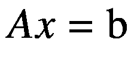

(5-1)

经典地，我们可以求解 *x* 为*A*T4-1T6】b 假设 A 的逆存在。然而，对于大型矩阵，矩阵求逆可能是难以处理的。这样的反演问题因此通过高斯消去法等方法来解决，高斯消去法对于维数为 *N* × *N* 的矩阵具有*O*(*N*T12】3 的计算复杂度。如果矩阵 a 具有稀疏性 *s* 其中 *s* 表示 a 中元素为 0 的比例，条件数 *κ* 其中 *κ* 表示最大特征值与最小特征值之比，那么共轭梯度等算法可以在*o*(*nsκ*log(1/*ϵ*)时间内解决矩阵求逆问题，其中ε为使用 HHL，在大多数情况下，我们可以通过在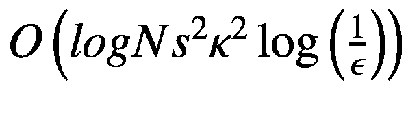时间内解决矩阵逆问题来实现计算的对数减少。

该算法对于量子机器学习的目的至关重要，因为一些机器学习算法通过解决形式为 *Aθ* = *b* 的矩阵求逆问题来学习它们的参数 *θ* 。通常，这类问题中的矩阵 *A* 是由数据矩阵 *X* 表示的训练数据点的输入特征的函数。向量 *b* 是训练数据点的数据矩阵 *X* 和目标向量 *Y* 的函数。例如，对于线性回归，其中我们对输出 y =*θ*<sup>*T*</sup>*x*进行建模，找到 *θ* 归结为求解如下给出的矩阵求逆问题:

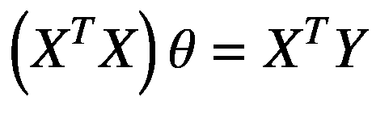

【5-2)

可以看到，*A*=*X*<sup>T5】T</sup>*X*而*b*=*X*<sup>*T*</sup>*Y*为线性回归。我们将在随后的章节中更详细地讨论量子线性回归。

在 HHL 中，我们需要找到一个或多个可以将状态∣ *b* ⟩转换为我们的解向量 *θ* 的算子。显而易见，我们早就把*中的一个*=*X*<sup>*T*</sup>*X*算进去了。我们不能选择 *A* 作为量子算符，除非 *A* 是酉的。相反，我们可以选择 *A* 到量子系统的哈密顿量 *H* ，只要 *A* 是厄米的。提醒你一下，如果矩阵或线性运算符 *H* 等于它的复共轭转置*H*T28】，那么它就是厄米的。即使 *A* 不是埃尔米特，我们也可以定义一个埃尔米特算子如下图:

![$$ \overset{\sim }{A}=\left[\begin{array}{cc}0&amp; {A}^{\dagger}\\ {}A&amp; 0\end{array}\right] $$](img/495362_1_En_5_Chapter_TeX_Equ3.png)

(5-3)

既然是厄米的，它有一个由下面给出的特征值分解:

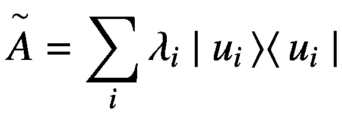

(5-4)

其中特征向量∣*u*T2】T3】It5】⟩构成了标准正交基。向量∣ *b* ⟩可以用正交基表示∣*u*<sub>*I*</sub>⟩如下图:

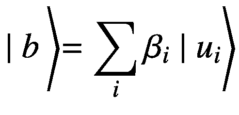

(5-5)

反问题的解则由下面给出:

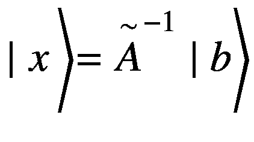

(5-6)

由于是一个具有谱分解的埃尔米特矩阵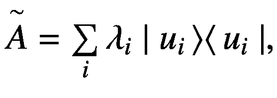，它的逆由下式给出:

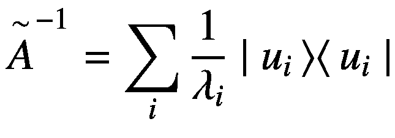

(5-7)

将方程 [5-7](#Equ7) 中的值和方程 [5-5](#Equ5) 中的∣ * b * ⟩值代入方程 [5-6](#Equ6) 中，得到∣ * x * ⟩的解，如下图:

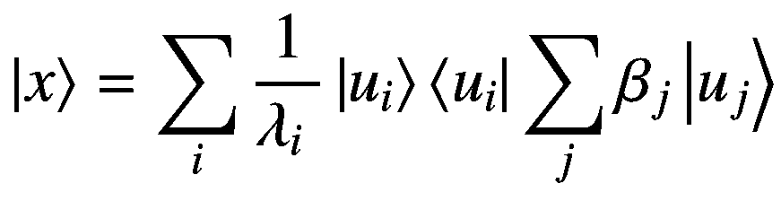

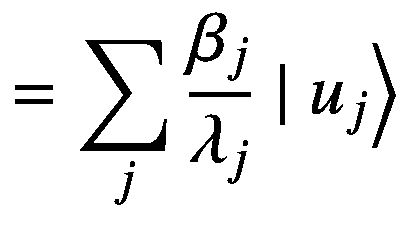

(5-8)

从方程 [5-8](#Equ8) 我们可以看出，如果我们能从本征态∣*u*T4】t5】IT7】⟩到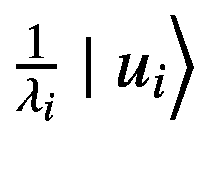，我们会更接近解。实现这一点的一种方式是使用幺正算符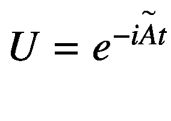对状态∣ * b * ⟩执行量子相位估计，该状态被表示为基态|*u*<sub>*I*</sub>⟩的叠加态，因为它将采用本征态∣*u*<sub>*I*</sub>⟩到*λ*<sub>*I*</sub>∣*最后，通过受控旋转，我们可以反演本征值，以取本征态从*λ*t38】t39】I*|*u*<sub>*I*</sub>⟩到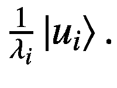。请注意，在量子相位估计可以应用于状态∣ * b * ⟩.之前，状态∣ * b * ⟩需要是单位范数

尽管我们现在对 HHL 算法有了较高层次的理解，但我们需要更详细地了解端到端实施的每个步骤。以下是 HHL 算法的步骤。

### 初始化寄存器

我们从三个音域开始 HHL。

*   在|0⟩ <sub>*和 ANC*</sub> 初始化的一个量子位的辅助寄存器。

*   保存量子相位估计特征值的工作寄存器。工作寄存器的量子位数量取决于我们想要测量特征值的精确度。寄存器从初始化的|0⟩ <sub>*W*</sub> 状态开始。

*   最终寄存器保存状态∣的值如前所述，为了进行量子相位估计，∣ *b* ⟩应为单位范数，因此我们向最终寄存器加载以下内容:


(5-9)

方程 [5-9](#Equ9) 中，归一化系数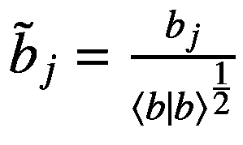。所以，三个寄存器的初始状态由下面给出:


(5-10)

### 执行量子相位估计

使用酉算子应用量子相位估计。由于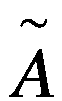具有由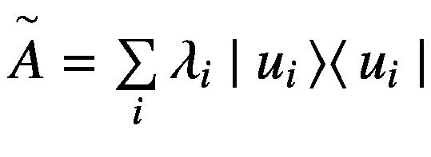给出的频谱分解，因此的频谱分解由以下给出:

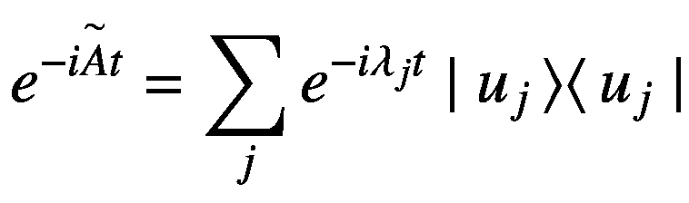

(5-11)

在方程 [5-11](#Equ11) 中，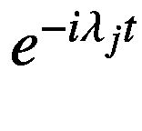是算子的特征向量∣*u*t5】T6】jt8】⟩对应的特征值。特征值可以这样写:

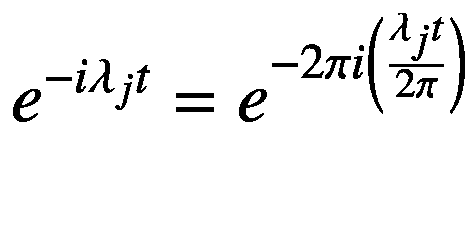

(5-12)

因此，在对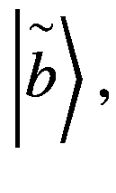使用执行量子估算时，我们将在工作寄存器中获得相位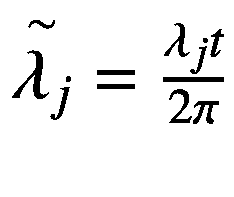。

所以，量子相位估计后系统的整体状态由下面给出:


(5-13)

### 反演特征值

我们需要反演归一化特征值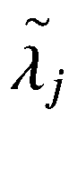。这可以通过根据状态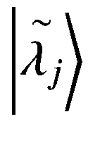围绕 *y* 轴旋转辅助量子位状态来实现。旋转角度 *θ* <sub>* j *</sub> 和与每个特征向量相关的旋转算子∣*u*<sub>*j*</sub>⟩由下式给出:

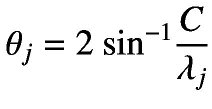

(5-14)

因此，对于每个角度*θ*<sub>T5】jT7】绕 *y* 轴的旋转算子可表示如下:</sub>


(5-15)

由于泡利矩阵![$$ Y=\left[\begin{array}{cc}0&amp; -i\\ {}i&amp; 0\end{array}\right] $$](img/495362_1_En_5_Chapter_TeX_IEq22.png)是幂等的，即满足关系*Y*T3】2=*I*，*R*<sub>*Y*</sub>(*θ*<sub>*j*</sub>)也可以写成:

![$$ {R}_y\left({\theta}_j\right)= Icos\left(\frac{\theta_j}{2}\right)- iYsin\left(\frac{\theta_j}{2}\right)=\left[\ \begin{array}{cc}\cos \left(\frac{\theta_j}{2}\right)\ &amp; -\sin \left(\frac{\theta_j}{2}\right)\ \\ {}\sin \left(\frac{\theta_j}{2}\right)&amp; \cos \left(\frac{\theta_j}{2}\right)\ \end{array}\right] $$](img/495362_1_En_5_Chapter_TeX_Equ16.png)

(5-16)

旋转矩阵会将|0⟩ <sub>*ANC*</sub> 处的辅助位的状态改变为如下:

![$$ {R}_y\left({\theta}_j\right){\left|0\right\rangle}_{ANC}=\left[\ \begin{array}{cc}\cos \left(\frac{\theta_j}{2}\right)&amp; -\sin \left(\frac{\theta_j}{2}\right)\ \\ {}\sin \left(\frac{\theta_j}{2}\right)&amp; \cos \left(\frac{\theta_j}{2}\right)\ \end{array}\right]\left[\begin{array}{c}1\\ {}0\end{array}\right]=\left[\begin{array}{c}\cos \left(\frac{\theta_j}{2}\right)\\ {}\sin \left(\frac{\theta_j}{2}\right)\end{array}\right] $$](img/495362_1_En_5_Chapter_TeX_Equb.png)

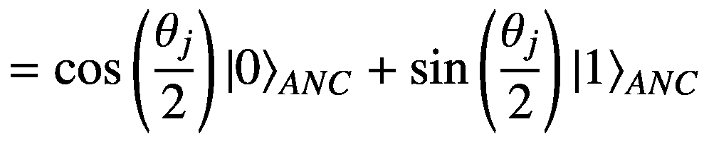

(5-17)

从方程 [5-14](#Equ14) ，我们有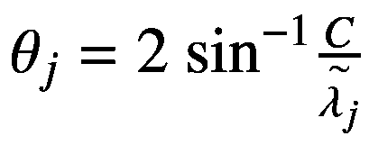，这使得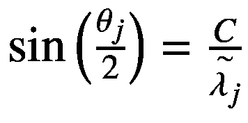和因此，方程 [5-17](#Equ17) 简化为以下:

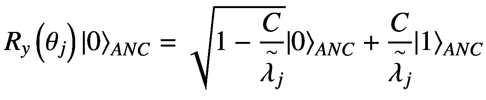

(5-18)

因此，副量子位旋转后三个寄存器的组合状态| *ψ* <sub>3</sub> ⟩由下式给出:


(5-19)

### 取消计算工作寄存器

一旦我们完成了基于工作寄存器中的特征值状态的条件旋转，我们就不再需要它们了。我们可以将量子相位估计变换的逆变换应用于我们之前应用的解算工作寄存器。本质上，对于每个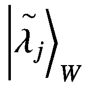状态，这个不计算步骤将工作寄存器的状态改变为|0⟩ <sub>* W *</sub> 。

因此，在解算步骤之后，三个寄存器的状态由下面给出:


=  (5-20)

既然工作寄存器已经被重置到|0⟩状态，我们可以忽略工作寄存器，因为它不再与重要的量子位状态纠缠在一起。因此，我们可以集中于辅助量子位和输入-输出寄存器量子位的组合状态，其由下面给出:

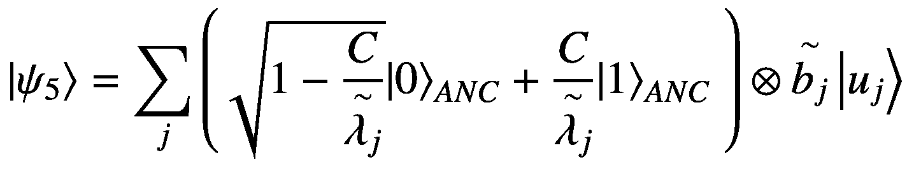


(5-21)

### 测量安西拉量子位

在最后一步，我们测量 ancilla 量子位。当辅助量子位测量状态∣1⟩时，测量后输入-输出寄存器状态由下面给出:

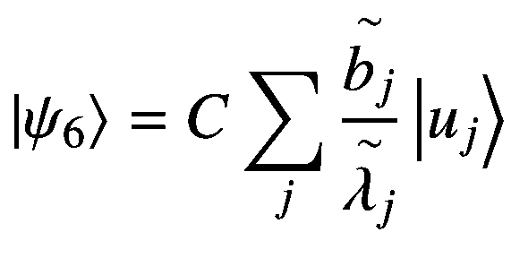

(5-22)

现在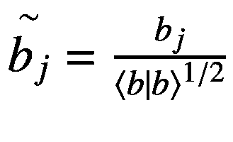和，因此我们可以将等式 [5-22](#Equ22) 改写如下:

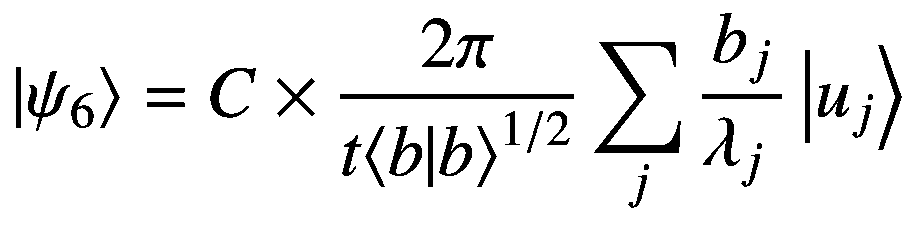

(5-23)

状态∣ *ψ* <sub>6</sub> ⟩只不过是达到由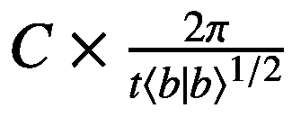给定的某个比例因子的解状态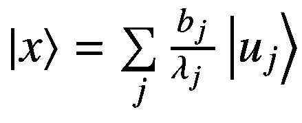。可以适当地选择比例常数 *C* 和 *t* ，以将系数减小到 1。

## 利用 Cirq 实现 HHL 算法

清单 [5-1](#PC1) 显示了以结构化方式实现的 HHL 算法。我们首先来看一下对`HHL`类的说明，它使用了`hamiltonian_simulator, QuantumPhaseEstimation`和`EigenValueInversion`类作为构建模块。`QuantumPhaseEstimation class`用于通过应用酉变换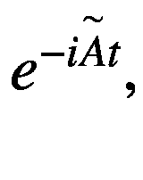将状态∣ * b * ⟩变换为特征向量及其相应特征值的张量积的叠加，如前面“执行量子相位估计”部分所述。使用`HamiltonianSimulation`类模拟酉变换，而`EigenValueInversion`类用于通过条件辅助位旋转来反转特征值。

```py
import cirq
from hamiltonian_simulator import HamiltonianSimulation
from QuantumPhaseEstimation import QuantumPhaseEstimation
from EigenValueInversion import EigenValueInversion
import numpy as np
import sympy

class HHL:

    def __init__(self,
              hamiltonian,
              initial_state=None,
              initial_state_transforms=None,
              qpe_register_size=4,
              C=None, t=1):
        """
        :param hamiltonian: Hamiltonian to Simulate
        :param C: hyper parameter to Eigen Value Inversion
        :param t: Time for which Hamiltonian is simulated
        :param initial_state: |b>
        """
        self.hamiltonian = hamiltonian
        self.initial_state = initial_state
        self.initial_state_transforms = initial_state_transforms
        self.qpe_register_size = qpe_register_size
        self.C = C
        self.t = t

        const = self.t/np.pi
        self.t = const*np.pi
        if self.C is None:
            self.C = 2*np.pi / (2**self.qpe_register_size * t)

    def build_hhl_circuit(self):
        self.circuit = cirq.Circuit()
        self.ancilla_qubit = cirq.LineQubit(0)
        self.qpe_register = [cirq.LineQubit(i)
                  for i in range(1, self.qpe_register_size+1)]
        if self.initial_state is None:
            self.initial_state_size =
        int(np.log2(self.hamiltonian.shape[0]))
            if self.initial_state_size == 1:
                self.initial_state =
                   [cirq.LineQubit(self.qpe_register_size + 1)]
            else:
                self.initial_state = [cirq.LineQubit(i) for i in
                            range(self.qpe_register_size + 1,
                             self.qpe_register_size + 1
                             + self.initial_state_size)]

        for op in list(self.initial_state_transforms):
            self.circuit.append(op(self.initial_state[0]))

        # Define Unitary Operator simulating the Hamiltonian
        self.U = HamiltonianSimulation(_H_=
                                   self.hamiltonian, t=self.t)
        # Perform Quantum Phase Estimation
        _qpe_ = QuantumPhaseEstimation(
                   input_qubits=self.initial_state, output_qubits=self.qpe_register,
                U=self.U)
        _qpe_.circuit()
        self.circuit += _qpe_.circuit
        # Perform EigenValue Inversion
        _eig_val_inv_ = EigenValueInversion(
                        num_qubits=self.qpe_register_size + 1,
                        C=self.C, t=self.t)
        self.circuit.append(_eig_val_inv_(*(self.qpe_register +
                                      [self.ancilla_qubit])))
        #Uncompute the qpe_register to |0..0> state
        self.circuit.append(_qpe_.circuit**(-1))
        self.circuit.append(
        cirq.measure(self.ancilla_qubit,key='a'))
        self.circuit.append([
            cirq.PhasedXPowGate(
            exponent=sympy.Symbol('exponent'),
            phase_exponent=
            sympy.Symbol('phase_exponent'))(*self.initial_state),
            cirq.measure(*self.initial_state, key="m")
        ])

Listing 5-1HHL Implementation

```

以下`simulate`函数运行 HHL 模拟。我们感兴趣的输出状态不能被测量，因为它会使状态崩溃。因此，在使用 HHL 的应用中，解的状态将被直接提供给推理电路。出于验证目的，我们使用泡利 *X* 、 *Y* 和 *Z* 矩阵作为测量运算符来测量溶液状态的期望值(见下文)，并将这些期望值验证为预计算的数值。

```py
    def simulate(self):
        simulator = cirq.Simulator()

        params = [{
            'exponent': 0.5,
            'phase_exponent': -0.5
        }, {
            'exponent': 0.5,
            'phase_exponent': 0
        }, {
            'exponent': 0,
            'phase_exponent': 0
        }]

        results = simulator.run_sweep(self.circuit, params, repetitions=5000)

        for label, result in zip(('X', 'Y', 'Z'),list(results)):
            expectation = 1 - 2 *np.mean
            (result.measurements['m'][result.measurements['a']
             == 1])
        print('{} = {}'.format(label, expectation))

```

我们已经在前面的章节中非常详细地了解了量子相位估计。为了便于参考，我们将在这里再次举例说明。建议读者详细研究量子相位估计，因为它是几种机器学习算法的基础。

```py
     import cirq
     from quantum_fourier_transform import QFT

     class ControlledUnitary(cirq.Gate):

          def __init__(self, num_qubits, num_input_qubits, U):
               self._num_qubits = num_qubits
               self.num_input_qubits = num_input_qubits
               self.num_control_qubits = num_qubits
                                - self.num_input_qubits
               self.U = U

          def num_qubits(self) -> int:
               return self._num_qubits

          def _decompose_(self, qubits):
               qubits = list(qubits)
               input_state_qubit =
                          qubits[:self.num_input_qubits]
               control_qubits = qubits[self.num_input_qubits:]

               for i,q in enumerate(control_qubits):
                    _pow_ =2**(self.num_control_qubits - i - 1)
                    #yield self.U(q, *input_state_qubit)**_pow_
                    yield
                        cirq.ControlledGate(self.U**_pow_)(q, *input_state_qubit)

     class QuantumPhaseEstimation:

          def __init__(self,
                           U,
                           input_qubits,
                           num_output_qubits=None,
                           output_qubits=None,
                           initial_circuit=[],
                           measure_or_sim=False):

               self.U = U
               self.input_qubits = input_qubits
               self.num_input_qubits = len(self.input_qubits)
               self.initial_circuit = initial_circuit
               self.measure_or_sim = measure_or_sim

               if output_qubits is not None:
                    self.output_qubits = output_qubits
                    self.num_output_qubits
                         = len(self.output_qubits)

               elif num_output_qubits is not None:
                    self.num_output_qubits = num_output_qubits
                    self.output_qubits = [cirq.LineQubit(i)
                         for i in range(self.num_input_qubits,
                           self.num_input_qubits
                           +self.num_output_qubits)]

               else:
                    raise ValueError("Atleast one of num_output_qubits or
                    output_qubits to be specified")

               self.num_qubits = self.num_input_qubits+
                                     self.num_output_qubits

          def inv_qft(self):
               self._qft_= QFT(qubits=self.output_qubits)
               self._qft_.qft_circuit()
               self.QFT_inv_circuit =  self._qft_.inv_circuit

          def circuit(self):
               self.circuit = cirq.Circuit()
               self.circuit.append(cirq.H.on_each(
                            *self.output_qubits))
               print(self.circuit)
               print(self.output_qubits)
               print(self.input_qubits)
               print((self.output_qubits + self.input_qubits))
               self.qubits = list(self.input_qubits
                    + self.output_qubits)
               self.circuit.append(ControlledUnitary(
                    self.num_qubits, self.num_input_qubits,
                    self.U)(*self.qubits))
               self.inv_qft()
               self.circuit.append(self.QFT_inv_circuit)
               if len(self.initial_circuit) > 0 :
                    self.circuit = self.initial_circuit
                         + self.circuit

          def measure(self):
               self.circuit.append(cirq.measure(
               *self.output_qubits,key='m'))

          def simulate_circuit(self, measure=True):
               sim = cirq.Simulator()
               if measure == False:
                    result = sim.simulate(self.circuit)
               else:
                    result = sim.run(self.circuit, repetitions=1000).histogram(key='m')
               return result

```

下面是一个模拟酉变换*e*T4*iAt*T7】的`HamiltonianSimulation`类，给出一个哈密顿算符`A`。

```py
import cirq
import numpy as np

class HamiltonianSimulation(cirq.EigenGate, cirq.SingleQubitGate):

    """
     This class simulates the Hamiltonian evolution for
     a Single qubit. For a Hamiltonian given by H the
     Unitary Operator simulated for time t is
     given by e**(-iHt). An Eigenvalue of lambda for the
      Hamiltonian H corresponds to the
      Eigenvalue of e**(-i*lambda*t).
      The EigenGate takes in an Eigenvalue of the
      form e**(i*pi*theta) as theta and the corresponding Eigenvector as |v><v|
    """

    def __init__(self, _H_, t, exponent=1.0):
        cirq.SingleQubitGate.__init__(self)
        cirq.EigenGate.__init__(self, exponent=exponent)
        self._H_ = _H_
        self.t = t
        eigen_vals, eigen_vecs = np.linalg.eigh(self._H_)
        self.eigen_components = []
        for _lambda_, vec in zip(eigen_vals, eigen_vecs.T):
            theta = -_lambda_*t / np.pi
            _proj_ = np.outer(vec, np.conj(vec))
            self.eigen_components.append((theta, _proj_))

    def _with_exponent(self, exponent):
        return HamiltonianSimulation(self._H_, self.t, exponent)

    def _eigen_components(self):
        return self.eigen_components

```

最后，我们说明了用于通过条件辅助位旋转来反转特征值的`EigenValueInversion`类。

```py
import cirq
import numpy as np
import math

class EigenValueInversion(cirq.Gate):
    """
    Rotates the ancilla bit around the Y axis
    by an angle theta = 2* sin inv(C/eigen value)
    corresponding to each Eigen value state basis |eigen value>.
    This rotation brings the factor (1/eigen value) in
    the amplitude of the basis |1> of the ancilla qubit
    """

    def __init__(self, num_qubits, C, t):
        super(EigenValueInversion, self)
        self._num_qubits = num_qubits
        self.C = C
        self.t = t
        # No of possible Eigen values self.N
        self.N = 2**(num_qubits-1)

    def num_qubits(self):
        return self._num_qubits

    def _decompose_(self, qubits):
        """
        Apply the Rotation Gate for each possible
        # Eigen value corresponding to the Eigen
        # value basis state. For each input basis state
        # only the Rotation gate corresponding to it would be
        # applied to the ancilla qubit
        """
        base_state = 2**self.N - 1

        for eig_val_state in range(self.N):
            eig_val_gate = self._ancilla_rotation(eig_val_state)

            if (eig_val_state != 0):
                base_state = eig_val_state - 1
            # XOR between successive eigen value states to
            # determine the qubits  to flip
            qubits_to_flip = eig_val_state ^ base_state

            # Apply the flips to the qubits as determined
            # by the XOR operation

            for q in qubits[-2::-1]:

                if qubits_to_flip % 2 == 1:
                    yield cirq.X(q)
                qubits_to_flip >>= 1

                # Build controlled ancilla rotation
                eig_val_gate = cirq.ControlledGate(eig_val_gate)
            # Controlled Rotation Gate with the 1st
                # (num_qubits -1) qubits as
            # control qubit and the last qubit as the target qubit(ancilla)

            yield eig_val_gate(*qubits)

    def _ancilla_rotation(self, eig_val_state):
        if eig_val_state == 0:
            eig_val_state = self.N
        theta = 2*math.asin(self.C * self.N * self.t / (2*np.pi * eig_val_state))
        # Rotation around the y axis by angle theta
        return cirq.ry(theta)

def test(num_qubits=5):
    num_input_qubits = num_qubits - 1
    # Define ancilla qubit
    ancilla_qubit = cirq.LineQubit(0)
    input_qubits = [cirq.LineQubit(i) for i in range(1, num_qubits)]
    #Define a circuit
    circuit = cirq.Circuit()
    # Set the state to equal superposition of |00000> and |00001>
    circuit.append(cirq.X(input_qubits[-4]))
    # t is set to 1
    t = 0.358166*np.pi
    # Set C to the smallest Eigen value that can be measured
    C = 2 * np.pi / ((2 ** num_input_qubits) * t)
    circuit.append(EigenValueInversion(num_qubits,C,t)(*(input_qubits + [ancilla_qubit])))
    # Simulate circuit
    sim = cirq.Simulator()
    result = sim.simulate(circuit)
    print(result)

```

我们用厄米矩阵 A 和由`initial_state_transforms`给出的初始状态 *b* 来运行 HHL 模拟。练习的预期输出是关于测量操作符 *X* 、 *Y* 和 *Z* 的解决方案状态的预期。

```py
if __name__ == '__main__':
    A = np.array([[4.30213466 - 6.01593490e-08j,
                   0.23531802 + 9.34386156e-01j],
                  [0.23531882 - 9.34388383e-01j,
                   0.58386534 + 6.01593489e-08j]])
    t = 0.358166 * np.pi
    C = None
    qpe_register_size = 4
    initial_state_transforms = [cirq.rx(1.276359), cirq.rz(1.276359)]
    _hhl_ = HHL(hamiltonian=A,
            initial_state_transforms=initial_state_transforms
            ,qpe_register_size=4)
    _hhl_.build_hhl_circuit()
    _hhl_.simulate()

xx – output -xx

X = 0.19398258115597788
Y = 0.4172494172494172
Z = -0.8893219017926735

```

关于 *X* 、 *Y* 和 *Z* 算子的解状态的期望值与经典计算值近似匹配。建议读者通过传统方法计算这些期望值来符合 HHL 给出的期望值。

## 量子线性回归

在任何回归问题中，我们都试图预测一个变量的连续值*y*<sub>*I*</sub>∈*【ℝ】T7】给定一组输入特征*x*<sup>【1】</sup>、*x*<sup>(2)</sup>…*x*<sup>(*n*)</sup>可以表示为一个*在线性回归中，我们认为输出是输入特征与一些不可约误差分量的线性组合 *e* <sub>*i*</sub> ，如下:**

**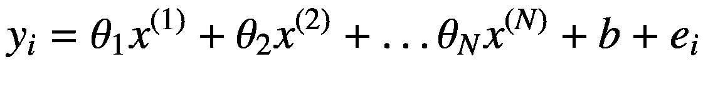**

**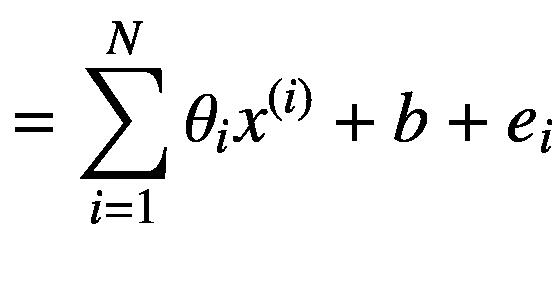**

**(5-24)**

每个特征对应的 *θ* <sub>*i*</sub> 和截距 *b* 就是我们要学习的模型的参数。如果我们表示参数*θ*<sub>*I*</sub>； *i* ∈ {1，2，.. *N* }由向量*θ*∈*ℝ*<sup>*n*</sup>，那么我们就可以将方程 [5-24](#Equ24) 中的线性关系简化为:

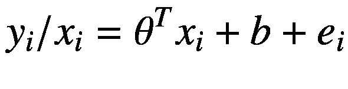

(5-25)

表达式*y*<sub>*I*/*x*<sub>*I*</sub>代表 *y* <sub>*i*</sub> 以 *x* <sub>*i*</sub> 为条件的值。现在 *e* <sub>*i*</sub> 是与输入特征共享零相关性的不可约分量，因此是不可学习的。然而，我们可以给定 *x* <sub>*i*</sub> ，完全确定术语*θ*<sup>*T*</sup>*x*<sub>*I*</sub>+*b*。误差 *e* <sub>*i*</sub> 假设服从均值为零且标准差有限的正态分布 *σ* ，因此我们可以写成:</sub>

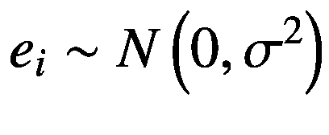

(5-26)

术语*θ*<sup>*T*</sup>*x*<sub>*I*</sub>+*b*是给定特征向量值的常数 *x* <sub>*i*</sub> ，我们可以这样说:

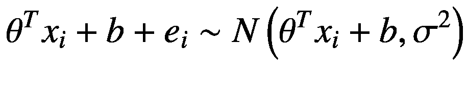

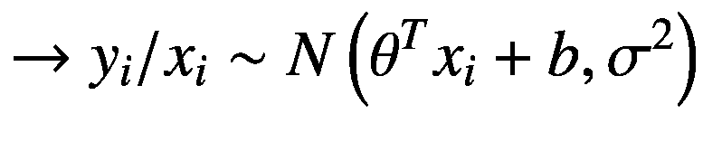

(5-27)

因此，给定输入特征的目标标号***y***<sub>***I***</sub>遵循均值为*θ*<sup>*T*</sup>*x*<sub>*I**b*和标准差 *σ* 的正态分布。在线性回归中，我们以分布的条件均值作为我们的预测，如下所示:</sub>

![$$ \hat{y_i}=\mathbbm{E}\left[{y}_i/{x}_i\right]={\theta}^T{x}_i+b $$](img/495362_1_En_5_Chapter_TeX_Equ27.png)

(5-28)

模型的参数 *θ* 和 *b* 可以通过最小化每个数据点的误差项 *e* <sub>*i*</sub> 的平方和来确定。为了便于记记，我们可以使用偏置项 *b* 作为对应于常数特性 1 的 *θ* 参数向量中的参数。这使得预测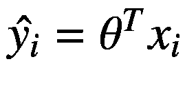其中 *θ* 和 *x* <sub>* i *</sub> 都是 *N* + 1 维向量。通过这种简化，M 个数据点的方程组可以写成矩阵符号，如下所示:

![$$ \left[\begin{array}{c}{x}_1^T\to \\ {}{x}_2^T\to \\ {}..\\ {}{x}_i^T\to \\ {}..\\ {}{x}_{M\to}^T\end{array}\right]\ \uptheta =\left[\begin{array}{c}\hat{y_1}\ \\ {}\hat{y_2}\ \\ {}..\\ {}\hat{y_i}\\ {}..\\ {}\hat{y_M}\end{array}\right] $$](img/495362_1_En_5_Chapter_TeX_Equ28.png)

(5-29)

如果我们用方程 [5-29](#Equ29) 中的输入特征向量表示矩阵为*x*∈*ℝ*<sup>*m*×(*n*+1)</sup>，预测向量为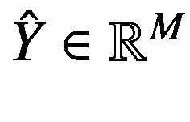，那么 [5-29](#Equ29) 可以写成:

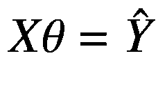

(5-30)

现在如果我们让所有 *M* 个数据点的实际目标 *y* <sub>*i*</sub> 用向量*y*∈*ℝ*<sup>*m*</sup>表示，那么我们就有误差向量*e*∈*ℝ*<sup>t21】m</sup>如下:

损失目标可以写成每个数据点的预测误差平方的平均值。

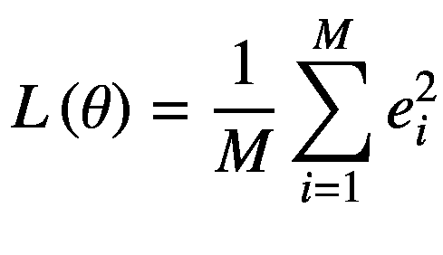

(5-32)

之前的损失无非是误差向量*e*∈*ℝ*<sup>*m*</sup>与自身的点积的平均值。这就允许我们把损失完全写在矩阵符号中，如下所示:


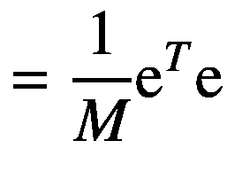

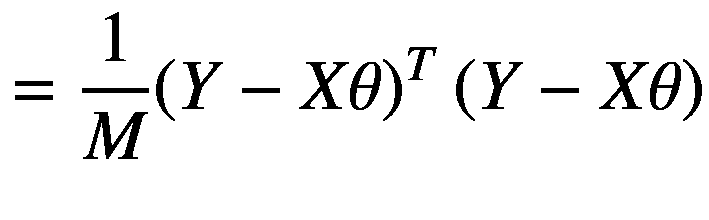

(5-33)

为了确定参数 *θ* ，我们需要最小化相对于 *θ* 的损耗 *L* ( *θ* )。为了确定最小值，我们可以取损失 *L* ( *θ* )相对于 *θ* 的梯度，并将其设置为零矢量，如下所示:

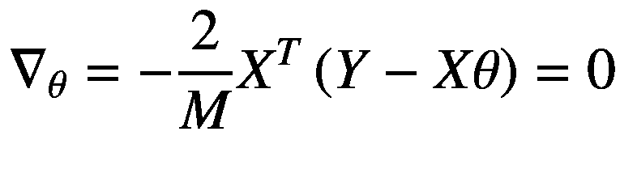

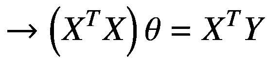

(5-34)

矩阵(*X*<sup>*T*</sup>*X*)本质上是厄米的，因此可以被视为量子系统的哈密顿量。我们可以通过使用我们之前讨论的 HHL 算法来解决方程 [5-34](#Equ34) 中的矩阵求逆问题，以找到模型参数 *θ* 。

## 量子交换测试子程序

量子交换测试是一个有效的子程序，它根据在∣0⟩.状态下测量一个辅助量子位的概率来计算两个量子态的点积由于计算点积是所有机器学习算法的基本要求，交换测试子例程将是实现量子机器学习对应物的核心。我们以两个单位范数向量∣ *a* ⟩和∣ *b* ⟩为例，说明我们如何使用图 [5-1](#Fig1) 中的电路来计算它们之间的点积。该电路还具有在∣0⟩.状态初始化的辅助量子位状态向量∣ *a* ⟩和∣ *b* ⟩可以用 log<sub>2</sub>n 量子位来表示，其中 *n* 是这些状态向量的维数。


图 5-1

交换测试以计算点积

我们将在交换测试子例程的每个阶段查看量子位的组合状态，以理解计算点积时涉及的一系列转换。

### 初态

系统的初始状态由下面给出:


(5-35)

### 安西拉量子位上的哈达玛门

在将阿达玛门应用于安西拉量子位之后，系统的组合状态变为如下:


(5-36)

### 受控交换操作

在这个步骤中，两个状态向量根据辅助量子位交换。如果辅助量子位处于状态∣0⟩，则状态∣ *a* ⟩和∣ *b* ⟩保持不变，而如果辅助量子位处于状态∣1⟩，则两个状态交换。因此，在受控交换操作之后，系统∣*ψ*T6】2⟩的组合状态如下:


(5-37)

### 控制量子位上的哈达玛门

受控交换操作后控制量子位上的哈达玛门将组合态变为|*ψ*T2】3⟩，如下图:


(5-38)

在状态|*ψ*T2】3⟩中，状态∣0⟩中的副量子位的概率是由它所依附的状态的*l*T6】2 范数的平方给出的。


(5-39)

如果我们测量副量子位处于概率为 0.5 的状态∣0⟩，那么状态∣ *a* ⟩和∣ *b* ⟩相互正交，因为在这种情况下它们的点积⟨ *a* | *b* ⟩根据等式 [5-39](#Equ39) 结果为 0。类似地，当状态∣ *a* ⟩和∣ *b* ⟩相同时，点积⟨ *a* | *b* ⟩ = 1，并且状态∣0⟩中的辅助量子位的概率变成 1。与传统方法相比，计算点积的交换测试方法的优点是时间复杂度与代表每个状态所需的量子位数量不成比例。

## 交换测试实现

在本节中，我们使用 Cirq 实现两个单位向量的交换测试。实现两个量子态的点积的`SwapTest`类将`prepare_input_states`、`input_state_dim`和`nq`作为输入。当`prepare_input_states`被设置为`True`时，该例程基于`input_state_dim and`定义所需的量子位，并基于作为`build_circuit`功能输入的`input_1_transforms`和`input_2_transforms`创建所需的输入状态。当`prepare_input_states`设置为`False`时，输入状态作为`input_1`和`input_2 in the build_circuit`功能直接输入。输入`nq`用于指定在调用交换测试程序之前已经定义的量子位的数量，以便在交换测试中以所需的偏移量定义量子位。清单 [5-2](#PC7) 展示了这个实现。

```py
import cirq
import numpy as np

class SwapTest:
    def __init__(self,prepare_input_states=False,
input_state_dim=None,nq=0,
measure=False,copies=1000):
        self.nq = nq
        self.prepare_input_states = prepare_input_states
        self.input_state_dim = input_state_dim
        if input_state_dim is not None:
            self.num_qubits_input_states
            = int(np.log2(self.input_state_dim))
            print(self.num_qubits_input_states)

        self.measure = measure
        self.copies = copies
        self.ancilla_qubit = cirq.LineQubit(self.nq)
        self.nq += 1

        if self.prepare_input_states:
            if input_state_dim is None:
                raise ValueError("Please enter a
                valid dimension for input states to compare")
            else:
                self.num_qubits_input_states
                = int(np.log2(self.input_state_dim))
                self.input_1 = [cirq.LineQubit(i)
for i in range(self.nq, self.nq +self.num_qubits_input_states)]
                self.nq += self.num_qubits_input_states
                self.input_2 = [cirq.LineQubit(i)
for i in range(self.nq, self.nq + self.num_qubits_input_states)]
                self.nq += self.num_qubits_input_states

Listing 5-2Implementation of Swap Test for Dot Product Computation

```

在`build_circuit`中，我们想要计算点积的两个输入状态| *a* ⟩和∣ *b* ⟩可以通过`input_1`和`input_2`直接输入，或者使用`input_1_transforms`和`input_2_transforms`中指定的一组酉变换来构造。接下来，我们对辅助量子位执行哈达玛变换`H`，并接着进行与输入状态∣ *a* ⟩和∣ *b* ⟩.相对应的量子位的受控交换(基于辅助量子位)最后，我们测量安西拉量子位。

```py
    def build_circuit(self,input_1=None,
    input_2=None,input_1_transforms=None,
    input_2_transforms=None):

        self.circuit = cirq.Circuit()
        if input_1 is not None:
            self.input_1 = input_1
        if input_2 is not None:
            self.input_2 = input_2
        if input_1_transforms is not None:
            for op in input_1_transforms:
                print(op)
                print(self.input_1)
                self.circuit.append(op.on_each(self.input_1))
        if input_2_transforms is not None:
            for op in input_2_transforms:
                self.circuit.append(op.on_each(self.input_2))

        # Ancilla in + state
        self.circuit.append(cirq.H(self.ancilla_qubit))
        # Swap states conditoned on the ancilla
        for i in range(len(self.input_1)):
            self.circuit.append(cirq.CSWAP(
            self.ancilla_qubit, self.input_1[i], self.input_2[i]))
        # Hadamard Transform on Ancilla
        self.circuit.append(cirq.H(self.ancilla_qubit))
        if self.measure:
            self.circuit.append(cirq.measure(
            self.ancilla_qubit,key='m'))
        print(self.circuit)

```

在接下来定义的`simulate`函数中，我们多次模拟交换电路，并且基于副量子位测量为状态∣0⟩的次数，我们估计概率 *P* (| 0⟩).两个状态∣ *a* ⟩和∣ *b* ⟩之间的点积的平方计算为(2*p*(|0⟩)—1)。

```py
    def simulate(self):
        sim = cirq.Simulator()
        results = sim.run(self.circuit,repetitions=self.copies)
        results = results.histogram(key='m')
        prob_0 = results[0]/self.copies
        dot_product_sq = 2*(max(prob_0 - .5,0))
        return prob_0,dot_product_sq

def main(prepare_input_states=True,input_state_dim=4,
                  input_1_transforms=[cirq.H],
                  input_2_transforms=[cirq.I],
                  measure=True,copies=1000):
    st = SwapTest(prepare_input_states=prepare_input_states,input_state_dim=input_state_dim,measure=measure,copies=copies)
    st.build_circuit(input_1_transforms=input_1_transforms,
                     input_2_transforms=input_2_transforms)
    prob_0, dot_product_sq = st.simulate()
    print(f"Probability of zero state {prob_0}")
    print(f"Sq of Dot product  {dot_product_sq}")
    print(f"Dot product  {dot_product_sq**0.5}")

if __name__ == '__main__':
    main()

x output x

0: ───H───@───@───H───M('m')───
            │    │
1: ───H───×───┼────────────────
            │    │
2: ───H───┼───×────────────────
            │    │
3: ───I───×───┼────────────────
                  │
4: ───I───────×────────────────

Probability of zero state 0.644
Sq of Dot product  0.28800000000000003
Dot product  0.5366563145999496

```

在交换测试实现中，我们测试通过在∣00⟩初始化的两个量子位上应用哈达玛变换而获得的相等叠加状态和状态| * b * ⟩ = ∣00⟩.之间的点积交换测试电路给出`0.53`的点积，接近预期值`0.5`。还报告了从测量得到的副量子位为 1 的概率，以供参考。

## 量子欧几里德距离计算

与点积非常相似，欧氏距离是 k-means 聚类和 *K* 最近邻等几种机器学习算法的核心组成部分。

用矢量表示的经典数据一般用单位矢量∣ * a * ⟩编码为量子态，如下图:


(5-40)

在机器学习中，我们感兴趣的是找出通常不是单位向量的向量之间的欧几里德距离。让我们试着计算由和表示的两个一般向量之间的欧几里德距离，这两个向量的 *l* <sup>2</sup> 范数不一定是 1。事实证明，我们可以智能地使用交换测试来计算和之间的欧几里德距离。

我们通过归一化和来创建两个量子态∣ * a * ⟩和∣ * b * ⟩，如方程式 [5-40](#Equ40) 所示。现在使用∣ * a * ⟩和∣ * b * ⟩以及另一个量子位，我们可以创建两个状态∣ * ψ * ⟩和∣*ϕ*а如下所示:


(5-41)

在方程 [5-41](#Equ41) 中， *Z* 是和的*l*T6】2 范数的平方之和。换句话说，。

用| *ψ* ⟩和| *ϕ* ⟩进行交换测试，我们将从等式 [5-39](#Equ39) 得到点积⟨ *ψ* | *ϕ* ⟩关于测量∣0⟩态的副量子位的概率，如下所示:


(5-42)

现在点积⟨ *ψ* | *ϕ* ⟩可以简化为:


(5-43)

将表达式代入方程 [5-42](#Equ42) 中的⟨ *ψ* | *ϕ* ⟩，我们得到如下:


(5-44)

因此，从等式 [5-44](#Equ44) 中，我们可以看到，欧几里得距离的平方可以从测量∣0⟩态的副量子位的概率和已知的值 *Z* 中计算出来，如下所示:


(5-45)

### 创建没有 QRAM 的初始国家

使用 QRAM 基础设施很容易创建初始状态。由于我们实际上没有 QRAM 可供我们支配，我们将不得不寻找另一种方法来创造这种状态。以下是一个电路(见图 [5-2](#Fig2) )可以用来创建初始状态∣ * ψ * ⟩.如图 [5-2](#Fig2) 所示，我们从四个量子位的寄存器开始，并且第一个寄存器|*q*<sub>0</sub>⟩<sub>*a*</sub>有一个量子位，并且后缀为 *A* ，因为它充当一个辅助量子位。第二个寄存器|*q*<sub>1</sub>⟩<sub>*w*</sub>是保存输入状态的工作寄存器。从属和工作寄存器的张量状态|*q*<sub>0</sub>⟩<sub>*a*</sub>⊗|*q*<sub>1</sub>⟩<sub>*w*</sub>在电路结束时将要保持状态。一旦使用辅助量子位和工作寄存器创建了所需的状态，我们需要解算量子位 *q* <sub>2</sub> 和 *q* <sub>3</sub> 的状态，它们将输入状态∣ * a * ⟩和∣ * b * ⟩保持在初始化状态∣0⟩，这样它们就不会与辅助和工作寄存器纠缠在一起。


图 5-2

用于欧几里德距离计算的初始状态创建电路

## 量子欧几里德距离计算例程实现

在本节中，我们使用本章中已经实现的交换测试例程来实现量子欧几里德距离计算例程。给定两个向量和，我们要计算它们的欧几里德距离，例程首先构造两个状态和，其中| * a * ⟩和| * b * ⟩是对应于和的单位向量。术语 *Z* 等于和的*l*T15】2 定额的平方之和。一旦构造了状态∣ * ψ * ⟩和| * ϕ * ⟩，我们就将它们送入已经实现的交换测试例程`SwapTest`来计算⟨ * ψ * | * ϕ * ⟩.距离的平方然后可以估计为 4*z*⟨*ψ*|*ϕ*⟩<sup>2</sup>。清单 [5-3](#PC10) 显示了详细的实现。

```py
import cirq
import numpy as np
import math
from swap_test import SwapTest

class Euclidean_distance:
    def __init__(self, input_state_dim
  ,prepare_input_states=False,
  copies=10000):
        self.prepare_input_states = prepare_input_states
        self.input_state_dim = input_state_dim
        self.copies = copies
        self.nq = 0
        self.control_qubit = cirq.LineQubit(0)
        self.nq += 1

        self.num_qubits_per_state
        = int(np.log2(self.input_state_dim))
        self.state_store_qubits = [cirq.LineQubit(i) for i
                           in range(self.nq,
                           self.nq +self.num_qubits_per_state)]
        self.nq += self.num_qubits_per_state

        if self.prepare_input_states:

            self.input_1 = [cirq.LineQubit(i)
                    for i in range(self.nq, self.nq +
                              self.num_qubits_per_state)]
            self.nq += self.num_qubits_per_state

            self.input_2 = [cirq.LineQubit(i)
                   for i in range(self.nq, self.nq +
                             self.num_qubits_per_state)]
            self.nq += self.num_qubits_per_state

        self.other_state_qubits = [cirq.LineQubit(i)
                    for i in range(self.nq,self.nq + 1 +
                                   self.num_qubits_per_state)]
        self.nq += 1 + self.num_qubits_per_state
        self.circuit = cirq.Circuit()

Listing 5-3Implementation of Quantum Euclidean Distance Computation

```

`dist_circuit`函数中的主要活动是从输入状态| *a* ⟩和∣ *b* ⟩创建状态| *ψ* ⟩和∣ *ϕ* ⟩，然后将它们提供给`SwapTest`例程以计算⟨*ψ*|*⒇*。

```py
    def dist_circuit(self, input_1_norm=1, input_2_norm=1,
                    input_1=None,
                          input_2=None,
                    input_1_transforms=None,
                    input_2_transforms=None,
                          input_1_circuit=None,
           input_2_circuit=None):

        self.input_1_norm = input_1_norm
        self.input_2_norm = input_2_norm
        self.input_1_circuit = input_1_circuit
        self.input_2_circuit = input_2_circuit

        if input_1 is not None:
            self.input_1 = input_1

        if input_2 is not None:
            self.input_2 = input_2

        if input_1_transforms is not None:

            self.input_1_circuit = []

            for op in input_1_transforms:
                self.circuit.append(op.on_each(self.input_1))
                self.input_1_circuit.append(op.on_each(
                self.input_1))
        if input_2_transforms is not None:
            self.input_2_circuit = []
            for op in input_2_transforms:
                self.circuit.append(op.on_each(self.input_2))
                self.input_2_circuit.append(
                op.on_each(self.input_2))

        self.input_1_uncompute = cirq.inverse(self.input_1_circuit)
        self.input_2_uncompute = cirq.inverse(self.input_2_circuit)

        # Create the required state 1

        self.circuit.append(cirq.H(self.control_qubit))

        for i in range(len(self.input_2)):
            self.circuit.append(cirq.CSWAP(self.control_qubit,
                    self.state_store_qubits[i],
                    self.input_2[i]))
        self.circuit.append(cirq.X(self.control_qubit))

        for i in range(len(self.input_1)):
            self.circuit.append(cirq.CSWAP(self.control_qubit,
                    self.state_store_qubits[i],
                    self.input_1[i]))
        for c in self.input_2_uncompute:
            self.circuit.append(c[0].controlled_by(
                              self.control_qubit))
        self.circuit.append(cirq.X(self.control_qubit))
        for c in self.input_1_uncompute:
            self.circuit.append(c[0].controlled_by(
            self.control_qubit))

        # Prepare the other state qubit
        self.Z = self.input_1_norm**2 + self.input_2_norm**2
        print(self.Z)
        theta = 2*math.acos(self.input_1_norm/np.sqrt(self.Z))
        self.circuit.append(cirq.ry(theta)
        (self.other_state_qubits[0]))
        self.circuit.append(cirq.Z(self.other_state_qubits[0]))

        self.st = SwapTest(prepare_input_states=False,
                    input_state_dim=4,nq=self.nq,measure=False)

        print(self.other_state_qubits)
        self.state = [self.control_qubit] +
        self.state_store_qubits
        self.st.build_circuit(input_1=self.state,
        input_2=self.other_state_qubits)
        self.circuit += self.st.circuit
        self.circuit.append(cirq.measure(
        self.st.ancilla_qubit, key="k"))
        print(self.circuit)

    def compute_distance(self):
        sim = cirq.Simulator()
        results = sim.run(self.circuit,
          repetitions=self.copies).histogram(key='k')
        results = dict(results)
        print(results)
        results = dict(results)
        prob_0 = results[0]/self.copies
        print(prob_0)
        Euclidean_distance = 4*self.Z*max((prob_0 - 0.5),0)
        print("Euclidean distance",Euclidean_distance)

if __name__ == '__main__':

    dist_obj = Euclidean_distance(input_state_dim=2,
    prepare_input_states=True,copies=100000)
    dist_obj.dist_circuit(
    input_1_transforms=[cirq.H], input_2_transforms=[cirq.H])
    dist_obj.compute_distance()

x output x

```

我们首先计算两个向量之间的欧几里德距离，这两个向量都处于相等的叠加状态。我们将哈达玛变换传递给 input _ 1 _ tranforms，以从在∣0⟩态初始化的输入量子位创建相等的叠加态。图 [5-3](#Fig3) 显示了该电路。


图 5-3

欧几里德距离计算电路

不出所料，欧氏距离为 0。

## 量子 K-均值聚类

k-means 聚类的量子实现可以使用欧几里德距离计算例程以及我们在第 [2](2.html) 章中使用的 Grover 搜索算法例程来实现。这些步骤与经典的 k-means 算法相同，每个步骤都由量子程序执行，而不是通过经典程序。以下部分概述了这些步骤。

**初始化**

初始化 *k* 簇质心*μ*T4】1，*μ*<sub>2</sub>…*μ*<sub>*k*</sub>∈*ℝ*<sup>*n*</sup>使用类似于经典版 k-means 中的启发式算法。例如，可以随机选择 *k* 个数据点作为初始聚类。

**直到收敛**

以下是步骤:

1.  对于每个数据点*x*<sub>*I*</sub>∈*ℝ*<sup>*n*</sup>由经典存储的其量值表示，并且由存储为量子状态的其单位范数∣*x*<sub>*I*</sub>⟩表示，我们使用量子欧几里德距离计算例程计算其与每个 *k* 簇质心的距离，如下所示:

    

    (5-46)  
2.  使用格罗弗搜索算法将每个数据点 *x* <sub>*i*</sub> 分配到 *k* 簇之一。Grover 搜索算法的 oracle 应该能够获取距离 *d* ( *i* ， *j* )并分配正确的集群 *c* <sub>*i*</sub> ，如下所示。

    

    (5-47)  
3.  一旦每个数据点 *x* <sub>*i*</sub> 被分配了其聚类 *c* <sub>*i*</sub> ∈ {1，2，… *k* }，每个聚类的平均值或质心计算如下:

    

    (5-48)

    在上式中， *N* <sub>*j*</sub> 表示属于聚类 *j* 的数据点的数量。

当数据点在每个后续迭代中停止改变聚类时，该算法收敛。经典的 k-means 聚类在每次迭代中的复杂度为 *O* ( *MNk* )。每个数据点到聚类的距离计算复杂度为 *O* ( *N* )，其中 *N* 是数据点的特征数量。由于有 *k* 个聚类，对于每个数据点，复杂度为 *O* ( *Nk* )。此外，由于每个 *M* 数据点的复杂度为 *O* ( *Nk* )，因此每次迭代的算法总复杂度为 *O* ( *MNk* )。我们在量子 k-means 中的得分是这样的事实，即对于特征维度 *N* 的大值，来自聚类的每个数据点的量子欧几里德距离计算的顺序是 *O* ( *logN* ，给出了*Mlog*(*N*)*k*。这里需要注意的一点是，基于距离最小化将每个数据点分配到适当的聚类的复杂性对于经典和量子 k-means 都没有被考虑。在这方面，如果设计得当，用于将数据点分配到其适当聚类的 Grover 算法可以提供进一步的加速。

## 基于余弦距离的量子 K-均值聚类

在本节中，我们使用余弦距离作为距离矩阵来实现量子 k-means 聚类算法。两个向量和之间的余弦相似度定义为给定向量方向上单位向量∣ * x * ⟩和∣ * y * ⟩之间的距离。由于单位矢量有单位范数，它们可以直接映射到量子态。单位向量∣ * x * ⟩和∣ * y * ⟩之间的欧几里德距离的平方由下式给出:


(5-49)

从交换测试中，我们知道测量从状态为 0 的概率由给出，这给我们测量状态为 1 的概率如下:


(5-50)

尽管辅助位为 1 的测量概率不完全等于余弦距离，但是从等式 [5-49](#Equ48) 和等式 [5-50](#Equ50) 中可以明显看出，它与余弦距离具有很高的相关性。事实上，由于平方项⟨*x*|*y*⟩<sup>2</sup>，由 *P* (1)给出的距离度量以相同的方式对待正相关和负相关。这对于只有相关性的大小是重要的几个应用可能是有利的。在这个练习中，我们使用交换测试例程来计算属于给定向量的单位向量之间的点积，并使用 ancilla 量子位为 1 的概率作为我们的距离度量。该实现中使用的数据集(参见清单 [5-4](#PC12) )包含客户的年收入和支出分数作为特征。我们将使用这两个特性来创建相关的客户群。清单 [5-4](#PC12) 显示了详细的实现。

```py
import cirq
from swap_test import SwapTest
import pandas as pd
import math
import numpy as np
import matplotlib
import matplotlib.pyplot as plt

class QuantumKMeans:

    def __init__(self,data_csv,num_clusters,
    features,copies=1000,iters=100):
        self.data_csv = data_csv
        self.num_clusters = num_clusters
        self.features = features
        self.copies = copies
        self.iters = iters

Listing 5-4Quantum K-Means Clustering

```

一旦归一化为单位矢量|*x*⟩=[*x*T4】1T6】x<sub>2</sub><sup>*t*</sup>的两个特征可以用一个量子比特的状态来表示。我们通过测量角度 *θ* 来计算单位向量的方向，该角度是特征向量与量子位基态∣0⟩.所成的角度这让我们把单位矢量表示为|*x*⟩=[*cosθsinθ*]<sup>*t*</sup>。

```py
    def data_preprocess(self):
        df = pd.read_csv(self.data_csv)
        print(df.columns)
        df['theta'] = df.apply(lambda x:
        math.atan(x[self.features[1]]/
        x[self.features[0]]), axis=1)
        self.X = df.values[:,:2]
        self.row_norms = np.sqrt((self.X**2).sum(axis=1))
        self.X = self.X/self.row_norms[:, np.newaxis]
        self.X_q_theta = df.values[:,2]
        self.num_data points = self.X.shape[0]

```

我们可以通过应用由给出的幺正变换将∣0⟩态的量子位带到状态，其中 *Y* 是由![$$ Y=\left[\begin{array}{cc}0&amp; -i\\ {}i&amp; 0\end{array}\right] $$](img/495362_1_En_5_Chapter_TeX_IEq70.png)给出的泡利矩阵。

因此，为了准备量子位状态|*x*⟩=[*cosθsinθ*]<sup>*t*</sup>，我们可以应用酉变换 *U* (2 *θ* )。我们使用`cirq.ry`应用同样的方法，如下面定义的距离函数所示。我们需要测量距离的两个单位向量由`_distance_`函数的参数 *x* 和 *y* 定义。这里， *x* 和 *y* 是对`cirq.ry`提供的酉变换的旋转角度。这些酉变换将首先应用于在∣0⟩初始化的两个量子位，以实现∣ *x* ⟩和∣ *y* ⟩的状态，然后交换测试将用于计算它们之间的距离。

```py
    def distance(self,x,y):
        st = SwapTest(prepare_input_states=True, input_state_dim=2, measure=True,
                      copies=self.copies)
        st.build_circuit(input_1_transforms=[cirq.ry(x)],
                         input_2_transforms=[cirq.ry(y)])
        prob_0, _ = st.simulate()
        _distance_ = 1 - prob_0
        del st
        return _distance_

```

代码的其余部分使用从交换测试中计算出的距离来实现 k-means 算法，如前所述。距离基本上用于将表示为单位向量状态的数据点分配给最近的聚类。在这里，传统上使用`assign_clusters`中的`numpy argmin`功能来完成分配。

```py
    def init_clusters(self):
        self.cluster_points=np.random.randint(
        self.num_data points,
        size=self.num_clusters)
        self.cluster_data points = self.X[self.cluster_points,:]
        self.cluster_theta = self.X_q_theta[self.cluster_points]
        self.clusters = np.zeros(len(self.X_q_theta))

    def assign_clusters(self):
        self.distance_matrix = np.zeros((self.num_data points,
        self.num_clusters))

        for i,x in enumerate(list(self.X_q_theta)):
            for j,y in enumerate(list(self.cluster_theta)):
                self.distance_matrix[i, j] = self.distance(x,y)
        self.clusters = np.argmin(self.distance_matrix,axis=1)

```

基于为每个数据点分配的聚类，`update_clusters`例程计算每个聚类的质心。

```py
    def update_clusters(self):
        updated_cluster_data points = []
        updated_cluster_theta = []
        for k in range(self.num_clusters):

            centroid = np.mean(self.X[self.clusters == k],axis=0)
            centroid_theta = math.atan(centroid[1]/centroid[0])
            updated_cluster_data points.append(centroid)
            updated_cluster_theta.append(centroid_theta)

        self.cluster_data points= np.array(updated_cluster_data points)
        self.cluster_theta = np.array(updated_cluster_theta)

    def plot(self):
        fig = plt.figure(figsize=(8, 8))
        colors = ['red', 'green', 'blue', 'purple','yellow','black']
        plt.scatter(self.X[:,0],self.X[:,1],c=self.clusters,
                    cmap=matplotlib.colors.ListedColormap(colors[:self.num_clusters]))
        plt.savefig('Clusters.png')

    def run(self):
        self.data_preprocess()
        self.init_clusters()
        for  i in range(self.iters):
            self.assign_clusters()
            self.update_clusters()
        self.plot()

if __name__ == '__main__':
    data_csv = '/home/santanu/Downloads/DataForQComparison.csv'
    num_clusters = 4
    qkmeans = QuantumKMeans(data_csv=data_csv, num_clusters=num_clusters,
               iters=10,features=['Annual Income_k$',0'])
    qkmeans.run()

```

**输出**

已经针对一对数据点示出了测量距离的电路。

```py
0: ───H──────────@───H───M('m')───
                      │
1: ───Ry(0.07π)────×────────────────
                      │
2: ───Ry(0.043π)───×────────────────

```

我们使用 matplotlib 函数来绘制聚类的结果。由于我们已经将数据归一化为单位范数，以将其视为量子态，因此所有数据点都位于单位圆上(见图 [5-4](#Fig4) )。因此，具有高余弦相似性的状态向量应该在相同的群集中。我们为此数据集创建了四个客户群。


图 5-4

量子 k-均值团簇

## 量子主成分分析

主成分分析(PCA)是广泛使用的用于输入数据降维的机器学习算法之一。给定 *M* 个数据点*x*<sub>T5】I</sub>的维数 *N* ，主成分分析的目标是利用数据协方差矩阵的特征向量作为数据的新维数。对于高度相关的数据，整个数据集中的可变性几乎是通过沿着具有高度可变性的前几个特征向量投影数据来捕获的。特征值给出了数据沿不同特征向量的可变性，其中较大的特征值对应于数据沿其相应特征向量的较大可变性。可以通过只选择具有最高特征值的前几个特征向量来减少数据的维数。这些选择的特征向量在 PCA 的上下文中被称为*主成分*。您可能已经意识到，PCA 算法的关键在于有效地执行协方差矩阵的特征值分解。

量子主成分分析旨在使用量子算法执行特征值分解，以减少与其经典对应物相比的计算复杂度。具体而言，量子相位估计算法用于确定协方差矩阵的特征向量，其充当模拟量子系统的哈密顿量。以下是量子原理算法的步骤。

### 预处理并将经典数据转换成量子态

量子主成分分析的第一步是将经典数据转换成量子态。假设我们有 *M* 个数据点*x*<sub>*I*</sub>∈*ℝ*<sup>*n*</sup>。我们首先从每个数据点中减去平均向量，使它们以零为中心，如下所示:


(5-51)

一旦均值居中，我们将每个数据点*x*T2】T3It5】除以它们的*l*t8】2 范数| |*x*t13】It15】| |<sub>2</sub>使得每个都具有单位范数，因此可以被视为量子态∣*x*t20】t21】It23】⟩.


(5-52)

### 混合密度矩阵或协方差矩阵的创建

给定量子态∣ *x* <sub>*i*</sub> ⟩，每个数据点的密度矩阵由下式给出:


(5-53)

现在对于可以以相等经典概率存在于任何一个 *M* 态的混合量子系统，密度矩阵由下面给出:


(5-54)

*N* 维状态向量| *x* <sub>*i*</sub> ⟩可以用正交基| *k* ⟩表示其中 *k* ∈ {0，1，2，..*N*—1 }，如下:


(5-55)

将状态向量∣*x*T2】T3】It5】⟩的表达式从方程 [5-55](#Equ55) 代入方程 [5-54](#Equ53) ，我们得到如下:


(5-56)

我们通常在主成分分析中处理实数据，因此 *x* <sub>*im*</sub> 等于它的复共轭因此我们可以将方程 [5-56](#Equ56) 重写如下:


(5-57)

由于数据已经以零为中心，等式 [5-57](#Equ57) 中的 *ρ* 的表达式只不过是协方差矩阵，其中对应于行 *m* 和列 *k* 的条目由外积| *m* ⟩⟨ *k* 给出。因此，方程 [5-57](#Equ57) 中的 *ρ* 可以写成:

![$$ \rho =\frac{1}{M}\sum \limits_{i=1}^M\left[\begin{array}{ccc}\sum \limits_i{x}_{i0}^2&amp; {\sum}_i{x}_{i0}{x}_{i1}&amp; \dots \kern0.5em {\sum}_i{x}_{i0}{x}_{i\left(N-1\right)}\\ {}{\sum}_i{x}_{i1}{x}_{i0}&amp; \sum \limits_i{x}_{i1}^2&amp; \dots \kern0.75em {\sum}_i{x}_{i1}{x}_{i\left(N-1\right)}\\ {}\dots \kern0.5em &amp; \dots &amp; \dots \\ {}\kern0.5em {\sum}_i{x}_{i\left(N-1\right)}{x}_{i0}&amp; {\sum}_i{x}_{i\left(N-1\right)}{x}_{i1}&amp; \dots \kern1em \sum \limits_i{x}_{i\left(N-1\right)}^2\end{array}\right] $$](img/495362_1_En_5_Chapter_TeX_Equ57.png)

(5-58)

### 作为哈密顿量的密度矩阵

作为协方差矩阵的密度矩阵通常是对称的或埃尔米特的，因此具有一组具有实特征值的正交特征向量。因此，密度矩阵可以视为量子系统的哈密顿量。使用密度矩阵作为哈密顿量，我们可以使用幺正算符*U*=*e*<sup>*Iρt*</sup>来模拟量子系统。

### 酉算子谱分解的量子相位估计

我们可以智能地使用量子相位估计算法来执行幺正算符的谱分解，并最终执行密度矩阵。对于量子相位估计，我们的酉算符是=*e*<sup>—*Iρt*</sup>。通常，在量子相位估计中，给定一个幺正算符和它的一个特征向量状态，我们计算它相应的特征值。由于在这个问题中，我们需要找到特征值及其相应的特征向量，我们不能从一个已知的特征向量状态开始。如果密度矩阵 *ρ* 具有由给出的谱分解，那么酉算子具有由以下给出的谱分解:


(5-59)

如果我们使用一个*n*-量子位工作寄存器进行量子相位估计，那么具有任意本征态的量子相位估计| *ϕ* <sub>*j*</sub> ⟩将为我们获取本征相位，如下所示:


(5-60)

现在既然我们不知道本征值，我们可以从一个数据点状态∣*x*T2】T3】It5】⟩开始，它可以表示为本征值状态的叠加


(5-61)

因此，对数据点状态| *x* <sub>*i*</sub> ⟩的量子相位估计可以表示如下:


(5-62)

代替数据点| *x* <sub>*i*</sub> ⟩，我们可以想到密度矩阵上的量子相位估计|*x*<sub>*I*</sub>⟩⟨*x*<sub>*I*</sub>∣.如果对∣*x*t20】t21】It23】⟩输出的量子相位估计是∣*y*t26】t27】It29】⟩(见方程 [5-62](#Equ62) ，那么对∣*x*t34】t35】It37】⟩⟨*x*t40】t41】I 的量子相位估计

现在我们已经有了密度矩阵∣*x*T2】T3】It5】⟩⟨*x*T9】It11】∣对于数据点状态∣*x*t14】t15】It17】⟩的量子相位估计结果，我们可以将其扩展到所有数据点的混合状态。这里同样可以表述为:


(5-64)

现在让我们看看能否简化方程 [5-64](#Equ64) 中的表达式。我们有*x*<sub>*ij*</sub>=⟨*ϕ*<sub>*j*</sub>|*x*<sub>*I*</sub>⟩因而有如下:


(5-65)

取|*x*<sub>T3】ij</sub>|<sup>2</sup>以上这 M 个数据点，我们有如下:


(5-66)

既然∣*<sub>*j*</sub>⟩是 *ρ* 的特征向量，我们就有了⟨*ϕ*<sub>*j*</sub>|*ρ*|*ϕ*<sub>*j*</sub>⟩=*λ*<sub>*j*</sub>。这将方程式 [5-66](#Equ66) 简化为如下:*

**

*(5-67)

将方程 [5-67](#Equ67) 中的代入方程 [5-64](#Equ64) ，密度矩阵 *ρ* 的量子相位估计简化为:


(5-68)

### 提取主成分

最终态 *η* 的本征态与对应的本征态纠缠，因此通过对最终态的测量，我们将得到本征态∣*ϕ*T4】t5】jT7】⟩和本征态 *λ* <sub>*j*</sub> 概率 *λ* <sub>*j*</sub> 。因此，如果我们进行 *m* 测量，主分量向量∣*ϕ*t24】T25】jt27】⟩将得到大约*mλ*t30】t31】jt33】次采样。

我们可以利用互换检验计算出给定数据点∣*x*t8】T9】It11】⟩沿第*j*th 主成分∣*ϕ*<sub>*j*</sub>⟩的投影*s*<sub>*ij*t5】</sub>


(5-69)

基于我们想要保留的主成分数 *k* ， *x* <sub>*i*</sub> ⟩状态向量可以表示为由如下 *k* 主成分组成的基:

![$$ \left|{x}_i\right\rangle ={\left[{s}_{i1}\ {s}_{i2}\dots ..{s}_{ik}\right]}^T $$](img/495362_1_En_5_Chapter_TeX_Equ69.png)

(5-70)

构建操作符*e*<sup>—*Iρt*</sup>具有 *O* ( *logN* )复杂性，其中 *N* 是每个数据点的特征数量。假设有 *k* 个主成分几乎可以解释数据中 100%的可变性，最终状态采样的成本由 *O* ( *klogN* )给出。如果主成分的数量 *k* 少于每个数据点的特征数量 *N* ，则量子主成分将有利于使用。

## 量子支持向量机

支持向量机，俗称 SVM，是一种广泛使用的监督机器学习算法技术。SVM 试图在输入特征空间中找到一个超平面来区分两个类别。有时，在给定的输入空间中找到一个好的超平面可能不是最优的。通过使用各种核方法，可以在高维输入特征空间中寻找超平面，而无需显式定义高维特征空间。核定义了高维特征向量空间中给定输入特征向量的点积。由于寻找超平面的解决方案依赖于输入特征向量的点积，而不是明确地依赖于输入特征，所以支持向量机与不同的核一起很好地工作，以在关于输入特征的决策边界中呈现非线性。简而言之，核有助于将输入特征空间中的向量投影到更高维的向量空间，在该空间中可以获得线性判定边界来分离两个类别。基于 SVM 公式中使用的核函数，学习超平面的优化目标可以是凸的或非凸的。非凸优化可能导致解收敛于局部最小值，从而导致次优性能。在这方面，我们可以使用 Grover 算法的量子最小化子程序来求解非凸优化问题的全局最小值。见图 [5-5](#Fig5) 。


图 5-5

支持向量机超平面

假设我们的超平面方向由垂直于超平面的参数向量和定义超平面与原点的距离的偏差 *b* 定义，位于超平面上的特征向量可以定义如下:


(5-71)

在支持向量机中，我们试图以这样一种方式建立超平面，使得一类数据点，比如说，具有标签 *y* = 1，满足以下关系:


(5-72)

具有标签*y*= 1 的另一类数据点应满足以下关系:


(5-73)

正如我们所看到的，我们并不满足于让超平面*θ*<sup>*T*</sup>*x*—*b*= 0 将两个类分开，而是希望通过定义由*θ*<sup>*T*</sup>*x*—*b*= 1 给出的另外两个超平面来在两个类之间进行一些额外的分隔。

在 SVM，我们想要做的是选择模型的参数，使得由超平面*θ*<sup>T3】T</sup>*x*-*b*= 1 定义的两个类的边界之间的距离最大化。我们取两个点， *x* <sub>+</sub> 位于超平面*θ*<sup>*T*</sup>*x*-T22】b= 1 且属于类 1，点*x*<sub>-T27】位于超平面*θ*<sup>*T*</sup>*x*由于这些点位于超平面上，它们满足以下条件:**</sub>

****

****

**(5-74)**

人们可以将方程 [5-53](#Equ33) 中的两个方程相减，得到如下:


(5-75)

两个超平面之间的距离无非是两点 *x* <sub>+</sub> 和*x*+-*x*-<sub>-</sub>-| |之间的距离。

为了学习 SVM 中超平面的参数，我们最大化超平面| |*x*<sup>+</sup>-*x*<sup>-</sup>| |<sub>2</sub>之间的距离，使得类别尽可能远。最大化超平面之间的距离类似于最小化参数 *θ* 的范数，从方程 [5-75](#Equ75) 可以明显看出。然而，在没有任何约束的情况下无限地最大化分离将导致错误分类。为了查看数据点是否被正确分类，我们需要遵守方程 [5-72](#Equ72) 和方程 [5-73](#Equ73) 中的约束，对于每个数据点( *x* <sub>*i*</sub> ， *y* <sub>*i*</sub> )，这里总结为:


(5-76)

所以，最优化问题可以写成:


(5-77)

它受到以下约束:


由于这是一个约束优化问题，我们可以使用拉格朗日乘子以及卡鲁什-库恩-塔克(KKT)条件来解决这个问题。对于大小为 *M* 的训练数据集中的每个数据点( *x* <sub>*i*</sub> ， *y* <sub>*i*</sub> )使用拉格朗日乘数 *α* <sub>*i*</sub> ≥ 0，总体目标函数可以表述如下:


(5-78)

拉格朗日乘子确定 SVM 中的支持向量。非零的数据点*α*<sub>T3】IT5】只影响模型预测，称为*支持向量*。*α*<sub>*I*</sub>= 0 的数据点不影响模型参数，因此不影响预测。</sub>

在前面的表达式中， *α* 是所有 *M* 个数据点的拉格朗日乘数的向量。优化后的参数*θ*<sup>∫</sup>，*b*<sup>∫</sup>，*α*<sup>∫</sup>可以通过对方程 [5-78](#Equ78) 中的目标进行最小最大优化得到如下:


(5-79)

我们通常分两步进行优化。首先，我们相对于 *θ* 和 *b* 最小化目标，并将导出的 *θ* 和 *b* 的值代入方程 [5-79](#Equ79) 。为此，我们取 *L* ( *θ* ， *b* ， *α* )相对于 *θ* 和 *b* 的梯度，并将其设置为零。物镜相对于 *θ* 的梯度如下:


(5-80)

同样，我们将目标相对于 *b* 的导数设为零，得到如下:


(5-81)

从方程 [5-80](#Equ80) 中代入 *θ* 的值，我们得到如下:


(5-82)

根据等式 [5-81](#Equ81) ，等式 [5-82](#Equ82) 中的第三项为零，因此我们可以将目标简化为:


(5-83)

现在我们的目标仅仅是拉格朗日乘数 *α* <sub>*i*</sub> ，因此我们进入优化的第二阶段，我们需要解决这里定义的对偶优化问题:


(5-84)

它受到这些约束:


在方程 [5-84](#Equ84) 中可以看到，对偶公式只包含特征向量之间的点积，所以我们可以用核函数代替点积来学习一个非线性的决策边界。这是因为两个特征向量之间的核的功能是在更高维度中定义它们的点积。例如，两个特征向量*x*<sub>T5】I</sub>和 *x* <sub>*j*</sub> 之间的高斯核定义如下:


(5-85)

功能 *ϕ* ()在方程 [5-85](#Equ85) 中把特征向量投影到更高维度，但是我们不需要学习它。从对偶公式可以看出，我们只对点积感兴趣，同样由内核 *k* (。, .)而无需明确学习 *ϕ* (。).然而，到更高维度的投影的性质将由所选择的核来定义，因此基于该问题，人们可能需要选择最佳的核。所以，一般来说，对偶表述中的目标可以就核函数而言重写如下:


(5-86)

请注意，在等式 [5-86](#Equ86) 中，我们通过将目标乘以 1，将最大化问题转化为最小化问题。

需要注意的一点是，在对二进制类进行分类时，决策函数并不严格，我们让超平面*θ*<sup>T3】TT5】T6】x-T8】b= 0 来进行类判别，而不是让超平面*θ*<sup>*T*</sup>*x*-T18】b= 1。因此，决策函数可以写成如下:</sup>


(5-87)

从方程式 [5-80](#Equ80) ，我们有。将其代入方程 [5-87](#Equ87) ，我们得到更新后的决策边界如下:


(5-88)

与训练目标非常相似，用于预测的决策边界取决于预测的数据点 *x* 和训练中的数据点*x*<sub>T5】I</sub>的点积。因此，我们可以通过用核函数替换点积来概括决策边界，如下所示:


(5-89)

Anquita 等人的量子 SVM 版本通过尝试离散解来解决这个对偶公式，其中拉格朗日乘数被假设为 0 或 1。对于一个*m*-量子位系统，这很容易允许拉格朗日乘子矢量被表示为基态|*α*⟩=∣*α*T4】1αt8】2…*α*<sub>t13】mt15】⟩。对于一个*M*-量子位系统，将有 2 个 <sup>*M*</sup> 基态，并且它们为优化问题提供了拉格朗日乘子向量集可能性的详尽集合。其思想是使用 Grover 优化算法来解决寻找最佳拉格朗日乘子向量|*α*<sup>∑</sup>⟩的对偶问题。</sub>

执行函数 *L* ( *α* )并为最优的*α*<sup>∫</sup>输出 1 的 oracle *O* 需要被实现为这个量子 SVM 公式的一部分。Grover 算法的输入是所有可能的拉格朗日乘子的相等叠加，期望输出是大概率最优的拉格朗日乘子∣*α*t13】∫⟩。

Grover 算法为方程 [5-64](#Equ64) 中的目标函数提供了一个全局最优解，并且将时间复杂度从 *O* ( *N* )降低到。然而，实现这样的量子 SVM 算法确实有其自身的局限性。注意，构建一个实现具有复杂内核的目标函数 *L* ( *α* )的 oracle 可能是一项非常具有挑战性的任务。

## 量子最小二乘 SVM

正如我们所讨论的，由安奎塔等人提出的量子 SVM 方案可能不是实现 SVM 的实用方法，因为设计将返回最佳拉格朗日乘子向量的量子预言机是复杂的。一种被称为*最小二乘 SVM* 的不同公式避免了必须建立量子预言，作为量子机器学习范式中的 SVM 公式的选择而受到欢迎。量子最小二乘 SVM 算法被称为 qSVM，它使用前面讨论的 Harrow、Hassidim 和 Lloyd 的 HHL 算法来确定模型的参数。

最小二乘 SVM 公式使用不同于对偶公式的方法，通过转换不等式约束*y*<sub>T3】IT5】(*θ*<sup>*T*</sup>*x*<sub>*I*</sub>-T18】b)≥1 对于每个数据点( *x* <sub>*i* 【T25)， *y* <sub>*i*</sub> )引入误差松弛项*e*<sub>*I*</sub>≥0 对于每个数据点，如下图:</sub></sub>


(5-90)

作为优化的一部分，我们最小化每个数据点的误差的平方和作为正则项，以及与最大化超平面之间的距离相关联的成本目标(*θ*<sup>T5】T</sup>*x*<sub>*I*</sub>-*b*)= 1。对于每个数据点，优化问题还应遵守等式 [5-90](#Equ90) 中的等式约束。最小二乘 SVM 的总体目标可以写成:


它受制于


(5-91)

在 SVM，二进制类被标记为+1 或-1，因此称为。将等式 [5-91](#Equ91) 两边的 *y* <sub>* i *</sub> 相乘，我们得到如下:


(5-92)

由于*y*<sub>T3】IT5】∈{-1，+1}为 SVM，则数量*y*<sub>*I*</sub>*e*<sub>*I*</sub>即将+*e*<sub>*I*</sub>为正类而—*e*<sub>*I 我们一般可以放宽*e*<sub>*I*</sub>≥0 的约束，用一个*e*<sub>*I*</sub>*I*来代替*y*<sub>*I**e*<sub>*I*</sub>I*e*****</sub>*I*这允许我们将方程 [5-92](#Equ92) 改写如下:*</sub></sub>

**

*(5-93)*

因此，最小二乘 SVM 中的总体目标可以写成如下:


它受到以下约束:


(5-94)

每个数据点的约束( *x* <sub>*i*</sub> ， *y* <sub>*i*</sub> )可以使用拉格朗日乘数 *α* <sub>*i*</sub> 在现有目标中组合，如下所示:

![$$ L\left(\theta, b,\alpha, e\right)=\frac{1}{2}{\theta}^T\theta +\frac{\gamma }{2}\sum \limits_{i=1}^M{e}_i^2-\sum \limits_{i=1}^M{\alpha}_i\left[\left({\theta}^T{x}_i-b\right)-{y}_i+{e}_i\right] $$](img/495362_1_En_5_Chapter_TeX_Equ94.png)

(5-95)

最优性的条件如下:


(5-96)

我们可以通过求解与最优性有关的前四组方程(见方程 [5-96](#Equ96) )来去除 *θ* 和误差松弛项*e*<sub>T5】I</sub>。这留给我们一个线性方程组，表示如下:

![$$ \left[\begin{array}{cc}0&amp; {1}^T\\ {}1&amp; K+{\gamma}^{-1}\end{array}\right]\left[\begin{array}{c}-b\\ {}\alpha \end{array}\right]=\left[\begin{array}{c}0\\ {}Y\end{array}\right] $$](img/495362_1_En_5_Chapter_TeX_Equ96.png)

(5-97)

在方程 [5-97](#Equ97) 中， *K* 为维数为 *M* × *M* 的核矩阵， *Y* 为排列在列矩阵中的所有 M 个数据点的目标标号 *y* <sub>*i*</sub> 的向量。广义核矩阵条目为*K*(*x*<sub>*I*</sub>， *x* <sub>*j*</sub> )其中 *i* 和 *j* 为矩阵 *K* 的行号和列号。我们可以使用 HHL 算法求解方程 [5-73](#Equ73) 中表示的方程组，以导出 *α* 和 *b* 。分类的判定边界将继续如下:


(5-98)

## 使用 Qiskit 实现 SVM

在本节中，我们将执行 IBM Qiskit 的量子 SVM 实现，并看看它在乳腺癌数据集分类任务中的表现。对于这项任务，我们首先对给定的数据进行标准的 *Z* 缩放，然后执行主成分分析，将数据维数减少到 2。这将允许我们用两个量子位来表示数据。Qiskit 还提供了一种在高维空间中投影数据的方法。我们使用 Qiskit 的`SecondOrderExpansion`功能来创建二阶特征。在创建`SecondOrderExpansion`特征时，`entangler_map`允许你创建特征之间的交互。二阶特征数据点被输入`QSVM`程序，用于训练模型。

```py
from sklearn import datasets
from sklearn.model_selection import train_test_split
from sklearn.preprocessing import StandardScaler, MinMaxScaler
from sklearn.decomposition import PCA
from qiskit import Aer
from qiskit.aqua.components.feature_maps
      import SecondOrderExpansion,FirstOrderExpansion
from qiskit.aqua.algorithms import QSVM
from qiskit.aqua import QuantumInstance
import numpy as np
import matplotlib.pyplot as plt

class QSVM_routine:

    def __init__(self,
                 feature_dim=2,
                 feature_depth=2,
                 train_test_split=0.3,
                 train_samples=5,
                 test_samples=2,
                 seed=0,
                 copies=5):
        self.feature_dim = feature_dim
        self.feature_depth = feature_depth
        self.train_test_split = train_test_split
        self.train_samples = train_samples
        self.test_samples = test_samples
        self.seed = seed
        self.copies = copies

    # Create train test datasets

    def train_test_datasets(self):
        self.class_labels = [r'A', r'B']
        data, target = datasets.load_breast_cancer(True)
        train_X, test_X, train_y, test_y =
                      train_test_split(data, target,
                       test_size=self.train_test_split,
                       random_state=self.seed)
        # Mean std normalization
        self.z_scale = StandardScaler().fit(train_X)
        self.train_X_norm = self.z_scale.transform(train_X)
        self.test_X_norm = self.z_scale.transform(test_X)

        # Project the data into dimensions equal to the
        # number of qubits
        self.pca = PCA(n_components=self.feature_dim).fit(self.train_X_norm)
        self.train_X_norm = self.pca.transform(self.train_X_norm)
        self.test_X_norm = self.pca.transform(self.test_X_norm)

        # Scale to the range (-1,+1)
        X_all = np.append(self.train_X_norm,
                      self.test_X_norm, axis=0)
        minmax_scale = MinMaxScaler((-1, 1)).fit(X_all)
        self.train_X_norm = minmax_scale.transform(self.train_X_norm)
        self.test_X_norm = minmax_scale.transform(self.test_X_norm)

        # Pick training and test number of data point
        self.train = {key: (self.train_X_norm[train_y == k,
                       :])[:self.train_samples] for k, key in
                      enumerate(self.class_labels)}
        self.test ={key:(self.test_X_norm[test_y == k,
                     :])[:self.test_samples]
                     for k, key in
                    enumerate(self.class_labels)}

    # Train the QSVM Model
    def train_model(self):
        backend = Aer.get_backend('qasm_simulator')
        feature_expansion = SecondOrderExpansion(feature_dimension=
        self.feature_dim,
           depth=self.feature_depth,
           entangler_map=[[0, 1]])
        # Model definition
        svm = QSVM(feature_expansion, self.train, self.test)
        #svm.random_seed = self.seed
        q_inst = QuantumInstance(backend, shots=self.copies)

        # Train the SVM
        result = svm.run(q_inst)
        return svm, result

    # Analyze the training and test results

    def analyze_training_and_inference(self, result, svm):
        data_kernel_matrix = result['kernel_matrix_training']
        image = plt.imshow(np.asmatrix(data_kernel_matrix),
                           interpolation='nearest',
                           origin='upper', cmap=’bone_r’)
        plt.show()
        print(f"Test Accuracy: {result['testing_accuracy']}")

    def main(self):
        self.train_test_datasets()
        svm, result = self.train_model()
        self.analyze_training_and_inference(svm, result)

if __name__ == '__main__':
    qsvm = QSVM_routine()
    qsvm.main()

xx – output – xx
Test Accuracy: 0.9

```

您可以看到，使用 IBM Qiskit 的量子 SVM 实现，我们获得了令人印象深刻的 0.9 的分类精度。

## 摘要

在这一章中，我们使用量子机器学习方法实现了监督和非监督方法中一些常用的机器学习算法。此外，我们讨论了一旦这些量子方法成为主流，这些方法相对于经典方法的计算优势。此时的机器学习领域在某种程度上受到了合适的 QRAM aka 的不可用性的限制。量子 RAM，它提供了一种简单的方法来将经典数据投影为复杂的量子态。一旦 QRAM 的实现稳定下来，量子机器学习领域应该会看到可用的机器学习算法数量的增加。

下一章涵盖了量子深度学习的激动人心的领域，以及它如何在各种公式中利用量子计算。期待您的参与。*