# 六、量子深度学习

> *“我们越钻研量子力学，世界就变得越陌生；欣赏这个陌生的世界，同时仍然在你现在认为的现实中运作，这将是把你当前的生活轨迹从平凡变为非凡的基础。这是将这种宇宙的怪异与实际和物质相混合的道，它将允许你一分一秒地在平行世界中移动，以实现你的梦想。”*
> 
> —凯文·米歇尔

在过去的十年里，深度学习对机器学习和人工智能产生了深远的影响。大约在同一时间，量子算法被证明可以有效地解决经典计算机上的一些棘手问题。通过提供对底层目标函数的更好优化，量子计算可以为深度学习提供比现有经典机制更有效的框架。量子深度学习领域试图建立神经网络，这些网络可以受益于通过网络的量子信息流。综上所述，量子深度学习网络伴随着由量子门组成的量子层。

在本章中，我们将通过研究两类量子深度学习网络，向读者介绍量子深度学习领域。第一类量子深度学习模型同时包含经典和量子成分，该类别被称为*混合量子-经典神经网络*。在第二节课中，我们看深度学习架构，它们的公式完全是量子的，因此在它们的构造中只使用量子门。

## 混合量子-经典神经网络

混合量子经典神经网络具有参数化量子电路形式的量子隐藏层。参数化的量子电路由量子门组成，量子门对定义量子层的量子位进行操作。量子门根据它之前的经典电路的输出来旋转给定层中量子位的状态，该输出充当旋转门的参数。

图 [6-1](#Fig1) 是混合量子经典神经网络如何工作的逐步说明。

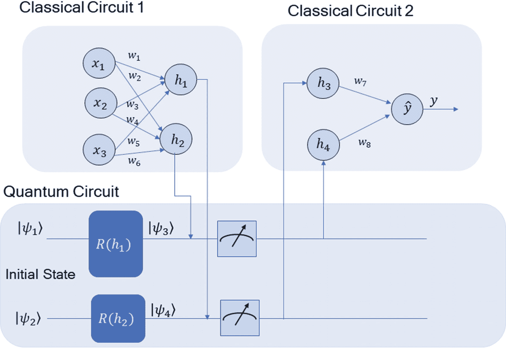

图 6-1

一种混合量子经典神经网络

将混合量子经典神经网络的输入[ *x* <sub>1</sub> 、 *x* <sub>2</sub> 、*x*<sub>3</sub><sup>*T*</sup>转换为隐层激活[ *h* <sub>1</sub> 、*h*<sub>2</sub><sup>*T*</sup>

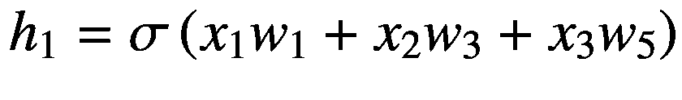

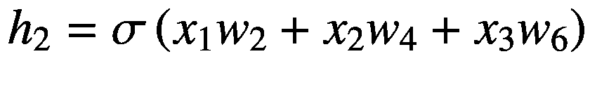

(6-1)

上式中 *σ* (。)代表乙状结肠激活函数。一般来说，*∑*可以是任何激活函数。

隐藏激活 *h* <sub>1</sub> 和 *h* <sub>2</sub> 作为量子电路中门 *R* <sub>1</sub> 和 *R* <sub>2</sub> 的旋转角度参数，改变初始状态∣*ψ*t18】1⟩和∣*ψ*t22】2⟩

方程 [6-2](#Equ2) 中的酉变换之后是在适当的基础上测量量子位。测量将存储在两个量子位中的量子信息坍缩为分别由*h*T4】3 和*h*T8】4 给出的经典信息。使用 *h* <sub>3</sub> 和 *h* <sub>4</sub> 中的信息产生最终预测输出如下:

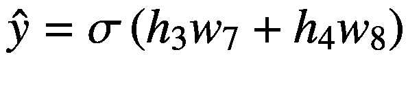

(6-3)

通过这个插图，你可以看到如何使用经典和量子计算组件构建量子深度学习网络。

## 量子层中的反向传播

深度学习模型通过反向传播来训练，这允许模型通过链规则计算损失函数相对于给定层中的权重的梯度。如果从输出层向输入层观察网络，则给定层的权重梯度取决于相对于权重的损失梯度以及在它之前的层中的激活。如果你认为成本目标是 *C* ，量子电路的参数是矢量 *θ* ，那么你可以使用*参数移动规则*来计算目标相对于 *θ* 的梯度，如下所示:

![$$ {\nabla}_{\theta}\left(\theta \right)\approx \frac{\left[C\left(\theta +s\right)-C\left(\theta -s\right)\right]}{2s} $$](img/495362_1_En_6_Chapter_TeX_Equ4.png)

(6-4)

思路很简单:我们在两个不同的参数值( *θ* + *s* )和(*θ*-*s*)下评估量子电路的成本，然后取归一化差值![$$ \frac{\left[C\left(\theta +s\right)-C\left(\theta -s\right)\right]}{2\mathrm{s}} $$](img/495362_1_En_6_Chapter_TeX_IEq2.png)作为梯度。参数 *s* 称为*换挡系数*。

## 基于混合量子-经典神经网络的 MNIST 分类

在本节中，我们使用混合量子经典神经网络对两个数字 0 和 1 实施 MNIST 分类器。图 [6-2](#Fig2) 说明了网络架构。

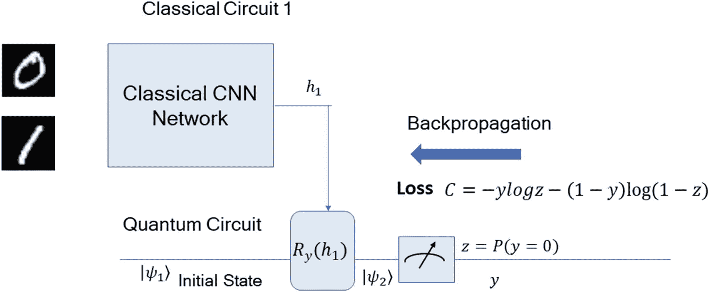

图 6-2

基于混合量子经典神经网络的 MNIST 分类器

图 [6-2](#Fig2) 中的网络从由卷积和最大池层组成的经典 CNN 网络开始，最终输出一个隐藏激活 *h* <sub>1</sub> 。隐藏激活*h*T8】1 作为旋转角度馈送到围绕 *y* 轴的量子旋转门 *R* <sub>*y*</sub> 。

基于旋转角度*h*T2】1，幺正变换![$$ {R}_y\left({h}_1\right)=\left[\begin{array}{cc}\cos \frac{h_1}{2}&amp; -\sin \frac{h_1}{2}\\ {}\sin \frac{h_1}{2}&amp; \cos \frac{h_1}{2}\end{array}\right] $$](img/495362_1_En_6_Chapter_TeX_IEq3.png)将初始状态∣*ψ*T7】1⟩的量子位转换到状态∣*ψ*t11】2⟩，如下所示:

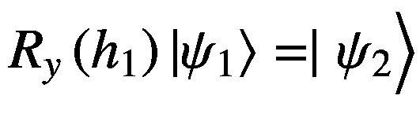

(6-5)

然后我们在|0⟩和|1⟩计算基中测量量子比特，基于测量揭示的 0 和 1 状态的数量，我们估算出 *P* ( *y* = 0)的概率。例如，如果我们进行了 *N* 次测量，并且∣0⟩状态出现了 *m* 次，那么我们可以估计代表 m 第一个数字 0 的状态∣0⟩的概率，如下:

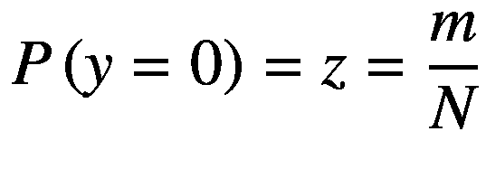

(6-6)

如果图像的实际标号是 *y* 并且我们预测图像是数字 0 的概率为 *P* ( *y* = 0)= *z* ，那么图像的对数损失 *C* 由以下给出:

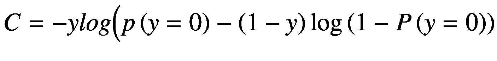

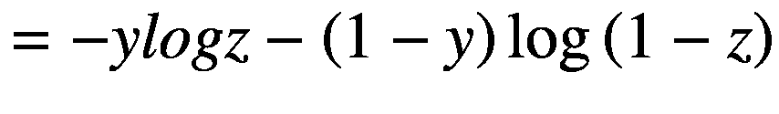

(6-7)

通过反向传播测井曲线损失 *C* 来训练模型。请注意，损失仅针对一个训练数据点进行说明。使用小批量训练神经网络，因此对于大小为 *k* 的小批量，需要对所有 *k* 数据点的测井曲线损失求和，并反向传播。

### 量子层中的梯度

如前所述，反向传播需要每层输出相对于其输入的梯度。图 [6-2](#Fig2) 中量子层的输入是 *h* <sub>1</sub> ，量子层的输出是图像是由 *P* (0) = *z* 给出的数字 0 的概率。如果经典 CNN 网络的参数用 *W* 表示，那么*h*T14】1 就是 *W* 的某个函数，我们可以写成:

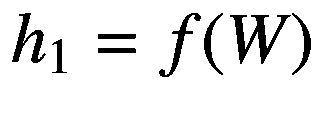

(6-8)

损耗 *C* 相对于 *W* 的梯度可以用链式法则写出，如下:

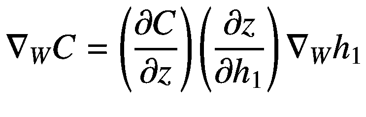

(6-9)

梯度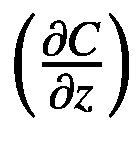和∇<sub>*w*</sub>*h*<sub>1</sub>处理经典数据，因此常见的深度学习包如 PyTorch 和 TensorFlow 会自动计算它们。我们需要想出一种方法来计算量子层中的梯度，以便反向传播可以计算损耗相对于参数 *W* 的梯度。这是我们应用参数移位规则并在由(*h*<sub>1</sub>+*s*)和(*h*<sub>1</sub>-*s*)给出的 *h* <sub>1</sub> 的两个值处评估 *z* 的地方。如果 *z* 在*h*T34】1 这两个值处的值为*z*(*h*T40】1+*s*)和*z*(*h*<sub>1</sub>-*s*)，则斜率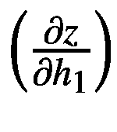可以近似为:

有一点需要注意的是，要评估，我们需要模拟两次对应于*h*T3】1 两个不同值的量子电路。

MINIST 分类器已经在本节中实现，使用 PyTorch 作为深度学习框架，使用 Qiskit 作为量子计算框架。

下面显示了详细的实现:

```py
import numpy as np
import matplotlib.pyplot as plt
import torch
from torch.autograd import Function
from torchvision import datasets, transforms
import torch.optim as optim
import torch.nn as nn
import torch.nn.functional as F
import qiskit
from qiskit.visualization import *

```

类别`QuantumCircuit`定义了量子层的量子电路，其中`theta`是来自经典电路的量子位的旋转角度，因此被定义为`__init__`函数中的一个参数。使用 Qiskit 模块定义量子电路。在电路的第一步中，哈达玛门将量子位从|0⟩<sup>⊗*n*T7】状态带到相等的叠加状态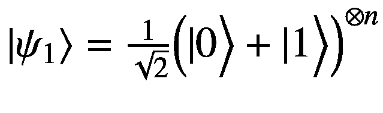。随后使用`cirq.ry`门旋转，旋转角度为θ。最后，量子位在计算基础状态∣0⟩和∣1⟩.中被测量</sup>

`run`功能根据从传统电路接收的θ值执行电路。基于对量子态的几次模拟的测量，计算了不同基态的期望。如果量子电路仅由一个量子位组成，那么期望值给出了∣1⟩.状态的概率

```py
class QuantumCircuit:
    """
    The class implements a simple Quantum Block
    """

    def __init__(self, num_qubits, backend, copies: int = 1000):
        self._circuit_ = qiskit.QuantumCircuit(num_qubits)
        self.theta = qiskit.circuit.Parameter('theta')
        self._circuit_.h([i for i in range(num_qubits)])
        self._circuit_.barrier()
        self._circuit_.ry(self.theta,
        [i for i in range(num_qubits)])
        self._circuit_.measure_all()

        self.backend = backend
        self.copies = copies

    def run(self, theta_batch):
        job = qiskit.execute(self._circuit_,
                             self.backend,
                             shots=self.copies,
                             parameter_binds=[
                                  {self.theta: theta}
                                 for theta in theta_batch])
        result = job.result().get_counts(self._circuit_)

        counts = np.array(list(result.values()))
        states = np.array(list(result.keys())).astype(np.float32)
        probs = counts / self.copies
        expectation = np.array([np.sum(np.multiply(probs, states))])
        return expectation

```

`QuantumFunction`使用 PyTorch 实现量子层反向传播所需的`forward`和`backward`功能。`forward`函数执行量子电路，并根据测量结果计算期望值。这个期望将给出量子层电路的∣1⟩态的概率。`backward`方法使用前面说明的移位方法计算通过量子层的梯度。

```py
class QuantumFunction(Function):
    """ Hybrid quantum - classical function definition """

    @staticmethod
    def forward(ctx, input, q_circuit, shift):
        """ Forward pass computation """
        ctx.shift = shift
        ctx.q_circuit = q_circuit
        theta_batch = input[0].tolist()
        expectation = ctx.q_circuit.run(theta_batch=theta_batch)
        result = torch.tensor([expectation])
        ctx.save_for_backward(input, result)
        return result

    @staticmethod
    def backward(ctx, grad_output):
        """ Backward pass computation """
        input, expectation = ctx.saved_tensors
        theta_batch = np.array(input.tolist())

        shift_right = theta_batch +
        np.ones(theta_batch.shape) * ctx.shift
        shift_left = theta_batch –
        np.ones(theta_batch.shape) * ctx.shift

        gradients = []
        for i in range(len(theta_batch)):
            expectation_right = ctx.q_circuit.run(shift_right[i])
            expectation_left = ctx.q_circuit.run(shift_left[i])

            gradient = torch.tensor([expectation_right])
            - torch.tensor([expectation_left])
            gradients.append(gradient)
        gradients = np.array([gradients]).T
        return torch.tensor([gradients]).float()*
                      grad_output.float(), None, None

```

接下来使用`QuantumCircuit`和`QuantumFunction class`功能定义`QuantumLayer`类。这个类将被调用来定义量子层，同时定义一个端到端的经典量子网络。

```py
class QuantumLayer(nn.Module):
    """ Hybrid quantum - classical layer definition """

    def __init__(self,num_qubits, backend, shift, copies=1000):
        super(QuantumLayer, self).__init__()
        self.q_circuit = QuantumCircuit(num_qubits, backend, copies)
        self.shift = shift

    def forward(self, input):
        return QuantumFunction.apply(input,
        self.q_circuit, self.shift)

```

既然我们已经有了定义量子层的所有要素，我们可以继续创建一个经典的量子神经网络。`QCNNet`类正是这样做的。它首先定义了不同的卷积，`linear`，以及`__init__`函数中的量子层。在`forward`功能中，定义的层被放在一起以创建一个网络。网络从一对卷积层和最大池层开始，然后是一对全连接层。最终全连接层`self.fc2`的输出是一个维度为 1 的隐藏单元，它作为旋转角度馈送给量子层`self.q_layer`中的旋转门。量子层的输出是对应于状态∣1⟩.的概率`forward`函数返回∣1⟩和州∣0⟩.的概率

```py
class QCNNet(nn.Module):
    def __init__(self, num_qubits=1, backend=
                 qiskit.Aer.get_backend('qasm_simulator'),
                 shift=np.pi/2,
                 copies=1000):
        super(QCNNet, self).__init__()
        self.conv1 = nn.Conv2d(1, 6, kernel_size=5)
        self.conv2 = nn.Conv2d(6, 16, kernel_size=5)
        self.dropout = nn.Dropout2d()
        self.fc1 = nn.Linear(256, 64)
        self.fc2 = nn.Linear(64, 1)
        self.q_layer = QuantumLayer(num_qubits=num_qubits,
                                    backend=backend,
                                    shift=shift,
                                    copies=copies)

    def forward(self, x):
        x = F.relu(self.conv1(x))
        x = F.max_pool2d(x, 2)
        x = F.relu(self.conv2(x))
        x = F.max_pool2d(x, 2)
        x = self.dropout(x)
        x = x.view(1, -1)
        x = F.relu(self.fc1(x))
        x = self.fc2(x)
        x = self.q_layer(x)
        return torch.cat((x, 1 - x), -1)

```

在下面显示的`train_test_dataloaders`函数中，我们定义了用于训练和推理目的的训练和测试数据加载器:

```py
# Define the train test data loaders
def train_test_dataloaders(train_samples=1000,
                           test_samples=500,
                           train_batch_size=1,
                           test_batch_size=1):
    X_train = datasets.MNIST(root='./data',
              train=True, download=True,
                transform=transforms.Compose(
                [transforms.ToTensor()]))

    # Extracting only MNIST labels 0 and 1
    idx = np.append(np.where(X_train.targets
    == 0)[0][:train_samples], np.where(X_train.targets
    == 1)[0][:train_samples])

    X_train.data = X_train.data[idx]
    X_train.targets = X_train.targets[idx]

    train_loader = torch.utils.data.DataLoader(X_train,
    batch_size=train_batch_size, shuffle=True)

    X_test = datasets.MNIST(root='./data',
    train=False, download=True, transform=transforms.Compose(
    [transforms.ToTensor()]))

    idx = np.append(np.where(X_test.targets
    == 0)[0][:test_samples], np.where(X_test.targets
    == 1)[0][:test_samples])

    X_test.data = X_test.data[idx]
    X_test.targets = X_test.targets[idx]

    test_loader = torch.utils.data.DataLoader(X_test,
    batch_size=test_batch_size, shuffle=True)
    return train_loader, test_loader

```

在我们放在一起的`main`函数中，我们训练模型，然后进行推理。我们首先使用`QCNNet`类创建模型，然后使用`train_test_dataloaders`创建训练和测试数据加载器。最后，我们为指定数量的时期训练模型，如`num_epochs`所示，然后在测试数据集上进行推理。使用对数损失或使用 PyTorch 定义的负对数似然损失`nn.NLLLoss()`来训练模型。我们使用自适应矩估计或 Adam 作为训练的优化器。

```py
def main(num_epochs=20,
         lr=.001,
         train_samples=1000,
         test_samples=500,
         train_batch_size=1,
         test_batch_size=1):

    model = QCNNet()
    optimizer = optim.Adam(model.parameters(), lr=lr)
    loss_func = nn.NLLLoss()

    train_loader, test_loader = train_test_dataloaders(
                                             train_samples,
                                             test_samples,
                                             train_batch_size,
                                             test_batch_size)

    loss_list = []

    model.train()

    for epoch in range(num_epochs):
        total_loss = []

        for batch_idx, (data, target) in enumerate(train_loader):
            optimizer.zero_grad()
            # Take the Forward pass
            output = model(data)
            # Calculate the log loss
            loss = loss_func(output, target)
            # Take the Backward pass
            loss.backward()
            # Update the Model weights
            optimizer.step()
            total_loss.append(loss.item())

        loss_list.append(sum(total_loss) / len(total_loss))

        print('Training [{:.0f}%]\tLoss: {:.4f}'.format(
            100\. * (epoch + 1) / num_epochs, loss_list[-1]))

    plt.plot(loss_list)
    plt.title('Hybrid ConvNet Training Convergence')
    plt.xlabel('Training Iterations')
    plt.ylabel('Neg Log Loss')

    model.eval()
    with torch.no_grad():
        correct = 0
        for batch_idx, (data, target) in enumerate(test_loader):
            output = model(data)

            pred = output.argmax(dim=1, keepdim=True)
            correct += pred.eq(target.view_as(pred)).sum().item()

            loss = loss_func(output, target)
            total_loss.append(loss.item())

        print('Inference on test data:\n\tLoss: {:.4f}\n\tAccuracy: {:.1f}%'.format(
            sum(total_loss) / len(total_loss),
            correct / len(test_loader) * 100)
        )

if __name__ == '__main__':
    main()

-x- output -x-

Training [80%] Loss: -0.9968
Training [85%] Loss: -0.9971
Training [90%] Loss: -0.9966
Training [95%] Loss: -0.9966
Training [100%] Loss: -0.9965

Inference on test data:
       Loss: -0.9974
      Accuracy: 100.0%

```

从输出中可以看出，该模型在测试数据集上具有 100%的准确性。训练损失曲线似乎也表明模型在 20 个时期内平滑收敛(图 [6-3](#Fig3) )。

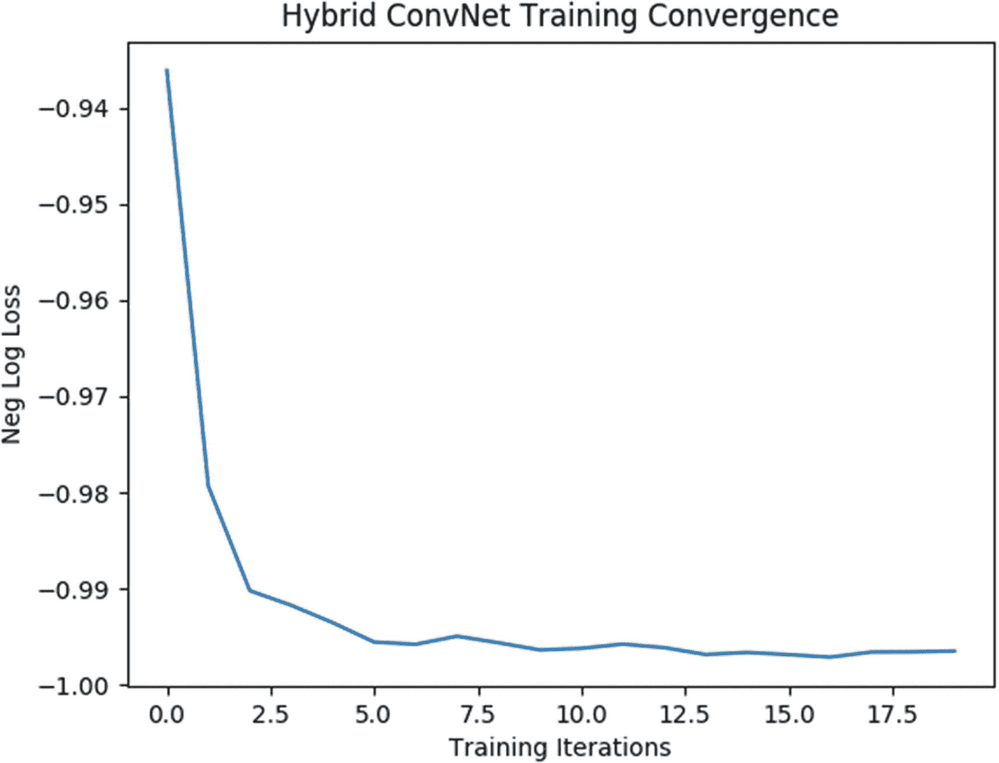

图 6-3

训练趋同

## 用于近期处理器分类的量子神经网络

在本节中，我们将研究可以解决二进制输入数据分类问题的量子神经网络(QNN)架构。这类 QNN 首先由 Farhi 等人在他们的论文( [`https://arxiv.org/pdf/1802.06002.pdf`](https://arxiv.org/pdf/1802.06002.pdf) )中提出。与我们以前实现的 QNN 架构不同，它既有经典层又有量子层，这种架构只包含量子层，每一层都是一个幺正门。如果我们有一个具有 *n* 二进制输入特征的数据点*x*T7】1，*x*<sub>2</sub>…*x*<sub>*n*</sub>它可以用 *n* 量子位 *q* <sub>1</sub> ， *q* <sub>中的一个计算基态来表示。 *q* <sub>*n*</sub> 。此外，我们取一个读出量子位*q*<sub>*n*+1</sub>，它基于每个量子层中不同的幺正门与输入量子位一起被转换。对于二进制分类，读出的量子位被初始化为对应于类别标签 *y* = 1 的状态∣1⟩。我们可以标记另一个类别标签*y*= 1，对应于读出状态∣0⟩.基于对应于量子位的特征是 0 还是 1，输入量子位被初始化为∣0⟩或∣1⟩状态。量子层 *i* 中的每一个酉变换*U*(*θ*<sub>*I*</sub>)仅涉及来自( *n* + 1)集合的量子位的子集，并且由权重 *θ* <sub>*i*</sub> 来参数化。</sub>

如果我们在 QNN 中有 *l* 层，每层中的酉变换用*U*<sub>T5】I</sub>(*θ*<sub>*I*</sub>)表示，那么整体酉变换 *U* ( *θ* )可以写成如下:

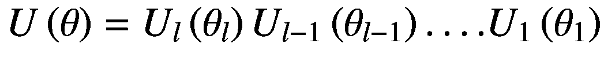

(6-11)

其中*θ*=【*θ*<sub>T5】L</sub>，*θ*<sub>*L*—1</sub>，…。。*θ*<sub>1</sub><sup>*T*</sup>是 QNN 的参数设置。

图 [6-4](#Fig4) 显示了一个由幺正层组成的样本 QNN 网络，其中每个参数化幺正门作用于两个量子位，其中一个是输入量子位，另一个是读出量子位。我们将在下一节实现这个 QNN。

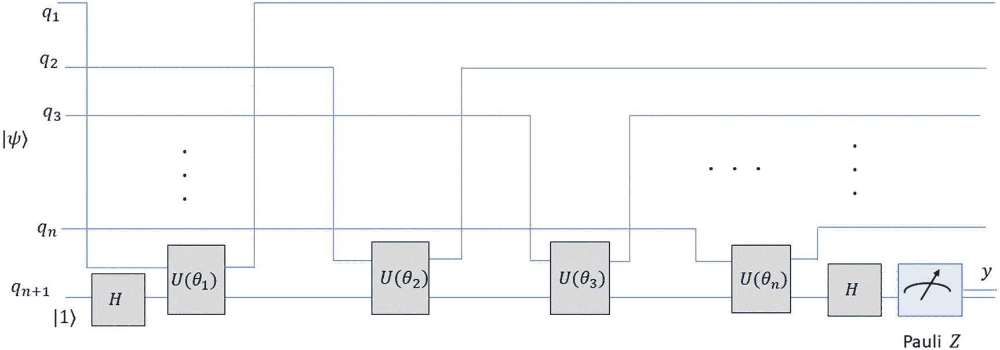

图 6-4

具有酉层的 QNN

属于一个数据点的一组 *n* + 1 个量子位被初始化为计算基础状态∣*x*T4】1xt8】2… *x* <sub>*n*</sub> 、1⟩，其中最后一个量子位对应读出的量子位。酉变换 *U* ( *θ* )之后，量子位的状态将如下:

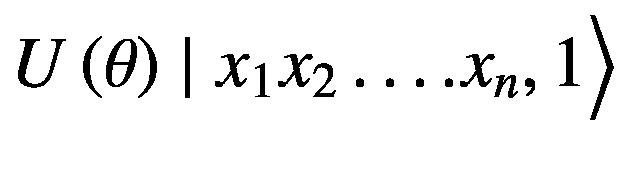

(6-12)

希望一旦模型被训练，量子位上的酉变换 *U* ( *θ* )将足以改变读出量子位的状态，使其与真正的标签对齐。因为在量子计算中，我们对模拟电路的几个副本进行测量，所以我们通常将读出量子位的测量相对于泡利矩阵的期望作为测量算子。我们可以将测量算符作为 Pauli *Z* ，因为它具有属于∣0⟩和∣1⟩.状态的特征值 1 和 1 因此，期望值的范围将从 1 到 1。作为我们预测标签的期望值可以写成:

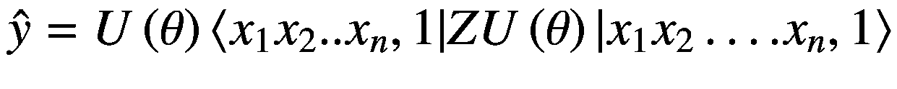

(6-13)

如果期望值小于零，我们可以将类 1 分配给数据点，而如果期望值大于 0，我们可以将类+1 分配给数据点。

作为训练的一部分，目标是使预测的类别标签尽可能接近真实标签 *y* 。对此，我们可以用铰链损耗 *C* 来训练模型，具体如下:

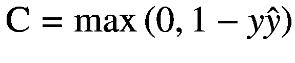

(6-14)

从方程 [6-14](#Equ14) 可以看出，当预测标号等于实际标号 *y* 时，那么在( *y* = 1)和(*y*= 1)两种情况下损耗都为零。2 的最大损失发生在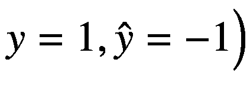或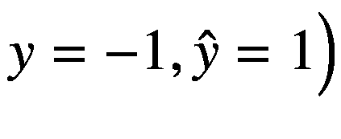时。由于预测值是基于测量运算符 *Z* 的预期值，因此我们不能承受超过 2 的损失，因此损失受其两个特征值 1 和+1 的限制。

当 *y* 和的符号一致时，产生的损耗为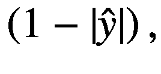，当它们的符号不一致时，损耗为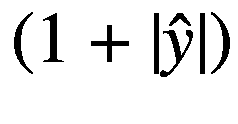图 [6-5](#Fig5) 为不同乘积值的铰链损耗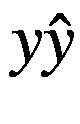。

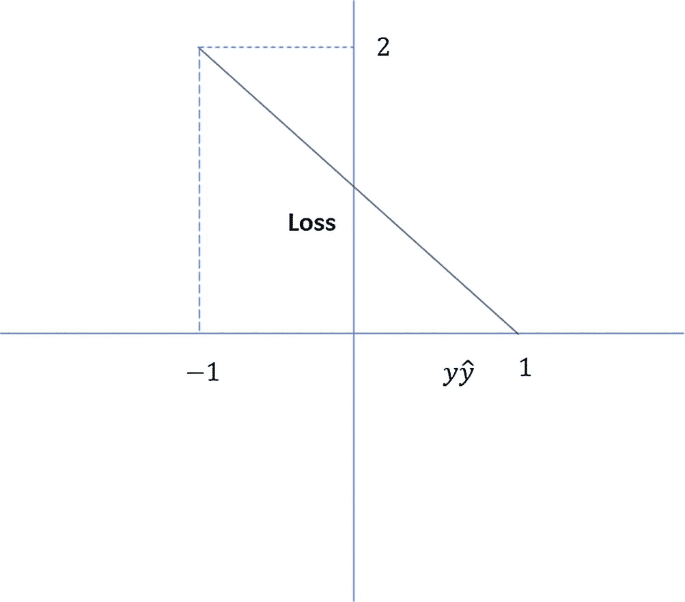

图 6-5

铰链损耗

从图 [6-5](#Fig5) 可以看出，损耗在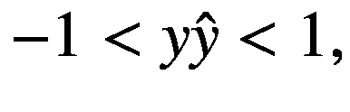范围内是线性的，损耗在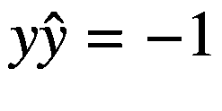处最大，在处最小

## 使用 TensorFlow 量子的 MNIST 分类

在本节中，我们将使用 TensorFlow 量子框架对两位 MNIST 数字进行二进制分类。TensorFlow 量子框架与 Cirq 一起工作，作为量子计算库。TensorFlow 量子框架的独特功能之一是能够将通过 Cirq 量子电路表示的经典数据编码为张量。这些量子数据张量属于`tf.string`类型。

```py
import tensorflow as tf
import tensorflow_quantum as tfq
import cirq
import sympy
import numpy as np
import collections
import matplotlib.pyplot as plt
from cirq.contrib.svg import SVGCircuit

```

以下函数提取两个 MNIST 数字，用于设置二进制分类问题:

```py
def extract_specific_digits(X, y, labels_to_extract):
    label_y1 = labels_to_extract[0]
    label_y2 = labels_to_extract[1]

    mask = (y == label_y1) | (y == label_y2)
    X, y = X[mask], y[mask]
    y = (y == label_y1)
    return X, y

```

每张 MNIST 图像的大小为 28 × 28。在这个 QNN 公式中，由于我们用一个量子位来处理图像中的每一个像素，所以代表一个 28 × 28 维的 MNIST 图像所需的量子位数量非常大。由于目前的量子计算机容量有限，我们将图像下采样到一个可管理的维度，如 4 × 4。由于缩减像素采样，具有不同标签的两个图像可能最终具有相同的缩减像素采样二进制表示。我们希望删除此类重复内容，以免对培训造成负面影响。

```py
def remove_sample_with_2_labels(X, y):
    mapping = collections.defaultdict(set)
    # Determine the set of labels for each unique image:
    for _x_, _y_ in zip(X, y):
        mapping[tuple(_x_.flatten())].add(_y_)

    new_x = []
    new_y = []
    for _x_, _y_ in zip(X, y):
        labels = mapping[tuple(_x_.flatten())]
        if len(labels) == 1:
            new_x.append(_x_)
            new_y.append(list(labels)[0])
        else:
            pass

    print("Initial number of examples: ", len(X))
    print("Final number of
    non-contradictory examples: ", len(new_x))

    return np.array(new_x), np.array(new_y)

```

下面的`data_preprocessing`函数进行如下端到端数据预处理:

1.  将 MNIST 像素值归一化 255，使像素值介于 0 和 1 之间。

2.  提取两个类进行二元分类。

3.  按照`resize_dim`将图像向下采样到更小的分辨率。我们采用`resize_dim=4`将图像下采样到 4 × 4。

4.  我们基于`binary_threshold`将图像像素值设定为 0 或 1。这样做使得每个像素可以由量子位表示，其中像素的 0 值可以对应于状态∣0⟩，像素的 1 值可以对应于状态∣1⟩.

```py
def data_preprocessing(labels_to_extract,
resize_dim=4,
binary_threshold=0.5):
    # Load the data
    (x_train, y_train), (x_test, y_test)
              = tf.keras.datasets.mnist.load_data()
    # Rescale the images from 0 to 1 range
    x_train = x_train[..., np.newaxis] / 255.0
    x_test = x_test[..., np.newaxis] / 255.0

    print("Number of original training examples:", len(x_train))
    print("Number of original test examples:", len(x_test))

    # Extract on the specified 2 classes  in labels_to_extract
    x_train, y_train = extract_specific_digits(x_train,
    y_train, labels_to_extract=labels_to_extract)
    x_test, y_test = extract_specific_digits(x_test,
    y_test,labels_to_extract=labels_to_extract)

    print("Number of filtered training examples:", len(x_train))
    print("Number of filtered test examples:", len(x_test))

    # Resize the MNIST Images since 28x28 size image requires as
    # many qubits which is too much for Quantum Computers to
    # allocate. We resize them to 4x4 for keeping the problem
    # tractable in Quantum Computing realm.

    x_train_resize = tf.image.resize(x_train,
                     (resize_dim, resize_dim)).numpy()
    x_test_resize = tf.image.resize(x_test,
                     (resize_dim, resize_dim)).numpy()

    # Because of resizing to such small dimension
    # there is a chance of images with different classes
    #hashing to the same downsampled representation.
    # We remove such duplicate images through
    # remove_sample_with_2_labels

    x_train_resize, y_train_resize = \
        remove_sample_with_2_labels(x_train_resize, y_train)

    # We represent each pixel in binary by applying a threshold
    x_train_bin = np.array(x_train_resize > binary_threshold
                          ,dtype=np.float32)
    x_test_bin = np.array(x_test_resize > binary_threshold
                          ,dtype=np.float32)

return x_train_bin, x_test_bin, x_train_resize, \
       x_test_resize,y_train_resize, y_test

```

在这个函数`classical_to_quantum_data_circuit`中，我们使用 Cirq 构建了一个量子电路，用一个量子位来表示每个二进制像素。如果输入像素为 0，我们将其指定为状态∣0⟩；否则，我们将其指定为∣1⟩.州因此，大小为 4 × 4 的下采样 MNIST 图像将由 16 个量子位表示。

```py
# Quantum circuit to represents each 0 valued pixel by |0> state
# and 1 pixel by |1> state.

def classical_to_quantum_data_circuit(image):
    image_flatten = image.flatten()
    qubits = cirq.GridQubit.rect(4, 4)
    circuit = cirq.Circuit()
    for i, val in enumerate(image_flatten):
        if val:
            circuit.append(cirq.X(qubits[i]))
    return circuit

```

通过 TensorFlow 量子能力，为每个 MNIST 图像定义的 Cirq 量子电路被转换成形式为`tf.string`的张量。如果我们有二进制输入数据 0101，那么根据这个公式，我们将使用 TensorFlow 量子框架将 Cirq 中的量子电路 *U* 编码为张量，使得 *U* |0⟩ <sup>⊗4</sup> = ∣ 0101⟩.

```py
# Define circuit for classical to quantum data  for
# all datapoints and transform those circuits to Tensors
# using Tensorflow Quantum

def classical_data_to_tfq_tensors(x_train_bin, x_test_bin):
    x_train_c = [classical_to_quantum_data_circuit(x)
for x in x_train_bin]
    x_test_c = [classical_to_quantum_data_circuit(x)
for x in x_test_bin]
    x_train_tfc = tfq.convert_to_tensor(x_train_c)
    x_test_tfc = tfq.convert_to_tensor(x_test_c)
    return x_train_tfc, x_test_tfc

```

我们实现了`QuantumLayer`类(见下文)来给量子神经网络添加层。每个量子层处理代表输入图像的量子位和作为类别读出的量子位。在`add_layer`的每次调用中，每个输入量子位和读出量子位一起经过一个由权重参数化的两量子位酉变换。因为我们处理 4 × 4 = 16 个输入量子位来表示每个 MNIST 图像，所以我们有 16 个权重属于 16 个酉变换。如果我们考虑一个两量子比特门 *Z* ⊗ *Z* 应用于第 *i* 个输入量子比特 *q* <sub>*i*</sub> 具有状态|*q*<sub>*I*</sub>⟩和读出量子比特 *r* 具有状态∣ *r* ⟩，那么这两个量子比特在所有其他量子位状态保持不变。这里 *θ* <sub>*i*</sub> 是输入量子位 *i* 对应的权重。

```py
class QuantumLayer:
    def __init__(self, data_qubits, readout):
        self.data_qubits = data_qubits
        self.readout = readout

    def add_layer(self, circuit, gate, prefix):
        for i, q in enumerate(self.data_qubits):
            _w_ = sympy.Symbol(prefix + '-' + str(i))
            circuit.append(gate(q, self.readout) ** _w_)

```

一旦定义了输入和读出量子位，接下来定义的`create_QNN`函数就使用`QuantumLayer`类来定义 CNN。我们使用`cirq.GridQubit.rect`在矩形拓扑中定义与输入图像相关的量子位。

一旦读出的量子位通过泡利 x 和哈达玛变换被变换到状态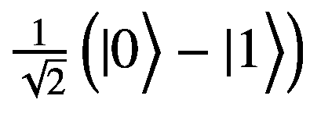，我们应用具有两个量子位变换门的两组量子层，分别为 *X* ⊗ *X* 和 *Z* ⊗ *Z* 。之后，我们对读出的量子位应用另一个哈达玛变换。最后，我们传递附有 Pauli *Z* 算符的读出量子位。请注意，最后一个 Pauli *Z* 算符与量子电路相连，因为它充当读出量子位的测量算符。因此，读出的量子位将在泡利 *Z* 矩阵的∣0⟩和∣1⟩本征基中测量，期望值将通过其本征值 1 和 1 计算。

```py
def create_QNN(resize_dim=4):
    """Create a QNN model circuit and prediction(readout) """
    data_qubits = cirq.GridQubit.rect(resize_dim, resize_dim)  # a 4x4 grid.
    readout = cirq.GridQubit(-1, -1)  # a single qubit at [-1,-1]
    circuit = cirq.Circuit()

    # Prepare the readout qubit.
    circuit.append(cirq.X(readout))
    circuit.append(cirq.H(readout))

    builder = QuantumLayer(
        data_qubits=data_qubits,
        readout=readout)

    # Apply a series of XX layers followed
    # by a series of ZZ layers
    builder.add_layer(circuit, cirq.XX, "XX")
    builder.add_layer(circuit, cirq.ZZ, "ZZ")

    # Hadamard Gate on the readout qubit
    circuit.append(cirq.H(readout))

    return circuit, cirq.Z(readout)

```

我们通过下面的函数来定义铰链精度，其中如果由`y_pred` >给出的读数的期望值为 0，那么我们将预测等级设为`1`，而如果`y_pred` <为 0，我们将预测等级设为`-1`。我们将真实等级`1`和`-1`与预测等级进行比较，以获得铰链损耗精度。我们在训练中使用这一铰链精度作为衡量标准，而模型则使用`tf.keras.losses.Hinge`给出的铰链损耗进行训练。

```py
def hinge_accuracy(y_true, y_pred):
    y_true = tf.squeeze(y_true) > 0.0
    y_pred = tf.squeeze(y_pred) > 0.0
    cost = tf.cast(y_true == y_pred, tf.float32)

    return tf.reduce_mean(cost)

```

`build_model`函数调用`create_QNN`来定义模型电路和模型读数。我们使用`tf.keras`来定义模型。TensorFlow 量子`layers.PQC`选项用于定义基于量子的 QNN。它接受量子电路和`model_readout`作为输入。由于`model_readout`与 Pauli *Z* 测量运算符相关联，我们将从`-1`和`1`获得期望值。

```py
def build_model(resize_dim=4):
    model_circuit, model_readout = \
create_QNN(resize_dim=resize_dim)
    # Build the model.
    model = tf.keras.Sequential([
        tf.keras.layers.Input(shape=(), dtype=tf.string),
        tfq.layers.PQC(model_circuit, model_readout),
    ])
    return model, model_circuit, model_readout

```

`main`函数将数据预处理、模型定义、模型训练和模型评估放在一起，以提供一个端到端的管道。请注意，目标类别 1 和 0 已重新分配给 1 和 1，以与我们用来训练模型的铰链损耗保持一致。关于训练，我们用 32 的批量大小为 3 个时期训练模型。我们使用 Adam 作为优化器，如前所述，我们用`hinge_loss`训练模型。

```py
def main(labels_to_extract,
         resize_dim,
         binary_threshold,
         subsample,
         epochs=3,
         batch_size=32,
         eval=True):
    # Perform data preprocessing
    x_train_bin, x_test_bin, x_train_resize, x_test_resize, \
    y_train_resize, y_test_resize = \
        data_preprocessing(labels_to_extract=labels_to_extract,
                           resize_dim=resize_dim,
                           binary_threshold=binary_threshold)

    x_train_tfc, x_test_tfc = \
        classical_data_to_tfq_tensors(x_test_bin, x_test_bin)

    # Convert labels to -1 or 1 to align with hinge loss
    y_train_hinge = 2.0 * y_train_resize - 1.0
    y_test_hinge = 2.0 * y_test_resize - 1.0

    # build model
    model, model_circuit, model_readout = \
        build_model(resize_dim=resize_dim)

    # Compile Model

    model.compile(
        loss=tf.keras.losses.Hinge(),
        optimizer=tf.keras.optimizers.Adam(),
        metrics=[hinge_accuracy])
    print(model.summary())

    if subsample > 0:
        x_train_tfc_sub = x_train_tfc[:subsample]
        y_train_hinge_sub = y_train_hinge[:subsample]

    qnn_hist = model.fit(
        x_train_tfc_sub,
        y_train_hinge_sub,
        batch_size=batch_size,
        epochs=epochs,
        verbose=1,
        validation_data=(x_test_tfc,
                         y_test_hinge))

    if eval:
        results = model.evaluate(x_test_tfc, y_test_hinge)
        print(results)

if __name__ == '__main__':
    labels_to_extract = [3, 6]
    resize_dim = 4
    binary_threshold = 0.5
    subsample = 500
    epochs = 3
    batch_size = 32

    main(labels_to_extract=labels_to_extract,
         resize_dim=resize_dim,
         binary_threshold=binary_threshold,
         subsample=subsample,
         epochs=epochs,
         batch_size=batch_size)

xx – output -xx

Number of original training examples: 60000
Number of original test examples: 10000
Number of filtered training examples: 12049
Number of filtered test examples: 1968
Initial number of examples: 12049
Final number of non-contradictory examples: 11520

Model: "sequential_2"
_________________________________________________________________
Layer (type) Output Shape Param #
=================================================================
pqc_2 (PQC) (None, 1) 32
=================================================================
Total params: 32 Trainable params: 32 Non-trainable params: 0

Train on 11520 samples, validate on 1968 samples
Epoch 1/3
11520/11520 [==============================] - 439s 38ms/sample - loss: 0.6591 - hinge_accuracy: 0.7385 - val_loss: 0.3611 - val_hinge_accuracy: 0.8281
Epoch 2/3
11520/11520 [==============================] - 441s 38ms/sample - loss: 0.3458 - hinge_accuracy: 0.8286 - val_loss: 0.3303 - val_hinge_accuracy: 0.8281
Epoch 3/3
11520/11520 [==============================] - 437s 38ms/sample - loss: 0.3263 - hinge_accuracy: 0.8493 - val_loss: 0.3268 - val_hinge_accuracy: 0.8564
1968/1968 [==============================] - 3s 2ms/sample - loss: 0.3268 - hinge_accuracy: 0.8564

```

我们可以从输出日志中看到，该模型仅在三个时期的训练中就收敛到良好的验证准确性。鉴于该模型只有 32 个可训练参数，这是令人印象深刻的。

## 摘要

在这一章中，我们通过查看两类量子深度学习架构向您介绍了量子深度学习的现有领域:一种在公式中使用经典层和量子层，另一种仅使用量子门构建。量子深度学习的优势之一是，如果我们明智地选择量子门，我们可以使用与其经典对应物相比更少的参数，因为它们提供了大量的网络先验。建议您仔细研究这两种量子深度学习架构的实现细节，以适应它们与经典架构之间的细微差异。

下一章涵盖了先进的基于量子的优化方法，如绝热优化和变化量子本征解算器。这些优化方法甚至可以在嘈杂的近期量子计算机上工作，因此是将很快扰乱优化领域的实用方法。