# 三、确立大数据准确性的方法

[Machine Learning](#Sec1) [Change Detection](#Sec2) [Optimization Techniques](#Sec3) [Natural Language Processing](#Sec4) [Formal Methods](#Sec5) [Fuzzy Logic](#Sec6) [Information Retrieval Techniques](#Sec7) [Blockchain](#Sec8) [Summary](#Sec9)

真理是许多研究领域的关键。哲学、逻辑和法律都深入探究真理的构成。因此，确定真理往往是多学科的。现实生活和其他学科中的许多现象都在计算机科学中建模。在这一章中，我们将对有可能检测数据真实性的框架和技术进行全面的概述。这些技术大致分为机器学习、变化检测、将谎言成本降至最低的优化技术、自然语言处理、形式方法、模糊逻辑、协同过滤、相似性度量，当然还有区块链技术的承诺。我们从机器学习开始，它经常被称为“现代化的迫击炮”，有时被比作 19 世纪末和 20 世纪初彻底改变世界的电力。

## 机器学习

正如我们已经看到的，数据的准确性是一个棘手的问题——用软件术语来说，是 NP-Hard。NP 代表非确定性多项式时间，这意味着我们无法找到问题的算法，该算法在可以用多项式表示的时间内运行。即使我们找到了一个算法来解决一个 NP 难的问题，它也要花费大量的时间，以至于这个解是不可行的。研究文献中有足够的证据证明错误信息遏制是 NP 难的。幸运的是，当涉及到生活中错综复杂的事情时，数学就来帮忙了。数学是物质的核心。一旦用数学表达出来，物质就溶解了，就屈服了，就像你触动人心，人心就溶解了，就屈服了。但是在进入数学抽象之前，让我们考虑一下在现实世界中这是如何实现的。我们如何得知现实生活中的某件事是真的？如前所述，许多计算机科学的解决方案都源自现实世界，或者受到现实世界现象的启发。人们常说，数据就像人——如果你足够努力地询问它，它会告诉你任何你想听到的东西。在严重犯罪中，执法人员就是这样对被告进行逼供的。我们需要构建合适的框架来询问大数据，这就是大数据分析的全部理念。

Note

大数据的准确性问题可以被视为与执法中的相同问题非常相似。前者是数据和工具，而不是人。

确立真相是法律斗争的关键。我们如何辨别一个人是否在说真话？我们检查相关的细节——场景的一些特征。例如，测谎仪检测脉搏率、血压、呼吸率等特征。同样，大数据也有一些分析软件会检验的特性。分析软件中使用的机器学习算法依赖于从现实世界中提取的特征来对数据进行分类。这些特征指示了数据所属的类别。因此，特征对于建立一个检测真相的模型至关重要。现在让我们检查评估真实性的过程中的步骤。

Note

和人一样，数据也有能揭示真相的特征。

为了开发一个数学模型，让我们以一个水果小贩为例。假设我们是没有任何先验知识或直觉的机器。我们怎么知道小贩卖的苹果是真的苹果，橘子是真的橘子，他没有说谎？这是根据它们的特征，如颜色、形状、大小、皮肤的质地、硬度和气味，以前观察过许多苹果、桔子和其他水果，这些水果都有这样的标签和名称。这些特征不是常数，它们的值不是二进制的。它们各不相同。我们不能肯定地期待任何像形状或颜色这样的特征。例如，我们不能肯定地说桔子都是完美的球形，或者苹果都是红色的。橙子也可以是椭圆形的，苹果可以是栗色或其他红色。模拟这种不确定性的最佳工具是概率。诸如形状和颜色的每个特征可以被视为具有概率分布的随机变量。我们也可以称它们为预测变量，因为它们有助于预测或作为独立变量，如坐标系中的独立变量“x”。

Note

概率是对数据的不确定特征进行建模的主要工具。

我们非常了解水果特征的概率分布——通过观察一组苹果中的几个苹果，我们知道苹果的大小和形状。我们称这个集合为“训练集”，因为我们通过检查这个集合中苹果的特征来训练自己识别苹果。取决于这些特征的变量是水果的类别，在本例中是苹果。给定一种新水果的特征，现在的问题是确定它的类别——是苹果、橘子、梨还是其他什么。我们需要从训练集建立一个模型，这将有助于预测新水果的类别，给定它的特征。把 model 想象成一个黑匣子，一个数学抽象，它把新的水果作为输入，并告诉它是苹果、桔子还是其他水果。黑盒本质上是根据它在训练集中观察到的贴有标签的水果，计算出一个苹果、桔子等的模型。我们称从中提取新水果的水果集为“测试集”，因为来自该集的水果用于测试我们从训练集构建的模型。我们可以用下面的等式来捕捉上面的讨论:

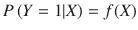

(1)其中

*   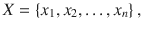随机变量组 x  i
*   x i 是代表水果特征的随机变量。
*   给定一个水果的特征 x，它成为苹果的概率。

Note

数据的特征被表示为概率分布中的随机变量。

现在让我们继续构建模型。很容易看出，并不是所有的特性都同等重要。例如，在确定类别时，形状不如颜色或皮肤纹理重要，因为橙子和苹果或多或少都是球形的。因此，并不是所有的特征都具有相同的重要性或权重。因此，我们需要权衡每一个特征来决定是哪一种水果。权重越大，特征对我们的决策就越重要。在上面的等式(1)中，f (X)用权数表示时，是:

(2)Note

像所有真实事物的特征一样，数据的特征只是相对重要的，因此在做决策时需要权衡。

在我们将等式(2)代入等式(1)之前，我们需要认识到等式(1)的左侧(L.H.S .)总是在 0 和 1 之间，这是一个概率。所以，我们需要想办法让右边(R.H.S)也总是在 0 和 1 之间。有几种方法可以做到这一点，其中之一是使用“逻辑函数”，表示为:

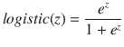

(3)

上述函数总是保证为正数，但小于 1，这是我们使用的理想值。使用等式(1)中的逻辑函数将给出一个模型，该模型有助于识别水果的真实分类。使用逻辑函数构建的模型称为“逻辑回归”模型。(1)中的等式现在转换为:

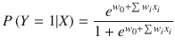

(4)Note

权重，有时也称为特征参数，在确定数据的真实性方面起着关键作用。

确定真相的问题现在简化为在上面的等式(4)中寻找权重 w 0 ，w 1 ，…，w i ，…，w n 。很容易理解，权重的目标是减少由使用上述等式的观察值和估计值之间的不匹配引起的误差。在上述等式(4)中导致最高估计概率的水果类别是所观察水果的选择类别。如果我们用上面的等式估计一个水果是苹果，我们希望观察到的水果确实是苹果。如果结果是一个橘子，估计是错误的。通过将上述等式应用于训练集，我们使用所谓的最大似然来减少这种错误的机会，从而确定上述等式中的权重。“最大值”这个词应该会让人想起微积分上的“最大值和最小值”课。实际上，在使用最大似然原理计算权重时使用了相同的方法。

Note

选择权重的目的是减少我们在确定数据准确性时出错的机会。

当给我们一个具有给定特征的新水果时，我们将从训练集导出的权重和从新水果中提取的特征代入上述等式(4)中，以确定该水果是否确实是卖主试图出售的水果。上述类比适用于任何大数据集。该过程如下图 [3-1](#Fig1) 所示。大数据可以是社交媒体帖子的形式，如推文、物联网设备中传感器的测量结果或其他包含有价值数据的记录。可以使用手动或自动过程提取特征并注释(标记)结果。需要注意的是，训练模型和测试模型需要使用相同的特征集。亚马逊 Mechanical Turk 等众包工具通常用于手动注释和特征提取。特征提取通常是通过本书中没有提到的方法自动完成的。提出特性的过程，正式称为特性工程，本身就是一项研究。事实上，机器学习算法的效率在很大程度上取决于提取的特征。出于本书示例的目的，我们假设特征是手动提取的。

Note

机器学习的一个重要步骤是标注训练数据。

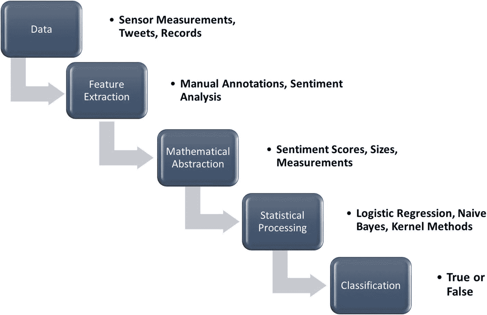

图 3-1

The Machine Learning Process of determining truth of Big Data

自动化特征提取的一个例子，比如说，在像推文这样的社交媒体帖子的情况下，是通过使用情感分析，为每条推文给出情感分数。

一旦情感分数等特征用数学表达出来，我们就不再需要处理原始数据。我们可以使用统计技术，如上述示例中使用的逻辑回归，对这一数学抽象进行分类。整个过程如图 [3-1](#Fig2) 所示。

Note

使用机器学习技术确定大数据的真实性，就像解决数学问题一样，是一个循序渐进的过程。

## 变化检测

正如我们在机器学习部分看到的，数据具有特征。特征在验证真理中起着关键作用。在人类说谎的情况下，他们的特征如心跳、呼吸、排汗、脉搏率和其他压力反应生命体征发生变化，表明这个人在说谎。测谎仪主要检测这些变化来传达这个人所说的真实性。这同样适用于某些类别的数据。不合理的变化表明可能不真实或欺诈。例如，如果传感器测量在某个持续时间或周期内出现异常，就有可能遭到恶意攻击。关于这一主题的章节稍后将讨论如何通过分析所发布微博的情绪波动来检测对微博网站的恶意攻击。

Note

监控变化有助于发现谎言。

数学对这类技术也有帮助。本书讨论的一些检测变化的技术包括序贯概率比检验(SPRT)；累积和技术；卡尔曼滤波器，有时被认为是 20 世纪最伟大的发现。这些变化检测技术背后的直觉很简单。数据通常遵循一种模式，或者或多或少是恒定的。例如，在持续观察下，来自测量患者生命体征的传感器的数据通常不会改变超过某个范围。脉搏率、心率、血压、动脉血氧水平、体温和呼吸率通常是恒定的或轻微波动的。

在这种情况下，对下一个数据点的良好估计通常是当前的观察值，表示现状。为了适应波动，需要将下一个观察值合并到方案中，以得出估计值。所以，我们从估计值开始作为第一个值。下一个估计可以是先前估计值和当前观察值的平均值，以此类推。在此过程中，我们观察与估计值相比的值的变化，并分析这些变化，以确定是否存在完整性损失的可能性。例如，如果观测值比估计值大某个阈值，则存在异常的可能性。

并非所有的变化都是异常的结果，因此变化检测比寻找与前一个值相差一定阈值的变化要复杂一些。需要对这些变化进行更深入的分析，以获得更准确的结果。诸如卡尔曼滤波器、累积和、SPRT 等许多变化检测技术可以用来以更可靠的方式分析变化。图 [3-2](#Fig2) 对该方案进行了概述。使用估计或其他统计技术分析观察到的或给定的数据的变化。卡尔曼滤波器使用估计，而 CUSUM 使用累积和来分析变化。根据分析，数据可能被标记为假或真。

Note

像在机器学习中一样，估计或预测真实值是一些变化检测技术中的关键。

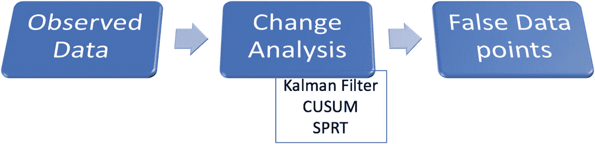

图 3-2

Overview of Change Detection approach to Veracity of Big Data

上述通过使用估计值和观察值的平均值进行估计的简单方案错过了从错误中学习的机会。通常需要反馈回路来提高估计的准确性。诸如卡尔曼滤波器之类的技术包括反馈回路以改进估计，以及在获得估计时的其他改进。下一章将讨论这些细节。反馈回路本质上是一个测量更新——基于观察值或测量值对估计值的更新。反馈回路如图 [3-3](#Fig3) 所示。

Note

基于来自性能的反馈来调整行为是一个关键的系统概念，它是诸如卡尔曼滤波器之类的一些算法的特征，这些算法可用于变化检测。

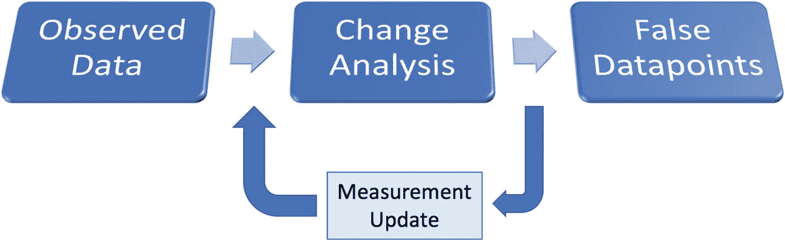

图 3-3

A feedback loop is inserted to improve the estimation

虽然卡尔曼滤波器等技术有助于检测变化，但并非所有被算法标记为假的数据都是真的假的。算法受到假阳性的影响。像 CUSUM 这样的算法在离线数据上表现最好。由于这些原因，单个变化检测算法有时不足以准确发现异常。在这种情况下，使用一种或多种算法的集合以获得更好的准确性。通过调整算法中固有的某些参数，可以对每种算法进行微调，以获得更高的精度。就像机器学习一样，这种微调参数是使用“训练集”数据预先确定的。然后，这些参数可用于输入的实时数据。

Note

卡尔曼滤波器实际上是一种估计算法，也可用于变化检测。

确定微调参数的过程如图 [3-4](#Fig4) 所示。对训练数据连续运行算法以获得参数。训练数据已经将数据点标注为真和假。算法以参数值的多种可能性运行；并且导致注释的训练数据的最佳匹配的组合被保留用于实时数据的后续使用，也称为“测试数据”

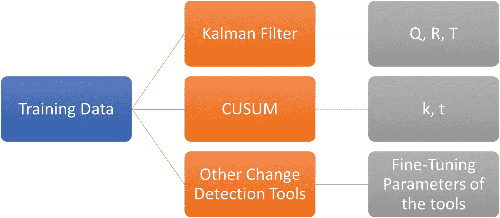

图 3-4

Fine-tuning parameters of the algorithms are obtained on the training data

这些算法的集合可以用来克服彼此的局限性。例如，CUSUM 在离线数据上效果最好，但受误报的影响较小。另一方面，卡尔曼滤波器受到假阳性的影响，但对实时数据起作用。这两种算法作为一个整体使用时，可以相互补充。整体方法如图 [3-5](#Fig5) 所示。输入数据首先由卡尔曼滤波算法实时处理。如果该算法指示数据完整性的可能损害，则对迄今已接收的数据调用 CUSUM 算法。如果 CUSUM 没有指示数据已经被篡改，则处理停止，这意味着卡尔曼滤波算法导致了假阳性。否则，可以进一步利用其他变化检测方案来评估数据是否确实受到不利质量的影响。

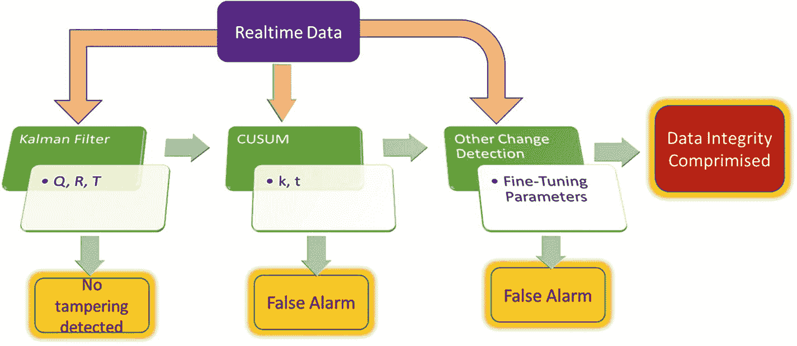

图 3-5

Ensemble approach to determine the Veracity of Big Data using Change Detection Techniques

集成算法的另一种方法是实现简单的投票机制，其中数据由各种算法独立处理，并且只有当大多数算法指示篡改时，才认为数据受到损害。我们将在后面的章节中更详细地检查变化检测方案和集成方法。

## 优化技术

在以上关于变化检测技术的讨论中，我们看到微调参数是通过对训练数据进行几次算法试验而获得的，训练数据已经被标注为真或假。直接迭代许多可能的值是低效的。有必要优化我们寻找参数的方式。只要有改进的余地，优化技术就会发挥作用。优化的目标是最小化与做事方式相关的低效率或“成本”。从数学上来说，成本可以抽象为多个变量的函数。当表达为优化问题时，许多问题可以被解决。准确性问题也不例外。

当我们讨论机器学习方法时，我们已经顺便讨论了最小化成本。我们试图最小化的成本是估计水果种类的误差。我们选择权重或参数的方式使得这种成本或出错的机会最小化。在变化检测算法的情况下，选择次优参数是有成本的。代价是选择次优参数导致的错误分类的数量。在这种情况下，成本函数可以是从所谓的“混淆矩阵”中导出的表达式

Note

谎言和泄露的数据是有代价的——虚假的代价。优化技术有助于选择算法和方法，这些算法和方法通过朝着这个目标解决子问题来最小化这个成本。

混淆矩阵，有时称为“误差矩阵”，是一个简单的二维表格，观察值为行，估计值为列。看这个表，我们可以知道我们用来确定真相的算法有多“混乱”。如果算法运行良好，则预测值(列)与观察值(行)相匹配。混淆矩阵是算法如何执行的简单可视化。混淆矩阵有助于可视化真阳性、假阳性、真阴性和假阴性。术语如图 [3-6](#Fig6) 所示。假阳性也被称为 I 型错误，假阴性被称为 II 型错误。

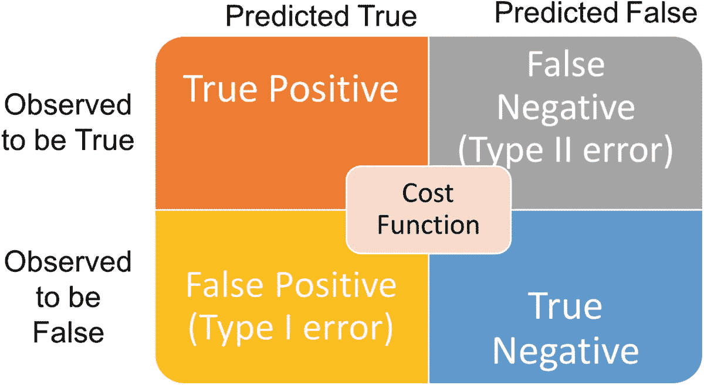

图 3-6

Cost Function can be computed from the various performance metrics

假阴性条件或类型 II 错误的一个例子是当发生火灾时，火警不响。假阳性是在没有火灾的地方警报响起。就像火警一样，数据的准确性本质上是一个分类问题——数据需要分类为真或假。不正确的分类会产生因领域而异的成本。成本的一个常用组成部分是差错率，差错率在下面的等式(5)中定义:

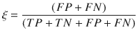

(5)

对于某些领域，如健康，可以理解的是，假阳性或 I 型错误在某些情况下比假阴性要昂贵许多倍。例如，如果诊断测试错误地显示患者的血糖水平很高，并基于这种假设给予胰岛素，这可能是致命的。另一方面，如果测试错误地显示血糖水平不高，当它确实很高时，患者仍然可以忍受这种情况，直到症状恶化并进行另一次测试。在其他一些情况下，如没有及早发现恶性肿瘤，它可能会被证明是致命的。在这种情况下，假阳性的代价可能不大，因为它可能只会导致进一步的检查，而进一步的检查可能会得出这是假阳性的结论。或者，它可能导致不必要的良性肿瘤手术切除，这也没有那么高的成本。

另一个不同的例子是我们之前考虑过的火警。在这种情况下，假阴性比假阳性更具灾难性。通常，但不总是，维持现状比得出错误的结论代价更低。在得出成本函数时，需要考虑这些因素。简单的错误率可能并不总是合适的。反映领域特征的参数需要包括在成本函数中。从水果供应商的例子和我们之前讨论的逻辑回归模型中，当讨论机器学习方法时，可以很容易地看出，成本随着我们为特征选择的权重而变化。

Note

假阳性通常有更高的成本。

例如，如果我们对水果形状的重视程度高于其表皮的质地，那么橙子也有可能被归类为苹果，从而增加了模型的成本。应该选择重量以最小化成本。事实上，当应用于训练数据时，机器学习模型选择最小化模型成本的参数或权重。训练数据已经具有正确的分类或观察值，因为它已经被标记，所以我们上面讨论的错误率可以被计算。机器学习模型本质上用参数或权重来表示成本，通常用θ来表示，并试图找到成本最小的θ。

当试图找到使成本最小化的参数时，通常需要满足一些约束条件。典型的约束可能是参数或权重需要大于 0。解决最优化问题是相当困难的，即使成本函数和约束函数是“平滑的”平滑函数具有相同的直观含义，即在绘制时是连续的，没有任何跳动。从数学上来说，这意味着函数在给定的域中有连续的导数(斜率)。尽管很难解决，但有有效的方法来解决优化问题。

机器学习模型是优化框架的一个特例。优化技术超越了机器学习模型所能解决的问题。最优化实际上是一个普遍的问题。从原子结合成分子以优化能量到获得生活中的和平与繁荣，优化在大多数普遍现象中都发挥着作用。因此，在优化问题中，成本并不总是最小的。被优化的函数的更一般的术语是“目标函数”一旦我们有了目标函数和定义任何参数约束的函数，优化框架的工作就是最小化或最大化目标函数。如果目标函数是成本，我们选择参数使其最小化。

Note

取决于领域，可能需要使用超出典型机器学习模型中使用的优化技术来解决准确性问题。

## 自然语言处理

大量的大数据存在于自然语言中，如英语和汉语。在这种由社交媒体 Web 2.0 提供的数据中，准确性问题尤为突出。具有讽刺意味的是，同样的数据可以用来发现其他地方的数字数据的准确性，例如在报税中。最近，印度政府中央直接税委员会授予 L&T 信息技术公司一个 1 亿美元的项目，用于根据社交媒体帖子检测逃税行为。该公司计划根据网上关于个人及其家庭的信息，创建一个“关于个人的系统网络”。“系统网络”将被用来识别逃税的模式。

文本数据的准确性比数字数据的准确性更难。处理文本数据的一种方式是从中生成数字，例如通过进行情感分析。有趣的是，文本本身已经被证明具有某些统计属性。例如，任何语言的文本都遵循 Zipf 定律，即一个词在大型语料库(如一本书)中的出现频率与其在频率表中的排名成反比。这个统计特性的一个有趣推论是，任何给定语言的大部分都由一小组单词组成。例如，在英语中，仅仅 10 个单词如“the”和“be”就占了语料库的 25%,这是世界上所有英语文本的通用集合。因此，大型语料库中单词的统计分布遵循所谓的幂定律，其中一个变量随着另一个变量的幂而变化。

统计和概率可以用来检测独特的语言风格，因此也可以用来检测谎言，因为欺诈性语言通常遵循一些特定的风格。一个有用的工具是语言模型，它是单词序列的概率分布。给定一个单词序列，w 1 ，w 2 ，… w i ，…，w n ，语言模型可以给出这个单词在一个序列中出现的概率 P(w 1 ，w 2 ，… w i ，…，w n )。给定被分类为真实或欺诈的训练文本数据的语言模型，可以使用机器学习分类技术来确定给定测试文本数据的语言模型是否指示虚假。

Note

文本数据展示了数字属性，并令人惊讶地服从于数字和计算处理。

一个相关的工具是概率上下文无关文法的 PCFG。语法是一套构造语言句子的规则。上下文无关语法(CFG)是指这些语言规则可以在不考虑上下文的情况下使用。语境是除了表达本身以外的一切，它帮助我们理解表达。CFG 忽略了上下文，只关心用来生成语言的规则。PCFG 是指每条规则都有与之相关的概率。PCFG 在分析给定文本的句法风格方面很有效率。将概率引入到 CFG 中，在推导语言模型时提供了更大的灵活性。可以使用标记为真实或欺诈的一组训练文本来训练 PCFG。对于一组新的文本，可以将 PCFG 产生的解析器与从训练集中产生的解析器进行比较，以确定准确性。

Note

解决准确性问题的几种技术的一个共同主题是概率。

真实性的一个特征是正式。人们在会见陌生人、处理重要事务或发表语音时，会穿西装、打领带等正式服装。即使在语言中，正式也是可信赖的标志。就其对表达的严格性而言，语言形式与逻辑或数学形式密切相关。有许多 NLP 工具可以用来衡量给定文本片段的正式程度。形式分数可以用来表示文本的真实性。

当文本以合适的格式表示时，可以比较其风格和结构。一种这样的表示是解析丛。解析丛是一个图形，它捕获给定文本段的语法细节。解析是分析句子并在数据结构(如树)中捕获其语法的活动，该数据结构使句子能够被计算处理。灌木丛是英语单词，指密集的一群树。因此，解析灌木丛是文本片段中每个句子的一组密集的解析树。解析丛可以以多种方式应用于解决现实世界的问题，其中之一就是准确性。例如，可以通过搜索两个文本片段之间的公共子图来检测剽窃。给定文本的真实性可以通过将它的分析丛与已知为真的文本的分析丛进行比较来确定。

以上是句法工具。一种很好的语义语言学技术可以用来确定给定文本的准确性，这就是文本蕴涵——分析给定的句子在语义上是否跟随其他句子。当一个句子来源于真实的句子时，它更有可能是真实的。同样，从已知为假的句子推导出的句子也可以被推定为假的。有很多工具可以识别文本蕴涵(RTE)。这里的关键还是可以通过计算处理的文本的表示。我们将在后面的章节中研究一些工具和表示法。

Note

知识表示是计算处理和验证知识真实性的关键。

## 形式化方法

我们能强加一个真实信息的语法吗？许多人最初的回答是明确的“不”。但是我们将会看到，在数理逻辑中，建立一个陈述的真实性是一个句法处理的问题。因此，这个问题并非完全不正常，而且可能是未来研究建立真实世界的关键。我们之前说过，数学是物质的核心。一旦用数学表达出来，物质就会溶解并产生。正式方法帮助我们做同样的事情。它们为我们提供了将现实世界的系统表示为数学实体的工具集。当表示为数学实体时，可以在更深更微妙的层次上客观地评估系统和验证它们的属性。

形式方法以对推理有用的方式简明地描述了系统的行为。这些系统是用一种具有标准化语法和明确定义的语义的语言来指定的，以支持形式推理，即从一组其他真实语句中推断出一个语句。机器学习包含了不精确性和模糊性。我们在这里改变了思路，要求像布尔逻辑这样的形式方法能够清晰准确地表达已知为真的知识，没有任何歧义或不确定性。布尔逻辑还有一个扩展，叫做模糊逻辑，可以处理不精确和模糊性。形式方法可以分为形式规范、证明、模型检查和抽象。

与准确性问题特别相关的是形式方法的逻辑规范类别。逻辑是数学的一个分支，它帮助我们对系统、它们的规格和属性进行推理。命题演算，也称为零阶逻辑(ZOL)，是一个基本的规范系统，允许我们表达语句；这些陈述之间的关系；利用这些，计算复合陈述的真值。真理可以用真值表一行一行地检查。

如果一个逻辑句子有 n 个命题符号(把它们想象成英语语句)用 or 和 and 之类的运算符连接在一起，那么为了检查句子的真实性，我们需要 2 n 行来处理两个值的排列，真和假，n 个符号中的每一个都可以接受。这在计算上显然是难以处理的。事实上，这是第一个被证明是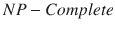的问题——NP 代表非确定性多项式时间，我们之前也讨论过。而且，以命题演算系统有限的表达能力，我们能取得的成果非常少。因此，我们考虑下一个逻辑顺序，即 (FOL)系统。

FOL 比命题演算更有表现力。它允许对变量进行量化。FOL 中使用的量化运算符是 for-all，记为，存在。这些附加操作符支持处理所有或部分实体。在 FOL 中，真理可以通过使用“证明”形式的推理规则来推导。证据是一系列的陈述，可以成功地证明一个给定陈述的真实性或缺乏真实性。这种证明中使用的规则的一个例子叫做“假言”。这个规则简单地说明，如果 p，那么 q，p 为真，那么 q 为真。不管听起来多么直观和基本，这条规则非常强大，整个语言 Prolog 都是基于这条基本规则。

一个合理的逻辑系统是这样的:如果一个句子是可证明的，那么它也必须是真的。一个健全的系统永远不会证明一句不是真的话。另一方面，一个完整的系统能够证明每一句话是真的。如果一个句子在一个完整的系统中为真，那么它就是可证的。在一个健全和完整的 FOL 中推断真理已经被证明是难以处理的，计算上是不可行的。因此，推理系统中只使用了 FOL 的一小部分。例如，在 Prolog 中，推理主要是使用前面指出的 modus ponens 规则来完成的。

Note

逻辑在很大程度上对计算机来说是难以理解的。在逻辑等更软的方面，人脑远远胜过机器。

已知为真的系统的知识库(KB)包含事实和规则。例如，Prolog 中简单事实的例子是

，规则的例子是

现在如果我们问田蜜是不是安的奶奶，写成

通过应用推理规则和知识库中的上述两个规则，可以推断该陈述确实是真实的。从上面可以看出，假设系统被适当地指定，推断真理就变成了一个句法处理的问题。因此，知识表示或规范在大数据的准确性问题中起着关键作用。

## 模糊逻辑

正如我们在上面看到的，使用合理和完整的逻辑系统进行推理，即使表达是精确和明确的，对计算机来说也是难以处理的。模糊性、不确定性和不精确性使得人类处理一个系统比完全精确地描述一个系统要复杂得多。令人惊讶的是，由于这一领域的许多发明，机器处理不精确性的能力远远超过我们的预期。为处理不精确性和不确定性而发明的第一批科学之一叫做模糊逻辑。它更符合人类在非理想主义世界中的思维和行为方式。例如，如果第一个主题语音人拉曼今天有 60%的可能性到达，第二个主题语音人威廉今天有 20%的可能性到达，那么我们对拉曼和威廉今天都到达的可能性得出什么结论？常识告诉我们，两者今天都有 20%的可能性到达，因为这是其中任何一个的最小百分比。

在模糊逻辑中，上述常识推理被抽象为模糊与运算符。使用模糊逻辑符号，上面可以写成:

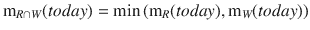

其中是今天的隶属函数，其位于拉曼可以到达的一组日期和威廉可以到达的一组日期的交集中。利用类似的常识，我们可以写出

这里，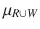是拉曼或者威廉今天到达的可能性。推理过程类似于我们在形式方法一节中讨论的传统逻辑，但是结合了上面强调的隶属函数计算。用模糊逻辑推理是近似的，所以叫近似推理。事实上，使用传统逻辑的推理可以被认为是近似推理的边界情况，边界情况是当所有的隶属函数都等于 1 或 0 时。

从上面的描述可以看出，在不确定的条件下推理真理是一个可能性的问题。模糊逻辑只能在一定程度上推断真理。在上述会议主题语音的例子中，它只能推断拉曼和威廉今天到达的可能性为 20%,而传统逻辑会推断两者都到达的可能性为 100%或 0%,如果它有预测所需的 100%准确信息的话。通过用 1 或 0 代替隶属函数，并确保其行为与传统逻辑系统等效，可以确认模糊逻辑系统工作正常。当隶属函数为 1 或 0 时，传统的逻辑系统只能处理一种完美的情况，而模糊逻辑提供了处理这两种情况之间的所有情况所需的工具。

Note

模糊逻辑可以被认为是清晰逻辑的超集或扩展，也称为布尔逻辑。

## 信息检索技术

寻找真相有时涉及信息检索。当我们对一个新的陈述不确定时，我们的大脑会从过去检索信息，并与新的陈述进行比较和对比。信息检索科学提供了大量的计算工具，使用机器来完成大脑的相同工作。两个这样的工具是向量空间模型(VSM)和协同过滤。为了找到两个文档之间的相似之处，我们再次求助于数学，更具体地说，求助于向量代数，当然还有使用向量代数原理来表示信息。

在用于文本挖掘的向量空间模型(VSM)中，每个文档被表示为多维空间中的一个向量。多维空间中的每个轴代表一个单词，在信息检索术语中也称为术语。如果语料库包含 10，000 个术语，那么在我们的多维向量空间中将有 10，000 个轴。为了在这个高维向量空间中表示文档，我们需要一个跨越文档每个维度的值，就像笛卡尔平面中的坐标一样。这个值通常是 TF。一个任期的 IDF。TF 代表词频，IDF 代表逆文档频率。TF 是该术语(与 word 相同)在给定文档中出现的次数。IDF 表明了该术语的独特性。IDF 由以下表达式给出:

TF。IDF 简直就是 TF 和 IDF 的产物。今天的计算机器足够强大，即使语料库相当广泛，也能很快计算出这些值。一旦 TF。IDF 是针对给定文档的每个术语获得的，它可以被绘制为高维空间中的向量。一旦被绘制成向量，寻找文档相似性的问题就简化为寻找向量之间的接近度。有许多方法可以找到向量的接近度，其中最流行的是余弦相似度，它测量两个给定向量之间的角度。向量空间模型(VSM)对于解决诸如剽窃之类的准确性问题以及通过比较新文档和已知的真实来源来建立信息的可信度特别有用。

Note

即使在对准确性问题的信息检索方法中，解决方案也在于使用数学结构来表示数据并有效地处理它们。

推荐系统中普遍使用的一种技术是协同过滤(CF)。我们在日常生活中以多种方式使用这种技术:从图书馆的“最近归还”书架上选择物品，而不是去搜索，听别人喜欢的前 10 首歌曲，在用过的林间小路上徒步旅行，引用我们的好研究论文，等等。所有这些例子的共同主题是，我们依赖他人的品味、工作或研究来做与他们相似的事情。协同过滤(CF)是通过依赖他人的判断来过滤信息和做出我们的选择，从而间接与他们合作的行为。CF 的经典应用传统上是预测一个用户是否会喜欢一个她以前从未评价过的产品，给定一组其他用户对该产品的评价。

很容易看出 CF 是如何帮助解决准确性问题的。例如，在一个简单的层面上，一个供应商的可信度可以通过与其他供应商的价格进行比较来确定。CF 可以有效地用于信任传播。就像我们根据别人的判断来形成观点和塑造我们的工作一样，可信度也可以根据别人的观点来确定。必须指出的是，CF 与投票方案有很大的不同。正如我们将在下一章中看到的，CF 使用相似性度量，例如我们上面讨论的余弦相似性。

## 区块链

最近出现的一种无懈可击的信任的新范式是区块链技术，这是革命性加密货币的基础。鉴于对加密货币的投资以及它在世界各地获得的信任，很明显，区块链是一项有前途的技术，可能在很大程度上解决准确性问题。脸书最近宣布将使用区块链技术来对抗假新闻。还有一些其他公司正在使用区块链解决这个问题。这项技术是不需要任何中介或政府干预的最重要的货币的基础，这一事实本身就意味着这项技术在解决真实性问题方面的可信性和前景。

区块链本质上是一个块链，类似于链表数据结构，但有一些特殊的特征。在区块链技术中，通过使用加密哈希函数来确保历史不可改变。所使用的散列链有一个有趣的特性，即链中的一个元素不能在不改变所有其他元素的情况下被改变。区块链充当所有参与者共享的分布式分类账。交易中出现的任何分歧都通过共识机制解决。在某些方面，区块链技术具有维基百科的一些成分，这使它们值得信赖。然而，它们根本不同，因为维基百科的数据库是集中的，而区块链是基于点对点(网络。

Note

区块链技术带来了一种机制，可以建立完全可信的系统和流程。

## 摘要

准确性在许多领域都是一个问题，可以通过多种方式解决。在本章中，我们看到了一些可以用来解决问题的方法。这一章的内容肯定会提高读者的好奇心，其中有相当多的问题没有得到解答。在接下来的章节中，我们将会看到每种方法的更多细节，并回答本章可能提出的问题。我们将在下一章从变化检测技术开始。

Exercises

1.  在这一章中，我们谈到了印度政府授予一份价值 1 亿美元的合同，用于从社交媒体的数据中检测逃税迹象。搜索更多关于大数据如何帮助解决准确性问题的例子。
2.  在其他应用中，还有许多验证信息完整性的方法。分布式计算领域的一个例子是拜占庭将军模型。描述如何在大数据准确性的背景下使用它。
3.  检验针对不同种类的大数据使用区块链技术的可行性。