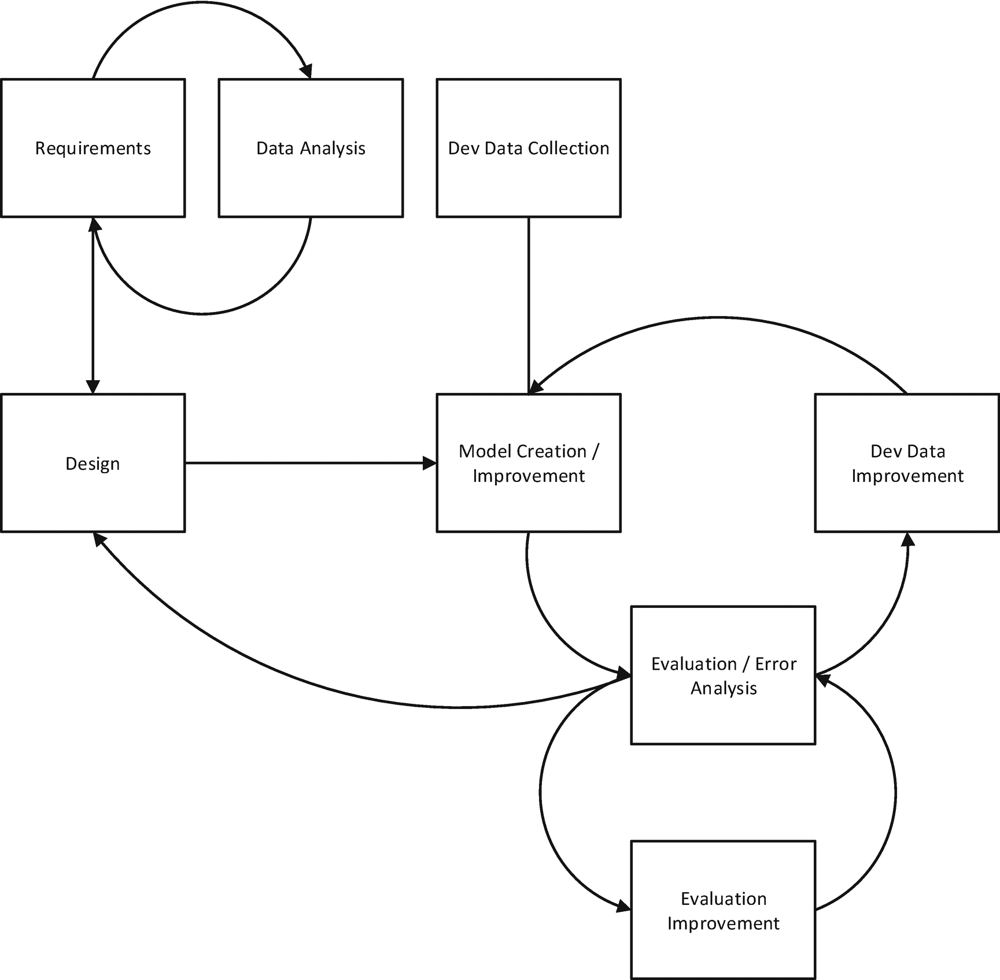
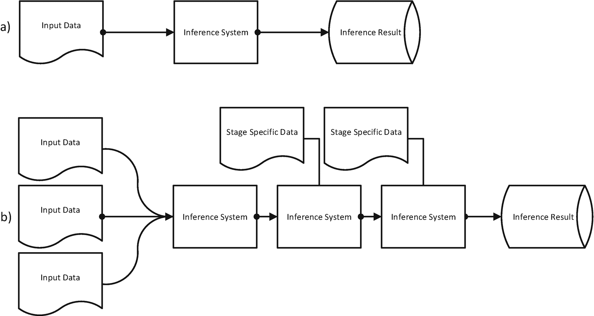
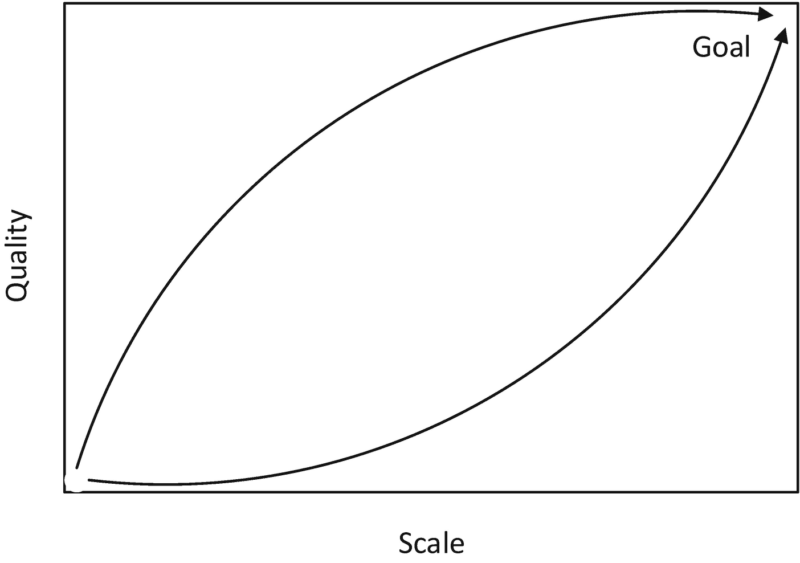

# 一、尽早发布

> ***我们的*** *最高优先级是* ***满足客户*** *通过*******连续*******有价值的【数据】*** 。****
> 
>  *****—agilemanifesto.org/principles*****

 ****与传统的软件工程项目不同，数据项目几乎完全由充满未知模式、分布和偏差的资源——数据——来管理。为了成功地执行一个通过数据集上的推理交付价值的项目，需要采用一套新的技能、过程和最佳实践。在这一章中，我们将探讨项目的初始阶段，以及我们如何通过这些未知因素取得有意义的进展，同时吸引客户并不断提高我们对数据、其价值及其对系统设计的影响的理解。

首先，让我们看一个场景，该场景介绍了一个项目的早期阶段，该项目涉及从 Web 上挖掘本地业务数据，这些数据来自作者在微软的 Bing 搜索引擎上的工作经验。美国有数以百万计的本地商业场所。其中大约 50% [1](#Fn1) 维护某种形式的网站，无论是由拖放式网络托管服务托管的简单的单页设计，还是由专门的网络团队开发和维护的复杂的多品牌网站。这些企业中的大多数在商业数据的任何其他表示之前更新他们的网站，这是由经济动机驱动的，以确保他们的客户能够找到关于他们的权威信息。 [2](#Fn2) 例如，如果他们的电话号码不正确，那么潜在客户将无法联系到他们；如果他们搬家，地址没有更新，那么他们就有失去现有客户的风险；如果他们的营业时间随着季节的变化而变化，那么顾客可能会离开。

本地搜索引擎的好坏取决于它的数据。漂亮的界面无法改善不准确或缺失的数据。我们的团队想去数据的来源——商业网站——直接接触商业权威。作为一个聚合者，我们希望我们的数据和业务本身在网络上呈现的数据一样好。此外，我们想要一个面向机器的策略，可以与竞争对手受益的大规模、众包方法竞争。我们的愿景是构建一个实体提取系统，它可以接收网站并生成描述网站上所呈现的业务的结构化信息。

像这样的抽取项目需要一个模式和一些质量概念来交付一个可行的产品， [3](#Fn3) 这两者都由客户决定——也就是数据的主要消费者。我们的目标是向现有系统提供额外的数据，该系统已经接收了几个本地数据，将它们组合起来产生最终的合并输出。有了现有的产品，模式是预先确定的，当前数据的质量是所需质量的自然下限。该模式包括核心属性:企业名称、地址、电话号码，以及扩展属性，包括营业时间、纬度和经度、菜单(针对餐馆)等等。质量是根据这些字段中的误差来确定的。

### 衡量标准是客户

从传统的敏捷软件项目到数据项目的第一个重大转变是，客户的大部分角色被转移到了数据的度量上。客户，或者产品所有者，当然会让事情运转起来，并与开发团队合作建立并同意评估过程。评估过程充当开发团队的先知，指导投资并展示进展。

正如面向客户的度量标准用于指导项目和交流进展一样，团队开发的任何组件都可以由度量标准驱动。建立内部度量标准为团队提供了一种在内部循环 [4](#Fn4) 上迭代的有效方法(通常不会被客户观察到)。内部指标将指导一些旨在促进面向客户的指标进展的工作领域。

一个度量标准需要一个在商定的模式中的数据集，该模式来自对目标输入总体的采样过程、一个评估函数(获取数据实例并产生某种形式的分数)和一个聚合函数(获取所有实例结果并产生某种总体分数)。利益相关者讨论并同意这些组件中的每一个。请注意，您需要区分质量指标(即数据的正确程度)和影响或价值指标(即使用数据的产品有什么好处)。您可以生成大量高质量的数据，但是如果它不是对现有方法的某种改进，那么它可能不会有任何实际影响。

## 入门指南

我们一开始是一个两人小组(拥有扎实的数据工程技能),只有一个简单的目标——在最短的时间内排除尽可能多的未知和假设。为此，我们最大限度地利用现有组件，让数据尽可能快速地端到端流动。

### 推理

我们使用术语“推理”来描述任何超出简单数据操作并需要某种形式的概念建模和推理的数据转换，包括以下技术:

*   分类:确定将一段数据放入哪个桶

*   提取:识别文档中存在的信息并使其规范化

*   回归:从一组输入中预测标量值

*   逻辑推理:基于现有的数据规则获得新的信息

数据的结构转换(例如，连接数据库中的表)不包括在推理中，尽管它们可能是我们描述的系统的必要组件。

采用*发现*技术而不是*发明*技术的策略，让我们能够在几天之内建造一些东西，快速确定该方法的潜力，并确定哪里需要关键投资。我们很快了解到，研究现有系统的设计是学习如何构建下一个版本的有价值的投资。

但是，在写一行代码之前，我们需要查看数据。回顾与企业相关的网站的统一样本，我们发现了以下情况:

*   大多数商业网站都很小，只有十页或更少。

*   大多数网站使用静态网页内容——也就是说，所有信息都存在于 HTML 数据中，而不是在访问者到达他们的网站时被动态获取和呈现。

*   网站通常会有一个包含联系信息的页面，尽管这种信息通常会以某种形式出现在许多页面上，有时也不会有一个页面包含所有需要的信息。

*   许多企业在社交平台(脸书、Instagram、Twitter)上有相关页面，其中少数企业只有社交网站。

这些花了一天时间得出的有价值的见解，使我们能够对我们的初始实现做出快速、广泛的决策。事后看来，我们认识到了一些重要的疏忽，比如(大型)连锁企业和较小的“单体”企业之间的区别。从搜索的角度来看，链数据的价值更高。虽然连锁店代表了实际业务的一小部分，但它们可能是最重要的数据部分，因为用户最倾向于搜索连锁店业务。连锁店往往有更复杂的网站，往往需要更复杂的提取技术。从普通的 HTML 中提取一个地址要比提取一组作为邮政编码搜索结果动态放置在地图上的实体容易得多。

### 每项任务都从数据开始

开发人员可以通过查看少量的数据样本(少于 100 个)来深入了解一个领域的基础知识。如果数据的某个方面在空间中占主导地位，通常很容易识别。审查数据的最佳做法包括随机化你的数据(这有助于从你的观察中消除偏见)和以尽可能自然的形式查看数据(理想情况下，以与机器查看数据的方式相同的形式查看数据；观看应该不会改变它)。尽可能确保您查看的是来自生产 [5](#Fn5) 的数据(这是确保您有机会看到端到端管道中的问题的唯一方法)。

凭借我们早期对数据的广泛理解，我们迅速开始构建一个初始系统。我们对建筑和基础设施采取了务实的态度。我们使用为大量不同的信息处理管道构建的现有基础设施，并且我们采用简单的顺序管道架构，该架构允许我们构建由简单的数据模式连接的少量阶段。具体来说，我们使用 Bing 的云计算平台，该平台旨在对大量数据运行遵循 MapReduce 模式的脚本化流程。我们没有假设这个问题可以用这个通用架构来最好地解决，也没有假设它所支持的基础设施和计算范例完全适合这个问题空间。唯一的要求是它是可用的，能够以合理的规模运行一些过程，并允许开发人员在项目的初始阶段快速迭代。

### 偏向行动

一般来说，采取一些行动(审查数据、构建原型、运行实验)总会产生一些对团队取得进展有用的信息。这与争论选项、对数据的直觉、假设某个数据集的某些东西是“显而易见的”等等形成对比。然而，这一原则不能草率应用——行动本身必须有一个明确的终点，最好是一个产品将如何被用来推进事情的陈述。

如果我们考虑 web 挖掘本地业务站点以提取代表这些实体的名称、地址和电话号码的高质量记录所需的组件，我们将需要以下组件:

*   一种发现网站的方法

*   爬这些网站的爬虫

*   提取器来定位这些网站上的姓名、地址和电话号码

*   将这些提取的元素组合成一个或多个站点记录的逻辑

*   在一些生产基础设施上实现的管道，可以执行这些组件并集成结果

这五个元素中的每一个都需要设计迭代、测试等等。在采用敏捷发现方法构建初始系统的过程中，我们用这五个解决方案解决了前面的五个要素:

*   使用现有的网站业务记录语料库来提出一个可从中提取内容的初始网站列表，目前还不需要构建一个发现系统

*   通过处理仅在网络搜索引擎的生产网络语料库中发现的数据，消除了对抓取数据的需要，该网络搜索引擎已经在我们第一阶段工作所采用的基础设施上运行

*   使用现有的地址提取器，并建立了一个简单的电话号码提取器和名称提取器

*   实现了一个简单的方法，将提取的元素组合成一个记录，我们称之为“识别”

*   使用现有的基于脚本的执行引擎部署了标注器和识别组件，该引擎可供更大的 Bing 工程团队使用，该团队可以访问 web 语料库中的数据，并被设计为可以扩展 web 语料库中的数据

作为这项工作的一部分，我们发现没有现成的方法可以从网站中提取企业名称。于是，这成了创新的最初焦点。在项目的后期，有机会改进系统的其他部分，但是最重要的初始投资是名称提取。

通过快速关注创新的关键领域，并利用其他地方的现有系统和天真的方法，我们在很短的时间内交付了第一版数据。这为团队提供了一个数据集，让他们对项目的可行性有了更深入的了解。可以阅读这个数据集来理解我们的天真的架构和商品提取器与那些被要求交付整个项目的需求之间的差距。早期，我们能够更深入地思考在野外发现的数据类型与架构和基础设施中所需的专业化之间的关系，以确保高质量的生产系统。

### 使用现成的组件实现端到端连接

寻找可以近似系统的现有部分，以便您可以评估项目的可行性，了解所需的架构，识别需要优先开发的组件，并发现内部循环可能需要额外评估的地方。在大型组织中，您需要组装的许多组件可能已经可用。还有许多开源资源可用于基础设施和推理组件。

快速启动并运行是一种递归策略。团队对基础设施的选择(您希望在验证项目之前避免对昂贵的基础设施的任何长期承诺)和架构(架构将通过数据和推理生态系统进行迭代和通知)做出高层决策。这允许团队发现哪里需要创新，在哪里过程重复出现。

为了构建名称提取器，我们采用了远程学习方法。我们拥有与网站 URL 相关联的本地实体记录的数据语料库。为了训练模型从网站中提取名称，我们使用这些数据来自动标记网页。我们的方法是

1.  从所有业务站点对中随机创建一个训练集。

2.  对每个 URL 的第一层页面进行爬网。

3.  使用合理的试探法从页面中生成 n 元语法(例如，在 HTML 元素中找到的任何 1–5 个标记的字符串)。

4.  如果每个 n-gram 与记录中现有的企业名称相匹配，则标记为正，否则标记为负——这种匹配需要一定的灵活性。

5.  训练一个分类器来接受正例，拒绝负例。

如果我们考虑创建分类器的一般方法，这种方法允许快速创建训练数据，同时避免手动标记的成本，例如，创建和部署工具、寻找评委、创建标记指南等等。

### 商品系统组装的重要注意事项

您可能会在某个时候声明，您正在编写的代码或您正在设计的系统或您正在采用的平台只是一个临时措施，一旦您有了“土地的布局”，您将重新设计或扔掉实验代码，并构建真正的系统。扔掉实验代码需要高度自律的团队和良好的向上管理技能。一旦开始运行，就有向客户交付的压力，这种方式不仅开始依赖于产品，而且依赖于团队交付更多产品的能力。通常，这是以回过头来处理“临时”组件和设计为代价的，而您过去常常快速地获得端到端。

## 规划数据分析

现在我们有了一个合适的系统，是时候看看最初的输出，了解一下我们的情况了。拥有正式的、受管理的系统有很大的价值，这些系统通过法官传输数据，并交付训练数据或评估数据，但这绝不应该在开发团队熟悉数据的每个方面(包括输入和输出)之前完成。这样做将会错过团队熟悉领域细微差别的一些最佳机会。

有两种方式可以查看数据产品。第一个问题着眼于数据的*精度*,并回答问题“系统产生的记录有多好？”这是一个对输出进行采样，手动将其与输入进行比较，并确定输出应该是什么的问题——机器做得对吗？第二种方法集中在系统的*回忆*上——对于所有我们应该提取的输入，我们多长时间提取一次并得到正确的结果？

我们从审查初始输出中获得的洞察力验证了项目，并提供了积压的工作，这促使我们决定大幅扩展团队:

*   总体精度是有希望的，但没有达到要求的水平。

*   名称精度低于预期，我们需要确定这种方法是否正确(还需要更多的特性)或者这种方法是否有根本性的缺陷。

*   商品地址提取器过于偏向精确，所以我们错过了太多的企业，因为我们没有找到地址。

*   我们对这个领域的理解是天真的，通过接触数据，我们现在对我们需要建模的世界的复杂性有了更深刻的理解。特别是，我们开始为这个领域建立一个新的模式，包括单一企业、企业集团和连锁企业的概念，以及简单和复杂的企业和站点。这些概念对我们的架构和爬行需求有很大的影响。

*   我们用来快速运行的现有 web 索引对于我们的场景来说是不够的——它缺乏覆盖面，而且也无法准确地捕捉到特定类型页面的视图，就像网站访问者会体验到的那样。

现在我们已经有了一个粗略的系统，我们可以用它来运行一些额外的探索性调查，以了解该项目已经打开的更广泛的数据前景。我们在整个网络上运行系统(而不是与我们现有的业务数据记录相关的网络子集)。稍后会详细介绍。

### 数据评估最佳实践

对于数据工程团队来说，在其职业生涯的早期使用特定的工具来查看和判断数据是很常见的。例如，您可能以纯文本或电子表格程序(如 Excel)的形式查看组件的输出。然而，很快就变得明显的是，即使对于小数据集，当开发出专门的工具来尽可能多地消除数据分析中所涉及的工作流的摩擦时，效率也可以得到提高。

考虑检查从 Web 提取数据的过程的输出。如果在 Excel 中查看此输出，则必须复制页面的 URL 并将其粘贴到浏览器中，然后才能将提取的内容与原始页面进行比较。复制和粘贴的行为很容易成为该过程中成本最高的行为。当获取数据所需的活动比查看数据本身更昂贵时，团队应该考虑构建(或获取)一个工具来消除这种低效率。团队因其对高质量数据生产力工具的核心重要性的认可而与众不同。

另一个考虑因素是评估过程本身的活动。一般来说，有基于判断的流程(法官-也就是说，一个人-将查看输出，并根据一些记录的指南对其正确性做出决定)和基于数据的流程(数据集-通常称为**基础真值集**-被构建，并可用于完全自动化流程输出的评估)。基于事实的过程可以有令人难以置信的性能，允许开发团队基本上连续地进行评估，而不需要任何成本。

工具开发和地面实况数据开发都涉及实际成本。避免这些投资并试图用开发不良的工具和需要手工评估的迭代循环来解决问题是错误的。

## 建立价值

有了系统的基础，我们接下来决定如何传送数据并衡量其价值或影响。从网上提取的数据是为了在我们更大的本地搜索系统中使用。该系统通过摄取大约 100 个数据源并通过合并/合并(或通常称为记录链接)合并结果，部分创建了本地实体的语料库。合并/合并系统有自己的机器学习模型来确定在合并/合并时选择哪些数据，因此我们想尽一切努力来确保我们从 web 提取的数据被这个下游系统选择。通过测量数据质量和下游系统选择数据的频率，我们了解了系统的影响。从我们的 web 挖掘的数据流中选择并呈现给用户的属性越多，它的影响就越大。通过建立这种影响的下游概念，我们可以绘制出一条不断增加影响的路径——这个想法是让网络挖掘的数据占越来越多显示给 Bing 本地搜索功能用户的选定内容。

在为我们生产的数据建立质量标准时，我们考虑了几个因素。首先是现有数据的质量。令人惊讶的是，从许多广泛覆盖的提要中随机抽取业务记录样本(即，覆盖许多类型业务的提要与覆盖特定类型业务(如餐馆)的垂直提要)显示，来自广泛覆盖提要的数据通常是不合格的。我们可以把这个低标准作为我们的运输要求。然而，垂直和其他专门的提要往往质量更高——每个属性大约 93%的精度。因此，使用这些“精品”垂直数据源作为我们的质量基准是有意义的。

此外，我们还考虑了数据质量，即数据质量可以通过测量来评估的程度。许多因素决定了测量的准确性，其中最重要的是样本设计和大小以及人为误差。这些都与判断的代价有关(样本越大，判断的代价越大，期望的错误率越低，每个人类智能任务一般需要的判断越多(HIT) [6](#Fn6) )。考虑到所有这些，我们确定每属性精度 98%是实际可测量质量的极限。换句话说，我们的目标是当我们的数据与精品提要的质量相似时才发布，并为提要中的姓名、地址和电话号码字段设置了 98%的精度这一总体目标。

因为我们已经建立了一个简单的影响度量——下游系统从这个提要中选择的属性的百分比——我们的基线影响是 0%。因此，我们开始分析数据，以确定是否有一种简单的方法来满足精度目标，而不会对我们将产生的数据量产生直接压力。总的策略是从小处着手，有意降低覆盖率，但要有高质量的提要。从那时起，我们可以通过两种方式交付增值。第一个包括通过一次迭代的差距分析来扩展覆盖范围(识别我们在哪里没有交付数据，并进行必要的改进以确保我们在那些特定的提取场景中成功)。第二步是确定我们可以提供的当地企业的其他资产。根据业务类型的不同，本地商业网站有许多有益于本地搜索用户的有趣属性，如营业时间、便利设施、菜单、社交媒体身份、提供的服务等。

### 发现价值均衡

通过建立评估流程，客户帮助构建了价值的概念。在许多情况下，宣布一个目标——比如数据必须 80%精确，100%覆盖——是可以接受的，但是一个有价值的客户会要求更多。在许多项目中，被交付的数据将被一个更大系统的另一部分使用，并在其上进行进一步的推理。这个下游过程可能会改变您交付的数据的感知质量，并对设定的目标产生影响。懒惰的客户(对他们来说最简单的事情就是要求完美的数据)和懒惰的开发人员(对他们来说最简单的事情就是交付基线数据)之间存在矛盾。设定目标很容易，但设定正确的目标需要投资。要确定的最重要的目标是将对下游产生积极影响的产出的形式和质量。这是系统交付价值的确切点。虽然管理这种紧张关系是客户和团队之间讨论的一个关键部分，但在设定任何初始目标之前，让下游客户参与消费数据更好，以便更好地理解和持续改进真正的需求。

当然，确定价值实现的确切点是一种理想。如果下游消费者不清楚*如何*实现他们的最终目标，那么确定你产品的价值点将需要他们完成他们的系统。你有一个数据科学的“鸡和蛋”的问题。在某些情况下，就价值的近似值达成一致并发展到基线是务实的。在此之后，消费者可以确定它是否足以满足他们的需求。

有一种情况可以相对容易地确定数据产品的价值。如果有一个现有的产品，那么客户可以根据您提供的数据的相对质量来确定其经济价值。他们可能乐于以较低的成本换取稍低质量的数据，或者花更多的钱来获得明显更好的产品。

## 从早期分娩到连续分娩

我们离开了从 Web 中提取本地业务数据的项目，以几种方式交付附加价值:

1.  交付更多实体，覆盖市场中更大范围的本地企业

2.  提取每个业务更详细的属性(如图片或评论),并向数据用户提供更丰富的信息

3.  将该方法应用于不同的市场(包括不同的语言)，从而在全球范围内扩大影响

4.  将这种方法应用到不同的垂直领域，从更大范围的网站中提取事件或产品信息

5.  寻找数据的其他消费者

6.  考虑在内部或外部将平台和工具链本身作为产品交付

每种方式都提供了一个机会，可以持续地为现有客户和母公司提供价值。我们向直接客户交付的越多，我们就越能积极有效地影响产品和最终用户；投资回报率就越大。

### 更多实体

一旦我们为第一方客户建立了一个可行的数据源，我们就从几个分析角度着手解决覆盖问题。一方面，网站的具体实现细节和呈现格式可能会使提取所需信息变得更容易或更困难。以地址为例。如果它出现在站点上的单个 HTML 节点(如 div 或 span)中，并且站点以静态 HTML 文件的形式出现，那么提取就相对简单。另一方面，如果站点动态加载内容或使用图像来呈现地址，那么就需要更复杂的技术。这些挑战需要在我们所谓的*技术升级*中进行连续投资。换句话说，为了获得更多的数据，我们需要增加提取栈的复杂度。

我们的数据分析提出的另一个考虑因素是基础业务的复杂性。只有一个地点的小企业通常不会在他们的网站上展示太多令人困惑的信息。它会有一个唯一的地址，一个电话号码，等等。现在考虑一些稍微有趣的事情——周末参加农贸市场的当地面包店。现在，该网站可以合法地包括额外的地址信息——未来几周它将出现的市场地址。我们充分研究了业务的复杂性，发现多品牌、国际连锁店不仅在许多——可能有数千个——的地点展示多种品牌，而且必然利用动态和交互式网站架构来实现搜索引擎，以便其客户找到连锁店的位置。

### 如何看待数据

以与系统视图相同的形式查看数据总是很重要的，尤其是在 Web 上。如果您的系统正在处理网页，在浏览器中查看示例页面将会隐藏许多细节，例如，底层 HTML 中可能有不可见的文本部分。在浏览器中查看这样的页面会隐藏这些数据，但是您的推理系统会将这些数据视为等同于可见数据。只有当您的团队完全理解数据的底层“自然”形式时，您才应该采用以某种方式转换数据的视图。

有了这两个丰富的(并不完全独立的)维度来探索，我们通过首先根据预期影响和估计成本对潜在投资进行优先排序来进行规划。第二，我们在一个紧密的循环中迭代这些领域的解决方案:实现、评估和改进。

通过这种方式，我们不断地改进我们的产品，通过覆盖交付更多的影响，同时迭代我们的整体架构和单个组件。

被建模的概念和系统需求之间的关系可以通过我们需要调整系统来处理连锁网站来说明。从技术上讲，连锁店是指任何拥有多个地点的企业，这些地点的顾客体验是可以互换的。麦当劳就是一个例子，因为你在任何地方都能得到基本相同的体验。连锁店通常通过搜索交互向网站访问者提供他们的位置数据，例如，您在 Starbucks store locator 中输入邮政编码，得到的响应是该位置或附近的咖啡馆列表。为了抓取和提取这些页面，我们需要模拟用户搜索，动态呈现结果页面，并跟随从该页面到各个商店详细信息页面的链接。

### 更多属性

我们迭代系统交付价值的另一种方式是通过附加属性。早期，我们为系统的核心选择了一个设计，包括一个简单的函数接口，我们称之为*标注器*。注释器是人类注释器的计算类比，人类注释器查看页面并突出显示表示特定类型的文本。我们创建了名称标注器、地址标注器、电话标注器等等。每一个都可以完全独立地实现，通过配置进行测试、评估和部署到管道中——我们称这种方法为插件架构(概览见图 [1-1](#Fig1) )。

图 1-1

在插件架构中，组件——在这里是注释器——可以独立于运行时进行开发、测试和管理。配置用于根据需要将组件部署到管道。

隔离允许我们在一个注释器上工作，不依赖于其他组件，并且不需要对其他组件进行额外的测试。这样，我们可以从最初的三个属性——姓名、地址、电话——扩展到任意一组属性。也许其中最有趣的是营业时间注释器。了解这一点是如何发展起来的，有助于深入了解现实世界中实体的性质、它们在 Web 上呈现的方式，以及在本地搜索引擎环境中提取数据的系统要求之间的关系。

通过直觉对营业时间进行语义建模是可能的——许多企业都有一个简单的开始和结束时间的表示，一周中的每一天都有一个。但是它需要查看数据，即实际的商业网站，以真正理解建模领域和构建正确的提取技术所需的复杂性。企业可能会使用包容性和排他性的表达方式(“上午 9 点到下午 5 点开门，中午 12 点到下午 1 点关门”)，他们可能会含糊其辞(“营业到日落”)，他们可能会描述例外情况(“国家法定假日除外”)。在更复杂的站点中，营业时间可能是当前时间，也就是说，只有在站点被访问的日期才有意义(“今天:9-5，明天:9-6，等等。).

研究这些数据让我们开始认真思考如何通过网络搜集数据。虽然一般的 web 索引作为起点很好，但如果我们的语料库中只有 1%的企业每周改变其营业时间，我们将需要比大规模索引更频繁地更新我们的数据，大规模索引更新大多数业务页面的速度不如更新新闻网站或社交网站等更动态的页面快。实际上，为本地业务提取系统提供服务所需的站点数量要比一般 web 搜索引擎所需的数量少很多。因此，对于我们来说，消除对这种初始方法的依赖并投资于我们自己的爬行时间表是非常明智的。

最后，工作时间在语言上不同于姓名、地址或电话号码，有更多的内部结构和表达方式的变化。这意味着我们必须在特定的注释器上投入更多的资金来交付工作时间数据。同样，研究数据可以为下一次架构、需求和技术选择提供信息。

### 更多市场

随着项目的进展，我们开始与其他对一般主张感兴趣的团队联系——利用网络作为本地搜索的许可提要的替代。这导致了与负责为其他市场提供本地数据的团队的合作(例如，国家语言对)。通过采用可插拔的架构方法并与其他团队合作，我们从针对单一场景的*解决方案*转变为针对越来越多场景的*平台*。

不同的市场呈现出不同的动机和变量。在某些情况下，较少的许可数据预算激励该市场的团队寻找更自动化的方法来交付数据；在其他情况下，根本没有任何可行的数据来源接近最终产品所要求的质量。为了继续交付这一级别的投资，我们需要全力支持系统的运营方面(从部署自动化到 DRI [7](#Fn7) 职责)。我们提供了交付可插拔组件的方法，这种方法可以利用原始实例化的经验，但也足够灵活，可以满足这些市场的特定需求，并致力于为开发人员工作流的每个部分创建、维护和改进工具。

### 更高质量

扩大一个系统的覆盖面需要不断地评估和保持产出的质量。在某些情况下，这可能涉及调整和发展当前的方法。在其他情况下，需要投资转向更通用的方法或某种混合或整体方法。在我们从 Web 进行本地抽取的过程中，我们遇到了很多这样的例子。

我们想改变我们用于地址提取的方法。最初的商品解决方案给了我们合理的精确度，但缺乏回忆，必须被替换。我们选择了机器学习的方法(基于序列标签)和类似于主动学习的有效学习方法。为了实现这种转变，我们创建了一个回归集，并不断改进模型，直到我们认为它是一个可行的替代品。从那里，我们可以利用一个更通用的模型来继续扩大我们的召回和保持质量。

航运工业推理系统的另一个非常现实的方面是管理影响当前性能或对你的消费者非常重要的错误。从网络中提取的一个典型问题是问题在人群中的分布会随着时间而变化。例如，虽然系统可能已经愉快地从一个特定的站点交付数据一段时间了，但是如果该站点对开发期间不存在或很少出现的表示格式进行了更改，系统可能会突然停止产生高质量的结果，或者根本不产生任何结果。如果消费系统出于某种原因对来自该站点的数据非常敏感，那么实现某种形式的保护或某种形式的快速缓解过程将是实用的。

### 平台即产品:更多的垂直行业和客户

通过覆盖范围、属性和市场扩大了网络挖掘投资的贡献，未来的附加价值在于将平台本身转化为产品。达到这一水平需要围绕产品的商业模式做出决定。虽然我们最初的目标是交付业务数据，但是将平台扩展为通用功能意味着我们将交付软件和服务。这条路径——从解决方案到平台再到产品——并不罕见，代表着每一步投资价值的数量级跃升。

## 早期和持续的价值交付

旨在通过某种形式的推理从数据中提取价值的项目通常本质上是研究项目。研究项目涉及许多未知因素，并伴随着某些类型的风险。这些未知和风险往往与传统应用开发中的明显不同。因此，我们需要重新思考我们对客户的概念，核心开发迭代，我们的产品采取什么形式，以及我们如何交付。

我们感兴趣的项目类型的核心是对潜在的大数据进行某种类型的推理。您的团队必须能够在整个产品和明确定义的业务需求的背景下，智能地探索数据和推理解决方案的搜索空间，以便

*   客户参与其中，他们的期望得到管理–参与的客户将确保最终产品的细节符合业务案例要求。客户将看到项目的含义，尤其是数据的性质和潜力如何影响最终结果并得到最佳利用。

*   适当并持续地阐明进展，包括原型、低于最低可行产品(MVP)所需标准的初步改进，以及交付和维护数据产品的最终成功。一个理想的客户甚至会在交付之前，通过构建消费系统的存根或原型来帮助项目的成功，如果它们还不可用的话。

*   客户扮演着帮助团队建立工作并确定工作优先级的角色。客户明白，参与是一种重要而平等的声音，有助于指导、塑造和落地项目。

传统项目和数据项目都有以下几个阶段:

1.  初始化

2.  基线产品或最小可行产品(MVP)的交付

3.  按要求交付

4.  保持

5.  膨胀

在大多数阶段中，核心开发循环，也就是你的团队交付某种推理能力的过程，将以图 [1-2](#Fig2) 所示的工作流为特征。

*   需求生成是一个涉及客户和开发团队的迭代过程，通过分析代表系统目标群体的数据来细化初始任务。

*   确定并实现评估方法，以便跟踪目标数据质量的进展。

*   开发团队收集用于开发推理组件的数据，包括内部循环的训练数据和评估数据。

*   评估、数据分析和误差分析用于改进模型，但在需要时也用于改进评估过程本身。

我们在本书中的目标是帮助你在这个工作流程中导航交付，并理解每个过程的环境如何影响整体成功。

图 1-2

团队交付推理能力的过程

虽然在核心模型和内循环训练技术的进步上给予了很多关注，但是在工业环境中，承认你的贡献在部署系统的整个工作流程中的位置也是很重要的。如图 [1-3](#Fig3) 所示，你可能负责一个简单的单组件系统，或者正在构建一个更大的多组件系统，或者开发这样一个系统的子集。在任何一种情况下，您都可能有一个或多个内部和外部客户。 [8](#Fn8)

图 1-3

简单的端到端系统(a)与多数据、多组件系统(b)

最后，选择适当的进展策略(图 [1-4](#Fig4) )。给定一个数据域和一个推理问题，我们可以从一开始就覆盖整个域，并从整体上提高我们的输出质量，或者我们可以将问题划分为数据域的子区域(具有不同的特征，允许在解决问题时缩小关注范围)，并在这些子区域中实现高质量，然后再继续包括域的其他部分。例如，如果我们要建立一个系统来识别视频中不同类型的野生动物，我们可以从建立所有类型动物的数据集开始，然后训练我们的系统来识别它们。对于一个固定的成本，我们将有每种动物的少量数据，我们的识别质量可能会很低。同样的成本，我们也可以为少数动物创建标签数据，并快速获得高质量的端到端数据。

这方面的另一个例子是在从 Web 中提取信息的领域。“质量第一”的策略将集中在简单的网站上，网站之间的差异很小，技术障碍也很少(例如，我们可以将输入限制在普通的 HTML，暂时忽略与动态呈现页面相关的问题——图像、flash、嵌入内容等)。).“广度优先”策略试图从初始系统的所有这些形式的输入中提取，并可能以输出中较低质量的提取而结束。

图 1-4

大规模推理项目的进展策略。第一行代表首先优先考虑质量，然后将注意力转向规模。这里，规模意味着处理越来越多类型输入的能力。例如，在文档处理系统中，这将意味着以多种文件格式处理多种类型的文档。底线是首先优先考虑规模，然后致力于质量——换句话说，投资处理大量不同的文件，然后推动质量。在敏捷过程中，顶线是首选，因为它是向客户交付价值的最短路径。

## 结论

在第 [1](01.html) “早期交付”一章中，我们看到了一个团队开始并运行一个新的推理项目的方法。我们提到了度量标准的核心作用和偏向于行动的文化，这种文化使用数据分析来支持快速迭代，从而为项目的所有方面的发展提供信息。

在第 2 章“变化的需求”中，我们将讨论如何构建为变化而设计的系统。

<aside class="FootnoteSection" epub:type="footnotes">Footnotes [1](#Fn1_source)

基于对本地业务源数据的分析。

  [2](#Fn2_source)

一项对企业的调查显示，大约 70%的企业首先更新网站，然后是社交媒体或搜索引擎优化(SEO)代表等其他渠道。

  [3](#Fn3_source)

对那些还没有、不会或不能定义预期产出的项目要特别小心。如果你发现自己就在这样一个项目附近，赶紧离开——或者至少把确定这个项目到底会产生什么作为第一要务。

  [4](#Fn4_source)

“内部循环”是开发人员在迭代一项任务时执行的高频率工作循环，以完成任务。它是对迭代代码块中最内层循环的隐喻引用。

  [5](#Fn5_source)

“生产”指的是您的生产环境——您的产品运行、生成和处理数据的环境。

  [6](#Fn6_source)

人工智能任务(HIT)是一个工作单元，需要人对一段数据做出判断。

  [7](#Fn7_source)

DRI 是“指定负责人”的首字母缩写这个人在特定的一周随时待命，解决运行中的产品可能出现的任何现场问题。

  [8](#Fn8_source)

内部和外部的概念有些武断，尤其是在大公司里。现实情况是，有些客户在组织上离你更近，而有些离你更远。

 </aside>****