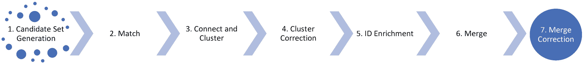
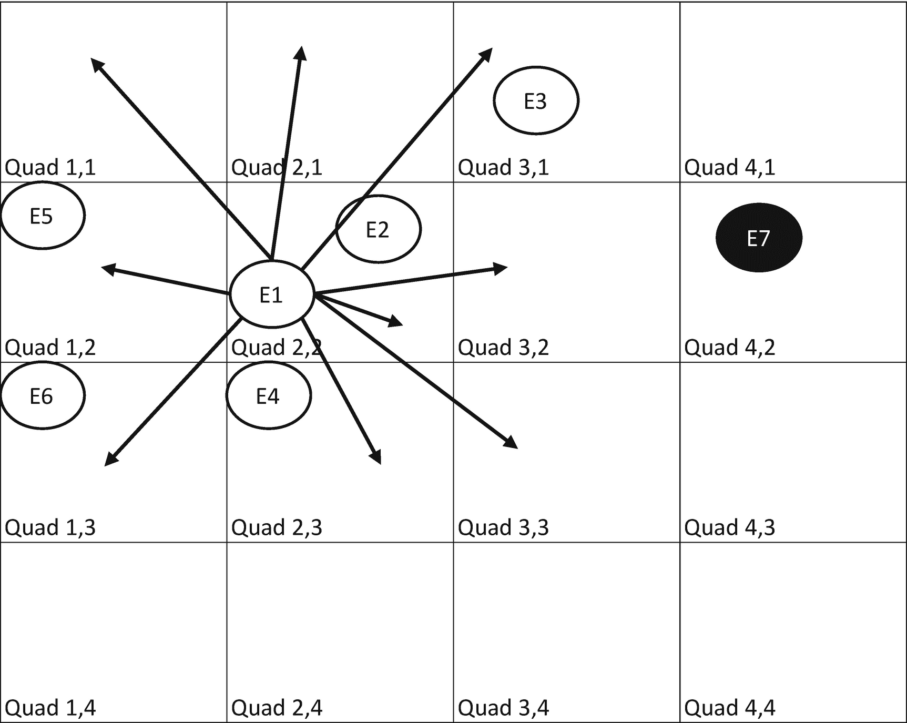

# 二、不断变化的要求

> *迎接* ***变化需求*** *，甚至* ***开发后期*** *。敏捷流程驾驭变化，为客户的* ***竞争优势***
> 
> *。—agilemanifesto.org/principles*

数据工程项目中不变的一点是变化。有时变化发生在数据本身，例如，检测欺诈性数据模式的系统不可避免地会被未来的攻击所欺骗，导致系统效率降低。随着对数据的探索和分析，解决数据问题的思路会发生变化。客户可能会善变，改变他们想要什么和什么功能对他们来说最重要的想法。可供使用的机器学习算法和技术也在发生变化——机器学习研究正在不断向前发展。最后，竞争产品也在不断变化——强大的竞争对手通常很难跟上，必须密切跟踪，以确保他们不会获得不可逾越的竞争优势。

最成功的数据工程项目认为变化是不可避免的，并在一开始就建立处理变化的机制。在这一章中，我们将考虑几种应对变化的策略，包括构建对变化更具弹性的模型，监控已发布的功能和模型的性能变化，确保模型及其功能是可测试的和敏捷的，以及衡量您自己的产品和竞争产品的性能。

## 为变革而建设

也许在一个数据工程团队中最难发展的文化，尤其是一个刚刚起步的团队，是“我们将长期从事这项工作”的想法如果您不从这一文化原则开始，所做的投资都将是短期的成功，随着时间的推移，随着需求和数据环境的变化，将越来越难以维持。

不要过于依赖某个特定的组件或架构也很重要。如果系统从一开始就是以松散耦合的方式设计的，那么重写一个有问题的组件或系统应该总是被认为是重构或继续修复该组件中的一长串错误的替代方法。正如在第 [1](01.html) 章:早期交付中所讨论的，这提供了一个开始的策略——将许多现有的组件连接在一起，以快速实现端到端的工作，但要以松散耦合的方式进行，这样你就可以根据需要替换或升级系统的部分。当你对你试图解决的问题有了更多的了解，并发现最初的组件管道并不能很好地解决手头的问题时，你应该准备扔掉你构建的第一个系统。

### 为变革而构建的衡量标准

正如第 [1](01.html) 章提到的:早期交付，在团队早期建立的最重要的事情之一是度量。一旦建立了度量标准，您必须投入专门的精力来保持度量标准与项目的业务目标保持一致。我们发现，在一个大约有 50 名开发人员的项目中，给五名开发人员预算，让他们专注于度量是一个好主意。有时候，我觉得即使是这样的投资也太少了。我们称这个由五名开发人员组成的团队为“度量团队”

### 尺寸

度量对于数据项目就像单元测试对于传统的软件项目一样。如果您有健壮的度量，您可以根据事实评估新的组件、新的架构和新的范例。如果你不认真对待度量，并广泛地投资于它，你永远不可能有一个成功的数据工程项目。

这五个开发商做了什么？首先，他们为团队的其他成员提供了防火墙，以防止开发团队的其他成员(和运输模型)受到测试集的影响。机器学习中要遵循的一个关键原则是不要用测试数据污染你的训练数据，否则开发人员会开始学习测试数据中的模式，过度适应被测量的问题，并扭曲指标，这样看起来你比实际做得更好。大多数重要的数据问题将在你的训练数据中显现出来。

我们围绕这一原则建立了一个组织边界，只让测量团队访问测试集。在实践中，我们发现测试数据很容易泄露到培训数据中，或者微妙地进入开发人员的头脑中，并且有效地欺骗我们自己，认为我们比没有这个组织边界的时候更好。度量团队还充当团队官方关键指标的权威，这些指标被定期计算和跟踪，并在门户中报告出来。

度量团队创建了可以计算和跟踪团队需要的任意数量的数据度量的系统，并帮助维护和存储团队需要的数百个不同的测试集。从一开始，他们就构建了度量系统，预期训练和测试集会改变，团队度量也会改变。

他们还设计了基于网络的应用，人类法官将使用这些程序对数据进行评分和标记，并设计了系统来管理和跟踪对数据做出的判断。其中一些判断用于评估我们在某些关键指标上的表现，例如，商业电话号码的准确性。其他判断被用作机器学习模型的训练数据。

贴标签的 web 应用被称为热门应用。HIT(人类智能任务)是法官对一段数据做出的判断，该系统旨在最大化法官每小时可以做出的判断数量，同时最大化每个判断的准确性。HIT apps 建立在一个通用平台上，为许多类似的团队提供服务，并确保每个团队不必重新发明我们的评分和标记系统中使用的通用功能。这些系统的设计是基于这样的预期:所需的热门应用类型会随着时间的推移而改变，甚至管理法官的策略也会随着时间的推移而改变。

### 投资工具

许多团队在工具上投资不足，从长远来看，这些工具将给团队带来巨大的效率。正如编写代码的团队从高质量的开发 IDE、源代码控制、持续集成和部署系统等中受益匪浅一样，数据工程团队也从高质量的机器学习工具、HIT app 创建工具以及数据探索和评估工具中受益匪浅。

如果一个团队是为“长期”而构建的，那么他们创建的度量系统是非常不同的例如，当团队决定他们不仅需要测量业务电话号码的准确性，还需要测量更复杂业务中相关部门的电话号码时，拥有一个具有可重用组件的 HIT 应用系统变得非常重要。如果从第一天开始，你就假设你可能会有成千上万的训练集和测试集，那么跟踪训练集和测试集的系统的构建就大不相同了。如果团队知道他们最终将不得不为多个不同的市场报告数百种不同的指标，则计算指标的系统的设计会有很大不同——例如，不仅仅是美国的电话号码准确性，还包括另外 30 个国家的电话号码准确性。

对这种健壮系统的投资肯定会减缓初期工作——但从长远来看，速度的提高超过了从一开始就为变化而设计的成本增加。

### “长期建设”只是瀑布吗？

长期构建听起来可疑地像瀑布开发——在开发之前弄清楚你需要构建的一切的方法似乎是敏捷的诅咒。我们在这里谈论的可能更好地表达为**选择灵活的架构模式，使** **能够长期改变**。例如，我们没有立即建立对 30 个市场的支持，我们最初只建立了对美国市场的支持。但是在代码中，我们尽可能地确保我们不会硬编码到一个市场，因为我们知道我们必须支持许多市场。在后来的迭代中，当我们开始支持第二、第三和第四个市场时，必须对现有代码进行更改，但是这些更改并不像我们至少用支持多个市场的架构模式进行规划时那样广泛。

### 为变革而构建的管道

我们对 50 人团队的第二项大投资是资助一个管道和基础设施团队。该团队提供了部署和运行所有模型和代码的基础设施，团队的其他成员将使用这些模型和代码每天生成新的数据目录。在一个 50 人的团队中，我们有 10 名成员专门负责管道。我们称这个团队为“数据管道”团队。

数据管道团队创建了在线系统或“管道”,该系统或“管道”将每天接收我们不同数据源的所有更新，运行代码以标准化该数据，托管各种模型以改进和聚合该数据，托管我们称为“合并/合并”的管道阶段，这是我们如何对我们拥有的许多数据源进行重复数据删除的，这些数据源都具有关于世界上同一实体的信息，并尝试从多个可用来源中挑选最佳数据，然后最终将数据发布到我们的目录中。

### 环境或环

对于团队来说，将他们的系统部署到稳定性逐渐增加的多个环境(有时也称为环)是有益的。在微软，我们通常有三种环境。“开发”环境有管道的版本，带有开发人员在产品上积极工作的最新签入。在“开发”环境中，管道上的负载只代表了系统需要处理的真实负载的一小部分。随着“开发”环境中的代码变得稳定，所有测试都通过了，并且管道被验证可以工作，代码将被转移到“PPE”或预生产环境中。该环境将承担更能代表生产负载的负载，并在将代码转移到“生产”或生产环境之前充当最终冒烟测试环境。我们在环境之间建立了“门”——基本上是一组测试和度量标准，在代码可以从 Dev 转移到 PPE，然后从 PPE 转移到 Prod 之前，这些测试和度量标准需要通过并被验证不会退化。

图 2-1

数据管道

作为对我们系统的简要解释，我们将在本书中讨论它的各个方面，我们的管道如图 [2-1](#Fig1) 所示，从世界各地的多个数据提供商提供的数百个“数据源”中获取关于本地企业的数据。例如，我们构建了一个系统，从网络上的主要网站提取当地企业的信息，这将在第 [1](01.html) 章中讨论:早期交付——例如，我们将抓取沃尔玛网站，以获取世界上每个沃尔玛的位置、电话号码和其他信息。我们还从 Yelp 和猫途鹰等第三方数据提供商那里获得了评论等其他商业数据。我们也有来自扫描电话簿的第三方的反馈。每天，所有这些数据都被重新提取并输入到我们的数据管道中。数据被标准化(例如，大小写被标准化，电话号码格式被标准化，等等)。).然后，我们使用地理编码器将所有地址信息地理编码到地图上的纬度/经度点。

然后使用合并/合并记录链接系统对数据进行匹配，该系统将在本章稍后描述，包括四个步骤:候选集生成、匹配、聚类和合并。合并系统可以检测到猫途鹰订阅源中的记录 9875 与 Yelp 订阅源中的记录 5324 和 web 提取的订阅源中的记录 1945 谈论相同的商业。这三个记录(实际上，我们通常有 25 到 100 个订阅源，每个订阅源都有一个对应的记录来贡献给更受欢迎的企业)需要合并在一起——每个提供商的数据都有细微的差异，所以我们必须使用机器学习来确定两个记录是否匹配，以及是否谈论同一家企业，并决定是否使用 Yelp、猫途鹰提供的电话号码，或者当提供商对电话号码有不同意见时，是否使用网络提取的数据。合并后的实体随后发布到我们的目录中。

该团队以非常不同的方式创建了数据管道，知道它将需要处理多个市场价值的数据，它将被微软的许多不同团队使用，其他团队将需要以不同的方式扩展和配置管道，数据馈送和数据源可以根据当前的业务交易和可用数据随时修改、添加和删除， 并且需要一种机制来手动校正数据，并具有“校正”层来覆盖数据管道可能为特定实体产生的任何不良结果。

为变化、可扩展性和可配置性而构建在开始时确实涉及更多的前期工作；但我们的长期目标是通过利用各种数据源、网络和先进的 ML 模型，确保 Bing 的本地商业目录与 Google 竞争。我们希望在每个国家都与谷歌竞争，而不仅仅是在美国。所以数据管道从一开始就被设计成非常可配置和可扩展的。管道监控和工具旨在预测多个数据管道——每个市场一个管道，可以相互独立运行。后来我们上线了新的国家，这个过程非常快，因为我们在设计时就考虑了长期目标。

### 机器学习支持团队

到目前为止，我们已经基本描述了我们团队中的两个学科——一个测量学科和一个大数据管道学科。这两个学科都必须熟悉机器学习，以确保测量和数据管道支持数据科学家创建将在生产中运行的模型。然而，这经常导致有趣的管理挑战。通常，“度量”学科或“大数据管道”学科的人会看着整个组织中处于“数据科学家”学科并构建生产模型的开发人员，并会说，“我想这么做。”总的来说，我们会尽可能地鼓励和支持想要这样做的人，因为这有助于整个团队变得更好，因为来自不同学科的知识在各个团队之间流动。这有助于数据科学家理解，当有这种背景的人在他们的领域工作时，“运行数据管道有什么难的”。然而奇怪的是，我们很少有数据科学家要求在管道上花更多的时间。为了抵消数据科学家缺乏在管道中工作的愿望，我们经常要求数据科学家在他们的机器上有了模型后更进一步，不只是将模型扔给数据管道团队，并说“请运行这个”，而是实际上让数据科学家也做工作，以检入和集成他们的模型到数据管道，并确保它在生产中运行良好。

### 为改变而构建的模型

在这一节中，我们将看看如何为变革构建机器学习模型。我们将在本节中考虑的示例是 Bing 的合并/归并系统，该系统用于链接多个数据提供者提供的记录，以创建每个本地实体。

#### 合并系统介绍

我们对 50 人团队的第三项大投资是资助合并/合并团队。这个团队拥有复杂的算法和机器学习模型，用于为系统进行记录关联，并在可能有几十种不同的值可供选择时，为企业的每个关键属性选择最佳值。这是我们系统中最复杂的部分，有另外十名开发人员专门负责。我们称这个十人团队为“融合”团队。

除了我们从网络上提取的数据之外，合并团队还创建了一个系统，用于匹配来自 Bing 授权数据的许多不同本地数据提供商的数据。这个记录链接系统遵循了第 [1](01.html) 章中描述的经典模型:早期交付:它开始很简单，然后随着需求和度量的发展，系统从一个简单的基于规则的系统发展到一个更加复杂的基于 ML 的系统。

记录链接组件被确定为需要改进和重写的关键领域，一旦制定的度量标准显示了我们的记录链接系统中的弱点。对于最终用户来说，我们系统中的这些弱点表现为“重复”——例如，一个用户可能搜索星巴克，而事实是在他们的社区中有五家星巴克，搜索引擎可能会返回六家星巴克。这种错误通常是由记录链接错误引起的，其中对应于列表中第五个 Starbucks 的记录由于记录中的数据变化过大而没有正确地链接到第五个 Starbucks，因此它变成了错误的第六个条目。

图 [2-2](#Fig2) 展示了 2014 年来自 Bing 的这个错误的一个实际例子。这两个实体由来自 11 个提供商的 18 个记录构成，这些记录应该被链接在一起以创建一个单一的剧院实体。但是我们的记录链接系统从 18 个记录中发现了足够多的与其他记录不同的记录，因此它决定创建两个实体。这是因为不同供应商的名字、电话号码和评论不同。与该实体相关的所有 18 个记录和 11 个提供者如表 [2-1](#Tab1) 所示。

表 2-1

用于创建一个实体的多个数据提供程序和记录

<colgroup><col class="tcol1 align-left"> <col class="tcol2 align-left"> <col class="tcol3 align-left"> <col class="tcol4 align-left"> <col class="tcol5 align-left"> <col class="tcol6 align-left"></colgroup> 
| 

供应者

 | 

名字

 | 

关门了？

 | 

地址

 | 

电话

 | 

网站

 |
| --- | --- | --- | --- | --- | --- |
| **答** | 乡村剧院 |   | 伊萨夸西北第一大道 480 号 | Four billion two hundred and fifty-three million nine hundred and fifty thousand and fifty-one | Villagetheatre.org |
| **答** | 乡村剧院 |   | 伊萨夸前街北 215 号 | Four billion two hundred and fifty-three million nine hundred and eighteen thousand one hundred and ninety | Villagetheatre.org |
| **B** | 乡村剧院 |   | 伊萨夸前街北 303 号 | Four billion two hundred and fifty-three million nine hundred and twenty-two thousand two hundred and two | Villagetheatre.org |
| **C** | 乡村剧院 |   | 伊萨夸前街北 303 号 | Four billion two hundred and fifty-three million nine hundred and twenty-two thousand two hundred and two | Villagetheatre.org |
| **C** | 弗朗西斯·高德特剧院 |   | 伊萨夸前街北 303 号 | Four billion two hundred and fifty-three million nine hundred and twenty-two thousand two hundred and two | Villagetheatre.org |
| **D** | 弗朗西斯·高德特剧院 |   | 伊萨夸前街北 303 号 | Four billion two hundred and fifty-five million three hundred and ninety-two thousand two hundred and two |   |
| **D** | 乡村剧院 |   | 伊萨夸前街北 215 号 | Four billion two hundred and fifty-three million nine hundred and eighteen thousand one hundred and ninety | Villagetheatre.org |
| **D** | 乡村剧院 |   | 伊萨夸前街北 303 号 | Four billion two hundred and fifty-three million nine hundred and twenty-one thousand nine hundred and forty-two |   |
| **D** | 乡村剧院 |   | 伊萨夸西北第一大道 480 号 | Four billion two hundred and fifty-three million nine hundred and fifty thousand and fifty-one |   |
| **E** | 乡村剧院 | 错误的 | 伊萨夸前街北 303 号 | Four billion two hundred and fifty-three million nine hundred and twenty-two thousand two hundred and two | Villagetheatre.org |
| **F** | 乡村剧院 |   | 伊萨夸市北大街 303 号 | Four billion two hundred and fifty-three million nine hundred and twenty-two thousand two hundred and two |   |
| **F** | 弗朗西斯·高德特剧院 |   | 伊萨夸市北大街 303 号 | Four billion two hundred and fifty-three million nine hundred and twenty-two thousand two hundred and two |   |
| **G** | 乡村剧院 |   | 伊萨夸前街北 303 号 | +1 425-392-2202 | Villagetheatre.org |
| **G** | 弗朗西斯·高德特剧院 |   | 伊萨夸前街北 303 号 | +1 425 392-1942 |   |
| **H** | 乡村剧院 |   | 伊萨夸前街北 303 号 | Four billion two hundred and fifty-three million nine hundred and twenty-two thousand two hundred and two | Villagetheatre.org |
| **我** | 乡村剧院 |   | 伊萨夸前街北 303 号 | Four billion two hundred and fifty-three million nine hundred and twenty-two thousand two hundred and two | Villagetheatre.org |
| **J** | 乡村剧院 |   | 伊萨夸前街北 303 号 | Four billion two hundred and fifty-three million nine hundred and twenty-two thousand two hundred and two |   |
| **K** | 乡村剧院 |   | 伊萨夸前街北 303 号 | Four billion two hundred and fifty-three million nine hundred and twenty-two thousand two hundred and two | VillageTheatre.org |

图 2-2

2014 年 Bing 数据中的“不匹配”或重复错误

### 不良数据激增

您可能想知道为什么在前面的例子中 11 个数据提供者中有多个有相同的坏数据。这个问题经常发生在我们的空间中，因为在这个领域中发生了数据集的买卖。单个数据提供者可能会得到一个错误的电话号码或名称(或者更可能是一个旧的和过时的电话号码)。该数据提供商可能将他们的数据出售给其他数据提供商。这些数据提供商通常通过在基础数据上添加评论或一些其他值来扩充基础数据。他们转而转卖他们的数据，传递坏的电话号码或名字。Bing 作为多个这些购买数据集的消费者，通常会有多个提供商，这些提供商似乎“确认”一个实体的存在，因为他们在数据上达成一致，但实际上，由于多个提供商以相同的方式描述它，这种表面上的“确认”肯定是一个真实的实体，实际上是数据提供商之间共享的坏数据。

### 真实世界的数据是嘈杂的

当您研究表 [2-1](#Tab1) 时，其中显示了 11 个提供商的实际名称、地址、关闭状态、电话号码和网站，您会发现每个字段都有很多变化。实体的名称有三种选择，四种不同的地址选择，电话号码有四种选择(一旦规范化)，并且每个提供者知道的信息有多种差异。例如，在本例中，网站在 18 次访问中只有 11 次是已知的，并且只有一个提供者有足够的信心断言该实体是开放的。

此外，您会注意到某些提供商提供了大量重复数据，例如，提供商 D 有四条记录都声称是乡村剧院。

随着用户开始报告和抱怨我们系统中的这些重复实体，我们开始开发一种我们称之为“重复率”的测量方法来测量这个问题。我们会让人类法官运行一个查询语料库，代表用户在网站上进行的实际查询，然后判断每个查询的结果，看看产生了多少重复。正如您可能想象的那样，判断过程很复杂，因为两个返回值是否重复通常并不明显。法官将不得不更深入地查看我们链接在一起的记录，给企业打电话，或者试图找到主要网站，以验证某个特定实体是否是重复的。

既然我们有了一个定期开发和测量的重复率度量标准(当工程团队需要更频繁的更新时，我们会每两周或更频繁地更新它)，我们开始尝试改进它。该团队还创建了广泛的记录标签，以指示哪些记录对应于现实世界的实体。这有效地代表了人类手动做我们最终想要系统做的事情。我们这样做的方式是，我们获取给定邮政编码的所有记录(通常有来自代表相同业务的不同提供商的数十条记录),并手动将这些记录聚集在一起，以生成系统使用的训练数据。

然后，该团队使用这些训练数据来使用更复杂的技术进行记录链接，并超越基于规则的系统。该团队必须匹配、聚集、然后合并来自不同数据提供商的多个数据源提供的关于同一业务的多条数据。该团队创建了一个机器学习匹配函数，除了用于将数据合并在一起的机器学习模型和将相关数据聚集到同一个群集中的复杂算法之外，该函数还用于匹配。代表记录聚类的人类标记的训练数据的语料库用于确定可以添加到匹配模型或聚类和合并模型的新特征，以确保我们的重复率降低。

随着我们匹配模型的改进和重复率的下降，用户开始抱怨一个新的问题。这个问题通常表现为某个实体有一个错误的电话号码、地址或相关评论。在研究这个问题时，我们发现我们的系统现在在减少重复记录方面过于激进，并且现在正在创建我们所谓的“优势”，其中记录被链接在一起，用于彼此靠近的不同企业(例如在西雅图经常发生的两个星巴克在一个街区内)，或者包含在另一个企业内的企业，例如超市内的咖啡店。

图 [2-3](#Fig3) 显示了一个强者的例子。在这种情况下，一个“Levi 商店”的记录与一个名为“西雅图高级折扣店”的购物中心的记录相关联。然后，合并系统将确定所有记录中的哪些数据被链接在一起，并被认为代表单个实体。根据这一判断，它将从一个数据提供商提供的记录中获取名称(预计具有最佳名称),从第二个数据提供商提供的记录中获取网站(预计具有最高质量的网站),从而构建最终的实体。不幸的是，第一个数据提供者提供的记录实际上代表了现实世界中的实体“Seattle Premium Outlets”，第二个数据提供者提供的记录实际上代表了现实世界中的实体“The Levi 's Outlet”

图 2-3

数据中的强者——来自 2014 年的必应

为了应对优势问题，我们开发了第二个“优势”指标，除了重复率之外，我们还开始定期测量这个指标。现在，我们要求法官运行一组查询，并查看系统选择创建每个实体的记录。随着时间的推移，我们了解到我们必须对系统进行微调，以优化我们的重复率和优势指标。通常，提高复制率所需的工作会倒退到强者。有时需要特定的工作来减少不直接影响优势率的优势。例如，overmatch 的一个常见原因是前面的父实体“Seattle Premium Outlets”与子实体“outlet mall 中的 Levi Store”合并的例子。减少这种过度匹配的工作通常以在目录中创建先前淹没在过度匹配的实体中的新实体而告终，而不是改变重复率。

#### 合并系统

在图 [2-4](#Fig4) 中，我们将简要考虑合并系统用来将记录链接在一起并最终合并这些记录以在系统中创建每个本地业务实体的步骤。该系统使用由多个数据提供者提供的已经标准化的数据。

图 2-4

合并系统

1.  候选集生成:在合并中，基本操作是查看系统中的两个记录，并确定它们有多相似或不相似。这是通过我们称为“匹配函数”的机器学习函数来实现的，该函数将每个实体的所有属性以及基于每个实体的属性计算的许多特征作为输入，并输出从 0 到 1 的相似性得分。运行 match 函数的成本很高，所以当 n 在我们系统的数亿条记录中时，您无法在系统中的整个 n x n 记录矩阵上运行它。这样做也没有意义——比较清楚地提到堪萨斯州托皮卡的麦当劳的记录和提到爱达荷州博伊西的麦当劳的记录是浪费计算时间。

    因此，我们的合并系统的第一阶段查看系统中的记录，并生成更小的记录集(我们称之为候选集)，这些记录很有可能位于相同的物理位置。例如，一个简单的实现是选择特定邮政编码的所有记录集，并对所有这些记录成对运行 match 函数。

    In reality, we divided the map into smaller tiles we called quadkeys (roughly the size of a city block). Any entity in a given quadkey would be compared with all businesses in the same quadkey and the eight other quadkeys surrounding that quadkey as shown in Figure [2-5](#Fig5).

    

    图 2-5

    四键–一个实体(E1)与同一个四键和八个相邻四键中的所有实体进行比较。除 E7 之外的所有实体都通过该算法进行比较。

2.  匹配:在这一阶段，匹配功能将运行候选集合内的所有实体的 n×n 比较，该匹配功能以针对实体对推断和计算的数百个特征作为输入。作为进一步的优化，我们有一个较低成本的匹配函数，可以在最初运行以排除明显的不匹配实体，然后有一个较高成本的匹配函数，可以在低成本匹配函数不能排除的相似或不相似的实体上运行。

    例如，我们投资了一组自然语言处理(NLP)功能，这些功能将获取实体的输入名称，并为实体名称中的每个单词标记被确定为人名[P]、企业名称[B]、企业类别[C]、企业部门[D]等的单词。对于一家名为“州立农场保险公司——约翰·史密斯”的企业，标签员会将其标记为“州立农场保险公司——约翰·史密斯。”根据这些额外的推断标签，我们创建了匹配功能学习的特征，例如“两个实体都有人名”或“人名相似性得分”，这些特征将来自被比较的两个实体的标签数据作为输入，并输出 0-1 的得分。

    然后，匹配函数根据由法官标记的数据进行训练，其中法官将确定来自数据提供者的两个记录是否在谈论同一个实体(参见表 [2-1](#Tab1) 中来自数据提供者的数据的示例),并且匹配函数将学习它正在查看的数百个特征中的哪一个，例如“两个实体都有人名”或“两个实体都有相同的电话号码”,在比较各种类型的实体时应该被赋予最高的权重。

3.  连接和聚类:在管道中的这个阶段，match 函数现在为所有彼此邻近的实体对输出相似性分数。这就产生了我们所说的“连通分量”，其中所有运行了匹配功能的实体之间现在都有一条边。随着实体的连接，我们现在有一个新的问题要解决，一个我们称为“聚类”的问题，即如何确定哪些记录应该合并以创建一个特定的聚类，从而产生一个本地业务。

    Clustering determines how many entities to create from that connected graph. For example, Figure [2-6](#Fig6) shows how clustering would operate on a simple connected graph. Records are represented by the nodes a through f. Match scores are on the edges between records. The graph is not completely connected because the records a, b, and c were in a different candidate set than d, e, and f (likely because the records are too far away from each other). In this example, three entities are created from the clusters: abc, e, and df. The match scores (on edges between records) that are greater than .5 are considered a match and match scores lower than .5 are considered a no match.

    

    图 2-6

    从连通图中创建聚类

4.  集群校正:在这个阶段，我们保留了用户报告的系统中已知的重复或优势的列表，合并系统仍然没有得到正确的处理。因此，我们可以通过“强制匹配”来将系统失败的副本集合在一起，并通过“强制取消匹配”来强制分离那些处于劣势的实体。随着时间的推移，随着我们系统的改进，需要手动纠正的情况越来越少。

5.  ID 充实:我们将在本章后面讨论关于 ID 稳定性的问题时讨论这一点。

6.  Merge:在合并时，我们将获取一个集群中链接在一起的所有记录，并决定使用集群中所有记录的哪些数据来创建最终的实体。在这里，我们也使用机器学习来确定哪个数据提供商拥有最正确或最值得信赖的数据。例如，在具有餐馆数据的群集中，机器学习的合并函数可能学习信任餐馆特定的提供者来获取实体的名称，但是信任电话簿扫描提供者来获取实体的电话号码。

7.  合并更正:在这个阶段，我们保留了用户报告的已知合并失败的列表(例如，当我们从一个特定的提供者选择了一个错误数据的属性，但是另一个提供者为该属性提供了一个正确的值)。然后，我们会强制从已知正确的提供者那里挑选数据。如果我们的提供商没有一个是正确的，我们也有自己的微软提供的数据源，这些数据源将聚集到一个我们手动管理并知道是正确的实体中。

#### 建立变革的融合系统

也许这个团队设计合并系统的最重要的方式是通过预测一个匹配功能不会对所有世界市场都同样有效。例如，美国市场的匹配功能高度依赖于准确的地址和企业的经度和纬度。但在巴西这样的市场，地址远没有美国那么结构化和模糊——例如，巴西地址通常只表示一个街区，其位置与该街区的一些地标相关。通过预测需要多个匹配功能，该团队构建了合并系统，其中许多元素可以用不同的更具市场针对性的元素来替换，例如，在美国高度依赖地址的候选人生成系统可以用对地址不太敏感的候选人生成系统来替换，用于巴西等国家。

此外，由于意识到需要构建许多不同的匹配功能，该团队构建了一个可重复使用的功能库，可以在每个特定市场的模型中利用。这个支持计算姓名相似性、地址相似性、类别相似性、电话号码相似性、字符串中的空格数、标点符号和命名实体识别器的可重用特性库可以被随着时间的推移而创建的多个合并模型所利用，从而允许团队在面对不断变化的需求时保持稳健。此外，这个可重用特征库的一部分是可重用工具，用于为每个特征生成和处理训练数据。

### 支持变革的架构

团队早期做出的一个艰难的决定是从根本上为我们的数据管道和数据目录选择一个支持变化的架构。那个架构决策被称为“每天从头开始构建世界”的决策。这个决定有利有弊。我们将描述这个决定是什么，为什么做出这个决定，它如何帮助我们，以及它如何伤害我们。

在创建 Bing 本地数据管道的早期，我们很清楚，我们的合并模型仍然是原始和不成熟的，要实现我们希望的重复率和优势率，我们还有很长的路要走。与谷歌不同，我们没有一支随叫随到的大军——有偿和无偿的——他们会为我们纠正目录中的所有错误。我们决定在机器学习和从网络中提取商业实体上押下重注，而不是人工监管和纠正。出于这个原因，我们决定每天晚上有效地扔掉我们的目录，第二天从头开始构建。我们的本地数据目录基本上是围绕 MapReduce 的原则而不是数据库的原则构建的——它是由数百台机器每天从零开始创建的，所有这些机器都与我们的管道以及我们所有的算法和模型并行运行。

我们确实有一个机制来存储我们收到的过去的修正——这些修正作为另一个数据源被输入到管道中。但是通过每天晚上从头开始重建目录，我们可以充分利用我们机器学习模型中的任何改进。例如，如果对我们的匹配函数进行了改进，显著提高了我们的重复率，当我们使用新的匹配函数通过管道重新运行所有现有数据时，我们可以立即受益。我们还降低了 bug 导致目录长期损坏或降级的风险，因为我们每天晚上都要扔掉它。一个坏的模型或错误最多会影响目录几天，直到我们发现并修复这个模型或错误。如果模型或管道中存在 bug，我们还能够轻松地回滚到以前的目录。

### 一次性更正

当我们在生产中出现合并错误时(例如，需要合并的重复业务)，手动纠正系统允许我们快速修复这些问题。但事实证明，存储过去的修正是一个难以管理的系统。对合并系统进行的手动校正往往会随着这些校正的老化而导致重大的质量问题。随着合并系统变得更好，输入数据发生变化，手动更正往往会碍事，更正会从更正数据变成导致数据错误。花了很多时间试图找出如何老化或删除错误的更正。最终，人类法官被用来定期审核哪些更正仍然正确，哪些不再有效。

正如所希望的那样，通过使用每天晚上从头开始重建目录的方法，我们确实取得了很大的收获。随着我们对合并模型、提取模型、属性选择模型等的改进，当部署这些更改时，我们可以立即看到整个目录的巨大改进。我们避免了试图在数据库中跟踪这些变化的复杂性，并减少了对人工编辑数据的依赖。

然而，这种方法有一些明显的缺点。首先，我们在用基本的“构建整个世界”的方法构建我们的数据管道时目光短浅，而不是在我们的数据管道中以有意义的方式支持增量。例如，即使在某一天，Yelp 可能只给我们几千个与前一天不同的本地商业实体，我们的管道仍然接收、处理、合并和发布所有内容，而不管特定实体的源数据是否以任何方式发生了变化。随着我们获得的数据量的增加，我们的管道变得不那么高效了。随着我们编写的模型数量的增加，我们的管道的性能进一步下降，直到花了好几天时间来构建一个新的目录。这降低了本地数据目录的新鲜度。

我们遇到的第二个重大缺陷与我们所说的“ID 流失”有关从数据库系统中得到的一个东西是一个基本稳定的 ID。在像我们这样的大型 MapReduce 系统中，数据每天都会重新聚类，这些聚类可能每天都在变化，因为它们从根本上与匹配分数相关联，而匹配分数也可能随着匹配功能的改进而变化——ID 稳定性成为我们的一个问题。我们在图 [2-4](#Fig4) 中的“ID 丰富”阶段采用了几种 ID 稳定技术，但我们从未能达到数据库系统所允许的 ID 稳定性水平。

拥有一个每天“从零开始构建世界”的系统最终成为我们的竞争优势——使我们能够比采用数据库风格的架构更快地改变我们的目录、算法和模型。

## 通过测试和监控来实现变革

由于我们有一个“从零开始构建世界”的系统，我们必须在如何发现今天的目录与昨天的目录没有灾难性的不同方面有所创新。我们通过三种方式做到了这一点:监控目录中的增量变化，监控“哨兵”实体，以及为我们的数据计算一个快速的质量分数。

### 监测增量变化:DRI 数据

我们首先开发了一个广泛的、可配置的系统，用于监控和警告每次运行中数据的重大变化。例如，我们可以监控周一发布的电话号码的数量，并将其与周二从头开始重建目录时发布的电话号码的数量进行比较。可以在系统中配置阈值，以确定随着时间的推移，电话号码数量的变化有多大是值得警惕和值得调查的。由于我们所有的数据源每天都被重新获取，并且我们使用机器学习模型从许多不同的来源中挑选最佳的电话号码，所以看到目录中的几千个电话号码每天都在变化并不是不合理的。因此，我们通过几周的观察，为目录中可接受的变化建立了基线阈值，然后设置了警报，当这些数字的变化超过这些阈值时，警报就会响起。

当其中一个监控器响起时——例如，“今天数量惊人的电话号码发生了变化”——DRI 将开始调查这一数据。DRI 代表“指定负责人”，每周一名团队成员将被指定为 DRI。DRI 拥有一套调查数据变化的工具，在对管道上次运行以来对系统所做的更改进行一些调查，并对一些发生变化的电话号码进行一些手动验证后，数据 DRI 将决定继续发布目录或触发团队的额外调查。

使用该系统，投资工具来提高 DRI 数据中心为目录做出“发布/不发布”决策的能力是非常重要的。此外，这些警报可能会在目录创建的早期阶段触发-因此，当 DRI 数据中心调查是否继续运行时，宝贵的时间正在流逝，这推迟了我们对目录的下一组更新的发布。因此，除了在工具方面进行大量投资，以便 DRI 可以探索管道中的问题，我们还在调整警报和减少系统中的错误警报数量方面进行了大量投资。

### 前哨实体

第二个令人尴尬的事件发生的次数比我们喜欢的次数多，那就是当一个非常重要的实体在一次新的运行中突然从目录中消失——例如，我们有几次拉斯维加斯的大型赌场神秘地从目录中消失，而且没有拉斯维加斯的魔术师参与其中。

为了解决这个问题，我们创建了一个包含数百个“太重要而不能丢失”的实体的列表，我们将明确确保这些实体每天都在目录中。删除其中一个哨兵实体(有时也称为“英雄”实体)是非常严重的，我们总是会停止发布目录并调查发生了什么。

### 每日判断指标

我们监控“每天从零开始构建”系统的第三种方式是每天进行人工判断的度量。进行人工判断的度量是昂贵且耗时的，因此我们做了大量工作来减少我们在发布新目录时必须做出的判断的实际数量，利用本地数据的问题空间中非常小的变化率。这一指标的巨大变化通常是由于工程错误，而不是数据的真实变化。

我们的每日指标基于一组约 1500 个实体，这些实体是在 6 个月的开始阶段根据实体的受欢迎程度从目录中随机抽样的。所以更频繁显示的实体比不太频繁显示的实体更有可能在 1500 的集合中。在 6 个月的开始阶段，对这些实体的名称、电话、地址、类别、经度和纬度、网站等的准确性进行了详尽的判断。然后，当每个新目录发布时，我们使用各种技术来尝试在新目录中找到这 1500 个实体(因为还没有确保相同的 ID，所以我们将首先尝试使用 ID，然后再使用其他匹配方法)。然后，我们将计算在旧发布和当前发布之间哪些属性发生了变化，并将这些属性立即发送给法官进行判断，然后评估这些变化的总体准确性的重新计算的指标通常会在一个小时内返回。

这一指标是检测我们数据库中不需要的变化的另一个很好的工具，也为我们的算法和模型如何影响我们的 1500 个关键实体提供了很好的见解。我们能够构建各种工具来跟踪这 1500 个实体，因为它们是在每次管道运行时创建的，以便更好地了解我们系统的性能。

### 度量标准有时可以兼做集成测试

如果您能够开发可以频繁重新计算的度量标准——理想的是每天一次，或者在系统的每次构建和运行时更好——这些也可以用作集成测试。我们有专门的集成测试，但是我们的日常度量经常会捕捉到集成测试没有捕捉到的系统中的回归。

### 测试功能

许多机器学习项目的基本构件是从数据中提取的特征。在我们的系统中，我们广泛实现了两种类型的特性。第一种类型是实体属性相似性特征，它将两个实体作为输入并计算相似性得分。第二种类型是实体附加数据特征，它采用单个实体和一些附加信息或算法的语料库，通过推理将附加数据添加到实体中。

例如，可以从本地企业实体中提取的可用于匹配的一些实体属性相似性特征包括计算由系统摄取的企业的两个属性之间的相似性得分的特征。可以比较的可能属性包括企业名称、位置、类别、电话号码等等。用于计算相似性得分的可能算法可以包括两点之间的欧几里德距离或者两个名字之间的编辑距离，例如 Levenshtein 距离。

实体附加数据特征的一些例子包括将实体的电话号码与活动电话号码的已知目录进行比较，以及向实体添加名为“KnownToBeGoodNumber”的属性另一个例子是对名称进行拼写纠正，以在名为“SpellCheckedName”的实体上生成新属性，或者使用地址验证组件添加名为“ValidatedAddress”的属性一旦创建，这些附加的实体属性也可以与实体属性相似性特征相结合。

随着新的推理技术和算法的不断探索和发展，我们实现的功能集也在不断增加，包括了数以千计的功能。为了实现特性集的变化，有两种技术是有用的。首先，我们确保所有的新特性都有良好的单元测试覆盖率。第二，我们将许多在特性开发中常用的构建块构建到一个共享的公共库中，特性作者可以使用它来快速开发和创建新特性。

有一段时间，团队中存在关于我们需要多少单元测试的争论。因为功能最终被组合成对数据的更大推断，并且因为生成的数据的质量是通过度量来测量的，所以功能中的缺陷通常是可检测的，因为度量减少了-例如，目录中电话号码准确性的总体质量分数通常会反映在“KnownToBeGoodNumber”功能中添加缺陷的影响。最终，度量回归是测试您的系统的一种有用的方法，但是我们发现我们受益于尽早检测系统中的故障——并且一组健壮的单元测试以及高质量的共享公共库确保我们可以快速地改变特性，并且尽可能早地在更接近故障点的地方发现故障，从而提高我们额外特性开发的速度。

### 测试学习模型

我们开发的所有功能都被额外的机器学习模型利用，这些模型通常是增强的决策树，可以了解数百个功能中哪些对手头的数据问题重要，哪些不重要。这个过程在机器学习中被称为“特征选择”。

例如，有一个模型，我们预测了目录中的某个业务实体是否会关闭。它消耗了大量的特征，并在真实世界中被验证为关闭的实体的标记数据上进行训练。一旦模型被训练，它就确定了每个特征对于一个企业是否被关闭的重要性。表 [2-2](#Tab2) 显示了由学习模型确定的一些最重要的特征。提供商 A 看起来拥有非常准确的业务数据。此外，一个聚类中在被关闭的实体上同时发生的记录的数量是一个重要的特征(再次将一个聚类想象成表 [2-1](#Tab1) 中所示的那样)。

表 2-2

由机器学习的封闭模型确定的各种特征的重要性

<colgroup><col class="tcol1 align-right"> <col class="tcol2 align-left"></colgroup> 
| 

特征

 | 

相对重要性

 |
| --- | --- |
| *提供商 A 称该企业已经搬迁或翻新* | Four point five |
| *集群中封闭实体的比率* | Four point three |
| *供应商 A 说生意已经结束* | Two point five |
| *集群中实体的数量* | One point four |
| *提供商 B 在集群中有一个实体* | One point one |
| *供应商 C 说生意已经结束* | One |
| *提供商 D 在集群中有一个实体* |   .9 |

### 标记的训练数据

在系统中获得正确的另一个关键是标记的训练数据的质量和新鲜度。我们在系统中使用了许多标签。例如，在我们的合并系统中，我们用成千上万个匹配和不匹配的实体的例子来训练我们的匹配函数。

这里的挑战是要有各种各样的新标记的训练样本，提供关于哪两个实体匹配和哪两个不匹配的清晰判断准则，并监控判断团队提供的判断质量。

拥有高质量的标记训练数据真的是拥有强大产品的秘密武器。我们非常重视法官的管理和教育，以及对培训数据的审核。对我们来说，理想的设置是我们将雇佣那些坐在开发团队附近的法官——最好是在同一层。开发团队将与评委一起为标签编写非常详细的评判指南。例如，我们的商业网站的判断指南有 48 页长，完全由开发团队创建，以确保我们得到的网站标签(我们有 6 个)是正确的。这份 48 页长的指南并没有立即出现——最初，我们认为判断主网站的正确性会更容易。但随着时间的推移，评判团队在评判网站的过程中会发现新的场景，所需的标签会发生变化，开发团队会发现他们需要更多的数据来实现一个或另一个功能，因此对评委的指导也会发生变化。法官还会经常就一个特别棘手的问题向开发团队寻求判断建议，这将导致系统中的新功能或更清晰的判断指南。

### 向法官学习

法官每天查看数百个数据示例，最终在某些情况下比开发团队本身更好地理解数据。与法官保持密切联系，并经常与他们见面。在判断指南中写下他们遇到的所有奇怪案例。当法官定期向团队描述他们遇到的奇怪的真实案例时，他们经常可以启发开发团队创建新的功能。开发团队和法官之间每周举行一次会议是一个很好的做法，以听取数据中的真实情况以及法官遇到的问题类型。

例如，最初在我们的标签中，我们要求评委回答问题“企业的网站——比如说[`http://www.walmart.com`](http://www.walmart.com)——是官方网站吗？”最初的标签是“是”、“不确定”或“否”。最初，Walmart.com 站点是可以接受的。但是随着时间的推移，我们意识到用户想要商店特定的 URL，所以 [`https://www.walmart.com/store/3098/bellevue-wa`](https://www.walmart.com/store/3098/bellevue-wa) 比根 Walmart.com 域名更可取，所以我们添加了标签“没有——存在更合适的主站点”,以赋予类似于“ [`www.walmart.com`](http://www.walmart.com) 的网站。

我们用来确保标签质量的其他技术包括让一个以上的评审为同一实体做同样的标签工作，然后检测何时多个评审对特定实体的标签有不同意见。我们将定期审查提供不正确标签的评委的表现，并进一步培训这些评委，更新裁判指南，以确保清楚地记录和解释标签挑战，以便未来的标签是正确的。

我们强烈建议开发团队与提供标签的评委保持充分接触，并投资于创造越来越好的判断。特别是，我们没有使用机械土耳其式的判断，除非它们是极其简单的判断——当你仅仅判断网站准确性的判断准则长达 48 页时，很难从众包中获得你想要的标签质量。

## 响应客户 DSAT

在 Bing 中，我们使用短语“客户 DSAT”来指代我们的数据或用户体验中引起客户不满的特定问题——“是 **D** 是 **SAT** isfaction。”例如，一个普通客户 DSAT 可能包括一个我们列为周末 9 点到 5 点营业的企业，但它在周日关闭。更糟糕的 DSAT 是我们列出的周末 9 点到 5 点营业的公司，但它已经停业或搬到了不同的地址。

客户 DSAT 面临的最大挑战之一是决定这是一个需要大量团队投资和新策略来解决的更大问题，还是我们应该只是“热修复”手头的特定问题并继续我们当前的工作。这种困境的最好例子是当团队得到一个非常可怕的“副总裁”级别的 DSAT 时。团队中的一个例子是，一位副总裁去温哥华附近的一个城市，准备去一家服装店。副总裁在必应上搜索了这家服装店——它显示正在营业。副总裁然后走过几个街区到服装店，但是服装店已经停业了。

在我们的领域——地图和本地数据——拥有这样的 DSAT 会产生现实世界的影响。有人，在这种情况下是我们的副总统，进行了一次可能愉快的散步，但当很明显这是一次无处可去的散步时，就变得不愉快了。然后团队被问到的问题是，第一，我们做错了什么，提供了糟糕的业务，第二，它是否代表了一类新的问题，或者它是一个离群值，根据我们对该业务的了解，我们确实没有办法检测到它。

总的来说，我们所谓的“闭合精度”相当高——大约在 90 度左右。我们的竞争对手有类似的高数字。但是在一个包含 1000 万个本地实体的目录中，假设闭合精度为 98%，您仍然会得到 200，000 个呈现错误闭合值的实体。如果您移动到 99%精度，您仍然有 100，000 个实体具有错误的闭合值。对于一家企业是否已经倒闭这种流动性和变化性很强的事情，基本上不可能做到 100%的精确——尤其是当一个企业倒闭的人没有什么动力让全世界知道这件事的时候。

在停业服装店的例子中，当我们查看系统中关于服装店的所有信息时，没有任何信号可以告诉我们服装店已经关门了。所有向我们提供服装店信息的各种数据提供者都同意服装店是开着的。我们的竞争对手也开了服装店。因此，为了修复这个特定的 DSAT，我们只是用我们的副总裁在走过几个街区的服装店后获得的新知识手动纠正了这个实体。

### 识别数字卫星的类别

不过，有时客户数据交换标准中确实会出现一些模式，这些模式会导致产生一个“类”数据交换标准，这些标准可以一起解决，而不是一次性解决。这些模式被看作是团队努力地对每个客户 DSAT 进行事后分析，以确定发生了什么，以及系统中是否有任何数据可以阻止 DSAT。

当我们第一次为 iPhone 和 Android 推出 Bing 应用时，我们有一个功能，可以列出用户附近区域的所有餐馆。虽然我们的目录中总是有这些数据，但 Bing 展示餐馆的方式通常是几个街区内最受欢迎的前十家餐馆。相比之下，移动应用的工作方式是，它会显示特定地区所有已知的餐馆，突然变得很清楚的是，应用显示了更多我们的“尾巴”或不太受欢迎的实体，它们的质量比我们的“头”或更受欢迎的实体低。移动应用基本上暴露了一个数据问题，以前我们的目录演示隐藏了这个问题，只是没有一个有效的机制来呈现十个以上的结果。

这个新的应用造成了一场数据危机，我们开始意识到在我们不太受欢迎的实体的长尾中存在真正的问题。这以前从未在我们的数据指标中出现过，因为我们根据流行度(用户点击搜索结果实体的频率)对我们判断的实体进行了采样，我们称之为“印象加权”指标。基本上，每次一个实体被点击，它就被放入一个“包”中，当我们生成度量集来度量我们的数据目录的质量时，我们会从这个“包”中抽出来。因此，一家受欢迎的餐厅，比如说，加利福尼亚州扬特维尔的*托马斯·凯勒法式洗衣店*，比同一地区一家不太受欢迎的餐厅，或者更糟糕的是，一家在数据目录中仍显示为开放的关闭的餐厅，更有可能被衡量。我们称这些明显是坏的、旧的、封闭的“尾部”实体为“垃圾实体”

当我们陷入这种新的“垃圾实体”危机时，很明显，我们的数据中有一些特定的信号，我们可以利用这些信号来减少垃圾实体的数量。具体来说，我们发现这些垃圾实体通常来自数据提供商，这些数据提供商拥有来自电话簿扫描的数据，他们的语料库更适合于向人们发送大量邮件，在最坏的情况下，有一个坏实体会导致信封被退回给发件人，而不是客户走向一家不再存在的企业。

然后，我们能够专注于这类 DSATs，我们设计了许多项目和模型更改，以从我们的目录中删除这些垃圾实体。举个例子，对于餐馆，我们训练了一些模型，这些模型对来自某个提供商的开业或停业信号加权更高，该提供商的数据优势是餐馆而不是电话簿扫描。我们还生成了一组非“印象加权”的新指标，其中目录中的任何实体都有与其他实体同等的机会被选中进行测量。这为我们生成了一组不同的质量指标，更清楚地衡量了我们的垃圾实体问题以及我们整个目录中的坏实体数量。

### 垃圾必胜客实体

垃圾实体问题的一个有趣的例子是，一个合作团队详尽地列出了我们在一个特定的大都市地区记录的所有比萨饼屋。其中许多已经停业，不再营业。这让作者们发现了一个特别有趣的世界，所有 20 世纪 70 年代和 80 年代建造的红色屋顶风格的必胜客建筑都发生了什么。《寻找披萨》( [`www.pizzahunting.com`](http://www.pizzahunting.com) )这本书展示了如今有多少倒闭的必胜客建筑仍被用作从花店到医生办公室的各种用途。

### 定期自我评估:数据沉湎和质量审查

有时候，数据危机对每个人来说都是显而易见的，就像我们在新的移动搜索结果处理中看到的垃圾实体一样。其他时候，当团队忙于构建新功能，数据危机没有被正确识别时，这一点并不明显。

我们发现有两种技术非常有用，可以确保我们定期了解我们自己的数据问题，这两种技术是“数据沉溺”和“质量审查”

数据打滚是指团队中的一部分人(可能是四到六个人)会聚在一起一个小时，非常深入地查看一些数据，以了解特定的数据问题。例如，当我们努力确定如何解决数据语料库中的垃圾实体问题时，我们花了大量时间来查看长尾实体，探索这些实体的出处，以及是否可以从网络或其他提供商或来源获得额外的信号来将特定实体分类为垃圾实体。由于垃圾实体主要是在过去某个时候有效的实体，我们通过数据滚动发现的一个来源是，我们发现对于我们的一些垃圾实体，我们可以在网络上找到评论，比如“这是一家很棒的餐厅，可惜它已经关门了。”因此，我们投资于网络抽取和自然语言处理，以检测我们可以为特定实体找到的评论中的这些信号。数据滚动在第 [6](06.html) 章“有效沟通”中有更详细的描述。

数据沉湎将与另一种常规做法相结合，在必应中这种做法被称为“搜索质量评估”。在这种通常每几个月召开一次的审查会议中，我们将汇总过去几个月报告的所有 DSAT，并尝试确定是否有任何 DSAT 模式表明我们存在数据危机，如图 [2-7](#Fig7) 所示。

图 2-7

三个月内对比的最高汇总数字示例–数字是虚构的

我们还利用这些定期的质量审查会议来查看我们顶线指标的记分卡。图 [2-8](#Fig8) 显示了一份示例报告，其中哪些数字自上次质量评审以来有所改善，哪些数字自上次评审以来有所恶化。我们还将这些数据与我们主要竞争对手的测量数据进行了比较，以了解我们与主要竞争对手的差距。

图 2-8

本地数据记分卡示例——虚构的数字。q 是根据其他分数计算的综合加权分数。

鉴于这些是我们需要关注的指导原则，我们将创建一个技术和项目的优先列表，以改进关键的 DSAT 领域，并提高我们质量下降或竞争对手遥遥领先的指标，如图 [2-9](#Fig9) 所示。

图 2-9

质量审查后处理关键数据卫星的技术

### 成功质量评审的要素

按照以下步骤进行成功的质量审核:

1.  查看自上次评估以来尽可能多的数据分析和根本原因。

2.  对 dsat 进行分类，并按照关注的顺序对 dsat 进行排序。

3.  确定您的关键顶级指标并创建记分卡。

4.  查看您的已排名 DSATs 和顶级指标，并创建一个重点领域的优先列表。

5.  使用您从 DSATs 的根本原因分析中学到的知识，提出需要改进的领域，并确定下一阶段工作的优先顺序。

6.  定期重复。

### 衡量竞争

我们在这个领域的一个优势是，我们有非常强大的竞争对手，除了我们自己的质量之外，我们还可以定期衡量他们的质量。这通常有助于我们确定竞争对手比我们做得更好的领域，并给我们信心和动力，让我们能够改进产品的某个领域。尽管我们会定期衡量竞争对手，但我们确保竞争对手的数据不会进入我们自己的目录。特定业务是否正确的“基本事实”通常是通过直接致电该业务来确定的。如果不可能，我们将依赖企业的主要网站或企业所有者直接提供给我们的数据。我们不认为任何竞争对手的数据是事实。

通过我们的测量，我们了解了几件事。首先，我们学会了怀疑自己的测量，并随着时间的推移调整和完善我们的测量。例如，我们开发了一个称为“Q”的质量度量标准。该指标旨在作为一个综合指标，代表我们目录的整体质量。作为一个复合指标，很容易将其作为几个其他指标的简称，包括名称准确性、电话准确性、电话覆盖范围、成交准确性等。Q 对我们来说是一个很好的目标设定指标——例如，我们会力争在 6 个月内与竞争对手相比获得几个 Q 点。

但是很明显，随着我们和竞争对手之间的 Q 差距变小，Q 并没有正确地捕捉到我们和竞争对手之间的质量差距。我们还通过询问最终用户他们更喜欢“左”还是“右”的结果来衡量我们捕捉质量差距的能力，其中一方由我们提供，另一方由竞争对手提供。

我们从这些用户“偏好调查”中学到了一些东西首先，我们观察到某些品牌会出现品牌膨胀。例如，当在我们的目录和 Yelp 之间进行左右对比时，人们倾向于认为 Yelp 是正确的，即使事实表明我们是正确的。人们开始信任 Yelp，尤其是在餐馆数据方面。

我们学到的另一件事是，随着时间的推移，我们的综合“Q”指标过于简单，无法真实反映我们与竞争对手之间的质量差距。例如，人们更看重 Yelp 的数据，而不是我们的数据，因为它提供了餐馆评论的数量和质量。我们注意到，相比我们的数据，人们更看重谷歌的数据，因为我们所谓的“屋顶纬度”或地图上大头针掉落的点的质量比我们的大头针更准确。我们的 pin 最初基本上是基于企业地址的地理编码生成的，并且倾向于适合驾驶方向。但是当人们在地图上搜索时，他们希望大头针正好在地图上的建筑物或建筑物的入口，而不是街道的一侧。因此，我们在综合 Q 值中增加了“屋顶横向长度”。这加大了我们和谷歌之间的差距，但更准确地代表了我们相对于竞争对手的真实状态，并激励我们寻找新的数据源和技术来改善屋顶纬度。

### 对你自己的衡量标准持怀疑态度

尤其是如果指标显示你在某个特定领域胜过竞争对手，但真正的客户并不这么认为。重要的是继续发展您的指标，并随着时间的推移调整和完善它，以便该指标激励并告知团队当前与竞争对手的差距，并产生继续缩小差距的前进动力。

将这些指标保留在内部也非常重要，尤其是不要与营销人员或团队以外的人分享，他们不理解这些指标是一种不断发展的衡量方式，否则，你可能会有人说你比竞争对手好多少，而竞争对手并没有真正的优势。帮助人们理解度量标准的误差范围。比如图 [2-8](#Fig8) 中，幻灯片说 Bing 的名字准确率是 97.7，Google 的名字准确率是 98.8。随着时间的推移，我们认识到报告这种水平的具体数字——精确到小数点后第一位——具有误导性，因为这些数字的误差幅度在每次测量中会有多达两点的差异。因此，在误差范围内，谷歌的名字准确率实际上是 99%，我们的名字准确率是 95%。此外，正如本章前面所讨论的，我们的指标是印象加权的，这意味着更受欢迎的实体比尾部实体更有可能被衡量。当我们发现我们的“垃圾实体”问题时，当我们开始测量尾巴的质量时，我们的名称准确性被测量得低得多。最终，我们开始报告印象加权结果和非加权结果，以更准确地反映我们目录的质量。

## 结论

在第 2 章“变化的需求”中，我们已经讨论了如何构建和开发预见变化的系统；预测和测量变化的测试、监控和测量；以及对系统中的 DSATs 和测量问题做出响应的策略。

在第 3 章“持续交付”中，我们将讨论如何确保团队持续地构建、交付和验证软件和数据。