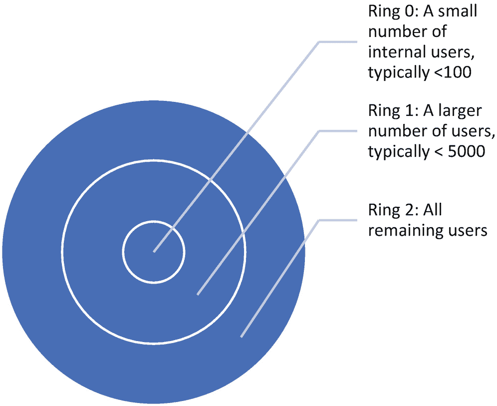

# 三、持续交付

> *频繁交付* ***工作软件*** *，从几周到几个月不等，优先选择较短的时间尺度。*
> 
> *—agilemanifesto.org/principles*

本章的敏捷原则描述了团队交付工作软件的频率。我们将此扩展到包括频繁交付数据，因为数据工程团队交付的大部分是高质量的数据。我们进一步扩展了这一原则，将“频繁”一词替换为“连续”——我们相信连续交付工作软件和数据是非常重要的。我们对这一原则的改写将是“持续地交付工作软件和准确的数据”在任何给定的一天，团队都应该有可用的软件和数据，有效地代表前一天完成的增量工作。

您如何从频繁交付转向持续交付？我们将考虑如何通过软件和数据来实现这一点。对于软件，现代工程团队实践称为“持续集成”和“持续部署”的技术持续集成是通过开发人员在提交代码变更之前验证它们，然后运行自动系统来实现的，自动系统获取开发人员所做的最新代码变更，构建这些变更，对这些变更进行测试，并最终部署这些变更——通常随着时间的推移部署到一系列包含越来越多客户的环境中。

## 验证代码更改

对于一个连续构建产品的自动化系统来说，必须有一种机制在代码变更被检入代码库之前对其进行验证。系统的这一部分必须被所有开发人员仔细设计和尊重，以确保只提交高质量的代码更改。为了确保代码更改的最高质量，通常要做的一些事情包括:

*   团队很好地记录和理解了编码标准和首选模式，并在可能的情况下，在提交代码更改之前，由开发人员可以在本地机器上运行的自动化工具进行检查。

*   在本地机器上，开发人员可以构建他们正在工作的系统和所有其他依赖的或潜在受影响的系统，以验证没有发生构建中断。

*   开发者可以在本地机器上或者在代表代码将运行的最终环境的在线开发者环境中快速运行和验证修改的系统。

*   开发人员可以快速运行一些单元测试来验证开发系统时所做的假设——这些单元测试足够广泛，覆盖了系统的很大一部分(我们通常争取 80%的覆盖率),并且测试以一种可以非常快速运行的方式编写——通常是通过使用模式来模拟启动成本高昂的系统部分。

*   通过适当的单元测试或集成测试来检查新的代码更改，以确保测试覆盖率保持较高。

*   接下来是代码审查过程，团队中的另一个开发人员会对代码的任何更改进行检查和反复检查——可能的话，通常是对系统更有经验的开发人员。作为评审的一部分，任何建议的更改都要进行并重新验证。

*   开发人员可以快速运行一小组端到端的集成测试，这些测试在本地机器环境或在线开发环境中启动整个系统，并测试必须始终工作的系统的关键功能。

*   开发人员与源代码库的最新变更保持同步，如果其他开发人员将冲突的变更签入到正在工作的系统的同一区域，则重新合并变更。每当变更作为这个过程的一部分发生时，都会通过再次运行测试来重新构建和验证变更。

*   一旦全部完成，开发人员提交最终的代码变更。

### 密切关注内部循环

请注意，对于这些步骤，应该尽一切努力尽可能快地保持开发人员运行的测试和验证的数量。有时这个验证阶段被称为开发人员的“内部循环”，我们将在第 [5](05.html) 章:有动机的个人中更多地谈论这个内部循环的健康程度。运行时间更长的更广泛的测试可以放在持续集成“管道”中，这被称为开发人员的“外部循环”如果开发人员稍后在管道中进行的签入中发现问题，系统会自动拒绝该更改，并将其发送回去，让开发人员找出问题所在。但是让一个变更稍后被外部循环拒绝也可能是昂贵的，所以必须在最初的代码提交到持续集成系统之前在内部循环中发现问题和稍后在外部循环中发现问题之间取得平衡。

## 持续集成系统

一旦一个经过验证的变更被检入，持续集成系统就会接管。像 Azure DevOps 或 Jenkins build system 这样的系统可以自动化代码更改的集成系统。这些系统通常会观察新的签入，以验证和运行一组与开发人员在本地所做的类似的验证步骤，但现在在团队关心的所有构建目标和设备上运行，同时运行团队可用的所有单元测试和集成测试。如果任何一个步骤失败了，系统就会拒绝签入，并且会通过日志通知开发人员，这样就可以调查出了什么问题。典型的持续集成系统运行如下步骤:

*   针对团队关心的所有构建目标，对团队存储库中的所有代码进行完整的全新重建。例如，持续集成系统可能在调试和发布版本中构建针对 AMD-64 处理器的代码，以及针对 iPhone 或 Android 设备的代码。

*   在所有构建目标上运行一组更广泛的单元测试。

*   将系统部署到模拟生产环境的在线开发环境，并在该环境中运行一组更广泛的集成测试。

*   将编译后的代码部署到设备上，并在这些设备上运行测试(如果适用)。

有时，这一阶段变得过于重要，验证需要的时间太长–一个好的经验法则是，这一阶段的验证应该需要大约一个小时。如果这个验证长度变得太长，那么在一个单独的变更上运行的测试的数量应该减少，以降低验证长度。现在不再对每个单独的变更运行的测试仍然应该运行，但是对成批的变更以较低的频率运行。例如，在过去 12 个小时内提交的所有变更都可以一起进行批处理，并且从单个变更验证过程中移出的测试可以在更大的一批变更上运行。如果在此阶段检测到失败，则需要做更多的工作来确定批次中的哪个更改导致了失败，但通常值得提高验证单个更改的速度。

## 连续部署系统

如果所有这些验证步骤在持续集成系统中都是成功的，那么这种系统的最后一步有时被称为持续部署系统。持续部署系统做你所期望的——它们接受一组已经验证的变更，并自动部署它们。通常，部署不会直接面向所有用户，因为仍然存在很大的风险，一些额外的问题可能仍然在代码更改中，即使最好的单元测试和集成测试也不会发现。因此，连续部署系统通常随时间顺序部署到一系列部署环境中，这些环境通常称为“环”，代表不断增长的用户集。

通常，部署新验证的代码变更的第一个环境被称为“环 0”或内部环，如图 [3-1](#Fig1) 所示。这个环是开发团队每天使用的部署环境，可能还有一组系统的早期采用者。每个环都是以这样的方式构建的，即如果对该环部署的更改导致该环的用户出现实时站点问题，则该更改可以快速回滚，并且该环可以恢复到其先前的状态。如您所料，细节决定成败，持续部署的软件系统必须仔细设计，以确保它们可以回滚到之前的状态。作为一个例子，考虑部署到环境中的改变，该改变改变了系统正在使用的数据库的模式。如果这种改变失败了，必须有一种机制不仅可以恢复软件，还可以将数据库恢复到以前的模式。有许多技术可以使系统在持续部署下运行良好，这超出了本书的范围。

图 3-1

展开环

如果团队和早期采用者在内部环境中没有遇到任何问题，那么持续部署系统会将相同的变更集推送到影响更多用户的更大的环境中。有时，在经过一定时间后，部署到下一个环是自动的；有时团队手动控制这个决定。如果在下一个环中改变是成功的，则它被部署到另外的用户，直到该改变对系统的所有用户可见。创建持续部署系统的一部分是决定您想要支持多少个用户环以及每个环中有哪些用户。我们通常会看到这样的系统:主要由团队成员参与的内部环，包括公司中每个人的公司环，然后是早期采用者环，开始包括那些选择使用系统中最新和最大变化的人，最后是“每个人”环，包括系统的所有用户。

### 吃你自己的狗粮

微软有一个丰富的传统，叫做“狗食”，指的是使用仍在开发中的产品。这来自于一位微软经理发送的标题为“吃我们自己的狗粮”的电子邮件，该邮件提倡增加正在开发的软件产品的内部使用。微软 Windows 已经通过一个非常活跃的“内部”测试计划稳步地将 dogfooding 扩展到甚至公司外部的参与者，外部用户可以选择测试 Windows 的早期功能。这些类型的程序对微软来说非常成功，因为它们允许对以前需要几年才能到达真正用户手中的功能进行早期反馈，并对微软内部不总是可用的各种系统配置进行早期测试。

当持续部署的系统出现问题时，我们提到回滚是理想的解决方案。有时也使用其他技术，以便更灵活地修复损坏的特征。有时，采用“热修复”——这些是一次性的修复，直接部署到环中，以修复环中损坏的东西。理想情况下，热修复程序可以是对配置文件的更改，因此，只要有可能，就以一种可以用配置文件轻松修改的方式实现特性。但是配置文件热修复虽然比改变系统部署的二进制文件容易，但也同样危险，必须经过良好的测试。热修复还可以通过应用少量代码更改、重新编译受影响的二进制文件，以及用那些新更新的二进制文件修补环来实现。如果可能的话，热修复应该在持续集成系统中通过相同的自动化验证步骤运行。

另一种用于确保表现不佳的功能可以被禁用的技术是确保新发布的功能是“可飞行的”,并且可以通过配置设置容易地打开和关闭。Flighting 实际上非常类似于使 ring 发挥作用的系统——它是向一部分用户提供新功能，并通过指标收集将他们的体验与没有该功能的用户进行比较的能力。一小部分用户可能正在尝试您的团队刚刚开发的新搜索体验，而其余的用户则使用旧的搜索体验。然后，您可以针对新的搜索体验用户和旧的搜索体验用户监控系统的稳定性。如果您发现新的搜索体验明显较差，那么您可以立即关闭所有用户的新搜索体验，同时通过记录新系统中出现的问题来进行调查。我们将在第 7 章中详细讨论这一点:监控。

## 验证数据更改

前面讨论的所有持续集成和部署代码变更的技术也可以用于持续集成和部署数据变更。这些技术包括以下内容:

*   数据工程团队的开发人员通常编写代码来改变数据。正如必须审查修改数据的代码一样，当数据被代码修改时，也应该审查数据本身。当修改数据的代码发生更改时，通常不可能详尽地检查系统中发生的所有数据更改，但是可以抽取代码对数据所做更改的样本并仔细检查，以确保没有发生意外的更改。

*   在检查更改的数据时，应采取特定的采样方法。应该对完全没有变化的数据进行采样，以验证“无变化”是正确的。应该检查从系统中删除的数据，以确保删除该数据是正确的。应该检查添加到系统中的数据，以确保添加的数据是正确的。应该对仅稍加修改的数据进行采样和检查。被严重修改的数据也应该被采样和检查。

*   数据标准和数据的首选模式在团队中得到很好的记录和理解，并且在可能的情况下，在提交数据更改或导致数据更改的代码之前，由开发人员可以在本地机器上运行的自动化工具进行检查。

*   如果由于更改而要重新处理的数据量足够小，可以在本地计算机或代表最终环境的在线开发人员环境中运行，则应重新生成并验证受更改影响的所有数据。在许多大数据项目中，这是不可能的，因此应该重新生成并验证一些有代表性的数据片段。应该尽可能广泛地对该切片进行采样，以便该切片包含在较大数据集中看到的所有类型的模式的概率较高。

*   接下来是数据审查流程，团队中的另一名开发人员会对数据的任何更改进行检查和复核，通常是在可能的情况下对系统更有经验的人员。作为评审的一部分，任何建议的更改都要进行并重新验证。

除了手动检查数据的抽样部分，我们在第 [2](02.html) 章中讨论了:改变可以用于自动检查数据的几种技术的需求。这些技术可以用在开发人员的机器上，作为持续集成系统的一部分，以及作为持续部署和环系统的一部分:

*   数据“门”可以在数据发生变化之前和之后测量数据中模式的频率，以检查数据是否发生了可能是错误的极端变化。这些门由团队通过手动检查和学习他们处理的数据所获得的长期经验来确定。例如，在 Bing 的本地数据团队中，我们观察到，在我们的语料库中，电话号码等事物超过 1%的变化更有可能是由我们系统中的错误引起的，而不是由来自数据提供商的真实电话号码的真实变化和改变引起的。许多这样的经验法则可以从您的团队处理的数据中学习，并可以编码到数据门系统中，该系统可以在每次更改数据后运行。

*   标记实体是您的数据中您知道代表绝对真理的实体。每次对系统进行更改后，可以对这些实体进行监控和重新验证，以确保它们保持不变。

*   可以每天对您的数据重新计算人工判断的指标，以确保您系统中的一些已知实体集在质量上不断改进。

### 关注变化

在 Bing 中，我们有一组 1500 个实体，每天都要进行判断。实际上，我们只会判断每天在这组实体中发生的变化，这些变化通常只代表一小部分变化，人类法官可以在一个小时内看到这些变化。我们可以不断地监控由于系统中的代码变更，实体集是变好了还是变坏了。开发人员可以查看被判断为更差的特定判断，以确定他们是否在系统中引入了错误，或者这只是已学习模型中的差异。

## 数据的持续部署

正如代码变更一样，数据变更应该由持续集成系统和持续部署系统自动验证，因为数据变更会扩展到一个环，然后是另一个环，然后是另一个环。当新数据在一个新的环中上线时，通过数据门、标记实体和判断指标进行验证。数据更改通常比代码更改更广泛，因此“热修复”数据更改要困难得多——尽管导致数据更改的代码更改有时可以被热修复。数据回滚系统通常很昂贵，尤其是当涉及大量数据时。

在 Bing 中，我们维护两个数据存储系统，一个可以回滚，另一个则不能。我们能够在一个更快改变和回滚的系统中保持一个更小的实体集，这就是我们的“快速”存储。我们有一个大得多的实体集合，保存在一个“慢”存储中，这个存储的更改和回滚要慢得多。事实证明，通过在我们的 fast store 中保存大约 200 万个实体，我们能够覆盖 80%的页面视图——也就是说，本地数据空间中 80%的本地查询是针对最受欢迎的 200 万个本地商业实体的。另外 20%的查询是针对我们的本地商业实体——大约 1800 万个额外的实体。因此，我们在我们的快速商店中保存了 200 万个实体，在慢速商店中保存了 1800 万个实体。这样，如果我们有一个灾难性的数据错误，我们可以在几分钟内回滚 200 万个实体，并修复 80%的流量，但另外 20%的流量将受到影响，直到我们可以重建较慢的 1800 万个实体的索引，这通常需要几个小时。

## 决定运送什么

仅仅因为您可以持续地部署数据和代码并不意味着您应该这样做。决定不运送什么和运送什么同样重要。对于仅包含代码的特性，即不影响数据的特性，您应该使用足够的遥测技术来检测该特性，以便您可以确定用户是否真正在使用该特性，以及它是否真正满足业务需求。我们将在第 [7](07.html) 章“监控”中详细介绍遥测技术。特性应该以一种可以飞行的方式实现，并且可以比较特性开启和关闭时的指标。同样重要的是，开发一个特性时，要让它可以很容易地从系统中关闭和删除。如果遥测指示某个功能未被使用或不符合业务需求，则应将其移除。

### 杀了它

你刚刚在一个功能上工作了几个星期，现在你正在试用它，发现用户并没有使用它。虽然你可以尝试几轮调整功能，看看它是否会成功，但你不应该过于依赖某个功能而扼杀它。如果你不发布这个特性，几个星期的努力似乎就白费了。但是未来的维护噩梦可能比特性的初始开发成本要昂贵得多。一个能精确满足客户需求的简单产品要比一个客户只真正使用一小部分的复杂产品好得多。

关于发布哪些数据变更的决定更加棘手，通常需要在流程的早期做出。以下是项目中经常发生的情况。团队中的一名数据科学家改进了一个即将上市的模型。如何决定是否发货？有许多指标可以用来评估一个学习模型的“好”。这些都是有用的，应该加以衡量，并作为评估是否推出新型号的一部分。

评估模型的另一个实用方法是查看模型的“成功”和“失败”,并基于该分析决定模型是否值得发布。当我们有一个数据科学家想要发布的改进模型时，我们会从模型对我们的数据所做的所有更改中取样，并判断哪些是好的更改，哪些是中性的更改，哪些是坏的更改。除了好的变化之外，一个修正的模型很少会引入少量的“坏的”变化。有时，坏变化和好变化的数量是相似的，但是坏变化的严重性会更大。在这种情况下，还需要做一些额外的工作，看看模型是否可以进一步改进，去掉足够多的坏的变化，同时保留足够多的好的变化，使模型值得改进。

新的模型也可能带来变化，这些变化不一定更好，只是不同而已。重要的是不要发布这些模型，因为它们引入的大量随机变化是不值得的。让我们在两个正确的属性被交换的地方发布数据更改会让我们的用户感到困惑。例如，企业通常有多个电话号码，这些号码都打给同一个联系人。我们将有一个新的模式，将改变主要的电话号码，但这只会混淆用户，因为该号码改变了业务，但他们仍然达到前台的同一个人。在可能的情况下，我们会避免运输此类模型。

### 一个更好的模型可能过于昂贵

虽然我们通常会发布一个好的变更的数量和影响超过坏的变更的数量和影响的模型，但是我们也考虑了一个额外的因素:新模型的成本和复杂性。有时一个新的模型会产生更好的数据，但是运行它的成本会高得多。例如，模型可能需要多倍的时间来产生结果，从而降低产品速度或增加有效运行产品所需的硬件数量。有时，新模型会产生更好的数据，但新模型的复杂性意味着保持运行和健康将是一场维护噩梦。这些不太明显的方面应该被考虑，有时可能会导致新模型被拒绝。

## 结论

在第 [4](04.html) 章“与业务保持一致”中，我们将讨论与业务协调工作的重要性和技巧。