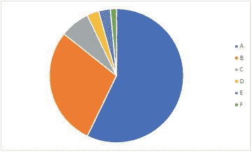
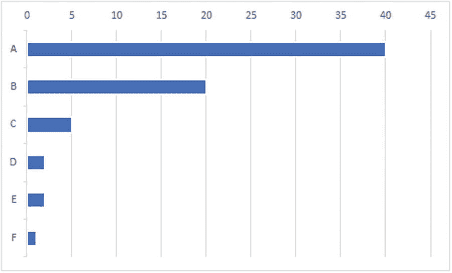
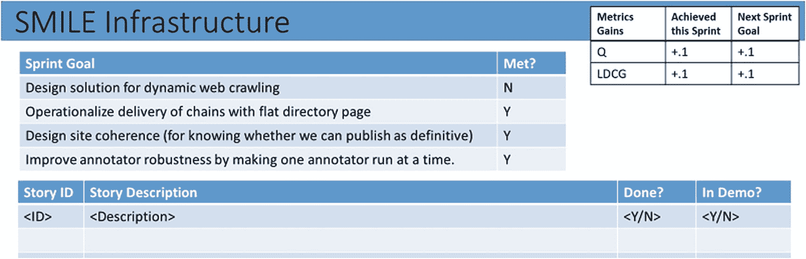

# 六、有效沟通

> ****最高效的*******有效的*** *向一个开发团队内部传递信息的方法是* ***【面对面交谈】*** 。**
> 
>  ***—agilemanifesto.org/principles***

 **在数据工程团队中不缺少讨论的话题:*我们查看了一个输入数据的样本，下面是我们的发现。这令人惊讶吗？目前，分类器正在预测这些例子的假阳性。客户在乎吗？我们将最新的结果与月初的结果进行了比较，发现了这种奇怪的偏差。你怎么想呢?这些例子符合当前的定义吗，或者我们应该更新判断指南吗？我们的标签团队似乎总是对这些案例有不同意见。它们重要吗？我们认为在这些情况下，预测出错是可以的。你怎么想呢?我们认为这是衡量总体进展的正确指标。你同意吗？我们查看了一个数据样本，看起来捕获所有案例的对象模型是这样的。是不是太复杂了？*

如果你试图在一个大而多样的数据集上给出任何稍微有趣的推论，那么将会有一个几乎是持续不断的问题、见解、部分结果和含糊不清的地方需要解决和决策。回答这些问题的最佳方式是什么，阅读中间结果的茶叶，以便您可以继续取得进展，保持团队对您正在构建的世界模型的当前想法的同步，以及在个人开发人员导航数据科学搜索空间时解除他们的障碍？现代开发工作场所提供了过多的沟通模式，既有数字的(电子邮件、即时消息、视频聊天、群聊、代码审查、数字 scrum 板)，也有实体的(面对面的沟通)——在敏捷数据工程项目中，最好的沟通选择是什么？

敏捷宣言的原则 6 提倡面对面的交流。在编写它的时候(2001 年)，与互联网支持的各种交流平台相比，开发团队可用的选择是有限的。你可以认为第六条原则实际上是说面对面交谈比创建邮件线程更好。那么，面对面交流有什么是电子邮件所缺乏的呢？

*   面对面的交流是**即时的**-当面对面交谈时，歧义、误解和困惑可以被实时识别并立即纠正。异步通信(电子邮件、即时消息等。)是随意的，并且等待时间是所涉及的个体的优先级的函数。通常这些优先级是不匹配的——有一个人的沟通主题比其他人的优先级更高。

*   面对面的交流是**人类**——我们可以充分利用人类话语的丰富性，包括非语言交流(我可以看出你似乎不明白我在说什么)。所有其他形式，包括语音和视频聊天，都不具备这种品质——不，表情符号不能弥补这种不足:-(

*   面对面的交流是一种**共享的体验**——我们都在那里，我们看到了同样的事情，我们同意了一些结果。团队见证的合同对于确保责任非常有价值(尽管我们将在后面看到，它并不总是足够的)。

*   面对面的交流**丰富且互动**–我可以以丰富的方式谈论数据集，与数据内容进行物理(指向投影的数据图形)和计算(使用应用转换和查询数据)交互。我也可以在白板上画东西，当我从其他人那里了解到新出现的画面有什么不清楚的地方时，我可以修改那张画。

所有这些意味着，在工程项目的背景下，面对面的交流是最有效的交流方式。考虑到这些因素，我们可以从*即时性*、*丰富性、*和*共享体验*的角度来看待现代工程工作空间中的数字通信选项:

*   Slack 和微软团队这样的群发消息系统提供了潜在的即时性(实时聊天——尽管平台并不强制要求即时响应)。如果煽动者被正在讨论的问题所阻碍，这可能会让他们感到沮丧。他们还会有额外的负担，想知道“ping 会不会不礼貌？”"我应该顺便去他们的办公室吗？"或者“他们在办公室吗？”–与电子邮件的丰富程度相似，也就是说非常少–并且缺乏面对面讨论的基本互动性质。你无法真正以共享的方式与内容互动。此外，这些系统中的许多都存在穿线或交织问题。沟通渠道可以在不同的个体组合之间混合和交织不同的线索。最近对 Teams 和 Slack 等系统的改进试图通过引入响应特定消息的能力来解决这一特定问题，但是还没有找到理想的解决方案。在撰写本文时，两个平台上的解决方案都引入了一些认知开销，并且容易出现用户错误，导致线程碎片。

*   视频聊天系统提供了大量丰富的面对面交流(参与者可以从参与者的视频中读取许多线索，尽管不是全部，使其更像是一种人类互动)，并且通过内容共享机制，它们提供了丰富的数据互动。视频会议的局限性——解读与会者所有非语言暗示的能力略有下降，尤其是在话语的话轮转换方面——可能会导致略微生硬但更有条理的互动。我们知道，一些高管要求召开会议，对于大多数团队成员来说，会议可以面对面进行，但对于一些远程与会者来说，会议必须在线进行，以确保所有与会者之间的互动平等(而不是偏向那些可以亲自出席的人)。

*   现代代码评审系统(比如微软的 Azure DevOps)提供了异步的、共享的、适当丰富的代码体验。审查代码可以跟踪作者、审查者和系统自动化组件之间非常复杂的交互——构建管道、测试管道等等。平台变得越来越复杂，可以将聊天频道集成到任何可以使用身份的内容系统中。类似地，数字 scrum 板促进了多种形式的交互。他们本质上是围绕规划的互动讨论的对象。

数字媒介互动的一大优势是内置的捕捉内容并为其增值的能力。例如，使用视频会议平台来主持棕色包、scrum 团队演示会议等等，这意味着事件可以被记录。录音可以成为团队的共享资产。此外，一些价值可以在实时和离线两种情况下增加——例如，机器翻译的最新进展意味着口语可以在会议期间实时翻译。此外，数字平台意味着 API 可以开放，允许机器人(能够与人和内容进行多步交互的智能代理)为任何过程做出贡献。例如，可以构建一个机器人来监控代码库，寻找某些条件，将它们报告给相关的工程师，并与这些人协调多步解决方案。

传统的工程项目涉及围绕系统(架构、平台、数据库模式)、过程(规划、执行)、操作(部署、监控)和体验(用户界面和信息架构)的讨论。第六个原则提倡面对面的交流来解决这些话题上的问题。数据工程项目增加了围绕数据和推理算法的群体互动。正如我们将看到的，讨论的类型和以交互方式有效支持这些讨论的工具在许多方面都与传统的工程环境不同。我们将讨论数据项目需要的一些具体活动，如何在面对面的会议中促进这些活动，以及如何最好地支持在传统敏捷工作流中的会议中围绕数据的讨论。

### 面对面交流的短暂本质

虽然面对面交流有很多好处，团队应该在日常互动中尽可能多地使用它，但它有一个基本问题，即使是中等规模的组织也必须面对。面对面的交流是短暂的——没有关于决策、协议、设计、替代方案、假设等的内置记录。根据我们的经验，面对面交流的即时性和实用性需要得到大量最佳实践的支持和增强，这些最佳实践会产生某种形式的数字制品。这在大型组织中尤为重要。

建立一种文化，能够有效地将面对面的交流与支持性的数字工件(代码和非代码)的适当和及时的创建结合起来，这是一个不应该被低估的挑战。许多开发人员认为创建代码是他们签约的唯一“工作”,任何涉及文档、计划等的额外任务都是不必要的开销。除此之外，如果内容平台和团队过程的选择没有经过深思熟虑，团队可能会经历在内容平台内和跨内容平台重构文档的真正开销。

让我们用内容管理系统的特性来补充我们对面对面交流的好处的描述。

*   创建和编辑内容的成本:如果内容管理系统使创建和修改内容变得容易，这意味着团队可以很快开始工作。像 Microsoft OneNote 这样的系统允许用户在几分钟之内就可以启动并运行。不利的一面是，不受约束的内容创建会很快导致混乱无序的内容。页面和章节被遗忘，变得陈旧。随着内容创建成本的增加，这可能会导致团队在如何组织和创建内容方面做出更深思熟虑、更好的决策。不利的一面是，高维护成本会导致团队推迟并最终放弃文档的创建和维护。

*   搜索能力:内容系统的约束越少，越开放，搜索就越成为一个重要的特性。无法搜索的结构不良的内容变得几乎毫无用处。例如，在我们看来，微软的 OneNote 虽然创造成本低，但搜索功能却很一般。

管理团队内容通常考虑的平台包括:

*   OneNote:微软的所见即所得维基式系统。它的准入门槛非常低——只需开始输入即可——但可能会产生大量的、无组织的、难以搜索的内容。

*   将文档签入代码管理系统(例如 Azure DevOps、GitHub):签入内容允许团队将一些代码审查甚至测试的规程带到文档空间。应该选择人类可读的文本格式(markdown，good 这与用于代码的内置比较工具配合得很好。如果你能建立这种文化，那么维护事情就不太麻烦了——你需要在评审代码的时候把“评审文档变更”加入到你的工作流中。

*   独立维基:像广受欢迎的 MediaWiki 平台这样的系统应该为你的团队所熟悉(或者容易被他们采用)。它们比 OneNote 提供了更多的约束，编辑需要更多的意图(这可能是一件好事)。如果您需要更接近代码工作流的工作流，也可以考虑 DocFX 和 Git(参见 github.com/dotnet/docfx)。Atlassian 的合流也是一个不错的选择。

*   Word +文件系统或 SharePoint:对于重要的定义性内容(如规范或需求),内容不会经常改变，成熟的文字处理程序的形式可能是一个有用的工具。这种文档在结构良好的文档空间中表现最佳。

围绕非代码工件的挑战是非常人性化的——它们与纪律、行为和习惯有关。很难想出一个构建和测试文档的类比。在这方面取得成功的一个通用方法是限制可以创建的文档类型。有了这个范围明确且定义良好的工件集，就很容易说每个签入都需要包含公共方法的注释，或者演示会议必须直接从实验日志中运行。我们使用过的一些工件类型包括:

*   实验日志:我们工作中的数据科学部分是一门科学。像大多数科学努力一样，数据科学家探索各种空间，以发现好东西在哪里。探索这些空间通常涉及数据集、算法、一些参数、一些输出和分析。如果这些实验的记录被创建、提供和搜索，对整个团队来说都有很大的价值。更好的是，如果这种形式的文档可以链接到所涉及的数据的持久(和不可变)版本——甚至更进一步，如果可以引用实验的某种形式的序列化版本，以便其他人甚至可以重新运行实验或检查它的所有方面(代码版本、参数等)。).作为这个领域的团队经理，对这些能力的深度投资(研究第三方系统或内部构建工具链)是一项重要的承诺。正如我们利用强大的系统来为我们的代码启用和集成单元测试一样，持久的实验描述和再现将会给团队带来红利。一个非常流行的平台是 Jupyter 笔记本。 [1](#Fn1) Jupyter 文档将供人们使用的文本单元格与共享整个文档上下文的代码单元格交织在一起，任何有访问权限的人都可以交互地运行、操作和扩展这些单元格。

*   模式文档:除了最普通的情况之外，为任何情况派生模式都需要对领域进行相当深入的研究。我们在对企业在网站上使用的描述本地实体营业时间的表达式进行建模时，以及在设计可用于描述网页、pdf 文档、SharePoint 页面和 PowerPoint 文档的抽象文档表示时，都经历过这种情况。从模式的高层结构中获取激发一切事物的示例，并包含或有意排除某些情况，将有助于团队确定实现什么以及如何实现。

*   判断指南:与模式文档非常相关，在某种意义上，判断指南是团队最具体的“真理”,因为它们用于导出指导团队工作和影响(以及回报)的度量标准！).判断指南是您试图为原始数据推断的丰富世界模型与您可能用来生成训练和评估数据的大容量数据标注器之间的接口。可以想象，把这些做好是很重要的。我们围绕判断指南开发了许多最佳实践。它们应该包括如何使用特定工具完成任务的标准化描述。许多任务将涉及某种类型的注释，这些应该由一个公共平台驱动。它们应该包括对所捕捉概念的直观描述。它们应该描述排斥和包容的具体情况。它们都应该有具体的例子来支持，确切地显示这些例子在工具中的样子，以及应用标签前后工具的状态。最后，应该对文档进行强有力的版本控制——既要引用以前的版本，又要描述自上一个版本以来所做的更改。

正如前文所言，在内容方面没有灵丹妙药。这就是人为因素发挥重要作用的地方。作为管理者，你能鼓励或要求团队跟上内容任务吗？

## 围绕数据的讨论必然是互动的

不同的团队成员和其他团队的成员对项目中涉及的数据集有不同的看法。他们会看到数据中建模的事物的不同方面；他们对如何评价表征或推理结果的质量会有不同的看法；他们对风险所在会有不同的看法。您还将拥有对 ML 工具链和生产架构相关数据感兴趣的团队成员。将这些不同的视角带到围绕数据的讨论中只会让团队受益。

在最近一个旨在改进网站地址提取的项目中，虽然我们的新提取器在我们精心构建的评估集中表现更好，但负责连锁企业和大型复杂实体(如博物馆和医院)的团队成员观察到，他们的数据子集实际上存在回归。如果我们只是使用现有的度量标准，而不是跨团队工作，我们就会错过这种洞察力。在另一种情况下，一个合作伙伴团队质疑我们使用每个文档的平均精度和召回率，建议我们使用全局精度和召回率来开发分类器。这些不同的方法给出了完全不同的数字，并帮助我们以不同的方式看待数据。

当构建一个新的模式来表示本地实体的营业时间时，对表达式宽度的深入研究表明，该模式必须非常复杂，必须表示节假日的规则、重复的开门和关门模式以及非特定时间，如“日落”和“最后一个客户离开的时间”负责实现模式的团队提出了一个解决方案，需要工具来检查和理解实例化。然而，当对表示的研究结果与下游消费者团队共享时，在复杂性(这可能导致推理中的额外错误)和表示形式(简单的文本序列化是首选，这将允许数据工程师在调试和评估数据质量时非常快速地阅读和理解数据的实例)方面存在相当大的阻力。

在另一个项目中，其目标是从网页中提取主要内容——去掉导航、横幅和其他非主要文本——我们发现我们的指标偏向于小文档(对于小文档，在识别组成呈现页面的特定组件时，出错的空间较小)。这导致了与数据消费者的一次重要对话，其中确定了这些较小的文档实际上没有特别的价值，因此构建一个分类器来识别和删除它们是可行的方法。

个人也会带来不同的假设和偏见。同样，通过结合团队成员的观点，团队可以不断地修正和提高他们的能力。讨论数据、推理系统设计和实现的结果也将为更有经验的数据工程师提供指导初级团队成员的机会。

我们发现，在实践中，由不同的、往往是相互冲突的观点和理论引发对话的唯一方法是手头有数据集，并能够交互式地回答问题。任何没有分析支持的关于数据的陈述都是假设，数据要么支持要么反驳。用一个预定的工作项目来回答每个问题，然后进行讨论，这是非常低效的。相反，交互工具应该尽可能经常地成为讨论的一部分，并用于直接选择、过滤和转换数据集(或样本)。

## 数据工具基础

为了支持以数据集交互为中心的讨论，考虑最佳实践很重要，包括对工具、采样方法和数据表示的要求。请记住，当我们能够为流程的任何部分带来效率，甚至是微效率时，敏捷实践就会改进。然而，重要的是要记住，效率必须在团队层面，而不是贪婪地应用于个人。例如，如果你要向你的团队展示数据，在讨论前付出额外的努力，使会议尽可能富有成效，这就是成功。主持人不得不花费更多的个人时间来在团队层面产生净收益。

### 对数据讨论工具的要求

支持数据讨论的工具有很多选择。也许最明显的是不起眼的电子表格(Excel、Google Sheets 等。).当您遇到这些工具的通用性对您的分析场景造成的限制时，您肯定会考虑实现内部工具。这些工具的基本要求如下:

*   装货
    *   这是一个显而易见的要求，但是当要求加载大型数据集时，要注意工具的性能。此外，一些工具虽然允许加载大型数据集，但在以任何有意义的方式处理这些数据时却无法执行。好的工具至少会实现数据和 UI 虚拟化；更好的工具将能够动态地对数据进行二次抽样，从而为用户提供更大数据集的代表性视图。

*   转换
    *   通过过滤和附加谓词的应用对数据进行子集化。一旦您有了数据，您将想要过滤它以按需查看不同的子集，并可能应用需要某种方法调用的任意过滤器。

    *   以交互方式生成数据样本，用于快速、就地评估。在某些情况下，如电子表格，抽样可以通过一个相对简单的工作流程来完成，包括添加一列随机数，然后可以对这些随机数进行排序，以打乱数据中的行。一个更复杂的系统将以内置的方式提供这种能力。

    *   计算从源数据中导出的附加数据。例如，您可能希望向表中添加一列，以指示另一列中的值是高于还是低于某个阈值。这种通过衍生工具建立分析的模式非常强大，是标准电子表格应用的一个基本特征。

*   聚合
    *   执行各种聚合功能，如求和、求平均值、计算分布等。同样，基本的电子表格支持这种类型的操作，但只能通过子步骤的工作流来实现。

*   形象化
    *   可视化存在于系统各个阶段的对象数据，包括输入和输出。

    *   对数据中的因子进行子集划分，以便于查看，例如，从表中删除不需要的列。

    *   显示趋势、分布和关系的图表。

### 快速评估

使用电子表格或类似的面向表格的数据工具进行快速特别评估的方法如下:首先，将每个数据项与一个随机数相关联；然后，按这个随机数对数据进行排序。在某种意义上，任何连续的数据子序列都可以被认为是随机样本。然而，当通过数据进行判断时，提前确定你要看多少是很重要的。如果你不这样做，你可能会在结果对你有利的时候结束评估。这也意味着，如果你看到一个同事的数据摘要，声称他们查看了任意数量的样本，你应该问为什么是这个数字。他们可能停在数据中给他们一个好结果的某一点上，陷入确认偏差——在数据中为一个先入为主的结论寻找支持。请记住，随机数据可能是成簇的，这就是为什么如果你扔硬币，你不会产生一个 HTHTHT 序列，而是一个由一簇簇的 Hs 和一簇簇的 Ts 组成的序列。另一件要记住的事情是，如果你的数据有很大的影响，它可能会被一个相对小的——因此计算起来很便宜的——样本暴露出来。比如你 10%的数据里发生了一件事，50 个样本里没观察到的概率大概是 0.5%。

给定一个样本，我们通常希望对数据中发现的因素进行快速分析。例如，假设我们正在评估一个特定的命名实体在网页上操作的提取器。我们可能会列出以下错误原因:

*   数据在图像中(我们的方法是基于文本的，因此如果是图像形式的内容就无法访问)。

*   数据不在文本节点中(实体可能在元素的属性节点中引用，而不是在元素的文本节点子级中引用)。

*   HTML 中缺少内容(页面可能会使用一些呈现时动态过程从服务器中获取内容，并修改 DOM 以允许用户查看所需的信息)。

然而，我们经常看到的是，先验地确定这样一个列表几乎是不可能的——只有通过检查样本，我们才能真正发现其中涉及的因素。因此，最常采用的过程是使用一个每行有一个例子的电子表格，当我们分析时，创建列来捕获分析的因素。几个例子之后，你会开始看到重复的因素。如果您遵循根据因素的存在或不存在在每个因素列中放置 1 或 0 的惯例，那么在查看示例之后，在分析中读出因素的频率是微不足道的。图 [6-1](#Fig1) 显示了一些 URL 的因素分析示例。

图 6-1

因子分析的例子。请注意，按随机数对行进行排序后，当 Excel 在工作表的每个视图上重新生成随机数时，随机数会显示为无序的。

### 实例挖掘

对小样本的快速评估有利于展现数据中的*类型*的东西。一旦你有了其中的一些，就可以明确地挖掘出这种类型，以便更好地理解它的频率和构成。例如，通过查看 50 个示例，我们可以非常确定我们将观察到以 10%或以上的频率发生的事情。然而，我们对这一现象的真实规模仍然有些模糊。通过查看一些案例，我们可以构建某种谓词(或启发式的),这将允许我们直接从集合中提取这些示例(因此需要一个可以支持任意谓词执行的工具)。

### 抽样策略

您从数据经验中对采样策略了解得越多，您就越有可能期待就特定数据集和特定场景的采样方式展开长时间的讨论。其原因以及任何关于正确采样方法的问题的答案是，没有最好的采样方法，查看多个样本有很多好处。虽然可能没有最好的采样方法，但有许多不好的采样方法，因此了解一些基本选项很有用:

*   简单均匀抽样:这也称为随机抽样。在电子表格应用中，它可以通过为数据中的每一行分配一个随机数并按该数对数据进行排序来生成。当以编程方式处理数据集时，可以应用 Fisher-Yates [2](#Fn2) 洗牌算法；或者对于更大的数据集，潜在的无限数据流，可以使用油藏采样T5 3T7。

*   加权抽样:简单均匀抽样回答了这样一个问题:“如果我从数据中随机选取一行，我看到某种特殊效果的可能性有多大？”但是，你的数据会以这种方式被体验是非常罕见的。例如，在网络搜索中，浏览网站的人并不总是从数万亿的网页中抽取样本。相反，他们愿意或不愿意消费网络的一小部分。在这一部分中，有些页面比其他页面被浏览的次数多。因此，如果你想问这个问题“如果我从所有用户和所有网页的个人浏览事件中取样，观察到我感兴趣的特定分析效果的概率是多少？”–例如，如果您感兴趣的是与搜索引擎上的企业列表相关联的地址的正确性–知道用户查看与连锁企业相关联的列表比查看非连锁企业相关联的列表要多，这意味着您应该更关心在连锁企业列表中发现错误的情况，而不是企业整体。可以通过根据权重有效地重复数据中的行来进行加权采样。因此，如果我们给企业 A 分配 2 的权重，给企业 B 分配 1 的权重，那么我们的抽样将着眼于三个数据点的总体。很明显，当随机抽样这个数据视图时，比我们只有两行数据时，提取业务 A 的实例的机会更大。

*   分层抽样:通常情况下，有一些有意义的高级方法可以细分你的数据。通常情况下，这些细分可能与预期(或怀疑)偏差有关。让我们考虑从销售产品的网站提取价格的例子。在撰写本文时，Amazon 主导了这个领域，我们可以想象这些网页的样本(统一的或加权的)会有大量来自 Amazon 站点的页面。事实上，有可能你最终只能得到亚马逊网站的页面。由于 Amazon 站点上的所有页面都使用相同的方法来显示价格，因此价格提取器可能会在所有这些页面上失败或成功。虽然这使您对提取器的性能有了一定的了解，但它并不能帮助您理解提取器在显示价格的所有方式中的表现。当然，如果亚马逊的例子不符合标准，你会修改它，但这实际上会让你对非亚马逊的价格呈现方式视而不见。分层抽样使用某种形式的分层来提供一组子样本，然后将这些子样本组合成完整的样本。在这种情况下，我们可能每个域最多抽取 10 个页面。然后，采样算法将首先从域的空间中采样(我们可以得到 Amazon.com、bestbuy.com、target.com)，然后，对于每个域，均匀地采样以得到 10 页。

### 迭代差分

跟踪和提高质量的最佳方法是投资于一个度量——这包括所有必要的数据收集、指南编写、工具构建和维护。然而，有时开销太高，但是需要某种评估。我们发现一种很有效的方法是迭代地区分系统的输出，并对差异进行采样。没有改变的数据将不会对最新实验产生的改进(或回归)的估计产生影响。通过对已经发生变化的示例进行小规模、统一的采样，您可以构建一个观察到的变化类型的表:从好到好(两种结果都可以接受)、从好到坏(我们以前得到了正确的推断，但现在没有)、从坏到好(一个胜利——过去是错误的现在是改进)、从坏到坏(结果仍然不好；就是不一样)。如果采用这种方法，那么一个副产品实际上就是被标记的数据，这些数据的积累可以发展成一个度量标准，或者至少是一个用于测试的回归集。

## 看到数据

这本书并不打算提供关于可视化数据的深入回顾或详细指导。然而，我们确实想就如何处理这一领域提供一些指导。像我们在本书中触及的所有非编码领域一样，数据可视化是意图至关重要的另一个领域——成为数据科学家、机器学习专家或数据工程师需要你能够交流和传达关于数据的叙述。因此，需要将数据可视化视为一个可以不断学习、改进和创新的领域。请记住，敏捷性需要关注细节和对效率的投资。清晰、易记和真实的数据展示有助于这种能力。还要注意，在这个领域很容易迷失方向，因为已经有太多的工具可用了。然而，这些工具中的许多工具提供了对常用可视化的访问，这些可视化在当前的数据项目时代之前，以及在对呈现大规模和高维数据的图形摘要的特定方法的有效性进行越来越多的研究之前，已经获得了普及。

也许说明数据可视化复杂性的最著名的例子是饼状图。饼状图的问题在于感知和一大堆神经科学。原来我们比较面积(二维)不如比较线长(一维)。事实上，您可以将此作为数据可视化的第一条规则——不要在可视化中引入数据中不存在的维度。这个原则也拒绝 3D 条形图、蜘蛛图或雷达图等等。此外，饼状图往往需要使用颜色，这进一步增加了我们大脑的复杂性和开销。所以代替这个

考虑这样做

但肯定不是这个

因此，我们的建议是将数据可视化视为您的工具包中不可或缺的一部分。正如您已经投资于了解如何优化您的代码、如何确保线程安全、如何为测试而设计以及所有其他深层的工程艺术一样，您也应该深入研究数据可视化的文献，并了解如何帮助您的数据分析消费者准确、客观地理解它。

### 附加阅读

关于数据可视化已经写了很多。额外阅读的两个极好的来源是爱德华·塔夫特的*预见信息*和斯蒂芬·诺的*信息仪表板设计*。此外，如果你想从精湛的数据可视化的例子中获得灵感，可以去看看 aka.ms/dataviz2018.

## 召开有效的会议是一种技能

面对面的会议不是简单的确定时间和地点。作为开发人员，我们应该非常保护我们专注于任务的专用时间，而作为管理人员，我们应该意识到将人们聚集在一起的成本(对于中等规模的团队来说，一个 1 小时的会议大约相当于一个人一天的工作成本)。最起码，会议应该有一个明确的目标和一个实现目标的公开过程。设定一些关于个人会议准备的期望通常是有用的(例如，阅读需求文档，对数据集进行个人分析，等等)。).那些负责主持会议的人也应该对会议的技术成功负责——会议越短，技术失误的风险就越大，例如投影仪坏了，笔记本电脑电池需要充电，以及视频会议集成出现故障。此外，会议的社交方面总是可以巧妙处理的——确保关键利益相关者能够按时参加，找出谁在会前会后开会，以及这些会议在组织上是否比你的会议更优先。最后，仔细考虑回答关键问题所需的数据并确保数据随时可用总是很有价值的。

### 笔记本电脑或没有笔记本电脑

为参与会议设定一些期望也是有用的。你希望会议期间每个人都全神贯注吗？如果是这样，那么确保笔记本电脑是关闭的，没有人会随意阅读他们的新闻提要是一个好主意。

### 主持会议

对于大型会议，你应该考虑的一个有用的技巧是主持会议的形式。这种形式使会议更加正式，有助于每个人更公平地参与会议。一个人被指定为主持人。主持人有一个会议将要涉及的主题列表，以及每个主题的时间限制。该主题的主要演示者被指定为先发言。但是，有意见或问题的人举手，而不是允许语音者随意打断。主持人将这些人放入“先入先出”的列表中，该列表要么投影到屏幕上，要么保存在房间的白板上，以便每个人都可以看到排队的顺序。当主要发言人准备让出发言权时，人们按顺序发言，直到他们发言完毕。在任何时候，更多的人可以举手加入队列。主持人看着时钟，在话题时间即将结束时给出时间警告。

主持式会议有许多优点，包括:

*   它将远程参与的人们置于一个平等的竞技场上。

*   它让那些对试图从正在发言的人手中夺走发言权感到不舒服的人更容易做出贡献。

*   这有助于那些话多的人多听听别人在说什么。

更多关于如何有效主持会议的想法，请看切尔西·特洛伊在 [`https://aka.ms/moderatedmeetings`](https://aka.ms/moderatedmeetings) 的博客文章。

## 成对平行标记

结对编码是一种编码方法，其中两个开发人员以流畅和交互的方式一起编写和测试代码。其中一个开发人员带头敲击键盘，通过讨论和迭代，代码就生成了。由于过程中存在第二双眼睛，许多错误几乎可以立即避免，并且在编写代码和测试时有效地进行代码审查。当被接受时，这个过程可能是非常有益的——这是编写高质量代码的有效方法，也是两个开发人员互相学习的好方法。

我们发现成对标注训练和评估数据的效率相似。在为新的地址提取器标记 web 数据时，我们发现成对标记具有以下优势:

1.  在页面上定位标签目标:页面可能很复杂，有时地址并不总是容易定位。

2.  细化地址模型:由于我们不仅标记了地址的整个范围，还标记了子部分，我们在标记期间的讨论导致了我们如何在标签中表达整个地址模型的细化。

3.  捕捉问题:当我们中的一个人做标记时，作为一对，我们可以找到并讨论我们看到的问题的模式，并想出描述和记录它们的方法。

4.  分担责任:单独工作的一个危险是，特别是当你的任务是交付提取器或分类器时，你可能会在标记评估数据时过于宽容。有另一个人在场，互动中会出现某种程度的平衡。

我们经常会发现这样的情况:我们在某个概念的定义和角色上大体上是一致的，但是却发现精确地定义它是很棘手的。例如，在最近的一个项目中，我们希望为一组新闻文章提供一个主主题，这样它们就可以在内容推荐系统中提供给用户。通过挖掘流行社区网站上的标签，我们产生了大量的主题，并着手建立一个数据集，在一个类似土耳其人的机械系统中进行标记。然而，当我们开始仔细观察这些话题时，我们开始怀疑我们对标签的直觉。

为了更好地了解问题在哪里以及如何解决它们，我们进行了一系列小组标签会议。负责交付主题分类系统的开发团队与标签任务一起进行。该小组分成两个小组，每个小组负责十个主题，并分别标记一个共享文档集。每当出现有问题的例子时，团队就会讨论文章，找出解决方案(使用迄今为止标签的共享上下文)，如果合适，更新判断指南，添加额外的细节并重构现有文本以反映最新的想法。

在适当的时候，团队将讨论整个主题的问题。这种方法意味着许多定义问题可以实时解决。另一种方法是由一个人或一组人执行一次标签迭代，总结问题，向团队报告，然后运行另一次迭代。

## 数据泛滥

我们在本书中已经谈了很多关于度量在数据项目执行中的核心作用。它们充当客户的代理，开发人员可以在项目的每个实验和迭代中使用它们，它们充当许多设计决策的强制函数，最重要的是用于捕获系统输出的模式或数据结构。然而，在项目的生命周期中，有很多时候需要做出决策，要么没有度量标准，要么度量标准过于笼统，要么不足以提供清晰的黑白答案。在这种情况下，团队需要做出某种判断。具体如何做出决定取决于团队，但我们希望引入一个基于团队的通用流程，提供一个高效且信息灵通的框架:数据滚动。

除了数据猪在数据泥中四处飞溅并度过快乐时光的迷人形象之外，数据打滚是团队根据接触数据、与数据互动并提出问题来做出决策的会议。基本工作流程如下。

首先，促进数据滚动的开发人员(主要负责让团队达成决策)向团队提供他们试图达成的决策的描述、涉及的必要数据集，以及与数据交互的工具，如果需要的话，还可以对数据进行推理。

第二，团队花一些个人时间审查数据，形成他们自己对数据和要做出的决定的看法，以及他们想提出的任何问题。

第三，数据滚会发生。主持人提供背景，回顾数据，团队贡献他们的想法和问题。在会议期间，通过检查数据来回答问题——因此交互工具、运行推理等非常重要。

让我们考虑一个端到端的具体示例，然后探索通常通过数据滚动执行的决策类型。

该团队一直致力于从网页中提取营业时间的项目。该项目以精度为中心，这意味着提取技术实现了仅在满足特定约束条件时才生成结果的规则。特别是，只有当系统找到一周中每天的营业时间描述时，才交付营业时间。这种交付数据的方法的结果是数据质量非常高，但是召回率有限。我们想在回忆上移动指针，因此使用不同的、更宽松的约束进行了大量实验。

为了做出关于发送数据的决定，开发人员组织了一次数据滚动。为了做好准备，他对结果做了一些评估，并准备了一张记录评估结果的卡片。此外，他开发了一个交互式工具，允许团队在会议期间实时查看提取结果，其格式可以准确显示提取内容来自原始文档的何处。

会议首先审查了评价方法。首先，进行差异分析，将新约束下提取的数据与当前为生产中的测试站点提取的数据进行比较。从 57，000 个站点中，净收益是提取了 3，300 个小时的站点，3，500 个是新提取的，200 个是回归的(意味着我们已经提取了它们，但新系统现在无法提取)，200 个是修改的(意味着我们仍然提取了，但我们得到了不同的结果)。dev 预计，我们将期望在整个语料库中增加大约 50，000 个提取，并且从 100 个示例的人工评估样本中，精度将是大约 90%，略低于当前的生产性能。

第一张幻灯片让团队了解工作的影响和评估的细节。对评估的任何批评都可以在会议上直接提出，并且可以就评估方法是否适当以及评估结果是否支持发货决定做出集体决定。

由于团队认为评估看起来合理，会议随后转向交互查看特定地点的提取结果。除了随机抽样以确定抽取的精确度之外，团队中的个人可以立即看到系统在他们各自工作的部分问题域上的表现如何。提到了一些倒退——是否对某个特定领域有偏见？一些网站既没有显示赢也没有显示输，而是显示提取的变化——它们看起来是什么样的，它们是积极的、消极的还是中性的？因为开发人员准备了每种结果的例子(赢、输、变更)，团队可以查看和讨论这些案例。因为开发人员手边有一个交互式工具来运行提取，团队可以查看个人感兴趣的站点的结果。

会议的结果是团队支持发布变更。

## 演示会议

在 sprint 结束时，我们会召开演示会议，如第 [4](04.html) 章所述:与业务保持一致。开发团队，或者一组团队，如果在一个更大的，多 scrum 项目中工作，聚在一起展示他们的工作。在正式的 scrum 过程中，团队向客户展示工作软件。对单个 scrum 团队进行演示会议的正常 scrum 过程的一个修改，我们发现，以模块化的方式，召开一个跨越多个团队的演示会议是一个有用的方法，这些团队都在同一个项目中工作。虽然在会议的长度方面有一些额外的成本，但是通过让相互合作和相互依赖的团队一起出席，工作、结果和计划将在某种程度上在组合团队项目的更广泛的目标上自我调节。

在数据项目中，除了工作软件之外，展示数据分析、重要见解以及主要规划和船舶决策背后的推理也是对时间的有效利用。不管有没有正式客户在场，这个会议都是一个绝佳的机会，团队可以借此为 sprint 的工作做个书签(如果你愿意的话，可以说是一个庆祝活动，可能包括食物和饮料)，向直接经理汇报，向同级经理汇报。

像 scrum 中的许多事件一样，会议是有时间限制的。每个 scrum 团队都被分配了特定的时间(通常与他们的规模成比例——一个五人团队可能被分配 10 到 15 分钟)。我们发现，为每个团队展示的第一张总结幻灯片采用一个模板是一种有效的方式，可以将团队的使命保持在最前沿和中心，并为团队提供定期检查的关键指标。摘要幻灯片包含一个在 sprint 中计划的故事表(无论故事是否完成),以及一个显示关键指标的表，包括目标值、当前值和一段时间内的改进指示。图 [6-2](#Fig2) 显示了一个 sprint 总结幻灯片的示例。

图 6-2

sprint 总结幻灯片示例

与数据翻滚和群组标记等活动相比，sprint 演示会议更受限制。由于每个团队都有有限的时间段，所以没有太多时间进行开放式讨论，正如我们所观察到的，团队会保护他们的时间(这是理所当然的)。但这种约束是一件好事——语音的关键技巧之一是力求清晰，消除误解的机会，同时尽可能透明和客观。在演示中浪费时间来回答观众的问题并不明智，这些问题是由围绕图表坐标轴的困惑或数据可视化想要传达的见解的意义和重要性引起的。换句话说，在这个会议上聚在一起的价值是来自不同人对结果的看法的意想不到的见解，越多的语音者可以通过有原则和清晰的数据演示来促进这一点，越好。每当意外发现或困惑袭来时，考虑到事件的时间限制，我们发现参与的 scrum masters 安排一个后续会议是一个好的实践——这允许演示会议的整体流程继续进行，同时从交互中收获价值。

以下是演示最佳实践的一些注意事项:

*   观众可以阅读 [4](#Fn4) :一旦你把某样东西放到屏幕上，不管喜欢与否，人们都会去阅读它。他们阅读的速度会比你展示的速度快。你应该预料到他们会读得很快，这样他们就不会听你解释为什么它的意思和看起来不一样了。你唯一能控制的是展示的顺序——什么时候以及有多少文本出现在屏幕上——以及内容的清晰度。如果在幻灯片中不能合理地表达清楚，通过让你准备好的方式来安排信息的披露顺序，迫使观众集中注意力。

*   给你的斧子贴上标签:我们在小学学过这个，但是没有坚持下来。我们对此感到草率的原因之一是，一些流行的数据操作和表示应用并不总是使如何做到这一点变得简单或明显。

*   从成功开始，然后展示你是如何做到的:演示文稿的结构应该让读者觉得它们随时都可能被火警打断(同样，文档的结构应该让读者觉得他们随时都可能分心)。如果你只完成了幻灯片中的第一张幻灯片，那就让它发挥作用——它应该把高水平的总结放在前面和中间。一旦你让人们明白了你的主张，你就可以带他们开始你的旅程。另一种方法是，当你意识到时间不多了时，你可以曲折地回顾一下你是如何到达那里的，然后被一个跳到结果的请求打断。

*   为多用途做准备:你已经用一些漂亮的动画和屏幕上诱人的内容组合以及演示者的戏剧效果制作了一个演示板，却发现这个演示板是打印在纸上的，并在会议前分发给副总裁们。现在他们很困惑。至少，请注意该资料是否旨在作为一份需要阅读和设计的文档，我们的演示会议资料将在稍后阅读，以便团队领导可以每月更新团队进度，以便向上级汇报。

### 不要忘记测试颜色

当 Matt 拿出他精心设计的幻灯片和一个很棒的调色板时，他的心沉了下来，却发现在他的笔记本电脑屏幕上以平衡的对比度出现的内容看起来褪色了，呈现出来时几乎难以辨认。还要记住，许多人(12 个男性中有 1 个，200 个女性中有 1 个)患有红绿色盲。色盲的人会感觉到亮度的变化，因此请确保根据不同的值改变颜色和纹理的亮度，以使他们能够理解您的演示文稿。Wearecolorblind.com 给出了让色盲用户也能使用演示文稿的额外技巧。

## 结论

在第 [6](06.html) “有效沟通”一章中，我们通过对敏捷数据工程团队中你将会遇到的许多类型的互动的探究，阐明并对比了这一原则。这里的主要信息是，所有这些交流都是一种技能——就像编写代码和深入研究特定的机器学习方法一样。像任何技能一样，除非它被认可并成为你个人工作和团队文化的一部分，否则它是无法学习、保持或提高的。

第 [7](07.html) 章，“监控”，将讨论遥测和遥测日志的挖掘如何提供重要数据，说明您的产品是否真的如预期的那样工作，产品出现故障的原因和时间，以及您是否真正为客户提供了良好的体验。

<aside class="FootnoteSection" epub:type="footnotes">Footnotes [1](#Fn1_source)

[T2`https://jupyter.org`](https://jupyter.org)

  [2](#Fn2_source)

[T2`https://en.wikipedia.org/wiki/Fisher–Yates_shuffle`](https://en.wikipedia.org/wiki/Fisher%25E2%2580%2593Yates_shuffle)

  [3](#Fn3_source)

[T2`https://en.wikipedia.org/wiki/Reservoir_sampling`](https://en.wikipedia.org/wiki/Reservoir_sampling)

  [4](#Fn4_source)

归功于纳森·梅尔沃德。

 </aside>**