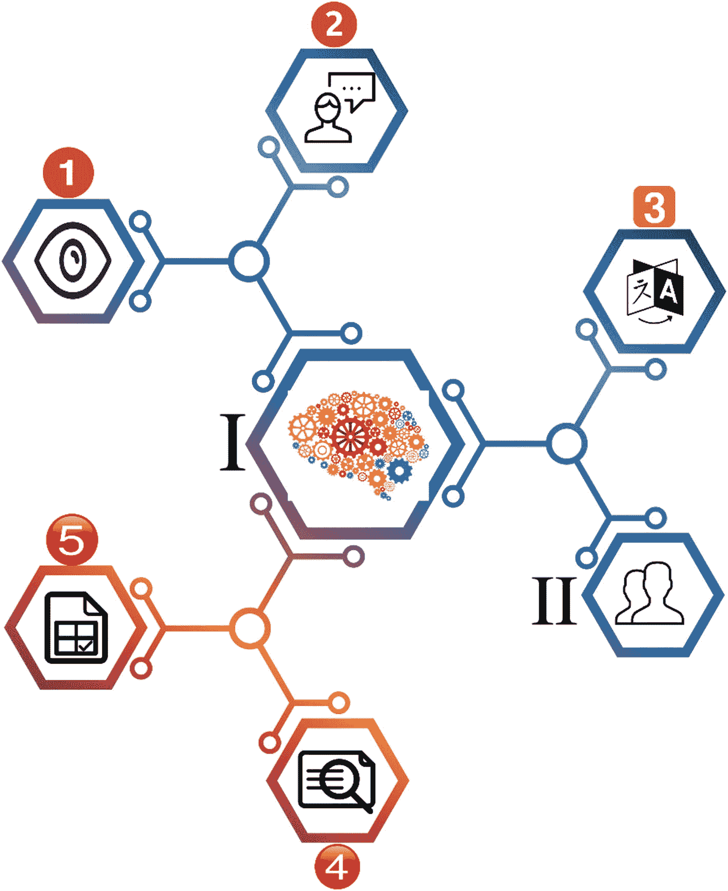
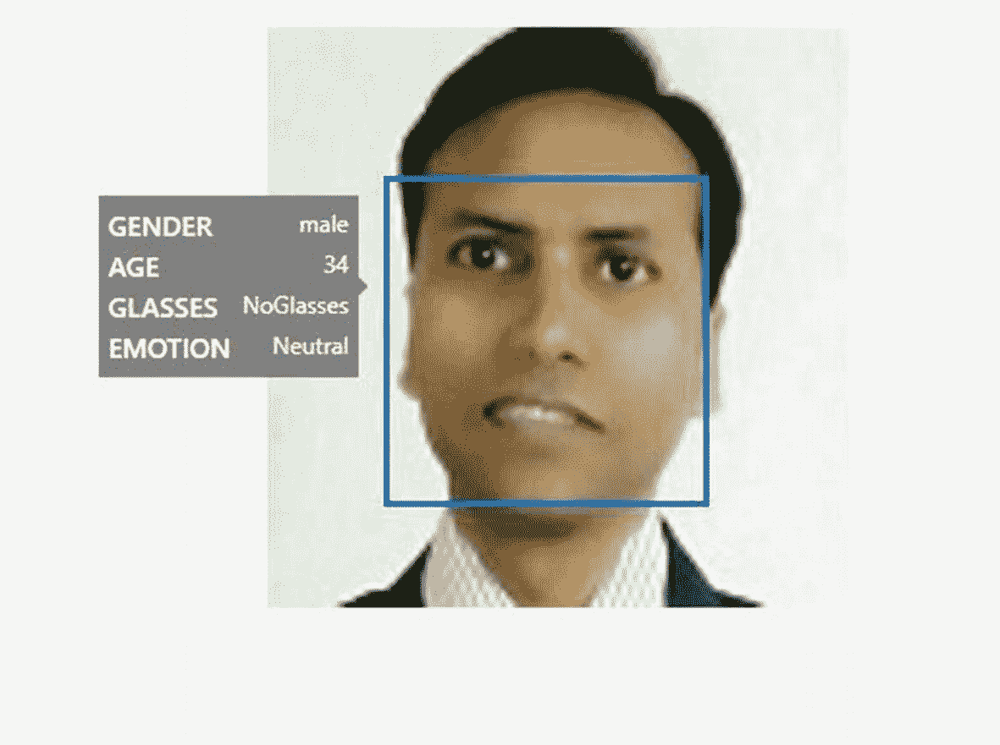

# 1.认知服务的力量

术语**人工智能(AI)** 和**机器学习(ML)** 正变得日益流行。微软 Azure 认知服务提供了一个与顶级前沿人工智能和人工智能技术合作的机会。为了使用这些技术，我们需要一些框架。

第一章的目的是建立你可以通过 Azure 认知服务实现的价值、理由和影响。本章概述了这些特性和功能。在接下来的章节中，你将了解 Azure 认知服务是如何有帮助的，以及它如何让你轻松地使用 AI 和 ML。

我们还向您介绍了我们的案例研究以及我们将在本书的其余部分使用的结构。

在本章中，我们将讨论以下主题:

*   Azure 认知服务概述

*   探索认知服务 API:视觉、语音、语言、网络搜索和决策

*   机器学习概述

*   理解用例

*   新冠肺炎智能应用场景

## Azure 认知服务概述

Microsoft Azure 认知服务为您提供了开发智能应用程序的能力。您可以借助 API、SDK(软件开发工具包)、服务等等来构建这些智能应用程序。

Microsoft Azure Cognitive Services

是一组 API、SDK 和服务，便于开发人员创建智能应用程序(无需事先了解 AI 或 ML)。

Azure Cognitive Services 提供了开发人员在没有数据科学知识的情况下开发人工智能解决方案所需的一切。开发人员可以创建一个能够对话、理解或自我训练的智能应用程序。

### 为什么选择 Azure 认知服务

Azure 认知服务由世界一流的模型部署技术提供支持，并由该领域的顶级专家构建。有很多计划和优惠使用现收现付模式。您不再需要投资开发和基础设施来构建和托管您的模型。认知服务为你提供了这一切。

以下列表显示了您使用 Azure 认知服务时获得的优势:

*   不需要建立自己定制的机器学习模型。

*   你为你的应用获得一个必需的人工智能服务。Azure 认知服务，作为一个平台即服务，可以提供这些必要的功能。

> *您可以在* ***平台即服务*** *(* ***平台即服务*** *)的基础上构建，而无需考虑用于支持服务的基础设施。*

*   可以把开发时间投入到核心 app 上，发布更强的产品。

Note

如果 Azure 认知服务不能满足你的需求，你就不应该使用它。例如，您的数据可能有法规要求，阻止您使用外部服务，如 Azure。或者您组织可能长期致力于开发自己的数据科学实践和产品。

在下一节中，我们将更详细地讨论认知服务 API。

## 探索认知服务 API:视觉、语音、语言、网络搜索和决策

在上一节中，我们讨论了认知服务及其提供的优势。在本节中，我们将探索可用于帮助开发人员的 API。

图 [1-1](#Fig1) 提供了这些 API 的图示概述。



图 1-1

认知服务 API 的图示概述

图 [1-1](#Fig1) 显示了 Azure 认知服务 API 的以下元素:

*   I——代表所有 Azure 认知服务 API

*   II–代表使用这些 API 来构建智能应用程序的开发人员

*   1–视觉 API

*   2–语音 API

*   3–语言 API

*   4–网络搜索 API

*   5–决策 API

Vision APIs 提供了对图像、手写和视频的洞察。语音 API 分析和转换音频语音。语言 API 为您提供文本分析，它们可以使文本更容易阅读，它们可以帮助您创建智能聊天功能，并且它们可以翻译文本。Bing Web 搜索 API 允许您从整个互联网中搜索和提取内容，利用页面、文本、图像、视频、新闻等。最后，决策 API 帮助您的应用程序做出明智的决策，为您的用户调节和个性化内容，并帮助您检测数据中的异常。

在接下来的部分中，我们将简要地向您介绍每一组 API。

### 视觉 API

首先，让我们探索来自 Azure 认知服务的视觉 API。当您需要处理图像或视频时，可以使用这些 API 来理解或分析它们的内容。这些 API 帮助您获取信息，如面部分析(确定年龄、性别等)、感觉(例如，通过面部表情)和更多视觉内容。此外，在这些 API 的帮助下，您可以从图像中读取文本，并且可以很容易地从图像和/或视频中生成缩略图。认知服务愿景 API 分为以下 API，详见下文。

#### 计算机视觉

计算机视觉 API 允许开发者分析图像及其内容。在上一节中，我们讨论了在 Vision APIs 的帮助下，您可以理解和收集图像内容。您可以根据自己的需求决定从图像中检索哪些内容和信息。例如，一家企业可能需要访问这些图像，以帮助确保使用其 web 应用程序的儿童避免观看成人内容。

该 API 还可以通过光学字符识别(OCR)读取印刷文本和手写文本。

Note

在写这本书的时候，计算机视觉 API 的当前版本是 3.0 版。

从开发的角度来看，您可以使用 RESTful(表述性状态转移)API，也可以使用 SDK 构建应用程序。我们将在第 [3](03.html) 章中介绍开发说明和细节。

#### 定制视觉

用于定制视觉的认知服务 API 提供了一种通过各种定制来定制图像的方法。您可以使用标签定制图像，并且可以基于定制的分类器来评估和改进这些图像。自定义视觉 API 使用机器学习算法并应用标签来评估和改进图像。此外，它分为两个部分:

1.  **图像分类**–将标签应用于图像。

2.  **对象检测**–应用标签，并返回标签所在图像的坐标。

#### 脸

这个 API 帮助你从图像中检测和分析人脸。该算法可以检测和分析数据。

该服务提供以下功能:



图 1-2

使用人脸 API 进行人脸检测

*   **人脸** **检测**–检测人脸，并提供人脸在图像中的位置坐标。基于该算法，还可以得到人脸检测的各种属性，如性别、头部姿势、情绪、年龄等。图 [1-2](#Fig2) 显示了一个人(作者 Gaurav Aroraa)的人脸检测。


图 1-3

人脸验证

*   **人脸** **验证**——从一张人脸的图像中验证两张相似的人脸进行比较，以确定是否属于同一个人。图 [1-3](#Fig3) 展示了同一个人的两张面孔。

*   **面部分组**–从可用的数据库或面部集合中对相似的面部进行分组。

Note

在开发周期中，Face API 及其数据必须满足隐私政策的要求。您可以在这里参考微软关于客户数据的政策: [`https://azure.microsoft.com/en-us/support/legal/cognitive-services-compliance-and-privacy/`](https://azure.microsoft.com/en-us/support/legal/cognitive-services-compliance-and-privacy/) 。

#### 表单识别器

表单识别器提取键/值对中的数据，并从表单类型文档中提取表格数据。

这是由以下部件制成的:

*   **自定义模型**–通过提供五种形式的样本，使您能够训练自己的数据。

*   **预建的收货模型**–您也可以使用预建的收货模型。目前，只有来自美国的英文销售收据可用。

*   **布局 API**–它使表单识别器能够通过使用光学字符识别(OCR)来提取文本和表格结构数据。

#### 视频索引器

视频索引器提供了一种分析视频内容的方法，它使用三个通道:声音、有声和可视。这样，即使你没有任何视频分析方面的专业知识，你也会对视频有所了解。它还可以最大限度地减少您的工作量，因为不需要编写任何额外的或定制的代码。

视频索引器为我们提供了一种轻松分析视频的方法，它涵盖以下类别:

*   内容创作

*   内容审核

*   深度搜索

*   易接近

*   推荐

*   货币铸造

我们将在第 [3](03.html) 章更全面地介绍视频分析。

### 语音 API

语音 API 为您提供了一种使您的应用程序更加智能的方法。因此，您的应用程序现在可以听和说了。这些 API 过滤掉噪音(您不想分析的单词和声音)，检测说话者，然后执行分配给您的操作。

#### 语音服务

微软推出了语音服务来取代必应语音 API 和翻译语音。这些服务为您的应用程序提供了非凡的效果，通过这种方式，您的应用程序可以听到用户的声音，并与您的用户交流/互动。

Note

您还可以使用框架定制语音服务。语音转文字，参见 [`https://aka.ms/CustomSpeech`](https://aka.ms/customspeech) 。文字转语音，参见 [`https://aka.ms/CustomVoice`](https://aka.ms/customvoice) 。

语音服务支持以下场景:

*   语音转文本

*   文本到语音

*   语音翻译

*   语音助手

借助不同的框架，你还可以定制你的演讲体验。

#### 说话人识别(预览)

在我写这本书的时候，说话人识别还处于预览阶段。这项服务使您能够识别说话者；你可以确定谁在说话。在这个服务的帮助下，您的应用程序还可以验证说话的人就是他们所声称的那个人。因此，现在您的应用程序可以更容易地从一组潜在的说话者中识别出未知的说话者。

它可以分为这两部分:

*   说话人验证

*   扬声器识别

我们将在第 [5](05.html) 章中详细介绍语音识别。

### 语言 API

在预构建脚本的帮助下，语言 API 使您的应用程序能够处理自然语言。此外，它们还能让你学会如何识别用户的需求。这将为您的应用程序增加更多的功能，比如文本和语言分析。

#### 沉浸式阅读器

沉浸式阅读器是一个非常智能的服务，它构建了一个工具来帮助每一个读者，尤其是受阅读障碍影响的人。

Note

诵读困难影响大脑中处理语言的部分。患有诵读困难症的人在阅读方面有困难，他们会发现识别书面讲话中的声音非常具有挑战性。

沉浸式阅读器旨在让每个人都更容易阅读。

它提供了以下功能:

*   大声朗读文本内容

*   强调形容词、动词、名词和副词

*   用图形表示常用单词

*   帮助您理解您自己翻译的语言的内容

#### 语言理解(路易斯)

设想一个场景，您需要让您的应用程序足够智能，以便它能够理解用户输入(如语音、文本等)。语音服务使您的应用程序足够智能，能够与用户一起听和说。但是您的应用程序可能需要足够智能来回答用户提出的问题，例如，“*我的健康状况如何？*“即使实现了语音 API，您的应用程序也无法理解这样的命令。为了达到如此复杂的要求，我们提供了语言理解(LUIS)服务。(LUIS 代表语言理解智能服务。)在 LUIS 的帮助下，您可以构建一个与用户交互并从对话中提取相关信息的应用程序。对于像“*我的健康状况如何？*”，您的应用程序可以评估存储的数据，然后提供用户的健康状态。或者，它会问一些问题，然后根据用户的回答，提供用户的健康状况。

您可以使用以下两种类型的模型:

*   预建模型

*   定制模型

在第 [4](04.html) 章中了解更多关于 LUIS 的信息。

#### QnA 制造商

当你有一个 FAQ 并且想让它互动时，QnA 是非常相关的。这意味着您有一组预定义的 QnA(问题和答案)。QnA 主要用于基于聊天的应用程序，用户输入查询，然后应用程序回答问题。您可以尝试使用微软的 [`www.qnamaker.ai/`](http://www.qnamaker.ai/) 来启用您的 QnA Maker 体验。

#### 文本分析

借助文本分析服务，您可以构建一个应用程序来分析原始文本，然后给出结果。它包括以下功能:

*   情感分析

*   关键短语提取

*   语言识别

*   名字标识

#### 翻译者

Translator 支持文本到文本的翻译，它提供了一种将翻译构建到应用程序中的方法。在 Translator 的帮助下，您可以为您的应用程序添加多语言功能。目前，支持 60 多种语言。如果你想翻译一段口语，你需要使用语音服务。

### Web 搜索 API

Web 搜索 API 使您能够构建更智能的应用程序，并赋予您 Bing 搜索的强大功能。它们允许你从数十亿的网页、图片和新闻文章(甚至更多)中获取数据，以构建你的搜索结果。

#### Bing 搜索 API

Bing 搜索通过提供网络搜索的能力来促进你的应用程序。你可以想象，随着 Bing 搜索 API 的实现，你现在有了大量的网页来构建你的搜索结果。代码实现也非常简单(参见清单 [1-1](#PC1) )。

```py
//Sample code
public static async void WebResults(WebSearchClient client)
{
    try
    {
        var fetchedData = await client.Web.SearchAsync(query: "Tom Campbell's Hill Natural Park");
        Console.WriteLine("Looking for \"Tom Campbell's Hill Natural Park\"");

        // ...

    }
    catch (Exception ex)
    {
        Console.WriteLine("Exception during search. " + ex.Message);
    }
}

Listing 1-1The sample code to implement Bing Web Search

```

#### Bing 网络搜索

使用 Bing Web Search API，您可以在用户输入时建议搜索词，过滤和限制搜索结果，从搜索结果中删除不想要的字符，按国家本地化搜索结果，以及分析搜索数据。

#### Bing 自定义搜索

Bing 自定义搜索 API 允许您自定义搜索建议、图片搜索体验和视频搜索体验。您可以共享和协作您的自定义搜索，还可以为您的应用程序配置一个独特的用户界面来显示您的搜索结果。

#### 必应图片搜索

Bing 图像搜索 API 使您能够利用 Bing 的图像搜索功能。您可以建议图像搜索词，过滤和限制图像结果，裁剪和调整图像大小，显示图像的缩略图，以及展示趋势图像。

#### Bing 实体搜索

Bing 实体搜索 API 获取实体和位置的搜索结果，比如餐馆、酒店或商店。您可以提供实时搜索建议、实体消歧(提供多个搜索结果)，并返回企业和其他实体的信息。

#### 必应新闻搜索

Bing 新闻搜索 API 允许你搜索相关的新闻文章。您可以建议搜索词，返回新闻文章，展示当天的热门新闻文章和标题，并按类别过滤新闻结果。

#### 必应视频搜索

Bing 视频搜索 API 返回高质量的视频。您可以建议搜索词，过滤和限制视频查询的结果，创建视频的缩略图预览，展示趋势视频，以及访问视频见解。

#### Bing 视觉搜索

Bing 视觉搜索 API 提供了单个图像的指标和见解，无论是上传的还是通过 URL 共享的。您可以识别相似的图像和产品，识别图像的购物来源，访问其他人进行的相关搜索(基于图像的内容)，查找显示图像的网页，查找图像中特色菜肴的食谱，并使用图像自动收集有关实体的信息(如图像中演员的信息或图像中某个位置的方向)。

#### Bing 自动建议

Bing Autosuggest API 可以基于部分查询返回建议查询列表，从而改善您的搜索体验。

#### Bing 拼写检查

Bing 拼写检查 API 对任何文本执行语法和拼写检查。您可以检查俚语或非正式语言，区分相似的单词，并跟踪新的品牌、标题和流行表达。

#### Bing 本地商业搜索

Bing 本地商业搜索 API 可以帮助你找到关于一个企业的信息。您可以找到离您最近的餐馆(例如特定的连锁店或某种食物)，定位并标出特定的企业和地点，限制搜索的距离参数，并按类别筛选企业结果。

### 决策 API

决策 API 可以帮助您创建丰富的个性化用户体验，并对内容进行审核。他们帮助你进行有效的决策。

#### 异常检测器(预览)

在写这本书的时候，异常探测器正在预览中。它帮助您检测数据中的异常，以便消除它们。当你使用这项服务时，你不需要考虑什么模式适合你的业务。异常检测器服务会自动确定最适合您数据的模型。

#### 内容版主

内容仲裁者帮助您识别您的企业不允许的内容或不适合您的企业的内容。它还检查文本、图像和视频内容。例如，您可以删除亵渎和不良文本，您可以识别包含亵渎的视频，您可以调节成人和色情视频和图像内容，您可以检查个人可识别信息的文本(PII)，您可以检测其他攻击性或不需要的图像。

#### 个性化的

Personalizer 帮助您为用户提供个性化体验。它帮助你向个人用户展示不同的个性化内容。内容可以是文本、图像、URL 或电子邮件。

## 机器学习概述

关于什么是机器学习，有很多可能的定义。根据所有可用的定义，我们可以得出以下结论。

机器学习是一种子集 AI，它为你提供了一种研究计算机算法的方法。在这个过程中，在研究数据后，计算机程序可以预测未来的事件。

我们的学习过程简单而持续。这个过程随时随地都在发生，就像你在散步、冲咖啡或购物的时候。每一门学问都有自己的范围和界限。例如，当你走路时，你的智能手表(装有程序的机器)会收集你的数据(如步数、英里数、心跳和血压)。再比如，当你去百货商店购物时，技术系统(如积分卡和支持软件)会根据你过去购买的物品来了解你的购买行为。

有了这些信息，机器可以预测未来。例如，学习购买行为的机器可以预测客户会订购哪些商品。再举一个例子，它可以帮助店主了解一个顾客消费了多少特定的商品。

Note

总之，机器学习是一种帮助我们理解未来行为的研究。我们通过研究各个方面的数据来实现这一点，例如分析文本以获得情感情绪，或者分析图像以识别物体或人脸。

机器学习过程有几个阶段。这些阶段是迭代的，需要根据需求和/或培训进行重复。以下是最常见的阶段:

*   **数据收集阶段**–在此阶段，数据正在准备或收集中。根据培训需求或培训所需的组件，确定要收集的数据。

*   **测试和开发培训模型**–这是测试学习和开发培训模型的阶段。例如，要为一家百货商店构建一个新的培训模型，我们需要分析杂货项目。你可以通过算法收集和访问数据。

*   **部署和管理经过训练的模型**–这是您可以看到实际输出的阶段。你也可以称这个阶段为*机器学习在起作用*。

在各种计划的帮助下，微软让开发人员很容易做到这一点。您可以遵循前面的阶段，并使用可用的微软技术来管理您的机器学习模型。

以下各种微软技术可用于 ML:

*   **基于云的**–微软 Azure 提供了很多选项，你可以使用云服务和机器学习。
    *   认知服务 API(如视觉、语音、语言和网络搜索)提供了复杂的预训练 ML 模型。

*   **本地**–与基于云的选项类似，您也可以选择本地(本地)服务器也可以在虚拟机中运行的本地选项。最常用的服务如下:
    *   SQL Server 机器学习服务允许您使用关系数据运行 Python 和 R 脚本，以进行预测分析和机器学习。

    *   微软机器学习服务器在 SQL Server 和 Teradata 中运行数据库内分析。

*   **工具**
    *   Azure Data Science 虚拟机(DSVMs)预装、配置并测试了各种 ML 和 AI 工具，以优化对 ML 和 AI 工作负载的支持。

    *   Azure Databricks 基于 Apache Spark，扩展分析，并从数据和人工智能解决方案中释放洞察力。

    *   ML.NET 是一个开源的跨平台 ML 框架，支持 Windows、Linux 和 macOS。它是为。NET 开发人员，它与 ML 库，如 TensorFlow，ONNX 和 Infer.NET，无缝地工作。

    *   Windows ML 内置于 Windows 10 和 Windows Server 2019 中。它是一个在 Windows 设备上部署 ML 的 API，这些设备是为此目的而优化的。

    *   MMLSpark 是一组开源工具，提供了与 Azure Spark 等的无缝集成。

    *   其他框架包括 PyTorch、Keras、ONNX 和 TensorFlow。

*   **Azure 机器学习**——这是一项基于 Azure 云的服务。它提供了一种训练、部署和管理机器学习模型的方法。(Azure 机器学习入门，去 [`https://ml.azure.com`](https://ml.azure.com) 。)它的主要优势在于它是完全开源的，因此您可以利用以下技术:
    *   Azure notebooks 是一项免费服务，面向使用笔记本并自带代码和应用的 R 开发者。

    *   Jupyter notebooks 是一个开源项目，供开发人员积极成长和学习。

    *   Azure 机器学习可以回答你对 Visual Studio 代码的扩展问题。

> *你可以在* [`https://aka.ms/AMLFree`](https://aka.ms/AMLFree) *注册 12 个月的免费 Azure 机器学习服务。*

### 理解用例

机器学习(ML)越来越受欢迎。越来越多的人在他们的业务需求中使用它。以下行业大量使用 ML 来预测他们的业务需求，以及一般的人工智能(AI ):

*   **金融和银行**–ML 用于了解未来借款人对信贷决策的需求，个性化贷款选项，以及确定贷款资格。此外，信用评分正在由人工智能驱动。风险管理完全依赖于人工智能，以管理大量的结构化和非结构化数据(通过分析问题、失败和成功的历史)。银行和租赁公司在使用基于云的人工智能服务来确定风险时，会立即发现显著的改进，而不是使用他们以前的数据科学流程。AI 和 ML 还用于欺诈预防、交易、个性化银行业务、流程自动化、数字助理和账户交易安全。

*   **欺诈检测**—尽管身份盗窃的数量每年都在增长，但人工智能和人工智能正被应用于无数的数据点，以分析和比较消费者的历史记录和数据，从而识别和阻止欺诈交易。随着这一趋势的持续，金融欺诈比以往任何时候都更频繁、更迅速地被发现。

*   医疗保健–人工智能正被用于机器人手术、虚拟护理助理以及自动化工作流程和管理活动。AI 和 ML 也用于进行临床判断和帮助诊断患者。这包括通过检查医疗记录、习惯和遗传信息来检测皮肤癌、乳腺癌以及癌症的早期检测和预测。人工智能还被用于识别心脏骤停，仅基于某人的语调和电话中的背景噪音。人工智能还被用于图像分析(如 CT 扫描)，这提高了对各种伤害的准确检测和诊断的可靠性，并已经帮助减少了医院等待时间。

*   **零售、电子商务和广告**–对于零售行业，ML 正被用于供应链规划、需求预测、客户情报、营销活动和广告、商店运营、定价和产品促销。商店使用积分卡来跟踪谁购买了什么商品。他们根据前几年的前几天，并考虑到最近和每年的趋势和变化，预测日历年每天的销售额。这些数据也用于适当的人员配备，根据需求规划日程和休假时间，预测一天中的具体时间。从一开始，这些数据就被在线零售商和网站用来根据你的在线购买、搜索、访问的网站和浏览的内容向你做广告。

*   **教育**–人工智能现在被用来创建独特的个性化学习系统。这种智能教学设计为学生提供挑战，不断满足他们的要求，在他们准备好的时候将他们带到下一个层次。AI 使学生能够普遍进入全球学校，包括为学生翻译语言，以便理解外国教师。人工智能还帮助为可能有视觉或听觉障碍的学生创造学习机会。此外，AI 和 ML 正在帮助实现学校和课堂管理任务的自动化，它们还帮助向学生提供课外辅导和支持。

## 新冠肺炎智能应用场景

在我们策划这本书的时候，我们面对的是一种冠状病毒病(新冠肺炎)【疫情: [`www.who.int/emergencies/diseases/novel-coronavirus-2019`](http://www.who.int/emergencies/diseases/novel-coronavirus-2019) 。我们决定以这样一种方式起草我们的例子，这样我们就可以覆盖真实世界的用例。

新冠肺炎智能应用涵盖以下场景:

*   数据收集

*   数据分析

*   视觉分析

我们将在整本书中重新审视新冠肺炎智能应用，提供示例和解释，以便为您提供一个端到端智能应用的示例。

## 摘要

本章的目的是建立你可以通过微软 Azure 认知服务实现的价值、原因和影响。这个讨论从 Azure 认知服务的概述以及你为什么会使用认知服务开始。随后，我们对认知服务提供的各种 API 进行了高级概述。这些 API 最小化了我们与机器学习和人工智能相关的努力。本章还介绍了机器学习和微软的各种产品，包括 Azure 机器学习。

在讨论过程中，本章介绍了与人工智能和人工智能相关的各种用例。最后，我们向您简要介绍了我们的新冠肺炎 SmartApp。

在下一章，我们将继续 Azure 认知服务的讨论。我们将通过探索微软 Azure 门户来讨论如何开始使用 Azure 认知服务。