# 三、视觉——识别和分析图像和视频

图像和视频的识别是制作智能应用所需的核心功能之一。Azure Cognitive Services 为我们提供了视觉 API，以处理图像和视频。

本章的目的是开始使用 Vision API，并创建一个智能应用来帮助您处理图像和视频。

本章将涵盖以下主题:

*   通过计算机视觉了解视觉 API

*   分析图像

*   识别一张脸

*   了解用于视频分析的 Vision APIs 的工作行为

*   Vision API 摘要

在接下来的章节中，我们将讨论、理解和使用计算机视觉 API。

## 通过计算机视觉了解视觉 API

**计算机视觉**是人工智能(AI)类别下的一组 API。它帮助你训练计算机(机器)。训练一台机器的过程就是教会计算机如何理解视觉世界。从数字图像中捕获文本数据(以及从视频中捕获图形数据)是计算机视觉领域最强大的发明之一。

**人工智能(AI)** 指的是机器如何像人类一样思考的技术。这项技术伴随着编程、算法和训练，机器被指示或训练像人类一样思考和行为。人工智能一词是在 1956 年创造的，当时科学家们在探索解决问题等主题。1960 年，当国防高级研究计划局(DARPA)对训练计算机和模仿基本人类推理的工作感兴趣时，它开始流行起来。这项研究非常出色，以至于在 2003 年，DARPA 推出了智能个人助理。

深度学习是一种帮助训练计算机/机器的机器学习，以便这些机器像人类一样执行任务。这些任务可以是语音识别、图像识别、对象说明，或者机器可以做出可能的决定并做出预测。

简而言之，计算机视觉属于人工智能(AI)。在训练(称为深度学习)的帮助下，经过训练的机器可以轻松识别物体。训练模型也有助于这些机器对识别出的对象进行分类。请注意，识别和指定对象的准确性将取决于机器的训练。

光学字符识别(OCR)是一种帮助您从可视文本文档(如扫描的纸张、图像、PDF 文件和/或包含可提取的文本或可视内容的任何其他文件格式)中创建可编辑或可搜索数据的技术。

计算机视觉并不新鲜。它已经存在了六十多年。它在 20 世纪 70 年代变得更加流行，当时 Raymond Kurzweil(又名 Ray Kurzweil)将第一个光学字符识别工具商业化，该工具被命名为“**全字体 OCR** ”。这个工具能够处理几乎任何字体的印刷文本。2000 年，OCR 作为基于云的服务发布。

现在，我们可以说计算机视觉已经成熟(但请记住，它仍在成长，并在自我学习)。对于技术人员和科学家来说，利用先进的能力来分析和识别数据是最好的礼物之一。计算机视觉的内部工作非常简单，可以通过以下步骤来定义:

1.  **收集图像**–如今，我们有大量的空间，可以是 100 GB 到 1 TB 甚至更多，而且我们拥有捕捉数字图像的技术。因此，今天捕捉和收集数字图像、照片和 3D 对象非常容易。

2.  **图像处理**——训练模型的第一步是我们需要数据。这些数据仅仅是相关图像的集合。现在，我们有了计算能力更强的技术。我们可以处理成千上万预先确定的图像。

3.  **图像理解**–这是计算机视觉对物体进行识别或分类的步骤。

前面的步骤称为拇指步骤，仅描述计算机视觉的基本功能。根据所做的决定，这些步骤可以进一步划分。计算机视觉也可以分为以下几个步骤:

*   图像分割将一幅图像分割成多个区域、子区域或一幅大图像的多个部分，以便可以单独检查每个部分。

*   使用 X 和 Y 坐标检测或识别单个图像中的对象。在 X 和 Y 坐标的帮助下，它创建了一个边界框，然后很容易识别框内的所有内容。

*   考虑面部识别，这是一种检测物体的高级智能。它是如此先进，它不仅可以识别它在图像中看到的人脸，还可以识别特定的个人(它是谁的脸)。

*   图案检测是另一项高级功能，它可以识别图像中重复的形状和颜色。

Microsoft Azure Cognitive Services

计算机视觉 API 是一组基于云的服务，提供高级算法，帮助开发人员分析和处理图像，以检索信息。简而言之，计算机视觉 API 提供了对图像、手写和视频的洞察。

现在，OCR 支持 73 种不同语言的 API v3.2。你可以在 [`https://docs.microsoft.com/en-us/azure/cognitive-services/computer-vision/language-support#optical-character-recognition-ocr`](https://docs.microsoft.com/en-us/azure/cognitive-services/computer-vision/language-support%2523optical-character-recognition-ocr) 找到这个语言信息。

要开始使用 Azure 门户，您需要一个有效的 Azure 帐户。如果您没有有效的 Azure 帐户，请按照以下步骤注册一个免费的 Azure 帐户:

*   前往 [`https://signup.azure.com`](https://signup.azure.com) 。

*   要注册免费帐户，您需要提供有效的电话号码、有效的信用卡以及 GitHub 帐户或 Microsoft 帐户 id(以前称为 Windows Live ID)。

*   按照屏幕上的说明进行操作。

注册后，您的帐户将包含 12 个月的免费服务。

然后您可以在 [`https://portal.azure.com`](https://portal.azure.com) 登录 Azure。登录后，您将登陆门户主页，当前看起来如图 [3-1](#Fig1) 。


图 3-1

蔚蓝门户

Azure 门户的完整介绍超出了本书的范围。如果你想了解导航和使用 Azure 门户的细节，请参考 Apress 出版的《微软 AzureT3 中的 ***云调试和概要分析》一书。***

## 分析图像

在上一节中，我们讨论了计算机视觉 API 如何提供识别和分析对象的方法。计算机视觉在各种算法的帮助下从图像中提取数据。计算机视觉通过提供数百个对象和参数，使开发人员的工作变得更加容易。在这一节中，我们将学习更多关于 API 的知识，并且我们将通过一个代码示例把它带到下一个层次。

首先，进入 Azure 门户，从搜索文本框中搜索“认知服务”。或者，你可以点击**所有服务**、**、AI +机器学习**(在左窗格)、右窗格**认知服务**。见图 [3-2](#Fig2) 。

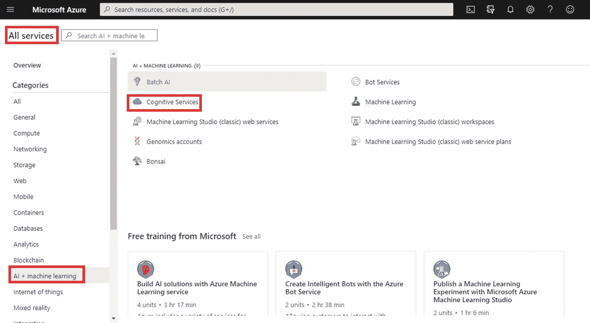

图 3-2

搜索认知服务

接下来，您将看到认知服务屏幕。在此屏幕上，您可以管理现有服务或添加/创建新服务。这是图像分析之旅的起点。

计算机视觉认知服务使用一个经过预先训练的模型，帮助开发人员分析图像。

### 开始为计算机视觉潜水

为了利用计算机视觉服务，让我们首先从 Azure 门户创建一个资源。从屏幕顶部的搜索文本框中搜索“计算机视觉”。从搜索结果中，点击*市场*下的**计算机视觉**，如图 [3-3](#Fig3) 所示。


图 3-3

计算机视觉

在“创建计算机视觉”页面上，您需要提供详细信息，如您的 Azure 订阅、资源组、区域、实例名称和定价层。见图 [3-4](#Fig4) 。


图 3-4

设置计算机视觉

按照屏幕上的说明，完成创建计算机视觉实例的过程。这需要一些时间。部署完成后，点击**进入资源**，如图 [3-5](#Fig5) 所示。


图 3-5

部署完成

在获得密钥和端点之前，您将无法进行 API 调用，这样应用就可以通过身份验证。

出于演示目的，我们选择了自由层定价模式。对于生产级应用，您需要评估各种定价模型，以满足您的独特需求。有关定价等级的更多信息，请参见 [`https://azure.microsoft.com/en-us/pricing/details/cognitive-services/computer-vision/`](https://azure.microsoft.com/en-us/pricing/details/cognitive-services/computer-vision/) 。

要获取密钥和端点，请单击左侧导航菜单中资源管理部分下的**密钥和端点**。见图 [3-6](#Fig6) 。


图 3-6

快速启动页面

在“密钥和端点”页面中，记下您的密钥 1、密钥 2 和端点 id，以使用计算机视觉资源。参见图 [3-7](#Fig7) 。在这个屏幕上，您还可以重新生成密钥。


图 3-7

“密钥和端点”页面

#### 使用 API

到目前为止，我们已经创建了一个计算机视觉资源，并使用密钥设置了端点。现在，是时候使用 API 了。Azure portal 为我们提供了多种测试 API 的方法，如下所示:

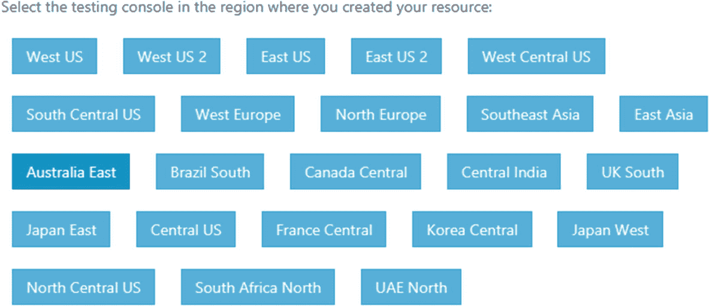

图 3-8

选择 API 控制台区域

1.  **API 控制台**–这种测试 API 的方法需要最少的努力。使用 API 控制台，开发人员可以通过使用端点将值传递给 API，并检索结果。在 API 控制台中，通过单击特定区域来选择 API。见图 [3-8](#Fig8) 。

选择**分析图像**资源，然后提供所需信息，如图 [3-9](#Fig9) 所示。然后点击**发送**。我们用这个 URL 测试了一个随机图片: [`https://azurecomcdn.azureedge.net/cvt-caf9b3609b1d754524c718b4cde399fda4ea781184fcff2c2e29fbbded7c0aimg/cognitive-services-demos/analyze-img/analyze-2-thumbnail.jpg`](https://azurecomcdn.azureedge.net/cvt-caf9b3609b1d754524c718b4cde399fda4ea781184fcff2c2e29fbbded7c0aimg/cognitive-services-demos/analyze-img/analyze-2-thumbnail.jpg) 。

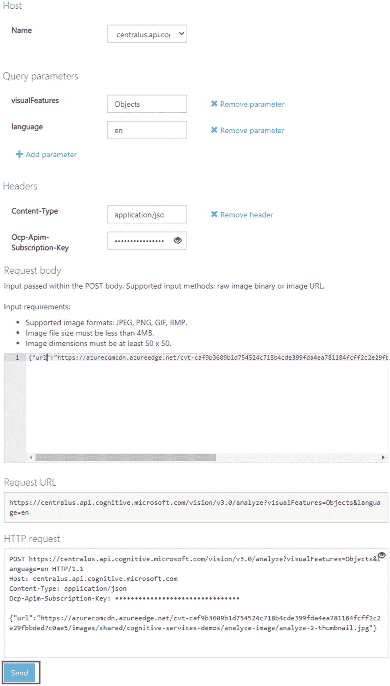

图 3-9

发送分析图像的请求

前面的请求将返回清单 [3-1](#PC1) 中所示的响应。

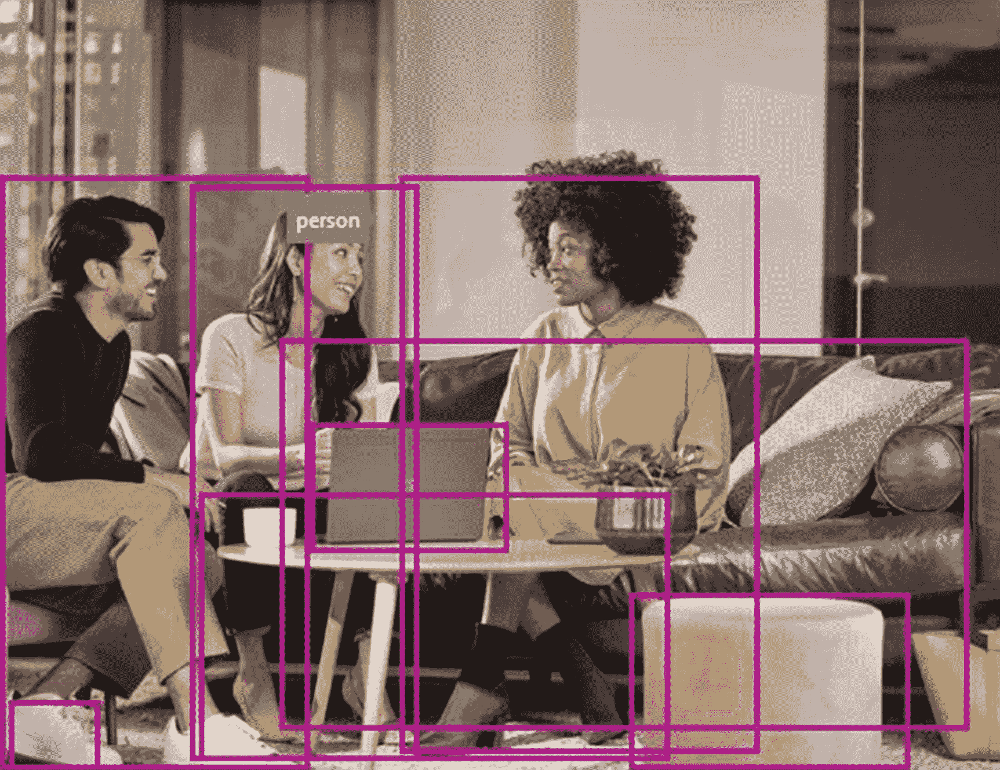

图 3-10

映象分析

1.  **从计算机视觉特征页**进行测试–为了分析一幅测试图像(出于演示目的)，您可以使用特征页来获得视觉结果: [`https://azure.microsoft.com/en-in/services/cognitive-services/computer-vision/#features/`](https://azure.microsoft.com/en-in/services/cognitive-services/computer-vision/%2523features/) 。出于演示目的，让我们使用我们在 API 控制台窗口中测试的同一个图像。我们将得到如图 [3-10](#Fig10) 所示的结果。

```py
csp-billing-usage: CognitiveServices.ComputerVision.Objects=1,CognitiveServices.ComputerVision.Transaction=1
x-envoy-upstream-service-time: 844
apim-request-id: 6ddc4b00-4a3f-438b-876c-54800ae6250d
Strict-Transport-Security: max-age=31536000; includeSubDomains; preload
x-content-type-options: nosniff
Date: Sun, 07 Mar 2021 00:36:13 GMT
Content-Length: 281
Content-Type: application/json; charset=utf-8

{
  "objects": [{
    "rectangle": {
      "x": 0,
      "y": 47,
      "w": 34,
      "h": 125
    },
    "object": "person",
    "confidence": 0.615
  }, {
    "rectangle": {
      "x": 69,
      "y": 35,
      "w": 72,
      "h": 138
    },
    "object": "person",
    "confidence": 0.807
  }],
  "requestId": "6ddc4b00-4a3f-438b-876c-54800ae6250d",
  "metadata": {
    "height": 175,
    "width": 175,
    "format": "Jpeg"
  }
}

Listing 3-1Output from the image analysis API

```

分析数据如清单 [3-2](#PC2) 所示。

1.  **集成/从应用内部调用**——这种方法用得很好。您可以使用 API 键调用 API，API 键是从 Keys and Endpoint 页面生成的。出于演示目的，我们有少量用 C#编写的代码。

    我们用的是 Visual Studio 2019 社区版。提到的步骤对于我们在本章中讨论的所有代码示例都是一样的。

```py
[
  {
    "rectangle": {
      "x": 6,
      "y": 390,
      "w": 48,
      "h": 40
    },
    "object": "footwear",
    "confidence": 0.513
  },
  {
    "rectangle": {
      "x": 104,
      "y": 104,
      "w": 127,
      "h": 323
    },
    "object": "person",
    "confidence": 0.763
  },
  {
    "rectangle": {
      "x": 174,
      "y": 236,
      "w": 113,
      "h": 74
    },
    "object": "Laptop",
    "parent": {
      "object": "computer",
      "confidence": 0.56
    },
    "confidence": 0.553
  },
  {
    "rectangle": {
      "x": 351,
      "y": 331,
      "w": 154,
      "h": 99
    },
    "object": "seating",
    "confidence": 0.525
  },
  {
    "rectangle": {
      "x": 0,
      "y": 101,
      "w": 174,
      "h": 329
    },
    "object": "person",
    "confidence": 0.855

  },
  {
    "rectangle": {
      "x": 223,
      "y": 99,
      "w": 199,
      "h": 322
    },
    "object": "person",
    "confidence": 0.725
  },
  {
    "rectangle": {
      "x": 154,
      "y": 191,
      "w": 387,
      "h": 218
    },
    "object": "seating",
    "confidence": 0.679
  },
  {
    "rectangle": {
      "x": 111,
      "y": 275,
      "w": 264,
      "h": 151
    },
    "object": "table",
    "confidence": 0.601

  }
]

Listing 3-2Identification of the object

```

打开 Visual Studio，然后点击**新建一个项目**。在创建新项目页面上，单击**控制台应用(。网芯)**，如图 [3-11](#Fig11) 所示。然后，点击下一个的**。**


图 3-11

创建新项目

命名项目，输入项目位置路径，并提供有效的解决方案名称。然后点击**创建**，如图 [3-12](#Fig12) 所示。


图 3-12

配置您的新项目

在解决方案资源管理器中右键单击项目名称，然后单击 **Manage NuGet Packages** 。从 NuGet 包管理器中，搜索**微软。浏览选项卡中的 azure . cognitiveservices . vision . computer vision**。确保您选中了**包括预发布**复选框。在右窗格中，选择最新版本，然后点击其右侧的**安装**。参见图 [3-13](#Fig13) 。


图 3-13

NuGet 包的安装

转到 Azure 门户，复制密钥和端点。在代码中添加键和端点，如清单 [3-3](#PC3) 所示。

```py
static string subscriptionKey = "SUBSCRIPTION_KEY_GOES_HERE";
static string endpoint = "ENDPOINT_GOES_HERE";

Listing 3-3Adding the Computer Vision subscription key and endpoint

```

需要订阅来验证对端点的请求。您可以重温上一节并获得订阅密钥和端点。

设置认证客户端。编写清单 [3-4](#PC4) 中所示的语句。

```py
ComputerVisionClient client = AuthenticatedClient(endpoint, subscriptionKey);

Listing 3-4Creating the client

```

我们传递了一个端点和一个有效的订阅密钥来创建一个经过身份验证的客户端。您可能会看到 Visual Studio 正在抛出一个关于缺少命名空间的错误。添加建议的名称空间，如图 [3-14](#Fig14) 所示。

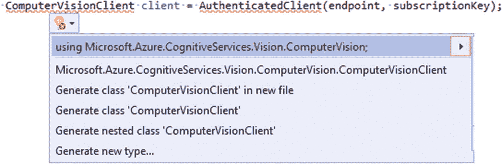

图 3-14

添加缺少的命名空间

AuthenticatedClient 方法通过验证 ApiKeyServiceClientCredentials 来创建有效的经过身份验证的客户端。参见清单 [3-5](#PC5) 。

```py
private static ComputerVisionClient AuthenticatedClient(string endpoint, string subscriptionKey)
{
    ApiKeyServiceClientCredentials clientCredentials = new ApiKeyServiceClientCredentials(subscriptionKey);
    return new ComputerVisionClient(clientCredentials) { Endpoint = endpoint };
}

Listing 3-5Authenticating a client

```

要添加您需要分析的所有特性，只需创建一个 VisualFeatureTypes 模型列表。参见清单 [3-6](#PC6) 。

```py
List<VisualFeatureTypes?> featuresToBeAnalyzed = new List<VisualFeatureTypes?>()
{
    VisualFeatureTypes.Categories, VisualFeatureTypes.Description,
    VisualFeatureTypes.Faces, VisualFeatureTypes.ImageType,
    VisualFeatureTypes.Tags, VisualFeatureTypes.Adult,
    VisualFeatureTypes.Color, VisualFeatureTypes.Brands,
    VisualFeatureTypes.Objects
};

Listing 3-6VisualFeatures to be analyzed

```

添加缺少的名称空间，如图 [3-15](#Fig15) 所示。

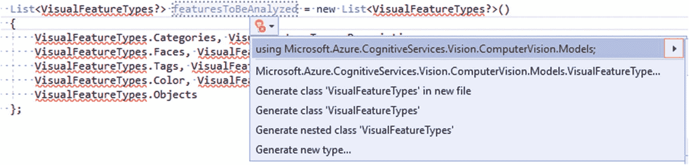

图 3-15

缺失的命名空间

向 Vision API 发出请求并获得结果。响应是 ImageAnalysis 模型对象，如清单 [3-7](#PC7) 所示。

```py
ImageAnalysis analysisData = await client.AnalyzeImageAsync(imgURL, featuresToBeAnalyzed);

Listing 3-7Making a request

```

在这个简短的演示中，我们分析了每一个可能的特性，以检查图像描述、类型、对象等等。我们演示图像的最终结果( [`https://docs.microsoft.com/en-us/learn/wwl-data-ai/analyze-images-computer-vision/media/woman-roof.png`](https://docs.microsoft.com/en-us/learn/wwl-data-ai/analyze-images-computer-vision/media/woman-roof.png) )应该如图 [3-16](#Fig16) 所示。


图 3-16

图像分析结果

### 识别一张脸

计算机视觉 API 也有助于识别图像中的人脸。这将分析图像，并根据识别出的人脸返回不同种类的数据。

大约有 27 个用于检测人脸的预定义标志点。计算机视觉在处理图像时使用这些预定义的标志。参考图片 [`https://docs.microsoft.com/en-us/azure/cognitive-services/faimg/landmarks.1.jpg`](https://docs.microsoft.com/en-us/azure/cognitive-services/faimg/landmarks.1.jpg) ，查看这些地标的图示。

Face API 提供了面部分析。您可以执行此分析来完成以下任务:

*   **检测图像中的人脸**–它通过提取与人脸相关的属性，如头部姿势、人的性别、年龄、情绪、面部毛发和眼镜，为检测人脸提供分析数据。

*   **在图像中找到相似的面孔**–你可能想从数据库中搜索，找到一张人脸。这个 API 帮助你识别图像中的人脸。该 API 还进一步缩小了搜索范围，并提供了两种识别人脸的方法:
    *   **match person mode**——首先匹配并识别同一个人，然后返回匹配结果。

    *   **匹配人脸模式**–返回匹配结果，忽略同一个人的脸。这个 API 不考虑一张脸是否属于一个特定的人，但是它找到所有匹配的脸。换句话说，它返回可能属于也可能不属于同一个人的相似人脸匹配。

*   **识别人脸**–想象一下自动标记人脸的功能，其中系统会自动为图像标记人类身份(姓名或任何符号标识符)，然后存储在数据库中。这个 API 帮助你从存储的图像数据库中识别特定的人脸。

要开始面部识别，我们需要设置面部 API。为此，请遵循我们在上一节中遵循的相同步骤来设置 Vision API。搜索 **Face** ，然后按照说明设置服务。

Note

如果您对从图像中识别面部的要求非常有限，那么您可以在视觉 API 的帮助下，使用可选的`visualFeatures parameter` <sup>[1](#Fn1)</sup> 来完成这项工作。如果您必须处理复杂的场景(您想要收集与面部分析相关的所有数据)，那么我们建议您使用 Face API。

确保您已经设置了密钥和端点。成功设置后，面部资源屏幕应如图 [3-17](#Fig17) 所示。


图 3-17

资源概览屏幕

#### 使用 API 控制台进行测试

我们已经建立了我们的 Face API。现在让我们通过使用 API 控制台来测试它。您需要从 Azure 门户打开 API 控制台，方法是选择您创建资源的区域。出于演示的目的，我们在美国中部地区创建了一个资源。我们将只测试这个地区的 API。我们使用了一个非常简单的 API 叫做人脸检测，使用了一个随机图像( [`https://docs.microsoft.com/en-us/learn/wwl-data-ai/analyze-images-computer-vision/media/woman-roof.png`](https://docs.microsoft.com/en-us/learn/wwl-data-ai/analyze-images-computer-vision/media/woman-roof.png) )。我们还分析了图像的以下面部属性:年龄和性别。参见图 [3-18](#Fig18) 。

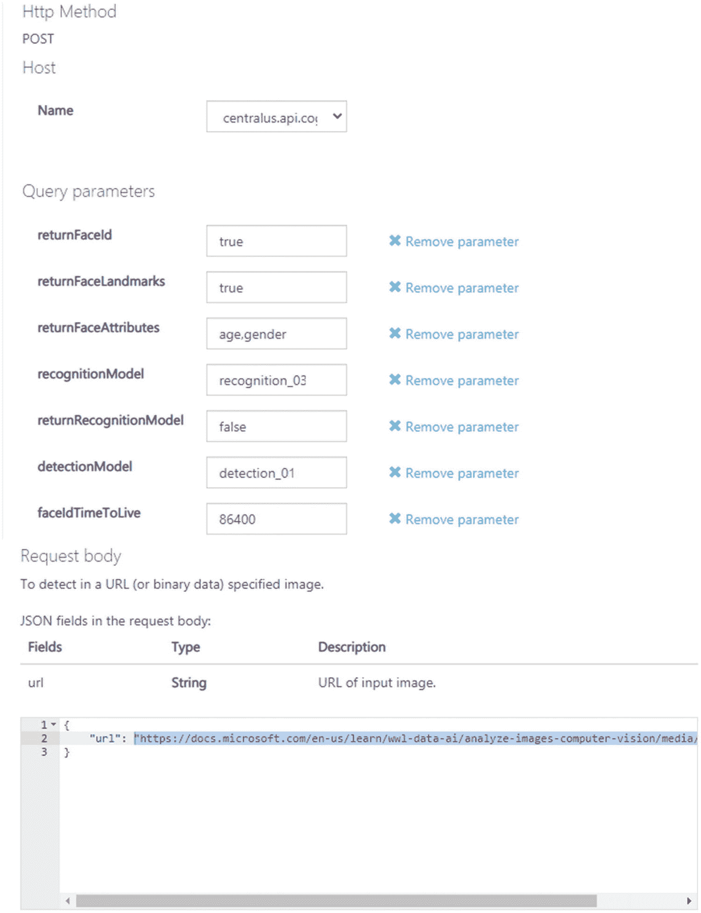

图 3-18

请求面部检测 API

Note

有预构建的检测模型来识别或分析人脸 API 的人脸 detection _ 01、detection_02 和 detection_03。确保在比较或识别相似人脸时使用相同的检测模型。在演示示例中，我们使用 detection_01 模型。

如果您的请求有效并被执行，它将返回类似于清单 [3-8](#PC8) 中所示的结果。

```py
[{
  "faceId": "0edfbefe-a73a-4143-b6bb-f722d39f97db",
  "faceRectangle": {
    "top": 45,
    "left": 195,
    "width": 42,
    "height": 42
  },
  "faceLandmarks": {
    "pupilLeft": {
      "x": 204.3,
      "y": 59.6
    },
    "pupilRight": {
      "x": 222.5,
      "y": 54.8
    },
    "noseTip": {
      "x": 220.4,
      "y": 66.9
    },
    "mouthLeft": {
      "x": 209.6,
      "y": 78.4
    },
    "mouthRight": {
      "x": 226.3,
      "y": 74.1
    },
    "eyebrowLeftOuter": {
      "x": 193.1,
      "y": 57.8
    },
    "eyebrowLeftInner": {
      "x": 210.0,
      "y": 51.9
    },
    "eyeLeftOuter": {
      "x": 200.3,
      "y": 60.8
    },
    "eyeLeftTop": {
      "x": 203.4,
      "y": 58.8
    },
    "eyeLeftBottom": {
      "x": 203.8,
      "y": 60.9
    },
    "eyeLeftInner": {
      "x": 207.3,
      "y": 59.3

    },
    "eyebrowRightInner": {
      "x": 217.4,
      "y": 50.5
    },
    "eyebrowRightOuter": {
      "x": 226.6,
      "y": 46.7
    },
    "eyeRightInner": {
      "x": 219.2,
      "y": 55.7
    },
    "eyeRightTop": {
      "x": 221.9,
      "y": 53.9
    },
    "eyeRightBottom": {
      "x": 222.4,
      "y": 55.7
    },
    "eyeRightOuter": {
      "x": 224.9,
      "y": 53.9

    },
    "noseRootLeft": {
      "x": 211.4,
      "y": 58.3
    },
    "noseRootRight": {
      "x": 217.3,
      "y": 56.6
    },
    "noseLeftAlarTop": {
      "x": 213.5,
      "y": 65.5
    },
    "noseRightAlarTop": {
      "x": 221.4,
      "y": 63.0
    },
    "noseLeftAlarOutTip": {
      "x": 211.9,
      "y": 69.3
    },
    "noseRightAlarOutTip": {
      "x": 225.1,
      "y": 65.4
    },
    "upperLipTop": {
      "x": 220.3,
      "y": 73.8
    },
    "upperLipBottom": {
      "x": 220.6,
      "y": 75.4
    },
    "underLipTop": {
      "x": 221.3,
      "y": 79.1
    },
    "underLipBottom": {
      "x": 222.2,
      "y": 81.5

    }
  },
  "faceAttributes": {
    "gender": "female",
    "age": 25.0
  }
}]

Listing 3-8Detecting a face analysis response

```

在这里，Face API 使用以下属性来标识人脸:性别是女性，年龄是 25 岁。

#### 使用演示页面进行测试

如果您想分析产品，Face API 的产品概述页面为您提供了一个演示页面。为了展示人脸检测的强大功能，在演示页面中，我们使用了作者简介图片(Gaurav 的)。人脸 API 识别照片中的人脸，如图 [3-19](#Fig19) 所示。

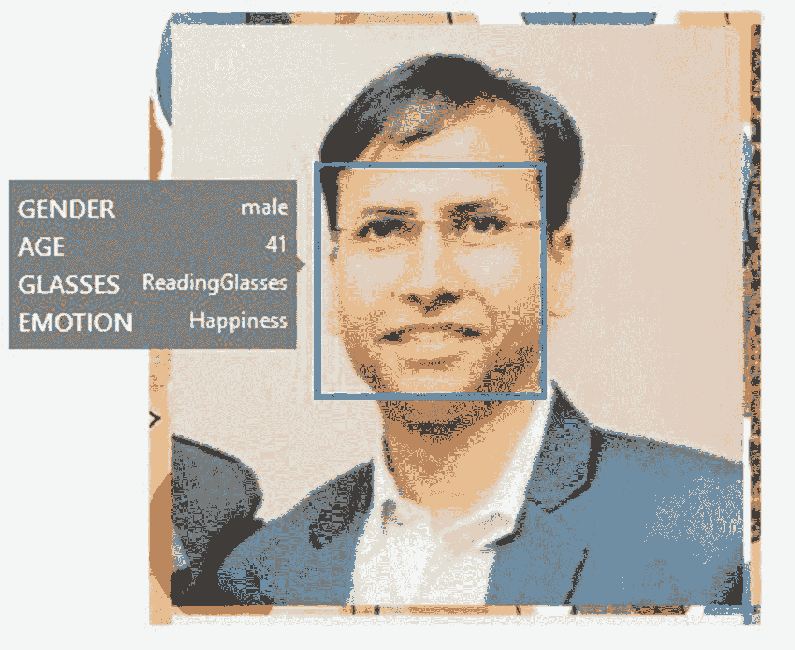

图 3-19

人脸检测

清单 [3-9](#PC9) 中详细显示了分析数据。它提供了几乎所有可能的属性。

```py
[
  {
    "faceId": "fef6dba7-6d8d-4825-aa08-8417aa29b563",
    "faceRectangle": {
      "top": 83,
      "left": 92,
      "width": 130,
      "height": 130
    },
    "faceAttributes": {
      "hair": {
        "bald": 0.1,
        "invisible": false,
        "hairColor": [
          {
            "color": "black",
            "confidence": 0.99
          },
          {
            "color": "brown",
            "confidence": 0.65
          },
          {
            "color": "gray",
            "confidence": 0.52

          },
          {
            "color": "other",
            "confidence": 0.44
          },
          {
            "color": "blond",
            "confidence": 0.11
          },
          {
            "color": "red",
            "confidence": 0.03
          },
          {
            "color": "white",
            "confidence": 0.0
          }
        ]
      },
      "smile": 0.999,
      "headPose": {
        "pitch": -0.8,
        "roll": -1.8,
        "yaw": -8.6
      },
      "gender": "male",
      "age": 41.0,
      "facialHair": {
        "moustache": 0.1,
        "beard": 0.1,
        "sideburns": 0.1
      },
      "glasses": "ReadingGlasses",
      "makeup": {
        "eyeMakeup": false,
        "lipMakeup": false

      },
      "emotion": {
        "anger": 0.0,
        "contempt": 0.0,
        "disgust": 0.0,
        "fear": 0.0,
        "happiness": 0.999,
        "neutral": 0.001,
        "sadness": 0.0,
        "surprise": 0.0
      },
      "occlusion": {
        "foreheadOccluded": false,
        "eyeOccluded": false,
        "mouthOccluded": false
      },
      "accessories": [],
      "blur": {
        "blurLevel": "medium",
        "value": 0.63
      },
      "exposure": {
        "exposureLevel": "overExposure",
        "value": 0.82
      },
      "noise": {
        "noiseLevel": "medium",
        "value": 0.39
      }
    },
    "faceLandmarks": {
      "pupilLeft": {
        "x": 130.0,
        "y": 120.2
      },
      "pupilRight": {
        "x": 184.2,
        "y": 117.2
      },
      "noseTip": {
        "x": 156.5,
        "y": 153.2
      },
      "mouthLeft": {
        "x": 128.0,
        "y": 180.4

      },
      "mouthRight": {
        "x": 183.9,
        "y": 177.6
      },
      "eyebrowLeftOuter": {
        "x": 110.7,
        "y": 110.2
      },
      "eyebrowLeftInner": {
        "x": 146.7,
        "y": 110.1
      },
      "eyeLeftOuter": {
        "x": 120.8,
        "y": 122.1
      },
      "eyeLeftTop": {
        "x": 128.5,
        "y": 116.5
      },
      "eyeLeftBottom": {
        "x": 129.1,
        "y": 123.4
      },
      "eyeLeftInner": {
        "x": 136.9,
        "y": 120.9
      },
      "eyebrowRightInner": {
        "x": 167.4,
        "y": 109.1
      },
      "eyebrowRightOuter": {
        "x": 201.1,
        "y": 107.3
      },
      "eyeRightInner": {
        "x": 176.2,
        "y": 119.3
      },
      "eyeRightTop": {
        "x": 183.1,
        "y": 113.8

      },
      "eyeRightBottom": {
        "x": 184.4,
        "y": 120.6
      },
      "eyeRightOuter": {
        "x": 192.2,
        "y": 117.7
      },
      "noseRootLeft": {
        "x": 148.6,
        "y": 122.2
      },
      "noseRootRight": {
        "x": 164.1,
        "y": 121.8
      },
      "noseLeftAlarTop": {
        "x": 144.6,
        "y": 143.8
      },
      "noseRightAlarTop": {
        "x": 169.5,
        "y": 142.9
      },
      "noseLeftAlarOutTip": {
        "x": 137.6,
        "y": 155.3
      },
      "noseRightAlarOutTip": {
        "x": 175.8,
        "y": 153.2
      },
      "upperLipTop": {
        "x": 155.1,
        "y": 170.1
      },
      "upperLipBottom": {
        "x": 155.4,
        "y": 175.1

      },
      "underLipTop": {
        "x": 154.8,
        "y": 185.7
      },
      "underLipBottom": {
        "x": 155.5,
        "y": 192.7
      }
    }
  }
]

Listing 3-9Face detection analysis data

```

如果我们查看数据，那么我们可以很容易地说，这张脸属于一个 41 岁的男性，黑色头发，戴着老花镜，脸上带着微笑。

#### 使用代码实现它

在这些 API 的帮助下，很容易将 API 集成到现有代码中，或者您可以编写一个新的应用来分析人脸。在这一节中，我们包含了一个小演示来帮助您理解代码和 API 的强大功能。您可以在资源库的[资源库的 URL 中找到完整的代码。

我们创建了一个 Visual Studio 项目。(请参考上一节回忆我们是如何构建 Visual Studio 项目的。)一旦你创建了项目，打开 NuGet 包管理器并搜索包 **Microsoft。azure . cognitive services . vision . face**。点击右窗格中的**安装**，如图 [3-20](#Fig20) 所示。


图 3-20

添加 NuGet 包

之前，您创建了一个客户端来调用 Face API，并且添加了一个名称空间。参见清单 [3-10](#PC10) 。这个名称空间将帮助您解析所有的引用，因此您可以轻松地创建一个 face client。

```py
using Microsoft.Azure.CognitiveServices.Vision.Face;

Listing 3-10Namespace

```

让我们创建一个面部客户端。您需要一个有效的订阅密钥。编写创建客户机的方法，如清单 [3-11](#PC11) 所示。

```py
private static FaceClient AuthenticatedClient(string endpoint, string subscriptionKey)
{
    ApiKeyServiceClientCredentials clientCredentials = new ApiKeyServiceClientCredentials(subscriptionKey);
    return new FaceClient(clientCredentials) { Endpoint = endpoint };
}

Listing 3-11Creating a face client

```

这里，我们使用 subscriptionkey 作为客户端的凭证。然后我们提供端点来创建 FaceClient。

让我们执行一个简单的面部检测。这将通过获取识别出的面部在图像中的位置来提供该面部的概观。在我们编写代码开始分析之前，我们必须添加一些名称空间，如清单 [3-12](#PC12) 所示。

```py
using Microsoft.Azure.CognitiveServices.Vision.Face;
using Microsoft.Azure.CognitiveServices.Vision.Face.Models;

Listing 3-12Face model namespaces

```

模型的名称空间将允许您访问包含分析数据的 DetectedFace 模型。我们通过使用我们的 face 客户端向 API 添加了一个简单的调用。我们使用了一个带有清单 [3-13](#PC13) 中所示 URL 的图像。完整的例子可以在 GitHub ( [`https://github.com/Apress/hands-on-azure-cognitive-services/tree/main/Chapter%2003/Chap3FaceAnalysis`](https://www.github.com/Apress/hands-on-azure-cognitive-services/tree/main/Chapter%252003/Chap3FaceAnalysis) )上找到。

```py
IList<DetectedFace> faces = await client.Face.DetectWithUrlAsync(url: imgURL, returnFaceId: true, detectionModel: DetectionModel.Detection02);

Listing 3-13Requesting a Face API

```

在这段代码中，Detection02 是一个预定义的检测模型。对于我们的演示示例，您可以使用 Detection01 或 Detection02。有两种请求方法，DetectWithUrlAsync 和 DetectWithStreamAsync。第一种方法从提供的 URL 检测图像中的人脸。第二个方法(DetectWithStreamAsync)需要一个图像流。(当您构建用户界面来上传图像时，这一点很重要。)清单 [3-14](#PC14) 展示了如何从从 API 返回的 DetectedFace 模型列表中检索数据。

```py
foreach (var face in faces)
{
    FaceRectangle rect = face.FaceRectangle;
    Console.WriteLine($"Face:{face.FaceId} is located in the image in marked point having dimensions: height-{rect.Height} width-{rect.Width} which is available from Top-{rect.Top} Left-{rect.Left}.");

}

Listing 3-14Information about the detected face

```

运行项目。结果应该类似于图 [3-21](#Fig21) 所示。


图 3-21

面部分析输出

### 了解用于视频分析的 Vision APIs 的工作行为

视频索引服务帮助我们提供视频分析。这将自动从视频(运动图形)中提取元数据，如单词、书面文本、面孔、发言者和名人的身份。在下面的例子中，我们将使用 Azure 认知服务，通过使用 OpenCVSharp 包，近乎实时地分析来自网络摄像头的视频帧:

1.  第一步，从 GitHub <sup>[2](#Fn2)</sup> 中克隆资源库，如图 [3-22](#Fig22) 所示。您将在存储库的 Windows 文件夹中找到这两个应用。


图 3-22

认知样本视频帧分析 GitHub 知识库


图 3-23

在 Azure 门户上创建资源

1.  接下来，打开 Azure 门户，为计算机视觉创建一个资源。点击**创建资源**按钮，如图 [3-23](#Fig23) 所示。

在搜索栏中搜索并选择**计算机视觉**资源类型。


图 3-24

创建资源-选择计算机视觉

现在点击**创建**按钮来创建你的计算机视觉资源。

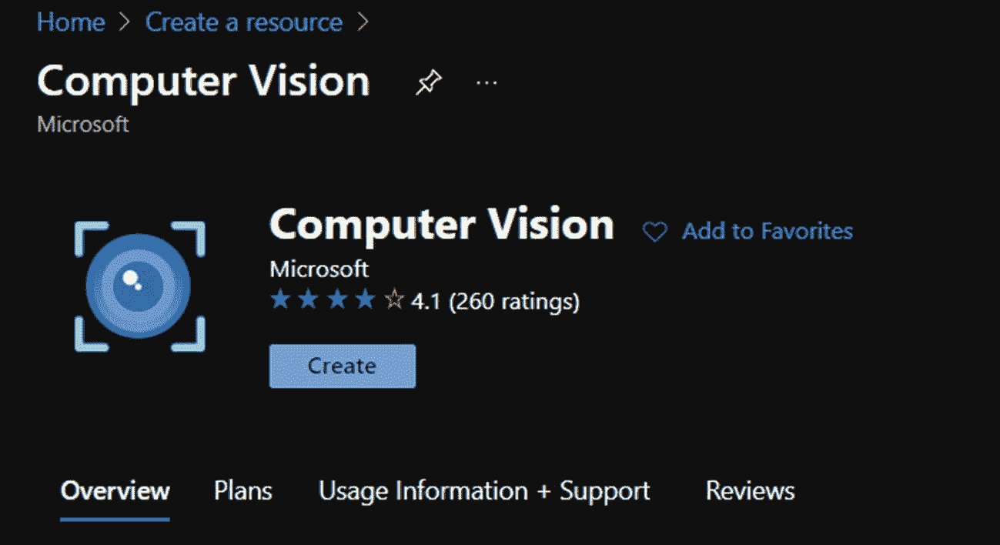

图 3-25

创建资源

这会将您带到“创建计算机视觉资源”页面。在这里，您可以通过提供您的订阅、资源组等相关信息来创建计算机视觉资源(如图 [3-26](#Fig26) 所示)。


图 3-26

创建计算机视觉资源

一旦您选择并完成了详细信息，点击**审查+创建**按钮(如图 [3-27](#Fig27) 所示)以验证您提供的信息。


图 3-27

“审阅+创建”按钮

验证信息后，单击**创建**启动并部署计算机视觉资源。


图 3-28

验证创建的资源

然后您将看到部署正在进行的通知(如图 [3-29](#Fig29) 所示)，之后您将能够使用该服务。

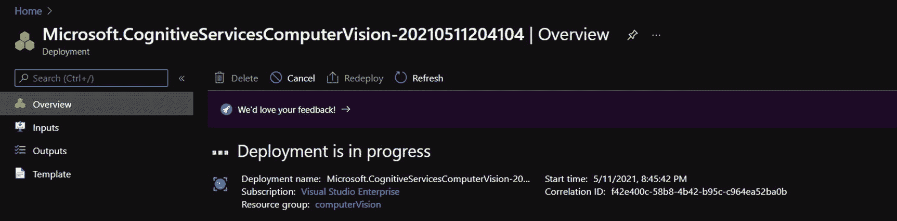

图 3-29

正在部署计算机视觉资源

1.  In this step, you will create another resource in the Azure portal. This will be the Face API, which you’ll use for face detection. See Figure [3-30](#Fig30).

    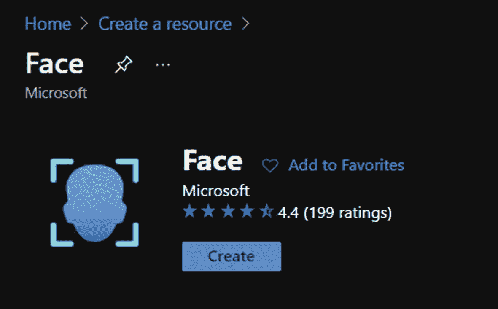

    图 3-30

    创建面部资源

其余的步骤与前面所示的创建资源的步骤相同。Face API 部署将需要几分钟时间。图 [3-31](#Fig31) 显示了正在进行的工作面资源部署。


图 3-31

工作面资源调配进行中

1.  现在您已经创建了服务，让我们使用 Visual Studio 从本地机器的目标文件夹中打开克隆的存储库。

    Within Visual Studio, click **File**, **Open**, and **Folder** (as shown in Figure [3-32](#Fig32)).

    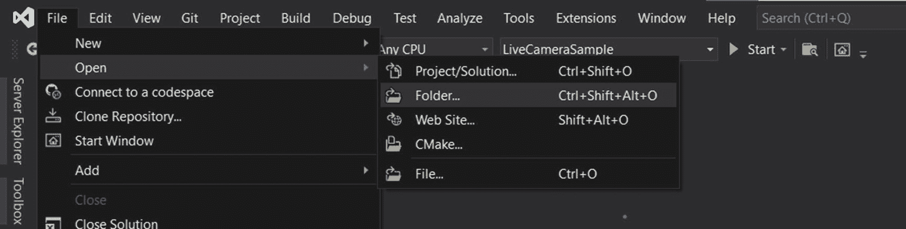

    图 3-32

    从下载的存储库中打开解决方案文件夹

通过打开该解决方案，您现在将在您的解决方案资源管理器中看到这些文件(如图 [3-33](#Fig33) 所示)。


图 3-33

从下载的存储库中打开解决方案文件夹

展开 Windows 文件夹，然后点击 **VideoFrameAnalysis.sln** 文件(如图 [3-34](#Fig34) )。

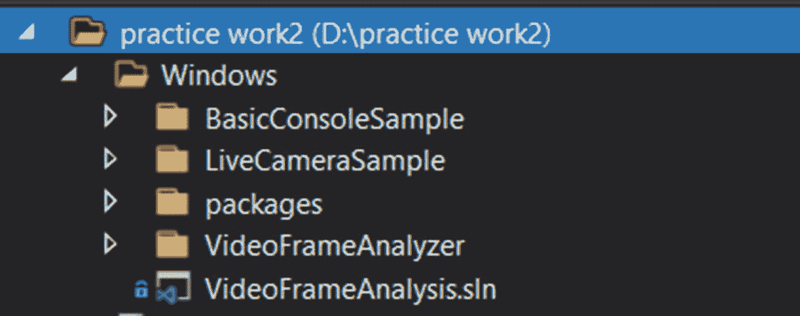

图 3-34

打开 VideoFrameAnalysis.sln 文件

双击 **LiveCameraSample** 进行加载。


图 3-35

LiveCameraSample 项目

Nuget 是. NET 的包管理器。要使用 camera 解决方案，您将需要认知服务包，这是一个用于与 Azure 认知服务一起工作的库。接下来，右键点击**解决方案‘video frame analysis’**选项，然后点击**管理解决方案**的 NuGet 包……(如图 [3-36](#Fig36) )。

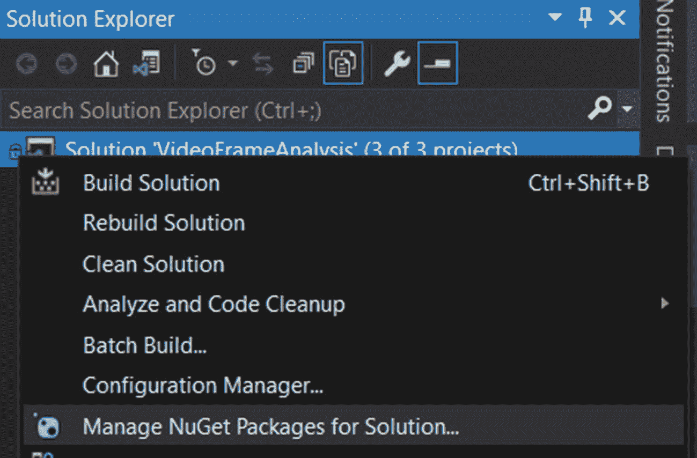

图 3-36

管理解决方案的 NuGet 包

此时，尝试恢复解决方案所需的所有 NuGet 包，然后验证它们是否已安装，如图 [3-37](#Fig37) 所示。


图 3-37

管理解决方案的 NuGet 包

如图 [3-37](#Fig37) 所示，包装不包括计算机视觉包装。在您恢复包之后，Nuget 将看起来如图 [3-38](#Fig38) 所示。请忽略包装折旧警告。

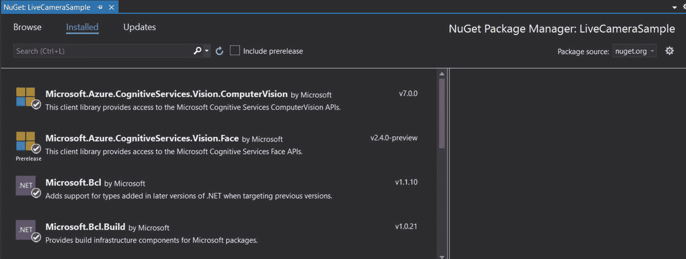

图 3-38

恢复的包

1.  In the Basic Console Sample, the Face API key is hard-coded directly in the BasicConsoleSample/Program.cs file. See Figure [3-39](#Fig39).

    

    图 3-39

    基本控制台示例。程序 cs 文件

从 Azure 门户、从您之前创建的 Face 资源中获取 API 密钥和端点(如图 [3-40](#Fig40) 所示)。


图 3-40

Azure 门户上的 Face API 密钥和端点

完成后，运行 BasicConsoleSample 文件，该文件将从网络摄像头读取帧。结果将如图 [3-41](#Fig41) 所示。


图 3-41

运行基本控制台示例并获取帧

接下来，运行 LiveCameraSample。它的 UI 要求您输入我们之前创建的 Face 和 Vision APIs 的 API 键和端点。见图 [3-42](#Fig42) 。复制粘贴按键，然后点击**保存**。


图 3-42

运行实时摄像机样本

选择特定模式，然后点击**启动摄像头**。见图 [3-43](#Fig43) 。


图 3-43

运行实时摄像机样本

这里，我们使用了名人模式。不出所料，程序识别出了我们的比尔·盖茨的照片(如图 [3-44](#Fig44) )。


图 3-44

运行现场摄像机样本-名人模式

同样，对于其他模式(如用于物体检测的标签)，您可以将家居用品放入图像中(如图 [3-45](#Fig45) )。

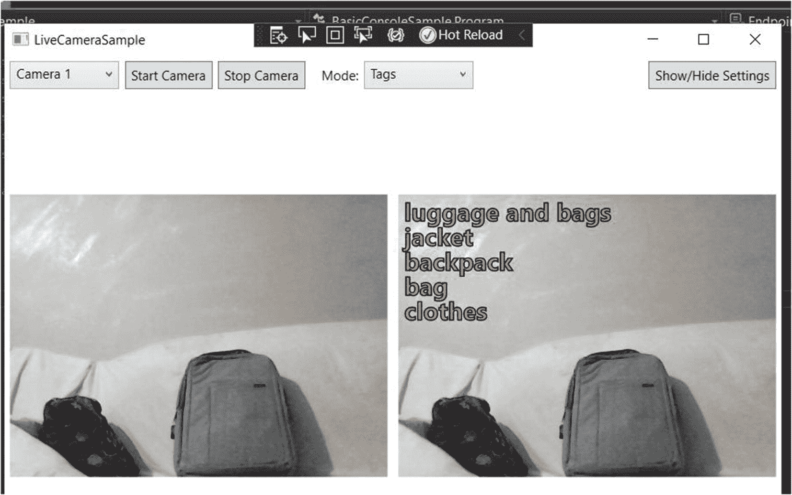

图 3-45

运行实时摄像机样本–标签模式

在本例中，您可以看到如何捕捉实时摄像机馈送。您可以使用认知服务和人脸 API 来检测人脸和物体。在下一个例子中，我们将使用视频索引器服务从视频中提取信息。

## Microsoft Azure 视频索引器

Microsoft Azure Video Indexer 是 Azure Media Services 的一部分，它也建立在认知搜索和其他 Azure 认知服务(如 Face API、Microsoft Translator、计算机视觉 API 和自定义语音)的基础上。它为您提供了从视频和音频内容中自动提取高级元数据的能力。要开始，请按照下列步骤操作:

1.  Visit the Video Indexer<sup>[3](#Fn3)</sup>, and then click **Start free** to begin the free trial. See Figure [3-46](#Fig46).

    

    图 3-46

    视频索引主页

使用您的 Microsoft 帐户登录。见图 [3-47](#Fig47) 。


图 3-47

视频索引器登录

使用您的 Microsoft 帐户登录后，您将看到如图 [3-48](#Fig48) 所示的屏幕。点击侧边栏上的**媒体文件**影片图标，添加您的视频文件。


图 3-48

视频索引器–提取见解并增强您的内容

点击左侧栏的**模型定制**设置图标，添加待识别人员。在这种情况下，我们上传了 ISG 自动化峰会伦敦 <sup>[4](#Fn4)</sup> 的一个讲座的视频，然后选择了这个人。从右侧菜单中点击**添加人员**(如图 [3-49](#Fig49) )。

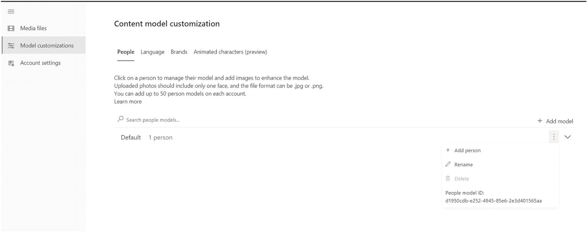

图 3-49

视频索引器–内容模型定制

此时，您将需要填写此人的详细信息。这项服务不能用于执法，因为微软决定不向警方出售其面部识别技术 <sup>[5](#Fn5)</sup> 。现在，您将上传视频中要识别的个人的照片。见图 [3-50](#Fig50) 。

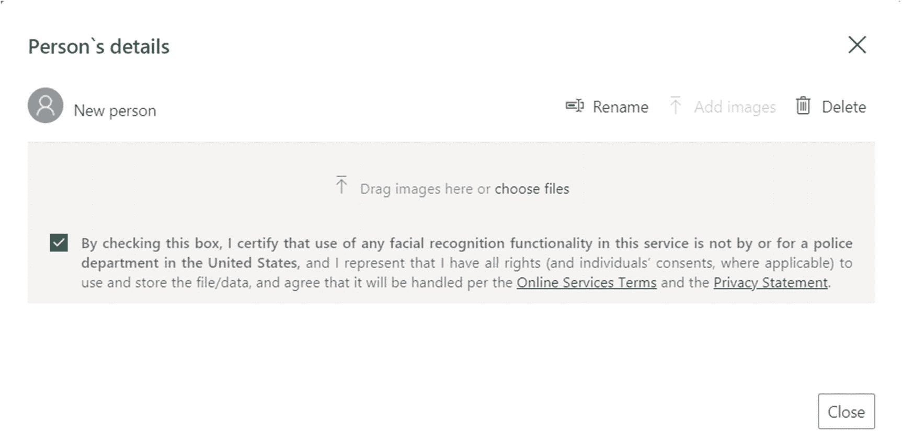

图 3-50

视频索引器-个人详细信息

照片上传后，人物 1 现在被添加到模型中，如图 [3-51](#Fig51) 所示。


图 3-51

视频索引器–添加人员

现在回到仪表板。点击**上传**上传需要索引的视频。点击**浏览文件**，浏览您系统中的文件(如图 [3-52](#Fig52) )。

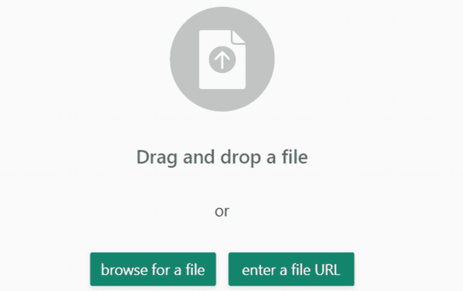

图 3-52

视频索引器–上传视频文件

然后上传文件并进行分析。这个过程需要一些时间(如图 [3-53](#Fig53) )。

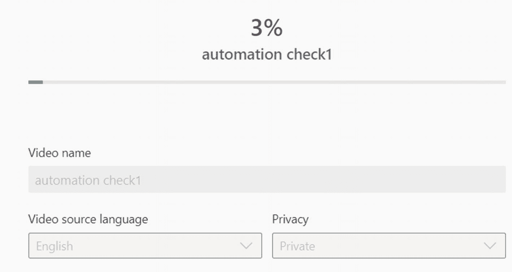

图 3-53

视频索引器–文件上传进度

成功完成后，您将在仪表板上看到分析后的视频。现在点击视频上的**播放**按钮(见图 [3-54](#Fig54) )。

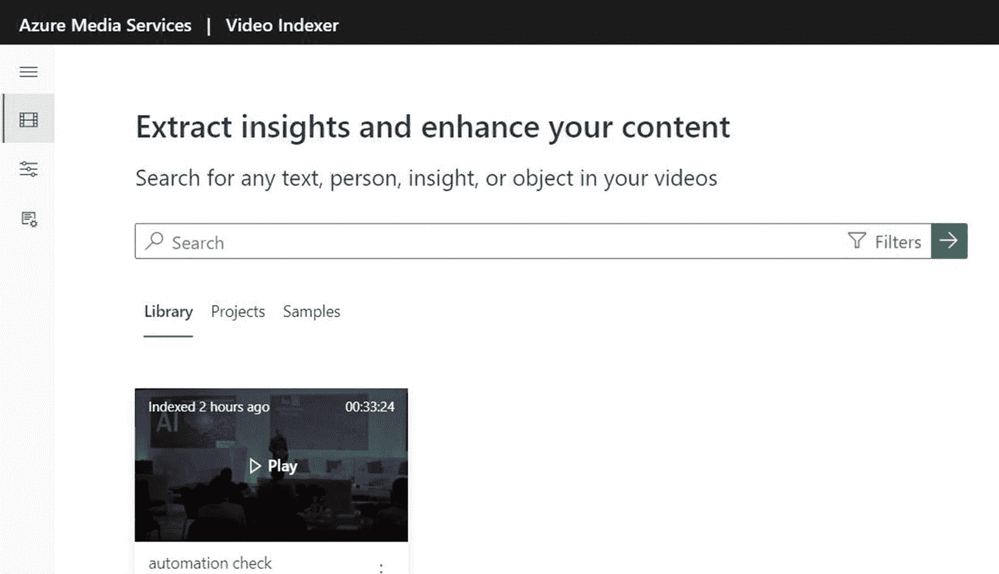

图 3-54

视频索引器–从视频中提取见解

如图 [3-55](#Fig55) 所示，视频索引器不仅识别出了个人，还识别出了视频中的其他几个人。


图 3-55

视频索引器识别出视频中的个人

通过这个丰富的视频，我们可以在视频中选择不同的洞察类别，例如识别一个对象、人、关键词等等。图 [3-56](#Fig56) 展示了时间线报告。

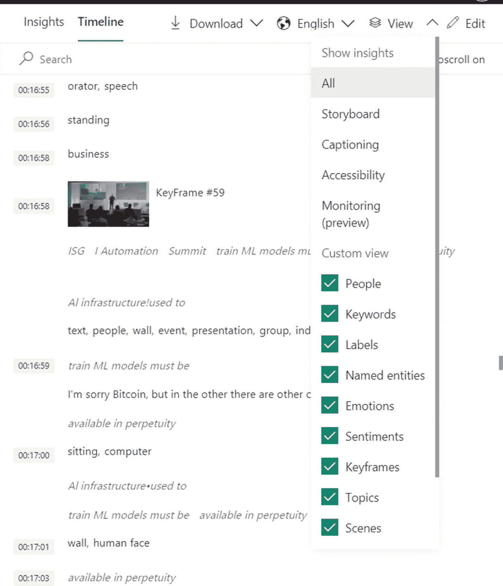

图 3-56

视频索引器洞察–时间线

视频索引器是一个全面而复杂的视频丰富产品，可用于媒体、新闻、娱乐、新闻等各种用例中。在这里，您已经看到了该服务的一些相当基本的功能，这些功能可以释放视频洞察力，以丰富您的视频，增强发现和提高参与度。特征集包括人脸检测、名人识别、自定义人脸识别、缩略图提取、文本识别、对象识别、视觉内容调节(检测露骨内容)、场景分割、镜头检测等等。

我们只能想象您、您的公司、您的客户以及世界各地的组织能够在多大程度上使用这项技术！

## 摘要

在本章中，我们解释了计算机视觉 API 和各种相关的 API。在这些特征的帮助下，我们可以识别人脸，并且可以对任何一组图像进行分析。我们可以捕捉数据，我们可以让文档变得可搜索。对于运动图形(视频)，视频索引器(与 Azure Media Services 相关联)为我们提供了识别音频、文字、语音者、书面内容等的工具。

在下一章，我们将继续 Azure 认知服务的讨论，我们将了解自然语言处理(NLP)。

<aside aria-label="Footnotes" class="FootnoteSection" epub:type="footnotes">Footnotes [1](#Fn1_source)

[T2`https://westus.dev.cognitive.microsoft.com/docs/services/56f91f2d778daf23d8ec6739/operations/56f91f2e778daf14a499e1fa`](https://westus.dev.cognitive.microsoft.com/docs/services/56f91f2d778daf23d8ec6739/operations/56f91f2e778daf14a499e1fa)

  [2](#Fn2_source)

[T2`https://github.com/microsoft/Cognitive-Samples-VideoFrameAnalysis`](https://github.com/microsoft/Cognitive-Samples-VideoFrameAnalysis)

  [3](#Fn3_source)

[T2`www.videoindexer.ai/account/login`](http://www.videoindexer.ai/account/login)

  [4](#Fn4_source)

UST 全球首席架构师 Adnan Masood 博士在伦敦[`www.youtube.com/watch?v=2Nv8NZiuotw&ab_channel=UST`](http://www.youtube.com/watch%253Fv%253D2Nv8NZiuotw%2526ab_channel%253DUST)ISG 自动化峰会上发言

  [5](#Fn5_source)

[T2`www.washingtonpost.com/technology/2020/06/11/microsoft-facial-recognition/`](http://www.washingtonpost.com/technology/2020/06/11/microsoft-facial-recognition/)

 </aside>