# 4.语言——理解非结构化文本和模型

智能应用程序可以理解用户的输入。用户可以通过键盘、麦克风或任何其他外部设备提供输入。这些系统非常智能，可以与用户互动。

本章的目的是从自然语言处理(NLP)开始，并创建一个可以与其用户交互的智能应用程序。有很多种方法来训练和准备系统，以便它可以与用户交互。

在本章中，我们将涵盖以下主题:

*   创建和理解语言模型

*   认知服务的培训和丰富

*   布偶模型 NLP 的变形金刚

*   基于微调 BERT 的命名实体识别

*   语言 API 概述

## 创建和理解语言模型

大多数企业数据都是非结构化的，这并不奇怪。能够理解文档中单词含义的算法需求巨大。自从 transformer networks 出现以来，自然语言处理领域在任务方面已经有了显著的改进，例如理解、问答、摘要、主题建模、机器翻译、情感分析、文本生成、信息检索和关系提取。这些自然语言处理任务的多样性取决于我们在企业中处理的文档类型。

培训企业语言模型需要理解多种模态，以及与多种文档类型相关的细微差别。大多数非结构化数据来自电子邮件、wiki(SharePoint、confluence 等)和其他官方文档，如客户协议、供应商协议、NDA、员工合同、贷款和租赁文档、投资和合规性文档、修订、采购订单、工作订单等。这些文件在术语、行话、术语以及结构和形式上各不相同。语言模型还必须处理法律文档和具有治理和审计需求的文档，例如期限和终止、机密性、责任限制、赔偿、管辖法律、转让、通知和条款，例如不征求和不竞争。如果在通用环境中应用，提取这样的法律条款可能是一项具有挑战性的任务。一个自然语言处理流水线由多个步骤组成，如图 [4-1](#Fig1) 所示。

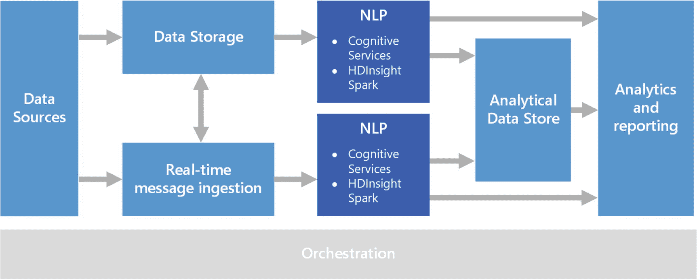

图 4-1

一个端到端的自然语言处理管道——感谢 [`https://docs.microsoft.com/en-us/azure/architecture/data-guide/technology-choices/natural-language-processing`](https://docs.microsoft.com/en-us/azure/architecture/data-guide/technology-choices/natural-language-processing)

典型的语言管道处理多模态数据格式和存储，以及 NLP 引擎，这是整个端到端生命周期的一部分。例如，这种语言模型的一个重要用例可能需要实体识别。这可能超出了典型的主语、宾语和动词对，而是与业务和合同实体有关。这些信息包括文档标题、当事人姓名和地址、生效日期、条款和法律条款、费用、共付额等等。一旦识别和提取出来，您就可以分析这些实体，并将其呈现在业务报告中，转化为可操作的项目。例如，如果您想知道某个特定的有限责任公司何时到期(以便向您的客户发送警报)，您可以使用提取的提交日期，并在到期前 30、60 和 90 天创建一个警报，让客户知道。

随着行业的成熟，企业现在寻求结果驱动的端到端解决方案，并完成自动化“工作”(更大的任务组)，而不是由人工智能执行的单独、零碎的任务。在下一个例子中，我们将使用一个演示来展示这种非结构化的文本丰富是如何工作的。

## 浓缩正在进行中——JFK 文件演示

为了展示认知服务和 Azure 机器学习的力量，微软采用了 JFK 文件的复杂数据集，并制作了一个令人印象深刻的演示(见 [`www.microsoft.com/ai/ai-lab-jfk-files`](http://www.microsoft.com/ai/ai-lab-jfk-files) )。在本例中，我们将向您展示演示是如何工作的，以及您如何为自己重新创建它。图 [4-2](#Fig2) 显示了端到端的丰富模型，从 blob 存储开始，复杂的文件(如照片、手写和非机密文档)存储在这里。然后，使用认知搜索来提取信息。

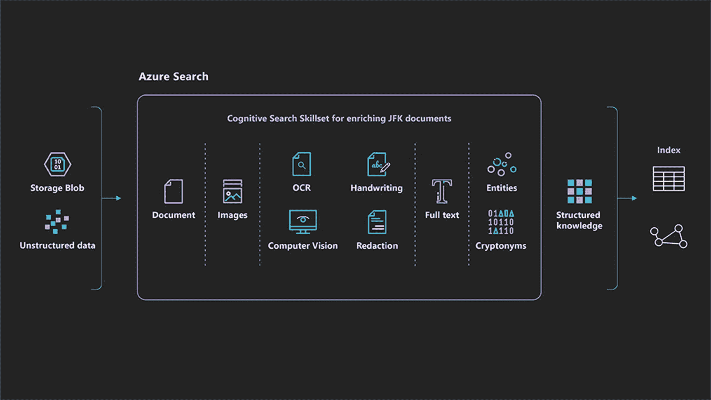

图 4-2

Azure 搜索 JFK 文件——承蒙 [`https://github.com/microsoft/AzureSearch_JFK_Files`](https://github.com/microsoft/AzureSearch_JFK_Files)

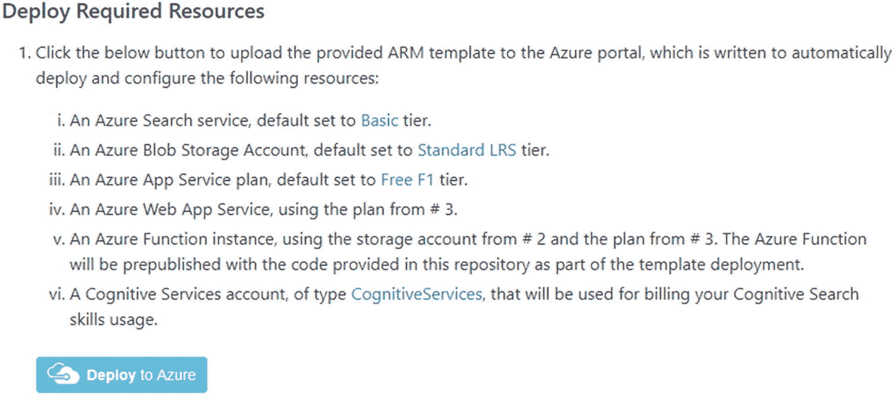

图 4-3

JFK 文件 Azure 搜索的 ARM 部署——由 [`https://github.com/microsoft/AzureSearch_JFK_Files`](https://github.com/microsoft/AzureSearch_JFK_Files) 提供

1.  为了将基础设施实现为 Azure 解决方案的代码，该示例包括 Azure 资源管理器模板(通常称为 ARM 模板)。在这种情况下，您将部署 ARM 模板来在 Azure 上设置项目，而您执行其余的配置步骤。在 [`https://github.com/microsoft/AzureSearch_JFK_Files`](https://github.com/microsoft/AzureSearch_JFK_Files) 可以找到部署链接，如图 [4-3](#Fig3) 所示。

图 4-4

Azure 门户自定义部署

1.  部署自定义模板的一个步骤是为其创建设置。点击**部署到 Azure** 按钮。自定义部署画面打开，如图 [4-4](#Fig4) 所示。然后选择并设置区域、资源前缀、托管计划、搜索服务等，如图 [4-4](#Fig4) 所示。

点击 **Create new** 并选择一个资源组，这是一个包含所有相关资源的容器。见图 [4-5](#Fig5) 。

图 4-5

创建新资源

点击**审核+创建**继续，如图 [4-6](#Fig6) 所示。

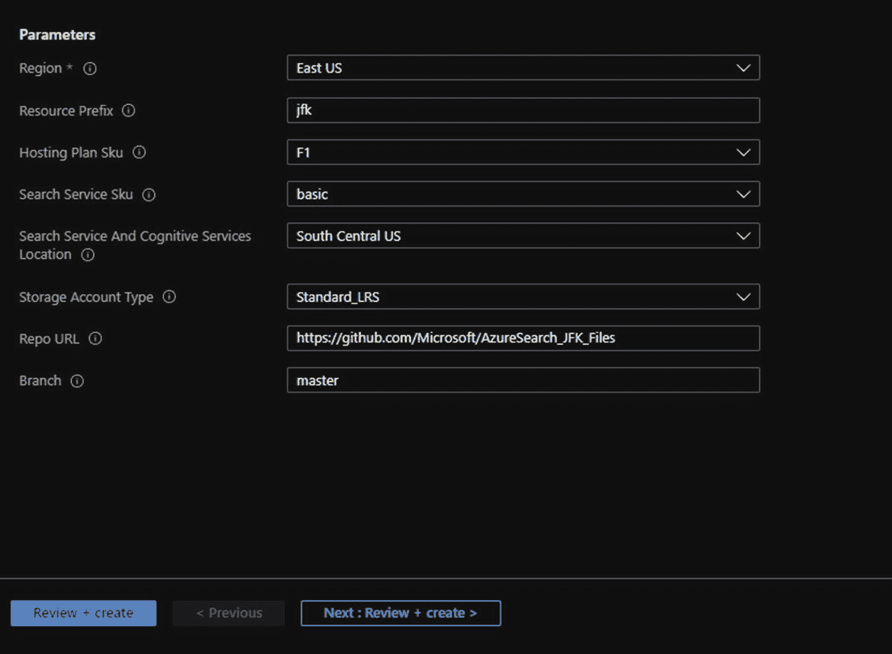

图 4-6

点击查看+创建

查看订阅信息，然后点击**创建**，如图 [4-7](#Fig7) 所示。

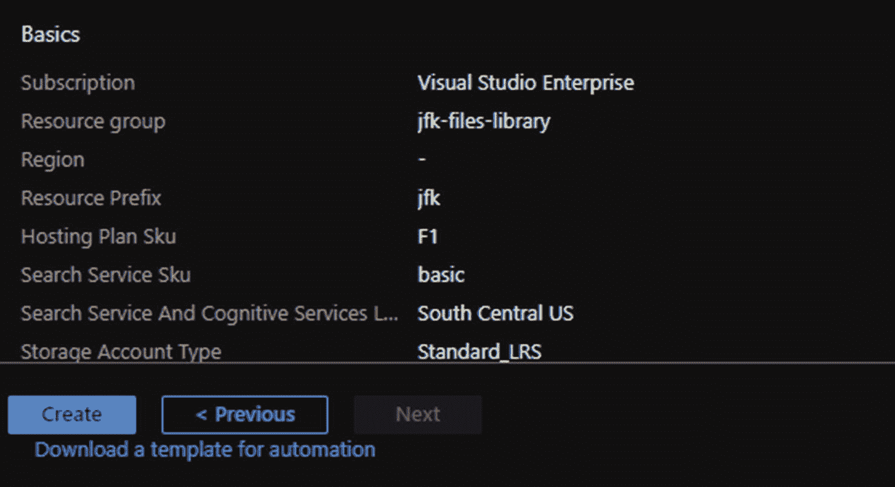

图 4-7

创建资源的最后一步

一旦创建了部署，您将看到它正在提交部署的通知，如图 [4-8](#Fig8) 所示。

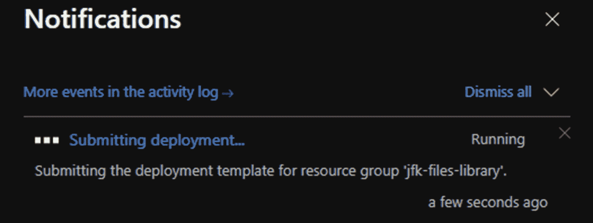

图 4-8

通知部署正在进行中

部署完成后，您会看到部署成功通知，如图 [4-9](#Fig9) 所示。

图 4-9

部署成功通知

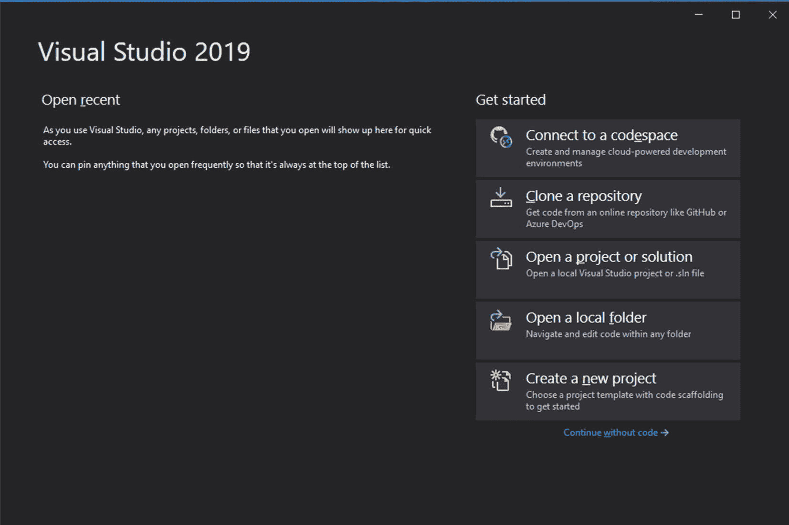

图 4-10

打开 Visual Studio

1.  打开 Visual Studio(如图 [4-10](#Fig10) ，然后在 GitHub 上从 [`https://github.com/microsoft/AzureSearch_JFK_Files`](https://github.com/microsoft/AzureSearch_JFK_Files) 克隆资源库。

点击**文件**标签，点击**打开**，然后点击**项目/解决方案**(如图 [4-11](#Fig11) )。

图 4-11

打开项目

一旦库被克隆，从**jfkwebaiskills**Visual Studio 解决方案文件中打开项目目录(如图 [4-12](#Fig12) )。

图 4-12

打开 JfkWebApiSkills 解决方案文件

接下来，在解决方案浏览器中，编辑 **App.config** 文件(如图 [4-13](#Fig13) )。

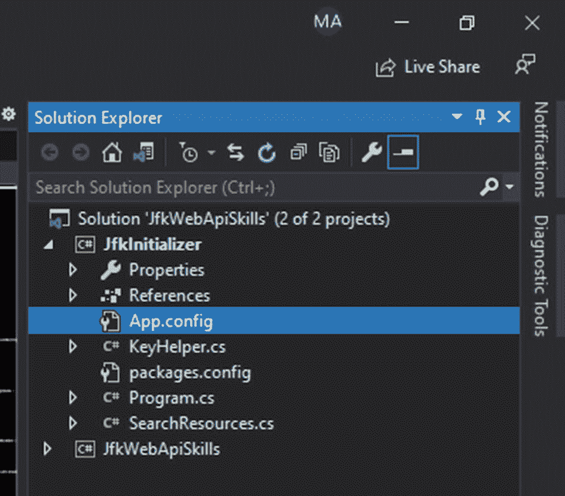

图 4-13

选择 App.config 文件

现在点击 Azure 控制台中的**输出**选项卡，如图 [4-14](#Fig14) 所示。该选项卡位于模板的部署屏幕中。

图 4-14

“输出”选项卡

然后您将看到模板信息，以及所有的键和字符串(如图 [4-15](#Fig15) 所示)。

图 4-15

模板输出屏幕

将除 SearchServiceQueryKey 以外的值复制并粘贴到 config key 设置中。参见图 [4-16](#Fig16) 。

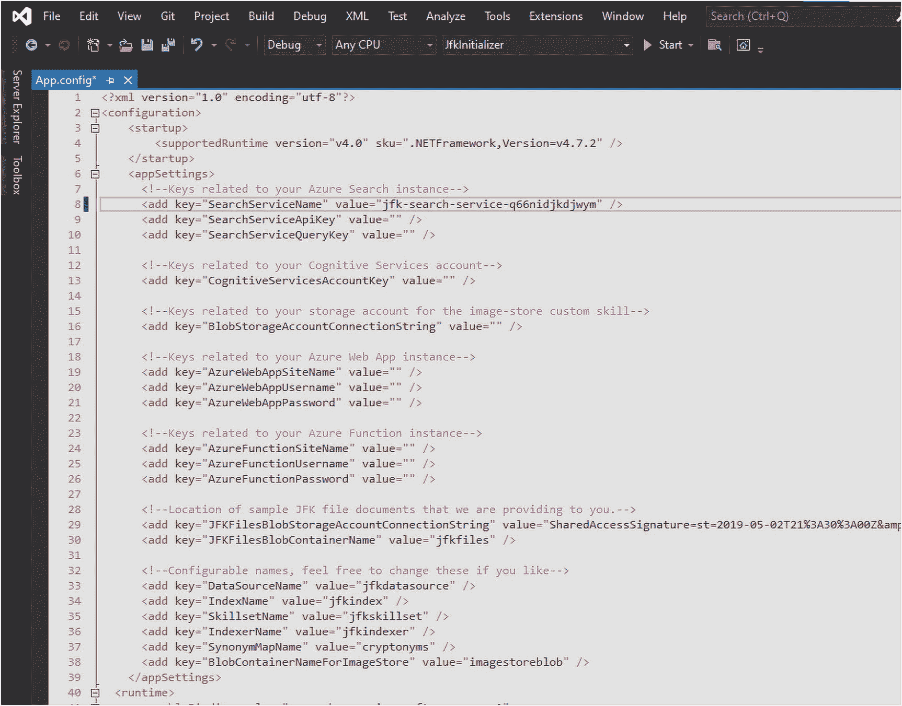

图 4-16

粘贴应用程序配置文件中的值

您需要从 deployed 部分获取 SearchServiceQueryKey 值。部署时，点击**总览**页签，如图 [4-17](#Fig17) 所示。

图 4-17

获取 SearchServiceQueryKey 值

选择已部署的服务(如图 [4-18](#Fig18) ，然后点击右边的**操作细节**。

图 4-18

选择部署的服务

在详细画面中，点击设置下左侧菜单中的**键**(如图 [4-19](#Fig19) )。复制 SearchServiceQueryKey 值，然后将其粘贴到应用程序配置文件中。

图 4-19

钥匙选项

现在构建 API 解决方案，这将创建应用程序密钥(如图 [4-20](#Fig20) 所示)。在运行以下 npm 步骤后，您将返回到此窗口。

图 4-20

API 解决方案中的设置键

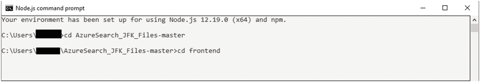

图 4-21

将目录更改为下载的文件夹

1.  下一步是构建 web 应用程序，该应用程序是用 Node.js 构建的。见图 [4-21](#Fig21) 。

运行 **npm install** 命令构建应用(如图 [4-22](#Fig22) )。它将获得所有的依赖项。

图 4-22

运行命令 npm install

一旦 npm 安装完成，运行 **npm run build:prod** 命令来运行 web 应用程序，这将构建和部署 web 应用程序。见图 [4-23](#Fig23) 。

图 4-23

运行命令，npm 运行 build:prod

接下来，从步骤 3(概述)返回到上一个屏幕，然后按任意键完成构建(如图 [4-24](#Fig24) )。然后导航到控制台中的 URL，打开 web 应用程序。

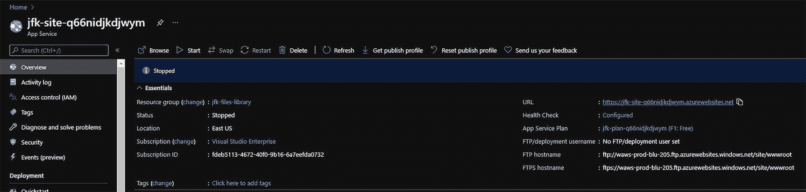

图 4-24

返回上一个屏幕以完成构建

构建和部署现在已经完成，可以访问相关的 JFK 文件应用程序，如图 [4-25](#Fig25) 所示。

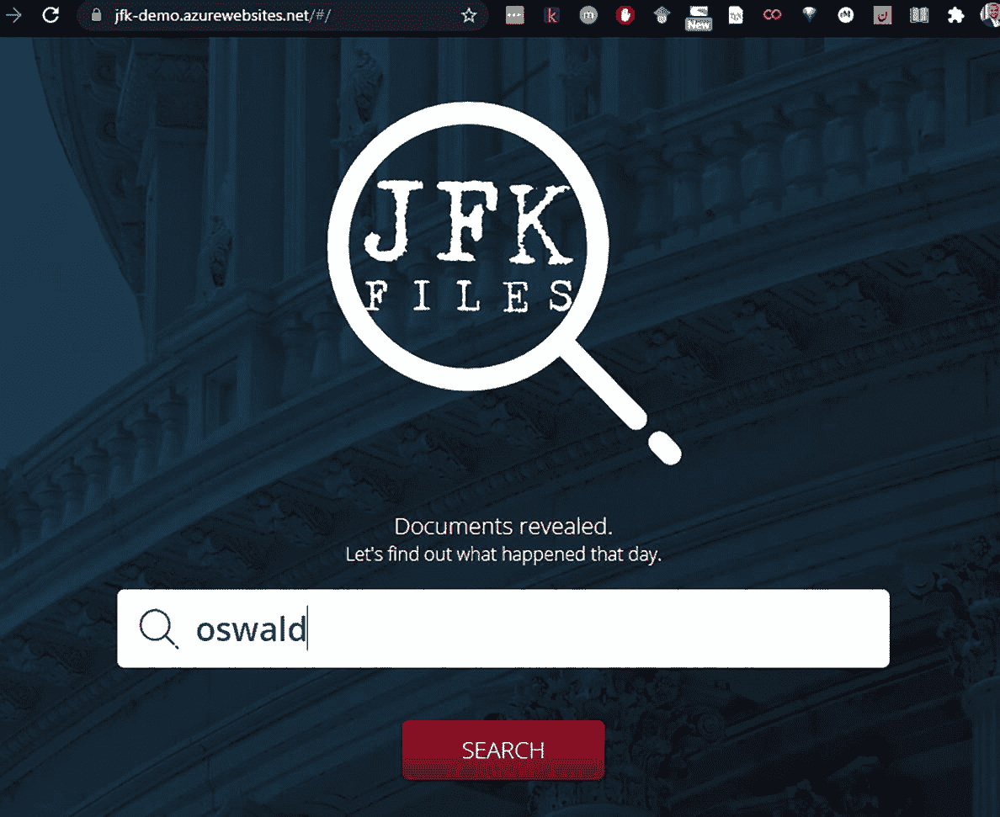

图 4-25

在 JFK 文件应用程序中搜索

在这里，您可以搜索一个术语，如“安全”，并查看手写笔记图像的相关结果，以及键入的 PDF 文件。它在左窗格中显示关联的实体，在主窗口中显示包含这些术语的文档(如图 [4-26](#Fig26) )。

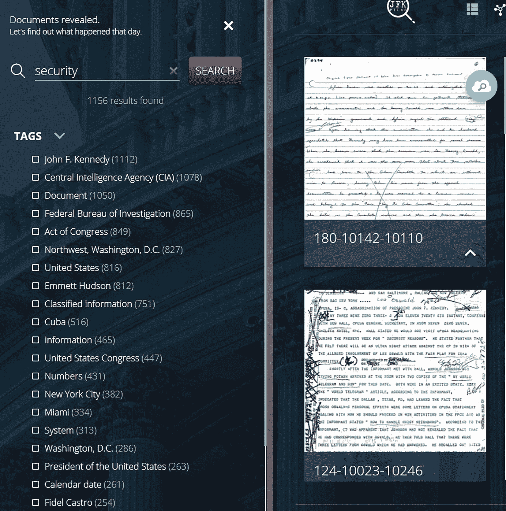

图 4-26

JFK 文件应用程序搜索结果

JFK 文件应用程序的安装、配置和运行到此结束。令人印象深刻的是，看到与 JFK 遇刺有关的 34，000 页是如何使用 Azure 认知服务、Azure 搜索、计算机视觉 API(使用 OCR 的文本识别 API)、文本分析 API 和自定义技能进行编目和解释的。这些特征被用来构建一个复杂的认知搜索解决方案。它甚至可以关联和搜索中情局的隐名，如 GPFLoor 到 Oswald [1](#Fn1) 。

JFK 文件不是一个徒劳的假设，而是一个现实的企业数据解决方案，这些数据大多是非结构化的，以多种格式存在，并来自所有类型的数据源。通过应用和修改 JFK 解决方案中规定的自然语言处理管道，您可以很容易地将它用于各种满足类似条件的企业解决方案。在下一个例子中，我们将探索转换器语言模型。

## 布偶模型 NLP 的变形金刚

如果没有提到伯特、埃尔莫、格罗弗、罗伯塔、埃尔尼斯和 KERMIT，关于自然语言处理的讨论，尤其是关于非结构化文本和模型的讨论是不完整的。这并不是因为 ACL(计算语言学协会)旗舰会议不知何故与芝麻街大会在同一地点举行(在芝麻街大会上，大鸟肯定没有发表令人难忘的主题演讲)，而是因为当语言模型论文引入芝麻街相关的缩写词时，内部笑话有点失控(许多人开始促成这个糟糕的笑话)。

对变形金刚模型及其复杂细节的概述需要单独一章，但简单来说，图 [4-27](#Fig27) 中的表格显示了一些流行的布偶模型的概述。

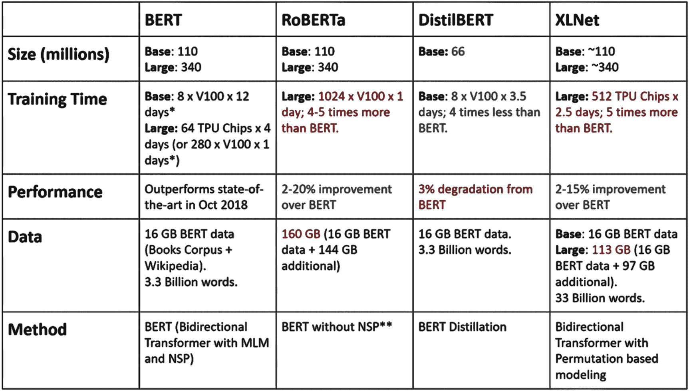

图 4-27

放着一些流行布偶模型的桌子

### 基于微调 BERT 的命名实体识别

命名实体识别(NER)是任何自然语言处理系统的关键能力之一，因此它是语言模型提供的基本特性之一。它是从非结构化数据集中提取实体的能力，例如地理实体(城市、国家等)、组织实体(组织的名称)、个人实体(与人相关联的名称和标识符)、地缘政治实体(国家、组织)、时间、事件、自然现象、季节性(节假日)、自定义实体等。

在这个例子中，我们将在 Azure ML 上使用 PyTorch 预训练的 BERT 进行命名实体识别。我们将使用 Google Colaboratory，一个运行 Jupyter 笔记本的免费工具。(它通常被称为 Google Colab。这个名字是一个双关语，混合了单词*实验室*和*合作*。)然而，你也可以通过 Anaconda 在你的本地机器上或者通过 Azure 笔记本在 Azure 机器学习上完成同样的练习。

使用以下步骤完成此示例。

图 4-28

用 Azure ML 打开伯特 NER 可乐杯

1.  从 [`https://github.com/microsoft/AzureML-BERT/blob/master/finetune/PyTorch/notebooks/Pretrained-BERT-NER.ipynb`](https://github.com/microsoft/AzureML-BERT/blob/master/finetune/PyTorch/notebooks/Pretrained-BERT-NER.ipynb) 打开 Colab 中的 Jupyter 笔记本(如图 [4-28](#Fig28) )。

填充您的订阅 ID 和资源组信息。您还需要通过打开浏览器并输入提供的代码来执行交互式身份验证。参见图 [4-29](#Fig29) 。

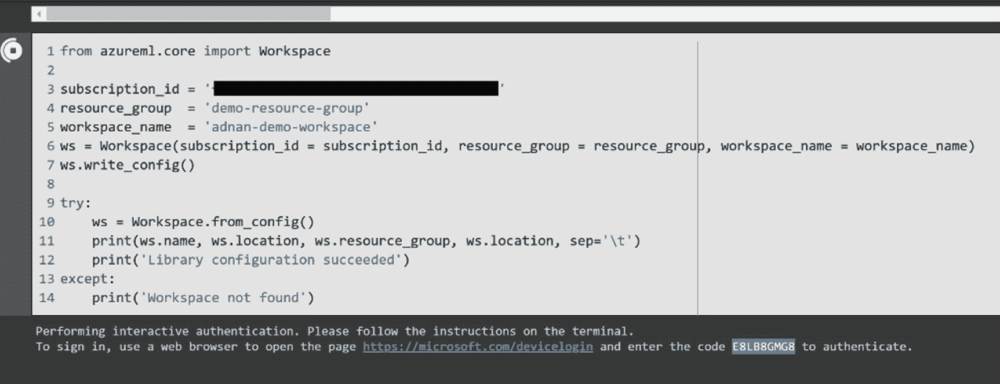

图 4-29

填充您的信息

现在需要初始化工作区，安装笔记本用 Azure ML SDK(如图 [4-30](#Fig30) )。

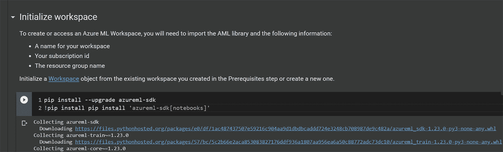

图 4-30

为笔记本安装 Azure ML SDK

下一步是创建(或使用)一个用于执行的计算集群目标。在这种情况下，我们选择了一个标准的单 GPU NC_6 VM，而我们的地区设置为美国西部。见图 [4-31](#Fig31) 。

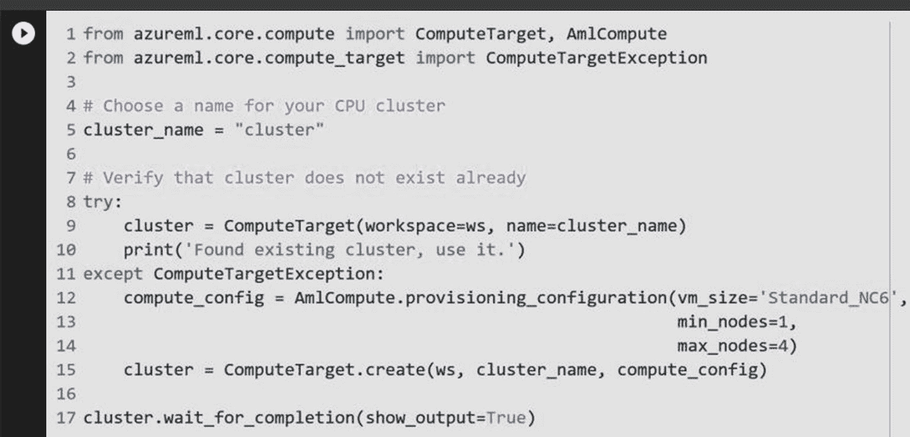

图 4-31

创建计算集群

然而，我们遇到了一个错误！比起一切顺利，你从错误中学到的更多。在这种情况下，NC6 型虚拟机在该地区不可用。您将看到错误消息，“在 westus 地区不支持 STANDARD_NC6。请选择不同的虚拟机大小。(见图 [4-32](#Fig32) 。)

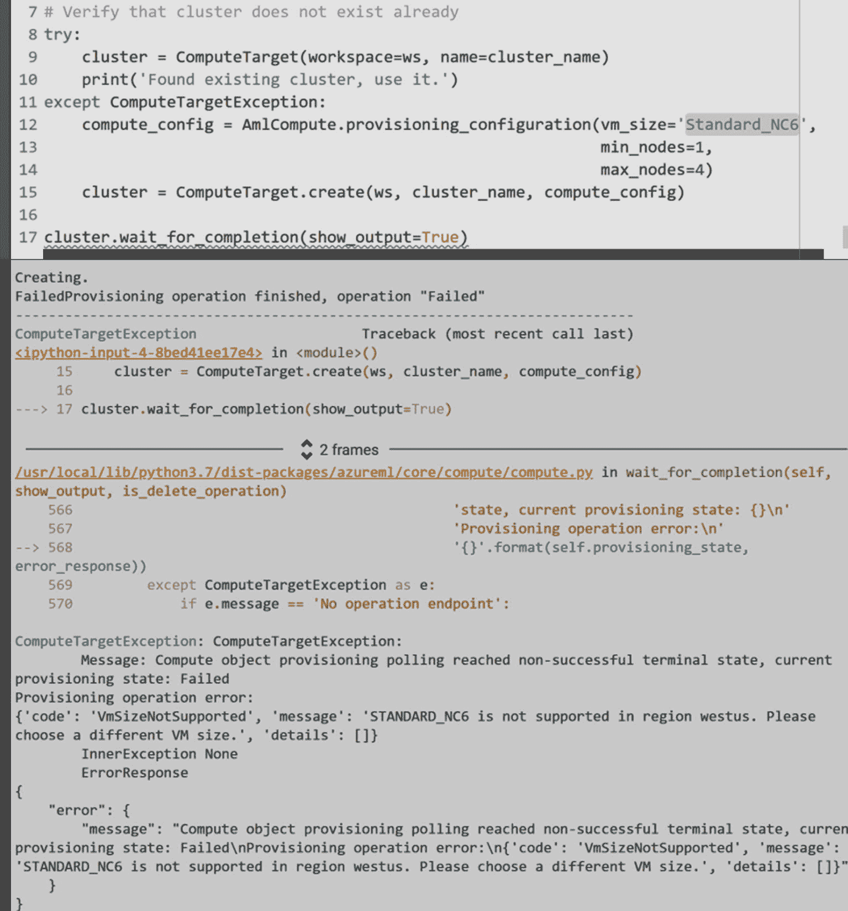

图 4-32

ComputeTarget 创建错误

请注意，并非所有地区都提供所有计算类型，因此，选择正确的地区非常重要。你可以在 [`https://docs.microsoft.com/ azure/virtual-machines/regions`](https://docs.microsoft.com/%2520azure/virtual-machines/regions) (微软文档上)了解更多关于地区和虚拟机的信息。

要解决这个问题，请转到 Azure 控制台，通过在美国东部创建一个新的工作区，将该区域更改为美国东部，在那里可以使用 VM。现在您可以成功创建计算目标，如图 [4-33](#Fig33) 所示。

图 4-33

ComputeTarget 创建成功

对于计算目标设置，让我们上传 NER 数据集。在这个例子中，我们将使用使用 GMB (Groningen Meaning Bank)的标注语料库进行来自 Kaggle [2](#Fn2) 的实体分类。首先，从 Kaggle 下载 NER 数据集文件，然后上传到笔记本。然后，使用图 [4-34](#Fig34) 所示的命令，将文件上传到 Azure ML workspace blob store。

图 4-34

上传数据集

下一步是使用这个 NER 数据集并微调模型。您需要采取一些数据工程步骤，比如替换标记值和标记化。您将使用 BertForTokenClassification 类进行标记级预测，作为一个微调模型，它包装了实际的 BertModel 并添加了标记级分类器。笔记本创建 trian.py 文件，用于训练模型(如图 [4-35](#Fig35) )。

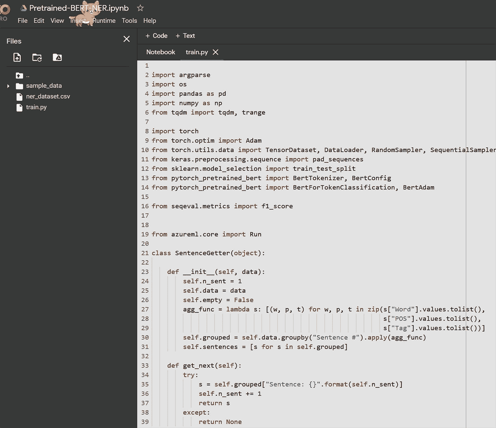

图 4-35

为 BERT 微调训练 Python 文件

现在您已经有了培训文件，创建一个 Azure ML 实验 [3](#Fn3) ，使用 train.py 作为入口脚本(用于运行实验的脚本)的参数。见图 [4-36](#Fig36) 。

图 4-36

创建实验来微调模型

你可以在 Azure 机器学习控制台的“实验”选项卡中跟踪正在运行的实验。见图 [4-37](#Fig37) 。

图 4-37

训练实验运行，对模型进行微调

一旦实验完成，就可以在 ACI 中部署服务，然后进行调用。现在你可以看到来自这个新的微调模型的命名实体识别结果(如图 [4-38](#Fig38) 所示)。

图 4-38

测试已部署的 NER 服务

文本通过服务得到处理，结果实体被识别和显示。参见图 [4-39](#Fig39) 。

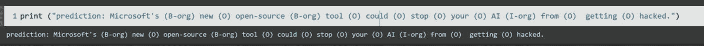

图 4-39

部署 NER 服务的结果

这是一个关于如何在 Azure ML 中使用 transformer 模型、微调模型、部署和调用服务以获得预期结果的简要概述。你可以在 [`https://docs.microsoft.com/azure/machine-learning/how-to-configure-environment`](https://docs.microsoft.com/azure/machine-learning/how-to-configure-environment) (微软文档上)找到如何设置 Python 环境(用于 Azure 机器学习)的详细说明。

在下一节中，我们将讨论如何在整个生态系统中使用非结构化文本和模型，更深入地了解一些相关的用例。

认知服务和语言模型在整个应用生态系统中无处不在，用于构建智能应用。微软学习工具(也称为数字学习工具)利用这些功能进行教学。例如，微软沉浸式阅读器 [4](#Fn4) 利用了 Azure 文本分析功能，包括全面的自然语言分析(针对情感、关系、趋势等)。

文本分析服务被描述为一种*“人工智能服务，可以揭示非结构化文本中的情感分析、实体、关系和关键短语等见解。”*它提供了广泛的实体提取、情感分析、语言检测和灵活部署等功能。文本分析服务主页如图 [4-40](#Fig40) 所示。

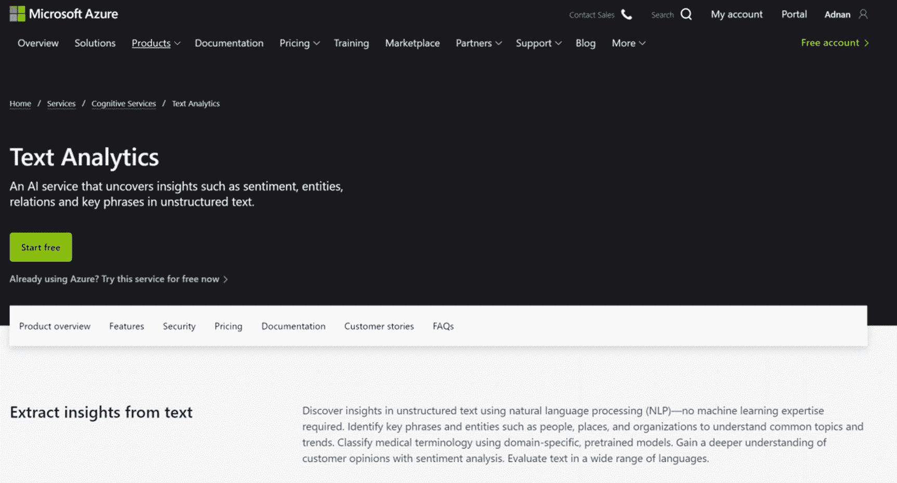

图 4-40

文本分析服务主页

文本分析服务在云中、内部和作为边缘部署提供，这使它成为满足各种不同企业需求的重要工具。例如，您可以在内部将其用作容器。关于安装和运行文本分析容器的细节可以在微软文档 [5](#Fn5) 中找到。

这种服务的开源替代方案是通过定制的模型、spaCy、NLTK 和 CoreNLP 等库，或者 Hugging Face、OpenAI 等云提供商来实现的。然而，使用文本分析服务分离出实现细节，并且它帮助你在抽象中工作。您可以利用广泛的预构建实体和数百种个人身份信息(PII)数据元素，包括受保护的健康信息(PHI)，而不是微调自定义模型来识别和分类重要概念。您可以提取相关短语、主题模型、客户情感分析和医疗数据(针对健康的文本分析在预览 [6](#Fn6) )。

## 语言 API 概述

在这一章中，我们探讨了一些关于语言 API 的关键概念，以及它们在处理非结构化文本和模型中的用途。我们用例子展示了如何使用 Azure 认知服务和 Azure 机器学习来构建一个全面的搜索引擎。我们还研究了 transformer 模型，以及如何使用 Azure 机器学习来微调一个模型。

在下一章，我们将继续这些话题，探索语音和语音服务，作为你认知服务之旅的下一步。

<aside aria-label="Footnotes" class="FootnoteSection" epub:type="footnotes">Footnotes [1](#Fn1_source)

Azure 认知搜索 [`https://docs.microsoft.com/en-us/azure/architecture/solution-ideas/articles/cognitive-search-with-skillsets`](https://docs.microsoft.com/en-us/azure/architecture/solution-ideas/articles/cognitive-search-with-skillsets) 中用图像和自然语言处理的 AI 浓缩

  [2](#Fn2_source)

使用 GMB(格罗宁根意义库)语料库进行实体分类的标注语料库`www.kaggle.com/abhinavwalia95/entity-annotated-corpus`

  [3](#Fn3_source)

创建一个实验来跟踪所有的运行 [`https://docs.microsoft.com/azure/machine-learning/service/concept-azure-machine-learning-architecture#experiment/?WT.mc_id=bert-notebook-abornst`](https://docs.microsoft.com/azure/machine-learning/service/concept-azure-machine-learning-architecture%2523experiment/%253FWT.mc_id%253Dbert-notebook-abornst)

  [4](#Fn4_source)

[T2`www.microsoft.com/en-us/education/products/learning-tools`](http://www.microsoft.com/en-us/education/products/learning-tools)

  [5](#Fn5_source)

[T2`https://docs.microsoft.com/en-us/azure/cognitive-services/text-analytics/how-tos/text-analytics-how-to-install-containers?tabs=sentiment`](https://docs.microsoft.com/en-us/azure/cognitive-services/text-analytics/how-tos/text-analytics-how-to-install-containers%253Ftabs%253Dsentiment)

  [6](#Fn6_source)

[T2`https://docs.microsoft.com/en-us/azure/cognitive-services/text-analytics/how-tos/text-analytics-for-health?tabs=ner`](https://docs.microsoft.com/en-us/azure/cognitive-services/text-analytics/how-tos/text-analytics-for-health%253Ftabs%253Dner)

 </aside>