# 6.决策–在您的应用中做出更明智的决策

决定，决定，决定——Sri racha 或 Tabasco，team Jacob 或 team Edward，PC 或 Mac，iPhone 或 Android，堡垒之夜或 Apex，可口可乐或百事可乐，*星球大战*或*星际旅行*……(好吧，最后一个不是什么大讨论，但我们跑题了。)做决定可能是我们做的最人性化的事情。这些决定是基于我们可以获得的感官信息的输入，加上一些先验的观察，事实，我们隐含的偏见和大量的启发。这种*认知计算*能够决定下一个最佳行动的能力是决策科学中的一个渗透装置。研究和捕捉我们如何做出这些决定的先天技能需要了解我们如何摄取和处理这些信息。然后我们就可以得出结果了。

与决策相关的细微差别可以很好地总结为:“当我看到它时，我就知道它。”这是大法官波特·斯图尔特描述他的猥亵测试时引用的一句开创性的话。保持 PG，在这一章中，我们将看到 API 是如何用于这个目的的。本章将通过在应用程序中添加内容和审核工具来提供对决策服务的见解。本章还将涉及一个相对较新的功能-异常检测器。以下是本章的一些突出特点:

1.  了解决策服务和决策 API

2.  创建自动内容仲裁者应用程序

3.  用个性化的创造个性化的体验

4.  用异常检测器识别未来的问题

5.  使用度量顾问服务探索度量

6.  决策 API 摘要

所以，事不宜迟，让我们开始吧！

Enterprise Decision Management

是使用业务规则、领域知识、预测分析和大数据来构建和推动高效业务流程的艺术和科学。这是一个令人兴奋的话题，但尽管如此，它超出了这篇手稿的范围。

## 决策服务和 API

最初作为“项目定制决策”推出，现在已经发展成为个性化服务的一部分，加入了异常检测器、内容调节器和认知服务度量顾问套件的行列。这个小小的历史教训很重要，因为做出更明智的决定需要多方面的技能。拥有一个全面的“决策服务”可能不是解决这个微妙问题的最有效的方法。因此，不同技能组合是必要的，例如识别异常值；找出潜在的攻击性、色情、淫秽或不受欢迎的内容；以及为用户创建定制的交互。

决策服务是 Azure 认知服务生态系统的重要组成部分，它还在语言、语音、视觉和网络搜索领域提供了令人惊叹的功能(正如您在前面的章节中所看到的)。决策服务系列的当前成员包括:

*   **异常检测器**

认知服务，用于识别异常值并精确定位不寻常的潜在行为

*   **内容版主**

认知服务，有助于跨多种形式识别色情、淫秽和攻击性内容

*   **个性化器**

服务，以构建针对个人用户偏好定制的个性化目标体验

*   **Metrics Advisor(撰写本文时正在预览)**

为 AIOps 定制的异常检测核心引擎，例如检测和诊断指标以进行根本原因分析，以及通过时序分析在日志中发现问题

在本章的其余部分，我们将回顾这些服务并构建演示应用程序，向您展示如何在您自己的项目中使用它们。

## 内容调解人服务

对于今天的数字经济，规模是游戏的名字。所提供的服务必须能够扩展到数百万用户，而没有这些手动瓶颈。

延伸“当我看到它时，我就知道它”的比喻，今天的互联网规模系统不能依赖于对上传到互联网的每个视频和图像进行人工筛选。像 YouTube 这样的平台每分钟上传超过 500 小时的视频内容，这导致大约 30，000 小时的每小时内容。所需的成本和资源使得人类筛选望而却步。人在回路(HiTL)是将人的互动作为过程的一部分的技术。理想情况下，人与人之间的互动仅限于那些确实需要人为干预才能做出决策的例外情况。其余的都是自动化的。

在大多数与用户互动的现代网站中，内容审核是一个必需的组件。一些使用案例包括以下内容:

1.  一个组织提供了一个数字银行，允许他们的客户为他们的定制借记卡上传图像。他们希望确保上传的图片不包含任何淫秽或色情图片。

2.  对于公司的内部网，一位同事想要上传最新的公司假日聚会照片。他们希望确保这些图像在工作中是安全的。

3.  一个组织的应用程序负责审核社交媒体订阅源，这些订阅源被导入以显示在员工的自定义仪表板上。它监控脸书、Twitter 和 Instagram 上关于公司的内容和相关社交媒体标签，以确保良好的声誉和完全合规。

4.  一个组织在线建立一个客户档案，包括照片和个性化信息。他们还想确保这些照片不会充斥着亵渎的词语。

5.  一家公司创建了一个电子商务市场，客户可以在这里建立自己的利基商店并销售他们的产品。他们希望确保上传的图片适合合适的受众。

6.  一家公司为他们的潜在客户提供了一个不和谐风格的聊天室。客户可以分享关于公司产品和服务的实时反馈。该公司希望保持礼仪，保持语言的温和，以确保没有使用表面上令人不快的术语。

7.  一家公司创建了一个直播旅游网站，用户将他们在抖音的冒险上传到他们的微型网站上，这保证了真实的体验。他们希望确保这些经历，无论多么真实，都不会成为他们小企业潜在的成人内容的负担。

还有很多例子，但是你明白了。没有复杂的认知服务和人工智能的巨大帮助，小企业将处于非常不利的地位。假设来说，像 YouTube、Twitter、Instagram 或脸书这样的大公司也许可以雇佣一大群人类审查员来筛选每一个视频，但你负担不起这样做。然而，这没关系，因为 Azure 内容仲裁者服务可以提供帮助。顺便说一下，我们之前指定的公司大量使用人工智能和机器学习来执行内容审核，并且他们将人类纳入循环作为第二步。他们中的一些人还要处理假新闻；还记得那些推特警告吗？不幸的是，事实检查还不是内容审核服务的一部分。

内容仲裁者服务为这些企业需求提供了答案，提供了安全和积极的用户体验所需的工具。该服务附带了人工审查工具以及图像文本和视频审核功能，我们将在接下来的部分中对此进行探讨。

### 尝试一下——建立内容版主

在这一节中，我们将使用内容仲裁者服务来展示如何在您的应用程序中使用它。内容仲裁者服务具有检测文本、图像和视频中可疑内容的能力，以及审查这些内容的人工参与能力。这是对这些功能的实际操作，使您能够将其构建为您自己的应用程序的一部分。按照这些说明进行操作:


图 6-1

内容仲裁者服务门户主页

1.  开始使用内容仲裁者服务最简单的方法是进入内容仲裁者门户网站，在 [`https://contentmoderator.cognitive.microsoft.com/`](https://contentmoderator.cognitive.microsoft.com/) 。

    图 [6-1](#Fig1) 显示内容版主注册按钮。


图 6-2

内容仲裁者服务门户主页登录屏幕

1.  点击**注册**，即可使用您的微软账号登录，如图 [6-2](#Fig2) 所示。

这个门户是为人在回路中的审查而设计的，但是您也可以看到来自 API 的响应。登录后，下一步是创建一个审查团队。

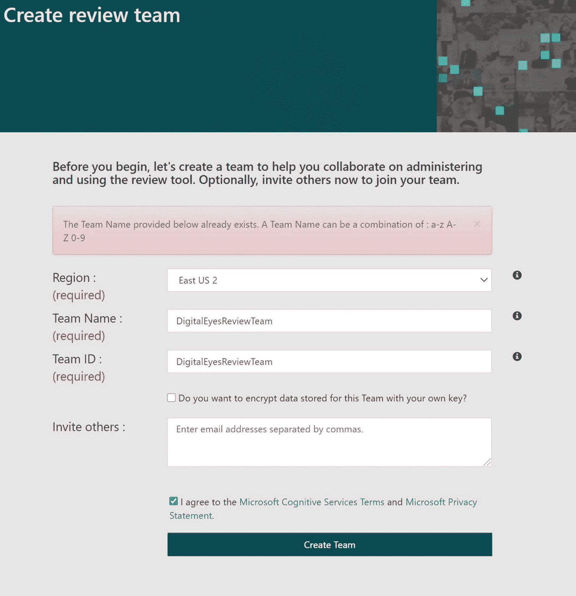

图 6-3

内容审核人服务门户创建审核小组屏幕

1.  如图 [6-3](#Fig3) 所示，通过提供您所在地区的信息、团队名称、团队 ID 以及对其他评审者的邀请来创建一个评审团队。这些字段是相当自描述的，您可以在以后添加团队成员。

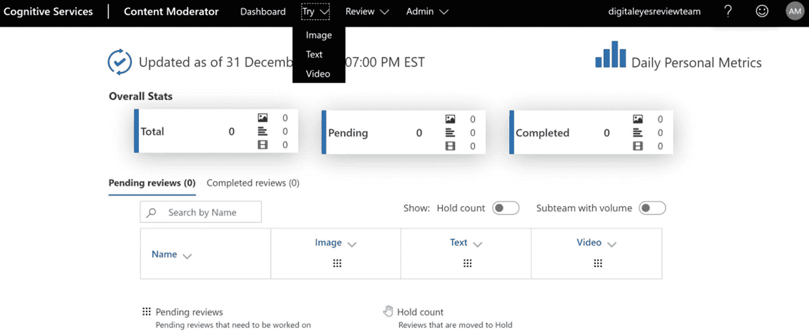

图 6-4

内容仲裁者服务门户仪表板

1.  创建团队后，您会看到如图 [6-4](#Fig4) 所示的仪表板。此摘要视图显示已提交的图像、文本和视频审阅任务的总请求，以及所有待处理和已完成的请求。您现在可以通过从顶部菜单中选择正确的内容形式(图像、文本或视频)来尝试提交任务，如图 [6-4](#Fig4) 所示。


图 6-5

内容主持人服务将图像上传到主持人屏幕

1.  我们不建议您在工作机器上找到 risqué图像来测试内容调解器服务。就像他们说的，在 HR 给你发邮件之前，一切都是娱乐和游戏，“但是我在做研究”不再是一个有效的理由。因此，在开始搜索该图像之前，请考虑使用 Flickr30K 图像数据集。它在 creative commons 许可下发布，被广泛用作基于句子的图像描述的基准，它包含一组非常多样化的图像。您可以从 [`www.kaggle.com/hsankesara/flickr-image-dataset`](http://www.kaggle.com/hsankesara/flickr-image-dataset) 下载数据集。

    为了测试内容版主服务，我们上传了一些游泳运动员被版主审核的图片，如图 [6-5](#Fig5) 所示。

上传图像后，您会看到如图 [6-6](#Fig6) 所示的确认信息。


图 6-6

内容仲裁者服务上传图像确认

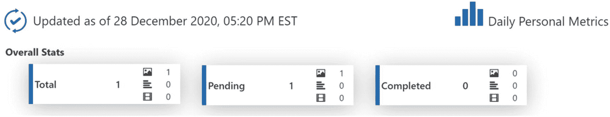

图 6-7

内容仲裁者服务仪表板状态

1.  得到确认后，您会看到图像正在等待审核，如图 [6-7](#Fig7) 所示。

当上传的图像通过审核工作流程时，API 已经处理了图像并提供了反馈。用于识别不适宜内容的标志有`isImageAdultClassified`和`isImageRacyClassified`，如图 [6-8](#Fig8) 所示。

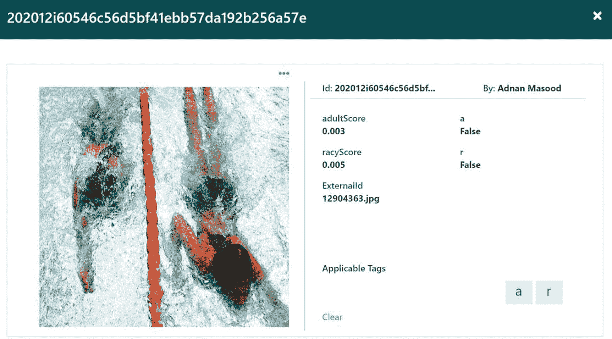

图 6-8

内容主持人服务图像审核评分屏幕

这些标志是不言自明的；`isImageAdultClassified`识别色情图片，而`isImageRacyClassified`标记暗示性评论。概率得分在 0 和 1 之间，其中较高的得分意味着在相应类别中图像是明确的或暗示性的置信度增加。根据您的组织需要，您可以设置自己的阈值，在必须进行手动审查之前，允许多少是可容忍的。

在手动检查这张图片的情况下，你可以标记图片`a`(成人)或`r`(色情)，或者你可以跳过它，因为它都不是。然后点击**下一步**完成审核过程，如图 [6-9](#Fig9) 所示。


图 6-9

内容仲裁者服务图像审查屏幕

既然我们已经回顾了内容仲裁者服务的人在回路中的审查场景，那么让我们在下一节中探索文本审查功能。

### 使用内容调解人服务调解文本

非结构化数据(尤其是文本和自然语言)是互联网上最大的数据形式。因此，摄取、消费、处理、过滤和准备使其具有洞察力的技术备受追捧。文本内容的审核，无论是评论、评论还是你公司社交媒体领域的帖子，都是内容审核服务的亮点。

内容仲裁者服务的文本审核功能不仅限于脏话，它还可以帮助您将有问题的语言分为三个不同的类别。像图像版主一样，属于特定类别的内容的置信度在 0 到 1 之间，其中数字越大表示置信度越高(问题越小)。在服务建议手动检查的情况下，`ReviewRecommended`标志被设置为真。您可以使用此标志以及类别分数的阈值来确定在您的特定情况下是否需要审查。

输出类别表示不同程度的亵渎文本。第一类包含亵渎、露骨或成人语言，而第二类暗示性暗示语言的使用。不同于图像审核，文本审核还有另一个类别，类别 3，暗示*轻度*攻击性语言。除了这些类别，文本审核还会检测文本中的个人身份信息(PII)，如电子邮件地址、IP 地址、美国电话号码或美国邮寄地址。这在个人身份信息可能需要匿名或编辑的情况下很有帮助。自动文本更正是内容仲裁者服务提供的另一个非常有用的功能。

要开始这项服务，我们可以像以前一样重复内容审核服务过程，但这次是用文本。参见图 [6-10](#Fig10)


图 6-10

内容仲裁者服务审核屏幕

数据科学挑战网站 Kaggle 提供了一个有毒评论分类挑战，以识别和分类有毒的在线评论。数据集可以从 [`www.kaggle.com/c/jigsaw-toxic-comment-classification-challenge/data`](http://www.kaggle.com/c/jigsaw-toxic-comment-classification-challenge/data) 下载，但是我们强烈建议不要通读这些评论，它们可能非常有毒(意味着亵渎和露骨)。我们已经从这个数据集中选择了一个评论来测试服务，你可以在图 [6-11](#Fig11) 中看到它正在被试用。


图 6-11

内容仲裁者服务文本审查屏幕

正如信心指数显示的那样，评论既不是亵渎性的(第 1 类)，也不是性暗示性的(第 2 类)，但语言是轻微的攻击性或防御性的(第 3 类)。`text.HasProfanity`标志被设置为`False`，并且`text.hasPII`标志也被设置。在下一个例子中，我们获取了一个由内容仲裁者服务提供的样本文本，并提交给仲裁者，如图 [6-12](#Fig12) 所示。


图 6-12

内容仲裁者服务文本提交屏幕

在这种情况下，评论包含 PII 信息，包括电子邮件、电话号码、IP 地址和美国邮寄地址。这是可以检测到的，并且可以在图 [6-13](#Fig13) 中看到。


图 6-13

内容仲裁者服务文本提交屏幕

在下一节中，我们将看到如何通过 API 将内容审核功能集成到您自己的应用程序中。

### 调节文本-调用 API

使用“内容主持人审阅”工作流是可以的，但是有几个工作流需要交互式响应并构建您自己的决策工作流。例如，对于您的产品支持聊天室，您希望确保自动过滤任何发布的 1 类或 2 类聊天内容(成人、亵渎或露骨的性内容)。通过使用内容仲裁者 API，您可以轻松地构建审核系统。

以下步骤向您展示了如何使用内容仲裁者 API:


图 6-14

Azure 门户内容仲裁者服务安装程序

1.  首先，您需要在 Azure 上设置一个内容仲裁者实例。访问 portal.azure.com，在搜索框中搜索“内容版主认知服务”，如图 [6-14](#Fig14) 所示。


图 6-15

Azure 门户内容仲裁者服务安装程序

1.  内容版主服务显示在搜索结果中，如图 [6-15](#Fig15) 所示。若要继续，请单击“内容仲裁者”窗格。


图 6-16

Azure 门户内容仲裁者服务安装程序

1.  将显示内容仲裁者服务详细信息屏幕。点击**创建**按钮，如图 [6-16](#Fig16) 所示。

现在，您将通过选择订阅、资源组、实例信息和定价层来创建内容仲裁者实例。要继续，点击**审核+创建**按钮，如图 [6-17](#Fig17) 所示。


图 6-17

Azure 门户内容仲裁者服务安装程序

验证发生，您会看到图 [6-18](#Fig18) 中的屏幕(验证通过)。

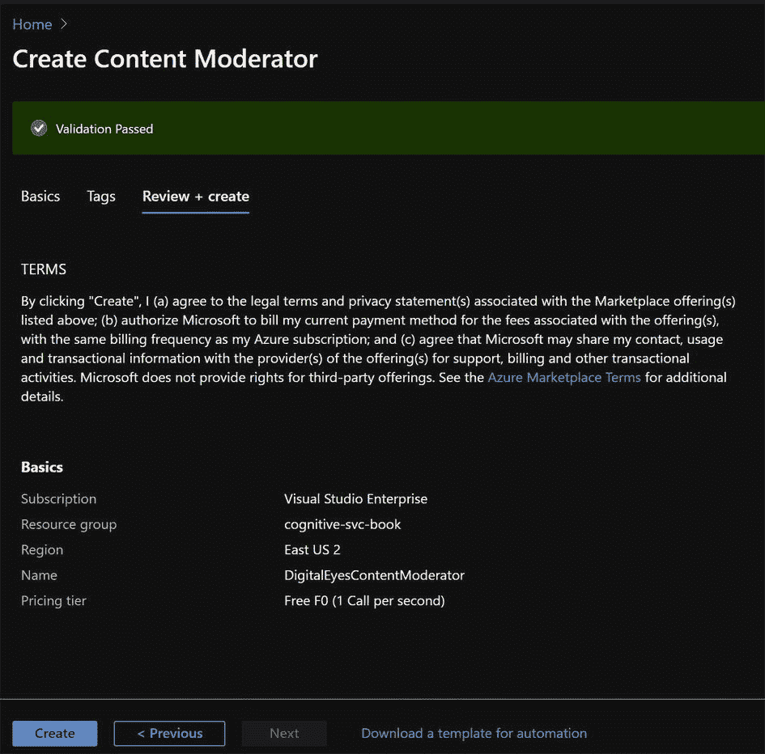

图 6-18

Azure 门户创建内容仲裁者屏幕

点击**创建**继续部署服务。您将看到如图 [6-19](#Fig19) 所示的屏幕，该屏幕显示了展开状态。

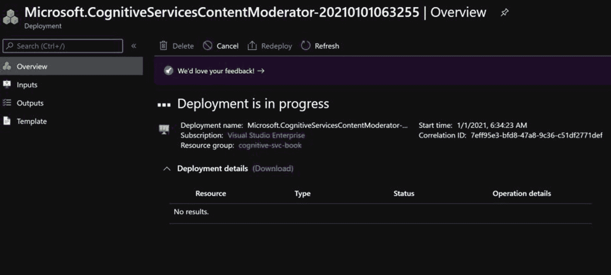

图 6-19

Azure 门户部署正在进行屏幕

部署完成后，您将进入图 [6-20](#Fig20) 所示的屏幕。要继续，点击**转到资源**。


图 6-20

Azure 门户内容仲裁者服务部署已完成

resource 屏幕显示了快速启动页面，在这里您可以获取密钥、进行 API 调用以及查看 SDK 和文档。见图 [6-21](#Fig21)


图 6-21

Azure 门户内容仲裁者服务快速启动


图 6-22

Azure 门户内容仲裁者服务密钥和端点屏幕

1.  要调用 API，您需要密钥和端点地址。点击左窗格中的**键和端点**选项卡。您将看到如图 [6-22](#Fig22) 所示的屏幕，带有端点和按键。


图 6-23

内容仲裁者示例 GitHub repo

1.  要测试 API，您可以使用 curl、Postman、Swagger 或 Fiddler 等工具，或者从应用程序中进行测试。在这个例子中，我们将使用一个. NET 应用程序。认知服务示例是开始探索使用 Azure 认知服务的不同方式的好地方。首先克隆 GitHub 库( [`https://github.com/Azure-Samples/cognitive-services-content-moderator-samples`](https://github.com/Azure-Samples/cognitive-services-content-moderator-samples) )，如图 [6-23](#Fig23) 。

在本地文件夹中克隆存储库。在这个例子中，我们使用 GitHub Desktop，但是你可以通过命令行来完成。生成的存储库被克隆在以下文件夹中(如图 [6-24](#Fig24) ): `D:\dev\cognitive-services-content-moderator-samples\`。


图 6-24

内容仲裁者示例 GitHub repo 克隆

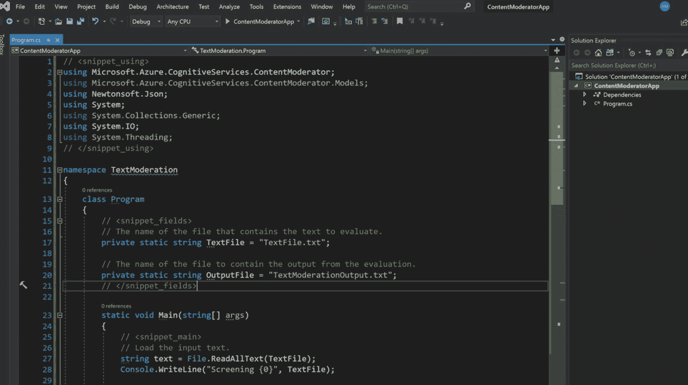

图 6-25

内容仲裁者服务调用应用

1.  一旦回购被克隆(同步到你的机器)，从`D:\dev\cognitive-services-content-moderator-samples\documentation-samples\csharp`文件夹中打开`text-moderation-quickstart-dotnet.cs`文件。您可以在 Visual Studio 代码或 Visual Studio 2019 中打开此文件。在本例中，我们将使用 Visual Studio 并创建一个. NET Core 3.1 控制台应用程序。我们添加`text-moderation-quickstart-dotnet.cs`文件中提供的代码，如图 [6-25](#Fig25) 所示使用。

> *自从撰写本文以来，已经有了* API *的更新，例如，微软。cognitive services . content moderator 需要替换为 Microsoft . azure . cognitive services . content moderator。您将通过最新的回购更新获得这些更改。*


图 6-26

安装 NuGet 包的命令

1.  在运行这个应用程序之前，我们需要做一些事情。首先，您需要使用 NuGet 包管理器安装内容调节包。运行图 [6-26](#Fig26) 所示命令，获取`Microsoft.Azure.CognitiveServices.ContentModerator`包。

安装完成后，我们继续配置运行`text-moderation-quickstart-dotnet.cs`文件所需的项目。


图 6-27

内容仲裁者调用–订阅密钥信息

1.  要运行这段调用内容仲裁者 API 的简单代码，您需要将密钥存储在环境变量中。这是读取信息的地方，如图 [6-27](#Fig27) 所示。

要向环境变量添加项目，请在 Windows 10 的运行窗口中键入“系统属性”来打开系统属性面板，如图 [6-28](#Fig28) 所示。点击**环境变量…** 按钮。

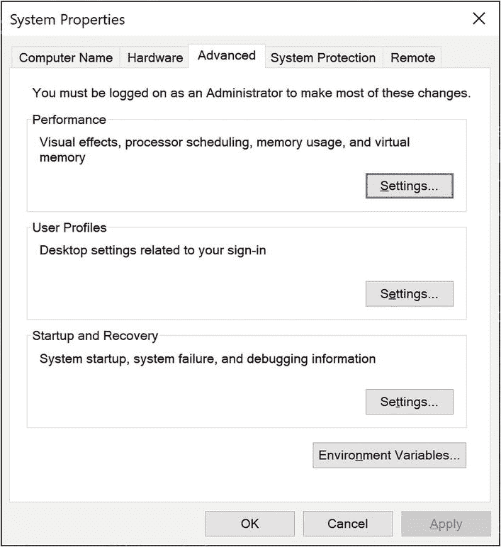

图 6-28

设置环境变量的系统属性

窗口打开后，添加两个键(如图 [6-29](#Fig29) 所示)作为新的环境变量。使用用户变量而不是系统变量。您需要重新启动 VS.NET 来加载新添加的环境变量。

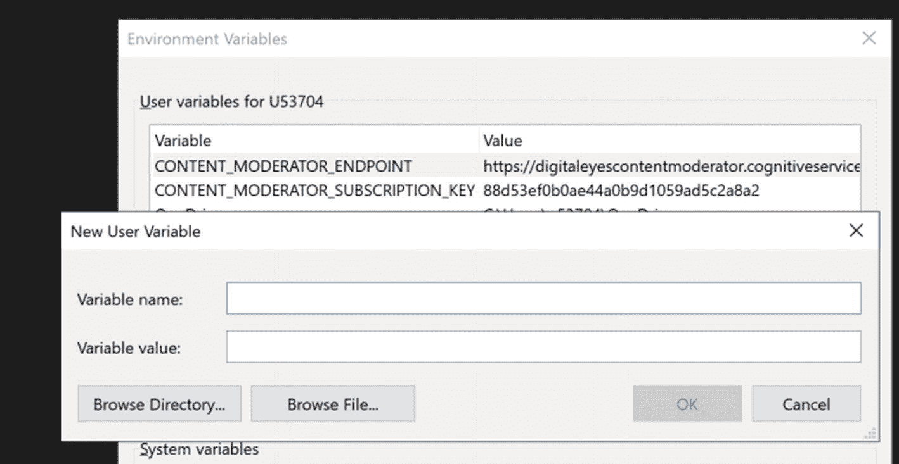

图 6-29

设置环境变量的系统属性


图 6-30

visual Studio–复制到输出目录设置

1.  Lastly, you would need to create a file that contains the evaluation text to be passed to the API. The text is what we have used earlier. The following is the evaluation text:

    ```py
    Is this a grabage or crap email abcdef@abcd.com, phone: 4255550111, IP: 255.255.255.255, 1234 Main Boulevard, Panapolis WA 96555.

    ```

    现在创建一个名为 Evaluate.txt 的新文件，然后将该文本复制到文件中。确保将副本输出目录设置为**副本如果更新**，如图 [6-30](#Fig30) 所示。如果不设置该值，评估文件不会复制到构建中，因此，可执行文件在运行时无法找到程序。

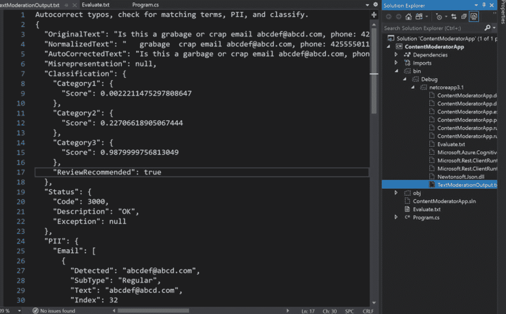

图 6-31

内容仲裁者服务响应的输出列表

1.  现在，您可以按 F5 运行该程序。代码将调用 API，取回响应，并将其保存在 bin/debug 文件夹下的输出文件`TextModerationOutput.txt`中(如图 [6-31](#Fig31) )。要启用该视图，请单击解决方案资源管理器窗口中的**显示所有文件**图标。

API 的 JSON 输出如下所示，您可以很容易地看到类别识别、评论推荐、PII 和语言检测——类似于在评论控制台中的情况。

```py
Autocorrect typos, check for matching terms, PII, and classify.
{
  "OriginalText": "Is this a grabage or crap email abcdef@abcd.com, phone: 4255550111, IP: 255.255.255.255, 1234 Main Boulevard, Panapolis WA 96555.",
  "NormalizedText": "   grabage  crap email abcdef@abcd.com, phone: 4255550111, IP: 255.255.255.255, 1234 Main Boulevard, Panapolis WA 96555.",
  "AutoCorrectedText": "Is this a garbage or crap email abcdef@abcd.com, phone: 4255550111, IP: 255.255.255.255, 1234 Main Boulevard, Pentapolis WA 96555.",
  "Misrepresentation": null,
  "Classification": {
    "Category1": {
      "Score": 0.0022211475297808647
    },
    "Category2": {
      "Score": 0.22706618905067444
    },
    "Category3": {
      "Score": 0.9879999756813049
    },
    "ReviewRecommended": true
  },
  "Status": {
    "Code": 3000,
    "Description": "OK",
    "Exception": null
  },
  "PII": {
    "Email": [
      {
        "Detected": "abcdef@abcd.com",
        "SubType": "Regular",
        "Text": "abcdef@abcd.com",
        "Index": 32
      }
    ],
    "SSN": [],
    "IPA": [
      {
        "SubType": "IPV4",
        "Text": "255.255.255.255",
        "Index": 72

      }
    ],
    "Phone": [
      {
        "CountryCode": "US",
        "Text": "4255550111",
        "Index": 56
      }
    ],
    "Address": [
      {
        "Text": "1234 Main Boulevard, Panapolis WA 96555",
        "Index": 89
      }
    ]
  },
  "Language": "eng",
  "Terms": [
    {
      "Index": 12,
      "OriginalIndex": 21,
      "ListId": 0,
      "Term": "crap"
    }
  ],
  "TrackingId": "f0dba865-3731-4fd2-b07f-01878ba7325a"
}

Listing 6-1Output listing for the Content Moderator service response

```

行业中的内容审核用例旨在提供积极的用户体验。它们适用于几乎所有用户生成的内容，从调节文本、聊天消息和用户选择的用户名(或头像)到上传的可能包含露骨、仇恨、暴力或极端内容的图像，等等。在本节中，您已经学习了如何使用内容审核服务及其强大的审核功能，包括通过 API 和人工控制台。

在下一节中，我们将探索另一种决策服务，Personalizer。

## 个性化服务

即使对于千禧一代来说，如果没有持续的推荐，也很难识别一个数字世界。百视达商店很难保持电影在同一类型，而网飞无缝策划我的电影情感。YouTube 提供相关内容，并帮助我探索类似的频道和新的艺术家，而 Spotify 则根据我的播放列表，不断挖掘我所有的怀旧歌曲。亚马逊根据我最近的购买推荐最相关的产品，金融机构根据我的储蓄和消费模式创建可定制的产品。这是超个性化、定制化、细分化和内容监管，旨在创造一个“你”的细分市场。这之所以成为可能，是因为机器学习方法被应用于解决提供定制体验的问题。

为了实现和加速人工智能民主化，像所有其他认知服务一样，Personalizer 服务创建了一个抽象层，允许您(开发人员)为您的客户创建无缝体验，而无需进入底层推荐引擎的本质。

然而，如果你对与推荐系统相关的底层算法感兴趣，微软有一个优秀的 GitHub 知识库( [`https://github.com/Microsoft/Recommenders`](https://github.com/Microsoft/Recommenders) )，里面有详细的实现、笔记本和不同算法的比较。这个讨论超出了本章的范围，但是您可以在那里找到您需要的一切，包括所有相关的细节、相关的研究论文、Jupyter 笔记本、示例代码等等。

Azure 认知服务个性化服务赢得了最具创新性产品的 Strata Data 奖。它可以应用于定制任何东西，包括但不限于新闻文章、产品、食物、电影、博客文章等等。基于强化学习方法和定制的微软研究算法，个性化服务背后的原理非常容易理解。它是这样工作的:

1.  每个项目(产品、新闻文章、食品、电影等等)都包括属性或特性。Personalizer API 被调用并将这些特性传递给 Rank API。

2.  Personalizer 的底层引擎使用奖励行为标识符来确定最佳模式和推荐。您可以通过用户偏好或业务规则来确定(训练)。

3.  基于这个反馈，奖励通过关联等级和奖励来(重新)训练它自己。现在推理机有了新的模型。

显然，这是一个过于简化的过程，但如果你仍然感到有点失落，可以考虑个性化方法，因为它会对奖励行为产生影响。稍后，我们将详细介绍学习策略、学徒模式、探索与开发、权衡等等。但是首先，做一个快速的动手实验并向您展示 Personalizer 是如何工作的是有意义的。

在我们开始之前，让我们指出在 [`https://github.com/Azure-Samples/cognitive-services-personalizer-samples`](https://github.com/Azure-Samples/cognitive-services-personalizer-samples) 有一个庞大的与个性化相关的演示、片段和实用程序库。在 [`https://personalizationdemo.azurewebsites.net`](https://personalizationdemo.azurewebsites.net/) 还可以看到一个交互式的工作演示，有助于以直观的方式解释概念，如图 [6-32](#Fig32) 所示。

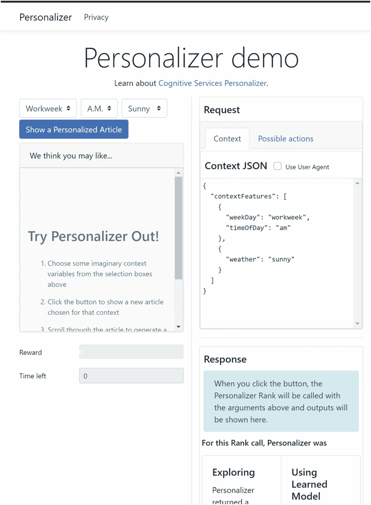

图 6-32

个性化服务演示

Personalizer 使用 Vowpal Wabbit 作为其机器学习实现的基础。你可以在 GitHub 的 [`https://github.com/VowpalWabbit/vowpal_wabbit/wiki`](https://github.com/VowpalWabbit/vowpal_wabbit/wiki) 了解更多信息。

### 尝试一下——打造个性化的电影

在这个例子中，我们将重复设置 Azure 认知服务的一些早期步骤。一致的工作流程是认知服务提供的显著特征之一，在这里您可以轻松地复制您以前的知识。


图 6-33

个性化服务–创建个性化实例

1.  前往 [`https://portal.azure.com`](https://portal.azure.com) 。使用您现有的 Azure 订阅登录，然后搜索个性化服务，如图 [6-33](#Fig33) 所示。点按“个性化器”面板。


图 6-34

个性化服务–配置个性化元素

1.  点击个性化器，您将看到如图 [6-34](#Fig34) 所示的屏幕。填写详细信息以创建个性化程序实例。

详细信息将被验证，您将看到如图 [6-35](#Fig35) 所示的屏幕。点击**创建**继续您的部署。

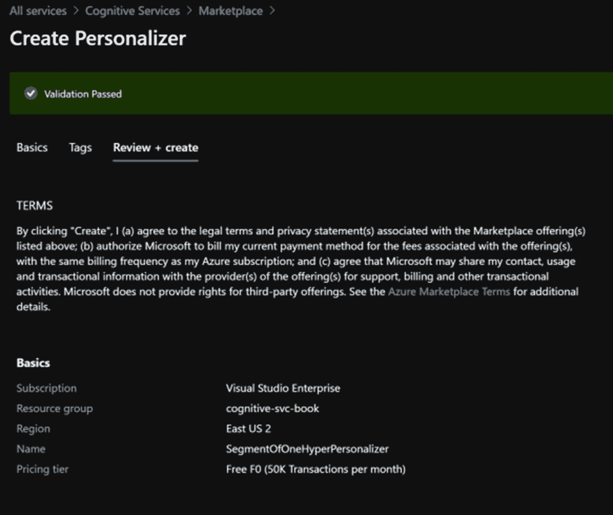

图 6-35

个性化服务–验证屏幕

一旦部署开始，它将根据给定的参数部署实例(参见图 [6-36](#Fig36) )。


图 6-36

个性化服务–部署正在进行中

一旦部署完成，您将看到如图 [6-37](#Fig37) 所示的屏幕。点击**转到资源**按钮导航到下一个屏幕。

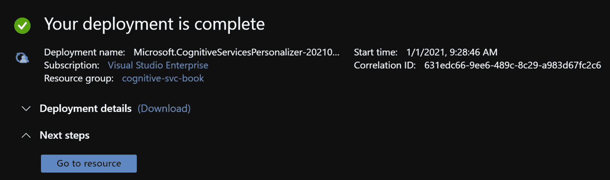

图 6-37

个性化服务–部署完成


图 6-38

个性化服务-快速启动页面

1.  现在我们已经部署了服务，我们可以通过快速启动页面中指定的各种方法来使用它，如图 [6-38](#Fig38) 所示。在我们的例子中，我们将创建一个小的电影推荐个性化器。

像其他认知服务一样，要调用 Personalizer，您需要键和端点。您可以通过点击左侧窗格上的**键和端点**链接找到该信息(参见图 [6-39](#Fig39) )。

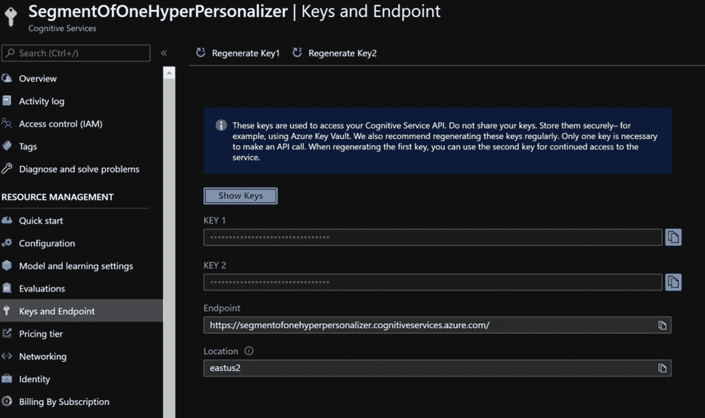

图 6-39

个性化服务–关键和端点信息

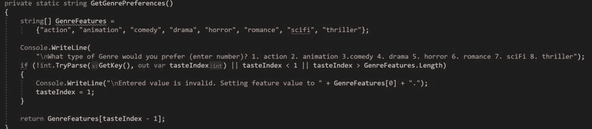

图 6-41

个性化服务演示–getgenrepreference 方法


图 6-40

个性化服务演示–getpopularityfeatures 方法

1.  To help explain this concept, let’s create a simple application that gets trained. It then recommends a movie, based on genre and popularity. We will define these popularity features as follows:

    ```py
    string[] PopularityFeature = {"blockbuster", "indie", "cult-classic"};

    ```

    We define the genre features as follows:

    ```py
    string[] GenreFeatures =
                    {"action", "animation", "comedy", "drama", "horror", "romance", "scifi", "thriller"};

    ```

    We now need to create a list of `RankableAction` for the movies in our catalogue. Think of this as pretraining for the attributes and features that you have in your dataset. The rankable action takes a list of objects, which could be your products, news articles, or shopping cart items. It then applies the ranking and reward functions, based on the model. In this case, our `RankableAction` list looks like the following, which we have shortened for brevity:

    ```py
    IList<RankableAction> actions = new List<RankableAction>
                {
                    new RankableAction
                    {
                        Id = "Interstellar",
                        Features =
                            new List<object>
                            {
                                new
                                {
                                    imdb = 8.6, rottentomatoes = 72, popularityFeature = "blockbuster",
                                    genreFeature = "scifi", plot = "time paradox"
                                }
                            }
                    },

                    new RankableAction
                    {
                        Id = "Gattaca",
                        Features = new List<object>
                        {
                            new
                            {
                                imdb = 7.8, rottentomatoes = 82, popularityFeature = "cult-classic", genreFeature = "scifi",
                                plot = "genetic profiling"
                            }
                        }
                    },

                };

    ```

    这是`IList<RankableAction> GetActions()`方法`.`的一部分，另外两种方法是`GetPopularityFeatures()`和`GetGenrePreferences()`，如图 [6-40](#Fig40) 和 [6-41](#Fig41) 所示。

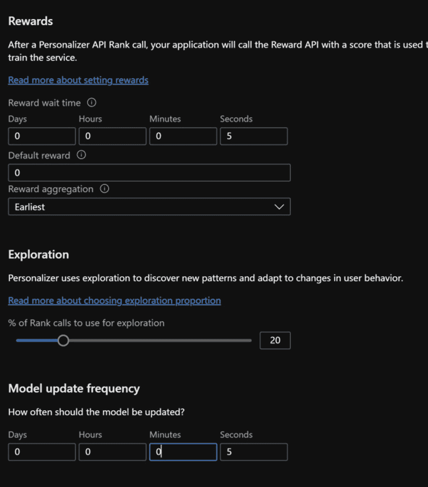

图 6-42

个性化服务-设置模型更新和奖励频率

1.  现在我们已经设置了类型，用一些电影来训练初始模型，我们可以开始调用服务了。但在此之前，让我们将奖励函数的等待时间设置为 5 秒，这样可以更快地重新训练它。如此快速地重新训练可能会有潜在的性能损失，但是对于这个例子来说，这可以忽略不计。您可以从主控制台菜单左窗格中的**型号和学习设置**进入以下屏幕。设置奖励等待时间，然后将模型更新频率设置为五秒。见图 [6-42](#Fig42) 。

1.  要开始排名和奖励过程，您可以按 F5 运行该程序。完整的代码列表可以在本书的 Personalizer 存储库中作为 **program.cs** 文件的一部分获得。我们将演练代码的重要部分。

    First, get the context information, such as the popularity features and movie genre preferences from the users, via the following lines:

    ```py
                    var popularityFeatures = GetPopularityFeatures();
                    var genreFeatures = GetGenrePreferences();

    ```

    Next, create a current context, based on the user’s data as a list of objects. See the following code:

    ```py
                    IList<object> currentContext = new List<object>
                    {
                        new {popularity = popularityFeatures},
                        new {genre = genreFeatures}
                    };

    ```

    You can also create a list of excluded actions, any attributes that you want to be considered for ranking. In this case, we don’t have any, so we will leave it empty, as follows:

    ```py
                    IList<string> excludeActions = new List<string> {""};

    ```

    现在，我们生成一个与请求相关联的事件 ID，如下所示:

```py
                var eventId = Guid.NewGuid().ToString();

```

然后，我们继续对行动进行排名。`RankRequest()`方法采取动作、上下文和排除动作，然后进行服务调用。这个呼叫可以是您现有工作流的一部分，例如末日滚动、提供电影推荐、为您的新客户生成报价等等。请参见以下代码:

```py
                var request = new RankRequest(actions, currentContext, excludeActions, eventId);
                var response = client.Rank(request);

```

您得到的响应有一个奖励操作 ID。记住，这是基于前面设置的`RankableAction`，所以在我们的例子中它将是一个电影推荐。请参见下面一行:

```py
Console.WriteLine("\nPersonalizer service thinks you would like to have: " + response.RewardActionId +". Is this correct? (y/n)");

```

在这里，你打电话。如果您喜欢该建议，您可以相应地调整奖励，模型会进行学习，如下所示:

```py
                if (answer == "Y")
                {
                    reward = 1;
                    Console.WriteLine("\nGreat! Enjoy your movie.");
                }
                else if (answer == "N")
                {
                    reward = 0;
                    Console.WriteLine("\nYou didn't like the recommended movie choice.");
                }

```

您还可以将所有其他动作和相应的概率作为响应对象的一部分。请参见以下代码:

```py
                Console.WriteLine("\nPersonalizer service ranked the actions with the probabilities as below:");
                foreach (var rankedResponse in response.Ranking)
                    Console.WriteLine(rankedResponse.Id + " " + rankedResponse.Probability);

                // Send the reward for the action based on user response.
                client.Reward(response.EventId, new RewardRequest(reward));
                // </reward>

```

接下来，你把奖励发给再培训。这个过程继续学习、探索、利用和再培训，作为循环的一部分，直到你退出。这个循环类似于你的电子商务网站如何运行推荐系统。

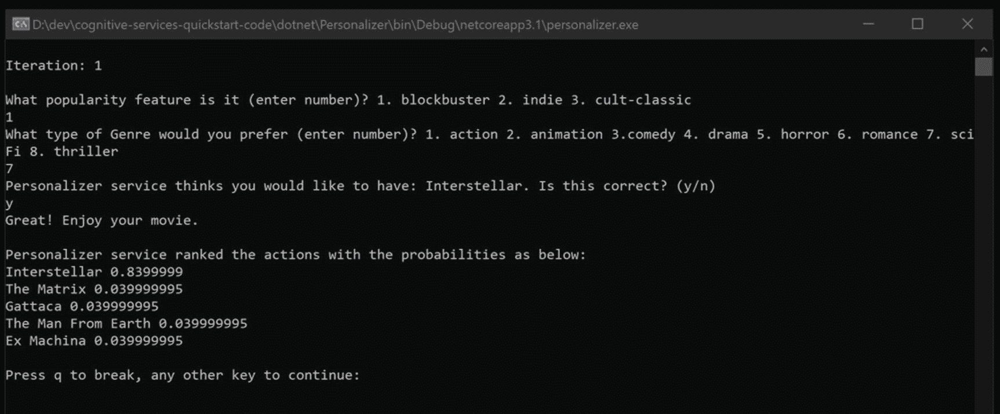

图 6-43

个性化服务–排名和奖励演示

1.  现在，您可以运行这个程序来查看运行中的代码。它会询问受欢迎程度和类型，然后列出推荐的电影。在数据有限的冷启动过程中，所有产品的概率均分。它随着个性化引擎的学习而改变。见图 [6-43](#Fig43) 。

如图 [6-43](#Fig43) 结果显示，*星际*是推荐概率最高的电影，其余项目均以各自的排名显示。训练有多种方式。它包括学徒模式，您可以在不影响生产应用程序的情况下培训个性化人员。学习如何在 [`https://docs.microsoft.com/en-us/azure/cognitive-services/personalizer/concept-apprentice-mode`](https://docs.microsoft.com/en-us/azure/cognitive-services/personalizer/concept-apprentice-mode) 使用学徒模式训练个性化师。您还可以构建功能类型，根据用户的属性为他们创建特定的角色。然后，您可以相应地定制奖励函数。

需要注意的非常重要的一点是，最终的推荐并不总是基于最高的排名。这一概念被称为勘探与开发的权衡。例如，你可能喜欢恐怖电影，但如果我只是一遍又一遍地推荐《驱魔人》,你肯定会错过所有其他恐怖电影，其中可能有鬼魂和食尸鬼、怪物、灵异活动和恶作剧鬼。因此，在搜索空间中平衡探索和利用是很重要的。您应该在更广泛的推荐和利用奖励功能(根据以前的行为最大化奖励)之间取得平衡。这种方法用于扩展模型的比喻视野。你可以在 [`https://docs.microsoft.com/en-us/azure/cognitive-services/anomaly-detector/overview`](https://docs.microsoft.com/en-us/azure/cognitive-services/anomaly-detector/overview) 阅读更多关于如何使用异常检测器服务完成这项工作的信息。

在下一次迭代中，我向我们的推荐人询问了一部独立科幻电影，我得到了*来自地球的人*，这也是一个不错的推荐，尽管它不是最高评级的(如图 [6-44](#Fig44) )。


图 6-44

个性化服务–排名和奖励演示

请记住，下次当你看到一个看似无关的产品时，它是算法在尝试拓宽其强化学习边界。没有这些，你就不会接触到僵尸、反乌托邦或启示录世界以及连环杀手的恐怖分支。

这个例子总结了我们对个性化服务的概述。你可以想象，个性化和推荐系统无处不在，以吸引我们的注意力，并试图在个人层面上更好地了解我们。这些算法越来越擅长于此，当你构建自己的解决方案时，请确保你考虑了与之相关的伦理分歧。微软在 [`https://docs.microsoft.com/en-us/azure/cognitive-services/personalizer/ethics-responsible-use`](https://docs.microsoft.com/en-us/azure/cognitive-services/personalizer/ethics-responsible-use) 提供了一套负责任实现 Personalizer 的指南样本。我们强烈推荐每个构建个性化工具和算法的人阅读这篇文章，无论是使用定制算法还是通过 Personalizer 和其他个性化服务。

在下一节中，我们将回顾异常检测器服务。

## 异常探测器服务

异常或异常值是指偏离数据的正常趋势。这些偏差可能只是噪音，或者可能在这些不寻常的数据点中隐藏了一些非常有趣的方面。这就是为什么在零售、金融服务、医疗保健、制造和网络安全垂直行业中，发现异常现象一直是一个备受关注的话题。通过整合历史数据、季节性和消费者行为特征，有效的异常检测系统能够更好地洞察给企业带来风险或为企业带来新机遇的行为。

异常检测的简单统计方法通常基于基于距离的测量。例如，一种方法是找出有问题的数据点离现有分布有多远，这将确定这是否只是噪声、测量误差或更有趣的东西。这些方法可以粗略地分为基于预测置信度的方法、统计方法和基于聚类的方法。

例如，一个通常每月在食品杂货和超市只花 500 美元的顾客，在 2020 年 3 月突然将支出增加了一倍。这个异常值会被标记出来，但一个更复杂的模型会意识到，这种模式正在全球出现，与新冠肺炎支出上升和卫生纸囤积相一致。纳入季节性有助于建立一个稳健且可调整的模型。

再举一个例子，你的银行注意到你的卡上有 100 美元的 Robux 或 V-Bucks 费用。因为以前没有这种游戏内货币支出水平的历史，他们知道要么是你的孩子以某种方式哄骗你为他们的游戏购买这些虚拟美元，要么是有人滥用你的卡。这些不同类型的异常值有助于识别数据中有趣的模式，对理解消费者行为非常有帮助。

用于确定异常值的典型方法包括 z 得分(与平均值的偏差)或极值分析(EVA)、线性回归模型(如主成分分析或最小平方中位数)、基于邻近的模型、信息理论方法或高维稀疏模型。异常检测是细微的，异常检测器服务通过允许您传递时间序列数据并以自动方式识别这些数据点中的异常行为来提取细节。服务 API 提供关于期望值的信息，并检测哪些数据点是异常的(我们很快就会看到)。

How it works

该解释摘自 Ren 等人的论文*“微软的时序异常检测服务”。该白皮书概述了“时序异常检测服务”背后的算法，该服务可帮助客户持续监控时序并及时提醒潜在事件。在本文中，我们介绍了我们的异常检测服务的流水线和算法，它被设计为准确、高效和通用的。该管道由三个主要模块组成，包括数据摄取、实验平台和在线计算。针对时间序列异常检测问题，提出了一种基于谱残差和卷积神经网络的新算法。我们的工作首次尝试将视觉显著性检测领域的随机共振模型用于时间序列异常检测。此外，我们将随机共振和细胞神经网络结合起来，以提高随机共振模型的性能。与公共数据集和微软生产数据上的最先进基线相比，我们的方法取得了优异的实验结果。”*论文可从 [`https://arxiv.org/abs/1906.03821`](https://arxiv.org/abs/1906.03821) 下载。

微软提供了一个优秀的异常检测器演示( [`https://algoevaluation.azurewebsites.net/`](https://algoevaluation.azurewebsites.net/) )来帮助你理解这个服务是如何从时间序列数据中识别异常的。API 对批处理数据和流数据都进行操作，它可以识别与正常事件模式的偏差。有三个数据样本可用。一个示例包括内置的季节性，供您尝试不同的场景并发现具有不同参数的异常值。你可以在图 [6-45](#Fig45) 中看到演示。

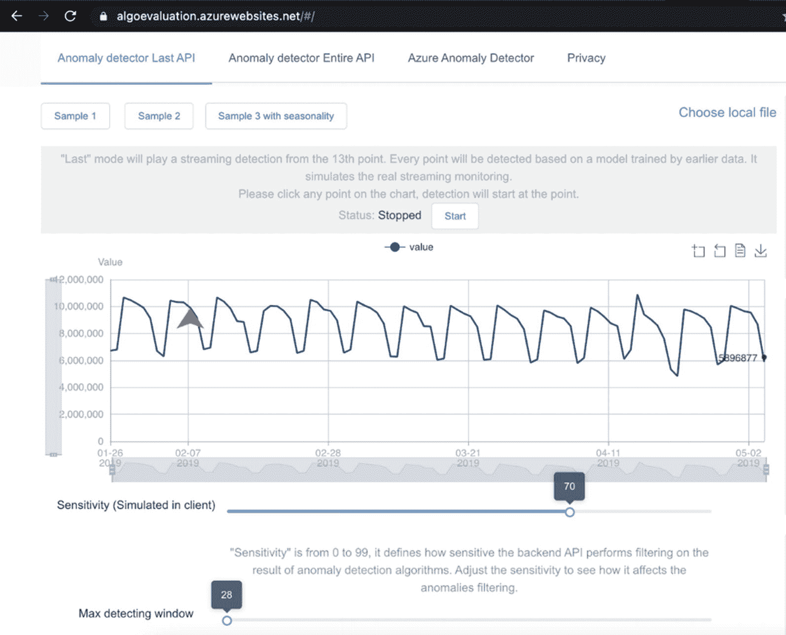

图 6-45

异常检测器演示

### 尝试一下——异常检测器演示

为了有效地展示异常检测器服务的使用，我们将遵循以下步骤:


图 6-46

认知服务–设置异常检测器服务

*   让我们创建一个异常检测器服务实例，如图 [6-46](#Fig46) 所示。您将重复前面的过程:从 [`https://portal.azure.com`](https://portal.azure.com) 开始，搜索异常检测器服务，然后继续创建您的工作。

设置异常检测器服务参数，然后点击**创建**。该服务验证参数，然后创建实例。见图 [6-47](#Fig47) 。

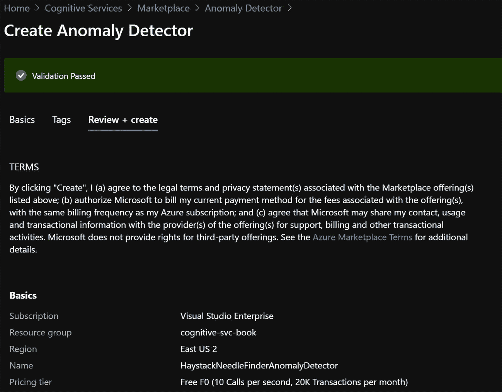

图 6-47

认知服务-异常检测器服务验证完成

一旦部署完成，您将看到图 [6-48](#Fig48) 中的屏幕。点击**转到资源**继续。


图 6-48

认知服务-异常检测器服务部署完成

快速启动页面是开始使用异常检测器服务的好方法。最好的方法之一是查看图 [6-49](#Fig49) 中第 2 节所示的 API 控制台。点击 **API 控制台**链接进入 API 控制台。


图 6-49

异常检测器服务-快速入门


图 6-50

异常检测器批量调用

1.  API 控制台是一个基于 web 的 UI，展示异常检测器的功能，如图 [6-50](#Fig50) 所示。您可以在 [`https://westus2.dev.cognitive.microsoft.com/docs/services/AnomalyDetector/operations/post-timeseries-entire-detect/console`](https://westus2.dev.cognitive.microsoft.com/docs/services/AnomalyDetector/operations/post-timeseries-entire-detect/console) 访问控制台。

控制台需要订阅密钥(如图 [6-51](#Fig51) 所示)。可以从主控制台中的**键和端点**链接获取密钥。


图 6-51

认知服务实例化–关键点和端点

请求正文预先填充了时间序列数据和一组值。这些值作为 HTTP 请求的一部分被传递给异常检测器服务(如图 [6-52](#Fig52) 所示)。

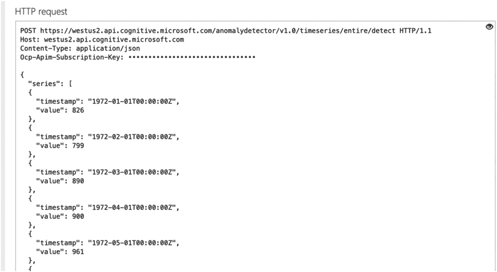

图 6-52

异常检测器服务笔记本-请求

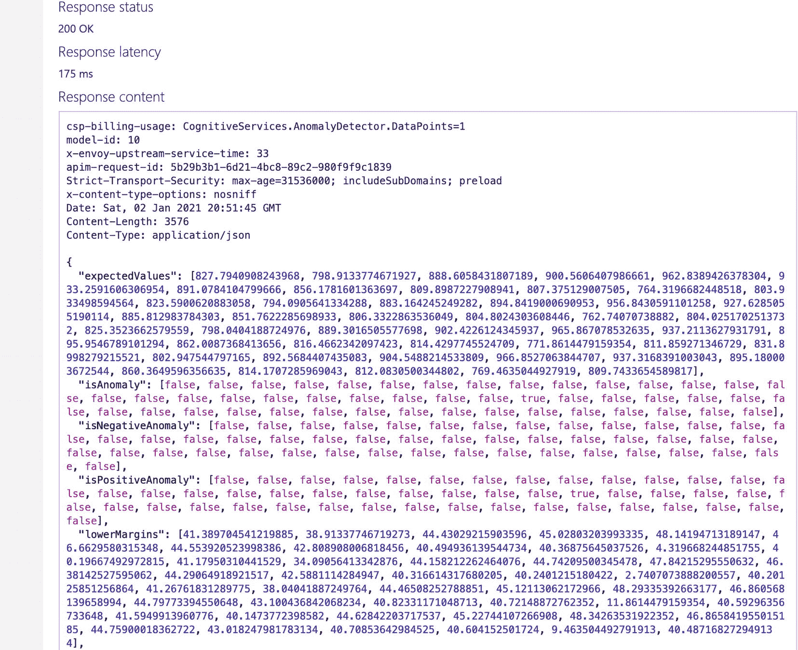

图 6-53

异常检测器服务笔记本–响应

1.  一旦被调用，异常检测器服务就会施展魔法，返回详细的响应，包括预期的值和异常。异常是方向性的(例如正异常与负异常)，并且您还可以看到这些结果的范围。异常检测器 SDK 和 API 响应的详细信息可以在 [`https://docs.microsoft.com/en-us/dotnet/api/microsoft.azure.cognitiveservices.anomalydetector.models?view=azure-dotnet-preview`](https://docs.microsoft.com/en-us/dotnet/api/microsoft.azure.cognitiveservices.anomalydetector.models%253Fview%253Dazure-dotnet-preview) 找到。参见图 [6-53](#Fig53) 中的示例响应。


图 6-54

Anaconda 导航器环境

1.  与前面两个例子不同，在前面两个例子中，我们将解决方案创建为. NET 应用程序，我们将用 Anaconda 向您展示 Jupyter 笔记本的世界。笔记本对于数据科学家来说，就像 IDE 对于软件开发人员一样。许多软件工程师正转而使用笔记本来完成他们的 Python 工作，这是因为它们易于使用且无状态。

    微软提供了自己版本的笔记本，名为 Azure notebooks ( [`https://notebooks.azure.com/`](https://notebooks.azure.com/) )，已经退役。现在你将能够使用带有 Azure 机器学习的笔记本(参见 [`https://docs.microsoft.com/en-us/azure/notebooks/quickstart-export-jupyter-notebook-project#use-notebooks-with-azure-machine-learning`](https://docs.microsoft.com/en-us/azure/notebooks/quickstart-export-jupyter-notebook-project%2523use-notebooks-with-azure-machine-learning) )。在这个实验中，我们将使用基于 Anaconda 的 Jupyter 笔记本。从 [`www.anaconda.com/products/individual`](http://www.anaconda.com/products/individual) 下载安装 Anaconda 开始。一旦安装完成，您将看到一个类似于图 [6-54](#Fig54) 的屏幕。

继续点击 JupyterLab 面板上的 **Launch** 按钮，打开 Jupyter 环境。

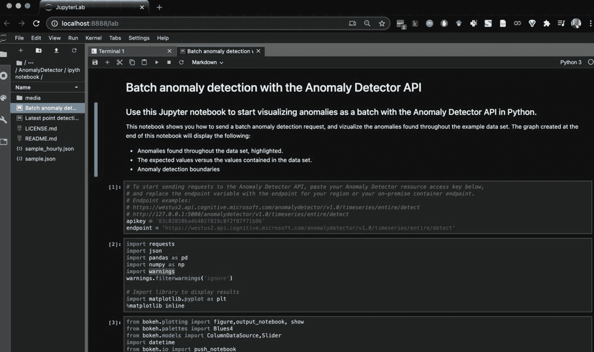

图 6-55

异常探测器服务笔记本

1.  对于这个例子，我们将使用 Azure Samples 提供的异常检测器笔记本。可以从 [`https://github.com/Azure-Samples/AnomalyDetector`](https://github.com/Azure-Samples/AnomalyDetector) 克隆 GitHub 库。该存储库包含示例数据、Python 笔记本和快速入门示例。克隆完成后，导航到文件夹`\AnomalyDetector\ipython-notebook`，从左侧窗格打开文件`Batch anomaly detection with the Anomaly Detector API.ipynb`(如图 [6-55](#Fig55) )。


图 6-56

异常检测器维修记录–初始化先决条件

1.  使用异常检测器 API，您可以在时间序列数据中执行批处理和点(流)识别。批量检测适用于特定时间跨度内的一批数据点，而流式异常值是在每个数据点上连续监控的。异常检测器 API 是一个无状态服务，它的性能在很大程度上取决于时序数据准备、使用的 API 参数和数据点的数量。在这个例子中，我们设置了所有的先决条件，包括 Bokeh，交互式可视化库，如图 [6-56](#Fig56) 所示。


图 6-57

异常检测器维修手册——检测方法

1.  一旦所有先决条件都设置好了，您就可以通过`detect()`方法调用 API，该方法获取数据集、订阅键和端点，然后它调用服务。图 [6-57](#Fig57) 显示了该方法的描述。


图 6-58

异常检测器服务-每小时采样频率

1.  一旦完成，运行每小时采样频率分析仪(单元#6)，如图 [6-58](#Fig58) 所示。构建图方法采用两个参数，样本数据和敏感度，然后用边界、期望值和实际值绘制异常值。

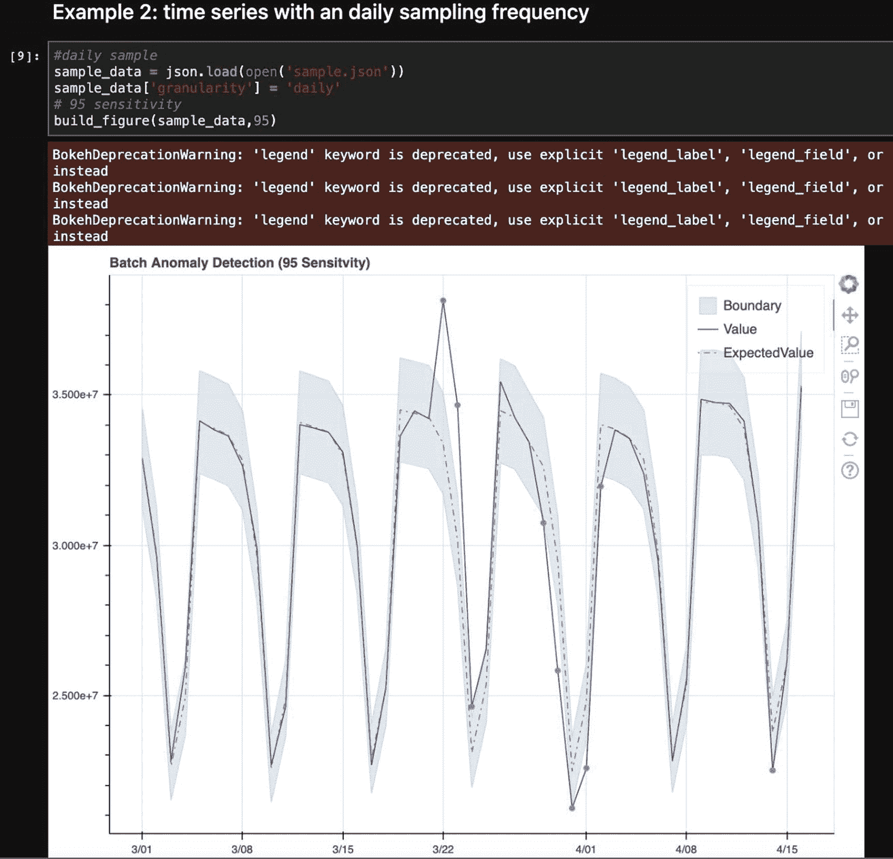

图 6-59

异常检测器服务–每日采样频率

1.  与每小时采样类似，您可以通过调用单元格#9，以每天的采样频率执行时间序列，如图 [6-59](#Fig59) 所示。这里，我们将粒度设置为每天(而不是每小时)并构建图表。它显示了数据集中的每日异常值，以及相关的边界、值和期望值。

我们对异常检测器服务的介绍到此结束。你可以在微软文档的 [`https://docs.microsoft.com/en-us/azure/cognitive-services/anomaly-detector`](https://docs.microsoft.com/en-us/azure/cognitive-services/anomaly-detector) 中找到更多关于异常检测器的信息。

## 度量指导(预览)

Azure 认知服务的最新成员之一是 Metrics Advisor(参见 [`https://azure.microsoft.com/en-us/services/cognitive-services/metrics-advisor`](https://azure.microsoft.com/en-us/services/cognitive-services/metrics-advisor) )。这是异常值分析服务的一个特例。在撰写本文时，Metrics Advisor 处于预览阶段，这意味着屏幕和底层服务可能会发生变化。Metrics Advisor 是一种认知服务，有助于监控不同的指标，并帮助进行根本原因分析。工作流程步骤如图 [6-60](#Fig60) 所示。

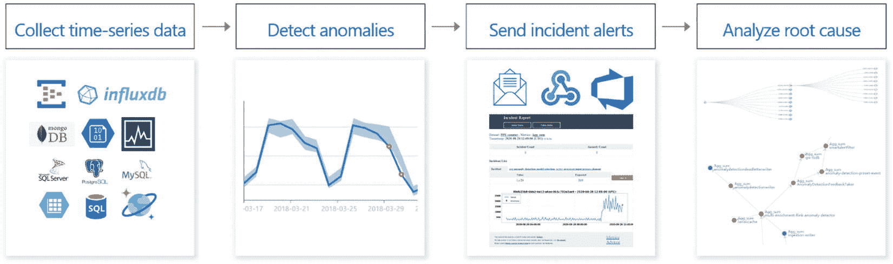

图 6-60

度量顾问工作流，由 Microsoft Docs 提供

将人工智能和机器学习应用于运营是一个令人非常感兴趣的领域。事实上，它带来了 it 运营中一个全新的子领域，称为 AIOps。这就是人工智能技术用于从各种事件管理系统获取数据、执行异常检测和相应诊断的地方。Metrics Advisor 用于关联和分析来自多个来源的数据。然后，它诊断异常和相关的根本原因。与异常检测器服务不同，Metrics Advisor 不仅关注异常值检测，还帮助进行根本原因分析和事件警报管理。

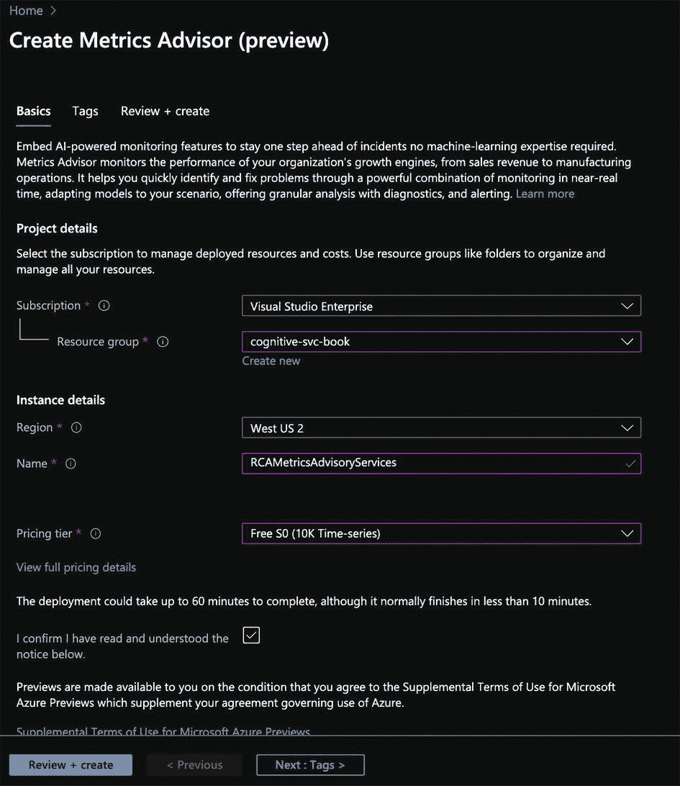

图 6-61

度量顾问控制台–设置

1.  像所有认知服务一样，我们首先在 portal.azure.com 创建一个度量顾问实例，并设置参数。见图 [6-61](#Fig61) 。

在这种情况下，部署需要一段时间(大约 22 分钟)才能完成，可能是因为服务仍处于预览阶段。见图 [6-62](#Fig62) 。

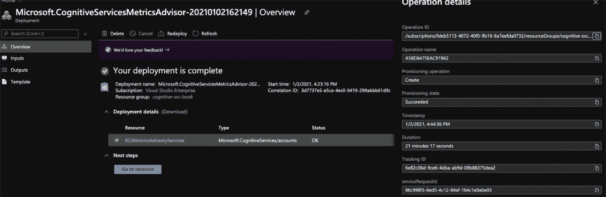

图 6-62

度量顾问控制台-部署完成

单击**转到资源**以打开快速启动页面，该页面显示了您可以使用指标咨询服务做什么的多个选项。第一步点击**进入你的工作场所**。见图 [6-63](#Fig63) 。

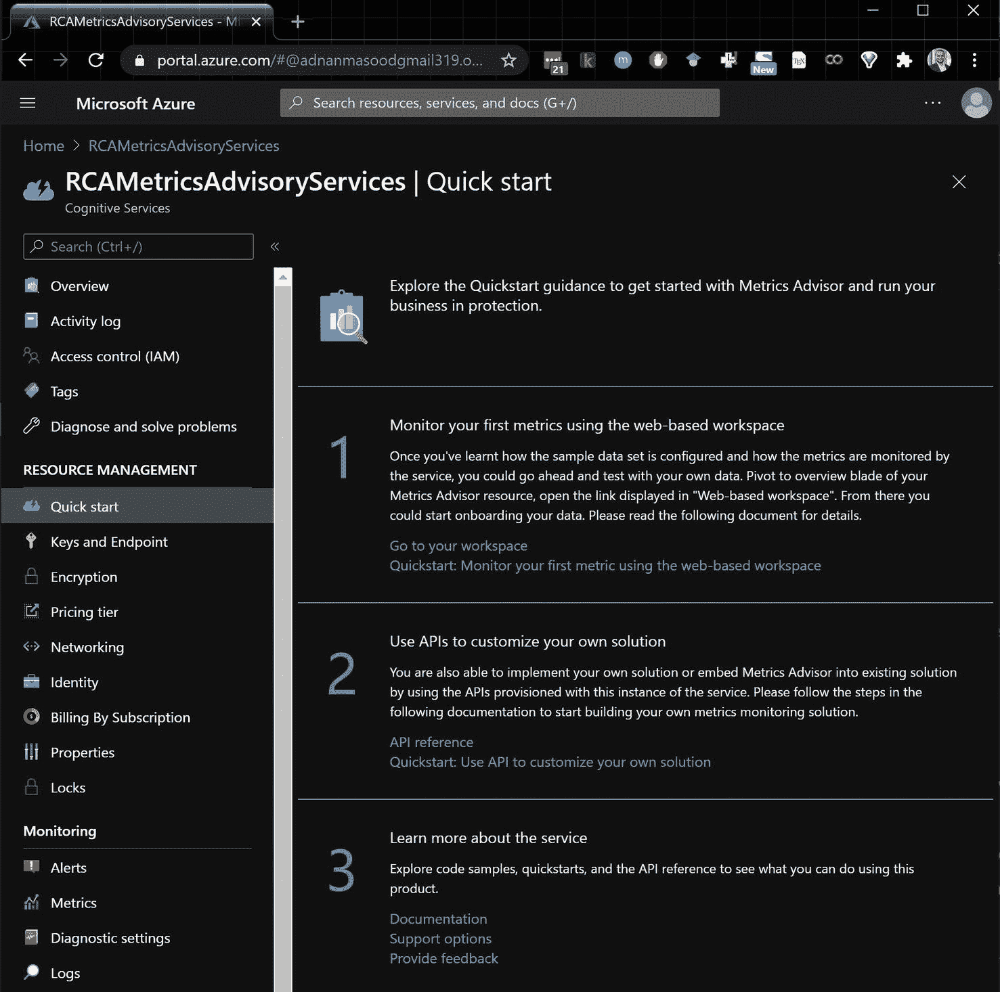

图 6-63

Metrics Advisor 控制台–快速入门


图 6-64

度量顾问服务控制台

1.  这将带您进入 [`https://metricsadvisor.azurewebsites.net`](https://metricsadvisor.azurewebsites.net) ，在这里您可以登录并创建自己的顾问(如图 [6-64](#Fig64) )。在此页面上，您可以指定目录(组织)、订阅和关联的工作区。


图 6-65

度量顾问服务控制台

1.  完成后，您将逐步完成详细的 Metrics Advisor 演示，以熟悉环境。这包括数据源的创建，如图 [6-65](#Fig65) 所示。

接下来，您选择度量的粒度(时间段)，如图 [6-66](#Fig66) 所示。


图 6-66

度量顾问服务控制台–设置

您可以执行时间序列数据的基本配置，例如第一个可用的时间戳(参见图 [6-67](#Fig67) )。


图 6-67

度量顾问服务控制台

提供初始设置信息后，您现在可以使用数据馈送并与之交互，创建作为事件中心一部分的馈送，查看度量图，创建数据挂钩，并访问 API 密钥以使用来自服务的数据。见图 [6-68](#Fig68) 。


图 6-68

度量顾问服务控制台

Metrics Advisor 门户可帮助您装载指标数据(如事件日志和 SIEM 数据)，提供诊断见解，可视化指标，改进特定用例的检测配置，以及创建异常值警报。

这一全新但全面的指标顾问服务正在根据客户需求和反馈不断发展。它将很快成为令人惊叹的认知服务套件的正式成员。敬请关注。

## 总结和结论

在本章中，您已经对基于决策的认知服务和决策 API 的工作原理有了基本的了解。您已经创建了一个内容仲裁者应用程序，使用 Personalizer 实现了个性化体验，使用异常检测器查看了时间序列异常，并使用 Metrics Advisor 服务探索了 AIOps 前景。正如您可能意识到的，很难在任何重要的细节层次上涵盖这些服务。因此，我们很抱歉忽略了一些事情(为了保持相对简短)。请放心，链接和 Microsoft 文档有足够的信息供您进一步探索。

现在轮到您了——我们迫不及待地想听听您如何在您的组织内使用这些服务，以做出重要的决策！

## 参考资料和进一步阅读

*   **蔚蓝认知服务文档:** [`https://docs.microsoft.com/en-us/azure/cognitive-services`](https://docs.microsoft.com/en-us/azure/cognitive-services)

*   **微软时序异常检测服务:** [`https://arxiv.org/abs/1906.03821`](https://arxiv.org/abs/1906.03821)

*   **个性化器负责实现指南:** [`https://docs.microsoft.com/en-us/azure/cognitive-services/personalizer/ethics-responsible-use`](https://docs.microsoft.com/en-us/azure/cognitive-services/personalizer/ethics-responsible-use)

*   **个性化器文档:** [`https://docs.microsoft.com/en-us/azure/cognitive-services/personalizer`](https://docs.microsoft.com/en-us/azure/cognitive-services/personalizer)