# 7.搜索–为您的应用程序添加搜索功能

尤达大师死时多大？

一升有多少夸脱？

福勒街的波霸餐馆开到多晚？

好吧，谷歌，发出猫的声音。

最后一个请求可能不太相关。无论如何，从我们的日常行为中可以明显看出，数字搜索已经成为现代人类思维的延伸。搜索无处不在——在我们的个人生活中，在我们创建和工作的公司里；我们在日常生活中不断寻找信息。随着我们寻找的信息变得更加多样化、多模态和分散化，搜索变得越来越复杂。我们现在严重依赖于上下文敏感的自然语言搜索，其中答案跨越多个文档(包括图像、pdf、文本文件和结构化数据)。我们的搜索还包括人和地点、个人和企业名称以及其他实体，这些可能需要自动更正拼写和意图。

通过提问，我们通过搜索引擎探索互联网，我们探索数据点，我们寻找教程、指南和操作视频。我们还会在公司内部网门户上查询假期/休假申请和共同支付金额，搜索医疗服务提供商的覆盖范围和位置，并调查特定合同中包含哪些法律条款。尽管我们对所有这些信息的探测变得相当好，但数据本身并不会自动地让自己那么容易被检查。

根据大多数估计，超过 80%的组织数据是非结构化的。(参见“什么是非结构化数据，为什么它对企业如此重要？”在 [`www.forbes.com/sites/bernardmarr/2019/10/16/what-is-unstructured-data-and-why-is-it-so-important-to-businesses-an-easy-explanation-for-anyone`](http://www.forbes.com/sites/bernardmarr/2019/10/16/what-is-unstructured-data-and-why-is-it-so-important-to-businesses-an-easy-explanation-for-anyone) 。)所有这些非结构化数据导致了信息提取的实际挑战，例如解析、光学字符识别、命名实体识别、依存解析以及其他数据丰富需求。但是不用担心，微软的人工智能搜索可以帮上忙！

在这一章中，我们将通过向应用程序添加各种搜索功能来提供关于 Bing 搜索 API 和 Azure 认知搜索的见解。在本章中，你将学习做以下事情 **:**

1.  了解搜索、Bing 搜索 API 和认知搜索。

2.  通过添加 Bing Search Azure 认知搜索功能来创建智能搜索应用。

我们开始吧。

## 搜索生态系统

微软的搜索生态系统已经经历了几次迭代，这很容易解释，如下所示。

Azure 认知搜索，原名 Azure Search，是微软的企业搜索能力(在这里你可以选择自己的数据源进行抓取和索引)。因此，即使它在技术上可以包含网络搜索，它也不止于此。您还可以选择索引的频率。本质上，您可以创建自己的数据源混搭来进行索引。

必应搜索特指微软的企业网络搜索。您可以从 web 上创建您希望允许您的企业搜索的域孤岛。Azure 认知搜索是一个定制的企业搜索。它可以存储在内部、私有和企业特定的数据中，并可以选择包括自定义的公共域。相比之下，必应搜索是可以过滤的公共领域。

目前，Bing 搜索 API 被列为 Azure 认知服务的一部分，这可能会造成混乱。然而，微软已经宣布，Bing 搜索 API 将于 2023 年 10 月 31 日从 Azure 认知服务过渡到 Azure market place<sup>[1](#Fn1)</sup>，这将有助于解决关注点分离的问题。根据公告，*“使用认知服务提供的 Bing 搜索 API 将在未来三年内得到支持，或者直到您的企业协议到期，以先到者为准。”*

## Azure 认知搜索

Azure Cognitive Search 以前称为 Azure Search，是一种人工智能支持的搜索服务，具有广泛的数据丰富功能，包括 OCR、NER 和关键短语提取。Azure 认知搜索作为一项完全托管的服务，由微软研究院在 NLP、Office、Bing 和其他搜索解决方案方面数十年的工作提供支持。Azure Cognitive Search 在一些数据源上具有爬行功能，提供地理空间搜索、过滤、自动完成和搜索堆叠或分面功能。定制模型有助于支持您的主题，以及特定领域的客户需求。更多服务内容请点击 [`https://azure.microsoft.com/en-us/services/search/`](https://azure.microsoft.com/en-us/services/search/) 。

### 使用 Azure 认知搜索进行搜索


图 7-1

Microsoft Azure 门户产品搜索结果

1.  在 Azure 门户中，搜索 Azure 认知搜索，然后点击下拉菜单中出现的“Azure 认知搜索”搜索结果(如图 [7-1](#Fig1) )。选择 Azure 认知搜索。


图 7-2

Microsoft Azure 认知搜索–创建产品屏幕

1.  图 [7-2](#Fig2) 中的屏幕显示了 Azure 认知搜索的所有功能和特性。如前所述，这包括可伸缩性、可管理性、功能丰富性(OCR、NER、刻面)和定制模型。单击创建继续。


图 7-3

Azure 认知搜索–创建实例

1.  填写信息以创建服务。这包括订阅信息、唯一 URL、资源组、位置和定价信息(如图 [7-3](#Fig3) 所示)。

以下定价信息(图 [7-4](#Fig4) )针对不同层级。它可能会发生变化，在此仅作为示例参考。请在使用前查看当前的定价信息。

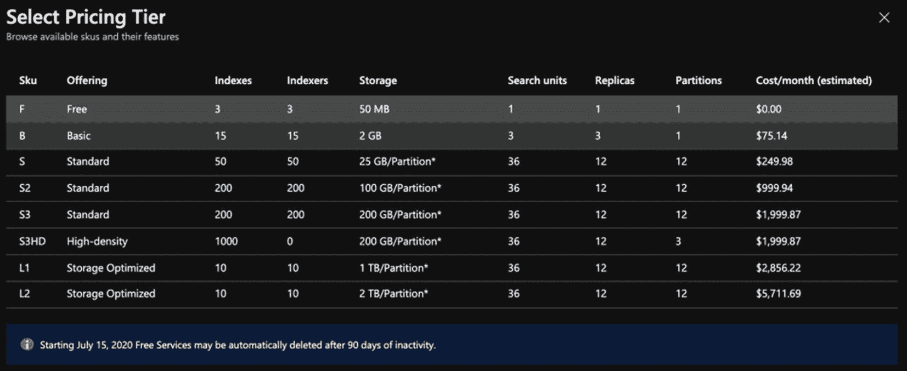

图 7-4

Azure 认知搜索–选择定价层

Note

确保您的搜索实例和用于丰富数据的认知服务实例位于同一区域非常重要。如果您希望迁移您的服务，请确保这些服务在目标地区 <sup>[2](#Fn2)</sup> 受支持。


图 7-5

Azure 认知搜索–部署完成

1.  一旦创建完服务，您将看到图 [7-5](#Fig5) 中的屏幕。点击**转到资源**查看完整的仪表板。

认知服务仪表板(如图 [7-6](#Fig6) 所示)包括配额、服务状态、位置、订阅信息、位置和使用信息的详细信息。这个仪表板非常方便，可以监控存储和索引在附加数据源上的表现。


图 7-6

Azure 认知搜索–仪表板

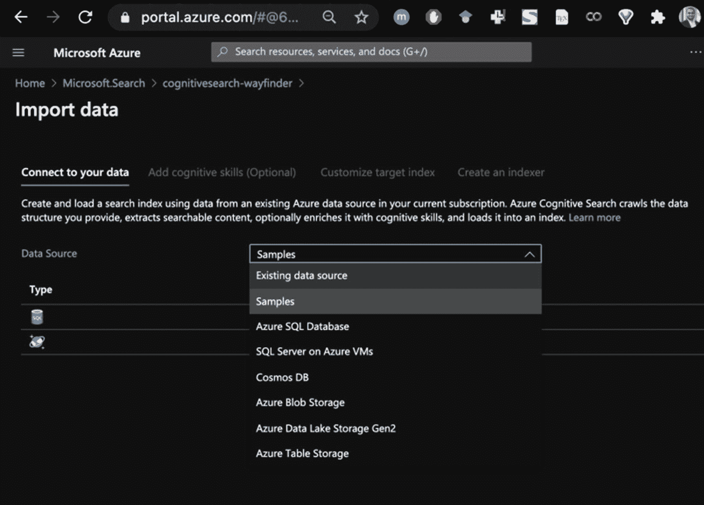

图 7-7

Azure 认知搜索-导入数据

1.  现在我们已经创建了一个搜索服务实例，让我们导入一些要搜索的数据。点击仪表盘顶部菜单中的**导入数据**，将会出现如图 [7-7](#Fig7) 所示的界面，连接您的数据。完成以下四个步骤:
    1.  连接到数据源(如 Azure SQL 数据库、Azure 虚拟机上的 SQL Server、Cosmos DB、用于文档和 pdf 的 Azure Blob 存储、Azure 数据湖存储 Gen2 或 Azure 表存储)。

    2.  添加认知技能进行充实(如 NER、关键短语提取等)。

    3.  自定义目标实例。

    4.  最后，创建一个索引器。

为了简单起见，我们将从样本中导入数据，特别是房地产样本(如图 [7-8](#Fig8) 所示)。


图 7-8

Azure 认知搜索–导入数据集

数据来自 SQL，包含房屋的房地产信息。下一步是添加充实或认知技能，如图 [7-9](#Fig9) 。在这种情况下，我们将执行一些有限的丰富来识别实体。


图 7-9

Azure 认知搜索–增加认知技能

认知服务丰富包括提取人、组织和位置名称，检测关键短语，以及提取个人身份信息(PII)。您可以创建自定义内容，并添加特定领域的技能来识别您的行业关键字和短语。例如，ICD-10-CM/PCS 医疗编码参考可以被映射到相应的诊断和过程关键字。在 Azure 认知搜索丰富管道中，你可以做很多事情来构建定制技能。你可以通过 [`https://docs.microsoft.com/en-us/azure/search/cognitive-search-attach-cognitive-services#limits-when-no-cognitive-services-resource-is-selected`](https://docs.microsoft.com/en-us/azure/search/cognitive-search-attach-cognitive-services%2523limits-when-no-cognitive-services-resource-is-selected) 在 Azure 认知搜索中阅读关于将认知服务资源附加到技能集的详细信息。在本练习中，我们将仅执行命名实体识别丰富。参见图 [7-10](#Fig10) 。

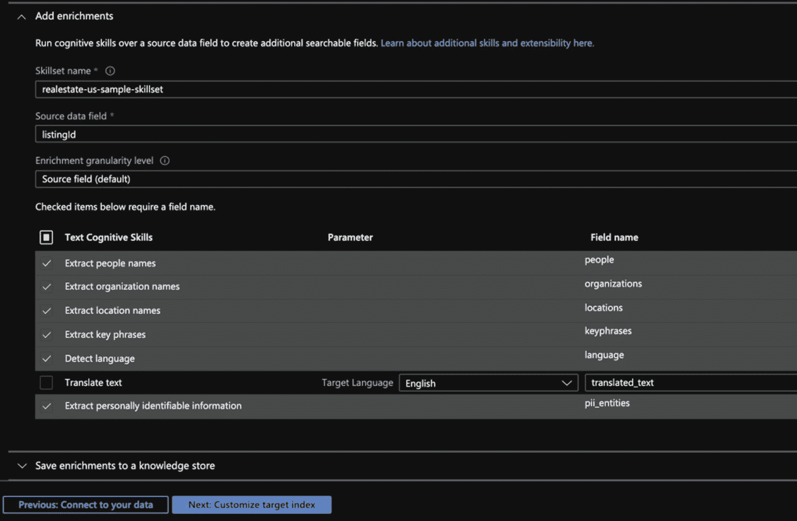

图 7-10

Azure 认知搜索–增加认知技能

添加认知技能丰富之后，Azure 认知搜索设置的下一步是创建目标索引。如果您熟悉其他搜索程序，如 Apache Solr、Apache Lucene 或 Elasticsearch，您可能知道索引有助于加快搜索速度。它存储用于全文搜索的内容，因此它经过优化，可以使用物理模式进行更快的搜索。在图 [7-11](#Fig11) 中，您将找到推荐的索引，以及列出的可检索、可过滤、可排序、可分面和可搜索的字段。这个目标索引为您提供了对数据的良好控制，因此您可以精确地包含或排除要在搜索中包含的属性。对于数字值，比如卧室和浴室的数量，你可以要求它是可排序的。微软已经使预先选择默认值变得非常容易，如图 [7-11](#Fig11) 所示。

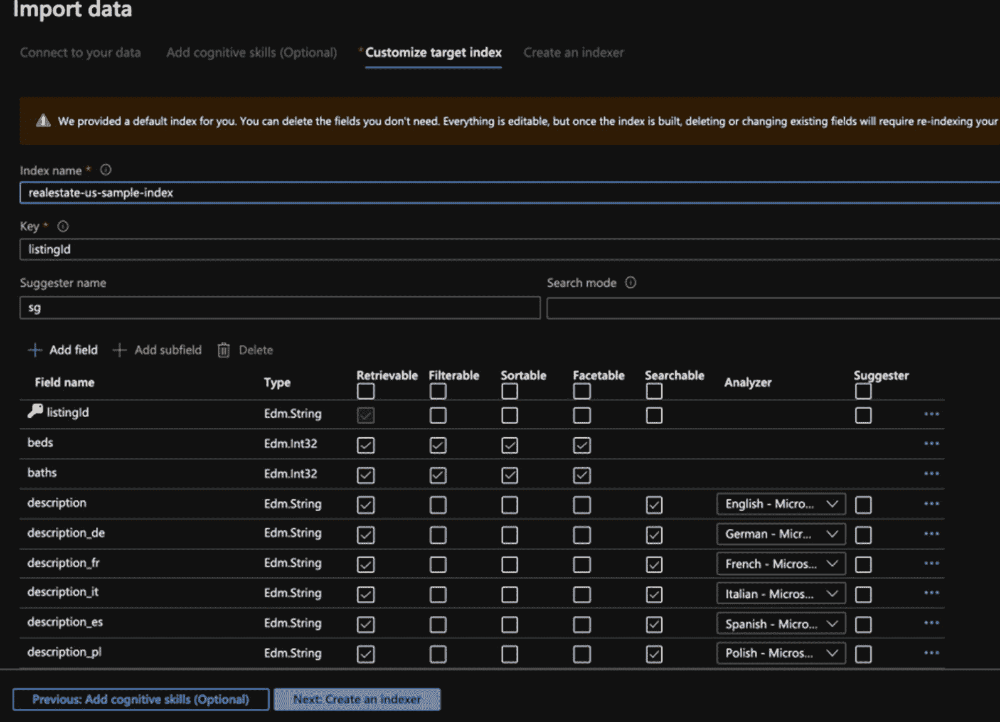

图 7-11

Azure 认知搜索–定制目标索引

最后一步是创建一个索引器，并定义您希望它运行的频率(参见图 [7-12](#Fig12) )。

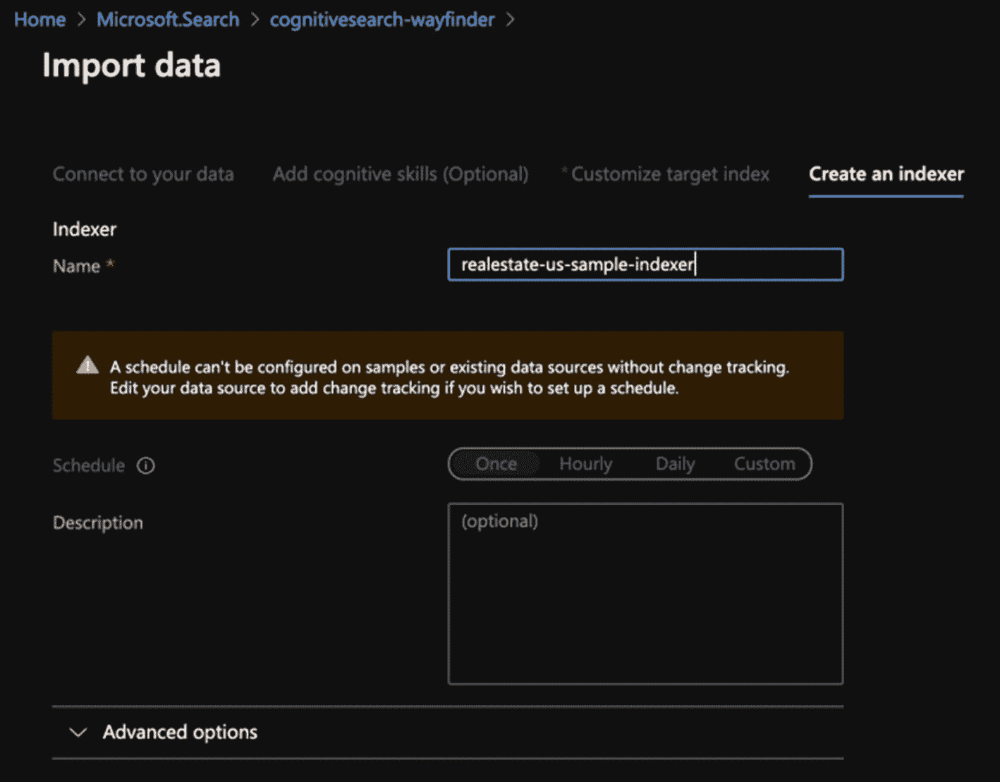

图 7-12

Azure 认知搜索–创建一个索引器

### 测试 Azure 认知搜索

创建索引器后，您可以返回到仪表板并查看进度。您可以直接从控制台调用服务。搜索浏览器为您提供了直接从 Azure 门户进行搜索的能力，因此您可以看到请求和响应(结果),并确保它满足您的业务需求。图 [7-13](#Fig13) 演示了从搜索浏览器调用服务。

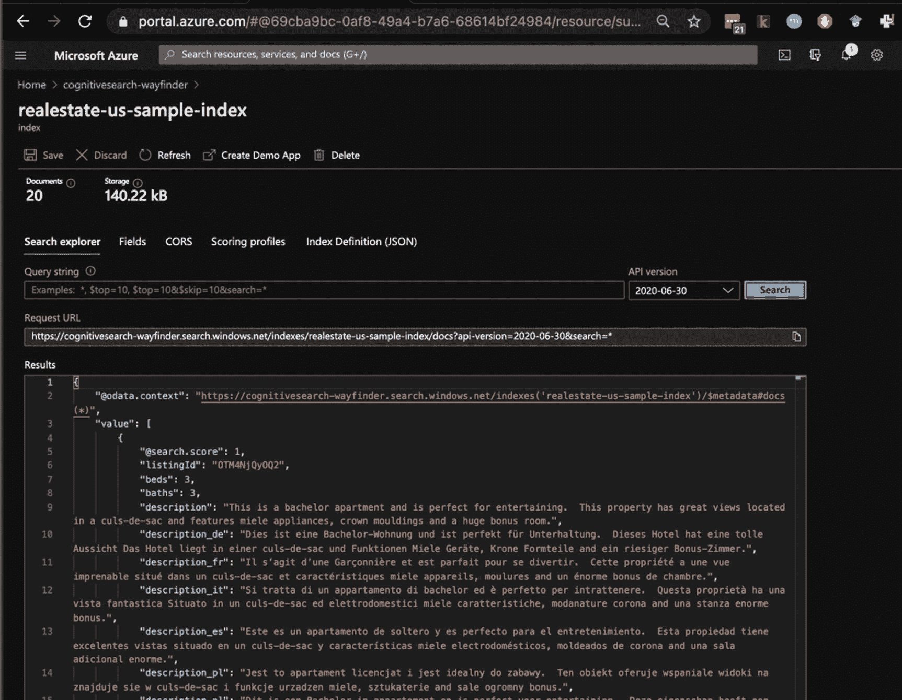

图 7-13

Azure 认知搜索——调用服务

微软让你可以很容易地将服务作为应用程序的一部分来使用。search explorer 工具还附带了一个预构建的基于 HTML 和 JavaScript 的应用程序，作为在应用程序中构建和测试搜索结果的入门指南。点击**创建演示 App** 继续，您将看到如图 [7-14](#Fig14) 所示的屏幕，要求您启用 CORS(跨原点资源共享)。


图 7-14

Azure 认知搜索——实现 CORS

CORS 是一种基于 HTTP 头的机制，它为跨域调用提供了限制措施。通过启用它，您允许桌面上的 HTML 文件可以调用 Azure 上的 RESTful API。在现实中(读生产)，你可能想更小心，但这适用于演示应用程序。现在，您可以开始为结果、侧栏和建议配置演示应用程序(如图 [7-15](#Fig15) 所示)。


图 7-15

Azure 认知搜索–创建演示应用

瞧啊。我们有一个产品列表搜索引擎。HTML 文件 AzSearch.html 包含进行 API 调用以及获取搜索和推荐结果所需的代码。例如，我们搜索一个家，如图 [7-16](#Fig16) 所示。

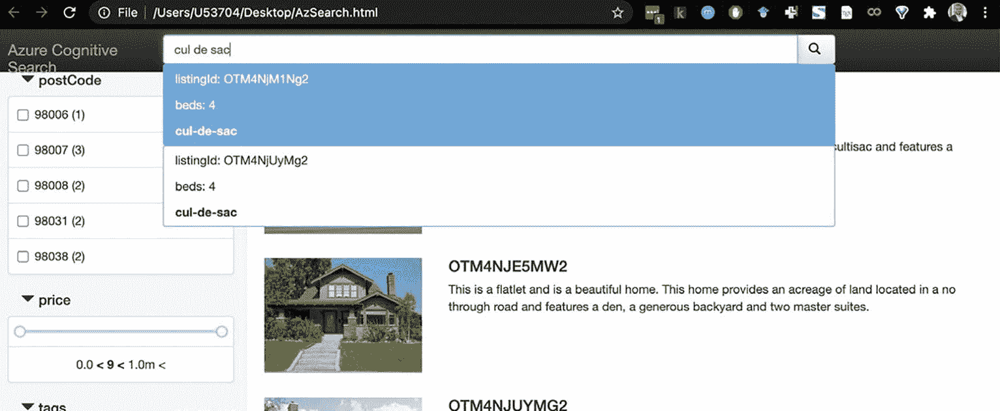

图 7-16

Azure 认知搜索-房地产搜索应用程序

搜索返回可能的匹配，如图 [7-17](#Fig17) 所示。


图 7-17

Azure 认知搜索–搜索应用程序结果

令人印象深刻的是，我们可以如此快速地开始使用可搜索的房地产存储库。因为数据已经存在，所以用最少代码或不使用代码的方法以闪电般的速度进行搜索的能力，对许多组织来说都是强大的。

在下一个例子中，我们将使用 Azure 认知搜索作为 Jupyter 笔记本的一部分。

### 将 Azure 认知搜索集成到您的笔记本中

在第 [6](06.html) 章中，我们讨论了 Jupyter notebook、Anaconda，以及这些自包含的、可执行的 Python 笔记本的绝对有效性，这对数据科学家来说非常方便。在这个例子中，我们将演示如何创建和调用 Azure 认知搜索 Python SDK。

1.  首先，从 GitHub 中克隆库 <sup>[3](#Fn3)</sup> (在 [`https://github.com/Azure-Samples/azure-search-python-samples/tree/master/Quickstart/v11`](https://github.com/Azure-Samples/azure-search-python-samples/tree/master/Quickstart/v11) )。将其作为 Jupyter 笔记本的一部分打开，如图 [7-18](#Fig18) 所示。

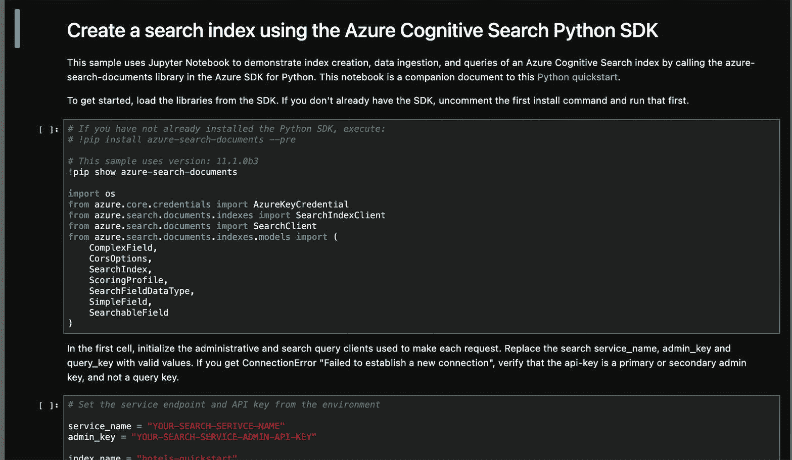

图 7-18

Azure 认知搜索 Python SDK–创建搜索索引

一旦打开，取消对 *azure-search-documents* 包的注释，以确保您具备先决条件，然后运行第一个单元。在幕后，您从 JSON 文件中加载了 Azure Cognitive Search 示例酒店数据集 <sup>[4](#Fn4)</sup> ，该数据集由美国城市中的 50 家酒店组成，包含图像、酒店和房间信息。见图 [7-19](#Fig19) 。


图 7-19

Azure 认知搜索–安装先决条件

完成先决条件后，用信息填充服务名和管理密钥。您可以在仪表板、按键和端点部分找到这些信息。然后代码创建 SDK 客户端，如图 [7-20](#Fig20) 所示。客户端(搜索客户端)用于调用服务。


图 7-20

Azure 认知搜索–设置参数

现在我们可以检查其他参数(比如 autocomplete)并调用不完整的文本(比如“sa”)。你可以想象 *sa* 被键入，在幕后你得到结果*圣安东尼奥*或者*萨拉索塔*(如图 [7-21](#Fig21) )。然后它被用户过滤掉。所有这些功能都内置在 API 中。


图 7-21

Azure 认知搜索–自动完成调用

API 还允许调用`get_document()`函数来获取特定商品的信息，在本例中是酒店。参见图 [7-22](#Fig22) 所示的示例。


图 7-22

Azure 认知搜索–文档检索

您还可以追加到索引中，并添加附加文档的列表，例如酒店(如图 [7-23](#Fig23) 所示)。


图 7-23

Azure 认知搜索–附加文档(酒店)

然后，将文档上传到搜索客户端索引，如图 [7-24](#Fig24) 所示。


图 7-24

Azure 认知搜索–上传附加文档

现在，您可以对这些额外的酒店进行查询，因为它们现在是搜索索引的一部分。

在本节中，您已经学习了如何基于像酒店和房地产这样的数据集完成搜索，这些数据集以结构化格式(数据库)或非结构化形式(文档)存储。现在，我们将探索 Bing 网络搜索，在数十亿网页中搜索图片、视频、新闻等等。

## 使用 Bing 网络搜索进行搜索

Bing 网络搜索 API <sup>[5](#Fn5)</sup> 是一个搜索引擎，为网络带来智能搜索。然而，由于覆盖面广，它将很快成为自己的 Bing 搜索服务生态系统的一部分。Bing Web Search 通过帮助您搜索存储在网页、图像、视频和新闻资源中的信息，使搜索引擎触手可及。这些信息是上下文和位置敏感的，经过过滤，没有广告。拼写纠正是标准配置，但与 Azure 认知搜索不同，你可以通过查看相关搜索来挖掘群体的智慧。

让我们开始构建阿炳网络搜索 API 实例:


图 7-25

Bing 网络搜索 API–创建实例

1.  通过在 Azure 门户上创建一个实例来访问 Bing Web 搜索 API(如图 [7-25](#Fig25) 所示)。 [`https://portal.azure.com/#create/microsoft.bingsearch`见](https://portal.azure.com/%2523xscreate/microsoft.bingsearch)。

完成信息后，点击**创建**，创建一个微软 Bing 搜索实例，如图 [7-26](#Fig26) 所示。

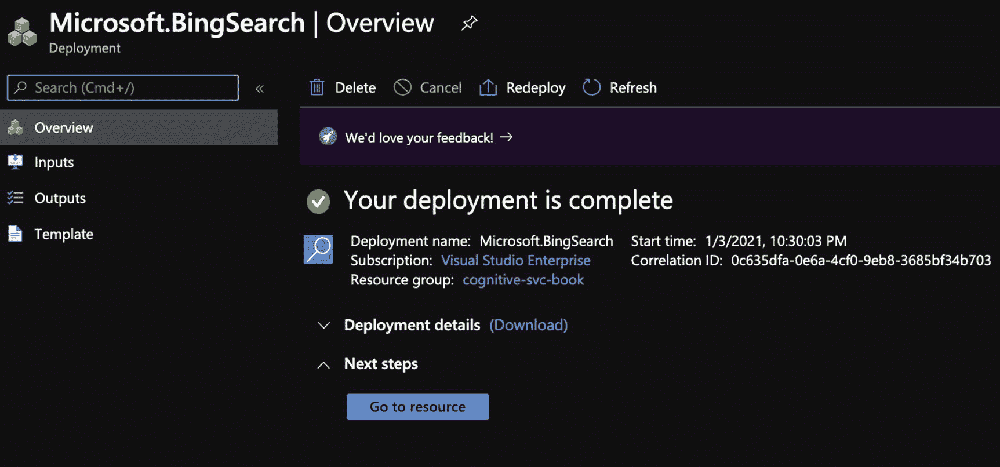

图 7-26

Bing 搜索 API–部署完成

点击**进入资源**，出现快速启动页面(如图 [7-27](#Fig27) )。

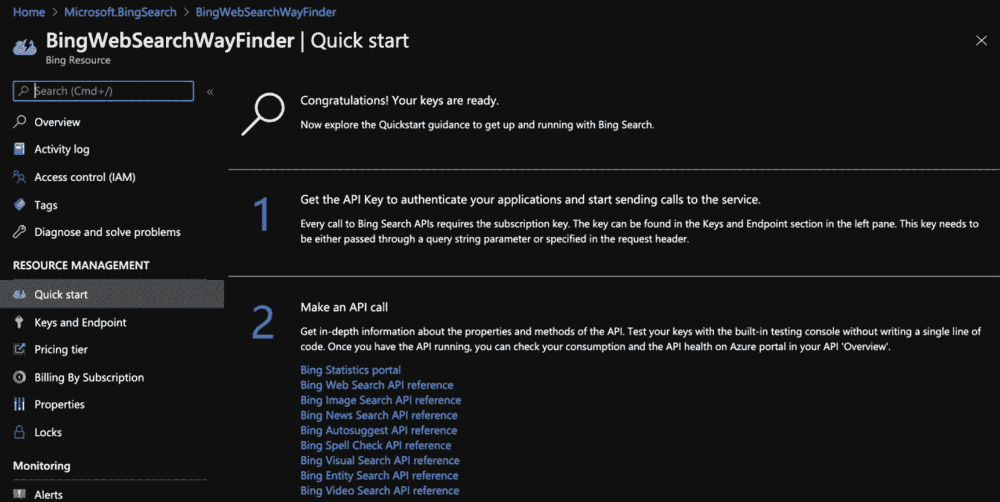

图 7-27

Bing 网络搜索–快速启动页面

1.  在这个例子中，我们将使用 Bing 图像搜索 API 来完成图像搜索。首先，我们将执行一个简单的搜索来检索结果，然后我们将使用 Python 图像库来显示结果。我们正在使用 PyCharm，如图 [7-28](#Fig28) 所示，但是您可以随意使用您选择的 IDE。代码源自麻省理工学院许可的*认知服务休息 api 样本* <sup>[6](#Fn6)</sup> ，但是我们做了一些修改来简化它，让它更容易使用。完整的列表可以在本书的 GitHub 资源库中找到。

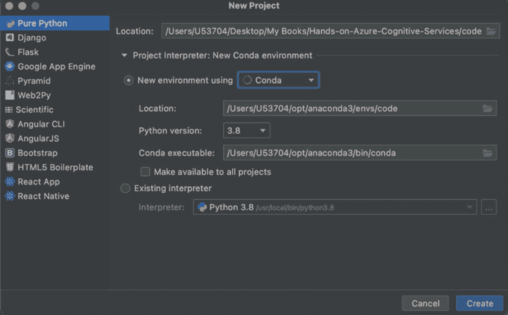

图 7-28

Python 中的 Bing API 搜索–py charm 项目起始页

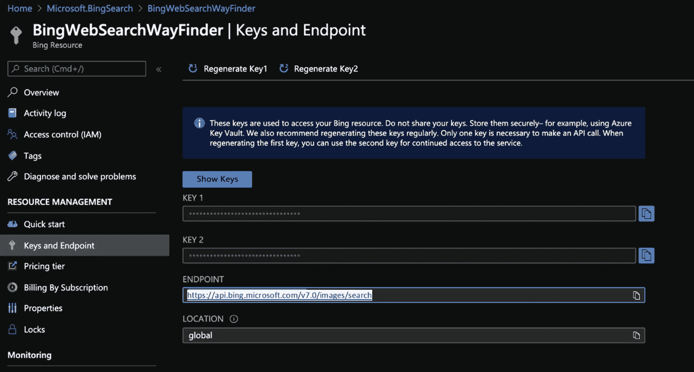

图 7-29

Bing API 搜索–关键字和端点

1.  一旦创建了项目，您将需要键和端点，它们可以从门户中检索到(如图 [7-29](#Fig29) 所示)。

用密钥和端点信息填充`subscriptionKey`和`endpoint`变量。图 [7-30](#Fig30) 中的代码非常简单，向您展示了调用搜索服务是多么容易。除了将`subscriptionKey`和`endpoint`作为标题的一部分，你还可以通过`mkt`(“美国”)和`query`(“猫迷因”)来定义市场。运行程序以获得结果。您可以在图 [7-30](#Fig30) 所示的输出窗格中看到响应。


图 7-30

Python 中的 Bing 图像搜索

除了单个结果，您还可以在浏览器中打开`websearchURL`响应元素。见图 [7-31](#Fig31) 。

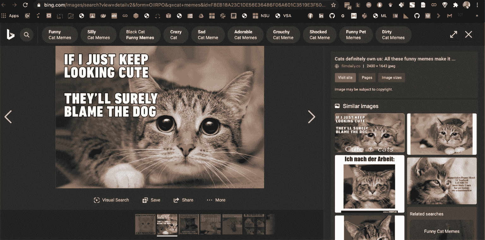

图 7-31

Bing 图像搜索结果–在浏览器中获取请求

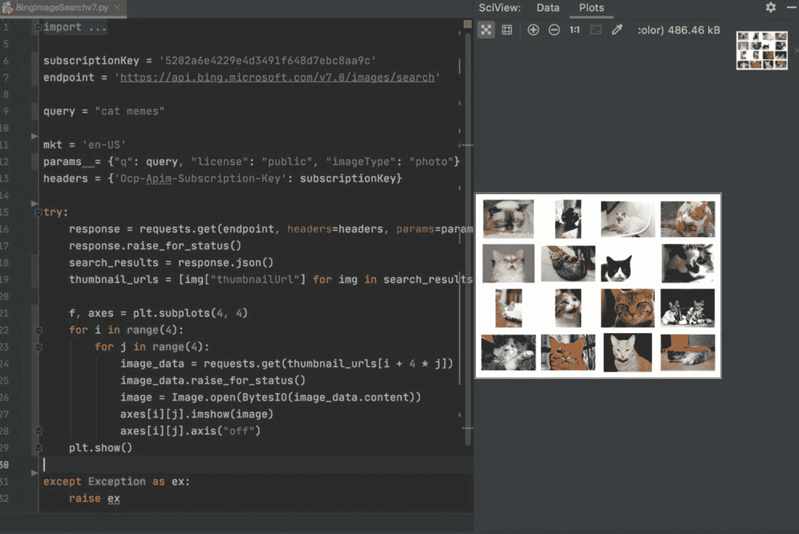

图 7-32

Python 中的 Bing 图像搜索结果

1.  We will now demonstrate how you can call the API and plot the response using Python Imaging Library. The code isn’t too different. The only additional part is to read the thumbnails and to show them on the image canvas.

    ```py
        f, axes = plt.subplots(4, 4)
        for i in range(4):
            for j in range(4):
                image_data = requests.get(thumbnail_urls[i + 4 * j])
                image_data.raise_for_status()
                image = Image.open(BytesIO(image_data.content))
                axes[i][j].imshow(image)
                axes[i][j].axis("off")
        plt.show()

    ```

    您可以在图 [7-32](#Fig32) 中看到结果，其中图像被绘制在左侧窗格上。

完整的清单如清单 [7-1](#PC2) 所示。

```py
import requests
import matplotlib.pyplot as plt
from PIL import Image
from io import BytesIO

subscriptionKey = '5202a6e4229e4d3491f648d7ebc8aa9c'
endpoint = 'https://api.bing.microsoft.com/v7img/search'

query = "cat memes"

mkt = 'en-US'
params  = {"q": query, "license": "public", "imageType": "photo"}
headers = {'Ocp-Apim-Subscription-Key': subscriptionKey}

try:
    response = requests.get(endpoint, headers=headers, params=params)
    response.raise_for_status()
    search_results = response.json()
    thumbnail_urls = [img["thumbnailUrl"] for img in search_results["value"][:16]]

    f, axes = plt.subplots(4, 4)
    for i in range(4):
        for j in range(4):
            image_data = requests.get(thumbnail_urls[i + 4 * j])
            image_data.raise_for_status()
            image = Image.open(BytesIO(image_data.content))
            axes[i][j].imshow(image)
            axes[i][j].axis("off")
    plt.show()

except Exception as ex:
    raise ex

Listing 7-1Bing Image Search results in Python

```

服务返回的原始 JSON 响应如清单 [7-2](#PC3) 所示。为了简洁和避免可爱超载，我们将其截断，只有一个结果。

```py
Headers:

{'Cache-Control': 'no-cache, no-store, must-revalidate', 'Pragma': 'no-cache', 'Content-Length': '124071', 'Content-Type': 'application/json; charset=utf-8', 'Expires': '-1', 'P3P': 'CP="NON UNI COM NAV STA LOC CURa DEVa PSAa PSDa OUR IND"', 'BingAPIs-TraceId': 'C1EEB539F44E4BF8AE333467AFD3A2A9', 'X-MSEdge-ClientID': '324563186B086B31062D6CAE6ABF6A2A', 'X-MSAPI-UserState': '33d6', 'X-Search-ResponseInfo': 'InternalResponseTime=279,MSDatacenter=BN2B', 'X-MSEdge-Ref': 'Ref A: C1EEB539F44E4BF8AE333467AFD3A2A9 Ref B: BLUEDGE0716 Ref C: 2021-01-05T02:47:31Z', 'apim-request-id': '9e4f0b22-8ce6-421d-a0f0-5cbc1499de3d', 'Strict-Transport-Security': 'max-age=31536000; includeSubDomains; preload', 'x-content-type-options': 'nosniff', 'CSP-Billing-Usage': 'CognitiveServices.BingSearchV7.Transaction=1', 'Date': 'Tue, 05 Jan 2021 02:47:31 GMT'}

JSON Response:

{'_type': 'Images',
 'currentOffset': 0,
 'instrumentation': {'_type': 'ResponseInstrumentation'},
 'nextOffset': 42,
 'pivotSuggestions': [{'pivot': 'cat',
                       'suggestions': [{'displayText': 'Baby',
                                 'searchLink': 'https://api.bing.microsoft.com/api/img/search?q=Baby+Memes&tq=%7b%22pq%22%3a%22cat+memes%22%2c%22qs%22%3a%5b%7b%22cv%22%3a%22cat%22%2c%22pv%22%3a%22cat%22%2c%22hps%22%3atrue%2c%22iqp%22%3afalse%7d%2c%7b%22cv%22%3a%22memes%22%2c%22pv%22%3a%22memes%22%2c%22hps%22%3atrue%2c%22iqp%22%3afalse%7d%2c%7b%22cv%22%3a%22Baby%22%2c%22pv%22%3a%22%22%2c%22hps%22%3afalse%2c%22iqp%22%3atrue%7d%5d%7d',
                                        'text': 'Baby Memes',
                                        'thumbnail': {'thumbnailUrl': 'https://tse2.mm.bing.net/th?q=Baby+Memes&pid=Api&mkt=en-US&adlt=moderate&t=1'},
                                        'webSearchUrl': 'https://www.bing.cimg/search?q=Baby+Memes&tq=%7b%22pq%22%3a%22cat+memes%22%2c%22qs%22%3a%5b%7b%22cv%22%3a%22cat%22%2c%22pv%22%3a%22cat%22%2c%22hps%22%3atrue%2c%22iqp%22%3afalse%7d%2c%7b%22cv%22%3a%22memes%22%2c%22pv%22%3a%22memes%22%2c%22hps%22%3atrue%2c%22iqp%22%3afalse%7d%2c%7b%22cv%22%3a%22Baby%22%2c%22pv%22%3a%22%22%2c%22hps%22%3afalse%2c%22iqp%22%3atrue%7d%5d%7d&FORM=IRQBPS'},

...

Listing 7-2Bing Image Search results – JSON response

```

正如您在 JSON 响应中注意到的，它提供了建议、直接访问的搜索链接、关于缩略图的信息以及与标题相关的信息。你的企业用例可能不会搜索猫迷因，除非你为一家宠物食品公司的社交媒体部门工作。无论是什么，你都可以在 Bing 搜索 API 的帮助下轻松完成。

## 总结和结论

搜索已经结束，至少现在是这样。

在这一章中，你已经了解了 Azure 搜索生态系统。您探索了 Microsoft Azure 认知搜索功能，并研究了 Microsoft Bing 搜索的工作原理。您已经创建了通过关键字搜索房地产和酒店的示例应用程序，并且构建了一个在 Web 上搜索图像的应用程序。

现在，您可以使用这些技术构建自己的应用程序了。您的用例会有所不同，但是这些基础知识将帮助您开始搜索，无论是在您的组织内部还是在网络外部。

继续探索！

## 参考资料和进一步阅读

**Azure 认知搜索**

[T2`https://azure.microsoft.com/en-us/services/search/`](https://azure.microsoft.com/en-us/services/search/)

**微软必应网页搜索 API**

[T2`www.microsoft.com/en-us/bing/apis/bing-web-search-api`](https://www.microsoft.com/en-us/bing/apis/bing-web-search-api)

**Azure 认知搜索中的 AI 浓缩**

[T2`https://docs.microsoft.com/en-us/azure/search/cognitive-search-concept-intro`](https://docs.microsoft.com/en-us/azure/search/cognitive-search-concept-intro)

<aside aria-label="Footnotes" class="FootnoteSection" epub:type="footnotes">Footnotes [1](#Fn1_source)

[T2`https://azure.microsoft.com/en-us/updates/bing-search-apis-will-transition-from-azure-cognitive-services-to-azure-marketplace-on-31-october-2023/`](https://azure.microsoft.com/en-us/updates/bing-search-apis-will-transition-from-azure-cognitive-services-to-azure-marketplace-on-31-october-2023/)

  [2](#Fn2_source)

将您的 Azure 认知搜索服务迁移到另一个 Azure 地区， [`https://docs.microsoft.com/en-us/azure/search/search-howto-move-across-regions`](https://docs.microsoft.com/en-us/azure/search/search-howto-move-across-regions)

  [3](#Fn3_source)

Python 中的快速入门——Jupyter 笔记本 [`https://docs.microsoft.com/en-us/samples/azure-samples/azure-search-python-samples/python-sample-quickstart/`](https://docs.microsoft.com/en-us/samples/azure-samples/azure-search-python-samples/python-sample-quickstart/)

  [4](#Fn4_source)

Azure 认知搜索样本数据 [`https://docs.microsoft.com/en-us/samples/azure-samples/azure-search-sample-data/azure-search-sample-data/`](https://docs.microsoft.com/en-us/samples/azure-samples/azure-search-sample-data/azure-search-sample-data/)

  [5](#Fn5_source)

必应网页搜索 API-[`www.microsoft.com/en-us/bing/apis/bing-web-search-api`](https://www.microsoft.com/en-us/bing/apis/bing-web-search-api)

  [6](#Fn6_source)

[T2`https://github.com/Azure-Samples/cognitive-services-REST-api-samples/blob/master/python/Search/BingWebSearchv7.py`](https://github.com/Azure-Samples/cognitive-services-REST-api-samples/blob/master/python/Search/BingWebSearchv7.py)

 </aside>