# 八、使用容器部署和托管服务

嗯，如果你没有听说过容器，你可能还在使用拨号上网！这么说吧，容器是自切片面包以来最好的东西。容器使您能够在多种环境中以一致和可重复的方式部署软件。它们不像虚拟机那样庞大。微软首席解说 Scott Hanselman 做了一个关于容器的优秀视频 <sup>[1](#Fn1)</sup> ，我怎么推荐都不为过，尤其是如果你是这个容器生态系统的新手。

在这一章中，我们的目标是实现对认知服务容器的洞察。我们将强调关键的容器化特性，并演示如何使用 Docker 构建和部署应用。在本章中，您将学习以下主题:

1.  认知服务容器入门

2.  了解部署以及如何在 Azure 容器实例上部署和运行容器

3.  了解 Docker compose 并使用它来部署多个容器

4.  了解 Azure Kubernetes 服务以及如何将应用部署到 Azure Kubernetes 服务

容器化技术包括 Docker、Kubernetes(简称 K8s)、Azure Kubernetes 服务(AKS)、Azure 容器实例(ACI)以及其他相关主题。这些主题太复杂了，本章不可能详尽无遗。相反，本章将着重于让您开始使用认知服务容器，解释它们的需求，并使您能够在需要时充分利用这些惊人技术的力量。

## 认知服务容器

Azure 认知服务托管在高度可用的 Azure 云数据中心，并提供出色的 SLA(服务级别协议)，它们利用规模经济来学习、适应和改进。为什么我们需要将它们装箱并作为容器使用？

问得好，但是你和审计员谈过了吗？想象一下，在一个高度管制的环境中工作，在防火墙之外暴露数据需要国会的法案，这是理所当然的。此外，对于不连接的环境、具有低延迟需求的环境或者互联网连接不可用或不一致的环境，容器是一个很好的业务用例。凭借对数据和模型更新的完全控制，容器为基于云的服务提供了一个优秀的替代方案，具有高吞吐量和低延迟。

因此，为了解决安全性、合规性和操作问题，Azure 认知服务提供了以下类别的容器:

*   **视觉容器**–[OCR，](https://docs.microsoft.com/en-us/azure/cognitive-services/computer-vision/computer-vision-how-to-install-containers)执行[空间分析，人脸](https://docs.microsoft.com/en-us/azure/cognitive-services/computer-vision/spatial-analysis-container)检测，表单识别

*   **语言容器**–[情感分析](https://docs.microsoft.com/en-us/azure/cognitive-services/text-analytics/how-tos/text-analytics-how-to-install-containers%253Ftabs%253Dsentiment)、[关键短语提取](https://docs.microsoft.com/en-us/azure/cognitive-services/text-analytics/how-tos/text-analytics-how-to-install-containers%253Ftabs%253Dkeyphrase)、[文本语言检测](https://docs.microsoft.com/en-us/azure/cognitive-services/text-analytics/how-tos/text-analytics-how-to-install-containers%253Ftabs%253Dlanguage)、[文本健康分析](https://docs.microsoft.com/en-us/azure/cognitive-services/text-analytics/how-tos/text-analytics-how-to-install-containers%253Ftabs%253Dhealthcare)和 [LUIS(语言理解智能服务或简称为*语言理解* )](https://docs.microsoft.com/en-us/azure/cognitive-services/luis/luis-container-howto)

*   **语音容器**–[语音转文本](https://docs.microsoft.com/en-us/azure/cognitive-services/speech-service/speech-container-howto%253Ftabs%253Dstt)、[自定义语音转文本](https://docs.microsoft.com/en-us/azure/cognitive-services/speech-service/speech-container-howto%253Ftabs%253Dcstt)、[文本转语音](https://docs.microsoft.com/en-us/azure/cognitive-services/speech-service/speech-container-howto%253Ftabs%253Dtts)、[自定义文本转语音](https://docs.microsoft.com/en-us/azure/cognitive-services/speech-service/speech-container-howto%253Ftabs%253Dctts)、[神经文本转语音](https://docs.microsoft.com/en-us/azure/cognitive-services/speech-service/speech-container-howto%253Ftabs%253Dntts)和[语音语言检测](https://docs.microsoft.com/en-us/azure/cognitive-services/speech-service/speech-container-howto%253Ftabs%253Dlid)

*   **决策容器**–异常检测器

有趣的是，认知计算容器是 Linux 容器。微软是第一个在容器中提供预训练人工智能的供应商，采用按交易计费的计量模式。对于版本控制和其他相关的常见问题，微软在他们的产品文档中保留了一个活跃的 FAQ 部分，可以在 [`https://docs.microsoft.com/en-us/azure/cognitive-services/containers/container-faq`](https://docs.microsoft.com/en-us/azure/cognitive-services/containers/container-faq) 找到。

这些产品的可用性各不相同。一些容器是 GA(一般可用)，而其他容器是预览或门控私有预览(它们需要访问批准)。Azure 认知服务容器的每个产品的当前可用性状态可以在 [`https://docs.microsoft.com/en-us/azure/cognitive-services/cognitive-services-container-support`](https://docs.microsoft.com/en-us/azure/cognitive-services/cognitive-services-container-support) 找到。

作为 vision containers 的一部分，面部检测和表单识别服务不可用。2020 年 6 月 11 日，微软宣布“在基于人权的强有力监管出台之前，它不会向美国警察部门出售面部识别技术。”其他主要云提供商也纷纷效仿。表单识别器服务是 Azure 认知服务产品的一部分，但不是一个容器。

认知服务容器连接到 Azure 数据中心来发送计量信息，但它们不向微软发送客户数据。认知服务包括大多数行业标准认证，这有助于您在 Azure 平台上构建和部署医疗保健、制造和金融用例。这些认证包括 ISO 20000-1:2011、ISO 27001:2013、ISO 27017:2015、ISO 27018:2014 和 ISO 9001:2015 认证；HIPAA BAA、SOC 1 类型 2、SOC 2 类型 2 和 SOC 3 认证；和 PCI DSS 级证明。然而，认知服务容器没有任何符合性认证。

Note from Microsoft on Face Recognition<sup>[2](#Fn2)</sup>

2020 年 6 月 11 日，微软宣布，在基于人权的强有力监管颁布之前，不会向美国警察部门出售面部识别技术。因此，如果客户正在或正在允许美国警察局使用面部识别功能或 Azure 服务中包含的功能，如面部或视频索引器。

与 SDLC(软件设计生命周期)一样，机器学习开发生命周期、数据科学生命周期和/或微软团队数据科学流程也需要对部署流程进行更高程度的控制。这包括版本控制、控制模型漂移、模型衰退和遵从。容器为您提供了所需的粒度和控制，以确保您拥有所需的治理能力。

接下来，让我们构建一些认知服务容器。

## 托管认知服务容器

认知服务容器有多种托管选项。您可以构建一个 Docker 容器并在本地托管它，然后将其与认知服务连接起来；您可以使用 Azure 容器实例(ACI)、Azure Kubernetes 服务(AKS)，或者在 Azure Stack 上部署 Kubernetes 集群。这些选项为整个容器部署提供了不同程度的控制和责任。权力越大，责任越大。

### 运行语言服务容器

我们将从小处着手，构建并托管一个简单的本地 Docker 容器:

1.  首先，让我们安装 Docker 桌面。您可以从 [`www.docker.com/products/docker-desktop`](http://www.docker.com/products/docker-desktop) 下载应用。它将允许您使用容器运行时来构建和运行容器。它还提供了 Docker CLI，用于运行命令的命令行界面。继续在您的平台上安装它；我们会等的。

2.  在第一个例子中，我们的目标是在本地运行一个认知服务容器实例，将它与文本分析服务连接起来进行计量和计费，然后调用容器上的语言检测服务。在本章中，我们将使用一些不同的容器和服务。你可以在这里找到 Azure 认知服务容器图像标签和发布说明的详细列表 <sup>[3](#Fn3)</sup> 。

3.  认知服务容器是自给自足的，可以运行底层的认知服务。但是，他们需要能够访问订阅以进行计量和计费。因此，您需要通过访问 [`https://portal.azure.com/#create/hub`](https://portal.azure.com/%2523create/hub) 来创建一个文本分析服务账户，如图 [8-1](#Fig1) 所示。

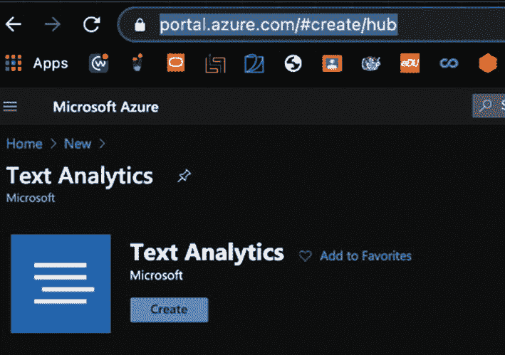

图 8-1

文本分析

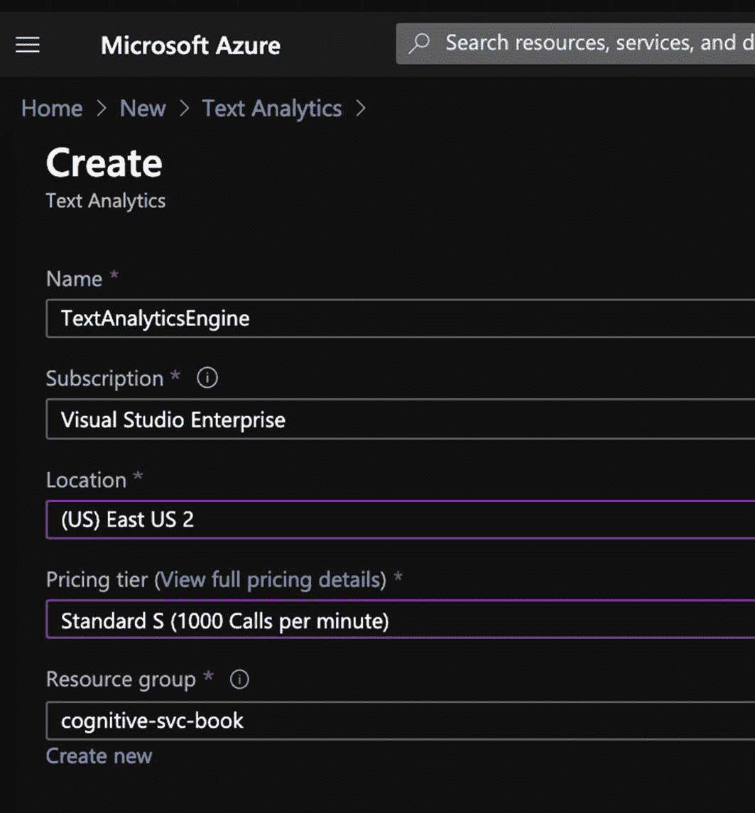

图 8-2

创建文本分析

1.  完成必填字段(如图 [8-2](#Fig2) 所示)，包括订阅、位置、定价层和资源组。然后，点击**创建**。这个过程已经在第 [6](06.html) 和 [7](07.html) 章详细讨论过了，所以如果你需要的话可以回头参考，因为为了简洁我们现在会跳过一些步骤。

一旦服务被验证、创建和部署，您将看到图 [8-3](#Fig3) 中的屏幕。要继续，点击**转到资源**。

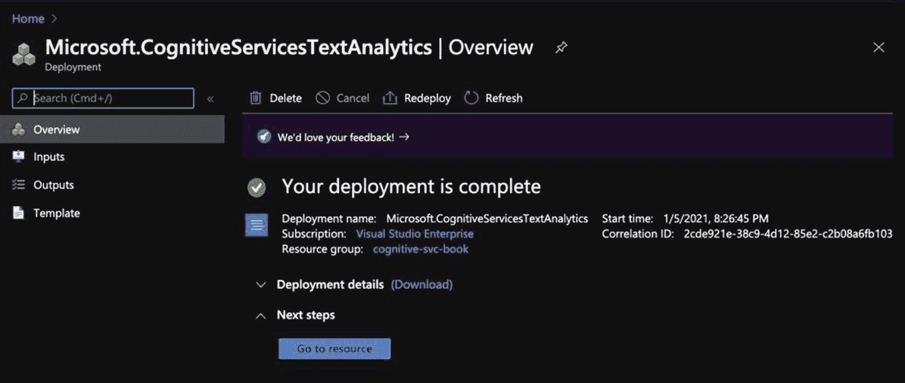

图 8-3

您的部署已完成

如图 [8-4](#Fig4) 所示，您将从文本分析引擎服务仪表板中获取键和端点，您可以在容器中使用它们。

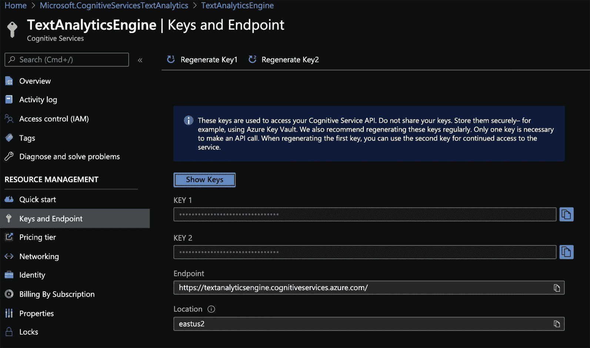

图 8-4

密钥和端点

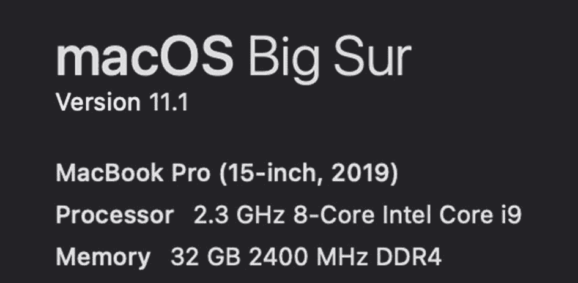

图 8-5

梅斯大南方

1.  现在我们已经有了计量分析服务的密钥，我们可以继续构建和运行容器了。我们正在一台 Mac 上运行，配置如图 [8-5](#Fig5) 所示。您可能需要为您的容器分配一些内存，所以请确保您有一台具有良好 CPU 和内存的机器，以便能够在本地运行容器。否则会超级慢，可能跑不起来。

用于语言检测的 Docker 容器位于 Docker Hub 上的这里 <sup>[4](#Fn4)</sup> 。它从微软容器库<sup>中拉出[5](#Fn5)T7】。为了启动和运行 Docker 映像，您需要运行以下命令:</sup>

```py
docker run --rm -it -p 5000:5000 --memory 8g --cpus 1 \
mcr.microsoft.com/azure-cognitive-services/language \
Eula=accept \
Billing={ENDPOINT_URI} \
ApiKey={API_KEY}

```

然后，您需要替换端点 URL 和 API 密钥，如下所示。请用你自己的钥匙。

```py
docker run --rm -it -p 5000:5000 --memory 8g --cpus 1 \
mcr.microsoft.com/azure-cognitive-services/language \
Eula=accept \
Billing='https://textanalyticsengine.cognitiveservices.azure.com/' \
ApiKey='5e9a5dcd31d9458f8e6f51a488d86399'a

```

在终端中运行这段代码将从注册表中取出容器映像。在本地运行，如图 [8-6](#Fig6) 所示。

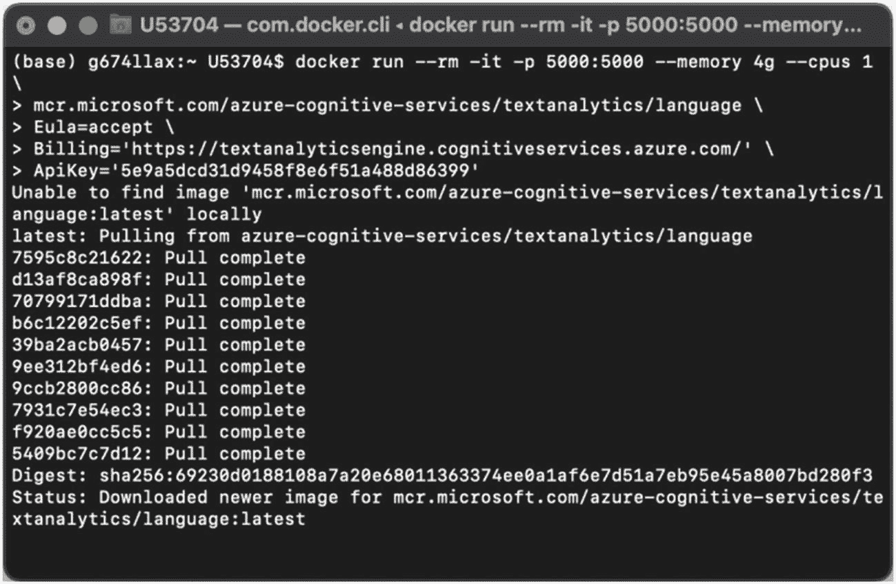

图 8-6

下拉容器图像

你可以在 Docker 桌面控制台看到可用的图像列表，如图 [8-7](#Fig7) 所示。


图 8-7

磁盘上的图像

没有比 127.0.0.1 更好的地方了。因此，一旦下载了映像，您就可以访问 localhost:5000，因为它在 COVID 锁定期间非常安全。命令中指定了 URL 和端口，如果你没有注意到的话(一定要复制粘贴！).还要注意，你的 Azure 认知服务容器已经启动并运行，如图 [8-8](#Fig8) 所示。如果您想运行多个容器，请更改端口号。


图 8-8

Azure 认知服务容器确认

语言容器(以及语言检测服务)已启动并正在运行。如果你点击**服务 API 描述**链接，你会看到 swagger API 信息页面(如图 [8-9](#Fig9) 所示)，在这里你可以调用服务。

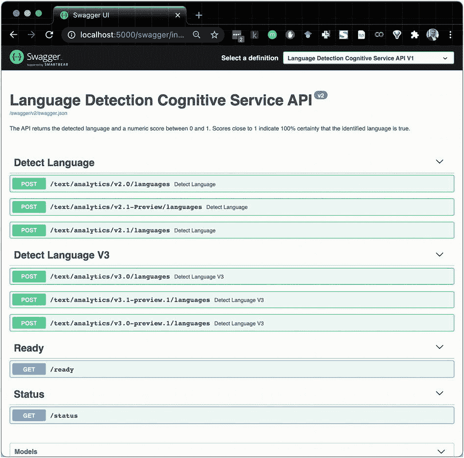

图 8-9

语言检测认知服务 API

容器上有不同版本的可用服务。您可以单击这些链接中的任何一个，并使用预先创建的请求调用服务。参见图 [8-10](#Fig10) 。


图 8-10

预先创建的请求

点击**执行**，就会看到响应。接下来，您还将发出 cURL <sup>[6](#Fn6)</sup> 请求，以防您想从终端调用它。请参见以下代码:

```py
curl -X POST "http://localhost:5000/text/analytics/v2.0/languages" -H "accept: application/json" -H "Content-Type: application/json-patch+json" -d "{ \"documents\": [ { \"id\": \"1\", \"text\": \"This document is in English.\" }, { \"id\": \"2\", \"text\": \"Este documento está en inglés.\" }, { \"id\": \"3\", \"text\": \"Ce document est en anglais.\" }, { \"id\": \"4\", \"text\": \"本文件为英文\" }, { \"id\": \"5\", \"text\": \"Этот документ на английском языке.\" } ]}"

```

在这里，我们执行了代码。您可以在图 [8-11](#Fig11) 中看到正确检测语言的响应。


图 8-11

检测语言

> 运行容器的 docker 命令应该是

> *docker run-RM-it-p 5000:5000-memory 8g-CPU 1 MCR . Microsoft . com/azure-cognitive-services/text analytics/language:1 . 1 . 012840001-amd64 Eula = accept Billing = " https://<resource _ name>. cognitive services . azure . com/" API key = "<subscription _ key>"*

您也可以直接从网页上调用它。图 [8-12](#Fig12) 中的屏幕显示了通过网页从容器中得到的响应。


图 8-12

来自容器的响应

在本例中，我们提取了一个认知服务 Docker 容器，在将它与计量语言服务链接时运行它，并通过 webUI 和 cURL 接口调用结果。在下一个示例中，让我们尝试使用异常检测器服务来完成这项工作，但这一次，我们将使用 Jupyter notebook。

### 运行异常检测器服务容器

1.  与语言检测容器类似，异常检测器托管在 Docker Hub <sup>[7](#Fn7)</sup> 以及位于`mcr.microsoft.com/azure-cognitive-services/decision/anomaly-detector`的微软容器库中。

2.  创建异常检测器服务的实例，以获取用于计量的端点和密钥(参见图 [8-13](#Fig13) )。关于创建异常检测服务的详细步骤，你可以参考第 [6](06.html) 章，但是它与我们之前对语言服务所做的几乎相同。一旦创建了实例，我们将在 Docker run 命令中使用它。

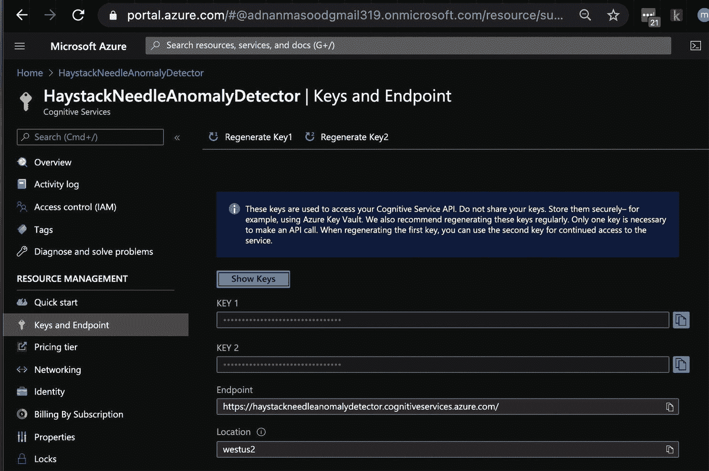

图 8-13

密钥和端点


图 8-14

应用开始服务

1.  Run the following command to create an Anomaly Detector Docker container. This will pull down the latest container and connect the service to the Azure portal for billing.

    ```py
    docker run --rm -it -p 5000:5000 --memory 4g --cpus 1 \
    mcr.microsoft.com/azure-cognitive-services/decision/anomaly-detector:latest \
    Eula=accept \
    Billing='https://haystackneedleanomalydetector.cognitiveservices.azure.com/' \
    ApiKey='83c02850ba4b402f819c0f2f87f71b86'

    ```

    然后你会看到如图 [8-14](#Fig14) 所示的截图，因为应用开始在`http://localhost:5000` URL 上提供服务。


图 8-15

欢迎屏幕

1.  如前面的语言检测示例所示，您可以在`http://localhost:5000`访问认知服务容器，并看到如图 [8-15](#Fig15) 所示的欢迎屏幕。这个屏幕在认知服务中是一致的。

接下来，您将看到 API 的 Swagger 页面，并直接从 UI 或通过应用调用它们(参见图 [8-16](#Fig16) )。


图 8-16

大摇大摆的页面

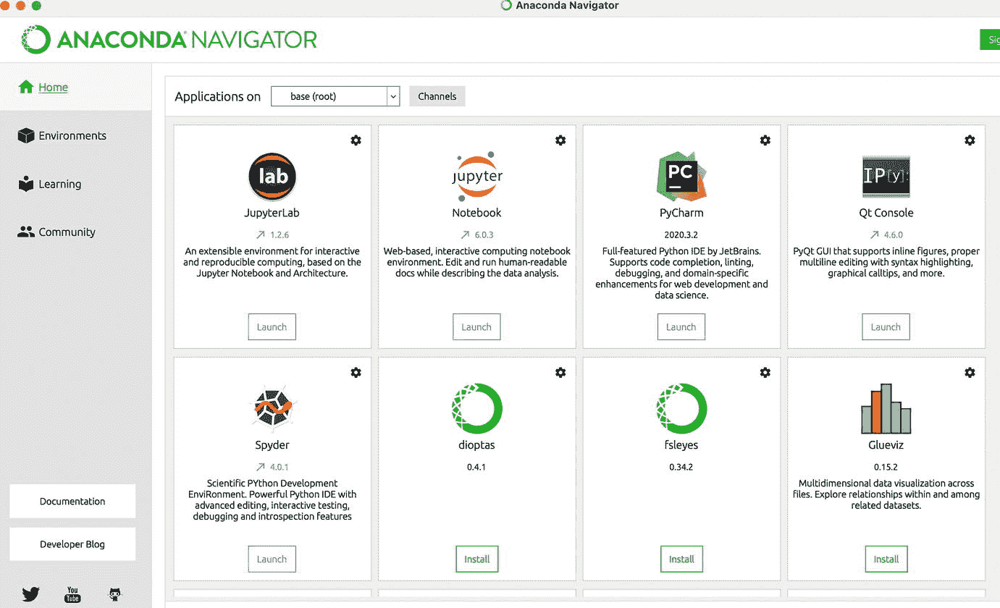

图 8-17

巨蟒领航员

1.  对于这个例子，我们将使用 Anaconda 运行 Jupyter notebook 的一个本地实例，并且我们将运行我们在第 [6 章](06.html)中使用的样例 notebook。该库可以从 [`https://github.com/Azure-Samples/AnomalyDetector`](https://github.com/Azure-Samples/AnomalyDetector) 中克隆。从 Anaconda Navigator 启动 JupyterLab(如图 [8-17](#Fig17) 所示)，然后导航到点异常检测笔记本。

打开笔记本，然后用来自异常检测服务的 API 键和指向本地异常检测容器实例的 URL http://localhost:8888 填充 API 键和端点。参见图 [8-18](#Fig18) 。


图 8-18

最新点异常检测

第一个单元格应该类似于图 [8-19](#Fig19) 中的单元格。


图 8-19

异常检测器资源访问密钥

现在，当您调用更多的单元格来运行该示例时，您将会看到类似于第 [6](06.html) 章中所示的结果。见图 [8-20](#Fig20) 。不同之处在于，代码现在通过认知服务容器在您的机器上本地运行。


图 8-20

异常检测结果

通过这两个例子，您看到了使用 Docker 在本地运行认知服务容器是多么容易。现在，我们将使用 ACI 和 AKS 的基于云的方法来托管这些容器。

## 使用 Azure 容器实例

“它在我的机器上工作”是一个伟大的目标，但您可能希望实现可再现性、性能、简单性和速度，而没有完整编排平台(如 Kubernetes 和 Mesos)的负担。Azure 容器实例(ACI)提供了一个很好的替代方案。ACI 是在 Azure cloud 中运行容器的一种快速、轻量的方式，你可以用 Azure Container Registry (ACR)管理自己的容器注册表。

“这不是违背了目的吗？”你可能会问。使用容器的原因是为了控制，而不是在云上部署东西。现在我们建议您在云上部署容器本身？这没有任何意义。让我们解释一下。

除了法规遵从性和数据保护，容器化的原因之一是控制。如果您的组织或区域策略只允许您在特定区域托管、保存和处理您的客户数据，并且您希望控制您的部署过程，那么在 ACI 中运行您的容器可能是管理您自己的数据中心的一个好的替代方案。借助微软云平台，您有多种选择–您可以自带硬件，使用轻量级 ACI，或者选择 AKS 等流程编排平台。让我们从 ACI 开始:


图 8-21

搜索 ACI

1.  进入 Azure 门户，搜索“ACI”或“容器实例”，如图 [8-21](#Fig21) 所示。点击**容器实例**。

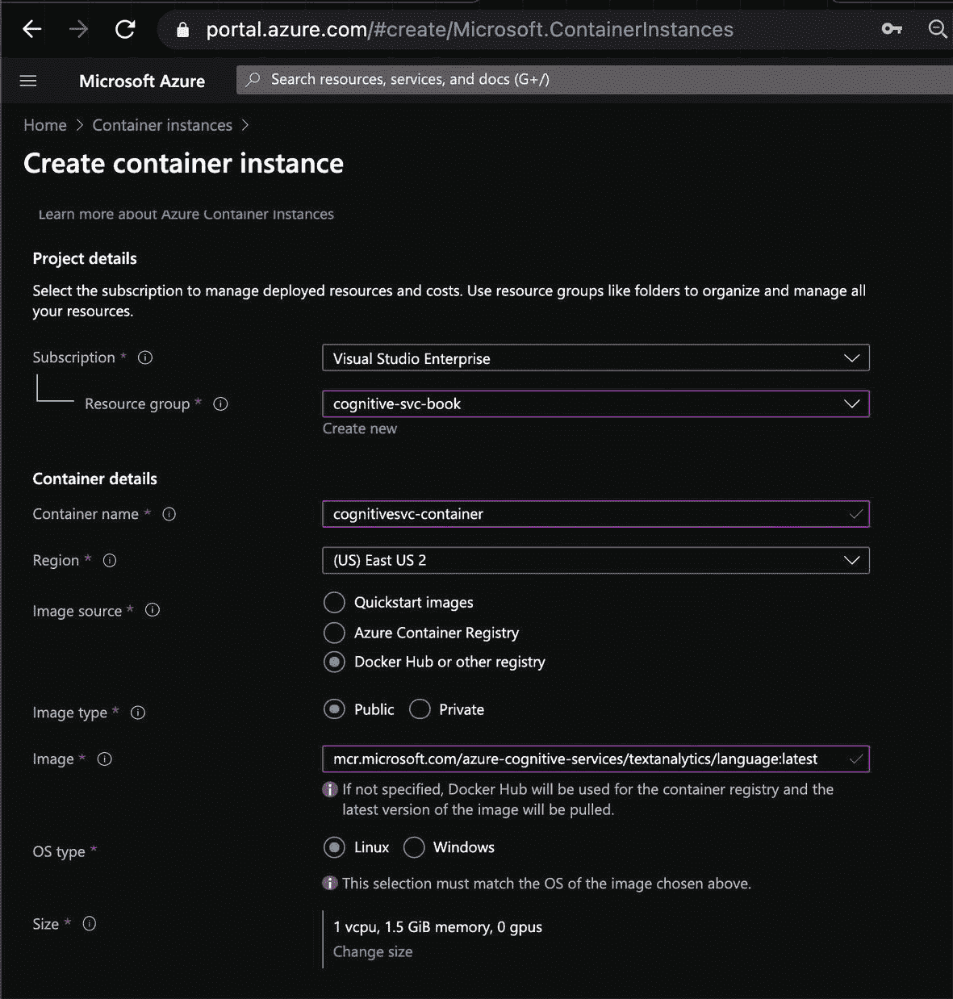

图 8-22

创建容器实例

1.  创建容器实例，如图 [8-22](#Fig22) 所示。填写必填字段，然后选择图像链接。在这种情况下，我们从 MCR 中选择 Microsoft Text Analytics 图像。

在继续之前，您应该查看容器要求和建议 <sup>[8](#Fn8)</sup> ，然后确保您的容器实例的配置与微软建议的配置相匹配。图 [8-23](#Fig23) 中列出了当前的规格，但是您应该验证必要的规格，因为它们可能会定期变化。我们现在生活在一个有十亿个参数模型的时代。

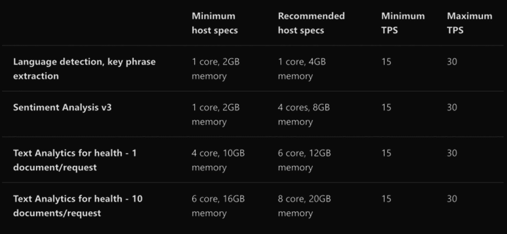

图 8-23

集装箱要求

在我们的例子中，我们将使用语言检测容器，我们将通过点击 **Change size** 来修改规范。然后你会看到改变容器配置屏幕，如图 [8-24](#Fig24) 所示。更新所需的 CPU 内核数量和内存。


图 8-24

配置资源需求

现在您可以继续创建容器了。一旦部署完成，您将看到如图 [8-25](#Fig25) 所示的屏幕。


图 8-25

完整的部署

因为这个容器是通过 ACI 部署在云中的，所以它有一个公共 IP(在我们的例子中，它是 52.146.70.12)。您可以从您的浏览器访问 IP，以查看图 [8-26](#Fig26) 所示的欢迎屏幕。


图 8-26

Azure 容器实例欢迎屏幕

现在实例已经准备好了，您可以访问 API，调用服务，等等。我们将很快详细了解这一点。

有三种不同的方法来构建和部署 ACI 和 AKS 容器——通过 UI、Azure Cloud Shell 和终端。在前面的例子中，您看到了我们如何通过 UI 来完成创建和运行容器的任务。现在让我们切换到命令行界面(CLI)。Azure Cloud Shell 是在浏览器中执行命令行工作的绝佳方式。你可以从 shell.azure.com 访问它，它会要求你选择你喜欢的云壳。参见图 [8-27](#Fig27) 。


图 8-27

选择脚本语言

选择好你的脚本语言后，你会看到我们都喜欢的全能终端，如图 [8-28](#Fig28) 所示。


图 8-28

打开蔚蓝色的云壳

1.  以下命令在 ACI 中创建一个情感分析认知服务容器。您会注意到它与早期 UI 中传递的参数非常相似。

    ```py
    aci=cognitiveservice-language-container
    az container create \
        -g cognitive-svc-book \
        -n cognitiveservice-language-container \
        --image mcr.microsoft.com/azure-cognitive-services/sentiment \
        -e Eula=accept Billing='https://textanalyticsengine.cognitiveservices.azure.com/text/analytics/v2.0' ApiKey=‘5e9a5dcd31d9458f8e6f51a488d86399’  \
        --ports 5000 \
        --cpu 4 \
        --memory 16 \
        --ip-address public

    ```

2.  需要注意的是，你也可以在 Azure CLI <sup>[9](#Fn9)</sup> 上运行这段代码，如图 [8-29](#Fig29) 并排所示。你需要安装 Azure CLI。在这种情况下，我们将只使用 Azure 云壳。


图 8-29

Azure 云外壳和 CLI

当该命令在云 shell 中运行时，它会创建实例并通过公共 IP 使其可用。您将看到完成响应，如图 [8-30](#Fig30) 所示。


图 8-30

完成响应

现在，您可以访问公共 IP，这是作为对访问备受追捧的容器屏幕的响应的一部分而提供的。见图 [8-31](#Fig31)

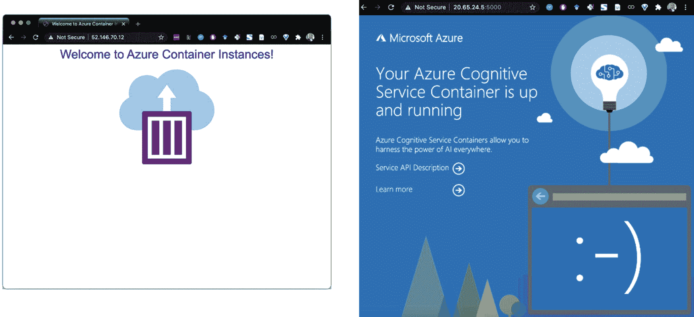

图 8-31

容器欢迎屏幕

1.  Now the containers are running, thanks to the amazing infrastructure and CLI support that’s provided by Azure. We can easily invoke the sentiment analysis service.

    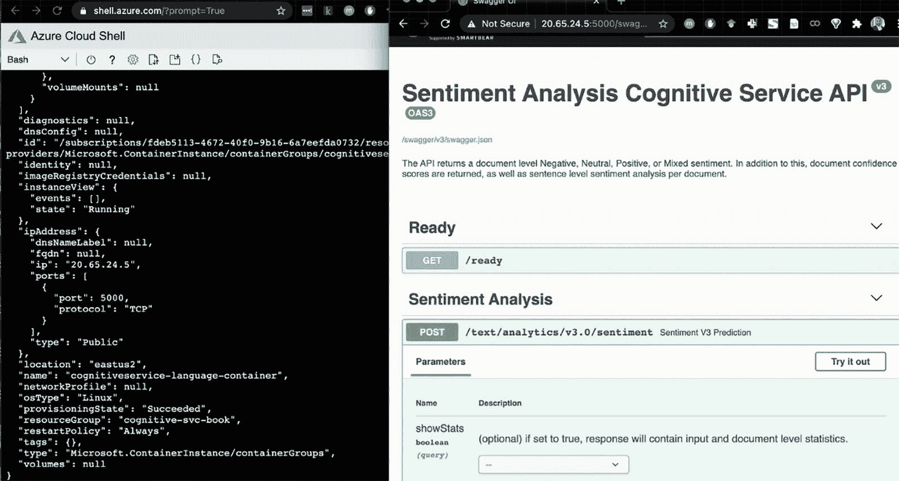

    图 8-32

    情感分析服务

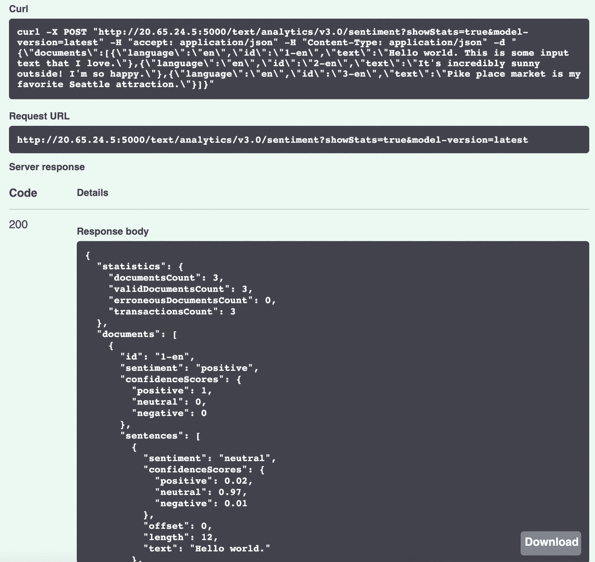

图 8-33

浏览器响应

1.  The following code represents the simple request to get the sentiment data:

    ```py
    {
      "documents": [
        {
          "language": "en",
          "id": "1-en",
          "text": "Hello world. This is some input text that I love."
        },
        {
          "language": "en",
          "id": "2-en",
          "text": "It's incredibly sunny outside! I'm so happy."
        },
        {
          "language": "en",
          "id": "3-en",
          "text": "Pike place market is my favorite Seattle attraction."
        }
      ]
    }

    ```

    一旦我们通过您的浏览器调用它，您将看到响应，如图 [8-33](#Fig33) 所示。

> *请求体下拉框应改为 application/JSON；默认应用/json-patch+json 将显示不支持的内容类型错误。*

JSON 如下所示，为了简洁起见，我们将其缩短为一个文档:

```py
{
  "statistics": {
    "documentsCount": 3,
    "validDocumentsCount": 3,
    "erroneousDocumentsCount": 0,
    "transactionsCount": 3
  },
  "documents": [
    {
      "id": "1-en",
      "sentiment": "positive",
      "confidenceScores": {
        "positive": 1,
        "neutral": 0,
        "negative": 0
      },
      "sentences": [
        ....
  "errors": [],
  "modelVersion": "2019-10-01"
}

```

现在你有了——在 Azure 上创建 ACI 容器，既通过命令行和 web UI，也通过云中的调用。

现在我们将回顾最后一种方法，Azure Kubernetes 服务(AKS)，我们将了解如何将 Azure 认知服务[文本分析](https://docs.microsoft.com/en-us/azure/cognitive-services/text-analytics/how-tos/text-analytics-how-to-install-containers)容器映像部署到 Azure Kubernetes 服务。

## 使用 Azure Kubernetes 服务部署认知服务容器

ACI 可以帮助您部署一个容器，但是如果您必须部署和管理一大堆容器，该怎么办呢？Kubernetes 是一个开源编排引擎，可以帮助您大规模地构建、部署和管理这些容器。Azure Kubernetes Service (AKS)是 Azure cloud 上的托管 Kubernetes 服务，就托管服务而言，它非常棒，因为它是免费的。是的，你不用为 AK 付费，只需要为你使用的节点付费。您可以通过 web UI、CLI 或使用模板来创建 AKS 集群。

让我们从构建 Kubernetes 服务开始。一如既往，portal.azure.com 是我们的一站式商店。搜索“Kubernetes 服务”，然后点击**创建**。见图 [8-34](#Fig34) 。

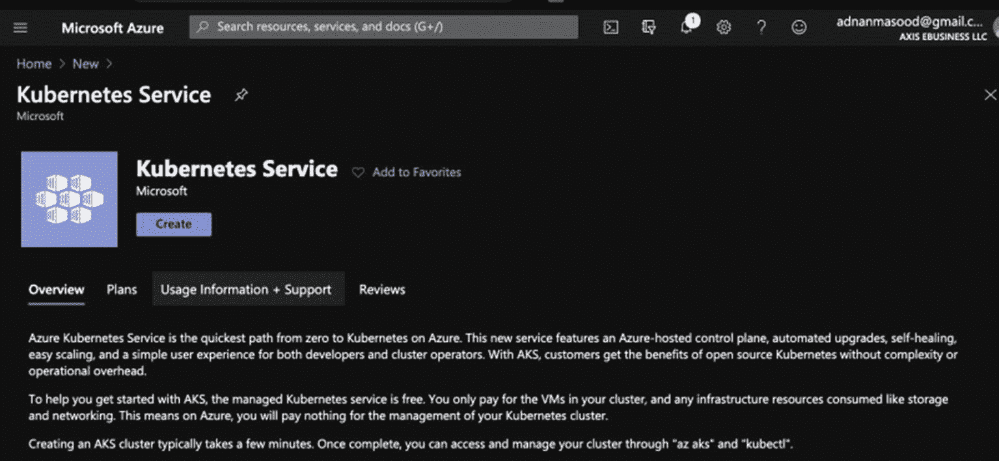

图 8-34

Azure 门户中的 Kubernetes 服务

使用默认设置填写创建 Kubernetes 集群页面，如图 [8-35](#Fig35) 所示。在群集中，您可以选择自定义节点池、身份验证、高级网络设置和集成。见图 [8-35](#Fig35) 。关于单个参数的详细信息及其可能的设置，可以在这里找到<sup>T5 10T7。</sup>

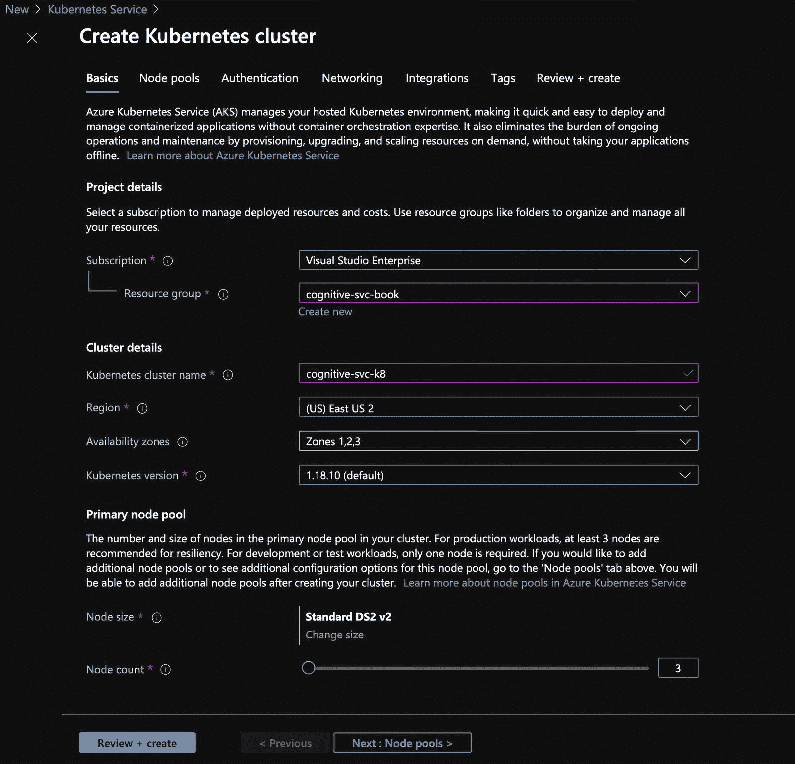

图 8-35

创建立方群集

点击 **Review + create** 继续，一旦集群部署完毕(这可能需要一些时间)，您将会看到如图 [8-36](#Fig36) 所示的屏幕。


图 8-36

集群已部署

一旦部署了集群，您将需要登录到 AKS 集群。使用以下命令登录集群:

```py
az aks get-credentials --name cognitive-svc-k8 --resource-group cognitive-svc-book

```

您可以在安装了 Azure CLI 的终端中运行该命令，并看到如图 [8-37](#Fig37) 所示的输出。确保在命令中替换您自己的资源组和 AKS 集群名称。

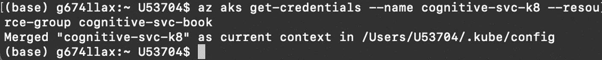

图 8-37

集群登录输出

群集已成功创建，但它不包含任何容器节点。因此，让我们通过为 K8s 集群创建一个关键短语认知服务容器来解决这个问题。为了完成向集群添加容器，我们需要在 K8s 配置文件中添加这些信息。Kubernetes 使用 YAML 进行配置设置。(YAML 最初代表*另一种标记语言*作为一个愚蠢的名字，但它被改为 *YAML 不是标记语言*以表明它旨在用于面向数据的目的，而不是文档标记。)

我们将使用 Visual Studio 2019 for Mac 进行编辑(如图 [8-38](#Fig38) )，但是可以随意使用您选择的编辑器。

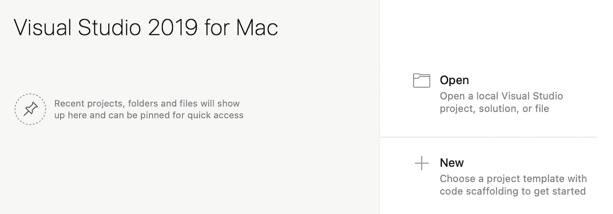

图 8-38

面向 Mac 的 Visual Studio 2019

YAML 文件(读作 *yamel* ，像*骆驼*一样)相当简单，如图 [8-39](#Fig39) 所示。在这里，我们定义容器名称、映像路径、端口、要分配的资源类型、计费 URL 和 API 密钥——类似于前面创建 ACI 容器的操作。

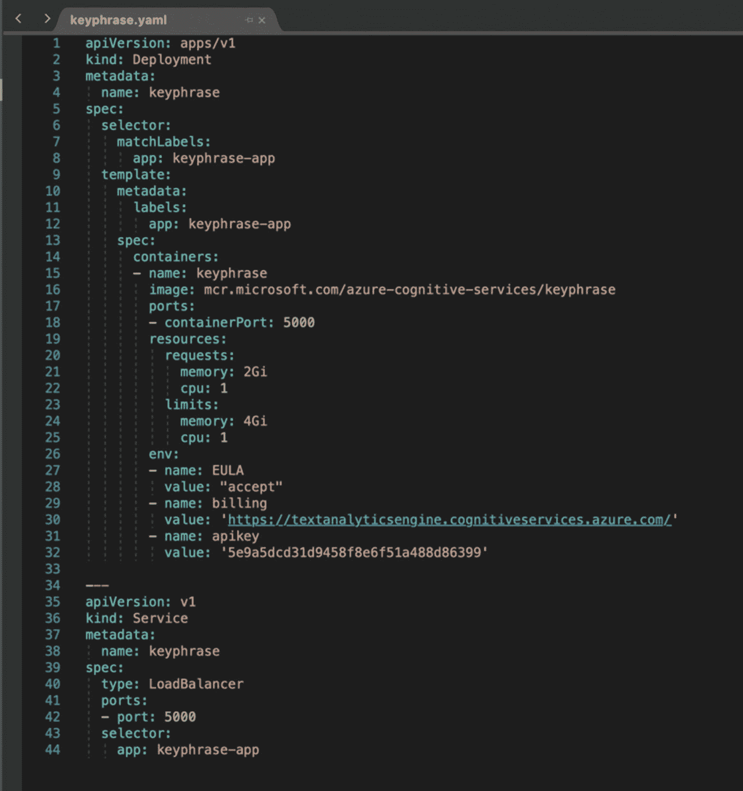

图 8-39

YAML 档案

现在，您可以使用以下命令将此 YAML 应用于容器:

```py
kubectl apply -f keyphrase.yaml

```

创建部署容器时，命令行将显示图 [8-40](#Fig40) 的结果。

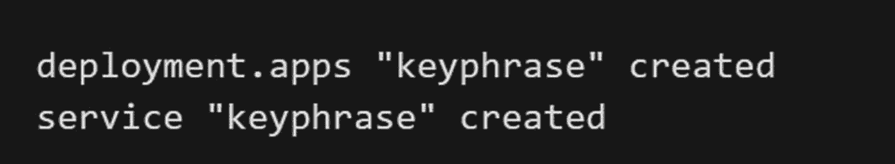

图 8-40

部署容器创建完毕

现在您可以验证 pod(最小的可部署单元，在本例中是认知服务容器以及相关的服务和依赖项)已经部署并且服务正在运行，如图 [8-41](#Fig41) 所示。

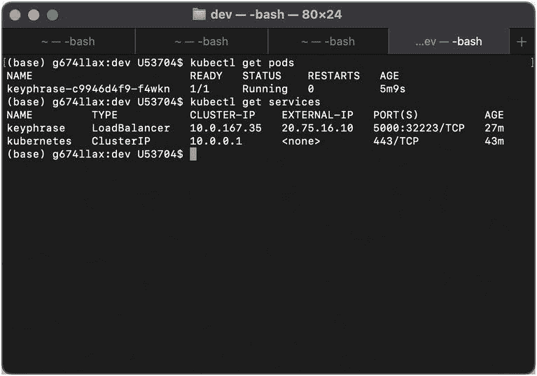

图 8-41

验证部署

如前面的截图所示，现在可以通过一个公共 IP 地址 [`http://20.75.16.10:5000/`](http://20.75.16.10:5000/) 访问容器，并且可以调用它来访问认知服务容器和相关的 API。连接到集群后，可以运行各种不同的命令，如图 [8-42](#Fig42) 所示。

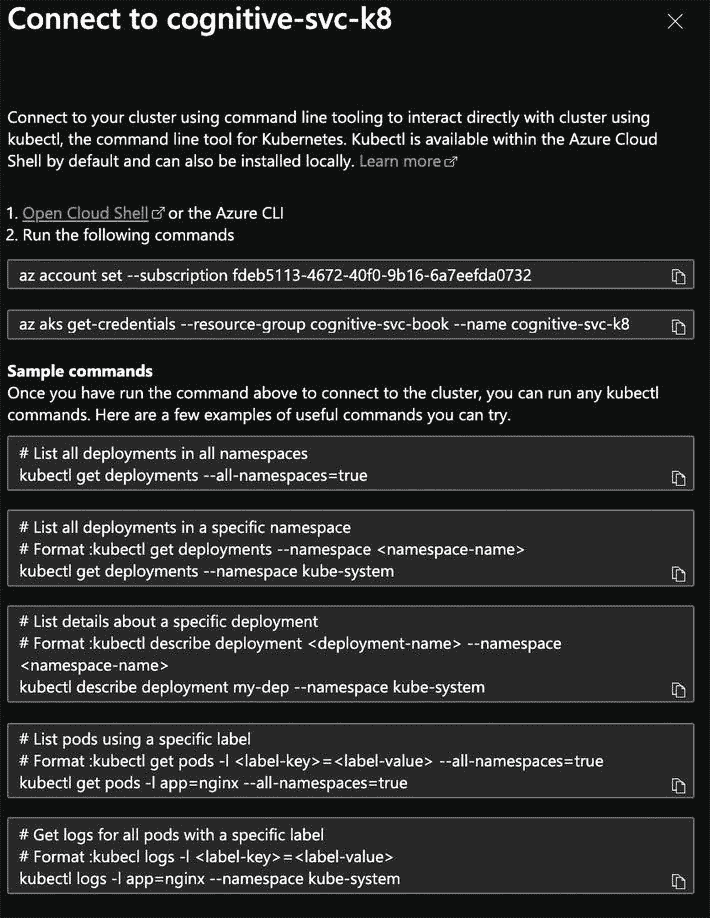

图 8-42

您可以使用的不同命令

这些命令和图 [8-43](#Fig43) 中显示的日志屏幕显示了与单个 ACI 部署相比，K8s 对容器管理的控制力。

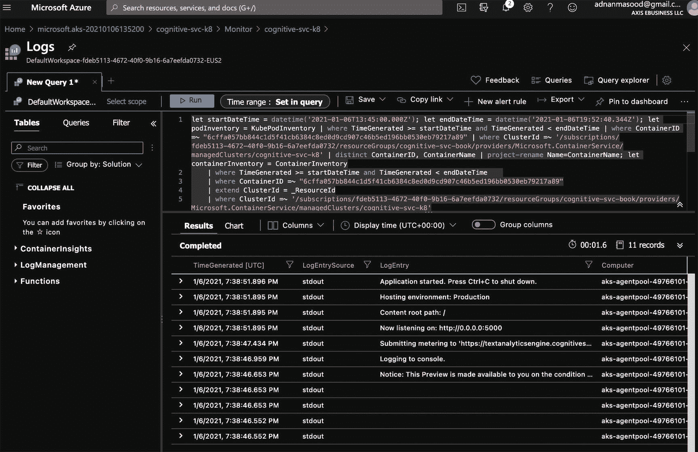

图 8-43

日志屏幕

## 总结和结论

集装箱都装了，勉强。容器的世界和 DevOps 蓬勃发展的学科一样大，很难在短短的一章中涵盖它。我们尽力帮助您了解认知服务容器生态系统。我们研究了 Docker、ACI 和 AKS，并研究了这些容器在不同环境下的工作方式。然后，您创建了示例，这些示例从容器中调用自包含代码，而不直接调用认知服务。

现在，您已经具备了开始探索并将这些技术用于您自己的业务用例的基础。您的法规、合规性、基础设施和操作用例会有所不同，但这些基础将帮助您在组织内开始容器化。

保持集装箱化！

## 参考资料和进一步阅读

Azure 认知服务容器

[T2`https://docs.microsoft.com/azure/cognitive-services/cognitive-services-container-support`](https://docs.microsoft.com/azure/cognitive-services/cognitive-services-container-support)

**安装并运行文本分析容器**

[T2`https://docs.microsoft.com/azure/cognitive-services/text-analytics/how-tos/text-analytics-how-to-install-containers`](https://docs.microsoft.com/azure/cognitive-services/text-analytics/how-tos/text-analytics-how-to-install-containers%253Ftabs%253Dlanguage)

**将文本分析容器部署到 Azure Kubernetes 服务**

[T2`https://docs.microsoft.com/azure/cognitive-services/text-analytics/how-tos/text-analytics-how-to-use-kubernetes-service`](https://docs.microsoft.com/azure/cognitive-services/text-analytics/how-tos/text-analytics-how-to-use-kubernetes-service%253Ftabs%253Dkeyphrase)

**在 Azure 容器实例上部署和运行容器**

[T2`https://docs.microsoft.com/azure/cognitive-services/containers/azure-container-instance-recipe`](https://docs.microsoft.com/azure/cognitive-services/containers/azure-container-instance-recipe%253Ftabs%253Dportal)

**Azure 认知服务容器图像标签和发布说明**

[T2`https://docs.microsoft.com/azure/cognitive-services/containers/container-image-tags`](https://docs.microsoft.com/azure/cognitive-services/containers/container-image-tags%253Ftabs%253Dcurrent)

<aside aria-label="Footnotes" class="FootnoteSection" epub:type="footnotes">Footnotes [1](#Fn1_source)

Docker 101 和集装箱是如何工作的？[T2`www.hanselman.com/blog/docker-101-and-how-do-containers-work`](http://www.hanselman.com/blog/docker-101-and-how-do-containers-work)

  [2](#Fn2_source)

[T2`https://docs.microsoft.com/en-us/azure/cognitive-services/cognitive-services-container-support`](https://docs.microsoft.com/en-us/azure/cognitive-services/cognitive-services-container-support)

  [3](#Fn3_source)

[T2`https://docs.microsoft.com/en-us/azure/cognitive-services/containers/container-image-tags?tabs=current`](https://docs.microsoft.com/en-us/azure/cognitive-services/containers/container-image-tags%253Ftabs%253Dcurrent)

  [4](#Fn4_source)

[T2`https://hub.docker.com/_/microsoft-azure-cognitive-services-language`](https://hub.docker.com/_/microsoft-azure-cognitive-services-language)

  [5](#Fn5_source)

微软容器库–Azure 认知服务语言检测图片 [`mcr.microsoft.com/azure-cognitive-services/language`](http://mcr.microsoft.com/azure-cognitive-services/language)

  [6](#Fn6_source)

[T2`https://curl.se/docs/manpage.html?data1=dwnmop`](https://curl.se/docs/manpage.html%253Fdata1%253Ddwnmop)

  [7](#Fn7_source)

[T2`https://hub.docker.com/_/microsoft-azure-cognitive-services-decision-anomaly-detector`](https://hub.docker.com/_/microsoft-azure-cognitive-services-decision-anomaly-detector)

  [8](#Fn8_source)

[T2`https://docs.microsoft.com/en-us/azure/cognitive-services/text-analytics/how-tos/text-analytics-how-to-install-containers?tabs=language`](https://docs.microsoft.com/en-us/azure/cognitive-services/text-analytics/how-tos/text-analytics-how-to-install-containers%253Ftabs%253Dlanguage)

  [9](#Fn9_source)

[T2`https://docs.microsoft.com/en-us/cli/azure/install-azure-cli`](https://docs.microsoft.com/en-us/cli/azure/install-azure-cli)

  [10](#Fn10_source)

[T2`https://docs.microsoft.com/en-us/azure/aks/kubernetes-walkthrough-portal`](https://docs.microsoft.com/en-us/azure/aks/kubernetes-walkthrough-portal)

 </aside>