# 10.Azure 机器学习

问:为什么埃德会在闹鬼的丛林中遭到袭击？

答:因为其他人足够明智，不会进入随机森林。

这是一个以我们的合著者为代价的机器学习笑话，但它为定制算法(如随机森林)提供了一个很好的过渡。(随机决策森林对决策树中的任务进行分类，以输出均值或平均预测/回归。艾德的报复是他解释笑话。)到目前为止，在本书中，您已经对认知服务进行了广泛的回顾，认知服务以一种管理有序的方式提供了一套预先构建的算法、模型和方法。这些服务支持并加速机器学习开发，使数据科学家能够更快、更有效地提供产品和服务，而无需重新发明轮子。

然而，除了使用预构建的 API 之外，现实世界的业务用例还存在于数据科学和机器学习中。你必须能够建立自己的模型，尝试新的数据集，增强现有的模型，并创建自己的算法。请放心，微软 Azure 有丰富的功能来满足这些定制需求。Azure 机器学习是微软人工智能生态系统不可或缺的一部分，它帮助机器学习工程师、人工智能爱好者和专业人士以及公民数据科学家等实施智能解决方案。端到端机器学习生命周期不仅包括构建、训练和部署机器学习模型，还包括长期维护它们。您必须监控模型漂移和衰减，根据需求进行扩展，并完成 challenger champion 测试，以确保最佳模型获胜。Azure 机器学习平台有助于将这些服务的多样化集合在一起，以支持完整的机器学习生命周期。

本章将帮助您了解 Azure 机器学习生态系统产品，以及如何训练应用程序在没有显式编程的情况下进行学习，这是机器学习的目标。到目前为止，你大多已经看到了 Azure 认知服务的运行，但在本章中，我们将回顾整个 Azure 机器学习生态系统，为你提供认知服务之外的生活图景。你会学到的

*   Azure 机器学习堆栈和产品

*   使用 Azure 机器学习设计器，无需代码即可构建模型

*   用 Python 构建 ML 模型并使用 Azure 笔记本部署它们

*   使用 Azure 机器学习部署和测试模型

让我们开始吧。

## Azure 机器学习堆栈

Azure 机器学习堆栈是一个值得考虑的云平台超大规模力量。它包含完整的端到端机器学习平台功能，从数据摄取到模型部署和管理。例如，为了引入运行预测分析的数据集，并包括数据科学实验，Azure 提供了存储库，如 Azure Blob 存储和 Azure Data Lakes 存储。对于机器学习计算资源，有单个虚拟机(VM)、具有 HD Insight 的 Spark 集群或 Azure Databricks 的选项。

图 [10-1](#Fig1) 概述了 Azure 机器学习堆栈中的不同产品，以及在什么情况下应该使用什么。本章的重点是 Azure 机器学习。

图 10-1

Azure 机器学习关键产品–来自 [`https://docs.microsoft.com/ azure/architecture/data-guide/technology-choices/data-science-and-machine-learning`](https://docs.microsoft.com/en-us/azure/architecture/data-guide/technology-choices/data-science-and-machine-learning)

企业就绪性和治理需要由 Azure Key Vault 提供的数据保护来管理和保护凭据。可重复和可再现的实验有助于获得一致的结果，并且需要一组受管理的和正确版本化的模型和依赖关系。有了微软 Azure，你可以使用 Docker 容器，有了 ACI 和 AKS，你可以管理这些存储库，根据需要进行构建和部署。在机器学习的背景下，突出的能力如图 [10-2](#Fig2) 所示。

图 10-2

Azure 机器学习关键服务能力——来自 [`https://azure.microsoft.com/services/machine-learning`](https://azure.microsoft.com/en-us/services/machine-learning/)

下面提供了这些内容的简要概述，你会看到它是 Azure Machine Learning studio 的一部分，Azure Machine Learning studio 是为 Azure 数据科学家提供的机器学习一站式商店。Azure 机器学习的层级中最高的一项是工作区，如图 [10-3](#Fig3) 所示。它包含各种不同的元素，比如实验、管道、数据集、模型等等，我们将在下面讨论。

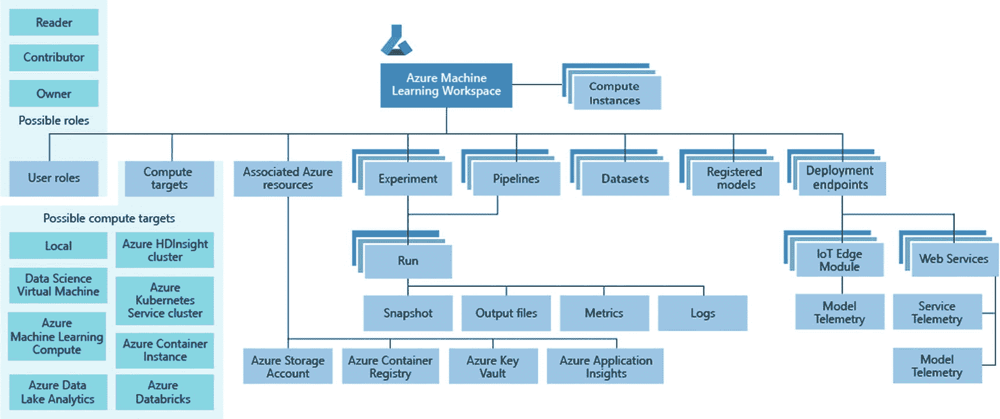

图 10-3

Azure 机器学习工作区——来自 [`https://docs.microsoft.com/azure/machine-learning/concept-workspace`](https://docs.microsoft.com/azure/machine-learning/concept-workspace)

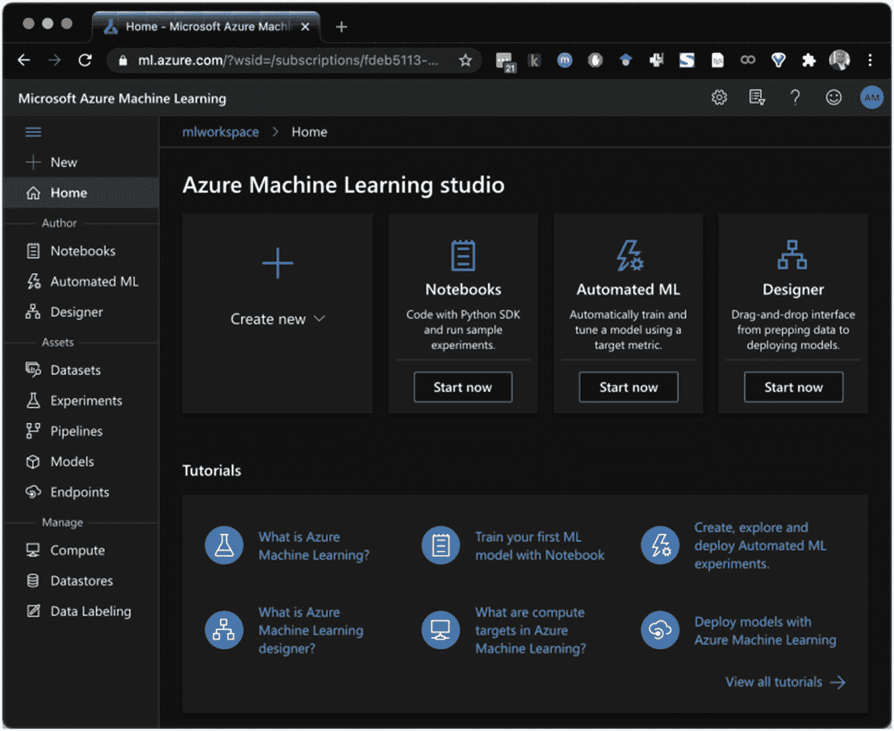

图 10-4

Azure 机器学习工作室-主要产品

1.  **端点**——一个机器学习模型需要被消费掉，而这样做的方法很少。部署机器学习模型的一种流行方式是通过包含一个或多个端点的 web 服务。端点是一个地址，可以通过一个定义良好的协议(比如 HTTP 上的 RESTful APIs)访问和调用模型。( *REST* 代表具象状态转移。)

2.  **Azure 笔记本**–Azure 笔记本为数据科学家访问文件、文件夹、存储和计算提供了一个集成的工作环境，所有这些都在 Azure workspace 中完成。我们在第 [6](06.html) 章看到过 Jupyter 笔记本，Azure 笔记本也差不多；他们只是使用 Azure 计算和存储，我们将很快对此进行探讨。Azure 笔记本为在一个地方协作和使用数据集、模型和实验提供了一个极好的地方。参见笔记本图 [10-4](#Fig4) 。

1.  **自动化机器学习**–自动化机器学习(或 AutoML)是一种应用机器学习技术来找出问题的最佳模型的能力。这包括自动化特征工程、神经结构搜索和超参数优化。Azure AutoML 消除了寻找最佳超参数的猜测工作，它可以帮助你找到最佳模型，并且不需要代码。

2.  **数据集**——机器学习资产的管理，比如模型和数据集，对于 ML 从业者来说可能是一个具有挑战性的问题。使用 Azure 数据集，您可以轻松地在多个机器学习工作流之间共享和跟踪数据，同时数据的单个副本保留在存储中。例如，数据是可访问的，而不需要考虑连接性和连接字符串。

3.  **实验**–实验和可重复性是科学进入*数据科学*的原因，能够创建数据集和算法并进行实验。Azure 机器学习的实验部分会跟踪你的机器学习实验并运行，这样你就可以重放管道。

4.  **管道**[1](#Fn1)–*管道*可能是机器学习中最超载的术语，它通常意味着数据提取、模型开发和训练、调优、产品发布，然后是监控和审查，或者这些活动的某种组合。在 Azure 机器学习的上下文中，这些机器学习任务的可执行工作流是可重复的，并且可以执行数据操作(如规范化、转换、特征化、验证等)、模型构建和训练(如超参数调优、自动模型选择、模型测试和验证)以及模型部署(如部署和批量评分)。模型管线提供了强大的功能，如下所示:
    1.  无人值守执行

    2.  多样的计算资源可访问性

    3.  再现性和可重用性

    4.  跟踪和版本控制

5.  模型是机器学习的面包和黄油:它们通过使用规定的算法，封装来自数据的学习。在 Azure 机器学习工作区中，您可以注册、创建、管理和跟踪模型。您在工作区的其他部分构建的任何模型也会在这个存储库中注册，并且可以跨平台使用。

6.  **计算**——一个机器学习模型，一个自动化的机器学习过程，一个 Jupyter 笔记本，都需要一个运行的地方(来执行一个计算)。这正是 Azure Compute 所提供的——在这里你可以创建不同类型的计算目标，如图 [10-5](#Fig5) 所示。此表详细说明了工作负荷的不同培训目标。对于机器学习工作负载，您可以使用本地计算机、计算集群、远程虚拟机和各种其他培训目标。

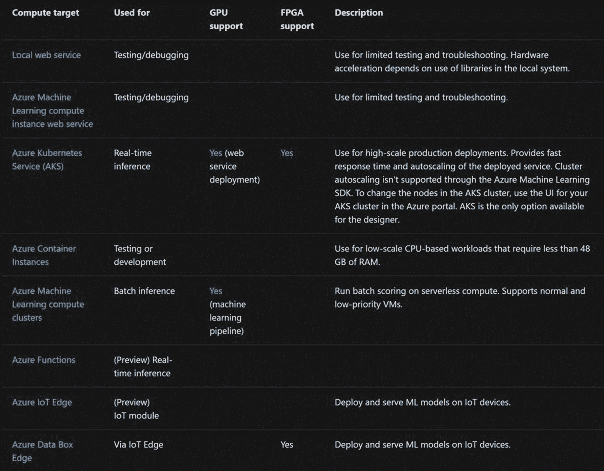

图 10-5

Azure 机器学习计算目标

1.  **数据存储**–数据存储是数据的储存库；它们是数据集的容器，如 Azure 存储、Azure 数据湖存储、Azure SQL 数据库和 Azure 数据块文件系统(DBFS)。对于系统存储，Azure 机器学习使用 Azure blob 容器和文件容器。

2.  **标记**–标记和注释是数据科学生命周期的重要组成部分。使用 Azure 机器学习标记功能，您可以通过创建标记项目、管理工作流以及将它外包给多个标记器来标记数据集，您还可以使用机器学习来帮助您。

随着您看到这些组件的运行，您将很快对它们有更多的了解。当我们迈向建立机器学习模型的旅程时，知道用于建立模型的正确算法是很重要的。

除了一些清晰、简洁和可管理的文档，Azure 机器学习团队还提供了一个非常有用的备忘单(aka.ms/mlcheatsheet)，它有助于确定最佳的机器学习算法。备忘单如图 [10-6](#Fig6) 所示。

图 10-6

Azure 机器学习算法备忘单(aka.ms/mlcheatsheet)

无论你想在类别之间进行预测，发现一个结构，还是从文本中提取信息，在下面的流程中，你都可以根据你的需求找出最佳算法。

## 使用 Azure 机器学习的 Hello World

在本书中，到目前为止，您主要使用了预构建的库和 API。在下一个例子中，我们将展示如何使用 UCI 人口普查成人收入数据集 [2](#Fn2) 并构建一个 Jupyter 笔记本，根据人口普查数据预测年收入是否超过 5 万美元。有关该数据集的信息，参见图 [10-7](#Fig7) 。

图 10-7

UCI 人口普查成年人收入数据集信息( [`https://archive.ics.uci.edu/ml/datasets/Adult`](https://archive.ics.uci.edu/ml/datasets/Adult) )

然后我们将使用 Azure ML designer 重复这个实验。请遵循以下步骤:

图 10-8

Azure 门户——创建机器学习工作空间

1.  Azure 机器学习笔记本是 Azure 机器学习工作室的一部分。但是，首先您需要创建一个工作区来继续。访问 Azure 门户( [`http://portal.azure.com`](http://portal.azure.com) ，选择**机器学习**，如图 [10-8](#Fig8) 。

图 10-9

Azure 门户——创建机器学习工作空间

1.  填写有关订阅、工作区名称、区域和存储帐户的详细信息。您可以将这些设置中的大部分保留为默认设置，除非您希望解决网络或容器中的特定用例。完成后，点击**审核+创建**继续(如图 [10-9](#Fig9) )。

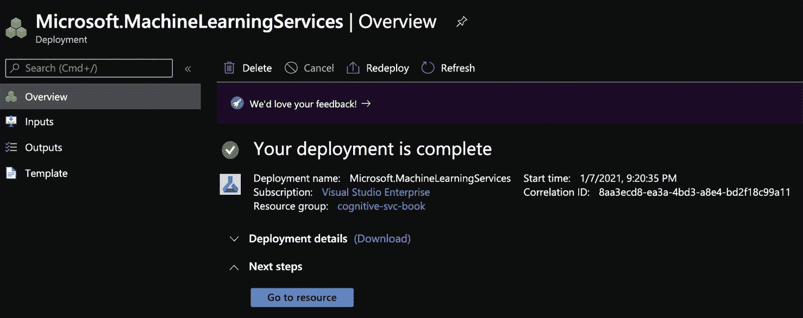

图 10-10

Azure 门户——创建机器学习工作空间

1.  一旦部署完成，您将看到如图 [10-10](#Fig10) 所示的消息。要继续，点击**转到资源**。

1.  In the resource screen, you will see the summary of the created workspace. Now you are ready to proceed with Machine Learning studio. You can either click the Studio web URL or click the **Launch studio** button, which will take you to the Azure Machine Learning studio.

    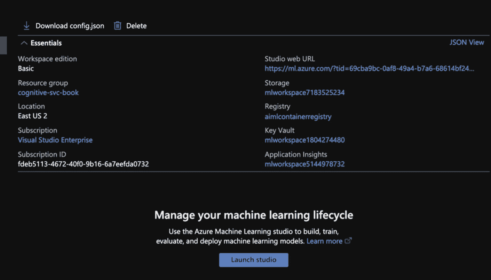

    图 10-11

    Azure 门户——创建机器学习工作空间

Azure Machine Learning studio

你可能会注意到机器学习工作室还有另一种味道，叫做 Azure Machine Learning studio(classic)[3](#Fn3)。这不要与当前现代化的 Azure Machine Learning studio 界面混淆，该界面包括设计器、自动化机器学习和 Jupyter 笔记本功能。Azure Machine Learning studio(classic)是最初用于构建机器学习模型的拖放式 UI，创建于 2015 年。它的大多数功能都可以作为设计器的一部分使用，但是在现代 Azure Machine Learning studio 环境中还有更多功能。

1.  This is the main screen for Azure Machine Learning studio, which can now be accessed via the ML URL (ml.azure.com). It comprises of different capabilities and skills that you read about earlier. Let’s click the notebooks’ **Start now** button, to create a simple *hello world* notebook.

    

    图 10-12

    Azure 机器学习工作室主页

您可以选择浏览示例笔记本或创建新的 Jupyter 笔记本文件。作为第一步，让我们创建一个新文件，如图 [10-13](#Fig13) 所示。这将使您很容易理解底层的依赖关系。

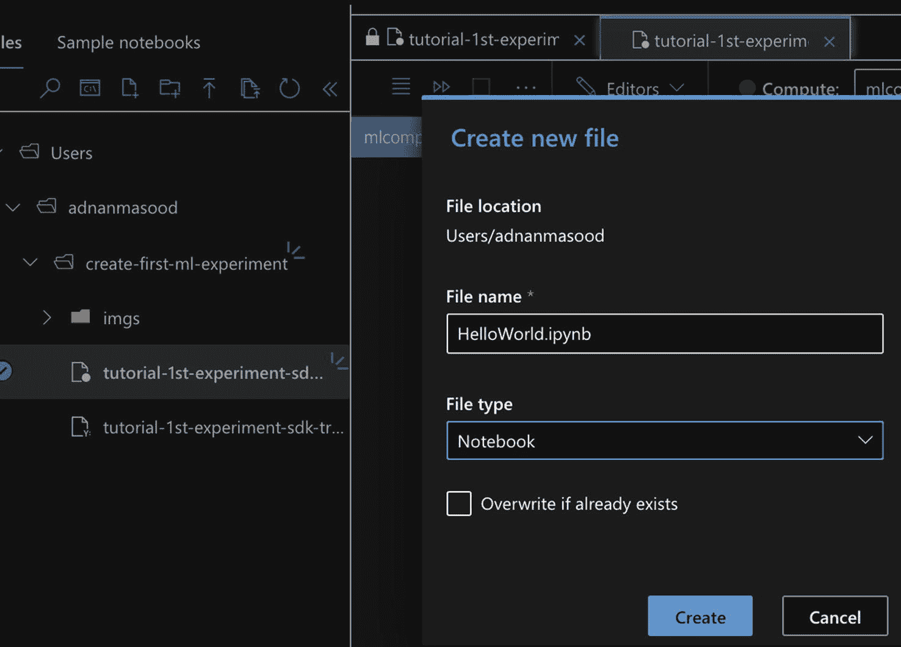

图 10-13

Azure 机器学习–创建 Jupyter 笔记本

1.  Once you create a new Jupyter notebook, which is empty by default, you will notice the “No computes found” message, on the top right (as shown in Figure [10-14](#Fig14)). If you try to run this notebook, you will get an error message stating that your notebook is currently not connected to a compute. It requires you to switch to a running compute or to create a new compute to run a cell. This simply means that you need a compute resource to run a notebook. Click the **Create compute** button to create a resource for the notebook.

    

    图 10-14

    Azure 机器学习–创造计算

1.  The compute instance screen helps you create a compute instance, in this case a virtual machine (VM). You can choose the VM type. If you have a deep learning–focused workload, use a GPU. Otherwise, a CPU should serve you fine. There are some prebuilt VMs, with their costs listed next to them – select a resource, as needed (see Figure [10-15](#Fig15)).

    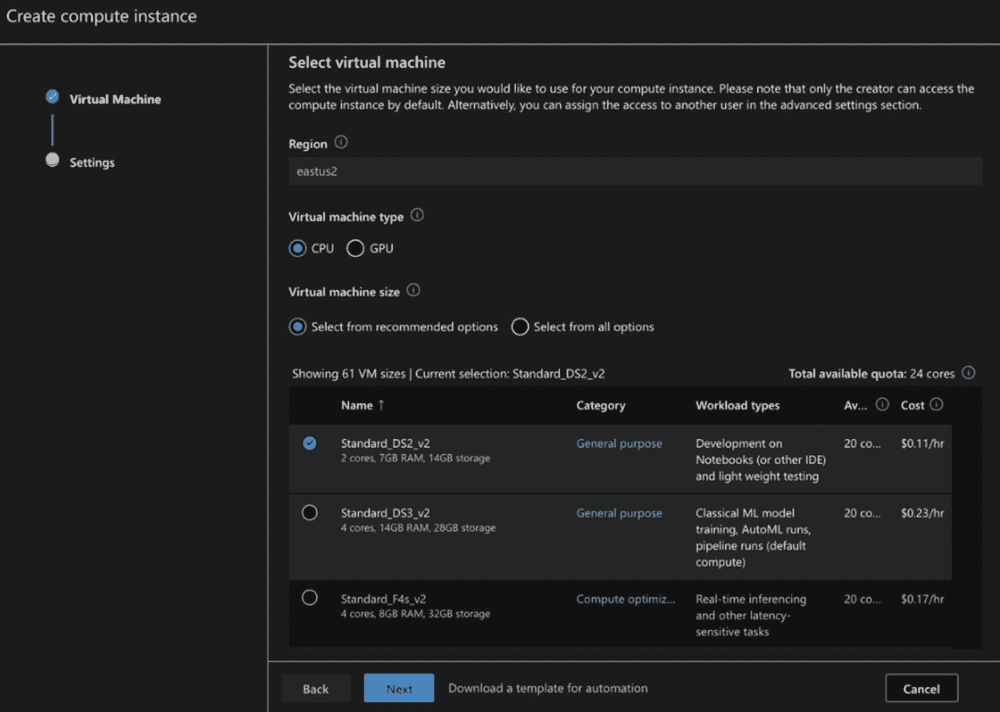

    图 10-15

    Azure 机器学习工作室–选择虚拟机

对于这个简单的例子，我们将选择具有以下规格的 DS2 v2 机器(如图 [10-16](#Fig16) 所示)。对于手头的任务来说，打印 *Hello World* 是多余的，但是我们可以在下一个分类任务中重用这个资源。

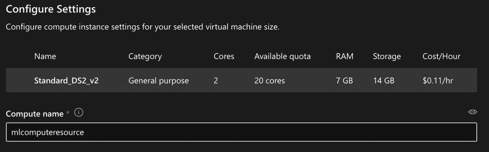

图 10-16

azure Machine Learning studio–配置虚拟机设置

1.  Once you have chosen the VM and created the compute name, now it’s time to run the notebook. Voila! See Figure [10-17](#Fig17).

    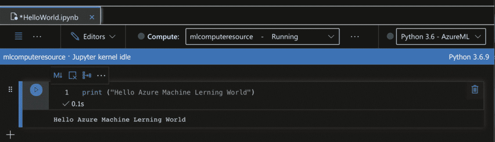

    图 10-17

    Azure 机器学习工作室–Hello World 笔记本

这个例子看起来微不足道，但它已经为您准备好了接下来要做的一切先决条件，一个您通过使用 Azure Machine Learning 服务和 Jupyter 笔记本构建的收入分类模型。现在，抛开所有依赖关系，让我们来看看人口普查收入分类问题。

## 创建用于分类的机器学习模型

UCI 人口普查成年人收入数据集 [4](#Fn4) 已经有一段时间了。它用于各种不同的用例，包括根据人口普查数据预测年收入是否超过 5 万美元。

1.  Create a notebook by clicking the **Create** button, as shown in Figure [10-18](#Fig18).

    

    图 10-18

    Azure 机器学习笔记本–创建笔记本工作流程

将笔记本命名为`AdultCensusClassifer.ipynb`。在文件类型下拉框中选择**笔记本**(如图 [10-19](#Fig19) )。

图 10-19

Azure 机器学习笔记本–创建笔记本工作流程

1.  Upload the *adult.csv* and *adult_test.csv* datasets, which are part of the book’s code repository. These files contain the adult dataset in the CSV format, as shown in Figure [10-20](#Fig20).

    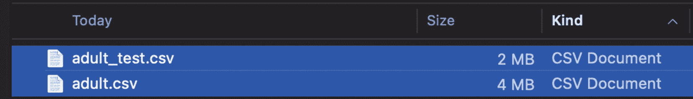

    图 10-20

    Azure 机器学习–上传数据集

您需要验证您信任这些文件的内容。点击**我信任这些文件的内容**复选框表示同意，如图 [10-21](#Fig21) 所示。任何不安全的上传都可能导致存储库的安全和治理问题。

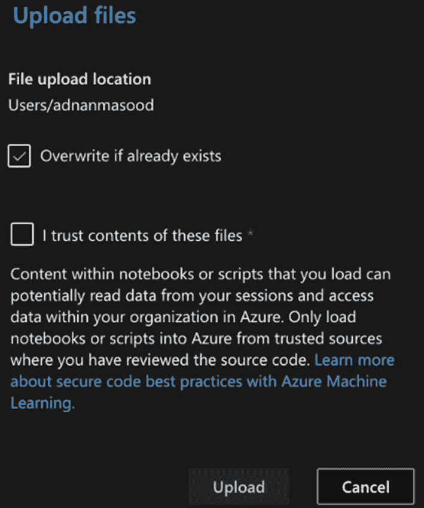

图 10-21

Azure 机器学习笔记本——上传数据集

您可以点击上传的数据集在浏览器中查看 CSV 文件，如图 [10-22](#Fig22) 所示。

图 10-22

Azure 机器学习笔记本–查看数据集

1.  The experiment will try to apply different classification algorithms to the dataset, and then it will generate the accuracy scores. The code segment, as shown in Figure [10-23](#Fig23), loads the adult dataset, the adult test dataset, and the prerequisites and dependencies.

    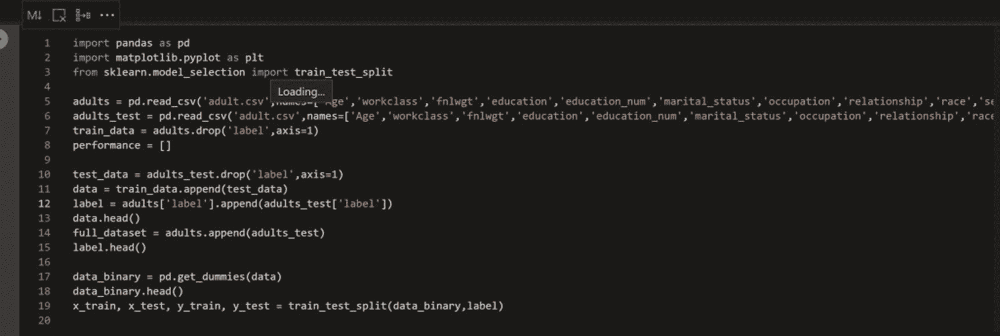

    图 10-23

    Azure 机器学习笔记本——运行先决条件和加载数据集的代码

1.  Let’s run the logistic regression classifier on the dataset and then calculate the scores. The sklearn library makes the interface very consistent and easy to work with. Toward the end, we print the accuracy scores and append it to the performance array (as shown in Figure [10-24](#Fig24)).

    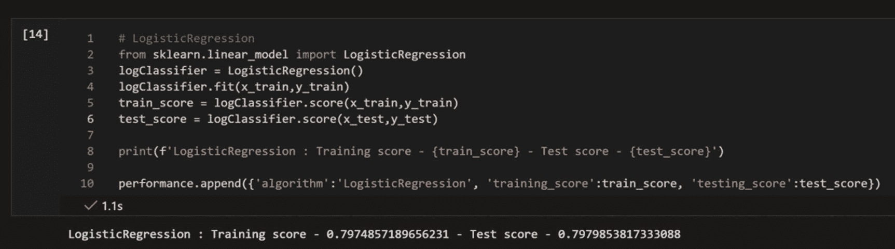

    图 10-24

    Azure 机器学习笔记本——逻辑回归代码

1.  We repeat the same experiment with Gaussian Naïve Bayes, K neighbors, random forests, and support vector machines. In Figure [10-25](#Fig25), you can see that random forest has the best results for both training and test data.

    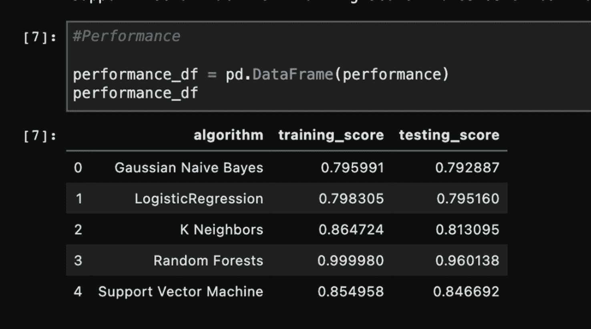

    图 10-25

    Azure 机器学习笔记本——实验结果

在我们结束之前，笔记本的 IntelliSense，一个代码完成辅助工具，是一个很棒的特性，它在浏览器中给你 IDE 的外观和感觉。在图 [10-26](#Fig26) 中，当鼠标悬停在方法上时，您可以看到方法的参数，您也可以使用自动完成。

图 10-26

Azure 机器学习笔记本–智能感知和自动完成

这个实验让你了解了如何将数据集导入 Azure 笔记本并运行多种算法。

Azure 笔记本曾有预览版( [`https://notebooks.azure.com/`](https://notebooks.azure.com/) )，现在已经退役，这些笔记本并不是 Azure 机器学习服务的集成部分。如果你正在为研发目的寻找一个免费的替代品，谷歌 Colab ( [`https://colab.research.google.com/notebooks/intro.ipynb`](https://colab.research.google.com/notebooks/intro.ipynb) )提供了一个绝佳的选择。然而，该服务是无状态的，这意味着每次会话到期时，您都需要重新加载数据集。

## 使用 Azure 机器学习设计器的分类模型

在前面的例子中，我们通过使用 Azure 机器学习笔记本建立了一个分类模型。这是一种代码量很大的方法，需要我们为不同的算法编写 Python 代码。现在，我们将通过使用 Azure 机器学习设计器来遵循低代码方法，如图 [10-27](#Fig27) 所示。

在 Azure Machine Learning workspace 门户的左侧窗格中，单击 Designer。设计器主页打开，可以看到管线集合(如图 [10-27](#Fig27) )。

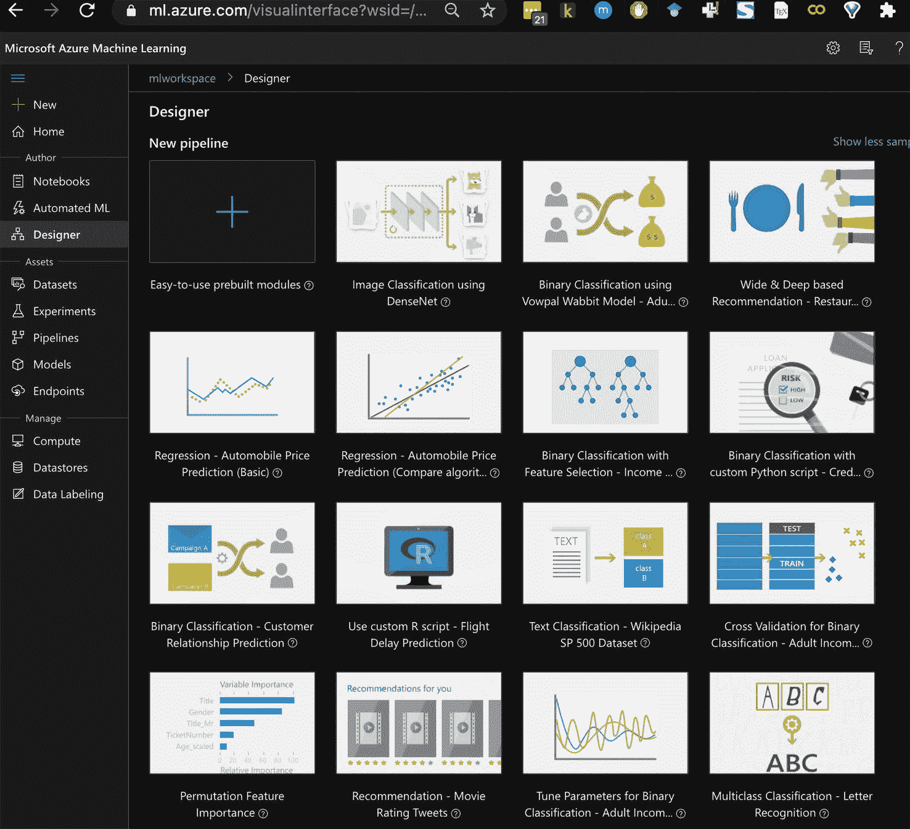

图 10-27

Azure 机器学习设计器–主屏幕

Microsoft Azure 团队提供了一套基本和高级的方法来学习如何使用设计器。Azure Machine Learning designer 的示例管道和数据集包括回归示例，如汽车价格预测、分类用例(如带有收入特征选择的二元分类)、信用风险、航班延误、客户关系预测、使用维基百科 SP 500 数据集的文本分类，以及使用 DenseNet 的基于计算机视觉的图像分类。这些示例还包括推荐引擎，如餐馆评级预测、基于推文的电影评级，以及使用 Vowpal Wabbit 模型进行成人收入预测的二元分类。

要使用 Azure Machine Learning designer 构建分类模型，请按照下列步骤操作:

1.  In this example, we will use the Adult Census Income dataset. Open up the example by double-clicking it, from the home screen, or build it from scratch. To continue, click the **Designer** tab (in the left pane). See Figure [10-28](#Fig28).

    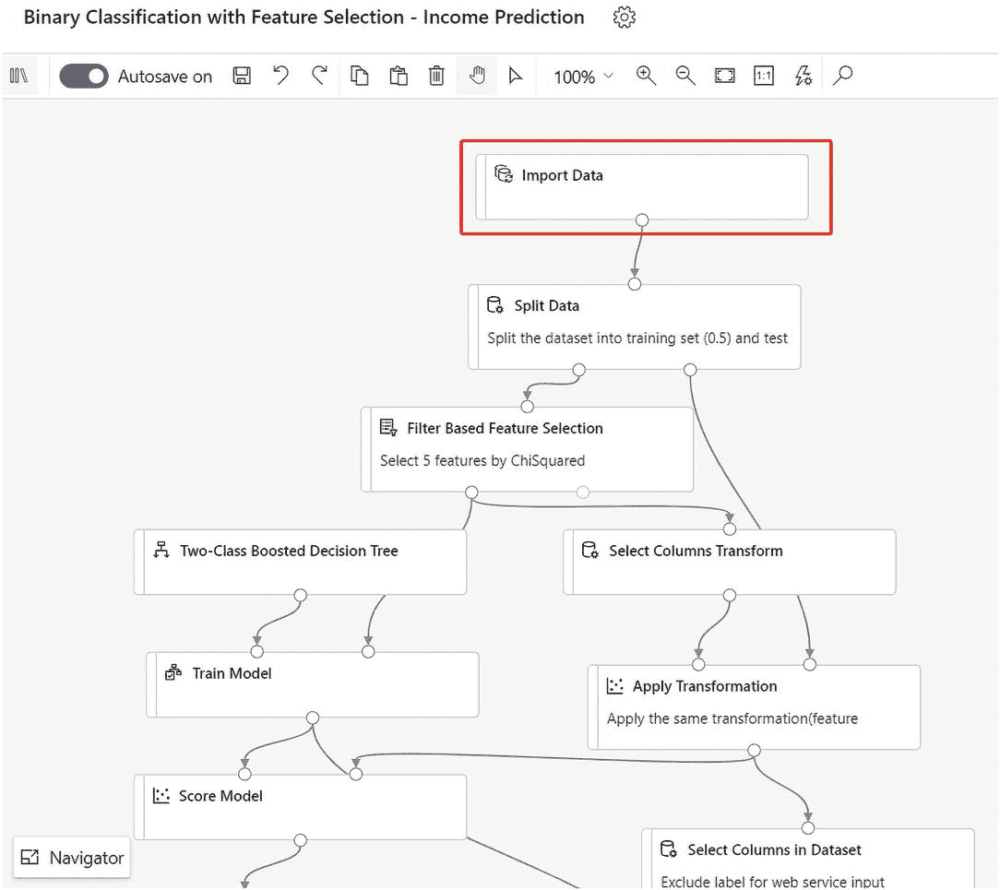

    图 10-28

    Azure 机器学习设计器–创作

1.  The designer is a drag-and-drop tool for citizen data scientists, with low-code focus. It is fairly easy to use. You can start by dragging the **Adult Census Income Binary Classification** dataset (as shown in Figure [10-29](#Fig29)).

    

    图 10-29

    Azure 机器学习设计器–数据集导入

拖放数据集后，您将在右侧窗格中看到数据集的参数(参见图 [10-30](#Fig30) )。

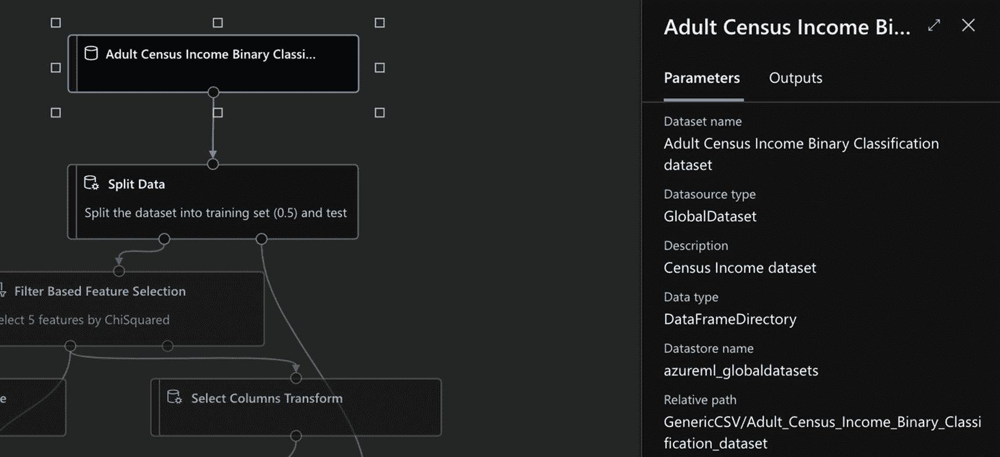

图 10-30

Azure 机器学习设计器–数据集导入

1.  The dataset needs to be split into a training dataset and a test dataset. This was accomplished in the previous session by using code. However, here we will use the split data module to accomplish this task. We will perform the randomized split of the dataset. See Figure [10-31](#Fig31).

    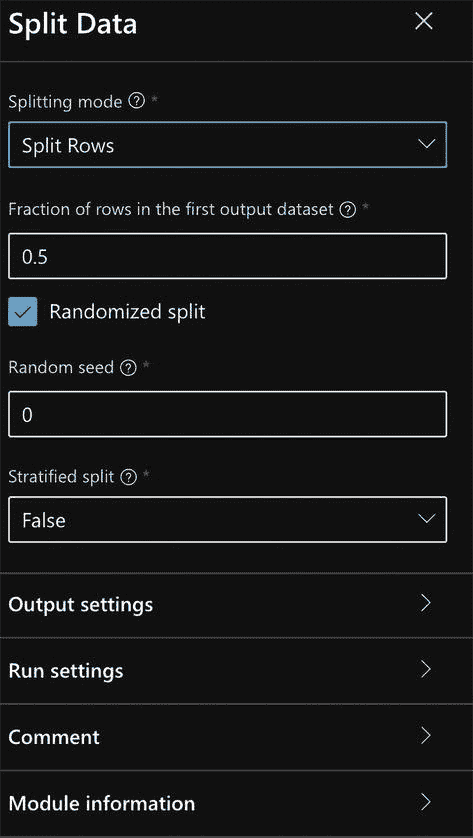

    图 10-31

    Azure 机器学习设计器–拆分数据

1.  Then filter the features and define the target column (income), with Pearson correlation as the feature scoring method. The other supported technique is chi squared, as seen in Figure [10-32](#Fig32).

    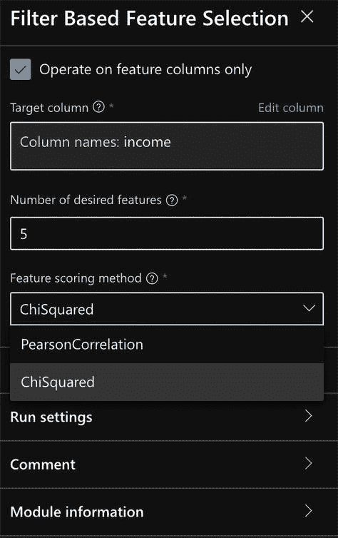

    图 10-32

    Azure 机器学习设计器–基于过滤器的功能选择

1.  Now that the data ingestion is completed, a Two-Class Boosted Decision Tree module can be used to initialize the classifier, which requires a train model module and associated transformation. In the left pane, you can see the different types of transformations that are supported by the Azure Machine Learning designer (as shown in Figure [10-33](#Fig33)).

    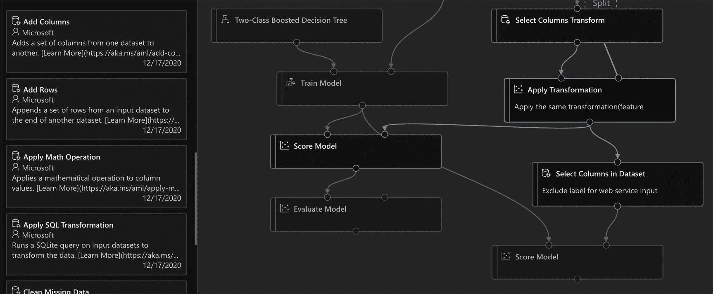

    图 10-33

    Azure 机器学习设计器–选择列

将训练模型模块与分数模型以及测试集连接起来。添加评估模型模块。最终管线应如图 [10-34](#Fig34) 所示。

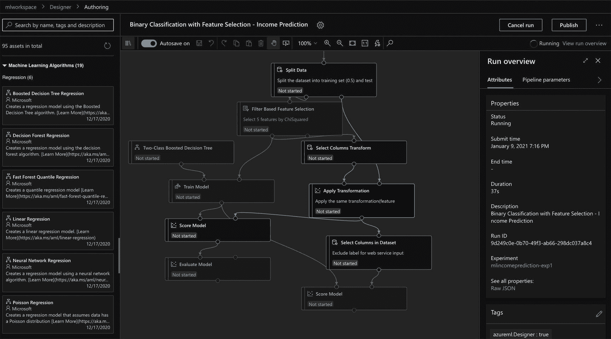

图 10-34

Azure 机器学习设计器–最终流程

在左侧窗格中，您可以看到可用算法的列表，包括提升决策树、快速森林回归、线性回归、神经网络回归和泊松回归等。运行完成后，您现在可以看到运行属性和所用模型的记分卡，在本例中，是两类提升决策树(见图 [10-35](#Fig35) )。

图 10-35

Azure 机器学习设计器–运行概述

运行完成后，在“模型运行概述”窗口中，您可以展开并查看运行中的各个任务(评估模型、应用转换、评分、选择列、拆分数据集等)以及流程各个部分所用的时间。在这里，我们可以看到两类提升决策树花费了最多的时间。也可以使用 Azure 机器学习 Visual Studio 代码扩展；一步一步的说明可以在这里找到。 [5](#Fn5) 参见图 [10-36](#Fig36) 中的运行视图。

图 10-36

Azure 机器学习设计器–运行视图

现在运行已经完成，右击**评估模型**，点击**可视化**，然后点击**评估结果**，如图 [10-37](#Fig37) 所示。

图 10-37

Azure 机器学习设计器–评估模型可视化

结果显示了不同属性及其评分标签(如他们的收入是高于还是低于 50，000 美元)的评分模型结果可视化。参见图 [10-38](#Fig38) 。

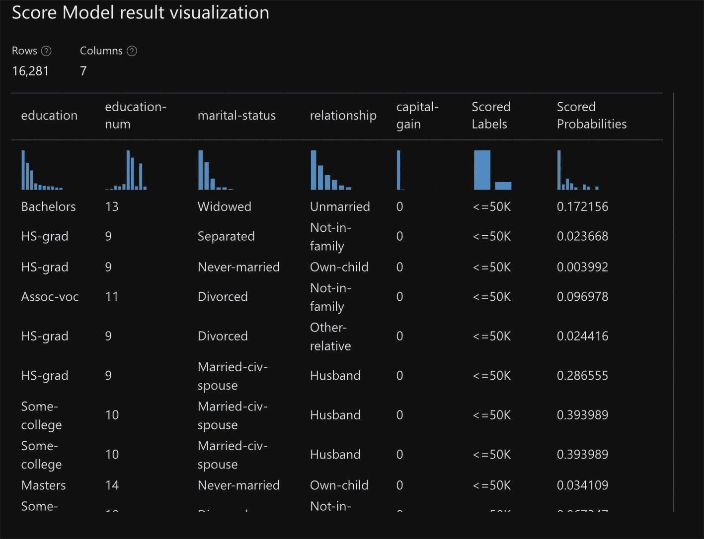

图 10-38

Azure 机器学习设计器–分数模型结果可视化

您还可以看到模型的准确度、精确度召回、提升和混淆矩阵(参见图 [10-39](#Fig39) )。在这种情况下，模型精度约为 85%。

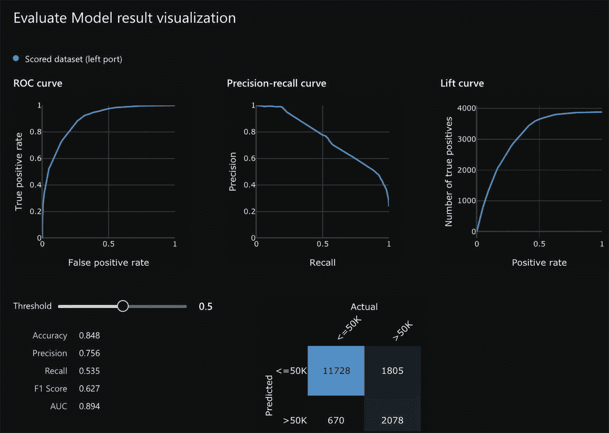

图 10-39

Azure 机器学习设计器–评估模型结果可视化

在这种低代码、基于设计器的拖放方法中，您可以用最少的代码更快地获得结果。这是一个适合公民数据科学家、视角数据科学家和机器学习工程师的 IDE，他们希望在不花费太多精力的情况下用给定的数据集进行实验。

## 结论和总结

你已经看完了这本书。我们希望这对你来说是一次有意义的旅程，并且对你学习和探索 Azure 认知服务和 Azure 机器学习前景的目标有所帮助。

在这最后一章，你已经了解了 Azure 机器学习产品，超越认知服务，Azure 机器学习入门，以及机器学习服务生态系统。您已经使用 Azure Machine Learning Jupyter notebook 配置、构建、部署和测试了一个分类模型。您探索了协作笔记本、机器学习操作、强化学习、自动化 ML、数据标记和自动扩展计算等功能。

现在，您可以将所学的知识应用到现实世界的项目中。学习这些新的、不断变化的、微妙的技术的最好方法是开始使用它们。就像人工智能和机器学习作为一门学科一样，Azure 机器学习正在不断发展，并添加新的能力、功能和技能。今天是开始(或继续学习)的好日子。

机器学习快乐！

## 参考资料和进一步阅读

**使用 ML 的 Python 笔记本和使用 Azure 机器学习的深度学习示例|微软**

[T2`https://github.com/Azure/MachineLearningNotebooks`](https://github.com/Azure/MachineLearningNotebooks)

Azure 机器学习的计算目标是什么？

[T2`https://docs.microsoft.com/azure/machine-learning/concept-compute-target`](https://docs.microsoft.com/azure/machine-learning/concept-compute-target)

**在 Python 的 Azure 机器学习管道中使用自动化 ML**

[T2`https://docs.microsoft.com/azure/machine-learning/how-to-use-automlstep-in-pipelines`](https://docs.microsoft.com/azure/machine-learning/how-to-use-automlstep-in-pipelines)

<aside aria-label="Footnotes" class="FootnoteSection" epub:type="footnotes">Footnotes [1](#Fn1_source)

Azure 机器学习管道: [`https://github.com/Azure/MachineLearningNotebooks/tree/master/how-to-use-azureml/machine-learning-pipelines`](https://github.com/Azure/MachineLearningNotebooks/tree/master/how-to-use-azureml/machine-learning-pipelines)

  [2](#Fn2_source)

[T2`http://archive.ics.uci.edu/ml/datasets/Adult`](http://archive.ics.uci.edu/ml/datasets/Adult)

  [3](#Fn3_source)

[T2`https://studio.azureml.net/`](https://studio.azureml.net/)

  [4](#Fn4_source)

[T2`http://archive.ics.uci.edu/ml/datasets/Adult`](http://archive.ics.uci.edu/ml/datasets/Adult)

  [5](#Fn5_source)

设置 Azure Machine Learning Visual Studio 代码扩展(预览)，位于

[T2`https://docs.microsoft.com/azure/machine-learning/tutorial-setup-vscode-extension`](https://docs.microsoft.com/azure/machine-learning/tutorial-setup-vscode-extension)

 </aside>