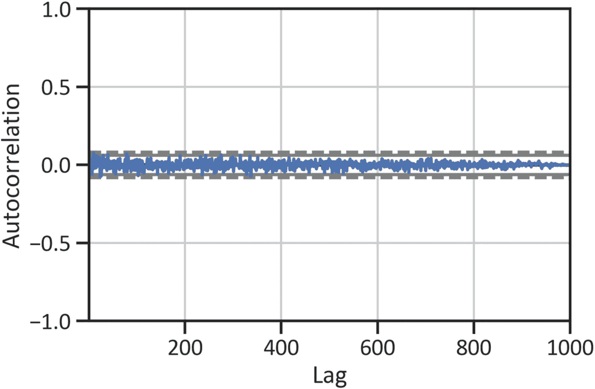
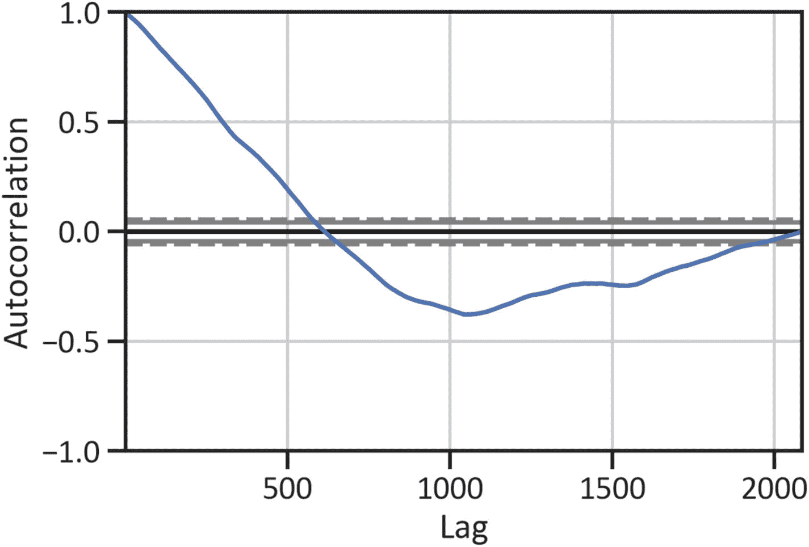
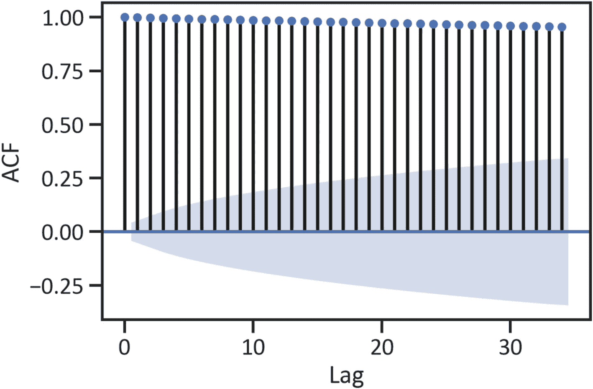
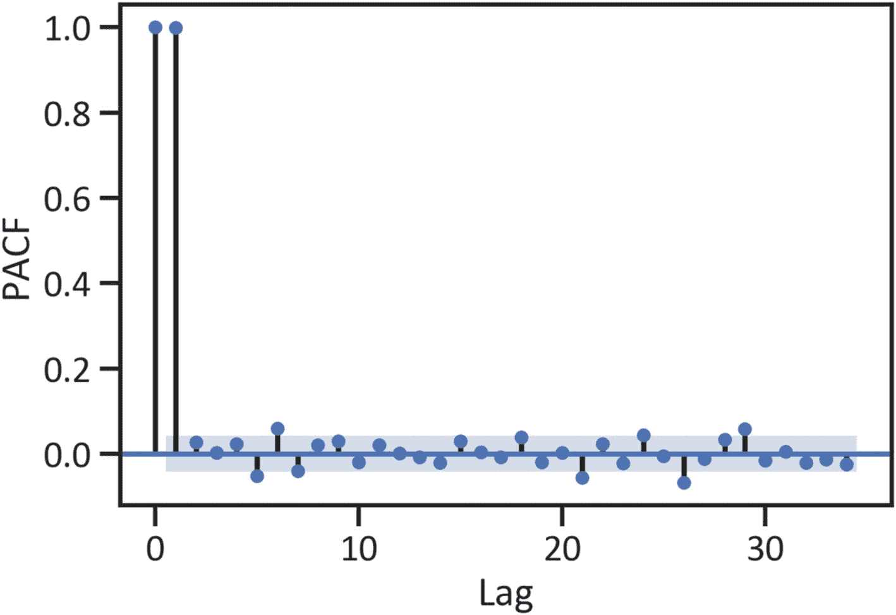
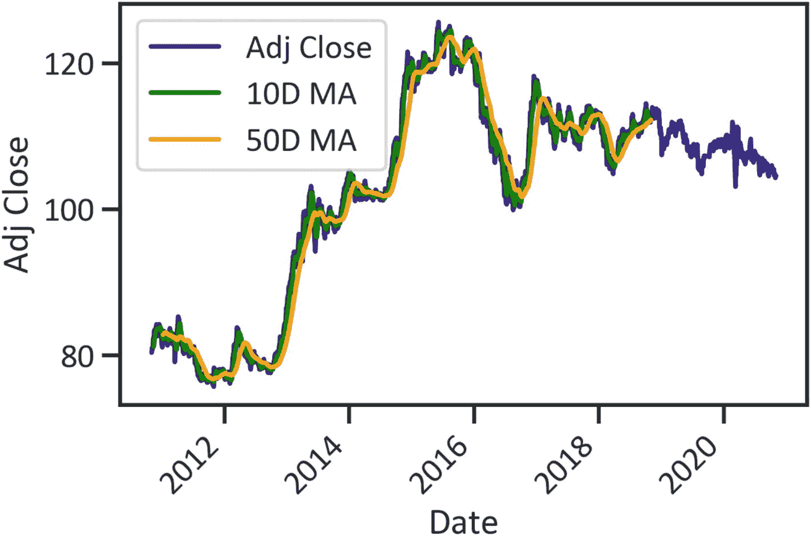
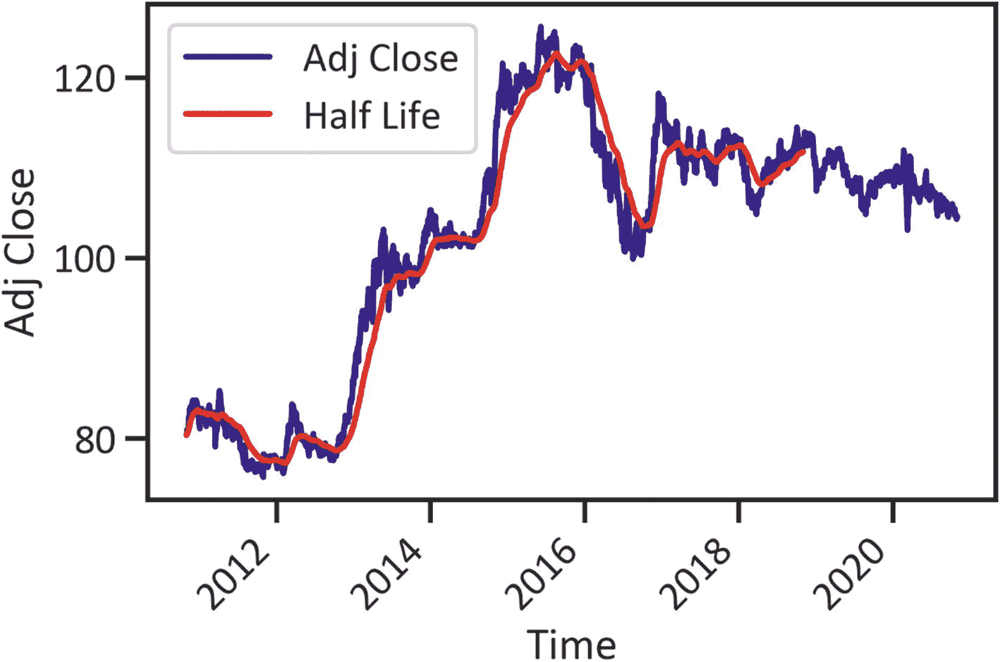
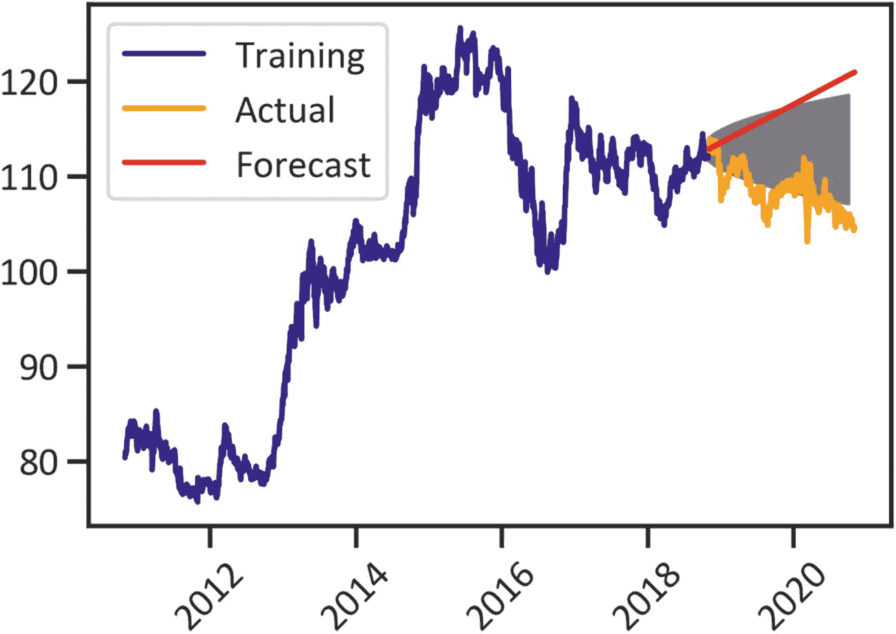
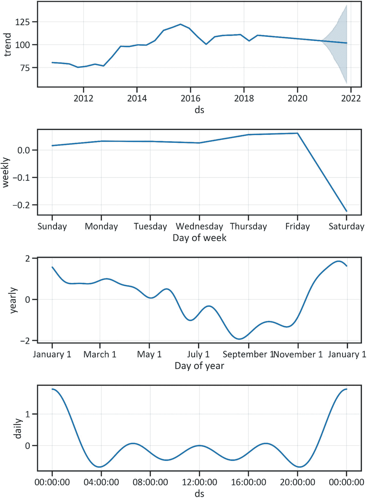

# 2.使用 ARIMA、萨里玛和加法模型进行预测

时间序列分析是一种解释序列问题的方法。当连续变量依赖于时间时，这是很方便的。在金融领域，我们经常使用它来发现市场数据中的一致模式，并预测未来价格。本章全面介绍了时间序列分析。它首先包括使用增强的 Dickey-Fuller (ADF)测试和白噪声和自相关测试来寻找平稳序列数据的方法。第二，它揭示了使用平滑简洁地总结时间序列数据中的模式的技术，如移动平均技术和指数技术。第三，它恰当地涵盖了投资回报率的估算。最后，它涵盖超参数优化和模型开发和评估。本章使您能够设计、开发和测试时间序列分析模型，如自回归综合移动平均(ARIMA)模型、季节性 ARIMA(萨里玛)模型和加法模型，以识别货币对的模式并预测未来价格。在这一章中，我们使用`pandas_datareader`从雅虎财经搜集财务数据，我们使用`conda install -c anaconda pandas-datareader`。对于时间序列建模，我们使用预装在 Python 环境中的`statsmodels`库。我们也用`pmdarima`，它是`statsmodels`的延伸。要在 Python 环境中安装它，我们使用`pip install pmdarima`；在 conda 环境中，我们使用`conda install -c saravji pmdarima`。最后，我们使用 FB Prophet 进行高质量的时间序列分析。要在 Python 环境中安装它，我们使用`pip install fbprophet`；在 conda 环境中，我们使用`conda install -c conda-forge fbprophet`。在安装`fbprophet`之前，确保首先安装`pystan`。为了安装`pystan`，我们使用`conda install -c conda-forge pystan`。

Anaconda 是最受欢迎的开源 Python 发行版，它使用户能够管理、安装、更新和管理软件包(从 [`https://www.anaconda.com/products/individual`](https://www.anaconda.com/products/individual) 下载平台)。您可以在 Windows、macOS 和 Linux 操作系统上安装该平台。在 [`https://docs.anaconda.com/anaconda-enterprise/system-requirements/`](https://docs.anaconda.com/anaconda-enterprise/system-requirements/) 了解更多关于系统要求和硬件要求。

## 行动中的时间序列

时间序列分析适合于估计与时间相关的连续变量。在本章中，我们用它来识别顺序数据的结构。这是一个无缝的方法来识别模式和预测货币对的未来价格。市场数据通常是连续的，有一些随机因素，这意味着有一个潜在的随机过程。我们分析了世界上交易最频繁的货币对之一，美元($)和日元( )，或(美元/日元)对的历史数据。我们感兴趣的是发现货币对调整后的收盘价随时间变化的模式，然后对价格变动做出可靠的预测。要创建时间序列模型，首先启动 Jupyter Notebook 并创建一个新的笔记本。

清单 [2-1](#PC1) 收集 2010 年 11 月 1 日至 2020 年 11 月 2 日美元/日元对的价格数据(见表 [2-1](#Tab1) )。

表 2-1

资料组

<colgroup><col class="tcol1 align-left"> <col class="tcol2 align-left"> <col class="tcol3 align-left"> <col class="tcol4 align-left"> <col class="tcol5 align-left"> <col class="tcol6 align-left"> <col class="tcol7 align-left"></colgroup> 
| 

**日期**

 | 

高的

 | 

低的

 | 

打开

 | 

关闭

 | 

卷

 | 

接近的

 |
| --- | --- | --- | --- | --- | --- | --- |
| **2010-11-01** | 81.111000 | 80.320000 | 80.572998 | 80.405998 | Zero | 80.405998 |
| **2010-11-02** | 80.936996 | 80.480003 | 80.510002 | 80.558998 | Zero | 80.558998 |
| **2010-11-03** | 81.467003 | 80.589996 | 80.655998 | 80.667999 | Zero | 80.667999 |
| **2010-11-04** | 81.199997 | 80.587997 | 81.057999 | 81.050003 | Zero | 81.050003 |
| **2010-11-05** | 81.430000 | 80.619003 | 80.769997 | 80.776001 | Zero | 80.776001 |

```py
import pandas as pd
from pandas_datareader import data
start_date = '2010-11-01'
end_date = '2020-11-01'
ticker = 'usdjpy=x'
df = data.get_data_yahoo(ticker, start_date, end_date)
df.head()

Listing 2-1Scrap Data

```

如上所述，我们对调整后的收盘价感兴趣。清单 [2-2](#PC2) 删除了我们不会用到的列。

```py
del df["Open"]
del df["High"]
del df["Low"]
del df["Close"]
del df["Volume"]
df = df.dropna()
df.info()
<class 'pandas.core.frame.DataFrame'>

DatetimeIndex: 2606 entries, 2010-11-01 to 2020-11-02
Data columns (total 1 columns):
 #   Column     Non-Null Count  Dtype
---  ------     --------------  -----
 0   Adj Close  2606 non-null   float64
dtypes: float64(1)
memory usage: 40.7 KB

Listing 2-2Delete Columns and Drop Missing Values

```

在这个清单中，我们删除了大部分列并丢弃了丢失的值。剩下一栏是调整后收盘价栏；格式是 Adj Close。

## 将数据分为训练数据和测试数据

时序数据中有 2，606 个数据点。清单 [2-3](#PC3) 使用 80/20 分割规则分割数据(前 2085 个数据点用于训练模型，其余的用于测试模型)。

```py
train = df[:2085]
test = df[2085:]

Listing 2-3Split Data into Training and Test Data

```

## 白噪声测试

如果时间序列数据是平稳的，那么它包含白噪声。研究白噪声最直接的方法是生成随机数据，并找出任意数据中是否存在白噪声。清单 [2-4](#PC4) 返回随机数并绘制不同滞后的自相关图(见图 [2-1](#Fig1) )。



图 2-1

随机白噪声测试

```py
from pandas.plotting import autocorrelation_plot
import matplotlib.pyplot as plt
import numpy as np
randval = np.random.randn(1000)
autocorrelation_plot(randval)
plt.show()

Listing 2-4White Noise Test

```

图 [2-1](#Fig1) 显示系列中没有白噪声，因为在 95%和 99%的置信区间上有明显的尖峰。列表 [2-5](#PC5) 绘制训练数据自相关以显示白噪声(见图 [2-2](#Fig2) )。



图 2-2

训练数据白噪声测试

```py
autocorrelation_plot(train["Adj Close"])
plt.show()

Listing 2-5Training Data White Noise Test

```

图 [2-2](#Fig2) 显示滞后 1 出现急剧下降，在第 500 个滞后之后，该线下降并接近零。由于所有自相关不等于零，我们可以确认没有白噪声。

## 文具测试

有序数据中随机过程的存在可能会影响结论。清单 [2-6](#PC6) 使用一个被称为增广的 Dickey-Fuller 检验的单位根检验来检查序列是否平稳(见表 [2-2](#Tab2) )。当系列数据的平均值为零时，系列是稳定的，这意味着观察值不会随时间而变化。当 p 值大于 0.05 时，使用增强的 Dickey-Fuller (ADF)检验，我们不会拒绝假设。

ADF 检验的假设如下:

*   *零假设:*没有单位根。

*   *替代假设:*有单位根。

当 ADF F%统计值小于零且 p 值小于 0.05 时，序列是非平稳的。

```py
from statsmodels.tsa.stattools import adfuller
adfullerreport = adfuller(train["Adj Close"])
adfullerreportdata = pd.DataFrame(adfullerreport[0:4],
                                  columns = ["Values"],
                                  index=["ADF F% statistics",
                                         "P-value",
                                         "No. of lags used",
                                         "No. of observations"])
adfullerreportdata

Listing 2-6Augmented Dickey-Fuller Test

```

表 2-2

f 统计

<colgroup><col class="tcol1 align-left"> <col class="tcol2 align-left"></colgroup> 
|   | 

价值观念

 |
| --- | --- |
| **ADF F%统计数据** | -1.267857 |
| **P 值** | 0.643747 |
| **使用的滞后数量** | 6.000000 |
| **观察数量** | 2078.000000 |

表 [2-2](#Tab2) 突出显示 F 统计结果为负，p 值大于 0.05。我们不拒绝零假设；该序列是非平稳的。这就要求序列需要差分。

### 自相关函数

列表 [2-7](#PC7) 确定 y 和 y <sub>t</sub> 之间的序列相关性(y <sub>t</sub> 需要在时间段 <sub>t</sub> 内测量观察值 *y* )。当我们考虑趋势、季节性、周期性和残差成分时，我们使用自相关函数来衡量一个序列的现值与先前值的相关程度。

图 [2-3](#Fig3) 显示大多数峰值在统计上并不显著。此外，我们使用偏自相关函数(PACF)来进一步检查滞后之间的部分序列相关性。



图 2-3

自相关

```py
from statsmodels.graphics.tsaplots import plot_acf
plot_acf(train["Adj Close"])
plt.xlabel("Lag")
plt.ylabel("ACF")
plt.show()

Listing 2-7Autocorrelation

```

### 部分自相关函数

PACF 图表达了在低水平滞后时没有描述的部分相关系数。清单 [2-8](#PC8) 构建了 PACF 图(见图 [2-4](#Fig4) )。



图 2-4

偏自相关

```py
from statsmodels.graphics.tsaplots import plot_pacf
plot_pacf(train["Adj Close"])
plt.xlabel("Lag")
plt.ylabel("ACF")
plt.show()

Listing 2-8Partial Autocorrelation

```

我们使用相关图来发现解释 95%置信界限之外的影响的滞后。例如，图 [2-3](#Fig3) 显示滞后 1 和滞后 2 中有一个显著的尖峰。这意味着滞后可以解释所有高阶自相关(最多第二个滞后是最高阶滞后)。它显示了不具有统计意义的峰值。(一直到滞后 2 都有很强的正相关；滞后 2 之后，p 值小于 0.05。)自相关接近于零，在统计控制附近(见图 [2-3](#Fig3) 中蓝色边界)。对时间序列数据有很强的依赖性。

## 移动平均平滑技术

最常见的平滑技术是移动平均(MA)技术；它返回先前数据点和新数据点的加权平均值，其中权重取决于时序数据的内聚力。在这个例子中，我们使用 Pandas 来执行滚动窗口计算。之后，我们发现了两个固定大小的移动窗口的滚动平均。移动窗口表示用于计算统计数据的数据点的数量。清单 [2-9](#PC9) 使用 10 天滚动窗口和 50 天滚动窗口平滑时间序列数据(见图 [2-5](#Fig5) )。



图 2-5

时间序列(10 天和 50 天移动平均线)

```py
MA10 = train["Adj Close"].rolling(window=10).mean()
MA50 = train["Adj Close"].rolling(window=50).mean()
df.plot(kind="line",color="navy")
MA10.plot(kind="line",color="green",label="10D MA")
MA50.plot(kind="line",color="orange",label="50D MA")
plt.xlabel("Date")
plt.xticks(rotation=45)
plt.ylabel("Adj Close")
plt.legend()
plt.show()

Listing 2-9Time Series (10-Day and 50-Day Moving Average)

```

## 指数平滑技术

指数平滑法将窗口外的值加权为零，其中巨大的加权值迅速消失，较小的加权值逐渐消失。清单 [2-10](#PC10) 使用指数平滑技术平滑时间序列数据，并将半衰期设置为 3。半衰期是一个参数，指定指数权重减半的滞后时间。在清单 [2-10](#PC10) 中，我们将参数指定为 3，因为在滞后 2 之前有很强的正相关性；滞后 2 之后，p 值小于 0.05(参见图 [2-3](#Fig3) )。

```py
Exp = train["Adj Close"].ewm(halflife=30).mean()
df.plot(kind="line", color="navy")
Exp.plot(kind="line", color="red", label="Half Life")
plt.xlabel("Time")
plt.ylabel("Adj Close")
plt.xticks(rotation=45)
plt.legend()

plt.show()

Listing 2-10Develop Smooth Series (Exponential)

```

图 [2-6](#Fig6) 显示了使用移动平均技术和指数技术的时间序列数据的核心结构。



图 2-6

时间序列(指数)

## 收益率

列表 [2-11](#PC11) 估计并绘制了资产收益率的年回报率(见图 [2-7](#Fig7) )。


图 2-7

收益率

```py
pr = df.pct_change()
pr_plus_one = pr.add(1)
cumulative_return = pr_plus_one.cumprod().sub(1)
fig, ax = plt.subplots()
cummulative_return = cumulative_return.mul(100)
cummulative_return_max = cummulative_return.max()
cummulative_return_min = cummulative_return.min()
cummulative_return.plot(ax=ax, color="purple")
plt.axhline(y=cummulative_return_max.item(), color="green",
            label="Max returns: " + str(round(cummulative_return_max.item(),2)) + " %")
plt.axhline(y=cummulative_return_min.item(), color="red",
            label="Min returns: " + str(round(cummulative_return_min.item(),2)) + " %")

plt.xlabel("Date")
plt.ylabel("Return (%)")
plt.legend(loc="best")
plt.xticks(rotation=45)
plt.show()

Listing 2-11Rate of Return

```

图 [2-7](#Fig7) 显示了十年期间(从 2010 年到 2020 年)的合理回报率。最低利率为-5.8%，最高利率为 56.24%。

## ARIMA 模式

在下一节中，我们将使用 ARIMA 对该系列进行建模，并预测其未来实例。ARIMA 是迄今为止最广泛的单变量时间序列分析模型。让我们来分解一下:

*   *自回归(AR)* :之前误差的线性组合。AR 考虑先前观测的观测项，包括随机白噪声和先前的随机白噪声。

*   *Integrated (I)* :通过差分使序列平稳的变换(估计一定时期内行的变化)。

*   *移动平均(MA)* :之前加权平均值的线性组合(参考之前介绍的移动平均平滑技术)。

与最小二乘模型相似，ARIMA 对数据结构做出了强有力的假设。该模型假设系列数据的结构是线性的和正态的。我们可以将 ARIMA 模型视为一种复杂的回归方法，因为我们将回归回归 lag1，lag2 应用于 lag = *k* 。该模型假设该序列是平稳的。在序列不是稳定的情况下，序列必须显示一段时间内的趋势。此外，还可以执行数据转换来提高模型的预测能力。

### ARIMA 超参数优化

清单 [2-11](#PC11) 找到最佳超参数(其配置改变模型行为的值)。传统上，我们使用自相关函数(ACF)和 PACF 来寻找最优超参数，这是主观的。清单 [2-12](#PC12) 使用`itertools`包来寻找使用 Akaike 信息标准的最佳超参数，该标准测量样本外预测误差。`itertools`预装在 Python 环境中。

```py
from statsmodels.tsa.arima_model import ARIMA
import itertools
p = d = q = range(0, 2)
pdq = list(itertools.product(p, d, q))
for param in pdq:
    mod = ARIMA(train, order=param)
    results = mod.fit()

    print('ARIMA{} AIC:{}'.format(param, results.aic))

ARIMA(0, 0, 0) AIC:17153.28608377512
ARIMA(0, 0, 1) AIC:14407.085213632363
ARIMA(0, 1, 0) AIC:3812.4806641861296
ARIMA(0, 1, 1) AIC:3812.306176824848
ARIMA(1, 0, 0) AIC:3823.4611095477635
ARIMA(1, 0, 1) AIC:3823.432441560404
ARIMA(1, 1, 0) AIC:3812.267920836725
ARIMA(1, 1, 1) AIC:3808.9980010413774

Listing 2-12ARIMA Hyperparameters Optimization

```

## 发展 ARIMA 模式

列表 [2-13](#PC13) 完成了 ARIMA (1，1，1)模型，并构建了模型性能评估的 profile 表(见表 [2-3](#Tab3) )。我们只选择 ARIMA (1，1，1)，因为它的 AIC 分数最低。AIC 是确定拟合优度和模型简单性的统计测试。简单地说，它表示模型丢失信息的程度。因此，order = (1，1，1)在默认情况下比列表 [2-12](#PC12) 中范围内的其他订单具有更强的预测能力。

表 2-3

ARIMA 模型结果

<colgroup><col class="tcol1 align-left"> <col class="tcol2 align-left"> <col class="tcol3 align-left"> <col class="tcol4 align-left"></colgroup> 
| 

离开变量:

 | 

D.接近的

 | 

数量意见:

 | 

Two thousand and eighty-four

 |
| --- | --- | --- | --- |
| **型号:** | ARIMA(1，1，1) | **对数可能性** | -1900.499 |
| **方法:** | css-mle | **创新的 s . d .** | Zero point six zero two |
| **日期:** | 收集，01 apr 2021 | AIC | Three thousand eight hundred and eight point nine nine eight |
| **时间:** | 02:54:35 | BIC | Three thousand eight hundred and thirty-one point five six six |
| **样本:** | one | **HQIC** | Three thousand eight hundred and seventeen point two six seven |

<colgroup><col class="tcol1 align-left"> <col class="tcol2 align-left"> <col class="tcol3 align-left"> <col class="tcol4 align-left"> <col class="tcol5 align-left"> <col class="tcol6 align-left"> <col class="tcol7 align-left"></colgroup> 
|   | 

**coef**

 | 

**标准误差**

 | 

**Z**

 | 

**P > &#124;z&#124;**

 | 

**【0.025**

 | 

**0.975】**

 |
| --- | --- | --- | --- | --- | --- | --- |
| **常数** | 0.0156 | Zero point zero one three | One point one nine nine | Zero point two three one | -0.010 | Zero point zero four one |
| **空气。L1.D.Adj Close** | -0.8638 | Zero point zero nine four | -9.188 | Zero | -1.048 | -0.680 |
| **马。L1.D.Adj 关闭** | 0.8336 | Zero point one zero three | Eight point zero nine five | Zero | Zero point six three two | One point zero three five |

<colgroup><col class="tcol1 align-left"> <col class="tcol2 align-left"> <col class="tcol3 align-left"> <col class="tcol4 align-left"> <col class="tcol5 align-left"></colgroup> 
|   | 

**真实**

 | 

**假想的**

 | 

**模数**

 | 

**频率**

 |
| --- | --- | --- | --- | --- |
| **AR.1** | -1.1576 | +0.0000 焦耳 | 1.1576 | 0.5000 |
| **MA.1** | -1.1996 | +0.0000 焦耳 | 1.1996 | 0.5000 |

```py
arima_model = ARIMA(train, order=(1, 1, 1))
arima_fitted = arima_model.fit()
arima_fitted.summary()

Listing 2-13Finalize the ARIMA Model

```

### 使用 ARIMA 模型进行预测

完成 ARIMA (1，1，1)模型后，下一步通常需要识别调整后收盘价的潜在模式并预测未来价格(见图 [2-8](#Fig8) )。见清单 [2-14](#PC14) 。


图 2-8

ARIMA (1，1，1)预测

```py
fc, se, conf = arima_fitted.forecast(501, alpha=0.05)
fc_series = pd.Series(fc, index=test.index)
lower_series = pd.Series(conf[:, 0], index=test.index)
upper_series = pd.Series(conf[:, 1], index=test.index)
plt.plot(train, label="Training",color="navy")
plt.plot(test, label="Actual",color="orange")
plt.plot(fc_series, label="Forecast",color="red")
plt.fill_between(lower_series.index,
                 lower_series,
                 upper_series,
                 color='gray')
plt.legend(loc='upper left')
plt.xticks(rotation=45)
plt.xlabel("Date")

plt.ylabel("Adj Close")
plt.show()

Listing 2-14Forecast ARIMA Model

```

图 [2-8](#Fig8) 显示模型在预测时出现误差。灰色区域(填充区间)代表置信区间。

## 萨里玛模型

虽然 ARIMA 模型是分析单变量时间序列数据模式的强大模型，但它在处理季节性数据时会出错。向模型中添加季节性订单可以增强其性能。萨里玛扩展了 ARIMA 模型。在对时间序列数据建模时，它考虑了季节性因素。

### SARIMA 超参数优化

清单 [2-15](#PC15) 使用`itertools`包找到使用 AIC 的最佳超参数(参考清单 [2-12](#PC12) )。SciPy 包预安装在 Python 环境中。

```py
import scipy.stats as stats
p = d = q = range(0,2)
pdq = list(itertools.product(p,d,q))
seasonal_pdq = [(x[0],x[1],x[2],12) for x in list(itertools.product(p,d,q))]
for param in pdq:
    for param_seasonal in seasonal_pdq:
        try:
            model = sm.tsa.statespace.SARIMAX(train,
                             order=param,
                             seasonal_order=param_seasonal,
                             enforce_stationarity=False,
                             enforce_intervibility=False)
            results = model.fit()
            print("SARIMAX {} x {} 12 - AIC: {}".format(param,param_seasonal,results.aic))
        except:
            continue
SARIMAX (1, 1, 1) x (0, 1, 1, 12) 12 - AIC: 3822.8419684760634
SARIMAX (1, 1, 1) x (1, 0, 0, 12) 12 - AIC: 3795.147211266854
SARIMAX (1, 1, 1) x (1, 0, 1, 12) 12 - AIC: 3795.0731989219726
SARIMAX (1, 1, 1) x (1, 1, 0, 12) 12 - AIC: 4580.905706671067
SARIMAX (1, 1, 1) x (1, 1, 1, 12) 12 - AIC: 3824.843959188799

Listing 2-15SARIMA Hyperparameter Optimization

```

请注意，我们只显示了最后五个输出。前面的代码从 SARIMAX (0，0，0) × (0，0，0，12) 12 到 SARIMAX (1，1，1) × (1，1，12) 12 估算 AIC。我们发现 SARIMAX (1，1，1) × (1，1，1，12) 12 具有最低的 AIC 分数。清单 [2-16](#PC16) 用 order = (1，1，1)完成了 SARIMA 模型。

### 开发一个萨里玛模型

清单 [2-16](#PC16) 完成了 SARIMA 模型，但没有强制执行静态和可逆，并构建了一个包含模型性能信息的表格(见表 [2-4](#Tab4) )。

表 2-4

萨里玛轮廓

<colgroup><col class="tcol1 align-left"> <col class="tcol2 align-left"> <col class="tcol3 align-left"> <col class="tcol4 align-left"></colgroup> 
| 

离开变量:

 | 

Y

 | 

数量意见:

 | 

Two thousand and eighty-five

 |
| --- | --- | --- | --- |
| **型号:** | SARIMAX(1，1，1) | **对数可能性** | -1901.217 |
| **日期:** | 2020 年 11 月 14 日星期六 | AIC | Three thousand eight hundred and eight point four three five |
| **时间:** | 02:01:47 | BIC | Three thousand eight hundred and twenty-five point three six one |
| **样本:** | Zero | **HQIC** | Three thousand eight hundred and fourteen point six three seven |
|   | - 2085 |   |   |
| **协方差类型:** | 氧基聚明胶 |   |   |

<colgroup><col class="tcol1 align-left"> <col class="tcol2 align-left"> <col class="tcol3 align-left"> <col class="tcol4 align-left"> <col class="tcol5 align-left"> <col class="tcol6 align-left"> <col class="tcol7 align-left"></colgroup> 
|   | 

**coef**

 | 

**标准误差**

 | 

**z**

 | 

**P > &#124;z&#124;**

 | 

**【0.025**

 | 

**0.975】**

 |
| --- | --- | --- | --- | --- | --- | --- |
| **空气。L1〔t1〕** | -0.8645 | Zero point zero eight three | -10.411 | Zero | -1.027 | -0.702 |
| **马。L1** | 0.8344 | Zero point zero nine | Nine point two five eight | Zero | Zero point six five eight | One point zero one one |
| **【sigma 2】** | 0.3630 | Zero point zero zero seven | Fifty-two point three three nine | Zero | Zero point three four nine | Zero point three seven seven |

<colgroup><col class="tcol1 align-left"> <col class="tcol2 align-left"> <col class="tcol3 align-left"> <col class="tcol4 align-left"></colgroup> 
| 

**青盒子(Q):**

 | 

Fifty-eight point seven seven

 | 

**花园-贝拉(JB):**

 | 

Nine hundred and fifty-five point one six

 |
| --- | --- | --- | --- |
| **Prob(Q):** | Zero point zero three | **Prob(JB):** | Zero |
| **异方差(H):** | One point three five | **偏斜:** | Zero point zero four |
| **Prob(H)(双面):** | Zero | **峰度:** | Six point three two |

```py
import pmdarima as pm
sarimax_model = pm.auto_arima(train, start_p=1, start_q=1, start_P=1, start_Q=1,
                     max_p=5, max_q=5, max_P=5, max_Q=5, seasonal=True,
                     stepwise=True, suppress_warnings=True, D=10, max_D=10,
                     error_action='ignore')
sarimax_model.summary()

Listing 2-16Finalize the SARIMA Model

```

表 [2-4](#Tab4) 显示 ar 的 p 值。马萨诸塞州 L1。L1 和大于 0.05 的西格玛。我们可以确认这个数列是平稳的。

### 使用 ARIMA 模型进行预测

清单 [2-17](#PC17) 构建了一个图表，显示了之前调整的美元/日元对的收盘价以及由 SARIMA (1，1，12)模型预测的收盘价(见图 [2-9](#Fig9) )。



图 2-9

SARIMA (1，1，1，12)预测

```py
n_periods = 24
fitted, confint = sarimax_model.predict(n_periods=n_periods, return_conf_int=True)
index_of_fc = pd.date_range(train.index[-1], periods = n_periods, freq='MS')
fitted_series = pd.Series(fitted, index=index_of_fc)
lower_series = pd.Series(confint[:, 0], index=index_of_fc)
upper_series = pd.Series(confint[:, 1], index=index_of_fc)
plt.plot(train, label="Training",color="navy")
plt.plot(test, label="Actual",color="orange")
plt.plot(fitted_series, label="Forecast",color="red")
plt.fill_between(lower_series.index,
                 lower_series,
                 upper_series,
                 color='gray')
plt.legend(loc='upper left')
plt.xticks(rotation=45)
plt.xlabel("Date")
plt.ylabel("Adj Close")

plt.show()

Listing 2-17SARIMA Model Forecast

```

图 [2-9](#Fig9) 显示了一个窄范围的预测。两个模型都不能最好地解释时间序列数据；他们在预测未来价格时会犯微小的错误。在下一节中，我们将通过使用 Prophet 包中的附加模型来解决这个问题。

## 加法模型

除了趋势和季节性，还有其他因素影响价格变化。例如，在公共假日期间，交易活动不同于正常交易日。ARIMA 和萨里玛模型都没有考虑公共假期的影响。加法模型解决了这一挑战。它考虑了每日、每周和每年的季节性和非线性趋势。它假设趋势和周期是一个术语，并无缝添加了官方公共假期和误差的影响。该公式在数学上写成等式 [2-1](#Equ1) 。


(方程式 2-1)

这里， *g* ( *t* )表示用于建模非周期性变化的线性或逻辑增长曲线， *s* ( *t* )表示周期性变化(每日、每周、每年的季节性)， *h* ( *t* )表示节假日的影响，+ 𝜀𝑖表示考虑异常变化的误差项。

清单 [2-18](#PC18) 重新利用数据(见表 [2-5](#Tab5) )。请注意，在清单 [2-2](#PC2) 中，我们删除了低价格、高价格、开盘价和收盘价。我们对预测调整后的收盘价感兴趣。

表 2-5

资料组

<colgroup><col class="tcol1 align-left"> <col class="tcol2 align-left"> <col class="tcol3 align-left"> <col class="tcol4 align-left"></colgroup> 
| 

**日期**

 | 

接近的

 | 

从记号处开始重复一遍

 | 

y

 |
| --- | --- | --- | --- |
| **2010-11-01** | 80.405998 | 2010-11-01 | 80.405998 |
| **2010-11-02** | 80.558998 | 2010-11-02 | 80.558998 |
| **2010-11-03** | 80.667999 | 2010-11-03 | 80.667999 |
| **2010-11-04** | 81.050003 | 2010-11-04 | 81.050003 |
| **2010-11-05** | 80.776001 | 2010-11-05 | 80.776001 |
| **...** | ... | ... | ... |
| **2020-10-27** | 104.832001 | 2020-10-27 | 104.832001 |
| **2020-10-28** | 104.544998 | 2020-10-28 | 104.544998 |
| **2020-10-29** | 104.315002 | 2020-10-29 | 104.315002 |
| **2020-10-30** | 104.554001 | 2020-10-30 | 104.554001 |
| **2020-11-02** | 104.580002 | 2020-11-02 | 104.580002 |

```py
df = df.reset_index()
df["ds"] = df["Date"]
df["y"] = df["Adj Close"]
df.set_index("Date")

Listing 2-18Data Preprocessing

```

清单 [2-19](#PC19) 指定了其效果将被添加到模型中的官方公共假日(参见清单 [2-20](#PC20) )。

```py
holidays = pd.DataFrame({
  'holiday': 'playoff',
  'ds': pd.to_datetime(["2020-12-25", "2020-12-24", "2020-12-23", "2019-12-25", "2021-01-01", "2021-01-20"]),
    "lower_window": 0,
    "upper_window": 1,
})

Listing 2-19Specify Holidays

```

清单 [2-20](#PC20) 完成了置信区间为 95%的加法模型；它考虑了每年的季节性、每周的季节性、每天的季节性和官方的公共假日。

```py
from fbprophet import Prophet

m = Prophet(holidays=holidays,
            interval_width=0.95,
            yearly_seasonality=True,
            weekly_seasonality=True,
            daily_seasonality=True,
            changepoint_prior_scale=0.095)
m.add_country_holidays(country_name='US')
m.fit(df)

Listing 2-20Develop Prophet Model

```

### 预报

清单 [2-21](#PC21) 预测未来调整后的收盘价，并显示时间序列数据和加性模型预测的价格中的模式(见图 [2-10](#Fig10) )。


图 2-10

预报

```py
future = m.make_future_dataframe(periods=365)
forecast = m.predict(future)
m.plot(forecast)
plt.xlabel("Date")
plt.ylabel("Adj Close")
plt.xticks(rotation=45)
plt.show()

Listing 2-21Forecast

```

图 [2-10](#Fig10) 与 ARIMA 模型和萨里玛模型都不一致(两个模型都预测有上升趋势)。然而，加性模型实际上与数据相符。

### 季节性分解

清单 [2-22](#PC22) 应用`plot_decompose()`方法将序列分解为季节性、趋势和不规则成分(见图 [2-11](#Fig11) )。分解包括将时间序列分解成多个部分，以了解序列中的重复模式。它帮助确定单变量时间序列分析的参数；我们可以确定序列中是否存在趋势和季节性。



图 2-11

季节性成分

```py
m.plot_components(forecast)
plt.show()

Listing 2-22Seasonal Components

```

图 [2-11](#Fig11) 显示了清晰的每日、每周和每年的季节性。在一年的前几个月，调整后的收盘价下降，并在一年的最后两个季度达到峰值。

## 结论

本章详细介绍了时间序列分析方法。我们开发并公正地比较了 ARIMA 和萨里玛模型的性能。此外，我们还查看了 Prophet 包装中的添加剂型号。在仔细检查了所有三个模型的表现后，我们注意到加法模型犯了一些小错误，并且对美元/日元对的未来价格有更强的预测。为了提高模型的性能，我们可以使用一些技术，如改变数据分割率、剔除异常值、数据转换以及纳入节假日的影响。