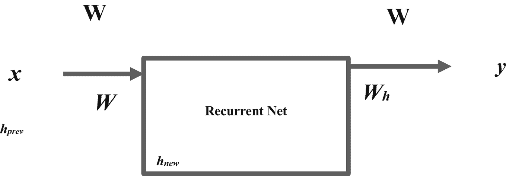
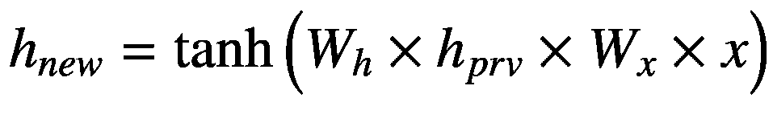

# 三、使用循环神经网络的单变量时间序列

本章涵盖了深度学习的基础知识。首先，介绍了激活函数、损失函数和人工神经网络优化器。其次，它讨论了序列数据问题以及循环神经网络(RNN)如何解决它。第三，本章介绍了一种设计、开发和测试最流行的 RNN 的方法，即长短期记忆(LSTM)模型。我们使用 Keras 框架进行快速原型制作和构建神经网络。要在 conda 环境中安装`keras`，请使用`conda install -c conda-forge keras`。确保你也安装了`tensorflow`。要在 conda 环境中安装`tensorflow`，请使用`conda install -c conda-forge tensorflow`。

## 什么是深度学习？

*深度学习*是操作神经网络的机器学习的子集。神经网络是由相互连接的节点组组成的网络，这些节点组逐层接收、转换和传输输入值，直到它们到达输出层。激活函数通过操作每个隐藏层中的一组变量来实现这一过程。

## 激活功能

激活函数将非线性添加到人工神经网络中，并实现反向传播(反向的完整传递)。有三个主要的激活功能。

*S 形激活函数*:将 S 形曲线与数据拟合，并触发 0 到 1 之间的输出值。

> *正切双曲线(tanh)激活函数*:将 tanh 曲线与数据拟合，并触发-1 和 1 之间的输出。

> *校正线性单元(ReLu)激活功能*:检索不受特定范围约束的值，并解决消失梯度问题(当我们向模型中添加更多训练数据时梯度增加的情况，这会导致训练缓慢)。

## 损失函数

损失函数评估实际值和人工神经网络预测值之间的差异。关键损失函数包括均方误差(MSE)、平均绝对误差和均方对数误差。在本章中，我们使用 MSE(在考虑回归关系后，由模型解释的关于数据的可变性)。

## 优化人工神经网络

模型优化有几种方法。最常见的优化器是自适应运动估计(Adam)，它在训练期间最小化成本函数方面工作得更好。

## 顺序数据问题

顺序数据包含具有某种依赖性的有序数据点。时间序列是顺序数据的一个很好的例子。在时间序列数据中，每个数据点代表某个时期的一个观察值。传统的神经网络(如前馈网络)在对序列数据建模时会遇到挑战，因为它们无法记住之前的输出值。这意味着前馈网络仅产生输出值，而不考虑数据中的任何依赖性(递归网络解决了这个问题)。

## RNN 模式

循环神经网络模型适用于顺序建模。我们称之为*递归*是因为该模型对一系列数据点中的每个数据点执行重复任务，因此输出值取决于前面的值。递归网络在时间步 <sub>t-1</sub> 的决策结果影响最后一个时间步 <sub>t</sub> 的决策结果。它维护一种状态，以引用给定点的历史分析。该状态管理存储在先前估计中的信息，并以唯一的输入值递归回到网络中。图 [3-1](#Fig1) 描绘了一个带有单一隐藏层的递归。



图 3-1

RNN 模型

公式如公式 [3-1](#Equ1) 所示。



(Equation 3-1)

这里， *W* <sub>*x*</sub> 表示输入和隐藏单元之间的权重矩阵， *W* <sub>*y*</sub> 表示…， *W* <sub>*h*</sub> 表示与前面状态相乘的权重， *x* 表示隐藏层接收的输入数据，*h*<sub>*PRV*</sub>我们将 RNN 模型应用于语音识别、图像字幕和情感分析。尽管该模型解决了大多数模型难以解决的问题，但它也有自己的缺点。

## 循环神经网络问题

完整的 RNN 模型必须合理地维持一个细胞状态。当处理大数据时，网络变得计算昂贵；它对参数的变化很敏感。此外，它容易出现消失梯度问题和爆炸梯度问题。这个问题通常发生在传统模型中，在训练过程的初始阶段，模型具有小的梯度，但是随着我们增加训练数据，梯度增加，导致训练过程变慢(这种现象被认为是消失梯度问题)。LSTM 模型解决了梯度消失的问题。

## LSTM 模式

LSTM 模型可以模拟长序列数据。它在几个时间戳上有很强的梯度。LSTM 有两个关键，即移动信息而不改变的细胞状态，以及控制信息流动的门。见图 [3-2](#Fig2) 。


图 3-2

-什么

### 盖茨

LSTM 模型包括三个门，即输入门、遗忘门和输出门。输入门确定要写入存储单元的附加信息。输入门包括两层。我们认为第一层是乙状结肠层。它决定了必须更新的值。第二层被认为是 tanh 层；它开发了一个包含在状态中的新值的向量。遗忘门决定了模型必须遗忘和删除不再有用的历史信息的程度。最后，输出控制从存储单元的读取访问。这是通过使用表示为(0，1)的压缩函数的估计来完成的，其中 0 表示读访问被拒绝，1 表示我们准许读访问。先前门是 LSTM 的操作，其对网络输入、先前隐藏状态和先前输出的线性组合执行功能。LSTM 模型使用门来决定哪些数据应该记住或忘记。

## 展开的 LSTM 网络

在第一时间戳中，输入门接收第一数据点并将其传递给网络。此后，LSTM 使用随机初始化的隐藏状态来产生新的隐藏状态，并将其输出值发送到随后的时间戳。这一直持续到最后一个时间戳。该单元包含以前隐藏的状态和随时间变化的时间戳输出。

## 堆叠 LSTM 网络

我们将具有一个以上隐藏层的 LSTM 网络识别为堆叠 LSTM 网络。在层叠 LSTM 网络中，它使用前一个隐藏层的输出作为后一层的输入。这个过程一直持续到最后一层。这允许更大的模型复杂性。例如，与前面的层相比，后面的层是输出的更复杂的未来表示。因此，叠加 LSTM 网络可能会获得最佳的模型性能。在训练中，LSTM 会做以下事情:

*   确定要添加哪些数据作为输入，包括权重

*   基于当前和先前的内部状态估计新状态

*   学习相应的权重和偏差

*   确定状态必须如何作为输出传输

## 使用 Keras 开发一个 LSTM 模型

清单 [3-1](#PC1) 应用`get_data_yahoo()`方法提取亚马逊股票价格 <sup>[1](#Fn1)</sup> (见表 [3-1](#Tab1) )。

```py
from pandas_datareader import data
start_date = '2010-11-01'
end_date = '2020-11-01'
ticker = 'AMZN'
df = data.get_data_yahoo(ticker, start_date, end_date)
df.head()

Listing 3-1Scraped Data

```

表 3-1

资料组

<colgroup><col class="tcol1 align-left"> <col class="tcol2 align-left"> <col class="tcol3 align-left"> <col class="tcol4 align-left"> <col class="tcol5 align-left"> <col class="tcol6 align-left"> <col class="tcol7 align-left"></colgroup> 
| 

**日期**

 | 

高的

 | 

低的

 | 

打开

 | 

关闭

 | 

卷

 | 

接近的

 |
| --- | --- | --- | --- | --- | --- | --- |
| **2010-11-01** | 164.580002 | 161.520004 | 164.449997 | 162.580002 | Five million two hundred and thirty-nine thousand nine hundred | 162.580002 |
| **2010-11-02** | 165.940002 | 163.360001 | 163.750000 | 164.610001 | Four million two hundred and sixty thousand | 164.610001 |
| **2010-11-03** | 168.610001 | 162.289993 | 165.399994 | 168.470001 | Six million one hundred and twelve thousand one hundred | 168.470001 |
| **2010-11-04** | 172.529999 | 168.399994 | 169.860001 | 168.929993 | Seven million three hundred and ninety-five thousand nine hundred | 168.929993 |
| **2010-11-05** | 171.649994 | 168.589996 | 169.350006 | 170.770004 | Five million two hundred and twelve thousand two hundred | 170.770004 |

我们有兴趣研究调整后的收盘价。清单 [3-2](#PC2) 创建了一个新的数据框架，只包含调整后的收盘价。

```py
df_close = pd.DataFrame(df["Adj Close"])

Listing 3-2Create New Dataframe

```

列表 [3-3](#PC3) 返回调整后收盘价的描述性统计(见表 [3-2](#Tab2) )。

表 3-2

描述统计学

<colgroup><col class="tcol1 align-left"> <col class="tcol2 align-left"></colgroup> 
|   | 

接近的

 |
| --- | --- |
| **计数** | 2518.000000 |
| **表示** | 881.182176 |
| **标准** | 774.472276 |
| **分钟** | 157.779999 |
| **25%** | 269.540001 |
| **50%** | 551.135010 |
| **75%** | 1544.927551 |
| **最大** | 3531.449951 |

```py
df_close.describe()

Listing 3-3Descriptive Statistics

```

表 [3-2](#Tab2) 突出显示调整后收盘均值为 881.18，标准差为 744.447。清单 [3-4](#PC4) 定义了一个函数参数来创建属性并查找实例列表，表示没有延迟的时间。首先，我们定义开始日期和结束日期。此后，我们将 datetime 设置为索引，并创建 dataframe 的副本，以便我们可以创建从指定的开始日期和结束日期开始的以前实例的列表。最后，我们用频繁属性和以前的实例创建新列，并合并这些列。

```py
def create_regressor_attributes(df, attribute, list_of_prev_t_instants):
    list_of_prev_t_instants.sort()
    start = list_of_prev_t_instants[-1]
    end = len(df)
    df['datetime'] = df.index
    df.reset_index(drop=True)
    df_copy = df[start:end]
    df_copy.reset_index(inplace=True, drop=True)
    for attribute in attribute :
            foobar = pd.DataFrame()
            for prev_t in list_of_prev_t_instants :
                new_col = pd.DataFrame(df[attribute].iloc[(start - prev_t) : (end - prev_t)])
                new_col.reset_index(drop=True, inplace=True)
                new_col.rename(columns={attribute : '{}_(t-{})'.format(attribute, prev_t)}, inplace=True)
                foobar = pd.concat([foobar, new_col], sort=False, axis=1)
            df_copy = pd.concat([df_copy, foobar], sort=False, axis=1)
    df_copy.set_index(['datetime'], drop=True, inplace=True)
    return df_copy

Listing 3-4Create Regressor Attribute Function

```

清单 [3-5](#PC5) 编译了先前时间实例的列表。

```py
list_of_attributes = ['Adj Close']

list_of_prev_t_instants = []
for i in range(1,16):
    list_of_prev_t_instants.append(i)

list_of_prev_t_instants
[1, 2, 3, 4, 5, 6, 7, 8, 9, 10, 11, 12, 13, 14, 15]

Listing 3-5List All Attributes

```

输出显示了 15 个实例的列表。清单 [3-6](#PC6) 将属性列表和之前的`t`实例列表传递到熊猫数据帧中。此后，它将它们与调整后的收盘价合并。

```py
df_new = create_regressor_attributes(df_close, list_of_attributes, list_of_prev_t_instants)

Listing 3-6Create New Dataframe

```

清单 [3-7](#PC7) 导入关键依赖项。

```py
from tensorflow.keras.layers import Input, Dense, Dropout
from tensorflow.keras.optimizers import SGD
from tensorflow.keras.models import Model
from tensorflow.keras.models import load_model
from tensorflow.keras.callbacks import ModelCheckpointfunction

Listing 3-7Import Important Libraries

```

清单 [3-8](#PC8) 创建了神经网络的架构。我们在两个密集层和一个输出层中使用线性激活来训练具有 15 个变量的模型。

```py
input_layer = Input(shape=(15), dtype='float32')
dense1 = Dense(60, activation='linear')(input_layer)
dense2 = Dense(60, activation='linear')(dense1)
dropout_layer = Dropout(0.2)(dense2)
output_layer = Dense(1, activation='linear')(dropout_layer)

Listing 3-8Design the Architecture

```

列表 [3-9](#PC9) 对模型进行训练和总结。为了确定模型在训练过程中做出正确预测的程度，我们使用均方误差，表示在考虑线性关系后模型中解释的可变性。为了提高模型的性能，我们使用了 Adam optimizer，这是一种考虑保持梯度移动的力和降低模型学习数据的速度的优化器。

```py
model = Model(inputs=input_layer, outputs=output_layer)
model.compile(loss='mean_squared_error', optimizer='adam')
model.summary()
Model: "model"
_______________________________________________________________
Layer (type)                 Output Shape              Param #
===============================================================
input_1 (InputLayer)         [(None, 15)]              0
_______________________________________________________________
dense (Dense)                (None, 60)                960
_______________________________________________________________
dense_1 (Dense)              (None, 60)                3660
_______________________________________________________________
dropout (Dropout)            (None, 60)                0
_______________________________________________________________
dense_2 (Dense)              (None, 1)                 61
===============================================================
Total params: 4,681
Trainable params: 4,681

Non-trainable params: 0
_______________________________________________________________

Listing 3-9Network Structure

```

神经网络包含两个隐藏层和一个丢弃层(应用将该层的每个输入设置为 0 的概率)。清单 [3-10](#PC10) 将数据分为训练数据、测试数据和验证数据。

```py
test_set_size = 0.05
valid_set_size= 0.05
df_copy = df_new.reset_index(drop=True)
df_test = df_copy.iloc[ int(np.floor(len(df_copy)*(1-test_set_size))) : ]
df_train_plus_valid = df_copy.iloc[ : int(np.floor(len(df_copy)*(1-test_set_size))) ]
df_train = df_train_plus_valid.iloc[ : int(np.floor(len(df_train_plus_valid)*(1-valid_set_size))) ]
df_valid = df_train_plus_valid.iloc[ int(np.floor(len(df_train_plus_valid)*(1-valid_set_size))) : ]
X_train, y_train = df_train.iloc[:, 1:], df_train.iloc[:, 0]
X_valid, y_valid = df_valid.iloc[:, 1:], df_valid.iloc[:, 0]
X_test, y_test = df_test.iloc[:, 1:], df_test.iloc[:, 0]
print('Shape of training inputs, training target:', X_train.shape, y_train.shape)
print('Shape of validation inputs, validation target:', X_valid.shape, y_valid.shape)
print('Shape of test inputs, test target:', X_test.shape, y_test.shape)

Listing 3-10Split Data into Training, Test, and Validation Data

```

在这里，我们有这样的信息:

*   *训练输入的形状，训练目标* : (2258，15) (2258，)

*   *确认输入的形状，确认目标* : (119，15) (119，)

*   *测试输入的形状，测试目标* : (126，15) (126，)

清单 [3-11](#PC11) 应用`MinMaxScaler()`方法在 0 和 1 之间缩放数值。

```py
from sklearn.preprocessing import MinMaxScaler
Target_scaler = MinMaxScaler(feature_range=(0.01, 0.99))
Feature_scaler = MinMaxScaler(feature_range=(0.01, 0.99))
X_train_scaled = Feature_scaler.fit_transform(np.array(X_train))
X_valid_scaled = Feature_scaler.fit_transform(np.array(X_valid))
X_test_scaled = Feature_scaler.fit_transform(np.array(X_test))
y_train_scaled = Target_scaler.fit_transform(np.array(y_train).reshape(-1,1))
y_valid_scaled = Target_scaler.fit_transform(np.array(y_valid).reshape(-1,1))
y_test_scaled = Target_scaler.fit_transform(np.array(y_test).reshape(-1,1))Develop the LTSM Model

Listing 3-11Normalize Data

```

列表 [3-12](#PC12) 分 5 批(一次多组样本训练)训练 LTSM 模型跨越 30 个历元(完成正向和反向传递)。一遍表示完整的训练迭代，从接收一组输入值到在网络中以不同的权重和偏差激发它们，直到产生输出值。

```py
history = model.fit(x=X_train_scaled, y=y_train_scaled, batch_size=5, epochs=30, verbose=1, validation_data=(X_valid_scaled, y_valid_scaled), shuffle=True)

Listing 3-12Train the Recurrent Network

```

## 使用 LTSM 进行预测

清单 [3-13](#PC13) 应用`predict()`方法来预测序列的未来实例并执行逆变换(产生指数随机变量)。见表 [3-3](#Tab3) 。

表 3-3

预报

<colgroup><col class="tcol1 align-left"> <col class="tcol2 align-left"></colgroup> 
|   | 

预报

 |
| --- | --- |
| **0** | 2370.852783 |
| **1** | 2355.488281 |
| **2** | 2338.975586 |
| **3** | 2380.348633 |
| **4** | 2397.861084 |

```py
y_pred = model.predict(X_test_scaled)
y_test_rescaled =  Target_scaler.inverse_transform(y_test_scaled)
y_pred_rescaled = Target_scaler.inverse_transform(y_pred)
y_actual = pd.DataFrame(y_test_rescaled, columns=['Actual Close Price'])
y_hat = pd.DataFrame(y_pred_rescaled, columns=['Predicted Close Price'])
pd.DataFrame(y_pred_rescaled, columns = ["Forecast"]).head()

Listing 3-13LTSM Forecast

```

清单 [3-14](#PC14) 显示了调整后收盘价的实际值=和 LSTM 模型预测的值(见图 [3-3](#Fig3) )。


图 3-3

预报

```py
plt.plot(y_actual,color='red')
plt.plot(y_hat, linestyle='dashed', color='navy')
plt.legend(['Actual','Predicted'], loc='best')
plt.ylabel('Adj Close')
plt.xlabel('Test Set Day no.')
plt.xticks(rotation=45)
plt.yticks()
plt.show()

Listing 3-14Forecast

```

图 [3-3](#Fig3) 显示调整后收盘价的实际值与 LSTM 模型预测值之间存在差异。此外，这种差异不足以影响结论。

## 模型评估

表 [3-4](#Tab4) 强调了我们用来评估分类器的关键指标。

表 3-4

关键评估指标

<colgroup><col class="tcol1 align-left"> <col class="tcol2 align-left"></colgroup> 
| 

公制的

 | 

描述

 |
| --- | --- |
| 平均绝对误差 | 不考虑方向的估计的平均误差程度 |
| 均方误差 | 考虑回归关系后，模型对数据解释的可变性 |
| 均方根误差 | 在不考虑回归关系的情况下解释可变性 |
| r 平方 | 由模型解释的关于数据的可变性 |

清单 [3-15](#PC15) 返回一个带有关键回归评估指标的表格(参见表格 [3-5](#Tab5) )。

表 3-5

模型性能

<colgroup><col class="tcol1 align-left"> <col class="tcol2 align-left"></colgroup> 
|   | 

价值观念

 |
| --- | --- |
| 平均绝对误差 | 60.672022 |
| 均方误差(mean square error) | 6199.559394 |
| 均方根误差 | 78.737281 |
| R2 | 0.944119 |
| 解释方差得分 | 0.944151 |
| 平均伽马偏差 | 0.000657 |
| 平均泊松偏差 | 2.010341 |

```py
from sklearn import metrics
MAE = metrics.mean_absolute_error(y_test_rescaled,y_pred_rescaled)
MSE = metrics.mean_squared_error(y_test_rescaled,y_pred_rescaled)
RMSE = np.sqrt(MSE)
R2 = metrics.r2_score(y_test_rescaled,y_pred_rescaled)
EV = metrics.explained_variance_score(y_test_rescaled,y_pred_rescaled)
MGD = metrics.mean_gamma_deviance(y_test_rescaled,y_pred_rescaled)
MPD = metrics.mean_poisson_deviance(y_test_rescaled,y_pred_rescaled)
lmmodelevaluation = [[MAE,MSE,RMSE,R2,EV,MGD,MPD]]
lmmodelevaluationdata = pd.DataFrame(lmmodelevaluation,
                                     index = ["Values"],
                                     columns = ["MAE",
                                                "MSE",
                                                "RMSE",
                                                "R2",
                                                "Explained variance score",
                                                "Mean gamma deviance",
                                                "Mean Poisson deviance"]).transpose()
lmmodelevaluationdata

Listing 3-15Develop a Model Evaluation Matrix

```

表 [3-5](#Tab5) 强调了 LSTM 模型解释了数据中 94.44%的可变性。不考虑关系方向的平均误差幅度为 60.67。评估 LSTM 模型性能的另一种方法是评估不同时期的损失变化。损失衡量实际值和模型预测值之间的差异。图 [3-4](#Fig4) 描述了 LSTM 模型如何学习如何区分实际值和预测值。见清单 [3-16](#PC16) 。


图 3-4

跨时代的培训和验证损失

```py
plt.plot(history.history["loss"],color="red",label="Training Loss")
plt.plot(history.history["val_loss"],color="navy",label="Cross-Validation Loss")
plt.xlabel("Epochs")
plt.ylabel("Loss")
plt.legend(loc="best")
plt.show()

Listing 3-16Training and Validation Loss Across Epochs

```

图 [3-4](#Fig4) 显示，在第一个时期，训练损失急剧下降。交叉验证损失随时间保持稳定；它也高于不同时代的训练损失。LSTM 模型显示了一个行为良好的模型的特征。

## 结论

本章介绍了深度学习。它涵盖了一个人工神经网络模型，我们使用的时间序列数据被认为是 LSTM 模型。它还展示了为建模创建变量的方法，并展示了神经网络的结构。此后，它涵盖了建模和测试网络的技术。

在检查了网络之后，我们发现该模型最能解释数据的可变性。我们可以使用这个模型来预测调整后收盘价的未来实例。我们可以通过减少层数、引入惩罚项等来提高网络的性能。下一章将介绍使用隐马尔可夫模型识别序列数据中隐藏模式的方法。

<aside aria-label="Footnotes" class="FootnoteSection" epub:type="footnotes">Footnotes [1](#Fn1_source)

[T2`https://finance.yahoo.com/quote/AMZN`](https://finance.yahoo.com/quote/AMZN)

 </aside>