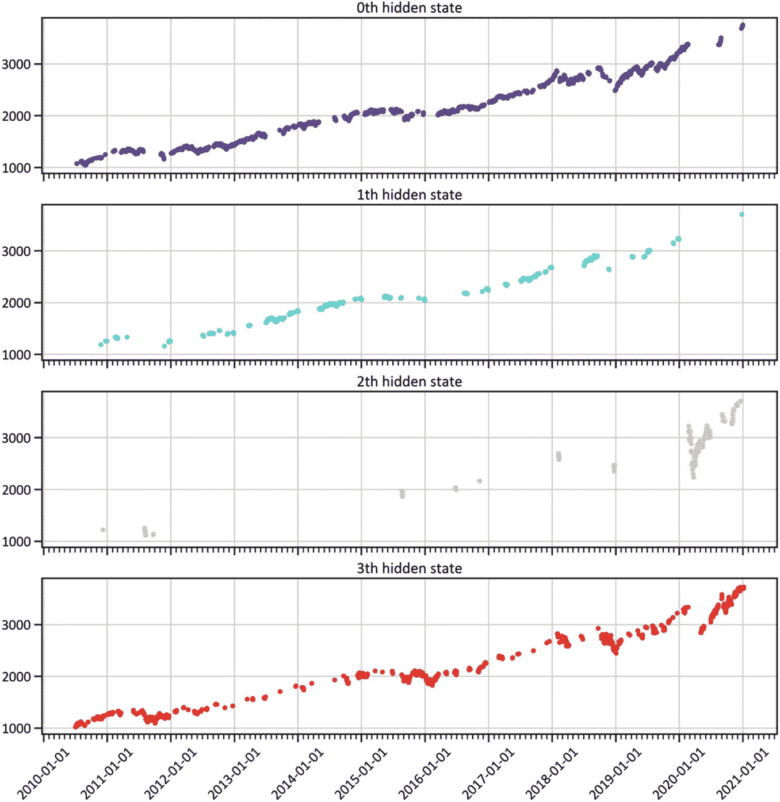
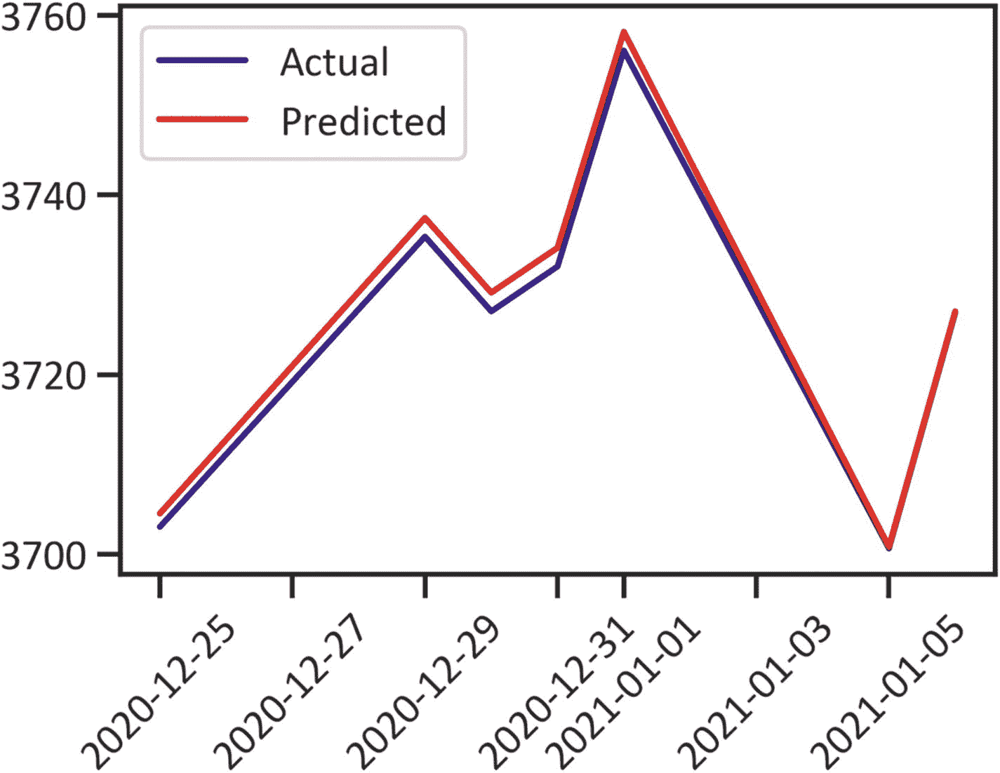
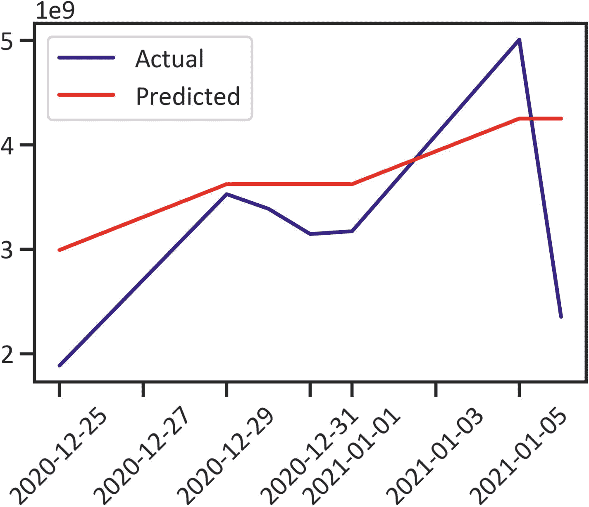

# 4.发现市场机制

这一章介绍了一个广泛的生成概率模型，称为*隐马尔可夫模型* (HMM)。它涵盖了使用 HMM 识别时间序列数据中的隐藏模式并生成观察序列的有效技术。阅读完本章后，你将能够设计和开发一个带有高斯过程的隐马尔可夫模型来发现市场机制。要在 Python 环境中安装`hmmlearn`，使用`pip install hmmlearn`，在 conda 环境中，使用`conda install -c conda-forge hmmlearn`。

## 嗯（表示踌躇等）

在前一章中，我们使用了扩展的 Dickey-Fuller 检验(单位根检验)来检验和确定一个数列是否是平稳的。当平均值不随时间变化时，序列是平稳的。在那一章中，我们发现级数不是平稳的。在这一章中，我们使用隐马尔可夫模型。我们可以将这个模型用于平稳或非平稳序列。它是一个生成的、无监督的学习模型；它不需要标签，我们对非结构化数据使用它。我们称之为*生成型*,因为它在顺序数据中发现模式后生成数据。随着本章的深入，你会学到更多关于 HMM 的知识。

### HMM 在金融中的应用

我们经常使用 HMM 进行语音分析、天气预报等。在这一章中，我们将应用 HMM 来揭示标准普尔 500 指数股票价格中隐藏的模式。我们将利用这个模型来检测市场机制(市场波动性低或高的时期)和未来机制。

## 发展高斯模型

我们在本章中应用高斯混合模型有两个主要原因。首先，我们感兴趣的是给定一类代表两种情况的序列的可能性:一种情况是市场正在上涨并预计会合理上涨(称为*看涨*趋势)，另一种情况是市场正在下跌并预计会下跌(称为*看跌*趋势)。第二，我们假设观测值是已知方差和均值的高斯分布。这被称为*高斯混合*，因为共享分布被限制为高斯分布。更一般地，我们将基于观察到的类别一致地预测趋势的未来类别。在训练过程中，模型学习单一高斯状态输出分布。此后，具有最高方差的分布被分段，并且该过程迭代直到交叉点。清单 [4-1](#PC1) 显示标准普尔(S & P) 500 指数、 <sup>[1](#Fn1)</sup> 的价格数据，这是一个股票市场指数，作为在美国证券交易所上市的 500 家全球公司的基准。表 [4-1](#Tab1) 显示了 2010 年 11 月 1 日至 2020 年 11 月 2 日的价格数据。

```py
from pandas_datareader import data
from datetime import datetime
ticker = "^GSPC"
start_date = datetime.date(2010, 11, 1)
end_date = datetime.date(2020, 11, 1)
df = data.DataReader(ticker, 'yahoo', start_date, end_date)
df.head()

Listing 4-1Scraped Data

```

表 4-1

资料组

<colgroup><col class="tcol1 align-left"> <col class="tcol2 align-left"> <col class="tcol3 align-left"> <col class="tcol4 align-left"> <col class="tcol5 align-left"> <col class="tcol6 align-left"> <col class="tcol7 align-left"></colgroup> 
| 

**日期**

 | 

高的

 | 

低的

 | 

打开

 | 

关闭

 | 

卷

 | 

接近的

 |
| --- | --- | --- | --- | --- | --- | --- |
| **2010-11-01** | 1195.810059 | 1177.650024 | 1185.709961 | 1184.380005 | Four billion one hundred and twenty-nine million one hundred and eighty thousand | 1184.380005 |
| **2010-11-02** | 1195.880005 | 1187.859985 | 1187.859985 | 1193.569946 | Three billion eight hundred and sixty-six million two hundred thousand | 1193.569946 |
| **2010-11-03** | 1198.300049 | 1183.560059 | 1193.790039 | 1197.959961 | Four billion six hundred and sixty-five million four hundred and eighty thousand | 1197.959961 |
| **2010-11-04** | 1221.250000 | 1198.339966 | 1198.339966 | 1221.060059 | Five billion six hundred and ninety-five million four hundred and seventy thousand | 1221.060059 |
| **2010-11-05** | 1227.079956 | 1220.290039 | 1221.199951 | 1225.849976 | Five billion six hundred and thirty-seven million four hundred and sixty thousand | 1225.849976 |

清单 [4-2](#PC2) 应用`describe()`函数获得关于标准普尔 500 指数的基本统计结果(见表 [4-2](#Tab2) )。

表 4-2

描述统计学

<colgroup><col class="tcol1 align-left"> <col class="tcol2 align-left"> <col class="tcol3 align-left"> <col class="tcol4 align-left"> <col class="tcol5 align-left"> <col class="tcol6 align-left"> <col class="tcol7 align-left"></colgroup> 
|   | 

高的

 | 

低的

 | 

打开

 | 

关闭

 | 

卷

 | 

接近的

 |
| --- | --- | --- | --- | --- | --- | --- |
| **计数** | 2518.000000 | 2518.000000 | 2518.000000 | 2518.000000 | 2.518000e+03 | 2518.000000 |
| **表示** | 2140.962839 | 2118.590950 | 2130.285829 | 2130.652759 | 3.737823e+09 | 2130.652759 |
| **标准** | 620.951490 | 614.925344 | 618.284893 | 617.991582 | 8.780746e+08 | 617.991582 |
| **分钟** | 1125.119995 | 1074.770020 | 1097.420044 | 1099.229980 | 1.025000e+09 | 1099.229980 |
| **25%** | 1597.827454 | 1583.157501 | 1592.527527 | 1593.429993 | 3.242805e+09 | 1593.429993 |
| **50%** | 2085.185059 | 2066.575073 | 2077.265015 | 2078.175049 | 3.593470e+09 | 2078.175049 |
| **75%** | 2689.744934 | 2656.970032 | 2677.815063 | 2673.570068 | 4.056060e+09 | 2673.570068 |
| **最大** | 3588.110107 | 3535.229980 | 3564.739990 | 3580.840088 | 9.044690e+09 | 3580.840088 |

```py
df.describe()

Listing 4-2Descriptive Statistics

```

表 [4-2](#Tab2) 让我们了解价格和交易量的集中趋势和分散情况。突出显示调整后收盘价的均值为 2130.652759，标准差为 617.991582。相对于成交量，最大成交量为 9.044690e+09，最小成交量为 1.025000e+09。平均低价为 2118.590950，平均高价为 2140.962839。在执行描述性分析之后，我们开始数据预处理过程。列表 [4-3](#PC3) 去掉了不相关的变量。

```py
df.reset_index(inplace=True,drop=False)
df.drop(['Open','High','Low','Adj Close'],axis=1,inplace=True)
df['Date'] = df['Date'].apply(datetime.datetime.toordinal)
df = list(df.itertuples(index=False, name=None))

Listing 4-3Initial Data Preprocessing

```

清单 [4-4](#PC4) 分配数组。

```py
dates = np.array([q[0] for q in df], dtype=int)
end_val = np.array([q[1] for q in df])
volume = np.array([q[2] for q in df])[1:]

Listing 4-4Final Data Preprocessing

```

清单 [4-5](#PC5) 显示了“不同的”时间序列数据(没有时间相关性的序列)。

```py
from matplotlib.dates import YearLocators
diff = np.diff(end_val)
dates = dates[1:]
end_val = end_val[1:]
X = np.column_stack([diff, volume])
fig, ax = plt.subplots()
plt.gca().xaxis.set_major_locator(YearLocator())
plt.plot_date(dates,end_val,"-",color="navy")
plt.xticks(rotation=45)
plt.xlabel("Date")
plt.ylabel("Adj Close")
plt.show()

Listing 4-5Time Series

```

图 [4-1](#Fig1) 显示，在严重的危机之后，历史上最长的牛市开始出现，这不可避免地伴随着 2020 年初的小幅回调。后来，价格大幅上涨。市场在 10 月份触及 3400 点，并开始反弹。


图 4-1

时间序列

## 高斯隐马尔可夫

高斯隐马尔可夫模型(GaussianHMM)假设概率分布的基础结构是正态的。当处理来自正态分布的连续变量时，我们使用 GaussianHMM。在前一章中，我们发现时间序列数据在不同的时滞上具有序列相关性。GaussianHMM 更适合手头的问题。HMM 代表了一种用于解开序列问题的无监督学习模型。在无监督学习中，我们不会对模型隐藏任何数据；我们将模型暴露给所有的数据。它不需要我们将数据分成训练和测试数据。既然我们认识到了时间序列数据的模式，我们就可以继续并完成这个模型了。清单 [4-6](#PC6) 应用`fit()`方法来完成高斯隐马尔可夫模型(具有产生高斯发射的光谱混合内核)。它指定组件数为 5，迭代次数为 10，总数为 0.0001。

```py
model = GaussianHMM(n_components=5, covariance_type="diag", n_iter=1000)
model.fit(X)

Listing 4-6Finalize the GaussianHMM

```

清单 [4-7](#PC7) 预测内部隐藏状态的顺序。此后，它将序列列表并显示前五个预测隐藏状态(见表 [4-3](#Tab3) )。

表 4-3

隐藏状态

<colgroup><col class="tcol1 align-left"> <col class="tcol2 align-left"></colgroup> 
|   | 

隐藏状态

 |
| --- | --- |
| **0** | one |
| **1** | one |
| **2** | one |
| **3** | one |
| **4** | one |
| **...** | ... |
| **2512** | one |
| **2513** | one |
| **2514** | three |
| **2515** | one |
| **2516** | one |

```py
hidden_states = model.predict(X)
pd.DataFrame(hidden_states,columns=["hidden_state"])

Listing 4-7Hidden States

```

表 [4-3](#Tab3) 突出显示了最合适的隐藏状态序列的参数。它没有提供足够的信息来推断 GaussianHMM 如何对时间序列数据进行建模。清单 [4-8](#PC8) 绘制了高斯-安海姆模型产生的 S & P 500 时序数据的内部隐藏状态序列(见图 [4-2](#Fig2) )。


图 4-2

HMM 结果

```py
num_sample = 3000
sample, _ = model.sample(num_sample)
plt.plot(np.arange(num_sample), sample[:,0],color="navy")
plt.xlabel("Samples")
plt.ylabel("States")
plt.xticks(rotation=45)
plt.show()

Listing 4-8HMM Results

```

图 [4-2](#Fig2) 显示了样本数据。最多，在美国有稳定。在第 500 次<sup>的</sup>观察之后，出现了轻微的峰值。样本之后最显著的峰值是 1，200。

## 均值和方差

均值给了我们很多关于数据点集中趋势的信息，方差则显示了数据点远离均值的分散程度。我们使用平均值和方差来总结高斯-安海姆模型产生的隐藏状态的最优序列。清单 [4-9](#PC9) 估算每个内部隐藏状态的均值和方差。

```py
for i in range(model.n_components):
    print("{0} order hidden state".format(i))
    print("mean = ", model.means_[i])
    print("var = ", np.diag(model.covars_[i]))
    print()
0 order hidden state
mean =  [-8.29728342e-01  4.41641901e+09]
var =  [8.50560173e+02 4.47992619e+17]

1 order hidden state
mean =  [2.22719353e+00 3.22150428e+09]
var =  [1.33720438e+02 6.16375025e+16]

2 order hidden state
mean =  [2.04319405e+00 3.73786775e+09]
var =  [1.79332780e+02 9.03360887e+16]

3 order hidden state
mean =  [9.56404042e-01 2.50937758e+09]
var =  [8.46343104e+01 3.11987532e+17]

4 order hidden state
mean =  [-1.12364778e+01  6.07623360e+09]
var =  [8.06282637e+03 1.77082805e+18]

Listing 4-9Hidden States

```

列表 [4-10](#PC10) 描绘了每个内部隐藏状态的顺序(见图 [4-3](#Fig3) )。



图 4-3

隐藏状态的单个序列

```py
fig, axs = plt.subplots(model.n_components, sharex=True, sharey=True, figsize=(15,15))
colours = cm.rainbow(np.linspace(0, 1, model.n_components))
for i, (ax, colour) in enumerate(zip(axs, colours)):
    mask = hidden_states == i
    ax.plot_date(dates[mask], end_val[mask], ".", c=colour)
    ax.set_title("{0}th hidden state".format(i))
    ax.set_xlabel("Date")
    ax.set_ylabel("Adj Close")
    ax.xaxis.set_major_locator(YearLocator())
    ax.xaxis.set_minor_locator(MonthLocator())
    ax.grid(True)
plt.show()

Listing 4-10Individual Sequence of Hidden States

```

图 [4-3](#Fig3) 显示了上升趋势中的波动性。2020 年大部分发生在第三个隐州。

### 预期收益和数量

清单 [4-11](#PC11) 列出了 GaussianHMM 估计的预期收益和数量(见表 [4-4](#Tab4) )。

表 4-4

预期收益和数量

<colgroup><col class="tcol1 align-left"> <col class="tcol2 align-left"> <col class="tcol3 align-left"></colgroup> 
|   | 

返回

 | 

卷

 |
| --- | --- | --- |
| **0** | 1.789235 | 3.752679e+09 |
| **1** | -0.433996 | 4.258633e+09 |
| **2** | 2.013629 | 3.288045e+09 |
| **3** | -9.934745 | 5.868430e+09 |
| **4** | 1.139917 | 2.752306e+09 |

```py
expected_returns_and_volumes = np.dot(model.transmat_, model.means_)
returns_and_volume_columnwise = list(zip(*expected_returns_and_volumes))
expected_returns = returns_and_volume_columnwise[0]
expected_volumes = returns_and_volume_columnwise[1]
params = pd.concat([pd.Series(expected_returns), pd.Series(expected_volumes)], axis=1)
params.columns= ['Returns', 'Volume']
pd.DataFrame(params)

Listing 4-11Expected Returns and Volumes

```

清单 [4-12](#PC12) 为未来回报和交易量创建了一个数据框架，它绘制了调整后收盘价的实际值和高斯混合模型预测的值(见图 [4-4](#Fig4) )。



图 4-4

实际价格和预测价格

```py
lastN = 7
start_date = datetime.date.today() - datetime.timedelta(days=lastN*2)
dates = np.array([q[0] for q in df], dtype=int)
predicted_prices = []
predicted_dates = []
predicted_volumes = []
actual_volumes = []
for idx in range(lastN):
    state = hidden_states[-lastN+idx]
    current_price = df[-lastN+idx][1]
    volume = df[-lastN+idx][2]
    actual_volumes.append(volume)
    current_date = datetime.date.fromordinal(dates[-lastN+idx])
    predicted_date = current_date + datetime.timedelta(days=1)
    predicted_dates.append(predicted_date)
    predicted_prices.append(current_price + expected_returns[state])
    predicted_volumes.append(np.round(expected_volumes[state]))
fig, ax = plt.subplots()
plt.plot(predicted_dates,end_val[-lastN:],color="navy",label="Actual Price")
plt.plot(predicted_dates,predicted_prices,color="red",label="Predicted Price")
plt.legend(loc="best")
plt.xticks(rotation=45)
plt.xlabel("Date")
plt.ylabel("Adj Close")
plt.show()

Listing 4-12Actual Price and Predicted Price

```

图 [4-4](#Fig4) 显示了性能良好的 GaussianHMM 模型的显著特征。调整后收盘价的实际值与预测值之间的差异很小。清单 [4-13](#PC13) 绘出了实际量和预测量(见图 [4-5](#Fig5) )。



图 4-5

实际量和预测量

```py
fig, ax = plt.subplots()
plt.plot(predicted_dates,actual_volumes,color="navy",label="Actual Volume")
plt.plot(predicted_dates,predicted_volumes,color="red",label="Predicted Volume")
plt.legend(loc="best")
plt.xticks(rotation=45)
plt.xlabel("Date")
plt.ylabel("Volume")
plt.show()

Listing 4-13Actual Volume and Predicted Volume

```

GaussianHMM 在时间序列数据建模方面做得很好；然而，实际体积值和模型预测值之间的差异很小。

## 结论

本章介绍了隐马尔可夫模型。它巧妙地涵盖了设计和开发 HMM 的实用方法，该 HMM 具有产生高斯辐射的谱核，以应对复杂的序列问题。我们严格地将该模型应用于标准普尔 500 指数的时间序列数据，以估计内部隐藏状态的最佳序列。在仔细检查了模型的性能后，我们注意到该模型在识别标准普尔 500 指数的价格和交易量中的隐藏模式方面很有技巧。

<aside aria-label="Footnotes" class="FootnoteSection" epub:type="footnotes">Footnotes [1](#Fn1_source)

[T2`https://finance.yahoo.com/quote/%5EGSPC/`](https://finance.yahoo.com/quote/%255EGSPC/)

 </aside>