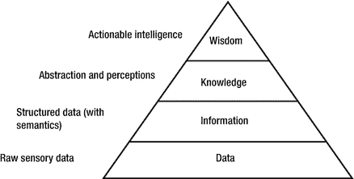

# 2.机器学习的实用概念

这是一个重要的章节，因为它讨论了机器学习(ML)的基本和实用概念。我没有采取学术书籍的风格来解释这些概念。我已经将我的思想和精力用于为你提供在实际决策中有用的概念。因此，在解释概念、术语和技术细节时，我使用了有助于从本章中提取相关见解的示例和案例研究。

这一章从机器学习的进化和历史开始，寻找不同思想和哲学流派之间的联系。它将带你穿越过去几十年的进步和发展，进入人工智能的世界。在那之后，它提供了 ML 的未来应用的一瞥。这一章有很大一部分是关于机器学习正在产生的商业机会。这将为您提供对机器学习领域中即将出现或已经存在的商业机会的洞察。同样，对于像这样的工具，相关的例子和案例研究被广泛使用。

应用领域和商业机会之间只有一线之隔。技术的应用领域也可能是机会的领域。例如，机器学习广泛应用于零售业，用于进行不同类型的预测和推荐。与此同时，对于企业来说，通过使用 ML 技术来增强现有的产品和服务，为它们创建新的市场，以及通过基于习惯/行为分析提供适当的建议来吸引客户，存在巨大的商业机会。因此，关于应用领域和商业机会的平行讨论提供了关于该主题的最现代和未来的观点。

我还讨论了机器学习中涉及的一些重要的模型、算法、工具、框架和编程语言。有一节是关于机器学习架构的，它会给你一个关于机器学习的“广义”架构的整体和综合的观点。简而言之，本章为您提供了对正在讨论的技术的全面了解。

## 链接历史、进化、机器学习和人工智能

人工智能领域是基于自动化人类思想及其认知能力的可能性。广义而言，人工智能技术试图模拟和复制人类的思想和行为。这些思想和行为可以进一步分为思考、说话、感觉和推理。设计程序的科学让计算机更聪明，这包括“让计算机做人类更擅长的事情”的目标。

从历史上看，希腊、印度和中国的学者都坚信“思维机器”的概念。他们相信“思考机器”是可能的，并且建造一台是可以实现的。他们的哲学家、心理学家和数学家用他们的思想、发明和发现从事这种方法。然而，他们大多是在自己有限的地理范围内孤立地工作。因为他们没有像我们现在这样“奢侈”地总是联系在一起，一个能被所有人接受的统一思想从未出现。

例如，在 17 世纪，戈特弗里德·莱布尼茨、托马斯·霍布斯和勒内·笛卡尔探索了仅仅用数学符号解释思想的可能性。但是他们的思想并不相互联系，而是孤立存在的。以符号和逻辑步骤的形式解释思想是算法研究的一部分。算法开发是数学的一个分支。算法在人工智能和机器学习的演变中发挥了至关重要的作用。因此，如果不考虑算法，就不可能讨论人工智能和机器学习的历史、演变和发展。

将复杂问题的事实和数字表示、解释和分解成符号和理性/逻辑步骤是算法的中心主题。算法由于其解释问题的简单性和有效性而成为解决问题的主要工具。算法的发展和使用可以与巴比伦人联系起来，他们因在公元前 1600 年发明了第一个因式分解和平方根(可以通过逻辑步骤实现)而获得荣誉。然而，欧几里得在公元前 300 年发现最大公约数和阿耶波多发现 0 是人类历史上算法发展和影响的一些最早的例子。

1843 年，阿达·洛芙莱斯推导出第一个打算由机器执行的算法，这将被视为算法发展的基准。Ada 的工作奠定了基础，但她从未谈论或写过任何接近人工智能的东西。形式上，人工智能随着艾伦·图灵题为“计算机械和智能”的论文而诞生。这篇有趣的研究论文发表于 1950 年。在论文中，图灵发明、解释并从理论上试图建立机器是否可以思考的想法。该文件解释和传达了一些非常重要的概念，但有局限性。不利的一面是，这篇论文不是很通用，大部分局限于概念界限。

图灵论文借助基于游戏的假设解释了人工智能的概念。涉及三个玩家的游戏。玩家 A 是电脑，玩家 B 是人。每个人都必须向玩家 C(一个既看不到玩家 A 也看不到玩家 B 的人类)证明他们是人类还是计算机。如果玩家 C 不能在一致的基础上确定谁是人，谁不是人，计算机就赢了。我们可能同意或不同意这个假设，但它肯定奠定了人工智能的基础。

人工智能这个术语是在 1955 年由约翰·麦卡锡首次提出的。他思考并解释为“智能机器的科学与工程学科”。他还强调了计算机“没有被明确编程”的知识工作能力。他的思想在当时是开创性的。当他试图解释人工智能时，他解释了“显式编程”的概念。

人工智能是难以置信的复杂，因为它的多学科性质和解决人类一些最大问题的期望。最初，在 20 世纪 50 年代和 60 年代人工智能的诞生和发展过程中，有很多乐观的看法。在最初的日子里，人们相信，通过利用人工智能的潜力和力量，世界将在短短 20 年内制造出智能机器。

如前所述，人工智能包括许多其他学科，并受其影响。这方面的一个例子是浅层和深层学习的概念，它最初来自心理学。这种影响背后的主要原因是 AI 本身的目标。主要是，它被认为、记录、解释和想象为一台具有处理“思维过程模拟”能力的机器。因此，人们期望人工智能系统能够模仿人类的身体和认知行为。同样，人类的思维过程受到多种因素的影响，包括社会学、心理学和生物学方面。因此，很自然地，人工智能将通过在其保护伞下考虑人类努力的多个领域来发展。

在过去的几十年里，机器学习已经发展成为一门独立的科学。如果追溯历史，我们可以在计算机科学和统计学中找到机器学习的基因。早期，ML 从计算机辅助教学系统中获得灵感。多年来，ML 反过来鼓励这一领域的发展，生产基于人工智能技术的智能教学系统。然而，机器学习实际上起源于模式识别和神经网络。这些都是人工智能的子领域。这一理论支持的概念是，计算机可以在没有被编程来执行特定任务集的情况下学习，这是机器学习发展背后的主要动机。

这几天看待和对待机器学习的方法，已经和它最初的形态不一样了。在早期，ML 被视为计算、处理和存储的巨大努力，而现在它被视为一种数据驱动的技术。这种思维模式的改变迫使企业和研究人员进行实验，并从数据(或大数据)中验证计算机的学习能力。在这里，机器学习的迭代方面变得很重要，因为随着模型暴露于新的数据集，它们能够独立地适应来自数据湖的模式(见侧栏“行话克星”)。他们从以前的计算或迭代中学习，以产生可靠、高效、有效的决策、结果和行动。

Jargon Buster

*   机器智能:机器学习、深度学习、认知分析、机器人过程自动化(RPA)和机器人等人工智能相关能力统称为机器智能。可以提高员工绩效、自动化日益复杂的工作负载以及开发模拟人类思维和参与的“认知代理”(用于基于机器学习的智能个人助理的术语)的算法能力属于机器智能的范畴。
*   机器人流程自动化(RPA):这是一种软件机器人，通常也被称为“机器人”。它们通过模仿人们与软件应用程序交互的方式来完成单调的业务流程。
*   数据湖:一个巨大但易于访问的集中式数据源，包含大量结构化、半结构化和非结构化数据。一个典型的数据湖被认为是一个能够存储大数据方面的一切的数据存储。数据湖主要是大数据的“存储”，并不对存储的数据进行任何重要的分类或隔离。因此，与数据仓库相比，数据湖的结构化程度较低。数据湖是多个智能系统的数据源。一旦他们有了经过处理、分析和优化的数据，他们就可以将这些数据用于不同的目的。任何类型的分析或机器学习活动通常都是在数据湖的“评估”数据上执行的。
*   数据岛:驻留在 PDA(个人数字助理)或其他计算设备上的数据存储，这些设备不存在外部连接或外部连接有限。因此，它限制了用户与其他设备同步或将数据复制到其他设备的能力。因此，当新数据被添加到系统中时，将“新添加的数据”移动到其他地方的能力变得困难或不可能。从数据库的角度来看，数据岛就像一组相关的表。例如，一个数据库有 15 个表，其中 10 个与一个名为 group1 的组相关，5 个与 group2 相关。存在一个条件，要求 group1 和 group2 不相互链接。在这种情况下，可以说您的数据库或模型有两个数据岛——group 1 和 group 2——并且它们独立工作。

参考资料:

*   [T2`http://labs.sogeti.com/wp-content/uploads/2015/01/machineintell-en.pdf`](http://labs.sogeti.com/wp-content/uploads/2015/01/machineintell-en.pdf)
*   [T2`https://www2.deloitte.com/content/dam/Deloitte/global/Documents/Technology/gx-tech-trends-the-kinetic-enterprise.pdf`](https://www2.deloitte.com/content/dam/Deloitte/global/Documents/Technology/gx-tech-trends-the-kinetic-enterprise.pdf)

IBM 的 Arthur Samuel 是第一个使用“机器学习”这个术语的人，当时他正在开发第一个自我学习的计算机程序，名为 game checker。在塞缪尔的工作之前，没有人正式提出计算机可以自我编程的想法。一般的想法和假设是，要让计算机执行任何任务，都需要“预编程”，如果没有明确的编程，计算机将无法执行任何任务。

机器学习更正式的定义是在 90 年代末由 Tom Mitchell (1998)提出的。他说“如果一个计算机程序在任务 T 中的性能，如 P 所测量的，随着经验 E 的增加而提高，那么就可以说它在某类任务 T 和性能测量 P 方面从经验 E 中学习”。简而言之，他的意思是，当计算机程序对数据集进行操作时，如果它能够随着时间的推移(以迭代的方式)越来越准确地预测确定的结果，那么就可以说它是自我学习的。

## 机器学习、人工智能、大脑和智能商业

根据约翰·冯·诺依曼(计算机科学的先驱科学家，他推导出了计算机的第一个正式结构)，神经元可以从基于其输入的“模式”中学习。神经科学家现在称之为神经递质浓度。然而，冯·诺依曼并不知道神经学习是如何工作的。这是神经科学的一项最新进展，它告诉我们，学习是通过大脑中可用神经元之间的连接的生成/创建和破坏来进行的。

Jargon Buster

*   神经元:人脑包含大约 1000 亿个神经细胞，也称为神经元。神经元拥有收集和传递电化学信号的惊人技能。计算机中的门和电线可以被认为是神经元。神经元与其他细胞具有相同的特征和相似的构成。然而，内置的电化学特性使它们能够长距离传输信号。它们有惊人的能力互相连接，互相发送信息。

冯·诺依曼指出，神经处理的速度非常慢，大约每秒 100 次计算，但大脑通过大规模并行处理来补偿这一点。神经元以“并行”计算的方式连接、创建新的路径和回路。同样，现代计算机为执行/学习任务执行并行处理。如前所述，类脑人工智能并不是一个新想法。能够模仿大脑基本结构的神经网络概念在 20 世纪 80 年代的科学界非常流行。但在那段时间里，人工智能领域缺乏计算能力和海量高质量训练数据的可用性。由算法驱动的模型要真正有效，计算能力和数据都是必不可少的。

计算机硬件的最新进展有助于降低处理能力的成本(就速度和内存而言)。因此，科学界和工业界的一部分正在努力通过计算机实现人类的智能。这一努力的结果是从实验室里出来的多个机器人和巨大的机器。实现“人类智能”的目标之一是获得超越竞争对手的商业和商业优势。IBM Watson 就是一个例子。科学界和工业界(主要是商业界，包括初创企业)正试图通过几种“快速”产品和服务来利用最近的技术进步。他们通过利用现有的平台、服务和框架，推出了聊天机器人(自动用户查询回复机器/软件)类型的产品/服务。像深度学习和自然语言处理这样的技术支持这些平台。

一批新的企业家正在使用“我第一”的方法接触“有目标和有重点”的客户。这意味着他们将自己描绘成突破性机器学习产品、应用和服务的真正创新者和提供商。它们“第一次”出现在市场上，并有可能破坏市场/行业动态。为了证明他们的观点，他们快速创建原型，并以敏捷的方式将它们转化为产品。他们避免了从零开始进行大量的研究。

然而，两者现在都在“数据”上下赌注，这些领域的大部分成就都是由数据本身引导的。

机器学习的实际学习能力是通过学习算法实现的，这些算法代表了人脑中的神经网络(因为最终它试图模拟大脑的行为)。机器学习算法的基本“意图”也是寻找与大脑相似的模式。人工神经网络的模拟模型帮助系统收集和处理关于给定数据集的信息。然后，凭借其自我学习能力，它可以推断数据来预测未来的事件和发生。整个过程的最终结果是由机器和人类共同做出的逻辑决策。

人类通过不断尝试和不断逼近的过程来学习和理解。人类构建一个关于特定任务的理论，并基于第一次尝试或近似的结果，相应地调整他们的理论。这个过程反复进行，直到获得最佳结果。机器学习算法以类似的方式工作。随着机器学习系统收集和处理越来越多的数据，他们的结果越来越好。这是因为它为他们提供了细化输出的能力，并帮助他们以更高的精度预测现有变量之间的关系。

## 机器学习的一般架构

图 [2-1](#Fig1) 呈现了机器学习系统的一般架构。通常，它有六个部分。但是，它可以根据项目的需要、要创建的系统和需求进行定制。

图 2-1。

Block diagrams for general technical architecture of machine learning

该列表包括每个部件的描述:

*   数据获取(收集和搜集数据集):为了创建任何机器学习系统，你需要做两件重要的事情——数据和模型。当获取/收集数据时，你必须确保有足够的高质量数据。一般来说，数据越多，做出准确预测的可能性就越大。因此，你必须对你的数据源非常有选择性。
*   数据准备(连接、过滤、清洗数据集):一旦你有了机器学习系统可用的数据，你就必须准备它。通过以一种它想要的或调整过的格式提供数据，您使您的 ML 系统能够做进一步的处理。学习系统以一种特定的格式获取数据，而不是以一种粗糙的、临时的格式。此外，需要对数据集进行多种转换操作，包括过滤、操作、采样和缩放。一旦成功执行了这些步骤，数据就被简化(转换)成所需的格式。例如，在准备数据集时，您必须删除缺少的值，以特定格式编辑列，并拆分数据集以进行训练和验证。这使您能够向选定的培训模型提供数据。
*   训练模型(使用机器学习来概括):当你在为你的工作创建一个准确的机器学习模型的过程中，你必须发现的一件事是什么类型的分析将帮助你实现你的目标。相应地，你必须训练你的模型。它可能是分类分析(典型的例子是在系统中查找垃圾邮件与非垃圾邮件)，聚类分析(是否需要自动分类？)，或者一个回归分析(我的模型是要做预测预报吗？).一旦这样做了，你必须比较多个可用模型的结果。本练习使您能够知道哪个模型对您的数据集最有效。

让我们以一种更系统的方式来说:

*   评估/测试模型(模拟和交叉验证):评估机器学习模型的性能是非常重要的阶段之一。它让您了解一个训练有素的模型对数据集的预测有多成功。此外，还建立了评估和交叉验证，并使用标准方法来衡量所考虑模型的性能。两者都为你提供了一个评价指标，让你评价和判断其他模式的偏好，以便你做出最佳选择。
*   部署(跑中得分；跟踪概念漂移):假设前面的步骤成功完成，并且您对模型的结果(基本上是值)感到满意，这是一个强有力的指标，表明您的评估是成功的，您的模型已准备好进行下一步。因为您在评估期间尝试了多个模型，所以您必须清理一切，并确保现在只剩下一个具有最佳性能的模型。立即发布/部署您的模型(在 Azure ML 中，您必须定义一个输入和输出，然后将其作为 web 服务运行和发布)。
*   诊断问题并优化系统:在(通常的)情况下，如果系统第一次没有达到成功的标准，您就诊断问题并优化系统。如果当时不采取纠正措施，这将导致预测准确性降低。可视化是识别和展示数据、模型或算法问题的强大工具。然而，也可以通过使用从模型中采样的合成数据来诊断问题。

Note

提炼系统意味着净化数据、模型、可视化、推理或评估。这是正在进行的活动，以完善模型。必须重复诊断问题和细化活动，直到系统在预期应用程序所需的水平上运行。基于模型的机器学习可以使这种重复的改进过程更快。细化建议需要立即应用到模型中。这允许快速探索许多模型。

### 机器学习:你和你的数据

机器学习是一门古老的科学，但由于来自不同来源的大量数据快速生成，它正在获得新的动力。各种各样的形式是该行业的头条新闻。虽然许多机器学习算法已经存在了很长时间，并继承了统计学的遗产，但在复杂分析的帮助下，越来越快地将复杂的数学计算和逻辑自动应用于大数据的能力是最近才发展起来的。

### 机器学习相关技术

本节介绍一些常见的机器学习和相关技术及其关系。它将帮助读者抓住一些重要的概念。

*   数据科学:在更广泛的层面上，数据科学可以被视为数学科学、统计学和编程的综合学科。然而，它不能仅限于这些领域的研究，并扩展到人工智能，统计行为科学，数据库技术，心理学，社会学，认知和神经科学。
*   数据分析:一项调查活动。在数据分析中，在扫描了可用的数据集之后，分析师获得了隐藏在数据集中的洞察力。
*   数据分析:当我们对可用的数据集应用数学、统计学和算法，以发现它们之间的洞察力和有意义的相关性时，这个过程被称为数据分析。分析是分析的结果。而分析是可以用来分析数据的方法或方法组。
*   预测分析:概念化和生成一个量化模型，允许根据大量的历史数据/信息来预测结果或结果，这可能是一项复杂的技术密集型任务。因为输入数据包含许多变量，需要同时考虑所有变量。在这些变量中，有些是非常相关的，而另一些在决定结果时可能不那么重要。预测模型决定了可以从数据中提取哪些见解，并用于在给定场景中做出准确和相关的预测。一个好的模型允许并乐于接受变化，因此它可以适应变量的变化。有时，为了增加可预测性，需要进行更改。正确的改变可能会增加期望结果的机会。
*   数据挖掘:用于在可用数据集中发现模式。这个术语在 20 世纪 90 年代末和 21 世纪初开始流行，当时组织意识到了整合数据及其用途的力量。通过使用这种技术，来自不同来源的数据被汇集在一起，以发现以前未知的趋势、异常和相关性。数据挖掘允许在没有任何精确概念的情况下搜索大量数据。它通过使用蛮力分析和神经网络等技术来帮助识别可用数据集中的相关性。

Note

数据挖掘可以被认为是从可用数据中提取洞察力的许多不同方法和技术的超集。该技术可能涉及传统的统计方法或技术，或者像机器学习这样的高级概念。数据挖掘领域的一些技术包括统计算法、机器学习、文本分析、时间序列分析和其他分析领域。数据挖掘还包括数据存储和数据操作的研究和实践。

*   深度学习:技术和算法正被用于识别图像中的特定对象，并进行自然语言处理。借助计算资源、大量数据和特殊类型的神经网络的组合能力，深度学习可以识别大型数据集中的复杂模式。研究人员、机构和企业现在正在寻求将深度学习算法的模式识别能力应用于更复杂的任务。例如，它被应用于自动语言翻译、医学分析以及其他重要的社会和商业问题领域。
*   浅层学习:浅层和深层学习的概念最初来自心理学。广义而言，浅薄的学习是指“不知道更深层次的概念”而对学科的肤浅理解。例如，你死记硬背你的阅读材料，而没有试图去思考和理解其潜在的意义或含义。而深度学习是关于探索主题/更详细地阅读。它涉及到你理解基本原则的愿望。还有，是关于你提出自己论点的能力。因此，简而言之，浅层学习是关于记忆事实，而深度学习是关于制定逻辑和深层论点。

人工智能领域将深度学习算法与神经网络相关联，神经网络包含两层或多层神经元。它主要用于模式识别相关的任务。但是，它们也用于图像、视频和语音识别活动。广义来说，没有被归类为深度学习的机器学习算法被称为浅层机器学习算法。对于涉及大量训练数据和更强计算能力的任务，深度机器学习算法是一个很好的选择。还有，对于没有明确特征的数据集，深度学习永远是更好的选择。因此在图像和语音识别等领域得到了广泛的应用。如果数据已经具有强大的特征，浅层机器学习算法是一个很好的选择，因为它们被证明在计算节省方面是有效和高效的。

机器学习是从人工智能中诞生的，所以他们的关系非常亲密。在更广泛的层面上，深度学习、模式识别和浅层学习都是相关的。机器学习是一组或一组算法和一套技术，用于设计一个反应灵敏的自动化系统，该系统可以从填充其相关技术的数据中学习。最大似然算法通常有很强的数学和统计基础。这些与领域知识和数据预处理没有紧密结合。数学是这个核心的一部分。因此，它也可以定义为计算机科学的一个领域，使用统计方法创建程序，随着时间的推移提高其性能，在大量数据中检测人类不太可能手动找到的模式。像人工智能一样，机器学习试图用参数的自动检测来取代显式编程。然而，机器学习对包含离散样本的非聚合数据起作用，离散样本包括正面和负面情况。例如，如果有人想要在财务数据集中发现/检测欺诈，他们需要显示特定于欺诈的有效交易示例的个人交易记录。

### 对机器学习的需求

我们大多数人有时认为这个世界是混乱无序的，因为不确定性导致了很多问题。然而，有些人将这个“问题”视为商机。他们开始寻找解决方案，将这种“不确定性或不可预测性”转化为基于数据和技术使用的可预测性。他们开始围绕预测为新企业提供解决方案。老牌企业磨练自己的技能，推出突破性的产品和服务，或者从供应商那里租用/购买这些产品和服务，以维持和加速市场发展。

IBM Watson、微软认知服务和许多其他产品创造了一系列新的产品。网飞采用机器学习技术来预测客户行为并为他们提供“个性化”服务，最终提高了他们的收入和客户满意度，这样的成功故事为企业和客户带来了新的见解。此外，它还展示了基于推荐的服务、应用和产品的潜力。我们可以看到软件/应用/机器在预测狭义的客户行为和广义的人类行为，这在历史上是以不可预测性著称的。

挖掘、编辑和使用足够的数据，并彻底评估所有相关变量，可能无法对即将发生的事件做出准确的预测。但是他们肯定会带你接近那个目标。机器学习为我们提供了可以测量许多变量的算法。比如一个群体或者个人在特定的气候条件下表现如何？当一个超级明星球员被开除出队时，某个运动队会得多少分？在一定的给定条件下，团队的最佳团队构成是什么？

在数学(更准确地说是统计学)的帮助下，受过训练的人可以洗牌并玩弄数学变量，以获得想要的结果或结果。但是他们不可能一次处理成千上万的变量。因为从神经学上来说，人类的大脑在处理如此多的信息方面很弱。这一点事实上已经被神经科学和神经可塑性的大量研究所证明。但是在有效和高效算法的帮助下，机器可以非常容易地做到这一点。因此，需要一种机制来帮助人类跨越无法处理多个变量的限制....欢迎来到机器学习的奇妙世界——它将把你从问题中解救出来，并满足你的需求。

“预测”的标准是有效和高效地识别可用质量数据中的模式，并以适当的方式使用可用的适当变量。一旦软件识别出这些模式，它就用它们来预测未来的事件和发生的事情。除此之外，他们还可以更有效地做很多其他事情，比如帮助你做决定，提供行动项目列表。预测、自动决策和行动计划是当前的需要，也是未来的现实。

说到赚钱和利润，“充足”是一个陌生的词。对于商业和企业来说，它们必须始终寻找新的市场，并能够不断推出创新产品。他们必须了解新的市场趋势、新的竞争对手，并根据时代和市场不断变化的需求调整自己的思路。在当前的商业和商业世界中，机器学习已经成为行业和企业的一种“需求”。几乎所有的行业都受到它的影响，大多是积极的影响。因此，在当今的商业和个人世界中，对机器学习的需求更加迫切。

### 机器学习商机

机器学习、大数据分析、云计算和认知计算等技术正在改变全球几乎所有行业的商业模式。做生意的旧方式正在迅速改变。所有垂直和水平市场的企业都在寻找新的方式来运营和创新他们的业务。这为数字和实体企业创造了新的商机和途径。创业正在兴起；创新思维正在围绕新一代技术创造新的商业模式。这种牵引的结果以优化运营、降低成本、改善服务和/或推出新产品的形式展示出来。许多公司使用 ML 来获得财务收益和实现业务完整性:

*   AOL 使用机器学习来提供购物建议。
*   Booz Allen Hamilton 将机器学习(Mahout 的聚类算法)用于其商业目的。
*   Cull.tv 将机器学习用于其内容推荐系统。
*   数据挖掘实验室使用机器学习聚类分类算法来改善他们的客户广告定位。
*   Drupal 正押注于机器学习算法来提供他们的开源内容推荐解决方案和系统。
*   Evolv 正在使用基于机器学习的平台来预测其劳动力相关活动。
*   Foursquare 和 Idealo 使用 Mahout(一种机器学习框架)作为其推荐引擎。
*   谷歌使用机器学习来计算其 AdSense 和其他广告网络的点击概率。
*   机器学习算法和模型用于自动算法交易(AAT)。基于货币市场的公司设定和训练模型，并使用它们在纳秒内进行交易。今天的交易有很大一部分是由计算机完成的，许多大型金融科技企业都参与其中。
*   零售商使用机器学习来优化和推荐他们的库存、营销活动、产品放置、定价和目标。一些例子是沃尔玛、苹果和挂图。
*   像 Rose Pharmaceuticals 这样的制药公司使用机器学习进行数据挖掘相关活动。
*   印度是世界上第三大人工智能创业公司集群的所在地。这些初创公司参与了机器人、识别工具和机器学习支持的虚拟援助的开发(来源:毕马威)。
*   在核心业务流程中实现机器人自动化方面，印度排名第三。金融专业人士准备采用基于机器学习的自动化来节省时间，并在决策过程中获得帮助(来源:毕马威)。
*   像微软、IBM、谷歌和亚马逊这样的公司正在提供“脱离自我”的平台。创业公司正在利用这些平台寻找自己的解决方案。此外，大巨头推出了几个 ML 产品和应用程序，以解决和增强最近的一些行业特定的挑战。

随着机器学习无处不在，几乎所有这些领域都有巨大的商机。新一代机器学习具有多种创新能力，可以作为商业机会的催化剂。除了技术领域，机器学习正在这些功能领域创造新的机会:

*   研究与开发
*   生产和运营
*   销售和营销
*   客户支持
*   财务、人力资源和行政职能
*   农业、医疗保健、公用事业、石油和天然气
*   零售趋势
*   采矿、建筑、耐磨胎面、批发、艺术、娱乐和休闲、房地产
*   教育服务、住宿和餐饮服务、仓储和制造业

除此之外，行业特定的机会也正在产生。随着机器学习的发展，最近出现了一些新的领域，其中一些是基于情感的产品和服务、直觉学习、智能无人机和机器人、聊天机器人等等。今天的消费者想要更直观的应用、产品和服务。由于广泛接触手机和智能手表等个人辅助设备，消费者现在比以往任何时候都更接近应用程序。他们对应用程序和产品的期望是“理解”他们的工作方式和行为。

这实际上打开了一个“可转换”商业机会的新视野。此外，决策者的思维模式也发生了转变，从创造“数据”转向“洞察导向和直观”的产品和服务，这将带来巨大的商业前景。这种思维过程是行业和企业所独有的。然而，这是一个不同的故事，这种“思维过程”是由市场动态和竞争所引导的。基于机器学习的数字化正在推动多种类型的创新。数字世界正以意想不到的速度增长，并创造了许多机会。

现在看一下“智慧”金字塔(或数据层次)是值得的，因为下一节主要关注它的单个组件。金字塔的下层是指由非结构化(包括物联网设备)、半结构化和结构化数据源产生的大量数据(见图 [2-2](#Fig2) )。它们产生的数据以 Pb 计，甚至更多。数据之上的层是“信息”,它从数据中提供过滤的、结构化的和机器可理解的信息。此外，它还作为一个抽象层，总结可用的数据。然而，人类和高级复杂应用需要的是服务，而不是信息。

图 2-2。

The wisdom pyramid

信息层之上的看不见的知识(第三层)能够提供对数据和信息的更好理解。它还以机器可理解的格式呈现信息，机器可以使用这种格式在分析“精炼”的信息后产生洞察力。知识层被进一步细化到一个更高的层次，称为智慧层。它在知识层进行提炼，从隐藏的知识“海洋”中寻找智慧。有了隐藏的知识，机器可以总结出一种叫做智慧的东西，可以用于预测(本质上是预测未来会发生什么)，并提供见解和行动步骤。这种智慧可以用来开发端到端的直观、智能和智能化的产品和服务。这种从杂乱的事实到智慧的数据组织可以用多种方式可视化和思考。例如，如果从技术角度考虑，它们可以按以下方式联系起来:

*   数据层与物联网相关，简单来说，物联网包括结构化、非结构化和半结构化数据或大数据。
*   信息和知识与大数据分析相关联。
*   智慧层与机器学习和认知计算相关联。

对于企业来说，商业和商务机会无处不在，并且与机器学习有关。领导者必须抓住他们。然而，为了利用机器学习生态系统的巨大潜力，企业领导人和决策者必须投资于技术，同时他们必须努力转变他们的组织。因此，心态变得至关重要。有助于创造和利用突破性机会的一些想法是:

*   领导者必须致力于机器、软件、流程和数据的整合方法。
*   采用超高速实验、测试、学习和扩展方法。
*   在任何需要的地方，快速地重塑、改造和创新商业模式。
*   采用数字化并围绕数字化建设能力。这不同于商业的土地、劳动力和机器模型。
*   在整个组织中采用和实现特定于技术且较少官僚主义的流程。
*   采用鼓励流程、人员和技术投资的政策和框架。

商机是一个通用术语，它存在于多个领域。机器学习有助于创造就业机会，为创造利润和简化劳动力市场以更好地发挥作用开辟道路。机器人过程自动化、机器人、人工智能、深度和机器学习方面的进步开创了一个突破性创新和机遇的新时代。连接这些不断发展的技术将解决复杂的业务问题，并为公司带来好处。潜在地，有许多方法可以利用这些领域中存在的机会，从感知新的商业途径到创建、维护和改造现有的商业生态系统。

例如，ML 可以使企业提高他们的绩效、效率和有效性。这可以通过减少误差、提高操作质量和速度来实现。ML 做的事情超出了人类的能力，因此它在一些情况下提供了优势。企业也在从被动的经营方式转向主动的经营方式。例如，企业以前必须等待机器出现故障，然后呼叫维护，但现在他们可以确定特定设备的状况，以预测何时进行维护。这是由于机器学习技术的进步。

为了方便读者，我将与机器学习和认知计算或广义人工智能相关的应用程序、产品和服务(APS)分为五个领域。所有领域都蕴含着巨大的商机。先说第一类。

#### 丰富客户体验

在这一类别下，我将应用程序、产品和服务(APS)放在无需任何或最少人工干预的情况下，自己做出决策。它们是自给自足的，可以自动从系统中提取洞察力。由于本书主题的范围，我将自己局限于客户空间。然而，它的边界几乎是无限的，维度是无限的。这个领域有巨大的商机。以下部分解释了这种类型的 AP 的更广泛的隔离。

##### 基于自动机器学习的客户支持系统

像 Wise.io 这样的公司使用机器学习来提供“明智和智能”的客户支持。例如，他们帮助客户解决更高的客户服务票证量，并为客户提供更快的响应。因此，他们客户的客户服务代理可以专注于解决更关键的客户问题，而不是日常工作。

以下是它对企业的帮助:

*   机器学习使支持引擎能够根据支持代表的技能组合来预测哪个组或个人代理应该接收新的客户票证。之后，引擎会自动将票证放入相应的队列中。
*   机器学习使支持界面(引擎)能够根据票证的内容和历史向代理显示要使用的最佳响应模板。
*   如果启用机器学习的系统在知识库中找到客户提出的票据/问题的解决方案，则系统自动挑选解决方案，修复问题，并对票据做出响应。Wipro 机器学习和基于人工智能的系统基于相同的理念工作。Wipro 正利用这一点来取悦客户并提高代理的工作效率。

A Tale of Customer Support and Automation

自动化是指消费或使用技术来允许流程在没有手动/人工干预的情况下完美运行。这种想法与预期业务自动化将取代人力资源或知识工作者的假设相反。自动化有助于知识工作者专注于更直观的任务。这实际上将他们从管理和重复性任务的责任中解放出来。它只允许人类在不可或缺的地方进行干预。自动化几乎在任何地方都是可能的，但它发挥着更大的作用，尤其是在资源和知识非常宝贵的组织中。以下是客户支持团队获得自动化优势的四种方式:

*   没有重复的工作:支持团队通常会被重复的请求淹没。大多数时候，他们被迫一遍又一遍地回答同一个问题。有时，这对他们来说变得令人沮丧和气馁。在这种情况下，自动化是支持团队的救星。自动化系统将有助于以多种方式处理这种情况。例如，根据票证可用性的严重性或优先级，系统会将“问题票证”发送给适当的支持主管，该主管拥有解决“特定类型问题”的适当技能和专业知识。这种类型的其他示例包括，例如，支持团队收到具有“特定”问题类别的票证，现在根据票证的分类或类别，系统会自动转到可用的知识库，从中找到解决方案，从而解决问题。问题解决后，系统将关闭票证，并通知请求者问题已经解决。
*   一致性:自动化允许对知识进行分组或集中，并使其得到适当的存储和记录。一旦知识获取过程实现自动化，它将很容易被优化，并且很容易在任何组织中引用。这对于“集中”知识是非常重要的，因为团队(支持、开发)有时会孤立地工作，并且存在沟通差距导致损害的情况。此外，团队倾向于为他们的工作制作单独的支持文档，如果不共享，其他团队不会从中受益。
*   强大的伸缩性:许多支持团队从小规模开始。他们使用关键的工件(如文档)，与同事和 SME 交谈以解决他们遇到的问题，教育客户，并告知组织的其他成员他们的最新进展。这一切都是很容易可行的，除非客户群很小，来票的数量更少。但是，一旦客户群开始增长，门票开始堆积，门票队列开始增长，真正的问题就出现了。由于耗时的手动流程无法提供完美的结果，自动化对公司来说变得至关重要，因为他们必须利用和保护他们辛苦获得的知识。随着任何公司的成长，员工流失变得至关重要。自动化也会保护他们免受这种情况的影响。
*   开心点:代理或客服代表的生活单调且要求高。他们必须在工作时间从事相同的活动。为代理提供自动知识库和个性化问题解决指导，提高了代理的满意度。自动地，将票发送给具有特定技能、个性特征和绩效指标的代理表明您重视他们的个性，并且您配备了适当的数据源来确保他们的成功。简而言之，客户支持自动化承认个体性，并赋予团队资源，使其变得主动而非被动。

##### 机器学习客户保持系统

大多数企业的产品和营销团队都面临着留住客户的持续挑战。一般来说，客户行为是非常不可预测的。例如，企业不知道为什么客户取消了他们之前下的订单。现在，借助基于机器学习的保留应用程序和方法(由创新的 ML 算法提供支持)，企业可以分析客户互动的各种接触点。这将使他们能够采取纠正措施来留住客户。这在多个方面帮助了企业。这里提到了其中的一些:

*   在接洽的初始阶段预测客户行为偏差以采取行动
*   显示每个客户行为偏差的原因
*   推荐和建议最合适的营销策略
*   个性化和个性化的内容，以提高客户保留率
*   帮助确保每个面向客户的团队在每次互动中都了解客户的“专业”健康状况

借助更加直观、创新和数据驱动的客户成功和保留方法，组织可以更加高效和有效地确定优先级。他们能够服务最关键的客户，同时继续提高整个现有客户群的满意度。

Business Success, Customer Engagement, and Machine Learning

客户成功始于为企业寻找和定位合适的客户。客户的选择必须基于企业购物车中可用的产品和服务组合。这使得企业能够向目标客户提供适当的服务和产品。如果企业不能找到、定位和选择合适的客户，他们的利润就会受损。此外，选择错误的客户会导致客户流失和品牌受损。完美契合或“理想”客户实际上有助于企业从营销支出中获得最大回报，并提高投资回报率。为了找到“正确的”客户，企业必须知道和理解几件重要的事情:

*   顾客是谁。
*   业务团队将如何根据他们的需求来接近和获得他们。
*   如何定位或展示产品或服务，以实现最大价值。
*   如何预测某个“特定”客户在未来几天或几个月可能会购买什么。
*   哪些顾客会成为最大的消费者。
*   什么样的营销内容最适合目标客户。
*   哪些销售代表最适合处理“类型”的客户。

机器学习技术在寻找这些问题的答案方面非常有帮助。通过对与客户相关的历史数据、结构化数据和半结构化数据正确应用分析技术，企业将能够洞察客户的行为。此外，基于这种洞察力，企业可以制定战略，为他们提供多重好处。下面将介绍其中的一些好处。

适当的客户获取

支持机器学习的应用和产品有助于业务销售团队专注于导致适当客户的线索，并有助于营销团队根据个人的个性和购买模式呈现最佳内容。适当获取客户的其他好处包括:

*   更高的销售和交易成功率
*   更高的推广和营销翻译率
*   更高的营销和推广投资回报率
*   通过个性化提供更合适的活动

支持您的客户

基于机器学习的应用、产品和服务帮助企业向客户提供更好的支持。例如，产品支持通常通过基于票证的系统(提供问题记录的系统)来实现。如果使用基于机器学习的票务工具或系统来提供客户支持，它会自动将票发送给最合适的代理，或者通过智能使用现有知识库来生成自动响应消息。基于机器学习的客户支持的优势:

*   将服务或客户票证快速传递给适当的代理或主管
*   更可靠的支持，因为系统是自动化的，需要的人工干预更少
*   客户服务代表的生产力更高，因为单调的工作由系统处理，他们将承担更有价值的任务
*   高效的客户自助服务

扩大你的客户群

基于机器学习的系统、应用和产品帮助企业识别、跟踪和分析客户的使用模式和消息传递。这有助于他们找到潜在的“合适”客户，这些客户将通过参与帮助他们扩大业务。向商业生态系统中添加越来越多的客户意味着额外的收入。此外，如果客户参与了这项业务，它会以多种方式帮助他们，包括口头宣传。机器学习支持的客户扩展的一些其他好处包括:

*   更大的产品分配
*   交叉销售带来更多收入和成本收益
*   追加销售机会增加

留住客户

基于机器学习的应用程序可以识别处于风险中的客户和他们展示的信号，同时预测什么内容或方法最有可能重新吸引他们。这种由机器学习驱动的策略有助于企业留住客户。留住客户对企业来说是最重要的，因为它比获得新客户更便宜，占用的资源更少。留住客户的一些好处包括:

*   减少客户流失
*   为客户经理提供更可靠的方法
*   更高效的客户经理

##### 客户细分应用和产品

在这个竞争激烈的商业环境中获得新客户是很困难的。在这方面投入了大量的辛勤工作和努力。此外，获得新客户只是成功的一半。通过提供持续的价值和满意度来留住客户是成功的关键。公司应该如何不断地向每个客户提供价值，从而让客户更积极地参与进来，这是一个挑战。但是一旦一家企业做到了这一点，它就能促使顾客购买越来越多的产品或服务。通过向客户提供“明智和智能”的机器学习支持的收入增长和金融(FinTech)应用程序，他们将实现其资金的价值。新一代机器学习 AP 能够增强客户的经济、金融和收入流。此外，组织通过这样做而受益，因为这使他们能够实现有效和高效的客户细分。

它如何潜在地帮助企业:

*   为正确的客户匹配正确的产品或服务
*   推荐或建议最佳可用价格点，以确定追加销售
*   向个人客户提供个性化的营销信息

消费者或客户数据与过去的结果相结合，为向客户提供附加价值和扩大企业收入提供了一个整体的预测路线图。

##### 智能客户优先排序和分类产品、应用和服务(APS)

传统上，企业试图从海量的可用客户数据库中找到他们“合适的”客户。机器学习有助于对最合适的客户进行分类、优先排序和排名。这使得团队不仅可以瞄准“理想”客户，还可以快速为他们提供所需的产品或服务，从而达成交易。

它如何潜在地帮助企业:

*   提高销售渠道的成交率
*   增加营销支出的回报
*   充分利用您的销售团队

通过数据驱动的方法揭示目标市场的模式，销售团队可以开发一个高效的优先化流程，以专注于最佳机会。这里是预测性 APS 的技术和流程操作的一瞥。

1.  机器学习技术分析历史数据(例如，关闭的票证)，并识别其中的模式和相关性。基于分析，它试图找出那些先前的模式是如何发生的(票据是如何被分类、路由和解析的)。
2.  之后，当新事件发生时(新的支持票证到达)，基于机器学习的引擎会立即验证内容并预测属性，然后推荐适当的响应。
3.  基于预测，触发器可以路由规则或响应宏来自动完成整个过程。
4.  一旦找到解决方案，系统就学习并调整其预测，以便始终与当前需求和过程保持同步。

#### 自主和直观的系统

属于这一类别的应用程序、产品和服务(AP)通常具有像人类一样“思考”的能力。这是一个不断发展的领域。基本上，这些接入点试图模仿人类的大脑。他们创造人工神经回路和路径，就像人脑产生生物神经元一样。他们有可能根据情况做出决策，并有能力在动态变化的环境中“调整”。在这个领域中存在巨大的商业机会，并且多种类型的应用和服务被用来利用商业优势。以下部分描述了这种类型的 AP 的更广泛的分离。

##### 自治系统

机器学习在直观应用、产品和服务的开发中发挥着至关重要的作用。数据是接入点的组成部分。通过数据挖掘，这些数据可以帮助统计程序识别数据海洋中的制度模式。机器学习过程、算法和方法使用人工神经网络来生成预测。反过来，这导致自动化的决策和行动计划。例如，西门子在神经网络(SENN)的帮助下创建了一个软件模拟环境，可用于提供各种问题的答案。西门子正利用森预测原材料价格。

自治系统是直观产品和服务的最好例子。一个全新的市场正在他们周围出现，他们将很快成为一个有趣的业务。除了西门子，其他公司也在推出基于自主系统的产品。这些公司提供个性化的产品。随着市场的发展，成本也变得越来越有竞争力。在从工业或服务机器人到汽车和无人机的所有情况下，这些系统的共同点是执行一般任务的能力。他们也有能力根据自己在动态变化的环境和情况下感知和处理信息的能力做出“小”决定(截至目前)。

Latest Trends

无人面试(技术支持)正在兴起。HireVue 是制作视频面试软件的先驱。他们与大约 600 个组织/企业合作。他们的客户包括德勤、摩根大通、安德玛和一些主要的美国航空公司。2016 年，HireVue 计划为他们的客户进行 250 万次采访。这是一个显著的数量增长(五年前为 13，000)。HireVue 进行的大多数面试(90%)都是“按需”面试。在这种情况下，另一端没有人存在。

事实证明，无人参与的视频面试对招聘经理来说非常有效。同时，这也为公司提供了更多了解他们正在面试的人的机会。在视频访谈过程中，只有在审查受访者提供的答案时才需要人工参与(在未来，随着机器学习和认知计算的更高级使用，这也将自动化)。人类可以在方便的时候这样做。例如，他们可以调整他们的时间表、任务和可用性，并在停机期间腾出时间进行审查。此外，他们不需要为校园招聘而奔波。使用 HireVue，许多企业都获得了实实在在的好处。例如，希尔顿能够将其招聘周期缩短至 4.5 天，比之前的招聘周期缩短了近 20 天。Cigna 能够将其招聘人员所需的差旅费用从每年 100 万美元降至每年 10 万美元以下。

候选人也从基于机器人的招聘中受益，主要是以便利的形式。现在，候选人/受访者能够根据需要进行面试。然而，基于机器人的面试不会完全取代人类的互动(至少在短期内)。大多数公司用它来进行第一轮筛选面试，之后是传统的一对一面试，进行最终选择。

##### 自学机器产品、应用和服务

像 AlphaGo 这样的新一代机器学习系统正在发展，以满足超智能系统的需求。像谷歌这样的企业在自学习机器的创造和发展方面取得了里程碑式的成就。2016 年 3 月，AlphaGo 击败了世界上最好的围棋选手:李·塞多尔(Lee Sedol)。李·塞多尔是排名第二的职业围棋选手。围棋是一种亚洲游戏，被认为非常复杂，计算机无法理解和解释。因为这个游戏有几乎无限多的可能位置，这意味着玩这个游戏的人必须依靠直觉，而不仅仅局限于计算移动。

AlphaGo 由谷歌的 DeepMind 开发，专注于解决复杂任务。AlphaGo 使用强化学习算法(一种机器学习算法)。在强化算法中，系统通过分析数百万个过去的游戏(数据集)，然后与自己比赛，学习使用一个价值函数来对游戏位置进行评级和排名。西门子使用相同的算法来优化其风力和燃气轮机，这也是一个成功的自学机器的例子。

能够从各种类型的数据中学习并得出自己的推论的计算机系统也是与机器学习相关的领域之一。例如，西门子正在致力于使风力涡轮机能够根据风和天气等不断变化的环境条件自动调节自身。这将帮助他们提高发电量。自优化风力涡轮机的基本逻辑是基于运行数据驱动涡轮机的风特性的能力。由风力发电设施内外的传感器测量的相关参数包括风向和风力、气温、电流和电压以及大型部件(如发电机和转子叶片)的振动。

##### 基于深度学习和模拟神经元的 APS

与机器学习相关的深度学习技术正在产生大量的商业机会，例如，使新的应用程序能够使用自动图像识别。围绕这些技术的 AP 正在使用模拟神经元技术来链接基于可用数据的多级结果，以给出期望的结果。它们实际上是根据图像的像素与另一个像素的关联来识别图像的。我们中的大多数人已经在不知不觉中随身携带了人工神经网络设备或应用程序。例如，Android 智能手机中的语音命令系统使用人工神经网络技术来接收用户的语音命令。

##### 基于情感和情绪分析的 APS

情绪是人类努力的重要组成部分，它影响认知、感知和其他日常活动，如学习、管理自己以及与自己和他人沟通。此外，它对理性决策也有重大贡献。传统上，技术专家在很大程度上忽略了工作场所和商业中的情感。此外，这个领域中只有少数服务和产品可用，这些服务和产品将整合垂直、水平和其他具有情感的业务领域。在大数据分析和机器学习技术蓬勃发展之后，处理商业事务的企业，如零售、医疗保健、营销、银行和金融服务，已经开始采用“基于情感的应用程序”。因为企业意识到人类会带着情绪，这是他们决策的一个组成部分，所以如果有人想购买某种产品，那么他或她的情绪肯定会在决策中发挥作用。因此，将情感与 APS 相结合将给商业带来新的探索机会。这一领域的一些先驱是情绪化的、T2 的、真实的和 T4 的。他们都用面部表情来推断情感，很大程度上(看起来)是为了营销目的。像， [CogitoCorp](http://www.cogitocorp.com/#_blank) 和 [BeyondVerbal](http://www.beyondverbal.com/#_blank) 这样的公司专注于理解语音中的情感暗示，以进行市场研究并提供更好的客户体验。

##### 其他直观的应用、产品和服务(APS)

其他应用包括个性化和个性化的护理和教育。处理冲突解决和协商的系统，提供定制的培训。有一个独立的游戏类别，可以监控和学习你的习惯，为你定制游戏，叫做适应性游戏。这个领域有巨大的商机。

#### 预测、数字辅助和推荐

预测性和预报性 APS 属于这一类。机器学习与认知计算的合作可能会提供许多智能产品和服务，这些产品和服务是这个世界“唯一”想象的。就在几年前，这种类型的 APS 仅限于科幻书籍、电影和研究实验室的主题。例如，你的手机甚至在你想做之前就能为你提供建议和推荐，或者你的手机能建议你需要购买一个适合你的工作概况和性格类型的新衣柜，这在几年前还不太现实。

如前所述，“智能”系统能够做出预测，提供建议，并提供数字帮助。例如，假设你正计划为你和你的家人举办一场快乐的派对，那么由机器学习算法驱动的认知计算系统开始行动，并根据你一直与之互动、交流和合作的人生成客人名单，它还会根据你与他们的关系强度来确定“客人名单”。这种 APS 的需求与日俱增。因此，这个领域存在着巨大的商机。以下部分描述了这种类型的 AP 的更广泛的隔离。

##### 基于建议的应用程序、产品和服务(APS)

智能 AP 大量用于推荐。它的用途是多样的。例如，当你访问一个电子商务网站(如亚马逊)或在手机上查找一家冰淇淋店，或在网飞或 YouTube 上看一部电影时，你很可能会看到基于你的口味的推荐。实际上，嵌入在这个 APS 中的机器学习算法会根据您的访问历史和其他参数(模型用来分组模式或做出决策的因素)为您挑选“合适的”建议。

##### 虚拟数字助理

这些应用程序为个人提供了智能和灵巧的数字帮助。例如，你有一个紧急会议安排在上午 9:30，或者你的航班安排在午夜 12:30，你是一个健忘的人。你通常会错过这些类型的任务。不用担心，你的数字助理，如 Goggle 的 Allo/Now 或苹果的 Siri，都可以帮助你。他们通读你的电子邮件和短信，计算到达办公室或机场的时间。将其与到达办公室或登机所需的理想时间进行比较。之后，它会通知你什么时候该去办公室或机场。

##### 广告

机器学习算法也可以作为技术上聪明的虚拟推销员和广告商。例如，一位在网上购买孕妇装的女性很可能会在购买大量尿布时获得折扣。因为在整个购买过程的背景下运行的机器学习算法将收集和处理客户的感知行为，并在需要时相应地广告相关内容。

##### 照片标签

社交媒体巨头脸书分析并使用面部特征进行营销、建议和推荐。它确定眼睛和鼻子之间的距离来识别人脸。它还使用您标记的个人资料图片和照片来缩小到可识别的面部。强烈推荐前面提到的所有领域和类别来寻找商机。前景随着创造 APS 和展示的想法的速度而增长。

#### 特定于域的接入点

很明显，大数据分析和机器学习的发展影响了我们生活和商业的几乎所有领域。这些领域为不同垂直和水平行业的企业提供了强大的商业机会，以简化其流程、降低成本、提高效率，并提供更好和/或新的产品和服务。这最终为所有人提供了巨大的商机和途径。这些地区存在着来自企业的巨大吸引力。以下部分显示了这种类型的 AP 的更广泛的隔离。

##### 金融和保险服务

商机存在于以下领域:

*   通过算法实现股票交易和管理，以获得更高的盈利能力。APS 动态跟踪资金及其流动的机会。
*   BFSI(银行、金融服务和保险行业)相关的欺诈预测和发现。BFSI 维护和预测应用。
*   基于客户细分的应用。
*   保险及相关行业的预测性伤害评估和估价。
*   保险行业的自动索赔认证、确认和验证。
*   从交易和其他数据的集成中产生客户理解(洞察力)和关系管理。
*   基于情感分析的 APS。
*   投资组合、风险敞口评估和基于管理的 APS。
*   实时客户特征分析、定位、锁定和优化交叉销售的产品和服务。
*   基于数据的客户和呼叫中心效率优化和管理。
*   预测品牌声誉和估价。

##### 电信网络、产品和服务

商机存在于以下领域:

*   为客户和网络服务提供商提供动态和可预测的网络优化。
*   基于通话数据记录、预测性机器学习分析(机器学习分析=机器学习+分析)的客户保留或保留给原生公司。
*   通过智能接入点优化用户网络管理中的用户活动。
*   基于客户评分、客户流失识别和缓解的 APS。
*   优化向客户提供的交叉销售产品，以提高效率和效果。
*   实时客户和呼叫中心的效率和有效性改进和管理。
*   欺诈分析、预防和管理。
*   通过使用 GPS 数据和分析改进基于位置的服务。
*   客户中心和呼叫中心的效率。
*   基于使用模式的带宽分配。

##### 专业性劳务

商机存在于以下领域:

*   通过深度和机器学习算法进行广告目标分析。
*   社交媒体参与，实时情绪/情感分析和基于机器学习分析的针对性营销。
*   有效和高效的营销活动管理以及基于预测分析的准时忠诚度计划的注入。在这个领域有大量的机会来创造接入点。
*   安全接入点提供商的实时犯罪识别、检测和预防。
*   基于个人/群体行为分析的个性化旅游定价。
*   实时 IT 基础设施监控和管理。提供自我修复服务、预测性维护和 IT 管理。
*   通过机器学习实时检测安全漏洞模式，并在其中创建定制的规则引擎。

##### 公共部门和政府举措

商机存在于以下领域:

*   提高公民的生活方式和生活质量。例如，基于机器学习的患者服务和高速公路管理的增强。
*   在基于 APS 的机器学习(预测分析)的帮助下，改进武器和战争情报系统以打击恐怖主义的机会。
*   基于机器学习的智能征税系统。
*   公共领域和政府部门中的欺诈识别、检测和预防。
*   加强公共网络和政府机构及部门的网络安全。
*   针对公共和政府组织的增强监控和响应计划。
*   通过正确使用分析，实现高效、有效和优化的健康信息学、生物信息学和药物基因组学。
*   基于人口密度的实时治疗评估和预测。
*   增强的临床决策支持系统。
*   通过机器学习实现智能和智能污染控制管理。

##### 零售和批发

商机存在于以下领域:

*   通过使用机器学习 APS 进行实时商店位置和布局管理。
*   供应链和价值链的增强和优化。
*   实时 RFID 跟踪和管理。
*   价格和成本优化。比如提供基于大数据分析和机器学习的动态建议性定价。
*   客户行为、社交媒体角色映射，以及基于社交媒体源的情绪和情感分析。
*   基于对异构数据的分析，生成可操作的客户洞察和反馈。比如提供客户行为数据的微细分。
*   客户忠诚度和促销分析和预测。
*   基于顾客购买模式和行为的实时折扣优化。
*   基于人口统计和文化定位的实时市场购物车分析和预测。
*   实体店电子商务中的欺诈检测、识别和预防。

##### 运输

这些领域存在商机:

*   实时物流、乘客、货物跟踪、管理和优化。
*   使用 GPS 数据改进运输服务和资产的基于位置的分析。
*   通过相关分析和营销识别客户忠诚度。
*   运输服务的预测性维护和管理。
*   公共和私人运输系统的实时容量、效率和价格优化。
*   智能和智能出租车管理系统。
*   肖弗行为分析。

##### 公用事业、石油和天然气

商机存在于以下领域:

*   智能电表监控。通过分析和优化能源消耗来识别实时使用模式，并在此基础上定价。
*   通过使用预测分析进行负荷预测和使用预测。
*   实时传感器监控，实现基于条件的预测性维护。
*   智能电网优化、实时天气模式预测以及资源的实时使用和分配。
*   有效和高效的操作建模。
*   实时配电负荷预测和优化调度。
*   目标客户产品。
*   实时有效的灾难和停机管理。
*   有效和高效的合规检查和审计。
*   通过使用机器学习技术进行实时客户反馈收集和通话详细记录分析。
*   石油和天然气行业中有效和高效的自然资源识别和勘探。
*   实时地震数据处理。
*   高效和有效的钻井监督和优化。

##### 制造业

商机存在于以下领域:

*   预测性维护
*   过程和质量分析
*   有效的保修和政策管理
*   优化工厂自动化
*   制药业中药物副作用的有效自动检测和预防
*   用于汽车、建筑和机械维护的智能实时传感器监控
*   实时智能电表监控，优化能耗和管理
*   通过 GPS 数据分析进行智能有效的基于位置的分析
*   汽车行业中针对车辆质量和效率管理的社交媒体评论、反馈和情感分析的预测分析
*   社交媒体倾听消费行业的营销
*   基于需求的高效并行工程和产品生命周期管理
*   基于价值设计的产品实现
*   基于智能分析的众包
*   需求预测和供应计划
*   精益制造的数字化工厂
*   配送优化
*   基于社交媒体反馈的质量管理

接下来的部分讨论了商业机会的三个具体领域。

##### 法律活动的机器学习

法律文件通常太复杂而难以理解。大型组织让他们的律师团队检查任何问题或交易的合法性。然而，新的和不断发展的企业没有这种奢侈。机器学习在这两种场景中都发挥了作用。它可以帮助组织解码法律文件，有或没有援助。机器学习系统使用深度学习算法。例如，法律机器人建立了一个法律语言模型，将“法律语言”翻译成一大串数字，然后再翻译成普通语言。这使得决策者能够快速理解“合法性”。法律机器人还帮助他们的客户确定合同或工作说明书中缺少什么。此外，这将帮助他们确定文档中是否有缺失的元素/信息。例如，系统可以确定特许权使用费部分是否存在于保密协议中。如果没有，那么在这种情况下，它将建议采取的行动步骤，以应付这种情况。

##### 机器学习防止洗钱

对于政府组织、银行和其他金融机构来说，洗钱是一个大问题。传统的工具通常不能成功地防止它。然而，通过深度和机器学习的结合，公司正在成功区分合法和欺诈的买家和卖家。因为最终它都是关于异常检测的。PayPal 正在利用深度学习来避免欺诈和洗钱。这方面有很大的机会。

##### 改善网络安全

对于组织来说，安全性是非常重要的关注领域之一。机器学习系统帮助他们有效地处理这种担忧。基于机器学习的系统监控和测量来自工作站和服务器以及在工作站和服务器之间交换的流量。在识别出任何异常行为的情况下，它会向利益相关者发送自动通知，并尝试根据其知识库删除“异常”。例如，以色列通信服务提供商 Orange 正在使用机器学习应用程序来保护其业务和客户数据。最近，系统在一名员工下载的视频文件中检测到恶意代码。安全小组立即通知了该员工。

#### 科学与技术

机器学习已经影响了工业、组织、企业、研究机构、科学以及最重要的是人类的所有领域。在本节中，我将介绍机器学习技术生态系统为广泛影响各行各业的领域创造的商业机会。同样，它涵盖了人类心理学、空间科学和宇宙学。

因此，我在这个标题下包括了“多样科学”。因为科学几乎影响一切，多种科学的混合创造了一些独特的商业机会来建立接入点和进行研究。因此，技术、科学和社会研究的融合创造了新的商业途径是很自然的。科学是一个宽泛的术语，它涵盖了过去的故事、预测和未来的可能性。与此同时，它提供了一瞥目前人类的成功，斗争和失败。

科学也是一个大行业。几十年前，像太空旅行和月球之旅这样的故事仅限于科学界和政府机构，如美国宇航局和 ISRO。但是现在像 SpaceX 这样的公司正在努力让普通人也能做到这一点。就在几年前，让人们能够在其他星球上生活的设想还是异想天开。但随着新一代企业家和公司的出现，这正在成为现实。同样，医学和医学科学现在是一个巨大的产业。新一代制药公司在创造/修改药物的同时，整合了多种科学的投入。他们试图采用整体个性化的治疗策略来帮助客户对抗疾病。这是传统医学运作方式的一个范式转变。例如，众所周知，对抗疗法是一种治疗病人疾病的方法。医生们现在称它为现代医学，因为它涵盖了更广泛的思维过程，是心理学、物理学和化学等多种科学的混合物。同样，治疗癌症不仅仅是对抗疗法的主题。治疗结合了核物理(放射/化学疗法)和康复(心理学)。

机器学习在 mashup 科学中具有巨大的商业和商业意义，理想情况下，它是一本单独的书的主题。在一章的一小段中不可能涵盖所有的机会。

##### 医学科学

机器学习有能力成为外科手术中一个优秀而强大的工具。这可以让外科医生和内科医生使用复杂的临床数据(在分析的帮助下)做出关键决策。例如，机器学习和大数据和分析可能会对整形和重建手术的进展做出巨大贡献。机器学习基本上可以分析历史数据并开发算法/模型，这些算法/模型可以通过知识获取为医生提供洞察力。这不是新闻，因为机器学习已经被应用于处理医学和外科手术中的大量复杂数据，并取得了巨大的成功。IBM Watson 是机器学习与医学科学融合的优秀范例；它能够提供实时诊断和建议治疗。

随着机器学习已经发挥作用，以下是探索商业机会的外科手术(整形)领域:

*   烧伤外科:一种基于机器学习的方法已经被用来分析和预测烧伤的治疗时间。此外，它可以根据烧伤深度提供准确的愈合时间。
*   显微外科手术:将开发基于智能手机照片并通过使用深度学习算法来监测组织瓣血液灌注的监测和预测设备。基于患者病史的个性化手术建议是另一个存在大量机会的领域。
*   颅面外科:未来的算法可能有助于识别导致唇腭裂的已知和未知基因。

机器学习不仅有助于决策过程，也有助于发现通过分析较小的数据集或轶事经验可能看不到的模式和相关性。它可能有助于在疾病症状出现之前阻止疾病。

##### 空间科学

SpaceX 等公司和 NASA 等组织每秒钟都会分析数万亿字节的数据，以获得星系和恒星的正确图片，并分析在行星上执行任务的可能性。例如，为了对我们银河系中的恒星进行编目并找到它们的位置，美国宇航局正在使用[不断发展的机器学习技术](http://www.jpl.nasa.gov/news/news.php?feature=4433)来加快整个过程。为了使其分析更加完美，该组织一直在使用机器学习来“教”计算机如何根据数据发现新恒星和星系的模式。太空公司将机器学习用于多种目的，例如:

*   他们正在开发机器学习算法和模型，用于自动化手动密集型流程和任务。
*   他们正在开发新的工具、框架、能力和自动化基础设施，以改进基于推进的数据处理、分析和审查。

##### 物理学

有时，物理学处理复杂的问题和大量的数据。例如，在欧洲粒子物理研究所的大型强子对撞机(LHC)实验中，机器学习在理解碰撞的影响方面变得非常有用。它分析了每一次碰撞，并为科学家提供了有用的见解。机器学习算法在回归或分类相关任务中击败物理学家 25%至 30%。

*   机器学习算法和模型被广泛用于处理卫星数据。同样在大气物理学中，机器学习被用于天气预报和预测。
*   机器学习通常用于天体物理学，以分类和组织大量数据。例如，在开普勒数据上使用聚类算法来分类、定位和识别满足适合居住的稳定环境要求的恒星系统。

##### 生物

机器学习算法和模型，如马尔可夫模型、支持向量机、神经网络和图形模型，经常用于处理和管理数据的随机性和不确定性。这些是分析人类基因组的关键技术。它们专门用于预测基因组的编码区或非编码区；其他用途包括 RNA 预测。在这个领域有许多新的和已建立的公司。

例如，为了保护我们的环境，杜邦工业生物科学公司在酶的蛋白质工程和微生物的代谢工程方面做了大量的工作。他们正在分析蛋白质和酶，并在机器学习算法和模型的帮助下提取洞察力。存在商机的其他几个领域包括:

*   基因发现算法:通过使用马尔可夫模型、隐马尔可夫模型(HMM)；维特比算法，参数估计提供个性化和个体化的遗传信息。
*   寻找 miRNA 位点:通过隐马尔可夫模型在丙型肝炎等领域进行研究。像 Rose pharmaceutical 这样的公司经常使用这种技术。
*   分类和预测:整合各种生物数据，选择最佳模型对数据进行分类和预测。

商机不仅存在于前面提到的领域，还跨越其他学科，如太空生物学、环境科学、社会生物学、心理学等等。然而，在这里指出这些领域的目的只是为了强调机器学习在科学领域的机会范围。

## 机器学习的类型

在数据科学领域，有多种类型的机器学习算法。本章主要集中在三种类型的算法——监督的、非监督的和强化的。我已经在本书的第一章中介绍了监督学习和非监督学习的基本概念和工作方式。在这里，我详细阐述一下强化学习。让我们快速看一下强化。

### 强化学习

强化学习是一种机器学习算法，用于通过奖励和惩罚来训练系统。换句话说，它被用来训练一个系统，就像人类训练一只宠物一样。例如，如果你的狗服从并按照你的指示行动，你通过给她奖励来鼓励她，当她不服从的时候可能会惩罚她。同样，如果系统做得好，训练者会在系统表现不好时给予它积极的奖励(正分)和惩罚(负分)。得到负分的学习系统必须像狗一样改进自己。

因此，我们推断它是一个试错机制/过程。此外，强化学习算法在一段时间内有选择地保留利用认可奖励的输出。概括地说，强化学习算法试图模仿人类大脑对惩罚和奖励的反应。因此，和人类一样，他们选择能给他们带来最大回报的行动。强化学习还用于从一组可用的可能动作中选择最佳的可能选项。他们根据自己的理解选择最佳选项，并在每次行动后以迭代的方式获得反馈。反馈机制使强化学习能够识别所采取的行动是好的、中性的还是巨大的错误。

通常，强化学习算法最适合自动化系统。因为在那里，他们通过自学程序在没有人的指导下做小决定。自动化电梯、自动扶梯、加热系统、冷却设备和照明系统是实现强化学习算法的绝佳候选。强化学习算法最初是为了控制机器人(一种自动化系统)而开发的。任何在没有人类干预的情况下自行移动的东西，从自动无人机到吸尘器，很可能都是基于强化学习算法运行的。基于强化学习算法的程序或系统总是回答应该采取什么行动的问题，尽管这些行动通常是由机器采取的。

以下是增强系统通常可以回答的问题示例:

*   一个特定的广告应该放在网页的什么位置，这样它最有可能被用户注意到？
*   根据目前的环境条件，我应该提高还是降低空调的温度？
*   这是购买股票的适当时机吗？如果是，我现在应该买多少股 ABC 股票？
*   我应该继续以同样的速度驾驶我的车还是踩刹车或者加速通过这个交通信号？

强化学习算法通常比其他算法类型需要更多的努力才能发挥作用。这背后的原因是与系统的整体逻辑紧密集成和绑定的。强化学习算法的好处是，它可以在没有任何数据的情况下开始工作。它不断积累或收集数据。在图 [2-3](#Fig3) 中，解释了强化学习的一般工作方式。在这种类型的学习算法中，学习者在他的行动过程中通过与环境交互来收集信息。这与监督学习不同，监督学习中已经存在预定义的标记数据集。

图 2-3。

Reinforcement learning

在强化学习中，奖励与任务及其相关目标有关。代理人的目标是使其报酬最大化。因此，很自然地，它会决定最佳的行动过程或政策以获得最大的回报(老鼠/猴子/人类也是如此)。代理从环境中接收到的信息是即时奖励(与刚刚采取的行动相关)。环境没有提供未来的或长期的回报反馈。

在强化学习的情况下，有两种情况很重要:

*   代理知道环境模型的情况。在这种情况下，他的目标是获得最大的回报。
*   在另一种情况下，代理没有暴露在环境模型中，它对他来说是未知的。显然，在这种情况下，他面临着一个学习问题。

在第二种情况下，代理必须从状态中学习，并优化收集的奖励信息。这可用于获取有关环境的信息，并确定最佳行动策略。环境和与环境的交互的马尔可夫决策过程(MDPs)模型在强化学习中被广泛采用。为了完整起见，让我们快速看一下有监督的、无监督的和半监督的学习(我尽量简短，因为它们在第 [1](1.html) 章中有涉及)。

### 监督学习

在监督学习中，输入数据被称为训练数据，从技术上讲，它有一个已知的标签和一个已知的结果/输出。模型是通过两步过程(建模和预测)中的训练数据生成或创建的。该模型用于进行预测，并在预测不正确时进行修正。(模型的)训练过程继续进行，直到模型在训练数据上达到期望的精度水平(以迭代的方式)。

### 无监督学习

在无监督学习中，输入数据没有被标记，并且在这种类型的学习算法中，目标数据是未知的。在无监督学习中，通过推断输入数据中存在的结构和模式来准备模型。这可以通过系统地减少冗余的数学过程来实现，也可以通过规则或通过相似性来组织数据来实现。

### 半监督学习:快速浏览

我在这本书里没有涉及这种类型的学习算法。但是，了解这一点会对你有所帮助。在半监督学习中，输入数据是有标记和无标记数据集的组合。在这里，模型将从基于组织数据的结构中学习，并且必须能够进行预测。在半监督学习中，很少数据集被标记，但大多数数据集以未标记的格式存在。监督和非监督建模以及其他技术的组合被用于此。

所有的学习算法都有子类型。我在这里不解释这些子类型，因为它们是第 [3](3.html) 章的主题。然而，值得看看每种学习算法下可用的不同子类型(见表 [2-1](#Tab1) )。

表 2-1。

Categories of Machine Learning Algorithms

<colgroup><col> <col> <col></colgroup> 
| 监督学习 | 无监督学习 | 强化学习 |
| --- | --- | --- |
| 人工神经网络 | 人工神经网络 |   |
| 贝叶斯统计 | 关联规则学习 | q 学习 |
| 基于案例的推理 | 分层聚类 | 学习自动机 |
| 决策树 | 分割聚类 |   |
| 学习自动机 |   |   |
| 基于实例的学习 |   |   |
| 回归分析 |   |   |
| 线性分类器 |   |   |
| 决策树 |   |   |
| 贝叶斯网络 |   |   |
| 隐马尔可夫模型 |   |   |

## 机器学习模型

机器学习模型是指在训练过程中创建的模型。培训过程包含以下步骤:

1.  提供输入训练数据源
2.  提供包含要预测的目标的数据属性的名称
3.  提供所需的数据转换指令
4.  提供训练参数(模型用来分组模式或做出决策的因素)来控制机器学习算法

### 训练 ML 模型

训练机器学习模型的过程包括向 ML 算法(即学习算法)提供它从中学习的训练数据。训练数据应该包含正确的答案。这就是通常所说的目标属性，或者简称为目标。机器学习算法在可用的训练数据集中找到模式。之后，它将输入数据属性映射到目标(您想要预测的答案或结果)，并输出收集或捕获这些模式的 ML 模型。

此时，有必要清楚地了解机器学习算法和模型的区别。学习算法给出模型作为其输出。让我们考虑一个例子来理解这一点。线性回归算法是一种将点拟合到直线 y = mx+c 的技术。一旦进行了拟合，就可以得到结果，例如，在本例中，y = 12 x + 6。

### 基于不同类型算法的机器学习模型

你的模型将迭代运行，并给你结果。所以从技术上讲，你可以根据算法创建多个模型。下面讨论几个著名的模型。这让你深入了解这些模型是如何基于算法工作的。其余的模型及其算法关联将在下一章详细讨论。

#### 二元分类模型

二元分类模型预测二元结果。亚马逊机器学习使用行业标准的学习算法逻辑回归来训练二进制分类模型。接下来的部分列出了一些二元分类问题的例子。

它使系统能够回答这些问题:

*   这封电子邮件是否是垃圾邮件？
*   股价会涨吗？
*   这份文件审查是客户写的还是机器人写的？

#### 多类分类模型

此模型允许您为许多类生成预测(它可以预测两个以上结果中的一个)。为了向多类模型提供训练，组织通常使用学习算法，如多项式逻辑回归。这里有一些多类问题的例子。

它们使系统能够回答这些问题:

*   这个产品是汽车，自行车，还是一袋薯片？
*   这本书是动作片、惊悚片还是爱情片？

#### 回归模型

这些模型通常用于预测数值。对于训练回归模型，企业使用被称为线性回归的学习算法。该模型的基本假设是，输出变量可以以一组输入变量的线性合并(加权和)形式表达。以下是回归问题的例子:

*   德里明天的气温是多少？
*   对于该公司的这部分股份，将出售多少单位？

如前所述，除此之外，还有多种重要的模型，它们将在下一章讨论。

## 机器学习工具

谷歌、微软、IBM 和亚马逊以及许多其他创新公司正在通过各自的云平台提供机器学习 API 和工具。这实际上使生活变得更容易，并且 AP(应用程序、产品和服务)被快速构建。工具是机器学习生态系统中最重要的部分之一。选择正确的工具取决于多种因素，包括需求。此外，它的重要性不亚于使用最好的算法来执行你的项目或策略。机器学习相关的工具使你具备顺利交付结果的能力。在当前的情况下，期限是严格和僵硬的，适当选择工具作为一个不可或缺的武器。同时，它们也是建筑决策和策略的重要组成部分。在项目层面，选择合适的工具起着非常重要的作用。

Jargon Buster

API(应用程序编程接口):一个应用程序可以发送给另一个应用程序的指令列表以及这些指令的设置。此外，它是对软件应用程序/组件如何与其他软件应用程序/组件混合或通信的描述。它的使用方式使得一个单独的程序可以直接与另一个程序互连，并以定义明确的方式使用彼此的功能。

平台:针对广泛问题的完整一体化解决方案。比如微软。NET 或 Windows 平台为多个问题提供了解决方案。多家供应商正在提供基于“云”的平台，通常称为平台即服务(PaaS)解决方案。平台可以包括许多工具和组件。反过来，工具和组件可能有助于解决更广泛的问题，如持久性、安全性、并发性等。一般来说，一个好的平台可以满足你构建系统的所有需求。一个平台带有一套预先选择的技术、工具、组件和库，您必须从中选择您想要用于您的系统(您将要开发/修改的系统)的组件。平台是一个基本的实体；把它想象成一个服务提供商。该平台提供运行/安装工具和框架的服务；一旦这样做了，事情就会在上面运行。

框架:使用底层平台提供的特性和功能来完成工作。例如，一个框架可以作为开发人员的一个工具，用来粘合逻辑的各个部分。框架在底层平台的多个部分上提供了一个抽象层。你可以在一个平台上运行多个框架。例如，基于您的项目需求，您可以在不同的平台上运行相同的框架。比如你可以跑步。NET 核心框架，而。NET framework 4.5 只能在 Windows 平台上运行。

工具:一种装置，用于在编码时执行软件中的特定功能，或者在进行系统设计时执行专门的任务。它有预定义的输入，提供预定义的输出。工具包就像软件开发工具包——它是包括代码库和组件的工具的集合，并且它通常节省编码工作，因为它已经编译和组织了工具和库。

库:可以从程序中调用的一部分代码，以便更快更容易地执行任务。例如，输入和输出(I/O)库将为加载和操作输入、输出和文件(以预编码和编译代码块的形式)提供便利。这使您能够快速完成任务并节省时间，因为您不需要自己编写所有代码/程序。

工具有助于自动执行机器学习过程中的任务和步骤，从而减少整个过程中的人工干预。而且，这使得开发速度更快。使用工具节省下来的时间可以投入到更有效率的任务中。在这两种情况下，要么选择通过工具完成任务，要么选择自己完成任务——您必须进行研究并投入时间。然而，不同之处在于，后一种情况下，你在投入的时间上获得的回报和价值更多。

在选择机器学习工具之前，根据一些试验和测试的参数来评估工具总是好的。这些参数适用于几乎(直到你没有非常具体的要求)任何工具选择，而不仅限于机器学习工具。

*   直观和智能的界面:众所周知，机器学习涉及许多复杂的活动。例如，将子任务映射到主任务、模型创建和执行、将训练数据集与选定的模型和算法相关联，以及监控进度。因此，直观和智能的界面变得非常重要。因此，在选择任何工具时，都应该牢记和考虑这一点。
*   与最佳实践和标准一致:工具必须与最佳实践、标准、策略以及流行的模式和实践一致。没有这些，工具生成的输出就没有“标准”价值。
*   由社区更新和支持:在为机器学习项目选择工具时，重要的是要检查它必须得到社区的良好支持，包含良好的文档，并由供应商/开源社区频繁更新。对于一个好的工具来说，所有这些都是最起码的。由于机器学习本身是一种不断发展和动态变化的技术，选择一种包含“最低限度”的适当工具会增加其价值。

机器学习工具通常提供以下功能:

*   应用程序编程接口(API):基于机器学习的工具通常提供了一个应用程序编程接口的巨大集合，这使您可以灵活地决定使用什么元素以及如何在您自己的程序/代码/软件中使用它们。
*   图形用户界面(GUI):机器学习工具通常提供一个 GUI，它通过让您访问交互窗口、及时警告、可视化查看数据、关联、集成和映射的能力、以可视化形式提供信息和事实等来简化您正在执行的任务。
*   命令行界面:除了 GUI 之外，有些情况下，您需要一个轻量级的生产工具来快速执行任务。因此，一个好的机器学习工具通常提供交互式命令行界面。这包括通过命令行执行程序和命令的功能。此外，它还支持命令行参数化。

## 机器学习的框架

创建、执行和执行基于机器学习的系统需要大量的数据和计算能力。云是开发和托管机器学习应用程序的理想环境。一些公司已经在提供这些应用和服务。例如，微软正在通过其 Azure ML 框架以现收现付的模式实现这一点。为了在云环境中执行任务，除了其他重要的成分之外，您还需要良好的框架和工具集，如技术方面的库、API 和 SDK，以及业务方面的良好工作业务模型和策略。然而，无论你做什么或得到什么，拥有一个启动并运行的好框架是你的机器学习相关工作的“最低”要求之一。机器学习框架允许你创建和训练模型。一旦创建并训练了模型，它就提供了将它们转换成可供其他服务使用或消费的 API 的功能。新一代机器学习框架提供了广泛的工具来将算法转换或转化为模型。

下面的列表展示了机器学习工具、库、框架和 API 的快照。

*   Caffe:是深度学习和机器学习框架。它是通过牢记表达、速度和模块化来开发的。使用这种技术的公司有:Flicker、Yahoo 和 Adobe。
*   Google TensorFlow:实现了数据流图，批量数据(“张量”)可以通过一系列由图描述的算法来处理。使用这种技术的公司有:Arm、谷歌、优步和空客。
*   Matlab:是一种高级技术计算语言和交互环境。它通常用于算法开发、数据可视化、数据和数值分析。使用这种技术的公司有:网飞的壳牌公司。
*   Microsoft Azure ML Studio:允许用户实时创建和训练模型。它还使用户能够将模型转换成 API，以便其他服务可以使用它们。使用这种方法的公司有:ESSAR GROUP、CloudMunch 和 ICICI Lombard General Insurance Company ltd
*   Spark:用于大规模数据处理和分析的快速通用引擎。Spark 公开了它在 Java、Scala、Python 和 r 中的 API，Spark 还提供了批处理和流式 API 的特性。用这个的公司:IBM，Google。
*   H 2 O:一个开源的数学库。它是用 Java 编写的，为 R、Python、Excel 和 Tableau REST APIs 提供了对原生 Java API 驱动程序的支持。用这个的公司:IBM，Google。
*   洒水:洒水是一个框架，通常用于整合火花和 H2O。它为 H2O 数据结构和算法与 Spark API 的透明使用提供了灵活性，反之亦然。使用这个的公司:网飞，IBM。

## 分布式机器学习

现代机器学习算法可以处理任何类型的数据。但当数据量较大时，需要花费大量时间进行处理和预测。然而，有一些技术可以让算法运行得更快。

*   降低算法的复杂度
*   实现优化技术
*   尽可能减少数据量
*   编写在不同机器上运行的分布式算法，并将数据和处理负载“分布”在多台机器上
*   使用高效的工具减少已处理的数据块

在所有这些技术中，应用分布式算法是最实用的，因为您不会在任何事情上妥协。还有硬件商品化以后，硬件的价格会下来，所以成本影响会很小。事实上，这种处理方式可以让你最有效地利用你的资源。这种处理模式被称为分布式机器学习。以下是分布式机器学习的几个特征:

*   以数据为中心，因为它使您能够在大型数据集上训练模型，并在分布式环境中的多台机器上分割数据。
*   以模型为中心，因为大量的模型参与数据处理和训练。
*   将模型分散到多台机器上。然而，单个训练迭代跨越多台机器。
*   以图形为中心，因为(不同机器的)映射是以图形方式完成的。

## 大规模机器学习

(大)数据的巨大增长需要一个强大的机器学习系统，其模型能够有效和高效地处理数百万到数十亿个参数。该系统必须有能力消化巨大的数据集，并提供准确的预测分析。传统的机器学习系统通过使用典型的迭代 ML 算法以委托或学习的方式顺序处理数据，在处理海量数据时效率低下。因此，对大规模机器学习(ML)系统的需求正在增加是很自然的，因为它们能够从具有数百万到数十亿参数的复杂模型中学习，以支持这种大规模机器学习算法的处理需求。该系统需要在具有 10 到 1000 台机器的分布式集群上运行。

大规模机器学习与传统的机器学习有很大的不同，因为它涉及到相对海量的数据。它操纵大量的训练/测试实例、特征或类。例如，Flickr、Instagram 和脸书使用的机器学习系统在任何给定的时间点都拥有数十亿张图片。大规模机器学习涉及的数据集具有:

*   超过 1000 亿个训练示例
*   超过 1000 亿个功能
*   每个训练示例大约有 100 个特征(稀疏数据)

企业和学术界对开发大规模机器学习系统的研究给予了很大的吸引力，这些系统将提供可扩展的、高效的、容错的、并行的系统，这些系统可以对大量数据执行学习任务。这产生了一些伟大的系统、算法和技术，比如 Petuum 和 MapReduce。

## 机器学习的编程语言

选择一种编程语言来为任何技术的“关键任务”编程是一个困难而明智的决定。它取决于基于特定业务场景的需求和相关性的多个因素。当它与机器学习和认知计算相关联时，它变得更具挑战性，因为编程的过程涉及在原始程序中嵌入智能以及大量的数据操作和处理能力。然而，在制定编码策略时，如果考虑下面描述的因素，它肯定会有所帮助，因为它们提供了选择适当语言的洞察力和指南。对速度、可编程性、库支持、语言的内置功能、开源社区支持和可伸缩性等参数进行了简要讨论。

*   开发程序的速度:无论程序是个人开发还是团队开发，速度都是非常重要的。在时间紧迫的情况下，编写代码需要多长时间等因素变得至关重要。然而，其他一些相关因素也很重要，比如找到问题的解决方案需要多长时间，以及快速找到 bug 的便利性。
*   编程、学习和理解的简易性:对于开发人员来说，编程语言越容易学习和理解，他们的工作效率就越高。例如，Java 是一种比 C++更容易学习的编程语言，C 可能更容易(然而，这是非常主观的，取决于编码者对特定编程语言的了解)，因为几乎所有的程序都是一次编写多次阅读。因此，重要的是读者应该容易地解释和理解程序的本质，并且能够理解正在发生的事情。另一个重要的因素是编程语言的语法，这一点通常会被忽略，但它可以在学习编程和使用语言的容易程度上产生巨大的差异。
*   库支持:对于机器学习编程语言来说，良好的软件库支持非常重要，它必须包括对数据结构、与操作系统的接口以及统计和数据处理能力的支持。Perl 编程语言有大量的第三方库，这使它成为开发机器学习系统的合适选择。
*   内置功能语言在可用的原语方面有所不同。当选择一种编程语言来执行一项任务时，弄清楚它支持该任务的内置功能是很重要的。例如，为了完成机器学习相关的要求，语言必须支持统计、预测分析和图形。良好的内置功能是强制性的。
*   可伸缩性:这是高级语言真正被测试的地方。在选择编码语言时，必须注意语言的可伸缩性。

除了这些参数之外，便携性、性能和适用性是您在做出选择之前需要考虑的一些额外因素。接下来的章节展示了机器学习的主要编程语言的“优点”和显著特征。这将有助于快速比较可用的选择。以下部分可以作为制定决策的便捷工具。

### 稀有

r 是一个用于统计计算、图形、数据挖掘和基于机器学习的计算的自由软件开发环境。它可以在多种可用平台上编译和运行，包括 UNIX、Linux、Windows 和 MacOS。r 被称为最流行的软件包和编程语言之一。它在统计学家、行业、企业和研究人员中很受欢迎，因为它提供了优秀和优雅的统计编码/编程特性。r 提供了 4000 多个专门的包，主要是为了利用统计特性。简而言之:

*   r 是数据分析软件包。
*   r 也被用作编程语言。
*   r 是一个统计分析和数据处理的环境。
*   r 是一个开源软件项目。
*   r 在全球的统计学家、数据分析师和数据科学家群体中很受欢迎。

为什么用 R？

*   数据操作能力:R 使数据科学家能够将数据集形成一种格式，这种格式可以通过划分大型多元数据集来方便地检索和分析。
*   数据分析功能:R 中提供了大量的统计数据分析特性，R 是一种开源的开发工具/环境/编程语言。它得到了大量统计学家、程序员、业余爱好者和计算机科学家的支持。它受欢迎的原因之一是它为假设检验、统计模型创建和拟合提供了多种有效的功能。它还为高效和有效地实现机器学习算法提供了几种健壮的聚类技术。
*   数据可视化:R 是作为数据表示、分析和可视化的“首选统计包”而建立的。作为一种编程语言，R 提供了许多现成的函数，用于以图形和图表的形式可视化数据。r 使开发人员能够为任何数据集实现任何可视化思想。r 数据表示不限于数据可视化的静态表示；它还提供了实现动画和其他用于表示数据的创新交互式可视化技术的能力。
*   卓越的可用性:R 程序有明确的能力来记录分析中涉及的步骤。因此，它使得模仿和/或更新分析变得容易。该功能使开发人员能够快速尝试和测试多个想法，如果需要，还可以立即纠正问题。
*   集成工具:R 提供了与其他流行语言(如 C/C++、Java 和 Python)的强大集成特性。此外，由于它具有对 ODBC 的本机支持，这使它能够与多个数据源进行对话，如 Excel、Access 和其他 ODBC 兼容的数据库(Oracle、SQL server 并行数据库)等，因此它可以与统计软件包(如 SAS、Stata、SPSS 和 Minitab)很好地集成。

r 不仅是免费的，而且是开源的。这实际上意味着任何人(如果他们愿意的话)都可以检查可用的源代码，以查看实现了哪个代码来执行任务，并从中获得洞察力以进一步探索它。

### 斯卡拉

Scala 编程语言是函数式和面向对象编程语言的结合。它运行在 Java 虚拟机上。它的。NET 版本也是可用的，这使它能够运行。NET 环境也是如此。Scala 基于函数式和面向对象编程语言之间存在许多共性的想法。作为一种函数式编程语言，Scala 提供了模式匹配(这对机器学习绑定编程非常有用)功能。而作为一种面向对象的编程语言，它提供了面向对象的功能，如使用类和多态的便利。Scala 继承了 Java 的很多特性，但除此之外，它还有很多 Java 没有的特性。简而言之:

*   它使用革命性和创新性的框架(如 AKKA，欺骗)。这些都是在 Scala 中开发的，允许我们开发反应式系统。
*   Scala 提供了优秀的模式匹配能力，这在基于机器学习的编程中非常有用。
*   Scala 使用函数作为一级对象。
*   Scala 非常支持高阶函数。因此，在 Scala 中开发高阶函数很容易。
*   Scala 运行在 Java 虚拟机之上。因此，它提供了 Scala 代码与 Java 代码的无缝集成。
*   Scala 很容易与。NET 框架。用 Scala 写的代码可以编译成 CLR 字节码。

为什么要用 Scala？

*   函数式语言:大多数函数式语言为开发人员、程序员和数据科学家提供了一个工具集来实现迭代计算和进行预测性程序开发。Scala 也不例外，它也为开发人员社区提供了丰富的工具集和功能。您可以将 Scala 视为 MapReduce 分布式计算编程模型的扩展。Scala 非常高效地处理大量数据。Scala 提供了进行机器学习编程所需的大部分重要元素、组件、API 和工具。做统计分析也是不错的选择。
*   通用编程语言:Scala 是一种通用编程语言。它是为以简洁、复杂和类型安全的方式快速开发通用编程模式而设计的。Scala 毫不费力地集成了面向对象编程(OOP)和函数式语言的特性。因此，它使开发人员最大限度地提高生产力。由于它与 Java 完全兼容，因此毫不费力地保留了与 Java 的完全互操作性，并受益于现代多核硬件特性。Scala 从根本上避免了共享状态，因此计算和运算可以很容易地分布在多核服务器上的中心(核)之间，以及数据中心的服务器之间。这使得 Scala 非常适合当代基于多核的 CPU。此外，它对分布式计算架构有很好的支持，因此最适合云计算工作负载。云计算工作负载需要并发性和并行性，这可以通过 Scala 轻松实现。
*   紧凑:Scala 类型推断和其他紧凑及时的特性使它成为一种简洁优雅的机器语言。例如，与 Java 相比，它通常使开发人员能够将源代码的大小减少两到三分之一。Scala 附带了一套丰富的开发和生产力增强工具。因此，与 Ruby 或 Python 等语言的开发人员相比，开发人员的生产率要高得多(如果他们正确使用这些特性的话)。
*   可伸缩性:Scala 有多个亮点，其中之一就是可伸缩性。无论是大型开发团队、大型代码库，还是大量 CPU 内核，Scala 的可伸缩性都不会打折扣。此外，对于多核和分布式计算模型，Scala 与 Light bend reactive platforms 等平台的配对使其能够开发出甚至是工业级的实现。一种称为 Akka 的并发模型与 Scala 相结合，为处理基于大规模机器学习的项目实现提供了特殊的能力。
*   与 Java 的互操作性:由于 Scala 是一种面向 Java 虚拟机(JVM)的语言，所有现有的 Java 库和工具都可以无缝地与它一起使用。它确保先前的努力、金钱和智力投资得到充分保护。
*   可编程性:Scala 程序直接编译成 Java 字节码。反过来，字节码在 Java 虚拟机或 JVM 上运行。JVM 非常成熟和稳定。Scala 利用了 Java 虚拟机的强大特性，比如即时编译、自动垃圾收集功能和出色的部署技术。这些特性使它成为一种非常有效的编程语言。Scala 开发人员的学习曲线简单而快速，因为他们继续使用他们熟悉的工具，并且不需要太多努力就可以并行学习。Scala 使开发人员能够开始编写更简洁、更快速、可伸缩、甚至更有趣的代码。

### 计算机编程语言

Python 被认为是一种解释型和交互式面向对象的高级编程语言。被称为强大的通用编程语言。这种语言非常强调代码的可靠性和简单性，这样程序员可以快速开发应用程序。它是一种多范例编程语言，允许用户以几种不同的编程风格进行编码。简而言之:

*   Python 支持跨平台开发，可以通过开源获得。
*   Python 可以很容易地与 C/C++集成。Net 和 Java。
*   Python 中的大多数程序只需要很少的代码行就能实现相同的功能，而在 c 语言中则需要更多的努力和代码行。

为什么要用 Python？

*   可读性:Python 具有良好的代码可读性，可用于快速软件开发。高水平的可读性是 Python 语言设计的核心。Python 使用一整套代码风格指南和“python 式”习惯用法。它增加了用 Python 编程语言编写的代码的可读性。
*   更少的编码工作:Python 是一种高效的语言，因为它使用更少的代码并提供更高的生产率。
*   对数学和统计的良好支持:Python 的应用跨越多个领域，包括 Web、GUI、OS、科学和统计。
*   快速发展:它是开源社区中快速发展的编程语言。
*   灵活性:Python 非常灵活。
*   良好的数字和符号特性:它提供了数字和符号计算特性。
*   良好的绘图特性:Python 中的 2D/3D 绘图很容易。
*   机器学习兼容:对科学和机器学习相关的任务有用。
*   用户界面支持:对用户界面的强大支持。
*   支持高级计算:支持并行和分布式计算。
*   优秀的预建库:机器学习和图像处理的专用库。
*   开发者友好:游戏和网页开发功能，吸引所有类型的开发者。
*   它将一直存在:Python 不会很快消失。
*   Python 很容易设置。

Pov

Groupon 软件工程总监 Adam Geitgey 提供了一些有价值的见解:

[T2`https://jaxenter.com/python-popular-programming-language-today-machine-learning-128942.html`](https://jaxenter.com/python-popular-programming-language-today-machine-learning-128942.html)

## 机器学习的最新进展

到目前为止，在这一章中，我已经讨论了过去几十年中机器学习的突破。此外，我描述了大数据流如何影响高速互联网和云计算等技术。然而，在与机器学习密切相关的领域，如深度学习，正在发生很多创新。深度学习的核心是机器学习，但它的含义很广。它跨越了推荐系统(网飞和亚马逊)，人脸识别技术(脸书)，电子邮件垃圾过滤器(谷歌和微软)，以及语音识别系统，如苹果 Siri。

在公开之前，一般用户一般不知道推进的深度。但是根据进展的速度，我们可以非常肯定地说，过去五年发生的发展与我们未来五年将要看到的相比将几乎是微不足道的。基于机器学习的技术发展和牵引力的当前状态，我们肯定会在以下几个领域看到一些特殊之处:

*   基于图像的识别:在深度学习的帮助下，基于图像的识别的当前状态将发生巨大的飞跃，因为该领域正在进行大量的研究。例如，基于机器学习的系统/应用将高精度地识别图像并识别图片/图像中的人及其动作。最棒的是，系统或应用程序将能够仅基于图像来完成这项工作，而较少依赖外部数据。现代深度学习算法和模型不仅能够识别新图片，还能从整个人类历史的图片和视频片段中收集洞察力。这将改变这些资产的组织、定位、查看和共享方式。例如，YouTube 可能很快就能够智能地找到与您观看并喜欢的片段或视频片段相关的内容。它将只在视频本身的视觉内容的基础上完成。

Case Study: Face Recognition

挑战

为跨多个领域的应用程序设计人脸检测和识别算法。

方法

*   创建了一个人脸数据库，并使用 Haar cascades 算法进行人脸检测。
*   在人的面部图像的现有数据库中匹配捕获的面部图像。
*   使用主成分分析的人脸识别算法。

结果

*   人脸识别准确率接近 60%，人脸检测准确率接近 70%。
*   可用于加强组织中的安全措施，或识别零售商店中的回头客并向其提供优惠。

来源:Blueoceanmi 网站

*   医疗保健:机器学习分析和存储海量数据(与大数据技术相关)的能力将为医生和患者实时提供急需的第二意见。这将使他们能够根据需要诊断和治疗疾病。支持物联网的智能、可穿戴计算设备或个人健康监控系统可以实时检测各种健康和健身状况，并向您发送通知，使您不容易生病。该领域的最新进展将使这些技术在未来五年内得到广泛应用。佩戴这些设备可能会成为一种必需品，就像今天拥有一部手机一样。研究人员试图让这些“智能”设备靠近我们，因为这将大大加快我们通过提高质量寿命来保护自己的欲望。机器学习通过推动创新的突破，实际上正在引领医疗保健领域的一场无声革命。
*   旅行和通信:实时翻译技术是很多行业和企业都在押注的领域。在不久的将来，我们将在手机上看到一些应用程序，这些应用程序可以将听众或用户的语音和文本(所有类型的对话)立即翻译成他/她的母语。应用程序会做得如此完美，以至于听者甚至无法知道其中的区别。在全球化世界形成之后，语言界限变得模糊了。商业/企业不断追求从这个新的全球市场中获益。谷歌和微软等科技巨头感受到了市场的需求，并开始采取必要的措施来构建这样的工具。他们的早期产品有谷歌个人助理和微软 Cortana。然而，这些仅仅是开始。基于目前的研究状态，准备好在不久的将来被这样的应用/产品和服务所淹没。
*   广告:机器学习的最新进展使广告公司能够将增强现实技术与品牌整合在一起。这将允许广告客户通过适当地识别产品和服务的深度、可比较的和可量化的大小以及照明和阴影，无缝地将产品和服务信息放置到现有内容中。此外，这将不仅限于新内容；它将扩展到任何内容。因此，这将使广告公司从根本上使任何历史视频财产可用于与新技术的集成。例如，计算机视觉技术公司 Mirriad 已经植入了这一点。这种技术进步将彻底改变广告公司的能力。

Jargon Buster

虚拟现实技术为创建真实生活的模拟或再现提供了便利。它为用户生成一个身临其境的环境，使他们感觉就像在现实生活中与他们的数字环境进行交互。

增强现实为数字增强提供了涂层，旨在通过吸引感官来补充普遍的现实生活情况。虚拟现实的基本元素通过用户佩戴的耳机/其他 VR 设备进入用户的生活。通常，这些虚拟现实设备显示或投影真实生活环境的模拟。这些设备提供的环境是身临其境的、交互式的，给人一种真实生活环境的感觉。由于虚拟现实设备有多种价格范围和风格，商业公司和用户可以很容易地将这项技术用于他们的商业目的。例如，房地产行业可以使用这些技术为他们的潜在客户提供待售房产的真实感受。增强现实是一项强大、复杂、便携且经济高效的技术。它使消费者能够获得与通过基于增强现实的技术推广其服务或产品的公司或品牌的互动、丰富和有意义的体验。

由于这个创新驱动的市场，基于机器学习的产品、应用和服务正在以非常快的速度商业化。这些领域只是众多领域中的一小部分。几乎所有经济部门(垂直和水平)都受到这个机器学习新时代的效率和有效性的巨大影响。我们已经见证了消费者对预测应用和产品的需求增长，这些应用和产品本质上需要机器学习。目前，我们只是在表面上的可能性。如果事情继续按照我们预期的轨迹发展，机器学习的黄金时代很可能会让科技领域的未来五年变得最为激动人心。

## 个案研究

本节包含两个最后的案例研究。

Case Study: Machine Learning Text Analytics

挑战

*   客户从多渠道来源(技术论坛、呼叫中心代理记录、电子邮件和聊天)获取消费者对话。
*   他们目前在最小化样本的基础上对客户体验(文本数据)进行手动分类，这无法提供客户体验洞察的整体视图。
*   目标是对整个数据群体进行自动文本分类，这将使他们能够收集关于客户体验的详细见解。

方法

*   收到的数据有广泛的主题，每行有六个分类级别。级别 5 拥有最多的不同节点，为 4277 个，其次是级别 3，为 616 个节点。
*   合并并清理了论坛、代理记录、聊天和电子邮件数据，创建了 130，000 行培训数据。
*   最初的工作重点是简化复杂的层次结构，以确保根据业务需求进行适当的分类。
*   设计了一个全面的基于自然语言处理的规则集，并开发了一个机器学习算法来建立一个自动代码引擎，以确保大多数类别都将被捕获。
*   创建了业务规则，并将其与同义词集相结合来构建模型。

结果

*   实现了接近 70%的准确率。

来源:Blueoceanmi 网站。

Case Study: Automation Reduces Resolution Time by 50 Percent

挑战

在 7 个月的时间里，有近 50 万个支持案例和超过 90 万封电子邮件，一家游戏行业的领导者需要提高其客户支持流程的效率。支持团队非常依赖响应模板，但是有超过 8，500 个响应模板可用。此外，没有有效的自动响应机制或模板选择流程可用于代表，以帮助他们快速选择最佳方案。虽然他们的支持软件记录了每个响应模板的使用频率，但它没有提供关于哪个模板用于哪个案例的信息，使得支持技术人员在每次收到票证时都要从头开始。

方法

Wise.io 与该公司携手合作，帮助他们的模板库变得更加可用和有用。通过应用复杂的自然语言处理(NLP)技术，Wise.io 能够识别可以从库中删除的重复模板。Wise.io 随后开发了一个应用程序，根据过去类似案例的回复推荐最合适的模板。推荐的响应直接显示在代理视图中，因此客户服务代表能够利用推荐的模板，而无需学习新的工作流程。

结果

使用这种自动识别方法，这家游戏公司能够将他们的模板库减少 90%以上，使代理培训和可用性更易于管理。此外，通过向他们的客户服务代表提供建议的响应，平均解决时间减少了 50%以上，这表明代理可以在相同的时间内解决两倍多的问题，或者可以更深入地处理真正需要更多关注的客户问题。

来源:Wise.io 网站

## 音频和视频链接

观看这些关于数据挖掘和机器学习的一些非常有趣的应用的演讲:

*   [T2`https://www.ted.com/playlists/56/making_sense_of_too_much_data`](https://www.ted.com/playlists/56/making_sense_of_too_much_data)
*   [T2`http://iasaglobal.org/3-iasa-august-esummit-machine-learning-101/`](http://iasaglobal.org/3-iasa-august-esummit-machine-learning-101/)

## 摘要

本章简要介绍了机器学习的基本实用概念。同时，在人工智能和脑科学的背景下讨论了人工智能的发展和历史。本章简要介绍了广义机器学习架构等概念，并讨论了其相关组件。介绍了机器学习背景下存在于多个行业、领域、垂直和水平领域的商业机会的细节。借助创新的“智慧”伞的前景，对未来可能看到的和看不见的机会进行了讨论。本章还简要介绍了机器学习生态系统的工具、框架、库、语言和 API。

## 思维导图

## 参考资料、网络链接、注释和参考书目

1.  Kodratoff，Yves 等人(1990)，Yves 等人《机器学习:一种人工智能方法》(第 3 卷)。
2.  哈斯蒂，特雷弗；Toshigami 河；j . Friedman(2009 年 2 月)。
3.  统计学习的要素:数据挖掘、推理和预测。URL =。 [`http://www-stat.stanford.edu/~tibs/ElemStatLearn/Christopher`](http://www-stat.stanford.edu/%7Etibs/ElemStatLearn/Christopher) M .毕晓普(2006)。模式识别与机器学习，斯普林格 [ISBN 0-387-31073-8](http://en.wikipedia.org/wiki/Special:BookSources/0387310738) 。
4.  Werneck，Yang 等人(2010 年 7 月)。医学成像中的机器学习， [IEEE 信号处理杂志](http://en.wikipedia.org/wiki/IEEE_Signal_Processing_Society)，第 27 卷，编号。良好的代码可读性，适合快速开发。4，第 25-38 页。
5.  【雅虎研究(机器学习小组)。雅虎机器学习应用的最新研究。URL = [`http://research.yahoo.com/Machine_Learning`](http://research.yahoo.com/Machine_Learning#_blank) 。
6.  彼得·阿贝耳(2012 年 10 月)。机器人的机器学习，视频讲座，URL = [`http://videolectures.net/ecmlpkdd2012_abbeel_learning_robotics/`](http://videolectures.net/ecmlpkdd2012_abbeel_learning_robotics/#_blank)
7.  克林斯波尔诉；j .德米里斯。人-机器人通信和机器学习，应用人工智能杂志，第 11 卷，第 719-746 页，1997 年 URL = [`http://www.iis.ee.ic.ac.uk/yiannis/KlingsporDemirisKaiser97.pdf`](http://www.iis.ee.ic.ac.uk/yiannis/KlingsporDemirisKaiser97.pdf#_blank)
8.  [麦克唐纳 14]。Scott MacDonald Whitney Rockley，《工业物联网》，McRockCapital，2014， [`http://www.mcrockcapital.com/uploads/1/0/9/6/10961847/mcrock_industrial_internet_of_things_report_2014.pdf`](http://www.mcrockcapital.com/uploads/1/0/9/6/10961847/mcrock_industrial_internet_of_things_report_2014.pdf)
9.  Bryan Catanzaro 高级研究员，百度“演讲:下一代”05/28/2015[Talk given @ GPUTech conference 2015](http://registration.gputechconf.com/quicklink/8bm4rSw)
10.  Dhruv Batra CloudCV:大规模分布式计算机视觉即云服务”2015 年 05 月 28 日[Talk given @ GPUTech conference 2015](http://registration.gputechconf.com/quicklink/8bm4rSw)
11.  陈爱龙·帕托拉。“基于 GPU 的卫星图像分析工具”2015 年 5 月 28 日[在 2015 年 GPUTech 大会上的演讲](http://registration.gputechconf.com/quicklink/8bm4rSw)
12.  佛朗哥·马纳。《面向培训的高密度 GPU 解决方案》05/28/2015[Talk given @ GPUTech conference 2015</A](http://registration.gputechconf.com/quicklink/8bm4rSw)[金海林。“来自社交媒体的协作特征学习”2015 年 5 月 28 日](http://registration.gputechconf.com/quicklink/8bm4rSw)[2015 年 GPUTech 大会演讲](http://registration.gputechconf.com/quicklink/8bm4rSw)