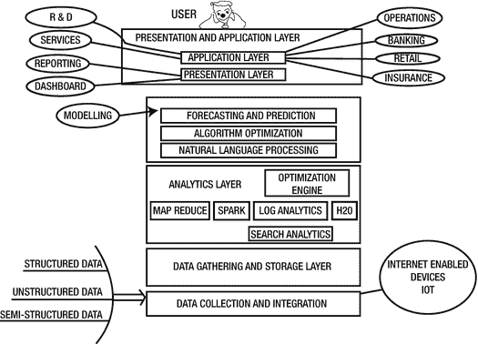
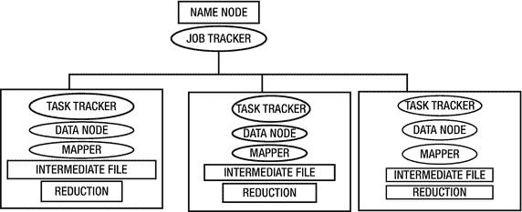
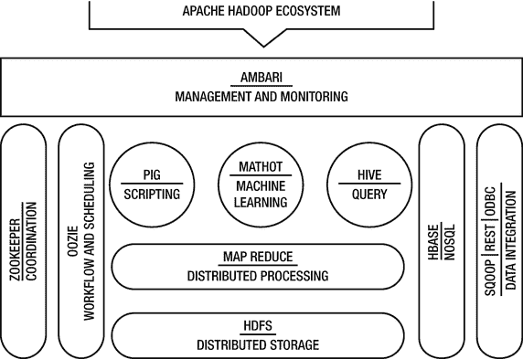
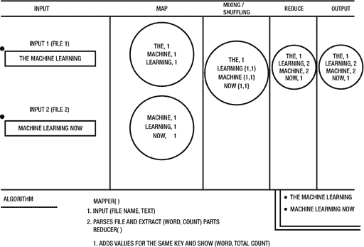

# 4.用于机器学习和相关技术的技术栈

机器学习是一个庞大且不断发展的领域。对机器学习及其相关领域的期望有多种原因。机器学习充满潜力，有巨大的可能性来利用它。在前几章中，我们探讨了机器学习的一些重要和相关的方面。

在所有层面上，技术都扮演着至关重要的角色，因为没有它(几乎)什么都不可能。商业战略是在会议室里制定的，但当谈到实现时，技术是推动者。技术有助于制造产品或应用，并有助于其营销，包括物理或虚拟供应链。在产品或应用程序的整个生命周期中，技术的最大份额在开发、维护和支持阶段发挥着作用。

由于机器学习生态系统中涉及的技术的性质，如物联网、大数据分析、云和认知计算，技术和技术讨论之间存在自然的重叠。例如，如果有人想讨论数据分析，这个主题在所有相关技术的讨论中都是合适的。物联网技术堆栈和大数据分析都是其中的一部分。

在采用或开发基于物联网和机器学习的产品或服务之前，行业必须评估、创建或重新审视他们公司的战略。规划和战略必须放在首位。这是有原因的，因为它几乎涉及到一切，从产品概念化和设计到采购和生产(制造)。在实施有效的销售和服务时，这也非常重要。各行业必须微调他们的虚拟和物理物流和供应链管理系统，以便他们能够安全地收集和响应来自客户和供应商的数据。在我们所处的时代，即使是产品本身也能收集数据，并以自动化的方式将其传输到需要的地方。

从传统战略转向数据优先战略最初很困难，但这是保持市场竞争力所必需的。此外，还需要开发高级分析能力。在这种情况下，网飞是最常被引用的例子。为了捕捉、探索和利用物联网、大数据和机器学习领域存在的巨大经济机会，需要新的技术基础设施和思维模式。这使得公司能够快速跟踪智能互联产品和运营的上市时间。物联网支持一系列功能和组件，这些功能和组件将帮助各行业实现以下目标:

*   部署监控、管理和控制连接设备的应用程序。
*   在业务环境中收集、处理(大数据分析)和分析(机器学习技术)机器和传感器数据。
*   设备和实时数据流之间的安全连接。
*   提供有效的设备/传感器管理，并支持远程设备更新。
*   创建支持快速、持续、迭代的基于物联网的解决方案创建的应用环境。
*   有效且高效地与第三方系统集成。
*   在动态工业环境中有效利用增强现实(AR)进行下一代营销、销售、服务和培训。

让我们接受这样一个事实:技术是关键。

## 软件堆栈

任何软件应用程序都可以使用技术栈来开发，因为它是任何工程工作的基础。在选择构建应用程序/产品的技术堆栈时，需要采取谨慎的方法，因为技术堆栈的修订通常很困难。本章讨论了可用于机器学习的多种技术栈及其相关领域。本章包括对机器学习技术栈的综合观点。由于本书和本章的范围，本章仅限于信息技术的具体细节。

本章还讨论了来自多个供应商的技术产品，如 Apache、IBM、Microsoft 和其他相关的供应商。此外，还描述了不同层和技术之间的映射。技术栈通常与特定的概念及其相关的生态系统相关联。例如，物联网与一套技术套件相关联，而机器学习和大数据与其他技术套件相关联。然而，出于实际原因，如技术重叠(适用于在基层实现多个概念的同一组技术)、业务需求、实施方式、财务依赖和客户需求，大多数时候，现实是不同的。因此，本章提供了技术堆栈的整体和综合视图。话虽如此，只要有可能，也给出具体的技术观点。还描述了一些通用的技术概念。例如，本章将详细介绍 MapReduce。

Chapter Map

第 [1](1.html) 章中讨论的综合模型包含多个层，每层在输入和输出方面都多少依赖于其他层。因此，总的来说，这个模型是一层一层的。每一层或子层处理一种特定的技术。然而，大多数时候技术之间存在重叠。在这一章中，我扩展了这个模型，并证明了它的一个详细视图。我到了“技术映射”的层次，描述了每一层的技术细节。例如，物联网主要是从多个设备和传感器获取数据，并将其传输到云或内部基础设施，以供进一步利用和处理。在此之后，大数据技术取得控制权，并在特定技术堆栈的帮助下，应对存储、管理、处理和理解这些数据的挑战。如果需要，他们会以适当的方式将处理过的数据呈现给更广泛的受众。此外，大数据分析技术堆栈将其输入传递给机器学习框架，以从已处理的数据中获得智能。然而，您可以将大数据技术与特定物联网堆栈的一部分相关联，机器学习、大数据分析和认知计算也是如此。

关于本章的结构和内容的几个要点。

*   技术讨论:技术讨论发生重叠。然而，它只在需要时发生。例如，在讲解大数据和物联网技术体系时，会讨论数据收集和联网技术。处理技术在大数据技术栈下讨论。为了完整起见，这些概念在机器学习的连接器层下再次被触及。机器学习的数据处理器和存储层下的处理/存储技术也是如此。
*   经验法则:如果一个概念在前面被详细讨论过，这一章就不会再讨论同一件事情的细节了。回想一下，在第 [2](2.html) 章中提供了一些重要的机器学习框架、库和工具的简要描述。如果你有兴趣了解大数据处理中使用的技术，请在阅读机器学习技术栈的同时回到大数据部分。
*   讨论的目的和内容的结构:本章中讨论的技术堆栈可以通过两种方式可视化。
    *   特定于层的断开视图:讨论了特定于层的技术。例如，大数据分析被视为一个层。该部分提到了与大数据分析相关的技术。因此，如果您只是想了解大数据技术堆栈，您可以只参考该部分，遵循数据采集➤分析➤机器学习➤表示层层次结构。同样，如果你想了解 ML 技术栈，你必须遵循连接器➤存储➤数据处理➤模型和运行时➤表示层层次结构。
    *   复合连接视图:这提供了一个连接视图。它不涉及子层的细节，而是将层视为综合模型的组件。

在进入技术栈的细节之前，让我们看一下概念和技术图。技术和概念图只不过是哪个概念出现在章节中的表格表示。

<colgroup><col> <col> <col> <col></colgroup> 
| 技术栈 | 图层名称 | 详细讨论的层 | 讨论的技术和概念 |
| 物联网 | 设备和传感器层通信、协议和传输层数据处理层表示层和应用层 | 设备和传感器层通信、协议和传输层 | 传感器、设备、网关、通信技术， |
| 大数据分析 | 数据采集和存储层分析层机器学习层展示和应用层 | 数据采集和存储层分析层呈现和应用层 | OBIEE、Cognos、Infographics、HDInsight、Apache Spark、Apache Solr、Apache Storm、MangoDB、NoSQL、HBase、YARN、MapReduce、Hive、Pig、HiveMall、亚马逊简单存储服务(S3)、HDFS、HCatalog、Oozle、Avro、Ambari、ZooKeeper |
| 机器学习 | 连接器层存储层处理层模型和运行时层演示和应用层 | 连接器层模型和运行时层 | Logic App、Apache Flume、MQTT、Apache Kafka、Apache Sqoop、Apache Mahout、亚马逊深度可扩展稀疏张量网络引擎(DSSTNE)、Google TensorFlow、微软认知工具包、视频分析 |
| 认知计算 | 数据收集层数据准备、提取和转换层数据处理层分析、机器学习和认知层呈现和应用层 | 物联网、大数据分析和机器学习部分讨论了大多数层。因此，由于层的概念和功能保持不变，因此本节不讨论它们。 | 预期计算 |
| 云计算 | 基础设施即服务层平台即服务层机器学习即服务软件即服务 | 这些层主要在第 [1](1.html) 章中讨论。这里不再提及它们。 | 基础设施即服务、平台即服务、机器学习即服务、软件即服务 |

在接下来的章节中，我们将讨论机器学习生态系统的主要技术和技术栈(如果需要的话)，我们在第一章中称之为“支柱”。

## 物联网技术堆栈

提出物联网的通用技术堆栈非常困难，因为不同的行业有自己的要求，需要不同的应用程序、产品和服务来满足他们的需求。然而，本节展示了跨行业实施物联网技术的主要成分的一般快照，并提供了物联网技术堆栈的技术层面的详细信息。可以根据个人/用户/企业或组织的具体要求进行进一步定制。但是，堆栈的基本结构保持不变。物联网(IoT)带来了巨大的可能性，并承诺了光明的未来；它会一直留在这里。

基于传感器的器件和设备的数量正以极快的速度增长，这一领域的发展是巨大的。因此，现有的商业模式有望适应这种快速变化的技术。因此，商业世界需要在这方面教育它的劳动力，包括但不限于项目、产品和技术经理，因为在地面上这些头脑正在为商业制定战略。此外，他们还参与收集信息，以便向更高级别的管理层提供信息。根据中层管理人员(项目/产品和技术经理)提供的数据和见解，组织的顶层(首席技术官/首席财务官/首席运营官)可以做出决策。

中层管理是组织整体生态系统不可或缺的重要组成部分，他们确保基于物联网的系统(或任何系统)的产品/应用或服务的成功。在这个不断变化的时代，很明显，具备技术能力的管理者将统治组织并为其提供方向。因此，管理者的角色和职责也发生了变化。更多的技术一致性和创新思维是成功的必备标准。经理的技术之旅从了解技术栈开始。因此，只有了解堆栈的人才能评估需求和项目的复杂性。由于经理是本书的目标读者，因此让我们从物联网技术堆栈开始这个知识收集练习。

物联网的技术栈是分层次的。首先，我们看看这些层，然后讨论它们。

*   器件和传感器层
*   通信、协议和传输层
*   数据处理层
*   表示层和应用层

层代表跨独立计算机和系统的设计的表示、业务、服务和数据功能的物理分离。层是组成应用程序的软件或硬件组件的逻辑分组。它们以一种逻辑的方式将组件执行的各种任务分离开来。这使得创建支持现有组件可重用性的健壮可靠的设计变得更加容易。此外，每个逻辑层可能包含许多独立的组件类型。组件类型被分组到子层中，每个子层执行特定类型的任务以实现特定的功能。

IoT, You, and Your Organization

对于组织而言，构建完整的物联网系统或解决方案是一项成本高昂且对业务至关重要的决策。它需要现代技术技能、专业知识、时间和金钱。在实施之前，需要对其进行适当的规划。如果没有以适当的方式利用资源，解决方案可能会经历漫长的 IT 项目周期，并以低投资回报而告终。因此，确定有效且高效的物联网平台是强制性的。配备适当技术堆栈的有效物联网平台将简化物联网解决方案的开发。因此，可伸缩性、健壮性和性能等因素对于一个好的平台来说是必不可少的。无论何时需要，该平台都可以轻松适应持续的增长和变化。

这些必备功能使企业能够开发系统和解决方案(在平台之上)，帮助行业/组织/企业开发强大的物联网解决方案，这些解决方案能够轻松连接到各种设备和传感器。他们可以从系统和运营资产之间的无缝信息流中受益，并通过 IoT/IOE/IIoT(万物互联/工业物联网)向客户提供坚实的商业价值。今天的客户对技术、它们的未来和用例有很好的了解。因此，拥有一个好的平台可以让用户对满足他们的需求充满信心。

### 器件和传感器层

这是一个物联网系统的起点。从这里，事情开始他们的旅程(技术上)。这是数据从一个设备开始，并被传递到多个其他连接的“东西”或更大的网络(或网络的网络)的点。此外，这一层还负责与物理世界进行交互。下面的列表从技术角度解释了该层的一些重要亮点。这一部分属于物联网，特别是设备、事物和网关。因此，该部分提供了对物联网设备和传感器的技术前景、技术框架和其他细节的一瞥。

*   物体或事物通常体积小，容量小。因此，这些对象和东西是使用微控制器编程的，因为它们是轻量级的，不太需要资源。微控制器专门用于执行特定的技术任务。
*   在支持物联网的设备上运行的软件通常由一个非常轻量级的操作系统组成，这是一个软件层，使对象能够访问硬件(MCU)的功能。
*   设备或对象支持有线或无线协议，如蓝牙、Z-wave、red、CANBus、CoAP 和 MQTT。通常，这些用于连接设备。
*   物联网设备通常具有远程管理能力。当需要远程管理“事物”时，这种功能非常方便。一个例子是软件升级或远程纠正小问题。

Facts For You

*   谷歌面向物联网的操作系统叫做 Android Things。它是为连接设备而构建的，用于物联网。它经过调整，充分利用了英特尔的创新架构。Android Things 上的物联网应用开发快速而健壮。
*   Windows 10 物联网核心是 Windows 10 的精简版。Windows 10 物联网核心目标，并针对更小的设备进行了优化。它适用于具有或不具有显示功能的设备。它可以在 Raspberry Pi 2 和 3、Arrow DragonBoard 410c 和 MinnowBoard MAX 等设备上运行。Windows 10 物联网核心可以通过使用其 API 来构建下一代解决方案，从而扩展到使用通用 Windows 平台(UWP)的功能。Windows 10 物联网核心还支持 Arduino Wiring API，该 API 用于 Arduino 草图和库中，用于直接访问硬件。Window 10 物联网应用使用 Visual Studio 社区版开发。Visual Studio Community Edition 附带了优秀的开发工具，包括通用应用程序模板、代码编辑器、强大的调试器和丰富的语言支持。在 Connect-the-Dots 等框架的帮助下，Windows 10 物联网核心目标设备可以与微软 Azure 云平台集成。Microsoft Azure 允许您利用基于云的高级分析服务。

在选择技术堆栈时，您需要一个基于集中思想的实际战略方向，主要是在需要收集什么样的数据和所需的硬件类型方面。很明显，需要为这种技术体系制定业务模型和需求。此外，必须提前定义和验证支持模型和执行计划。

在创建、修改、维护和逐步淘汰堆栈的整个生命周期中，这种类型的规划非常有用且方便。这种方法可以使物联网技术堆栈与任何解决方案的创建保持同步。如果考虑到这些因素，技术栈可以处理任何类型的实际需求。它要么通过单个智能传感器使用简单的数据收集，要么使用更复杂的场景，如从工业计算机和处理系统收集数据，这些系统包含许多传感器、强大的处理器、高级存储系统和网关系统。

传感器的一些典型特征是测量值和发送原始数据以及消耗低功率。传感器可以嵌入任何设备或物体中。这包括智能手机、手表、腕带、咖啡机、汽车、卫星、牙刷、隐形眼镜、布料等等。它们可以佩戴或植入身体或皮肤。例如，诺基亚最近为一种磁性纹身的方法和系统申请了专利，这种方法和系统能够嵌入我们的皮肤。这些纹身会在来电或有信息时振动。他们的方法描述说，这项专利技术将一种铁磁材料喷到用户的皮肤上。一旦完成，它就可以与任何移动设备配对进行通信。

另一个例子是 Fitbit 新的高级睡眠跟踪设备，它使用传感器来测量用户在晚上有多长时间是不安分的，处于深度睡眠或清醒状态。它有一个内置的心率监测器，可以将数据分为临床定义的阶段并进行分析。孟买的印度理工学院团队开发了一种可穿戴婴儿健康监测器的原型。它可以帮助父母在多个传感器的帮助下跟踪孩子的临床和一般健康状况。该团队创造了一种支持物联网的设备，可以轻松嵌入/附着到儿童的尿布上。这是一种监测婴儿运动的创新方法，包括他们的体温、血压等等。

微软与华盛顿大学合作，推出了一种创新的隐形眼镜，用于分析和提供人体生物化学不稳定性的实时更新。随着微机电系统(通常称为 MEMS)的发展，这些传感器的尺寸和成本已经显著下降。因此，基于 MEMS 的器件正在成为主流的一部分。MEMS 在极小的电子水平上工作。他们利用电子、物理、化学和机械工程的综合力量来集成传感器和致动器。传统上，感测信息以及通过网络共享和传输该信息或数据是由设备中的独立组件来处理的。然而，最近的技术进步使得将传感、网络和电源集成到一个单元成为可能。因此，它们可以很容易地在许多环境中使用，因为它们作为一个单元工作。

巨大的电源需求和联网能力不再是制约因素。例如，市场上有许多配备有全球定位功能的设备和传感器，它们具有出色的联网能力。他们可以跟踪个人的位置，并帮助他们实时找到丢失的宠物、汽车、医院、购物中心或停车场。

在所有设备中，传感器的性质和类型以及基本通信技术几乎是相同的。它们通过无线网状网络协议相互通信。设备的这种能力推动了多家公司的一些雄心勃勃的计划。例如，惠普公司的一个名为“地球中枢神经系统”(CeNSE)的项目结合了材料、纳米技术和 MEMS 的进步，开发了一个全球范围的传感网络。他们正在使用大量廉价的传感器，通过整合物理和数字世界来获得对世界的整体看法。这个“硅的神经”基本上映射了整个地球。反过来，这种测绘被用来监测桥梁、公路、河流、森林和人们呼吸的空气的状况。

支持物联网的设备使用计算处理单元，但它们不是通用计算机。这些设备的主要用途是充当目标物联网系统的眼睛和耳朵。低功耗、移动性、易用性、在不利条件下工作、善于使用低吞吐量通信信道以及通过无线电接口与网络通信是这些物联网设备的一些显著特征。传感器和网关及其相互作用创造了一些非常有用的用例。

以下部分讨论了物联网中使用的一些主要技术，并在各层中进行了描述。

### 通信、协议和传输层

通信和传输层用于共享传感器信息(包含在设备或事物或对象中)。简单地说，这指的是交换信息/数据的所有不同方式。当谈到技术世界时，它泛指通过设备“交换”信息。然而，在物联网术语中，它指的是通过“物”与世界其他地方交换信息。这种信息交换通过网络进行，网络包括物理网络和虚拟网络，并使用不同类型的协议来实现。

通信机制由设备或事物的相互作用组成，包括硬件和软件。因此，选择正确的通信机制(包括所有类型的传输和协议要求)在人们构思和考虑构建物联网堆栈时非常重要。这一层表示并决定了如何与底层基础设施进行交互。这进而回答了以下问题:哪种平台最适合您的解决方案，是第三方平台、内部平台还是云基础架构？如果您想使用基于云的解决方案，这一层负责数据管理。例如，如何将数据放入云基础架构，以及如何从云基础架构中取出数据。它借助广域网、局域网、WiFi 和其他相关技术来实现这一点。

网关是物联网环境的重要组成部分。物联网网关是一种“中间”设备，它连接传感器、设备、系统和应用。它提供了巨大的价值，因为它过滤和传递从传感器和设备收集的数据。该网关使物联网生态系统能够高效地收集数据，并将数据从设备和装置安全地传输到目标系统或基础设施。网关本质上不是一个单一的组件。它可以设计为一个网络/网关组合，可以连接所有远程设备，并能够随着设备的增长而扩展。网关与物联网传感器和设备相结合，在物联网生态系统中发挥着重要作用，因为它们提供了实现、保护、管理和维护整个系统的能力。网关可用于多种目的，但其中有几个非常重要:

*   它用于将有意义的数据迁移到云中，并通过过滤掉垃圾数据来减少数据量。
*   它被用作数据处理器。

这里提到了通信、协议和传输层的一些亮点:

*   物联网网关是传感器/传感器组的集成点。
*   充当执行器，将事物或设备相互连接或连接到外部网络。
*   物联网网关可以是一个物理硬件或功能，可以集成、构建或附加到设备上。
*   物联网网关用于从传感器收集数据。
*   网关的一些重要协议是
    *   椰油丙酸钠
    *   MQTT
    *   超文本传送协议
    *   XMPP
*   物联网网关能够在边缘处理数据，并且可以具有一些存储容量来处理网络延迟。

现在是了解一些流行的通信和网络术语的好时机。正确理解这些术语有助于更好地理解物联网技术。其中一些现在仍在使用，其他的正在快速涌现(见表 [4-1](#Tab1) )。

表 4-1。

Wireless Networking Options

<colgroup><col> <col></colgroup> 
| 网络类型 | 描述 |
| --- | --- |
| 蜂窝移动网络 | 它有多种版本，包括 2G、3G、4G 和 5G(最新增加的版本)，其中“G”代表一代。 |
| 蓝牙和蓝牙低能耗 | 无线个人区域网(WPAN)。这是短距离传输数据的标准。 |
| 网络 | 一种无线网状网络协议。非常适合低数据速率和高电池寿命。 |
| z 波 | 家庭自动化无线协议。 |
| 男人 | 城域网类似于局域网。然而，它的范围延伸到一个城市或大型校园或多个校园。通常，它是为城市或城镇设计的。 |
| 平底锅 | 个人区域网络是围绕个人或个人运行或组织的网络。它有可能使可穿戴计算机设备与附近的其他计算机或智能设备进行通信，并以数字方式交换数据。 |
| 广域网 | 广域网跨越很大或很大地理区域。它有可能连接较小的网络，包括局域网或城域网。 |
| 6 洛潘 | 低功耗无线个域网上的 IPv6。 |
| 无线局域网（wireless fidelity 的缩写） | 一种用于局域网的无线技术。它是现在大多数可用设备的组成部分，包括移动设备、平板电脑和个人电脑。然而，它不仅限于设备，还延伸到电子产品(冰箱、洗衣机等)。). |

### 数据处理层

云平台是现代物联网解决方案的支柱。这是数据科学和机器学习繁荣的最大推动者之一。根据数据处理原则，只要技术基础设施可用，理论上可以在任何地方处理数据。然而，出于显而易见的原因，公司更喜欢在云上处理数据。以下是与此相关的一些重要方面。

*   数据收集和管理:在现代数据流技术的帮助下，智能设备可以轻松地将数据传输到云中，包括无用和嘈杂的数据。数据可能来自各种来源，其内部排列、格式和结构都在不断变化。此外，可能需要对数据进行预处理，以处理或找到丢失和不需要的数据。此外，数据需要与来自不同来源的不同数据集同化，以在被定向和存储在数据存储中之前提出合并的表示。因此，在定义基于物联网的堆栈的要求时，了解数据的类型和数量非常重要。明确了解每日、每月和每年的数据需求是设计和创建健壮、有效和高效的堆栈的重要步骤之一。提前正确定义可伸缩性参数有助于架构师、数据科学家和数据管理员定义正确且合适的数据管理解决方案和关联生态系统。
*   分析:分析是任何物联网解决方案的关键组成部分之一。在物联网的背景下，分析是指以有意义的方式处理数据、发现隐藏模式并对智能和智能模式产生见解的能力。为了执行业务关键预测，机器学习和大数据分析的技术相互作用开始出现。此外，它使整个生态系统具备了从可用数据中提取认知洞察力(理解人类以自动化方式解释和推断的方式)的能力。这一阶段还包括对已执行的行动进行持续的回收和调查，并存入存档数据，以便了解过去的数据并预测即将发生的变化，或者发现数据中的异常情况，从而促使进行额外的检查或行动。请记住，原始数据本身并不能使任何解决方案对业务有价值。正是现代数据驱动技术和机器学习推动的基于分析的洞察力将土壤变成了黄金。因此，我们可以从前面的讨论中推断出，任何物联网技术堆栈都必须能够整合分析功能，并有助于构建有效和高效的解决方案。
*   云 API:物联网就是将多个设备或对象相互连接、连接到网络或网络的网络。创建这个设备网络的目的是共享数据，以便有效地利用不同的需求，包括企业和个人的业务和个人需求。在物联网解决方案中及其周围，数据是普遍可用的。它从事物/对象/设备传播到云基础架构，从云传播到后端系统，从多个处理程序或用户传播到他们的对象或设备。数据传输的核心是支持设备间所有通信和协作的 API。多个对象、事物、设备和网络之间的无缝通信通常是通过在云级别或设备级别使用公开的 API 来完成的。这些 API 由供应商和提供商公开，作为云产品的基本元素之一。API 允许用户与设备交互或在他们之间交换数据。请记住，向目标受众开放 API 不是一个技术决策，而是一个商业决策。适当的 API 管理支持安全的数据移动，这有助于保护敏感数据。

### 表示层和应用层

这一层提供了与应用程序用户交互的手段。安装在设备/对象上的软件充当通信接口。该层还包含最终用户用来通信的应用程序和交互式产品。这一层位于技术堆栈的顶部，大多数技术复杂性都在底层。因此，这一层很容易被几乎所有人理解。对于接触一点技术的人，甚至对于门外汉来说，这就是“使用层”，因为它包含了他们在不知道隐藏的复杂性的情况下使用的应用程序和产品。

企业的大部分收入都来自这里。技术和产品经理很容易与这一层联系起来。这里的应用程序、产品和服务通常都是基于网络的。然而，这不是强制性标准，它取决于用户的需求。AP(应用、产品和服务)的目标是桌面、移动和可穿戴设备。此外，许多应用程序或应用程序可用于满足客户或用户的需求。在不断变化的时代，客户和用户更倾向于支持云的应用或产品，因为它们提供了以“随时随地”的方式从支持智能物联网的对象访问信息的灵活性。这种“随时随地”的访问符合物联网为用户提供自由和灵活性的最终目标。

行业特定的应用程序也位于这一层。消费者使用这一层来满足家庭、生活方式和健康相关的需求。商业和工业使用这一层来满足他们的专业需求。

### 物联网解决方案可用性

微软是基于物联网的技术、产品和解决方案的端到端解决方案提供商之一(还有多个其他提供商，包括 IBM)。物联网有需求。许多公司在这一领域帮助他们的客户和利益相关者。他们在市场上不断创新和引入突破。当今世界，只做研究和创新是不行的。产品的正确定位、品牌、营销以及将研究、创新和相关产品传达给正确的人同样重要。这些因素有助于客户对满足其需求的特定用途的产品或应用做出明智的决策。

Real-Life Scenarios

纳米技术传感器

纳米技术是一个在纳米尺度(非常小的尺度)研究粒子的研究领域。它已被广泛用于医学和治疗疾病的早期阶段。当纳米技术与物联网、大数据分析和机器学习相结合时，它会变得非常有效。

1.  给病人注射纳米颗粒，使其释放到血液中。纳米粒子识别生物或化学变化。这项活动监测病人体内的化学和物理变化，以便在早期发现疾病。这是基于一个简单的原则，即身体内部生物、化学和生理机制的意外变化可能是疾病的征兆。
2.  纳米颗粒与可穿戴设备相互作用，主动指示干扰体内正常流动的外来颗粒所产生的变化。可穿戴设备持续接收来自纳米粒子的数据。
3.  可穿戴设备使用这些数据进行疾病诊断，进而使用预测和说明性分析。
4.  机器学习结合认知建模和计算算法，学习内部身体机制的变化和行为过程，并有效和主动地诊断任何疾病。

这一整体过程提高了疾病诊断的有效性和效率。因此，它有助于减少住院时间和费用。它还可以生成直观有效的报告。

监视

机器学习将监控提升到认知智能的水平。机器学习为物联网系统提供了以下优势:

*   可穿戴设备全天候提供健康警报和通知。它们通常不能有效地跟踪这些警报和通知的动作并正确记录它们。
*   在神经网络的支持下，机器学习可以根据人类的行动跟踪活动，并记录响应。
*   记录的数据将被转发给医生。

以下是一个有趣的未来用例的步骤:

1.  病人下床，地板和床上的传感器记录这一事件。
2.  这种带传感器的马桶会检查病人的大小便，然后将详细信息上传到云端。传感器使能的牙刷检查病人的口腔健康。
3.  脉搏、血糖水平和血压等重要的健康指标都被记录下来并上传到云端。
4.  墙壁和地板上的传感器根据病人的动作评估跌倒的风险。
5.  利尿药物含有微小的发射器，可以向可穿戴设备发送信号，表明患者已经服药。

## 大数据分析技术堆栈

围绕业务的要求和特定需求创建大数据技术堆栈。此外，在做出关于大数据技术堆栈的决策时，您必须考虑三个 v(速度、多样性和容量；有关更多详细信息，请参考第 [1](1.html) 章以及分析基础设施的可用性。大数据技术堆栈从数据中创造价值。然而，数据的整洁也是由需求、规则、业务逻辑和分析能力来指导的。

通常情况下，大数据技术分为多个层，用于分离关注点和逻辑(参见图 [4-1](#Fig1) )。以层的形式对复杂性进行逻辑细分是大数据技术套件的构建模块。一些冗余存在于各层之间，因为隔离层无法满足这一目的。

图 4-1。

Big Data analytics stack Note

数据处理和分析是“洞察”生成过程中的重要步骤之一，与机器学习密切相关。机器学习和数据分析可以被视为一层。然而，为了清楚地隔离，将它们分开总是好的(至少在逻辑上)。机器学习，包括它的工作方式和与技术的关系，将在“机器学习”一节中详细讨论。图 [4-1](#Fig1) 展示了机器学习和大数据分析紧密结合的一种方式。

表 [4-2](#Tab2) 简要展示了大数据分析技术和流程套件。在下一节中，我们将介绍一些与大数据技术套件密切相关的重要软件、框架和库。表 [4-2](#Tab2) 还提供了大数据最基本技术实施的总结。

表 4-2。

Main Technologies of Big Data

<colgroup><col> <col></colgroup> 
| 技术名称 | 描述 |
| --- | --- |
| 大数据 | MapReduce 的实现。可以处理不同的数据源。也称为企业数据操作系统(详情请参考 Hadoop 部分)。 |
| 储备 | 允许商业智能(BI)等传统数据驱动的应用程序针对 Hadoop 集群运行查询。此外，它还被视为一种数据仓库服务，提供读取、写入和管理大型数据集的功能。它是 MapReduce 上的一个抽象层(隐藏了技术的内部复杂性)(有关详细信息，请参考 MapReduce 部分)。 |
| hive ql | 它是一种类似 SQL 的语言，用于提交 MapReduce 作业。 |
| 猪 | 还允许应用程序在 Hadoop 集群上运行查询。但是，它是一种类似珍珠的语言，而不是类似 SQL 的语言(Hive)。详情请参考清管器部分。 |
| 分布式文件系统 | 分布式文件系统技术。通常用于存储非结构化数据(有关详细信息，请参考 HDFS 部分)。 |
| 数据处理 | 它是一个分布式计算框架。然而，与新发展的框架相比，它的计算速度较慢(有关详细信息，请参考 MapReduce 部分)。 |
| 巴什 | 基于列的存储服务，以表格格式存储数据。 |
| 动物园管理员 | 分布式协调服务。 |
| 故事 | Yarn 代表另一种资源导航器。在大数据分析系统中，它的作用是充当中央操作系统，为技术堆栈提供和管理资源和应用程序生命周期管理。 |
| 安巴里 | 用于配置、管理和监控 Hadoop 集群。 |
| 欧罗欧欧欧罗欧欧欧欧欧欧欧欧欧欧欧欧欧欧欧欧欧欧欧欧欧欧欧欧欧欧欧欧欧欧欧欧欧 | 数据序列化系统。它的。NET flavor 也存在于微软的一个名为 HDInsight 的产品中，它是 HortonWorks 的 Hadoop 发行版。它还被视为运行在微软 Azure(微软提供的云平台即服务)上的 Apache Hadoop。 |
| HCatalog | 提供 Hadoop 集群上数据的关系视图。像 Pig 和 Hive 这样的工具运行在 HCatalog 之上，它充当一个抽象层。 |
| 软糖 | 这是一个用于协调 Hadoop 工作流的应用程序。 |
| 提斯浦尔 | 它是一个应用程序框架，用于执行高性能的批处理和交互式数据处理。它使 Hadoop 作业更快，并保持 MapReduce 的可伸缩性和健壮性。它通常处理数十亿字节的数据。 |

### 数据采集和存储层

这是大数据技术堆栈中的最底层。这一层负责收集所有类型的数据(结构化/非结构化和半结构化)和存储。数据来自多个来源，包括支持物联网的设备、社交媒体和 RSS 源。由于这一层接收的数据量大、速度快、种类多，一些公司使用数据湖作为其大数据存储库的来源。数据湖是一种数据采集和存储方法。它以其自然的设置、形式和格式存储和包含原始数据。它的主要目的是存储数据，而不是应用任何类型的智能和复杂的操作。例如，数据如何/为什么/在哪里存储数据不是数据湖关心的问题。它的技术也不关心数据的治理和安全方面。

为大数据技术提供解决方案是一个巨大、开放且不断发展的市场。许多公司都在这一领域提供解决方案。主要的参与者有 Apache、HortonWorks、IBM、Amazon 和微软。HortonWorks 和其他公司为大数据、大数据分析和机器学习提供了一套压缩工具和技术。有关更多详细信息，请参考这些链接。

*   阿帕奇提供的技术(来源: [`https://hortonworks.com/products/data-center/hdp/`](https://hortonworks.com/products/data-center/hdp/) )
*   阿帕奇的技术创新(来源: [`https://hortonworks.com/products/data-center/hdp/`](https://hortonworks.com/products/data-center/hdp/) )

许多公司在这一领域提供了多种技术产品。因此，简单看一下主要的会让你很好的理解数据采集和存储。

#### Hadoop 分布式文件系统(HDFS)

分布式文件系统(DFS)是允许通过计算机网络从多个共享主机访问文件的任何文件系统。分布式文件系统可以包括用于透明复制的设施、处理大型数据集的能力、一次写入/多次读取以及容错。它用于在廉价的商用硬件中存储大量数据。Hadoop 分布式文件系统(HDFS)被 Hadoop 应用套件/生态系统用作主要的数据存储系统。

HDFS 是一个可扩展的、健壮的、容错的基于 Java 的分布式文件系统。HDFS 创建数据块的多个副本，并将它们分布在整个群集中的计算节点上，以实现可靠、极快的计算。HDFS 将系统元数据和应用程序数据分开存储。它将元数据存储在名为 NameNode 的专用服务器上，将应用程序数据存储在名为 DataNodes 的其他服务器上。HDFS 的所有服务器都是完全连接的，它们使用基于 TCP 的协议相互通信。HDFS 中的文件内容在多个 DataNodes 上复制以获得可靠性，其优势是数据传输带宽成倍增加，因此有更多机会将计算放在所需数据附近。

#### 核心 Hadoop 架构

Hadoop 集群是基于一个主从(见[图](http://www.ibm.com/developerworks/library/os-hadoop-scheduling/) [4-2](#Fig2) )架构。然而，与传统的主/从架构相比，这些术语是不同的。在 Hadoop 术语中，NameNode 是 Hadoop 集群的主节点，它负责文件系统命名空间和客户端的访问控制。JobTracker 将作业分配给等待的节点。NameNode 和 JobTracker 是 Hadoop 架构的大师。从机包含 TaskTracker，它管理作业的执行。它承担从启动、监控到捕获作业输出的全部责任。它还将作业完成的情况通知给主机。DataNode 是 Hadoop 集群中的存储节点，它代表分布式文件系统。TaskTracker 和 DataNode 在 Hadoop 集群中作为从设备工作。

图 4-2。

Elements of a Hadoop cluster

Hadoop 具有灵活、高效和健壮的架构。因此，它在支持单节点集群方面同样有效，其中所有对象都存在于单个节点或多节点集群上。这样，JobTracker 和 NameNodes 就分布在成千上万个节点上。

##### HDFS 的显著特征

以下是 HDFS 最有趣的特色:

*   可靠性和容错性:由于集群或多个集群中数据复制的特性，它被设计为可靠地存储非常大的数据集(容错)。通常，一组数据可靠地存放在机器集群上。因此，如果一台机器停机，另一台机器上的数据仍然可用。它还以高带宽向用户应用程序传输数据集，以实现高性能。
*   高可用性:即使一些机器或硬件不工作或崩溃，也可以通过另一条路径访问数据。
*   分布式存储:HDFS 在分布式存储环境中提供了出色的结果，并在多个异构服务器上执行计算。即使资源可以随需求增长(可伸缩性)，它的有效性也保持不变。此外，它在各种尺寸下都很经济。
*   开源:它是一个开源项目，因此它支持根据需要修改和定制代码。
*   可扩展:高度可扩展，这意味着添加新硬件很容易。硬件可以毫不费力地添加到节点中。它可以水平扩展，这样可以在不停机的情况下动态添加新节点。
*   灵活:Hadoop 能够轻松访问新的数据源，并利用不同种类的数据，包括结构化、半结构化和非结构化数据，从而从这些数据中产生价值。
*   快速:Hadoop 独一无二的存储技术基于分布式文件系统，从根本上映射数据，无论数据位于集群的哪个位置。
*   经济:Hadoop 为庞大的数据集提供了经济高效的存储解决方案。基于 Hadoop 的解决方案很便宜，因为它运行在安装在商用硬件上的集群上。它不需要专用的机器。因此，Hadoop 提供了巨大的价格节省。

#### 亚马逊简单存储服务(S3)

S3 是一个基于云的可扩展、健壮和文件容忍系统。它是 Amazon 提供的分布式文件系统。它可以用作基于大数据和分析的应用程序中的数据层，并用于构建架构。然而，它可能需要额外的组件。亚马逊 S3 提供了一个简单的基于 web 服务的界面。它可以用来存储和检索任何数量的数据，在任何时间，从网上的任何地方。它还提供了高度可伸缩、可靠、快速、廉价的数据存储基础设施。亚马逊 S3 被亚马逊用来运行自己的全球网站网络。

### 分析层

这一层通常组织和准备用于分析的数据。借助不同的流程、技术和算法，它处理从数据采集层获得的大量不同的数据集。有各种功能各异的分析工具、框架、技术和健壮的算法。根据要求和市场需求，使用任何一种技术或技术组合。这一层将原始数据转化为可操作的见解。这一层处理多种类型的分析，包括描述性的、诊断性的、预测性的和规范性的。从技术上来说，许多作者将机器学习作为这一层的成分之一。然而，本章在机器学习部分讨论这些概念，因为机器学习库、框架和工具位于分析层的顶部。

Apache 无疑是提供基于 Hadoop 的大数据解决方案的领导者。图 [4-3](#Fig3) 展示了 Hadoop 堆栈，显示了 HDFS 和 MapReduce 在整个堆栈中的定位。

图 4-3。

Positioning of HDFS and MapReduce in the overall Hadoop stack (which covers all layers of Big Data analytics)

多家供应商正在大数据领域提供他们的解决方案，从收集数据到展示数据，包括 Apache、IBM 和微软的产品。然而，很难涵盖这些供应商的所有产品。因此，本章将讨论局限于基于 Apache/Hadoop 的产品，并在少数地方涉及其他供应商的产品。让我们从名为 MapReduce 的革命性技术开始。

#### 的介绍

Hadoop MapReduce 是一个在分布式计算环境中处理大型数据集的优秀软件框架。MapReduce 是 Hadoop 框架的核心和灵魂。它是一种编程模型，允许并促进 Hadoop 集群中成百上千个服务器的大规模可伸缩性。它适用于商用硬件的计算集群。组织、企业和公司使用该框架来调度任务，以及监控和重新执行任何失败的任务。因为它是 HDFS 的子项目，它的工作方式继承了 HDFS 的基本哲学。

术语 MapReduce 指的是典型 Hadoop 程序执行的两个独立且不同的操作。MapReduce 作业通常将输入数据集分割成独立的数据组，由地图任务以并行方式进行处理。“映射”作业从可用的数据存储中获取一组或一大块数据，并将其转换为另一组数据，其中各个元素被分解为键/值对。该框架对地图的结果进行分类，这些结果将成为 reduce 任务的输入。

然后，“reduce”作业将 map 步骤的输出作为输入，并将这些数据键/值对组合成一个更小的元组集(键/值对的常用同义词)。顾名思义，MapReduce 作业总是在地图作业之后执行。通常，作业的输入和输出存储在分布式文件系统中。(图 [4-4](#Fig4) 展示了 MapReduce 的整体架构。)

图 4-4。

MapReduce architecture MapReduce Word Count Example

挑战:计算提供的文档中不同单词的数量。

`Map()`和`Reduce()`函数在 Hadoop 集群机器上并行运行，以并行方式解决这一挑战。这些函数的输入和输出是键/值对。涉及以下步骤:

1.  绘图
2.  减低
3.  整体计算

Quick Facts About Mapreduce

MapReduce 是改变大数据处理方式的主要算法。

谷歌是 MapReduce 的先驱。两份主要文件是:

*   第一篇论文是 Sanjay Ghemawat 等人(2003 年)关于 Google 文件系统的论文。它描述了如何在 Google 集群上以分布式方式处理文件。
*   在 2004 年，Jeff Dean 等人(2004)也在他们的论文《MapReduce:大型集群上的简化数据处理》中讨论了关于 MapReduce 的细节。它描述了 Google 集群上使用的编程模型。

MapReduce 是 Google 内部用来索引 WWW 以支持 Google 搜索的框架。

#### 猪

Pig 位于 Hadoop 框架之上，处理大型数据集，用户无需编写基于 Java 的 MapReduce 代码。Pig 是一个高级平台，用于创建与 Hadoop 一起使用的 MapReduce 程序。Apache Pig 允许 Hadoop 用户通过使用 Pig 脚本编写复杂的 MapReduce 代码，Pig 脚本是一种简单易懂的脚本语言。Pig 将 Pig 拉丁脚本翻译成 MapReduce，以便可以在数据上执行。

存在各种编码方法和技术来解决大数据问题。Apache Pig 可以认为是 Hadoop MapReduce 的选项之一。每种编码方法和编程语言都有一些优点和缺点。小猪也不例外。由开发人员来评估和选择哪种编码方法或编程语言最能满足他们的需求和要求。

然而，根据一般准则，不精通 Hadoop MapReduce 技术的程序员会发现 Pig 很容易。容易入手，也不那么混乱。Pig 可以通过 UDF(用户定义的函数)进行扩展。它使用户能够用自己选择的语言编写代码或程序，包括 Java、Python、JavaScript 和 Ruby。这些可以直接从编程语言中调用。

#### Apache 蜂巢

开发 Hadoop 是为了组织和存储各种类型和格式的海量数据。数据分析师、企业和公司使用 Hive 来查询、总结、探索和分析数据，这些数据可能会转化为可操作的业务见解。表 [4-3](#Tab3) 显示了蜂巢的特征。

表 4-3。

Features of Hive

<colgroup><col> <col></colgroup> 
| Hive 的优势和特点 | 细节 |
| --- | --- |
| 类似 SQL 的脚本 | 通过 SQL 脚本提供查询的灵活性。用户可以在永久用户定义函数中使用子查询 IN/NOT 将数据从 Flume 流式传输到 Hive。Apache Flume 是一个分布式服务，用于收集、集成大量的流数据，并将其移动到 HDFS。在哪里加入关键字线索 |
| 速度 | 通过 Hive 提供更快的查询规划功能和基于成本的优化交互式查询 |
| 综合 | 与传统数据源和 ETL(提取、转换和加载)工具轻松集成 |
| 支持可伸缩和可扩展的架构 | 易于扩展和升级。当异构环境中的数据量增长时，这个特性就派上了用场。 |

Hive 的重要扩展之一是 HiveMall，这是一个开源的可扩展机器学习库，它提供了一组机器学习算法作为 Hive UDFs。UDF 允许您修改 Hive 评估数据和操作查询的方式。HiveMall 通过提供交互式和稳定的 API w/SQL 抽象，使开发人员能够轻松进行机器学习。它支持回归、分类、推荐、异常检测、k-最近邻和特征工程算法。此外，HiveMall 运行在 Hive 之上，不需要编程来执行基于机器学习的开发活动。它是基于 Hive 的，所以 Hive 用户很容易学习。

表 [4-4](#Tab4) 展示了 MapReduce、Pig 和 Hive 的对比研究。

表 4-4。

Summary of the MapReduce, Pig, and Hive Technologies

<colgroup><col> <col> <col></colgroup> 
| 猪 | 储备 | 数据处理 |
| --- | --- | --- |
| 脚本语言 | 类似 SQL 的查询语言 | 编译语言 |
| 更高层次的抽象 | 更高层次的抽象 | 低抽象级别 |
| 与 MapReduce 相比，代码行更少 | 与 Pig 相比，代码行最少 | 更多的代码行相比，猪和蜂箱代码行，MapReduce ➤猪➤蜂箱 |
| 与 MapReduce 相比，开发工作量更少 | 与 Pig 和 MapReduce 相比，开发工作量最少 | 发展努力，MapReduce ➤猪➤蜂房 |
| 更少接触虫子 | 最少的错误 | 更容易接触到虫子 |
| 在处理非结构化数据(如图像、视频、音频和模糊界定的文本以及日志数据)时效率较低 | 高效处理非结构化数据，如图像、视频、音频和文本 | 有效处理非结构化数据，如图像、视频、音频和文本 |
| 码效率 | 码效率 | 与 Pig 和 Hive 相比，代码效率高 |

#### 巴什

HBase 是一个非关系型 NoSQL 数据库，运行在 Hadoop 分布式文件系统之上。NoSQL 数据库技术旨在支持基于云的应用程序不断变化的需求，这些应用程序包含并处理大量非结构化数据。HBase 旨在满足这些要求。它可以克服传统数据库存在的问题，如扩展性差、性能慢、数据模型无效、大数据量的数据分布等。

前面提到的参数和瓶颈是关系数据库的典型局限性。HBase 提供对大型数据集的实时读/写访问。如果需要以线性方式处理大量数据集，HBase 可以扩展。它可以有效地处理大量的行和列。当涉及到组合使用各种不同结构、格式、类型和模式的多个数据源时，HBase 非常方便。HBase 具有将多种数据格式与 Hadoop 框架和技术生态系统集成的原生支持。

它通过 YARN 与其他数据访问引擎完美配合，YARN 通常被称为大数据系统的操作系统。YARN 和 HDFS 是 HortonWorks 数据平台(HDP)的基础组件。虽然 HDFS 为大数据存储提供了可扩展、容错、经济高效的存储，但 YARN 旨在提供一个灵活、健壮、可扩展的集中式架构。它使用户或自动化应用程序能够同时处理多个作业。YARN 还负责资源管理活动。YARN 的即插即用架构设计方便了各种各样的数据访问方法。表 [4-5](#Tab5) 显示了关于 NoSQL 和关系数据库的有趣信息。简要地看一下 NoSQL 和 RDBMS 之间的比较是有好处的。

表 4-5。

Multiple Aspects of NoSQL Database, RDBMS, and MangoDB

<colgroup><col> <col></colgroup> 
| RDBMS vs NoSQL |
| --- |
| 利益 |   |
| 关系型数据库管理系统 | NoSQL |
| 结构化和过渡性。高效处理高性能工作负载。 | 半结构化的、无模式的体系结构允许频繁的改变，并向系统提供各种添加数据的特征。 |
| 适用于关系数据。 | 面向对象，适合非关系数据。 |
| 基于约束。 | 最终的限制。 |
| 刻板，成熟，稳重。 | 灵活、新兴且可扩展。 |
| 缺点 |
| 为数据组织定义的严格模式。难以扩展。 | 不成熟。因此，难以安装和获得工具集。 |
| 无法高效处理大量数据、图片或视频。 | 响应时间较慢。 |
| 例如:SQL server、Oracle 和 MySQL。 | 例如:mongodb 和 amazon 动态数据库 |

表 [4-6](#Tab6) 显示了 NoSQL 数据库的概要。

表 4-6。

Types of NoSQL Databases, Vendors, and Uses

<colgroup><col> <col> <col> <col></colgroup> 
| NoSQL 数据库 | 性能 | 使用 | 示例和供应商 |
| --- | --- | --- | --- |
| 基于图形 | 突出显示数据元素之间的联系。将数据存储在相关节点中。 | 空间数据存储推荐引擎 | 无限图形节点 |
| 基于列 | 处理大量的列。适合基于互联网的搜索。适用于大型网络应用。 | 读写扩展有效存储大数据高效处理分布式环境 | h base SampleDB Hypertable Cassandra |
| 基于键/值 | 使用键/值概念存储数据。通常将一个键与一个值相关联。非常适合点击流类型的应用。 | 在小型读写操作中高效且有效适用于高可用性系统适用于大型数据库需求 | riak Oracle BDB radis |
| 基于文档 | 将数据存储在类似文档的结构中。通常使用 JSON 格式。适合内容管理。非常适合基于网络的应用。 | 用于一致的数据高效且有效地存储非结构化数据 | couch babe mangdb |

提供基于 NoSQL 的解决方案是一笔大生意。因此，除了 Apache 之外，在这个领域有多个供应商提供产品。例如，Cassandra 是一个开源的分布式 NoSQL 数据库，具有高度的可伸缩性和容错性，用于管理海量数据。它是基于亚马逊的发电机。决定使用关系数据库系统还是 NoSQL 系统取决于多种因素和需求。表 [4-7](#Tab7) 显示了在决策过程中起关键作用的一些条件。

表 4-7。

Specific Business Uses of RDBMS and NoSQL Systems

<colgroup><col> <col></colgroup> 
| 需要时使用 RDBMS | 有需要的时候就用 NoSQL |
| --- | --- |
| 集中式应用程序(例如 ERP) | 分散式应用(例如，网络、移动和物联网) |
| 合理到高可用性 | 持续可用性；无停机时间 |
| 合理的速度数据 | 高速数据(设备、传感器等。) |
| 来自一个/几个位置的数据 | 来自许多地方的数据 |
| 当数据主要以结构化形式可用时 | 结构化、半结构化/非结构化 |
| 复杂/嵌套事务 | 简单交易 |
| 主要关注的是扩展读取 | 关注的是扩展写入和读取 |
| 面向更多用户/数据的纵向扩展理念 | 面向更多用户/数据的横向扩展理念 |
| 通过清除保持适度的数据量 | 维持高数据量；永远保留 |

#### 蒙戈布

另一个流行的 NoSQL 数据库是 MangoDB。它基本上是一个分布式数据库。然而，MongoDB 也可以用作文档数据库，因为它具有出色的特性，如可伸缩性和灵活性。它还提供查询和索引功能。下面是 MangoDB 的一些有趣的特性。

*   非常适合一般用途
*   作为文档数据库非常出色
*   开源产品

MangoDB 非常适合处理时间序列(在不同时间戳检测到的一组值)数据，包括传感器数据。这个特性使得 MangoDB 成为应用程序的主要选择之一，这些应用程序的目标是:

*   金融市场价格
*   传感器(温度、压力和接近度)
*   工业车队(位置、速度和操作)
*   社交网络
*   移动设备

在云计算时代，MangoDB 作为一家公司推出了它的“云特定产品”,称为 MongoDB Atlas。这是一个以云为目标的托管数据库即服务产品。该软件包以现收现付的方式工作，主要允许用户在 Amazon Web Services (AWS)上部署他们的应用程序。它还支持微软 Azure 和谷歌云平台。最近，MongoDB 还为 Spark 开发了一个连接器，为用户提供了一个分析处理引擎，使他们能够查询实时 MongoDB 数据。

#### 阿帕奇风暴

Storm 是一个分布式实时计算系统，用于处理大量高速数据。Storm 是一个免费的开源分布式计算系统。它在实时环境中具有容错性和有效性。它的实时功能使得处理无限的数据流变得很容易。它不同于传统的批处理系统。传统系统以存储和处理的方式工作，而 Storm 使用一个无限的元组序列(数据的核心单元)。Storm 可以轻松可靠地处理无限的数据流，实现实时处理，就像 Hadoop 实现批处理一样。

通过拓扑在 Storm 中定义和识别应用程序。拓扑将其逻辑解释为操作符和数据流的 DAG(有向无环图)。在 Storm 术语/上下文中，图是由边链接的节点的集合。节点表示可执行任务，边是任务依赖关系。在最简单的形式中，DAG 可以被可视化为一个流程图，它告诉系统要执行哪些任务以及以什么顺序执行。现在让我们来看看 Storm 的两个最重要的组件——喷口和螺栓。

*   喷口:数据流的来源。他们的角色是从外部来源(如 Twitter 或脸书 API)或物理/虚拟磁盘读取数据，并将数据发送或传递到拓扑中。
*   Bolts:处理输入流并(最终)产生输出流。它们代表应用程序逻辑。

#### 阿帕奇人索尔

Apache Solr 是基于 Java 搜索服务器的开源企业搜索平台。它用于与搜索相关的多种目的和应用。通常，它用于在 Hadoop 集群上搜索存储在 HDFS 的数据。它是 Solr 在企业中的主要应用之一。Solr 之所以受欢迎，是因为它灵活且易于集成到机器学习和大数据技术中。它是一个可扩展的、容错的、成熟的、可靠的开源企业搜索平台。Solr 建立在 Apache Lucene 之上，Apache Lucene 是一个信息检索软件库。

Solr 广泛用于企业内容管理系统，为大型互联网站点提供全文和接近实时的索引。例如，Alfresco 和 Drupal 使用 Apache Solr 来整合搜索功能，并为最终用户提供好处。它在查找存储在 Hadoop 中的表格、文本、地理位置或传感器数据方面表现出色，并针对处理大量 web 流量进行了优化。

#### 阿帕奇火花

Apache Spark 是一个基于开源集群计算的处理框架，用于大规模数据处理。它构建于内存计算引擎之上。Spark 在内存方面的运行速度比 Hadoop MapReduce 等老技术快 100 倍。此外，它在磁盘上的程序执行速度可以提高 10 倍。

Spark 提供内存计算(处理发生在本地内存中)，这意味着它比 MapReduce 实现了更高的速度和数据处理能力。Spark 支持大数据的高性能查询。它利用了并行数据处理框架，如果需要，可以将数据保存在内存和磁盘中。它运行在现有的 Hadoop 集群之上，将访问 HDFS，并处理来自 Hive 的结构化数据。它简化了来自 HDFS、Flume、Kafka、Twitter 和其他来源的数据(Flume 和 Kafka 将在本章后面解释)。Spark 主要由大数据供应商和开源社区提供支持。然而，微软 Azure 实现 Spark 既简单又划算。在微软 Azure 上部署 Spark 和基于 Spark 的解决方案的主要原因之一是，由于其基于云的特性，不需要采购硬件，也不需要配置软件。Azure 还促进了 Spark 与商业智能工具的第三方集成。

#### 后见之明

微软和 HortonWorks 正在合作，通过 HDInsight 帮助公司实现大数据分析的优势。HDInsight 是一个 Apache Hadoop 发行版，由云的巨大潜力和效率提供支持。它可以根据动态需求进行水平和垂直扩展。这一功能允许 HDInsight 处理任何数量的数据。它还本机集成了 Azure 数据湖存储。Azure HDInsight 旨在以更低的可管理性成本简化 Hadoop 和 Spark。它为开发基于大数据的解决方案提供了更高的开发效率。它使客户的总拥有成本(TCO)降低了 63%。实际上，HDInsight 是作为 Hadoop 即服务提供的，因此不需要额外的硬件。

Azure HDInsight 使用 HortonWorks 数据平台，可以轻松集成内部部署和云解决方案。它还简化了内部和云上的混合部署。通过使用一个通用平台来应对这两种环境，微软正在引导用户走上一条既能提供公共云优势，又能尊重当今本地大数据计划的复杂性的道路。当客户希望将代码或项目从内部迁移到云中时，只需点击几下鼠标，在几分钟内即可完成，无需购买硬件或雇佣通常与大数据基础架构相关的专业运营团队。这是一个托管的 Hadoop 服务，它在云中拥有最多的 Apache 项目。它受益于核心 Hadoop 产品，如 HDFS、YARN、MapReduce、Hive、Tez、Pig、Sqoop、Oozie、Mahout 和 Zookeeper，以及高级工作负载，包括 Spark、Storm、HBase 和 R Server。

微软 Azure HDInsight 是 Cortana intelligence suite 的组成部分，Cortana intelligence suite 是微软的机器学习解决方案，提供端到端的解决方案，从信息管理到机器学习、仪表盘和认知服务。Azure HDInsight 基于支持冗余的架构。这为 it 提供了高可用性。它 99.9%的时间都可用，并为企业提供全天候支持。

### 表示层和应用层

这一层是一个综合层，这意味着它结合了多个层。然而，隔离仍然是可能的。我在这里分别讨论表示层和应用层。

*   应用层:这一层为使用大数据应用提供用户界面。来自运输、零售、医疗保健、制造供应链和政府等不同领域的应用都在这里。
*   表示层:这一层将借助机器学习和数据分析层产生的见解和智能呈现给目标受众，包括用户和决策者。通过这一层可以获得清晰、简短、图形化、易懂的演示。此外，与决策者的重要沟通也是通过这一层提供的。数据和事实如果没有恰当的表达和表达是没有意义的，尤其是对于没有统计学背景的人来说。交流和演示是通过交互式报告、图表、数字、关键建议和提议来完成的。

下表描述了与该层相关的主要技术。除此之外，还有多种其他产品可以满足特定需求。

*   SQL Server Reporting Services(SSRS):该工具由微软提供。SSRS 提供了一个创建和交付报告的平台，这些报告可以以多种电子文档格式查看，包括 Excel、Word、PDF、image 和 XML。它还可以通过 HDInsight 集成到 Hive 表中，以获取和显示数据。
*   Excel/Excel BI/Power BI:事实和数据可以以多种方式呈现给用户、经理和决策者。Microsoft Excel、Excel BI 和 power BI 提供了许多功能，包括:
    *   条形图
    *   曲线图
    *   饼图(多个选项)
    *   散点图
*   Oracle 商业智能企业版(OBIEE):Oracle 公司的优秀产品。它可以很容易地集成到 Hive 等大数据存储中，以获取和显示数据。OBIEE 还可以与传统的数据存储无缝协作。因此，它可以用作结构化和非结构化两种数据类型的数据可视化工具。它还为没有编程知识的用户提供 Hadoop 访问。它擅长跨 Hadoop 和 Oracle 进行联邦查询，以避免不断的数据移动。如果需要，它可以与 SQL Server 等其他数据存储分层在一起。
*   IBM Cognos : IBM 在 Hadoop 架构之上创建了一组大数据和分析工具。他们称之为大洞察力。它包含用于扩展和管理大数据和机器学习平台的工具。Cognos 是该套件的一部分，它使用 Hadoop 作为数据源。Cognos 使用 Hive 连接到 Hadoop。
*   新的数据可视化工具:如果没有意义，良好的数据表示是不够的。因此，以有意义的方式呈现数据同样重要。随着大数据的发展，出现了多种可用于此目的的新数据可视化工具。唯一的标准是它们有效地呈现或显示地图、文本、数据连接、行为和情感。Google Maps、Earth 和 Places 是以多种方式呈现地图的几个选项。D3.js 是一个 JavaScript 库，可用于显示多种格式和类型的数据，包括箱线图、气泡图、项目符号图、非连续图表、弦图、等高线图、调度事件、样条插值和树状图。像 Crazy Egg 这样的工具被用于多种目的来捕捉和呈现用户的行为和情绪，比如跟踪访问者在网站上的点击。它还生成热图，指示网站/页面的哪个部分最能吸引用户的注意力。有多种工具及其在线版本可用于显示连接，包括 Microsoft Knowledge map 和 Ayadsi。连接工具通常有助于在不同的可用数据集之间建立关系，以便开发整体的洞察力。
*   信息图:信息图是呈现大数据的新方式之一。顾名思义，它是信息和图形的结合。在信息图表中，事实以图表、文本或图形的形式呈现，为用户提供事实的快照。通常，这是一个用来获取用户即时信息的单页页面。数据和信息以多种形式分散在多个地方。例如，它存在于 Excel 表、一些报告、电子邮件、图表和数据库中。忙碌的经理和决策者无法通过它来获得洞察力。信息图在这里变得很方便，因为它们在一个页面上提供了想要的信息。因此，一个好的信息图必须在视觉上吸引人，并且包含有用的内容。
*   仪表板上的许多其他工具:这是向管理层可视化展示信息的一种方式。借助仪表板，战略决策的制定变得易于管理，因为用户/决策者可以以统一的格式获得所有需要的信息。仪表板不需要与策略相关联。它们可以扩展到操作级别或呈现操作信息。KPI(关键性能指标)可以集成到其中，为用户提供一个快照。

这一层非常有用，因为它提供了以图形格式快速查看和分析整体情况的自由、灵活性和机会。因此，它支持快速决策。只有针对正确的受众，所有这些才有用。

#### 大数据领域供应商的产品

在讨论基于大数据和大数据分析的技术时，Apache 产品是讨论的主要内容。除了 Apache，还有其他公司提供端到端的解决方案。这包括 IBM、Google 等等。由于篇幅限制，在此不可能讨论所有供应商的产品和解决方案。然而，我们还是快速看了几个大的产品。这将有助于你做决定。

位于 [`https://biz-excellence.com/2016/09/13/machine-learning-dt/`](https://biz-excellence.com/2016/09/13/machine-learning-dt/) 的优秀决策树提供了与大数据实施相关的决策概览。该图描述了各种情况，并从 Microsoft 的角度提供了建议。

Real-Life Scenarios

大数据在许多领域发挥了作用。这里提供了一些使用案例:

*   反洗钱与大数据:反洗钱是金融机构的重要领域之一。通过使用有效的过渡监控，反洗钱解决方案和系统得到了增强，并与大数据分析解决方案配合良好。它们通过利用结构化、半结构化和结构化数据的附加交易数据来开发复杂的检测模型。这种类型的开发模型可以有效地处理以不一致格式存在的数据。随着机器学习技术的发展，模型会根据需要进行调整。应用无监督机器学习发现未发现的新属性，这些属性可能与反洗钱相关风险有关。此外，由于大数据分析，行为建模模型的创建是可能的，这最终有助于发现不寻常的行为。这将进一步扩展到基于异常的通知和警报。
*   决策者的智能报告:决策者需要智能和有洞察力的报告，因为原始数据是没有用的。此外，为了解释公司业绩和提供预测，他们需要良好的报告。机器学习和大数据一起，实现了向报告的巨大转变。通过以端到端的方式连接多个流程，并使用正确的数字技术和分析，组织可以开始交付更快、更有洞察力的成果。这增加了市场信心。在基层，他们通过使用直观和智能的报告，自信地展示公司业绩预测。基于机器学习分析的报告解决方案为数据组织、认证和理解提供了一种新的方式。这是因为使用尖端的数字技术和分析实现了注释和报告生成的自动化。

大数据和机器学习的集成使基于云的报告解决方案成为从内部和外部数据源提取和集成结构化、非结构化财务和非财务数据的绝佳选择。它还使用创新的以流程为中心的技术实现报告自动化，如自然语言处理、机器学习以及认知和预测分析。机器学习报告解决方案借助技术堆栈的以下关键组件，为决策者提供有影响力的见解。

*   数据源:该解决方案从相关的内部来源识别和提取数据。
*   数据准备:这里准备数据，以便使用机器学习进行分析。这允许使用个性化的报告视图自动创建报告。
*   数据分析:在这一层，定义业务规则并进行分析。此外，这里还集成了数百个“假设”场景和趋势分析功能。
*   评论生成:使用自然语言处理和生成，该解决方案以一种有条不紊的方式自动化了差异分析和评论脚本。

机器学习通过重新想象报告结果并在其财务和其他支持功能中植入智能报告解决方案，实现了更高质量的预测或预期或预测、快速性和正确性。使用大数据和机器学习使报告企业能够影响:

*   投资者信心:理解商业行为与额外信息有助于增加利益相关者的信心。
*   快速性和动态性:支持功能可以通过更快地报告数据来产生可操作的见解，从而实现实时决策。自动化还有助于决策者快速适应不断变化的业务需求，这将大大提高决策的速度。
*   熟练程度:企业，尤其是决策者，以多种方式利用高效和实时的报告，包括对市场情绪的快速反应时间，并相应地调整其业务职能和决策。

## 机器学习技术栈

构建机器学习解决方案的主要成分是数据。这些数据的来源显然是物联网设备、社交媒体等等。从传感器收集的数据存储在云中或本地，或者两者兼而有之。通常，这些系统被设计成能够扩展和处理各种类型的大量数据。然后，能够从数据中学习的机器学习特定算法和模型对新数据做出推断。之后，使用数学和机器学习库、框架以及类似 R、Python 或 C#的编程语言，通过代码实现需求。构建有效的机器学习解决方案涉及许多技术、框架、流程和技能，我们将在本章中详细讨论它们。然而，首先从技术角度看一下机器学习的整体流程是一个好主意。

机器学习项目、应用和产品的成功基于多个方面。因此，选择最佳的技术堆栈(包括硬件和软件)变得至关重要。好的选择会带来非凡的结果，而坏的选择会导致灾难性的局面。例如，从技术角度来看，机器学习项目需要大量的计算能力来实时处理和处理数据，这将缩短训练系统的时间，并使整体响应时间更快。大量非结构化数据的并行处理，如视频流或传感器实时数据馈送，使机器学习系统能够提供及时可靠的结果。

速度、灵活性和底层硬件的利用率是构建一个好的机器学习平台的重要标准。因此，当您考虑为机器学习系统构建技术堆栈时，您需要考虑配备有多个集成内核和更快内存子系统的处理器的开发系统(硬件和软件)。他们必须处理能够并行处理并包含出色的并发多线程能力的良好架构。该平台必须具有内置的灵活性，以支持可扩展的集群(如果需要构建复杂的解决方案)，您可以使用这些集群来训练复杂的机器学习模型。

选择专用硬件至关重要。押注英特尔至强融核等产品将是绝佳的选择，因为它是首款专为高度并行工作负载设计的可引导主机处理器。它也是同类产品中第一款集成内存和结构技术的产品。在 Caffe 和 Theano 这样的框架上开发的机器学习应用是很好的选择。然后，选择与底层硬件协调的软件框架是很重要的。

软件、库、框架和硬件的选择必须基于需求、易用性和要求。例如，选择提供良好拖放界面的工具，使数据科学家和程序员能够创建高性能的机器学习应用程序，这是机器学习项目成功的主要因素。微软 Azure ML 好用又快。如果需求、基础设施和成本允许，Azure ML 是一个不错的选择。最后，也是最重要的，人是成功的重要因素。归根结底，人是实现企业愿景并为利益相关者服务的真正资源。因此，他们的福祉需要被考虑，并作为产品愿景的一个组成部分。

如第 [1](1.html) 章所述，机器学习层从大数据分析层获取输入。这个概念可以用多种方式形象化。例如，机器学习技术可以是数据分析层的一部分，或者它们可以合并到专用于机器学习的单独层中。然而，关注点的分离或划分有多种好处，因为它使企业能够调整技术架构，以与他们的需求和需要同步。这满足了呈现一个解耦的和可扩展的架构的总体动机。

从平台的角度来看，机器学习技术堆栈可以分为多个层。每一层依次执行和协调一些任务。主要层和相关技术描述如下:

*   连接器层
*   存储层
*   处理层
*   模型和运行时层
*   表示层和应用层

### 连接器层

这一层从云中可用的应用程序和其他数据源或本地系统收集数据。这打开了从企业系统获取数据的大门，包括 ERP、CRM、HR、营销自动化、商业智能、采购和财务系统或物联网设备。例如，假设一个企业使用多个来源从供应商提供的系统中收集和处理数据，包括 Salesforce、Oracle、NetSuite、Workday、Birst、Concur 和 Coupa。该数据将被提取并通过这一层传递到下一层。这里将使用 Informatica 的 BigML 等技术，或者 Kafka、MQTT 甚至 REST 等工具(大数据部分将讨论其中一些)。在这一领域，多家供应商提供了大量产品，它们各有利弊。很难在一个地方甚至一章中总结这个领域中所有可用的技术。然而，在接下来的部分中描述了一些重要的。让我们从最新的产品开始——微软的逻辑应用程序。

#### 逻辑应用

Logic Apps 是基于微软 Azure 云平台的集成逻辑的托管部分。它在 Azure 上托管的方式类似于通过其他在线/离线方式为任何 web 应用程序实现的方式。它还提供了通过创建一个触发器，然后执行一系列类似于创建工作流的操作来构建逻辑的工具。Logic Apps 的优势在于，微软提供了许多连接器，使应用程序/产品能够通过各种协议快速连接。它还使应用程序能够连接到各种各样的应用程序。Logic Apps 运行在云上，所以托管、可伸缩性、可用性和管理不是瓶颈。

#### 阿帕奇水槽

Apache Flume 用于高效地收集、组合和移动大量的流数据。数据可能由 Hadoop 分布式文件系统上的应用程序日志或传感器和机器生成的数据组成。它以分布式方式工作。Flume 拥有一个基于流式数据流的健壮灵活的体系结构。它具有出色的容错、故障转移和数据恢复能力。

#### MQTT

MQTT 是一个二进制消息传输协议。它遵循 OASIS 标准，并使用客户机-服务器特定的发布和订阅模型。它是一个开放、简单、易于实现的消息传输协议。MQTT 最好的部分是它的轻量级特性。因此，它成为基于物联网设备的完美选择。对于物联网设备来说，HTTP 协议过于庞大。MQTT 是以最小的协议开销设计的。因此，它已经成为机器对机器(M2M)和基于物联网的应用/设备/对象的完美选择。MQTT 还擅长利用低网络带宽，并继承了 TCP 传输的大部分特性。对于 MQTT，TCP 栈是最低限度的。

#### 阿帕奇卡夫卡

Kafka 是一个高质量的分布式消息传递系统。它是一个优秀的容错工具，可以在记录流出现时对其进行存储和处理。它通常用于构建需要对数据进行转换或快速反应的实时流应用程序。它在服务器上作为集群运行。服务器可以是一个服务器或服务器的组合。

Kafka 的“组织”将记录组织成多个类别，称为主题。每个记录由一个键/值对和一个时间戳组成。Kafka 中的消费者是订阅主题的过程，并反过来处理已发布消息的提要。Kafka 作为一个由一个或多个服务器组成的集群运行，每个服务器称为一个代理。

Kafka 通过四个主要 API 完成工作:

*   Producer:允许应用程序将流记录发布到一个或多个 Kafka 主题。
*   消费者:允许应用程序订阅一个或多个主题，并处理它们产生的记录流。
*   Streams:使应用程序作为流处理器工作。它通过从一个或多个主题(取决于设计和架构)中吸收输入数据或记录流，进而产生一个或多个输出主题的输出流。基本上，它将输入流转换为输出流。
*   连接器:通常用于构建和运行可重用的生产者和消费者，用于其他用途。Kafka 基本上为已经使用应用程序或数据系统/源的生产者和消费者提供了连接到主题的能力。例如，如果连接器在关系数据库上工作，它必须收集和捕获表发生的变化。

#### Apache Sqoop

Apache Sqoop 用于将非结构化数据源之间的数据传输到关系数据库系统。它还可以用来向主机系统传输数据。它使用 Hadoop MapReduce 等技术转换数据。此外，它还提供了将数据导出回 RDBMS 的功能。

### 存储层

与该层相关的大多数细节和技术已经在物联网和大数据技术堆栈中讨论过。但是，如果您想了解这些技术，可以回头参考那些章节中的具体细节。

### 处理层

与该层相关的大多数细节和技术已经在物联网和大数据技术堆栈中讨论过。但是，如果您想了解这些技术，可以回头参考那些章节中的具体细节。大数据分析部分讨论了许多技术。除此之外，其他数据处理和分析工具和技术也是可用的。涵盖所有这些是不可能的，但简短的讨论如下。

### 模型和运行时层

这一层包含、促进和使用管理机器学习模型的整个生命周期的框架、工具和运行时系统。在将机器学习模型部署到生产中之前，必须对其进行训练、验证和监控。这需要很多步骤来操作一个模型的生命周期。以系统的方式管理机器学习模型是一项具有挑战性的任务。它涉及许多复杂性和对监控、再培训和重新部署等因素的依赖性。

接下来的部分将讨论这一层中的一些相关技术。

#### 阿帕奇看象人

Mahout 是 Apache 的一个可扩展的机器学习库。它使用 MapReduce 范式。结合其他 Hadoop 技术，它可以作为一种廉价的解决方案来解决机器学习问题。它是在 Apache Hadoop 之上实现的。Mahout 是一个优秀的工具，通过运行底层数据集来发现有意义的模式。一旦大数据存储在 HDFS 上，Mahout 就会自动运行，并从大量不同的数据集中提取有意义的模式。Apache Mahout 将大数据转换为信息，然后以更快、更高效的方式转换为知识。Mahout 执行所有重要的机器学习核心活动，包括以下内容:

*   协同过滤:用于通过挖掘用户行为提供产品推荐。从技术上讲，协同过滤(CF)是一种使用用户信息(如评级、点击和购买)为网站用户提供特定推荐的技术。协同过滤(CF)的用途各不相同，包括根据设计推荐音乐和电影等消费品，以及针对特定企业的受众。
*   聚类和分类:执行聚类活动。例如，它从特定的组(网页、报纸文章、电子邮件和电话)中提取项目，并将它们组织到相似的收集组中(相同类型的网页、相似类型的电子邮件等等)。此外，它可以组织和重组特定类别的事物，并将它们归类到自然发生的组中。将项目组织到属于相同群集且彼此相似的组中是非常有用的。聚类和分类技术有助于从现有群体中获取知识。
*   项目集挖掘:该活动是关于分析组中的项目(例如，购物车中的项目或查询会话中的术语)，然后识别哪些项目通常一起出现。

Mahout 支持多种算法。下面列出了其中的一些:

*   聚类:K 均值，模糊 K 均值
*   分类:SVM，随机森林
*   被推荐的
*   模式挖掘
*   回归

#### 亚马逊的深度可扩展稀疏张量网络引擎(DSSTNE)

这是一个用于训练和部署推荐模型的开源软件库。DSSTNE 已被亚马逊用于为客户制作定制和个性化的产品代言。它旨在用于现实世界应用程序的生产部署，这些应用程序需要强调速度和规模，而不是调查弹性。它还能够将深度学习扩展到语音、语言理解和对象识别之外。搜索和推荐等领域需要深度学习。

#### Google TensorFlow

谷歌最初开发 TensorFlow 是为了创建自己的机器学习系统。后来，他们发布了通用和商用的框架。它是开源软件。谷歌希望在他们现有的和即将到来的项目中使用 TensorFlow，如下一代 Gmail、视频智能以及图像和语音识别应用程序。到目前为止，它是通过 Python 或 C++接口检索的。因此，为了使用 TensorFlow，了解如何用 Python 或 C++编码是必要的。

#### 微软认知工具包

这个工具允许用户在聚焦图中描绘神经网络。虽然主要是为语音识别技术而制造的，但它现在被用作支持图像、文本和 RNN 训练的通用机器学习和认知工具包。它还允许用户通过深度学习在庞大的数据集中推断智能，而不牺牲商业级价值和兼容性的规模、速度和准确性。它在用户已经使用或熟悉的编程语言和算法的帮助下完成所有这些工作。

它由复杂的算法构建而成，能够与庞大的数据集保持一致。Skype、Cortana、Bing、Xbox 和行业领先的数据科学家现在使用微软认知工具包来创建高质量的人工智能应用程序和产品。微软认知工具包也提供了最好的沟通，易于使用的架构。它允许使用熟悉的语言和网络工作。例如，用户可以使用像 C++和 Python 这样的语言来玩 MCT(微软认知工具包)。它还允许用户修改任何内置的训练算法，或者使用他们自己定制的版本。

除了这些产品之外，还有许多其他产品，其中一些将在第 [3](3.html) 章中介绍。

#### 其他解决方案

有多个供应商和公司提供机器学习解决方案。例如，Spark 提供了 Milab 机器学习库和微软的 Azure ML。一些产品相互重叠或借用技术，以便为更广泛的受众提供好的解决方案。例如，Mahout 和 MLLib 都有一个公共的执行引擎。但 Mahout 专注于机器学习，有一套丰富的算法，而 MLLib 只是采用了一些成熟的、本质的算法。谷歌的 TensorFlow、Nervana System 的 Neon 和 IBM 的深度学习平台 Caffe、Torch 和 Theano 是供应商在机器学习方面的一些现有技术产品。然而，这份清单并没有就此结束，它还在与日俱增。

许多初创公司和老牌软件公司一直在开发自己的机器学习框架和应用程序。例如，微软推出了[分布式机器学习工具包](http://www.dmtk.io/)，英特尔提供了[可信分析平台](http://trustedanalytics.org/)。网飞、潘多拉、Spotify 和 Snapchat 也提供以机器学习为中心的产品。一些鲜为人知的初创公司，包括 Teradeep、Enlitic、Ersatz Labs、Clarifai、MetaMind 和 Skymind，已经在其基于机器学习的产品中提供了许多创新功能。下一节讨论围绕机器学习的一些框架的比较研究。

### 表示层和应用层

关于这一层的细节在前面的章节中已经介绍过了。有关更多详细信息，请参考相应的章节。

Real-Life Scenarios

视频分析

这用于分析从摄像机接收的视频流。它可以对人、物体或事物的活动进行实时分析。它可以帮助实时识别任何边界周围的活动或变化。智能视频分析能够跨摄像机和传感器进行分类警报、通知和其他操作。因此，可以索引覆盖每个事件的一组完整的特征。使用这项技术的一个主要原因是情绪识别领域，其中视频分析用于实时分析情绪。它还在自动驾驶汽车最热门的领域之一得到了应用。

数字采用和客户参与

如前所述，银行可以使用机器学习分析来建立更强大的客户关系。尤其是在需要关联关于客户关系和交易历史分析的不同数据点的情况下。接下来提供的解决方案还将满足个性化客户端产品的要求，并提供客户的全局视图。本案例研究强调了特定技术在客户参与应用的每个级别的使用。该应用的技术堆栈同时处理多个使用案例，例如客户端行为映射和分析、定向广告推荐等。

基于自动智能机器学习的电子邮件和聊天管理系统

机器学习应用程序解释和理解收到的电子邮件和聊天，以理解客户并提供相关的响应。这可以帮助代理提供快速、有效和高效的客户服务。这种提供深思熟虑的结果的整体过程基于技术和情感分析的坚实基础。机器学习解决方案会自动对收到的电子邮件和聊天进行分离和分类。

1.  自动分离和分类收到的电子邮件和聊天。
2.  基于上下文分析电子邮件和聊天，以便理解电子邮件中隐含的意图和情绪。
3.  分析之后，提供见解，给出建议。
4.  获取反馈，并将其用于系统的进一步改进。

电子邮件和聊天管理的智能和智能机器学习目标自动化有助于顾问与客户来回处理，并为他们提供更多时间用于其他目的。

其他使用案例

*   基于机器学习的预测系统实时预测电力需求，尤其是峰值和低谷。他们相应地调整系统，以最大限度地利用可用的电网。这些相同的技术可以用来最大限度地利用间歇性可再生能源。
*   软件中集成的面部识别技术，以及机器学习、自然语言处理和深度学习，使虚拟代理和物理代理能够提供基于上下文的信息。基于你的心情、情况、文化和地理条件，虚拟代理可以调整问候方式。他们可以“预测”订单，并提供个性化的方向和指导。
*   计算机视觉和深度及机器学习识别零售店中客户带来的物品。基于上下文，他们可以通过传感器添加更多相关数据。之后，在基于机器学习的系统上进行分析，该系统允许不间断的结账和自动支付。
*   计算机视觉和机器学习技术支持的交互式屏幕和家用设备可以识别/识别商品，然后建议符合客户生活方式的补充产品。

### 云计算在机器学习技术栈中的作用

最近，云计算已经对商业产生了巨大的影响。企业 IT 中几乎所有的功能都受到云计算范式的影响。从开发和测试到弹性和备份，IT 生态系统云计算无处不在。它将自己确立为构建和管理应用程序的新范例。云计算不仅影响 IT 部门的每个人，而且影响整个企业。话虽如此，现实是并不是所有的东西都被迁移到了云上。本地系统和基础设施将会继续存在。在未来，云和本地基础架构的混合和搭配将成为现实。机器学习或大数据分析解决方案将在这些混合模型上开发、开发、测试和验证。像 Google、IBM 和微软这样的供应商在云计算领域提供优秀的产品和服务。他们提供端到端的解决方案，几乎可以在云上实现任何事情，从小型零售应用到高性能机器学习和认知计算解决方案。

世界各地的公司已经开始或正在开始在基于云的环境中实施和使用分布式技术平台，如 Hadoop 和 Mahout，以满足机器学习的特定需求。他们这样做是为了在更大的数据集上运行越来越先进的实验和业务逻辑。技术团队受到明确的可用内部资源(例如，计算、磁盘、内存、网络)最大数量的限制。这种情况是动态变化的数据集和需求的副产品。因此，如果他们使用本地基础架构，他们会受到计算机组件或群集可用资源的限制。

这些限制在许多方面影响了项目团队的生产力，包括生产力的损失、准确性的降低、资源的浪费以及容量规划的限制。数据是云和机器学习产品的原始可量化资源。数据量以每五年十倍的速度增长。使用这种滚动流来获得适度的优势，正在推动大数据分析和机器学习技术的发展。

云和机器学习分析(大数据分析和机器学习)是最近一段时间几乎融合在一起的两个话题。云允许企业分包其业务应用程序的维护和托管。此外，他们的 IT 基础架构也是如此。这可以节省大量资金，因为他们是按“使用”付费，而不是根据自己的需求投资购买、维护和扩展基础架构。这导致了价格的大幅下降、易于扩展以及更高的就绪性或可用性。然而，为了实现云的优势和健壮性，公司必须将其数据迁移到云服务提供商的数据中心。在云的初期，这是一个数据安全问题。但是系统和整个云生态系统已经足够成熟，这不再是一种妥协。成本优势和易用性促使公司在云上提供机器学习和大数据技术堆栈。借助基于云的调配技术堆栈，他们不仅可以存储海量数据，还可以对其进行分析。这允许他们对数据产生更深层次的见解(包括认知和预期的认知见解)。机器学习技术堆栈可以私有托管，作为混合、预运行或公共云。

## 认知计算技术堆栈

认知计算系统借助自然语言处理(NLP)技术，以自然的方式收集和处理结构化和非结构化数据。他们从支持分析和机器学习的应用程序中获取输入，然后进行推理、学习，并从中生成上下文模式和关联。认知计算的这种能力允许人类以更快、更智能的方式将点连接起来，以做出更明智的决策并推动更好的结果。

Cognitive Computing vs. Machine Learning

认知计算应用程序在以下方面不同于典型的机器学习应用程序:

*   认知计算基于上下文驱动的动态算法。通常，他们擅长自动模式发现和匹配理解知识。例如，波士顿大学的研究人员开发了一种基于认知计算的算法，使机器人在试图获得最佳可用对象时，如果感到困惑，可以提出智能问题。他们可以量化用户的“需求”。当“想要”的确定性很高时，他们提供想要的物体，而如果不是“那么确定”，机器人会对这个人想要什么做出最佳猜测，并询问相关问题，如“这个？”为了确认。
*   他们可以根据数据以动态方式进行推理和即时学习。简而言之，他们通常擅长理解事物。例如，罗格斯大学的科学家开发了一个智能手机系统，当用户想要被打扰或独处时。这款手机可以通过收集、分析和处理用户的个性轨迹来预测用户对智能手机中断的可接近性。
*   认知系统可以在没有显式编程的情况下，随着时间和数据进行推断、假设、适应和改进。
*   他们可以用自然语言和人类交流，比如英语。

机器学习就是创造智能 AP 和机器。然而，该行业正在慢慢地从开发单纯的智能设备和接入点。他们正在寻找和思考更像人类的直觉 AP 和机器。各行业、研究实验室和企业中的技术公司和研究人员正在开发决策应用程序和设备，它们将根据数据和其他类型的自然输入代表用户做出决策。认知计算可以做到这一点。这是公司创新和开发类似人脑的解决方案的巨大动力。

认知计算技术堆栈有多种定义方式(大多数层已经在前面的章节中讨论过)。认知计算系统的基本特征是，它必须能够理解海量数据，应用推理，提供基于上下文的洞察力，并在与人、机器或其他系统交互的同时不断学习。基于这些特征，它可以大致分为三层:

*   数据处理层:在这一层，处理巨大的数据集，以促进智能人工支持，并实现智能业务决策。在这一层，与超大规模计算、高性能搜索和自然语言处理相关的技术开始出现。
*   演绎和机器学习层:在这一层，机器以自动化的方式模拟人类的思维过程。在这里，像神经网络、统计建模、机器和深度学习这样的技术进入了画面。
*   感官感知层:这一层实现并模拟通常与活生物体(通常是人类)相关的感官感觉。这里模拟了触觉、视觉、测试和嗅觉等感觉。此外，情感模拟也是其中一项活动。

如果你想概括这个讨论，并想可视化这些层，你必须考虑另一个版本的解释，描述如下。

*   数据收集层:这一层从所有可用的来源收集数据，比如结构化、非结构化和半结构化。技术参与者包括 Applogic。
*   数据准备、提取和转换层:在这里，通过从数据存储中提取原始数据并将其转换为所需的格式，将原始数据准备成可用的格式。这里使用的技术包括基于 ETL 的系统，比如 Informatica。
*   数据处理层:转换后的数据在这里处理。这里涉及的技术包括 Hive、Spark 和其他处理技术。
*   分析、机器学习和认知层:这里的洞察力是通过应用多种分析和机器学习技术产生的。这里涉及的技术有 Apache Mahout、Microsoft Azure 等等。此外，这里还执行多种类型的分析，包括描述性、预测性、规范性和认知性分析。
*   表示层和应用层:这一层以一种可用的方式向决策者展示洞察力，以便他们能够做出业务关键决策。这一层还包含使用基于上下文的信息的应用程序。IBM Watson 的用户界面和微软 Cortana 就是例子。所有的图表和 BI 工具都属于这个“逻辑”层。

在认知计算技术堆栈中，数据按以下顺序流动。

*   数据收集层➤数据准备、提取和转换层➤数据处理层➤分析、机器学习和认知层➤演示和应用层

在认知计算技术堆栈中，数据以原始格式从数据收集层开始它的旅程，当它到达呈现和应用层时，它变成了黄金。决策者通过多种 BI 工具使用这些信息来做出业务关键决策。此外，这个“逻辑”层中的应用程序对决策者和个人都很有用。

Use Cases

智能辅助

在认知计算的帮助下，智能数字助理和知识管理活动可以提供巨大的好处。例如，内容分离和带有分析功能的动态内容排列允许企业使用控制面板和未识别用户访问的综合报告来产生销售线索。这是通过监控细分的研究报告和上下文监管报告和评级来实现的，这反过来又会提高员工的工作效率。

创新货币化

基于云的认知解决方案通过智能企业联合关键词搜索和智能学习管理系统管理图像和视频，非常有助于获得业务优势。例如，它可以让企业创建一个具有前瞻性图像处理和文档组织能力的单一管理控制台。此外，它还可以提供批量上传和下载功能，以利用更高质量的交叉销售/追加销售机会。

预期计算的一个例子

预期、机器学习和人工智能是密切相关的概念。预期认知计算是指处理未来预测的领域，不仅基于历史数据，还基于行为、特定手势、身体运动、行走模式、步态和其他生物特征，然后以自动化方式做出任何决定。它表示数据，并根据从所有可用来源收到的反馈进行修正。预期认知计算和预测分析的结合是未来。用户不仅想知道“最好的行动是什么”，还想知道“下一步做什么”。预期认知计算回答了这两个问题。预期是基于系统的预测模型。想象板球比赛，想象一个三柱门后面的三柱门看守人。一个快速投球手正在投球，现在检票口看守人会通过预期球“出去到检票口”或“走向检票口”来收集球。这是一个响应式的行动。现在想象一下板球 T20 比赛中“超级结束”时的同样情况。通过预测投球手和击球手的脚步移动、眼睛移动和特定球员的过去数据，守门员将向一个方向俯冲以捡球。这是预期的一个实际例子。

认知系统在本质上反应不是很快，但随着行为特征的变化，它是可预期的和可预测的。例如，如果一个机器人具有预测能力，它可以在技术上阅读、理解和理解一个人的面部表情和手势，并根据一些基本的查询，然后为客户提出建议和推荐。值得看看预期认知计算的几个重要方面。

认知预期的关键阶段如下:

*   阶段 1 -手势捕捉
*   阶段 2 -情绪识别
*   第三阶段-人脸识别
*   第 4 阶段-社交网络数据分析
*   第 5 阶段——借助大数据分析和机器学习技术，对前一阶段进行实时整合和分析
*   第 6 阶段-预测行为

预期认知计算是以下内容的混合:

心理学+神经科学+语言学+人工智能+社会科学

认知预期按以下顺序发展:

1.  描述计算
2.  预测计算
3.  感知计算
4.  认知计算
5.  预期计算

## 云计算技术堆栈

云计算技术栈将在第 [1](1.html) 章中详细讨论。然而，为了完整起见，我从机器学习的角度提供了一个简短的快照。云计算是机器学习领域革命的最大推动者，因为它能够解决两个主要障碍——移动中低成本计算资源的可用性和对海量数据的访问。所有的机器学习系统都需要这两个才能运行。这里是云计算的主要层面。

*   基础设施即服务层:它使基础设施可用，其中包含硬件、网络和存储解决方案。
*   平台即服务层:它使平台在云基础设施中可用。像操作系统、数据库和中间件这样的平台都属于这一类。
*   机器学习即服务(Machine Learning-as-a-Service ):在这一层，基于机器学习的技术以现收现付的方式提供。因此，对任何人来说，包括个人和企业，使用和利用它们的好处都变得很容易。大数据分析、语音识别、计算机视觉、自然语言处理等技术在这里都有。
*   软件即服务:最后，在这一层，软件作为服务提供，它使用所有堆叠层的底层技术。像 ERP、CRM、手机游戏、视频和金融科技这样的软件存在于这个领域。

## 音频和视频链接

微软认知服务:

来源: [`https://azure.microsoft.com/en-us/resources/videos/build-2016-microsoft-cognitive-services-give-your-apps-a-human-side/`](https://azure.microsoft.com/en-us/resources/videos/build-2016-microsoft-cognitive-services-give-your-apps-a-human-side/)

机器学习:谷歌的愿景——谷歌 I/O 2016:

来源: [`https://www.youtube.com/watch?v=Rnm83GqgqPE`](https://www.youtube.com/watch?v=Rnm83GqgqPE)

The Latest Research

*   新款 iPhone 拥有增强现实功能。拥有 3D 摄像头将允许该设备测量物体离它有多远。这是将计算机图形放入现实世界的基本和强制步骤之一，以便它们可以无缝地相互集成。
*   佐治亚理工学院的研究人员想出了控制智能手机的创新方法。他们使用 LG 和索尼智能手表进行实验。研究人员表明，智能手机是通过滑动表带、轻触皮肤和呼吸来“控制”的。使用麦克风和机器学习系统的组合，一种新开发的称为“嗖”的技术可以以独立的方式识别和识别吹气、呼气、嘘、啜饮和吹气。如果用户在智能手表上保持安静以平息来电，这意味着他们对接听电话不感兴趣。如果他们不得不接电话，他们会吹两次电话来接听来电。
*   Snapchat 开发了名为 Spectacles 的智能眼镜，目前正处于研究的最后阶段。这款眼镜的框架中包含一个摄像头，用户可以在这个的帮助下拍摄视频，并上传到 Snapchat 上。眼镜内置 115 度镜头，可录制 10 秒 115 的循环视频。捕获的视频会自动传输到本地机器和云端。
*   名为 Hinge 的约会应用程序带有一个个人助理，它会给你发送最合适的日期信息。这位退伍军人叫做“奥黛丽”。

## 摘要

本章详细解释了可用于物联网、大数据分析、机器学习和认知计算的技术堆栈。它提供了对这些堆栈可用的所有主要技术的一瞥。它还讨论了当前业务场景中的技术感知。

## 思维导图

