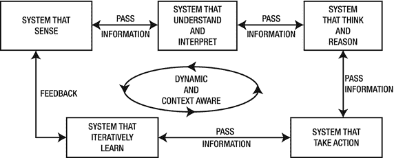
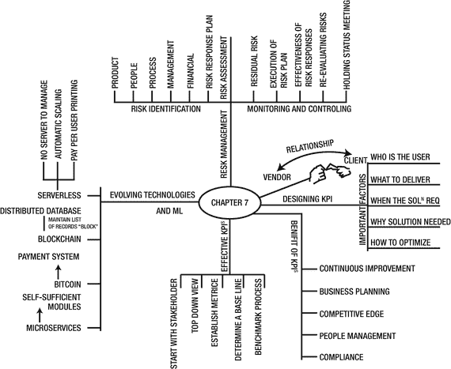

# 7.机器学习的创新、KPI、最佳实践等

本章通过强调传统商业模式如何变化以及新模式如何在主流行业和市场中占据一席之地来提供见解。它还简要介绍了“传统 It 供应商”如何采用新的思维模式，并押注于思维合作方式，而不是订单交付模式。范围从设置当前 IT 供应商转型状态的背景，到他们的采用策略，再到微服务和区块链等新兴技术。

这一章提供了一个观点，关于思维过程的伙伴关系如何在整个变化的场景中发挥作用。它还涵盖了机器学习生态系统环境中的风险、合规性、最佳实践和 KPI，并提供了一些关于这些技术将如何潜在地改变行业、领域以及最终世界的特征状态的见解。本章提供了用于识别跨领域和技术的一些 KPI 的准则。

这一章还强调了创新的过程和围绕它建立文化的重要性。这个讨论是非常相关的，因为最终是创新推动一个简单的、表现一般的组织成为表现最好的组织。尤其是在过去的几十年里，是创新让组织脱颖而出。例如，谷歌的无人驾驶汽车，亚马逊的云服务，以及特斯拉制造可重复使用火箭的使命，都奠定了它们在未来市场的地位。

## IT、机器学习、供应商、客户和不断变化的时代

在这个加速增长和动态决策的超现代时代，信息技术(IT)构成了所有以增长为导向的机构的核心战略投资的主要部分。因此，公司越来越依赖创新、技术和敏捷性来实现快速增长和成功。两位数增长的组织通常押注于其独特的产品、更高的生产率或专业知识的利基领域，并经常将纯粹的创新放在后面，直到竞争赶上他们，迫使他们将收入的很大一部分用于创新。

组织利用这段时间来清理大量的现金盈余或达到期望的规模水平，以吸引潜在客户和当前客户的注意。那些跨越了所有这些障碍并在积极完成中确立了自己地位的组织有一条更艰难的持续增长之路。因此，他们期待做一些新的事情，把创新放在驾驶席上。他们正在大力投资创新技术，如机器学习、大数据、物联网，并在产品/服务产品、业务流程和客户管理方面带来创新。

同样的趋势也出现在已经确立的导致组织成功的主要和次要过程中，直到是时候应对不断变化的时代。概念很简单。创新的任何延迟或失败都会导致组织的仓促死亡。最终客户和用户的选择越来越多，激烈的竞争迫使组织进行创新。

创新和自动化成为这些组织的增长动力，这有多种原因。这些参数成为增长的推动者，因为机器学习和大数据等创新技术需要传统技术(大型机)的新思维。此外，这些都有利于盈利、增长和生产率。创新不再是奢侈品，也不再是必需品。然而，创新需要成本和时间才能在组织中站稳脚跟。因此，最高管理层对其实施的承诺以及围绕其建立文化非常重要。这里提到了一些重要的行项目:

*   确保所有的创新想法都有平等的机会——对来源保持中立。
*   建立成熟的文化以及鼓励、监督和发展想法的能力。它来自从多种来源挖掘创新的潜力。
*   培养发现、评估、指导和酝酿具有商业价值的想法的能力。为它实现适当的过程。
*   建立一个框架和团队，能够对新想法做出早期投资决策。
*   让员工/合作伙伴参与到参与式练习中。组织必须鼓励他们挖掘自己的思维潜力。
*   为员工/合作伙伴建立一个强大且可持续的平台，让他们的想法得到奖励/认可。

在如此激烈的竞争中，组织寻找各种途径，抓住每一个可能的机会进行创新。他们要求并希望他们的员工、管理层、供应商、业务合作伙伴、渠道合作伙伴和其他利益相关者帮助他们创新。他们愿意帮助或支持利益相关者在各自的领域进行创新。因为 IT 和创新技术是增长的加速器，所以组织将最高优先级分配给 IT 创新。默认情况下，任何 IT 供应商现在都期望实现卓越的日常交付、成本降低、生产力优势和“接受订单并交付”的方法。任何只通过这些所谓的默认优势来增加价值的公司都将被称为 IT 供应商，而组织(尤其是大型组织)正在寻找能够展示优势的 IT 供应商，这些优势范围更广、思路更广、方法更大胆，并以可衡量的方式清晰地阐述业务价值。

这些组织被称为 IT 合作伙伴，他们将获得更高的报酬、更大的项目和更大的市场尊重。IT 公司必须不断地重新审视他们与客户合作的方法，并引入卓越的思维过程来迎合市场的知识和创新需求。这些公司必须将自己转变为“思想伙伴”。

其结果是产品和服务的共同创造。共同创造严格来说并不是指客户(主观上)和供应商拥有某些东西，而是指持续的合作，客户和合作伙伴共同努力创造卓越的服务和产品。例如，一般来说，供应商有很好的 R&D 和新一代技术测试中心的设置。此外，他们运行卓越中心和思想领导计划，而客户是以领域为中心的。因此，客户可以利用这些“服务或专业知识”,与供应商密切合作，创造出卓越的服务和产品。这种策略使供应商和合作伙伴/客户/利益相关者能够实时测试接入点，并向供应商提供即时反馈。持续协作是这一理念的基础。同样，同样的策略可以被用作反馈机制，并持续到最终的 APS(应用程序、产品和服务)被适当地交付给涉众。

除了常规的技术任务之外，组织将同时进行广泛的增强、升级、实施和其他具有重要战略意义的计划。将所有这些并行活动成功完成并进行清晰的投资回报衡量，将需要大量熟练的资源和管理时间。传统上，在大多数情况下，这些计划被分解成更小的工作块，并移交给多个供应商，从而导致不必要的协调问题、不合规问题以及成本和时间的增加。虽然这种典型模式在减少对单一供应商的依赖、多组熟练劳动力的可用性和风险分配方面有优势，但一个较大的合作伙伴可以利用他们的专业知识和能力独自提供所有这些优势。

客户必须非常仔细地选择他们的合作伙伴，检查他们是否有能力提供高端 IT/业务咨询和各种基本 IT 服务的完美组合。对于新兴的 IT 服务公司来说，这是一次巨大的升级，因为它们面临着在提供常规服务的同时提供高端咨询服务的巨大挑战，为了作为合作伙伴抓住客户的价值链，它们必须获得这些服务。这种模式不同于已存在多年的现有模式。然而，这是当前的需要，因为为了获得卓越，客户希望这种卓越融入他们工作文化的 DNA 中。

这种实现优势和获得卓越的愿望带来了对自动化、自动化的自动化以及智能和智能应用程序的需求，这些应用程序可以帮助组织以更少的人力资源管理他们的任务。它可以帮助他们提高效率和有效性，同时降低成本、增加盈利能力和投资回报。机器学习及其相关技术正好符合这一要求和愿望。此外，如果围绕机器学习生态系统的解决方案被创建和实现，那么就没有必要过度分配工作。一些例行和重复的任务可以很容易地由机器学习支持的智能解决方案来执行。然而，对于高度技术性的要求，仍然需要智能的劳动力和强大的基础设施准备，以及供应商可能是一个选项的其他因素。

构建机器学习解决方案侧重于基于技术、流程、人员和治理的方法。因此，需要及时采取适当的谨慎措施。它需要对现有的过程、度量、设计考虑和测量进行适当的评估。此外，在实现机器学习解决方案之前、期间和之后，需要遵循一些标准指南。否则整体的努力就白费了。

这些指导方针包括风险管理、确保资金、合规性和许多其他因素。以下是机器学习解决方案和策略的一些先决条件:

*   设计机器学习实现流程(从想法产生阶段到快速原型阶段)
*   设计机器学习项目和组织治理结构，包括相关人员的角色和职责
*   汇集设计推动者
*   支持实施机器学习解决方案和持续的项目管理
*   通过快速原型制造工厂实现创意孵化

## 为基于机器学习分析的领域设计关键绩效指标(KPI)

KPI 是通常与企业目标相匹配的可测量和可计算的指标。有不同的关键过程点会影响组织和项目的整体绩效。性能度量将有助于确保流程交付的东西与一组业务目标相一致，并满足涉众的期望。因此，KPI 应该被设计来衡量个人贡献者、项目和部门级别的活动。它们必须相互对齐。应该根据业务驱动因素和基准来确定和定义 KPI。应持续监控这些 KPI，以跟踪服务绩效。

最终，这些性能参数可以聚合为业务性能参数。在定义 KPI 时，五个 w:谁、什么、何时、何地和为什么(以及如何)将作为获得和实现效率的指南。设计 KPI 来衡量基于机器学习的项目/个人贡献/组织能力或单位绩效始终是一个巨大的挑战。但是，以下准则会有所帮助。从回答这些问题开始总是好的:

*   用户是谁？
*   企业要交付什么？
*   涉众何时需要解决方案？
*   利益相关者在哪里需要它，出于什么目的？
*   利益相关者为什么需要这个？
*   企业如何优化流程和技术？

绩效评估机制在帮助组织评估绩效和制定未来战略方面发挥着重要作用。它还有助于跟踪当前的性能状态。此外，由于大量的投资要求、上市时间和客户体验等因素，性能测量在大数据和机器学习等项目中变得至关重要。业务和运营的定期绩效评估是一项必须执行的关键任务。原因很简单，这一点至关重要。

例如，除非完成绩效监视和测量，否则不可能引入改进或控制措施。企业经常使用几种统计技术和方法来根据设定的 KPI 衡量绩效。衡量绩效的主要目的是:

*   了解业务、项目和运营在设定参数下的表现
*   将数据点合并到一个地方，以查看更大的图片
*   设定持续改进绩效的目标
*   进行主动规划和预测，以领先于竞争对手

定义关键 KPI 和绩效衡量的过程也有助于企业和决策者准备章程和制定扩张和未来增长的战略。任何 KPI 或绩效管理系统成功的强制性标准是它必须是现实的。它本质上不应是理论性的，因为如果那样，就不可能测量和报告与给定流程/操作无关的指标和 KPI。以下是与 KPI 和度量标准衡量框架相关的几点，在有效执行 KPI 时应予以考虑:

*   可能已与客户和供应商达成一致的任何合同义务
*   从人员、流程和技术角度来看很重要的措施
*   最高管理层希望看到的指标，例如，收入增长、同比盈利能力等。

### 使用平衡计分卡设计有效的 KPI

定义 KPI 和指标有多种方式。一个有效的方法是使用平衡记分卡法。在定义 KPI 和整体绩效管理系统时，平衡记分卡原则是有用和有效的。简而言之，平衡记分卡(BSC)是一种战略发展、规划、预测和管理方案，企业和组织使用它来:

*   传达他们想要达到的目标
*   将每个人的日常事务和常规工作与战略结合起来
*   对项目、产品和服务进行优先排序
*   衡量和监控战略目标的增长和改进

平衡记分卡技术不仅仅是根据预先确定的 KPI 来衡量绩效，它还可以帮助组织有效地制定或修改其战略。以下是 KPI 定义中需要遵循的基本步骤:

*   从包括客户在内的利益相关者开始:优先考虑对质量至关重要的客户期望。
*   自上而下的视图:从服务开始，并将其进一步分解到所涉及的最低级别。这提供了一个全面的观点。
*   建立关键的、一致的指标:这提供了仪表板上需要哪些指标的洞察力。
*   确定基线:确定当前状态是必需的，因为它提供了对当前过程中关键指标的洞察。
*   基准流程:确定谁在相同或相似的事情上做得更好。
*   设定目标:定义要达到的新参数。

在为任何流程定义 KPI 和指标时，应该记住的一些关键属性是:

*   相关性和有效性:为给定的过程选择相关的 KPI 是关键的方面之一。除非相关的关键绩效指标已经确定，否则绩效报告的目的将无法实现。
*   可控性:KPI 的定义应该以一种可以被测量和控制的方式来完成。它之所以重要，是因为流程及其操作的整体有效性在很大程度上取决于此。
*   完整性:KPI 应该尽可能量化。绩效指标本质上应该是完整的，因为除非所有相关方就关键 KPI 达成一致，否则很难衡量绩效。这种完整性将最终导致更高的准确性并产生期望的结果。
*   逻辑/一致性:KPI 和指标定义应该使用数学公式来完成。应该有一个有助于测量和整体性能验证过程的逻辑。

### 准备

在 KPI 和指标定义工作开始之前，还应注意以下要点:

*   KPI 将如何为当前和未来的客户/业务创造价值。
*   KPI 是否有助于衡量运营流程和 IT 系统的绩效，并有助于得出业务绩效的结论。
*   应该有深入的会议来开发、讨论和制定开发绩效管理系统的策略，包括 KPI 和指标定义。
*   沟通是一个非常重要的方面，在这项工作中发挥着关键作用。应与相关方交流已定义并达成一致的策略，以便所有各方达成一致。
*   在制定 KPI 时，考虑任何第三方或可能直接或间接参与提供部分服务的其他内部团队的角色也很重要。
*   甚至在引入 KPI 之前，将它们分发给所有相关方也很重要。改善业务是每个人的特权和责任。

### 测量类别

以下是平衡计分卡方法中一些重要的测量类别:

*   金融的
    *   销售和服务
    *   服务成本
    *   净资产收益率
    *   营业利润
    *   利润与收入的比率—服务产品的盈利能力
    *   营业费用对资本支出的比率
    *   营业费用对收入的比率
*   客户体验
    *   客户满意度
    *   产品质量
    *   可用性
    *   准确
    *   有效
    *   安全性
    *   功能质量
    *   及时
    *   首选访问:客户可用的渠道和接触点，如真人、网络和店面
    *   定价灵活性
*   内部业务运营
    *   流程再造
    *   单位成本
    *   时间
    *   缺点
    *   容量与需求
    *   简单
    *   流程灵活性和自动化
    *   资源利用
*   学习和成长
    *   保留
    *   劳动力多样性
    *   培训时间
    *   支出
    *   绩效评估
    *   员工满意度

### 克里斯的好处

以下是 KPI 的一些好处:

*   持续改进:通过高效的绩效管理系统，对流程、人员和技术的高效跟踪成为现实。此外，可以非常密切地跟踪客户体验和最终用户对所提供服务的感知。
*   业务规划和预算/收入预测:绩效评估使组织能够定期反思自己的绩效，并在不时修订预算和收入预测方面做出有意义的结论。这也可以被需求和计划团队用于未来的业务计划。
*   竞争优势:为了在竞争中保持领先地位，与市场中的竞争对手进行性能比较并不断升级变得很容易。
*   人员管理:员工在一个组织的成功和发展中起着重要的作用。目前，将奖金和绩效奖金与员工绩效 KPI 挂钩已经成为一种惯例。这也激励员工尽最大努力，并不断提高标准，尽可能提供最佳产出。
*   法规和标准遵从性:许多客户希望供应商遵从某些行业标准。符合行业标准和最佳实践的绩效管理系统将有助于符合监管标准。

KPI 有助于判断、衡量和改进一个组织的绩效标准，并且它们向下流动到所有部门。机器学习和大数据在技术上可能是领域不可知的。它适用于所有领域，无论是零售、制造、时尚还是任何其他感兴趣的领域。我们详细讨论了这一点。然而，看一个实际展示这是如何工作的例子是很好的。以下部分描述了零售行业中销售 KPI 的一个案例。

### 从特定组织和行业的角度来看，一些重要的 KPI

KPI 可以用来衡量几乎任何东西。这个讨论主要基于机器学习。本节包括一些重要的 KPI，这些 KPI 为组织提供了可衡量的收益，可用于创收。其他 KPI 衡量与机器学习行业视角相关的全球现象的重要方面。这有助于公司评估机器学习在其行业中的相关性和影响。

#### 组织/企业特定的机器学习 KPI

*   特定组织中使用机器学习技术的项目的百分比。
*   组织中使用的特定机器学习特定技术的百分比。例如，组织中有多少项目在使用 Mahout 或 AuzureML 女士。
*   组织中有多少产品、服务和应用程序是使用机器学习构建的，其中有多少是新的。还有，有多少是增强项目。
*   组织中机器学习项目的成功率是多少？
*   基于机器学习的项目人员效率与基于非机器学习的项目人员效能和效率的百分比是多少。

#### 特定于行业的 KPI

*   在零售、酒店、医疗保健、教育等领域使用机器学习和相关技术的公司百分比
*   在客户服务、销售和营销、金融、银行、保险和运营领域使用机器学习的组织的百分比
*   使用云、大数据分析、认知计算和机器学习的公司百分比

Stock and Customer Analytics KPIS

目标:降低成本，消除缺货和库存积压的不必要开支，了解重要的目标客户，鼓励忠诚度，并做出强有力的快速决策。

零售商面临着巨大的挑战，要实时跟踪商品，并通过优化供货使商品与库存位置同步。与所有利益相关者、物流和连通性保持持续联系是快速响应消费者需求的关键。跟踪季节性趋势和时尚风格可以确保顾客在正确的时间买到正确的产品。库存分析将改善与库存相关的决策。基于机器学习的分析可以通过实时评估畅销产品来实现快速发货。预测分析可以通过分析季节性销售数据、取消底部销售产品的发货以及更有效地与供应商沟通，帮助快速做出决策。

股票分析列表:

*   部门贡献
*   热门项目报告
*   库存百分比
*   库存周转率
*   线性英尺
*   降价百分比
*   拉通
*   重新分配
*   季节性购买
*   卖出去
*   几周的供应量

客户分析:

*   行为剖析
*   偏好建模
*   相似性跟踪
*   附着率
*   篮子寄存器相关
*   品牌转换
*   客户忠诚度
*   人口篮子
*   一揽子价格
*   每个篮子中的物品
*   收入贡献

### KPI 和指标之间的差异

区分 KPI 和指标至关重要。KPI 可以被认为是共同提供报告卡的度量。指标只是对活动的总结。一个医疗保健的类比更清楚，KPI 提供了一个人整体健康的细节，而指标包括测量病人的体温或呼吸急促。KPI 就像编程语言中的隐藏变量，它在后台存储值。

## 风险、合规性和机器学习

历史上充满了组织因欺诈和不合规而失败的例子。这是一个全球现象。例如，美国的安然公司、印度的萨蒂扬公司和韩国总统朴槿惠的欺诈案。任何级别的人都可能实施欺诈。它可能以误导会计实务的形式发生，或者由组织中的雇员向政府官员的一些大型军队武器交易提交错误的投资证明。

最终，所有这些错误的做法夺走了股东的财富。这也导致了人力的掺假，并有可能毁掉职业生涯。这些事件引发了对当前监管政策的修改，并导致了新法案(如萨班斯-奥克斯利法案)的出台，以实施更多的控制。ACFE 注册欺诈审查员协会的一份报告预测，高达 5%的企业利润因欺诈而消失。

尽管过去几年监管更加严格，但洗钱和金融丑闻仍在持续发生。金融行动特别工作组的一项预测称，每年有超过 1 万亿美元被洗钱。最近，金融服务业受到了越来越多的审查。因此，银行被指示采取全面措施来避免金融腐败。监管机构越来越需要机构加大监管力度，包括对反洗钱措施和实施进行更密切的监控。大多数这样的欺诈行为都没有被发现。在当今世界，欺诈检测变得更具挑战性，因为机器生成的数据量非常巨大。随着科技时代的时代变迁，诈骗分子总是领先一步。因此，使用老式的技术来连接这些点是没有用的。

检测洗钱的旧技术使用商业规则、神经网络或统计方法。模式识别技术也用于检测欺诈行为。为了产生有意义的洞察力，这些技术需要大量的历史数据。由于欺诈的性质可以在更广泛的类别中进行分类，已确认的欺诈行为的大型存储库是可用的，并用于训练这些受监督的技术(标签/输出是已知的)。但是，对于洗钱，没有可以学习的标记数据。还有，除了缺乏历史数据，每个洗钱案都是独一无二的。基于规则的系统对每个实体应用相同的逻辑，因为它们没有实时学习的能力。因此，根据旧的检测方法，洗钱的成功率很低。此外，部署遗留模型通常需要昂贵的硬件和数据库。即便如此，最终的解决方案也无法提供实时性能。

由大数据分析、物联网和机器学习支持的新一代异常检测技术正在改变风险、审计和合规性功能的工作方式。这些技术在知识产权盗窃、员工合规、欺诈性员工索赔、应付账款和保险索赔处理等领域变得非常有用。基于机器学习的系统的实现在熟练程度和识别高风险和不信任交易的能力方面提供了比以前更快的实质性改进。此外，它还使员工和职员(如后台和审计团队)能够专注于其他重要任务。他们可以更有成效地提出最终有助于调查和揭露新欺诈计划的想法。

与洗钱相关的历史数据并不容易获得，而且通常很少且不可靠。因此，在事先不知道要寻找什么的情况下，使用无监督的机器学习技术从数据中提取洞察力是至关重要的。从技术上讲，无监督学习使用渐进聚类、连接分析、关联学习和其他技术，使客户能够跟踪交易的不可预测性、实体交互和行为变化。

然而，要最大限度地利用无监督学习来检测洗钱，从多个来源收集和整合数据至关重要。只有这样，系统才能正确使用数据。一旦得到最佳实施，跟踪个人和洗钱/资产就变得容易了。一些需要监控的基本数据元素包括:

*   流入和流出
*   实体和账户之间的联系
*   帐户活动，如速度、数量和匿名
*   不活动账户的重新激活
*   存款组合
*   报警区域的交易活动
*   使用多个账户和账户类型

检测洗钱活动是一项复杂的任务，因此重要的是要应用一种技术，这种技术可以潜在地跟踪所涉及的每个人或个人或团体的行动，并将他们相互联系起来。在机器学习、虚拟现实和人工智能技术的帮助下，很容易分析每个特定实体(持卡人、商户、账户、计算机等)的行为。)和他们的活动，并对任何可能试图抢钱的人产生一个压缩视图。

组织执行基于机器学习的项目。他们负责很多活动。概括地说，这些活动被视为组织和项目级别的活动。从一个典型的中层管理者项目来看，具体的活动非常重要。从组织的角度来看，以及为了项目的完美执行，及时识别风险是强制性的。最终的组织愿景是通过项目获得成就感。

技术经理和团队的一个主要关注点是以最小的风险或没有风险来执行项目。由于风险投资组合的复杂性及其多维性，这并不容易。因此，正确的识别、分析、计划、评估和响应是最大限度降低风险的关键。

## 机器学习项目的风险和风险管理过程

风险会一直存在。因此，将适当的缓解计划附加到已识别的风险对于执行无风险项目非常重要。尽早识别风险并在项目的整个生命周期中跟踪它是非常重要的。识别、分析和实施风险始终是一项挑战。机器学习可能会使组织内的整个过程自动化。它开始发生在口袋里。然而，人工风险管理有其自身的重要性(至少到目前为止)。因此，下一节将对其进行简要介绍。图 [7-1](#Fig1) 显示了整个风险管理流程。

图 7-1。

Risk management process

### 风险辨认

风险可以有多种类型，它可以被团队的任何成员或组织中的任何人识别。拥有无风险的环境/项目/组织是每个人的责任。然而，本章的讨论仅限于项目风险(见表 [7-1](#Tab1) )。

表 7-1。

Types of Risk

<colgroup><col> <col> <col> <col> <col></colgroup> 
| 项目 |
| --- |
| 产品 | 人 | 过程 | 管理 | 金融的 |
| --- | --- | --- | --- | --- |
| 综合 | 培养 | 质量 | 客户/供应商/合作伙伴关系 | 服从 |
| 可量测性 | 有效 | 易处理 | 合作 | 机密的 |
| 可用性 | 培养 | 质量 | 进度和成本 | 合法的 |
| 表演 | 采用 | 可追踪性 | 金融的 | 进度和成本 |
| 安全性 | 技术知识 | 可测性 | 管理程序 | 价值实现 |

如果风险是由团队成员确定的，那么在记录风险之前，团队成员应该与他们的领导沟通这个问题，以确保情况符合项目风险的定义。如果风险得到验证，则应为风险分配一个所有者。所有者通常是对风险的解决感兴趣的人，或者是在风险成为现实时将受到主要影响的人。之后，进行风险评估。

### 风险评估

必须根据威胁发生的可能性和影响的严重性(如果发生的话)来评估整体威胁。这是在此阶段使用以下公式估算的:

风险敞口(RE) =概率 x 影响

评估完成后，将制定风险应对计划。

### 风险应对计划

这是在风险发生之前要实施的计划或行动过程。这消除或降低了风险发生的可能性，或者降低了影响(如果风险应该发生的话)。您必须确定降低风险的策略，并制定一套明确定义的步骤。以下是主要活动:

*   识别潜在的风险应对措施
*   选择风险应对措施
*   将风险响应添加到风险日志中
*   分配所有权
*   分配到期日

### 监控和控制风险

监控和控制风险在这个阶段完成。考虑以下任务来监控和控制风险:

*   监控剩余风险。这些是实施缓解计划后仍然存在的风险。
*   确保风险计划的执行。
*   评估风险应对的有效性。
*   重新评估风险。
*   举行情况会议。

## 机器学习的最佳实践

在机器学习的背景下，最佳实践非常重要。机器学习是一个非常专业化的领域。因此，它需要技术专长、卓越的流程，以及适当的方法和框架的正确和及时的应用。因此，最佳实践变得至关重要并占据中心位置。以下是一些重要的最佳实践:

*   确定您的需求并了解业务需求。
*   明确你的要求，并根据你的需要进行调整。
*   保持你的开发方法简单。
*   确定可靠的数据来源。收集想要的数据并消除噪音。
*   在使用算法之前对数据进行规范化。
*   根据您的需求确定合适的语言、框架和库。
*   定义培训模型的策略，包括硬件基础设施和许可。
*   定义执行策略，如并行和迭代的实现。
*   独立测试基础设施和软件，然后组合测试。这使得整体测试成为可能。
*   设计并创建一个合适的模型。此外，不要忘记这样的模式。
*   从一个独立的模型开始，以帮助测试。
*   并行训练多个单线程模型。
*   让你的代码具有可移植性，并尽量独立于环境。使用云环境是实现这一目标的最佳方式。
*   迭代您的模型来净化，并使它基于底层数据的变化而变得准确。
*   测量模型之间的出口。
*   业务问题会随着时间的推移而变化，因此要保持模型与需求保持一致。监控降低精确度的模型。
*   跟踪预测和预报。

## 不断发展的技术和机器学习

机器学习领域正以飞快的速度发生着许多变化。因此，很自然，多种支持技术将围绕它发展，以使它更好、更有效。然而，机器学习本身并不是这些技术成为主流的驱动因素。云、大数据、物联网和认知计算也是驱动因素。与最新的技术进步同步总是好的。考虑这些即将到来的技术:

*   无服务器:根据无服务器计算的概念，您可以开发、构建和运行应用程序和服务，而不必担心基础设施管理的问题。在无服务器环境(云基础设施)中，应用程序仍然可以在服务器上运行，但是所有的服务器管理都由供应商或云服务提供商完成。亚马逊是无服务器架构的先驱。亚马逊网络服务(AWS)通过 AWS Lambda 实现无服务器计算。AWS Lambda 运行用户代码，而不提供或管理服务器。Lambda 为您提供了虚拟运行任何类型的应用程序或后端服务的工具，它会处理运行和缩放(向上和向下)代码所需的一切，并具有高可用性。无服务器的优势有很多:
    *   无需管理服务器:用户无需担心基础架构管理问题，他们可以专注于功能。这也是无服务器模式也被称为功能即服务的原因之一。
    *   自动伸缩:根据应用程序的需求，应用程序伸缩将通过获取应用程序触发器(例如，一个事件)来实现。
    *   按用户付费定价:如果你使用服务 10 秒钟，你就要为 10 秒钟付费。
*   区块链:区块链是一个分布式数据库，维护着一个不断增长的有序记录列表，称为区块。每个块包含一个时间戳和一个到前一个块的链接。从设计上来说，区块链天生就抵制对数据的修改。一旦记录下来，块中的数据就不能再修改了。通过使用对等网络和分布式时间戳服务器，区块链数据库自主完成。从概念上来说，区块链可以定义为“一个开放的、分布式的分类账，能够高效地、以可验证的、永久的方式记录双方之间的交易”。分类账本身也可以通过编程自动触发交易。
*   比特币:数字货币和支付系统。粗略的说，就是开源软件。这意味着没有个人、企业或国家像没有人维护互联网一样维护这个网络。这是一个点对点系统，个人可以直接进行交易，而不需要银行、信用卡组织或票据交换所等中间系统或个人。比特币交易由一个节点网络测试，并记录在一个公共分布式账本中，被称为区块链。它也被称为区块链的货币。
*   微服务:基于层的架构告诉你将你的代码分成多个层，这样你就有了清晰的代码分离。因此它的执行和管理是容易的。例如，在三层架构中，您将核心分为三层——表示层、业务逻辑层和数据层——并实现清洁和分离。即使将代码分成不同的层，这些层在传递、处理、整合和呈现整体信息时仍然相互依赖。微服务提供了一种机制来解决这个问题，因为您可以根据功能划分应用程序，并在一个自给自足的模块中开发和部署各层，这样它们就可以独立工作。如果项目有客户、发票、CRM、SCM 和用户界面模块，您必须将每个服务分解成一个可独立部署的模块。每个模块必须包含自己的维护、监控、应用服务器和数据库。因此，对于微服务，没有集中式数据库的概念，因为每个模块都是自给自足的，并且包含自己的数据库。

## 摘要

本章讨论了供应商、客户和组织之间的技术关系。它还强调了创新在机器学习、物联网和认知计算背景下的重要性。简要讨论 KPI 后，讨论了风险和合规性。最后，本章概述了与机器学习相关的最佳实践，并阅读了一些关于机器学习不断发展的技术的见解，包括无服务器架构、区块链和微服务。

## 思维导图

