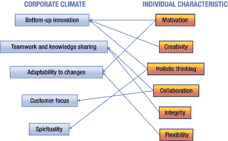
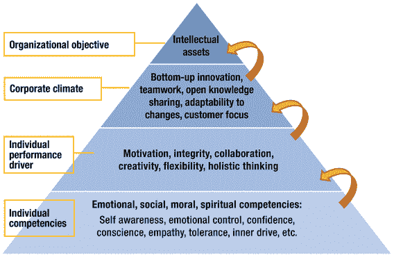
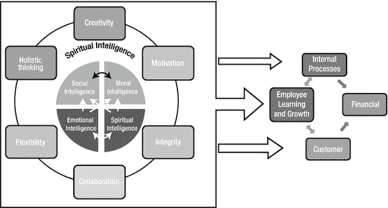
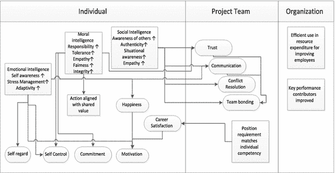
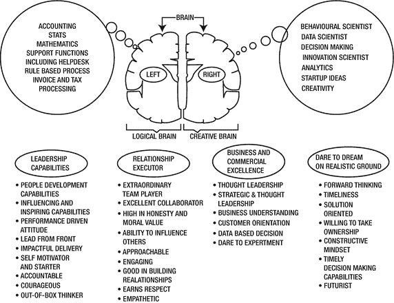
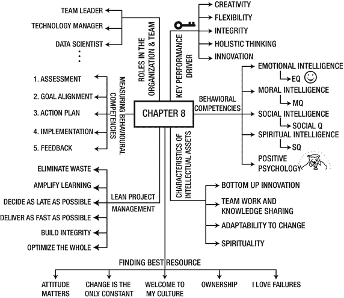

# 8.勿忘我:机器学习的人性一面

本章是所有章节的主宰，但它不讨论机器学习或相关问题。机器学习的书里一个不讨论技术的章节是如何成为所有章节的主宰的？简单明了的答案是，本章考虑的是在底层实现机器学习的人。这一章考虑了制定机器学习实现策略的人以及机器学习在组织中的未来。这一章很重要，因为它涵盖了如何管理机器学习项目和培训参与整个过程的人力资源。

简而言之，本章讨论了以下问题:

*   为什么社交和情商对机器学习团队很重要？
*   为了更好地计划和执行项目，团队成员应该具备哪些基本素质？
*   什么是精益项目管理原则？为什么在机器学习项目中需要它们？
*   像游戏化这样的创新技术将如何提高团队的生产力，为什么需要它们？
*   在机器学习项目中，你如何实现团队成员的最佳表现和承诺？
*   思考和创新领导的技巧是什么，为什么在机器学习项目中需要它们？

## 经济、工作场所、知识、你和技术

劳动力由人类及其复杂的社会、道德、情感、行为和心理互动组成。高技术技能不会自动产生高绩效，除非团队成员投入、积极并喜欢他们的工作。同样重要的是，他们能够处理压力和冲突，并在工作场所进行沟通和协作。

员工的价值观、技能、能力和目标与组织、客户/供应商以及技术方法哲学的一致性是实现卓越所必需的。事实上，许多学术和专业观点已经认识到在工作场所中意识到和管理情绪(情商，EI)的重大贡献。驾驭和促进社会关系的能力(社会智力，SI)和将普遍原则应用于个人价值观和行为的能力(道德智力，MI)通常会导致工作场所的成功。这样，可以实现组织效率和有效性。在高技术团队中，实现这些创新的激励方法变得非常重要。

在当前的知识经济中，许多人注意到企业市场价值创造向无形资产转移。早在 1995 年，以知识和信息处理为主要附加值的信息技术、医疗护理、通信和教育行业就占到了美国所有工作岗位的 79%和国民生产总值的 76%(Quinn，Anderson & Finkelstein，1996)。

扩大智力资产有巨大的潜力。通过以正确的方式利用员工的潜力，并充分利用员工的能力和他们的头脑，你可以最大限度地发挥员工的潜力。知识、批判性推理、情感、道德和社会能力，以及灵性都涉及到创造性和技术性的过程。大多数公司知道他们要求员工具备的技术技能和知识，但不清楚所需的情感、社交、道德和精神智能。

大量的研究结果表明，这些指标比智商更重要。丹尼尔·戈尔曼(Daniel Goleman)和丹娜·佐哈尔(Danah Zohar)在他们具有里程碑意义的著作《情商:为什么比智商和智商更重要》中，详细解释了这些能力和技能在职场中的重要性。随着时代的变化，公司开始意识到磨砺资源/人才的情感、社会、道德和精神维度对于最佳绩效非常重要。

机器学习及其相关技术是高度技术性的，因此它们需要创造力和创新方法。因此，一个能同时运用智力和心理能力的知识工作者比一个只有很好的数学技能的人有更大的成功机会。例如，一个数据科学家擅长解决问题，但不善于表达、展示和创造性地将分析与更大的图景联系起来，这可能不是一个组织的好选择。因此，组织和项目需要许多擅长数学、逻辑和解决问题的人，同时他们必须具备良好的沟通和社交能力。

同样，银行与账户持有人打交道，他们的数据库中有他们的财务数据。在这种典型的情况下，滥用这些数据是可能的，因为最终只有一小部分员工可以访问这些数据，因此，道德价值和伦理就成为了问题。技术和流程可以提供帮助，但只是在一定程度上。最后，处理这件事的经理是最重要的。如果员工在道德上很强，所有这些都会自动得到照顾。

精神智商基本上是了解一个人的核心潜力和欲望。它是关于找到一个人真正的意义、价值和生命的意义。这迫使人们去问一些基本的问题，比如“为什么”我要这样做。它的目的是什么？我适合这个吗？这些问题的答案非常重要，尤其是在像机器学习这样的专业领域。如果有人不适合某个特定的角色，不想做这份工作，就会妨碍到所有人。负面情绪会向四面八方扩散，从个人到团队再到组织。最终结果可能是灾难性的，包括项目失败。

半心半意的努力导致低效和无效的工作。反过来，质量差的可交付成果被交付给客户，这影响了组织的品牌以及创收和盈利的能力。此外，在即将到来的机器学习时代，任务和活动正在快速自动化，支持机器学习的 AP 正在成为主流，这些技能有助于员工和组织。这些任务可以自动化，但自动化情感和社交技能肯定不容易，如果不是不可能的话。

最新研究(麦肯锡公司:MGI-A-future-the-works _ Full-report . pdf)显示，拥有出色人际交往能力、社交智能和职业兴趣的人可能不太可能受到工作自动化的影响，因此也不太可能失业。这些独特的人类技能带来了灵活性和承诺。

总之，押注于高技术项目的组织需要谨慎选择人力资源。他们必须选择高度自我激励的人，这些人综合了技术和心理素质。只有当他们考虑除智商之外的情商、智商和情商时，这才有可能。好消息是这些品质是可以教授的。他们不像智商那样“固定”。他们可以通过适当的训练和积极的环境来学习。

Jargon Buster

*   情商(EI)和商数:以建设性的方式发现、实践、欣赏和实现自己的情绪，以释放压力、有效沟通、同情他人、克服挑战和解决冲突的能力。这种技能也使一个人能够识别和理解他人的情感感受。这主要是一种非语言过程，它影响思维，影响一个人与他人的联系。情商(EQ)是衡量一个人任何形式的情商的方法。测量可以以多种方式进行。一种方法是散发一份调查问卷。
*   道德智慧:以理性和移情的方式辨别是非的能力。它是拥有坚定的道德信念并积极行动的能力。它使一个人能够以正确和可敬的方式行事。道德智商(MQ)是衡量一个人任何形式的智力的方法。测量可以以多种方式进行。例如，这样做的一个方法是分发一份调查问卷。
*   社交智能(Social I):与他人联系并鼓励他们积极与你合作的能力。在一些文学作品中，它也称之为“人际交往能力”，但 SI 不仅仅是这样。社会智力是关于对情况的关注和对导致这些情况的社会力量的意识。这种能力使人们能够意识到沟通风格、策略、政策和实践，帮助他们在与他人和社会打交道的背景下实现预期目标。社交智能帮助我们获得洞察力和意识。社交商(Social Q)是衡量一个人任何形式的社交指数的方法。衡量它的一种方法是散发一份调查问卷。
*   灵性智能(SI):我们用来处理和解决意义和价值问题的智能，我们用来将我们的行动和我们的生活置于一个更广泛、更丰富、更有意义的环境中的智能，以及我们用来评估一个行动过程或一条人生道路比另一个更有意义的智能。SQ 是智商和情商有效发挥作用的必要基础。它是我们的“终极智慧”(Zohar & Marshall 2000，第 3-4 页)。精神商数(SQ)是以任何形式衡量一个人精神智商的方法。衡量它的一种方法是散发一份调查问卷。

## 知识资产的关键特征

本节将讨论促进智力资产创造的企业氛围的主要特征。这在组织层面以及单位和团队层面都是相关的。

### 自下而上的创新

创新在当今商业中的重要性怎么强调都不为过。知识创造有两种类型——通过组合以前不相关的元素(增量)或通过开发新的方法组合以前相关的元素。因为智力资产产生于组织的每个层面，所以创新也需要以自下而上的方式发生。整个组织的员工贡献改进和新颖的想法，完善各个层面的运营细节(增量)。这意味着巨大的、变革性的想法(激进的)。它依赖于两个有利因素——创新的组织文化和有创造力的个人。

### 团队合作和知识共享

如上所述，新知识的创造依赖于不同思想和知识的结合。因此，不同团体之间的交流越多，就有越多的专业知识和经验可以带入到创作过程中。事实上，知识在分享时会成倍增长。团队内部、合作伙伴之间以及通过外部知识库的共享和协作都可以加速增长。然而，由于最终产品是无形的，共享的有效性和可行性在很大程度上依赖于高道德标准、社会关系以及保护知识产权和信息安全的机制。

### 对变化的适应性

知识型组织的大部分优势来自于不断创造市场需求和及时跟进不断变化的需求。作为电子设备行业的一个著名例子，像苹果这样的创新领导者在短短几年内创造了一个不断扩大的智能手机市场。如果不通过提供自己的替代品或更具创新性的东西来适应新的需求，行业中的其他人就无法生存。为了继续创造价值，组织必须发现和适应最新的外部市场变化，在内部变化中保持质量的同时保持灵活性和快速行动，并能够管理每次变化带来的巨大压力。

### 客户导向

对于今天的知识型企业来说，产品质量不再是客户唯一关心的问题。整个服务体验都在发挥作用。无论是识别和满足客户的未来需求，还是卓越的沟通体验，甚至是组织行为中表现出的社会责任和诚信，这些都可以产生大量的无形资产。只有通过提供卓越的客户服务体验，企业才能获得独特的身份和声誉，建立信任关系，从而赢得竞争优势。

### 灵性

该领域的研究人员和专家已经认识到，员工需要在工作场所找到意义和目标。这一点不能再被低估了(Danah Zohar 和 Ian Marshall: SQ:灵性智能，终极智能)。在这里，灵性指的是一个人的自我与他的精神追求、知识和社会/自然环境之间的和谐。当员工与真实的自我联系在一起并获得自由，并且能够从不同的角度整合知识时，他们就会获得创造的动力和灵感。当员工将他们的工作视为对社区或社会的更高目标做出贡献的一种方式时，组织的高度精神性也会对客户的体验产生积极影响。

## 个人的关键绩效驱动因素

要形成上一节所分析的理想企业氛围，每个员工需要具备什么条件？通过了解企业氛围的各个方面，可以总结出个人的六个绩效驱动因素，如图 [8-1](#Fig1) 所示。

图 8-1。

Key Performance drivers of individuals

### 测量智力

图 [8-1](#Fig1) 中列出的个人绩效驱动因素是复杂的技能组合，需要整合个人的情感、道德、社会和精神能力。表 [8-1](#Tab1) 显示了一个人的心理能力如何协同工作，以实现期望的动机、灵活性、完整性、创造性协作和整体思维技能。

表 8-1。

Emotional, Moral, Social, and Spiritual Competencies for Personal Performance Drivers

<colgroup><col> <col> <col> <col> <col> <col> <col></colgroup> 
| 能力指标 | 动机 | 完整 | 合作 | 创造力 | 灵活性 | 整体思维 |
| --- | --- | --- | --- | --- | --- | --- |
| 情感能力 | 自信、情绪意识、情绪管理、持续动机、耐力、成就动力 | 控制情绪和冲动，对自己的价值观和原则充满信心 | 健康的自尊、乐观、控制冲动 | 乐观，情绪管理，自信 | 压力管理，情绪和冲动控制，稳定的自尊 | 情感意识 |
| 社交能力 | 激发/管理他人的情绪 | 同理心，理解复杂的社会关系 | 同理心、情境雷达、解决冲突、变革催化剂、将他人推向自己、响应、真实性、真诚 | 自我表达，影响他人 | 建立纽带，有效沟通，情境雷达，解决冲突 | 移情，情境雷达 |
| 道德能力 | 责任，自我控制 | 道德判断，反对不公正，信守承诺 | 尊重，宽容 | 社会责任 | 容忍 | 社会责任，将普遍原则应用于个人行动 |
| 精神能力 | 自我理解，获得深层价值和意志，内心和谐，追求目标 | 服务和给予的内在驱动力，获得自我的深层价值，寻找意义并被愿景所引导 | 拥抱多样性、爱和团结 | 自发性和活力，寻求真理，好奇心，观点的灵活性 | 时间管理，观点的灵活性 | 看到基本和本质，爱和与自然/宇宙的统一 |

组织发展员工情感、道德、社会和精神能力的目标和动机是创造智力资产(见图 [8-2](#Fig2) )。该图展示了获取情报并对其进行测量的最终目标。它的目标是通过调整组织目标和企业氛围来提高员工的整体绩效，进而为组织提供竞争优势。

图 8-2。

The hierarchy from employee emotional, moral, social, and spiritual competencies

测量很重要。EI，SI，MI 本质上都是很主观的。它不像 2+2 = 4。因此，为这些能力定义关键绩效参数是成功的标准之一。基于表 [8-2](#Tab2) 至 [8-5](#Tab5) 中说明的能力和参数，有多种方法来衡量资源的绩效。例如，一种测量方法是创建一个调查问卷。问卷包含特定的问题，每个问题都有权重。

表 8-5。

Highlights of the Key Performance Parameters for Social Intelligence

<colgroup><col> <col> <col> <col></colgroup> 
| 关键社交智能性能参数 |
| --- |
| 神入 | 有效沟通 | 影响他人 | 积极心理学 |
| --- | --- | --- | --- |
| 对他人的关切和感受感兴趣。理解他人的感受、关切和观点能够通过融入他人的需求和感受来调和相互冲突的观点了解人际关系中的规则和规范自我定位和理解(一般和特定情况下)判断他人的个性理解复杂的社会关系设计在当前社会环境下最有可能成功的策略 | 自信提供反馈真实、真诚表达自己的感受表达同情良好的倾听技巧 | 印象管理让他人向你靠拢改变催化剂激发/管理他人的情绪建立纽带 | 许多研究已经证明，积极的情绪与改善健康、延长寿命和更好的健康状况相关联。然而，长期的愤怒、焦虑和攻击性会增加患心脏病和其他情绪障碍的风险。个人对这些感觉的反应是血压升高和血管增厚。然而，始终保持健康、积极的情绪状态并不容易。其中一个原因是个人，通常会错误地估计什么会让他们快乐和满足。积极心理学是心理学的一个分支，研究人类行为的积极方面，并可以扩展到组织和生活。它实际上将快乐和正念的影响与个人的内在力量联系起来。实践它能使个人找到幸福和快乐。有多种方法来评估和改善它，包括自我评估测试和练习，帮助最大限度地提高一个人生活中的积极情绪。机器学习项目团队正在经历压力，因为他们正在处理大量数据和紧张的交付线的挑战。因此，组织必须让拥有这些技能的员工能够更好地应对这些情况 |

表 8-4。

Highlights of the Key Performance Parameters for SI

<colgroup><col> <col> <col> <col></colgroup> 
| 关键精神智能性能参数 |
| --- |
| 自我整合 | 知识整合 | 爱和团结 | 一些额外的 SQ 质量 |
| --- | --- | --- | --- |
| 获取自我的深层价值和意愿整体性:理解/评估自我的倾向、能力和相对于世界的地位目标追求和愿景引导的内心意愿和现实和谐同情心:具有“感同身受”的品质和深切的同理心赞美多样性:尊重他人的差异，而不是无视差异积极利用逆境:从错误、挫折和痛苦中学习和成长 | 寻求真相并保持好奇心看到根本和本质观点的灵活性时间管理重构的能力:从一种情况或问题中退一步，看到更大的画面或更广泛的背景 | 与人和自然/宇宙一起服务和给予的内在动力同理心竞争力谦逊:有一种在更大的戏剧中扮演角色的感觉，对自己在世界上的真实位置的感觉倾向于问基本的“为什么”问题:需要了解事物并弄清它们的真相 | 自我意识:知道自己的信仰和价值观，以及什么能深深激励自己。自发性:活在当下，对当下做出反应。以愿景和价值为导向:根据原则和深刻的信念行事，并据此生活。整体主义:看到更大的模式、关系和联系；有归属感。场独立:站在人群的对立面，有自己的信念。使命感:感觉被要求去服务，去回报。 |

表 8-3。

Highlights of the Key Performance Parameters for MI

<colgroup><col> <col> <col> <col></colgroup> 
| 关键道德智能性能参数 |
| --- |
| 完整 | 责任 | 尊重 | 容忍 |
| --- | --- | --- | --- |
| 按照普遍原则、价值观和信仰行事说出真相反对不公正、腐败等。信守承诺 | 致力于执行分配的工作为决策和行为的结果负责，尤其是错误承担责任为团队/组织的福利承担责任社会责任 | 尊重并关心他人的感受、工作、文化和福利礼貌对待他人不伤害他人公平对待他人 | 妥善处理建设性批评容忍不同意见容忍不同的能力和个性原谅他人的错误 |

表 8-2。

Highlights of the Key Performance Parameters for EI

<colgroup><col> <col> <col> <col></colgroup> 
| 关键情商表现参数 |
| --- |
| 情感自我意识 | 情绪管理 | 自我态度 | 动机 |
| --- | --- | --- | --- |
| 意识到正在经历的情绪了解情绪如何与个人的思想和行为联系起来了解情绪如何与个人的价值观和目标联系起来洞察环境因素是如何触发情绪的 | 冲动控制控制负面情绪:痛苦、嫉妒等。需要时有意识地激发和保持情感心理适应变化压力管理乐观 | 对个人价值观和原则的信心对个人能力和判断的信任自尊:不低于/高于他人自尊的稳定性考虑环境因素:专业知识和对该领域的熟悉程度 | 成就需求推动自我提升保持动力/耐力考虑环境因素:管理层、团队、对特定项目/团队/领域的承诺/兴趣 |

最后，将所有权重相加，得到一个综合得分。这些分数将表明资源的哪些方面需要改进，以及员工在哪些方面表现良好。在资源需要改进的领域，通常会附上一份培训计划，并提供适当的培训。另一种方法是提供绩效指导来微调资源。对所有能力重复同样的练习:

*   评估:
    *   了解自己和他人的优缺点
    *   关于情绪智力、智力、社会智力和精神智力的定向讲习班
    *   与团队讨论和分享
*   目标一致
    *   内省:将实际自我与理想自我和团队目标结合起来
    *   团队讨论共同价值观和目标一致性
    *   跟踪系统的输入
*   行动计划
    *   新行为的建议
    *   行动计划的记录
    *   在论坛上分享
*   履行
    *   结对练习新行为
    *   寻找和建立教练关系
    *   跟踪进度

本节介绍的整体智能和能力不仅限于团队成员的“唯一”改进。它的应用和范围非常广泛。图 [8-3](#Fig3) 展示了情感、社交、道德和精神智能的综合全面的观点，并表明这些能力适用于几乎所有领域，包括财务、客户满意度、内部流程以及员工学习和成长。所有这些领域实际上都是平衡记分卡方法的一部分，平衡记分卡是衡量组织及其员工绩效的方法之一。然而，它可以扩展到测量几乎任何东西，包括一个人的生活活动的表现。

图 8-3。

Holistic and comprehensive view of emotional, social, moral, and spiritual intelligence, and their diverse application areas

### 这些能力的优势

让个人具备这些能力对组织的各个层面都有帮助。它们为个人、项目团队和组织带来好处。图 [8-4](#Fig4) 简要介绍了这些优势。

图 8-4。

Snapshot of benefits provided by the multiple type of intelligence

一些想法:

*   EI，社会 I，MI 和 SI 对人力资源的绩效有意义的影响。
*   EI、Social I、MI 和 SI 的增加通过客户满意度与盈利能力相关。
*   EI、Social I、MI 和 SI 可以反复灌输提高客户满意度的服务质量。
*   这些能力可用于改善团队绩效和人类行为的所有方面，包括智力能力。
*   管理科学、人力资源开发、组织行为和工业心理学的理论和实践可以与这些能力相结合，并可以通过正确使用适当的方法和框架应用于团队。
*   这些能力可以与游戏化、讲故事(自动和手动)和概念漫画相结合。反过来，这些可以用来提高软件开发和支持团队的效率和有效性。

Gamification

游戏化是让游戏科学在非游戏环境中发挥作用，以获得所需行为的过程。聪明的游戏化利用了人类天生的激励因素。

游戏化的一些亮点:

*   组织总是发现很难吸引员工、吸引客户并为用户提供良好的服务交易体验。据估计，这个问题每年给企业造成数十亿美元的损失。好消息是，游戏化在这里是有帮助的，因为它以独特的方式利用了人类的心理。
*   嘉德报告指出，全球性组织正在使用游戏化，并成功地从中获取商业价值。

漫画和游戏化

漫画被企业用来直接(作为一种广告和营销形式)或通过漫画中的产品植入来推广他们的产品和服务。组织也可以使用漫画来阐明如何使用应用程序/产品/服务，因为它们易于使用和理解，最重要的是在交互过程中涉及大脑的两个半球。因此，与基于文本的解释相比，用户参与度更高。最新研究证实了视觉在互动或广泛交流中的重要性。(Scott & Vargas，2007 年，第 342 页)并且在他的研究中提到纸箱传达了更多的细节，类比于“写得更详细”。许多企业开始使用漫画来教育员工有关内部组织程序和流程。此外，他们用它们来以更吸引人的方式解释技术细节。因此，游戏化和漫画可以用来实现员工激励、客户忠诚度和服务改进。它们可以用来以更好的方式管理项目，并通过游戏化的使用使项目无风险。

企业讲故事

为了娱乐、参与、教育和启迪而讲故事并不是一个新概念。企业讲故事的哲学与旧式故事相似。然而，关键的转变是你利用它们来鼓励应用/产品/服务或推广品牌。故事一般以文字的形式出现。然而，为了讲述一个关于企业/组织/公司的好故事，也可以使用视频。故事可以自动出现，也可以手动出现。故事的形式取决于基础设施、预算和其他资源的需求和可用性。

## EQ、SQ、MQ 和 Social Q 以及建立一个高效的 ML 团队

本章讨论的 MQ、SQ 和其他类型的智能有助于建立世界级的机器学习团队。世界级的技术团队需要勇气、毅力和处理不确定性的能力。此外，给团队成员一个自由是一个有效和高效团队的强制性标准之一。

从机器学习的角度考虑建立一个伟大团队的一般标准:

*   高级管理人员参与建立团队
*   高级管理层的持续支持
*   团队目标与组织愿景和使命的一致性
*   机器学习团队必须由商业和技术专家组成。因为在进行技术实现之前，需要了解需求和业务。
*   团队必须能够在跨职能的环境和情况下工作。
*   团队可以自由发展自己的工作方式和创造内部角色。
*   关于如何衡量团队和团队成员的成功的明确指导方针。
*   团队成员和领导者必须根据多样性、知识和能力来选择。
*   团队必须是新从组织外部雇佣的人和已经在团队中工作的人的混合。这给了团队不同的视角。
*   持续学习、有效的知识管理和开发环境。
*   适当的沟通流程和基础设施可用性。
*   团队、领导者、经理和团队成员的适当奖励和认可机制。必须在各个层面上重视附加值。
*   重复、及时、有效的反馈和绩效评估机制。
*   发展技术、团队技能、解决问题和决策的适当培训。
*   福利和健康框架与团队成员保持一致。
*   清晰定义的 RASCI 矩阵。RASCI 矩阵是团队/组织/项目中角色的负责、问责、支持、咨询和知情属性的表格表示。
*   必须知道如何进行视觉交流。他们必须通过图表、信息图、动画和报告向利益相关者传达他们对数据的见解。单纯的原始事实在商业中毫无用处。
*   团队成员必须有好奇的头脑，他们必须能够回答问题的方式、内容和原因。
*   简而言之，团队以及团队成员必须处理数学、统计、计算、编程、数据管理以及积极的心理、沟通和变革管理技能。

在一个组织中，一个团队有多个维度，包括多个角色。讨论几个重要的角色和他们的品质是很好的。一些角色——如组织领导、决策和数据科学家——需要充分有效地使用大脑的两个半球。因此，图 [8-5](#Fig5) 从脑科学的角度展示了这些技能和角色是如何匹配的。以下部分讨论了每个团队中的关键角色。

图 8-5。

Brain science

### 队长

一个好的团队领导必须:

*   与业务视角和问题保持一致。
*   了解公司的组织层次框架、流程和目标。
*   与团队面临的技术、流程和人员问题保持一致，并能够解决这些问题。
*   具有良好的领导能力和中级管理技能。
*   具备良好的项目管理技能。
*   具有良好的解决问题、解决冲突和团队管理技能。
*   具有良好的协作和沟通技巧(包括人际和人际技巧)。
*   充满激情，有创造力，有创新精神。
*   自我激励，擅长时间管理和行政工作。
*   了解业务。
*   能够领导和指导多学科的技术专家团队。
*   擅长统计分析技术和数学概念。
*   熟悉敏捷软件开发方法，如 SCRUM 和极限编程。

### 技术经理

优秀的技术领导者必须:

*   具备优秀的沟通能力。
*   用透明和诚实来领导。
*   用明确的方向支持员工，为他们清除障碍。
*   拥抱科技。
*   用积极的反馈和认可来激励。
*   成为该领域的专家。
*   高效冷静地调解。
*   促进跨级别和跨职能的协作。
*   创造一个富有成效和生动活泼的工作环境。
*   相信她的员工。
*   对机器学习项目有经验，能够区分正常的技术项目和机器学习项目。

### 团队成员

一名优秀的团队成员必须:

*   在工作中技术高超。
*   具备多任务管理技能。
*   能够做个人和群体决策，并擅长冲突管理。
*   虚心接受反馈。
*   善于计划和组织。
*   善于解决问题，具有分析和数学技能。
*   具有良好的协作和沟通技巧。
*   能够采取主动。
*   要灵活。
*   对数据处理充满热情
*   善于采纳概念。
*   擅长处理非结构化数据，能够做分析。
*   了解高级计算和多线程编程模型。
*   了解敏捷软件开发方法。

### 组织领导者

一个好的组织领导者必须:

*   具有良好的社交、道德、伦理和情商技能。
*   做一个有决心并有能力激励他人的有远见的人。
*   要诚实，要有自知之明。
*   善于做决策。
*   采取有责任的行动。
*   在工作中保持高效、创新和深思熟虑。
*   能够简化事情，并以可理解的方式交流/展示信息。
*   对工作、生活和自我有积极的看法。
*   在工作中要现实。
*   有清晰的思维和良好的判断能力。
*   保持警觉和体贴，表现出敏感。
*   能够以身作则。
*   渴望卓越，渴望把事情做好。
*   具有优秀的指导和激励技能。
*   做一个好的倾听者和强有力的执行者。
*   对业务、流程和人际技能有很好的理解。

### 领导者和管理者的区别

世界级的团队建立在领导者提供的方向和指导方针上，在基层，由项目/开发/支持/技术经理管理。有些时候，人们会对这些角色之间的分界线感到困惑，并错误地认为这些是同一个角色，并将它们互换使用。然而，这两种角色之间有着巨大的差异:

*   管理者负责管理，而领导者则负责创新和鼓励。
*   管理者总是执行并继续现状；然而，领导者总是在发展。
*   管理者关注系统、过程和结构；领导者关注人和他们的能力。
*   管理者依赖控制；领导者激发信任。
*   经理目光短浅，相信把事情做好；领导者有长远的眼光。
*   经理的眼睛总是盯着底线；领导的目光在地平线上。
*   经理复印；领导者创造。
*   经理接受现状；领导者挑战它。
*   经理是经典的好兵；领袖是他自己的化身。
*   经理把事情做对了；领导者做正确的事情。

## 如何为机器学习建立数据文化

机器学习项目本质上是技术性的。然而，利益相关者的行为方面也起着重要的作用。基于机器学习的项目和组织中最重要的方面是数据。因此，预计基于数据的文化将在项目和公司内部得到发展。这方面的经典例子是亚马逊和网飞，它们是各自领域的先驱。以下是在组织中建立和培养基于数据的文化的一些准则:

*   对你的团队(几乎每个人)进行数据动力学、数据经济学和统计学的培训。向利益相关者提供关于这些问题的复习课程。
*   向利益相关者提供领域、信息流、数据流、存储能力以及外部和内部数据源的知识。
*   确立并教育利益相关者了解组织内外数据的重要性。
*   向深层的相关人员和 200 英尺高度的松散耦合人员解释技术。这必须包括架构。
*   领导者必须参与项目。
*   必须给予人民适当的奖励和认可。
*   鼓励各级的研究、创新和思想领导。
*   知识共享会议必须融入组织的 DNA。
*   创造一种共享成功的文化，将人们聚集在一起。
*   团队不应该为组织政策和变化而烦恼。从本质上讲，他们应该摆脱组织官僚和等级制度。
*   为团队配备最新的技术和工具。给他们有挑战性的工作，鼓励他们解决问题。
*   鼓励团队在内部和外部论坛上发布他们的工作，包括会议、申请专利和撰写白皮书。

除了这些一般的区别性品质，以下几点是机器学习团队和团队成员的一些“必须具备”的特征。

*   他们必须具备处理数据的科学技能，擅长统计、数字、问题解决、分析、数据处理和建模技术，并具有流程研究和创新思维。
*   接触处理大量数据，了解不同来源的数据和收集技术。
*   了解与机器学习相关的工具、框架和库。
*   了解业务流程、公司具体政策和商业术语。
*   在数据可视化工具的帮助下，能够以简单的方式向外行观众展示复杂的想法。
*   具有灵活性、适应性、学习能力、创新能力和自我激励能力。

团队是一个复杂的实体，因为它以人为中心。因此，管理团队始终是一项挑战，满足团队的组织需求是一项重大责任。每个团队成员都想超越自己。如果周围的环境支持他们，他们总是想表现得更好。他们有一些问题。如果提供了正确的答案，这将激励他们更好地工作。侧边栏包含每个团队成员都希望得到回答的问题列表。如果这些问题得到正确的回答，它会带来全面的透明。

Questions For Bringing Transparency to the Team and Enterprise

团队应该解决什么样的业务挑战？谁选择团队领导？团队与其他组织单位的关系如何？谁给团队成员分配工作？团队成员和团队领导的角色和职责是什么？团队成员和团队领导的角色和工作描述是什么？团队成员和领导者的选择标准是什么？团队成员和领导者需要哪些技术、工具和编程语言？相对于他们的其他职能职责，个人将如何分配他们的时间给团队？谁来衡量团队成员的整体绩效，衡量标准是什么？团队成员和领导者的评估周期是什么？团队的最佳规模是多少？谁确定团队的优先级？谁管理团队与组织中其他区域的边界？虚线汇报结构意味着什么权力和责任？如何解决跨职能和跨文化的冲突和优先事项？

什么过程有助于团队提高生产力、效率和有效性？团队如何改善内部和外部沟通？团队应该多久开一次会，他们应该以什么形式分享会议记录？团队住在哪里？如果面对面的会面不可行，他们如何会面？有哪些沟通协作的技术手段(视频会议)？团队需要制作哪些报告，谁是受众？哪些过程可以用来帮助团队成员不断发展和改进？团队价值是什么？

团队是如何被激励的？如何提高团队忠诚度？应该如何衡量团队成果和个人绩效？谁来评估团队成员，标准是什么？个人和团队绩效如何与公司绩效和工资挂钩？

有什么培训项目来发展技能？

最终，目标是将团队成员与更高的价值和组织的愿景结合起来。在处理了这里提到的技能和能力之后，个人和团队在交付和创造高质量产品以及处理团队动态方面变得非常高效。他们实现个人和组织的有效性。图 [8-6](#Fig6) 描绘了这一过程。

图 8-6。

Effectiveness

### 机器学习的特定角色和职责

一个好的、成功的项目至少在人才层面上需要技术和行为能力的结合。因此，还有许多其他因素需要考虑。像业务领域知识、挑战现状和资源中的视觉沟通技能等因素同样重要。一个成功的机器学习团队包含一些典型的角色，自然也有一些与这些角色相关的职责。现在，在对一般角色和职责进行了更广泛的讨论之后，是时候总结一下机器学习世界中存在的实际角色了。

这些信息有助于决策者/经理雇佣最适合他们项目的人。这也将帮助组织创建和组织一个有效的团队。让我们快速看一下一些重要的角色。

#### 角色 1:深度学习/机器学习工程师

典型名称:

*   他们很有创新精神，总是在思考。他们擅长解决问题、分析数据和编程。

与此指定相关的角色和职责:

*   利用已建立的统计理论、框架、库和分析方法，收集、分析、理解和解释数据的定性、数学、统计和定量方面。
*   能够开发创新的、直观的、面向客户的用户界面。
*   通过 API 向数据科学家提供数据(另一个/名称)。数据科学家反过来使用它们进行查询。
*   从原始数据中获得有用的见解，并且“必须”拥有大数据方面的工作经验

技能和才能:

*   能够在特定的业务场景中应用既定的算法。ML 特定库的知识。
*   能够理解不同机器学习算法的优缺点。
*   预测建模、机器学习和数据挖掘技术的知识。
*   了解数据库技术。
*   了解机器学习友好的编程语言，如 R、Python、C/C++、SQL 和 NoSQL。
*   能够做情绪和假设分析。
*   了解面向对象编程，包括多线程和高性能计算环境。

心理和行为技能:

*   冷静沉着，勇于创新，富有创造力。
*   逻辑天才，情感和社交智能。
*   理解商业术语和整个企业的能力。

找到机器学习工程师的最好方法是找到一个你可以在你的组织中培养的高质量的数据工程师。为此，你必须找到一个好的工程师或开发人员，并在特定的机器学习技术和技巧上培训他或她。另一种方法是通过求职网站找到他们。如果公司同意雇佣自由职业工程师，也可以通过这种方式找到他们。

#### 角色 2:数据科学家

典型名称:

*   好奇、分享和分析数据并能发现趋势的人。此外，他或她可以识别异常和数据关联。数据科学家通常擅长检测数据模式和相关性。通常，他们可以平衡研究和业务成果。它们跨越了统计学、数学、工程学、心理学、社会学、语言学和商业管理等多个学科。

与此指定相关的角色和职责:

*   使用已建立的统计理论和分析方法，分析、理解和解释数据的定性、数学、统计和定量方面。
*   解决业务/数据学习问题。创建 ML 解决方案以实现组织目标。
*   清理现有的原始数据并建立模型来预测未来发生的事情。
*   从多个角度看数据，并从中找出道理。

技能和才能:

*   分布式计算和数据可视化知识。
*   能够理解不同机器学习算法的优缺点。
*   预测建模、机器学习和数据挖掘技术的知识。
*   了解数据库技术。
*   了解机器学习友好的编程语言，如 R、Python、C/C++、SQL 和 NoSQL。
*   了解面向对象编程，包括多线程和高性能计算环境。
*   数据挖掘和数据仓库的知识。
*   对人工智能、深度学习和神经网络的整体理解。
*   高性能、自然语言处理和分布式计算方面的经验。

行为和心理技能:

*   冷静沉着，勇于创新，富有创造力。
*   逻辑天才，具备情绪和社交智能能力。
*   理解商业术语的能力。
*   能够理解企业使命、愿景和战略以及相关的关键绩效指标。

高质量的数据科学家不容易找到。因此，找到他们是一项艰巨的任务。你可以通过工作门户或推荐找到有经验的数据科学家。然而，它们通常是昂贵的。另一种选择是从学术机构和大学雇佣他们。候选人必须拥有计算机科学、数学和统计学的高等学位。博士优先。此外，候选人可能来自空间科学、生物信息学或神经科学等领域，这些领域需要大量的数据处理和任何分析技能。一旦这些候选人被录用，针对机器学习和项目要求的培训将会很有帮助。

#### 其他重要角色

除了这些重要的角色，在机器学习团队和组织中还有许多其他角色。其中一些是如此不寻常，我们从来没有听说过。技术角色需要或多或少相同类型的能力。因此，本章不会详细讨论每个角色。然而，简要地看一下它们是有好处的。

<colgroup><col> <col> <col></colgroup> 
| 分析实践领导者 | 数据架构师 | 商务智能分析师 |
| --- | --- | --- |
| IOT 专家 | 数据卫生员 | BI 解决方案架构师 |
| 机器学习教练 | 数据挖掘者/统计师 | 大数据研究员 |
| 机器学习专家 | 元数据管理员 | 大数据解决方案架构师 |
| 信息架构师 | 数据建模器 | 大数据可视化专家 |
| Hadoop 开发人员/工程师 | 可视化工具开发人员 | 预测分析开发人员 |
| 大数据加载专家 | Java 开发人员 | OLAP 开发商 |
| 算法专家 | 机器学习研究员 | 创新领先 |
| ETL 架构师和开发人员 | 安全和档案专家 | 更换领导 |
| 基础设施专家 | 应用开发者 | 实验分析师 |
| 项目管理人 | 技术经理 | 开发经理 |

这个列表并不完整。然而，它应该从机器学习的角度让你对组织中存在的相关角色有所了解。除了这些角色，还有许多其他的“领导和决策者”角色。现在让我们也来看看它们。

首席执行官:企业中最高的决策职位。他们的主要职责包括做出商业决策。他们负责管理企业的全部运营和资源(包括资金)。他们通常充当董事会和公司运营部门(包括高管)之间的主要沟通点。以下是典型的首席执行官的主要指导。

*   CRO——首席风险官:与本组织风险相关的风险做法和政策制定方面的最高权威。该角色定义并提供了在企业级实现风险策略的路线图。
*   CFO——首席财务官:提供和管理组织的财务路线图和战略的领导者。首席财务官对组织内外负责，尤其是对利益相关者。
*   CMO——首席营销官:营销实践和与这些营销战略相关的政策的最高权威。定义并提供了在企业级实现的路线图。
*   CIO——首席信息官:组织在信息技术实践和政策制定方面的最高权威。定义并提供在企业级实现 IT 战略的路线图。
*   首席分析官(CAO ):整个组织内与商业智能相关的政策制定方面的最高权威。广泛负责分析相关活动，包括大数据和机器学习相关策略。定义并提供了在企业级实现的路线图。
*   首席运营官——首席运营官:为组织制定运营战略的执行官。首席运营官负责公司的日常管理和运营。负责确保业务照常运行。
*   CDO—首席数据官:数据实践和数据相关政策制定方面的最高权威。为企业级数据策略的实现定义、设计和提供路线图。CDO 和曹定期相互协调，围绕以下方面制定战略:
    *   数据安全和隐私
    *   数据架构
    *   数据集成
    *   数据管理

同样，没有硬性规定这些角色必须在组织中存在。有时这些角色会相互融合。

## 精益项目管理和机器学习项目

软件系统就其本质而言是灵活的，并且会随着时间的推移而改变(除了许多遗留系统，根据定义，这些遗留系统不是很灵活)。因此，与这些领域的集成不仅仅是一次性的活动；这是一项持续的活动。应用于 IT 的精益原则专注于用最少的资源和零缺陷向客户交付价值的目标。使用精益工具和技术可以减少多种类型的浪费，但这是一个持续的过程，不是一次性的举措。从更广的层面来看，精益可以帮助 IT 合作伙伴支持创新，快速提供 IT 支持的能力，推动业务的顶线和底线增长。

精益 IT 流程还告诉我们如何在知识密集型行业中提高效率，最大限度地减少浪费，减少不均衡，从而有效地提高流程能力。精益的基本理念是通过最大限度地减少浪费，为客户创造最大价值。简而言之，精益意味着用更少的资源创造更多的价值，最终目标是通过零浪费的价值创造过程完美地满足客户需求。

价值被定义为顾客愿意支付的任何行为或过程。精益思想起源于制造业，现在已经扩展到许多其他领域。今天，精益已经在信息技术领域深入实现，以提高信息处理能力、成本优化、IT 流程管理，并为核心业务提供更高的 IT 价值。

精益项目管理对于寻求快速完成关键周转任务的团队领导来说已经变得很有吸引力。当面临预算削减或其他限制时，大多数项目经理决定“精益”。承担着在整个项目或流程中消除浪费的任务，经理们必须发现如何使用更少的资源使他们的团队更有效。一些项目经理发现自己被精益项目管理所吸引，认为“消除浪费”意味着缩短或放弃传统的项目周期。

事实上，精益团队比传统的项目团队更依赖于项目周期和他们的组织过程。其理念是通过识别和减少浪费，消除额外的工作，用更好、更优化的流程取代效率较低的流程。精益项目管理可以概括为七个原则:

*   消除浪费:任何不能给客户增加价值的东西都被认为是浪费。
*   强化学习:通过让所有利益相关者参与简短的迭代反馈会议，可以加快学习过程。更少的文档/计划和更直接的快速连续的行动项目评审将促进学习。
*   尽可能晚地做出决定:精益建议根据事实做出决定，而不是基于假设和预测。为此，有时如果所有需要的事实和信息都不可用，决策应该被延迟。有了更多可用信息，基于选项的方法有望取得更好的结果。因此，推迟某些关键决策，直到客户更好地了解他们的需求。这减少了资源、时间和工作的浪费，在开发的重大进展之后，就返工和变更请求进行交流。这最大限度地降低了交付计划失败的风险和最后一刻出错的可能性。
*   尽可能快地交付:按时交付项目在 IT 中是最重要的，通过适当的计划和工作分配来快速识别特定的客户需求和环境对于完成特定迭代所需的结果是必要的。越早交付没有重大缺陷的最终产品，就能越早收到反馈并将其合并到下一次迭代中。项目时间安排必须有必要的缓冲时间来计划按时交付，以确保业务连续性和测试可交付成果的质量。
*   授权给团队:大多数企业都有一个关于组织决策的传统观念，即管理者告诉员工如何做他们的工作。在精益健身技术中，角色互换，管理者学会如何倾听开发人员的意见，以便他们能够更好地解释可能采取的行动，并提供改进建议。精益方法支持格言“发现优秀的人，让他们做他们的工作”，通过鼓励进步，捕捉错误，消除障碍，但不是微观管理。人们需要动力和更高的目标，在可实现的现实中为之努力，并保证团队可以选择自己的承诺。
*   构建完整性:客户需要对系统有一个完整的整体体验，以确定任何解决方案交付给他的价值。它是如何宣传、交付、部署和访问的，实用程序有多智能，价格，以及最重要的它解决问题的能力。这叫概念完整。理解系统的不同组件如何作为一个整体一起工作来创造价值是很重要的。客户必须对系统有一个整体的看法，对于该解决方案，团队管理应确保信息流动顺畅。间隔一段时间后共享的一大块信息会引起混乱，间隔较短的共享和分析的小块信息会提供详细的理解。在敏捷软件开发的最后阶段，会创建一个更加深入和集成的知识库。这减少了重复、理解上的孤立以及期望和现实之间的差距。构建和共享系统的集成视图有助于尽可能地保持灵活性、可维护性、效率和响应性之间的平衡。
*   整体优化:一个系统应该有清晰的定义和标准化的结构，这样通过将大的任务分解成小的任务，通过标准化不同的开发阶段，可以找到并消除缺陷的根源。对所有利益相关者来说，大局应该是非常清楚的。

## 如何找到合适的资源并找到最佳匹配

在总结之前，让我们看看机器学习团队的正确资源。潜在组织和潜在候选人都必须考虑与组织中候选人入职相关的一些重要因素。例如，候选人必须处理一些重要的特征，比如不怕失败和有主人翁精神。而组织必须考虑候选人的文化契合度。以下是一些需要考虑的要点:

*   做对:在任何职业承诺中，你的态度是最重要的。毫无疑问，技能有其重要性，但态度更重要。正确态度的一个重要部分是用不同的眼光看待事物的能力，因为它给你不同的视角。机器学习项目始终需要不同的视角。他们要求不断学习，尝试新的方法和灵活性。因此，态度在这里很重要。
*   改变是唯一不变的:要想在机器学习项目中取得成功，你需要准备好学习，获得新思想的能力，以及改变的能力。在这个技术领域，变化是常态。所以，没有人能成为所有事情的专家。因此，适应的意愿是关键。智力和行为上的谦逊是拥有学习态度的基石。
*   欢迎来到我的文化:创造适当的创新文化是必要的，而不是对处理机器学习的公司的要求。如果数据文化在组织内不流行，则需要进行范式转换来创建数据文化。在采用新思想的过程中，人们必须接受变化，并激励自己适应组织不断变化的文化框架。实现这一目标的秘诀之一是每个人都可以获得伟大的成就，或者至少继续努力。高能量和热情是有效的机器学习专业人员的其他要求。这种文化契合变得如此重要，以至于公司已经开始在未来的招聘中测试这一点。例如，一家名为 Chumbak 的公司有一个专门管理文化测试的团队。一旦特定资源通过了所有轮次的技术和管理面试，他们就会进行这项测试。他们在测试中问的一个常见问题是，“如果钱不是一个目标，你会做什么？”。这个面试小组有否决权。如果他们不相信文化适合候选人，他们有权拒绝这个人，即使从技术角度来看候选人非常优秀。
*   请拥有它:通过分析发现问题，然后在时间表内以最少的他人干预完成任务是关键。因此，这是机器学习专业人员的“必备”技能之一。
*   我喜欢失败:失败是现实，而且会一直存在。一个人如何应对失败是非常重要的。在机器学习项目中，这些“应对”技能是强制性的。有时候你会尝试多种事情，然后等待结果。虽然在以前的工作中取得成功是件好事，但是对于“你上一次失败是什么时候？”有道理。找到一个不重复错误的候选人是非常好的，因为他们知道他们做错了什么，并确保他们不会重复这些错误。

## DevOps

DevOps(开发和操作的组合)是一种软件开发方法，它在软件开发人员和信息技术(IT)专业人员之间架起了一座桥梁。它强调软件开发和 It 运营之间的相互依赖。DevOps 寻求在软件项目的开发和操作之间建立沟通渠道，这增加了交付和维护软件系统所涉及的时间和劳动。它帮助公司更快、更频繁地持续提供高度稳定的特性。因此，企业对其 IT 组织的要求越来越高，这反过来要求两个传统上独立的团队一起工作，以使企业能够提供更多的功能，同时持续确保其系统的稳定性。

跨组织采用的开发方法遵循并采用传统的方法，将开发、部署活动和 QA 部门分开。这些活动没有跨部门的集成。DevOps 推广了一套用于部门间沟通、协作和集成的流程和方法。

DevOps 是关于文化变化的，因此，了解这些概念对你是有用的。这是所有关于把行为和技术方面结合在一起。我们详细讨论了构建数据文化和有效团队，因此 DevOps 在这方面是相关的。

### DevOps 的需求

以下是需要 DevOps 的一些原因:

*   多平台要求
*   软件频繁交付的即时解决方案
*   代码复杂性和不断增加的应用程序复杂性
*   业务需求和发布频率
*   团队之间的协作以及开发和部署过程之间的差距
*   减少频繁的变更并减少发布计划的差距
*   安全性以及不断提高的合规性和控制力，如安全性、可用性和性能
*   要求以更低的成本实现一致、更快的交付

### 开发运维的优势

开发运维的好处有很多:

*   它加速了软件交付。
*   它消除了手动流程中的等待时间和延迟。
*   它通过减少/消除返工来提高创新能力。
*   它提供了一种优势，可以基于基于软件的创新，以更高的成功率，及时获取市场价值。
*   它强调快速和连续的迭代。
*   它平衡了风险、成本、质量和速度。
*   它减少了客户反馈的时间。
*   它通过交付分析优化风险管理。

## 摘要

这一章讨论了机器学习的人的方面。它解释了机器学习团队需要具备的一些最重要的能力——情感、社交、道德和精神智能。它还讨论了衡量它们的方法。除了这些概念，本章还讨论了建立优秀团队的基础以及与之相关的不同角色。例如，它解释了团队领导、团队成员和技术经理的基本特征。你可以拥有一个管理不当的伟大团队。如果是这样，那支队伍就没用了。

本章简要讨论了精益项目管理的原则。有许多新的和不断发展的技术与机器学习相关，包括游戏化和漫画。本章也快速浏览了这些概念。

## 思维导图

