# 2.ML 数据模型探索:第 1 部分

本章将主要讨论和演示 ML 中使用的基本数据模型。然而，在进入数据模型操作的核心之前，我需要向您展示如何安装 OpenCV 4 和 Seaborn 软件包。这两个包都需要正确地支持基本数据模型的运行和可视化。这些包也将支持本书后面章节中介绍的其他演示。

## 安装 OpenCV 4

这一节是关于安装开源 OpenCV 软件包的。我将使用 OpenCV 进行各种 ML 演示，包括利用包中包含的各种可视化工具。OpenCV 版本 4 是最新的版本，还不能从任何流行的库直接下载和安装。它必须以源代码格式加载并就地构建。以下说明将完成这项任务。严格遵循这些说明是很重要的，否则您可能无法成功安装 OpenCV。

第一步是安装 CMake 实用程序以及其他三个关键实用程序。输入以下内容:

```py
sudo apt-get install build-essential cmake unzip pkg-config

```

接下来，安装三个图像和视频库，它们支持三种最流行的图像格式，jpeg、png 和 tiff。输入以下内容:

```py
sudo apt-get install libjpeg-dev libpng-dev libtiff-dev

```

为了成功执行上述命令，请确保根据以下命令更新 apt-get:

```py
sudo apt-get update

```

现在安装三个用于常见视频处理功能的成像实用程序。输入以下命令。同样，确保 apt-get 得到更新。

```py
sudo apt-get install libavcodec-dev libavformat-dev libswscale-dev

```

接下来安装两个补充视频处理库。输入以下内容:

```py
sudo apt-get install libxvidcore-dev libx264-dev

```

下一个命令安装 GTK 库。GTK 将用于实现 OpenCV GUI 后端。输入以下内容:

```py
sudo apt-get install libgtk2.0-dev

```

下一个命令减少或消除不需要的 GTK 警告。命令中的“*”确保加载了支持 ARM 处理器的正确模块。输入以下内容:

```py
sudo apt-get install libcanberra-gtk*

```

接下来的两个软件包用于 OpenCV 数值优化。输入以下内容:

```py
sudo apt-get install libatlas-base-dev gfortran

```

一旦加载了前面所有的依赖项，现在就可以下载 OpenCV 4 源代码了。

### 下载 OpenCV 4 源代码

在开始下载之前，请确保您在虚拟环境中，并且在主目录中。如果您不在主目录中，请输入以下命令转到该目录:

```py
cd ~

```

接下来，使用 wget 命令下载最新的 OpenCV 和 opencv_contrib 模块。在撰写本文时，最新版本是 4.0.1。当您尝试下载时，可能会有所不同。只要在讨论中看到输入的版本，就替换为最新版本。opencv_contrib 模块包含开源社区贡献的补充函数，这些函数将在本书的项目和演示中使用。输入以下命令从 GitHub 网站下载 OpenCV 压缩文件:

```py
wget -O opencv.zip https://github.com/opencv/opencv/archive/4.0.1.zip

```

输入以下命令从 GitHub 网站下载 opencv_contrib 压缩文件:

```py
wget -O opencv_contrib.zip https://github.com/opencv/opencv_contrib/archive/4.0.1.zip

```

现在必须使用以下命令提取并展开下载内容:

```py
unzip opencv.zip
unzip opencv_contrib.zip

```

接下来，将新生成的目录重命名为以下内容，以方便对 OpenCV 包和函数的访问，并确保目录的命名符合 CMake 配置文件的预期。输入以下命令:

```py
mv opencv-4.0.1 opencv
mv opencv_contrib-4.0.1 opencv_contrib

```

源代码下载完成后，您应该准备好开始构建 OpenCV 包了。

### 构建 OpenCV 软件

您需要确保在开始构建之前已经安装了 numpy 库。我在第 [1](1.html) 章讨论了安装 numpy 和其他几个依赖项。如果您还没有安装 numpy，那么可以使用以下命令轻松安装它:

```py
pip install numpy

```

下一步是建立一个目录，在那里进行构建。通过输入以下命令创建并切换到构建目录:

```py
cd ~/opencv
mkdir build
cd build

```

完成前面的命令后，输入以下命令来运行带有许多构建选项的 CMake 命令。请注意，命令行解释器(CLI)需要“\”符号(反斜杠)来识别跨多行的单个命令。不要忽略下面这个复杂命令末尾的两个句点。这些句点指示 CLI 执行在句点之前输入的所有内容。

```py
cmake -D CMAKE_BUILD_TYPE=RELEASE \
    -D CMAKE_INSTALL_PREFIX=/usr/local \
    -D OPENCV_EXTRA_MODULES_PATH=~/opencv_contrib/modules \
    -D ENABLE_NEON=ON \
    -D ENABLE_VFPV3=ON \
    -D BUILD_TESTS=OFF \
    -D OPENCV_ENABLE_NONFREE=ON \
    -D INSTALL_PYTHON_EXAMPLES=OFF \
    -D BUILD_EXAMPLES=OFF ..

```

### 注意

选项`OPENCV_ENABLE_NONFREE=ON`确保所有第三方功能在编译步骤中可用。这条线

`"Non-free algorithms:   YES"`

在图 [2-1](#Fig1) 中，结果屏幕确认条件已设置。


图 2-1

非自由算法可用性的确认

让非自由算法可用适用于非商业应用。如果您打算开发用于销售或许可的应用，那么您必须遵守所有适用的许可协议。OpenCV 软件包中包含了几个专利算法，不支付专利费就不能用于商业开发。

您还应该确认虚拟环境指向 Python 3 和 numpy 的正确目录。图 [2-2](#Fig2) 显示了 cv 虚拟环境中的正确目录。


图 2-2

确认 py3cv4_1 虚拟环境中的 Python 3 和 numpy 目录

要成功编译，默认的磁盘交换大小 100 MB 必须更改为 2048 MB。编译完成后，交换空间将恢复为默认值。重要的是要认识到交换区的大小对 micro SD 卡的寿命有很大的影响，microsd 卡用作 RasPi 的辅助存储器。这些卡在出现故障之前有有限的写操作次数。写操作的数量随着交换大小的增加而急剧增加。通过改变这个一次性过程的交换大小，对卡的寿命没有影响。首先使用 nano 编辑器打开交换配置文件进行编辑，如下所示:

```py
sudo nano /etc/dphys-swapfile

```

接下来注释掉行`CONF_SWAPSIZE=100`并添加行`CONF_SWAPSIZE=2048`。重要的是添加附加行，而不是仅仅将 100 更改为 2048。完成编译后，您将撤消更改。文件的修改部分如下所示:

```py
# set size to absolute value, leaving empty (default) then uses computed value
# you most likely don't want this, unless you have a special disk situation
# CONF_SWAPSIZE=100
CONF_SWAPSIZE=2048

```

### 注意

不改变交换空间的大小可能会导致编译过程中 RasPi“挂起”。

进行编辑后，您需要使用以下命令停止和启动交换服务:

```py
sudo /etc/init.d/dphys-swapfile stop
sudo /etc/init.d/dphys-swapfile start

```

下一步是从源代码编译成二进制代码。使用所有四个 RasPi 核心大约需要 1.5 小时。您应该知道一个称为竞争条件的问题，当一个特定的核心需要另一个核心当前正在使用的资源时，该问题会随机发生。该问题是由于非常紧张的时间问题而发生的，在该时间问题中，使用核心不能释放资源，并且请求核心不会放弃对该资源的请求。结果是处理器简单地“永远”挂起非常糟糕的情况。幸运的是，有一个简单的解决方案，不要求强制使用四个核心。我不知道一个完整的汇编需要多长时间，但我怀疑至少需要 3 个小时。使用四个内核进行编译的命令是

```py
make -j4

```

不使用任何特定数量的内核进行编译的命令就是`make`。

有一个好消息，如果在尝试- `j4`选项时初始编译挂起，您可以只使用`make`命令重做编译，系统将找到并使用所有已经编译的代码。这将大大缩短编译时间。我知道这是真的，因为我经历过。我的第一次编译挂在 100%。我只使用`make`命令重启了编译，大约 15 分钟就成功完成了。图 [2-3](#Fig3) 显示编译成功后的画面。


图 2-3

成功编译

通过输入以下命令完成 OpenCV 4 的安装:

```py
sudo make install
sudo ldconfig

```

这是最后一步，有一些整理和验证操作。首先，通过取消对该行的注释，将交换大小恢复到原来的 100 MB

```py
CONF_SWAPSIZE=100

```

并注释掉新添加的行

```py
# CONF_SWAPSIZE=2048

```

接下来，创建一个到 OpenCV 的符号链接，以便在虚拟环境中创建的新 Python 脚本可以使用它。输入以下命令:

```py
cd ~/.virtualenvs/py3cv4_1/lib/python3.5/site-packages/
ln -s /usr/local/lib/python3.5/site-packages/cv2/python-3.5/cv2.cpython-35m-arm-linux-gnueabihf.so  cv2.so
cd ~

```

创建符号链接失败将意味着您将无法访问任何 OpenCV 函数。

最后，通过输入以下命令来测试您完成的安装:

```py
source ~/.profile
workon cv
python
>>> import cv2
>>> cv2.__version__
'4.0.1'
>>> exit()

```

前两个命令启动 py3cv4_1 虚拟环境。下一个启动与这个环境相关的 Python 解释器，也就是 Python 3。下一个命令使用您刚刚创建的符号链接导入 OpenCV。这一行应该证明符号链接的重要性。下一个命令请求 OpenCV 版本，该版本报告为 4.0.1，可以在下面的版本请求行中看到。最后一个命令退出 Python 解释器。图 [2-4](#Fig4) 显示了 py3cv4_1 版本验证。


图 2-4

py3cv4_1 版本验证

至此，您应该有了一个在 Python 虚拟环境中运行的完全可操作的 OpenCV 软件包。要退出 OpenCV，只需关闭终端窗口。

### Seaborn 数据可视化库

可视化数据，正如我在前一章中所讨论的，当处理 ML 模型时，你将使用一个重要的步骤。有许多有用的 Python 兼容实用程序和软件包，可以帮助您完成这项任务。希望您已经安装了 Matplotlib 库，作为前一章中描述的依赖加载的一部分。OpenCV 包还包含有用的可视化例程和算法。在这一节中，我将介绍 Seaborn 库，它是另一个有用的数据可视化工具，被认为是 Matplotlib 和 OpenCV 中数据可视化功能的补充。

Seaborn 专门针对统计数据可视化。它还可以使用与 Matplotlib 不同的一组参数。

本节要求的第一步是安装 Seaborn 软件包。这可以通过输入以下命令轻松完成:

```py
pip install seaborn

```

图 [2-5](#Fig5) 显示了安装 Seaborn 软件包的结果。从图中您应该注意到，Seaborn 包需要大量的依赖项，包括 numpy、Pandas、Matplotlib、scipy、kiwisolver 和其他几个 Python 实用程序。

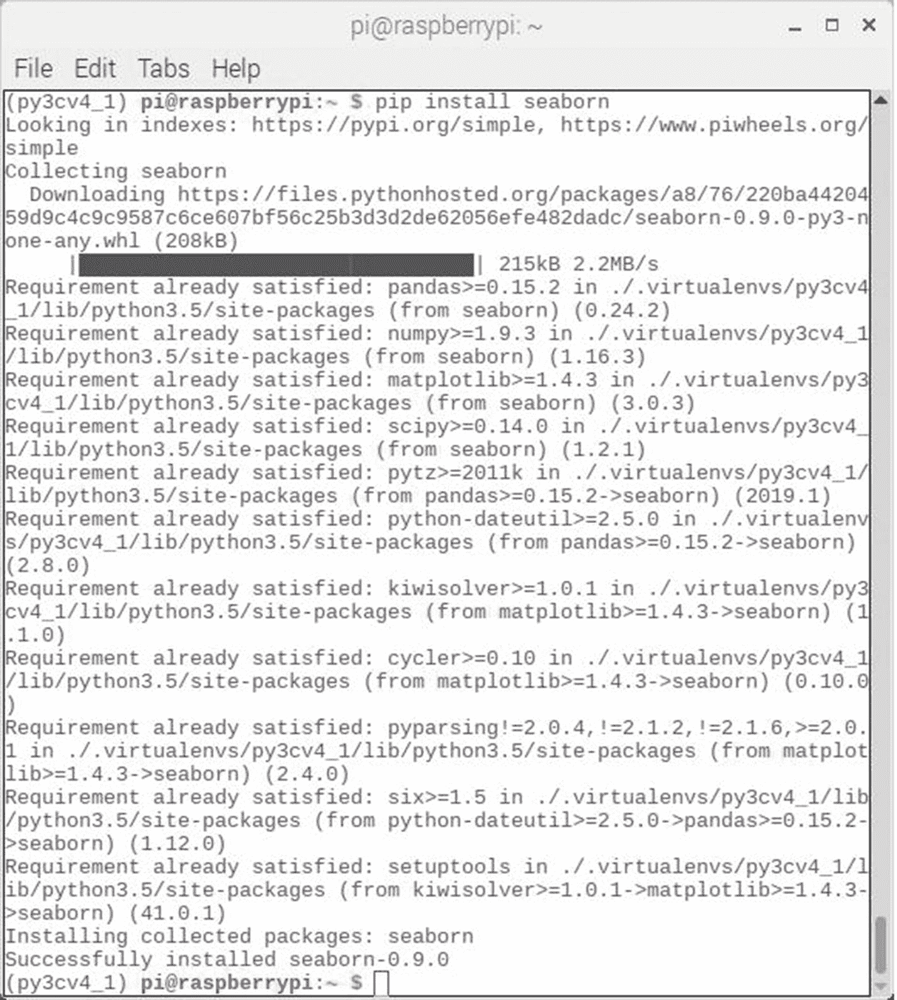

图 2-5

Seaborn 软件包安装结果

一旦安装完毕，我相信解释 Seaborn 最简单的方法就是用它来可视化在第 [1](1.html) 章中介绍的 Iris 数据集。Seaborn 的一个非常方便的特性是包中包含的有限数量的数据集的即时可用性。Iris 数据集是那些有机数据集之一(没有双关语的意思)。要使用 Iris 数据集，您只需在脚本中包含这些语句

```py
import seaborn as sns
iris = sns.load_dataset("iris")

```

其中`sns`是对 Seaborn 导入的引用。

Seaborn 包中有 15 个数据集可用。下面列出了这些信息，供您参考:

*   安斯库姆

*   注意力

*   大脑网络

*   车祸

*   钻石

*   点

*   运用

*   飞行

*   功能磁共振成像

*   gammax

*   虹膜

*   每加仑行驶英里数

*   行星

*   技巧

*   泰坦尼克号

从标题判断，Seaborn 数据集是多样的，有点不寻常。他们显然是被选中来展示 Seaborn 软件包的分析和可视化能力的。除了 Iris 数据集之外，我将在讨论数据模型时使用其中的一些数据集。

表 [2-1](#Tab1) 显示了 Iris 数据集中的前五条记录，它是由以下命令生成的:

表 2-1

Iris 数据集的 Head 命令结果

<colgroup><col class="tcol1 align-left"> <col class="tcol2 align-left"> <col class="tcol3 align-left"> <col class="tcol4 align-left"> <col class="tcol5 align-left"> <col class="tcol6 align-left"></colgroup> 
| 

建议编号

 | 

萼片长度

 | 

萼片宽度

 | 

花瓣长度

 | 

花瓣 _ 宽度

 | 

种类

 |
| --- | --- | --- | --- | --- | --- |
| Zero | Five point one | Three point five | One point four | Zero point two | 感觉很好 |
| one | Four point nine | Three | One point four | Zero point two | 感觉很好 |
| Two | Four point seven | Three point two | One point three | Zero point two | 感觉很好 |
| three | Four point six | Three point one | One point five | Zero point two | 感觉很好 |
| four | Five | Three point six | One point four | Zero point two | 感觉很好 |

```py
iris.head()

```

在选择最能处理数据集的适当数据模型时，数据可视化是一个重要的初始步骤。Seaborn 提供了许多可视化数据的方法来帮助您完成这项重要任务。我将介绍一系列脚本来帮助您可视化数据。多变量虹膜数据集将在以下所有脚本中使用。

#### 散点图

从散点图开始数据可视化过程可能是处理数据可视化任务最简单的方法。散点图是简单的二维或 2D 图，使用绘制为坐标对的两个数据集组件。Seaborn 包使用`jointplot`方法作为绘图函数，指示绘图的 2D 性质。我使用以下名为 jointPlot.py 的脚本来创建萼片长度与花瓣高度的散点图。该脚本可从该书的配套网站获得:

```py
# Import the required libraries
import matplotlib.pyplot as plt
import seaborn as sns

# Load the Iris dataset
iris = sns.load_dataset("iris")

# Generate the scatter plot
sns.jointplot(x="sepal_length",y="sepal_width", data=iris,size=6)

# Display the plots
plt.show()

```

通过输入以下命令运行该脚本

```py
python jointPlot.py

```

图 [2-6](#Fig6) 显示了运行这个脚本的结果。


图 2-6

萼片长度对萼片高度的散点图(所有物种)

查看该图，您可以很容易地看到数据点分布在图中，这表明这两个数据集组件之间没有很强的关系。与右边的萼片宽度直方图相比，顶部的萼片长度直方图显示了较宽的数值范围，右边的萼片宽度直方图显示了大约 3.0 的峰值中间值。请注意，该图涵盖了所有鸢尾属物种，可能掩盖了一个或多个个体物种的现有数据关系。其他可视化工具可以揭露隐藏的关系，你很快就会看到。

#### 小平面网格图

小平面网格图是上一节刚刚介绍的散点图的变体。但是，与散点图中未分类和模糊不清的情况相反，所有数据集组成部分在分面网格图中都有明确的标识。我使用以下名为 facetGridPlot.py 的脚本来创建萼片长度与花瓣高度的面网格图。该脚本可从该书的配套网站获得:

```py
# Import the required libraries
import matplotlib.pyplot as plt
import seaborn as sns

# Load the Iris dataset
iris = sns.load_dataset("iris")

# Generate the Facet Grid plot
sns.FacetGrid(iris,hue="species",size=6) \
.map(plt.scatter,"sepal_length","sepal_width") \
.add_legend()

# Display the plot
plt.show()

```

通过输入以下命令运行该脚本

```py
python facetGridPlot.py

```

图 [2-7](#Fig7) 显示了运行这个脚本的结果。


图 2-7

萼片长度对萼片高度的刻面网格图

我承认，在已出版的书中，灰度图将很难解读，但您应该能够辨别出图的左上角的一组点似乎形成了一种有意义的关系，其中可以通过点组绘制一条线性斜线来表示这种关系。这些点都来自鸢尾物种。

在图 [2-6](#Fig6) 中绘制了相同的点群，但是这些点之间没有区分它们所代表的物种，这种关系不容易确定。可视化可能的关系是选择合适的数据模型的重要的第一步。在这种情况下，使用线性回归(LR)模型将是这个特定数据子集的一个好选择。我将在本章后面讨论 LR 数据模型。

图 [2-7](#Fig7) 中剩余的点属于剩余的鸢尾属物种，据我所知似乎没有任何明显的视觉关系。然而，我仍然继续向你展示一些可能有助于分析的附加图。

#### 箱形图

在前一章中首次介绍了箱形图；然而，我使用 Matplotlib 包来生成这些图。下面的方框图是由名为`boxplot`的 Seaborn 方法生成的。实际上，我怀疑实际的情节可能是由 Matplotlib 软件创建的，因为 Seaborn 包与 Matplotlib 有很强的联系。

我使用了以下名为 boxPlot.py 的脚本来创建所有鸢尾属物种的所有萼片长度属性的盒图。该脚本可从该书的配套网站获得:

```py
# Import the required libraries
import matplotlib.pyplot as plt
import seaborn as sns

# Load the Iris dataset
iris = sns.load_dataset("iris")

# Generate the box plot
sns.boxplot(x="species",y="sepal_length", data=iris)

# Display the plot
plt.show()

```

通过输入以下命令运行该脚本

```py
python boxPlot.py

```

图 [2-8](#Fig8) 显示了运行这个脚本的结果。


图 2-8

所有鸢尾属物种的萼片长度的箱线图

箱线图本质上是单变量的，因为它们仅从单个数据集维度或 1D 创建。尽管如此，它们为数据集属性范围、方差和均值提供了重要的见解。箱线图有助于识别容易破坏某些数据模型的数据异常值，这些异常值反过来会导致使用那些无意中包含破坏性异常值的模型时产生不可预测和不确定的结果。

#### 带状图

带状图可被视为扩大的盒状图，因为它包括基础盒状图，并显示创建该盒状图的实际数据点。对于每个数据集类，数据点通常沿一条垂直线绘制；然而，Seaborn `stripplot`方法有一个抖动选项，可以随机地将点从垂直线移开。这种随机抖动不会影响数据显示，因为垂直轴是唯一用于识别点值的轴。在您研究了示例情节后，这个概念应该会变得清晰。

我使用以下名为 stripPlot.py 的脚本为所有鸢尾属物种的所有萼片长度属性创建带状图。该脚本可从该书的配套网站获得:

```py
# Import the required libraries
import matplotlib.pyplot as plt
import seaborn as sns

# Load the Iris dataset
iris = sns.load_dataset("iris")

# Generate the strip plot
ax = sns.boxplot(x="species",y="sepal_length", data=iris)
ax = sns.stripplot(x="species", y="sepal_length", data=iris, jitter=True, edgecolor="gray")

# Display the plot
plt.show()

```

通过输入以下命令运行该脚本

```py
python stripPlot.py

```

图 [2-9](#Fig9) 显示了运行这个脚本的结果。


图 2-9

所有鸢尾属物种的萼片长度带状图

我前面关于箱形图的评论在这里适用。带状图只是提供了一些关于创建盒状图的数据点如何分布在记录的数值范围内的额外信息。

#### 小提琴情节

violin 图类似于 box 图，不同之处在于它在代表数据集类数据的垂直线两侧有一个旋转的核密度图。这些核密度表示不同值的数据的概率密度，并由核密度估计函数平滑。在你检查了这个图形之后，这个奇怪的名字应该很明显了。

我使用以下名为 violinPlot.py 的脚本为所有鸢尾属物种的所有萼片长度属性创建了 violinPlot。该脚本可从该书的配套网站获得:

```py
# Import the required libraries
import matplotlib.pyplot as plt
import seaborn as sns

# Load the Iris dataset
iris = sns.load_dataset("iris")

# Generate the violin plot
sns.violinplot(x="species",y="sepal_length", data=iris, size=6)

# Display the plot
plt.show()

```

通过输入以下命令运行该脚本

```py
python violinPlot.py

```

图 [2-10](#Fig10) 显示了运行这个脚本的结果。


图 2-10

所有鸢尾属物种的萼片长度的小提琴图

小提琴情节克服了盒子情节固有的一个大问题。箱线图可能会产生误导，因为它们不受原始数据分布的影响。当基础数据集改变形状或本质上“变形”时，箱线图可以轻松地保持其先前的统计数据，包括中位数和范围。另一方面，Violin 图将反映任何新的形状或数据分布，同时仍包含相同的盒图统计。

小提琴图的“小提琴”形状来自类数据集的密度图。密度图旋转 90 °,放置在箱形图的两侧，相互镜像。解读小提琴形状正是解读密度图的方式。较厚的部分意味着小提琴图中该部分的值出现的频率或概率较高，而较薄的部分意味着出现的频率或概率较低。

小提琴的情节相对容易读懂。中间的点是中间值。方框呈现四分位数范围。胡须显示 95%的置信区间。小提琴的形状显示了频率值。图 [2-10](#Fig10) 中的图例指出了这些特征。

#### KDE 绘图

KDE 图仅显示数据集类密度图。KDE 是核密度估计量的缩写，它与小提琴图中使用的图完全相同。如果你仅仅关注数据分布而不是数据统计，KDE 图是最有用的，就像箱形图或小提琴图一样。

我使用以下名为 kdePlot.py 的脚本来创建所有鸢尾属物种的所有萼片长度属性的 KDE 图。该脚本可从该书的配套网站获得:

```py
# Import the required libraries
import matplotlib.pyplot as plt
import seaborn as sns

# Load the Iris dataset
iris = sns.load_dataset("iris")

# Generate the kde plot
sns.FacetGrid(iris,hue="species",size=6) \
.map(sns.kdeplot,"sepal_length") \
.add_legend()

# Display the plot
plt.show()

```

通过输入以下命令运行该脚本

```py
python kdePlot.py

```

图 [2-11](#Fig11) 显示了运行这个脚本的结果。


图 2-11

所有鸢尾属植物的萼片长度的 KDE 图

数据分布图结果已经在前面讨论过了。

#### 配对图

将联合图概化为大尺寸数据集时，会创建配对图。这些图是探索多维数据之间相关性的有用工具，因为所有数据对值都是相对于彼此绘制的。可视化 Iris 数据集多维关系就像输入以下脚本一样简单，我将其命名为 pairPlot.py。该脚本可从本书的配套网站获得:

```py
# Import the required libraries
import matplotlib.pyplot as plt
import seaborn as sns

# Load the Iris dataset
iris = sns.load_dataset("iris")

# Generate the pair plots
sns.pairplot(iris, hue="species", size=2.5)

# Display the plots
plt.show()

```

图 [2-12](#Fig12) 显示了运行前面脚本的结果。

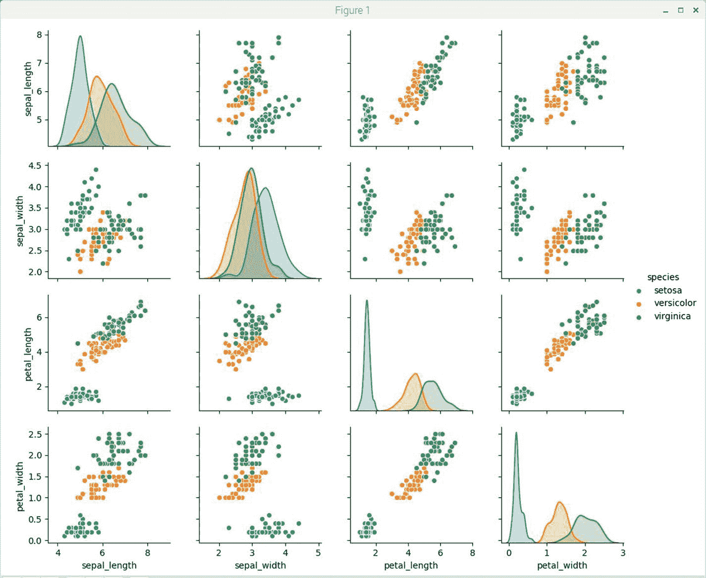

图 2-12

Iris 数据集对图

乍一看，这一对情节图似乎是迄今为止所展示的最全面、最复杂的情节。经过更仔细的观察，你会很快意识到图中所示的单个图要么是小平面网格图，要么是 KDE 图，这已经讨论过了。主对角线上从左上角到右下角的图都是相同相交数据集类的 KDE 图。非相交图，即 x 轴和 y 轴具有不同类别的图，都是小平面网格图。当您检查各个图时，类属性关系应该很快变得明显。例如，在几乎所有的配对图中，Setosa 属性与其他物种属性明显不同。这表明聚类数据模型在这种情况下可能非常有效。我相信花大量的时间检查 pair 图将有助于您在很大程度上理解底层数据集。

我相信，任何积极参与 ML 的人都应该非常熟悉作为 ML 核心概念基础的底层基本模型。我在前一章中介绍了六个模型，但没有深入研究这些模型的细节。这些模型是(按字母顺序排列的)

*   *决策树分类器

*   *高斯天真[贝叶斯](http://scholar.google.com/scholar%253Fq%253DGaussian%252BNaive%252BBayesian%2526hl%253Den%2526as_sdt%253D0%2526as_vis%253D1%2526oi%253Dscholart)

*   * K-最近邻分类器

*   线性判别分析

*   *逻辑回归

*   支持向量机

本书还将介绍另外四种型号:

*   学习矢量量化

*   *线性回归

*   装袋和随机森林

*   主成分分析

*   (*在本章中讨论)

经验丰富的数据科学家如果不针对特定的问题域尝试不同的模型，就无法告诉你这十个模型中哪一个表现最好。虽然还有许多其他的 ML 模型和算法，但这十个通常被认为是最流行的。明智的做法是了解并利用这十条作为 ML 教育的坚实起点。

### 潜在的大原则

预测建模中使用的所有监督最大似然算法都有一个共同的原则。

最大似然算法最好描述为学习一个目标函数 f()，该函数最好地将输入变量 x 映射到输出变量 y 或者以方程的形式

*y = f(x)*

在给定输入变量 x 的新输入值的情况下，通常存在需要对一些 y 进行预测的常见问题。然而，函数 *f(x)* 是未知的。如果它是已知的，那么该预测将被认为是分析性的并被直接求解，并且将没有必要使用 ML 算法从数据中“学习”它。

最常见的 ML 问题可能是学习映射 *y = f(x)* 来预测新 x 的 y。这种方法正式称为预测建模或预测分析，目标是做出准确的预测。

我将从可能是最常用于预测的模型开始回顾数据模型。

#### 线性回归

线性回归(LR)是一种在给定输入变量 *x* 的值的情况下预测输出 *y* 的方法。这种方法背后的假设是在 *x* 和 *y* 之间一定存在某种线性关系。这种关系用数学术语表示为


在哪里

*b* <sub>1</sub> =直线的斜率

*b*T2】0= y 轴截距

*e* =估计误差

图 [2-13](#Fig13) 显示了一个简化的案例，有三个数据点和一条最适合所有点之间的直线。点是使用 LR 方程为给定的 *x* <sub>* i *</sub> 创建的估计值。 *r* <sub>* i *</sub> 值是真实数据点与相应的估计值之间的估计误差。


图 2-13

简单 LR 案例示例

创建 LR 方程的正常方法是最小化所有 *r* <sub>*i*</sub> 误差的总和。可以使用不同的技术从数据中学习线性回归模型，例如普通最小二乘法的线性代数解，以及使用梯度下降优化。

线性回归已经存在了 200 多年，并得到了广泛的研究。使用这种技术时，两个有用的经验法则是移除非常相似的独立变量和移除数据集中的任何噪声。这是一种快速简单的技术，也是一种很好的首次尝试算法。

##### LR 演示

以下 Python 脚本名为 lrTest.py，旨在使用基本方程创建一组围绕斜线的伪随机点

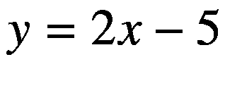

scikit-learn 包中包含的学习回归方法使用伪随机数据集来重新创建基础方程。该脚本可从该书的配套网站获得:

```py
# Import required libraries
import matplotlib.pyplot as plt
import seaborn as sns
import numpy as np
from sklearn.linear_model import LinearRegression

# generate the random dataset
rng = np.random.RandomState(1)
x = 10*rng.rand(50)
y = 2*x -5 + rng.randn(50)

# Setup the LR model
model = LinearRegression(fit_intercept=True)
model.fit(x[:, np.newaxis], y)

# Generate the estimates
xfit = np.linspace(0, 10, 1000)
yfit = model.predict(xfit[:, np.newaxis])

# Display a plot with the random data points and best fit line
ax = plt.scatter(x,y)
ax = plt.plot(xfit, yfit)
plt.show()

# Display the LR coefficients
print("Model slope:      ", model.coef_[0])
print("Model intercept:  ", model.intercept_)

```

通过输入以下命令运行该脚本

```py
python lrTest.py

```

图 [2-14](#Fig14) 显示了运行这个脚本的结果。


图 2-14

lrTest 脚本的结果

从图中可以很容易地看出，最佳拟合线被完美地放置在数据集中，正如数据生成方式所预期的那样。这是一个合适的结果，因为该演示的唯一目的是说明线性回归模型是如何工作的。

图 [2-15](#Fig15) 显示了 LR 模型计算的*b*T4】0 和*b*T8】1 系数。它们分别非常接近真实值 2 和–5。


图 2-15

计算的 LR 系数

#### 逻辑回归

逻辑回归(LogR)通常用于分类目的。它与 LR 不同，因为因变量( *x* )只能取有限数量的值，而在 LR 中，值的数量是无限的。这是因为逻辑回归使用因变量的类别。只有两类的时候就变成二元逻辑回归了。

在 LR 中，输出是输入的加权和。LogR 是 LR 的推广，因为输入的加权和不是直接输出的，而是通过一个函数将任何实际输入值映射到 0 到 1 之间的输出。在 LR 中，输出可以取任何值，但是对于 LogR，值必须在 0 和 1 之间。

图 [2-16](#Fig16) 显示了映射加权输入总和的函数。这称为 sigmoid 函数，也称为激活函数。


图 2-16

Sigmoid 函数

该图显示了 sigmoid 函数的输出值( *y* )总是位于 0 和 1 之间，并且当 x = 0 时，y= 0.5。在两个类别的情况下，如果 y > = 0.5，那么可以说检测到了类别 1；否则，必须是 0 类。

在我深入研究实际的数据模型之前，回顾一下应用逻辑回归必须满足的两个基本假设是很重要的。这些是

*   因变量必须是分类变量。

*   自变量(特征)必须是独立的。

我将使用吴恩达教授基于两次考试成绩的大学录取数据集。完整的数据集由 100 个记录组成，两个考试分数或标记从 0 到 100 不等。每个记录还包含 1 或 0，其中 1 表示申请人被录取，0 表示申请人被录取。这个数据模型的目标是根据两个考试分数来预测申请人是否会被录取。原始数据取自名为 marks.txt 的 CSV 文件，该文件可从

`https://github.com/animesh-agarwal/Machine-Learning/blob/master/LogisticRegression/data/marks.txt`

使用 Pandas 软件将数据作为数据帧加载到以下脚本中。数据还被分成允许的和不允许的类别，以帮助可视化数据并满足分类假设。这个名为 logRTest.py 的脚本用于生成原始数据集的绘图。该脚本可从该书的配套网站获得:

```py
# Import required libraries
import matplotlib.pyplot as plt
import pandas as pd

def load_data(path, header):
    marks_df = pd.read_csv(path, header=header)
    return marks_df

if __name__ == "__main__":
    # load the data from the file

    data = load_data("marks.txt", None)

    # X = feature values, all the columns except the last column
    X = data.iloc[:, :-1]

    # y = target values, last column of the data frame
    y = data.iloc[:, -1]

    # Filter the applicants admitted
    admitted = data.loc[y == 1]

    # Filter the applicants not admitted
    not_admitted = data.loc[y == 0]

    # Display the dataset plot
    plt.scatter(admitted.iloc[:, 0], admitted.iloc[:, 1], s=10, label="Admitted")
    plt.scatter(not_admitted.iloc[:, 0], not_admitted.iloc[:, 1], s=10, label='Not Admitted')
    plt.legend()
    plt.show()

```

该脚本通过输入以下命令运行

```py
python logRTest.py

```

图 [2-17](#Fig17) 显示了运行这个脚本的结果。


图 2-17

logtest 脚本的结果

##### LogR 模型开发

通过检查该图，您可能能够想象出一条从左上角到右下角的直线，该直线将把大多数数据点一分为二，录取的学生在右边，未录取的学生在左边。问题变成如何确定这种分类器线的系数。LR 不能确定这条线，但是 LogR 数据模型可以。

在这一点上，我将尝试解释 LogR 模型是如何开发的。然而，我将不得不省略许多基础的数学知识，因为否则它将把讨论转移到许多细粒度的细节上，这将偏离简单介绍 LogR 数据模型的主要目的。请放心，有许多好的博客和教程可以使用，它们探索了 LogR 的数学细节。

这个 LogR 示例的基本假设是确定“最适合”以下等式的系数 *θ* <sub>*i*</sub>


在哪里

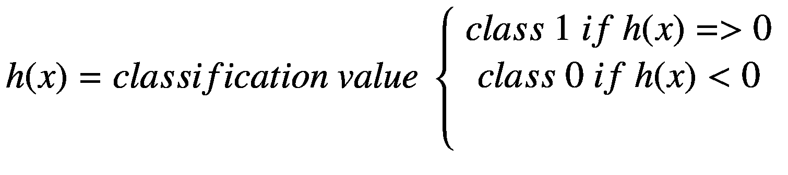

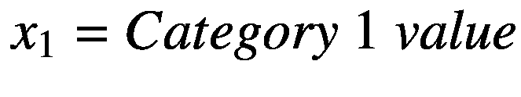


在这个二进制 LogR 示例中， *x* <sub>1</sub> 是考试 1 分数(马克)，而 *x* <sub>2</sub> 是考试 2 分数。

必须为该假设分配一个成本函数，以便可以应用梯度法来最小化成本，并随后确定最小成本解决方案所需的系数。在没有证明或推导的情况下，我将只给出如图 [2-18](#Fig18) 所示的成本函数。

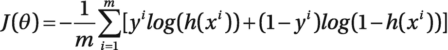

图 2-18

示例问题的 LogR 成本函数

图中由 *J(θ)* 表示的所有训练示例的成本可以通过对训练数据集中所有 100 个记录的成本取平均值来计算。

##### LogR 演示

以下脚本名为 logRDemo.py，将按照前面的描述计算所需的系数。此外，该脚本将绘制与训练数据集重叠的分类器线。最后，显示系数以获得可用的分类器方程。我在脚本中加入了许多注释，以帮助您理解代码发生了什么。该脚本可从该书的配套网站获得:

```py
# Import required libraries
import numpy as np
import matplotlib.pyplot as plt
import pandas as pd
import scipy.optimize as so

def load_data(path, header):
    # Load the CSV file into a panda dataframe
    marks_df = pd.read_csv(path, header=header)
    return marks_df

def sigmoid(x):
    # Activation function
    return 1/(1 + np.exp(-x))

def net_input(theta, x):
    # Computes the weighted sum of inputs by a numpy dot product
    return np.dot(x, theta)

def probability(theta, x):
    # Returns the probability after Sigmoid function is applied
    return sigmoid(net_input(theta, x))

def cost_function(theta, x, y):
    # Computes the cost function
    m = x.shape[0]
    total_cost = -(1/m)*np.sum(y*np.log(probability(theta,x))+(1-y)*np.log(1-probability(theta,x)))
    return total_cost

def gradient(theta, x, y):
    #Computes the cost function gradient
    m = x.shape[0]
    return (1/m)*np.dot(x.T,sigmoid(net_input(theta,x))-y)

def fit(x, y, theta):
    # The optimal coefficients are computed here
    opt_weights = so.fmin_tnc(func=cost_function, x0=theta, fprime=gradient,args=(x,y.flatten()))
    return opt_weights[0]

if __name__ == "__main__":
    # Load the data from the file
    data = load_data("marks.txt", None)
    # X = feature values, all the columns except the last column
    X = data.iloc[:, :-1]
    # Save a copy for the output plot
    X0 = X
    # y = target values, last column of the data frame
    y = data.iloc[:, -1]

    # Save a copy for the output plot
    y0 = y
    X = np.c_[np.ones((X.shape[0], 1)), X]
    y = y[:, np.newaxis]
    theta = np.zeros((X.shape[1], 1))
    parameters = fit(X, y, theta)
    x_values = [np.min(X[:,1]-5), np.max(X[:,2] + 5)]
    y_values = -(parameters[0] + np.dot(parameters[1], x_values)) / parameters[2]
    # filter the admitted applicants
    admitted = data.loc[y0 == 1]
    # filter the non-admitted applicants
    not_admitted = data.loc[y0 == 0]
    # Plot the original dataset along with the classifier line
    ax = plt.scatter(admitted.iloc[:, 0], admitted.iloc[:, 1], s=10, label="Admitted")
    ax = plt.scatter(not_admitted.iloc[:, 0], not_admitted.iloc[:, 1], s=10, label='Not Admitted')
    ax = plt.plot(x_values, y_values, label='Decision Boundary')
    ax = plt.xlabel('Marks in 1st Exam')
    ax = plt.ylabel('Marks in 2nd Exam')
    ax = plt.legend()
    plt.show()
    print(parameters)

```

通过输入以下命令运行该脚本

```py
python logRDemo.py

```

图 [2-19](#Fig19) 显示了运行这个脚本的结果。


图 2-19

logRDemo 脚本的结果

分类器线似乎正确地放置在将被录取的学生与未被录取的学生分开的数据点之间。但是，如果您仔细检查分类器线，您会发现分类器线左侧有五个已录取的学生数据点。如果使用 LogR 分类模型，这些分数将导致假阴性，因为具有这些考试分数的学生被拒绝录取，但应该被录取。类似地，在分类线的线上或右边有六个未被录取的学生。如果使用 LogR 分类模型，这些分数将导致假阳性，因为具有这些考试分数的学生被录取，但本应被拒绝录取。总共有 11 个假阴性或假阳性，这为 LogR 模型创造了 89%的总体准确性。这并不是非常糟糕，并且可能通过增加训练数据集的大小来改善。

图 [2-20](#Fig20) 显示了 LogR 模型计算的*θ*<sub>T5】I</sub>系数。

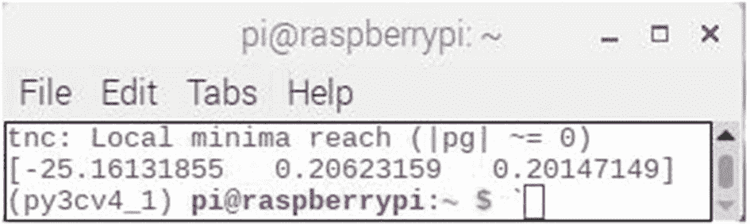

图 2-20

计算的 LogR 系数

使用计算出的*θ*<sub>T3】IT5】系数的最终 LogR 分类器方程为</sub>


在哪里

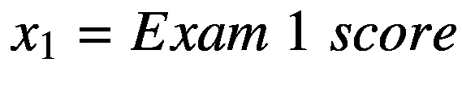


我尝试了一些随机分数来测试分类器方程。结果如表 [2-2](#Tab2) 所示。

表 2-2

LogR 分类器方程的随机试验

<colgroup><col class="tcol1 align-left"> <col class="tcol2 align-left"> <col class="tcol3 align-left"> <col class="tcol4 align-left"> <col class="tcol5 align-left"></colgroup> 
| 

考试 1

 | 

考试 2

 | 

分类者

 | 

承认

 | 

未录取

 |
| --- | --- | --- | --- | --- |
| Forty | Sixty | –4.825 |   | x |
| Eighty | Sixty | Three point four two three | x |   |
| Fifty | Sixty | –2.763 |   | x |
| Fifty-five | Sixty-five | –0.7245 |   | x |
| Sixty | Sixty-five | 0.3065 | x |   |
| Eighty | Ninety | Nine point four six eight | x |   |
| Seventy | Seventy-five | 4.4835 | x |   |
| Sixty | Sixty-five | 0.3065 | x |   |
| Sixty | Seventy-five | 2.3215 | x |   |
| Sixty | Sixty | –0.701 |   | x |
| Sixty-two | Sixty-three | 0.3159 | x |   |
| Seventy | Sixty-five | 2.3685 | x |   |
| Sixty-five | Seventy | 2.1345 | x |   |
| Fifty | Fifty-five | –3.7705 |   | x |
| Seventy | Forty-eight | –1.057 |   | x |
| fifty-six | Fifty-nine | –1.7273 |   | x |

表中的最后一个条目不是随机的，而是取自原始数据集的假阴性。我这样做是为了说明单独依赖分类器等式的潜在问题。

### 朴素贝叶斯

朴素贝叶斯是一种用于两类(二元)和多类分类问题的分类算法。使用二进制或分类输入值的技术最容易理解。

之所以称之为朴素贝叶斯，是因为每个假设的概率计算都被简化了，使得它们的计算成为可能。不是试图计算每个属性值 P(d1，d2|h)的值，而是假设它们在给定目标数据值的情况下是有条件独立的，并计算为 P(d1|h) * P(d2|h)。

这是一个非常强有力的假设，但在现实世界的数据中却不太可能成立。这个假设是基于类属性不交互的假设。尽管如此，这种方法似乎在基本假设不成立的数据上表现良好。

在进行真实世界的演示之前，我认为回顾一下关于贝叶斯逻辑的一些基本原则是谨慎的。

#### 贝叶斯定理简评

在分类问题中，假设(h)可以被认为是要分配给每个新数据实例(d)的类别。在给定新数据的情况下，选择最可能的假设的一个简单方法是使用关于问题的任何先验知识。贝叶斯定理提供了一种在给定先验知识的情况下计算假设概率的方法。

贝叶斯定理被表述为

P(h|d) = (P(d|h) * P(h)) / P(d)

在哪里

*   P(h|d)是给定数据 d 的假设 h 的概率，这称为后验概率。

*   P(d|h)是假设假设 h 为真时数据 d 的概率。

*   P(h)是假设 h 为真的概率(不考虑数据)。这叫做 h 的先验概率。

*   P(d)是数据的概率(不考虑假设)。

显而易见，目标是用 P(d)和 P(d|h)从先验概率 P(h)计算后验概率 P(h|d)。

在计算多个不同假设的后验概率之后，选择具有最高概率的假设。这个选定的 h 是最大可能假设，正式称为最大后验概率(MAP)假设。它可以以几种形式表示为

MAP(h) = max(P(h|d))

或者

MAP(h) = max((P(d|h) * P(h)) / P(d))

或者

MAP(h) = max(P(d|h) * P(h))

P(d)是一个归一化项，允许计算归一化概率。当只需要最可能的假设时，可以忽略它，因为这一项是常数，只用于归一化，这导致前面所示的最后一个映射方程。

如果在训练数据的每个类中有相等的实例分布，则进一步简化是可能的。在这种情况下，每一类的概率(P(h))将是相等的。这将导致另一个常数项成为映射方程的一部分，它也可以被去掉，留下一个最终方程

MAP(h) = max(P(d|h))

#### 准备供朴素贝叶斯模型使用的数据

在应用朴素贝叶斯模型之前，需要计算类概率和条件概率。顾名思义，类概率是与训练集中的每个类相关联的概率。条件概率是与给定类的每个输入数据值相关联的概率。

训练很快，因为只需要计算每一类的概率和每一类给定不同输入值的概率。不需要像回归模型那样通过优化过程来拟合系数。

类别概率就是属于每个类别的实例的频率除以实例的总数。

例如，在二进制分类问题中，属于类 1 的实例的概率计算如下

P(class1) =计数(class1) /(计数(class0) +计数(class1))

在最简单的情况下，每个类有相同数量的实例，每个类的概率是 0.5 或 50%。

条件概率是给定类值的每个属性值的频率除以具有该类值的实例的频率。

下一个例子应该有助于阐明朴素贝叶斯模型是如何工作的。

##### 朴素贝叶斯模型示例

以下是天气的训练数据集和相应的目标变量“播放”(建议播放的可能性)。

表 [2-3](#Tab3) 显示了天气条件和播放变量值的记录。

表 2-3

天气/游戏数据集

<colgroup><col class="tcol1 align-left"> <col class="tcol2 align-left"></colgroup> 
| 

天气

 | 

玩

 |
| --- | --- |
| 快活的 | 不 |
| 遮蔽 | 是 |
| 下雨的 | 是 |
| 快活的 | 是 |
| 快活的 | 是 |
| 遮蔽 | 是 |
| 下雨的 | 不 |
| 下雨的 | 不 |
| 快活的 | 是 |
| 下雨的 | 是 |
| 快活的 | 不 |
| 遮蔽 | 是 |
| 遮蔽 | 是 |
| 下雨的 | 不 |

第一步是将训练数据集转换为频率表，如表 [2-4](#Tab4) 所示。

表 2-4

频率表

<colgroup><col class="tcol1 align-left"> <col class="tcol2 align-left"> <col class="tcol3 align-left"></colgroup> 
| 

频率表

 |
| --- |
| 天气 | 不 | 是 |
| 遮蔽 |   | four |
| 下雨的 | three | Two |
| 快活的 | Two | three |
| 总数 | five | nine |

第二步是通过寻找概率来创建一个可能性表。例如，在所有天气条件下，多云的概率是 0.29，总的比赛概率是 0.64。表 [2-5](#Tab5) 显示了可能性表。

表 2-5

可能性表

<colgroup><col class="tcol1 align-left"> <col class="tcol2 align-left"> <col class="tcol3 align-left"> <col class="tcol4 align-left"> <col class="tcol5 align-left"></colgroup> 
| 

可能性表

 |
| --- |
| **天气** | **否** | **是** |   | **天气概率** |
| 遮蔽 |   | four | 4/14 | Zero point two nine |
| 下雨的 | three | Two | 5/14 | Zero point three six |
| 快活的 | Two | three | 5/14 | Zero point three six |
| 总数 | five | nine |   |   |
|   | 5/14 | 9/14 |   |   |
| (演奏等的)表现，风格；(乐曲)演奏可能性 | Zero point three six | Zero point six four |   |   |

下一步是使用朴素贝叶斯方程来计算每一类的后验概率。具有最高后验概率的类是预测的结果。

问题陈述:如果天气晴朗，玩家会玩。这种说法正确吗？

用后验概率的方法解决这个问题。

*   P(是|晴)= P(晴|是)* P(是)/ P(晴)

替换实际概率产生

*   p(晴|是)= 3/9 = 0.33

*   p(晴天)= 5/14 = 0.36

*   p(是)= 9/14 = 0.64

因此:

*   p(是|晴)= 0.33 * 0.64 / 0.36 = 0.60

接下来计算另一个游戏类别值“否”的后验概率。

*   P(否|晴)= P(晴|否)* P(否)/ P(晴)

替换实际概率产生

*   p(晴|否)= 2/5 = 0.40

*   p(晴天)= 5/14 = 0.36

*   p(否)= 5/14 = 0.36

因此:

*   p(否|晴)= 0.40 * 0.36 / 0.36 = 0.40

概率 P(是|晴)比 P(否|晴)高，是图或预测。请注意，您可以简单地从 1.0 中减去 P(Yes | Sunny)来获得互补概率，这对于二进制类值总是正确的。但是，该操作不适用于非二进制类值的情况。

##### 利弊

下面是使用朴素贝叶斯数据模型的一些优点和缺点。

**优点:**

*   从测试数据集中预测类值既简单又快速。在多类预测中也表现不错。

*   当独立性假设成立时，朴素贝叶斯分类器与其他模型(如逻辑回归)相比表现更好，并且需要较少的训练数据。

*   与数字变量相比，它在分类输入变量的情况下表现良好。对于数值变量，假设正态分布，这是一个强假设。

cons:t1]

*   如果分类变量在测试数据集中有一个在训练数据集中没有观察到的类别，则模型将分配 0 概率，并且将无法进行预测。这种情况通常被称为“零频率”一种称为拉普拉斯估计的平滑技术通常用于解决这个问题。

*   朴素贝叶斯也是一种糟糕的估计，因此概率输出可能不准确。

*   朴素贝叶斯的另一个限制是独立预测者的假设。在现实世界中，我们几乎不可能得到一组完全独立的预测值。

scikit-learn 库将很快用于构建 Python 中的朴素贝叶斯模型。scikit-learn 库中有三种类型的朴素贝叶斯模型:

*   高斯-用于分类，假设要素遵循正态分布。

*   多项式–用于离散计数。将文本分类问题视为伯努利试验，本质上是“计算一个单词在文档中出现的频率”它可以被认为是“在 n 次试验中观察到结果数 x <sub>i</sub> 的次数。”

*   伯努利–如果特征向量是二进制的(即 0 和 1)，伯努利模型是有用的。一个应用是利用“单词包”模型的文本分类，其中 1 和 0 分别是“单词在文档中出现”和“单词不在文档中出现”。

基于您的数据集，您可以选择前面讨论的任何模型。

##### 高斯朴素贝叶斯

朴素贝叶斯可以扩展到实值属性，最常见的方法是假设高斯分布。朴素贝叶斯的这种扩展被称为高斯朴素贝叶斯。可以使用其他函数来估计数据的分布，但高斯或正态分布是最容易使用的，因为它只需要从训练数据中计算平均值和标准偏差。

每个类值的每个输入变量(x)的平均值和标准偏差值使用以下公式计算:

*均值(x) = 1/n *总和(x)*

*标准差(x)= sqrt(1/n * sum(x*<sub>*I*</sub>*-mean(x)^2))*

在哪里

*   n =实例数量

*   x =输入变量的值

使用高斯概率密度函数(PDF)计算新 x 值的概率。进行预测时，可以将这些参数与 x 变量的新输入一起输入到高斯 PDF 中，在高斯 PDF 中，将为该类提供新输入值的概率估计值。

*pdf(x，mean，SD)=(1/(sqrt(2 * pi)* SD))* exp(-((x-mean^2)/(2*sd^2)))*

其中，pdf(x)是高斯 pdf，sqrt()是平方根，mean 和 sd 是平均值和标准差，PI 是数值常数，exp()是数值常数 e 或欧拉数的幂，x 是输入变量的值。

下面的演示使用了前面的等式，但它们是软件包不可分割的一部分，可以单独调用。

##### 高斯朴素贝叶斯(GNB)演示

以下 Python 脚本命名为 gnbTest.py，使用 scikit-learn 软件包中包含的 GNB 模型。脚本中包含一个最小的训练数据集，用于让模型“学习”并做出预测。数据集可能完全是任意的，也可能实际上表示真实世界的属性，这取决于数据是否经过编码。在任何情况下，预测器都不会有任何问题，因为它只基于数字数据。解码最终结果始终是用户的责任。该脚本可从该书的配套网站获得:

```py
# Import Library of Gaussian Naive Bayes model
from sklearn.naive_bayes import GaussianNB
import numpy as np

# Assigning predictor and target variables
x= np.array([[-3,7],[1,5], [1,2], [-2,0], [2,3], [-4,0], [-1,1], [1,1], [-2,2], [2,7], [-4,1], [-2,7]])
y = np.array([3, 3, 3, 3, 4, 3, 3, 4, 3, 4, 4, 4])

# Create a Gaussian Classifier
model = GaussianNB()

# Train the model using the training sets
model.fit(x, y)

# Predict output
predicted= model.predict([[1,2],[3,4]])
print(predicted)

```

该脚本通过输入以下命令运行

```py
python gnbTest.py

```

图 [2-21](#Fig21) 显示了运行这个脚本的结果。

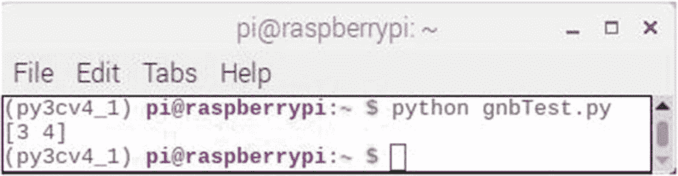

图 2-21

gentest 脚本的结果

最终结果显示[3 4]为预测值。正如我前面提到的，这在现实世界中意味着什么取决于数据集最初的编码方式。

## k-最近邻模型

我在 Iris 演示的前一章第 3 部分中介绍了 k-NN 模型。但是，我当时并没有提到使用这种模式的两大弊端。如果它们都不是问题，那么 k-NN 模型肯定应该被考虑使用，因为它是一个简单且健壮的分类器。

第一个问题是性能问题。因为它是一个惰性模型，所以必须加载所有的训练数据，并用于计算所有训练样本的欧几里德距离。这可以用一种简单的方式或者使用更复杂的数据结构来完成，比如 k-d 树。在任何情况下，当涉及大型训练集时，性能都会受到很大影响。

第二个问题是距离度量。基本的 k-NN 模型与欧几里德距离一起使用，当涉及大量维度时，欧几里德距离是有问题的距离度量。随着维数的增加，该算法的性能最差，因为当数据维数显著增加时，距离度量变得毫无意义。另一个相关的问题是当遇到噪声特征时。发生这个问题是因为模型对所有特征应用相同的权重，不管是否有噪声。此外，相同的权重应用于所有要素，与其类型无关，可以是分类、数字或二进制。

总之，如果系统必须学习具有少量样本和维度的复杂(即非线性)模式，k-NN 模型通常是最佳选择。

### KNN 示威

这个演示将使用来自加州大学欧文分校的汽车数据集。这两个所需的 CSV 数据文件以及 kNN.py 类文件可以从

`https://github.com/amallia/kNN`

### 注意

该网站还提供了一个 Jupyter 笔记本文件。这个文件将不被使用，因为我在下面提供了一个 Python 脚本，它完成了与笔记本文件相同的功能。

问题陈述将是预测一辆汽车的每加仑英里数，给定它的排量和马力。数据集中的每条记录对应一辆汽车。

下面列出了 kNN 类文件，它包含初始化、计算和预测函数。这个脚本被命名为 kNN.py，可以从列出的网站或该书的配套网站获得。我在脚本清单中添加了注释，以指示正在执行的功能。

```py
#!/usr/bin/env python
import math
import operator

class kNN(object):
    # Initialization
    def __init__(self, x, y, k, weighted=False):
        assert (k <= len(x)
                ), "k cannot be greater than training_set length"
        self.__x = x
        self.__y = y
        self.__k = k
        self.__weighted = weighted

    # Compute Euclidean distance
    @staticmethod
    def __euclidean_distance(x1, y1, x2, y2):
        return math.sqrt((x1 - x2)**2 + (y1 - y2)**2)

    # Compute the PDF

    @staticmethod
    def gaussian(dist, sigma=1):
        return 1./(math.sqrt(2.*math.pi)*sigma)*math.exp(-dist**2/(2*sigma**2))

    # Perform predictions
    def predict(self, test_set):
        predictions = []
        for i, j in test_set.values:
            distances = []
            for idx, (l, m) in enumerate(self.__x.values):
                dist = self.__euclidean_distance(i, j, l, m)
                distances.append((self.__y[idx], dist))
            distances.sort(key=operator.itemgetter(1))
            v = 0
            total_weight = 0
            for i in range(self.__k):
                weight = self.gaussian(distances[i][1])

                if self.__weighted:
                    v += distances[i][0]*weight
                else:
                    v += distances[i][0]
                total_weight += weight
            if self.__weighted:
                predictions.append(v/total_weight)
            else:
                predictions.append(v/self.__k)
        return predictions

```

以下脚本名为 knnTest.py，其中 k-NN 模型是从 kNN 类文件实例化的。对 k = 1、3 和 20 的非加权和加权情况进行了一系列预测。计算所有情况下的合成误差。该脚本可从该书的配套网站获得:

```py
# Import required libraries
import pandas
from kNN import kNN
from sklearn.metrics import mean_squared_error

# Read the training CSV file
training_data = pandas.read_csv("auto_train.csv")
x = training_data.iloc[:,:-1]
y = training_data.iloc[:,-1]

# Read the test CSV file
test_data = pandas.read_csv("auto_test.csv")
x_test = test_data.iloc[:,:-1]
y_test = test_data.iloc[:,-1]

# Display the heads from each CSV file
print('Training data')
print(training_data.head())
print('Test data')
print(test_data.head())

# Compute errors for k = 1, 3, and 20 with no weighting
for k in [1, 3, 20]:
    classifier = kNN(x,y,k)
    pred_test = classifier.predict(x_test)
    test_error = mean_squared_error(y_test, pred_test)
    print('Test error with k={}: {}'.format(k, test_error * len(y_test)/2))

# Compute errors for k = 1, 3, and 20 with weighting
for k in [1, 3, 20]:
    classifier = kNN(x,y,k,weighted=True)
    pred_test = classifier.predict(x_test)
    test_error = mean_squared_error(y_test, pred_test)
    print('Test error with k={}: {}'.format(k, test_error * len(y_test)/2))

```

通过输入以下命令运行该脚本

```py
python knnTest.py

```

图 [2-22](#Fig22) 显示了运行这个脚本的结果。


图 2-22

knnTest 脚本的结果

该图显示了每个 CSV 数据文件的前五条记录。接下来的三个测试误差结果分别针对 k 等于 1、3 和 20 的非加权预测结果。最后三个测试误差结果是针对相同 k 值的加权预测。检查误差结果显示，随着 k 的增加，误差值略有减少，并且当应用加权时，误差值甚至稍低。

## 决策树分类器

这将是本章讨论的最后一个数据模型。决策树分类器数据模型是常见业务问题的巧妙解决方案。例如，如果您是一名银行贷款经理，您可能会使用此模型根据客户的财务和信用历史将他们分为安全或风险类别。分类通常分两步完成，第一步是学习，第二步是预测。学习步骤中的模型仅基于可用的训练数据来开发和调整。然后，使用训练数据和基于调整和用户体验输入的任何适当的超参数，该模型被用于预测未来的结果。

### 决策树算法

决策树是一种类似流程图的树结构，其中内部节点代表一个特性或属性，分支代表一个决策规则，每个叶节点代表一个结果。根节点是决策树中最顶端的节点。该模型学习根据属性值进行分区。该树以递归方式进行分区，自然称为递归分区。这种类似流程图的结构是对人类如何执行决策过程的合理类比。用流程图可视化这个过程将有助于您理解这个模型。图 [2-23](#Fig23) 显示了通用决策树的一部分。


图 2-23

决策树的通用流程图

决策树算法的一个很好的特点是决策逻辑很容易被人知道。这个模型被称为白盒机器学习算法。将这种开放性与人工神经网络(ANN)的典型黑盒进行比较，在人工神经网络中，任何决策逻辑通常都是深不可测的。此外，决策树算法的训练时间通常比人工神经网络快得多。决策树算法不依赖于任何特定类型的训练数据概率分布，这使它成为一种非参数方法。因此，决策树算法可以以良好的准确性处理高维数据。

决策树算法遵循这个简单的三步过程:

1.  使用属性选择度量(ASM)选择最佳属性来拆分记录。

2.  将该属性作为决策节点，并将数据集分成更小的子集。

3.  通过对每个孩子递归地重复该过程来开始树构建，直到剩下以下条件中的一个:
    *   所有的元组属于相同的属性值。

    *   没有更多的剩余属性。

    *   没有更多的实例。

ASM 对于选择以最佳方式对数据进行分区的拆分标准是启发式的。ASM 也称为拆分规则，因为它有助于确定给定节点上元组的断点。ASM 通过解释给定的数据集为每个特征或属性提供一个等级。然后，最佳得分属性将被选为分割属性。在连续值属性的情况下，还需要定义分支分割点。

下面提供了关于信息熵、信息增益、基尼系数和增益率的详细讨论。虽然不是运行决策树演示的先决条件，但我建议您花时间阅读它。它肯定会提高你对这个算法的理解。

#### 信息增益

信息增益衡量一个特征给我们多少关于一个类的“信息”。任何完美划分的特征应该给出最大的信息。同样，不相关的特征不应该提供任何信息。信息增益度量熵的减少，其中熵是任意样本集合中存在的纯度或杂质的度量。更正式的熵定义是

> *[*平均*](https://en.wikipedia.org/wiki/Expected_value) *速率* [*信息*](https://en.wikipedia.org/wiki/Information) *是由一个* [*随机*](https://en.wikipedia.org/wiki/Stochastic) *数据源产生的。**

 *与每个可能的数据值相关联的信息熵的度量是通过该值的[概率质量函数](https://en.wikipedia.org/wiki/Probability_mass_function)的负[对数](https://en.wikipedia.org/wiki/Logarithm)来计算的。

在进入细节之前，谨慎的做法是回顾一下信息获取背后的一些基本原则。

##### 分裂标准

假设期望在变量(𝑥):)上分裂

*   1 2 3 4 5 6 7 8

*   y 0 0 0 1 1 1 1 1

如果我们在𝑥1 小于 3.5 时分割，我们得到一个最佳分割。如果我们在𝑥小于 4.5 分，我们犯了一个错误或错误分类。这个想法是将分离定位在这样的点上，以使样品“纯净”或均匀。当然，我们需要衡量这种分割是如何发挥作用的，这可以通过使用 ASM 的信息增益、增益率或基尼系数来实现。前面所有的讨论都是建立在知道如何测量信息的基础上的。完成这些都是基于信息熵的概念，这个概念是克劳德·香农在他 1948 年的开创性论文《交流的数学理论》中提出的。顺便提一下，香农博士被认为是“信息论之父”，因为他在这个领域做出了巨大的贡献。

##### 测量信息

将图 [2-24](#Fig24) 中所示的条形视为区域被数字编码的信息源。

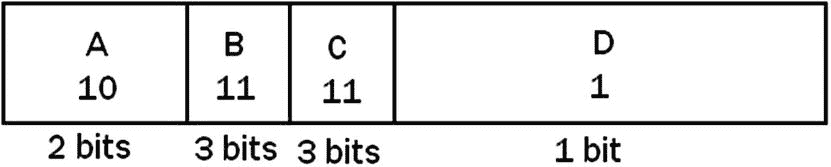

图 2-24

数字编码信息源

图中较大的区域用较少的比特编码，而较小的区域需要较多的比特。此信息源的期望值是某个值的概率与该值本身的乘积的所有值的总和。在本例中，期望值计算如下:

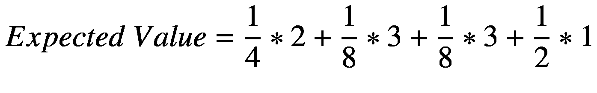

图中的区域每缩小一半，位数就增加一位。当大小减半时，概率也降低了 0.5。从这个图可以得出的结论是，一个随机事件的信息 *x* 与事件概率的倒数的对数(底数为 2)成正比。在方程式中，这是

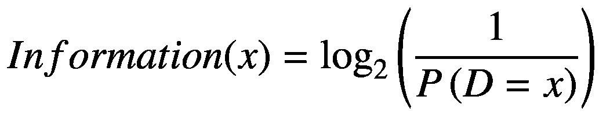

一般来说，随机变量的期望信息或“熵”与期望值相同，该值中填入了信息:

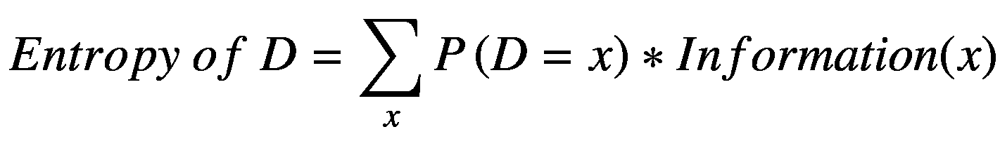


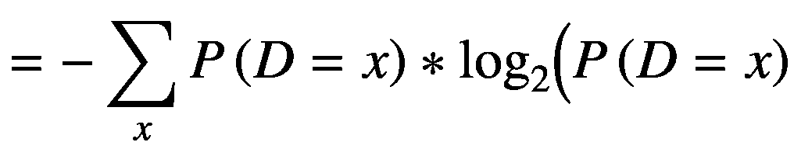

##### 熵的性质

当组成元素是异质的(不纯的)时，熵最大化:如果


然后，


相反，当元素是同质的(纯的)时，熵最小:

如果 *p* <sub>*i*</sub> = 1 或者 *p* <sub>*i*</sub> = 0

然后，


熵的定义是

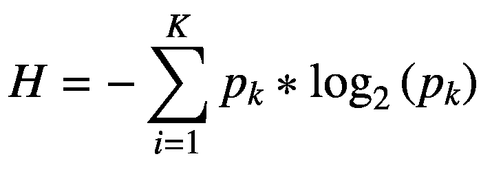

那么熵的任何变化都被认为是信息增益，并定义为

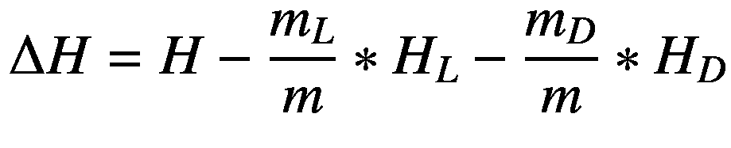

其中𝑚是实例总数，𝑚 <sub>𝑘</sub> 属于𝑘类，𝐾 = 1，…，𝑘.

##### 信息增益示例

下面的例子可以看作是朴素贝叶斯部分中所示例子的扩展。Table [2-6](#Tab6) 有几个额外的特性，在决定是否在给定的一组条件下玩游戏时会计算这些特性。

表 2-6

游戏决策

<colgroup><col class="tcol1 align-left"> <col class="tcol2 align-left"> <col class="tcol3 align-left"> <col class="tcol4 align-left"> <col class="tcol5 align-left"></colgroup> 
| 

观点

 | 

温度

 | 

湿度

 | 

有风的

 | 

玩

 |
| --- | --- | --- | --- | --- |
| 快活的 | 热的 | 高的 | 错误的 | 不 |
| 快活的 | 热的 | 高的 | 真实的 | 不 |
| 遮蔽 | 热的 | 高的 | 错误的 | 是 |
| 下雨的 | 温和的 | 高的 | 错误的 | 是 |
| 下雨的 | 凉爽的 | 标准 | 错误的 | 是 |
| 下雨的 | 凉爽的 | 标准 | 真实的 | 不 |
| 遮蔽 | 凉爽的 | 标准 | 真实的 | 是 |
| 快活的 | 温和的 | 高的 | 错误的 | 不 |
| 快活的 | 凉爽的 | 标准 | 错误的 | 是 |
| 下雨的 | 温和的 | 标准 | 错误的 | 是 |
| 快活的 | 温和的 | 标准 | 真实的 | 是 |
| 遮蔽 | 温和的 | 高的 | 真实的 | 是 |
| 遮蔽 | 热的 | 标准 | 错误的 | 是 |
| 下雨的 | 温和的 | 高的 | 真实的 | 不 |

播放属性的信息值计算如下:

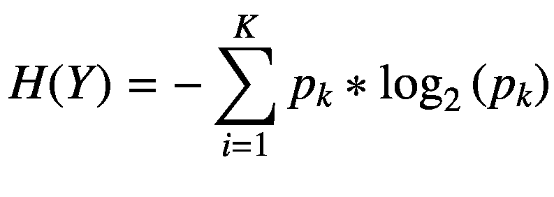

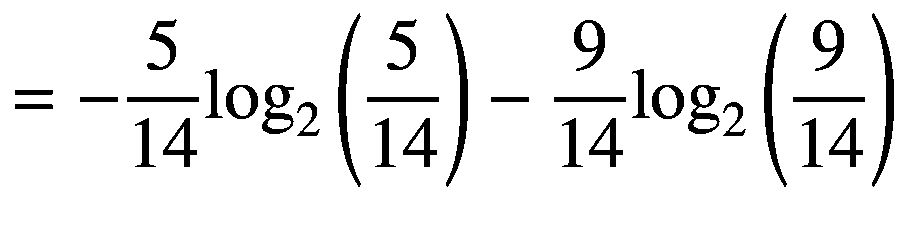

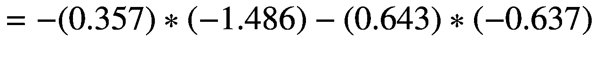


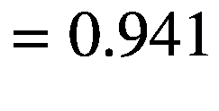

现在，考虑选择湿度属性时的信息增益。

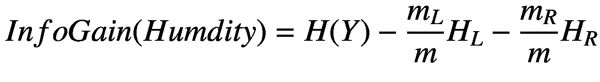

在哪里

*   *m* =湿度样本数

*   *m* <sub>*L*</sub> =数值=正常的湿度样本数

*   *m* <sub>*R*</sub> =数值=高的湿度实例数

*   *H* <sub>*L*</sub> = IV 对于湿度值=正常的例子

*   *H* <sub>*R*</sub> = IV 对于湿度值=高的例子

替代收益率


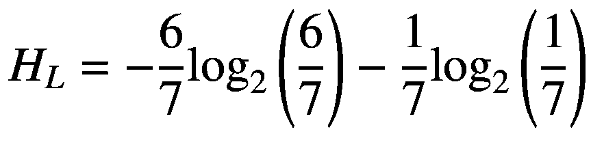

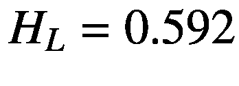


对所有剩余特征执行前述计算得出

*   前景= 0.247

*   温度= 0.029

*   湿度= 0.152

*   风= 0.048

初始分割将使用 Outlook 功能完成，因为根据 ASM 流程，它具有最高的信息增益值。

图 [2-25](#Fig25) 显示了下一级的最佳分割，以及每次分割的相关选定属性和信息增益。


图 2-25

下一级用信息增益值分割

图 [2-26](#Fig26) 为最终决策树。


图 2-26

最终决策树图

注意，并不是所有的叶子都需要纯净；有时相似(甚至相同)的实例有不同的类。当数据不能再分割时，分割停止。

##### 基尼指数

决策树算法 CART(分类和回归树)使用基尼方法来创建拆分点。计算基尼指数的公式是


其中 *p* <sub>*i*</sub> 是 *D* 中一个元组属于 *C* <sub>*i*</sub> 类的概率。

基尼指数考虑了每个属性的二元分裂。你可以计算每个分区的杂质的加权和。如果对属性 *A* 进行二进制分割，将数据 *D* 划分为 *D* <sub>*1*</sub> 和 *D* <sub>*2*</sub> ，则 D 的基尼指数为


在离散值属性的情况下，给出所选属性的最小基尼指数的子集被选为分裂属性。在连续值属性的情况下，策略是选择每对相邻值作为可能的分裂点，并选择具有较小基尼指数的点作为分裂点。


选择具有最小基尼指数的属性作为分裂属性。

当元素是异质的(不纯的)时，该索引最大化。

如果


然后


相应地，当元素是同质的(纯的)时，指数最小。

如果

𝑝 <sub>𝑖</sub> = 1 或者𝑝 <sub>𝑖</sub> = 0

然后

基尼= 1-1-0 = 0

###### 简单的基尼指数示例

我将从表 [2-7](#Tab7) 所示的任意数据集开始，该数据集有五个特征，其中特征 E 是预测性的。这个特征有两类，正面的或负面的。恰好每个类中有相同数量的实例，只是为了简化计算。

表 2-7

任意数据集

<colgroup><col class="tcol1 align-left"> <col class="tcol2 align-left"> <col class="tcol3 align-left"> <col class="tcol4 align-left"> <col class="tcol5 align-left"> <col class="tcol6 align-left"></colgroup> 
| 

索引

 | 

A

 | 

B

 | 

C

 | 

D

 | 

E

 |
| --- | --- | --- | --- | --- | --- |
| one | Four point eight | Three point four | One point nine | Zero point two | 积极的 |
| Two | five | three | one point six | One point two | 积极的 |
| three | five | Three point four | one point six | Zero point two | 积极的 |
| four | Five point two | Three point five | One point five | Zero point two | 积极的 |
| five | Five point two | Three point four | One point four | Zero point two | 积极的 |
| six | Four point seven | Three point two | one point six | 0..2 | 积极的 |
| seven | Four point eight | Three point one | one point six | Zero point two | 积极的 |
| eight | Five point four | Three point four | One point five | Zero point four | 积极的 |
| nine | seven | Three point two | Four point seven | One point four | 否定 |
| Ten | Six point four | Three point two | Four point seven | One point five | 否定 |
| Eleven | Six point nine | Three point one | Four point nine | One point five | 否定 |
| Twelve | Five point five | Two point three | four | One point three | 否定 |
| Thirteen | Six point five | Two point eight | Four point six | One point five | 否定 |
| Fourteen | Five point seven | Two point eight | Four point five | One point three | 否定 |
| Fifteen | Six point three | Three point three | Four point seven | one point six | 否定 |
| Sixteen | Four point nine | Two point four | Three point three | one | 否定 |

计算基尼指数的第一步是为每个特征或属性选择一些随机值进行分类(初始分割)。为该数据集选择的值如表 [2-8](#Tab8) 所示。

表 2-8

初始分割属性值

<colgroup><col class="tcol1 align-left"> <col class="tcol2 align-left"> <col class="tcol3 align-left"> <col class="tcol4 align-left"></colgroup> 
| 

A

 | 

B

 | 

C

 | 

D

 |
| --- | --- | --- | --- |
| >= 5.0 | >= 3.0 | >= 4.2 | >= 1.4 |
| < 5.0 | < 3.0 | < 4.2 | < 1.4 |

计算属性 A 的基尼指数:

*   值> = 5

*   实例数量= 12

*   实例数> =5，正数= 5

*   实例数> = 5，负数= 7

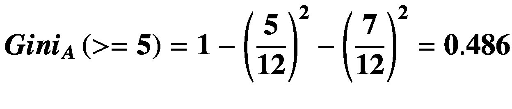

*   值:< 5

*   实例数量= 4

*   实例数> =5，正数= 3

*   实例数> = 5，负数= 1


加权和求和产量


以类似的方式计算剩余的属性得到


使用基尼系数时的初始分界点总是最小值。基于计算指标的最终决策树如图 [2-27](#Fig27) 所示。


图 2-27

简单基尼指数示例的最终决策树

#### 增益比

增益比是对信息增益的修改，它减少了对高度分支特征的偏差。该算法在选择特征时考虑了分支的数量和大小。这是通过用分割的“内在信息”来标准化信息增益来实现的，分割的“内在信息”被定义为确定一个实例所属的分支所需的信息。对于具有许多结果的属性，信息增益是正偏向的。这意味着信息增益算法更喜欢具有大量不同值的属性。

##### 内在信息

内在信息表示通过将数据集分成 *K* 个分区而生成的潜在信息:

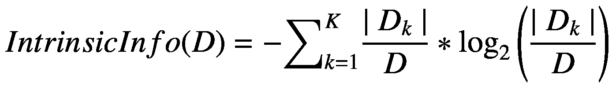

具有高内在信息的分区应该在大小上相似。很少分区保存大多数元组的数据集具有固有的低内在信息。

##### 增益比的定义

增益比定义为


选择具有最大增益比的特征作为分割特征。

ID3 是迭代二分器 3 的首字母缩写，是 Ross Quinian 发明的一种算法，用于实现增益比 ASM。Ross 后来发明了 C4.5 算法，这是对 ID3 的改进，目前在大多数使用增益比算法的机器学习系统中使用。需要注意的是，术语 *SplitInfo* 在 C4.5 算法中用于表示 *IntrinsicInfo* 。除了模糊之外，基本增益比算法没有改变。

这里不会给出增益比的例子，因为这方面的内容太广泛了，如果你已经通读了这个结尾，你可能对 ASM 过程有很好的理解。

### 用 scikit-learn 演示决策树分类器

这个决策树演示将使用来自机器学习社区的经典数据集，称为 Pima Indian 糖尿病数据集。数据集可以 CSV 格式从以下网址下载

```py
www.kaggle.com/uciml/pima-indians-diabetes-database#diabetes.csv

```

这个数据集最初来自国家糖尿病、消化和肾脏疾病研究所。本演示的目的是根据数据集中包含的某些诊断测量结果，对患者是否患有糖尿病进行诊断性预测。从一个较大的数据库中选择这些实例有几个限制。特别是，这里的所有患者都是至少 21 岁的皮马印第安血统的女性。

下载的 CSV 文件已存档，在使用前必须解压缩。此外，您必须从文件中删除第一行，因为它包含字符串列标题描述。保留此行将导致预测函数失败，因为字符串内容无法转换为浮点类型。我建议使用任何可以加载 CSV 文件的电子表格应用。我碰巧使用了微软的 Excel 程序，但是任何开源的 Linux 应用都可能工作。

我将分两个阶段开发 Python 脚本，同时讨论关于决策树分类器模型的底层方法。第一阶段将加载所有依赖项以及 CSV 文件。还会显示 CSV 文件头信息，以确认成功加载。第二阶段将是构建、训练和测试决策树模型。

第一步是加载所需的库，包括来自 sklearn 软件包的`DecisionTreeClassifier`数据模型。默认情况下，该数据模型使用 Gini ASM 流程，但是如果需要另一个 ASM 流程，可以进行更改。

```py
# Load libraries
import pandas as pd
from sklearn.tree import DecisionTreeClassifier # Import Decision Tree Classifier
from sklearn.model_selection import train_test_split # Import train_test_split function
from sklearn import metrics #Import scikit-learn metrics module for accuracy calculation
col_names = ['pregnant', 'glucose', 'bp', 'skin', 'insulin', 'bmi', 'pedigree', 'age', 'label']

```

下一步是使用 Pandas 的 read CSV 函数加载所需的 Pima Indian 糖尿病数据集。确保下载的数据集与脚本位于相同的当前目录中。

```py
# Load dataset
pima = pd.read_csv("diabetes.csv", header=None, names=col_names)
pima.head()

```

图 [2-28](#Fig28) 显示了包含前五条记录的 CSV 文件头部分。


图 2-28

糖尿病. csv 标题结果

下一步是将给定的列分成两种类型的变量:相关变量(目标变量)和独立变量(特征变量)。

```py
#split dataset in features and target variable
feature_cols = ['pregnant', 'insulin', 'bmi', 'age','glucose','bp','pedigree']
X = pima[feature_cols] # Feature variables
y = pima.label # Target variable

```

模型性能要求将数据集分为定型集和测试集。可以使用函数`train_test_split()`分割数据集。必须向该方法传递三个参数，即 features、target 和 test_set size。

```py
# Split dataset into training set and test set
# 70% training and 30% test
X_train, X_test, y_train, y_test = train_test_split(X, y, test_size=0.3, random_state=1)

```

下一步是从 sklearn 软件包中实例化一个决策树数据模型。该模型被命名为`clf`，并且使用从原始数据集分割的 70%的训练数据集来容易地训练。最后，使用模型的`predict()`方法，使用数据集的剩余 30%自动进行一系列预测。

在`X_test`中存储的测试数据中，标签被视为样本，以`predict()`方法输入到分类器中。样品在下面的数据中给出。将它提供给`predict()`方法是无效的，因为它是字符串，而不是浮点。使用`drop()`功能将其移除。这是`X_txt.drop(0)`的返回结果，也是提供给`predict ()`方法的内容。

```py
['Pregnancies','Insulin','BMI','Age','Glucose','BloodPressure','DiabetesPedigreeFunction']
# Create Decision Tree classifer object
clf = DecisionTreeClassifier()
# Train Decision Tree Classifer
clf = clf.fit(X_train,y_train)
#Predict the response for test dataset
y_pred = clf.predict(X_test.drop(0))

```

最后一步是测量预测集的整体准确性。通过比较实际测试集值和预测值来计算准确度。scikit-learn 包中的`metrics`模块用于此精度测量。

请注意，`y_test`变量包括标签`'Outcome'`，它是字符串。要删除它，使用`drop()`功能。

```py
# Model accuracy
print("Accuracy:",metrics.accuracy_score(y_test.drop(0), y_pred))

```

最终结果是以下分数:

```py
Accuracy: 0.6753246753246753

```

67.5%是一个合理的准确度分数。但是，可以通过调整决策树算法使用的超参数来改进，我将在后面的部分演示。

完整的脚本列表如下所示，命名为 diabetesDT.py，可从本书的配套网站获得。

```py
# Load libraries
import pandas as pd
from sklearn.tree import DecisionTreeClassifier # Import Decision Tree Classifier
from sklearn.model_selection import train_test_split # Import train_test_split function
from sklearn import metrics #Import scikit-learn metrics module for accuracy calculation

col_names = ['pregnant', 'glucose', 'bp', 'skin', 'insulin', 'bmi', 'pedigree', 'age', 'label']
# Load dataset
pima = pd.read_csv("diabetes.csv", header=None, names=col_names)
print(pima.head())

#split dataset in features and target variable
feature_cols = ['pregnant', 'insulin', 'bmi', 'age', 'glucose', 'bp', 'pedigree']
X = pima[feature_cols] # Features

y = pima.label # Target variable
# Split dataset into training set and test set
# 70% training and 30% test
X_train, X_test, y_train, y_test = train_test_split(X, y, test_size=0.3, random_state=1)

# Create Decision Tree classifer object
clf = DecisionTreeClassifier()
# Train Decision Tree Classifer
clf = clf.fit(X_train,y_train)

#Predict the response for test dataset
y_pred = clf.predict(X_test.drop(0))

# Model accuracy

print("Accuracy:",metrics.accuracy_score(y_test.drop(0), y_pred))

```

#### 可视化决策树

scikit-learn 的`export_` `graphviz`函数可用于显示决策树。这个显示函数也需要 pydotplus 库。使用以下命令安装这些库:

```py
pip install graphviz
pip install pydotplus
sudo apt-get install python-pydot

```

*`export_graphviz`函数将最终的决策树分类器文件转换为点文件。pydotplus 应用然后将这个点文件转换为 png 格式的文件，可以使用系统的图像查看器应用显示该文件。*

 *以下脚本名为 diabetesDT.py，可从该书的配套网站获得:

```py
# Load all required libraries
import pandas as pd
from sklearn.tree import DecisionTreeClassifier
from sklearn.model_selection import train_test_split
from sklearn.tree import export_graphviz
from sklearn.externals.six import StringIO
from sklearn import tree
import pydotplus
import collections

col_names = ['pregnant', 'glucose', 'bp', 'skin', 'insulin', 'bmi', 'pedigree', 'age', 'label']
# Load dataset
pima = pd.read_csv("diabetes.csv", header=None, names=col_names)

#split dataset in features and target variable
feature_cols = ['pregnant', 'insulin', 'bmi', 'age', 'glucose', 'bp', 'pedigree']
X = pima[feature_cols] # Features
y = pima.label # Target variable
# Split dataset into training set and test set
# 70% training and 30% test
X_train, X_test, y_train, y_test = train_test_split(X, y, test_size=0.3, random_state=1)

# Create Decision Tree classifer object
clf = DecisionTreeClassifier()

# Train Decision Tree Classifer
clf = clf.fit(X_train,y_train)

dot_data = tree.export_graphviz(clf, out_file=None, filled=True, rounded=True, special_characters=True, feature_names= feature_cols, class_names=['0','1'])
graph = pydotplus.graph_from_dot_data(dot_data)

colors = ('turquoise', 'orange')
edges = collections.defaultdict(list)

for edge in graph.get_edge_list():
    edges[edge.get_source()].append(int(edge.get_destination()))

for edge in edges:
    edges[edge].sort()
    for i in range(2):
        dest = graph.get_node(str(edges[edge][i]))[0]
        dest.set_fillcolor(colors[i])

graph.write_png('tree.png')

```

您可以通过输入以下命令来生成 png 树图像:

```py
python diabetesDT.py

```

请有点耐心，因为这个命令需要大约 20 秒才能完成。在脚本完成运行后，除了提示符再次出现之外，您在监控器屏幕上什么也看不到。但是，在主目录中将有一个名为 tree.png 的新映像。图 [2-29](#Fig29) 显示了该图像。


图 2-29

tree.png

我完全意识到不可能阅读图像中显示的极小的文本，这就是为什么我放大了图像的一小部分。该部分如图 [2-30](#Fig30) 所示。

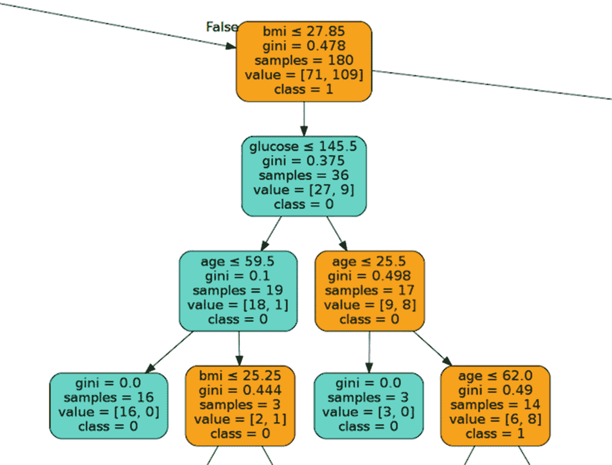

图 2-30

树图像的放大部分

在此决策树图表中，每个内部节点都有一个拆分数据的决策规则。基尼系数(Gini ratio)衡量的是节点的不纯度，这一点我在题外讨论过。当一个节点的所有记录都属于同一个类时，这个节点就是纯的。这样的节点称为叶节点。

这个脚本创建的结果树是未修剪的。这种未修剪的树本质上是不可解释的，也不容易理解。我将在下一节讨论如何通过修剪来优化它。

#### 优化决策树

有三个超参数可用，这将允许优化决策树分类器的性能。这些是

*   标准:可选(默认值=“Gini”)或选择属性选择度量–此参数允许选择不同的 ASM。可用的标准是基尼指数的“基尼”和信息增益的“熵”。

*   splitter: string，可选(default="best ")或 Split Strategy–该参数允许选择分割策略。可用的策略是“最佳”选择最佳分割，“随机”选择最佳随机分割。

*   max_depth: int 或 None，可选(默认值=None)或树的最大深度–该标准设置树的最大深度。如果没有，则扩展节点，直到所有叶子包含少于`min_samples_split`个样本。最大深度的较高值可能会导致过度拟合，而较低的值可能会导致拟合不足。

在 scikit-learn 中，决策树分类器的优化是在分类器实例化时完成的。树的最大深度用于预修剪。修改了 pimaDiabetes.py 脚本，将树深度限制为 3，并将 ASM 更改为熵。为实现这一优化，对脚本进行了以下代码更改:

```py
# Create Decision Tree classifer object
clf = DecisionTreeClassifier(criterion="entropy", max_depth=3)

```

该脚本被重新运行，并获得了新的准确度分数`0.7705627705627706`。这个 77%的分数优于没有输入性能参数时获得的 67.5%的分数。

diabetesDT.py 也使用这些新的性能参数重新运行。该树形图被重新标记为 tree1.png，以区别于最初的版本。图 [2-31](#Fig31) 显示了使用优化的超参数的新树形图。


图 2-31

tree1.png

这种修剪模型比以前的决策树图简单得多，也更容易理解。

#### 决策树的利与弊

##### 赞成的意见

*   决策树很容易解释和可视化。

*   他们可以很容易地捕捉非线性模式。

*   它们需要用户更少的数据预处理。

*   它们可用于特征工程，例如预测适合变量选择的缺失值。

*   决策树没有关于数据分布的假设，因为它们是非参数的。

##### 骗局

*   他们对嘈杂的数据很敏感。由于有噪声的数据，它们很容易过度拟合。

*   数据中的微小变化(或差异)会导致不同的决策树。

*   不平衡的数据集会使决策树产生偏差。建议在创建决策树之前平衡数据集。**