# 9.强化学习

大多数读者可能听说过人工智能学习自己玩电脑游戏，一个非常受欢迎的例子是 DeepMind。DeepMind 团队在 2016 年的国际新闻中，他们的 AlphaGo 程序击败了韩国围棋世界冠军。同样，过去也有许多开发软件代理的成功尝试，目的是玩雅达利游戏，如*突围*、*乒乓*和*太空入侵者*。

这些程序都遵循一个被称为强化学习(RL)的 ML 范式。以下是 RL 工作原理的简单类比。

想想 1978 年雅达利的经典游戏 *Breakout* 。这个游戏的目标是通过从屏幕底部弹回一个球来清除屏幕顶部的所有砖块。你控制屏幕底部的一个拍子，拍子拍球。每打一块砖就会消失，分数增加，也就是有奖励给。图 [9-1](#Fig1) 显示了一系列的*突围*截图，展示了游戏如何运作。


图 9-1

雅达利突围游戏截图

现在让我们考虑如何教会人工神经网络玩这个游戏。一种方法是输入一系列截图，并提供输出，如右移桨、左移桨或开火，意思是发射球。从这个意义上来说，学习过程变成了一个分类问题，在这个问题中，一个给定的屏幕图像意味着采取三个动作中的一个。这看起来很简单，但是想想这需要大量的训练例子。这种方法是相当幼稚的，因为不需要一个游戏专家去陈述做这个或做那个几万次。所需要的是某种类型的反馈，即所采取的行动是正确的或接近正确的，并允许一些自我纠正。

RL 试图解决这类问题。RL 要么是有监督的，要么是无监督的学习。有监督学习对每个训练样本都有一个目标标签，无监督学习没有标签。RL 有稀疏的“标签”，是延时的，叫做奖励。软件代理必须学习仅仅基于奖励的行为。

实际上，在为*突围*游戏实现 RL 算法的过程中存在许多挑战。事实证明，给出的奖励可能与给出奖励之前立即采取的行动没有多大关系。奖励发生在砖块被球击中的时候，但是球拍必须放在正确的位置，并且发射按钮在正确的时间被击中。直接奖励与任何和所有必要的在先行为之间的脱节被称为信用分配问题，即哪一个在先行为对奖励负责，以及在多大程度上负责？

玩*突围*就此而言，大多数其他游戏通常需要策略。通常，玩家会以随机的方式开始玩游戏，但最终会随着他们观察游戏的展开而改变他们的游戏策略。例如，在*突破*中，球倾向于向左飞，而不是向右飞。一个简单的策略是将球拍移向左侧，这通常会得到更多的分数。但这可能不是提高分数的唯一方法。确定最优策略的方法被称为探索-利用困境，这是在试图获得最大回报时要考虑的一个有用的框架。

RL 模型是一种封装我们人类学习经验的有用方式，无论是在学校、企业，甚至是政府或军事环境中。在我们所有的活动中，每天都会出现信用分配和探索开发的困境。RL 是一个需要探索和实验的重要话题，游戏是完美的无威胁沙盒。

在经历了下面所有的演示之后，我将进一步讨论 Q-learning 和 DL 是如何相交的。在这一点上，你应该已经获得了 Q-学习欣赏和理解结论性讨论的良好背景。

## 马尔可夫决策过程

马尔可夫决策过程(MDP)是 RL 的形式化方法。让我们假设你是一个代理人，身处一个类似于*突围*游戏的环境中。环境处于特定状态(例如，球拍位置、球位置和方向、砖块数量等)。).代理在这种环境中执行某些操作，例如向左或向右移动踏板。行动有时会带来回报。任何行动都会在一定程度上改造环境，会导致新的状态。代理然后可以执行另一个动作，导致另一个状态，等等。如何选择这些操作的规则集称为策略。环境通常是随机的，这意味着下一个状态在某种程度上是随机的。对于*突围*游戏，这意味着每一个新的球都是以随机的方向发射的。

图 [9-2](#Fig2) 是 MDP 数据流的示意图。


图 9-2

MDP 数据流

MDP 由状态、动作和从一种状态转换到另一种状态的规则组成。这个过程的一个插曲(游戏)可以被表达为状态、动作和奖励的有限序列


在哪里

*s*<sub>T3】IT5】=状态</sub>

*a*<sub>T3】IT5】=行动</sub>

*r*<sub>T3】I+1</sub>=行动后奖励 *a* <sub>*i*</sub>

剧集以终端状态*s*<sub>T3】nT5】结束。MDP 依赖于马尔可夫假设，即下一个状态 *s* <sub>*i* + 1</sub> 的概率仅取决于当前状态 *s* <sub>*i*</sub> 和动作 *a* <sub>*i*</sub> ，而不取决于先前的状态或动作。</sub>

### 未来奖励折扣

为了让 MDP 表现良好，必须考虑到长期回报和即时回报。一集的总报酬可以表示为


从时间点 t 开始的总的未来回报可以表示为

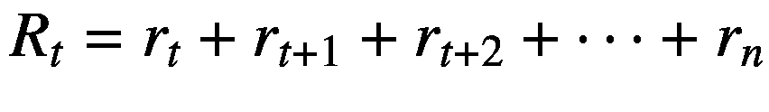

因为环境是随机的，所以在下一次执行相同的行为时，永远不会有关于相同奖励的确定性决策。对未来回报考虑得越深入，分歧就越大。为了说明这种不确定性，通常使用贴现的未来报酬，表示为


在哪里

γ =折扣系数(取值范围为 0 到 1.0)

因为折扣因子小于 1.0，并且它被提高到幂，所以所有未来的奖励都被大量减少或折扣。在时间步长 t 的贴现的未来奖励可以用在时间步长 t+1 的相同事物来表示:


如果贴现因子γ设置为 0，那么该策略将没有长期参与，只依赖于眼前的回报。当前和未来奖励之间的平衡应该有一个折扣因子，例如 *γ* = 0.9。如果环境不太可能是决定性的，并且相同的行动总是导致相同的回报，那么折扣因子可以设置为 1.0。

对一个代理人来说，一个好的策略是总是选择一个最大化(贴现的)未来回报的行动。

### q 学习

在 Q-learning 中，一个函数*Q*(*s*<sub>T5】t</sub>， *a* <sub>*t*</sub> )被定义为当动作 *a* <sub>*t*</sub> 在状态 *s* <sub>*t*</sub> 中执行并从该点开始最优地继续时，表示最大贴现未来报酬的函数


一种思考*Q*(*s*<sub>T5】t</sub>， *a* <sub>*t*</sub> )的方法是，它是“在执行动作 *a* <sub>*t*</sub> 处于状态 *s* <sub>*t*</sub> 后，游戏结束时可能的最佳得分。”它被称为 Q 函数，因为它代表了给定状态下某个动作的“质量”。

乍一看，Q 函数似乎是一个令人困惑的定义。如何估计游戏结束时的最终分数？未来的状态和动作根本不知道。但是，假设这样一个函数存在，对于支持一个最大化未来可能回报的假设是必不可少的。

接下来考虑拥有这样一个函数的含义。假设有一个状态有两种可能的行为。应该选择游戏结束时得分最高的动作。但是，应该选择哪个动作呢？一旦你有了 Q 函数，答案就变得简单了。只需选择 Q 值最高的动作。下面的等式代表了这种策略:

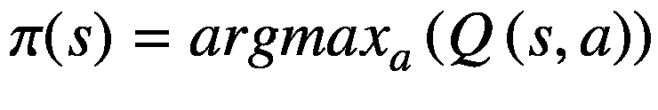

在哪里

*π* =策略(在给定状态下如何选择动作的规则)

现在的问题是，根据前面的讨论，Q 函数是如何定义的？我将首先只关注一个转换( *s，a，r，s’*)，其中*s’*表示 *s* 之后的下一个状态。状态 *s* 和动作 *a* 的 Q 值可以用下一个状态*s’*的 Q 值来表示


这个方程被称为贝尔曼方程。这是一个非常简单的概念，当前状态和行为的最大未来回报是当前回报加上下一个状态的最大未来回报。

Q 学习中的主要概念是可以使用贝尔曼方程迭代地逼近 Q 函数。在最简单的情况下，Q 函数可以实现为一个表，状态作为行，动作作为列。

Q 学习算法的流程图如图 [9-3](#Fig3) 所示。

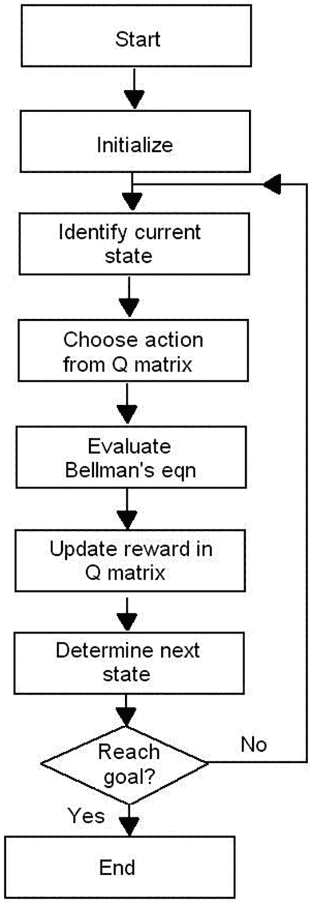

图 9-3

q-学习流程图

Q 学习算法从从输入识别当前状态 *s* 开始。在识别状态之后，将从动作列表中选择一个动作，或者通过搜索最大报酬，或者如果是随机的，通过接受贪婪概率 *ε* 。所有的值在前面的步骤中初始化，在状态 *s* 中采取的动作的 Q 值使用贝尔曼方程计算。然后，Q 值将存储在 Q 表中。换句话说，代理的体验是在 Q 表中捕获的。所提出的 Q 学习的奖励和惩罚由一组为奖励函数(策略)设置的简单规则来评估。Q 学习算法的下一个状态 *s* 将在所选择的动作 *a* 被执行之后被确定。当已经确定下一个状态 s’时，将检查 Q 学习算法的停止标准。如果下一个状态 *s* 是 Q 学习的最终目标，则该过程将结束，否则下一个状态 *s* 将成为另一个迭代的当前状态 *s* 。这个过程一直持续到达到目标或满足停止标准。

下面是一个算出的例子，它应该有助于阐明 Q-learning 过程。

#### q-学习示例

我首先要感谢几个博客作者的精彩帖子，正是这些帖子激发了这个例子。他们还受到了其他人的启发，这些人解决了解释 Q-learning 的复杂问题，以便人工智能社区更好地理解这个主题。这些博客是:

“强化学习:一个简单的 Python 例子和一个更接近人工智能的辅助学习”Manuel Amunategui

[T2`https://l-ing.ru/watch/Reinforcement-Learning--A-Simple-Python-Example-and-A-Step-Closer-to-AI-with-Assisted-QLearning/`](https://l-ing.ru/watch/Reinforcement-Learning--A-Simple-Python-Example-and-A-Step-Closer-to-AI-with-Assisted-QLearning/)

《用 Qlearning 让 AI 更聪明:Python 中简单的第一步》来自初级程序员

 *[T2`http://firsttimeprogrammer.blogspot.com/2016/09/getting-ai-smarter-with-q-learning.html`](http://firsttimeprogrammer.blogspot.com/2016/09/getting-ai-smarter-with-q-learning.html)

[T2`http://mnemstudio.org/path-finding-q-learningtutorial.htm`](http://mnemstudio.org/path-finding-q-learningtutorial.htm)

本例首先显示一栋有五个房间的建筑的平面图，如图 [9-4](#Fig4) 所示。

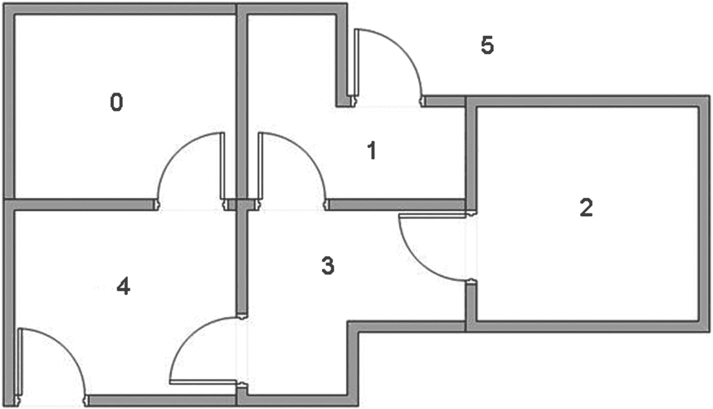

图 9-4

示例建筑的平面图

建筑中的每个房间都有一个门，机器人或代理可以通过这个门向两个方向移动。请注意，在图中，房间 1 和 4 中的门通向外部，在本例中，外部被描述为“房间”5。然而，要实现的目标是让代理进入 5 号房间，即外面。代理可以放在任何房间开始。奖励值将被分配到每个门，与不直接通向目标的门奖励相比，最终目标将有非常大的奖励。

图 [9-5](#Fig5) 是一个节点图，描述了房间之间所有可能的路径，以及哪些是可能成功的路径。


图 9-5

节点图

如前所述，代理可以放置在任何房间开始，并从该房间，走到建筑物外面(这是目标房间 5)。为了将这个房间设置为目标，奖励值与每个门相关联。直接通向目标的门有 100 的即时奖励。其他不直接与目标房间相连的门，奖励为 0。每个房间都有两个箭头，因为门是双向的(0 指向 4，4 指向 0)。每个箭头包含一个即时奖励值，如图 [9-6](#Fig6) 所示。

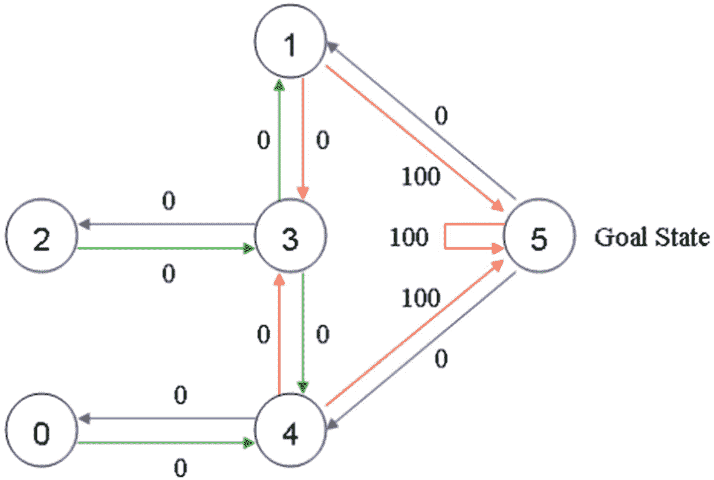

图 9-6

带奖励注释的节点图

请注意，在图中，房间 5 中的一条路径以 100 的奖励返回到自身，而所有其他到目标房间的链接的奖励都是 100。在 Q-learning 中，目标是达到奖励最高的状态，这样如果智能体到达目标，它应该永远保持在那里。这种目标类型被称为“吸收性目标”

把我们的代理想象成一个可以通过经验学习的虚拟机器人。代理可以从一个房间到另一个房间，但对环境一无所知，也不知道哪扇门通向外面。

目标是确定代理从建筑物中的任何房间到外面的路径。对于讨论的下一部分，假设代理从房间 2 开始，并试图到达建筑物的外部，指定为房间 5。图 9-7 很好地概括了这个初始环境。


图 9-7

初始环境

在 Q-learning 术语中，每个房间，包括外面，都是一个“状态”，代理从一个房间到另一个房间的移动是一个“动作”。因此，在前面的节点图中，“状态”被描绘为节点，而“动作”由箭头表示。

以下讨论参见图 [9-8](#Fig8) 。


图 9-8

初始行动

如前所述，代理从状态 2 开始。从状态 2，它只能转到状态 3，因为状态 2 只连接到状态 3。从状态 3，它可以进入状态 1 或 4，也可以回到状态 2。如果代理处于状态 4，则有三种可能的操作，即转到状态 0、5 或 3。如果代理处于状态 1，它可以进入状态 5 或 3。从状态 0，它只能回到状态 4。

可以构建矩阵“R”(用于奖励)来捕捉状态图和即时奖励值。图 [9-9](#Fig9) 显示了这个矩阵。

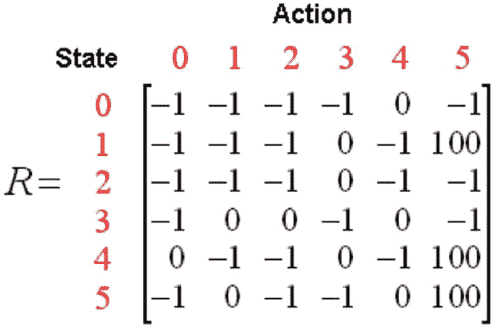

图 9-9

r 矩阵

表中的–1 表示空值(即节点之间没有链接)。例如，状态 0 不能进入状态 1。

现在，一个类似的矩阵“Q”被添加到智能体的大脑中。该矩阵表示代理通过经验所学内容的记忆。Q 矩阵的行表示代理的当前状态，列表示导致下一个状态的可能动作，即节点之间的链接。

因为代理开始时什么都不知道，所以 Q 矩阵被初始化为零。在这个例子中，状态的数量是 6，代表每个节点。如果状态的数量未知，Q 矩阵可以只从一个元素开始。随着新状态的发现，向 Q 矩阵中添加更多的列和行是一项简单的任务。

Q 学习的过渡规则是贝尔曼方程


代理将在没有老师的情况下通过经验学习，作为其无监督学习经验的一部分。代理从一个状态探索到另一个状态，直到它到达目标。每次探索被称为一集。每一集包括代理从初始状态到目标状态的移动。每次代理到达目标状态，脚本就进入下一集。

Q 学习算法可以总结如下:

1.  在 R 矩阵中设置 *γ* 参数和环境奖励。

2.  将 Q 矩阵初始化为零。

3.  对于每集(循环):

4.  选择一个随机的初始状态。

5.  如果尚未达到目标状态，则进行迭代(循环):
    *   为当前状态选择所有可能的操作之一。

    *   使用这个可能的动作，考虑到下一个状态。

    *   基于所有可能的动作获得下一个状态的最大 Q 值。

    *   计算- 

    *   将下一个状态设置为当前状态。

代理使用前面的算法从经验中学习。每一集相当于一节训练课。在每次训练中，代理探索由 R 矩阵表示的环境，并接受奖励(如果有),直到它达到目标状态。培训的目的是增强我们的代理的“大脑”,由 Q 矩阵表示。更多的训练导致更优化的矩阵 Q，就像 ANN 的情况一样。

你要意识到，用来更新 *Q* ( *s* ， *a* )的函数只是一个近似值，在训练的早期阶段，它可能是完全错误的。然而，近似值会随着每一集而提高，如果更新次数足够多，那么 Q 函数将会收敛并代表真实的 Q 值。

一旦 Q 矩阵得到增强，代理将找到到达目标状态的最快路线。为了使用增强的 Q 矩阵，代理简单地跟踪状态序列，从初始状态到目标状态。

以下是几个逐步手动完成的 Q 学习实验，希望能全面解释这个过程。

##### 手动 Q 学习实验

为了理解 Q-learning 算法是如何工作的，我将一步一步地经历几集。

第一集开始于将学习参数γ的值设置为 0.8，初始状态为房间 1。

Q 矩阵也被初始化为全 0，如图 [9-10](#Fig10) 所示。

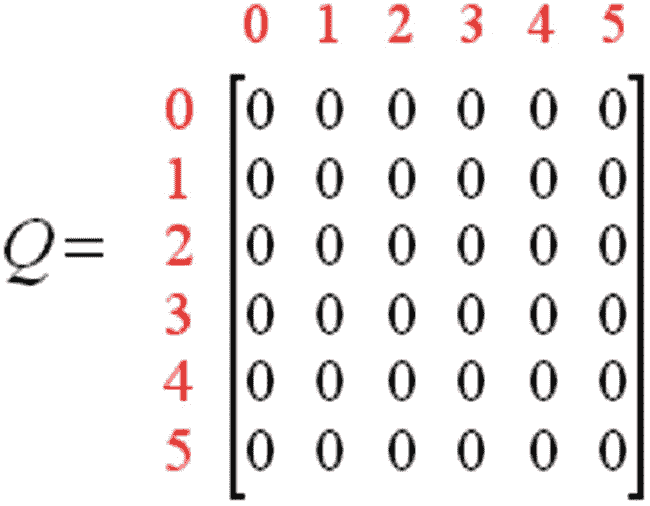

图 9-10

初始化 Q 矩阵

接下来检查如图 [9-9](#Fig9) 所示的 R 矩阵的第二行(状态 1)。当前状态 1 有两种可能的动作:

*   转到状态 3。

*   转到状态 5。

现在，假设通过随机选择，选择 5 作为动作。

接下来，想象一下如果代理处于状态 5 会发生什么。看 R 矩阵的第六行。它有三种可能的操作:

*   转到状态 1。

*   转到状态 4。

*   转到状态 5。

应用贝尔曼方程得出


因为 Q 矩阵仍然初始化为零， *Q* (5，1)*Q*(5，4)*Q*(5，5)都是 0。由于来自 *R* (1，5)的即时奖励，因此 *Q* (1，5)的计算结果是 100。

由于算法的原因，下一个状态 5 现在变成了当前状态。因为 5 是目标状态，所以这一集完了。代理的大脑现在包含一个增强的 Q 矩阵，如图 [9-11](#Fig11) 所示。


图 9-11

增强型 Q 矩阵

随机选择的初始状态开始下一集。假设状态 3 是初始状态。

查看 R 矩阵的第四行，您可以看到有三种可能的操作:

*   转到状态 1。

*   转到状态 2。

*   转到状态 4。

假设通过随机过程选择转到状态 1。接下来，假设代理处于状态 1。在 R 矩阵的第二行检查状态 1。您可以看到它有两种可能的操作:

*   转到状态 3。

*   转到状态 5。

现在必须使用贝尔曼方程计算 Q 值:


上一集的增强 Q 矩阵包含 Q(1，3) = 0 和 Q(1，5) = 100 的结果。计算的结果是 Q(3，1) = 80，因为奖励是零。Q 矩阵现在变成如图 [9-12](#Fig12) 所示。


图 9-12

修正 Q 矩阵

下一个状态 1 现在成为当前状态。现在重复 Q 学习算法的内部循环，因为状态 1 不是目标状态。

因此，在以当前状态 1 开始新的循环之后，有两种可能的动作:

*   转到状态 3。

*   转到状态 5。

通过随机选择，假设选择的动作是 5。如图 [9-13](#Fig13) 所示。


图 9-13

随机选择到状态 5

现在，假设代理处于状态 5。有三种可能的操作:

*   转到状态 1。

*   转到状态 4。

*   转到状态 5。

使用这些可能动作的最大值计算 Q 值:


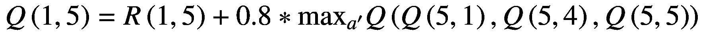


对于 *Q* (5，1)*Q*(5，4)*Q*(5，5)的 Q 矩阵的更新条目都是 0。Q(1，5)的计算结果是 100，因为这是 R(5，1)的即时回报。这个结果不会改变增强的 Q 矩阵。

因为 5 是目标状态，所以这一集就结束了。我们的代理人的大脑现在包含一个增强的 Q 矩阵，如图 [9-14](#Fig14) 所示。


图 9-14

修订的增强 Q 矩阵

代理人最终会通过完成更多集来了解更多信息。最终将达到 Q 矩阵中的收敛值，如图 [9-15](#Fig15) 所示。

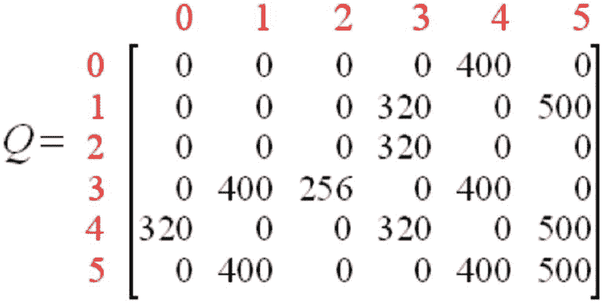

图 9-15

最终增强 Q 矩阵

然后，Q 矩阵可以通过将所有条目除以一个数来归一化，这将使得最高矩阵值等于 100。在这种情况下，数字是 5。该归一化矩阵如图 [9-16](#Fig16) 所示。


图 9-16

归一化 Q 矩阵

一旦 Q 矩阵收敛，代理就学习了到达目标状态的最佳路径。跟踪状态的最佳序列就像跟踪每个状态的最高值的链接一样简单。如图 [9-17](#Fig17) 所示。


图 9-17

具有最终标准化链接值的节点图

例如，从初始状态 2 开始，代理可以使用 Q 矩阵作为指导:

*   从状态 2 开始，最大 Q 值表明动作将进行到状态 3。

*   从状态 3 来看，最大 Q 值表示两种选择:
    *   转到状态 1。

    *   转到状态 4。

*   假设转到状态 4 动作被随机选择为转到状态 1。

*   从状态 1 开始，最大 Q 值表明动作将进行到状态 5。

*   因此，基于 Q 学习的最佳路径是 2 → 3 → 1 → 5。

##### 使用 Python 脚本的 Q-learning 演示

### 注意

我强烈建议你在阅读这一部分之前先阅读(或重读)前一部分。在这一节中，我不重复一步一步的解释。理解这些解释将使这一部分更容易理解和享受。

在这个演示中，我将在 Python 脚本中使用 Q-learning 来查找两点之间的最短路径。该脚本没有关于环境的先验知识，并且将仅通过使用 RL 来学习。

图 [9-18](#Fig18) 是由脚本创建的随机点图。

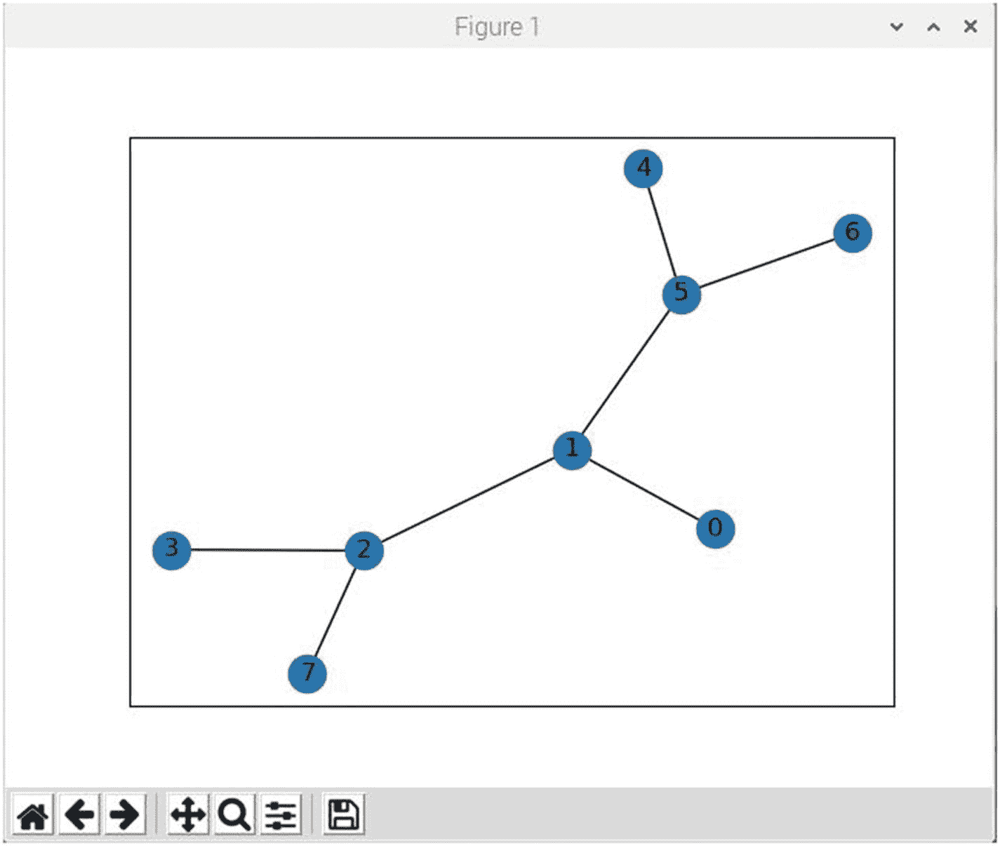

图 9-18

随机点图

点 0 将是开始位置，点 7 是目标和结束位置。该脚本的目标是使用 RL 算法确定起始位置和目标位置之间的最佳路径。地图中有明显的假路径和假目标，这些都必须被评估和丢弃。

您需要加载一个额外的库来准备运行这个脚本。输入以下命令以加载所需的库:

```py
pip install networkx

```

该脚本名为 simpleRL.py，可以从该书的配套网站上获得。对于这个脚本没有额外的解释性注释，因为我之前已经完成了 RL 过程的几个分步示例，我觉得您应该为理解这个相对简单的脚本如何工作做好充分的准备。

```py
# Import required libraries
import numpy as np
import pylab as plt
import networkx as nx

# Map cell to cell, add circular cell to goal point
points_list = [(0,1), (1,5), (5,6), (5,4), (1,2), (2,3), (2,7)]

# Set target node
goal = 7

# Create and display graph
G=nx.Graph()
G.add_edges_from(points_list)
pos = nx.spring_layout(G)
nx.draw_networkx_nodes(G,pos)
nx.draw_networkx_edges(G,pos)
nx.draw_networkx_labels(G,pos)
plt.show()

# Define points in graph
MATRIX_SIZE = 8

# Create matrix (MATRIX_SIZE * MATRIX_SIZE)
R = np.matrix(np.ones(shape=(MATRIX_SIZE, MATRIX_SIZE)))
R *= -1

# Assign zeros to paths and 100 to goal-reaching point
for point in points_list:
    print(point)
    if point[1] == goal:
        R[point] = 100
    else:
        R[point] = 0

    if point[0] == goal:
        R[point[::-1]] = 100
    else:
        # Reverse of point
        R[point[::-1]]= 0

# Add goal point round trip
R[goal,goal]= 100

# Create Q matrix
Q = np.matrix(np.zeros([MATRIX_SIZE,MATRIX_SIZE]))

# Set learning parameter gamma
gamma = 0.8

# Set initial start point
initial_state = 1

# Define available_actions method
def available_actions(state):
    current_state_row = R[state,]
    av_act = np.where(current_state_row >= 0)[1]
    return av_act

# Create variable to hold possible actions
available_act = available_actions(initial_state)

# Define method to randomly select next action
def sample_next_action(available_actions_range):
    next_action = int(np.random.choice(available_act,1))
    return next_action

# Create variable to hold the randomly selected action
action = sample_next_action(available_act)

# Define method to update state if needed
def update(current_state, action, gamma):

  max_index = np.where(Q[action,] == np.max(Q[action,]))[1]

  if max_index.shape[0] > 1:
      max_index = int(np.random.choice(max_index, size = 1))
  else:
      max_index = int(max_index)
  max_value = Q[action, max_index]

  # Bellman's equation
  Q[current_state, action] = R[current_state, action] + gamma * max_value
  print('max_value', R[current_state, action] + gamma * max_value)

  if (np.max(Q) > 0):
    return(np.sum(Q/np.max(Q)*100))
  else:
    return (0)

# Update the state based on selected action
update(initial_state, action, gamma)

# Training starts now
scores = []
for i in range(700):
    current_state = np.random.randint(0, int(Q.shape[0]))
    available_act = available_actions(current_state)
    action = sample_next_action(available_act)
    score = update(current_state,action,gamma)
    scores.append(score)
    print ('Score:', str(score))

# Display the rewards matrix
print('\nRewards matrix R\n')
print(R)

# Display the enhanced Q matrix
print('\nEnhanced Q matrix\n')
print(Q/np.max(Q)*100)

# Testing starts now
current_state = 0
steps = [current_state]

# Loop to determine optimal path
while current_state != 7:

    next_step_index = np.where(Q[current_state,] == np.max(Q[current_state,]))[1]

    if next_step_index.shape[0] > 1:
        next_step_index = int(np.random.choice(next_step_index, size = 1))
    else:
        next_step_index = int(next_step_index)

    steps.append(next_step_index)
    current_state = next_step_index

print("Most efficient path:")
print(steps)

plt.plot(scores)
plt.show()

```

##### 运行脚本

通过输入以下命令运行该脚本:

```py
python simpleRL.py

```

图 [9-19](#Fig19) 是收敛分数与已完成集数的关系图。

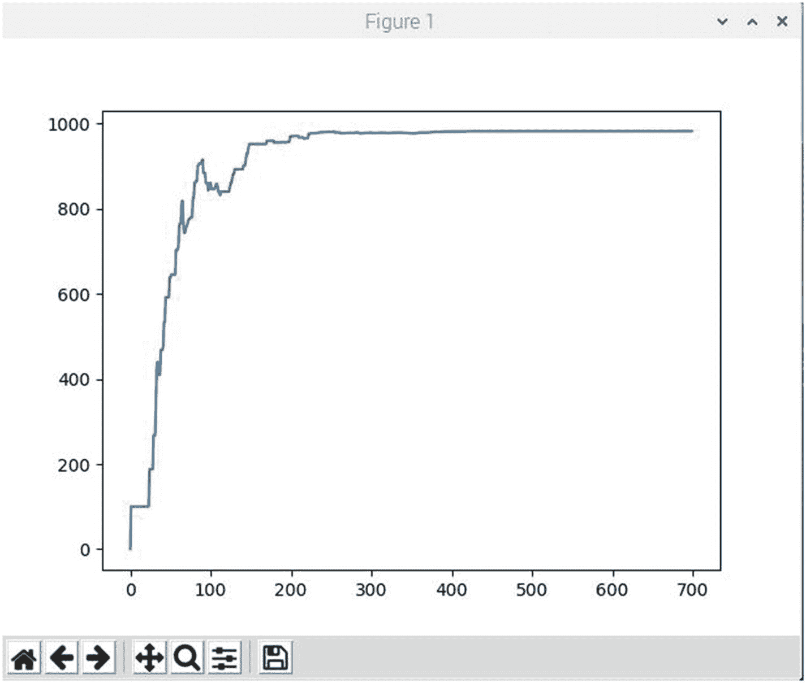

图 9-19

得分收敛图

你可以清楚地看到，在大约 400 集完成后，达到了最高得分。剧本被硬编码为 700 集。超过 400 集的 300 集所需的额外时间微乎其微。

图 [9-20](#Fig20) 显示了脚本完成运行后的终端窗口。

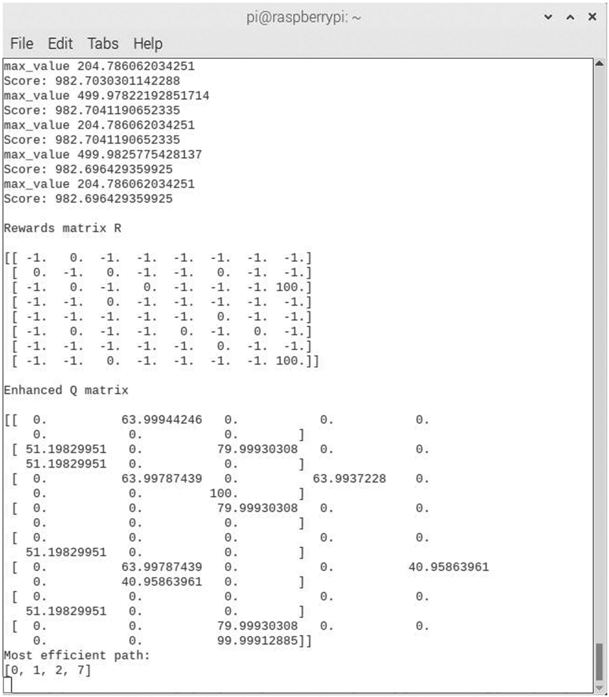

图 9-20

最终脚本结果

在这幅图中有许多有趣的事情要讨论。首先是图顶部显示的期中发作结果的剩余部分。这里你可以看到 Q 函数的最大值以及分数。显示的分数是未标准化的最佳路径值。

奖励矩阵 R 显示在中期阶段性结果的下方。关于这个矩阵有两点需要注意。有两个 100 奖励值位于 R(2，6)和 R(6，6)位置。第一个奖励(R(2，6))用于节点 2 和节点 7 之间的直接路径。第二个(R(6，6))是自吸收链路或目标节点环回。下一个要注意的事项是，现有链接的值为 0，不存在的链接的值为–1。

增强和归一化的 Q 矩阵显示在 R 矩阵的下方。不幸的是，Python 3 print 语句对行进行了一些包装，有点难以阅读。我试图让它一次打印一行，但没有成功。矩阵值也以浮点形式显示，这是另一个不必要的干扰。

图中的最后一项是最佳路径的显示，结果是 0 比 1 到 2 比 7。

在下一次演示中，我将向您展示如何在路径确定中处理不利的环境因素。

##### 敌对环境中的 q-学习演示

有时，RL 项目中的环境对于试图导航路径的代理来说并不总是友好的。为了在本演示中更明显，我将假设代理是一群试图到达位于节点 7 的蜂箱的蜜蜂。现在，蜜蜂不喜欢烟，会不惜一切代价避开它。事实上，养蜂人(正式名称是养蜂人)在蜜蜂从蜂箱中收获蜂蜜时使用烟枪来安抚蜜蜂。我在随机生成的环境中给几个节点添加了烟雾，如图 9-21 所示。代理总是会尽量避免走那些导致冒烟的环节。


图 9-21

随机生成的蜜蜂环境

以下脚本名为 beeRL.py，可从该书的配套网站获得:

```py
# Import required libraries
import numpy as np
import pylab as plt
import networkx as nx

# Map cell to cell, add circular cell to goal point
points_list = [(0,1), (1,5), (5,6), (5,4), (1,2), (2,3), (2,7)]

# Set target node
goal = 7

bees = [2]
smoke = [4,5,6]

gamma = 0.8

G=nx.Graph()
G.add_edges_from(points_list)
mapping={0:'Start', 1:'1', 2:'2 - Bees', 3:'3', 4:'4 - Smoke', 5:'5 - Smoke', 6:'6 - Smoke', 7:'7 - Beehive'}
H=nx.relabel_nodes(G,mapping)
pos = nx.spring_layout(H)
nx.draw_networkx_nodes(H,pos, node_size=[200,200,200,200,200,200,200,200])
nx.draw_networkx_edges(H,pos)
nx.draw_networkx_labels(H,pos)
plt.show()

# Define points in graph
MATRIX_SIZE = 8

# Create matrix (MATRIX_SIZE * MATRIX_SIZE)
R = np.matrix(np.ones(shape=(MATRIX_SIZE, MATRIX_SIZE)))
R *= -1

# Assign zeros to paths and 100 to goal-reaching point
for point in points_list:
    print(point)
    if point[1] == goal:
        R[point] = 100
    else:
        R[point] = 0

    if point[0] == goal:
        R[point[::-1]] = 100
    else:
        # Reverse of point
        R[point[::-1]]= 0

# Add goal point round trip
R[goal,goal]= 100

def available_actions(state):
    current_state_row = R[state,]
    av_act = np.where(current_state_row >= 0)[1]
    return av_act

def sample_next_action(available_actions_range):
    next_action = int(np.random.choice(available_act, 1))
    return next_action

def collect_environmental_data(action):
    found = []
    if action in bees:
        found.append('b')

    if action in smoke:
        found.append('s')
    return found

# Create Q matrix
Q = np.matrix(np.zeros([MATRIX_SIZE,MATRIX_SIZE]))

enviro_bees = np.matrix(np.zeros([MATRIX_SIZE, MATRIX_SIZE]))
enviro_smoke = np.matrix(np.zeros([MATRIX_SIZE, MATRIX_SIZE]))

initial_state = 1

# Get available actions in the current state
available_act = available_actions(initial_state)

# Sample next action to be performed
action = sample_next_action(available_act)

# This function updates the Q matrix according to the path selected and the Q
# learning algorithm
def update(current_state, action, gamma):

    max_index = np.where(Q[action,] == np.max(Q[action,]))[1]

    if max_index.shape[0] > 1:
        max_index = int(np.random.choice(max_index, size = 1))
    else:
        max_index = int(max_index)
    max_value = Q[action, max_index]

    Q[current_state, action] = R[current_state, action] + gamma * max_value
    print('max_value', R[current_state, action] + gamma * max_value)

    environment = collect_environmental_data(action)
    if 'b' in environment:
        enviro_bees[current_state, action] += 1
    if 's' in environment:
        enviro_smoke[current_state, action] += 1

    if (np.max(Q) > 0):
        return(np.sum(Q/np.max(Q)*100))
    else:
        return(0)

update(initial_state,action,gamma)

# Training starts
scores = []
for i in range(700):
    current_state = np.random.randint(0, int(Q.shape[0]))
    available_act = available_actions(current_state)
    action = sample_next_action(available_act)
    score = update(current_state,action,gamma)
    scores.append(score)
    print ('Score:', str(score))

plt.plot(scores)
plt.show()

print('Bees found')
print(enviro_bees)
print('Smoke found')
print(enviro_smoke)

```

###### 运行脚本并评估结果

通过输入以下命令运行该脚本:

```py
python beeRL.py

```

图 [9-22](#Fig22) 是收敛分数与已完成集数的关系图。

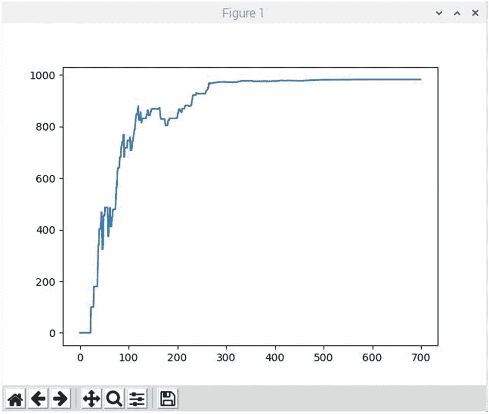

图 9-22

得分收敛图

你可以清楚地看到，在大约 400 集完成后，达到了最高得分。剧本被硬编码为 700 集。超过 400 集的 300 集所需的额外时间微乎其微。

图 [9-23](#Fig23) 显示了脚本完成运行后的终端窗口。

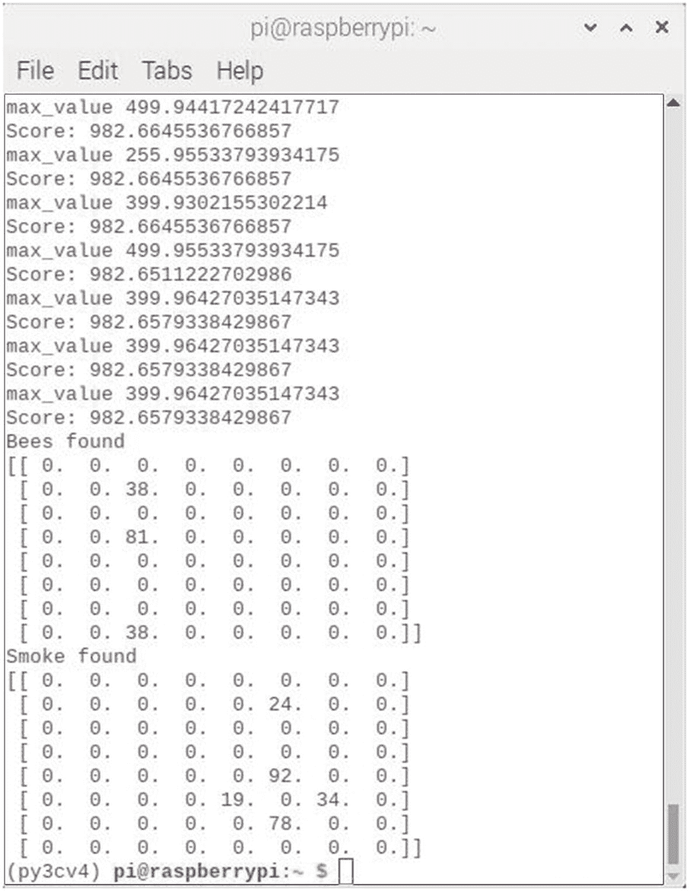

图 9-23

最终脚本结果

图中的环境矩阵显示了代理在寻找到达蜂箱的最有效路径的过程中发现了多少蜜蜂和烟雾。为了简化演示，我们做了两个假设。这些是

*   蜜蜂在寻找蜂巢上有正的系数。

*   蜜蜂遇到烟雾时有一个负系数。

这些都不是不合理的假设，但它确实需要关于代理行为的先验知识。现在一个自然的问题出现了:这种先验知识可以用来提高 Q 学习的性能吗？这个问题的答案可以在下面的演示中找到。

##### 具有先验知识演示的敌对环境中的 q 学习

本演示将向您展示如何使用现有的先验知识来提高智能体在路径搜索任务中的表现。一群蜜蜂仍然是代理人，目标仍然是到达蜂箱。然而，现在采取了一种现实的方法，在这种方法中，代理动态地观察新的环境，并在遇到环境偏差时进行分配。导致烟雾弥漫节点的链接将被打折扣，而对蜜蜂友好的链接则受到鼓励。

这个新脚本与以前的脚本之间的显著变化是，更新方法已经过修改，为所有尝试的路径添加了一个评分矩阵。如果尝试的路径通向烟雾指定的节点，则矩阵值将递减。相反，如果尝试的路径通向 bee 指定的节点，那么矩阵值将递增。保存所有这些偏差值的矩阵在训练循环中连续使用，以指导代理进行路径选择。

以下脚本名为 beeRLenv.py，可从该书的配套网站获得:

```py
# Import required libraries
import numpy as np
import pylab as plt
import networkx as nx

# Map cell to cell, add circular cell to goal point
points_list = [(0,1), (1,5), (5,6), (5,4), (1,2), (2,3), (2,7)]

# Set target node
goal = 7

bees = [2]
smoke = [4,5,6]
gamma = 0.8

G=nx.Graph()
G.add_edges_from(points_list)
mapping={0:'Start', 1:'1', 2:'2 - Bees', 3:'3', 4:'4 - Smoke', 5:'5 - Smoke', 6:'6 - Smoke', 7:'7 - Beehive'}
H=nx.relabel_nodes(G,mapping)
pos = nx.spring_layout(H)
nx.draw_networkx_nodes(H,pos, node_size=[200,200,200,200,200,200,200,200])
nx.draw_networkx_edges(H,pos)
nx.draw_networkx_labels(H,pos)
plt.show()

# Define points in graph
MATRIX_SIZE = 8

# Create matrix (MATRIX_SIZE * MATRIX_SIZE)
R = np.matrix(np.ones(shape=(MATRIX_SIZE, MATRIX_SIZE)))
R *= -1

# Assign zeros to paths and 100 to goal-reaching point
for point in points_list:
    print(point)
    if point[1] == goal:
        R[point] = 100
    else:
        R[point] = 0

    if point[0] == goal:
        R[point[::-1]] = 100
    else:
        # Reverse of point
        R[point[::-1]]= 0

# Add goal point round trip
R[goal,goal]= 100

def available_actions(state):
    current_state_row = R[state,]
    av_act = np.where(current_state_row >= 0)[1]
    return av_act

def sample_next_action(available_actions_range):
    next_action = int(np.random.choice(available_act, 1))
    return next_action

def collect_environmental_data(action):
    found = []
    if action in bees:
        found.append('b')

    if action in smoke:
        found.append('s')
    return found

# Create Q matrix
Q = np.matrix(np.zeros([MATRIX_SIZE,MATRIX_SIZE]))

# Create matrices to hold the bees and smoke totals
enviro_bees = np.matrix(np.zeros([MATRIX_SIZE, MATRIX_SIZE]))
enviro_smoke = np.matrix(np.zeros([MATRIX_SIZE, MATRIX_SIZE]))

# Subtract bees from smoke. This gives smoke a negative bias
enviro_matrix = enviro_bees - enviro_smoke

initial_state = 1

# Get available actions in the current state
available_act = available_actions(initial_state)

# Sample next action to be performed
action = sample_next_action(available_act)

# This function updates the Q matrix according to the path
# selected and the Q learning algorithm.
def update(current_state, action, gamma):

    max_index = np.where(Q[action,] == np.max(Q[action,]))[1]

    if max_index.shape[0] > 1:
        max_index = int(np.random.choice(max_index, size = 1))
    else:
        max_index = int(max_index)
    max_value = Q[action, max_index]

    Q[current_state, action] = R[current_state, action] + gamma * max_value
    print('max_value', R[current_state, action] + gamma * max_value)

    environment = collect_environmental_data(action)
    if 'b' in environment:
        enviro_matrix[current_state, action] += 1
    if 's' in environment:
        enviro_matrix[current_state, action] -= 1

    if (np.max(Q) > 0):
        return(np.sum(Q/np.max(Q)*100))
    else:
        return(0)

# Do an update
update(initial_state,action,gamma)

# Make a transactional matrix copy for use with the enviro_help
# method.
enviro_matrix_snap = enviro_matrix.copy()

def available_actions_with_enviro_help(state):
    current_state_row = R[state,]
    av_act = np.where(current_state_row >= 0)[1]
    # if there are multiple routes, dis-favor anything negative
    env_pos_row = enviro_matrix_snap[state,av_act]
    if (np.sum(env_pos_row < 0)):
        # Can negative directions be removed from av_act?
        temp_av_act = av_act[np.array(env_pos_row)[0]>=0]
        if len(temp_av_act) > 0:
            print('going from:',av_act)
            print('to:',temp_av_act)
            av_act = temp_av_act
    return av_act

# Training starts
scores = []
for i in range(700):
    current_state = np.random.randint(0, int(Q.shape[0]))
    available_act = available_actions_with_enviro_help(current_state)
    action = sample_next_action(available_act)
    score = update(current_state,action,gamma)
    scores.append(score)
    print ('Score:', str(score))

plt.plot(scores)
plt.show()

```

###### 运行脚本并评估结果

通过输入以下命令运行该脚本:

```py
python beeRLenv.py

```

图 [9-24](#Fig24) 是本次演示中使用的随机生成环境的示意图。

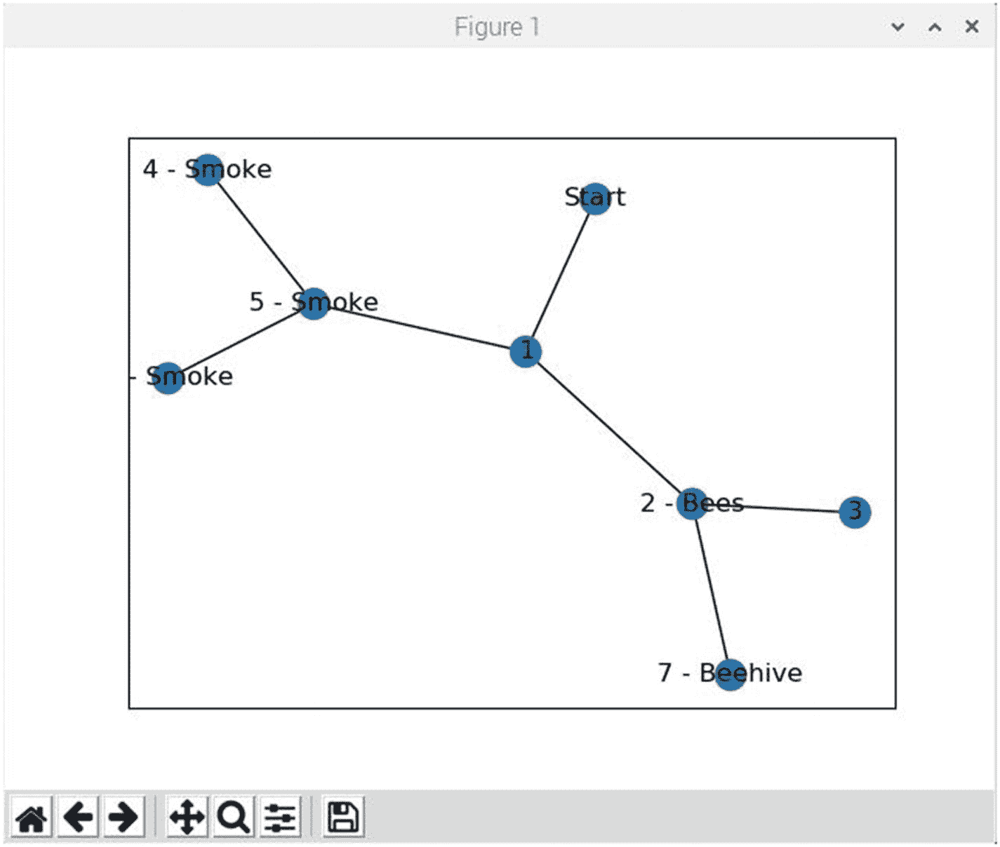

图 9-24

随机生成的环境

图 [9-25](#Fig25) 是显示评估路径的终端窗口。列出的最后一条是最佳选择路径。如果你仔细观察图 [9-24](#Fig24) ，这并不奇怪。但是，您必须记住，代理没有环境的鸟瞰图，必须系统地测试从起始节点发出的每条可用链路。

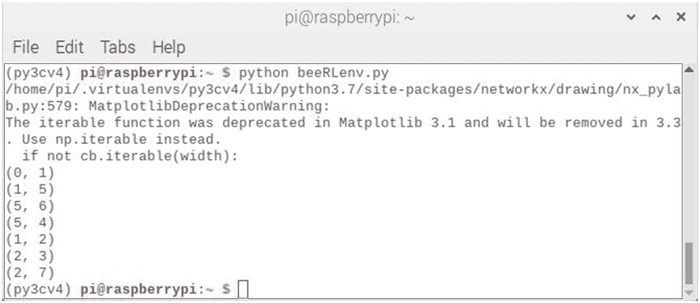

图 9-25

显示评估路径的终端窗口

这个结果部分的最后一个图是图 [9-26](#Fig26) ，显示了得分的收敛。这是这个演示的唯一性能度量，也是关键的证据，它将证明这个动态方法是否有效。

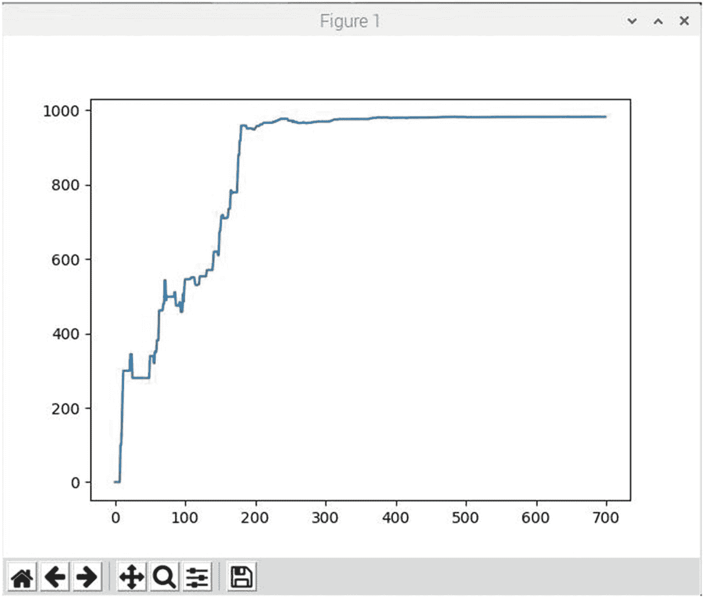

图 9-26

得分收敛图

从剧情中可以看出，到第 180 集，最终得分值有效达到。将该图与图 [9-22](#Fig22) 中所示的图进行比较，在图中，最终得分值大约在第 400 集时收敛。动态方法收敛得更早，证明它比不考虑环境条件的方法表现更好。这个结果有点类似于使用偏差值来调整 ANN 或 CNN 以提高性能。

## q 学习和神经网络

*突围*游戏中的环境状态仅由球拍的位置、球的位置和方向以及单个砖块的存在与否来定义。然而，这种直观的表示仅特定于每个特定的游戏。有没有更通用的适合所有游戏的东西？显而易见的选择是使用屏幕像素，因为它们隐含了关于游戏情况的所有相关信息，除了在*突破*游戏中球的速度和方向。然而，两个或多个连续屏幕将充分描述球的状态。

如果将 DeepMind 预处理应用到游戏屏幕上，就是取最后四个屏幕图像，调整大小为 84 × 84，转换为 256 灰度级的灰度。这将导致 256 种<sup>84×84×4</sup>≈10 种 <sup>67970 种</sup>可能的游戏状态。这将意味着 Q 表中有 10 <sup>67970</sup> 行，这比已知宇宙中的原子数量还要多——显然这是不可能的情况。如果只包括所访问的国家，这个庞大的国家数目可以大大减少。即便如此，大多数状态很少被访问，Q 表收敛需要花费整个宇宙的生命周期——同样，这不是理想的情况。解决方案在于对从未见过的状态的 Q 值进行估计。

在这一点上 DL 肯定会有所帮助。神经网络在从高度结构化的数据中提取有用特征方面表现异常出色。神经网络可以表示一个 Q 函数，它将状态(四个游戏屏幕)和动作作为输入，并输出相应的 Q 值。作为替代，游戏屏幕可以用作每个可能动作的输入和 Q 值输出。后者是 DeepMind 团队采用的方法。使用任一种方法的优点在于，只需要一次通过网络的前向传递来执行 Q 值更新或挑选具有最高 Q 值的动作。

图 [9-27](#Fig27) 显示了向神经网络输入四个状态并获得单个 Q 值输出的“原始”方法。


图 9-27

使用 DL 和 Q-learning 的简单方法

相比之下，图 [9-28](#Fig28) 显示了 DeepMind 团队采用的方法，其中输入单个状态，输出多个 Q 值。

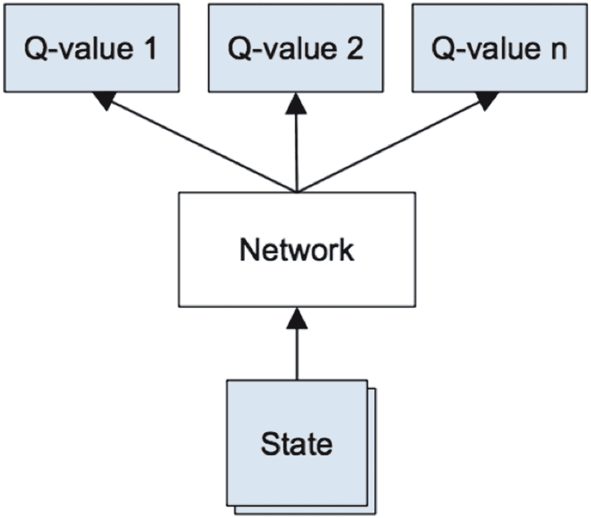

图 9-28

DL 和 Q 学习的深度思维方法

对于一个纯粹的信息步骤，表 [9-1](#Tab1) 显示了 DeepMind 模型中使用的架构。

表 9-1

DeepMind 模型架构

<colgroup><col class="tcol1 align-left"> <col class="tcol2 align-left"> <col class="tcol3 align-left"> <col class="tcol4 align-left"> <col class="tcol5 align-left"> <col class="tcol6 align-left"> <col class="tcol7 align-left"></colgroup> 
| 

层

 | 

投入

 | 

过滤器尺寸

 | 

进展

 | 

过滤器数量

 | 

激活

 | 

输出

 |
| --- | --- | --- | --- | --- | --- | --- |
| conv1 | 84x84x4 | 8x8 | four | Thirty-two | 线性单元 | 20x20x32 |
| conv2 | 20x20x32 | 4x4 | Two | Sixty-four | 线性单元 | 9x9x64 |
| conv3 | 9x9x64 | 3x3 | one | Sixty-four | 线性单元 | 7x7x64 |
| fc4 | 7x7x64 |   |   | Five hundred and twelve | 线性单元 | Five hundred and twelve |
| fc5 | Five hundred and twelve |   |   | Eighteen | 线性的 | Eighteen |

这是一个卷积神经网络，有三个卷积层，后面是两个全连接层。请注意，没有池层。这是因为池层导致特征成为平移不变的。这意味着模型变得对图像中对象的位置不敏感。这将破坏模型在*突破*游戏中跟踪球位置的能力。

网络的输入是四个 84 × 84 灰度游戏屏幕。网络的输出是每个可能动作的 Q 值，其中有 18 个用于*突围*游戏。q 值是实数值，因此使其成为一项回归任务，可以使用简单的平方误差损失(L)进行优化。


在哪里

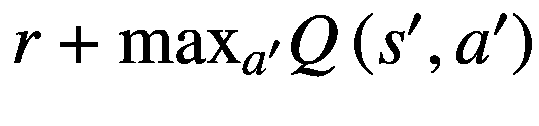 =目标

*Q* ( *s* ， *a* ) =预测

给定一个转换( *s，a，r，s*’)，经典的贝尔曼方程 Q 表更新规则必须替换为以下过程:

1.  对当前状态 *s* 进行前馈传递，以获得所有动作的预测 Q 值。

2.  对下一个状态*s*<sup>’</sup>进行前馈传递，并计算最大总网络输出。

3.  将行动的 Q 值目标设置为(使用步骤 2 中计算的最大值)。对于所有其他操作，将 Q 值目标设置为与步骤 1 中最初返回的值相同，使这些输出的误差为 0。

4.  使用反向传播更新权重。

前面的过程向您展示了如何使用 Q-learning 估计每个州的未来奖励，并使用 CNN 逼近 Q-函数。然而，使用非线性函数来近似 Q 值是不稳定的。必须使用许多调整技术来使其收敛。也需要很长时间，用单 GPU 板的电脑差不多一周。

最重要的调优技术是使用经验回放。在游戏过程中，所有的经历( *s，a，r，s’*)都存储在重放存储器中。当训练网络时，使用来自重放存储器的随机小批量，而不是最近的转变。这打破了训练样本中存在的任何相似性，这可能会无意中使网络陷入局部最小值。此外，使用经验重放使训练任务类似于通常的监督学习。这简化了调试和进一步的算法测试。

结合 Q-learning 使用 DL 试图解决学分分配问题，这是我在本章开始时提到的。这种解决方案的出现是因为奖励会及时传播，直到它到达关键的决策点。这一点是获得奖励的真正原因。

另一个主要问题是勘探-开发的困境，本章开头也提到过。你应该认识到，当一个 Q 表或 Q 网络被随机初始化时，它的预测最初也是随机的。如果选择了一个具有最高 Q 值的动作，那么这个动作将是随机的，代理执行一个简单的探索。随着 Q 函数收敛，它会返回更一致的 Q 值，并且探测量会减少。可以说，Q-learning 将探索作为算法的一部分。但是这种探索是“贪婪”的，因为它选择了它发现的第一个有效的策略。

对前面问题的一个简单而有效的解决方案是ε-贪婪探索，其概率为ε选择一个随机动作；否则，采用 Q 值最高的“贪婪”动作。DeepMind 系统会随着时间的推移将ε从 1 降低到 0.1。当 DeepMind 系统启动时，它会完全随机地移动，以完全探索状态空间，然后它会稳定下来，达到固定的探索速率。

前面所有的讨论都可以用一些基于 DeepMind 模型的伪代码封装起来，它提供了一个相对容易理解的算法。

```py
initialize replay memory D
initialize action-value function Q with random weights
observe initial state s
repeat:
    select an action a
        with probability ε select a random action
        otherwise select a = argmaxa'Q(s,a').
    carry out action a
    observe reward r and new state s'
    store experience (s, a, r, s') in replay memory D

    sample random transitions ( ss, aa, rr, ss' ) from replay memory D
    calculate target for each mini-batch transition:
        if ss' is the terminal state, then tt = rr
        otherwise tt = rr + γmaxa'Q(ss',aa')
    train the Q-network using (tt – Q(ss,aa))2 as loss
    s = s'
until terminated

```

DeepMind 团队使用了更多的调整技术来实际实现它，例如使用目标网络、错误剪裁、奖励剪裁等等。我将让感兴趣的读者来探讨这些话题。

令人惊讶的是，这个算法实际上什么也没学到。考虑 Q 函数被随机初始化；刚启动时自然会输出垃圾数据。现在，算法使用这个初始垃圾(下一个状态的最大 Q 值)作为网络的目标，只是偶尔记录一个微小的奖励。从大规模的角度来看，这种方法似乎是荒谬的。该算法如何学习任何有意义的东西？奇怪的是，它最终还是学会了。

一些非常聪明的人说过，人工智能是我们还没有弄明白的东西。一旦人工智能被发现，它可能就不再那么聪明了。然而，用 DL 进行 Q-learning 仍然是一个令人惊叹的话题。观察它搞清楚一个新游戏确实是一个令人敬畏的事件。*