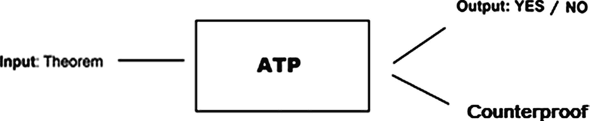
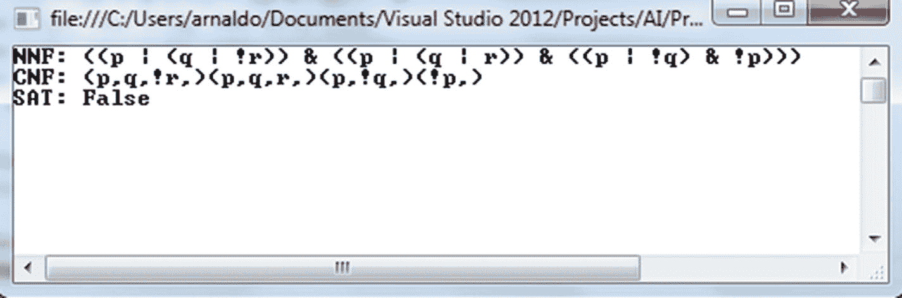

# 2.自动定理证明和一阶逻辑

沿着从第 [1](01.html) 章开始的思路，我们将从介绍一个与人工智能和逻辑相关的话题开始这一章:自动定理证明。这是人工智能的一个领域，为数学家的研究服务，并帮助他们证明定理、推论等等。在这一章中，我们还将花几页来讨论一阶逻辑，这是一种通过允许或包含量词(泛量词和存在量词)来扩展命题逻辑的逻辑，并提供了一个更完整的框架来轻松表示我们日常生活中可能出现的不同类型的逻辑场景。

同时，我们将继续扩展第 [1](01.html) 章中介绍的`Formula`层次结构，插入子句和 CNF C#类，并描述解决 SAT(可满足性)问题的一个非常重要的方法:DPLL 算法。实际问题将有助于我们更好地理解下文描述的每一个概念。我们将通过展示一个简单的清洁机器人来结束本章，该机器人将使用一阶逻辑的一些术语，并展示它们如何应用于现实生活中的问题。

## 自动定理证明

自动定理证明器(ATP)是一种计算机程序，可以生成和检查数学定理，并搜索定理准确性的证明；即它的陈述总是真实的。定理是用一些数理逻辑来表达的，比如命题逻辑，一阶逻辑等等。在这种情况下，我们将只考虑使用命题逻辑作为其语言的 ATP。我们可以认为 ATP 的工作流程如图 [2-1](#Fig1) 所示。



图 2-1

ATP workflow diagram

ATP 最初是为数学计算而创建的，但最近在科学界引起了注意，因为广泛的潜在应用与它们相关联。ATPs 的几个应用之一是给数学定理的数据库增加智能；换句话说，使用自动定理证明器在数学定理数据库中敏锐地查询等价定理。ATP 将用于验证数据库中的一个定理在数学上是否等同于用户输入的另一个定理。字符串匹配算法或类似的技术对于这样的应用来说不够好，因为用户可能以不同于存储在数据库中的方式表述定理，或者搜索的定理可能是逻辑结果，而不是现有定理的直接克隆。

定理证明和形式方法的另一个应用可以在硬件和软件设计的验证中找到。硬件验证恰好是一项极其重要的任务。例如，现代微处理器设计中的一个错误的商业成本可能是如此之大，以至于验证设计是必不可少的。

软件验证同样至关重要，因为在这一领域，错误的代价可能非常高。这种错误的灾难性后果的例子是 Ariane 5 火箭的毁坏(由一个简单的整数溢出问题引起，该问题可以通过正式的验证程序检测出来)或 Pentium II 处理器的浮点单元中的错误。

当然，ATPs 的经典应用是它被创造出来的目的——作为一种帮助数学家进行研究的工具。可以说 ATP 是数学家最喜欢的机器人。

Note

有些逻辑比其他逻辑更强大，可以表达和证明更多的定理。命题逻辑通常是所有逻辑中最弱和最简单的。

定理证明器的变化取决于证明搜索中所需的人工指导的数量，以及用来表达要证明的定理的逻辑语言的复杂程度。必须考虑自动化程度和逻辑语言复杂性之间的权衡。

只有在语言受到约束的情况下，高度自动化才是可能的。灵活的高阶语言的证明通常需要人的指导，相关的定理证明器被称为证明助手。

这种人工协助可以通过程序员事先给出提示或在证明过程中通过提示与 ATP 交互来提供。

ATP 最简单的类型是 SAT(可满足性)求解器，它依赖于命题逻辑作为定理语言。SAT 求解器很有用，但是命题逻辑的表达能力有限，布尔表达式可以变得相当大。此外，SAT 问题是第一个被证明 NP(非多项式)-完全复杂性的问题(S.A. Cook，“定理证明过程的复杂性”)。在寻找有效 SAT 求解的启发式算法方面已经做了大量的研究。

在纯数学中，证明有些不正式；它们由同行评审“验证”,旨在说服和传达一个直观、清晰的想法，证明是如何工作的，定理陈述应该总是正确的。如图 1-8 所示，ATPs 提供了形式上的证明，其输出可以是布尔值 Yes，No(真，假)，或者可能是一个反例，如果该陈述被发现为假的话。

Note

使用模型检查方法的软件和硬件验证与命题逻辑配合良好。表达式是在考虑问题的状态机描述后获得的，并以二叉决策树的形式进行操作。

自动定理证明(ATP)通常可以处理两种类型的任务:它们可以检查逻辑中的定理，或者它们可以自动生成证明。

当进行证明检查时，ATP 接收一个正式证明作为输入，该证明由一个公式列表(步骤)组成，每个公式都由应用于先前公式的公理或推理规则来证明:

```py
Formulas                  Justification
F1                        Axiom  
F2                        Rule X and F1
...                       ...
Theorem

```

这些类型的证明是非常容易检查机械；我们只需要确保每一个理由都是有效的或者被正确地应用。

然而，生成证明要困难得多。我们需要生成一个公式列表，每个公式都有一个有效的理由，并保证最后一个公式是要证明的定理。对于简单的问题，证明生成非常有用；比如类型推断(C#，Java)，web 应用的安全性等等。

到目前为止，我们已经描述了一个 SAT 求解器——二叉决策树，它适用于小问题。然而，它的大小是指数级的，为了检查可满足性，我们需要在最坏的情况下探索整个树。因此，在以后的章节中，我们将详细介绍这个主题以及如何使用其他方法获得更好的结果。

Note

1976 年，肯尼斯·阿佩尔(Kenneth Appel)和沃尔夫冈·哈肯(Wolfgang Haken)使用一个程序证明了四色定理，该程序对数十亿个案例进行了庞大的案例分析。四色定理指出，只用四种颜色绘制一幅世界地图是可能的，并保证不会有两个相邻的国家共享同一种颜色。

## 实际问题:C#中的子句和 CNFs 类

在这一节中，我们将通过添加`Clause`和`Cnf`类来增强我们在本章中一直在开发的逻辑框架。我们将在编写 DPLL 算法时利用这些类，这可能是确定逻辑公式可满足性的最巧妙的算法，也是自动定理证明的基本工具。

在我们开始开发这个新的增强之前，让我们简单地看一下一些定义，这些定义对于理解我们将很快开发的类很有用。

文字或者是变量，或者是变量的否定(例如，p，`¬` p，q，q)。

子句是文字 p1 `∨` p2 `∨`的析取...`∨` pm，每个 CNF 都是一套从句。从现在起，我们将把子句表示为{p1，p2，...pm}其中每个 pi(i = 1，2，...，m)是字面意思。

在清单 [2-1](#Par27) 中，我们展示了提议的`Clause`类。

```py
public class Clause
    {
        public List<Formula> Literals { get; set; }

        public Clause()
        {
            Literals = new List<Formula>();
        }

        public bool Contains(Formula literal)
        {
if (!IsLiteral(literal))
                throw new ArgumentException("Specified formula is not a literal");

foreach (var formula in Literals)
            {
                if (LiteralEquals(formula, literal))
                    return true;
            }

            return false;
        }

        public Clause RemoveLiteral(Formula literal)
        {
if (!IsLiteral(literal))
                throw new ArgumentException("Specified formula is not a literal");

var result = new Clause();

            for (vari = 0; i<Literals.Count; i++)
            {
                if (!LiteralEquals(literal, Literals[i]))
result.Literals.Add(Literals[i]);
            }

            return result;
        }

        public bool LiteralEquals(Formula p, Formula q)
        {
            if (p is Variable && q is Variable)
                return (p as Variable).Name == (q as Variable).Name;

            if (p is Not && q is Not)
                return LiteralEquals((p as Not).P, (q as Not).P);

            return false;
        }

     public bool IsLiteral(Formula p)
     {
            return p is Variable || (p is Not && (p as Not).P is Variable);
     }
}

Listing 2-1
Clause Class

```

`Clause`类包含以下方法:

*   `public bool Contains(Formula literal)`:判断给定文字是否属于子句
*   `public Clause RemoveLiteral(Formula literal)`:返回一个新的`Clause`，它不包含作为参数传递的文字
*   `public bool LiteralEquals(Formula p, Formula q)`:判断文字 p，q 是否相等
*   `public bool IsLiteral(Formula p)`:判断给定的公式是否为文字

清单 [2-2](#Par34) 展示了代表合取范式的`Cnf`类。

```py
public class Cnf
    {
        public List<Clause> Clauses { get; set; }

        public Cnf()
        {
            Clauses = new List<Clause>();
        }

        public Cnf(And and)
        {
            Clauses = new List<Clause>();
RemoveParenthesis(and);
        }

        public void SimplifyCnf()
        {
Clauses.RemoveAll(TautologyClauses);
        }

        private bool TautologyClauses(Clause clause)
        {
            for (vari = 0; i<clause.Literals.Count; i++)
            {
                for (var j = i + 1; j <clause.Literals.Count - 1; j++)
                {
                    // Checking that literal i and literal j are not of the same type; i.e., both variables or negated literals.
                    if (!(clause.Literals[i] is Variable &&clause.Literals[j] is Variable) &&
                        !(clause.Literals[i] is Not &&clause.Literals[j] is Not))
                    {
var not = clause.Literals[i] is Not ? clause.Literals[i] as Not : clause.Literals[j] as Not;

var @var = clause.Literals[i] is Variable ? clause.Literals[i] as Variable : clause.Literals[j] as Variable;
                        if (IsNegation(not, @var))
                            return true;
                    }
                }
            }

            return false;
        }

        private bool IsNegation(Not f1, Variable f2)
        {
            return (f1.P as Variable).Name == f2.Name;
        }

private void Join(IEnumerable<Clause> others)
        {
Clauses.AddRange(others);
        }

        private voidRemoveParenthesis(And and)
        {
varcurrentAnd = and;

            while (true)
            {
                // If P is OR or literal and Q is OR or literal.
                if ((currentAnd.P is Or || currentAnd.P is Variable || currentAnd.P is Not) &&
                    (currentAnd.Q is Or || currentAnd.Q is Variable || currentAnd.Q is Not))
                {

Clauses.Add(new Clause { Literals = new List<Formula>(currentAnd.P.Literals()) });
Clauses.Add(new Clause { Literals = new List<Formula>(currentAnd.Q.Literals()) });
                    break;
                }
                // If P is AND and Q is OR or literal.
                if (currentAnd.P is And && (currentAnd.Q is Or || currentAnd.Q is Variable || currentAnd.Q is Not))
                {
Clauses.Add(new Clause { Literals = new List<Formula>(currentAnd.Q.Literals()) });
currentAnd = currentAnd.P as And;
                }
                // If P is OR or literal and Q is AND.
                if ((currentAnd.P is Or || currentAnd.P is Variable || currentAnd.P is Not) &&currentAnd.Q is And)
                {
Clauses.Add(new Clause { Literals = new List<Formula>(currentAnd.P.Literals()) });
currentAnd = currentAnd.Q as And;
                }
                // If both P and Q are ANDs.
                if (currentAnd.P is And &&currentAnd.Q is And)
                {
RemoveParenthesis(currentAnd.P as And);
RemoveParenthesis(currentAnd.Q as And);
                    break;
                }
            }
        }

Listing 2-2
Cnf Class

```

`Cnf`类包含以下方法:

*   `public void SimplifyCnf()`:通过删除每一个既包含 p 又包含`¬` p 的子句来简化公式，由于 p `∨` p 始终为真，所以整个子句都为真，对其的分析是不必要的。
*   `public bool TautologyClauses(Clause clause)`:判断给定的子句是否包含 p 和 p
*   `private bool IsNegation(Not f1, Variable f2)`:判断 f 1 是否是变量 f 2 的否定
*   `private void Join(IEnumerable<Clause> others)`:将`IEnumerable<Clause>` others 连接到`Cnf`的子句
*   `private voidRemoveParenthesis(And and)`:将`Cnf`更改为条款列表

方法`RemoveParenthesis(And and)`负责执行一个非常重要的任务。这种方法将我们拥有的一系列连接和连接词`And(p1, And(p2, And( ... ) ))`的 CNF 公式转换成一个子句列表。

到目前为止，我们一直使用的层次结构使我们不必为逻辑公式实现解析器，但是它在清晰度上花费了我们一点点。我们的目标是通过执行这个方法并将表示 CNFs 的`And`公式转换成一个子句列表来恢复它。对于我们可能需要开发的任何与 CNF 相关的算法来说，这种新的表示法都会派上用场；它肯定会对我们稍后介绍的 DPLL 算法有用。

Note

如果你想为逻辑公式开发一个解析器，你可以使用 ANTLR(另一个语言识别工具)，这是一个非常有用的工具，可以帮助开发者编写语法和创建解析器。ANTLR 将解析器生成并输出为 Java 或 C#类(。cs 文件)，允许您在以后的项目中包含它们并随意使用它们。

`RemoveParenthesis(And and)`方法基本上由一个`while`循环组成，循环中包含几个条件。这些条件可能标志着循环的结束，当我们考虑来自`And`的公式 P 和 Q 的类型时，它们中的每一个都与可能出现的不同场景相匹配。这些场景如下:

*   p，Q 是 or 或文字。
*   (P 是 OR 或 literal)而 Q 是 and。
*   p 是 And 和(Q 是 OR 或 literal)。
*   p，Q 都是和。

注意在`RemoveParenthesis(And and)`的主体中，有几个对`Literals()`方法的调用。这个方法必须被创建并插入到整个`Formula`层次结构中，就像我们之前对`ToNnf()`和`ToCnf()`方法所做的那样。我们从顶部开始，`Formula`抽象类，如清单 [2-3](#Par50) 所示。

```py
public abstract class Formula
    {
         public abstract bool Evaluate();
         public abstract IEnumerable<Variable> Variables();
         public abstract Formula ToNnf();
         public abstract Formula ToCnf();
         public abstract IEnumerable<Formula> Literals();
...
}
Listing 2-3Adding Literals() Abstract Method to Formula Abstract Class

```

现在，我们需要将`Literals()`方法的具体实现分散到整个层次结构中。在清单 [2-4](#Par52) 中，我们展示了其余类的具体实现。

```py
public abstract class BinaryGate : Formula
    {
...

public override IEnumerable<Formula> Literals()

        {

return P.Literals().Concat(Q.Literals());

}

    }

public class Not : Formula
{
...

public override IEnumerable<Formula> Literals()

        {

return P is Variable ? new List<Formula>() { this }: P.Literals();

}

}

public class Variable : Formula
{
        ...

public override IEnumerable<Formula> Literals()

        {
                 returnnew List<Formula>() { this };
              }
}

Listing 2-4Adding the Literals() Method to the Remaining Classes of the Hierarchy

```

到目前为止，我们已经用 C#建立了一个逻辑框架；现在，是时候研究一种最简单、最有效、最巧妙的算法来确定公式的可满足性了:DPLL 算法。

## DPLL 算法

Davis-Putnam-loge Mann-Loveland(DPLL)算法是一种决策过程，它使用回溯来搜索使 CNF 公式可满足的赋值。它是在 1960 年(由 Davis，Putnam)和 1962 年(由 Davis，Logemann，Loveland)的两篇文章中介绍的，甚至今天仍然是最有效的 SAT 求解器的基础；它甚至被扩展到更复杂的小逻辑，比如一阶逻辑。

SAT 问题是第一个被证明是 NP 完全的问题；因此，找到解决这一问题的有效方法至关重要。此外，这个问题在自动定理证明、规划、调度和人工智能的许多其他领域都有应用，因此多年来它激发了科学界的极大兴趣。

DPLL 接收 CNF 公式作为输入，并尝试使用回溯和应用简化和降低当前公式复杂性的某些规则来建立验证公式的赋值。可能分配的集合用一棵二叉树来表示，非常像我们在第 [1](01.html) 章中介绍的二叉树。

该算法的伪代码如下所示:

```py
DPLL(cnf):
       TERMINATION-CONDITIONS(cnf)

cnf' = Rule_OneLiteral(cnf)

cnf'' = Rule_PureLiteral(cnf')

       // Splits the decision tree into branches p and ¬p
       splitted = Rule_Split(cnf'')
       return DPLL(splitted[p]) || DPLL(splitted[¬p])

TERMINATION-CONDITIONS(cnf):
       If cnf.Clauses is Empty:
          return True
       If cnf.Clauses contains Empty_Clause:
          return False

```

DPLL 建立了一棵树，它是用三个规则塑造的:`OneLiteral`、`PureLiteral`和`Split`。前两个决定了每个节点中包含的公式，而后者在树中创建新的分支。让我们逐一检查它们:

*   `OneLiteral`:如果有一个单位分句——即只包含一个文字 p 的分句——那么删除这个分句以及每一个包含 p 的分句。然后，从 CNF 的每一个分句中删除 p 的否定(`¬` p)。如果一个公式是可满足的，那么这个字面量必然是 1，因为它决定了子句的真值。
*   如果有一个文字 p，使得 p 不属于 CNF 的任何子句，则删除包含 p 的每个子句。在这种情况下，我们可以将值 1 赋给 p，因为它的否定在 CNF 不存在。
*   在应用了纯文字规则之后，我们知道如果有文字 p，那么它的否定也一定存在。因此，我们选择一个字面量 p 并将子句集分成 C p、Cp 和 R。子句集 Cp 包含所有包含字面量 p 的子句。包含 p 和 R 的每个子句。不包含 p 或 p 的子句集。最后，我们得到集合 Cp + R 和 C p + R，其中 Cp + R 是将 R 中的每个子句加到 Cp 后得到的集合；C p + R 是在将 R 中的每个子句添加到 C p 之后获得的集合。这两个集合将是我们在 DPLL 过程下形成的树的左右分支的新的 CNFs 根节点。

这些规则的一个例子可以在下面几行中看到:在每种情况下，一个初始的 CNF 公式被提出，然后每个规则被应用到它。

```py
One Literal

Example

CNF = {{p, q, ¬r},{p, ¬q}, {¬p}, {r}, {u}}
-Apply OneLiteral rule with L = ¬p
CNF' = {{p, q, ¬r},{p, ¬q}, {r}, {u}}
-Removing ¬L = p from clauses in Cnf'
CNF'' = {{q, ¬r},{¬q}, {r}, {u}}

Pure Literal

Example

CNF = {{p, q},{p, ¬q}, {r, q}, {r, ¬q}}
-Apply PureLiteral rule with L = p
CNF' = {{r, q}, {r, ¬q}}

Split Example

CNF = {{p, ¬q, r},{¬p, q}, {¬r, q}, {¬r, ¬q}}
-Apply Split rule with L = p
CNF' = {{¬q, r}, {¬r, q}, {¬r, ¬q}}
CNF'' = {{q}, {¬r, q}, {¬r, ¬q}}

```

DPLL 算法及其所有辅助方法都将包含在`Cnf`类中。公共的`Dpll()`方法将依赖于一个辅助的私有的`Dpll`方法，该方法将接收一个`Cnf class`的副本作为参数，如清单 [2-5](#Par67) 所示。

```py
        public bool Dpll()
        {
            return Dpll(new Cnf {Clauses = new List<Clause>(Clauses)});
        }

        private bool Dpll(Cnfcnf)
        {
            // The CNF with no clauses is assumed to be True
            if (cnf.Clauses.Count == 0)
                return true;

            // Rule One Literal: if there exists a clause with a single literal
            // we assign it True and remove every clause containing it.
varcnfAfterOneLit = OneLiteral(cnf);

            if (cnfAfterOneLit.Item2 == 0)
                return true;

            if (cnfAfterOneLit.Item2 < 0)
                return false;

cnf = cnfAfterOneLit.Item1;

            // Rule Pure Literal: if there exists a literal and its negation does not exist in any clause of Cnf
varcnfPureLit = PureLiteralRule(cnf);

            // Rule Split: splitting occurs over a literal and creates 2 branches of the tree
var split = Split(cnfPureLit);

            return Dpll(split.Item1) || Dpll(split.Item2);
        }

Listing 2-5Dpll() Method and Its Auxiliary Method Dpll(Cnf cnf)

```

从清单 [2-5](#Par67) 中，我们可以看到`Dpll(Cnfcnf)`方法非常接近于精确匹配之前给出的 DPLL 伪代码。首先，我们检查当前的`Cnf`类中是否有一些子句，然后我们执行第一个简化规则，这是一个文字规则。如清单 [2-6](#Par73) 所示，`OneLiteral(Cnfcnf)`方法返回一个`Tuple<Cnf, int>`，其中元组中产生的`Cnf`类将是执行简化后获得的类，产生的整数可以是-1、0 或 1。如果它的值为 0，那么`Cnf`公式没有更多的子句需要检查，因此它必须为真(可满足)；如果它的值是-1，那么在`Cnf`中发现一个空子句，它必须是 false(不可满足)。最后，在值为 1 的情况下，程序必须继续，因为没有发现`Cnf`可满足性的结论性结果。

这里详细描述了`OneLiteral(Cnfcnf)`使用的两种辅助方法:

*   `Negate Literal(Formula literal)`:接收假定为文字的参数 a `Formula`并返回其否定值。在任何其他情况下，返回 null。
*   `UnitClause(Cnfcnf)`:查找具有单个文字的子句并返回该文字。在没有这样的子句的情况下，它返回 null。

该规则的代码如清单 [2-6](#Par73) 所示。

```py
private Tuple<Cnf, int>OneLiteral(Cnfcnf)
        {
varunitLiteral = UnitClause(cnf);
            if (unitLiteral == null)
                return new Tuple<Cnf, int>(cnf, 1);

varnewCnf = new Cnf();

            while (unitLiteral != null)
            {
varclausesToRemove = new List<int>();
vari = 0;

                // 1st Loop - Finding clauses where the unit literal is, these clauses will not be considered in the new Cnf
foreach (var clause in cnf.Clauses)
                {
                    if (clause.Literals.Any(literal =>clause.LiteralEquals(literal, unitLiteral)))
clausesToRemove.Add(i);
i++;

                }

                // New Cnf after removing every clause where unit literal is
newCnf = new Cnf();

                // 2nd Loop - Leave clause that do not include the unit literal
                for (var j = 0; j <cnf.Clauses.Count; j++)
                {
                    if (!clausesToRemove.Contains(j))
newCnf.Clauses.Add(cnf.Clauses[j]);
                }
                // No clauses, which implies SAT
                if (newCnf.Clauses.Count == 0)
                    return new Tuple<Cnf, int>(newCnf, 0);

                // Remove negation of unit literal from remaining clauses
varunitNegated = NegateLiteral(unitLiteral);
varclausesNoLitNeg = new List<Clause>();

foreach (var clause in newCnf.Clauses)
                {
varnewClause = new Clause();

                    // Leaving every literal except the unit literal negated
foreach (var literal in clause.Literals)
                        if (!clause.LiteralEquals(literal, unitNegated))
newClause.Literals.Add(literal);

clausesNoLitNeg.Add(newClause);
                }

newCnf.Clauses = new List<Clause>(clausesNoLitNeg);
                // Resetting variables for next stage
cnf = newCnf;
unitLiteral = UnitClause(cnf);
                // Empty clause found
                if (cnf.Clauses.Any(c =>c.Literals.Count == 0))
                    return new Tuple<Cnf, int>(newCnf, -1);
            }

            return new Tuple<Cnf, int>(newCnf, 1);
        }

        public Formula NegateLiteral(Formula literal)
        {
            if (literal is Variable)
                return new Not(literal);
            if (literal is Not)
                return (literal as Not).P;
            return null;
        }

        private Formula UnitClause(Cnfcnf)
        {
foreach (var clause in cnf.Clauses)
                if (clause.Literals.Count == 1)
                    return clause.Literals.First();
            return null;
        }

Listing 2-6OneLiteral() Rule and Its Auxiliary Methods

```

`OneLiteral`方法由一个`while`循环组成，当当前`Cnf`类中不再有单个文本的子句，或者达到一个终止条件时(`Cnf`中没有子句或找到空子句),该循环结束。在这个`while`循环中有一个第一循环，它存储每个子句中单元子句的位置，包括当前的单元文字。有第二个循环`that builds`，通过跳过那些位置存储在第一个循环中的子句，向上到达一个新的`Cnf`类。`while`中的第三个也是最后一个循环做的工作与前两个循环类似，但在这种情况下，确保在前两个循环执行后获得的新`Cnf`中的每个子句都删除了单元文字的否定。

在清单 [2-7](#Par76) 中，我们可以看到纯文字规则的代码，它通常在一个文字规则之后应用。

```py
private CnfPureLiteralRule(Cnfcnf)
        {
varpureLiterals = PureLiterals(cnf);
            if (pureLiterals.Count() == 0)
                return cnf;

varnewCnf = new Cnf();
varclausesRemoved = new SortedSet<int>();

            // Checking what clauses contain pure literals
foreach (varpureLiteral in pureLiterals)
            {
                for (vari = 0; i<cnf.Clauses.Count; i++)

                {
                    if (cnf.Clauses[i].Contains(pureLiteral))
clausesRemoved.Add(i);
                }  
            }

            // Creating the new set of clauses
            for (vari = 0; i<cnf.Clauses.Count; i++)
            {
                if (!clausesRemoved.Contains(i))
newCnf.Clauses.Add(cnf.Clauses[i]);
            }

            return newCnf;
        }

        private IEnumerable<Formula>PureLiterals(Cnfcnf)
        {
var result = new List<Formula>();

foreach (var clause in cnf.Clauses)
foreach (var literal in clause.Literals)
                {
                    if (PureLiteral(cnf, literal))
result.Add(literal);
                }

            return result;
        }

        private bool PureLiteral(Cnfcnf, Formula literal)

        {
var negation = NegateLiteral(literal);

foreach (var clause in cnf.Clauses)
            {
foreach (var l in clause.Literals)
                    if (clause.LiteralEquals(l, negation))
                        return false;
            }

            return true;
        }

Listing 2-7PureLiteral() Rule and Its Auxiliary Methods

```

`PureLiteralRule`方法负责对 One Literal 规则返回的新的`Cnf`类执行纯文本规则。它依赖于以下辅助方法:

*   `PureLiterals(Cnf cnf)`:返回在`Cnf`类中找到的纯文字列表
*   `PureLiteral(Cnf cnf, Formula literal)`:判断给定文字是否为纯文字；即如果它的否定存在于`Cnf`类中，则返回 false 否则为真。

`PureLiteralRule()`方法查找`Cnf`类中的所有纯文字，并从`CNF formula`的每个子句中删除它们；返回一个包含结果子句的新的`Cnf`。

最后一点，`Split()`方法如清单 [2-8](#Par82) 所示。

```py
        private Tuple<Cnf, Cnf> Split(Cnfcnf)
        {
var literal = Heuristics.ChooseLiteral(cnf);
var tuple = SplittingOnLiteral(cnf, literal);

            return new Tuple<Cnf, Cnf>(RemoveLiteral(tuple.Item1, literal), RemoveLiteral(tuple.Item2, NegateLiteral(literal)));
        }

        private CnfRemoveLiteral(Cnfcnf, Formula literal)
        {
var result = new Cnf();

foreach (var clause in cnf.Clauses)
result.Clauses.Add(clause.RemoveLiteral(literal));

            return result;
        }

        private Tuple<Cnf, Cnf>SplittingOnLiteral(Cnfcnf, Formula literal)
        {
            // List of clauses containing literal
var @in = new List<Clause>();
            // List of clauses containing Not(literal)

varinNegated = new List<Clause>();
            // List of clauses not containing literal nor Not(literal)
var @out = new List<Clause>();
var negated = NegateLiteral(literal);

foreach (var clause in cnf.Clauses)
            {
                if (clause.Contains(literal))
                    @in.Add(clause);
                else if (clause.Contains(negated))
inNegated.Add(clause);
                else
                    @out.Add(clause);
            }

varinCnf = new Cnf { Clauses = @in };
varoutCnf = new Cnf { Clauses = @inNegated };
inCnf.Join(@out);
outCnf.Join(@out);

            return new Tuple<Cnf, Cnf>(inCnf, outCnf);
        }

Listing 2-8Split() Rule and Its Auxiliary Methods

```

该方法使用以下辅助方法:

*   `RemoveLiteral(Cnf cnf, Formula literal)`:返回一个新的`Cnf`类，其中每个子句不包含作为参数接收的文字
*   `SplittingOnLiteral(Cnf cnf, Formula literal)`:根据前面描述的分割规则，返回包含两个 CNF 的元组

在`Split()`方法中，我们从名为`Heuristics`的类中调用静态方法`ChooseLiteral()`；该方法输出 CNF 公式的第一个文本，并将其作为分支文本。

启发式和元启发式是我们将在第 7 章深入分析的主题。现在，让我们把启发法看作是一种程序，它来自经验，帮助我们把人类的经验知识附加到解决某个问题的过程中。

Note

在`SplittingOnLiteral()`方法中，我们声明了变量`@in`、`inNegated`和`@out`，目的是分别存储包含选择用于拆分或分支的文字、其否定以及任何其他子句的子句。我们使用@前缀是因为 in 和 out 是 C#中的关键字。

在 DPLLs 中，为了正确地选择将用于分支的文字，树结构对于效率是极其重要的；即，将用于分裂当前节点和创建树的新分支的文字。我们将满足于我们对于分支的天真、简单的方法，并且在本书的后面我们将深入到选择和分支的更好的方法中。

## 实际问题:命题逻辑中鸽子洞原理的建模

鸽子洞原理，也称为狄利克雷盒子原理，是数学中一个简单而基本的概念。它是由德国数学家彼得·古斯塔夫·勒尤尼·狄利克雷在 19 世纪提出的，这位科学家定义了我们今天所知道的函数的概念——这是他在许多领域的多重贡献之一。

该原理指出，如果你有 n 个鸽笼和 m 只鸽子，其中 m > n(鸽子数> #鸽笼数)，那么至少有一个鸽笼包含两只鸽子。

为了阐明命题逻辑中的原则，让我们考虑变量 p_ij，它将表明鸽子 I 被映射到鸽子洞 j。我们将尝试创建一个 CNF 公式来模拟这个问题，然后找出它的可满足性。

以下约束条件将决定所得 CNF 公式的子句。

*   p_i1 ∨ p_i2...∨ p_in，对于每个 i <= m
*   p_ik ∨ p_jk，对于每个 I，j <= m 且 k <= n，i ≠ j

第一个规则保证每个子句(鸽子洞)至少包含一只鸽子。第二个规则或约束适用于每一对不同的变量，并保证没有两只鸽子在同一个鸽笼里。在下面的实际问题中，我们将看到一个如何在我们的程序中测试鸽子洞原理的例子。

## 实际问题:寻找一个命题逻辑公式是否 SAT

在这个实际问题中，我们将使用之前描述的层次和 DPLL 算法来确定给定的命题逻辑公式是否可满足。为了提供更好的可视化结果，我们将在`Variable`类中实现一个`Name`属性，并在`Not`、`And`、`Or`、`Variable`和`Cnf`类中实现`ToString()`覆盖(清单 [2-9](#Par98) )。

```py
public class Variable : Formula
    {
        public bool Value { get; set; }
        public string Name { get; set; }

        ...
        public override string ToString()  
        {
            return Name;
        }
    }

public class Not : Formula
    {
        ...
        public override string ToString()  
        {
            return "!" + p;
        }
    }

public class Or : BinaryGate
    {
        ...
        public override string ToString()  
        {
            return  "(" + P + " | " + Q + ")";
        }
    }

public class And : BinaryGate
    {
        ...
        public override string ToString()  
        {
            return  "(" + P + " & " + Q + ")";
        }
    }

public class Cnf : BinaryGate
    {
        ...
        public override string ToString()  
        {
               if (Clauses.Count > 0)
               {
                   var result = "";
                  foreach (var clausule in Clauses)
                 {
                    var c = "";
                    foreach (var literal in clausule.Literals)

                        c += literal + ",";

                    result += "(" + c + ")";
                }
                 return result;
            }

            return "Empty CNF";
        }
    }

Listing 2-9Adding Name Property to Variable Class and ToString() Overrides for Variable, Not, And, Or, and Cnf Classes

```

让我们首先尝试将下一个公式输入到我们的程序中:

```py
(p ∨ q) ∧ (p ∨ ¬q) ∧ (¬p ∨ q) ∧ (¬p ∨ ¬r)

```

我们将使用`And`、`Or`、`Variable`和`Not`类来创建这个公式，如清单 [2-10](#Par102) 所示。

```py
var p = new Variable(true) { Name = "p" };
var q = new Variable(true) { Name = "q" };
var r = new Variable(true) { Name = "r" };

var f1 = new And(new Or(p, q), new Or(p, new Not(q)));
var f2 = new And(new Or(new Not(p), q), new Or(new Not(p), new Not(r)));
var formula = new And(f1, f2);
varnnf = formula.ToNnf();
Console.WriteLine("NNF: " + nnf);

nnf = nnf.ToCnf();
varcnf = new Cnf(nnf as And);
cnf.SimplifyCnf();

Console.WriteLine("CNF: " + cnf);
Console.WriteLine("SAT: " + cnf.Dpll());

Listing 2-10Creating Formula (p ∨ q) ∧ (p ∨ ¬q) ∧ (¬p ∨ q) ∧ (¬p ∨ ¬r) and Finding Out If It’s Satisfiable Using the DPLL Algorithm

```

执行这段代码后得到的结果如图 [2-2](#Fig2) 所示。


图 2-2

Results after executing the previous code

现在，让我们尝试一个不同的公式(列出[2-11](#Par105)；图 [2-3](#Fig3) ):

```py
(p ∨ q ∨ ¬r) ∨ (p ∨ q ∨ r) ∧ (p ∨ ¬q) ∧ ¬p

```



图 2-3

Results after executing the DPLL algorithm on the previous formula

```py
var f1 = new Or(p, new Or(q, new Not(r)));
var f2 = new Or(p, new Or(q, r));
var f3 = new Or(p, new Not(q));
var formula = new And(f1, new And(f2, new And(f3, new Not(p))));

Listing 2-11Creating Formula (p ∨ q ∨ ¬r) ∨ (p ∨ q ∨ r) ∨ (p ∨ ¬q) ∨ ¬p and Finding Out If It’s Satisfiable Using the DPLL Algorithm

```

我们将使用最后一个公式来测试本章中介绍的算法和`Formula`层次结构(列出[2-12](#Par109)；图 [2-4](#Fig4) 。

```py
(p ˅ q ˅ r) ˄ (p ˅ q ˅ ¬r) ˄ (p ˅ ¬q ˅ r) ˄ (p ˅ ¬q ˅ ¬r) ˄ (¬p ˅ q ˅ r) ˄ (¬p ˅ q ˅ ¬r) ˄ (¬p ˅ ¬q ˅ r)

```


图 2-4

Results after executing the DPLL algorithm on the previous formula

```py
var f1 = new Or(p, new Or(q, r));
var f2 = new Or(p, new Or(q, new Not(r)));
var f3 = new Or(p, new Or(new Not(q), r));
var f4 = new Or(p, new Or(new Not(q), new Not(r)));
var f5 = new Or(new Not(p), new Or(q, r));
var f6 = new Or(new Not(p), new Or(q, new Not(r)));
var f7 = new Or(new Not(p), new Or(new Not(q), r));
var formula = new And(f1, new And(f2, new And(f3, new And(f4, new And(f5, new And(f6, f7))))));
Listing 2-12Creating Formula (p ˅ q ˅ r) ˄ (p ˅ q ˅ ¬r) ˄ (p ˅ ¬q ˅ r) ˄ (p ˅ ¬q ˅ ¬r) ˄ (¬p ˅ q ˅ r) ˄ (¬p ˅ q ˅ ¬r) ˄ (¬p ˅ ¬q ˅ r) and Finding Out If It’s Satisfiable Using the DPLL Algorithm

```

现在回想一下鸽子洞原理(在上一个实际问题中描述过)，让我们考虑 m = 3，n = 2 的情况。这种情况将在我们的程序中编码，如清单 [2-13](#Par111) 所示。

```py
// Pigeonhole Principle m = 3, n = 2
var p11 = new Variable(true) { Name = "p11" };
var p12 = new Variable(true) { Name = "p12" };

var p21 = new Variable(true) { Name = "p21" };
var p22 = new Variable(true) { Name = "p22" };

var p31 = new Variable(true) { Name = "p31" };
var p32 = new Variable(true) { Name = "p32" };

var f1 = new Or(p11, p12);
var f2 = new Or(p21, p22);
var f3 = new Or(p31, p32);

var f4 = new Or(new Not(p11), new Not(p21));
var f5 = new Or(new Not(p11),  new Not(p31));
var f6 = new Or(new Not(p21), new Not(p31));

var f7 = new Or(new Not(p12), new Not(p22));
var f8 = new Or(new Not(p12), new Not(p32));
var f9 = new Or(new Not(p22), new Not(p32));

var formula = new And(f1, new And(f2, new And(f3, new And(f4, new And(f5, new And(f6, new And(f7, new And(f8, f9))))))));

Listing 2-13Pigeonhole Principle Modeled in Our Program for the Case Where m = 3, n = 2; i.e., m pigeons, n pigeonholes

```

正如所料，这个例子的结果将是假的，因为我们不能用一只鸽子占据每一个鸽笼。

在过去的几节中，我们一直在学习命题逻辑和与之相关的一些算法和方法。我们还分析了逻辑和人工智能之间的关系，并描述了 ATP 代表什么，以及它的一些用途和优势。让我们记住 ATP 是一个试图自动化数学家工作的领域，SAT 求解器是这个领域非常有用的工具。在接下来的章节中，我们将开始研究一个比命题逻辑更复杂的逻辑，一阶逻辑，它是命题逻辑的一个扩展，我们将看到它比简单的命题逻辑提供的一些好处。

## 一阶逻辑

到目前为止，我们所研究的命题由一个主语(宾语或个体)和一个谓语组成。

给定一组对象或主题，这些对象之间定义的关系和属性称为谓词。

谓词的示例如下:

1.  x > x
2.  5 + y - x = 1
3.  x > 2

在考虑了前面的例子之后，我们可能会问自己，命题和谓词之间有什么区别？

在最新的谓词示例中，我们有常量(1，2，5)、关系(>，=)和函数(+，-)，它们都有固定的解释，但数字变量(x，y)不会出现同样的情况。这些变量引入的关于它们可以取的值的不确定性导致表达式在逻辑上不被认为是一个命题。根据变量 x，y 可能取的值，前面的表达式可能变成真或假——因此，变成命题。

在逻辑中，表达式 1、2、3 被称为第 n 个谓词；即具有 n 个变量的谓词。考虑示例 1、2 和 3，我们可以说第一个表达式是一元谓词，第二个是二元谓词。属性是一元谓词，是与主语本身的一种特定类型的关系；因此，它被认为是谓词的一种特殊情况。

Note

谓语代表主语、宾语和个体之间的关系。它们缺乏真正的价值；也就是说，它们不像命题那样有真值或假值。

一阶逻辑(FOL)通过允许对逻辑语句中的对象进行某种形式的推理来扩展命题逻辑。

在命题逻辑中，我们有代表事实或陈述的变量，这些事实或陈述可能是真的或假的，比如“第二次世界大战结束于 1952 年”或“星球大战由乔治·卢卡斯导演”，但你不能有代表汽车、铅笔或温度等事物的变量。在 FOL 中，变量指的是世界上的事物，如铅笔或温度，我们可以量化它们，让我们用一句话表达命题逻辑中可能需要几个句子才能表达的东西。

一般来说，我们需要 FOL 的一些原因如下:

*   我们需要一种方式来说明个人或主体拥有某种财产，或者某些个人以某种特定方式相关联(例如，Zofia 是单身，或者她嫁给了 Albert，或者 Johnny 是 Ben 的狗)。
*   我们需要一种方式来说明所有的主体(某种类型)都有某种属性(例如，所有的鸟都有翅膀或者存在一个高于 7 英尺的人)。
*   我们需要一种方法来引用由其他实体在功能上确定的实体(例如，一个人的身高；物体的重量；两个数之和)。

命题逻辑提供的简化表示使得对我们日常生活中出现的大量问题进行建模变得非常复杂。因此，我们必须依赖像 FOL 这样更复杂的逻辑。

前面描述的原因激发了 FOL 的语法。它的语法允许我们形成(使用一种形式语言)类似于英语句子的公式，比如 IsDog(“Johnny”)(Johnny 是狗吗？)、miss(" katty "、" John ")(katty miss John)或∀x (IsDog(x) => CanFly(x))(对于所有对象 x，如果 x 是狗，则 x 不能飞)。

FOL 的成分是命题逻辑的连接词；项，可以是常量(a，b，John，Lucas 等。)，变量(x，y 等。)，或者函数(F，G，H 等。)适用于其他条款；命题常数(真，假)，谓词(IsDog，CanFly 等。)，表示单个对象的属性或两个或多个对象之间的关系，以及量词(“for all ...”标为∀，“存在……”标为∃和“只存在一个…”记为∃！).FOL 中最大的新奇之处无疑是量词操作符的出现。

公式可以是应用于一个或多个术语的谓词，两个术语相等(即，t1 = t2∀(v)F'(v)，∃(v)F'(v)如果 v 是一个变量，f '是一个公式)，或者从命题逻辑的逻辑连接词应用到其他公式中导出的任何东西。

在接下来的几行中，我们详细介绍了 FOL 语法:

```py
constant ::= a | A | b | B | c | C | John | Block1 | Block2 | ...
variable ::= x | y | z | x1| x2 | block1 | ...
function::= f | g | h | weight | sum | mother-of | ...
term ::= constant | variable | function (term , ..., term)
predicate::= A | B | C |IsDog| Loves |IsBrother ...
binary connective ::=˄ | ˅ | => | <=>
formula ::= predicate (term , ..., term) | (term = term) | ¬formula | ((formula) binary connective (formula)) | ∀(variable) formula | ∃(variable) formula

```

在命题逻辑中，我们将公式解释为对其命题变量的真值赋值。在下文中，谓词和量词的引入给我们提供了公式，其求值依赖于在某个域(整数、实数、car、铅笔)中给出的解释。。。我们能想到的任何东西)或对象的宇宙；在这种情况下，解释的概念有点复杂。

Note

公式的解释是一对(D，A ),其中 D 是定义域，A 是每个常数、函数、谓词等的赋值。

为了定义对象 D 的域或集合中的公式的解释 I，我们必须考虑以下解释规则:

1.  如果 c 是常数，那么 c 有定义域 d。这种映射表明名称(常数基本上是名称)如何与宇宙中的对象相联系。我们可能有一个不变的约翰尼，在《狗的世界》中对约翰尼的解读可能是一只特定的狗。
2.  如果 P 是一个谓词，那么 P 有 D×D×x...d 域；也就是说，d 中有一个从谓词到关系的映射。
3.  如果 f 是函数，那么 f 有域 D，一个象也在 D 中；也就是说，在 d 中有一个函数到函数的映射。

给定定义域 D 下公式 F 的解释 I，I 遵循以下求值规则:

1.  如果 P(v1，v2，...，vn)是谓词，则 P 为真，如果(v1，v2，...，vn)是 D 中的关系；即(v1，v2，...，vn)∈ D x D x...回想一下，一个 n 元关系是一组 n 元组。
2.  如果 F，F’是 FOL 的公式，那么 F`∧`F’，F`∨`F’，F =>F’，F<=>F’，`¬` F 在域 D 中具有与它们在命题逻辑中使用相同算子时相同的真值；即，这些运算符在两种逻辑中具有相同的真值表。
3.  如果 F(v)对 d 中的所有 v 值都为真，则公式∀(v)F(v 为真
4.  如果 F(v)对于 d 中 v 的至少一个值为真，则公式∃(v)F(v 为真

让我们看一个例子，它将阐明在 FOL 中解释和评估是如何工作的；考虑域 D 下公式的以下解释 I:

```py
∃(x)IsFriend(x, Arnaldo)∧∃(y)IsWorkingWith(y, Arnaldo)

D = {John, Arnaldo, Mark, Louis, Duke, Sting, Jordan, Miles, Lucas, Thomas, Chuck, Floyd, Hemingway}
Constants = {Arnaldo}
Predicates = {IsFriend, IsWorkingWith}
I(Arnaldo) = Arnaldo
I(IsFriend) = {(John, Arnaldo), (Mark, Louis), (Duke, Sting), (Jordan, Miles)}
I(IsWorkingWith) = {(Lucas, Arnaldo), (Thomas, Chuck), (Floyd, Hemingway)}

```

为了确定前面解释的真值，我们有

```py
∃(x)IsFriend(x, Arnaldo)

```

for x = John 为真，因为元组或关系`(John, Arnaldo)`属于`IsFriend`；因此，∃ `(x)IsFriend(x, Arnaldo)`也是如此。

```py
∃(y)IsWorkingWith(y, Arnaldo)

```

for y = Lucas 为真，因为元组或关系`(Lucas, Arnaldo)`属于`IsWorkingWith`；因此，∃ `(y)IsWorkingWith(y, Arnaldo)`也是如此。

由于∃ `(x)IsFriend(x, Arnaldo)`和∃ `(y)IsWorkingWith(y, Arnaldo)`都为真，所以它们的合取为真，解释也为真。

### C#中的谓词

因为我们正在探索 FOL 的世界及其最显著的组件(谓词、量词等等)，所以值得一提的是，在 C#中我们可以利用`Predicate<T>`委托，这是一个允许我们测试类型`T`的对象是否满足给定条件的构造。例如，我们可以有如下的`Dog`类(清单 [2-14](#Par156) )。

```py
public class Dog
  {
        public string Name { get; set; }
        public double Weight { get; set; }
        public Gender Sex { get; set; }

        public Dog(string name, double weight, Gender sex)
        {
            Name = name;
            Weight = weight;
            Sex = sex;
}
    }

    public enum Gender {
         Male, Female
    }

Listing 2-14
Dog Class

```

然后，我们可以使用一个谓词来过滤并获取满足某些属性的对象，如清单 [2-15](#Par158) 所示，其中我们创建了一个狗的列表，然后使用`Find()`方法，该方法需要一个谓词作为参数，来“查找”满足给定谓词的所有对象(狗)。

```py
varjohnny = new Dog("Johnny", 17.5, Gender.Male);
var jack = new Dog("Jack", 23.5, Gender.Male);
varjordan = new Dog("Jack", 21.2, Gender.Male);
varmelissa = new Dog("Melissa", 19.7, Gender.Female);
var dogs = new List<Dog> { johnny, jack, jordan, melissa };
Predicate<Dog>maleFinder = (Dog d) => { return d.Sex == Gender.Male; };
Predicate<Dog>heavyDogsFinder = (Dog d) => { return d.Weight>= 22; };

varmaleDogs = dogs.Find(maleFinder);
varheavyDogs = dogs.Find(heavyDogsFinder);

Listing 2-15Using a Predicate in C# to Filter and Get Objects (Dogs in This Case) That Are Males and Dogs Whose Weight Exceeds 22 Pounds

```

至此，我们已经进入了命题逻辑和逻辑的世界。在下一节中，我们将提出一个实际问题，在这个问题中我们将看到一些结果。

## 实际问题:清洁机器人

在本节中，我们将看到前面描述的许多概念(函数、谓词等)被应用到清洁机器人的创建中，其世界如图 [2-5](#Fig5) 所示。


图 2-5

Cleaning robot in the grid. Dirt is marked as orange balls and logically represented on the grid as integers. Following this idea, the cell on the upper-left corner (first one) has value 5.

这个清洁机器人试图清除 n x m (n 行，m 列)网格中的污垢。网格中的每个单元格都是一个整数 d，其中 d 表示该单元格中的灰尘数量。当 d = 0 时，该单元被认为是干净。

该机器人将具有以下特点:

*   它一次向四个可能的方向移动一步(左、上、右、下)。
*   它不会抛弃一个细胞，直到它完全干净，它一步一步地捡起污垢；即，如果在脏单元上，它将一次清除一个单位的污垢(留下-1 个污垢)，然后继续到它的下一个决策阶段。
*   当一切都是干净的或者它的任务已经超过给定的时间(以毫秒为单位)时，它就会停止。

我们的清洁机器人将依赖于以下谓词和函数:

*   `IsDirty()`是一个谓词，决定机器人所在的牢房是否碰巧是脏的。
*   `IsTerrainClean()`是一个判定地形上的每个单元是否干净的谓词。
*   `MoveAvailable(int x, int y)`是一个判定在地形中向(x，y)移动是否合法的谓词。
*   `SelectMove()`是一个随机选择棋步的函数。
*   `Clean()`是一个函数，简单地清除(-1)当前单元格中的污垢；即机器人当时所在的单元。
*   `Move(Direction m)`是沿 m 方向移动机器人的功能。
*   `Print()`是打印地形的函数。
*   `Start(intmilliseconds)`是命令机器人开始清理的功能。这个方法的代码与前面解释的机器人行为相匹配。整数参数`milliseconds`代表机器人将进行清洁的最长时间，以毫秒为单位。

机器人被编码在一个如清单 [2-16](#Par176) 所示的`CleaningRobot` C#类中。

```py
public class CleaningRobot
    {
        private readonlyint[,] _terrain;
        private static Stopwatch _stopwatch;
        public int X { get; set; }
        public int Y { get; set; }
        private static Random _random;

public CleaningRobot(int [,] terrain, int x, int y)
        {
            X = x;
            Y = y;
_terrain = new int[terrain.GetLength(0), terrain.GetLength(1)];
Array.Copy(terrain, _terrain, terrain.GetLength(0) * terrain.GetLength(1));
            _stopwatch = new Stopwatch();
            _random = new Random();
        }

        public void Start(intmilliseconds)
        {
            _stopwatch.Start();

            do
            {
                if (IsDirty())
                    Clean();
                else
                    Move(SelectMove());

            } while (!IsTerrainClean() && !(_stopwatch.ElapsedMilliseconds>milliseconds));
        }

        // Function
        private Direction SelectMove()
        {
var list = new List<Direction> { Direction.Down, Direction.Up, Direction.Right, Direction.Left };
            return list[_random.Next(0, list.Count)];
        }

        // Function
        public void Clean()
        {
            _terrain[X, Y] -= 1;
        }

        // Predicate
        public bool IsDirty()
        {
            return _terrain[X, Y] > 0;
        }

        // Function
        private void Move(Direction m)
        {
            switch (m)
            {
                case Direction.Up:
                    if (MoveAvailable(X - 1, Y))
                        X -= 1;
                        break;
                case Direction.Down:
                    if (MoveAvailable(X + 1, Y))
                        X += 1;
                        break;
                case Direction.Left:
                        if (MoveAvailable(X, Y - 1))
                            Y -= 1;
                        break;
                case Direction.Right:
                        if (MoveAvailable(X, Y + 1))
                            Y += 1;
                        break;
            }
        }

        // Predicate
        public bool MoveAvailable(int x, int y)
        {
            return x >= 0 && y >= 0 && x < _terrain.GetLength(0) && y < _terrain.GetLength(1);
        }

        // Predicate
        public bool IsTerrainClean()
        {
            // For all cells in terrain; cell equals 0
foreach (var c in _terrain)
                if (c > 0)
                    return false;

            return true;
        }

        public void Print()
        {
var col = _terrain.GetLength(1);
vari = 0;
var line = "";
Console.WriteLine("--------------");
foreach (var c in _terrain)
            {
                line += string.Format("  {0}  ", c);
i++;
                if (col == i)
                {
Console.WriteLine(line);
line = "";
i = 0;
                }
            }
        }
    }

    public enumDirection
    {
        Up, Down, Left, Right
}

Listing 2-16CleaningRobot Class

```

该类的构造函数接收地形和两个整数 x，y 作为参数，这两个整数代表机器人在地形上的初始位置。

`print()`方法用于测试目的。假设我们有如下代码所示的地形，然后我们执行机器人，即在其上调用`Start()`方法，如清单 [2-17](#Par179) 所示。

```py
var terrain = new [,]
                     {
                          {0, 0, 0},
                          {1, 1, 1},
                          {2, 2, 2}
};
varcleaningRobot = new CleaningRobot(terrain, 0, 0);
cleaningRobot.Print();
cleaningRobot.Start(50000);
cleaningRobot.Print();
Listing 2-17Starting the Cleaning Robot

```

该地形在第二行(每列 1 个)和第三行(每列 2 个)包含污垢，在机器人完成其任务后，根据之前陈述的终止条件之一(一切干净或时间到)，我们获得如图 [2-6](#Fig6) 所示的结果。


图 2-6

Terrain before and after the cleaning of the robot

正如以前开发 DPLL 算法时发生的那样，我们需要一种启发式方法来选择代理的下一步行动。我们将在第 7 章进入启发式和元启发式领域。

这个清洁机器人是一个非常天真、简单的代理；人工智能中的智能体这个话题将在下一章讨论。目前，我们已经创造了必要的基础，开始潜入更复杂和有趣的主题和人工智能分支。无论如何，未来要研究的主题将与逻辑有关，因为它是许多科学和知识领域的基础。

## 摘要

在前两章中，我们分析了人工智能和逻辑之间的关系。我们介绍了两种基本类型的逻辑:命题逻辑和一阶逻辑。我们研究了各种代码，这些代码包含了表示公式的层次结构(变量、逻辑连接词等等)，我们用不同的方法补充了这个层次结构。在这些方法中，我们提出了否定范式转换算法、合取范式转换算法(依赖于前面介绍的分配定律)和 DPLL 算法，这是用于确定公式可满足性的经典算法。此外，我们描述了一个二叉决策树，用于表示公式及其可能的评估，以及一个简单、天真的清洁机器人使用一阶逻辑概念来表达其简单智能的实际问题。

在下一章中，我们将开始解释代理和许多相关的概念(主动的，被动的),这些我们以前可能从电子游戏迷、人工智能迷、朋友或同事那里听说过。