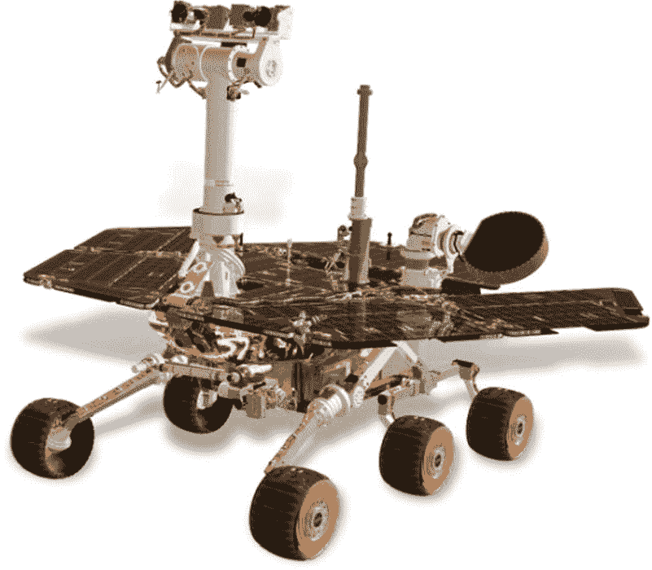
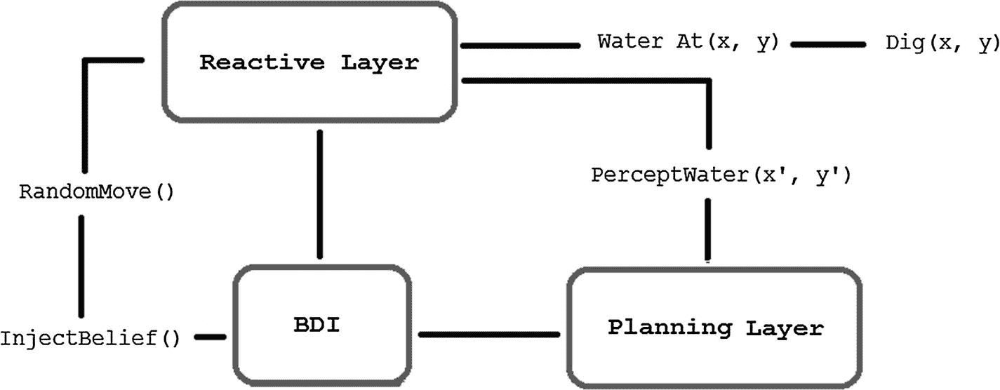
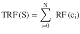
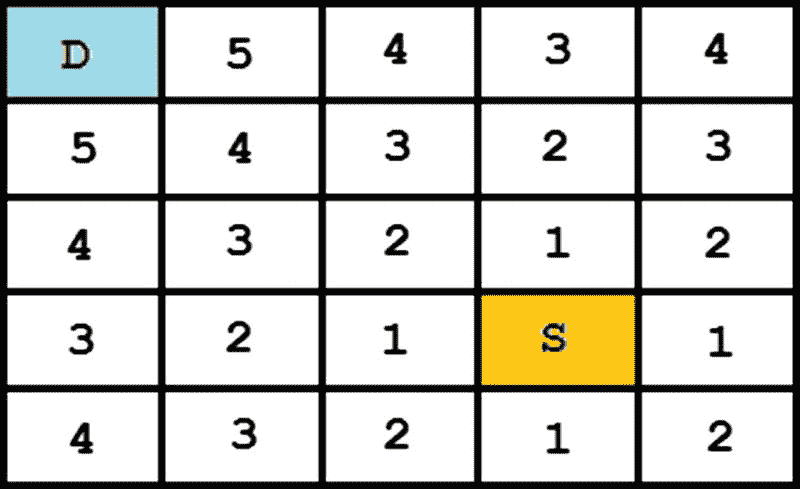
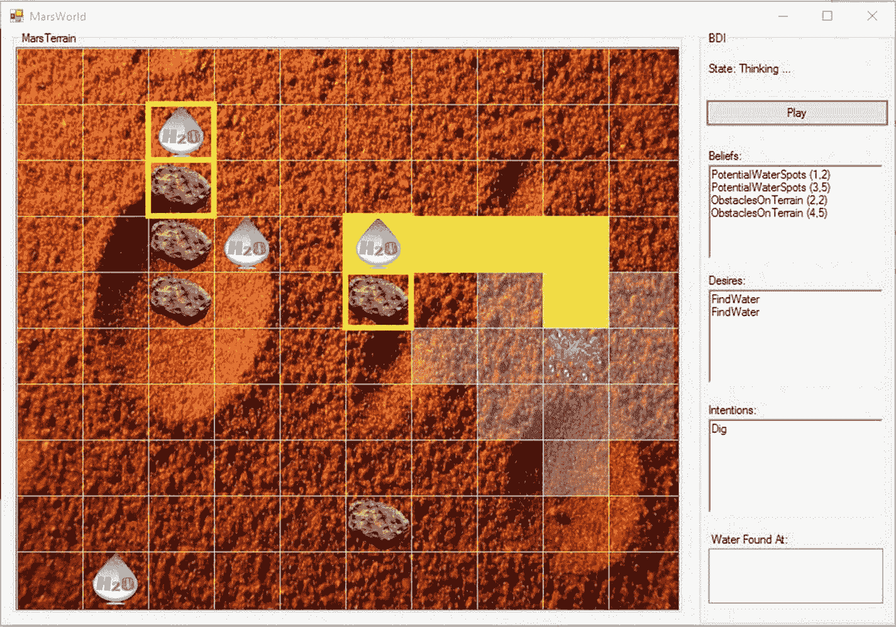
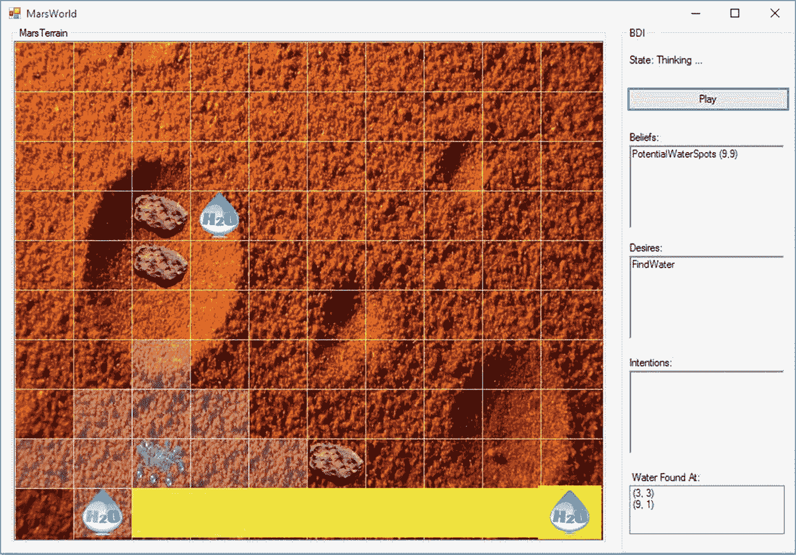
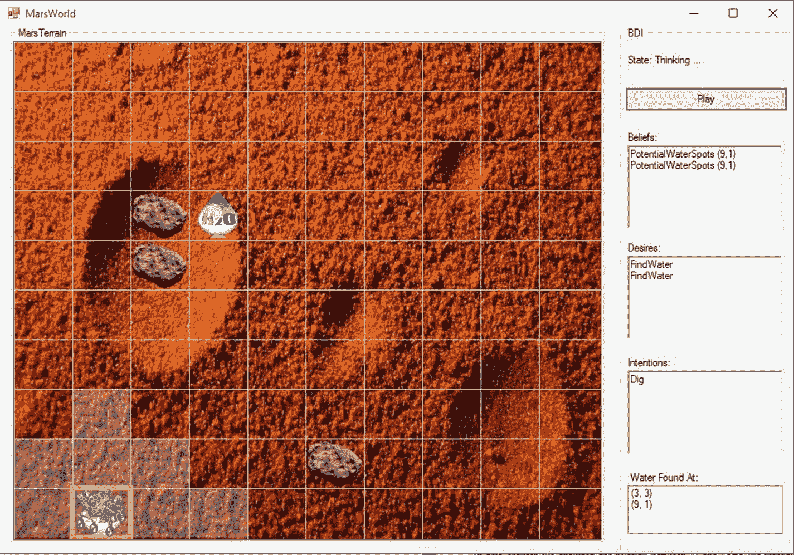

# 四、火星探测器

沿着上一章开始的路线(智能体)，我们将在第 [4](04.html) 章介绍一个基于混合架构的火星漫游者 AI，该架构包括一个用于即时决策的反应层，并使用 BDI(信念、愿望、意图)范式来实现其审议层。这个实际问题将帮助我们巩固在第三章[中获得的所有知识(智能体属性、智能体状态、架构等等)，并帮助我们理解如何在现实世界的问题中集合所有知识。](03.html)

太空探索是一个迷人的话题，与人工智能领域结合得很好，在全球拥有数百万追随者。由于太空的条件对人类来说相当困难和危险，机器人的使用是频繁和必要的。因此，将人工智能用于参与太空探索的机器的想法是合乎逻辑的，近年来对它进行了许多研究。

本章所要解决的实际问题将包括一个可视化应用(Windows Forms ),显示火星探测器在 n x m(行 x 列)的离散环境中的任意时刻的执行情况。该应用模拟了火星环境，其中包含被智能体视为障碍物的各种岩石以及隐藏的水点或残余水。该计划还将向我们展示它的计划(符合计划的行动序列将用黄色表示)以及它如何管理信念、欲望和意图。火星漫游者的目标基本上是科学研究，在我们的情况下，有一个非常重要的任务，即寻找火星上任何类型的水的痕迹，加上试图保持活跃和避免障碍。

Note

勇气号和机遇号是最受欢迎的两个火星探测器；他们都做出了令人难以置信的发现，并大大超出了他们的预期寿命。Spirit 于 2003 年 6 月推出，Opportunity 于 2003 年 7 月推出。“勇气号”一直活跃到 2010 年(生命的七年)，当时它的轮子陷入了沙子，而“机遇号”在本书写作时，仍然活跃并在火星上漫游。

## 什么是火星探测器？

今天的火星是一个荒凉、干燥的星球，从远处看，它与我们的地球家园很不相似。然而，当接近火星的轨道时，我们可以在表面上看到可能是古代的东西，现在干涸的湖泊和峡谷，这表明火星可能在 300 万或 400 万年前不仅有水，还有生命。

太空生活是艰苦的；对于人类来说，在那里生存是非常复杂的，充满风险和危险，到达一些最近的行星可能需要很多年，因此为了促进对其他世界的研究，多个太空机构(美国宇航局、加拿大航天局、欧空局等)一直在设计机器人，或者，正如他们通常所说的，漫游者，用于探索和研究行星。

火星漫游者是一种自动化的机动车辆，它装载了分析周围环境的相机，挖掘并可能分析有趣岩石的研究仪器，发送图片和数据并接收命令的通信设备，为自身提供能量的太阳能电池板，等等(图 [4-1](#Fig1) )。漫游者的任务是探索火星并收集重要的数据，这些数据有望得出火星上过去存在水的结论，或者发现古代生命。



图 4-1

Mars Rover

火星漫游者往往移动非常缓慢，接近每秒两英寸(大约每小时 0.09 英里)。在经历了乘火星车去火星的所有麻烦和费用之后，工程师们更愿意安全行事，小心驾驶；没有人愿意看到一辆价值 25 亿美元的路虎车因为开得太快而倒过来。另一个要点是:大多数漫游者每天都从地球上的团队接收一系列命令或指示；这些指令告诉漫游者去哪里或做什么。从这个意义上说，可以说传统的漫游者并不像我们想象的那样自主；他们当然包括一些自主行为，因为地球上的团队不在火星上，无法实时观看他们的每一步。因此，漫游者的人工智能负责决定何时岩石太大而无法越过(障碍)，或者何时岩石的颜色和纹理使其值得检查。有人可能会说漫游者是自动的，很好地服从命令，有点像人类士兵。漫游者的任务是一项双方面的工作；一边是地球上的工程师，计划他们的日常行动，他们的大规模战略，等等，另一边是漫游者，执行这些行动，探索，收集数据，并将其发送回地球。

在这一章中，我们将演示如何为完全自主的火星漫游车开发一个人工智能，它将考虑地形中的障碍，并将在一个混合架构下寻找水，该架构包括一个 BDI(信念、愿望、意图)审议机制，并使用统计数据和概率为自己注入新的信念，这些信念将从其状态(过去的历史)中得出结论。

Note

火星通常被称为红色星球，因为它在夜空中略带红色。总的来说，火星大部分是铁锈色的，因为它的土壤中含有铁。当暴露在火星大气中的少量氧气中时，铁会氧化或生锈。那种“锈尘”也能吹到空中，把天空变成桃红色。

## 火星漫游建筑

让我们花一点时间来检查一下我们将为火星漫游者 AI 提出的混合架构(图 [4-2](#Fig2) )。



图 4-2

Mars Rover architecture

该架构由三层组成(反应层、BDI 层和规划层)；不同的感知或事件(在图 [4-2](#Fig2) 中用较小的字体表示)可以导致一个层执行。例如，如果漫游者的当前位置有水，那么反应层将立即行动并引导漫游者在该位置挖掘。如果附近区域有与水相关的感知，反应层也会被触发。漫游者将包含一个名为`SenseRadius`的变量或场，该变量或场将确定围绕它的圆圈并代表它的视野；漫游者将能够感知这个圆圈内的一切。因为我们正在处理一个离散的环境，这个圆将是一个真实圆的近似；换句话说，它将是圆的离散版本。

Note

像勇气号或机遇号这样的火星漫游者，都是由美国宇航局制造的，都有鱼眼相机或广角相机，可以捕捉到他们面前地形的大致视图。分析这些相机拍摄的照片，以决定路径上的某个岩石是否太大而无法越过，等等。

如果漫游器具有一些初始信念，并且没有显著感兴趣的感知，则控制从反应层传递到 BDI 层，在那里过程从信念集开始；在这个过程中，信念集被更新。我们今天的信念可能明天就被证明是错误的。至于漫游车，它认为可能有水的地形位置可能是不正确的，因此这个信念数据库必须随着新感知的到来而不断更新。在第二阶段，欲望从信念中产生。对于漫游者来说，它的信念将由可能的水位置组成，并且它的愿望将是使用曼哈顿距离(也称为街区距离)作为度量，按照接近度排序的这些可能的水位置。因此，前往最近的水域位置将成为漫游者当前的意图。

为了实现其当前意图，漫游器使用其计划库(在计划层)并选择符合所选意图的计划。在这个例子中，因为我们只考虑与可能的水域位置相关的意图，所以我们的计划库将只包含一种类型的计划:路径寻找。

寻路算法解决了在两个给定点之间寻找最短路径的问题；这些算法不仅考虑了网格/地形上的障碍，还考虑了每条可能路径的成本。它的一些代表是广度优先搜索(BFS)，Djistkra 的算法，和 A*搜索。对于我们的漫游者，我们开发了 BFS，这是效率最低的，但也是最简单的。其他的通过使用启发式、动态规划等等，避免考虑昂贵的路径，表现得更好。

一旦漫游者探索了它所有的信念，它将四处游荡(随机移动)，直到它达到一定数量的动作。在这一点上，我们将通过使用一个数据结构(字典)将信念注入到漫游器中，该数据结构将它的状态或过去的历史保持为一组被访问的单元及其访问频率(它访问单元的次数)，以及一个由应用简单的概率和统计概念组成的审议过程。

在这个考虑过程中，流动站已知的地形被划分为四个相等(或几乎相等)的扇区(为了进一步精确，可以被划分为 2 个 <sup>n</sup> 扇区)，并且对于每个扇区和该扇区中的每个`(location, frequency_visits)`对，我们计算相对频率并且将在每个单独的扇区中获得的结果相加，具有作为最终结果的四个总相对频率值(每个扇区一个)。使用以下公式进行相对频率(RF)计算:


其中 freq(c)表示小区 c 被访问的次数，N 是 c 所属的集合(扇区)中的元素总数。那么，对于每个扇区 S，其总相对频率将是:



最终，漫游者会选择在总相对频率最低的扇区的一个角落“注入”水位置的信念，这应该是过去最少访问的一个。我们可以说这种方法是一种启发式的；也就是说，我们有关于这个问题的特定知识，并且我们正在嵌入它，试图在它的任务中从漫游者获得更好的行为。这个启发法和其他与这个问题相关的方法将会非常简单，甚至是天真的；现在的目的是说明如何创建一个混合智能体架构。因此，启发式将不会是本章的核心。作为一个快速说明，我们总是选择所选部门的一个角落来注入信念的策略或启发式方法可以以同样的方式得到极大的改进，部门划分和选择过程可以得到极大的改进。

既然我们已经看到了我们的漫游者的架构，以及它将如何实际做出每一步的决策，现在是时候展示它的代码了。

## 火星探测器代码

火星探测器是用 C#类编写的，包含以下字段、属性和构造函数(清单 [4-1](#Par22) )。

```py
public class MarsRover
    {
        public Mars Mars { get; set; }
        public List<Belief> Beliefs { get; set; }
        public Queue<Desire> Desires { get; set; }
        public Stack<Intention> Intentions { get; set; }
        public List<Plan> PlanLibrary { get; set; }
        public int X { get; set; }
        public int Y { get; set; }
        public int SenseRadius { get; set; }
        public double RunningOverThreshold { get; set; }
        // Identifies the last part of the terrain seen by the Rover
        public List<Tuple<int, int>> CurrentTerrain { get; set; }
        public Plan CurrentPlan { get; set; }
        public List<Tuple<int, int>> WaterFound { get; set; }
        private double[,] _terrain;
        private static Random _random;
        private Dictionary<Tuple<int, int>, int> _perceivedCells;
        private int _wanderTimes;
private const int WanderThreshold = 10;

        public MarsRover(Mars mars, double [,] terrain, int x, int y, IEnumerable<Belief> initialBeliefs, double runningOver, int senseRadious)
{

            Mars = mars;
            X = x;
            Y = y;
_terrain = new double[terrain.GetLength(0), terrain.GetLength(1)];
            Array.Copy(terrain, _terrain, terrain.GetLength(0) * terrain.GetLength(1));
            Beliefs = new List<Belief>(initialBeliefs);
            Desires = new Queue<Desire>();
            Intentions = new Stack<Intention>();
            PlanLibrary = new List<Plan>
                              {
                                  new  Plan(TypesPlan.PathFinding, this),
                              };
            WaterFound = new List<Tuple<int, int>>();
            RunningOverThreshold = runningOver;
            SenseRadius = senseRadious;
            CurrentTerrain = new List<Tuple<int, int>>();
            _random = new Random();
            _perceivedCells = new Dictionary<Tuple<int, int>, int>();
 }
}

Listing 4-1Mars Rover Fields, Variables, and Constructor

```

`MarsRover`类包含以下字段和变量:

*   火星世界或环境的面向对象表示。智能体将使用该对象来查询火星实际地形上的水位置和障碍物。
*   `X, Y`:都是整数，表示火星车在网格/火星地形中的当前位置。
*   代表火星世界或地形的矩阵，就像漫游车最初设想的那样，在着陆之前，在它可以通过感知更新之前。就像工程师给的对火星的先入之见；这是他们的地图，可能会有错误，所以必须更新。
*   `Beliefs`:代表漫游器具有的一组信念的列表；这些可能来自工程师在火星车登陆火星之前编码的一组初始信念，例如，`WaterAt(2,3)`等。或者是漫游者后来通过某种深思熟虑的逻辑过程注入自己的信念
*   `Desires`:代表流动者具有的一组需求的队列；欲望源于信念，并根据当前意图(如果有的话)进行更新。在漫游车的情况下，期望将由可能的水位置组成，总是按接近程度排序或优先化。
*   `Intentions`:漫游者的一堆意图；顶部的一个代表当前的意图，也是有计划的一个
*   `PlanLibrary`:表示漫游者可以根据所采取的意图执行的计划列表
*   `WaterFound`:火星上发现水的位置列表(如果有的话)
*   `RunningOverThreshold`:双精度值，表示地形上的岩石被视为漫游车障碍物的阈值
*   `SenseRadius`:表示漫游车视野半径的整数值；即圆心是流动站当前位置的圆的半径，并确定其周围的“视野”
*   `CurrentTerrain`:表示漫游车当前的地形；即由半径为`SenseRadius`的圆定义的那个。该数据结构随着流动站的移动而更新。
*   `CurrentPlan`:表示流动站正在执行的当前计划
*   `_random`:获取随机值的变量(漫游车漫游时)
*   `_perceivedCells`:存储单元被访问次数的数据结构。它用于漫游者的`Statistics-Probability`组件，当它漫游足够长的时间时，决定在哪里注入水。
*   `_wanderTimes`:表示漫游车漫游次数的整数值
*   `WanderThreshold`:整数值，决定漫游车在“漫游”时可以采取的动作数量一旦漫游车执行`WanderThreshold`动作，它将停止漫游，并自动注入信念。

`Mars`对象(火星世界的表示)使用清单 [4-2](#Par41) 中所示的类作为蓝图。

```py
    public class Mars
    {
        private readonly double[,] _terrain;

        public Mars(double[,] terrain)
        {
            _terrain = new double[terrain.GetLength(0), terrain.GetLength(1)];
            Array.Copy(terrain, _terrain, terrain.GetLength(0) * terrain.GetLength(1));
        }

        public double TerrainAt(int x, int y)
        {
            return _terrain[x, y];
        }

        public bool WaterAt(int x, int y)
        {
            return _terrain[x, y] < 0;
        }
    }

Listing 4-2
Mars Class

```

`Mars`类非常简单；它包含一个描述地形(海拔)的矩阵和两种方法，允许漫游车查询给定位置的环境情况。这个地形代表了真实的火星地形；火星车还包含了火星环境的图像，但这是基于工程师的地图等的图像。它不会像实际地形一样精确。因此，火星车必须处理这个物体，以确保它在火星环境的数据是准确的，如果不准确，就更新它。

为了与信念、欲望和意图一起工作，我们将它们编码为类。`Intention`类继承自`Desire`类(列表 [4-3](#Par44) )。

```py
public class Belief
    {
        public TypesBelief Name { get; set; }
        public dynamic Predicate;

        public Belief(TypesBelief name, dynamic predicate)
        {
            Name = name;
            Predicate = predicate;
        }

        public override string ToString()
        {
            var result = "";
            var coord = Predicate as List<Tuple<int, int>>;

            foreach (var c in coord)
                result += Name + " (" + c.Item1 + "," + c.Item2 + ")" + "\n";

            return result;
        }
    }

    public class Desire
    {
        public TypesDesire Name { get; set; }
        public dynamic Predicate;
        public List<Desire> SubDesires { get; set; }

        public Desire() { SubDesires = new List<Desire>(); }

        public Desire(TypesDesire name)
        {
            Name = name;
            SubDesires = new List<Desire>();
        }

        public Desire(TypesDesire name, dynamic predicate)

        {
            Name = name;
            Predicate = predicate;
            SubDesires = new List<Desire>();
        }

        public Desire(TypesDesire name, IEnumerable<Desire> subDesires)
        {
            Name = name;
            SubDesires = new List<Desire>(subDesires);
        }

        public Desire(TypesDesire name, params Desire[] subDesires)
        {
            Name = name;
            SubDesires = new List<Desire>(subDesires);
        }

        public List<Desire> GetSubDesires()
        {
            if (SubDesires.Count == 0)
                return new List<Desire>() { this };

            var result = new List<Desire>();

            foreach (var desire in SubDesires)
                result.AddRange(desire.GetSubDesires());

            return result;
        }

        public override string ToString()
        {
            return Name.ToString() + "\n";
        }
    }

    public class Intention: Desire
    {
        public static Intention FromDesire(Desire desire)
        {
            var result = new Intention
                             {
                                 Name = desire.Name,
                                 SubDesires = new List<Desire>(desire.SubDesires),
                                 Predicate = desire.Predicate
                             };

            return result;
        }
    }

Listing 4-3
Belief, Desire, and Intention Classes

```

信念通常被编码为谓词，所以我们包含了一个动态(可以是任何东西)`Predicate`属性来表示它们。在这种情况下，漫游者将具有谓词`List<Tuple<int, int>>`来指示水位置的信念。为了使类能够容纳不同类型的谓词，只有`override ToString()`方法需要改变。

欲望不仅包括谓词，还包括子欲望，如第三章所解释的。方法将负责从欲望树上获取树叶。回忆一下第 3 章中的内容，一个给定的欲望可能有子欲望，在实际的欲望被满足之前，这些子欲望必须被满足，而这些叶子或主欲望是主体必须在任何其他欲望之前执行的(因为其他欲望依赖于叶子欲望或者是叶子欲望的结果)。

最后，意图继承于欲望。请记住:意图是欲望的子集，我们可能有多个欲望，但并不是所有的欲望都需要在给定的时间内是现实的；意图是我们决定在某个时候承诺的那些欲望。为了能够将愿望转化为意图，我们使用了`FromDesire()`方法。

为了定义并轻松处理有限的信念、欲望、感知、行动等等，我们声明了以下(列表 [4-4](#Par49) )枚举。

```py
    public enum TypePercept
    {
        WaterSpot, Obstacle, MoveUp, MoveDown, MoveLeft, MoveRight
    }

    public enum TypesBelief
    {
        PotentialWaterSpots, ObstaclesOnTerrain
    }

    public enum TypesDesire
    {
        FindWater, GotoLocation, Dig
    }

    public enum TypesPlan
    {
        PathFinding
    }

    public enum TypesAction
    {
        MoveUp, MoveDown, MoveLeft, MoveRight, Dig,
        None
    }

Listing 4-4Enum for Beliefs, Desires, Percepts, Plans, and Actions

```

为了能够更好地处理感知和计划，我们将在程序中加入清单 [4-5](#Par51) 所示的`Percept`和`Plan`类。

```py
public class Percept
    {
        public TypePercept Type { get; set; }
        public Tuple<int, int> Position { get; set; }

public Percept(Tuple<int, int> position, TypePercept percept)
        {
            Position = position;
Type = percept;
        }
    }

public class Plan
    {
        public TypesPlan Name { get; set; }
        public List<Tuple<int, int>> Path { get; set; }
        private MarsRover _rover;

        public Plan(TypesPlan name, MarsRover rover)
        {
            Name = name;
            Path = new List<Tuple<int, int>>();
            _rover = rover;
        }

        public TypesAction NextAction()
        {
            if (Path.Count == 0)
                return TypesAction.None;

            var next = Path.First();
            Path.RemoveAt(0);

            if (_rover.X > next.Item1)
                 return TypesAction.MoveUp;
            if (_rover.X < next.Item1)
                 return TypesAction.MoveDown;
            if (_rover.Y < next.Item2)
                return TypesAction.MoveRight;
            if(_rover.Y > next.Item2)
                return TypesAction.MoveLeft;

            return TypesAction.None;
        }

        public void BuildPlan(Tuple<int, int> source, Tuple<int, int> dest)
        {
            switch (Name)
            {
                    case TypesPlan.PathFinding:
                        Path = PathFinding(source.Item1, source.Item2, dest.Item1, dest.Item2).Item2;
                        break;
            }
        }

        private Tuple<Tuple<int, int>, List<Tuple<int, int>>> PathFinding(int x1, int y1, int x2, int y2)
        {
            var queue = new Queue<Tuple<Tuple<int, int>, List<Tuple<int, int>>>>();
            queue.Enqueue(new Tuple<Tuple<int, int>, List<Tuple<int, int>>>(new Tuple<int, int>(x1, y1), new List<Tuple<int, int>>()));
            var hashSetVisitedCells = new HashSet<Tuple<int, int>>();

            while(queue.Count > 0)
            {
                var currentCell = queue.Dequeue();
                var currentPath = currentCell.Item2;
                hashSetVisitedCells.Add(currentCell.Item1);
                var x = currentCell.Item1.Item1;
                var y = currentCell.Item1.Item2;

                if (x == x2 && y == y2)
                    return currentCell;

                // Up
                if (_rover.MoveAvailable(x - 1, y) && !hashSetVisitedCells.Contains(new Tuple<int, int>(x - 1, y)))

                {
                    var pathUp = new List<Tuple<int, int>>(currentPath);
                    pathUp.Add(new Tuple<int, int>(x - 1, y));
                    queue.Enqueue(new Tuple<Tuple<int, int>, List<Tuple<int, int>>>(new Tuple<int, int>(x - 1, y), pathUp));   
                }
                // Down
                if (_rover.MoveAvailable(x + 1, y) && !hashSetVisitedCells.Contains(new Tuple<int, int>(x + 1, y)))
                {
                    var pathDown = new List<Tuple<int, int>>(currentPath);
                    pathDown.Add(new Tuple<int, int>(x + 1, y));
                    queue.Enqueue(new Tuple<Tuple<int, int>, List<Tuple<int, int>>>(new Tuple<int, int>(x + 1, y), pathDown));
                }
                // Left
                if (_rover.MoveAvailable(x, y - 1) && !hashSetVisitedCells.Contains(new Tuple<int, int>(x, y - 1)))
                {
                    var pathLeft = new List<Tuple<int, int>>(currentPath);
                    pathLeft.Add(new Tuple<int, int>(x, y - 1));
                    queue.Enqueue(new Tuple<Tuple<int, int>, List<Tuple<int, int>>>(new Tuple<int, int>(x, y - 1), pathLeft));
                }

                // Right
                if (_rover.MoveAvailable(x, y + 1) && !hashSetVisitedCells.Contains(new Tuple<int, int>(x, y + 1)))
                {
                    var pathRight = new List<Tuple<int, int>>(currentPath);
                    pathRight.Add(new Tuple<int, int>(x, y + 1));
                    queue.Enqueue(new Tuple<Tuple<int, int>, List<Tuple<int, int>>>(new Tuple<int, int>(x, y + 1), pathRight));
                }
            }

            return null;
        }

        public bool FulFill()
        {
            return Path.Count == 0;
        }
    }

Listing 4-5
Percept and Plan Classes

```

`Percept`类非常简单；我们只是用它来让我们更容易知道一个知觉发生在哪里。通过使用这个类，我们可以保存感知位置。另一方面，`Plan`类稍微复杂一些。

`Plan`类包含一个属性`List<Tuple<int, int>> Path`，它定义了智能体作为执行计划的结果而创建的`Path`；在这种情况下，路径查找计划。`BuildPlan()`方法将允许我们建立不同类型的计划。它被认为是一种计划选择机制。`NextAction()`方法通过返回和删除当前计划中要执行的下一个动作来更新`Path`属性。最后，`PathFinding()`方法实现了广度优先搜索(BFS)算法，用于在地形中找到从给定源到给定目的地或位置的最佳路线。我们将在以后的章节中看到更多这种算法；现在，让我们将它视为不同图相关任务的基本算法，并记住它从源开始，发现从源到目的地的路径的新步骤，并逐级升级(图 [4-3](#Fig3) )。为此，它使用一个队列将当时正在被检查的小区的所有未被访问的邻居入队。



图 4-3

BFS is capable of discovering paths by levels; S is the source and D the destination. Each numbered cell determines a level in the search; i.e., level 1, 2, etc.

`FulFill()`方法决定计划何时被完全执行。

既然我们已经熟悉了火星漫游者将要使用的所有类，让我们深入研究火星漫游者 AI 代码。

类似于第 3 章中为智能体实现的方法，我们的火星漫游者包括一个`GetPercepts()`方法(列表 [4-6](#Par57) ),它提供了一个智能体在当前时间和其可视半径内感知的感知列表。

```py
public List<Percept> GetPercepts()
        {
            var result = new List<Percept>();

            if (MoveAvailable(X - 1, Y))
                result.Add(new Percept(new Tuple<int,int>(X - 1, Y), TypePercept.MoveUp));

            if (MoveAvailable(X + 1, Y))
                result.Add(new Percept(new Tuple<int, int>(X + 1, Y), TypePercept.MoveDown));

            if (MoveAvailable(X, Y - 1))
                result.Add(new Percept(new Tuple<int, int>(X, Y - 1), TypePercept.MoveLeft));

            if (MoveAvailable(X, Y + 1))
                result.Add(new Percept(new Tuple<int, int>(X, Y + 1), TypePercept.MoveRight));

            result.AddRange(LookAround());

            return result;
        }

Listing 4-6
GetPercepts() Method

```

`GetPercepts()`方法利用了`MoveAvailable()`和`LookAround()`方法，两者都在清单 [4-7](#Par59) 中进行了说明。

```py
        public bool MoveAvailable(int x, int y)
        {
            return x >= 0 && y >= 0 && x < _terrain.GetLength(0) && y < _terrain.GetLength(1) && _terrain[x, y] < RunningOverThreshold;
        }

private IEnumerable<Percept> LookAround()
        {
            return GetCurrentTerrain();
        }

Listing 4-7
MoveAvailable() and LookAround() Methods

```

由于我们希望我们的火星探测器在“环视”的方式上尽可能通用(人们可能对环视有不同的定义)，这个功能的最终实现由清单 [4-8](#Par61) 中的`GetCurrentTerrain()`方法给出。

```py
public IEnumerable<Percept> GetCurrentTerrain()
        {
            var R = SenseRadius;
            CurrentTerrain.Clear();
            var result = new List<Percept>();

            for (var i = X - R > 0 ? X - R : 0; i <= X + R; i++)
            {
                for (var j = Y; Math.Pow((j - Y), 2) + Math.Pow((i - X), 2) <= Math.Pow(R, 2); j--)
                {
                    if (j < 0 || i >= _terrain.GetLength(0)) break;
                    // In the circle
                    result.AddRange(CheckTerrain(Mars.TerrainAt(i, j), new Tuple<int, int>(i, j)));
                    CurrentTerrain.Add(new Tuple<int, int>(i, j));
                    UpdatePerceivedCellsDicc(new Tuple<int, int>(i, j));
                }
                for (var j = Y + 1; (j - Y) * (j - Y) + (i - X) * (i - X) <= R * R; j++)
                {
                    if (j >= _terrain.GetLength(1) || i >= _terrain.GetLength(0)) break;
                    // In the circle
                    result.AddRange(CheckTerrain(Mars.TerrainAt(i, j), new Tuple<int, int>(i, j)));
                    CurrentTerrain.Add(new Tuple<int, int>(i, j));
                    UpdatePerceivedCellsDicc(new Tuple<int, int>(i, j));
                }
            }

            return result;
        }

Listing 4-8
GetCurrentTerrain() Method

```

清单 [4-8](#Par61) 中的方法包括几个依赖于圆周公式的循环:


其中(h，k)代表圆心，在本例中是智能体的位置；r 代表圆的半径，或者在这种情况下代表`SenseRadius`。这些环路允许漫游者跟踪距离其当前位置`SenseRadius`的每个单元。在这些循环中，我们调用了`UpdatePerceivedCellsDicc()`和`CheckTerrain()`方法(清单 [4-9](#Par64) )。第一个简单地更新我们在统计和概率组件中使用的访问过的单元字典，以向漫游器注入新的信念。

后者从地形中检查给定的单元，以查看它是障碍还是水域位置。它还通过更新与感知坐标相对应的值来更新漫游车最初拥有的内部`_terrain`数据结构，并在以后维护该数据结构。

```py
        private void UpdatePerceivedCellsDicc(Tuple<int, int> position)
        {
            if (!_perceivedCells.ContainsKey(position))
                _perceivedCells.Add(position, 0);
            _perceivedCells[position]++;
}

        private IEnumerable<Percept> CheckTerrain(double cell, Tuple<int, int> position)
{
            var result = new List<Percept>();

            if (cell > RunningOverThreshold)
                result.Add(new Percept(position, TypePercept.Obstacle));
            else if (cell < 0)
                result.Add(new Percept(position, TypePercept.WaterSpot));
            // Update the rover's internal terrain
            _terrain[position.Item1, position.Item2] = cell;

            return result;
        }

Listing 4-9
UpdatePerceivedCellsDicc() and CheckTerrain() Methods

```

负责生成漫游器要执行的下一个动作的方法是清单 [4-10](#Par66) 中所示的`Action()`方法。

```py
        public TypesAction Action(List<Percept> percepts)
        {
            // Reactive Layer
            if (Mars.WaterAt(X, Y) && !WaterFound.Contains(new Tuple<int, int>(X, Y)))
                return TypesAction.Dig;

            var waterPercepts = percepts.FindAll(p => p.Type == TypePercept.WaterSpot);

            if (waterPercepts.Count > 0)
            {
                foreach (var waterPercept in waterPercepts)
                {
                    var belief = Beliefs.FirstOrDefault(b => b.Name == TypesBelief.PotentialWaterSpots);
                    List<Tuple<int, int>> pred;
                    if (belief != null)
                        pred = belief.Predicate as List<Tuple<int, int>>;
                    else
                    {
                        pred = new List<Tuple<int, int>> {waterPercept.Position};
                        Beliefs.Add(new Belief(TypesBelief.PotentialWaterSpots, pred));
                    }
                    if (!WaterFound.Contains(waterPercept.Position))
                        pred.Add(waterPercept.Position);
                    else
                    {
                        pred.RemoveAll(
                            t => t.Item1 == waterPercept.Position.Item1 && t.Item2 == waterPercept.Position.Item2);
                        if (pred.Count == 0)
                            Beliefs.RemoveAll(b => (b.Predicate as List<Tuple<int, int>>).Count == 0);
                    }
                }

                if (waterPercepts.Any(p => !WaterFound.Contains(p.Position)))
                    CurrentPlan = null;
            }

            if (Beliefs.Count == 0)
            {
                if (_wanderTimes == WanderThreshold)
                {
_wanderTimes = 0;
                    InjectBelief();
                }
_wanderTimes++;
                return RandomMove(percepts);
            }
            if (CurrentPlan == null || CurrentPlan.FullFill())
            {
                // Deliberative Layer
                Brf(percepts);
                Options();
                Filter();
            }

            return CurrentPlan.NextAction();
        }

Listing 4-10
Action() Method

```

在这种方法中，我们结合了智能体的反应层和审议层。第一行对应于反应层，考虑需要立即响应的不同场景:

1.  漫游者的当前位置有水，而那个地方以前没有被发现。
2.  在漫游车的周围区域(由半径为`SenseRadius`的圆圈定义)有一个可能的水位置。在这种情况下，总是检查可能的水的位置还没有被发现，我们添加一个水的信念到漫游者。
3.  如果先前没有发现在步骤 2 中感知的水位置，则删除当前计划。考虑到新的信念，一个新的将被建立。
4.  如果漫游者没有信念，它将执行随机动作(列表[4-11](#Par73))；即四处游荡。一旦这种“四处游荡”达到一定数量的行为(在这种情况下是十个)，信念就会被注入。

前面的四个步骤构成了我们智能体的反应层；由`Brf()`、`Options()`和`Filter()`方法组成的方法的最后一部分代表了审议层(BDI 架构)。`InjectBelief()`方法也是这个审议层的一部分，因为它涉及一个“审议”过程，在这个过程中智能体决定它的下一步行动。

```py
private TypesAction RandomMove(List<Percept> percepts)
        {
            var moves = percepts.FindAll(p => p.Type.ToString().Contains("Move"));
            var selectedMove = moves[_random.Next(0, moves.Count)];

            switch (selectedMove.Type)
            {
                case TypePercept.MoveUp:
                    return TypesAction.MoveUp;
                case TypePercept.MoveDown:
                    return TypesAction.MoveDown;
                case TypePercept.MoveRight:
                    return TypesAction.MoveRight;
                case TypePercept.MoveLeft:
                    return TypesAction.MoveLeft;
            }

            return TypesAction.None;
        }

Listing 4-11
RandomMove() Method

```

漫游者的统计和概率组件，以及允许它基于其过去的历史注入信念的组件，由`InjectBelief()`方法表示，这可以在清单 [4-12](#Par75) 及其助手方法中看到。

```py
private void InjectBelief()
        {
            var halfC = _terrain.GetLength(1) / 2;
            var halfR = _terrain.GetLength(0) / 2;

            var firstSector = _perceivedCells.Where(k => k.Key.Item1 < halfR && k.Key.Item2 < halfC).ToList();
            var secondSector = _perceivedCells.Where(k => k.Key.Item1 < halfR && k.Key.Item2 >= halfC).ToList();

            var thirdSector = _perceivedCells.Where(k => k.Key.Item1 >= halfR && k.Key.Item2 < halfC).ToList();
            var fourthSector = _perceivedCells.Where(k => k.Key.Item1 >= halfR && k.Key.Item2 >= halfC).ToList();

            var freq1stSector = SetRelativeFreq(firstSector);
            var freq2ndSector = SetRelativeFreq(secondSector);
            var freq3rdSector = SetRelativeFreq(thirdSector);
            var freq4thSector = SetRelativeFreq(fourthSector);

            var min = Math.Min(freq1stSector, Math.Min(freq2ndSector, Math.Min(freq3rdSector, freq4thSector)));

            if (min == freq1stSector)
                Beliefs.Add(new Belief(TypesBelief.PotentialWaterSpots, new List<Tuple<int, int>> { new Tuple<int, int>(0, 0) }));
            else if (min == freq2ndSector)
                Beliefs.Add(new Belief(TypesBelief.PotentialWaterSpots, new List<Tuple<int, int>> { new Tuple<int, int>(0, _terrain.GetLength(1) - 1) }));
            else if (min == freq3rdSector)
                Beliefs.Add(new Belief(TypesBelief.PotentialWaterSpots, new List<Tuple<int, int>> { new Tuple<int, int>(_terrain.GetLength(0) - 1, 0) }));
            else
                Beliefs.Add(new Belief(TypesBelief.PotentialWaterSpots, new List<Tuple<int, int>> { new Tuple<int, int>(_terrain.GetLength(0) - 1, _terrain.GetLength(1) - 1) }));
        }

        private double SetRelativeFreq(List<KeyValuePair<Tuple<int, int>, int>> cells)
        {
            var result = 0.0;

            foreach (var cell in cells)
                result += RelativeFrequency(cell.Value, cells.Count);

            return result;
        }

        private double RelativeFrequency(int absFreq, int n)
        {
            return (double) absFreq/n;
        }

Listing 4-12
InjectBelief(), SetRelativeFreq(), and RelativeFreq() Methods

```

如上一节所述，计算给定扇区每个小区的相对频率，然后在`SetRelativeFreq()`方法中求和，以获得该组小区的总频率。请注意，在这种情况下，我们决定将地形划分为四个相等的扇区，但是您可以决定在您认为必要的任意多个扇区中进行划分，或者按照您认为必要的详细程度进行划分，就像在四叉树中一样。考虑到漫游者的`SenseRadius`和它四处游荡的时间，人们甚至可以决定将地形分成一定数量的扇区。这些值都是相关的，并且它们中的大多数在附加到漫游器的试探法中被考虑。在这种情况下——并在提出的例子中寻求简单性——我们选择为漫游者附加真正天真的启发式；例如，在不同的情况下，总是在所选部门的某个角落注入水的信念可能是个坏主意，因为它不会每次都工作得很好。因此，扇区选择和扇区内小区选择机制需要更加通用，以使流动站在多种环境中表现良好。让我们记住，这里提出的试探法可以大大改进，因此漫游者将提高其性能。

Note

四叉树是一种树形数据结构，其中每个内部节点正好有四个子节点。它们通常用于通过递归地将二维空间或区域细分成四个象限或区域来分割它。

最后，让我们检查审议层及其所有方法，从信念修正函数开始(清单 [4-13](#Par79) )。

```py
        public void Brf(List<Percept> percepts)
        {
            var newBeliefs = new List<Belief>();

            foreach (var b in Beliefs)
            {
                switch (b.Name)
                {
                    case TypesBelief.PotentialWaterSpots:
                        var waterSpots = new List<Tuple<int, int>>(b.Predicate);
                        waterSpots = UpdateBelief(TypesBelief.PotentialWaterSpots, waterSpots);
                        if (waterSpots.Count > 0)
                            newBeliefs.Add(new Belief(TypesBelief.PotentialWaterSpots, waterSpots));
                        break;
                    case TypesBelief.ObstaclesOnTerrain:
                        var obstacleSpots = new List<Tuple<int, int>>(b.Predicate);
                        obstacleSpots = UpdateBelief(TypesBelief.ObstaclesOnTerrain, obstacleSpots);
                        if (obstacleSpots.Count > 0)
                            newBeliefs.Add(new Belief(TypesBelief.ObstaclesOnTerrain, obstacleSpots));
                        break;
                }

            }          

            Beliefs = new List<Belief>(newBeliefs);
        }

Listing 4-13
Brf() Method

```

在`Brf()`方法中，我们检查每个信念(可能的水位置，可能的障碍位置)并更新它们，创建一组新的信念。清单 [4-14](#Par81) 中说明了`UpdateBelief()`方法。

```py
private List<Tuple<int, int>> UpdateBelief(TypesBelief belief, IEnumerable<Tuple<int, int>> beliefPos)
        {
            var result = new List<Tuple<int, int>>();

            foreach (var spot in beliefPos)
            {
                 if (CurrentTerrain.Contains(new Tuple<int, int>(spot.Item1, spot.Item2)))
                 {
                    switch (belief)
                    {
                        case TypesBelief.PotentialWaterSpots:
                            if (_terrain[spot.Item1, spot.Item2] >= 0)
                                continue;
                            break;
                        case TypesBelief.ObstaclesOnTerrain:
                            if (_terrain[spot.Item1, spot.Item2] < RunningOverThreshold)
                                continue;
                            break;
                    }
                 }
                 result.Add(spot);
            }

            return result;
        }

Listing 4-14
UpdateBelief() Method

```

在`UpdateBelief()`方法中，我们对照当前感知的地形检查每个信念。如果有一个错误的信念，例如，我们认为或相信我们会在位置(x，y)找到水，而碰巧我们就在那里，什么也没有，那么这个信念必须被删除。

负责产生欲望的`Options()`方法如清单 [4-15](#Par84) 所示。

```py
        public void Options()
        {
            Desires.Clear();

             foreach (var b in Beliefs)
             {
                  if (b.Name == TypesBelief.PotentialWaterSpots)
                  {
                      var waterPos = b.Predicate as List<Tuple<int, int>>;
                      waterPos.Sort(delegate(Tuple<int, int> tupleA, Tuple<int, int> tupleB)
                                        {
                                            var distA = ManhattanDistance(tupleA, new Tuple<int, int>(X, Y));
                                            var distB = ManhattanDistance(tupleB, new Tuple<int, int>(X, Y));
                                            if (distA < distB)
                                                return 1;
                                            if (distA > distB)
                                                return -1;
                                            return 0;
                                        });
                      foreach (var wPos in waterPos)
                          Desires.Enqueue(new Desire(TypesDesire.FindWater, new Desire(TypesDesire.GotoLocation, new Desire(TypesDesire.Dig, wPos))));
}
             }
        }

Listing 4-15
Options() Method

```

我们将只考虑一种欲望——在特定地点寻找水源的欲望。因此，使用信念集作为基础，我们产生欲望，并使用距离(列表 [4-16](#Par86) )作为接近度度量，通过接近度对它们进行排序。

```py
        public int ManhattanDistance(Tuple<int, int> x, Tuple<int, int> y)
        {
return Math.Abs(x.Item1 - y.Item1) + Math.Abs(x.Item2 - y.Item2);
        }
Listing 4-16
Manhattan Distance

```

使用欲望的集合，我们将新的意图推入我们在`Filter()`方法中设定的意图中；如果当前的意图没有计划，那么我们使用`ChoosePlan()`方法选择一个(列出 [4-17](#Par88) )。

```py
        private void Filter()
{
            Intentions.Clear();

             foreach (var desire in Desires)
            {
                if (desire.SubDesires.Count > 0)
                {
                    var primaryDesires = desire.GetSubDesires();
                    primaryDesires.Reverse();
                    foreach (var d in primaryDesires)
                        Intentions.Push(Intention.FromDesire(d));
                }
                else
                    Intentions.Push(Intention.FromDesire(desire));
            }

            if (Intentions.Any() && !ExistsPlan())
                ChoosePlan();
        }

        private void ChoosePlan()
        {
            var primaryIntention = Intentions.Pop();
            var location = primaryIntention.Predicate as Tuple<int, int>;

            switch (primaryIntention.Name)
            {
                case TypesDesire.Dig:
                    CurrentPlan = PlanLibrary.First(p => p.Name == TypesPlan.PathFinding);
                    CurrentPlan.BuildPlan(new Tuple<int, int>(X, Y), location);
                    break;
            }
        }

Listing 4-17
Filter() and ChoosePlan() Methods

```

最后，`ExistsPlan()`方法确定是否有计划在进行中，而`ExecuteAction()`方法执行智能体选择的动作(清单 [4-18](#Par90) )。后一种方法还负责用发现水的位置更新`WaterFound`数据结构。

```py
        public bool ExistsPlan()
        {
            return CurrentPlan != null && CurrentPlan.Path.Count > 0;
        }

public void ExecuteAction(TypesAction action, List<Percept> percepts)
        {
            switch (action)
            {
                case TypesAction.MoveUp:
                    X -= 1;
                    break;
                case TypesAction.MoveDown:
                    X += 1;
                    break;
                case TypesAction.MoveLeft:
                    Y -= 1;
                    break;
                case TypesAction.MoveRight:
                    Y += 1;
                    break;
                case TypesAction.Dig:
                    WaterFound.Add(new Tuple<int, int>(X, Y));
                    break;
            }

        }

Listing 4-18
ExistsPlan() and ExecuteAction() Methods

```

在下一节中，我们将看看我们的火星漫游者在 Windows Forms 应用中的运行情况，我们创建该应用是为了进行实验，看看它的人工智能在测试环境中是如何工作的。

## 火星车视觉应用

正如本章开始时提到的，我们创建了一个 Windows 窗体应用，用它来测试我们的火星漫游者，看看它在一个有隐藏的水位置和沿途障碍的测试火星世界中会如何。这个例子不仅可以帮助我们理解如何设置`MarsRover`和`Mars`类，还可以展示在本章中介绍的人工智能将如何在不同的场景下执行其决策过程。Windows 窗体应用的完整细节(列表 [4-19](#Par93) )超出了本书的范围；我们将简单地展示它的一个片段，向读者说明这些图形是从哪里来的。如需进一步参考，可查阅与本书相关的源代码。

```py
public partial class MarsWorld : Form
    {
        private MarsRover _marsRover;
        private Mars _mars;
        private int _n;
        private int _m;

        public MarsWorld(MarsRover rover, Mars mars, int n, int m)
        {
            InitializeComponent();
            _marsRover = rover;
            _mars = mars;
            _n = n;
            _m = m;
        }

        private void TerrainPaint(object sender, PaintEventArgs e)
        {
            var pen = new Pen(Color.Wheat);
            var waterColor = new SolidBrush(Color.Aqua);
            var rockColor = new SolidBrush(Color.Chocolate);
            var cellWidth = terrain.Width/_n;
            var cellHeight = terrain.Height/_m;

            for (var i = 0; i < _n; i++)
                e.Graphics.DrawLine(pen, new Point(i * cellWidth, 0), new Point(i * cellWidth, i * cellWidth + terrain.Height));

            for (var i = 0; i < _m; i++)
                e.Graphics.DrawLine(pen, new Point(0, i * cellHeight), new Point(i * cellHeight + terrain.Width, i * cellHeight));

            if (_marsRover.ExistsPlan())
            {
                foreach (var cell in _marsRover.CurrentPlan.Path)
                {
                    e.Graphics.FillRectangle(new SolidBrush(Color.Yellow), cell.Item2 * cellWidth, cell.Item1 * cellHeight,
                    cellWidth, cellHeight);
                }
            }

            for (var i = 0; i < _n; i++)
            {
                for (var j = 0; j < _m; j++)
                {
                    if (_mars.TerrainAt(i, j) > _marsRover.RunningOverThreshold)
                        e.Graphics.DrawImage(new Bitmap("obstacle-transparency.png"), j*cellWidth, i*cellHeight,
                        cellWidth, cellHeight);
                    if (_mars.WaterAt(i, j))
                        e.Graphics.DrawImage(new Bitmap("water-transparency.png"), j * cellWidth, i * cellHeight, cellWidth, cellHeight);

                    // Draw every belief in white
                    foreach (var belief in _marsRover.Beliefs)
                    {
                        var pred = belief.Predicate as List<Tuple<int, int>>;
                        if (pred != null && !pred.Contains(new Tuple<int, int>(i, j)))
                            continue;

                        if (belief.Name == TypesBelief.ObstaclesOnTerrain)
                        {
                            e.Graphics.DrawImage(new Bitmap("obstacle-transparency.png"), j * cellWidth, i * cellHeight, cellWidth, cellHeight);
                            e.Graphics.DrawRectangle(new Pen(Color.Gold, 6), j * cellWidth, i * cellHeight, cellWidth, cellHeight);
                        }

                        if (belief.Name == TypesBelief.PotentialWaterSpots)
                        {
                            e.Graphics.DrawImage(new Bitmap("water-transparency.png"), j * cellWidth, i * cellHeight,
                            cellWidth, cellHeight);
                            e.Graphics.DrawRectangle(new Pen(Color.Gold, 6), j * cellWidth, i * cellHeight, cellWidth, cellHeight);
                        }

                    }

                }   
            }

            e.Graphics.DrawImage(new Bitmap("rover-transparency.png"), _marsRover.Y * cellWidth, _marsRover.X * cellHeight, cellWidth, cellHeight);

var sightColor = Color.FromArgb(80, Color.Lavender);
_marsRover.GetCurrentTerrain();

            foreach (var cell in _marsRover.CurrentTerrain)
                e.Graphics.FillRectangle(new SolidBrush(sightColor), cell.Item2 * cellWidth, cell.Item1 * cellHeight, cellWidth, cellHeight);
        }

        private void TimerAgentTick(object sender, EventArgs e)
        {
            var percepts = _marsRover.GetPercepts();
            agentState.Text = "State: Thinking ...";
            agentState.Refresh();
            var action = _marsRover.Action(percepts);
            _marsRover.ExecuteAction(action, percepts);

            var beliefs = UpdateText(beliefsList, _marsRover.Beliefs);
            var desires = UpdateText(beliefsList, _marsRover.Desires);
            var intentions = UpdateText(beliefsList, _marsRover.Intentions);

            if (beliefs != beliefsList.Text)
                beliefsList.Text = beliefs;
            if (desires != desiresList.Text)
                desiresList.Text = desires;
            if (intentions != intentionsList.Text)
                intentionsList.Text = intentions;
            foreach (var wSpot in _marsRover.WaterFound)
            {
                if (!waterFoundList.Items.Contains(wSpot))
                    waterFoundList.Items.Add(wSpot);
            }
            Refresh();
        }

        private string UpdateText(RichTextBox list, IEnumerable<object> elems)
        {
            var result = "";

            foreach (var elem in elems)
                result += elem;

            return result;
        }

        private void PauseBtnClick(object sender, EventArgs e)
        {
            if (timerAgent.Enabled)
            {
                timerAgent.Stop();
                pauseBtn.Text = "Play";
            }
            else
            {  
                timerAgent.Start();
                pauseBtn.Text = "Pause";
            }
        }
    }

Listing 4-19Fragment of Windows Forms Visual Application Code

```

从这段代码中，我们可能会注意到可视化应用由一个网格组成，其中包含了播放/暂停按钮，并使用一个计时器来控制漫游器的动作并每秒执行一次。

为了建立我们的火星漫游车和世界，我们需要定义一组初始信念、漫游车的地形和真实的火星地形(清单 [4-20](#Par96) )。

```py
var water = new List<Tuple<int, int>>
            {
                new Tuple<int, int> (1, 2),
                new Tuple<int, int> (3, 5),
            };

            var obstacles = new List<Tuple<int, int>>
            {
                new Tuple<int, int> (2, 2),
                new Tuple<int, int> (4, 5),
            };

            var beliefs = new List<Belief> {
                new Belief(TypesBelief.PotentialWaterSpots, water),
                new Belief(TypesBelief.ObstaclesOnTerrain, obstacles),
            };

            var marsTerrain = new [,]
                              {
                                  {0, 0, 0, 0, 0, 0, 0, 0, 0, 0},
                                  {0, 0, 0, 0, 0, 0, 0, 0, 0, 0},
                                  {0, 0, 0, 0, 0, 0, 0, 0, 0, 0},
                                  {0, 0, 0.8, -1, 0, 0, 0, 0, 0, 0},
                                  {0, 0, 0.8, 0, 0, 0, 0, 0, 0, 0},
                                  {0, 0, 0, 0, 0, 0, 0, 0, 0, 0},
                                  {0, 0, 0, 0, 0, 0, 0, 0, 0, 0},
                                  {0, 0, 0, 0, 0, 0, 0, 0, 0, 0},
                                  {0, 0, 0, 0, 0, 0.8, 0, 0, 0, 0},
                                  {0, 0, 0, 0, 0, 0, 0, 0, 0, 0}

            };

var roverTerrain = new [,]
                              {
                                  {0, 0, 0, 0, 0, 0, 0, 0, 0, 0},
                                  {0, 0, 0, 0, 0, 0, 0, 0, 0, 0},
                                  {0, 0, 0, 0, 0, 0, 0, 0, 0, 0},
                                  {0, 0, 0.8, 0, 0, 0, 0, 0, 0, 0},
                                  {0, 0, 0.8, 0, 0, 0, 0, 0, 0, 0},
                                  {0, 0, 0, 0, 0, 0, 0, 0, 0, 0},
                                  {0, 0, 0, 0, 0, 0, 0, 0, 0, 0},
                                  {0, 0, 0, 0, 0, 0, 0, 0, 0, 0},
                                  {0, 0, 0, 0, 0, 0.8, 0, 0, 0, 0},
                                  {0, 0, 0, 0, 0, 0, 0, 0, 0, 0}
            };

            var mars = new Mars(marsTerrain);
            var rover = new MarsRover(mars, roverTerrain, 7, 8, beliefs, 0.75, 2);

            Application.EnableVisualStyles();
            Application.SetCompatibleTextRenderingDefault(false);
            Application.Run(new MarsWorld(rover, mars, 10, 10));

Listing 4-20Setting Up the Mars Rover and World

```

一旦我们运行了这个应用，一个如图 [4-4](#Fig4) 所示的 GUI 将会出现。在这个程序中，人们可以很容易地区分水的位置(水滴图像)和障碍物的位置(岩石图像)。


图 4-4

Windows Forms application showing the rover, its SenseRadius, beliefs of water locations and obstacles marked as yellow squares, and actual water and obstacle locations without any yellow square surrounding them

注意火星车周围的浅色电池；这些是漫游车在任何给定时刻可以“看到”或感知的单元，由`SenseRadius`参数(在设置代码中定义为[曼哈顿距离]值 2)和“离散”圆定义，该圆的半径正好是`SenseRadius`，其中心是漫游车的当前位置。

在应用的右侧，我们有一个面板，上面有各种信息部分，如信念、愿望、意图、数据。所有这些都是 Windows 窗体控件，并最终使用上一节中介绍的`ToString()`覆盖。

观看我们的火星漫游者智能体的时间到了。让我们看看运行应用时会发生什么(图 [4-5](#Fig5) )。



图 4-5

The rover creates a plan to go to location (3, 5), its closest probable water location, and so it creates a plan or sequence of actions (denoted in yellow cells) to get there and dig in.

请注意，我们的寻路算法返回的计划(动作序列)或路径用黄色表示，目的是让我们更容易理解漫游车要去哪里以及为什么要去。在这种情况下，漫游者正在寻找它最接近的水的位置。一旦它到达那里(图 [4-6](#Fig6) ，它发现它的信念是错误的，并且在被追踪的位置没有水，因为在与水位置信念相邻的单元中没有障碍。好消息是，在探索该地区时，漫游者发现附近有水(在其感应圈内)，所以它冒险去那里寻找更多。


图 4-6

The rover perceives a water location while exploring a belief and finds the first water location on Mars

智能体之前寻找的位置是一个水的位置，所以更新了`WaterFound`数据结构，火星车已经在火星上找到水了！之后，它继续追寻它的下一个信念(图 [4-7](#Fig7) ):水在(1，2)。

当接近时(输入其感知或感觉半径)，智能体再次丢弃下一个水位置信念以及另一个障碍位置信念，因此信念集被更新。

既然漫游者已经耗尽了它的信念集，它将四处游荡(在十个动作期间；它在代码中是这样硬连线的，见图 [4-8](#Fig8) )直到我们的统计和概率审议组件被激活，并导致火星车向自己注入从逻辑结论中得出的新信念。在这种情况下——模仿我们人类的思维会做什么，因为我们只是试图模仿人类在这种情况下会做什么——我们会认为在一个未探索的区域找到水的可能性更大，或者我们找到水的机会更大。在“试探法和元试探法”一章 [14](14.html) 中，我们将看到这个概念被称为多样化，在元试探法中非常常见，如遗传算法、禁忌搜索等等。


图 4-8

The rover wanders around after having exhausted its beliefs set


图 4-7

The rover discards both a water-location belief and an obstacle-location belief

同样，我们可以有一个多样化的阶段来勘探很少有人去过或未勘探过的地区，我们也可以有一个强化阶段来更好地勘探以前发现过水的地区；也就是有希望的地区。在我们的例子中，强化阶段可能包括让漫游车在地形的某个部分漫游。

正如我们将在未来章节中看到的，在搜索相关问题的强化和多样化阶段(有时称为探索-利用权衡)之间找到平衡是至关重要的，我们在日常生活中面临的大多数问题都是搜索问题或优化问题，最终都是搜索问题，因为我们在所有可能的解决方案的空间中搜索最佳或最优的解决方案。因此，许多问题可以简化为简单的搜索，这是一项复杂的任务，通常需要聪明才智。

继续我们的火星漫游者的例子，图 [4-9](#Fig9) 显示了漫游者在完成它的漫游阶段后，在第三扇区的左下角单元注入水的信念，因此它设定路线到达那个单元。

该信念的注入允许流动站找到在注入的水位置信念附近的实际水位置。因此，通过对未勘探区域进行多样化搜索，我们发现了一个实际的水域位置(图 [4-10](#Fig10) )。这个过程再次重复；漫游者四处游荡(随机移动)，最终注入新的信念，并移动到那个位置(图 [4-11](#Fig11) )。



图 4-11

The rover repeats the process, wanders around, and then injects a new water-location belief



图 4-10

The rover follows the injected belief and in the process finds an actual water location


图 4-9

The rover injects itself with a belief of a possible water location on the lower-left corner of the third sector

本章介绍的火星车具有多种特性，可以通过改进来提高其性能。例如，`WanderThreshold`可能会被调整，因为漫游者在火星上花费越来越多的时间，希望延长它在某个区域逗留的时间；这个决定可能取决于它所漫游的扇区的平方面积。总是选择不经常访问的扇区的一个角落来注入水位置信念的策略也可以改变，并且取决于与漫游器的历史或状态相关的各种条件。该选择也可以随机进行；即，选择所选扇区中的随机小区来注入水位置信任，或者可以选择该扇区中最少访问的小区。地形的划分也可能发生变化；我们可以使用数据库中收集的一组划分模式来以不同的方式划分地形(并不总是有 2 个 <sup>n 个</sup>分区)，并给漫游者探索不同形状的不同区域的机会。可能性是无穷无尽的，这取决于读者使用本章提供的骨架，并创建他们的完美火星漫游车。

既然我们已经研究了一个完整的智能体和智能体体系结构的实际问题，我们就可以向前推进，探索多智能体系统，在该系统中，各种智能体共存，并且可能合作或竞争来实现它们共同的某些目标。这将是下一章的重点。

## 摘要

在本章中，我们介绍了使用混合架构设计火星漫游车人工智能的实际问题，该混合架构由反应层和审议层组成，实现了 BDI(信念、愿望和意图)范式。火星漫游者示例包括一个可视化应用(Windows Forms ),演示了漫游者如何对不同的场景做出反应，如何通过路径查找算法进行规划，以及如何对即时感知的情况做出及时响应。我们还在智能体中提供了一个统计和概率组件，作为一个谨慎的组件，允许它探索地形中未探索或很少访问的区域。