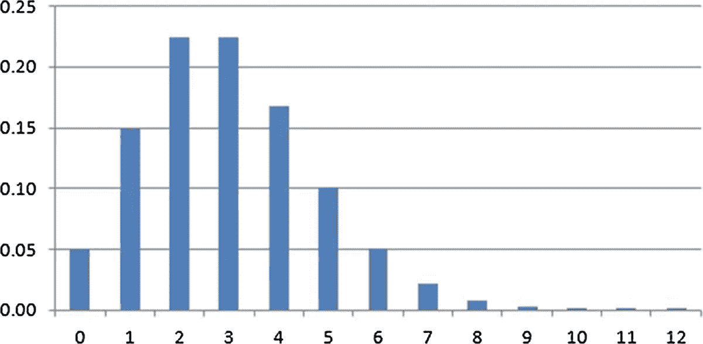

# 8.模拟

建模是人类思维的一个基本工具，它为我们提供了创造世界或世界一部分的抽象版本的能力。这些抽象版本可以体现一种情况、对象等的方便、简化的表示，并且可以用于找到给定问题的解决方案。建模涉及想象力和创造力；它是我们以智能方式交流、概括和表达意义或模式的能力的基础。

人们通常认为，建模是对世界做出决策和预测的一种方式，在创建模型之前，必须很好地定义和理解模型的目的。模型通常分为描述性的(它们解释或描述世界)或说明性的(它们制定问题的最佳解决方案，并与优化领域相关)。第一类模型的例子是地图、使用计算机图形创建的 3D 对象或视频游戏。后一种类型的模型与数学密切相关，特别是与最优化密切相关；在这些模型中，我们为一个问题定义了一组约束和一个要优化的目标函数。

每个模型都有三个基本特征:

*   参考:它代表了一些东西，要么来自现实世界，要么来自一个想象的世界；例如，建筑物、城市。
*   目的:它有一个关于它所指的逻辑意图；例如学习、分析。
*   成本效益:使用模型比参考模型更有效，例如蓝图对真实建筑，地图对真实城市。

模拟被认为是各种各样的建模，其目的是理解、计划、预测和操纵。它可以广义地定义为建模的行为或现象学方法；也就是说，模拟是其参照对象的主动行为模拟。

Note

建模是人类思维中最重要的过程之一。建模时，我们试图创建现实的抽象版本，多次简化它以帮助我们解决问题。模型的例子是地图(比如谷歌地图)，它代表了世界的抽象版本。

## 什么是模拟？

正如逻辑和代理词所发生的那样(看起来人工智能社区应该聚在一起，试图就几个定义达成一致)，对于“模拟”这个词的含义还没有达成共识。然而，有一个共识，即模拟是一种模仿和动态类型的建模，用于模拟由于某种原因必须研究或理解的现象。

当我们将模拟作为计算机程序来实现时，我们获得了高度的灵活性；处于编程语言环境中意味着原则上有可能以难以在任何其他环境中匹配的方式精炼、维护、发展和扩展计算机模拟。C#等现代编程语言促进了模块化数据和程序代码的开发，允许使用现有程序的片段或模块构建新的模拟。

计算机模拟通常分为解析方法和离散事件方法。分析方法涉及数学分析和可以从分析角度理解或近似的问题。例如，如果建模的现实可以通过一组微分方程精确描述(如表面上的热流)，则这些方程的解析解可用于生成模拟所需的时间相关行为。分析模拟的数学优雅使它在许多情况下神秘而难以理解；通过将现实简化为抽象的数学关系，所需的理解可能会变得模糊。也有这样的情况，已知解析解，但没有可行的方法来计算这些解。尽管如此，分析模拟在许多情况下是必不可少的，特别是在处理涉及大量相对较小和相对相似的实体的复杂物理现象时，这些实体的个体相互作用相对简单，它们的总体相互作用遵循“大数定律”；换句话说，它们允许统计处理。在这种情况下，分析模型通常代表至少一种完整理解的形式。

Note

有很大一类问题还没有被很好地理解，无法通过分析来处理，也就是说，没有正式的数学解决方案。这些问题通过离散事件模拟(DES)进行建模和模拟。

当我们有一个由几个实体组成的系统，并且我们孤立地理解每个实体以及它们成对的相互作用，但是不能理解系统作为一个整体的行为和关系时，那么我们可以利用模拟来编码成对的相互作用，然后运行模拟来尝试近似系统作为一个整体的关系或行为；其中一种模拟被称为离散事件模拟(DES)。

## 离散事件模拟

时间在 DES 中是必不可少的，模拟可以被看作是一系列实体相互作用的离散事件。时间通过固定的滴答声或模拟时钟以离散的方式前进。

DES 通常是对某些棘手问题建模的最后选择。它的力量在于它能够揭示整个系统的交互模式，而这种模式是无法通过其他方式得到认可的。经常有可能枚举和描述一组实体及其属性、关系和直接交互，而不知道这些交互指向哪里。如果这种知识被编码到 DES 模拟中，并且观察到最终模型的行为，那么我们可以更好地理解系统及其实体之间的相互作用；这通常是开发 DES 的主要目的。

开发 DES 时，需要考虑六个关键因素:

*   对象代表系统的元素，具有属性，与事件相关，消耗资源，并随着时间的推移进入和离开队列。在一个机场模拟中(很快将被检验)，物体将是飞机。在医疗保健系统中，对象可能是病人或器官。在仓库系统中，对象是库存中的产品。对象应该彼此或与系统交互，并且可以在模拟过程中随时创建。
*   属性是每个对象特有的特征(大小、起飞时间、着陆时间、性别、价格等)，以某种方式存储，并帮助确定对模拟过程中可能出现的各种场景的响应；这些值可以修改。
*   事件是系统中可能发生的事件，通常与对象相关，可以是飞机着陆、产品到达仓库、特定疾病的出现等等。事件可以以任何顺序发生和重复发生。
*   资源是为对象提供服务的元素(例如，机场的跑道、仓库的存储单元和诊所的医生)，是有限的。当一个资源被占用并且一个对象需要它时，该对象必须排队等待，直到资源可用。我们将在本章的实际问题中看到这样的场景。
*   队列是一种组织对象以等待释放当前被占用的资源的方式，它可以有最大的容量，并且可以有不同的调用方法:先进先出(FIFO)、后进先出(LIFO)，或者基于一些标准或优先级(疾病进展、燃料消耗等)。
*   时间(如前所述，发生在现实生活中)在模拟中是必不可少的。为了测量时间，在模拟开始时启动一个时钟，可用于跟踪特定时间段(出发或到达时间、运输时间、出现特定症状的时间等)。这种跟踪是基本的，因为它让你知道下一个事件应该在什么时候发生。

离散事件模拟(DES)与概率和统计密切相关，因为它们模拟随机和概率事件发生的真实场景；DES 必须依赖概率分布、随机变量以及其他统计和概率工具来生成事件。

## 概率分布

离散随机变量的值集是有限的或可数无限的；换句话说，它的值可以被列为一个有限或无限的序列，比如 1，2，3。。。诸如此类。离散随机变量的概率分布是为每个可能值分配概率的任何图形、表格或公式。所有概率之和必须为 1，每个单独的概率必须介于 0 和 1 之间。举个例子，当我们掷出一个公平的骰子(各面概率相等)时，代表可能结果的离散随机变量 X 将具有概率分布 X(1) = 1/6，X(2) = 1/6，…，X(6) = 1/6。所有方面的概率是相等的，所以随机变量的每个值的分配概率是 1/6。

参数μ将表示它们相应分布的平均值(期望值)。平均值代表随机变量的平均值。换句话说，它是总和 E=[(每种可能的结果)×(该结果的概率)]，其中 E 表示平均值。在骰子的情况下，平均值为 E = 1/6 + 2/6 + 3/6 + 4/6 + 5/6 + 6/6 = 3.5。请注意，结果 3.5 实际上是骰子可以取的所有可能值的中间值；这是掷骰子很多次后的期望值。

参数σ2 将表示分布的方差。方差代表随机变量可能值的离差；总是非负。小方差(接近 0)表示值彼此接近，接近平均值；高方差(接近 1)表示值与平均值之间的距离很大。

泊松是一种离散分布，表示每单位时间内事件数量的概率(图 [8-1](#Fig1) )。当一个事件发生的概率很小，并且发生的机会很多时，通常会用到它。一本书中印刷错误的数量、到达机场的飞机、到达交通灯的汽车以及给定年龄组中每年的死亡人数都是泊松分布应用的例子。



图 8-1

Poisson distribution

指数分布表示泊松过程中事件之间的时间(图 [8-2](#Fig2) )。例如，如果您正在处理一个描述某段时间内到达机场的飞机数量的泊松过程，那么您可能会对一个随机变量感兴趣，该变量将指示在第一架飞机到达之前经过了多长时间。指数分布可以达到这个目的，它也可以应用于物理过程；例如，表示粒子的寿命，其中λ参数将指示粒子老化的速率。


图 8-2

Exponential distribution

正态分布描述了一个概率，该概率集中在一个中心值附近，没有左右偏差，如图 [8-3](#Fig3) 所示。正态分布是对称的，并具有钟形密度曲线，平均为单峰。分布的百分之五十在平均值的左边，百分之五十在右边。标准差表示钟形曲线的展宽或带状；标准差越小，数据越集中。均值和标准差都必须定义为正态分布的参数。许多自然现象强烈遵循正态分布:血压、人的身高、测量误差等等。


图 8-3

Normal distribution

到目前为止，我们已经描述了 DES 是什么，它的组成部分，以及一些最重要的概率分布，它们可以应用于这种类型的模拟中的事件时间生成。在下一节中，我们将开始研究一个实际问题，在这个问题中，我们将看到如何在一个机场模拟示例中把所有的部分放在一起。

## 实际问题:机场模拟

让我们设想这样一个场景:我们想要模拟一个五跑道机场的运行，运送一定数量乘客的飞机到达机场，在机场花一些时间加油，并最终在一个时间范围内离开，这个时间范围取决于飞机可能解体的概率。这是我们将在本章中实现的机场模拟。未来代码中出现的`IDistribution`、`Poisson`和`Continuous`类(接口)是`MathNet.Numerics`包的一部分。

一架飞机和另一架飞机到达机场之间的时间分布为泊松函数，其λ参数由表 [8-1](#Tab1) 指定。

表 8-1

Arrivals of Airplanes at the Airport According to Timeframes

<colgroup><col align="left"> <col align="left"></colgroup> 
| 时间 | 希腊字母的第 11 个 |
| :-- | :-- |
| 06:00–14:00 | 7 分钟 |
| 14:00–22:00 | 10 分钟 |
| 22:00–06:00 | 20 分钟 |

当一架飞机到达机场时，它降落在一条可用的跑道上，从任何一条可用的跑道上统一选择它。如果没有可用的跑道，飞机会排队进入一列请求着陆许可的飞机中。一旦飞机最终着陆，它在一定时间内处理货物，该时间由一个指数函数分配，该函数的参数通过考虑飞机上的乘客数量来获得，如表 [8-2](#Tab2) 所示。

表 8-2

Time to Process Cargo for Any Airplane and Dependant on Number of Passengers

<colgroup><col align="left"> <col align="left"></colgroup> 
| 乘客 | 希腊字母的第 11 个 |
| :-- | :-- |
| 0–150 | 50 分钟 |
| 150–300 | 60 分钟 |
| 300–450 | 75 分钟 |

当一架飞机在处理货物时，它被认为是在占用跑道。飞机发生故障的概率为 0.15，在这种情况下，修理费用将按照参数λ= 80 分钟的指数函数分布。

为了开始分析我们的机场模拟代码，让我们考虑清单 [8-1](#Par36) 中描述的`Airplane`类。

```py
public class Airplane
    {
        public Guid Id { get; set; }
        public intPassengersCount{ get; set; }
        public double TimeToTakeOff{ get; set; }
        public intRunwayOccupied{ get; set; }
        public bool BrokenDown{ get; set; }

        public Airplane(int passengers)
        {
            Id = Guid.NewGuid();
PassengersCount = passengers;
RunwayOccupied = -1;
        }
    }

Listing 8-1
Airplane Class

```

`Airplane`类包含以下属性:

*   它在构造函数中初始化，将唯一地标识每架飞机。
*   `PassengersCount`:定义飞机上的乘客数量
*   `TimeToTakeOff`:定义飞机从跑道起飞的时间(以分钟为单位)
*   `RunwayOccupied`:标识飞机是否占用机场跑道，如果是，则该属性匹配被占用跑道的索引。当它的值小于 0 时，意味着飞机没有占用任何跑道。
*   `BrokenDown`:如果飞机发生故障，值为 True，否则为 False

在清单 [8-2](#Par44) 中，我们可以看到`AirportEvent<T>`抽象类，它将作为其他三个类的父类，代表发生在`AirportSimulation`中的不同事件。目的是缩短代码，压缩所有可以逻辑压缩或包含在一个父类中的行，从而利用 C#中的继承。

```py
public abstract class AirportEvent<T> where T: IComparable
 {
        protected double[] Parameters;
        protected List<Tuple<T, T>> Frames;
        public double[] DistributionValues;
        public List<IDistribution> Distributions;

        protected AirportEvent(params double[] lambdas)
        {
            Distributions = new List<IDistribution>();
DistributionValues = new double[lambdas.Length];
            Frames = new List<Tuple<T, T>>();
            Parameters = lambdas;
        }

        public virtual void SetDistributionValues(DistributionType type)
        {
foreach (var lambda in Parameters)
            {
                switch (type)
                {
                    case DistributionType.Poisson:
Distributions.Add(new Poisson(lambda));
                        break;
                    case DistributionType.Exponential:
Distributions.Add(new Exponential(lambda));
                        break;
                }
            }
            // Sampling distributions
            for (vari = 0; i<Frames.Count; i++)
DistributionValues[i] = type == DistributionType.Poisson
                                        ? ((Poisson)Distributions[i]).Sample()
                                        : (1 - ((Exponential) Distributions[i]).Sample()) * Parameters[i];
        }

        public virtual double GetEvtFrequency(T elem)
        {

            for (vari = 0; i<Frames.Count; i++)
            {
                if (elem.CompareTo(Frames[i].Item1) >= 0 &&elem.CompareTo(Frames[i].Item2) < 0)
                    return DistributionValues[i];
            }

            return -1;
        }
    }

    public enumDistributionType
    {
        Exponential, Poisson
    }

Listing 8-2
AirportEvent<T> Abstract Class

```

Note

在`AirportEvent<T>`类中，通过使用`where`关键字，我们要求`T`参数的类型为`IComparable`。我们需要这个先决条件，以便以后能够以最通用的方式对它们进行比较。

`AirportEvent<T>`类包括以下属性:

*   `Parameters`:存储在不同分布中使用的 lambda 参数的 doubles 数组
*   `Frames`:定义事件的时间帧或数字帧的`T`类型的元组列表，对应于表 [8-1](#Tab1) 和 [8-2](#Tab2) 中所示的概率分布和参数。这个列表的基数必须与`Parameters`数组的基数相匹配，也必须与我们将要列出的下两个属性的基数相匹配。
*   `DistributionValues`:double 数组，用于在索引`i`处存储使用来自数组`Parameters`的参数`i`计算概率分布`i`所得的值
*   `Distributions`:要使用的分配列表；当计算一个概率分布时，我们考虑一些参数λ，并且从这个计算得到的值被存储在`DistributionValues`数组中

除了前面的属性，该类还包括下列方法:

*   `SetDistributionValues()`:根据参数指示的分布类型，它将新的分布添加到`Distributions`列表中，并用指定的`Parameters`对这些分布进行采样，将每个采样值留在`DistributionValues`数组中
*   `GetEvtFrequency()`:该方法接收一个类型`T`作为参数，该类型为`Icomparable`，并将其与时间或数字帧进行比较，以确定其所属的部分，从而确定其分布值。例如，如果帧是`(0, 100)`、`(100, 200)`、`(200, 250)`和`T = 110`，那么`T`将落入第二帧并匹配第二`(index=1)`分布值。

此外，我们使用了`DistributionType`枚举来表示我们将在本例中考虑的两种分布类型(泊松分布、指数分布)。

`AirplaneEvtArrival`(列表 [8-3](#Par56) )类继承自`AirportEvent<T>`；在这种情况下，`T`就变成了`TimeSpan`。这个类表示飞机到达机场的事件。

```py
public class AirplaneEvtArrival :AirportEvent<TimeSpan>
    {
        public AirplaneEvtArrival(params double[] lambdas) : base(lambdas)
        {
Frames = new List<Tuple<TimeSpan, TimeSpan>>
                             {
                                 new Tuple<TimeSpan, TimeSpan>(new TimeSpan(0, 6, 0, 0), new TimeSpan(0, 14, 0, 0)),
                                 new Tuple<TimeSpan, TimeSpan>(new TimeSpan(0, 14, 0, 0), new TimeSpan(0, 22, 0, 0)),
                                 new Tuple<TimeSpan, TimeSpan>(new TimeSpan(0, 22, 0, 0), new TimeSpan(0, 6, 0, 0))
                             };
        }
    }
Listing 8-3
AirplaneEvtArrival<TimeSpan> Class

```

该类仅包含一个构造函数，其中的`Frames`列表被定义为一组元组，每个元组详细描述了一个时间范围。

类似地，继承自`AirportEvent<int>`的`AirplaneEvtProcessCargo`类(列表 [8-4](#Par59) )在其构造函数中定义了一个包含整数元组的`Frames`列表，这些整数元组表示乘客的范围。这些范围最终与某个值(以分钟为单位)相匹配，该值是处理该数量乘客所需的时间(回忆表 [8-2](#Tab2) )。

```py
public class AirplaneEvtProcessCargo :AirportEvent<int>
    {
        public AirplaneEvtProcessCargo(params double[] lambdas) : base(lambdas)
        {
            Frames = new List<Tuple<int, int>>
                             {
                                 new Tuple<int, int>(0, 150),
                                 new Tuple<int, int>(150, 300),
                                 new Tuple<int, int>(300, 450)
                             };
        }

        public double SampleAt(intelem)
        {
            for (vari = 0; i<Frames.Count; i++)
            {
                if (elem.CompareTo(Frames[i].Item1) >=0&&elem.CompareTo(Frames[i].Item2) < 0)
return  (1 - ((Exponential) Distributions[i]).Sample()) * Parameters[i];
            }

            return -1;
        }
    }

Listing 8-4
AirplaneEvtProcessCargo<int> Class

```

该类还包含一个`SampleAt()`方法，该方法返回作为参数提供的元素的概率分布值，并考虑由`Frames`列表强加给该类的范围。

在清单 [8-5](#Par62) 中我们可以看到`AirplaneEvtBreakdown`类，它继承自`AirportEvent<TimeSpan>`；它的代码非常简单，因为它只是调用其父类的构造函数。

```py
public class AirplaneEvtBreakdown :AirportEvent<TimeSpan>
    {
public AirplaneEvtBreakdown(params double[] lambdas): base(lambdas)
{
}
    }
Listing 8-5
AirplaneEvtBreakdown<TimeSpan> Class

```

最后，`Simulation`类包括各种属性、字段和构造函数，如清单 [8-6](#Par64) 所示。

```py
public class Simulation
    {
        public TimeSpanMaxTime{ get; set; }
        private TimeSpan _currentTime;
        private readonlyAirplaneEvtArrival _arrivalDistribution;
        private readonlyAirplaneEvtProcessCargo _processCargoDistribution;        private readonlyAirplaneEvtBreakdown _airplaneBreakdown;
        private readonly bool [] _runways;
        private readonlyint _planeArrivalInterval;
        private readonly Queue<Airplane> _waitingToLand;
        private readonly List<Airplane> _airplanes;
        private List<Airplane> _airplanesOnLand;
        private static readonly Random Random = new Random();

        public Simulation(TimeSpanstartTime, TimeSpanmaxTime, IEnumerable<Airplane> airplanes)
        {
MaxTime = maxTime;
            _runways = new bool[5];
            _arrivalDistribution = new AirplaneEvtArrival(7, 10, 20);
            _processCargoDistribution = new AirplaneEvtProcessCargo(50, 60, 75);
            _airplaneBreakdown = new AirplaneEvtBreakdown(80);
            _waitingToLand = new Queue<Airplane>();
            _airplanes = new List<Airplane>(airplanes);
            _airplanesOnLand = new List<Airplane>();
            _currentTime = startTime;
            // For 1st day set distribution values.
            _arrivalDistribution.SetDistributionValues(DistributionType.Poisson);

            _processCargoDistribution.SetDistributionValues(DistributionType.Exponential);
            _airplaneBreakdown.SetDistributionValues(DistributionType.Exponential);
            _planeArrivalInterval = (int) _arrivalDistribution.GetEvtFrequency(startTime);
        }
}

Listing 8-6Constructor, Fields, and Properties of the Simulation Class

```

`Simulation`类的属性和字段如下:

*   `MaxTime`:模拟将持续的最长时间
*   `_currentTime`:模拟中的当前时间
*   `_arrivalDistribution`:描述飞机到达事件的对象
*   `_processCargoDistribution`:描述飞机处理货物事件的对象
*   `_airplaneBreakdown`:描述飞机抛锚事件的物体
*   `_runways`:机场的一组跑道
*   `_planeArrivalInterval`:飞机到达机场的间隔时间。使用`_arrivalDistribution`计算该值。
*   等待可用跑道降落的飞机队列
*   `_airplanes`:到达机场的飞机列表
*   `_airplanesOnLand`:已经在机场降落的飞机列表
*   `Random`:随机变量

`Simulation`类的构造函数接收模拟的开始时间和结束时间以及计划在机场降落的飞机列表作为参数。在构造函数内部，我们根据表 [8-1](#Tab1) 和 [8-2](#Tab2) 中描述的值初始化字段和属性。

在`Execute()`方法(列表 [8-7](#Par81) )中，我们执行模拟；一切都发生在一个外部的`while`循环中，该循环一直运行到模拟的当前时间超过允许的最大时间。

在外层`while`循环中，我们首先尝试给已经排队等待着陆的飞机着陆许可。我们将很快检查`TryToLand()`方法，它试图为某架飞机执行着陆。然后，我们处理飞机到达事件，首先检查是否仍有飞机等待降落，以及当前时间(以分钟为单位)除以飞机预计到达机场的时间间隔是否剩余零；这相当于说当前分钟属于由先前计算的到达时间间隔的值定义的剩余类。

最终，我们循环检查陆地上的每架飞机，检查那些必须在当前时刻起飞的飞机，或者查看飞机发生故障的可能性。我们还更新飞机和陆地上的飞机的列表，以及在任何给定时刻被占用的跑道的列表。为了结束和开始另一个模拟周期，我们在当前时间上加一分钟。

```py
public void Execute()
        {
            while (_currentTime<MaxTime)
            {
Console.WriteLine(_currentTime);

                // Process airplanes on queue for landing
foreach (var airplane in _waitingToLand)
                {
                    if (!TryToLand(airplane))
                        break;
                }

                // Plane arrival event
                if (_currentTime.Minutes % _planeArrivalInterval == 0 && _airplanes.Count> 0)
                {
varnewPlane = _airplanes.First();
                    _airplanes.RemoveAt(0);
Console.WriteLine("Plane {0} arriving ...", newPlane.Id);

                    if (TryToLand(newPlane))
                        _airplanesOnLand.Add(newPlane);
                }

                // For updating list of airplanes on the ground
varnewAirplanesOnLand = new List<Airplane>();
                // Update airplane status for this minute

foreach (var airplane in _airplanesOnLand)
                {
airplane.TimeToTakeOff--;
                    if (airplane.TimeToTakeOff<= 0)
                    {
                        _runways[airplane.RunwayOccupied] = false;
airplane.RunwayOccupied = -1;
Console.WriteLine("Plane {0} took off", airplane.Id);
                    }
                    else
newAirplanesOnLand.Add(airplane);

                    // Odds of having a breakdown
                    if (Random.NextDouble() < 0.15 && !airplane.BrokenDown)
                    {
airplane.BrokenDown = true;
airplane.TimeToTakeOff += _airplaneBreakdown.DistributionValues.First();
Console.WriteLine("Plane {0} broke down, take off time is now {1} mins", airplane.Id, Math.Round(airplane.TimeToTakeOff, 2));
                    }
                }

                _airplanesOnLand = new List<Airplane>(newAirplanesOnLand);

                // Add a minute
                _currentTime = _currentTime.Add(new TimeSpan(0, 0, 1, 0));
            }
        }

Listing 8-7
Execute() Method

```

在清单 [8-8](#Par83) 中，我们可以看到`RunwayAvailable()`和`TryToLand()`方法。第一个非常简单，它允许我们知道是否有可用的跑道，并在这种情况下返回其索引。后者试图通过首先检查是否有可用的跑道来为飞机提供着陆许可。假设有，那么它更新相应的列表和属性，并设置飞机在机场消耗的时间；即它的起飞时间。如果没有可用的跑道，飞机会排队等待最终着陆。

```py
        public intRunwayAvailable()
        {
            return _runways.ToList().IndexOf(false);
        }

        public bool TryToLand(Airplane newPlane)
        {
varrunwayIndex = RunwayAvailable();
            if (runwayIndex>= 0)
            {
                _runways[runwayIndex] = true;
newPlane.RunwayOccupied = runwayIndex;
newPlane.TimeToTakeOff = _processCargoDistribution.SampleAt(newPlane.PassengersCount);
Console.WriteLine("Plane {0} landed successfully", newPlane.Id);
Console.WriteLine("Plane {0} time for take off {1} mins", newPlane.Id, Math.Round(newPlane.TimeToTakeOff, 2));
                return true;
            }

            _waitingToLand.Enqueue(newPlane);
            return false;
        }
    }

Listing 8-8
RunwayAvailable() and TryToLand() Methods

```

为了初始化和测试模拟，我们可以依赖清单 [8-9](#Par85) 中所示的代码，它对应于 C#中的一个控制台应用。

```py
var airplanes = new List<Airplane>
                                {
                                    new Airplane(100),
                                    new Airplane(300),
                                    new Airplane(50),
                                    new Airplane(250),
                                    new Airplane(150),
                                    new Airplane(200),
                                    new Airplane(120)
                                };

var sim = new Simulation.Airport.Simulation(new TimeSpan(0, 13, 0, 0), new TimeSpan(0, 15, 0, 0), airplanes);
sim.Execute();

Listing 8-9Initiating the Simulation

```

一旦我们执行模拟，我们将看到模拟中发生的各种事件，如时间、飞机到达、飞机起飞、飞机故障等等。这些都将在控制台应用中打印出来，如图 [8-4](#Fig4) 所示。


图 8-4

Console application displaying diverse events occurring at the simulation

在我们的机场模拟中，我们考虑了到达、离开和故障等事件。像往常一样，给读者的建议是尝试扩展模拟，考虑新的事件，或者调整参数，使它们适合更现实的场景。

## 摘要

在本章中，我们介绍了建模和仿真的概念。我们描述了什么是离散事件模拟(DES ),还描述了它的组件(事件、队列等等)。我们研究了各种概率分布及其与模拟应用的关系。最后，我们给出了一个完整的例子，在这个例子中，我们模拟了一个机场在给定时间内的功能，并且能够看到每个部分是如何组合在一起创建一个程序，在考虑几个事件(到达、离开、故障)的同时模拟机场的工作时间。在下一章中，我们将开始潜入监督学习的有趣而广阔的世界。