# 9.支持向量机

在本章中，我们将开始学习监督学习，这是机器学习的一个分支，其算法类似于我们在学校学习的类型，我们从经验和教授在课堂或培训中介绍的许多例子中学习。

许多监督学习算法由两个阶段组成:训练阶段，其中向学习者呈现一组训练数据，将每个数据作为向量及其正确分类，以及预测阶段，其中学习者已经学习了对应于训练数据的函数，现在应该预测新输入数据的正确分类或值。例如，训练数据集可以定义如下:

```py
{  { (2, 3), 1}, { (1, 1), -1}, { (3, 3), 1}  }

```

请注意，每一对(x，y)都伴随着一个分类或类别，在本例中为 1 或-1。

训练数据通常表示为一对(v，c ),其中 v 是表示对象的不同属性的 n 维向量(通常称为特征向量), c 是考虑到手头问题的该对象的分类或标签。对象可以是任何东西，从人、花、化合物到城市、州，基本上是我们能想象或能分类的任何东西。向量可以指示物体的各种属性，例如位置、高度、重量、强度、性别、人口、氧气等等。

一般来说，分类的学习过程(我们将很快检查分类在这种情况下的含义)监督学习算法遵循以下几点:

*   训练:从作为输入接收的训练数据中，推断出函数 f(x)。此函数描述数据的结构，并尝试根据从训练数据中学习到的结构对新输入数据进行分类。
*   预测:假设接收到一个新数据 x，将其归类为 f(x)；即，使用学习的函数 f 来分类新的输入数据。

监督学习试图解决的两个最重要的问题是分类和回归。

在第一种类型的问题中，我们将输入数据映射到预定义的、离散数量的类别中。因此，我们通过用某个类来标记传入的数据来对其进行分类。在这种情况下，我们称监督学习算法是一个分类器。在后一个问题中，我们不对一个物体进行分类或归类；相反，我们提供了属于某一类的某个变量的概率的估计。在这类问题中，我们感兴趣的是找到代表数据集的良好关系。这种关系可以用最接近该集合的线来体现，因为它出现在一种称为线性回归的回归中；解决这类问题的方法称为回归法。

Note

在分类算法中，输出变量采用离散的分类值。在回归算法中，输出变量取连续的实值。回归算法可以预测某一天的温度；分类算法会简单地告诉我们天气是否会变热。

在图 9-1 中，我们可以看到分类器和回归器之间的区别。分类器(b)能够将空间划分成不同的子空间或类(图 [9-1](#Fig1) 中的两个类)，回归器(a)简单地试图找到一个结构(图 [9-1](#Fig1) 中的线)，该结构最接近手边的数据集的形状；因为这个集合具有线性结构，所以线性回归器是一个很好的近似器。


图 9-1

a) represents a regressor and b) represents a classifier

在本章中，我们将学习支持向量机算法，它应用于数据分类，因此被视为分类器。本章的目的是描述支持向量机算法，并用 C#给出这种算法的完整代码，并附带一个 Windows 窗体中的可视化应用程序，以验证所获得的结果(以图形方式显示)，并用作测试和澄清的工具。在开发我们的支持向量机时，我们将使用两种方法。一个将使用优化库来找到支持向量机试图解决的优化问题的解决方案，第二个将使用普拉特的序列最小优化(SMO)算法来找到同一问题的解决方案。我们将很快检查支持向量机为我们提供了什么元素，使我们能够预测新输入数据的类别。

Note

统计学习理论是机器学习的一个分支，处理基于数据寻找预测函数的问题。统计学习理论已经成功应用于计算机视觉、语音识别、文本分类、模式识别、生物信息学等领域。

## 什么是支持向量机(SVM)？

支持向量机(SVM)是一种优化技术，通常应用于分类问题。它通常被称为分类器，但也适用于其他优化问题，如回归；因此，我们可以肯定支持向量机既可以是分类器也可以是回归器。SVM 算法是由 Vladimir Vapnik 在 20 世纪 60 年代提出的，它严重依赖于统计学习理论和数学优化。事实上，SVM 的训练阶段简化为解决一个优化问题，为我们提供一组权重和值(偏差),允许我们对新的输入数据进行分类。

正如机器学习的许多领域一样，支持向量机是关于从数据中学习结构的。在二进制分类的情况下(只有两个类别)，SVM 算法找到相对于每个类别边界上的向量给出最宽余量的超平面。

n 维空间的超平面是 n - 1 维的子空间。例如，当 n = 1 时，我们的空间是一条线，因此它的超平面是点；当 n = 2 时，我们的空间是通常的二维坐标空间，因此它的超平面是直线；当 n = 3 时，我们的空间是三维空间，因此它的超平面是二维平面，等等。图 [9-1](#Fig1) b)显示了一个二维空间，用一条橙色的线表示该空间中的一个超平面。

Note

支持向量机用于文本分类任务，如类别分配、检测垃圾邮件和情感分析。它还通常用于图像识别挑战，在基于特征的识别和基于颜色的分类中表现特别好。支持向量机在许多手写数字识别领域也起着至关重要的作用，比如邮政自动化服务。

我们也可能注意到，这个超平面把蓝点和红点分开了；我们可以说这是一个分类超平面，因为它把空间分成两类。如图 [9-2](#Fig2) 所示，一个给定的分类问题可以有多个分类超平面。

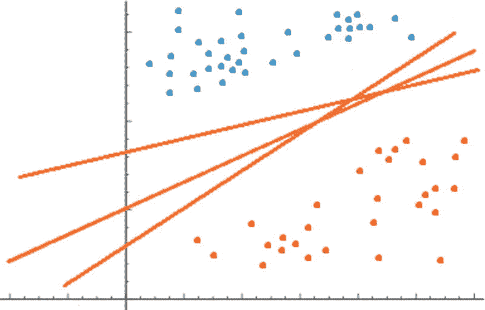

图 9-2

Various possible classifying hyperplanes for a classification problem

对于未来的输入数据，不是每个超平面都具有相同的功效。直觉上，我们希望有一个分类超平面，该分类超平面将在两个类之间产生最大的裕度，以便要预测的新数据将有更好的机会被正确分类。

超平面与任一组中最近的数据点(蓝色或红色点)之间的距离称为边缘(图 [9-3](#Fig3) )。支持向量机的目标是选择一个分类超平面，该分类超平面与任一类中训练集内的任意点之间具有最大可能的间隔。如前所述，这给了我们一个更好的机会来正确分类新的输入数据；在这个意义上，我们可以肯定支持向量机搜索最优超平面来分类数据。

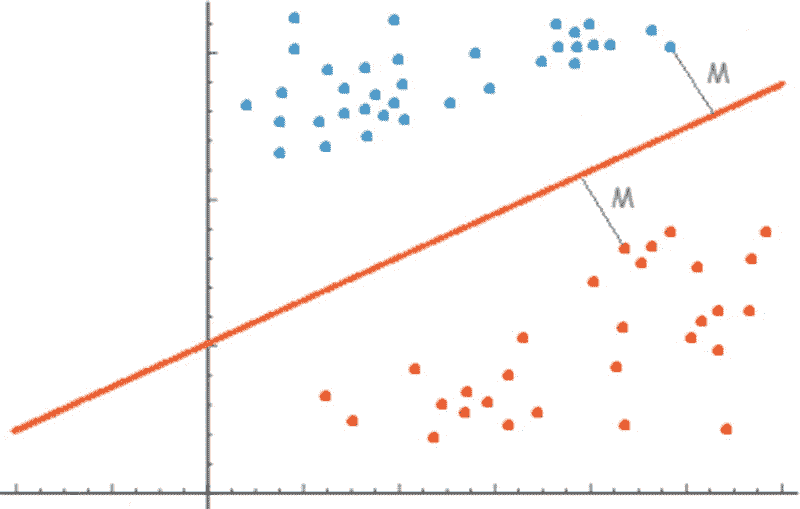

图 9-3

Margin M defined by the classifying hyperplane

为了找到训练数据集的最佳超平面，我们需要找到在两个类之间提供最大可能余量的分类超平面。因此，支持向量机的训练阶段由一个优化问题(更准确地说，是一个二次规划问题)组成，其中我们最大化值 2x M；换句话说，两倍的余量将决定穿过支持向量集的超平面所定义的“街道”的全宽(图 [9-4](#Fig4) )。定义此边界的向量称为支持向量。


图 9-4

Support vectors denoted as black points

为了获得 M 的公式，让我们首先记住在二维空间中直线(2D 的超平面)的公式是 Ax + By + C = 0。这个表达式可以推广到根据公式 wx + b = 0 推导任何超平面的一般表达式的程度，其中 w 是称为权重向量的向量，b(匹配线方程中的 C)是称为偏差或截距的实值；这个值决定了超平面从其空间原点的偏移。因此，当 b = 0 时，意味着超平面通过原点(0，0，…0)；w 是超平面的法向量，定义了它的方向。

现在我们有了超平面的公式，我们可以通过找到从支持向量(在图 [9-4](#Fig4) 中标记为黑点)到超平面的距离来获得 M 的值。回想一下，在二维空间中，从一个点(x′，y′)到一条线的距离由下面的公式给出:

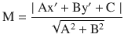

一般形式下，在 n 维空间中，M 的公式可以推导如下:

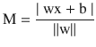

其中||w||是权向量 w 的范数回想一下，对于一个向量 v = (v1，v2 …vn)其范数定义如下:


任何超平面都可以通过缩放 w 和 b 以无限多种方式表示。这种类型的归一化或缩放类似于我们有时使用的百分比缩放类型；我们不是将一个百分比称为 85 %,而是简单地处理[0，1]范围内的数字，并找到从 85%到等价的 0.85 的直接映射。在我们的例子中，我们有一个分类超平面和另外两个平行于分类超平面并通过每一类的支持向量的超平面。通过归一化，我们可以将这些超平面表示为:

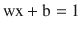


这种表示称为规范超平面；在这种表示下，假设值的归一化以及我们试图找到从分类超平面中的点到由支持向量形成的任何超平面的距离的事实，我们可以如下调整 M 的方程:

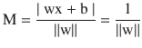

因此，要最大化的总余量将是 2 x M = 2 / ||w||。请注意，最大化该值相当于最小化以下值:


在这一点上，我们知道我们需要最小化前面的函数，以便找到一个(权重向量，偏差)对，该对最大化分类超平面和两个类之间的间隔。现在我们需要定义这样的优化将在什么样的约束下发生。

对于通过支持向量的超平面，我们已经有了一个方程。由于支持向量定义了空间中每个类的边界，这些超平面决定了我们的约束，因为我们需要每个数据点位于这些超平面的一侧或另一侧(图 [9-5](#Fig5) )。因此，我们最终拥有以下约束:


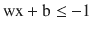

第一个等式适用于数据点 x 的分类等于 yi = 1 的情况；否则当 yi = -1 时。记住，对于每个数据点 x，我们在数据集训练中都有相应的分类。


图 9-5

Blue points satisfy equation wx + b >= 1 and red points satisfy equation wx + b <= -1

前面的约束可以合并成一个:

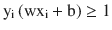

最后，支持向量机求解的优化问题公式化为:


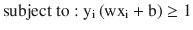

此刻让我们记住，刚刚提出的优化问题对应于一个线性 SVM 分类器；换句话说，我们假设训练数据集是线性可分的。SVM 分类器函数将如下:


注意，如果 wx + b >= 1，那么数据点 x 属于类别 1；否则，x 属于 class -1。正如我们所看到的，仅仅将 w，b 作为最优分类超平面的权重向量和偏差将允许我们对新的输入数据进行分类。

即使此时我们已经得到了一个优化问题的公式，它的解确实会引导我们找到分类超平面的最大余量，但是这个公式通常被忽略，因为它有助于计算工作和优化本身。这个新公式是基于拉格朗日乘子和 Wolfe 对偶问题等价。

对偶表示最优化理论中的一个关键角色，许多最优化问题都有一个相关的最优化问题，称为对偶。这个问题的替代表述拥有一组与原始(称为原始)问题的解相关的解。特别地，对于一大类问题，原始解可以很容易地从对偶解中计算出来。此外，在我们在这一章处理的问题的特定情况下，对偶公式为我们提供了更容易处理的约束，这些约束也非常适合于内核函数(我们很快会研究它们)。

像我们这样的约束优化问题可以用拉格朗日方法来解决。这种方法允许我们找到受一组约束的多变量函数的最大值或最小值。它通过增加 n + k 个变量将约束问题简化为无约束问题，k 是原问题的约束数。这些新变量被称为拉格朗日乘数。使用这种变换，产生的问题将包括比原始问题中的方程更容易求解的方程。

具有约束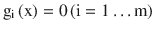的函数 f(x)的拉格朗日函数如下:

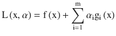

注意新的公式没有约束；它们被封装在现在唯一存在的函数 L(x，α)中。在这种情况下，α <sub>i</sub> 代表拉格朗日乘数。让我们把我们原始问题的目标函数和约束代入 L(w，b，α):


前面的表达式使用了广义拉格朗日形式，不仅包含等式约束，还包含不等式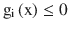或等价的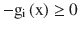。一旦我们引入了拉格朗日乘子，我们只需要找到问题的对偶形式。特别地，我们会发现问题的 Wolfe 对偶形式。为此，我们使 L 相对于 w，b 最小化，这是通过求解以下方程来实现的，其中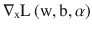表示 L 相对于 x 的梯度:

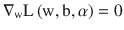


L 对 w 的导数产生以下结果:

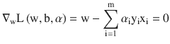

这暗示了以下:


至于相对于 b 的梯度，结果如下:

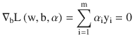

代入 w 得到的新公式，考虑到，我们可以调整 L(w，b，α)如下:


注意，由于 x <sub>i</sub> ，x <sub>j</sub> 是向量，x <sub>i</sub> x <sub>j</sub> 表示它们的内积。所以，最后，我们已经达到了对偶问题的表达式，事实上，由于前面提到的优点，大多数 SVM 库和包都解决了优化问题。完整的优化问题将如下:

![$$ {\displaystyle \begin{array}{l}\underset{\alpha }{\max}\mathrm{L}\left(\mathrm{w},\mathrm{b},\alpha \right)=\sum \limits_{\mathrm{i}=1}^{\mathrm{m}}{\alpha}_{\mathrm{i}}-\frac{1}{2}\sum \limits_{\mathrm{i},\mathrm{j}=1}^{\mathrm{m}}{\mathrm{y}}_{\mathrm{i}}{\mathrm{y}}_{\mathrm{j}}{\alpha}_{\mathrm{i}}{\alpha}_{\mathrm{j}}{\mathrm{x}}_{\mathrm{i}}{\mathrm{x}}_{\mathrm{j}}\\ {}\kern0.50em \ \kern0.50em \ \kern0.50em \ \kern0.50em \ \kern0.50em \ \kern0.50em \ \kern0.50em \ \kern0.50em \ \kern0.50em \ \kern0.50em \ \mathrm{s}.\mathrm{t}\kern0.50em \ \kern0.50em \ \kern0.50em \ \kern0.50em \ \kern0.50em \sum \limits_{\mathrm{i}=1}^{\mathrm{m}}{\alpha}_{\mathrm{i}}{\mathrm{y}}_{\mathrm{i}}=0\\ {}\kern0.50em \ \kern0.50em \ \kern0.50em \ \kern0.50em \ \kern0.50em \ \kern0.50em \ \kern0.50em \ \kern0.50em \ \kern0.50em \ \kern0.50em \ \ {\alpha}_{\mathrm{i}}\ge 0\ \kern0.50em \ \mathrm{i}=1,\dots \mathrm{m}\end{array}} $$](img/A449374_1_En_9_Chapter_Equw.gif)

在下一节中，我们将看到一个实际问题，前面的问题(对偶)将使用 C#中的优化库来解决。这样一个问题将有助于我们理解本章已经介绍过的一些概念和思想。

Note

函数 f 的梯度通常用函数名()前的符号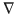来表示。它是一个向量，由 f 对每个变量的导数组成，表示 f 在给定点最大增量的方向。例如，假设 f 是映射具有给定压力的空间中每一点的函数，那么梯度将指示压力从任何点(x，y，z)更快改变的方向。

## 实际问题:C#中的线性 SVM

为了开发我们的线性 SVM，我们将创建一个名为`LinearSvmClassifier`的类，它具有以下字段或属性(清单 [9-1](#Par50) )。

```py
public class LinearSvmClassifier
{
        public List<TrainingSample>TrainingSamples{ get; set; }
        public double[] Weights;
        public double Bias;
        public List<Tuple<double, double>>SetA{ get; set; }
        public List<Tuple<double, double>>SetB{ get; set; }
        public List<Tuple<double, double>> Hyperplane { get; set; }
        private readonlydouble[] _alphas;
public intModelToUse = 1;

public LinearSvmClassifier(IEnumerable<TrainingSample>trainingSamples)
        {
TrainingSamples = new List<TrainingSample>(trainingSamples);
            Weights = new double[TrainingSamples.First().Features.Length];
SetA = new List<Tuple<double, double>>();
SetB = new List<Tuple<double, double>>();
            Hyperplane = new List<Tuple<double, double>>();
            _alphas = new double[TrainingSamples.Count];
        }
}

public class TrainingSample
{
        public int Classification { get; set; }
        public double[] Features { get; set; }

        public TrainingSample(double [] features, int classification)
        {
            Features = new double[features.Length];
Array.Copy(features, Features, features.Length);
            Classification = classification;
        }
    }

Listing 9-1Properties and Fields of Our Linear SVM

```

每个属性或字段描述如下:

*   `TrainingSamples`:对象列表`TrainingSample`；每个对象代表一个数据点及其分类。清单 [9-1](#Par50) 中展示的`TrainingSample`类仅仅由一个双精度数组`Features`和一个整数`Classification`组成。
*   `Weights`:表示 SVM 模型中权重的双数组
*   `Bias`:双精度值，代表 SVM 模型中的偏差或截距
*   `SetA`:表示训练数据中满足 wx + b > = 1 的点的`Tuple<double, double>`列表。它只用于预测阶段。
*   `SetB`:表示训练数据中满足 wx + b < = -1 的点的`Tuple<double, double>`列表。它只用于预测阶段。
*   `Hyperplane`:表示训练数据中满足 wx + b = 0 的点的`Tuple<double, double>`列表；即位于超平面中的点。它只用于预测阶段。
*   `_alphas`:表示支持向量机对偶问题中 alphas 的 doubles 数组
*   `ModelToUse`:确定我们的 SVM 在培训阶段使用的培训方法

清单 [9-2](#Par61) 展示了我们编码对偶优化问题的`Training()`方法。我们使用 Accord.NET 图书馆作为解决 SVM 模型的优化工具。您可以通过 web 或使用 Visual Studio 提供的 Nuget 包管理器从 Nuget 下载 Accord.NET。

```py
public void Training()
{
var coefficients = new Dictionary<Tuple<int, int>, double>();
ModelToUse = 1;

            for (vari = 0; i<TrainingSamples.Count; i++)
            {
                for (var j = 0; j <TrainingSamples.Count; j++)
coefficients.Add(new Tuple<int, int>(i, j),
                              -1 * TrainingSamples[i].Classification * TrainingSamples[j].Classification *
TrainingSamples[i].Features.Dot(TrainingSamples[j].Features));
            }

var q = new double[TrainingSamples.Count, TrainingSamples.Count];
q.SetInitValue(coefficients);

           // This variable contains (1, 1, ..., 1)
var d = Enumerable.Repeat(1.0, TrainingSamples.Count).ToArray();
var objective = new QuadraticObjectiveFunction(q, d);

            // sum(ai * yi) = 0
var constraints = new List<LinearConstraint>
                                  {
                                      new LinearConstraint(d)
                                          {
VariablesAtIndices=Enumerable.Range(0, TrainingSamples.Count).ToArray(),
ShouldBe = ConstraintType.EqualTo,
                                              Value = 0,
CombinedAs = TrainingSamples.Select(t =>t.Classification).ToArray().ToDouble()
                                          }
                                  };

// 0 <= ai
            for (vari = 0; i<TrainingSamples.Count; i++)
            {
constraints.Add(new LinearConstraint(1)
                                    {
VariablesAtIndices = new[] { i },
ShouldBe = ConstraintType.GreaterThanOrEqualTo,
                                        Value = 0
                                    });
            }

var solver = new GoldfarbIdnani(objective, constraints);

            if (solver.Maximize())
            {

var solution = solver.Solution;
UpdateWeightVector(solution);
UpdateBias();
            }
            else
Console.WriteLine("Error ...");
 }

Listing 9-2Training() Method Where We Model the Dual-Optimization Problem Using Accord.NET

```

为了解决优化问题，我们将利用约束优化问题求解器`GoldfarbIdnani`；这本书和其他许多书都可以在 Accord.NET 图书馆找到。在`GoldfarbIdnani`类的构造函数中有不同的方法来指定目标函数和约束；在这种情况下，我们选择将目标表示为一个`QuadracticObjectiveFunction`类，将约束集表示为`LinearConstraint`类的实例。代表目标函数的`QuadracticObjectiveFunction`通过指定目标函数的 Hessian 矩阵和线性项的向量来声明。从清单 [9-2](#Par61) 中我们可以看到，`Training()`方法首先将一组值存储到一个`Dictionary<Tuple<int, int>, double>`中，其中第一项(`Tuple<inti, int j>`)表示 Hessian 矩阵中系数所属的变量 I，j。

Note

n 个变量的函数 f 的 Hessian 矩阵 H 是一个 n×n 矩阵，它包含 f 对 n 个变量中的每一个的二阶导数。我们可以说 f 是凸的当且仅当 H 是半正定的；即它的所有特征值都是正的。

目标函数关于变量α <sub>i</sub> 的海森具有以下形式:

![$$ -{1}^{\ast }{\left[{\mathrm{y}}_{\mathrm{i}}{\mathrm{y}}_{\mathrm{j}}{\mathrm{x}}_{\mathrm{i}}{\mathrm{x}}_{\mathrm{j}}\right]}_{\mathrm{mxm}} $$](A449374_1_En_9_Chapter_Equx.gif)

这个矩阵是负半定的，说明我们的问题是凹的，不是凸的。如果 H 是半正定的，我们的问题是凸的，这意味着任何收敛到局部最小值的优化器都将收敛到全局最小值，因为凸问题的两组最小值是一致的。此外，这可以在多项式时间内完成，并且可以利用问题的二次结构；所以在实践中会很快。相反，如果 H 至少有一个负特征值，那么你的问题是非凸的。当 H 至少有一个负特征值时，这个问题是 NP 难的。

使用 Accord.NET 对象和属性在`Training()`方法中很容易定义线性约束集，这是不言自明的；唯一可能引起怀疑的属性是`LinearConstraint`对象的`CombineAs`属性。`CombineAs`允许我们指示伴随在`VariablesAtIndices`属性中指定的变量的标量系数，在本例中是α <sub>i</sub> y <sub>i</sub> 。

清单 [9-3](#Par68) 中显示的`UpdateWeightVector()`和`UpdateBias()`方法负责根据前面描述的公式更新权重向量和偏差。

```py
private void UpdateWeightVector(double [] alphas)
      {
varlen = TrainingSamples.First().Features.Length;

            for (vari = 0; i<len; i++)
            {
                for (var j = 0; j <TrainingSamples.Count; j++)
                    Weights[i] += TrainingSamples[j].Classification*alphas[j]*
TrainingSamples[j].Features[i];
            }
        }

        private void UpdateBias()
        {
var x = TrainingSamples.First().Features;
            Bias = 1;

            for (vari = 0; i<x.Length; i++)
                Bias -= Weights[i] * x[i];
}

Listing 9-3Methods for Updating Weights and Bias of the Classifying Hyperplane

```

在`Training()`方法中使用的最后一个方法必须解释一下:`SetInitValue()`方法，它属于一个扩展类，我们创建这个类是为了简化代码，避免不必要的循环和想法，这些不符合实际使用它们的方法的核心功能。清单 [9-4](#Par70) 展示了这个扩展类及其方法。

```py
    public static class ArrayDoubleExtended
    {
        public static void SetInitValue(this double[,] q, Dictionary<Tuple<int, int>, double> coefficients, double epsilon = 0.000001)
        {
            for (vari = 0; i<q.GetLength(0); i++)
            {
                for (var j = 0; j <q.GetLength(1); j++)
                {
q[i, j] = coefficients[new Tuple<int, int>(i, j)];
                    if (i == j)
q[i, j] -= epsilon;
                }
            }
        }

        public static IEnumerable<int>GetIndicesFromValues(this double [] toCompare, params double [] values)
        {
var result = new List<int>();

            for (vari = 0; i<toCompare.Length; i++)
                if (values.Contains(toCompare[i]))
result.Add(i);

            return result;
        }

        public static IEnumerable<double>RoundValues(this double [] list, int decimals)
        {
var result = new double[list.Length];

            for (vari = 0; i<list.Length; i++)
                result[i] = Math.Round(list[i], decimals);

            return result;
        }
    }

Listing 9-4Class with Extension Methods

```

`SetInitValue()`方法用之前解释的系数字典的值填充 Hessian 矩阵的值。请注意，epsilon 值将主对角线上的每个值都减少了一个微小的量。这是必要的，因为我们的函数不是凸的；因此，我们改变这些值一点点，希望把它变成一个半正定矩阵。我们以后必须考虑由这种扭转所产生的数值误差。如果矩阵不满足这个条件，`GoldfarbIdnani`解算器不会给我们一个解。

`GetIndicesFromValues()`方法保存两个数组中包含的值的索引，而`RoundValues()`按照指定的小数位数对值数组进行舍入。最后，`Predict()`方法如清单 [9-5](#Par73) 所示。

```py
public void Predict(IEnumerable<double[]>elems)
{
varroundWeights = Weights.RoundValues(2).ToArray();
varroundBias = new [] {Bias}.RoundValues(2).ToArray();

foreach (var e in elems)
            {
var @class = Math.Sign(e.Dot(roundWeights) +  ModelToUse * roundBias.First());
                if (@class >= 1)
SetA.Add(new Tuple<double, double>(e[0], e[1]));
                else if (@class <= -1)
SetB.Add(new Tuple<double, double>(e[0], e[1]));
                else
Hyperplane.Add(new Tuple<double, double>(e[0], e[1]));
            }
}

Listing 9-5
Predict() Method

```

在`Predict()`方法中，我们首先舍入权重和偏差值，然后对于每个元素或新数据点，我们通过使用我们已经熟知的超平面方程(wx + b)来获得其类别。如果它的类别大于或等于 1，我们将其添加到`SetA`；如果它小于或等于-1，我们把它加到`SetB`；否则，它必须是 wx + b = 0，因此它属于分类超平面。

为了测试我们的超平面方程，并查看它对我们的数据点进行分离或分类的效果，我们创建了一个 Windows 窗体应用程序，它使用 OxyPlot 库来绘制图形。您可以通过 Nuget 上的 web 或使用 Visual Studio 附带的 Nuget 包管理器来获得 OxyPlot。清单 [9-6](#Par76) 展示了我们的 Windows 窗体应用程序的`SvmGui`类。

```py
public partial class SvmGui : Form
    {
        private readonlyMainViewModel _plot;

        public SvmGui(double [] weights, double bias, int model, IEnumerable<Tuple<double, double>>setA, IEnumerable<Tuple<double, double>>setB, IEnumerable<Tuple<double, double>> hyperplane = null)
        {
InitializeComponent();

            _plot = new MainViewModel(weights, bias, model, setA, setB, hyperplane);
var view = new OxyPlot.WindowsForms.PlotView
                           {
                               Width = Width,
                               Height = Height,
                               Parent = this,
BackColor = Color.WhiteSmoke,
                               Model = _plot.Model
                           };
        }

    }

Listing 9-6SvmGui Windows Forms Class Where We Plot the Results Obtained

```

正如我们所看到的，这个类非常简单；我们只需要创建一个由`MainViewModel`类完成的`PlotModel`，和一个显示这个模型的`PlotView`。清单 [9-7](#Par78) 中说明了`MainViewModel`级。

```py
public class MainViewModel
    {
        public PlotModel Model { get; set; }

        public MainViewModel(double[] weights, double bias, int model, IEnumerable<Tuple<double, double>>setA, IEnumerable<Tuple<double, double>>setB, IEnumerable<Tuple<double, double>> hyperplane = null)
        {
            Model = new PlotModel{ Title = "SVM by SMO" };
varscatterPointsA = setA.Select(e => new ScatterPoint(e.Item1, e.Item2)).ToList();
varscatterPointsB = setB.Select(e => new ScatterPoint(e.Item1, e.Item2)).ToList();
var h = new List<ScatterPoint>();

            if (hyperplane != null)
                h = hyperplane.Select(e => new ScatterPoint(e.Item1, e.Item2)).ToList(); ;

varscatterSeriesA = new ScatterSeries
                                    {
MarkerFill = OxyColor.FromRgb(255, 0, 0),
ItemsSource = scatterPointsA,
                                    };
varscatterSeriesB = new ScatterSeries
                                    {
MarkerFill = OxyColor.FromRgb(0, 0, 255),
ItemsSource = scatterPointsB
                                    };

varscatterSeriesH = new ScatterSeries
                                    {
MarkerFill = OxyColor.FromRgb(0, 255, 255),
ItemsSource = h
                                    };

Model.Series.Add(scatterSeriesA);
Model.Series.Add(scatterSeriesB);
Model.Series.Add(scatterSeriesH);
Model.Series.Add(GetFunction(weights, bias, model));
        }

        public FunctionSeriesGetFunction(double [] w, double b, int model)
        {
const int n = 10;
var series = new FunctionSeries();

            for (var x = 0.0; x < n; x += 0.01)
{
for (var y = 0.0; y < n; y += 0.01)
{
                    //adding the points based x,y
varfunVal = GetValue(x, y, w, b, model);

                    if (Math.Abs(funVal) <= 0.001)
series.Points.Add(new DataPoint(x, y));
                }
            }

            return series;
        }

        public double GetValue(double x, double y, double [] w, double b, int model)
        {
            w = w.RoundValues(5).ToArray();
            b = new [] {b}.RoundValues(5).ToArray().First();
            return w[0] * x  + w[1] * y + model * b;
        }
    }

Listing 9-7MainViewModel Class Where the Model to Be Plotted Is Created

```

该类的构造函数接收所有必需的值(权重、偏差等)。)并创建不同的散点序列:一个用于满足 wx + b >= 1 的点，另一个用于满足 wx + b <= -1 的点，最后一个用于超平面中满足 wx + b = 0 的点。此外，`GetFunction()`方法绘制了对应于超平面的线。注意，在这种情况下，我们考虑的是通过将ε加到 Hessian 矩阵主对角线上的值而引入的数值误差；因此，我们接受产生小于或等于 0.001 的类值的点作为超平面点。`GetValue()`方法使用我们的`RoundValues()`扩展方法找到输入数据的类别。

我们可以从控制台应用程序运行代码，如清单 [9-8](#Par81) 所示。

```py
vartrainingSamples = new List<TrainingSample>
                                    {
                                        new TrainingSample(new double[] {1, 1}, 1),
                                        new TrainingSample(new double[] {1, 0}, 1),
                                        new TrainingSample(new double[] {2, 2}, -1),
                                        new TrainingSample(new double[] {2, 3}, -1),
                                    };

varsvmClassifier = new LinearSvmClassifier(trainingSamples);
svmClassifier.Training();
svmClassifier.Predict(new List<double[]>
                                      {
                                          new double[] {1, 1},
                                          new double[] {1, 0},
                                          new double[] {2, 2},
                                          new double[] {2, 3},
                                          new double[] {2, 0},
                                          new []   {2.5, 1.5},
                                          new []   {0.5, 1.5},
                                      });

Application.EnableVisualStyles();
Application.SetCompatibleTextRenderingDefault(false);
Application.Run(new SvmGui(svmClassifier.Weights, svmClassifier.Bias, svmClassifier.ModelToUse, svmClassifier.SetA, svmClassifier.SetB, svmClassifier.Hyperplane));

Listing 9-8Console Application Where Our SVM Will Be Created and Executed

```

一旦我们执行了前面的代码，得到的结果可以在图 [9-6](#Fig6) 中看到。

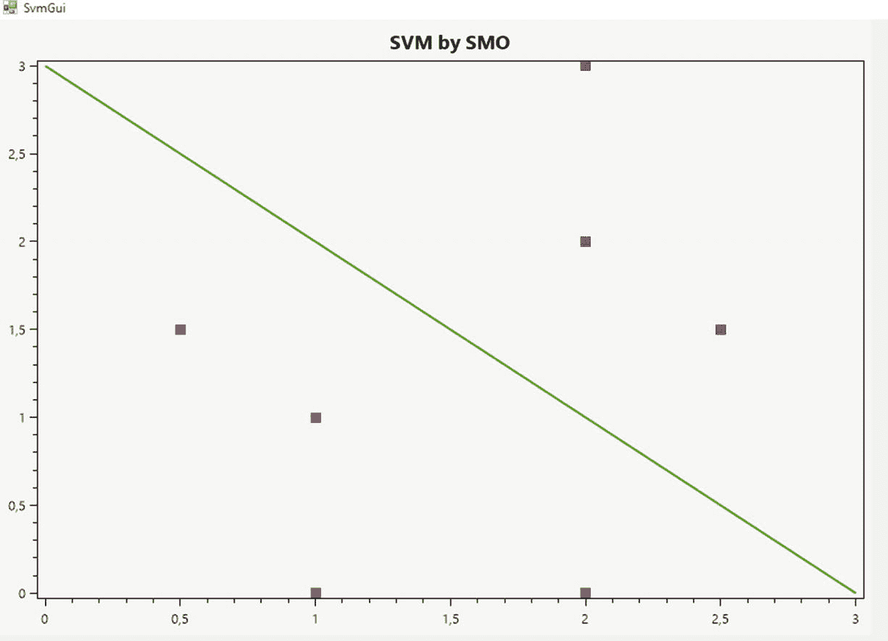

图 9-6

Plot showing the classifying hyperplane and points on one side and the other

到目前为止，我们已经假设集合是线性可分的，但如果不是，或者如果两个类之间没有完美的分离呢？这些问题将是下面几节的主题，我们将研究支持向量机的非线性分离情况和不完全分离情况。

## 不完全分离

在某些情况下，找到我们迄今为止认为的最佳分类超平面并不是最合适的选择。例如，图 [9-7](#Fig7) 说明了离群点对决定最佳分类超平面的影响。右图左上角的单个红点导致超平面显著摆动，改变其方向，并导致比左图小得多的余量。

为了使算法对异常值敏感，并为了更大的利益接受一些错误分类(找到一个具有相当大余量的超平面)，我们将改变原始问题的公式，并引入一组松弛变量和一个常数 C，它将控制如何处理错误分类。

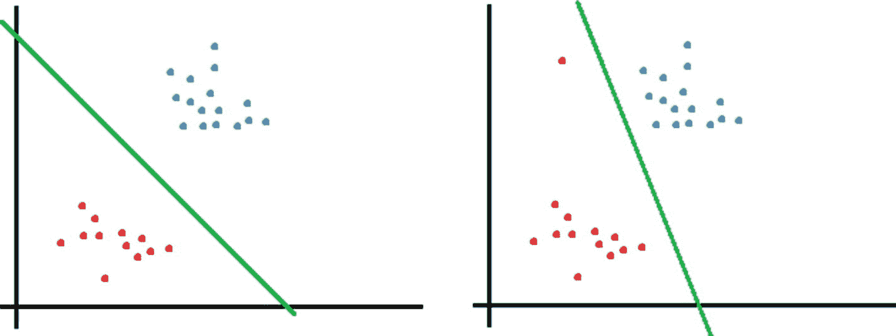

图 9-7

Left and right graphics show the effect caused by an outlier on the optimal classifying hyperplane

脑瓜子问题的新提法如下:


这种重构的直接结果是，现在允许训练数据具有小于 1 的裕度，并且每当训练数据具有 1ξ<sub>I</sub>(ξ>0)的函数裕度时，在目标函数处支付该成本或惩罚，该成本或惩罚增加了 C * ξ <sub>i</sub> 。参数 C 控制使||w|| <sup>2</sup> 变小(正如我们先前检查的，这使余量变大)和确保大多数训练数据将具有至少 1 的余量的目标之间的相对权重。

为了再次达到对偶形式，我们引入拉格朗日形式，并再次将 w 和 b 的导数设为零。我们将跳过完整的计算，这留给读者；最后的结果会是如下:

![$$ {\displaystyle \begin{array}{l}\underset{\alpha }{\max}\mathrm{L}\left(\mathrm{w},\mathrm{b},\alpha \right)=\sum \limits_{\mathrm{i}=1}^{\mathrm{m}}{\alpha}_{\mathrm{i}}-\frac{1}{2}\sum \limits_{\mathrm{i},\mathrm{j}=1}^{\mathrm{m}}{\mathrm{y}}_{\mathrm{i}}{\mathrm{y}}_{\mathrm{j}}{\alpha}_{\mathrm{i}}{\alpha}_{\mathrm{j}}{\mathrm{x}}_{\mathrm{i}}{\mathrm{x}}_{\mathrm{j}}\\ {}\kern0.50em \ \kern0.50em \ \kern0.50em \ \kern0.50em \ \kern0.50em \ \kern0.50em \ \kern0.50em \ \kern0.50em \ \kern0.50em \ \kern0.50em \ \kern0.50em \ \kern0.50em \ \kern0.50em \ \kern0.50em \ \ \mathrm{s}.\mathrm{t}\kern0.50em \ \kern0.50em \ \kern0.50em \ \kern0.50em \ \kern0.50em \sum \limits_{\mathrm{i}=1}^{\mathrm{m}}{\alpha}_{\mathrm{i}}{\mathrm{y}}_{\mathrm{i}}=0\\ {}\kern0.50em \ \kern0.50em \ \kern0.50em \ \kern0.50em \ \kern0.50em \ \kern0.50em \ \kern0.50em \ \kern0.50em \ \kern0.50em \ \kern0.50em \ \kern0.50em \ \kern0.50em \ \kern0.50em \ 0\le {\alpha}_{\mathrm{i}}\le \mathrm{C}\kern0.50em \ \mathrm{i}=1,\dots \mathrm{m}\end{array}} $$](img/A449374_1_En_9_Chapter_Equz.gif)

我们可以看到，重构问题的对偶形式基本上和以前一样；唯一的区别在于，之前的约束现在是盒约束。b 的计算也发生变化；当我们检查 SMO 算法时，我们很快就会看到它。

Note

这个重新表述的问题被称为软利润 SVM，与之前描述的硬利润 SVM 相对。对于软边际 SVM，我们允许训练数据位于边际内，或者被错误分类，并且我们希望通过松弛变量之和测量的总误差最小化。

## 非线性可分情形:核技巧

到目前为止，我们假设训练数据集是线性可分的，但是当训练数据集和正在学习的函数都没有线性结构时会发生什么呢？这种情况如图 [9-8](#Fig8) 所示。


图 9-8

Non-linear case

正如读者可以验证的那样，没有可能使用超平面来划分图形中的两个类别(红色和蓝色点)。这种情况下的解决方案是什么？SVM 解决方案是将训练数据映射或转换到更高、更丰富的空间；在更高空间中找到分类超平面，然后将结果转换回原始空间。映射是通过一个从原始空间(上例中的 R <sup>2</sup> 到更高空间(R <sup>3</sup> )的特征映射函数来完成的，从而增加了数据的维度(图 [9-9](#Fig9) )。


图 9-9

Data mapped from 2D space into 3D space

例如，多项式特征映射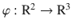将如下转换数据:


决策函数现在将改变其公式，以适应新的数据维度，如下所示:


这种方法的一个问题是φ(x)的维数在某些情况下会变得非常大；这将使要解决的二次问题以及 w 的显式表示变得复杂。幸运的是，前几节我们仅根据α <sub>i</sub> 获得了问题的对偶形式，并作为表示 w 的替代形式；因此，新的决策方程或分类超平面方程可以表述如下:


在这个上下文中，我们说 K ( 是一个核函数；这个函数将取代我们配方中的任何内积。使用核函数时的关键点是，与计算甚至表示φ(x)的成本相比，计算它们的值的成本可以显著降低；计算核函数并不意味着计算φ(x)。

以多项式核为例，遵循以下公式:


读者可以验证，计算这个内核将远比显式计算更有效，尤其是对于大维度。另一个相关的内核是高斯内核，定义为


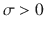，由用户选择。直观上，如果φ(x)和φ(z)很接近，我们可能会期望 K ( 很大。另一方面，如果φ(x’)和φ(x)相距很远(彼此几乎正交)，那么 K ( 将会很小。因此，我们可以把 K ( 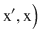看作是φ(x’)和φ(x)有多相似，或者 x’和 x 有多相似的度量。

核函数的应用并不局限于支持向量机。相反，它在人工智能领域有更广泛的应用。任何计算内积的学习算法都可以用核函数来代替内积，这样就可以更有效地处理高维特征空间。

Note

并不是每一个函数都可以看作一个内核。已经证明(Mercer 定理)一个函数被认为是核的充要条件是它的核矩阵 K 是对称半正定的。与 m 个向量的训练数据集相关联的核矩阵是包含值 Kij = K(xi，xj)的每个可能组合的正方形 m×m 矩阵。

## 序列最小优化算法(SMO)

序列最小优化(SMO)算法是由微软研究院的约翰·普拉特于 1998 年提出的；当时它的目的是介绍一种训练 SVM 的有效方法。因此，SMO 避免了与二次规划(QP)库一起工作，并且通过解析地解决大量小优化子问题来解决优化问题，这些子问题涉及先前使用启发式算法选择的任意两个拉格朗日乘数。

两个数学结果或定理是理解 SMO 函数的基础。首先，作为拉格朗日乘数的推广，卡鲁什-库恩-塔克(KKT)条件为确定优化问题的解是否是最优的提供了必要的、充分的条件。其次，奥苏纳定理证明了一个大的 QP 问题可以分解成一系列更小的 QP 子问题。只要将至少一个违反 KKT 条件的示例添加到前一个子问题的示例中，每一步都将减少总体目标函数，并保持满足每个约束的可行点。因此，总是增加至少一个违反者的 QP 子问题序列将保证收敛。奥苏纳定理证实了 SMO 在优化主要 QP 问题的 QP 子问题时只选择两个乘数的策略。总的来说，SMO 在很大程度上依赖于前两个结果来证明其功能。

检查 KKT 条件意味着解一个方程组，其中目标函数的梯度加上所有约束和拉格朗日乘数等于零。解决了这个留给读者作为练习的系统之后，对于α <sub>i</sub> 被认为是最优解，你将具有以下条件:


在这种情况下，u <sub>i</sub> 是 SVM 为第 I 个训练数据提供的输出或分类。这些条件的几何解释见表 [9-1](#Tab1) 。

表 9-1

Geometric Interpretation of Lagrange Multiplier Values and KKT Conditions

<colgroup><col align="left"> <col align="left"></colgroup> 
| 价值 | 解释 |
| :-- | :-- |
|  | 训练数据被正确分类；可能就在边缘。 |
|  | 训练数据被正确分类并位于边缘(支持向量)。 |
| 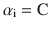 | 在这种情况下可能会出现三种情况:要么第 I 个训练数据被正确分类并位于边缘，要么第 I 个训练数据被正确分类并位于分类超平面和边缘之间，要么第 I 个数据训练被错误分类，因为它可能是异常值。 |

一旦所有的α <sub>i</sub> 在某个预先定义的容差内满足前面的条件，SMO 算法将终止，该容差通常是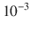。

Note

在 Platt 的原始论文中，他假设分类超平面的公式是 wx - b，而不是 wx + b。此外，他不是最大化本章中描述的对偶问题的目标函数 f(x)，而是最小化-f(x)；我们知道这等价于我们的最大化问题，因为 min f(x) = max -f(x)。

如前所述，该算法一次优化两个α <sub>i</sub> 。首先，并遵循奥苏纳定理，我们必须寻找一个违反 KKT 条件的α<sub>I</sub>；设这个α <sub>i</sub> 为α <sub>2</sub> 。然后，使用试探法，另一个α<sub>I</sub>—假设它是α<sub>1</sub>—也被找到。第一个乘数(α <sub>2</sub> )通常取自一组未绑定乘数(满足的乘数)。

一旦我们选择了α <sub>2</sub> ，则选择第二乘数α <sub>1</sub> 来最大化，其中是 SVM 在正确分类第 I 个训练数据时所犯的错误。这是我们之前提到的启发式方法，应该可以加速这个过程。如果我们找不到这样的α <sub>1</sub> ，那么我们随机选择一个未绑定的训练数据点。如果还是失败，那么我们随机选择任何训练数据，如果失败，我们重新选择α <sub>2</sub> 。

在选择了α <sub>1</sub> ，α <sub>2</sub> 之后，算法的剩余部分被简化为更新这些值。为了进行这样的更新，我们必须保证每个α<sub>I</sub>都考虑问题的约束；即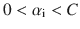和。由于奥苏纳定理允许我们只关注由α <sub>1</sub> ，α <sub>2</sub> 组成的 QP 子问题，我们必须保证每次两个拉格朗日乘数都满足以下约束:

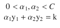

α <sub>1</sub> ，α <sub>2</sub> 必须满足的约束可以在二维空间中用图形表示，如图 [9-10](#Fig10) 所示。


图 9-10

Case a) occurs when y1 ≠ y2; case b) occurs when y1 = y2

为了将α <sub>1</sub> ，α <sub>2</sub> 都保持在约束框中，并考虑线性约束，我们必须建立低(L)和高(H)边界值。如果 y1 ≠ y2，可以证明以下界限适用于α <sub>2</sub> :


如果 y1 = y2，则直线改变方向；因此，

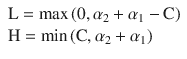

因此，更新后的α<sub>2</sub>—姑且称之为α <sub>2</sub> <sup>new</sup> ，我们很快就会看到如何计算它——在被计算后必须对这些界限进行剪裁，其剪裁值如下:


一旦我们获得了α <sub>2</sub> <sup>new</sup> 的最终限幅(如有必要)值，我们就可以使用下面几行所示的线性约束方程轻松获得α <sub>1</sub> <sup>new</sup> 。在α <sub>1</sub> <sup>new</sup> 公式中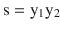是一个引入的值，其唯一目的是从下面的线性约束方程中清除α<sub>1</sub><sup>new</sup>:


到目前为止，我们已经收集了 SMO 算法的几乎所有部分。尽管如此，我们仍然缺少一个非常重要的组件——α<sub>2</sub>的学习规则或更新规则。回想一下我们要优化的目标函数如下:

![$$ {\displaystyle \begin{array}{l}\underset{\alpha }{\min}\mathrm{L}\left(\mathrm{w},\mathrm{b},\alpha \right)=\frac{1}{2}\sum \limits_{\mathrm{i},\mathrm{j}=1}^{\mathrm{m}}{\mathrm{y}}_{\mathrm{i}}{\mathrm{y}}_{\mathrm{j}}{\alpha}_{\mathrm{i}}{\alpha}_{\mathrm{j}}\mathrm{K}\left({\mathrm{x}}_{\mathrm{i}}\right)\mathrm{K}\left({\mathrm{x}}_{\mathrm{j}}\right)-\sum \limits_{\mathrm{i}=1}^{\mathrm{m}}{\alpha}_{\mathrm{i}}\\ {}\kern0.50em \ \kern0.50em \ \kern0.50em \ \kern0.50em \ \kern0.50em \ \kern0.50em \ \kern0.50em \ \kern0.50em \ \kern0.50em \ \kern0.50em \ \kern0.50em \ \kern0.50em \ \kern0.50em \ \kern0.50em \ \ \mathrm{s}.\mathrm{t}\kern0.50em \ \kern0.50em \ \kern0.50em \ \kern0.50em \ \ \sum \limits_{\mathrm{i}=1}^{\mathrm{m}}{\alpha}_{\mathrm{i}}{\mathrm{y}}_{\mathrm{i}}=0\\ {}\kern0.50em \ \kern0.50em \ \kern0.50em \ \kern0.50em \ \kern0.50em \ \kern0.50em \ \kern0.50em \ \kern0.50em \ \kern0.50em \ \kern0.50em \ \kern0.50em \ \kern0.50em \ \kern0.50em \ \ 0\le {\alpha}_{\mathrm{i}}\le \mathrm{C}\kern0.50em \ \mathrm{i}=1,\dots \mathrm{m}\end{array}} $$](img/A449374_1_En_9_Chapter_Equal.gif)

请注意，这与我们之前定义的问题相同，但在公式中包括了核函数 K，并将目标从 max f(x)更改为 min -f(x)。这是普拉特论文中解决的精确公式。

α <sub>2</sub> 的更新规则的表达式是通过根据α <sub>1、</sub> α <sub>2</sub> 重写目标函数，然后仅根据α <sub>2</sub> (使用线性约束方程)，固定所有其他α<sub>1</sub>并通过计算其相对于α <sub>2</sub> 的二阶导数来找到该重写目标的最小值而从目标函数中导出的。根据α <sub>1、</sub> α <sub>2</sub> 重写它，并将任何其他α <sub>i</sub> 项固定为常数，将得到以下结果:

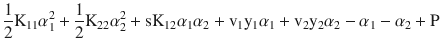

其中是将α <sub>1</sub> 与所有其他变量相关联的项，等效地，v<sub>2</sub>y<sub>2</sub>α<sub>2</sub>是与α <sub>2 相关联的项 p 是一个常数，表示与所有其他α <sub>i</sub> 相关的项。使用形式为


的线性约束方程允许我们从重写的方程中清除α <sub>1</sub> ，并且仅仅根据α <sub>2</sub> 来查看它。

</sub> 

为了找到前面公式的最小值的表达式，我们找到它对α <sub>2</sub> 的二阶导数，如下:


这就考虑到了


在前面的等式中，每个有下标的变量都表示其相应的最优值。

通过将 v <sub>i</sub> 和 w 代入二阶导数公式并重新调整各项，我们将最终获得α <sub>2</sub> :

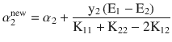

的更新规则，其中和被称为 SVM 的学习速率。

在开始实现 SMO 算法之前，最后一步是计算偏差。我们已经知道如何计算 w，但是偏差 b 呢？偏差计算如下:


计算这些值的平均值，因此最终偏差可以计算如下:

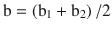

万一α <sub>i</sub> 都没被夹住，保证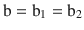。在 SMO 算法的每一步结束时计算 b 的新值。已经详细描述了每一个理论部分，现在让我们来看看 C#中算法的实现。

## 实际问题:SMO 实现

我们将在本节中描述的 C#算法严格遵循 1998 年发表的原始论文中的 Platt 伪代码。首先，算法的访问点是清单 [9-9](#Par126) 中所示的`TrainingBySmo()`方法；这是选择第一个α <sub>i</sub> 的地方。清单 [9-9](#Par126) 中还显示了我们需要对我们的`LinearSvmClassifier`类做的一个微小的更新，这个类在前面的章节中出现过，SMO 算法将被嵌入其中。该更新包括添加常量值 C、ε和容差作为类属性或字段；此外，每一个与 SMO 相关的方法最终也会被添加进来。

```py
public class LinearSvmClassifier
{
        private const double C = 0.5;
        private const double Epsilon = 0.001;
        private const double Tolerance = 0.001;
        ...
}

        public void TrainingBySmo()
        {
varnumChanged = 0;
varexamAll = true;
ModelToUse = -1;

            while (numChanged> 0 || examAll)
            {
numChanged = 0;
                if (examAll)
                {
                    for (vari = 0; i<TrainingSamples.Count; i++)
numChanged += ExamineExample(i) ?1 : 0;
                }
                else
                {
var subset = _alphas.GetIndicesFromValues(0, C);
foreach (vari in subset)
numChanged += ExamineExample(i) ?1 : 0;
                }

                if (examAll)
examAll = false;
                else if (numChanged == 0)
examAll = true;
            }
        }

Listing 9-9Start Point of the SMO Algorithm Where We Search for the First Lagrange Multiplier

```

`TrainingBySmo()`方法声明了两个变量，这两个变量将帮助它找到两个拉格朗日乘数:`numChanged`和`examAll`。第一个是整数变量，包含适合于伴随要优化的第一个选择的拉格朗日乘数α <sub>2</sub> 的未绑定拉格朗日乘数的数量。如果找不到未绑定的乘数，那么`examAll`变为真，意味着在下一次循环执行中必须检查所有的训练数据。

清单 [9-10](#Par129) 中所示的`ExamineExample()`方法首先检查给定乘数(α <sub>2</sub> )违反 KKT 条件的程度是否超过预定义容差值。假设是这样，那么它会寻找第二个拉格朗日乘数，并通过调用`TakeStep()`方法来联合优化它们。

```py
        private bool ExamineExample(int i1)
        {
varyi = TrainingSamples[i1].Classification;
varai = _alphas[i1];
varerrorI = LFunctionValue(i1) - yi;

varri = yi * errorI;

            if ((ri< -Tolerance &&ai< C) ||
            (ri> Tolerance &&ai> 0))
            {
                for (var i2 = 0; i2 <TrainingSamples.Count; i2++)
                    if (TakeStep(i1, i2))
                        return true;
            }

            return false;
        }

Listing 9-10The ExamineExample() Method Looks for a Second Lagrange Multiplier and Jointly Optimizes Them by Calling the TakeStep() Method

```

`TakeStep()`方法(列表 [9-11](#Par131) )接收两个选定拉格朗日乘数的索引作为参数。

```py
        private bool TakeStep(inti, int j)
        {
            if (i == j)
                return false;

varyi = TrainingSamples[i].Classification;
varyj = TrainingSamples[j].Classification;

            // Checking bounds on aj
var s = yi*yj;
varerrorI = LFunctionValue(i) - yi;

            // Computing L, H
var l = Math.Max(0, _alphas[j] + _alphas[i] * s - (s + 1) / 2 * C);
var h = Math.Min(C, _alphas[j] + _alphas[i] * s - (s - 1) / 2 * C);

            if (l == h)
                return false;

            double newAj;

            // Obtaining new value for aj
var k12 = Kernel.Polynomial(2, TrainingSamples[i].Features, TrainingSamples[j].Features);
var k11 = Kernel.Polynomial(2, TrainingSamples[i].Features, TrainingSamples[i].Features);
var k22 = Kernel.Polynomial(2, TrainingSamples[j].Features, TrainingSamples[j].Features);
var eta = 2*k12 - k11 - k22;
varerrorJ = LFunctionValue(j) - yj;

            if (eta < 0)
            {

newAj = _alphas[j] - TrainingSamples[j].Classification*(errorI - errorJ)/eta;
                if (newAj< l)
newAj = l;
                else if (newAj> h)
newAj = h;
}
else
            {
var c1 = eta/2;
var c2 = yj * (errorI - errorJ) - eta * _alphas[j];
varlObj = c1*Math.Pow(l, 2) + c2*l;
varhObj = c1*Math.Pow(h, 2) + c2*h;

if (lObj>hObj + Epsilon)
newAj = l;
                else if (lObj<hObj - Epsilon)
newAj = h;
                else
newAj = _alphas[j];
            }

            if (Math.Abs(newAj - _alphas[j]) < Epsilon * (newAj + _alphas[j] + Epsilon))
                return false;

varnewAi = _alphas[i] - s * (newAj - _alphas[j]);
            if (newAi< 0)
            {
newAj += s*newAi;
newAi = 0;
            }
            else if (newAi> C)
            {
newAj += s * (newAi - C);
newAi = C;
            }

            // Updating bias & weight vector
UpdateBias(newAi, _alphas[i], newAj, _alphas[j], yi, yj, errorI, errorJ, k11, k12, k22);
UpdateWeightVector(i, j, newAi, _alphas[i], newAj, _alphas[j], yi, yj);

            _alphas[i] = newAi;
            _alphas[j] = newAj;

            return true;
        }

Listing 9-11The TakeStep() Method Jointly Optimizes the Two Lagrange Multipliers

```

如果`TakeStep()`方法在两个拉格朗日乘数上都实现了优化，那么它返回 True 否则，它返回 False。清单 [9-12](#Par133) 中给出了`LFunctionValue()`和`Kernel.Polynomial()`方法。第一个计算目标函数的值，后者是表示多项式内核的`Kernel`类的静态方法。该类旨在包含所有内核函数；因为内积应该是一个内核函数，所以它也被添加到这个类中。

```py
private double LFunctionValue(inti)
{
var result = 0.0;

for (int k = 0; k <TrainingSamples[i].Features.Length; k++)
result += Weights[k] * TrainingSamples[i].Features[k];

            result -= Bias;
            return result;
}

public class Kernel
{
        public static double Polynomial(double degree, double [] v1, double [] v2)
        {
            return Math.Pow(InnerProduct(v1, v2) + 1, degree);
        }

        private static double InnerProduct(double [] v1, double [] v2)
        {
var result = 0.0;

            for (vari = 0; i< v1.Length; i++)
                result += v1[i]*v2[i];

            return result;
        }

}

Listing 9-12LFunctionValue() Method, Which Calculates the Value of the Objective Function and the Kernel Class

```

最后，让我们展示负责更新 SVM 的偏差和权重向量的方法(清单 [9-13](#Par135) )。

```py
private void UpdateBias(double newAi, double oldAi, double newAj,
        double oldAj, double yi, double yj, double errorI, double errorJ,
        double k11, double k12, double k22)
        {
            double b1, b2, bNew;

            if (newAi> 0 &&newAi< C)
bNew = Bias + errorI + yi*(newAi - oldAi)*k11 + yj*(newAj - oldAj)*k12;
            else
            {
                if (newAj> 0 &&newAj< C)
bNew = Bias + errorJ + yi * (newAi - oldAi) * k12 + yj * (newAj - oldAj) * k22;
                else
                {
                    b1 = Bias + errorI + yi * (newAi - oldAi) * k11 + yj * (newAj - oldAj) * k12;
                    b2 = Bias + errorJ + yi * (newAi - oldAi) * k12 + yj * (newAj - oldAj) * k22;
bNew = (b1 + b2)/2;
                }
            }

            Bias = bNew;
        }

private void UpdateWeightVector(inti, int j, double newAi, double oldAi,
        double newAj, double oldAj, double yi, double yj)
        {
var t1 = yi * (newAi - oldAi);
var t2 = yj * (newAj - oldAj);
varobjI = TrainingSamples[i].Features;
varobjJ = TrainingSamples[j].Features;

            for (var k = 0; k <objI.Length; k++)
                Weights[k] += t1 * objI[k] + t2 * objJ[k];

        }

Listing 9-13LFunctionValue() Method, Which Calculates the Value of the Objective Function and the Kernel Class

```

现在我们已经实现了整个 SMO 算法，让我们使用之前使用的相同图形工具(Windows 窗体应用程序，图 [9-11](#Fig11) )来看看该算法获得的结果或分类超平面。


图 9-11

Classifying hyperplane obtained by our implementation of the SMO algorithm

在这一章中，读者一直在思考的最后一个问题是:除了二元分类，我如何使用支持向量机？如何从一组 n 个类中分类或标记一个新的传入数据？这个问题被称为多类 SVM，在本书中不会详细讨论，因为它涉及到最终使用二元 SVM 分类器的方法；我们只是给他们一个概述。

多类 SVM 分类有很多方法。两个非 SVM 特有的经典选项是:

*   一对所有分类(OVA):假设你有 A、B、C 和 D 类。我们不是进行四路分类，而是训练四个不同的二元分类器:A 对 not(A)、B 对 not(B)、C 对 not(C)和 D 对 not(D)，从而产生四个超平面。然后，对于任何新的输入数据，选择在计算 wx + b 时给出最大值的超平面作为类。
*   所有对所有:训练所有可能的分类对。通过一些因素(例如，选择的次数)对类进行排序，并挑选最好的。

多类支持向量机仍然是一个正在进行的研究课题，提出的大多数方法通常是由几个二元分类器组合而成。有些方法还会同时考虑所有的类。由于解决多类问题的计算成本更高，因此还没有对使用大规模问题的这些方法进行认真的比较。特别是对于一步解决多类支持向量机的方法，需要一个大得多的优化问题，因此到目前为止，实验一直局限于小数据集。

我们关于支持向量机的章节到此结束；现在由读者来决定如何发展这里提出的 C# SVM，并把它作为一个实验工具，或者根据他们的需要进行定制。

## 摘要

在这一章中，我们描述了支持向量机(SVMs)这一非常有趣的主题，它是一种面向解决特定机器学习问题(分类问题)的优化工具。我们主要关注二元分类，尽管在最后几段中我们简要地提到了一些多类方法。我们展示了如何使用 Accord 直接解决 SVM 的对偶优化问题。NET 库，我们还解释和实现了序列最小优化(SMO)算法。我们包含了一个在 Windows 窗体中开发的图形应用程序，它使用 OxyPlot 并允许我们显示问题的超平面和数据点。