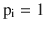
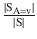
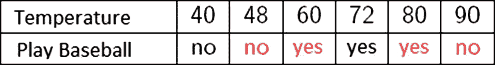

# 10.决策树

数据挖掘是从大型数据集中发现和提取有意义、有用的信息(模式)的过程。许多数据挖掘技术都是从人工智能继承来的，特别是从机器学习及其监督学习子领域继承来的；这些技术中包括分类技术。

分类是数据挖掘中的一项常见任务，它解决了现实世界中的许多问题，如欺诈、垃圾邮件检查、信用评分、破产预测、医疗诊断、模式识别、多媒体分类等。它被认为是公司基于决策模型开发有效知识以获得竞争优势的有力途径。在前一章，我们研究了我们的第一个分类器，支持向量机。在这一章中，我们将介绍一个流行的分类器，它为我们提供了一种非常直观的方法来对一组项目进行分类:决策树。

在这一章中，我们将介绍决策树，并描述它们的目的以及它们是如何实现上述目的的。我们将介绍两种最流行的生成 DTs 的算法，它们是 ID3(交互式二分法 3)和 C4.5，后者是前者的扩展，包括多项重大改进。ID3 和 C4.5 都是 J. Ross Quinlan 开发的。

此外，正如我们到目前为止所做的，我们将使用 Microsoft Automatic Graph Layout 在 Windows Forms 中开发一个图形应用，以图形方式表示执行我们的算法后获得的 DT。

Note

Microsoft 自动图形布局(MSAGL)是一个用于图形布局和查看的. NET 工具。它是由微软的 Lev Nachmanson、Sergey Pupyrev、Tim Dwyer 和 Ted Hart 开发的。使用 MSAGL，我们可以构建树和图，我们可以标记边和节点，我们甚至可以定义边的方向。除此之外，它还提供了许多其他设施，我们邀请读者来看看。

## 什么是决策树？

决策树(DT)是决策过程的图形表示，具有很高的表达能力，并且容易被人理解。与支持向量机一样，DTs 使用超平面将决策空间划分为不同的类别(图 [10-1](#Fig1) )。


图 10-1

Partition created using a DT

作为树，DT 由一个根节点、多个内部节点和叶节点组成，这些节点最终决定了新输入数据的分类。由于 DTs 是从监督学习算法中获得的数据结构，这些算法接收一组训练数据作为输入，并输出一个对新输入数据进行分类的函数(DTs 可以视为多元函数)。

与 SVM 或神经网络等其他算法不同，DTs 考虑并使用训练数据集中的属性名称集，因为它们稍后会使用它们来构建树。DT 中的每个节点都标有一些属性名，离开该节点的边标有相应的属性值(假设它们是离散的和分类的)；叶节点标有目标属性值。因此，属性集可以分为非目标和目标，其中|goal| = 1。表 [10-1](#Tab1) 显示了几个属性及其相应的值。

表 10-1

Attributes and Their Values

<colgroup><col align="left"> <col align="left"> <col align="left"></colgroup> 
| 属性 | 类型 | 价值观念 |
| :-- | :-- | :-- |
| 观点 | 非目标 | 晴天，雨天，多云 |
| 温度 | 非目标 | 温暖、寒冷、温和 |
| 湿度 | 非目标 | 高，正常 |
| 风 | 非目标 | 强，弱 |
| 打棒球 | 目标 | 是，不是 |

训练数据集的示例如表 [10-2](#Tab2) 所示。

表 10-2

Training Data Set

<colgroup><col align="left"> <col align="left"> <col align="left"> <col align="left"> <col align="left"></colgroup> 
| 观点 | 温度 | 湿度 | 风 | 打棒球 |
| :-- | :-- | :-- | :-- | :-- |
| 快活的 | 温暖的 | 高的 | 无力的 | 不 |
| 快活的 | 温暖的 | 高的 | 强烈的 | 不 |
| 多云的 | 温暖的 | 高的 | 无力的 | 是 |
| 下雨的 | 有节制的 | 高的 | 无力的 | 是 |
| 下雨的 | 寒冷 | 标准 | 无力的 | 是 |
| 下雨的 | 寒冷 | 标准 | 强烈的 | 不 |
| 多云的 | 寒冷 | 标准 | 强烈的 | 是 |
| 快活的 | 有节制的 | 高的 | 无力的 | 不 |
| 快活的 | 寒冷 | 标准 | 无力的 | 是 |
| 下雨的 | 有节制的 | 标准 | 无力的 | 是 |
| 快活的 | 有节制的 | 标准 | 强烈的 | 是 |
| 多云的 | 有节制的 | 高的 | 强烈的 | 是 |
| 多云的 | 温暖的 | 标准 | 无力的 | 是 |
| 下雨的 | 有节制的 | 高的 | 强烈的 | 不 |

应用学习方法(如 ID3，使用表 [10-2](#Tab2) 中给出的训练数据集)得出的 DT 可能如下(图 [10-2](#Fig2) )。


图 10-2

Graphic of a DT matching the training data from Table [10-2](#Tab2) and created using MSAGL

一旦我们有了 DT，问题是，我们如何对新的输入数据进行分类？要对新数据进行分类，我们只需遍历树，将数据向量中的每个属性与其在传入数据向量中的对应值进行匹配。例如，让我们假设 x 是新的输入数据，并且

X =(多云，温暖，正常，强)

然后，为 X 寻找一个分类，我们从根开始遍历树(Outlook)。因为 X 中的 Outlook 等于“多云”，所以我们沿着这条边，最终到达叶节点“是”，这意味着在 X 的条件或值下玩棒球=是。

到目前为止，我们知道了 DTs 的目的(分类)，知道了它们的样子，也知道了一旦有了新数据如何分类(从根开始遍历树，将传入的数据与属性名进行匹配)。在下一节中，我们将研究如何生成 DT，并且我们还将确定在生成 DT 时可能出现的一些问题(例如过度拟合)。

Note

如果我们从根到叶遍历 DT，我们获得一组描述决策过程的决策规则；例如，前景=晴朗，湿度=正常= >打棒球=是。每个决策规则都由一系列语句组成。

## 生成决策树:ID3 算法

构建最优决策树是监督学习中的一个关键问题。一般来说，可以从一组给定的属性构建多个决策树。虽然一些树比其他树更精确，但是由于搜索空间的指数大小，找到最优树的问题在计算上是不可行的。

为学习 DTs 而开发的大多数算法都是核心算法(Hunt 算法)的变体，该算法采用自上而下、贪婪地搜索可能的决策树空间。Hunt 算法通过将训练数据集按顺序划分为更细粒度的子集，以递归方式生成决策树。假设`TrainingData`表示节点 N 处的当前训练数据集(只考虑匹配非目标属性的列),那么 Hunt 的伪代码将遵循以下步骤:

1.  如果`TrainingData`包含所有属于同一类的记录，C - > N 将是标记为 C 的叶节点。
2.  如果`TrainingData`是一个空集，- > N 将是一个用最频繁的类别 c 标记的叶节点，记住，`TrainingData`只包含非目标属性列；因此，C 取自目标属性列。
3.  如果`TrainingData`包含属于一个以上类别的记录，使用测试选择一个属性，将数据分割成更小的子集，并继续对每个子集递归应用相同的程序。

ID3 算法使用与 Hunt 算法相同的思想；事实上，如果我们看 ID3 的伪代码，它几乎和 Hunt 的伪代码一样。主要区别在于属性分裂测试。ID3 使用信息增益和熵的概念来选择具有最高信息增益的属性，然后，如在 Hunt 算法中发生的，创建用该属性名称标记的新节点。然后，它创建从该新节点出来的边，每个边对应于所选属性的一个值，并在每个新边中递归继续。

Note

熵和信息增益是来自信息论的概念，信息论是一个科学领域，起源于被称为信息时代之父的克劳德·香农在 1948 年发表的一篇论文。它是数据操作的科学，如压缩、存储、统计信号处理和通信。

生成 DT 时要考虑的重要一点是训练数据集的大小。回想一下，学习可以被看作是对最能描述训练数据集的函数的近似。这不仅发生在机器学习领域，也发生在人类的现实生活中。当我们学习驾驶时，我们通过某人(教练)正在提供的一组数据，学习一种正在向我们描述的功能；诸如你不能越过人，你不能在红灯时继续前进，你必须按照指示的速度限制行驶，你以这种方式操纵方向盘，你使用这种装置刹车，等等。利用这些数据，我们最终学习了一个程序或功能，该程序或功能允许我们在接收到输入到我们的“驱动”功能(如“红灯”或“街上的人”)后采取行动或输出(如“停止”、“继续”)。合理地说，我们收到的高质量数据越多，我们就能更好地了解训练数据集所属函数的近似值。在图 [10-3](#Fig3) 中，我们可以看到一个描述训练数据集大小和结果 DT 提供的预测质量之间关系的图形。如前所述，训练数据集越大，正确逼近其所属函数的机会就越大。


图 10-3

Graphic describing how the prediction quality increases as the training data set size also increases

在接下来的小节中，我们将研究使用熵和信息增益背后的思想，这两个概念来自信息论，构成了 ID3 及其后代等算法中使用的分裂标准。

### 熵和信息增益

熵是混沌和不确定性的量度；高熵意味着高度无序或混沌，低熵意味着低不确定性或混沌(图 [10-4](#Fig4) )。熵函数通常表示为 H(x ),其中 x 是包含概率的向量；亦即。


图 10-4

Entropy function

看图 [10-4](#Fig4) ，我们可以看到当概率 p <sub>i</sub> 处于中途时会发生什么；即大约 0.5。在这样的情况下，我们有高熵(接近 1)。由于每个 p <sub>i</sub> 都有很高的不确定性，因为它们的概率接近 0.5(或 50%的几率)，这意味着它们要么一致出现，要么不一致出现(具有相同的概率)，那么全球的不确定性或混乱也将很高。当每个 p <sub>i</sub> 接近 0 或 1 时，它们的熵将会很低，因为元素概率指示出现的机会低或高，因此减少了不确定性。熵函数如下:

![ $$ \mathrm{H}\left(\mathrm{X}\right)=\mathrm{H}\left(\left[{\mathrm{p}}_1,\dots, {\mathrm{p}}_{\mathrm{n}}\right]\right)=-\sum \limits_{\mathrm{i}=1}^{\mathrm{n}}\kern0.38em {\mathrm{p}}_{\mathrm{i}}\ast {\log}_2{\mathrm{p}}_{\mathrm{i}} $$ ](A449374_1_En_10_Chapter_Equa.gif)

它满足下一组属性:

1.  ![ $$ \mathrm{H}\left(\mathrm{X}\right)=\mathrm{H}\left(\left[{\mathrm{p}}_1,\dots, {\mathrm{p}}_{\mathrm{n}}\right]\right)\ge 0 $$ ](A449374_1_En_10_Chapter_IEq2.gif)。
2.  ![ $$ \mathrm{H}\left(\mathrm{X}\right)=\mathrm{H}\left(\left[{\mathrm{p}}_1,\dots, {\mathrm{p}}_{\mathrm{n}}\right]\right)=0 $$ ](A449374_1_En_10_Chapter_IEq3.gif)，如果存在有的话。
3.  ![ $$ \mathrm{H}\left(\mathrm{X}\right)=\mathrm{H}\left(\left[{\mathrm{p}}_1,\dots, {\mathrm{p}}_{\mathrm{n}}\right]\right)\le \mathrm{H}\left(\left[\frac{1}{\mathrm{n}},\dots, \frac{1}{\mathrm{n}}\right]\right) $$ ](A449374_1_En_10_Chapter_IEq5.gif)，最大熵对应于马的可能情况。
4.  ![ $$ \mathrm{H}\left(\mathrm{X}\right)=\mathrm{H}\left(\left[{\mathrm{p}}_1,\dots, {\mathrm{p}}_{\mathrm{n}},0\right]\right)=\mathrm{H}\left(\left[{\mathrm{p}}_1,\dots, {\mathrm{p}}_{\mathrm{n}}\right]\right). $$ ](A449374_1_En_10_Chapter_IEq6.gif)

回到 ID3 算法，我们在分割树时的目标将是选择实现熵最大减少的属性(无序、混乱、不确定)。我们如何衡量这种预期的减少？我们使用从信息论中提取的称为信息增益的概念，其具有以下公式:


其中 S 是 DT 中当前节点的训练数据集，Values(A)表示对应于属性 A 的值的集合，是 S 的子集，其属性 A 的值等于 v

信息增益可以定义为由于属性 A 上的排序而导致的 S 中熵的预期减少。它回答了这样一个问题，如果我们选择属性 A，那么结果集的形成或排序会有多好？Gain 的计算方法是整个集合 S 的熵减去 S 中 A = v 的概率总和；即()，乘以子集的熵。

这是 ID3 为了选择用于分裂树的属性而使用的测试，并且它将选择提供最高增益的属性。现在我们已经收集了构建 ID3 算法的所有必要部分，从下一节开始，我们将开始研究实现问题，并用 C#开发我们的 ID3 方法。

Note

理想的属性将把训练数据集分成全部为正或全部为负的子集(关于目标属性)；即提供最大信息增益。

### 实际问题:实现 ID3 算法

为了开始实现我们的 ID3 算法，我们将首先创建两个类(清单 [10-1](#Par37) )来处理属性和训练数据集。

```py
public class Attribute
{
        public string Name { get; set; }
        public string[] Values { get; set; }
        public TypeAttrib Type { get; set; }
        public TypeValTypeVal{ get; set; }

        public Attribute(string name, string [] values, TypeAttrib type, TypeValtypeVal)
        {
            Name = name;
            Values = values;
            Type = type;
TypeVal = typeVal;
        }
}

    public enumTypeAttrib
    {
        Goal, NonGoal
    }

    public enumTypeVal
    {
        Discrete, Continuous
    }

public class TrainingDataSet
    {
        public string [,] Values { get; set; }
        public Attribute GoalAttribute{ get; set; }
        public List<Attribute>NonGoalAttributes{ get; set; }

        public TrainingDataSet(string [,] values, IEnumerable<Attribute>nonGoal, Attribute goal)
        {
            Values = new string[values.GetLength(0), values.GetLength(1)];
            Array.Copy(values, Values, values.GetLength(0) * values.GetLength(1));
            NonGoalAttributes = new List<Attribute>(nonGoal);
GoalAttribute = goal;

            if (NonGoalAttributes.Count + 1 != Values.GetLength(1))
                throw new Exception("Number of attributes must coincide");
        }
    }

Listing 10-1Attribute and TrainingDataSet Classes

```

`Attribute`类包含以下字段和属性:

*   `Name`:定义属性名称的属性
*   `Values`:定义属性值集合的属性
*   `Type`:定义属性类型的属性，目标或非目标
*   `TypeVal`:定义属性值类型的属性，可以是离散的，也可以是连续的。当我们查看 C4.5 算法时，我们将检查连续属性。

`TrainingDataSet`类包括以下属性和字段:

*   `Values`:训练数据集值的详细矩阵
*   `GoalAttribute`:定义训练数据集的目标属性
*   `NonGoalAttribute`:定义非目标属性的集合

正如我们所看到的，`TrainingDataSet`类从`Attribute`类获取信息；清单 [10-2](#Par48) 显示了`DecisionTree`类的第一部分。

```py
public class DecisionTree
    {
        public TrainingDataSetDataSet{ get; set; }
        public string Value { get; set; }
        public List<DecisionTree> Children { get; set; }
        public string Edge { get; set; }

        public DecisionTree(TrainingDataSetdataSet)
        {
DataSet = dataSet;
        }

        public static DecisionTreeLearn(TrainingDataSetdataSet, DtTrainingAlgorithm algorithm)
        {
            if (dataSet == null)
                throw new Exception("Data Set cannot be null");

            switch (algorithm)
            {
                default:
                    return Id3(dataSet.Values, dataSet.NonGoalAttributes, "root");
            }
        }

        public DecisionTree(string value, string edge)

        {
            Value = value;
            Children = new List<DecisionTree>();
            Edge = edge;
        }

        public void Visualize()
        {
var form = new Form();
            //create a viewer object
var viewer = new GViewer();
            //create a graph object
var graph = new Graph("Decision Tree");
            //create the graph content

CreateNodes(graph);

            //bind the graph to the viewer
viewer.Graph = graph;
            //associate the viewer with the form
form.SuspendLayout();
viewer.Dock = DockStyle.Fill;
form.Controls.Add(viewer);
form.ResumeLayout();

            //show the form
form.ShowDialog();
        }

        private void CreateNodes(Graph graph)
{
varqueue = new Queue<DecisionTree>();
queue.Enqueue(this);
graph.CreateLayoutSettings().EdgeRoutingSettings.EdgeRoutingMode = EdgeRoutingMode.StraightLine;
var id = 0;

            while (queue.Count> 0)

            {
varcurrentNode = queue.Dequeue();
                Node firstEnd;
                if (graph.Nodes.Any(n =>n.LabelText == currentNode.Value))
firstEnd = graph.Nodes.First(n =>n.LabelText == currentNode.Value);
                else
firstEnd = new Node((id++).ToString()) { LabelText = currentNode.Value };
graph.AddNode(firstEnd);

foreach (vardecisionTree in currentNode.Children)
                {
varsecondEnd = new Node((id++).ToString()) { LabelText = decisionTree.Value };
graph.AddNode(secondEnd);
graph.AddEdge(firstEnd.Id, decisionTree.Edge, secondEnd.Id);
queue.Enqueue(decisionTree);
                }
            }
        }
}

    public enumDtTrainingAlgorithm
    {
        Id3,
    }

Listing 10-2
DecisionTree Class

```

该类包含以下属性:

*   `Dataset`:这是接收训练数据集作为输入的方法，也是学习阶段使用的学习算法的类型。
*   `Value`:定义代表该决策树根的节点值
*   `Children`:定义当前决策树的子树集合
*   `Edge`:以字符串形式定义连接该节点与其父节点的边的标签

此外，`DecisionTree`类包括以下方法:

*   `Learn()`:这是接收训练数据集作为输入的方法，也是学习阶段使用的学习算法的类型。
*   `Visualize()` : `This`方法在学习阶段完成后，使用 MSAGL 图形工具来可视化结果树。
*   `CreateNodes()`:该方法执行 BFS 算法来遍历由 ID3 算法创建的决策树，并且当它遍历时，它创建一个使用 MSAGL 工具标记的等价树。

ID3 算法及其支持方法都属于`DecisionTree`类，如图 [10-3](#Fig3) 所示。

```py
        public static DecisionTree Id3(string [,] values, List<Attribute> attributes, string edge)
        {
            // All training data has the same goal attribute
vargoalValues = values.GetColumn(values.GetLength(1) - 1);
            if (goalValues.DistinctCount() == 1)
                return new DecisionTree(goalValues.First(), edge);

            // There are no NonGoal attributes
            if (attributes.Count == 0)
                return new DecisionTree(goalValues.GetMostFrequent(), edge);

            // Set as root the attribute providing the highest information gain
varattrIndexPair = HighestGainAttribute(values, attributes);
varattr = attrIndexPair.Item1;
varattrIndex = attrIndexPair.Item2;
var root = new DecisionTree(attr.Name, edge);

foreach (var value in attr.Values)
            {
varsubSetVi = values.GetRowIndex(attrIndex, value, ComparisonType.Equality);

                if (subSetVi.Count == 0)
root.Children.Add(new DecisionTree(goalValues.GetMostFrequent(), value));
                else
                {
varnewAttrbs = new List<Attribute>(attributes);
newAttrbs.RemoveAt(attrIndex);
varnewValues = values.GetMatrix(subSetVi).RemoveColumn(attrIndex);
root.Children.Add(Id3(newValues, newAttrbs, attr.Name + " : " + value));
                }
            }

            return root;
        }

        private static Tuple<Attribute, int>HighestGainAttribute(string [,] values, IEnumerable<Attribute> attributes)
        {
            Attribute result = null;
varmaxGain = double.MinValue;
var index = -1;
vari = 0;

foreach (varattr in attributes)

            {
                double gain = Gain(values, i);

                if (gain >maxGain)
                {
maxGain = gain;
                    result = attr;
                    index = i;
                }
i++;
            }

            return new Tuple<Attribute, int>(result, index);
        }

        private static double Gain(string [,] values, intattributeIndex)
        {
varimpurityBeforeSplit = Entropy(values.GetFreqPerDistinctElem(values.GetLength(1) - 1).GetProbabilities());
varimpurityAfterSplit= SubsetEntropy(values, attributeIndex);
            return impurityBeforeSplit - impurityAfterSplit;
        }

        private static double Entropy(IEnumerable<double>probs)

        {
            return -1 * probs.Sum(d =>LogEntropy(d));
        }

        private static double LogEntropy(double p)
        {
            return p >0 ? p * Math.Log(p, 2) : 0;
        }

        private static double SubsetEntropy(string[,] values, intcolumnIndex)
        {
varfreqDicc = values.GetFreqPerDistinctElem(columnIndex);
var result = 0.0;

var sum = freqDicc.Values.Sum();

foreach (var key in freqDicc.Keys)
            {
varrowIndex = values.GetRowIndex(columnIndex, key, ComparisonType.Equality);
varfrequencyPerClass = values.GetFreqPerDistinctElem(values.GetLength(1) - 1, rowIndex.ToArray());
                result += (freqDicc[key] / (double) sum) * Entropy(frequencyPerClass.GetProbabilities());
            }

            return result;

        }
    }

Listing 10-3
ID3 Algorithm

```

在清单 [10-3](#Par59) 中，我们使用了几种扩展方法，有些属于 Accord。NET 包和其他一些属于扩展类的包，我们创建这些扩展类是为了支持一些必须在 ID3 算法中处理的操作，如果直接包含在方法的代码中，将会模糊它的理解、易读性和清晰性。此外，由于该类中的每个方法都是自描述的，并且与前面给出的伪代码相匹配，我们将重点解释清单 [10-4](#Par61) 中所示的扩展方法；这些方法属于一个扩展类。

```py
public static string GetMostFrequent(this string[] values)
        {
vardicc = new Dictionary<string, int>();

foreach (var v in values)
            {
                if (!dicc.ContainsKey(v))
dicc.Add(v, 1);
else
dicc[v] += 1;
            }

varmaxVal = dicc.Max(e =>e.Value);
return dicc.First(p =>p.Value == maxVal).Key;
        }
        public static Dictionary<string, int>GetFreqPerDistinctElem(this string [,] values, intcolumnIndex, int [] rowIndex = null )
{
varfreqDicc = new Dictionary<string, int>();

            for (vari = 0; i< (rowIndex == null ?values.GetLength(0) : rowIndex.Length); i++)
            {
var row = rowIndex == null ?i : rowIndex[i];
                if (!freqDicc.ContainsKey(values[row, columnIndex]))
freqDicc.Add(values[row, columnIndex], 1);
                else
freqDicc[values[row, columnIndex]] += 1;
            }

            return freqDicc;
}

        public static List<int>GetRowIndex(this string[,] values, intcolumnIndex, string toCompare, ComparisonTypecomparisonType)
        {
var result = new List<int>();

            for (vari = 0; i<values.GetLength(0); i++)
            {
                switch (comparisonType)
                {
                        case ComparisonType.Equality:
                            if (values[i, columnIndex] == toCompare)
result.Add(i);
                            break;
                        case ComparisonType.NumericLessThan:
                            if (double.Parse(values[i, columnIndex]) <double.Parse(toCompare))

result.Add(i);
                            break;
                        case ComparisonType.NumericGreaterThan:
                            if (double.Parse(values[i, columnIndex]) >double.Parse(toCompare))
result.Add(i);
                            break;
                }
            }

            return result;
        }

        public static string[,] GetMatrix(this string[,] values, List<int>rowIndex)
        {
var result = new string[rowIndex.Count, values.GetLength(1)];
var j = 0;

foreach (vari in rowIndex)
            {
result.SetRow(j, values.GetRow(i));
j++;
            }

            return result;
        }

        public static IEnumerable<double>GetProbabilities(this Dictionary<string, int>dicc)
        {
var probabilities = new List<double>();
var sum = dicc.Values.Sum();

foreach (var e in dicc)
probabilities.Add((e.Value / (double) sum));

            return probabilities;
        }

public enumComparisonType
    {
Equality, NumericGreaterThan, NumericLessThan
    }

Listing 10-4
Extension Methods

```

这里详细描述了以前的扩展方法:

*   `GetMostFrequent()`:返回作为参数接收的字符串数组中最频繁出现的元素；`string []`的扩展方法
*   `GetFreqPerDistinctElem()`:返回元素在指定的列和指定的行集中出现的频率(出现的次数)(如果有，为可选参数)；`string [,]`的扩展方法
*   `GetRowIndex()`:返回匹配行的索引集，这些行在作为参数接收的列索引处的值满足由`ComparisonType`定义的比较标准，并考虑作为参数详述的比较字符串；`string [,]`的扩展方法
*   `GetMatrix()`:返回一个新矩阵，该矩阵只包含原始矩阵中的索引与作为参数接收的列表中的一个整数相匹配的那些行。它使用的是属于 Accord 的`SetRow()`方法。网；`string [,]`的扩展方法
*   `GetProbabilities()`:以 value(x) / total(S)的形式返回输入字典中每个元素 x 的概率，其中 total(S)是输入字典中所有元素值的总和；`Dictionary<string, int>`的扩展方法

现在我们已经详细描述了 ID3 实现的每个组件，让我们看看如何通过包含清单 [10-5](#Par69) 中所示的代码在控制台应用中测试我们的算法。

```py
var values = new [,]
                             {
{ "sunny", "warm", "high", "weak", "no" },
{ "sunny", "warm", "high", "strong", "no" },
{ "cloudy", "warm", "high", "weak", "yes" },
{ "rainy", "temperate", "high", "weak", "yes" },
{ "rainy", "cold", "normal", "weak", "yes" },
{ "rainy", "cold", "normal", "strong", "no" },
{ "cloudy", "cold", "normal", "strong", "yes" },
{ "sunny", "temperate", "high", "weak", "no" },
{ "sunny", "cold", "normal", "weak", "yes" },
{ "rainy", "temperate", "normal", "weak", "yes" },
{ "sunny", "temperate", "normal", "strong", "yes" },
{ "cloudy", "temperate", "high", "strong", "yes" },
{ "cloudy", "warm", "normal", "weak", "yes" },
{ "rainy", "temperate", "high", "strong", "no" },
                             };

varattribs = new List<Attribute>
                              {
                                  new Attribute("Outlook", new[] { "sunny", "cloudy", "rainy" }, TypeAttrib.NonGoal, TypeVal.Discrete),
                                  new Attribute("Temperature", new[] { "warm", "temperate", "cold" }, TypeAttrib.NonGoal, TypeVal.Discrete),

                                  new Attribute("Humidity", new[] { "high", "normal" }, TypeAttrib.NonGoal, TypeVal.Discrete),
                                  new Attribute("Wind", new[] { "weak", "strong" }, TypeAttrib.NonGoal, TypeVal.Discrete),
                              };

vargoalAttrib = new Attribute("Play Baseball", new[] { "yes", "no" }, TypeAttrib.Goal, TypeVal.Discrete);
vartrainingDataSet = new TrainingDataSet(values, attribs, goalAttrib);
vardtree = DecisionTree.Learn(trainingDataSet, DtTrainingAlgorithm.Id3);
dtree.Visualize();

Listing 10-5Testing Our DecisionTree Class

and the ID3 Algorithm

in a Console Application

```

执行清单 [10-5](#Par69) 中的代码后得到的结果可以在图 [10-5](#Fig5) 中看到；读者可以验证它与图 [10-2](#Fig2) 所示的 DT 完全一致。列表 [10-5](#Par69) 和表 [10-2](#Tab2) 中所示的训练数据集也是如此。


图 10-5

DT obtained after executing our console application program

目前，我们已经讲述了 DTs 的基础知识，解释了 ID3 算法的功能，并介绍了一个我们实现 ID3 算法的实际问题。在接下来的部分中，我们将解释 ID3 算法的一些困难或缺点，以及它的改进版本 C4.5 算法如何克服这些困难，并通过应用修剪技术来处理缺失值和值可以是连续而不是离散的属性，从而提供更有效的 DT。

### C4.5 算法

C4.5 算法(Quinlan，1993)代表了对 ID3 缺点的扩展或增强。它的改进在于三个要点:处理连续属性(记住 ID3 只处理分类属性)，处理缺失值，以及通过最后修剪树来解决过度拟合问题。

过度拟合是当结果 DT 与训练数据集拟合得太好时出现的问题。结果，DT 最终很难预测新的输入数据，因为它在已学习的训练数据集上创建了不适当的依赖性或过度拟合的结构。为了更好地理解过度拟合的问题，让我们考虑一个实验，其中我们想要预测骰子的结果，训练数据集包括掷骰子发生的日期、时间以及骰子的颜色。这里可能发生的是，学习者构建了一个符合数据的 DT，但考虑了与结果无关的属性，如颜色。这种情况通常出现在包含大量属性或特征的数据中。当处理拥有大量属性的训练数据或对象时，我们可能会发现许多无意义的属性，与最终决定即将到来的数据的结果的真正重要的属性相比，这些属性是不相关的。

我们如何解决这个问题？有两种主要的方法来解决过拟合问题。第一，在生成过程的早期阶段以及在达到完美分类训练数据集的点之前停止树的生长。第二，在树生成后修剪它。第二种方法比第一种更成功，主要是因为知道何时停止树的生长是一项棘手的任务。一旦我们开始修剪过程，一个基本的问题是如何决定一个子树是否值得修剪；换句话说，我们应该用什么标准来修剪，我们应该如何进行这个过程？

尽管有多种策略来执行 DT 的修剪过程，但最流行的方法依赖于交叉验证，这是一种统计技术，它将训练数据集 S 划分为子集 S <sub>1</sub> ，S <sub>2</sub> ，然后使用第一个子集来训练和生成 DT，使用第二个子集来测试结果 DT 在对来自验证集 S <sub>2</sub> 的数据进行分类时表现如何。交叉验证与剪枝后测量相结合，为我们提供了剪枝后结果 DT 表现如何的评估。最常见的措施是减少错误和规则修剪。

错误减少标准的伪代码如下:

*   使用 DT 对验证集 S <sub>2</sub> 中的训练数据进行分类(图 [10-6](#Fig6) )。
*   对于每个节点 X:
    *   求以 x 为根的整个子树的误差之和。
    *   计算相同训练数据的误差，但是一旦 X 已经被变换成叶节点并且被分配了其所有后代的最常见类。
*   比较这两个值，并删除误差减少最多的一个。
*   重复直到误差不再减少。

图 [10-6](#Fig6) 示出了一个子树，其中加号表示正确分类的训练数据，减号表示错误分类的训练数据。


图 10-6

Validation set consisting of 16 training data classified by the DT. A positive number indicates a training data correctly classified by the DT, and a minus indicates an error in classification

同时，误差减少措施通常与称为子树替换的子树简化算子或修剪技术结合使用，其中 DT 的每个内部节点恰好是自下而上方法中用于修剪的候选节点，该自下而上方法仅在检查树的子树之后修剪树。在这个意义上，修剪可以被解释为删除 DT 的一个子树并用一个叶子替换它，该叶子的值对应于在该子树的所有叶子中找到的最频繁的类，如前面的伪代码所描述的。

当对照验证集 S <sub>2</sub> 进行测试时，如果结果 DT 的表现比前一个差，则最终修剪子树。DT 中的节点被迭代地修剪，总是选择那些在验证集上增加结果 DT 的效率的节点。这将导致当在训练数据集上学习时基于巧合的规则创建的任何叶节点在双重检查验证集时被剪除，因为相同的巧合规则不可能也发生在验证集上。

另一个标准是规则修剪，它将学习到的 DT 转换成一组规则，从根节点到叶节点的每条可能的路径都有一个规则。它包括以下步骤:

*   使用 DT 对验证集 S <sub>2</sub> 中的训练数据进行分类(图 [10-6](#Fig6) )。
*   将学习到的 DT 转换成一组规则，从根节点到叶节点的每条可能路径一个规则。
*   通过删减导致提高估计准确性的前提条件来删减或概括每个规则。
*   根据估计的准确性对删减的规则进行排序，并在对新的传入数据进行分类时按此顺序考虑它们。

从这个意义上来说，规则前提条件代表了从根到叶节点的属性测试，并且该叶节点上的值或分类成为规则结果或后置条件。例如，if(展望=晴朗的^湿度=正常)是前提条件，playBaseball = yes 是结果。之后，如果在修剪之前，前提条件的移除不影响 DT 的估计精度，则通过移除前提条件来修剪每个规则。

C4.5 算法的另一个显著特征是，它使用不同的度量来选择要分割的属性；它不使用信息增益，而是使用增益比，其公式如下:


其中


其中 S <sub>i</sub> 是关于包含 n 个可能值的属性 A 划分 S 后的子集。增益比度量克服了信息增益的缺点，信息增益的主要缺点是偏爱具有最大数量值的属性。例如，考虑一个可能包含许多值的日期属性；因为这个集合的大小可能是巨大的，它可能会将整个训练数据集分成熵将非常低的更小的子集；因此，信息增益将非常高。增益比惩罚那些具有均匀分布的多个值的属性。

处理连续属性是 C4.5 相对于其前身 ID3 的主要优势之一。为了处理连续属性，C4.5 将值集划分为一组离散的区间。它创建一个二进制决策节点，将可能值的范围分成两个子集，这些子集满足< X and those satisfying > = X，其中 X 是要决定的阈值。此过程假设连续值集中存在全序。关键点是找到 X 值(阈值),根据该值进行划分。最常见的方法是按升序对训练数据集的值进行排序；在比较连续元素(I，i + 1)的目标属性时，遍历排序值列表；将阈值计算为这两个连续元素的平均值(即 X'=(L[i] + L[i+1])/2)(当且仅当它们的目标属性不同时)；计算在阈值 X '上划分属性所获得的信息增益(考虑小于 X '的元素子集，大于 X ')；并选择提供最高信息增益的一个。请注意，只有当连续元素的类不同时，我们才考虑它们。我们永远不会考虑元素 L[i]，L[i + 1](其中 L 是连续属性上排序值的列表)，如果它们都有相同的类 C(图 [10-7](#Fig7) )。



图 10-7

After incrementally sorting values we examine those consecutive values whose goal attribute is different

对于处理丢失的值，存在不同的策略，并且该过程通常在执行任何 DT 学习算法之前执行。最简单的策略是简单地忽略丢失的值，在计算熵时不考虑它们。更聪明的策略是将训练数据集中该属性最常见的值赋给缺失值。最后，更复杂的方法是为缺失属性 A 的每个可能值分配概率，然后为每个计算的概率在该节点上创建分支。例如，假设我们有一个二进制属性 A，其值为 P，Q，该属性有十个已知值，属性 P 有六个，值 Q 有四个，那么这种方法将创建两个分支，对应于属性具有值 P 的概率为 0.6，另一个分支与属性具有值 Q 的概率相关。

### 实际问题:实现 C4.5 算法

在本节中，我们将介绍 C4.5 算法的实现，它将包括不同的功能，如处理连续属性和增益比测量。处理缺失值的修剪技术和策略将留给读者作为练习，并作为补充本文所述代码的一种方式。从 ID3 到 C4.5 的主要编码任务在于适应处理连续值；因此，我们在本节中介绍它。

正如所料，ID3 和 C4.5 共享几乎相同的代码。基础条件相同，主要区别在主体内部。清单 [10-6](#Par97) 显示了 C4.5 算法的接入点；记住，这个方法将被添加到我们在本章中一直在开发的`DecisionTree`类中。

```py
public static DecisionTreeC45(string [,] values, List<Attribute> attributes, string edge)
        {
            // All training data has the same goal attribute
vargoalValues = values.GetColumn(values.GetLength(1) - 1);
            if (goalValues.DistinctCount() == 1)
                return new DecisionTree(goalValues.First(), edge);

            // There are no NonGoal attributes
            if (attributes.Count == 0)
                return new DecisionTree(goalValues.GetMostFrequent(), edge);

            // Set as root the attribute providing the highest information gain
varattrIndexPair = HighestGainAttribute(values, attributes);
varattr = attrIndexPair["attrib"] as Attribute;
varattrIndex = (int) attrIndexPair["index"];
var threshold = (int) attrIndexPair["threshold"];
var less = (List<int>) attrIndexPair["less"];
var greater = (List<int>) attrIndexPair["greater"];
var root = new DecisionTree(attr.Name, edge);
varsplittingVals = attr.TypeVal == TypeVal.Discrete ? attr.Values
                                              : new [] { "less" + threshold, "greater" + threshold } ;

foreach (var value in splittingVals)

            {
                List<int>subSetVi;

                if (attr.TypeVal == TypeVal.Discrete)
subSetVi = values.GetRowIndex(attrIndex, value, ComparisonType.Equality);
                else
subSetVi = value.Contains("less") ? less : greater;

                if (subSetVi.Count == 0)
root.Children.Add(new DecisionTree(goalValues.GetMostFrequent(), value));
                else
                {
varnewAttrbs = new List<Attribute>(attributes);
newAttrbs.RemoveAt(attrIndex);
varnewValues = values.GetMatrix(subSetVi).RemoveColumn(attrIndex);
root.Children.Add(Id3(newValues, newAttrbs, attr.Name + " : " + value));
                }
            }

            return root;
        }

Listing 10-6Main Body of C4.5 Algorithm

```

在这种情况下，`TypeVal`是一个附加到`Attribute`类的枚举，它允许我们知道一个属性是离散的还是连续的。注意，代码与 ID3 非常相似，但是在`HighestGainAttribute()`方法中可以发现一个显著的不同，它现在为我们提供了更多的信息，主要是与连续属性处理相关的信息。清单 [10-7](#Par99) 中说明了这种方法。

```py
        private static Dictionary<string, dynamic>HighestGainAttribute(string [,] values, IEnumerable<Attribute>attributes)
        {
            Attribute result = null;
varmaxGain = double.MinValue;
var index = -1;
            double threshold = -1.0;
vari = 0;
            List<int>bestLess = null;
            List<int>bestGreater = null;

foreach (varattr in attributes)
            {
                double gain = 0;
                Dictionary<string, dynamic>gainThreshold = null;

                if (attr.TypeVal == TypeVal.Discrete)
                    gain = Gain(values, i);
                if (attr.TypeVal == TypeVal.Continuous)
                {
gainThreshold = GainContinuous(values, i);
                    gain = gainThreshold["gain"];
                }

                if (gain >maxGain)
                {
maxGain = gain;
                    result = attr;
                    index = i;

                    if (gainThreshold != null)
                    {
                        threshold = gainThreshold["threshold"];
bestLess = gainThreshold["less"];
bestGreater = gainThreshold["greater"];
                    }
                }
i++;
            }

            return new Dictionary<string, dynamic> {
{ "attrib" , result },
{ "index" , index },
{ "less" , bestLess },
{ "greater" , bestGreater },
{ "threshold" , threshold },
                                                   };
        }

Listing 10-7
HighestGainAttribute() Method

for Continuous Attributes

```

在这个新的或连续版本的`HighestGainAttribute()`方法中，我们对属性的离散或连续进行了区分。另请注意，在这种情况下，该方法返回一个字典，其中包含所选属性及其索引，如果所选属性是连续的，还包含两个索引位置列表(较小、较大)以及双值阈值。为了计算连续属性的增益，它使用清单 [10-8](#Par101) 中所示的`GainContinuous()`方法。

```py
        private static Dictionary<string, dynamic>GainContinuous(string[,] values, inti)
        {
var column = values.GetColumn(i);
varcolumnVals = column.Select(double.Parse).ToList();
varbestGain = double.MinValue;
varbestThreshold = 0.0;
            List<int>bestLess = null;
            List<int>bestGreater = null;

columnVals.Sort();

            for (var j = 0; j <columnVals.Count - 1; j++)
            {
                if (columnVals[j] != columnVals[j + 1] && values[j, values.GetLength(1) - 1] != values[j + 1, values.GetLength(1) - 1])
                {
var threshold = (columnVals[j] + columnVals[j + 1])/2;
var less = values.GetRowIndex(i, threshold.ToString(), ComparisonType.NumericLessThan);
var greater = values.GetRowIndex(i, threshold.ToString(), ComparisonType.NumericGreaterThan);

var gain = Gain(values, i, threshold, less, greater);
                    if (gain >bestGain)
                    {
bestGain = gain;
bestThreshold = threshold;
bestLess = less;
bestGreater = greater;
                    }
                }
            }

            return new Dictionary<string, dynamic>
                       {
{ "gain" , bestGain },
{ "threshold" , bestThreshold },
{ "less", bestLess },
{ "greater", bestGreater },
                       };
        }

Listing 10-8GainContinuous() Method for Calculating the Gain of Continuous Attributes

```

在`GainContinuous()`方法中，我们对一组连续属性的可能值进行划分，并在阈值上创建一个二元区别，正如我们所记得的，阈值是产生最高信息增益的连续对(在排序值列表中)的平均值。这种情况下的输出是一个字典，包含增益、阈值双精度值和较小、较大列表。

请记住，在 C4.5 中，我们使用`GainRatio`标准来选择要分割的属性；清单 [10-9](#Par104) 中显示了计算这个度量的 C#方法。在同一个清单中，我们可以看到`GainRatio`所依赖的`SplitInformation`过程，如前几节所述。

```py
private static double GainRatio(string[,] values, intattributeIndex, double threshold = -1, List<int> less = null, List<int> greater = null)
        {
            return Gain(values, attributeIndex, threshold, less, greater) / SplitInformation(values, attributeIndex);
        }

        private static double SplitInformation(string[,] values, intattributeIndex)
        {
varfreq = values.GetFreqPerDistinctElem(attributeIndex);
var total = freq.Sum(t =>t.Value);
var result = 0.0;

foreach (var f in freq)
                result += (double)f.Value / total * Math.Log((double)f.Value / total, 2);

            return -result;
        }

Listing 10-9
GainRatio() and SplitInformation()

```

由于`GainRatio()`需要计算`Gain()`，我们需要对其进行一点调整，以适应连续情况——我们有两组值，一组比计算的阈值小，另一组比计算的阈值大。清单 [10-10](#Par106) 显示了`Gain()`方法的修改，包含在`if(threshold >= 0)`语句中。

```py
        private static double Gain(string [,] values, intattributeIndex, double threshold = -1, List<int> less = null, List<int> greater = null)
        {
varimpurityBeforeSplit = Entropy(values.GetFreqPerDistinctElem(values.GetLength(1) - 1).GetProbabilities());
            double impurityAfterSplit = 0;

            if (threshold >= 0)
            {
varfreq = new Dictionary<string, int>{  {"less", less.Count}, {"greater", greater.Count}  };

                for (vari = 0; i<freq.Count; i++)
impurityAfterSplit += SubsetEntropy(values, attributeIndex, freq, less, greater);
            }
            else
impurityAfterSplit = SubsetEntropy(values, attributeIndex);

            return impurityBeforeSplit - impurityAfterSplit;
        }

Listing 10-10Gain() Adaptation

to Handle the Continuous Case

```

`SubsetEntropy()`是另一种方法，我们需要稍加修改，使其适合连续的情况，并考虑更少、更多的值。清单 [10-11](#Par108) 中说明了这一修改。

```py
private static double SubsetEntropy(string[,] values, intcolumnIndex, Dictionary<string, int>freqContinous = null,
        List<int> less = null, List<int> greater = null)
        {
var result = 0.0;
varfreqDicc = freqContinous ?? values.GetFreqPerDistinctElem(columnIndex);

var total = freqDicc.Values.Sum();

foreach (var key in freqDicc.Keys)
            {
                List<int>rowIndex;

                switch (key)
                {
                    case "less":
rowIndex = less;
                        break;
                    case "greater":
rowIndex = greater;
                        break;
                    default:
rowIndex = values.GetRowIndex(columnIndex, key, ComparisonType.Equality);
                        break;
                }

varfrequencyPerClass = values.GetFreqPerDistinctElem(values.GetLength(1) - 1, rowIndex.ToArray());
                result += (freqDicc[key] / (double) total) * Entropy(frequencyPerClass.GetProbabilities());
            }

            return result;
         }

Listing 10-11Modification to the SubsetEntropy() Method

```

Note

`??`操作符被称为零合并操作符。如果操作数不为空，则返回左操作数；否则，它返回右边的操作数。

为了测试我们的 C4.5 算法，我们可以将清单 [10-12](#Par111) 中的代码添加到一个控制台应用中。

```py
var values = new [,]
{ { "sunny", "12", "high", "weak", "no" },
{ "sunny", "12", "high", "strong", "no" },
{ "cloudy", "14", "high", "weak", "yes" },
{ "rainy", "12", "high", "weak", "yes" },
{ "rainy", "20", "normal", "weak", "yes" },
{ "rainy", "20", "normal", "strong", "no" },
{ "cloudy", "20", "normal", "strong", "yes" },
{ "sunny", "12", "high", "weak", "no" },
{ "sunny", "14", "normal", "weak", "yes" },
{ "rainy", "20", "normal", "weak", "yes" },
{ "sunny", "14", "normal", "strong", "yes" },
{ "cloudy", "20", "high", "strong", "yes" },
{ "cloudy", "20", "normal", "weak", "yes" },
{ "rainy", "14", "high", "strong", "no" }, };
varattribs = new List<Attribute>
                              {
                                  new Attribute("Outlook", new[] { "sunny", "cloudy", "rainy" }, TypeAttrib.NonGoal, TypeVal.Discrete),
                                  new Attribute("Temperature", new[] { "12", "14", "20" }, TypeAttrib.NonGoal, TypeVal.Continuous),
                                  new Attribute("Humidity", new[] { "high", "normal" }, TypeAttrib.NonGoal, TypeVal.Discrete),
                                  new Attribute("Wind", new[] { "weak", "strong" }, TypeAttrib.NonGoal, TypeVal.Discrete),
                              };

vargoalAttrib = new Attribute("Play Baseball", new[] { "yes", "no" }, TypeAttrib.Goal, TypeVal.Discrete);
vartrainingDataSet = new TrainingDataSet(values, attribs, goalAttrib);
vardtree = DecisionTree.Learn(trainingDataSet, DtTrainingAlgorithm.C45);
dtree.Visualize();

Listing 10-12Testing Our C4.5 Algorithm in a Console Application

```

执行清单 [10-12](#Par111) 中的代码后得到的结果可以在图 [10-8](#Fig8) 中看到。


图 10-8

Resulting DT after executing the code from Listing [10-12](#Par111)

我们没有包括任何与处理缺失值功能相关的代码，但是使用忽略它们的非常简单的策略，我们可以创建一个 C#方法，该方法接收训练数据集作为输入，并检查矩阵的每个单元，用 0 替换任何未知值，使其不计入熵计算。如前所述，修剪技术留给读者去实现和补充练习。

## 摘要

在这一章中，我们研究了 DTs，它是一个分类模型的实现，具有树状的数据结构，在这种结构中，可以找到从根到任意叶遍历树的决策规则。我们描述了生成 DTs (ID3)的最基本、最流行的算法，并详细介绍了 C#中的一个实现；这种实现包括一个 Windows 窗体应用，它使用 MSAGL 以图形方式显示生成的 DT。

我们还解释了 C4.5 算法，它是 ID3 的改进版本，可以处理连续属性、训练数据集中的缺失值和过拟合问题。该算法的 C#实现包括最重要的编码细节，主要是处理连续属性特性。修剪技术的实现留给读者作为练习。