# 11.神经网络

在本章中，我们将讨论人工神经网络，这是一个在监督学习领域非常流行的算法家族(也适用于非监督学习和强化学习)，它试图模仿或模拟人脑的功能来解决问题，就像支持向量机和 DTs 一样，依赖于学习或逼近由成对(数据，分类)形式的训练数据表定义的函数 F。这个函数 F 是学习过程的结果，被称为近似函数或学习函数。它稍后用于分类或预测新输入数据的类别。

正如我们到目前为止所看到的，人工智能中使用的许多算法、方法和工具——尤其是在监督学习中——与其他知识领域密切相关，如代数、数学分析和数学优化。因为生活中的学习与我们“改进”或学习如何在时间线上做某些事情的过程有关(考虑时间)，而这正是优化算法的目标——通过迭代过程优化(最小化或最大化)一个函数——那么神经网络也不会例外，我们将保持使用优化技术学习和构建预测输入数据类别的函数的相同模式。

在这一章中，我们将介绍神经网络，并描述它们的功能以及它们如何模拟我们的神经元一起工作的方式。我们将实现感知器算法，这是最古老和最简单的神经网络模型之一。我们还将实现 Adaline NN 模型，因为它将是对多层神经网络主题的有用介绍；它所使用的优化技术类似于本章将要讨论的最后一种算法，即在多层神经网络中用于学习的流行的反向传播算法。

Note

神经网络可以应用于多种问题，其中值得一提的是模式、形状、人脸和手写识别、自动车辆驾驶以及许多其他问题。对脑式计算的研究源于麦卡洛克和皮茨(1943)的工作，以及后来赫布著名的《行为组织》(1949)。

## 什么是神经网络？

神经元是神经系统的一种细胞(图 [11-1](#Fig1) )，它拥有一层质膜，允许它从外部元素接收刺激，并将信号传输到其他神经元或人脑的不同类型细胞。它们接收或发送的信号是电化学的；因此，神经元负责收集、处理和传递电化学信号。当几个神经元通过它们的突触连接在一起时，它们被称为定义了一个神经网络。在这个网络中，当从连接到它的所有其他神经元接收到的所有电化学信号的激发足够高时，一个神经元就会发出或发送信号。

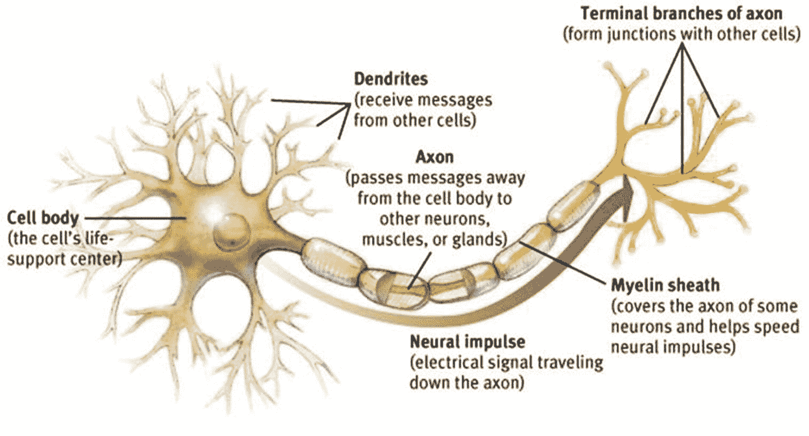

图 11-1

Biological neuron ; dendrites represent inputs of signals coming from other neurons and axons represent outputs for our neuron. One can think of the structure of a neuron as having input nodes called dendrites, output nodes called axons, and edges called synapses.

在数学人工智能世界中找到一个类似的模型，神经元可以被视为一个数学对象或函数，它从连接到它的所有神经元接收数字输入 x1，x2，…，xn，并组合这些值，计算加权和，作为一种通过将权重值 w1，w2，…，wn 与它们相关联来给予每个连接某种“相关性”的方式。因此，X = w1 * x1 + w2 * x2 + … + wn * xn 是到达神经元体的值。最终输出的值可以是一个信号，也可以是零(0)。为了确定信号(输出)的强度，我们通常使用激活函数；该函数决定了输出值，并将根据所用神经元的类型而变化。

因此，神经网络(NN)是先前描述的神经元的集合；这些神经元之间的关系可以描述为形成一个图形，其中从神经元 I 到神经元 j 的边表示到神经元 j 的输入和从神经元 I 到神经元 j 的输出(图 [11-2](#Fig2) )。


图 11-2

NN as a graph ; neurons 4 and 5 are receiving inputs from neurons 1, 2, and 3, and neurons 1, 2, and 3 are having output connections to neurons 4 and 5.

在下面几节中，我们将研究单单位神经网络，即由单个神经元组成的网络。在单神经元网络中，人们可以认为输入来自一些未知的神经元，其值与表示训练数据的向量的值相匹配。然后，输出将作为输入训练数据的分类。

Note

人工神经元可以被视为数学函数 F = A(x1 * w1 + … + xn * wn ),其中 xi 是输入；wi 是用于加强或削弱与其他神经元的连接的权重，而 A 是最终决定输出信号强度的激活函数。

## 感知器:奇异神经网络

感知器是一个单神经网络单元，遵循前面所述的相同过程:它接收 n 个输入 x1，…，xn，然后计算加权和 x1 * w1 + … + xn * wn，最后应用激活函数来获得输入数据的输出或分类。用感知器这个函数通常如下:

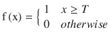

t 是一个称为阈值的值；它用于将加权和与阈值进行比较，并确定是否应该发送信号。因此，感知器可以表示为如图 [11-3](#Fig3) 所示。


图 11-3

The Perceptron computes a weighted sum of the inputs and weights, submits this value to the activation function F, and transmits the signal to other neurons if and only if F turns out to be greater than or equal to a given threshold.

我们已经知道信息流是如何在感知器中运作的；记住，分析流的目的是为输入数据提供一个分类。现在，我们如何训练它来正确预测新的传入数据？

Note

感知机是由 Frank Rosemblatt 在 20 世纪 50 年代创造的，他试图将视网膜建模为人工神经网络。

首先，感知器是线性分类器(回想一下第 [9](09.html) 章，支持向量机也是线性分类器)；它试图找到一个权重向量和一个阈值，使得问题的空间被分成 A 类和 b 类。权重向量和阈值将定义一个可能的分类超平面。如果我们在 2D，那么超平面将是一条线，如果我们在 3D 中，那么超平面将是一个平面，等等。如果训练数据集是线性可分的，则训练数据中的所有点将总是位于分类超平面的一侧或另一侧。

正如我们在第 [9](09.html) 章中所做的，让我们考虑一条直线的方程，y = mx + b，其中 m 是直线的斜率——或者用更一般的术语来说，是直线的梯度——b 是决定直线向左或向右移动的偏差——即直线与 y 轴的截距(图 [11-4](#Fig4) )。


图 11-4

Considering the equation of a line mx + b = y, then m defines the slope of the line and b its intercept with the y-axis, or equivalently its shift left or right

因此，感知器中的训练或学习过程将包括对权重(线的斜率)和偏差的调整(随着时间的推移通过几次迭代进行),以试图找到正确分类所有训练数据的线或超平面；换句话说，有一条线将训练数据集分成两类。

感知器算法首先为权重向量设置随机值，通常在范围[0，1]内，也为偏差设置随机值。这将导致构建随机分类超平面，或者在 2D(具有两个分量的权重向量)中，这种情况将导致构建可能或可能不正确分类训练数据集的线。然后，为了改进分类超平面并迫使它正确地分类所有的例子，循环通过整个训练数据集，并且通过增加或减少与该训练数据的分量相关联的权重来校正在单个训练数据的分类中检测到的每个错误；请记住，对于任何训练数据(x1，…，xn)中的每个分量 xi，我们都关联了一些 wi，并且这些都组合成加权和 x1 * w1 + … + xn * wn。

Note

感知器的收敛定理表明，对于任何线性可分的数据集，感知器学习规则保证在有限次迭代中找到解决方案。

因此，感知器的学习过程基本上是一种优化技术，我们通过缓慢改变分类超平面的斜率或梯度和偏置来改进分类超平面，使其移动到每个训练数据都能被正确分类的位置(图 [11-5](#Fig5) )。

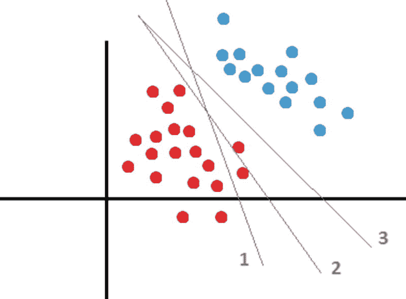

图 11-5

In the graphic, line number 1 incorrectly classifies two of the red points; therefore, we modify weights and bias to move it to the right a little bit; then classifying hyperplane 2 also makes a mistake classifying one of the red points. Finally, classifying hyperplane 3 makes no mistakes and properly divides red from blue points.

感知器算法的伪代码如下:

1.  将权重和偏差初始化为范围[0，1]内的随机值。
2.  如果满足停止条件，则结束。
3.  遍历整个训练数据集，一次一步地选取每个训练数据(x，y ), x 是特征向量，y 是其分类。
4.  为训练数据 x 计算感知器的输出 y <sub>x</sub> 。
5.  In case 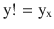 then: Correct each weight following the rule:

    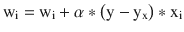

    Correct also the bias using the formula:

    

6.  转到步骤 2。

伪代码的步骤 5 包含所谓的感知器的学习规则；在算法中完成的所有学习都被封装在公式中，其中权重被修改。为了理解学习公式，让我们从零开始重新构建它。

首先，注意当 w x < 0 (where · represents the dot product , in this case the weighted sum mentioned so far) and the correct classification of x is positive, it can be geometrically interpreted as having the angle between ve ctors w and x with a value greater than 90 degrees, and consequently we would need to rotate w in x’s direction to bring it to the positive space. Equivalently, if w · x > 0 并且 x 的正确分类是负数(或者小于 0)时，那么向量 w 和 x 之间的角度小于 90 度，w 必须旋转远离 x。

Note

ab 运算代表矢量 a 和 b 之间的点积，每当 a 和 b 垂直时，ab = 0。

因此，我们已经知道，具有 w + x 或 w - x 的权重更新可以被几何地解释为在 x 的方向上或相反的方向上移动 w；此操作旨在获得训练数据 x 的正确分类。现在，为了将前面的两种情况合并为一种情况，我们将添加项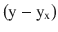作为 x 的乘数。让我们分析该项的可能值，以了解它将始终为 x 提供正确的符号。

*   如果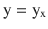那么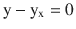，这意味着由于 x 的分类是正确的，所以权重没有变化。
*   如果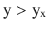那么，这暗示着重量需要增加，因为；即，我们需要增加权重，使得 w x 为我们提供更高的值，并且训练数据将其分类为 1 而不是 0。
*   如果那么，这意味着重量需要减少，因为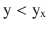。对前一点的类似解释。

因此，我们现在将更新规则调整为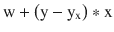，我们得出结论，我们将把最后一项乘以α，α是一个在(0，1)范围内的值，称为学习率。

学习率控制着感知机学习的速度，或者说，我们在每一步改变多少权重和偏差。从几何的角度来看，可以看出我们将 w 向量朝向或远离训练数据向量 x 旋转了多少。为了保证收敛并且不跳过问题的解，我们必须为学习速率选择小的值；通常选择 0.05。

使用类似的方法，我们可以推导出更新偏差的公式，但这留给读者作为练习。

### 实际问题:实现感知器神经网络

为了在 C#中实现感知器，我们将创建一个名为`SingleNeuralNetwork`的抽象类，它将允许我们轻松地开发感知器以及我们需要实现的任何单单元神经网络，因为它们在结构上共享相似的特性，并且仅在学习规则上发生显著的变化。这个类如清单 [11-1](#Par40) 所示。

```py
public abstract class SingleNeuralNetwork
    {
        public List<TrainingSample>TrainingSamples{ get; set; }
        public int Inputs { get; set; }
        public List<double> Weights { get; set; }
        public readonly Random Random = new Random();
        protected readonly double LearningRate;
        protected double Bias= 0.5;

        protected SingleNeuralNetwork(IEnumerable<TrainingSample>trainingSamples, int inputs, double learningRate)
        {
TrainingSamples = new List<TrainingSample>(trainingSamples);
            Inputs = inputs;
            Weights = new List<double>();
            for (vari = 0; i< Inputs; i++)
Weights.Add(Random.NextDouble());
LearningRate = learningRate;
        }

        public virtual void Training()
        {
        }

        public virtual double Predict(double[] features) 

        {
var result = 0.0;

            for (vari = 0; i<features.Length; i++)
                result += features[i] * Weights[i];

            return result > -Bias ?1 : 0;
        }

        public List<double>PredictSet(IEnumerable<double[]> objects)
        {
var result = new List<double>();

foreach (varobj in objects)
result.Add(Predict(obj));

            return result;
        }
    }

Listing 11-1SingleNeuralNetwork Abstract Class

```

该类包含以下字段或属性:

*   这是在 SVM 章节中使用的同一个类；它包含表示训练数据的特征向量(双精度值)和定义该训练数据的正确分类的整数。
*   `Inputs`:表示感知器输入数量的整数
*   `Weights`:表示单个单元 NN 的权重向量的双值列表
*   `Random`:用于获取随机值的字段
*   `LearningRate`:感知器的学习率
*   `Threshold`:感知器的阈值；初始值设定为 0.5

在类构造函数中，我们将权重初始化为范围[0，1]内的随机值；该构造函数后跟一组方法，下面详细介绍了这些方法:

*   `Training()`:从`SingleNeuralNetwork`继承的每个类将实现的虚拟方法，以便提供训练算法实现。我们将它标记为虚拟的而不是抽象的，因为我们正在考虑这样一种情况，即您不希望包含单单元 NN 的训练方法，而只是使用它所包含的字段和属性。
*   `Predict()`:计算加权和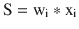并检查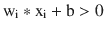或等效的
*   `PredictSet()`:使用前面的方法，预测作为参数提交的列表中每个数据的分类

请记住，感知器的目标是找到一个分类超平面，将数据点集划分为 A 类和 B 类。这种划分必须保证 A 类的每个元素都位于超平面的一侧，B 类的每个元素都位于另一侧。这个超平面将满足(正如它在第九章中所做的)方程式 wx + b = 0。因此，在`Predict()`方法中，我们将 wx + b > 0 的任何数据点 x 分类为属于类 1；否则，我们将其设置为类 0 的成员。

最后，清单 [11-2](#Par54) 展示了从`SingleNeuralNetwork`抽象类继承而来的`Perceptron`类。

```py
public class Perceptron :SingleNeuralNetwork
    {
        public Perceptron(IEnumerable<TrainingSample>trainingSamples, int inputs, double learningRate)
            : base(trainingSamples, inputs, learningRate)
        { }

        public override void Training()
        {
            while (true)
            {
varmissclasification = false;

foreach (vartrainingSample in TrainingSamples)
                {
var output = Predict(trainingSample.Features);
var features = trainingSample.Features;
                    if (output != trainingSample.Classification)
                    {
missclasification = true;
                        for (var j = 0; j < Inputs; j++)
                            Weights[j] += LearningRate*(trainingSample.Classification - output)*features[j];
Bias+= LearningRate * (trainingSample.Classification - output);
                    }
                }

                if (!missclasification)
                    break; 

            }
        }
    }

Listing 11-2Perceptron Class

```

正如我们所看到的，`Perceptron`类中的`Training()`方法的实现几乎是前面详述的伪代码的直接翻译。

为了测试我们的算法，我们将使用清单 [11-3](#Par57) 中的代码创建一个控制台应用。

```py
vartrainingSamples = new List<TrainingSample>
                                      {
new TrainingSample(new double[] {1, 1}, 0, new List<double> { 0 } ),
new TrainingSample(new double[] {1, 0}, 0, new List<double> { 0 } ),
new TrainingSample(new double[] {0, 1}, 0, new List<double> { 0 } ),
                                     new TrainingSample(new double[] {0, 0}, 0, new List<double> { 0 } ),
                                     new TrainingSample(new double[] {1, 2}, 1, new List<double> { 0 } ),
                                     new TrainingSample(new double[] {2, 2}, 1, new List<double> { 1 } ),
                                     new TrainingSample(new double[] {2, 3}, 1, new List<double> { 1 } ),
                                     new TrainingSample(new double[] {0, 3}, 1, new List<double> { 1 } ),
                                     new TrainingSample(new double[] {0, 2}, 1, new List<double> { 1 } ),};

var perceptron = new Perceptron(trainingSamples, 2, 0.01);
perceptron.Training();

vartoPredict = new List<double[]>
                              {
                                  new double[] {1, 1},
                                  new double[] {1, 0},
                                  new double[] {0, 0},
                                  new double[] {0, 1},
                                  new double[] {2, 0},
new[] {2.5, 2},
new[] {0.5, 1.5},
                              };

var predictions = perceptron.PredictSet(toPredict); 

            for (vari = 0; i<predictions.Count; i++)
Console.WriteLine("Data: ( {0} , {1} ) Classified as: {2}", toPredict[i][0], toPredict[i][1], predictions[i]);

Listing 11-3Testing the Perceptron Class in a Console Application

```

执行清单 [11-3](#Par57) 中的代码后得到的结果如图 [11-6](#Fig6) 所示。


图 11-6

Classification outputted by our Perceptron, considering the data set defined in Listing [11-3](#Par57)

在实现神经网络或任何监督学习方法时，请始终记住，训练数据集越大，算法从训练集中定义的表格函数到使用权重向量和偏差构建的表格函数的逼近或映射就越好。在清单 [11-3](#Par57) 中，我们的训练数据集非常小，因此感知器很可能在新输入的数据上犯分类错误。在这个示例中没有发生这种情况，但是当添加的数据与这个小型训练集中的数据类型有很大差异时，可能会发生这种情况。

### Adaline 和梯度下降搜索

Adaline(自适应线性神经元)是 Bernard Widrow 在 1960 年提出的一种神经网络模型，其网络结构与感知器的网络结构相同。感知器和 Adaline 的区别在于使用的学习规则。Adaline 算法使用的学习规则有几个名称:Delta 规则、梯度下降或最小均方(LMS)。这种学习规则通常包含在多层网络中，尤其是反向传播算法中。因此，Adaline 很好地介绍了多层网络和流行的反向传播算法。

Delta 规则的主要思想是最小化当分类训练数据 x:

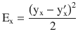

时执行的平方误差

在这种情况下，y <sub>x</sub> 是训练数据 x 的正确分类，y’<sub>x</sub>是 NN 输出的分类。

Adaline 是非阈值神经网络，这意味着它在学习阶段不考虑偏差或阈值。因此，在训练期间，其输出(对于数据点 x)被简单地计算为 w <sub>i</sub> x <sub>i</sub> 的和。为了在对训练数据 x 进行分类时实现平方误差的最小化，该算法依赖于这样一个事实，即函数的梯度(由所有偏导数形成的向量)指示 E 最陡增加的方向(图 [11-7](#Fig7) )。因此，通过将梯度乘以-1，我们将从任意点获得 E 的最陡衰减的方向，这将使我们实现最小误差。


图 11-7

The gradient denotes the direction of maximum increment of a function; its negation (blue arrow) indicates the direction of maximum decrement

因此，Adaline 的训练方法是一种梯度下降搜索(GDS)算法，该算法通过最小化全局误差 E 来确定最佳权重向量(记住 E <sub>x</sub> 与仅对训练数据 x 进行分类的误差相关)。在 Adaline 中，权重向量最初将包含随机变量，然后通过采取小步骤并向下移动来修改这些权重，直到我们到达误差曲面中我们认为“可接受”的点；通常，任何训练数据点上的最大误差的小值被认为是可接受的。梯度下降搜索能够找到可微函数的全局最小值。

为了更好地理解梯度下降法，让我们通过修改下图来看看它是如何工作的(图 [11-8](#Fig8) )。此外，让我们考虑在函数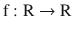中，或者一个变量 x 的函数中，用于更新梯度下降法所寻求的最小值的等式将是。

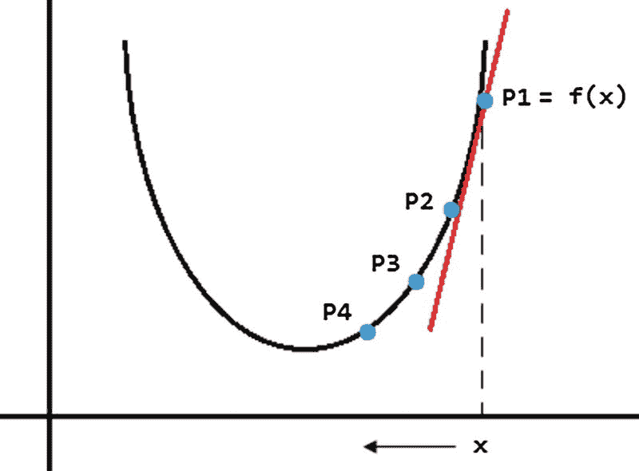

图 11-8

Functioning of the gradient descent method

在图 [11-8](#Fig8) 中，GDS 从点 p1 = f(x)开始。根据更新公式，它计算 f 在 x 点的导数并乘以学习率α。。因为导数表示 f 的斜率——在这种特殊情况下，红线是点 p1 的切线——斜率为正，那么将为正值(回想一下)。因此，x 的新值，假设它是 x’，将向左移动，并且新的 p2 = f(x’)将满足 p2 < p1。这个过程将一直持续到我们达到最小值，假设α足够小，并且在接近最小值时将采取更小的步长；换句话说，在新的迭代中，x 将缓慢地向左移动。

回到一般情况，为了找到误差的最陡下降，我们用 w(权重向量)来表示 E(对每个训练数据进行分类时所有误差的总和)。注意，根据 w 设置 E 总是可能的，因为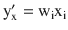对于任何给定的训练数据 x；因此，函数最小化将如下:


因此，我们将找到 E(w)的梯度——假设它是——并且我们将在 Adaline 的学习规则中考虑它，它将是如下:

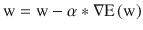

请注意，规则上的符号是减号，而不是加号。那是因为我们必须否定梯度，，以使 E(w)最小。正如之前在感知器中定义的那样，α是学习速率，它控制着我们向解决方案前进的速度。前面的公式涉及到我们更新权重向量 w 的方式，但是我们应该如何更新单个权重呢？单个权重的规则如下:


我们用它的等价物，对每个权重 w <sub>i</sub> 的偏导数，来代替梯度。在通过计算一些导数和应用链式法则来发展术语之后，我们将最终得到 GDS 的完整学习法则:


和前面一样，y <sub>j</sub> 代表训练数据 j 的正确分类，y<sub>j</sub><sup>’</sup>代表 NN 输出的分类，x <sub>ij</sub> 代表训练数据 j 的第 I 个输入值——与权重 w <sub>i</sub> 相关联的训练数据 j 的输入。

尽管从理论或数学的角度来看，GDS 是寻找函数局部最小值的一种很好的方法，但实际上它往往非常慢。请注意，要更新单个权重，您需要检查整个训练数据集，其中可能包含数万个训练示例，因此这意味着大量的计算。因此，出于这个实际原因，我们通常使用 GDS 的近似变体作为 Adaline 的学习规则；下一节将介绍这种变体。

### 随机逼近

随机梯度下降(SGD)或递增梯度下降是对 GDS 的补充的近似过程，其中在计算每个训练数据的误差之后递增地更新权重。因此，它将我们从必须循环整个训练数据集以计算每个权重值的计算麻烦中解救出来。实际上，这是 Adaline 和其他 NN 算法(反向传播)中使用的方法，通过考虑训练数据的正确分类及其在 NN 中的输出来最小化平方误差。使用随机近似的学习规则被称为 Delta 规则、Adaline 规则或 Widrow-Hoff 规则(以其创造者命名)。在图 [11-9](#Fig9) 中，我们可以非常直观地看到 GDS 和新加坡元之间的差异。在第一种情况下，我们直接移动到误差面的最小值，因此我们沿着一条直线前进，而在第二种情况下，我们像醉汉一样移动；有时我们会失去平衡，移动到不正确的位置，但最终我们会和 GDS 站在同一个点上。

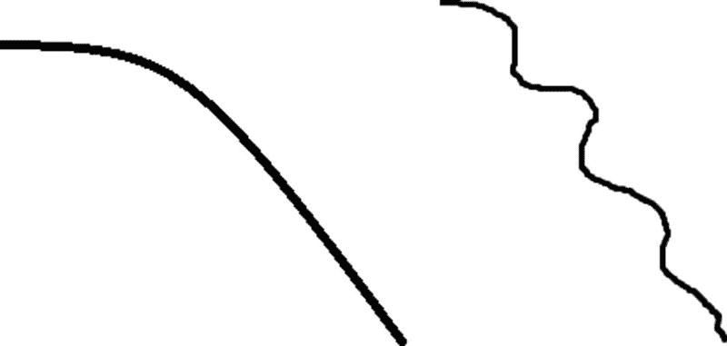

图 11-9

To the left the direct path that GDS would follow over the error surface to get to a minimum; to the right the “unbalanced” path followed by SGD

使用 SGD 的更新规则如下:

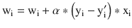

注意这个学习规则和之前描述的感知器规则之间的相似性——看起来非常相似。主要区别是什么？主要区别在于训练时神经网络的输出。在 Adaline 中，我们不考虑任何阈值或激活函数；因此，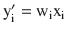。

Note

当您在多层网络中组合几个 adaline 时，您将获得所谓的 Madaline。

### 实际问题:实现 Adaline 神经网络

在研究了 Adaline 算法背后的理论之后，是时候用 C#最终实现这个过程了。为此，我们将创建类`Adaline`，如清单 [11-4](#Par78) 所示。

```py
public class Adaline :SingleNeuralNetwork
    {
        public Adaline(IEnumerable<TrainingSample>trainingSamples, int inputs, double learningRate)
            : base(trainingSamples, inputs, learningRate)
        { }

public override void Training()
        {
            double error;

            do
            {
                error = 0.0;

foreach (vartrainingSample in TrainingSamples)
                {
var output = LinearFunction(trainingSample.Features);
varerrorT = Math.Pow(trainingSample.Classification - output, 2);

                    if (Math.Abs(errorT) < 0.001)
                        continue;

                    for (var j = 0; j < Inputs; j++)
                        Weights[j] +=  LearningRate * (trainingSample.Classification - output) * trainingSample.Features[j];

error = Math.Max(error, Math.Abs(errorT));
}
            }
            while (error > 0.25);
        }

        public double LinearFunction(double [] values)
        {
var summation = (from i in Enumerable.Range(0, Weights.Count)
                        select Weights[i]*values[i]).Sum();
            return summation;
        }

        public override double Predict(double[] features)
        {
            return LinearFunction(features) >0.5 ?1 : 0;
        }
    }

Listing 11-4
Adaline Class

```

这个类继承自`SingleNeuralNetwork`，包含三个方法。第二种方法是`LinearFunction()`，简单计算加权和 w <sub>i</sub> x <sub>i</sub> 。请记住，在 Adaline 中，预测阶段和训练阶段是不同的。在训练或学习阶段，我们将神经网络的输出计算为加权和，但在预测阶段，我们必须使用分类函数来分类新的输入数据；因此，预测函数不同于学习函数。在这种情况下，我们的预测函数计算新数据的加权和，并根据加权和的结果输出大于 0.5 还是小于 0 的值来输出 1 或 0。

`Training()`方法由一个`do ... while()`语句组成，其中我们验证在对任何训练数据进行分类时所执行的最大误差是否超过 0.25。如果是，循环将继续；否则，我们将认为自己是满意的，该方法将结束。此外，如果分类训练数据时的误差低于 0.001，我们将不会改变权重。在图 [11-10](#Fig10) 中，我们可以看到在一小组数据上执行 Adaline 后得到的结果。


图 11-10

Result obtained after executing our Adaline on a small data set

如果我们对算法的功能感到好奇，我们可以在`while (error > 0.25);`行设置一个断点，然后看看最大误差在每次迭代后是如何减小的。以下值是当我们在感知器实现中使用的相同训练数据集上执行 Adaline 时在一系列迭代中获得的值:3.2386、1.7957、1.0569、0.6973、0.5822、0.5050、0.4523、0.4144、0.3861、0.3640、0.3463、0.3315、0.3189、0.3077

### 多层网络

多层网络是一种神经网络，其中多个神经网络按层分组，并从一层连接到另一层。到目前为止，我们描述的神经网络(感知器、Adaline)由两层构成:多节点的输入层和单节点的输出层。图 [11-11](#Fig11) 所示的多层神经网络由三层组成:输入、隐藏和输出。也是前馈 NN；换句话说，所有信号都是从一层的节点传递到下一层的节点。因此，多层神经网络是通过将许多排列成层的简单“神经元”放在一起，并将一个神经元的输出作为下一层中另一个神经元的输入来构建的。

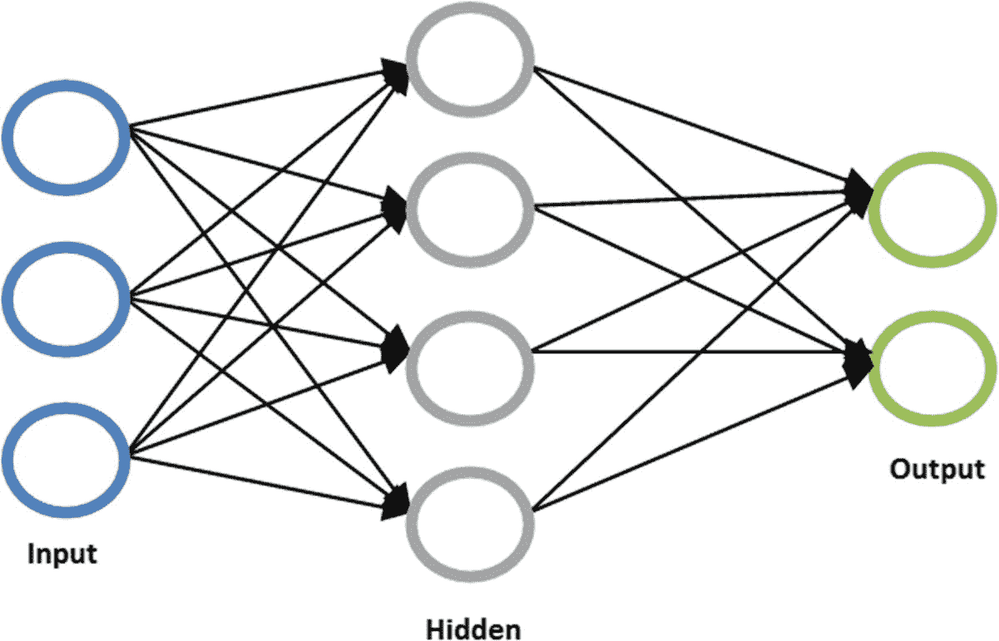

图 11-11

Multi-layer, feed-forward, fully connected NN consisting of three layers : one for input units, one for hidden units (gray) and one for output units (green). Sometimes the input layer is not considered as a layer.

除了从训练数据的成分(xi)接收其输入的输入层之外，所有其他层都从前一层的激活函数接收其输入。多层神经网络中的每条边代表一个权重，离开一个节点的任何边的权重值乘以它所源自的节点的激活函数值。因此，来自层 L 的任何节点，其中 L > 0(不是输入层)，其输入或激活值计算如下:


其中 n 是层 L - 1 中单元的总数，A <sub>l，i</sub> 表示层 L 中单元 I 的激活值，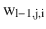是从层 L-1 的单元 j 到层 L 的单元 I 的权重或边，g 是在 NN 中应用的激活函数。通常，g 被选择为技术上的逻辑 sigmoid 函数，其值在区间[0，1]内，并且其计算如下:


sigmoid 函数的一个非常重要的性质是它是可微的和连续的；记住这个性质对我们很重要，因为我们要计算梯度和导数。

多层神经网络的一个关键要素是它们能够对非线性可分离数据集进行分类。因此，像 XOR(图 [11-12](#Fig12) )这样不能被线性神经网络(如感知器)分类的函数，可以被只包含一个隐藏层的简单多层神经网络正确分类。

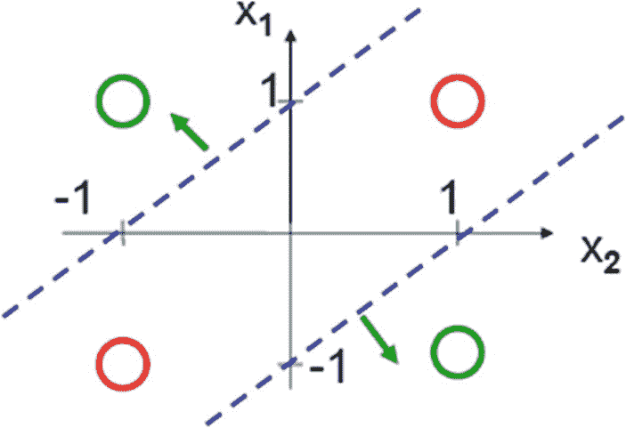

图 11-12

XOR function ; there’s no line that would divide the red points from the green points

我们可以将多层神经网络视为强大的数学函数，能够逼近训练数据集上的任何表格函数。每个隐藏层代表一个函数，层的组合在数学上可以看做函数的组合。因此，具有 n 个隐藏层可以被视为具有数学函数 o(h1，h2 ( … hn(i(x)) …))，其中 o 是输出层，I 是输入层，hi 是隐藏层。

传统的神经网络只有一个隐藏层，当它们有不止一层时，我们就在处理深度神经网络和深度学习。表 [11-1](#Tab1) 说明了隐藏层数和结果神经网络容量之间的关系。

表 11-1

Relationship Between Number of Layers and Power of NNs

<colgroup><col align="left"> <col align="left"></colgroup> 
| 隐藏层数 | 结果 |
| :-- | :-- |
| 没有人 | 只能表示线性可分函数或决策 |
| one | 可以逼近包含从一个有限空间到另一个空间的连续映射的任何函数 |
| Two | 可以用有理激活函数以任意精度表示任意决策边界，并且可以以任意精度近似任意平滑映射 |
| >2 | 附加层可以学习复杂的表示(自动特征工程的一种)。 |

已经证明，具有单个隐藏层的多层神经网络能够学习任何函数。因此，有人可能会问这样一个问题，如果用一个隐藏层我们就可以学习任何功能，那么我们为什么需要深度学习呢？其思想是，虽然通用逼近定理证明，事实上，有一个单一的隐藏层就足以学习任何连续函数，它并没有说明完成这种学习有多容易。因此，出于效率和准确性的原因，我们可能需要增加我们的神经网络结构的复杂性，并包括额外的隐藏层，以便在适当的时间内获得适当的解决方案。

在决定我们的神经网络结构时，隐藏层中神经元的数量是另一个需要考虑的重要问题。尽管这些层不直接与外部环境交互，但它们确实对最终输出有显著影响。隐藏层的数量和隐藏层中神经元的数量都必须仔细考虑。

在隐藏层中使用太少的神经元会导致所谓的欠拟合。当隐藏层中的神经元太少，无法有效地感知复杂数据集中的信号时，就会发生欠拟合。在隐藏层中使用太多的神经元会导致几个问题，其中最著名的是过拟合，或者当权重调整得太适合训练数据集时，结果 NN 不能正确地预测新的输入数据。

Note

普适逼近定理指出，一个包含有限个神经元的单隐层前馈网络可以逼近任何连续函数；这使得神经网络被认为是通用近似。

### 反向传播算法

如同在自适应神经网络中发生的那样，使用反向传播的多层神经网络通常依赖于梯度下降法，更具体地说，依赖于随机梯度近似法来调整神经网络的权重。他们还寻求实现与 Adaline 算法相同的目标——最小化数据的真实分类和网络输出之间的二次差误差。

反向传播算法的思想是，它作为一种机制，将发生在输出层的错误传输到最终的隐藏层(在途中调整权重)，并从那里向后传输到前一个隐藏层，以此类推；换句话说，如果 o 是输出层，h <sub>1</sub> ，h <sub>2</sub> ，…，h <sub>n</sub> 表示隐藏层，那么反向传播算法从输出层继续误差(相当于调整权重或最小化误差)，从 o 到 h <sub>n</sub> ，然后从 h <sub>n</sub> 到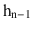，等等，直到误差调整过程到达 h <sub>1</sub> 。这种功能证明了反向传播这一名称的正确性，因为输出是从输入层开始计算的，经过 h <sub>1</sub> ，h <sub>2</sub> ，…，h <sub>n</sub> 层并在输出层结束，然后，一旦获得了输出，就将权重从输出层向后调整到第一个隐藏层。

如前所述，反向传播算法依赖于梯度下降法，Adaline 法也是如此。这两个过程之间的第一个区别是，对于 Adaline，我们只有一个输出节点，但在多层神经网络中，因此在反向传播中，我们可以处理排列在一个输出层中的多个输出节点；因此，总误差必须计算如下:

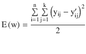

其中 n 是训练数据集的基数，k 是输出层中的单元数，y <sub>ij</sub> 在输出层的节点和位置 j 处的训练数据 I 的正确分类，以及 y’<sub>ij</sub>在我们的 NN 的输出层中的节点 j 处为训练数据 I 输出的分类。

反向传播过程中每个节点的学习规则类似于感知器和 Adaline。根据随机近似，规则如下:


在这种情况下，w <sub>ij</sub> 表示从节点 I 到节点 j 的权重，α是学习率，x <sub>ij</sub> 是从节点 I 到节点 j 的激活值(在输入层中，这些值与输入值一致)，δ <sub>j</sub> 是节点 j 处的误差。之前描述的学习规则没有像现在反向传播算法的权重更新规则中那样具有两个子指标(w <sub>ij</sub> )。让我们回忆一下，反向传播是为了在多层神经网络上工作；因此，我们将有许多节点连接到其他节点，因此每个边 ij 都有一个相关的 w <sub>ij</sub> 。

因此，我们最初拥有权重更新公式中的每个变量，除了δ<sub>j</sub>；这一项表示分类的误差，并且是我们需要对权重进行求导以找到梯度的项，结果是在误差表面中相对于 w 的最陡下降。正如随机逼近所做的，我们一次迭代一个训练数据，这证明了


其中 E <sub>d</sub> 是与分类训练数据 d 相关联的误差，w <sub>ij</sub> 是与单元 j 相关联的权重。我们知道全局误差 E(w)的公式，但这不是我们推导出的最小化 w 的公式。请记住，随机逼近一次对一个训练数据起作用；因此，我们推导出以下等式:


在这种情况下，k 是输出层中的节点总数，y <sub>j</sub> 是节点 j 的正确分类，y’<sub>j</sub>是我们的 NN 输出的值。应用链式法则并考虑计算误差项的节点是输出或隐藏单元的情况，我们可以得出以下公式:

*   For nodes in the output layer,

    

    This implies,

    

*   For nodes in the hidden layers,

    

    Stream, in this case, is the set of nodes whose inputs correspond to the output of node j. The previous formula implies that

    

注意，获得的权重更新公式假设我们具有 sigmoid 单元；换句话说，我们使用 sigmoid 函数作为神经网络每个节点的激活函数。分别用于输出层和隐藏层的权重更新规则的一般形式如下:

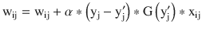


其中 G(y<sub>j</sub><sup>′</sup>)表示在激活输出的值处评估的激活函数的导数，因为我们知道该值可以用 w 来表示。这非常容易计算和处理，并且是 sigmoid 函数是多层神经网络的经典激活函数的主要原因之一。

图 [11-13](#Fig13) 展示了另一个流行的激活函数，双曲正切，一个输出在[-1；1]并且表示和计算如下:

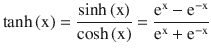

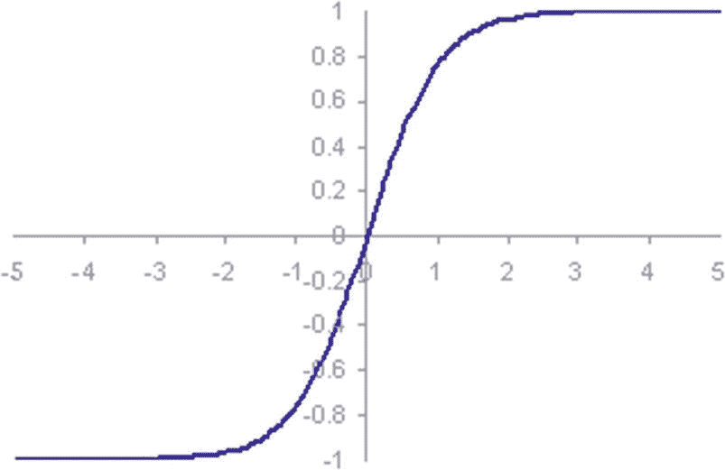

图 11-13

Hyperbolic tangent function , which outputs values in the range (-1;1)

如今，取代 sigmoid 函数和其他类似平滑函数的一个流行的激活函数是整流线性单元，或 ReLU(图 [11-14](#Fig14) )。与 sigmoid 和 smooth functions 不同，ReLU 没有深度学习中出现的消失梯度问题的缺点，例如在训练超过三层的 NN 时。它的方程式极其简单:

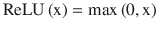

换句话说，ReLUs 让所有正值不变地通过，而只是将任何负值设置为 0。虽然更新的激活功能正在获得牵引力，但最近大多数深度神经网络都使用 ReLU 或其密切相关的变体之一。

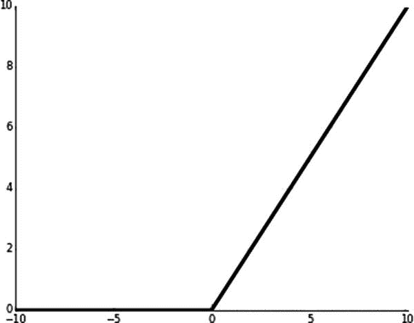

图 11-14

ReLU function

为了更好地理解反向传播算法中的反向流动以及变量所在的节点或边，让我们来看看图 [11-15](#Fig15) 。

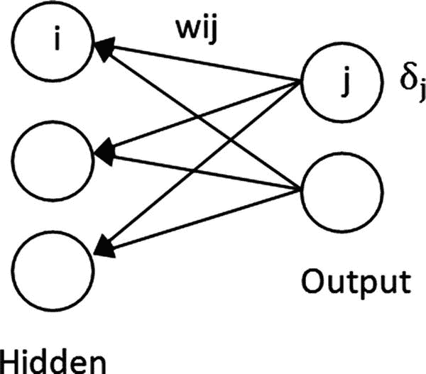

图 11-15

Flow backward in the backpropagation algorithm. Weight wij is updated by considering the error term residing in node j.

现在我们已经有了关于反向传播算法功能的理论背景，在下一节中，我们将实现一个代表多层神经网络的`MultiLayerNetwork`类，我们将开发我们的反向传播算法作为该类的一个方法。

### 实际问题:实现反向传播&解决异或问题

为了正确编码多层 NN 范式，我们将创建清单 [11-5](#Par110) 中所示的类。我们还将应用一种面向对象的方法来包含一个`Layer`类，用于表示排列为 sigmoid 单元列表的所有节点。

```py
public class MultiLayerNetwork
    {
        public List<Layer> Layers { get; set; }
        public List<TrainingSample>TrainingSamples{ get; set; }
        public intHiddenUnits{ get; set; }
        public intOutputUnits{ get; set; }
        public double LearningRate{ get; set; }
        private double _maxError;

        public MultiLayerNetwork(IEnumerable<TrainingSample>trainingSamples, int inputs, inthiddenUnits, int outputs, double learningRate)
        {
            Layers = new List<Layer>();
TrainingSamples = new List<TrainingSample>(trainingSamples);
LearningRate = learningRate;
HiddenUnits = hiddenUnits;
OutputUnits = outputs;

CreateLayers(inputs);
        }

private void CreateLayers(int inputs)
        {
Layers.Add(new Layer(HiddenUnits, TrainingSamples, LearningRate, inputs, TypeofLayer.Hidden));
Layers.Add(new Layer(OutputUnits, TrainingSamples, LearningRate, HiddenUnits, TypeofLayer.OutPut));
        }

        public List<double>PredictSet(IEnumerable<double[]> objects)
        {
var result = new List<double>();

foreach (varobj in objects)
result.Add(Predict(obj));

            return result;
        }

        public Layer OutPutLayer
        {
            get { returnLayers.Last(); }
        }

        public Layer HiddenLayer
        {
            get { returnLayers.First(); }
        }
    }

public class Layer

    {
        public List<SigmoidUnit> Units { get; set; }
        public TypeofLayer Type { get; set; }

        public Layer(int number, List<TrainingSample>trainingSamples, double learningRate, int inputs, TypeofLayertypeofLayer)
        {
            Units = new List<SigmoidUnit>();
            Type = typeofLayer;
            for (vari = 0; i< number; i++)
Units.Add(new SigmoidUnit(trainingSamples, inputs, learningRate));
        }
    }

    public enumTypeofLayer
    {
        Hidden, OutPut
    }

Listing 11-5MultiLayerNetwork and Layer Classes

```

`Layer`类包含两个属性，一个是`SigmoidUnit`的`List`(我们将很快研究这个类)，另一个是`TypeofLayer Type`，它是一个具有两个可能值的枚举:`Hidden`和`OutPut`。在类构造函数中，我们简单地添加尽可能多的节点到层中，就像`number`参数指定的那样。在`MultiLayerNetwork`类中，我们包含了获取`HiddenLayer`的属性，或者，如果有一个以上的属性，则包含第一个隐藏层和`OutputLayer`。

`MultiLayerNetwork`类的构造函数接收训练数据集、输入、隐藏节点和输出的数量作为参数；和学习率。它通过调用`CreateLayers()`方法创建一组层。最后，`PredictSet()`方法预测或分类作为自变量接收的一组数据。该类还包括一些属性或字段，其中大部分是自描述的。`_maxError`字段将用于指示在反向传播算法的迭代或时期中对任何训练数据进行分类时的最大误差。

Note

神经网络学习算法中的一次迭代通常被称为一个时期。

`SigmoidUnit`类继承自`SingleNeuralNetwork`，代码非常简单(清单 [11-6](#Par115) )。它仅仅覆盖了使用输入数据和权重向量的特征来计算 sigmoid 函数的值的`Predict()`方法。

```py
public class SigmoidUnit :SingleNeuralNetwork
    {
        public double ActivationValue{ get; set; }
        public double ErrorTerm{ get; set; }

        public SigmoidUnit(IEnumerable<TrainingSample>trainingSamples, int inputs, double learningRate)
            : base(trainingSamples, inputs, learningRate)
        { }

        public override double Predict(double [] features)
        {
var result = 0.0;

            for (vari = 0; i<features.Length; i++)
                result += features[i] * Weights[i];

            return ActivationValue = 1/(1 + Math.Pow(Math.E, -result));
        }
    }

Listing 11-6SigmoidUnit Class, Which Inherits from the SingleNeuralNetwork Abstract Class

```

清单 [11-7](#Par117) 展示了代表反向传播算法的`Training()`方法。在这种方法中，我们迭代训练数据集，直到预测任何训练数据时的最大误差小于 0.001。我们预测神经网络的输出，因为我们使用了`SigmoidUnit`节点，结果值将被存储在公共属性`ActivationValue`中，如清单 [11-8](#Par119) 所示。一旦计算出这个值，我们就在输出单元上循环，计算它们的误差项，然后在隐藏层的节点上循环，也计算它们的误差项。回想一下上一节，他们的计算是不同的。在`UpdateWeight()`方法中，我们更新权重，在循环结束时，我们更新分类任何训练数据时的最大误差。

```py
        public void Training()
        {
            _maxError = double.MaxValue;

            while (Math.Abs(_maxError) > .001)
            {
foreach (vartrainingSample in TrainingSamples)
                {
Predict(trainingSample.Features);

                    // Error term for output layer ...
                    for (vari = 0; i<OutPutLayer.Units.Count; i++)
                    {
OutPutLayer.Units[i].ErrorTerm = FunctionDerivative(OutPutLayer.Units[i].ActivationValue, TypeFunction.Sigmoid) *
                                         (trainingSample.Classifications[i] - OutPutLayer.Units[i].ActivationValue);
 }

                    // Error term for hidden layer ...
                    for (vari = 0; i<HiddenLayer.Units.Count; i++)

                    {
varoutputUnitWeights = OutPutLayer.Units.Select(u =>u.Weights[i]).ToList();
var product = (from j in Enumerable.Range(0, outputUnitWeights.Count)
                                       select outputUnitWeights[j]*OutPutLayer.Units[j].ErrorTerm).Sum();
HiddenLayer.Units[i].ErrorTerm = FunctionDerivative(HiddenLayer.Units[i].ActivationValue, TypeFunction.Sigmoid) * product;
                   }

UpdateWeight(trainingSample.Features, OutPutLayer);
UpdateWeight(trainingSample.Features, HiddenLayer);
_maxError = OutPutLayer.Units.Max(u =>Math.Abs(u.ErrorTerm));
            }
        }

Listing 11-7Training() Method Representing Backpropagation Algorithm

```

为了使我们的方法尽可能灵活，并且容易与不同的激活函数交互，我们编写了`FunctionDerivative()`方法(清单 [11-8](#Par119) ，它接收一个激活值和一个函数类型(编码为 enum ),并输出激活函数在激活值处的导数。

```py
private double FunctionDerivative(double v, TypeFunctionfunction)

        {
            switch (function)
            {
                case TypeFunction.Sigmoid:
                    return v*(1 - v);
                case TypeFunction.Tanh:
                    return 1 - Math.Pow(v, 2);
                case TypeFunction.ReLu:
                    return Math.Max(0, v);
                default:
                    return 0;
            }
        }

public enumTypeFunction
    {
 Sigmoid, Tanh, ReLu
    }

Listing 11-8FunctionDerivative() Method and Enum Declaration with Activation Functions Previously Mentioned

```

通过将前面的方法与下面的`SigmoidUnit`类(如清单 [11-6](#Par115) 所示)的兄弟类(清单 [11-9](#Par121) )相结合，我们可以毫不费力地将我们的模型从一种类型的单元(Sigmoid，Tanh，ReLU)更改为另一种，并尝试不同类型的激活函数。

```py
public class TanhUnit :SingleNeuralNetwork
    {
        public double ActivationValue{ get; set; }
        public double ErrorTerm{ get; set; }

        public TanhUnit(IEnumerable<TrainingSample>trainingSamples, int inputs, double learningRate)
            : base(trainingSamples, inputs, learningRate)
        { }

        public override double Predict(double [] features)
        {
var result = 0.0;

            for (vari = 0; i<features.Length; i++)
                result += features[i] * Weights[i];

ActivationValue = Math.Tanh(result);
            return ActivationValue;
        }
    }

public class ReLu :SingleNeuralNetwork
    {
        public double ActivationValue{ get; set; }
        public double ErrorTerm{ get; set; }

        public ReLu(IEnumerable<TrainingSample>trainingSamples, int inputs, double learningRate)
            : base(trainingSamples, inputs, learningRate)
        { }

        public override double Predict(double [] features)
        {
var result = 0.0;

            for (vari = 0; i<features.Length; i++)
                result += features[i] * Weights[i];

            return Math.Max(0, result);
        }
    }

Listing 11-9
Hyperbolic Tangent and ReLU Units

```

请注意，所有的“单元”类都可以根据所使用的层次模型进行更好的分组。例如，所有的类都包含一个`ActivationValue`和`ErrorTerm`属性，它们可以被封装在一个更高的类中，结果我们会得到一个更好的类设计。这个面向对象的设计任务将留给读者。

`UpdateWeight()`方法(清单 [11-10](#Par124) )是上一节中给出的权重更新规则的直接翻译。这个方法使用我们在`SigmoidUnit`类中包含的`ErrorTerm`公共属性来存储神经网络每个节点的误差。

```py
        private void UpdateWeight(double[] features, Layer layer)
        {
varactivationValues =
layer.Type == TypeofLayer.Hidden ? features : HiddenLayer.Units.Select(u =>u.ActivationValue).ToArray();

foreach (var unit in layer.Units)
            {
                for (vari = 0; i<unit.Weights.Count; i++)
unit.Weights[i] += LearningRate * unit.ErrorTerm * activationValues[i];
            }

        }

Listing 11-10
UpdateWeight() Method

```

最后，为了在多层 NN 中对新输入的数据进行预测和分类，我们编写了`Predict()`方法(列表 [11-11](#Par126) )，该方法从每层的节点计算激活值，以前馈方式从输入节点开始，直到到达输出层。然后，为了输出分类，它考虑输出层的一组值，或者输出映射到一组值(在这种情况下为 0，1，取决于输出值是否大于 0.5)的分类，或者简单地输出输出层中具有最高值的节点的索引；这分别是`ReturnIndexByHalf()`和`ReturnIndexByMax()`方法的目的，也在清单 [11-11](#Par126) 中进行了说明。请注意，第一种方法是这样开发的，它考虑一个具有单个节点输出层的神经网络。

```py
        public double Predict(double[] features)
        {
            for (vari = 0; i<Layers.Count; i++)
            {
foreach (var unit in Layers[i].Units)
                {
varactivationValues =
i ==  0 ? features : HiddenLayer.Units.Select(u =>u.ActivationValue).ToArray();

unit.Predict(activationValues);
                }
            }

            return ReturnIndexByHalf();
        }

        private intReturnIndexByHalf()
        {
var unit = OutPutLayer.Units.First();
            return unit.ActivationValue< 0.5 ? 0 : 1;
        }

        private intReturnIndexByMax()
        {
var max = OutPutLayer.Units.Max(u =>u.ActivationValue);
            return OutPutLayer.Units.FindIndex(0, unit =>unit.ActivationValue == max);
        }

Listing 11-11
Classification-related Methods

```

为了测试我们的多层神经网络，我们将看到它如何通过具有由三个节点的隐藏层和单个节点的输出层组成的神经网络结构来正确地分类来自 XOR 问题的数据。我们还将对我们的`TrainingSample`类做一些修改，以考虑训练数据可能有一个分类向量而不是单一值的情况。分类向量可以是二进制的；例如，(1，0，0)可以指示与其相关联的训练数据将被分类为红色而不是绿色或蓝色。

清单 [11-12](#Par129) 中展示了新的`TrainingSample`类和测试 XOR 问题多层 NN 的设置。

```py
public class TrainingSample
    {
        public int Classification { get; set; }
        public List<double> Classifications { get; set; }
        public double[] Features { get; set; }

        public TrainingSample(double [] features, int classification, IEnumerable<double>clasifications = null )
        {
            Features = new double[features.Length];
Array.Copy(features, Features, features.Length);
            Classification = classification;
            if (clasifications != null)
                Classifications = new List<double>(clasifications);
        }
    }

vartrainingSamplesXor = new List<TrainingSample>
                                      {
                                          new TrainingSample(new double[] {0, 0}, -1, new List<double> { 0 } ),
                                          new TrainingSample(new double[] {1, 1}, -1, new List<double> { 0 } ),
                                          new TrainingSample(new double[] {0, 1}, -1, new List<double> { 1 } ),
                                          new TrainingSample(new double[] {1, 0}, -1, new List<double> { 1 } ),
                                      };

var multilayer = new MultiLayerNetwork(trainingSamplesXor, 2, 3, 1, 0.01);
vartoPredict = new List<double[]>

                              {
                                  new double[] {1, 1},
                                  new double[] {1, 0},
                                  new double[] {0, 0},
                                  new double[] {0, 1},
                                  new double[] {2, 0},
new[] {2.5, 2},
new[] {0.5, 1.5},
                              };

var predictions = multilayer.PredictSet(toPredict);

            for (vari = 0; i<predictions.Count; i++)
Console.WriteLine("Data: ( {0} , {1} ) Classified as: {2}", toPredict[i][0], toPredict[i][1], predictions[i]);

Listing 11-12Slight Modification to TrainingSample Class

and Setting Up for Testing Our MultiLayerNetwork Class for the XOR Problem

```

在 C#控制台应用中执行清单 [11-12](#Par129) 中的代码后得到的结果如图 [11-16](#Fig16) 所示。

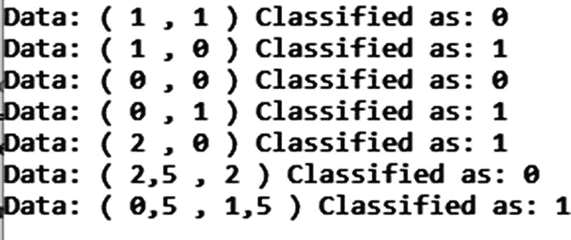

图 11-16

Result obtained after executing the code from Listing [11-12](#Par129)

到目前为止，我们已经检查了不同的神经网络模型；我们研究了感知器模型，它不能区分两个以上的类不能被超平面分开的情况。我们知道 Adalines 基于梯度下降搜索方法，这允许它们区分非线性可分离数据集，并且它们的学习规则充当反向传播算法的学习范例。最后，我们学习了多层神经网络，它使用多层结构，模拟数学函数的组成，被认为是通用近似器。在下一章中，我们将研究神经网络的一个非常有趣的应用，在这个应用中，人工智能将能够理解我们的手写数字；这种应用被称为手写数字识别。

## 摘要

在这一章中，我们研究了人工神经网络，这是一种强大的人工智能设备，能够通过学习从带标签的训练数据集获得的模式以及通过逼近训练数据集表示的表格函数来解决多个问题。我们描述了学习的核心是如何与优化问题高度相关的，因为它可以被看作是做一些任务的持续改进。等效地，它可以被看作是一种最小化在学习阶段中执行的误差的方法，该学习阶段在几个时期或迭代之后结束，或者在已经实现适当的学习误差之后结束，该学习误差将允许我们最终以小的误差因子预测新的输入数据的分类。我们从描述感知器开始，然后转移到 Adalines，其学习规则类似于多层神经网络，并提出了一种面向对象的方法来实现所有这些神经网络