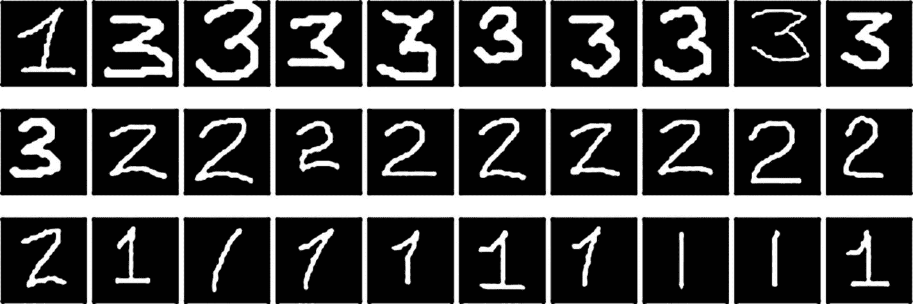
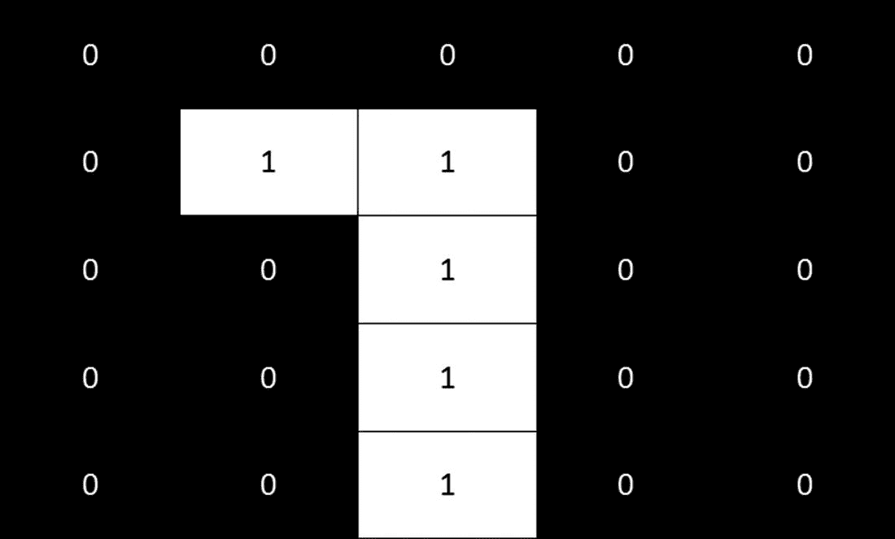
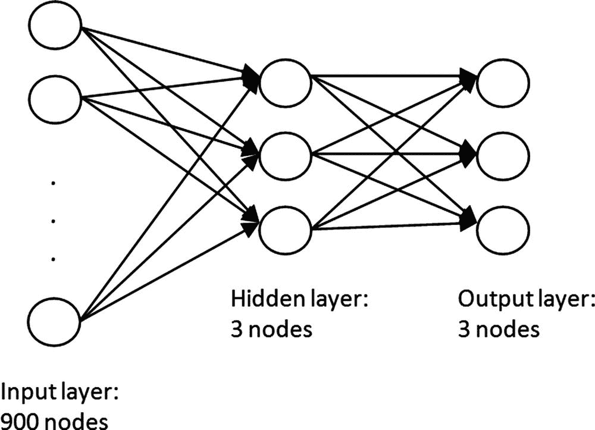

# 12.手写数字识别

在第 [11](11.html) 章中，我们学习了人工神经网络(NNs)，一种模仿我们大脑中神经元工作方式的监督学习范式。NNs 中的学习过程包括通过包含对象特征(要近似的函数的输入)及其相应分类(函数的输出)的训练数据集来近似以表格方式描述的函数。

如前所述，nn 能够通过调整链接其神经元的权重集来学习训练数据集中描述的函数。同时，神经元可以排列在不同的层中，每一层的目的都是为了提高 NN 的数学能力。回想一下，神经网络基本上是一个数学函数，层的添加类似于数学中函数合成的操作；换句话说，每一层都可以看作一个函数，而 NN 是 F(L1(…(LN(x)))，其中 F 是 NN，Li 是 NN 中的层。

神经网络可以应用于多种科学问题。在这些问题中，值得一提的是人脸识别，它现在非常受欢迎，并被集成到移动电话和其他电子设备中，模式识别，形状识别，自动车辆驾驶，以及将成为本章焦点的问题，光学字符识别(OCR)，更具体地说，OCR 的一个子问题，称为手写数字识别(HDR)。

为什么选择 HDR 而不是所有其他可能的问题作为无核武器国家的例证？首先，HDR 离我们在第 11 章中研究的实际问题并没有你想象的那么远。此外，HDR 的训练数据集通常由任何人都可以容易地再现的低分辨率图像组成，并且特征提取过程非常容易完成。正如我们将很快看到的，整个图像将被视为神经网络的输入，对于这个问题，图像处理阶段并不复杂，因此它不会偏离我们的核心主题，神经网络。

在这一章中，我们将在 Windows 窗体中实现一个应用程序，它将允许我们“手绘”一个数字，并为所绘制的数字给出正确的分类。例如，如果绘制的数字是 1，那么输出应该是 1；如果是 2，那么输出应该是 2，依此类推。在后端，这个应用程序将使用第 [11 章](11.html)中介绍的多层神经网络的稍微修改版本。

Note

神经网络不仅可以用作监督学习方法，还可以用作非监督学习和强化学习方法，它们是机器学习的其他范例。

## 什么是手写数字识别？

最近的数字革命给我们对通信和连接等概念的看法带来了巨大的变化。如今，生物识别技术，即基于生理或行为特征识别或验证个人身份的科学，在身份认证问题中发挥着关键作用。生理特征可以包括指纹、虹膜、手形或面部图像。行为特征可以是人以特定方式执行的动作，并且可以包括对签名、机器打印字符、笔迹和声音的识别。

OCR 的一些应用包括邮政地址系统、签名验证系统、从填写表单的应用程序中识别字符等等。OCR 基本上有两种类型:离线字符识别和在线字符识别。在第一种情况下，来自扫描仪的图像通常被接受为输入，并且识别过程往往比后一种情况更困难，因为上下文信息不可用并且缺乏诸如文本位置、文本大小、笔画顺序、起点、终点等先验知识。在联机字符识别中，系统从来自硬件设备(如图形输入板、光笔等)的笔开始工作的时刻开始接受输入；在输入过程中，许多信息变得可用，例如当前位置、瞬间方向、起点、终点和笔画顺序。手写字符识别通常属于这一类，尽管也存在另一类的应用。

手写是人类使用书面媒体相互交流的方式。随着技术的进步和科学的发展，在通过手写与计算机交流方面，技术已经发生了很多变化。如今，通常需要能够接收和识别手写数据形式的输入的计算机程序；这就是所谓的手写识别。

手写数字识别是手写识别的一个子集，其主要目的是识别手写数字；因此，在 HDR 的字符宇宙是唯一的{0，1，2，3，4，5，6，7，8，9}，没有其他字符将被正确识别。

Note

HDR 最受欢迎的数据集之一是 most 分为两个子集，一个用来训练你的神经网络，另一个用来测试它的准确性。可以从 [`http://yann.lecun.com`](http://yann.lecun.com) 下载。

## 训练数据集

为了训练我们的多层神经网络来识别手写数字，我们创建了如图 [12-1](#Fig1) 所示的训练数据集。



图 12-1

Small training data set consisting of 30 images of 30 x 30 resolution

这个自创建的训练数据集仅由 30 个包含范围[1，3]中的手写数字的图像组成，每个数字 10 个图像。在这个实际问题中，我们将不包括所有数字的识别；相反，我们将着重于识别数字 1、2 和 3。正如我们将很快看到的，扩展这里详细描述的神经网络来识别所有的数字将不会给读者在他们未来的工作中带来任何复杂的问题。

我们选择 30 x 30 分辨率的所有图像，因为它简化了我们的神经网络的输入层，颜色选择(黑色背景，白色字体)简化了我们的特征提取阶段。

## 用于 HDR 的多层神经网络

我们将为解决 HDR 问题而建模的神经网络与第 [11](11.html) 章中提出的多层神经网络模型不会有太大的不同。回想一下，因为通用逼近定理，我们知道在多层神经网络中有一个单一的隐藏层对于学习或逼近任何连续函数总是足够的。此外，请记住，深度学习(涉及各种隐藏层的神经网络)不是徒劳的，它的目的是在单个隐藏层无法提供足够准确或可行的结果的问题中提供更准确和有效的结果。拥有多个隐藏层可以帮助我们在更短的时间内获得更准确、更高效的解决方案。对于手头的问题，我们将满足于拥有一个具有单个隐藏层的多层神经网络。

输入层将是从图像像素到该层节点的直接映射；因此，如果我们有一个 30 x 30 的图像，我们的输入层将包含 900 个节点，每个像素一个，如果像素颜色是黑色，它们的值将是 0，在任何其他情况下都是 1(图 [12-2](#Fig2) )。这不是最准确的策略，我们可以用它来提取特征并输入到我们的神经网络中，但是对于这个简单的例子来说，这是可行的。其他特征提取策略考虑获取像素亮度值，并将这些值缩放到范围[0，1]。



图 12-2

Feature extraction by mapping every black pixel to 0 and any other pixel to 1

输出层将包含三个节点，每个节点对应一个要识别的数字(1，2，3)。图 [12-3](#Fig3) 显示了提议的多层神经网络的最终结构。



图 12-3

Structure of the proposed multi-layer NN

此时，读者可能想知道我们如何从输出层决定在神经网络中被分析的数据的分类。事实上，我们在这一层有三个节点不是巧合；这些节点中的每一个都应该匹配我们将要识别的三个数字中的一个。第一个节点匹配或输出(如果它被激活)数字 1，第二个节点匹配数字 2，第三个节点输出数字 3。现在，对于给定的训练数据，我们如何选择一个节点作为网络的输出或被激活？简单-具有最高激活值的节点将被选为输出节点。

训练数据的正确分类将被表示为三个分量的向量；其中两个值为 0，一个值为 1。值为 1 的分量表示训练数据的正确分类。例如，向量(1，0，0)将 1 表示为训练数据的正确分类，向量(0，1，0)将 2 表示为正确分类，并且(0，0，1)将 3 标记为正被分析的训练数据的正确分类。

总之，有必要提及的是，在所提出的神经网络中，我们不会将权重的初始化视为范围[0，1]内的随机值；相反，我们将它们设置为[-0.5，0.5]范围内的随机值。这种变化背后的原因是数字上的，也与性能有关。因为我们将有一个具有许多节点的输入层，这些输入值的加权和将导致 sigmoid 激活值非常接近 1，这将破坏我们的 NN 的性能，并阻止我们收敛到误差的最小化，并因此阻止我们实现体面的解决方案。作为一个建议，请记住，即使是权重的初始化也是设计神经网络时要考虑的一个问题，因为它会影响神经网络的整体性能。

## 履行

如前所述，我们将开发一个 Windows 窗体应用程序，允许我们在图片框上绘制一个数字，然后通过单击分类按钮，我们将获得所绘制数字的分类。仅仅为了在代码中获得优雅和表现力，我们将使用下面的类(清单 [12-1](#Par22) )，它是第 [11 章](11.html)中介绍的`MultiLayerNetwork`类的直接后代。

```py
public class HandwrittenDigitRecognitionNn : MultiLayerNetwork
    {
        public HandwrittenDigitRecognitionNn(IEnumerable<TrainingSample> trainingDataSet, int inputs, int hiddenUnits, int outputs, double learningRate)
            :base(trainingDataSet, inputs, hiddenUnits, outputs, learningRate)
        {
        }
    }

Listing 12-1
HandwrittenDigitRecognitionNn Class

Representing a NN for HDR

```

这个类的一个实例将被添加到`HandwrittenRecognitionGui`类中，继承自`Windows.Forms.Form`并包含本章中详述的大部分代码。这个类中声明字段和属性的部分可以在清单 [12-2](#Par24) 中看到。

```py
public partial class HandwrittenRecognitionGui : Form
    {
        private bool _mouseIsDown;
        private Bitmap _bitmap;
        private const int NnInputs = 900;
        private const int NnHidden = 3;
        private const int NnOutputs = 3;
        private HandwrittenDigitRecognitionNn _handwrittenDigitRecogNn;
        private bool _weightsLoaded;

public HandwrittenRecognitionGui()
        {
            InitializeComponent();
            _bitmap = new Bitmap(paintBox.Width, paintBox.Height);
        }
}

Listing 12-2
HandwrittenRecognitionGui Class

Representing the Visual Application

```

这些字段或属性可以描述如下:

*   `_mouseIsDown`:用于鼠标相关事件，判断鼠标按钮(左键)是否被按下
*   `_bitmap`:位图图像，用于存储用户在图片框上绘制的内容，然后提交给神经网络进行分类
*   `NnInputs`:神经网络输入层的节点数
*   `NnHidden`:神经网络隐藏层的节点数
*   `NnOutputs`:神经网络输出层的节点数
*   `_handwrittenDigitRecogNn`:NN 类的实例
*   `_weightsLoaded`:确定权重集是否已经加载到应用程序中。一旦我们训练了神经网络，找到的一组权重将被保存在一个文件中以备将来使用；因此，该变量将控制包含这些权重的文件的读取。

通过在 picture-box 控件中添加不同的方法来处理鼠标相关的事件，将对`HandRecognitionGui`类进行补充，这是我们在设计模式中添加到应用程序中的。我们将很快看到应用程序的外观。这些链接到鼠标事件的方法如清单 [12-3](#Par34) 所示。

```py
private void PaintBoxMouseDown(object sender, MouseEventArgs e)
        {
            if (e.Button == MouseButtons.Left)
                _mouseIsDown = true;
        }

        private void PaintBoxMouseMove(object sender, MouseEventArgs e)
        {
            if (_mouseIsDown)
            {
                var point = paintBox.PointToClient(Cursor.Position);
                DrawPoint((point.X), (point.Y), Color.FromArgb(255, 255, 255, 255));
            }
        }

        private void PaintBoxMouseUp(object sender, MouseEventArgs e)
        {
            _mouseIsDown = false;
        }

        public void DrawPoint(int x, int y, Color color)
        {
            var pen = new Pen(color);
            var gPaintBox = paintBox.CreateGraphics();
            var gImg = Graphics.FromImage(_bitmap);
            gPaintBox.DrawRectangle(pen, x, y, 1, 1);
            gImg.DrawRectangle(pen, x, y, 1, 1);
        }

Listing 12-3
Mouse-Event Methods

in the Picture Box Where We Will Be Drawing Digits to Be Classified

```

从清单 [12-3](#Par34) 中我们可以看到，我们捕获了三个鼠标事件:`MouseDown`(当用户按下控件上的鼠标按钮时)、`MouseMove`(当用户将鼠标移到控件上时)和`MouseUp`(当用户停止按下控件上的按钮时)。这三个事件与`_mouseIsDown`变量的结合为我们提供了必要的工具来构建一个简单、直接的机制，用于确定用户何时在控件上绘图，并将绘图保存在图片框和辅助位图图像上，我们最终将这些图片提交给神经网络进行分类。一旦用户在图片框控件上画了一个数字并点击了分类按钮(我们很快就会看到最终的 GUI)，一个图像处理阶段就开始了，我们使用下一个方法从图像中提取特征(清单 [12-4](#Par36) )。

```py
private double [,] GetImage(Bitmap bitmap)
        {
            var result = new double[bitmap.Width, bitmap.Height];

            for (var i = 0; i < bitmap.Width; i++)
            {
                for (var j = 0; j < bitmap.Height; j++)
                {
                    var pixel = bitmap.GetPixel(i, j);
                    result[i, j] = pixel.R + pixel.G + pixel.B == 0 ? 0 : 1;
                }
            }

            return result;
        }

Listing 12-4Extracting features

```

在`GetImage()`方法中，我们构建一个二进制值的矩阵；所得矩阵的给定(I，j)坐标上的值 0 将指示与图片框相关联的图像中的黑色像素，而值 1 指示任何其他颜色。

在我们的可视化应用程序中，我们将包含一个火车按钮，其单击事件的方法可以在清单 [12-5](#Par39) 中看到。在该方法中，我们加载形成训练数据集的 30×30 图像的集合；我们处理每个图像并创建一个等价的`TrainingSample`对象。然后，我们开始训练过程，并将得到的权重集保存在一个`weights.txt`文件中。

```py
private void TrainBtnClick(object sender, EventArgs e)
        {
            var trainingDataSet = new List<TrainingSample>();
            var trainingDataSetFiles = Directory.GetFiles(Directory.GetCurrentDirectory() + "\\Digits");

            foreach(var file in trainingDataSetFiles)
            {
                var name = file.Remove(file.LastIndexOf(".")).Substring(file.LastIndexOf("\\") + 1);
                var @class = int.Parse(name.Substring(0, 1));
                var classVec = new[] {0.0, 0.0, 0.0};
                classVec[@class - 1] = 1;
                var imgMatrix = GetImage(new Bitmap(file));
                var imgVector = imgMatrix.Cast<double>().Select(c => c).ToArray();
                trainingDataSet.Add(new TrainingSample(imgVector, @class, classVec));
            }

            _handwrittenDigitRecogNn = new HandwrittenDigitRecognitionNn(trainingDataSet, NnInputs, NnHidden, NnOutputs, 0.002);
            _handwrittenDigitRecogNn.Training();

            var fileWeights = new StreamWriter("weights.txt", false);

            foreach (var layer in _handwrittenDigitRecogNn.Layers)
            {

                foreach (var unit in layer.Units)
                {
                    foreach (var w in unit.Weights)
                        fileWeights.WriteLine(w);
                    fileWeights.WriteLine("*");
                }
                fileWeights.WriteLine("-");
            }

            fileWeights.Close();

            MessageBox.Show("Training Complete!", "Message");
        }

Listing 12-5Load the Training Data Set, Train the NN, and Save the Resulting Weights

```

为了对画在图片框上的数字进行分类，我们添加了分类按钮。当点击事件发生时触发的方法如清单 [12-6](#Par41) 所示。在这个方法中，我们检查`weights.txt`文件是否存在，如果文件存在，则加载权重集，或者在任何其他情况下输出警告消息。如果权重尚未加载，那么我们运行`ReadWeights()`方法，最终执行神经网络的`Predict()`方法，并将结果分类保存在`classBox`文本框中。

```py
private void ClassifyBtnClick(object sender, EventArgs e)
        {
             if (Directory.GetFiles(Directory.GetCurrentDirectory()).Any(file => file == Directory.GetCurrentDirectory() + "weights.txt")) {
                MessageBox.Show("Warning", "No weights file, you need to train your NN first");
              return;
             }

             if (!_weightsLoaded)
             {
                 ReadWeights();
                 _weightsLoaded = true;
             }

            var digitMatrix = GetImage(_bitmap);
            var prediction = _handwrittenDigitRecogNn.Predict(digitMatrix.Cast<double>().Select(c => c).ToArray());
            classBox.Text = (prediction + 1).ToString();
        }

Listing 12-6Method Executed After the Classify Button

Has Been Clicked

```

`ReadWeights()`方法作为一个辅助的小型解析器，负责读取权重文件，并将它们分配给神经网络中的每个节点(清单 [12-7](#Par43) )。文件中每行存储一个权重，属于不同单位的权重将由包含“*”符号的行分隔，该符号标志着给定单位的权重分配的结束和另一个单位的开始。相同的事情发生在“-”符号上，但是在图层级别。

```py
private void ReadWeights()
        {
            _handwrittenDigitRecogNn = new HandwrittenDigitRecognitionNn(new List<TrainingSample>(), NnInputs, NnHidden, NnOutputs, 0.002);
            var weightsFile = new StreamReader("weights.txt");
            var currentLayer = _handwrittenDigitRecogNn.HiddenLayer;
            var weights = new List<double>();
            var j = 0;

            while (!weightsFile.EndOfStream)
            {
                var currentLine = weightsFile.ReadLine();

                // End of weights for current unit.
                if (currentLine == "*")
                {
                    currentLayer.Units[j].Weights = new List<double>(weights);
                    j++;
                    weights.Clear();
                    continue;
                }

                // End of layer.
                if (currentLine == "-")
                {
                    currentLayer = _handwrittenDigitRecogNn.OutPutLayer;
                    j = 0;
                    weights.Clear();
                    continue;
                }

                weights.Add(double.Parse(currentLine));
            }

            weightsFile.Close();
        }

Listing 12-7
ReadWeights() Method

```

最后，让我们执行并看看我们的手写数字识别可视化应用程序(图 [12-4](#Fig4) )。


图 12-4

HDR visual application

现在我们已经完全开发了应用程序，让我们看看在数字 1、2 和 3 的不同绘图呈现给神经网络后，它将如何执行。

## 测试

回到图 [12-4](#Fig4) ，我们可以看到我们应用程序中的绘图空间是黑色背景的图片框控件；正是在这个图片框中，我们将绘制不同的数字，通过单击分类按钮最终获得一个分类。让我们检查一些测试(图 [12-5](#Fig5) )。

 

图 12-5

Classification of handwritten digits

同样，在这个应用程序中，我们可以获得许多手写数字的正确分类，但对于其他数字，我们可能会获得不正确的分类。正如读者在这一点上可能预料到的，这种不准确背后的原因是训练 NN 时使用的训练数据集非常小。为了获得更高的准确性，我们需要更多不同风格的笔迹样本。

## 摘要

在本章中，我们介绍了手写数字识别的问题，并开发了一个 Windows 窗体应用程序，允许用户在其中绘制数字，并最终获得所绘制数字的分类。我们只考虑了一组数字{1，2，3}，但是只需向输出层添加新的节点，应用程序就可以很容易地扩展到包括所有可能的数字。我们测试了结果，如前所述，由于训练样本数量较少，应用程序可能会对一些传入数据进行错误分类。因此，建议添加新的培训数据。本章介绍的视觉应用是神经网络能力和可能性的真实代表。