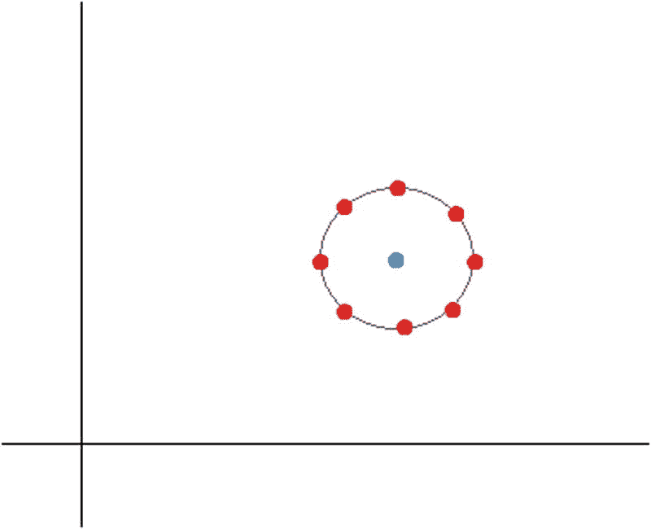
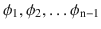
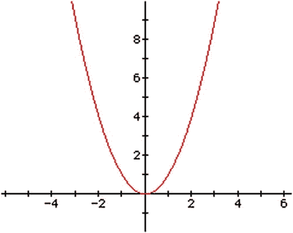
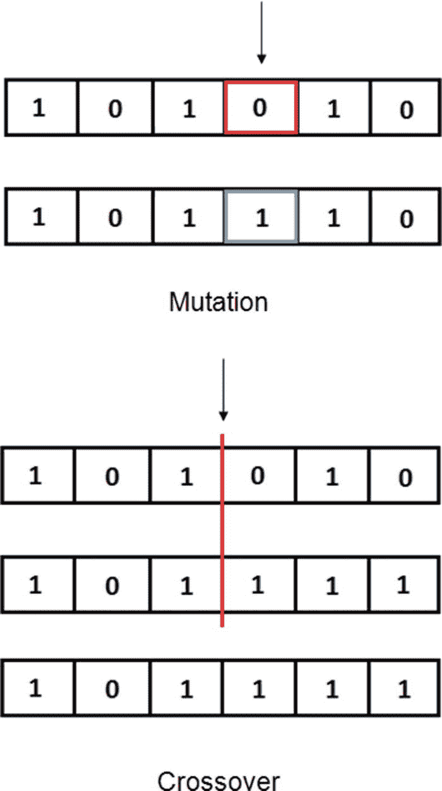
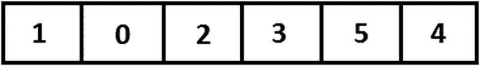
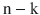
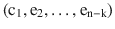

# 14.启发式和元启发式

到目前为止，我们已经在许多场合提到了启发式这个词。我们在“火星漫游者”一章中使用它来整合一种看似逻辑和简单的方法，使用我们对现实的务实知识，并帮助我们实现机器人的合理运动。这种方法主要是基于我们的经验，而不是任何科学证明的程序。

在计算机科学中，我们通常面临着设计算法的挑战，这些算法给我们提供了对给定问题的良好时间复杂度和好的解决方案(如果可能的话，是最优的)。启发式是一种可以很容易地放弃任何一个或两个前提的方法。例如，试探法可以为一个问题找到许多解决方案，这些解决方案中的一些可能不正确或不可行，而一些可能是最佳的。同样，它可以在短时间内执行，为问题提供可行的解决方案，也可能没有一个解决方案是最优的。这种类型的算法通常应用于本质上困难的问题；例如，NP-Hard 问题，如旅行推销员、聚类、车辆路径等等。由于这些问题的本质，它们的高度复杂性，我们必须依靠方法来输出问题的解决方案，或者可能是解决方案的一部分，并帮助我们最终获得尽可能接近最优解的确定的解决方案。

一种非常特殊的启发式方法是元启发式方法，这是一种独立于问题的迭代过程，通过不同的策略或指导方针将各种启发式方法结合起来，试图引导搜索找到好的解决方案。元试探法变得非常流行；它们中的一些基于生物或化学过程来发挥作用，并且已经获得了极大的兴趣，因为它们能够通过应用在相当长的时间内执行的简单算法来找到复杂问题的良好解决方案。

在这一章，我们将讨论启发式，特别是爬山启发式，我们将提出两个著名的元启发式；也就是说，我们将学习遗传算法和禁忌搜索。我们将实现前两种方法的实际问题将包括在内。

Note

人工智能中的多种算法本质上是启发式的，或者在执行过程中使用启发式算法。确定给定电子邮件是否是垃圾邮件的应用程序使用许多启发式规则来最终做出决定。

## 什么是启发式？

启发式是一种从经验、常识或有根据的猜测中得出的方法，旨在为通常很难解决(NP-Hard)的问题提供或有助于提供实用的解决方案，因此最优或良好的可行解决方案太复杂而难以获得。启发式方法可以为我们提供一条捷径，从而加快找到一个好的、可行的解决方案的过程。这种加速过程通常是通过搜索算法实现的，在搜索算法中，我们遍历一棵代表可能解决方案空间的树。应用某些特定问题的试探法可以显著减少树搜索。这就是滑动瓦片拼图(如图 [14-1](#Fig1) 所示)的情况，这是一种流行的游戏，其状态游戏空间(所有可能的游戏配置)可以由一棵树来表示，该树的节点指示游戏的不同状态或配置。每个父对象最多有四个子对象，代表棋子进入空白区域的四种可能移动。


图 14-1

Sliding Tiles Puzzle . The left board shows an unfinished state of the game and the right board the goal state.

启发式方法拥有关于每个状态与目标状态的接近程度的一些信息，这允许它们首先探索最有希望的路径。概括地说，启发式方法的一些最一般的特征如下:

*   他们并不保证会找到解决方案，即使它可能存在。
*   即使它找到了一个解，也不能保证它是最优的(最小或最大)。
*   有时(未事先定义)它会在合理的时间内找到一个好的解决方案。

我们通常通过启发式函数来使用启发式算法。该函数为问题的每个状态分配一个数值，并定义该状态从给定点(节点)尝试达到目标状态的前景如何；通常用 H(e)来表示。启发式函数可以有两种解释。它可以指示状态 e 离目标状态有多近，意味着具有最低启发值的状态是优选的，或者它可以指示状态 e 离目标状态有多远，意味着我们优选具有最高启发值的状态。在这种情况下，我们要么最小化，要么最大化启发式函数。

Note

对于拼块难题，在当前棋盘中的拼块位置和目标棋盘中的相同拼块位置之间计算的曼哈顿距离的总和是一个试探函数。

## 爬山

在爬山法或启发式方法中，我们从一个初始随机解开始，并将其设置为当前解。我们找到当前解的一组邻居，并执行一个步骤，将当前解定义为对被最小化(最大化)的函数提供最大减少(增加)的邻居。爬山是一种可能陷入局部最小值的优化技术；因此，它很容易发现不了全局最优。尽管它存在局部性问题，但它在人工智能中被广泛用于解决有严格时间限制的问题，并且人们肯定可以利用短执行时间算法。

有两种类型的爬山方法:

*   不可逆的:如果路径碰巧是无益的，我们避免返回到状态集合的子集
*   试探性:如果我们确定选择的路径不合适，我们可以回到旧的路径

在本书中，我们将关注第一种方法(不可逆的)，这种方法非常类似于本节开始时对爬山的描述。

在不可逆的爬山过程中，我们使用两种方法来确定下一步或解决方案:

*   简单的攀爬:我们选择处理或扩展当前邻域中比当前解更有利的第一个解。因此，过程在那里停止，并且不是当前解决方案的所有邻居都被扫描。
*   最大爬坡:我们选择处理或扩展当前邻域中最有利的解决方案。因此，当当前解的所有邻居都被扫描时，过程停止。

在这两种情况下，如果当前邻域中的每个解都比当前解差或等于当前解，则该过程结束。

Note

爬山是一种迭代改进的优化技术，是贪婪算法家族中最佳优先搜索算法的变体。

图 [14-2](#Fig2) 展示了爬山算法如何找到局部最优解，用蓝点表示。


图 14-2

In this case, we minimize the objective function and go “downhill” through a path of orange points until we reach the blue point, a local minimum. We are minimizing, thus the blue point is a local minimum .

该算法的伪代码如下:

```py
HillClimbing(function F)
{
currentSolution = RandomSolution();
while (No Improvement)
vicinity = Neighbors(currentSolution);
nextEval = -INF;
nextSolution = null;
      for all x in vicinity
     {
 if (Evaluate(x) >nextEval)
            {
nextSolution= x;
nextEval = Evaluate (x);
            }
      }
      if nextEval<= Evaluate (currentSolution)
return currentSolution;
currentNode = nextSolution;
}

```

爬山是一种属于局部搜索(LS)算法家族的方法。事实上，爬山和局部搜索这两个术语有时会被不加区分地使用，这意味着它们被认为是相同的算法，它们代表了一类称为基于单一解决方案的元启发式算法，其中包括模拟退火、禁忌搜索和其他基于 LS 的流行方法。

Note

局部搜索是一种启发式方法，用于解决计算困难的优化问题；它通过应用局部变化在候选解空间(搜索空间)中从一个解移动到另一个解，直到找到被认为是最优的解，达到最大迭代次数，或者经过了时间限制。

## 实际问题:实现爬山

在本节中，我们将实现一个优化(最小化)连续目标函数的爬山算法。该程序中的邻域是通过考虑当前解周围半径为 R 的 n 球上的点集来计算的(图 [14-3](#Fig3) )。



图 14-3

The neighborhood of the current solution (blue point) is formed by all the red points of the n-sphere surrounding it. In this case, n = 1; i.e., the 1-sphere is a circle.

一个 n 球面(球面的推广)的坐标可以根据以下公式得到:

![ $$ {\displaystyle \begin{array}{c}{\mathrm{x}}_1=\mathrm{r}\ast \cos \left({\phi}_1\right)\\ {}{\mathrm{x}}_2=\mathrm{r}\ast \sin \left({\phi}_1\right)\ast \cos \left({\phi}_2\right)\\ {}{\mathrm{x}}_3=\mathrm{r}\ast \sin \left({\phi}_1\right)\ast \sin \left({\phi}_2\right)\ast \cos \left({\phi}_3\right)\\ {}\dots \\ {}{\mathrm{x}}_{\mathrm{n}-1}=\mathrm{r}\ast \sin \left({\phi}_1\right)\ast \dots \ast \sin \left({\phi}_{\mathrm{n}-2}\right)\ast \cos \left({\phi}_{\mathrm{n}-1}\right)\\ {}{\mathrm{x}}_{\mathrm{n}}=\mathrm{r}\ast \sin \left({\phi}_1\right)\ast \dots \ast \sin \left({\phi}_{\mathrm{n}-2}\right)\ast \sin \left({\phi}_{\mathrm{n}-1}\right)\end{array}} $$ ](img/A449374_1_En_14_Chapter_Equa.gif)

其中 r 是 n 球面的半径，是角坐标的集合，在[0；π]和范围[0；2π].

为了简化数学函数，我们将添加对 MathParserNuget 包的引用。通过使用这个包，我们将能够将函数定义为字符串，并在我们想要的任何时候对它们求值。因此，我们将在`HillClimbing`类中有一个`Function`公共属性，如清单 [14-1](#Par31) 所示。

```py
public class HillClimbing
    {
        public Function Function{ get; set; }
        public double Step { get; set; }
        public double Radius { get; set; }
        private static readonly Random Random = new Random();

        public HillClimbing(Function function, double step, double radius)
        {
            Function = function;
            Step = step;
            Radius = radius;
        }
}

Listing 14-1HillClimbing Class

```

该类包含以下属性或字段:

*   `Function`:待优化功能
*   `Step` : double 值，表示计算解的邻域时使用的步长或角度
*   `Radius`:双精度值，表示当前解周围(邻域)的 n 个球体的半径
*   `Random`:用于计算随机值的变量

在清单 [14-2](#Par38) 中，我们可以看到负责执行爬山算法的一些组件的三个方法。

```py
        private List<double>InitialSolution(int dimension)
        {
var result = new List<double>();

            for (vari = 0; i< dimension; i++)
result.Add(Random.NextDouble()*100);

            return result;
        }

        private IEnumerable<List<double>> Neighborhood(List<double>currentSolution, int dimension)
        {
var result = new List<List<double>>();

varnewSolutions = NSpherePoints(currentSolution, dimension);
result.AddRange(newSolutions);

            return result;
        }

        private IEnumerable<List<double>>NSpherePoints(List<double>currentSolution, int dimension)
        {
var result = new List<List<double>>();
var angles = Enumerable.Repeat(Step, dimension).ToList();

            while (angles.First() < 180)
            {
                for (vari = 0; i< dimension; i++)
                {
varnewSolution = new List<double>(currentSolution);
var prod = 1.0; 

                    for (var j = 0; j <i; j++)
                        prod *= Math.Sin(angles[j]);

newSolution[i] = i == dimension - 1 &&i> 0
                                             ? Radius*(prod)*Math.Sin(angles[i])
                                             : Radius*(prod)*Math.Cos(angles[i]);

result.Add(newSolution);
                }
                angles = angles.Select(ang => ang + Step).ToList();
            }

            return result;
        }
    }

Listing 14-2InitialSolution()

, Neighborhood(), and NSpherePoints() Methods

of the HillClimbing Class

```

在`InitialSolution()`方法中，我们创建一个 n 维随机解，随机值在范围[0，100]内。在`Neighborhood()`方法中，我们利用`NSpherePoints()`方法来计算形成当前解的邻域的新点。最后一种方法是对前面提出的坐标方程组的直接转换。清单 [14-3](#Par40) 展示了`Execute()`方法，它将所有其他组件放在一起。

```py
public List<double>Execute()
        {
varcurrentSolution = InitialSolution(Function.getArgumentsNumber());
varbestEval = double.MaxValue;
            List<double>bestSolution = null;

            while (true)
            {
var neighbors = Neighborhood(currentSolution, Function.getArgumentsNumber());
varbestCurrentEval = double.MaxValue;
                List<double>bestCurrentSolution = null;

                foreach (var neighbor in neighbors)
                {
vareval = Function.calculate(neighbor.ToArray());
                    if (eval<bestCurrentEval)
                    {
bestCurrentEval = eval;
bestCurrentSolution = neighbor;
                    }
                }

                if (bestCurrentEval == bestEval)
                    break;

                if (bestCurrentEval<bestEval)
                {
bestEval = bestCurrentEval;
bestSolution = bestCurrentSolution;
                }
            }

            return bestSolution;
        }

Listing 14-3
Execute() Method

of the HillClimbing Class

```

我们通过考虑函数在控制台应用程序上测试了该算法，这是一个抛物线函数，其图形可以在图 [14-4](#Fig4) 中看到。



图 14-4

Parabolic function

显然，这个函数的最小值是在 x = 0 时获得的。因此，让我们测试我们的算法，看看它如何从一个可能是 100 的高值下降到一个非常接近 0 的值(清单 [14-4](#Par43) )。

```py
var f = new Function("f", "(x1)^2", "x1");
varhillClimbing = new HillClimbing(f, 5, 4);
var result = hillClimbing.Execute();
Console.WriteLine("Result: {0}", result[0]);
Listing 14-4
Testing

the Hill Climbing Algorithm

```

在执行该代码并设置断点以发现算法开始处理的初始解之后，我们获得了如图 [14-5](#Fig5) 所示的结果。


图 14-5

Result obtained after executing Hill Climbing algorithm

该算法以值 95.14 开始，并且能够以下坡的方式工作，直到它达到非常接近全局最优值(0)的值，在这种情况下，该值与局部最优值一致。

在下面的部分中，我们将研究 S-元启发式算法(基于单个解决方案)和 P-元启发式算法(基于群体)。第一种类型由家族组成，其中每个成员从局部搜索(LS)或爬山继承，并试图通过创建机制来克服他们的困难，以逃离局部最优并在状态空间的其他有希望的区域中继续搜索。后一种类型是一个庞大的元启发式群，由那些在其执行中包含群体的过程组成；毫无疑问，它们最受欢迎的代表是遗传算法家族。

Note

一些最流行的 S-元启发式算法包括禁忌搜索(TS)，模拟退火(SA)，迭代局部搜索(ILS)和可变邻域搜索(VNS)。

## p-元启发式:遗传算法

基于群体的元启发式算法，也称为 P 元启发式算法，由对群体中分组的一组解决方案进行改进的迭代过程组成。在这种类型的元启发式算法中，我们通常首先生成一个初始种群，然后使用一些选择标准用另一个种群替换它。诸如进化算法(EAs)、分散搜索(SS)、分布估计算法(EDAs)、粒子群优化(PSO)、蜂群(BC)和人工免疫系统(AISs)等算法都属于这类元启发式算法。在本节中，我们将重点介绍一种称为遗传算法(GA)的进化算法。

遗传算法代表了一个由自然选择过程启发的元启发式家族；它们是由霍兰德在 20 世纪 70 年代开发的，通常用于通过依赖生物启发的算子(如变异、交叉和选择)来生成优化和搜索问题的高质量解决方案。像染色体、基因和适应度这样的概念在 GA 文献中很常见，他们试图在生物学、化学等领域找到它们的相似物。

Note

GAs 广泛应用于计算机科学和运筹学领域。在后一个领域，气体处理应用先进的分析方法，以帮助作出更好的决定。

在 GAs 中，我们通常需要以一种“遗传”方式对解进行编码，以便以后允许我们有效地应用变异和交叉算子。我们还需要一个适应度函数，它接收编码解决方案作为参数，并为我们提供对编码解决方案的评估或评价。解决方案的流行编码由二进制字符串组成；这种编码使得应用几乎任何操作符都非常容易。

元启发法试图在两个方面进行优化:通过强化和多样化机制的应用。强化指的是算法追求甚至更进一步的已经发现的和有希望的状态空间区域的能力。这意味着利用状态空间中我们已经发现好的解决方案的那些区域。

另一方面，多样化指的是探索国家空间中未探索区域的能力，同时试图发现新的、高质量的解决方案。

变异算子试图通过创建存在于状态空间的不同区域中的新解来改变解；因此，它使搜索多样化。交叉算子通常处理两个解，这两个解的适应度值被认为是迄今为止发现的最佳值之一。然后它在一个交叉点上混合它们的值；这是一个强化运算符，因为我们试图混合两个好的解决方案，以找到一个更好的解决方案。图 [14-6](#Fig6) 显示了这些操作符如何作用于二进制染色体(解)。



图 14-6

The mutation operator modifies a single bit in the chromosome (solution), and the crossover operator assigns a breaking point on the two parent chromosomes, creating a new solution by taking half the genes from the first chromosome and half the genes from the second part of the second chromosome.

从图 [14-6](#Fig6) 我们可以很容易地推断出变异算子是一元的，而交叉算子是二元的。

尽管选择、变异和交叉方法可以从一个特定的实现改变到另一个(取决于问题)，但是遗传算法的通用伪代码如下所示:

```py
GA ()
{
InitializePopulation();
EvaluatePopulation();

            while(!stopCondition)
          {
                 Select the best-fit individuals for reproduction;
                 Obtain offsprings through mutation, crossover operators on the previously selected individuals;
                 Evaluate offsprings;
                 Obtain new population by selecting best-fit individuals from offsprings and the current population;
           }
}

```

从这个伪代码中，我们可以看到 GAs 是如何被视为基于“适者生存”的生物学类比的优化方法通过遗传繁殖、交叉和突变的生物学类比，平均群体和个体的质量经过几代后得到改善。原则上，人口的平均素质应该随着每一代人的增长而提高。然而，这强烈地依赖于一些参数(例如，突变概率)和适应度(质量，概率)函数的性质。

在接下来的部分，我们将实现一个 GA 来解决计算机科学中一个非常流行的问题，旅行推销员问题，也称为 TSP。我们将定制我们的 GA(解决方案编码、适应度函数等等)以使它适合 TSP 的模型并相应地提供解决方案。

## 实际问题:实现旅行商问题的遗传算法

我们已经讨论过 GAs，我们知道它们是由一个类似于种群随时间进化的生物过程所激发的，对我们来说，更适合的个体代表着更好的解决方案。单独的气体仅仅是蓝图，等待被应用于特定的问题。在本节中，我们将采用遗传算法来寻找解决方案和优化旅行推销员问题(TSP)。

旅行推销员问题(TSP)是这样一个问题，我们有一个推销员，他的任务是穿过 n 个城市，同时寻求最小化从一个城市旅行到另一个城市所花费的时间，并最终访问每一个城市。图 [14-7](#Fig7) 展示了一张美国地图，其中有几个城市(黑点)是一个推销员必须去的；紫色线表示可能的最小成本路径。


图 14-7

US map showing a possible path to be followed by a salesman through several cities. In this case, the path ends where it started.

TSP 是一个 NP-Hard 问题，这意味着我们必须依靠近似或启发式方法在实际时间内获得解决方案。精确的解决方案意味着开发一个组合算法，它需要 O(n！)来执行，即执行的阶乘时间，这意味着对于 n = 20，我们将有 2，432，902，008，176，640，000 个可能的解决方案要检查。

因为在 TSP 中，我们试图找到产生适应度函数的最佳值的城市排列，使用这种表示作为我们的 GA 的编码似乎是非常合乎逻辑的，这就是我们将遵循的策略。因此，我们将染色体作为范围从[0，n - 1]的值列表；列表中的每个值将代表一个城市，列表中定义的顺序是销售人员要遵循的路线。图 [14-8](#Fig8) 显示了我们的遗传算法的一个染色体的例子，该遗传算法致力于寻找 TSP 的解。



图 14-8

Chromosome or solution encoding for TSP

为了与我们设计的面向对象方法保持一致，我们将包含一个`Tsp`类，它将考虑所有与问题和特定问题直接相关的操作(列表 [14-5](#Par65) )。

```py
    public class Tsp
    {
        public static double[,] Map { get; set; }

        public Tsp(double [,] map)
        {
            Map = map;
        }

        public static void Evaluate(Solution solution)
        {
var result = 0.0;

            for (vari = 0; i<solution.Ordering.Count - 1; i++)
                result += Map[solution.Ordering[i], solution.Ordering[i + 1]];

solution.Fitness = result;
        }

    }

Listing 14-5Tsp Class Contemplating Problem-Specific Issues

```

在这个类中，我们存储了表示距离图的双[，]矩阵`Map`;换句话说，这个矩阵存储了任意两个城市 I，j 之间的距离。我们编写了一个`Evaluate()`方法来计算输入解决方案的适合度值。同样，我们还包含了一个`Solution`类，所有与解决方案相关的操作都是在这个类中开发的(清单 [14-6](#Par67) )。

```py
    public class Solution
    {
        public List<int> Ordering { get; set; }
        public double Fitness { get; set; }

        public Solution(IEnumerable<int> ordering)
        {
            Ordering = new List<int>(ordering);
Tsp.Evaluate(this);
        }

        public Solution Mutate(Random random)
        {
vari = random.Next(0, Ordering.Count);
var j = random.Next(0, Ordering.Count);

            if (i == j)
                return this;

varnewOrdering = new List<int>(Ordering);
var temp = newOrdering[i];
newOrdering[i] = newOrdering[j];
newOrdering[j] = temp;

            return new Solution(newOrdering);
        }

        public Solution CrossOver(Random random, Solution solution)
        {
var ordinal = Ordinal();
varordinalSol = solution.Ordinal();

varparentA = new List<int>(ordinal);
varparentB = new List<int>(ordinalSol);
var cut = parentA.Count/2;

varfirstHalf = parentA.GetRange(0, cut);
varsecondHalf = parentB.GetRange(cut, parentB.Count - cut);

firstHalf.AddRange(secondHalf);
            return DecodeOrdinal(firstHalf);
        }

        public List<int>Ordinal()
        {
var result = new List<int>();
var canonic = new List<int>(Canonic);

            foreach (varcurrentVal in Ordering)
            {
varindexCanonical = canonic.IndexOf(currentVal);
result.Add(indexCanonical);
canonic.RemoveAt(indexCanonical);
            }

            return result;
        }

        public Solution DecodeOrdinal(List<int> ordinal)
        {
var result = new List<int>();
var canonic = new List<int>(Canonic);

            for (vari = 0; i<ordinal.Count; i++)
            {
varindexCanonical = ordinal[i];
result.Add(canonic[indexCanonical]);
canonic.RemoveAt(indexCanonical);
            }

            return new Solution(result);
        }

        public List<int> Canonic
        {
            get { returnEnumerable.Range(0, Ordering.Count).ToList(); }
        }
    }

Listing 14-6Solution Class

```

一个解决方案由两个主要字段或属性组成，一个名为`Ordering`的整数列表，以及一个表示解决方案适用性的双值属性`Fitness`。它还包含一个`Canonic`属性，输出一个按升序排列的整数列表{1，…，n}，n 是城市总数。例如，当 n = 5 时，它的标准形式将是{1，2，3，4，5}。我们用规范形式来计算一个解的序数形式。为什么我们需要一个解的序数形式？

为了理解为什么我们把一个解转换成它的序数形式，考虑一下在图 [14-9](#Fig9) 中如果我们在两个解上应用交叉算子会发生什么。


图 14-9

After applying the crossover operator to the parents, the resulting offspring is unfeasible as it represents a tour that passes twice by city number 2

正如我们从上图中看到的，对父代应用交叉运算符会产生一个不可行的后代，其中包含一个经过同一城市两次的旅程—城市 2。为了避免这个问题，我们使用一个解决方案的序数表示法，它可以按照图 [14-10](#Fig10) 的描述进行计算。


图 14-10

To calculate the ordinal form we loop through the canonic form, look for the position of the analyzed value in the current tour, and save that position in the list forming the ordinal representation

有趣的事实是，当交叉算子应用于常规 TSP 表示时会产生不可行的解，当我们将这些表示转换为序数形式时，交叉算子会产生可行的解(序数形式)。我们只需要将这个有序解解码成常规 TSP 形式(1 … n 范围内的整数排列)来继续 GA 过程。

`Solution`类包含以下方法:

*   在这种方法中，我们通过在解决方案排序中选择两个随机索引位置并交换它们相应的值来变异解决方案。
*   在这种方法中，我们对输入解的顺序形式应用交叉算子，并最终将获得的顺序解解码成常规的 TSP 解。切割在订单长度的一半处执行。
*   在这个方法中，我们将一个常规的 TSP 解转换成有序形式。
*   在这个方法中，我们将一个有序解转化为一个常规的 TSP 解。

最后，在`GeneticAlgorithmTsp`类中(列表 [14-7](#Par84) ，我们合并了 GA 的不同阶段。该类包括以下字段或属性:

*   `Iterations`:算法将要执行的迭代次数
*   `Tsp`:之前展示的`Tsp`类的实例
*   `Population`:一组个体，每个个体都是前面描述的`Solution`类的一个实例
*   `Size`:人口规模
*   `Random`:随机变量

清单 [14-8](#Par86) 所示的`Selection()`方法中编码的选择策略包括按照适应度函数的升序对种群进行排序，并选择第一个大小/2 的个体。

```py
public class GeneticAlgorithmTsp
    {
        public int Iterations { get; set; }
        public Tsp Tsp{ get; set; }
        public List<Solution> Population { get; set; }
        public int Size;
        private static readonly Random Random = new Random();

        public GeneticAlgorithmTsp(int iterations, Tsp tsp, int size)
        {
            Iterations = iterations;
            Tsp = tsp;
            Population = new List<Solution>();
            Size = size;
        }

}

Listing 14-7GeneticAlgorithmTsp Class

```

清单 [14-8](#Par86) 显示了 GA 的主要执行方法。在同一个清单中，我们还可以看到创建`Size`随机解决方案的`InitialPopulation()`方法。在`NewPopulation()`方法中，我们将新出生的后代添加到种群中，并根据个体的适应值对它们进行排序，在对`Population`列表排序后，将第一个`Size`解决方案留给下一代。在`OffSprings()`方法中，我们以小于或等于 0.4 的概率变异一条染色体(解)，并以 0.6 的概率重组或应用一个交叉算子。

```py
        public Solution Execute()
        {
InitialPopulation();
vari = 0;

            while (i< Iterations)
            {
var selected = Selection();
varoffSprings = OffSprings(selected as List<Solution>);

NewPopulation(offSprings);
i++;
            }

            return Population.First();
        }

        private void NewPopulation(IEnumerable<Solution>offSprings)
        {
Population.AddRange(offSprings);
Population.Sort((solutionA, solutionB) =>solutionA.Fitness>= solutionB.Fitness ?1 : -1);
            Population = Population.GetRange(0, Size);
        }

        private IEnumerable<Solution>OffSprings(List<Solution> selected)
        {
var result = new List<Solution>();

            for (vari = 0; i<selected.Count - 1; i++)
            {
result.Add(Random.NextDouble() <= 0.4
                               ? selected[i].Mutate(Random)
                               : selected[i].CrossOver(Random, selected[Random.Next(0, selected.Count)]));
            }

            return result;
        }

        private IEnumerable<Solution>Selection()
        {
Population.Sort((solutionA, solutionB) =>solutionA.Fitness>= solutionB.Fitness ?1 : -1);
            return Population.GetRange(0, Size / 2);
        }

        private void InitialPopulation()
        {
vari = 0;

            while (i< Size)
            {
Population.Add(RandomSolution(Tsp.Map.GetLength(0)));
i++;
            }
        }

        private Solution RandomSolution(int n)
        {
var result = new List<int>();
var range = Enumerable.Range(0, n).ToList();

            while (range.Count> 0)
            {
var index = Random.Next(0, range.Count);
result.Add(range[index]);
range.RemoveAt(index);
            }

            return new Solution(result);
        }
    }

Listing 14-8
GeneticAlgorithmTsp Class

```

现在我们已经有了 GA 的所有元素，我们可以在控制台应用程序中测试它，就像我们对其他算法所做的那样。

```py
var map = new double[,] {
                {1, 2, 3, 1, 5},
                {5, 1, 1, 1, 8},
                {1, 7, 2, 1, 9},
                {1, 1, 6, 1, 8},
                {1, 1, 4, 1, 2},
            };

varga = new GeneticAlgorithmTsp(100, new Tsp(map), 100);
var best = ga.Execute();

Console.WriteLine("Solution:");
            foreach (var d in best.Ordering)
Console.Write("{0},", d);
Console.WriteLine('\n' + "Fitness: {0}", best.Fitness);

Listing 14-9Testing Our GA for Solving the TSP

```

在这种情况下，我们选择了 100 次迭代或进化周期，地图由五个城市组成，距离如清单 [14-9](#Par88) 中的矩阵所示。所得结果如图 [14-11](#Fig11) 所示。


图 14-11

Solution outputted by our GA to the previous TSP

算法输出的解是(4，1，2，0，3)；换句话说，先去 4 号城市，然后去 1 号、2 号、0 号城市，最后去 3 号城市。这条路径的成本为 4，由于从一个城市到另一个城市的成本必须至少为 1，因此我们可以高度肯定地断言输出的路径是最优的。还要注意，算法输出的解是群体列表中的第一个，这看起来很符合逻辑，因为我们按照个体适应值的升序对它进行了排序。

在下一节中，我们将检查 S-元试探法；我们已经讨论了所有 S-元启发式算法都源自的启发式算法——爬山法，也称为局部搜索——很快我们将讨论 S-元启发式算法的代表如何通过强化和多样化机制逃离局部最优，并保持搜索记忆到给定点。

## s-元启发式算法:禁忌搜索

基于单个解决方案的元启发式算法，也称为 S-元启发式算法，由一个迭代过程组成，其中单个解决方案在每一步都得到改进。它们可以被视为通过邻域创建的路径或通过给定问题的状态空间的搜索轨迹。路径或轨迹由迭代方法构建，从状态空间中的当前解移动到另一个解。S-metaheuristics 可以非常有效，并为多个优化问题提供良好的解决方案。

禁忌搜索(TS)是由 Fred Glover 在 20 世纪 80 年代首先描述的元启发式算法，它使用自适应记忆和响应性探索。它继承了爬山法，这可能是有史以来最古老也是最简单的启发式方法。可以说禁忌搜索只是一个有相当大的改进或升级的 HC。其核心功能与 HC 相同；它从给定的初始解(通常是随机生成的)开始，运行直到达到停止规则，并且在每次迭代中，当前解被另一个改进目标函数并且在当前解的邻域中找到的解替换。当没有当前解的邻居改进目标函数时，满足 HC 的停止规则，指示已经找到局部最优。从前面的章节我们知道，这是 HC 的主要缺点；它可能会陷入局部最优，这是禁忌搜索所没有的缺点，因为它包括了防止它陷入局部最优的多样化机制。

顾名思义，ts 通过在状态空间中没有被标记为“禁忌”或禁止的区域执行搜索来运行。这种标记表示在一段时间(迭代)内，它们将不会在搜索中被考虑，以试图避免在短时间内在相同区域内试图找到解决方案的时间和努力的相应浪费。

自适应记忆可能是禁忌搜索最重要的特征。这是一种记住搜索过程的能力，是通过使用数据结构来实现的。禁忌列表代表了这些数据结构中的一种。传统上，它用于保存先前交换的数据对，避免在相同的解决方案中循环一段时间的可能性(由于内存是有限的，所以该列表的长度必须是有限的)。术语强化指的是一种机制，许多元试探法实现这种机制是为了有利于利用迄今为止发现的最佳解决方案；在这种情况下，更有希望的地区被彻底探索。另一方面，多样化是指探索搜索空间，试图访问未探索的解决方案。

在 HC 相关组件(初始解决方案、邻域等)之上，ts 还包括以下特定组件:

*   禁忌列表(Tabu List):也称为短时记忆，它的目的是防止搜索重新访问以前访问过的解决方案，以防止循环。如前所述，存储所有访问过的解的列表对于效率问题是不实际的，因此禁忌列表通常包含先验定义的最大大小，并且我们最多存储由该大小定义的解的数量。此外，我们通常不会在禁忌列表中存储整个解决方案，而是存储移动或解决方案属性，这大大减少了数据存储。一个移动在多次迭代中保持禁忌状态，称为禁忌任期。
*   吸引标准:通常使用的吸引标准包括选择禁忌移动，如果它产生的解决方案比找到的最佳解决方案更好；另一个期望标准可以是禁忌移动，其从包括给定属性的一组解决方案中产生更好的解决方案。

为了避免陷入局部最优，TS 包括集约化和多样化机制；这种机制表现为中期和长期记忆:

*   强化(中期记忆):中期记忆存储在搜索过程中发现的精英(例如，最佳)解决方案。其思想是优先考虑精英解决方案集中的属性，通常以加权概率的方式。这些属性会影响搜索。它通常由最近记忆来表示，其中记录了各种解决方案功能在当前解决方案中不间断出现的连续迭代次数。
*   多样化(长期记忆):长期记忆存储搜索过程中访问过的解的信息。它探索了解决方案空间中的未知领域。例如，它将不鼓励所生成的解决方案中的精英解决方案的属性，以将搜索分散到状态空间的其他区域。它通常由一个频率存储器来表示，该存储器存储每个组件在所有被访问的解决方案中出现的次数。

该算法的伪代码可以在下面几行中看到:

```py
TS ()
{
currentSolution = InitialSolution();
                  /* TabuList, Medium-Term and Long-Term memories */
InitDataStructures();

                   while (!stopping_criteria_met)
                 {
                          neighborhood = GetNeighborhood(currentSolution);
/∗ Non tabu or aspiration criterion holds ∗/
currentSolution= GetBestNeighbor(neighborhood);
      /* Updatetabu list, aspiration conditions, medium, long term memories */
Update();

If (intensificationCriterion)
Intensification();
If (diversificationCriterion)
Diversification();
                  }

         return bestSolutionFound;
}

```

让我们检查一个真实的例子，以便更好地理解 TS 算法的功能。再次考虑第 [13](13.html) 章中的分区问题和多目标优化问题，其中我们将最小化紧密度(类内距离)和同质函数。后一个函数涉及人口统计变量；因此，它可以告诉我们两个地区在年龄、性别、失业或任何其他人口统计变量方面有多么相似。

在分区问题中，基本地理统计区域(BGA)是我们引用要聚类的基本或原始区域的方式。任何 BGA 都由一对(位置，变量值)组成，其中位置标记空间中区域的位置(通常是两个坐标),变量值表示问题中每个人口统计变量的值列表。这些是 ts 将在分区问题中群集的元素或对象。

在数学中，当|x - y| = 0 时，元素 x，y 之间出现齐次。如果将变量列表视为空间中的向量，则可以通过考虑`EuclideanDistance(x,y)`值以及它们在聚类中有多小来测量区域 x、y 有多相似。`EuclideanDistance(x,y)`越接近 0，区域 x、y 将彼此越接近。这是我们将应用的方法来测量同质性，就好像变量向量是空间中的向量，它们的同质性是通过它们有多接近来实现的。因此，要优化的第二个函数类似于类内函数，但在这种情况下，它考虑了同质相异矩阵。紧密度函数和同质性函数都将根据相异度矩阵来计算，相异度矩阵确定任何两个区域之间的相似程度，并与任何变量相关联。

由于我们正在处理一个多目标问题，我们将使用第 [13](13.html) 章中介绍的帕累托边界构建器来获得多样化阶段的边界的适当近似值。

解被编码成对(元素，中心)，其中元素是一个数组，n 是 BGA 的数量，k 是簇的数量，x <sub>i</sub> 表示对象(在我们的例子中是区域)I 位于簇 x <sub>i</sub> 。长度为 k 的中心数组包含每个中心。由 N(x)表示的给定解 x 的邻域是通过交换所有元素对(I，j)而获得的，其中 I 是任意中心，j 是任意元素，因此将作为解意味着。邻居解决方案中的每个元素将被聚类到其最近的中心或聚类中。

面向分区问题(MOP 加聚类问题)的 TS 伪代码如下:

```py
TsZoning()
{
       currentSolution = InitialSolution();

                  while(!stoppingConditionMet)
                  {
neighborhood = GetNeighborhoodSetTabu(currentSolution);
/*Select current solution as the solution with minimum intra-class value and not tabu in the previously generated neighborhood set  */
currentSolution = BestFittingNeighbor(neighborhood);
If (intensificationTime){
/*generate neighborhood for current solution, minimizing the second objective  */
MinimizeSecondObjective();
                     }
If (diversificationTime) {
FrontierBuilder();

                    }
UpdateParetoFrontier();
                  }
}

```

初始解决方案将通过以下方式生成:以前 k 个数据集元素为中心，然后围绕其最近的中心对其余元素进行聚类。注意，一般来说，每个新的聚类或解是如何在邻域中形成的，或者通过选择 k 个中心，然后将剩余的 n - k 个元素聚类到它们最近的中心，或者通过对已经形成的解进行步进变化。

本书中提出的 TS 使用了一种散列集列表形式的禁忌列表数据结构，它将解决方案中心存储为一个散列集。如果一个解包含中心 c = (1，2，3)，另一个解包含中心 c'=(3，4，2)，那么禁忌表将包含 T = ((1，2，3)，(3，4，2))。哈希集列表允许轻松处理、插入和搜索。此外，人们可以有效地检查具有中心(1，2，3)的解是否是禁忌，并且由于一个集合数据结构将所有这些视为相等—(1，2，3)，(2，3，1)，(1，3，2)，(2，1，3)，它防止了重复。我们的禁忌列表将在一段时间内禁止使用中心元组。

为了测试该算法，使用了一个真实世界的问题。如下图所示:托卢卡河谷大都市区域的 BGA 将被聚类为五个同质组，这些组仅包含其变量值在此处所示范围内的元素:

*   6 岁以下的男性人口(X001)。
*   6 至 11 岁的男性人口(X003)。
*   15 至 17 岁的男性人口(X007)。

将在所有三个变量上获得同质性。禁忌搜索已经运行了几次迭代，`intensificationTime` = 3，`diversificationTime` = 5。在这个例子中，我们获得了以下结果(为了简单起见，我们决定不包括找到的整个帕累托边界，而只是它的一个子集):

```py
(50.5901261076844,32885.0892241763)
(50.5758416315104,33770.2868646186)
(52.0662659720778,32047.9735370572)
(52.6236863193259,31963.3459865693)
(50.9352052335638,32227.1149958513)
(51.7073149394271,32224.293243894)
(50.6297645146784,32796.6211680751)
(50.7327985199368,32648.7098303008)
(63.4052030689118,31953.3511763935)
(31.7646782813892,74764.1984211605)
(32.6995744158722,73074.7519844055)
(31.7734798863389,74355.8623848788)
(31.776816796024,73910.6355371396)
(31.9216141687552,73353.8052604555)
(32.6187235737901,73079.8864057969)
(35.171800392375,71677.0312411241)
(35.1767441367242,71676.5767247979)
(35.1343494585806,71697.8434007592)
(35.147462667771,71697.7558703676)
(35.2879720849387,71676.5396553831)
(35.3225361349416,71541.4393240582)
(35.323587070021,71541.1602760788)
...
(35.5212138666,71384.7335594089)
(35.5222648016794,71384.4545114295)
(35.5310228433471,71384.2874695704) 

(35.5614827835752,71363.55569029)
...
(40.0890479612853,66076.8575353262)
(40.1225133591276,66076.6462691529)
(40.1281553068144,66056.6499667925)
(40.0820569677191,66076.9379156809)
(40.0951701769095,66076.8503852894)
(40.1358379144876,66056.5493872965)
(40.1373651695288,65921.6511332184)
(40.1384161046082,65921.3720852389)
(40.1471741462759,65921.2050433798)
(40.1806395441182,65920.9937772065)
(40.186281491805,65900.9974748462)
(40.1401831527096,65921.2854237345)
(40.1532963619001,65921.197893343)
(40.21572345198,65900.924086982)
(40.3387179536343,65900.9141882557) 

```

这些结果与图 [14-12](#Fig12) 中所示的图形相匹配。


图 14-12

Pareto Frontier outputted by our TS on the zoning problem

总的来说，我们已经将 TS 应用于一个有趣的聚类相关问题，并且通过将其与边界构建器相结合，我们已经获得了一个相当不错的帕累托边界的近似值。

使用元启发式算法来解决分区问题，以及 TSP、二次问题和许多其他问题，是强制性的，因为它们的 NP 完全性质。事实上，大多数时候我们找不到最优解，而是这些最优解的近似值，有时如果我们幸运的话，这些近似值可能等于某个最优解。遗传算法等元启发式算法可以与其他人工智能方法相结合，以一个已经优化的解决方案开始一些人工智能过程，从而最终获得更好的结果。

## 摘要

在这一章中，我们学习了启发式和元启发式；我们实现了流行的爬山算法，它是所有基于单一解决方案的元启发式算法(S-元启发式算法)的父算法，我们还分析了作为基于群体的元启发式算法(P-元启发式算法)代表的遗传算法。我们提供了这两种方法的实现，最后我们描述了 S-元启发式算法的代表；也就是说，我们描述了禁忌搜索，并提出了一种嵌入在多目标框架中的 TS 方法，旨在解决第 [13](13.html) 章中介绍的分区问题。