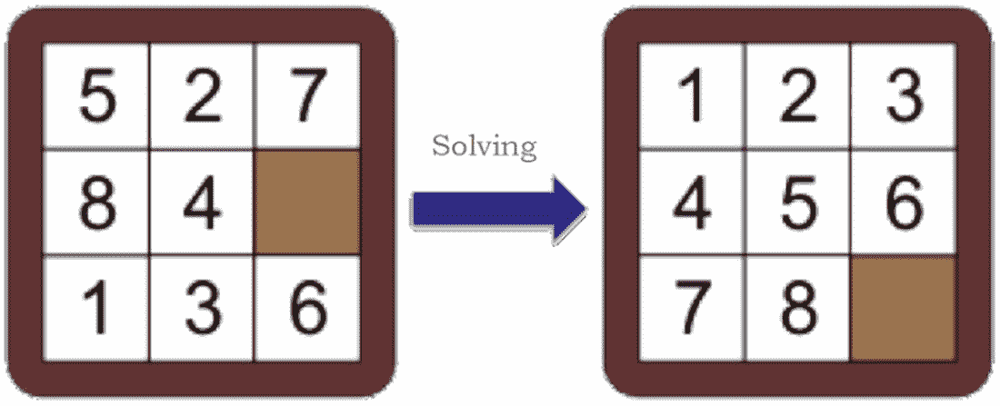
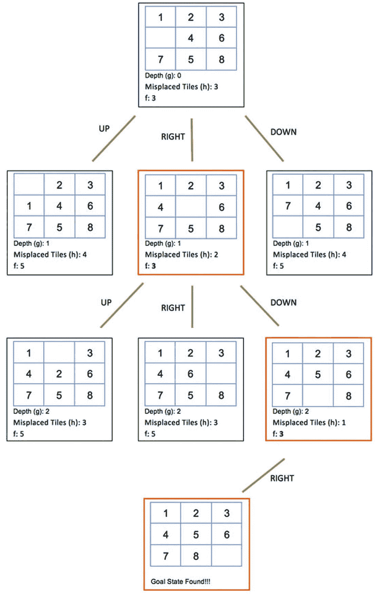
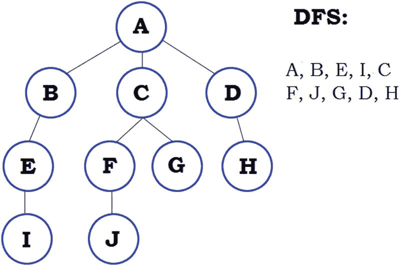
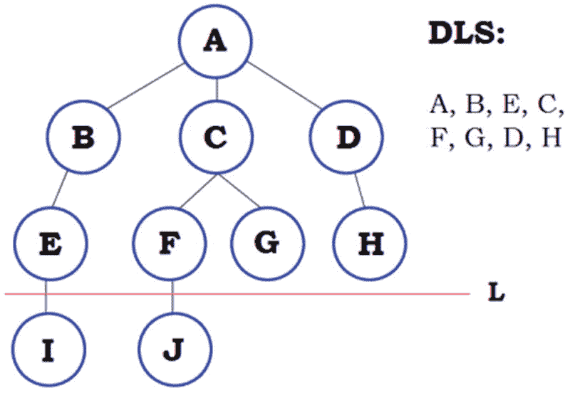
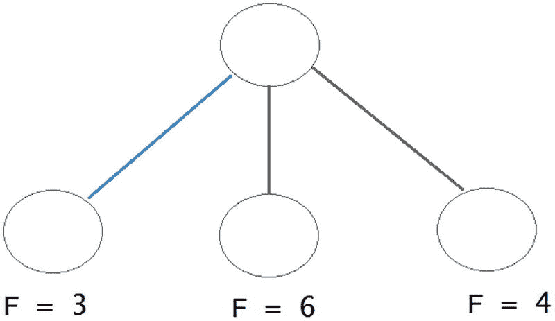
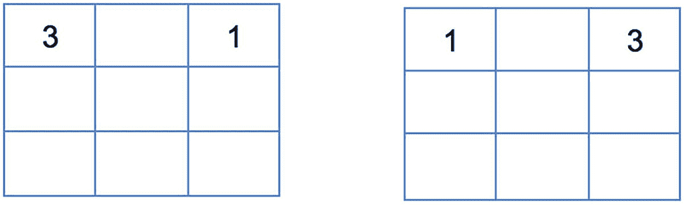
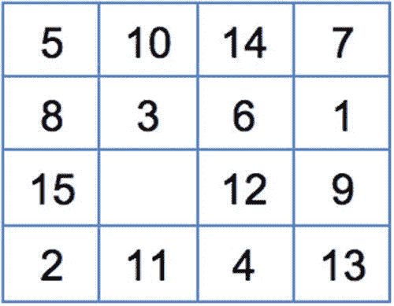
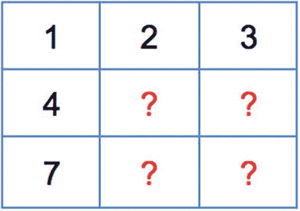

# 15.游戏编程

如今，视频游戏产业是美国经济中价值数十亿美元的部门。在所有 50 个州有数千家公司开发和发行游戏，开发的每一款游戏都涉及几十个[工作](https://en.wikipedia.org/wiki/Job#Job)学科，其组成部分在全球雇佣了数千人。这是一个真正的全球性竞争市场。该行业通常需要在许多不同领域拥有高级技能的专业人士。视频游戏公司必须是创新、创造力、独创性和行业知识的领导者，并且必须不断适应和改变市场。纵观其短暂的历史，视频游戏在图形和真实性方面有了巨大的进步；因此，现代[PC](https://en.wikipedia.org/wiki/Personal_computer#Personal%20computer)的许多进步和创新都归功于游戏行业:[声卡](https://en.wikipedia.org/wiki/Sound_card#Sound%20card)、[显卡](https://en.wikipedia.org/wiki/Graphics_card#Graphics%20card)和 [3D 图形加速器](https://en.wikipedia.org/wiki/3D_graphic_accelerator#3D%20graphic%20accelerator)，更快的[CPU](https://en.wikipedia.org/wiki/CPU#CPU)，以及像 [PhysX](https://en.wikipedia.org/wiki/PhysX#PhysX) 这样的专用协处理器是其中几个最显著的贡献。

这个行业正在继续发展，而且随着它的发展，越来越多的工作岗位可供选择。据《福布斯》杂志报道，2016 年，博彩业对美国 GDP 的经济影响超过 110 亿美元，在可预见的未来，这一数字肯定会增长。全球范围内的公司，如动视暴雪(使命召唤)、Take-Two Interactive (NBA2K 系列)、育碧(刺客信条)和 Crytek(孤岛惊魂)，正在通过影响我们社会和经济生活的现实、令人兴奋的游戏，塑造和改变我们对数字世界现实的看法。

游戏行业雇佣在其他传统行业有经验的人，但是大多数被雇佣的人都有为游戏行业量身定制的经验。这个行业特有的一些学科有[游戏程序员](https://en.wikipedia.org/wiki/Game_programmer#Game%20programmer)(包含 AI)[游戏设计师](https://en.wikipedia.org/wiki/Game_designer#Game%20designer)、[关卡设计师](https://en.wikipedia.org/wiki/Level_designer#Level%20designer)、[游戏制作人](https://en.wikipedia.org/wiki/Game_producer#Game%20producer)、[游戏美工](https://en.wikipedia.org/wiki/Game_artist#Game%20artist)、[游戏测试员](https://en.wikipedia.org/wiki/Game_tester#Game%20tester)。这些专业人士大多受雇于视频游戏开发商或视频游戏发行商。视频游戏开发流程中的一个关键要素是人工智能游戏开发者。

本章的主要目标是描述一些最重要的游戏相关的人工智能方法，特别是那些涉及在领域空间中搜索的方法，这是几乎每个游戏中都必须解决的基本任务。我们将研究搜索算法，如 BFS、DFS、DLS、IDS、双向搜索和 A*，我们将看到如何在开发一个游戏的 AI 时利用它们。我们实现所有先前详细算法的实际问题将被包括在内；在双向搜索和 A*的情况下，我们将把它们描述为面向解决滑动瓦片难题。

Note

索尼、任天堂和微软等公司几乎每年都在改进他们的游戏机(PlayStation、任天堂和 Xbox)，从而为保持全球游戏热做出了贡献。

## 什么是电子游戏？

正如任何其他软件一样，一款游戏会经历一个被称为软件开发的过程，在这个过程中，它会被构思、指定、设计、编码、[记录、](https://en.wikipedia.org/wiki/Software_documentation#Software%20documentation)测试，以及[修正错误](https://en.wikipedia.org/wiki/Software_bugs#Software%20bugs)编辑。因此，视频游戏是一种软件或计算机程序(图 [15-1](#Fig1) )，它使一个人或不同的人能够在尽可能真实的环境中进行互动和玩数字电子游戏，这可以通过显示器(屏幕、镜头等)来感知。)，通过控制器(操纵杆、游戏手柄等)进行交互。)，并由一个平台(电脑、视频控制台、手机等)执行。)—负责向显示器发送图像和声音并使控制器能够进行交互的机器。


图 15-1

The Halo Series (owned by Microsoft) is one of the most popular “shooters” (first person) and science fiction games ever

该平台执行游戏引擎，它是图形和动画、物理、控制器交互、人工智能、声音、网络等的复合，遵循视频游戏定义的逻辑，由开发者编码。

视频游戏的设计阶段通常包括计算机科学家、历史学家、心理学家、音乐家、艺术家和数字营销人员以及其他专业人士的多学科团队的参与。他们一起工作，希望为玩家提供他们所能拥有的最真实的游戏，假设游戏需要这种类型的真实性。

人工智能游戏开发团队将负责为游戏创造人工智能。一个游戏的 AI 是什么？一个游戏的 AI 定义了我们的对手在游戏中有多聪明；例如，在足球、篮球或类似的体育游戏中，为计算机端实现的 AI 将由一组策略、游戏、行为、动作等组成，这些最终为计算机玩家定义了一个复杂的级别，并使我们的游戏和享受变得具有挑战性和娱乐性。

人工智能游戏开发中的一个主要课题是为游戏中的搜索创建算法。游戏中的搜索将是下一节的重点，我们将最终开始深入游戏相关的人工智能算法。

Note

电子娱乐博览会(又名 E3)是世界上最大的游戏展会之一。这是游戏行业的领导者们展示他们最新作品的集合点。

## 在游戏中搜索

有许多游戏必须依靠搜索程序才能达到获胜状态。桌游可能是这种场景的最佳代表；在像滑动瓷砖拼图这样的棋盘游戏中(图 [15-2](#Fig2) )，我们必须在所有可能的树中搜索



图 15-2

Sliding Tiles Puzzle ; a board game that relies on AI search methods

实际上是一个获胜或目标状态的状态。树是用于表示状态空间(所有可能状态的集合)的非常常见的结构。如何定义或生成树取决于具体问题；对于滑动瓷砖拼图情况，空白瓷砖可以交换到的四个位置中的每一个都代表当前节点的子节点。因此，我们会有一个所有可能状态的树，子树如图 [15-3](#Fig3) 所示。



图 15-3

Searching in the Sliding Tiles Puzzle until a goal state is found. In this example we use a heuristics (misplaced tiles) to determine the shortest route (orange boxes) to the goal state.

搜索生成的树为我们提供了一系列的移动——从根或开始状态，一路向下直到目标状态——因此它为我们提供了游戏的解决方案。在图 [15-3](#Fig3) 中，解可以用移动{右，下，右}来表示；因此，从根开始的长度为 3 的路径将我们带到一个目标状态。正如我们将要看到的，将搜索方法与启发式方法相结合的目的是缩短到达目标节点的搜索路径的长度。

搜索策略可以根据以下标准进行分类:

*   系统性:这是一种策略，我们把状态空间构造成一棵树；我们认为战略是系统的，当且仅当
    *   只要没有找到解决方案，搜索就继续，并且仍然有候选项要检查；和
    *   每个候选人都要被审查一次。
*   信息用法:指搜索是否使用了特定领域的知识；即在搜索期间对问题的了解。它可以分类为
    *   知情搜索(最佳优先搜索，a*)；或者
    *   不知情或盲目搜索(BFS、DFS、IDS)。

在本书中，我们将关注系统策略，我们还将讨论知情和不知情的搜索方法。在未来评估搜索算法的性能时，将考虑以下特征:

*   b(分支因子):一个节点的最大子节点数
*   d(深度):从根到叶节点的所有路径的最大长度
*   m:从根到目标状态的任何路径的最小长度

此外，如果一个搜索总是能够找到一个解，我们将断言它是完整的，如果它总是能够找到到达目标状态的最低路径成本，我们将断言它是最优的。

Note

最古老的滑动拼图是 15 拼图，由诺伊斯·查普曼于 1880 年发明。

## 不知情的搜索

在不知情的搜索方法中，边界中的所有非目标节点看起来与算法相同；因此，这种类型的搜索也称为盲搜索。该过程不能确定从节点 X 遵循的路径是否会比从节点 y 遵循的另一路径更好

不知情搜索算法本质上是图算法；他们对树进行操作，而树是一种特殊的图形。因此，这里描述的算法也是图论工具箱的一部分。

广度优先搜索(BFS)是最流行的基于图的搜索算法之一。在这种方法中，节点是按层次发现的；该算法在发现距离为 k + 1 的任何节点之前，先发现距离根为 k 的所有节点(图 [15-4](#Fig4) )。


图 15-4

Traversing the tree using a BFS procedure ; we begin at node A and then discover all nodes from the next level, i.e. nodes B, C, D. We continue like this, discovering nodes at the following level, i.e. nodes E, F, G, H. Finally, we discover nodes I and J at the final level.

当 b 有限时，BFS 是完全的，它的时间和空间复杂度都是 O(b <sup>d</sup> )，如果边代价等于 1，则它是最优的；即，如果在搜索中采取一个步骤的成本等于 1。

深度优先搜索(DFS)是另一种非常流行的基于图的搜索算法，是许多其他此类搜索过程的原型。在 DFS 中，节点通过它们向下的距离被发现；该算法从一个根节点开始，沿着一条路径穿过最左边的子节点，直到到达一片叶子，然后它“回溯”到先前访问过的节点 N，并继续发现 N 的下一个未被访问的子节点。因此，它总是深入构建一条路径，寻找最左边的、未被访问的、最深的节点，并在整个树或图中递归地重复这一过程(图 [15-5](#Fig5) )。注意，在我们可能遇到循环的图中，DFS 必须保证被访问的节点被标记为“已访问”



图 15-5

Traversing the tree using a DFS procedure ; we begin at node A and then follow the path leading to the leftmost, non-visited node; therefore, we build the path formed by nodes A, B, E, I, then backtrack all the way up to the root (only node in the built path that has children pending discovery) and move to the leftmost, non-visited child, which would be C. It recursively executes the same procedure on C and eventually on node D, yielding the path seen on the graphic.

假设我们实现了某种控制机制来确定沿途访问了哪些节点，还假设我们正在处理一个有限的空间，我们可以肯定 DFS 将是完整的；否则，它是不完整的，因为它可能会陷入无限循环。它的时间复杂度是 O(b <sup>m</sup> )，如果 m 比 d 大得多，它可能比 O(b <sup>d</sup> )差得多。它的空间复杂度是 O(b * m)，它不是一个最优的搜索算法。

为了比较 BFS 和 DFS，第一种方法通常应用于这样的场景:我们可能有无限多条路径，可以在短路径中找到解决方案，或者我们可以很容易地丢弃不成功的路径。另一方面，在状态空间受限的情况下，在存在许多具有长路径的可能解决方案的情况下，或者在错误路径通常被快速终止并且搜索可以被相应地调整的情况下，DFS 将是优选的。

BFS 和 DFS 是许多其他搜索算法的主要基础。这些派生的许多试图减少他们的前辈的一些缺点；深度受限搜索和迭代深化搜索就是这种情况。

深度受限搜索(DLS)本质上是一个 DFS，我们设置了一个深度限制 L(图[15-6](#Fig6))；也就是说，深度为 L 的节点没有后继节点，所以这就好像我们在深度为 L 处切割树，从而摆脱了无限路径问题。如果发生 L = d，那么我们将获得最优解；如果 L < d，那么我们将得到一个不完全解，当 L > d 时，我们将得到一个非最优解。



图 15-6

DLS is a DFS with an imposed depth limit L

迭代深化搜索(IDS)是一种发现最佳深度极限 L 的策略；主要思想是使用 DLS 作为子方法，并从 1 逐渐增加深度限制，直到最大预定义深度。这个算法是完全的和最优的；它总是发现最浅的目标节点。

另一个依赖于 BFS 或 DFS 的未知搜索过程是双向搜索(BS)。在 BS 中，我们同时执行两个搜索:一个从初始状态到目标状态，另一个从目标状态向后到初始状态。我们希望这些搜索将在某个时候相遇。因此，在此过程中，我们必须在每一步检查向前扩展的节点集是否与向后扩展的节点集相交。BS 背后的关键动机是时间复杂度，因为从复杂度的角度来看小于 b <sup>d</sup> 。因此，这种方法可以为我们提供一种更有效、更快速的方式来找到目标状态。此外，如果两个搜索(向前，向后)都是 BFS 算法，并且 b 是有限的，那么 BS 保证是最优的和完全的。

## 实际问题:实现 BFS、DFS、DLS 和 IDS

为了开发我们的不知情搜索策略，我们将利用清单 [15-1](#Par40) 中出现的`Tree<T>`类。这个类是一个泛型类，包含一个代表根节点的可能值(整数、字符串、数组、矩阵等等)的属性和一个树子列表。还包括几个构造函数。

```py
public class Tree<T>
    {
        public T State { get; set; }
        public List<Tree<T>> Children { get; set; }

        public Tree()
        {
            Children = new List<Tree<T>>();
        }

        public Tree(T state, IEnumerable<Tree<T>> children)
        {
            State = state;
            Children = new List<Tree<T>>(children);
        }

        public Tree(T state)
        {
            State = state;
            Children = new List<Tree<T>>();
        }

         public bool IsLeaf {
                   get {  return Children.Count == 0; }
          }
    }

Listing 15-1
Tree<T> Class

```

为了实现良好的面向对象设计，我们编写了`UninformedMethod<T>`抽象类(清单 [15-2](#Par42) )作为本节描述的所有不知情搜索策略的共享字段的父类和容器。

```py
public abstract class UninformedMethod<T>
    {
        public Tree<T> Tree { get; set; }

        protected UninformedMethod(Tree<T> tree)
        {
            Tree = tree;
        }

        public abstract List<T>Execute();
    }

Listing 15-2UninformedMethod<T> Class

```

在`Bfs<T>`类中(清单 [15-3](#Par44) ，我们使用一个`Queue`数据结构对 BFS 策略进行编码。该数据结构用于通过将其子节点入队并最终将入队的第一个节点出队来扩展节点；因此，`Queue`的 FIFO(先进先出)特性给了我们一种逐层遍历树的效果。

```py
public class Bfs<T>: UninformedMethod<T>
    {
        public Bfs(Tree<T> tree):base(tree)
        { }

        public override List<T>Execute()
        {
var queue = new Queue<Tree<T>>();
queue.Enqueue(Tree);
var path = new List<T>();

            while (queue.Count> 0)
            {
var current = queue.Dequeue();
path.Add(current.State);

                foreach (var c in current.Children)
queue.Enqueue(c);
            }

            return path;
        }
    }

Listing 15-3
Bfs<T> Class

```

清单 [15-4](#Par46) 中实现的 DFS 依赖于一个堆栈数据结构，该结构用于模拟 DFS 固有的递归性质；因此，它帮助我们避免使用函数递归，并允许我们将编码减少到一个简单的循环。记住:栈是 LIFO(后进先出)数据结构，因此我们以相反的顺序栈子元素，如下面的代码所示。

```py
public class Dfs<T> :UninformedMethod<T>
    {
        public Dfs(Tree<T> tree):base(tree)
        {
        }

        public override List<T>Execute()
        {
var path = new List<T>();
var stack = new Stack<Tree<T>>();
stack.Push(Tree);

            while (stack.Count> 0)
            {
var current = stack.Pop();
path.Add(current.State);

                for (vari = current.Children.Count - 1; i>= 0; i$$)
stack.Push(current.Children[i]);
            }

            return path;
        }
    }

Listing 15-4
Dfs<T> Class

```

任何其他不知情的搜索策略基本上都是之前策略的变体——DFS 和 BFS。清单 [15-5](#Par51) 中所示的深度受限搜索类是 DFS 的直接后代。在这个类中，我们包括两个属性:

*   `DepthLimit`:定义到达的最大深度
*   `Value`:确定要在状态树中查找的值

在这种情况下，我们实现 DFS 算法的递归版本；如果我们使用递归，那么构建从根到`Value`节点的路径会更容易。注意，我们在算法中有三个停止条件:已经找到了`Value`节点，我们已经达到了深度限制，或者我们已经到达了一片叶子。

```py
public class Dls<T>: UninformedMethod<T>
    {
        public intDepthLimit{ get; set; }
        public T Value { get; set; }

        public Dls(Tree<T> tree, intdepthLimit, T value) : base(tree)
        {
DepthLimit = depthLimit;
            Value = value;
        }

        public override List<T>Execute()
        {
var path = new List<T>();
            if (RecursiveDfs(Tree, 0, path))
                return path;
            return null;
        }

        private bool RecursiveDfs(Tree<T> tree, int depth, ICollection<T> path)
        {
            if (tree.State.Equals(Value))
                return true;

            if (depth == DepthLimit || tree.IsLeaf)
                return false;

path.Add(tree.State);

            if (tree.Children.Any(child =>RecursiveDfs(child, depth + 1, path)))
                return true;

path.Remove(tree.State);
            return false;
        }

    }

Listing 15-5
Dls<T> Class

```

最后，迭代深化搜索，如前所述，使用深度限制搜索作为子方法，找到目标状态的最浅深度(清单 [15-6](#Par53) )。

```py
public class Ids<T> :UninformedMethod<T>
    {
        public Dls<T>Dls{ get; set; }
        public intMaxDepthSearch{ get; set; }
        public intDepthGoalReached{ get; set; }
        public T Value { get; set; }

        public Ids(Tree<T> tree, intmaxDepthSearch, T value)
            : base(tree)
        {
MaxDepthSearch = maxDepthSearch;
            Value = value;
        }

        public override List<T>Execute()
        {
            for (var depth = 1; depth <MaxDepthSearch; depth++)
            {
Dls = new Dls<T>(Tree, depth, Value);
DepthGoalReached = depth;
var path = Dls.Execute();
                if (path != null)
                    return path;
            }

DepthGoalReached = -1;
            return null;
        }
    }

Listing 15-6
Ids<T> Class

```

`Ids<T>`通用类包括对应于在树中搜索的`Value`的属性，以及用于确定找到的目标节点的深度(`DepthGoalReached`)和搜索将达到的最大深度(`MaxDepthSearch`)的属性。从`Execute()`方法中，我们可以看到该算法由一个在深度 0、1、…、`MaxDepthSearch`应用 DLS 的循环组成。

让我们在一个控制台应用程序中测试我们的算法，并声明一个树，如清单 [15-7](#Par56) 所示。

```py
var tree = new Tree<string>{ State = "A" };
tree.Children.Add(new Tree<string> { State = "B",
                Children = new List<Tree<string>>
                               {
                                   new Tree<string>("E")
                               } });
tree.Children.Add(new Tree<string> { State = "C",
             Children = new List<Tree<string>>
                               {
                                   new Tree<string>("F")
                               }
            });
tree.Children.Add(new Tree<string> { State = "D" });

varbfs = new Bfs<string>(tree);
vardfs = new Dfs<string>(tree);
vardls = new Dls<string>(tree, 21, "E");
var ids = new Ids<string>(tree, 10, "F");

var path = bfs.Execute();
            //var path = dfs.Execute();
           // var path = dls.Execute();
            //var path = ids.Execute();

foreach (var e in path)
Console.Write(e + ", ");

Listing 15-7Testing Uninformed Search Algorithms

```

取消对每个方法的`Execute()`行的注释，我们将得到如图 [15-7](#Fig7) 所示的结果，按照 BFS、DFS、DLS、IDS 的顺序显示。


图 15-7

Results obtained after executing BFS, DFS, DLS, and IDS

请注意，在这种情况下，正如它所实现的那样，BFS 和 DFS 都按照它们定义的顺序遍历树，而 DLS 和 IDS 则通过查找特定的值来对树执行搜索。

## 实际问题:在滑动拼图上实现双向搜索

作为棋盘游戏的一个例子，我们已经多次提到了滑动瓦片难题，它可以使用像迄今为止讨论的搜索策略来解决，在这一部分，我们将实现一个双向搜索来解决 8 个难题(3 x 3 网格)。将双向搜索应用于滑动瓦片难题的积极方面是，非常容易计算交换操作的反向操作；换句话说，计算一个目标状态的前身是非常容易的。我们只需要在每个可能的方向上移动空白瓷砖。因此，为了从目标状态向后移动，我们不需要实现任何额外的特性，而是稍微修改我们用于向前搜索的相同扩展过程。

首先，让我们检查一下我们将用来处理节点扩展和游戏相关逻辑的`SlidingTilesPuzzle`和`Board`类(清单 [15-8](#Par61) )。`SlidingTilesPuzzle`类非常简单，它唯一的目的是提供一种有意义的方式来引用“游戏”和组织程序的逻辑。开发 AI 的关键支持类是`Board<T>`。

```py
public class SlidingTilesPuzzle<T>
    {
        public Board<T> Board { get; set; }
        public Board<T> Goal { get; set; }

        public SlidingTilesPuzzle(Board<T> initial, Board<T> goal)
        {
            Board = initial;
            Goal = goal;
        }
    }

public class Board<T> :IEqualityComparer<Board<T>>
    {
        public T[,] State { get; set; }
        public T Blank { get; set; }
        public string Path { get; set; }
        private readonly Tuple<int, int> _blankPos;
        private readonlyint _n;

        public Board() {}

        public Board(T[,] state, T blank, Tuple<int, int>blankPos, string path)
        {
            State = state;
            Blank = blank;
            _n = State.GetLength(0);
            _blankPos = blankPos;
            Path = path;
        }

        public List<Board<T>>Expand(bool backwards = false)
        {
var result = new List<Board<T>>();

var up = Move(GameProgramming.Move.Up, backwards);
var down = Move(GameProgramming.Move.Down, backwards);
varlft = Move(GameProgramming.Move.Left, backwards);
varrgt = Move(GameProgramming.Move.Right, backwards);

            if (up._blankPos.Item1 >= 0 && (string.IsNullOrEmpty(Path) || Path.Last() != (backwards ? 'U' : 'D')))
            result.Add(up);

            if (down._blankPos.Item1 >= 0 && (string.IsNullOrEmpty(Path) || Path.Last() != (backwards ? 'D' : 'U')))
            result.Add(down);
            if (lft._blankPos.Item1 >= 0 && (string.IsNullOrEmpty(Path) || Path.Last() != (backwards ? 'L' : 'R')))
            result.Add(lft);
            if (rgt._blankPos.Item1 >= 0 && (string.IsNullOrEmpty(Path) || Path.Last() != (backwards ? 'R' : 'L')))
            result.Add(rgt);

            return result;
        }

        public Board<T>Move(Move move, bool backwards = false)
        {
varnewState = new T[_n, _n];
Array.Copy(State, newState, State.GetLength(0) * State.GetLength(1));
varnewBlankPos = new Tuple<int, int>(-1, -1);
var path = "";

            switch (move)
            {
                case GameProgramming.Move.Up:
                    if (_blankPos.Item1 - 1 >= 0)
                    {
                        // Swap positions of blank tile and x tile
var temp = newState[_blankPos.Item1 - 1, _blankPos.Item2];
newState[_blankPos.Item1 - 1, _blankPos.Item2] = Blank;

newState[_blankPos.Item1, _blankPos.Item2] = temp;
newBlankPos = new Tuple<int, int>(_blankPos.Item1 - 1, _blankPos.Item2);
                        path = backwards ? "D" : "U";
                    }
                    break;
                case GameProgramming.Move.Down:
                    if (_blankPos.Item1 + 1 < _n)
                    {
var temp = newState[_blankPos.Item1 + 1, _blankPos.Item2];
newState[_blankPos.Item1 + 1, _blankPos.Item2] = Blank;
newState[_blankPos.Item1, _blankPos.Item2] = temp;
newBlankPos = new Tuple<int, int>(_blankPos.Item1 + 1, _blankPos.Item2);
                        path = backwards ? "U" : "D";
                    }
                    break;
                case GameProgramming.Move.Left:
                    if (_blankPos.Item2 - 1 >= 0)
                    {
var temp = newState[_blankPos.Item1, _blankPos.Item2 - 1];
newState[_blankPos.Item1, _blankPos.Item2 - 1] = Blank;
newState[_blankPos.Item1, _blankPos.Item2] = temp;
newBlankPos = new Tuple<int, int>(_blankPos.Item1, _blankPos.Item2 - 1);
                        path = backwards ? "R" : "L";

                    }
                    break;
                case GameProgramming.Move.Right:
                    if (_blankPos.Item2 + 1 < _n)
                    {
var temp = newState[_blankPos.Item1, _blankPos.Item2 + 1];
newState[_blankPos.Item1, _blankPos.Item2 + 1] = Blank;
newState[_blankPos.Item1, _blankPos.Item2] = temp;
newBlankPos = new Tuple<int, int>(_blankPos.Item1, _blankPos.Item2 + 1);
                        path = backwards ? "L" : "R";
                    }
                    break;
            }

            return new Board<T>(newState, Blank, newBlankPos, Path + path);
        }

        public bool Equals(Board<T> x, Board<T> y)
        {
            if (x.State.GetLength(0) != y.State.GetLength(0) ||
x.State.GetLength(1) != y.State.GetLength(1))
                return false;

            for (vari = 0; i<x.State.GetLength(0); i++)
            {
                for (var j = 0; j <x.State.GetLength(1); j++)
                {
if (!x.State[i, j].Equals(y.State[i, j]))
return false;
                }
            }

            return true;
        }

        public intGetHashCode(Board<T>obj)
        {
            return 0;
        }
    }

    public enum Move
    {
        Up, Down, Left, Right
    }

Listing 15-8Sliding Tiles Puzzle and Board Classes

```

`Board<T>`类包含以下属性和变量:

*   `State`:T 值矩阵；召回 T 是通用的，因此它可以是任何类型，例如整数、字符串或任何其他类型
*   `Blank`:决定板中要使用的空白元素
*   `Path`:从根到代表该板的节点的路径
*   `_blankPos`:整数元组，决定空白牌在棋盘上的位置
*   `_n`:板子的行数(列数)

在`Expand()`方法中，我们生成当前节点的邻域；换句话说，我们生成一组相邻板(通过在每个可能的方向上移动空白瓷砖获得)。因为我们可以在向前或向后搜索中生成一个移动，所以我们定义了变量`Boolean`backward 来标识生成的移动是向前还是向后。使用这个变量，我们可以控制节点生成的几个方面，并考虑从根节点到目标节点(向前)或从目标节点到根节点执行搜索的情况。这实际上是双向搜索的目的——执行两次搜索，并让它们在途中的某个点相遇。这个交汇点决定了解谜所需的路径或移动顺序。语句`Path.Last() != (backwards ? 'U' : 'D')`保证，无论是向前还是向后搜索，我们都避免在连续的移动中重复状态。例如，如果我们在搜索中向前移动，我们不希望将空白瓦片移动到右边，然后当扩展相同的节点时，将它移动回左边，因为这将使我们处于相同的状态，从而导致算法消耗更多的计算时间。

在`Move()`方法中，我们利用清单 [15-8](#Par61) 中所示的`Move`枚举来开发空白牌移动背后的逻辑，并确定在给定棋盘边界的情况下某些移动是否可行。同样，语句`path = backwards ? "R" : "L"`的目的是决定在当前步骤执行的移动类型，并决定我们是否向后搜索；然后，这个决策被添加到生成的节点的`Path`变量中，作为到目前为止“走过”的路径的扩展。记住向后走的时候，右代表左，左代表右，上代表下，下代表向前看的上。因为，最终，我们想要将这个向后的路径与向前的路径连接起来，所以我们决定从一开始就将它转换成它的“向前”版本。要实现这种转变，我们有前面的说法`(path = backwards ? "R" : "L")`。

因为我们需要比较不同的板来确定向前和向后搜索是否满足，所以我们在`Board<T>`类上实现了`IEqualityComparer<Board<T>>`接口，这迫使我们实现了`Equals()`和`GetHashCode()`方法。最后一个将留给读者作为练习，在本书中我们简单地让它返回 0。第一个比较每块板的`State`矩阵，如果每个单元格一致，则输出 true 否则，它输出 false。

双向搜索类如清单 [15-9](#Par72) 所示。

```py
public class Bs<T>
{
        public SlidingTilesPuzzle<T> Game { get; set; }

        public Bs(SlidingTilesPuzzle<T> game)
        {
            Game = game;
        }

        public string BidirectionalBfs()
        {
varqueueForward = new Queue<Board<T>>();
queueForward.Enqueue(Game.Board);

varqueueBackward = new Queue<Board<T>>();
queueBackward.Enqueue(Game.Goal);

            while (queueForward.Count> 0 &&queueBackward.Count> 0)
            {
varcurrentForward = queueForward.Dequeue();
varcurrentBackward = queueBackward.Dequeue();

varexpansionForward = currentForward.Expand();
varexpansionBackward = currentBackward.Expand(true);

                foreach (var c in expansionForward)
                {
if (c.Path.Length == 1 &&c.Equals(c, Game.Goal))
                        return c.Path;
queueForward.Enqueue(c);
                }

                foreach (var c in expansionBackward)
queueBackward.Enqueue(c);

var path = SolutionMet(queueForward, expansionBackward);

                if (path != null)
                    return path;
            }

            return null;
        }

        private string SolutionMet(Queue<Board<T>>expansionForward, List<Board<T>>expansionBackward)
        {
            for (vari = 0; i<expansionBackward.Count; i++)
            {
                if (expansionForward.Contains(expansionBackward[i], new Board<T>()))
                {
var first = expansionForward.First(b =>b.Equals(b, expansionBackward[i]));
return first.Path + new string(expansionBackward[i].Path.Reverse().ToArray());
}
            }

            return null;
        }
  }

Listing 15-9
Bs<T> Class

```

我们的 BS 算法将执行两次搜索，每次搜索都包含一个 BFS 过程，该过程使用一个队列来遍历状态树的各个级别。我们实现一个 BFS 向前搜索，另一个向后搜索，这两个搜索的交汇点通过`SolutionMet()`方法迭代检查。检查每个长度为 1 的扩展节点是否匹配目标状态的循环充当了目标状态离初始棋盘有一步之遥的场景的基础情况。图 [15-8](#Fig8) 图示了双向搜索算法的功能。


图 15-8

The forward search (on the left) and the backward search (on the right).The point in the middle indicates the current node being processed in the BFS, and the circles around it represent different levels of the tree. Blue points indicate nodes that have been discovered and processed during the search, and gray ones indicate queued nodes. The green points indicate the node where both searches would meet.

两次搜索都在绿点相遇。为了找到向前和向后搜索之间的联系或关系，我们使用`SolutionMet()`方法检查了一组展开的节点(图中的灰点)。此方法的目的是对照向后搜索的所有扩展节点(与中间处理的节点最近的圆中的点)检查向前搜索的所有排队点，并在它们的状态或电路板中寻找匹配。如果找到了完全匹配，那么我们输出通过添加节点的子路径而得到的路径，向前和向后，在那里两个搜索都满足。

为了测试我们的 BS，我们将创建清单 [15-10](#Par76) 中所示的实验。

```py
var state = new[,]
                            {
                                {6, 4, 7},
                                {8, 5, 0},
                                {3, 2, 1}
                            };

vargoalState = new[,]
                            {
                                {1, 2, 3},
                                {4, 5, 6},
                                {7, 8, 0}
                            };

var board = new Board<int>(state, 0, new Tuple<int, int>(1, 2), "");
var goal = new Board<int>(goalState, 0, new Tuple<int, int>(2, 2), "");
varslidingTilesPuzzle = new SlidingTilesPuzzle<int>(board, goal);
varbidirectionalSearch = new Bs<int>(slidingTilesPuzzle);
varstopWatch = new Stopwatch();
stopWatch.Start();
var path = bidirectionalSearch.BidirectionalBfs();
stopWatch.Stop();

            foreach (var e in path)
Console.Write(e + ", ");
Console.WriteLine('\n' + "Total steps: " + path.Length);
Console.WriteLine("Elapsed Time: " + stopWatch.ElapsedMilliseconds / 1000 + " segs");

Listing 15-10Testing Our Bidirectional Search Algorithm on the Hardest 8-Puzzle Configuration

```

在这个实验中，我们使用的是最难的 8 字谜配置之一；在最佳情况下需要 31 个步骤来解决。我们还使用一个类型为`Stopwatch`的对象来测量算法在寻找解决方案时所消耗的时间。执行前面代码后的结果如图 [15-9](#Fig9) 所示。


图 15-9

Solution obtained in 11 seconds

为了验证解决方案的正确性，我们可以简单地循环通过获得的路径或移动列表，并从初始棋盘执行等效的移动，检查最后获得的棋盘是否与目标状态匹配。

Note

在输出 BS 算法的移动序列之前，我们必须反转在反向搜索中获得的路径串。请记住，这条路径是通过在字符串的末尾而不是开头添加移动来构建的；因此，我们必须将其反转，以便获得到达目标节点的正确路径。

## 知情搜索

在知情的情况下，我们除了使用问题本身的定义之外，还使用问题的知识，目的是尽可能有效地利用这些知识来解决问题。因此，在一个有根据的搜索算法中，我们试图聪明地选择要探索的路径。知情搜索方法的一般方法由称为最佳优先搜索的一系列算法表示。

最佳第一搜索类型的方法总是依赖于评估函数 F(n ),该函数将一个值与状态树的每个节点 n 相关联。该值应该表示给定节点距离目标节点有多近；因此，最佳优先搜索方法通常选择具有最低值 F(n)的节点 n 来继续搜索过程(图 [15-10](#Fig10) )。尽管我们将这一系列算法称为“最佳优先”，但实际上没有确定的方法来确定到达目标节点的最低成本路径。如果这是可能的，那么我们总是能够获得一个最优的解决方案，而不需要投入任何额外的努力(启发式等等)。



图 15-10

In a Best First Search method we always pick a node n with the lowest possible F(n) value to continue the search. In this case, F = 3, so the search continues from that node.

因为明智的搜索策略首先搜索状态空间中最有希望的分支，所以它们能够

*   更快地找到解决方案；
*   即使时间有限，也要找到解决方案；和
*   找到更好的解决方案，因为可以检查状态空间中更有利可图的部分，而忽略无利可图的部分。

最佳优先搜索是一种搜索策略，如前所述，是一个算法家族，其主要代表是贪婪最佳优先搜索和 A*搜索。

贪婪的最佳第一搜索基本上是其中评估函数 F(n)是启发式函数的最佳第一搜索；即 F(n) = H(n)。不同问题的启发式函数的例子包括地图上两点之间的直线距离、错位元素的数量等等。它们代表了一种在问题的解决过程中嵌入额外知识的方法。当 H(n) = 0 时，意味着我们已经到达目标节点。贪婪的最佳优先搜索扩展看起来最接近目标但既不是最佳也不是完整的节点(可能陷入无限循环)。这种方法的一个明显的问题是，它没有考虑到当前节点的成本，所以如前所述，它不是最优的，可能会像 DFS 一样陷入死胡同。在我们使用试探法的方法中，如果我们使用一个聪明的试探法，在几个步骤中把我们引向正确的方向，我们可以获得复杂性的大幅降低。

Note

当状态空间太大时，不知情的盲目搜索可能会花费太长时间而不切实际，或者会极大地限制我们能够深入空间的深度。因此，我们必须通过沿途做出明智的决策来寻找减少状态空间面积的方法；也就是说，我们必须寻找明智的方法。

A*搜索(Hart、Nilsson 和 Raphael，1968)是一种非常流行的方法，并且是最佳优先搜索算法家族中最著名的成员。这种方法背后的主要思想是避免扩展已经很昂贵的路径(考虑到遍历根到当前节点的成本)，并且总是首先扩展最有希望的路径。该方法中的评价函数是两个函数的和；即 F(n) = G(n) + H(n)，其中

*   G(n)是到达节点 n 的成本(目前为止);和
*   H(n)是估计从节点 n 到达目标状态的成本的启发式方法。

因为我们实际上是在寻找初始状态和某个目标状态之间的最优路径，所以一个更好的衡量一个状态有多有前途的方法是到目前为止的成本和我们对从那个节点到最近的目标状态的成本的最佳估计的总和(图 [15-11](#Fig11) )。


图 15-11

Diagram showing the relation between G(s) and H(s)

为了引导搜索通过巨大的空间状态，我们使用试探法。试探法提供的信息应该可以帮助我们找到一条可行的、通往目标状态或配置的捷径。

当开发一个启发式算法时，重要的是要确保它拥有可接受的标准。如果试探法没有过高估计从当前状态到达目标状态的最小成本，则该试探法被认为是可接受的，并且如果可接受，则 A*搜索算法将总是找到最优解。

## 滑动瓷砖拼图的 A*

表示滑动瓦片难题的状态空间的树结构将与为双向搜索开发的相同。当前节点的邻域将由将空白图块交换到所有可能位置的棋盘组成。

对于滑动瓷砖难题，最常见的启发是错位瓷砖，这可能也是这个难题最简单的启发。顾名思义，放错位置的牌启发式算法返回放错位置的牌的数量，这些牌在当前棋盘中的位置与它们在目标状态或棋盘中的位置不匹配。这是可以接受的，因为返回的数字没有高估达到目标状态所需的最少移动次数。至少你必须移动每个错位的方块一次，将它们交换到它们的目标位置；因此，这是可以接受的。

重要的是要指出，当计算滑动瓷砖拼图的启发式算法时，我们不应该考虑空白瓷砖。如果我们在启发式计算中考虑空白瓦片，那么我们可能会高估到达目标状态的最短路径的实际成本，这使得启发式不可接受。如图 [15-12](#Fig12) 所示，考虑一下如果我们将离目标状态仅一步之遥的棋盘中的空白牌考虑在内会发生什么。


图 15-12

If we consider the blank tile, our path to a goal state would be 2, but in reality it is 1; thus, we are overestimating the real cost of a shortest path toward a goal state

使用错位图块启发式的 A*算法需要大约 2.5 秒来找到目标状态。实际上，我们可以做得更好，所以让我们试着找到一种更聪明的启发式方法，来降低时间框架和访问的节点数量。

Note

这个问题的 C#完整代码，参考下面作者的文章: [`https://visualstudiomagazine.com/Articles/2015/10/30/Sliding-Tiles-C-Sharp-AI.aspx`](https://visualstudiomagazine.com/Articles/2015/10/30/Sliding-Tiles-C-Sharp-AI.aspx) 。

点 A=(x1，y1)和 B=(x2，y2)之间的曼哈顿距离或块距离被定义为它们对应坐标的绝对差之和:


曼哈顿距离是可接受的，因为对于每个图块，它返回将该图块移动到其目标位置所需的最小步数。曼哈顿距离是一个比放错位置的瓷砖更准确的启发式方法；因此，时间复杂度和访问节点的减少将是实质性的。我们提供了更好的信息来指导搜索，因此可以更快地找到目标。使用这种启发式方法，我们可以在 172 毫秒内得到一个最优解(请参考之前的详细文章以获得完整的 C#代码)。

线性冲突试探法提供了曼哈顿距离没有计算的必要移动的信息。如果 tj 和 tk 在同一直线上，tj 和 tk 的目标位置都在该直线上，tj 在 tk 的右边，tj 的目标位置在 tk 的目标位置的左边，则称两个图块 tj 和 tk 线性冲突。



图 15-13

Tiles 3 and 1 are in the correct row but in the wrong column

为了让它们到达目标位置，我们必须将其中一个向下移动，然后再向上移动；曼哈顿距离不考虑这些移动。一个图块不能出现在多个冲突中，因为解决一个确定的冲突可能意味着解决同一行或列中的其他冲突。因此，如果瓦片 1 在冲突中与瓦片 3 相关，那么它不能与瓦片 2 的冲突相关，因为这可能变成对到达目标状态的最短路径的过高估计，并且可能将我们的试探变成不可接受的试探。

为了测试线性冲突+曼哈顿距离启发式组合，我们将使用图 [15-14](#Fig14) 中所示的 4 × 4 板；这个棋盘需要 55 步才能达到目标状态。节点 n 的值将由 F(n) =深度(n) + MD(n) + LC(n)给出。有可能将这些启发法结合起来，因为它们所代表的移动并不相交，因此我们不会高估到达目标状态的最短路径的成本。



图 15-14

4 × 4 board for testing Manhattan Distance + Linear Conflict heuristic . A 15-tile problem has a much broader state space than the 8-tile problem.

在完成了一个遍历超过一百万个节点、耗时 124199 毫秒(略多于 2 分钟)的执行后，该算法为我们提供了一个解决方案。

模式数据库试探法由包含游戏不同状态的数据库定义。每个状态都与将一个图案(牌的子集)移动到其目标位置所需的最少移动次数相关联。在这种情况下，我们从 8 块瓷砖的目标状态开始，通过反向制作 BFS，构建了一个小的图案数据库。结果保存在一个只有 60，000 个条目的. txt 文件中。为数据库选择的图案通常被称为条纹，在这种情况下，它包含来自顶行和最左列的图块。



图 15-15

Pattern used in 3 × 3 board

模式数据库启发式函数通过查表函数来计算。在这种情况下，它是一个有 60，000 个存储模式的字典查找。它在哲学上类似于分而治之和动态编程技术。

使用模式数据库技术，我们可以获得 50 毫秒的时间来解决最困难的 8-tile 问题或配置。

我们添加到数据库中的条目越多，算法在寻找目标状态时消耗的时间就越少。在这种情况下，内存和时间之间的权衡有利于前者，并帮助我们获得良好的运行时间。它通常是这样工作的；你使用更多的内存来减少算法的执行时间。当您想要解决 4 x 4 谜题或 m x n 谜题(其中 n 和 m 大于 3)时，模式数据库试探法代表了决定性的选择。给读者的最后一个建议是将本节介绍的 A*搜索和试探法与双向搜索和比较结果结合起来。

## 摘要

在这一章中，我们介绍了游戏编程，更具体地说，是游戏中的搜索。我们分析了在状态空间中搜索的基本方法，包括分类为无信息搜索的方法——BFS、DFS、DLS、IDS 和 BS——以及分类为有信息搜索的方法:最佳优先搜索和 A*。我们实现了一个双向搜索，使用 BFS 作为一个子过程。最后，我们展示了如何使用不同的试探法开发滑动瓷砖拼图的 A*搜索，结合其中一些试探法，并通过使用 C# `Stopwatch`类评估它们在时间复杂性方面的性能。