# 17.强化学习

到目前为止，在本书中，我们已经检查了监督和非监督学习算法。在这一章中，我们将讨论强化学习算法。请记住:在监督学习中，我们有一个由样本(x，y)组成的数据集，其中 x 通常是某个对象(房子、飞机、人、城市等)的特征向量，y 是 x 的正确分类。因此，监督学习是从表格数据中学习或逼近函数的过程。这种方法更类似于计算机分析数据的方式，而不是人类分析数据的方式。监督学习模拟了你向某人教授世界上不同种类的物体的过程；例如，你可以向某人展示一个物体的图像及其所有属性(颜色、大小等)。)并给它命名(y)，所以类似(黄色，10cm，可食用，水果)的东西就是香蕉。

在无监督学习中，我们没有监督学习中的标记数据。在这种情况下，我们不使用任何外部信息(数据的正确标签)。在无监督学习中，我们的目标是使用数据本身提供或固有的信息来学习数据的结构，而不像在有监督学习中那样使用任何外部帮助。在这个意义上，可以说无监督学习更独立于外部实体或信息，更依赖于数据结构或数据关系。在第 [13 章](13.html)中讨论过的聚类是无监督学习算法的一个明显例子。

在这一章中，我们将学习强化学习，这种机器学习范式被认为是人类思维方式的最佳近似。这一范式允许我们创建随时间进化的人工智能；“心智”的这种进化是通过对执行不正确或正确行为的主体给予惩罚和奖励来实现的。因此，在本章中，我们将描述马尔科夫决策过程(MDP)，描述强化学习方法，如 Q 学习和时间差异(TD)，并提供一个编码示例，其中 RL 允许我们设计一个代理，该代理可以随着时间的推移提高其性能，并学习如何在最短的步骤数内解决迷宫。

Note

AlphaGo 是谷歌深度思维创造的人工智能，它在 2016 年 3 月击败了复杂围棋世界冠军 Lee Sedol，通过一种强化学习算法学习了这场比赛。

## 什么是强化学习？

与监督学习和非监督学习一样，强化学习(RL)不是一种方法或算法，而是遵循共同思想或范式的一大系列算法。实际上，刚刚提到的三个代表了构建人工智能方法的范例；它们代表蓝图，而算法代表类似于蓝图所详述的过程的实现。

在 RL 范式中，学习是通过试错进行的，其结果要么是奖励，要么是惩罚(负奖励)，目标是实现长期的最高奖励。可以说 RL 是随着时间的推移而不断发展或优化的。图 [17-1](#Fig1) 说明了 RL 算法的基本流程。代理与对其起作用的环境进行交互，然后环境更新代理的状态，并为移动到这个新状态的代理分配奖励(可以是负的)。


图 17-1

Basic flow of a RL algorithm. The agent observes the environment, executes an action to interact with the environment, and receives positive, negative, or zero reward.

重要的是要考虑到回报不一定总是立竿见影的；可能存在奖励为 0 的状态，这与说没有奖励是一样的。当开发一个 RL 方法时，我们建模环境、状态、代理动作和奖励；因此，整个问题是一个马尔可夫决策过程(我们将很快讨论这个主题)。

RL 基于报酬假说，该假说认为所有目标都可以通过期望累积报酬的最大化来描述。

RL 代理可以实现不同的组件——定义代理行为的策略、定义每个状态和/或动作有多好的值函数，以及作为环境表示的模型。

Note

像人类一样，RL 代理可以直接从原始输入(如视觉)中构建和学习自己的知识，而无需任何硬连线功能或特定领域的试探法。

## 马尔可夫决策过程

马尔可夫决策过程(MDP)是形式化描述 RL 环境的最常见方法，许多问题可以建模为 MDP。MDP 是一个离散的状态-时间转换系统，包括一组可能的世界状态 s，一组可能的行动 a，一个实值奖励函数 R(s，a)，每个状态下每个行动的效果描述 T，以及一个初始状态 s <sub>0</sub> 。

为了理解现实生活中的 MDP 是什么，让我们考虑一个环境，一只机器老鼠被困住了，必须找到走出迷宫的路，如图 [17-2](#Fig2) 所示。


图 17-2

The robot mouse must find a way out of the maze. Finding a water location rewards him with +100, finding the cheese has a reward of +10000, and electricty spots result in a punishment or negative reward of -1000.

假设机器老鼠试图在迷宫的尽头获得奶酪的最终奖励(+10000 分)，或者沿途获得水的不太重要的奖励(+100 分)，同时它希望避免产生电击的位置(-1000 分)。老鼠在迷宫中的漫游可以被形式化为一个 MDP，这是一个从一个状态到另一个状态具有特定转移概率的过程。此问题的 MDP 可以建模如下:

*   状态的有限集合:鼠标在迷宫中的可能位置
*   每种状态下可用的一组动作:鼠标在每种状态下的所有可能移动，即{上、下、左、右}，以及何时可用；例如，如果在拐角处，它将只有两个可用的移动
*   状态之间的转换:当前状态(迷宫上的给定单元)和使鼠标机器人处于新位置(状态)的一些动作(向左移动)的组合。转移可以与一组概率相关联，这些概率涉及一个以上的可能状态。
*   与转变相关的奖励:在迷宫场景中以及对于老鼠机器人；大多数奖励是 0，但如果你到达有水或奶酪的地方，奖励是正的，如果你到达有电的牢房，奖励是负的
*   [0，1]范围内的折扣因子γ:量化当前奖励和未来奖励之间的重要性差异。例如，当γ等于 0.7 时，三步后奖励为 5，该奖励的现值为 0.7<sup>3</sup>* 5。
*   无记忆性或马尔可夫性:一旦知道了当前状态，鼠标穿过迷宫的历史就可以被删除，因为当前的马尔可夫状态包含了历史中所有有用的信息。换句话说，“给定现在，未来独立于过去。”这也被称为马尔可夫性质。

现在，我们在 RL 中的目标是在长期内最大化奖励的总和，这由以下公式给出:


其中 t 是时间步长，r(x，a)是奖励函数，x(t)表示代理在时间 t 的状态，a(t)表示在该状态下以及在时间 t 执行的动作。这是 RL 算法试图解决的主要问题，基本上是我们优化时间的优化问题。我们越早获得奖励，对我们的意义就越大，因为折扣系数会随着时间的推移降低奖励的价值。我们使用折扣系数有几个原因:

*   喜欢更早的奖励
*   来代表未来的不确定性
*   动物/人类的行为表现出对即时奖励的偏好
*   避免循环马尔可夫过程中的无限收益(我们很快会定义什么是收益)
*   在处理财务奖励时，即时奖励可能比延迟奖励获得更多的利益。

我们可能在不同的教科书中找到的其他类型的奖励如下:

*   Total Reward:

    

*   Average Reward:

    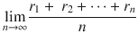

我们也可以把 MDP 看作是马尔可夫奖励过程(MRP)和决策的结合。马尔可夫奖励过程由一组状态 S、状态转移矩阵 T(如前所述)、奖励函数 R 和折扣因子γ组成。

同时，一个 MRP)可以看作是一个有值的马尔可夫链。马尔可夫链(也称为马尔可夫过程)由一组状态 S 和一个状态转移矩阵 t 组成。图 [17-3](#Fig3) 展示了一个 MRP，我们在其中简要地模拟了一个机器人的工作日(它检查脸书)。范围[0.0；1.0]表示从一种状态转移到另一种状态的概率；圆圈表示状态，行表示从一种状态到另一种状态的转换。在这种情况下，最左边的状态是初始状态。

在该图中，所有的动作要么是随机的，即 T : S x A -> Prob(S)，其中 Prob(S)是概率分布，要么是确定性的，其中 T : S x A -> S。

Note

规划和 MDP 都被认为是搜索问题，区别在于前者我们处理明确的行动和子目标，后者我们处理不确定性和效用。

在 MDPs 中，一个地平线决定了我们的决策过程将有一个无限的时间，一个有限的时间，还是一个无限的时间(直到满足某些标准)。具有无限范围的 MDP 更容易解决，因为它们没有截止日期；此外，因为在许多情况下不清楚一个过程将执行多长时间，所以考虑无限优化模型是很流行的。


图 17-3

MRP modeling the working day of an android

无限期回报 v <sub>t</sub> 是从时间步长 t 到无穷大的总贴现回报:

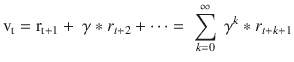

再次注意折扣因子的便利性。如果我们把所有的奖励加起来是无穷的，那么总的来说总数将是无穷的。为了保持数学上的准确性，并给代理施加压力，使其尽早获得奖励，我们使用了折扣因子。

## 价值/行动-价值职能和政策

MRP 和 MDP 中的奖励允许我们根据相关的奖励定义状态的值。这些表格值是 MRP 中值函数、状态-值函数或状态值的一部分。它是从状态 s:

![$$ \mathrm{V}\left(\mathrm{s}\right)=\mathrm{R}\left(\mathrm{s}\right)+\kern0.28em \gamma \ast \sum \limits_{s^{\prime}\in N(s)}^{\mid N(s)\mid }T\left[s,\kern0.28em {s}^{\prime}\right]\ast V\left({s}^{\prime}\right) $$](A449374_1_En_17_Chapter_Eque.gif)

开始的期望收益

在前面的公式中，我们通过对所有可能的下一个状态或邻居状态 s’求和来计算下一个状态的预期长期值，s’是从 s 到 s’转换的概率与无限期预期折扣回报的乘积；即 s’的值。这一公式是基于贝尔曼方程(1957)，也称为动态规划方程，及其最优性原则，即最优策略具有这样的性质，即无论初始状态和初始决策是什么，其余的决策都必须构成相对于第一个决策产生的状态的最优策略。在这种情况下，价值函数可以被分解为即时奖励 R 和后继邻居状态 s’的贴现值；即γ* V(s′)。

Note

在计算机科学中，一个可以分成子问题并产生整体最优解的问题(如使用贝尔曼原理)被称为具有最优子结构。

为了了解如何计算这个等式，让我们假设一个贴现因子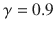和前面图中显示的 MDP；我们可以如下计算最左侧状态(洗脸)的值:

V('洗脸')= 1 + 0.9 * (0.7 * V('吃早饭')+ 0.3 * V('穿衣服'))

请注意，如果我们要设置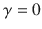，那么与每个状态相关联的值将与其奖励相匹配。为了完全计算 V(s ),对于所有的，我们将需要求解 n 个未知的 n 个方程，考虑 n 是 MRP 中的状态数。

在传统的计划中，我们创建了一个计划，它或者是一个有序的行动列表，或者是一个部分有序的行动集合(我们在前面的章节中讨论过),其执行与环境状态无关。在 MDP 中，假设你可以一步到位地从任何一个州到任何一个州。因此，为了做好准备，通常要计算整个策略，而不是简单的计划。

策略是从状态到动作的映射，它定义了代理在环境中将遵循的动作过程或动作序列。通常用希腊字母 pi: π(s)来表示。由于马尔可夫特性，我们会发现动作的选择只需要依赖于当前状态(也可能是当前时间)，而不依赖于任何先前的状态。我们将试图找到一个政策，对于每一个州，在该州执行该政策的预期回报最大化。我们称这样的策略为最优策略，记为π*(s)。

策略可以是确定性的，为每个状态输出单个动作，也可以是随机的，根据各种概率输出动作。

Note

因为策略是一系列的动作，当你选择一个 MDP 并修正一个策略时，那么所有的动作都被选择了，剩下的就是一个马尔可夫链。

MDP 中遵循策略π的状态-价值函数 V. at 是从状态 s 开始然后遵循策略π的期望收益:

![$$ {\mathrm{V}}_{\pi}\left(\mathrm{s}\right)={\mathrm{R}}_{\pi}\left(\mathrm{s}\right)+\gamma \ast \sum \limits_{s^{\prime}\in N(s)}^{\mid N(s)\mid }{T}_{\pi}\left[s,{s}^{\prime}\right]\ast {V}_{\pi}\left({s}^{\prime}\right) $$](A449374_1_En_17_Chapter_Equf.gif)

最优状态值函数是所有策略的最大值函数，如下:

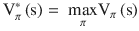

行动-价值函数 Q(s，a)，或简称 Q-函数，是从状态 s 开始，采取行动 a，然后遵循政策π的期望收益，如下:

![$$ {\mathrm{Q}}_{\pi}\left(\mathrm{s},\mathrm{a}\right)=\mathrm{R}\kern0.38em \left(\mathrm{s},\mathrm{a}\right)+\gamma \ast \sum \limits_{s^{\prime}\in N(s)}^{\mid N(s)\mid }{T}_{\pi}^a\left[s,{s}^{\prime}\right]\ast {V}_{\pi}\left({s}^{\prime}\right) $$](A449374_1_En_17_Chapter_Equh.gif)

注意，Q(s，a)可以用 V(s)来表示，它不仅考虑状态，还考虑导致状态的动作。

Note

Q 函数表示给定状态下某个动作的质量。

最优行动价值函数是所有策略的最大行动价值函数，如下:

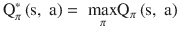

RL 代理的目标是什么？它的目标应该是通过优化 V(s)或 Q(s，a)来学习最优策略；已经证明，所有的最优策略都达到最优的状态-值和行动-值函数，如下:

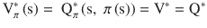

其中 V*、Q*分别代表 V(s)和 Q(s，a)的最优值。因此，尝试优化这些函数之一以获得代理的最优策略似乎是合乎逻辑的。请记住，这是我们在 MDP，尤其是在 RL 的主要目标。

如果代理知道报酬和转移值，那么他可以使用基于模型的算法(称为值迭代)来计算 V*并获得最优策略。

另一种获得最优策略和求解 MDPs 的方法是策略迭代算法。这也是一种基于模型的方法，它直接操纵策略，而不是通过最优值函数间接找到它。正如价值迭代法一样，它假设代理人知道报酬和转移函数。

稍后，我们将讨论 Q-learning，这是一种无模型的学习方法，可用于代理最初只知道某些状态和动作是可能的，但不知道转移和奖励概率函数的情况。在 Q-learning 中，代理通过从与环境交互的历史中学习来改进其行为。只有当它通过一个给定的动作从一个状态进入另一个状态并收到奖励时，它才发现有奖励。类似地，它只是通过结束于给定的状态并查看它的选项来计算出从该状态有哪些转换是可用的。如果状态转换是随机的，它通过观察不同转换发生的频率来学习状态之间转换的概率。

Note

在基于模型的方法中，主体具有环境的内置模型(奖励和转移函数),因此可以模拟它以便找到正确的决策。在无模型方法中，代理知道如何行动，但不明确知道任何关于环境的事情。

## 值迭代算法

在值迭代中，我们将通过应用迭代过程来计算所有状态 s 的 V*(s)，在该迭代过程中，随着时间的推移，V*(s)的当前近似值越来越接近最佳值。我们首先将所有状态的 V(s)初始化为 0。我们实际上可以初始化为我们想要的任何值，但是从 0 开始最简单。该算法使用 V(s)的更新规则；下面几行显示了该方法的伪代码:

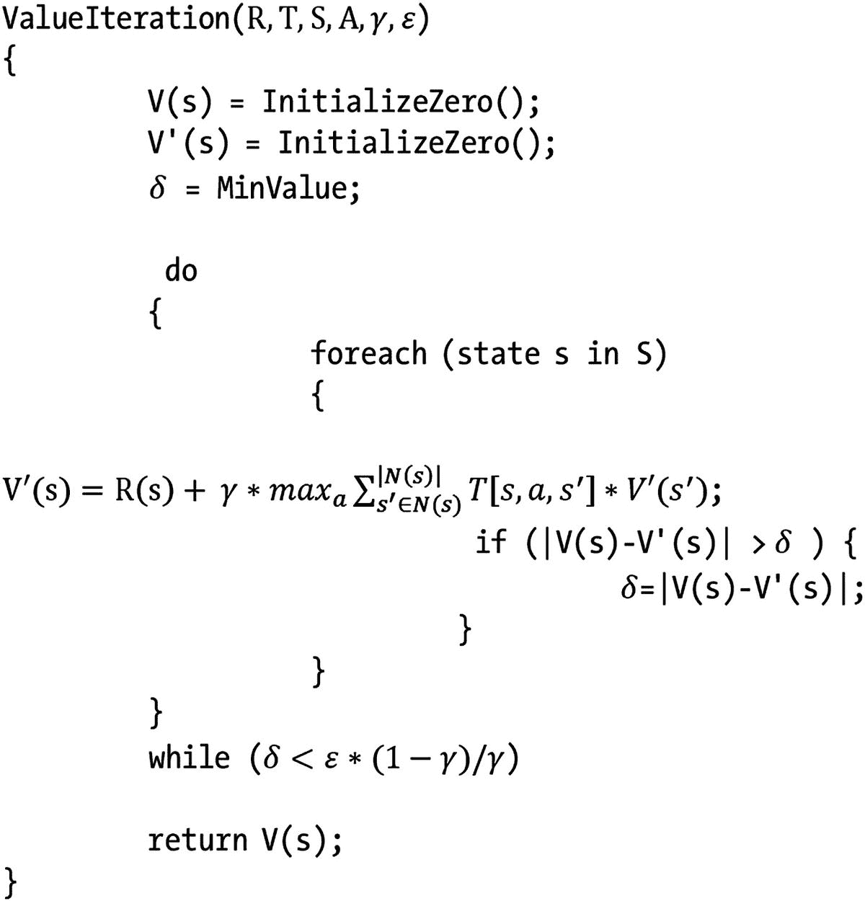

此问题的常见停止条件是从步骤 t 到步骤 t + 1 的值变化小于或等于预定义的ε乘以折扣因子变量，如前面的伪代码所示。在这种情况下，δ代表 V(s)在某次迭代中的最大变化。V 和 V′表示效用向量，ε表示状态效用中允许的最大误差。随着时间的推移，该算法收敛到正确的效用。

## 策略迭代算法

在策略迭代算法中，我们同时搜索最优策略和效用值；因此，我们直接操纵策略，而不是通过最优值函数间接地找到它。该算法的伪代码如下所示:

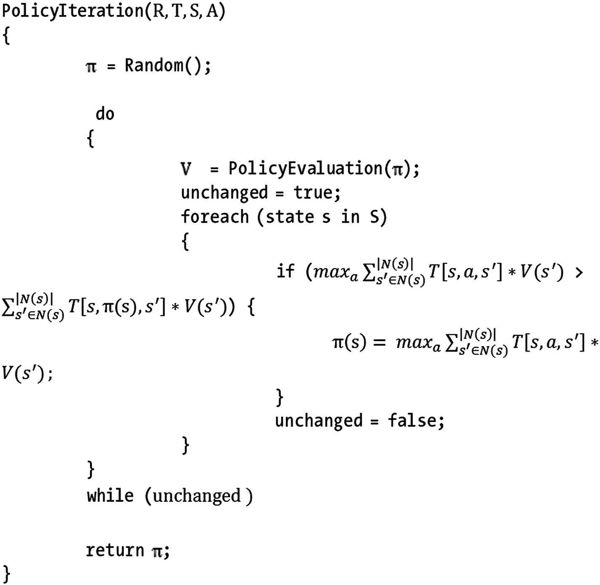

其中 V 是效用向量，π是。显示算法输出的策略，用随机值初始化。`PolicyEvaluation()`子程序解决以下问题:

线性方程组:

![$$ \mathrm{R}\left({\mathrm{s}}_{\mathrm{i}}\right)+\kern0.28em \gamma \ast ma{x}_a\sum \limits_{s^{\prime}\in N\left({s}_i\right)}^{\mid N\left({s}_i\right)\mid }T\left[{s}_i,\kern0.28em \pi \left({\mathrm{s}}_{\mathrm{i}}\right),{s}^{\prime}\right]\ast {V}^{\prime}\left({s}^{\prime}\right) $$](A449374_1_En_17_Chapter_Equk.gif)

PI 选择一个初始策略，通常只是通过把对状态的奖励作为它们的效用，并根据最大期望效用原则计算一个策略。然后，它迭代地执行两个步骤:值确定，在给定当前策略的情况下计算每个状态的效用；以及策略改进，如果有可能进行任何改进，则更新当前策略。当策略稳定时，算法终止。策略迭代往往在几次迭代中收敛，但每次迭代代价很大；回想一下，该方法必须求解大型线性方程组。

## q 学习和时间差异

价值迭代和策略迭代算法非常适合于确定最优策略，但是它们假设我们的代理具有大量特定于问题的知识。具体地说，他们假设代理人准确地知道环境中所有状态的转移函数和回报。这实际上是相当多的信息；在许多情况下，我们的代理可能无法访问这些信息。

幸运的是，有一种方法可以了解这些信息。本质上，我们可以用学习时间换取先验知识。一种方法是通过一种叫做 Q-learning 的强化学习形式。Q-learning 是无模型学习的一种形式，意味着代理不需要有任何环境模型；它只需要知道存在什么状态以及在每个状态下可能采取什么行动。其工作方式如下:我们给每个状态分配一个估计值，称为 Q 值。当我们访问一个州并获得奖励时，我们用这个来更新我们对该州价值的估计。(由于我们的奖励可能是随机的，我们可能需要多次访问一个州。)

考虑到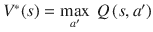，我们可以仅根据 Q 函数重写之前详细的 Q(s，a)公式。

![$$ {\mathrm{Q}}_{\pi}\left(\mathrm{s},\kern0.28em \mathrm{a}\right)=\kern0.28em \mathrm{R}\kern0.28em \left(\mathrm{s},\kern0.28em \mathrm{a}\right)+\kern0.28em \gamma \ast \sum \limits_{s^{\prime}\in N(s)}^{\mid N(s)\mid }{T}_{\pi}^a\left[s,\kern0.28em {s}^{\prime}\right]\ast {Q}_{\pi}\left({s}^{\prime },\kern0.28em a\right) $$](A449374_1_En_17_Chapter_Equl.gif)

前面的公式是在 Q-learning 算法中使用的更新规则，描述如下:

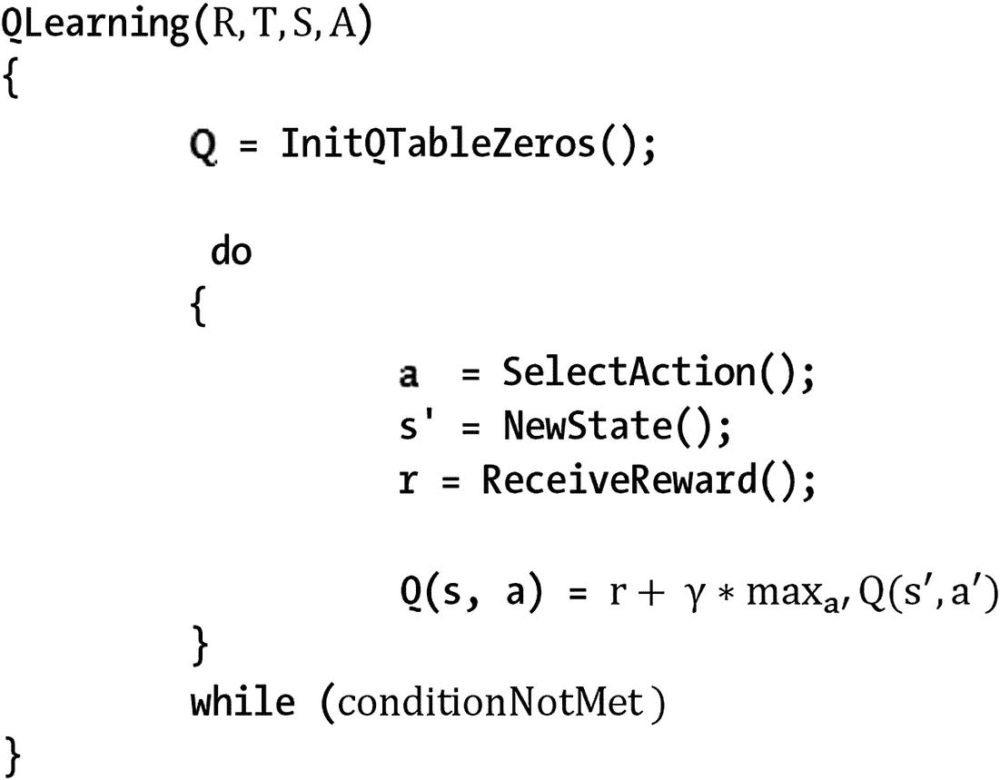

为了使 Q-学习收敛，我们必须保证每个状态被无限频繁地访问；一个人无法从没有经历过的事情中学习，因此，他必须无限地访问每一个国家，以保证收敛并找到最佳政策。

Q-learning 属于一类被称为时间差分算法的方法。在时间差分算法(TDA)中，我们通过减少不同时间帧(t，t’)的估计之间的差异来学习。Q-learning 是 TDA 的一个特例，我们减少了一个状态及其连续状态(也称为邻居或后继)的 Q 估计。我们也可以设计一种算法，减少这个州和更远的后代或祖先之间的差异。

最流行的 TD 算法可能是 TD(λ) (Sutton 1988)，这是 TDA 的一个通用版本，它依赖于我们可以如下计算 Q 的思想:


请注意，在前面的公式中，我们不仅像在 Q-learning 中那样包括一步前瞻，而且还考虑了未来的 n 步。TD(λ)使用一个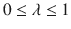参数以如下方式混合各种前瞻距离:

![$$ {\mathrm{Q}}^{\lambda}\left({\mathrm{s}}_{\mathrm{t}},\kern0.28em {\mathrm{a}}_{\mathrm{t}}\right)=\left(1-\lambda \right)\ast \left[{\mathrm{Q}}^1\left({\mathrm{s}}_{\mathrm{t}},\kern0.28em {\mathrm{a}}_{\mathrm{t}}\right)+\lambda \ast {\mathrm{Q}}^2\left({\mathrm{s}}_{\mathrm{t}},\kern0.28em {\mathrm{a}}_{\mathrm{t}}\right)\kern0.28em +{\lambda}^2\ast {\mathrm{Q}}^3\left({\mathrm{s}}_{\mathrm{t}},\kern0.28em {\mathrm{a}}_{\mathrm{t}}\right)+\kern0.28em \dots \right] $$](A449374_1_En_17_Chapter_Equn.gif)

当考虑时，我们最终会想到 Q-learning 规则，即我们只需向前看一步。当我们增加λ时，算法更加强调基于更远的前瞻的差异。当我们达到值时，仅考虑观察到的值，而没有来自当前 Q 估计值的贡献。TD(λ)方法的动机是，在某些情况下，如果考虑更远距离的前视，训练会更有效。

## 实际问题:使用 Q-Learning 解决迷宫

在这个实际问题中，我们将通过一个非常简单直观的场景来演示 Q 学习方法的应用:解决一个迷宫。在迷宫中，代理从单元格(0，0)开始，必须在单元格(n - 1，m - 1)找到出路，其中 n 代表基于零索引的矩阵中的行数，m 代表列数。图 [17-4](#Fig4) 说明了本章要解决的迷宫。

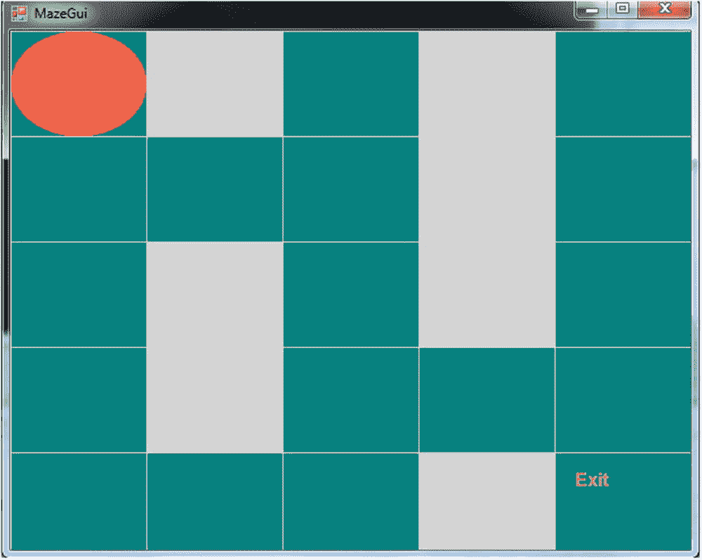

图 17-4

Maze to be solved

注意在前面的迷宫中，代理可以遵循几个策略来到达出口单元，但是只有一个最优策略(图 [17-5](#Fig5) )。

因为学习会随着时间的推移而发生(就像在现实生活中发生的那样),我们必须保证在每一集里对每个状态(细胞)的连续访问；这是 Q-learning 收敛的必要条件。一集是指代理人完成迷宫的过程，每当迷宫完成时，代理人将从 E 集移动到 E + 1 集。

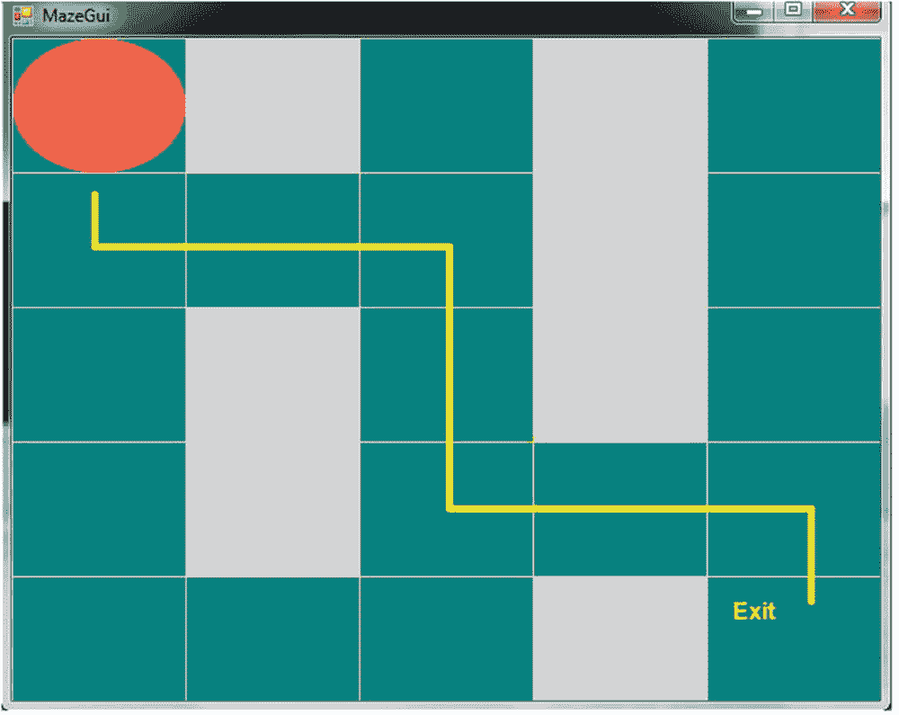

图 17-5

Optimal policy followed by the agent to solve the maze

Q-learning agent，我们称之为 Qagent，由清单 [17-1](#Par76) 中所示的类表示。

```py
public class QAgent
{
        public int X { get; set; }
        public int Y { get; set; }
        public Dictionary<Tuple<int, int>, List<double>> QTable { get; set; }
        public double Randomness { get; set; }
        public double[,] Reward { get; set; }
        private readonly bool[,] _map;
        private readonly int _n;
        private readonly int _m;
        private readonly double _discountFactor;
        private static readonly Random Random = new Random();
        private readonly Dictionary<Tuple<int, int>, int> _freq;

        public QAgent(int x, int y, double discountFactor, int n, int m, double [,] reward, bool [,] map, double randomness)
        {
            X = x;
            Y = y;
            Randomness = randomness;
            InitQTable(n, m);
            _n = n;
            _m = m;
            Reward = reward;
            _map = map;
            _discountFactor = discountFactor;
            _freq = new Dictionary<Tuple<int, int>, int> {{new Tuple<int, int>(0, 0), 1}};
        }
}

Listing 17-1Properties, Fields, and Constructor of the QAgent Class

```

该类包含以下属性或字段:

*   `X`:代表代理人在棋盘上的位置所在的行
*   `Y`:代表代理人在棋盘上的位置栏
*   `QTable`:以表格形式表示 Q 函数的矩阵，即 Q(s，a)函数，其中行表示状态，列表示动作。它被编码为一个`Tuple<int, int> (states)`的字典和一个每个元组的四个(动作上、下、左、右)双精度值的列表。
*   `Randomness`:因为我们不时需要四处游荡，试图让代理访问每个州，所以我们使用`Randomness`变量来表示范围[0；1]对应于产生随机动作的机会。
*   `Reward`:表示每个状态的奖励矩阵
*   `_ map`:表示环境地图(迷宫)的变量
*   `_n`:环境中的行数
*   `_m`:环境中的列数
*   `_discountFactor`:如前详述并在 Q-learning 更新规则中使用的折扣因子
*   `_freq`:详细记录每个国家访问频率的字典；它将被用于策略应用中，以保证代理无限频繁地访问每个状态，并寻求获得最优策略

类构造函数中包含的`InitQTable()`方法(清单 [17-2](#Par89) )是为了初始化`QTable`而创建的；即字典中的(状态，{ `actionUp`，`actionDown`，`actionLeft`，`actionRight` })词条。开始时，对于每个可能的动作 a，Q(s，a) = 0。

```py
private void InitQTable(int n, int m)
{
    QTable = new Dictionary<Tuple<int, int>, List<double>>();

    for (var i = 0; i < n; i++)
    {
        for (var j = 0; j < m; j++)
            QTable.Add(new Tuple<int, int>(i, j), new List<double> { 0, 0, 0, 0});
    }
}

Listing 17-2
InitQTable() Method

```

Q 学习过程发生在以下方法中(列表[17-3](#Par91))；`actionByFreq`参数将决定我们是否使用通过频率+随机性来访问状态的策略，或者我们是否将仅依靠 Q 值来完成迷宫。由于每个学习过程都需要一些时间，我们将需要仅仅依靠频率+随机性策略来尝试“学习”——即，足够频繁地访问每个州，以从这些经验中学习，并最终能够学习到一个最佳政策，该政策将带领我们在最短的时间和最少的步骤中走出迷宫。

```py
public void QLearning(bool actionByFreq = false)
{
    var currentState = new Tuple<int, int>(X, Y);
    var action = SelectAction(actionByFreq);

    if (!_freq.ContainsKey(ActionToTuple(action)))
        _freq.Add(ActionToTuple(action), 1);
    else
        _freq[ActionToTuple(action)]++;
    ActionToTuple(action, true);

    var reward = Reward[currentState.Item1, currentState.Item2];

    QTable[currentState][(int) action] = reward + _discountFactor * QTable[new Tuple<int, int>(X, Y)].Max();
}

Listing 17-3
InitQTable() Method

```

清单 [17-4](#Par93) 中的`SelectAction()`方法编码了非常重要的行动选择策略，它将引导代理学习最优策略。如果`actionByFreq`变量已经被激活(设置为真)，代理将根据频率+随机性策略执行动作；否则，它将总是选择具有最高值的 Q(s '，a)。

```py
private QAgentAction SelectAction(bool actionByFreq)
{
    var bestValue = double.MinValue;
    var bestAction = QAgentAction.None;
    var availableActions = AvailableActions();

    if (actionByFreq)
        return FreqStrategy(availableActions);

    for (var i = 0; i < 4; i++)
    {
        if (!availableActions.Contains(ActionSelector(i)))
            continue;

        var value = QTable[new Tuple<int, int>(X, Y)][i];
        if (value > bestValue)
        {
            bestAction = ActionSelector(i);
            bestValue = value;
        }
    }

    return bestAction;
}

Listing 17-4
SelectAction() Method

```

前面的方法使用清单 [17-5](#Par95) 中的`FreqStrategy()`方法。在该方法中，我们应用概率为 0.5 的随机动作或基于频率的访问；即根据`_freq`字典访问最少访问的邻州。

```py
private QAgentAction FreqStrategy(List<QAgentAction> availableActions)
{
    var newPos = availableActions.Select(availableAction => ActionToTuple(availableAction)).ToList();
    var lowest = double.MaxValue;
    var i = 0;
    var bestIndex = 0;

    if (Random.NextDouble() <= Randomness)
        return availableActions[Random.Next(availableActions.Count)];

    foreach (var tuple in newPos)
    {
        if (!_freq.ContainsKey(tuple))
        {
            bestIndex = i;
            break;
        }

        if (_freq[tuple] <= lowest)
        {
            lowest = _freq[tuple];
            bestIndex = i;
        }

        i++;
    }

    return availableActions[bestIndex];
}

Listing 17-5
FreqStrategy() Method

```

为了确定代理的可用动作集(不会使代理碰壁的动作)，我们在 QAgent 类中包含了 available actions()方法，如清单 [17-6](#Par97) 所示。

```py
private List<QAgentAction> AvailableActions()
{
    var result = new List<QAgentAction>();

    if (X - 1 >= 0 && _map[X - 1, Y])
        result.Add(QAgentAction.Up);

    if (X + 1 < _n && _map[X + 1, Y])
        result.Add(QAgentAction.Down);

    if (Y - 1 >= 0 && _map[X, Y - 1])
        result.Add(QAgentAction.Left);

    if (Y + 1 < _m && _map[X, Y + 1])
        result.Add(QAgentAction.Right);

    return result;
}

Listing 17-6
AvailableActions() Method

```

我们采用了从 0 开始的整数按照{上、下、左、右}的顺序匹配动作的惯例；因此，上= 0，下= 1，左= 2，右= 3。清单 [17-7](#Par100) 中显示的`ActionSelector()`方法将一个整数变异成它的等价动作(我们很快就会看到`QAgentAction`枚举)。

在清单 [17-7](#Par100) 中，我们还可以看到`ActionToTuple()`方法，它将一个`QAgentAction`转换成一个`Tuple<int,int>`，表示执行动作后的结果状态。

```py
public QAgentAction ActionSelector(int action)
{
    switch (action)
    {
        case 0:
            return QAgentAction.Up;
        case 1:
            return QAgentAction.Down;
        case 2:
            return QAgentAction.Left;
        case 3:
            return QAgentAction.Right;
        default:
            return QAgentAction.None;
    }
}

public Tuple<int, int> ActionToTuple(QAgentAction action, bool execute = false)
{
    switch (action)
    {
        case QAgentAction.Up:
            if (execute) X--;
            return new Tuple<int, int>(X - 1, Y);
        case QAgentAction.Down:
            if (execute) X++;
            return new Tuple<int, int>(X + 1, Y);
        case QAgentAction.Left:
            if (execute) Y--;
            return new Tuple<int, int>(X, Y - 1);
        case QAgentAction.Right:
            if (execute) Y++;
            return new Tuple<int, int>(X, Y + 1);
        default:
            return new Tuple<int, int>(-1, -1);
    }
}

Listing 17-7
ActionSelector() and ActionToTuple() Methods

```

为了结束`QAgent`类，我们添加了`Reset()`方法(清单 [17-8](#Par102) )，该方法通过将代理设置为开始位置并清理`_frequency`字典来重置或准备新一集的代理。清单 [17-8](#Par102) 中显示了描述可能的代理动作的`QAgentAction`枚举。

```py
    public void Reset()
    {
        X = 0;
        Y = 0;
        _freq.Clear();
    }

public enum QAgentAction
{
    Up, Down, Left, Right, None
}

Listing 17-8
Reset() Method and QAgentAction Enum

```

我们已经展示了程序的机器学习代码，但是我们缺少一个组件:Windows 窗体上的 GUI。

视觉上表示迷宫的`Form`类的继承者是`MazeGui`，如清单 [17-9](#Par105) 所示。请记住，我们正在编写一个 Windows 窗体应用程序。

```py
public partial class MazeGui : Form
    {
        private readonly int _n;
        private readonly int _m;
        private readonly bool[,] _map;
        private readonly QAgent _agent;
        private Stopwatch _stopWatch;
        private int _episode;

        public MazeGui(int n, int m, bool [,] map, double [,] reward)
        {
            InitializeComponent();
            timer.Interval = 100;
            _n = n;
            _m = m;
            _map = map;
            _agent = new QAgent(0, 0, 0.9, _n, _m, reward, map, .5);
            _stopWatch = new Stopwatch();
        }
}

Listing 17-9Fields and Constructor from MazeGui Class

```

该类包含以下属性或字段:

*   `_n`:迷宫中的行数
*   `_m`:迷宫中的列数
*   `_map`:具有布尔值的矩阵，指示单元是否是墙
*   `_agent`:`QAgent`类的实例
*   `_stopWatch`:秒表，用于测量 Q-learning 过程每一集所用的时间
*   `_episode`:Q-learning 过程中到目前为止执行的片段数

为了在迷宫上绘制所有元素，我们为绘图控件(图片框)实现了`Paint`事件，如清单 [17-10](#Par114) 所示。

```py
private void MazeBoardPaint(object sender, PaintEventArgs e)
{
    var pen = new Pen(Color.Wheat);

    var cellWidth = mazeBoard.Width / _n;
    var cellHeight = mazeBoard.Height / _m;

    for (var i = 0; i < _n; i++)
        e.Graphics.DrawLine(pen, new Point(i * cellWidth, 0), new Point(i * cellWidth, i * cellWidth + mazeBoard.Height));

    for (var i = 0; i < _m; i++)
        e.Graphics.DrawLine(pen, new Point(0, i * cellHeight), new Point(i * cellHeight + mazeBoard.Width, i * cellHeight));

    for (var i = 0; i < _map.GetLength(0); i++)
    {
        for (var j = 0; j < _map.GetLength(1); j++)
        {
            if (!_map[i, j])
                e.Graphics.FillRectangle(new SolidBrush(Color.LightGray), j * cellWidth, i * cellHeight, cellWidth, cellHeight);
        }
    }

    for (var i = 0; i < _map.GetLength(0); i++)
    {
        for (var j = 0; j < _map.GetLength(1); j++)
        {
            if (_map[i, j])
                e.Graphics.DrawString(String.Format("{0:0.00}", _agent.QTable[new Tuple<int, int>(i, j)][0].ToString(CultureInfo.GetCultureInfo("en-US"))) + "," +
                String.Format("{0:0.00}", _agent.QTable[new Tuple<int, int>(i, j)][1].ToString(CultureInfo.GetCultureInfo("en-US"))) + "," +
                String.Format("{0:0.00}", _agent.QTable[new Tuple<int, int>(i, j)][2].ToString(CultureInfo.GetCultureInfo("en-US"))) + "," +
                String.Format("{0:0.00}", _agent.QTable[new Tuple<int, int>(i, j)][3].ToString(CultureInfo.GetCultureInfo("en-US")))
            ,new Font("Arial", 8, FontStyle.Bold), new SolidBrush(Color.White), j * cellWidth, i * cellHeight);
        }
    }

            e.Graphics.FillEllipse(new SolidBrush(Color.Tomato), _agent.Y * cellWidth, _agent.X * cellHeight, cellWidth, cellHeight);
            e.Graphics.DrawString("Exit", new Font("Arial", 12, FontStyle.Bold), new SolidBrush(Color.Yellow), (_m - 1) * cellWidth + 15, (_n - 1) * cellHeight + 15);
}

Listing 17-10Paint Event of the Picture Box Representing the Maze

```

我们将代理绘制为椭圆，墙壁绘制为灰色单元；我们还将在每个可行走单元上绘制四个值:状态 s 和所有可能动作的值 Q(s，a)。

为了从代理获取并执行一个动作，我们包含了一个计时器，它每秒触发一次，并在当前剧集少于 20 集时使用频率+随机性策略调用代理的`QLearning()`方法。也是在处理滴答事件的方法中(清单 [17-11](#Par119) ),我们重置了秒表和代理的状态，并将剧集经过的时间写入一个文件。

Note

当处于目标状态 s 时，我们不应用 Q 学习规则来更新 Q(s，a)；相反，我们取目标状态的奖励值，直接赋给 Q(s，a)。

最后，我们刷新`mazeBoard`来显示 GUI 的新变化。

```py
    private void TimerTick(object sender, EventArgs e)
    {
        if (!_stopWatch.IsRunning)
            _stopWatch.Start();
        if (_agent.X != _n - 1 || _agent.Y != _m - 1)
            _agent.QLearning(_episode < 20);
        else
        {
            _agent.QTable[new Tuple<int, int>(_n - 1, _m - 1)] = new List<double>
                                          {
                                          _agent.Reward[_n - 1, _m - 1],
                                          _agent.Reward[_n - 1, _m - 1],
                                          _agent.Reward[_n - 1, _m - 1],
                                          _agent.Reward[_n - 1, _m - 1]
                                          };
            _stopWatch.Stop();
            _agent.Reset();

            var file = new StreamWriter("E:/time_difference.txt", true);
            file.WriteLine(_stopWatch.ElapsedMilliseconds);
            file.Close();

            _stopWatch.Reset();
            _episode++;
        }

        mazeBoard.Refresh();
    }

}

Listing 17-11Method Handling the Tick Event

```

现在我们已经准备好了所有的组件，让我们试着测试应用程序并运行它，就像我们在本书中所做的那样，在一个控制台应用程序中，创建必要的地图和奖励矩阵(清单 [17-12](#Par121) )。

```py
var map = new [,]
               {
                   {true, false, true, false, true},
                   {true, true, true, false, true},
                   {true, false, true, false, true},
                   {true, false, true, true, true},
                   {true, true, true, false, true}
               };

var reward = new [,]
               {
                   {-0.01, -0.01, -0.01, -0.01, -0.01},

                   {-0.01, -0.01, -0.01, -0.01, -0.01},
                   {-0.01, -0.01, -0.01, -0.01, -0.01},
                   {-0.01, -0.01, -0.01, -0.01, -0.01},
                   {-0.01, -0.01, -0.01, -0.01, 1},
               };

Application.EnableVisualStyles();
Application.SetCompatibleTextRenderingDefault(false);
Application.Run(new MazeGui(5, 5, map, reward));

Listing 17-12Testing the MazeGui Application

```

执行清单 [17-12](#Par121) 中的代码后得到的结果将是贯穿本章开发的 Windows 窗体应用程序的一个实例(图 [17-6](#Fig6) )。奖励函数包含目标状态的奖励为 1，任何其他状态的奖励为-0.01。一旦代理完成第一集，目标状态(退出)将包含每个动作的奖励 1；即`Q('Exit', {up, down, left, right}) = 1`。

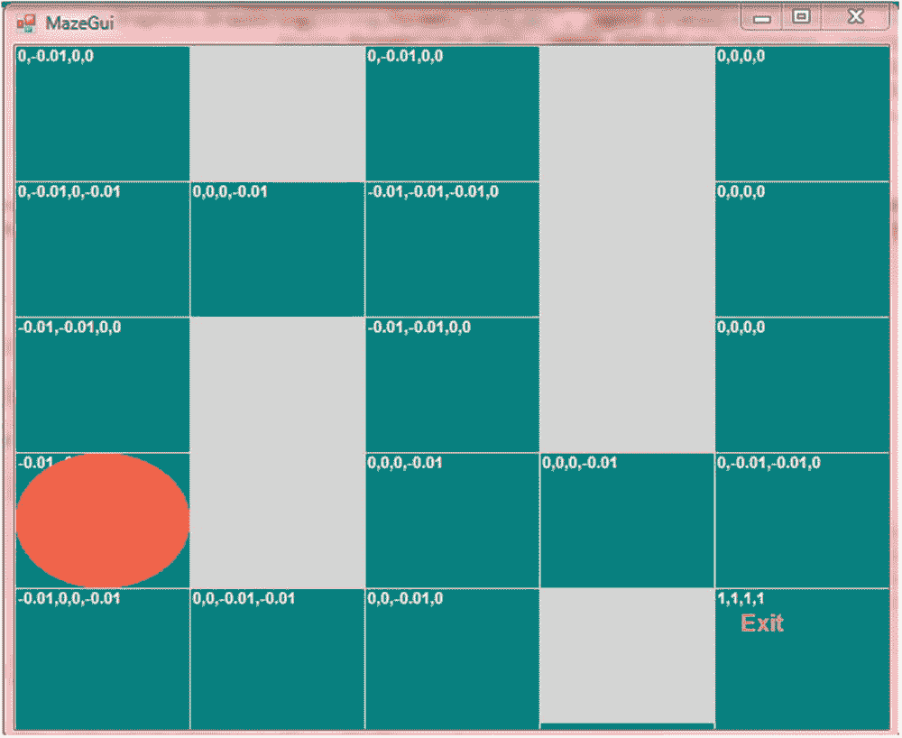

图 17-6

Episode 2, the QAgent is learning and updating Q values, which are shown in the upper-left corner of every cell

使用前面描述的探索策略(我们混合了被访问单元的频率和执行动作的随机性)，我们连续访问每集中的每个状态。在 20 集已经完成之后，代理开始采取仅依赖于所学习的 Q 值的动作，并且总是执行对应于具有最高值的 Q(s’，a)的动作。在这种情况下，我们能够找到最佳策略，详见图 [17-5](#Fig5) 。

图 [17-7](#Fig7) 显示了 20 集过去后 Q(s，a)的最终计算值。读者可以检查从单元(0，0)开始并总是选择具有最高 Q 值的动作(记住它们以向上、向下、向左、向右的顺序出现)的路径将引导它到最优策略，即以最少的步骤数导致退出(目标状态)的策略。


图 17-7

Optimal policy found and executed by the agent

回想一下，我们在 Q 学习中的目标是实际学习 Q 函数，Q(s，a)。在这种情况下，我们学习表格形式的函数，其中状态作为行，动作作为表或矩阵的列。考虑到我们可能有一个很大的状态空间，在某些情况下，这样做可能很难。在这种情况下，我们可以依靠函数逼近器，如神经网络来逼近 Q 函数。这实际上是 Tesauro 在其受欢迎的双陆棋代理中使用的方法，能够击败当时的双陆棋世界冠军。

## 摘要

在这一章中，我们描述了强化学习(RL)这个有趣的话题，它是监督学习和非监督学习中最重要的机器学习范例之一。我们从定义马尔可夫决策过程(MDPs)开始，它是 RL 中用来模拟现实世界问题的数学框架。我们描述了价值函数(V)和行动-价值函数(Q ),并展示了它们之间的关系以及它们在获得最优策略中的重要性。这一章还包括了政策的概念。我们提供了几种求解 MDP 的方法。也就是说，我们详细描述了值迭代和策略迭代算法。最后，我们讨论了 Q-learning 并实现了一个实际问题，我们用它来让一个代理学习如何在最短的步骤内走出迷宫。