# 1.统计和概率

本章的目的是向你灌输传统统计学和概率论的基本概念。当然，你们中的许多人可能想知道它与机器学习有什么关系。为了将最佳模型应用于您的数据，最重要的先决条件是您首先要理解数据。这将使您能够找出数据中的分布，测量数据的质量，并运行一些基本测试来了解因变量和自变量之间是否存在某种形式的关系。让我们开始吧。

Note

本书将 Python 2.7.11 作为编码示例的事实标准。此外，您还需要在练习中安装它。

那么为什么我更喜欢 Python 2.7.11 而不是 Python 3x 呢？以下是一些原因:

*   第三方库对 Python 2x 的支持相对好于对 Python 3x 的支持。这意味着 Python 2x 中有相当多的库缺乏 Python 3x 的支持。
*   一些当前的 Linux 发行版和 macOS 默认提供 Python 2x。目标是让读者，不管他们的操作系统版本如何，都能在他们的系统上应用代码示例，因此这是继续前进的选择。
*   上述事实是公司更喜欢使用 Python 2x 或者决定不将代码库从 Python 2x 迁移到 Python 3x 的原因。

## 案例研究:循环共享计划——决定品牌角色

南希和埃里克被分配了一项艰巨的任务，为一个新的自行车共享计划确定品牌形象。他们必须在今年的年度董事会上展示他们的成果，以便制定一个强有力的营销计划来吸引潜在客户。

自行车共享计划为城市居民提供了一种便捷、廉价、绿色的交通方式。这项服务在西雅图的 50 个站点有 500 辆自行车。每个车站都有一个码头锁定系统(所有自行车都停放在那里)；售货亭(这样顾客可以得到一个会员钥匙或者支付一次旅行的费用)；还有头盔租赁服务。人们可以选择购买会员密钥或短期通行证。会员密钥授予年度会员资格，密钥可以从信息亭获得。会员的优势包括快速取回自行车和无限制的 45 分钟租赁。短期通行证提供 24 小时或 3 天时间间隔的自行车使用。骑车人可以在全市 50 个站点中的任何一个利用和归还自行车。

Jason 于 2014 年 5 月开始这项服务，此后一直专注于增加自行车和扩展坞的数量，以提高客户的便利性和可访问性。尽管如此，客户保持仍然是一个问题。正如 Jason 回忆的那样，“我们计划投资一年，为客户开始使用它奠定必要的基础设施。我们制定了一项战略，以确保保持较高的留存水平，从而使这种模式能够自我持续。但是，它在其他方面发挥了作用(例如，客户群没有跟上基础架构扩展的速度)。”

一家私人服务公司本可以有三种选择来解决这个问题:让赞助商加入进来，提高服务费，或者扩大客户群。价格上涨不是贾森的选择，因为这是一个公共赞助的倡议，目标是为所有人提供负担得起的交通工具。至于增加客户群，他们必须决定一个营销渠道，以保证广泛的低成本。

在企业部门工作了 10 年的营销人员南希和数据分析师埃里克被明确雇佣来寻找解决这个问题的方法。他们的优势在于，他们获得了交易历史的数据集，因此他们不必为收集数据而进行市场调查。

Nancy 意识到，以最小的预算吸引回头客需要首先了解客户(即人物角色)。正如她所说的，“理解你的品牌形象是至关重要的，因为这有助于你接触到目标受众，他们很可能以更高的概率转化。此外，这也有助于接触到目标人物相似的赞助商。这种双重方法可以使我们的底线变得积极。”

当 Nancy 和 Eric 思考手头的问题时，他们有如下问题:哪个属性与旅行持续时间和旅行次数最相关？哪一代人最适应我们的服务？

以下是提供给 Nancy 和 Eric 的 Trips 数据集的数据字典:

表 1-1。

Data Dictionary for the Trips Data from Cycles Share Dataset

<colgroup><col> <col></colgroup> 
| 功能名称 | 描述 |
| --- | --- |
| 行程标识 | 分配给每个行程的唯一 ID |
| 启动时间 | 旅行开始的日期和时间，以太平洋标准时间表示 |
| 停止时间 | 行程结束的日期和时间，以太平洋标准时间表示 |
| 耐克 | 每辆自行车上都贴有 ID |
| 行程持续时间 | 行程时间(秒) |
| 起点站名称 | 旅行始发站的名称 |
| 收件人站名 | 行程终止的车站名称 |
| 从站标识 | 行程始发站的 ID |
| 收件人站标识 | 行程终止的车站 ID |
| 用户类型 | 值可以包括以下任一项:短期通行证持有者或会员 |
| 性别 | 骑手的性别 |
| 出生年份 | 骑手的出生年份 |

本章的练习要求 Eric 安装清单 [1-1](#Par23) 中所示的软件包。他更喜欢在本地机器上实现代码片段时，提前导入所有代码以避免瓶颈。

然而，对于 Eric 来说，要在他的代码中导入这些包，他首先需要安装它们。他是这样做的:

1.  打开的终端/外壳
2.  使用终端/shell 导航到他的代码目录
3.  已安装`pip:`

    ```py
    python get-pip.py

    ```

4.  单独安装每个软件包，例如:

    ```py
    pip install pandas

    ```

```py
%matplotlib inline

import random
import datetime
import pandas as pd
import matplotlib.pyplot as plt
import statistics
import numpy as np
import scipy
from scipy import stats
import seaborn

Listing 1-1.Importing Packages Required for This Chapter

```

## 执行探索性数据分析

Eric 回忆说他曾用下面的话解释过探索性数据分析:

探索性数据分析(EDA)是什么意思？我的意思是直观地看到数据。为什么我们需要直观地看到数据？好吧，考虑到你的数据集中有 100 万个观察值，那么仅仅通过观察来理解这些数据是不容易的，所以最好用可视化的方式来绘制。但是你不认为这是浪费时间吗？不，一点也不，因为理解数据让我们理解特性的重要性和它们的局限性。

### 特征探索

Eric 首先将数据加载到内存中(参见清单 [1-2](#Par26) )。

```py
data = pd.read_csv('examples/trip.csv')
Listing 1-2.Reading the Data into Memory

```

南希很想知道这些数据有多大，看起来像什么。因此，Eric 编写了清单 [1-3](#Par28) 中的代码来打印数据集的一些初始观察结果，以了解它包含的内容。

```py
print len(data)
data.head()
Listing 1-3.Printing Size of the Dataset and Printing First Few Rows

```

输出

```py
236065

```

表 1-2。

Print of Observations in the First Seven Columns of Dataset


在查看了表 [1-2](#Tab2) 和表 [1-3](#Tab3) 后，南希注意到`tripduration`是以秒为单位表示的。此外，`bike`、`from_station`和`to_station`的唯一标识符是字符串形式的，而`trip identifier`的标识符是整数形式的。

表 1-3。

Print of Observations in the Last five Columns of Dataset


### 变量的类型

Nancy 决定更进一步，为数据集中的每个要素分配数据类型。

表 1-4。

Nancy’s Approach to Classifying Variables into Data Types

<colgroup><col> <col></colgroup> 
| 功能名称 | 可变类型 |
| --- | --- |
| `trip_id` `bikeid` `tripduration` `from_station_id` `to_station_id` | 民数记 |
| `Starttime` `Stoptime` | 日期 |
| `from_station_name to_station_name``Usertype`T2】 | 文本 |

在查看了表 [1-4](#Tab4) 中的特征分类后，Eric 注意到 Nancy 已经正确地识别了数据类型，因此对他来说解释变量类型的含义似乎很容易。Eric 记得他解释过:

> In daily data interaction, we usually represent numbers as integers, texts as strings, true/false as Boolean values, and so on. These are what we call data types. However, the jargon in machine learning is more fine-grained, because it divides the previously known data types into variable types. Understanding the types of these variables is very important to determine the types of charts when conducting exploratory data analysis or when deciding to apply appropriate machine learning algorithms to our data.

#### 连续/定量变量

在给定的范围内，连续变量可以有无限个值。与离散变量不同，它们是不可数的。在探讨连续变量的类型之前，让我们先了解一下真正的零点是什么意思。

##### 真零点

如果测量的水平有一个真正的零点，那么 0 值意味着你什么都没有。举个例子，一个比率变量代表购买的纸杯蛋糕的数量。值为 0 表示你连一个纸杯蛋糕都没买。真正的零点是区间变量和比率变量之间的强有力的鉴别器。

现在让我们来探讨不同类型的连续变量。

##### 区间变量

区间变量存在于具有数值的连续数据周围。例如，以每天测量的邻居的温度为例。间隔之间的差异保持恒定，使得 70 摄氏度和 50 摄氏度之间的差异与 80 摄氏度和 100 摄氏度之间的差异相同。我们可以计算区间变量的平均值和中值，但是它们没有真正的零点。

##### 比率变量

区间变量的性质与比率变量的性质非常相似，不同之处在于比率变量中的 0 表示没有该度量。举个例子，某个街区的汽车行驶的距离。以摄氏度为单位的温度是一个区间变量，因此 0 摄氏度并不意味着没有温度。但是，请注意，0 KM 值表示汽车没有行驶任何距离，因此被视为一个比率变量。此外，如名称所示，也可以使用测量比率，例如 50 公里的距离是汽车行驶 25 公里距离的两倍。

#### 离散变量

离散变量在给定的范围内有有限的一组值。不像连续变量是可数的。让我们看一些本质上是分类的离散变量的例子。

##### 序数变量

序数变量的值按照从低到高的顺序排列，反之亦然。序数变量中的这些级别之间可以有不相等的间距。以下列级别为例:

1.  小学
2.  中学
3.  大学
4.  大学

小学和高中在年数上的差别肯定不等于高中和大学的差别。如果这些差异是常数，那么这个变量也可以作为区间变量。

##### 名义可变因素

名义变量是没有内在顺序的分类变量；然而，各级之间存在着持续的差异。名义变量的例子可以是性别、月份、制造商发布的汽车等等。对于一年中的月份，每个月都是不同的级别。

##### 二元变量

二分变量是只有两个类别或层次的名义变量。例子包括

*   年龄:24 岁以下，24 岁以上
*   性别:男，女

#### 潜伏变量

潜在变量不属于探索性变量(即独立变量)或响应性变量(即非独立变量)，但可能影响对这些变量之间关系的解释。例如，如果我们想根据申请人的性别来预测他/她是否会被大学录取。在这种情况下，一个潜在的变量可能是申请人申请入学的部门的名称。

#### 人口变量

人口统计学(来自希腊语，意思是“对人的描述”)是对人口的研究。这门学科研究人口的规模和构成，以及人们从一个地方到另一个地方的流动。人口学家也分析人口增长的影响及其控制。人口统计变量是研究人员收集的变量，用于描述推断统计中使用的样本的性质和分布。在应用统计和研究中，这些变量包括年龄、性别、种族、社会经济指标和群体成员。

#### 因变量和自变量

自变量也称为探索性变量，因为它用于解释或预测因变量，也称为响应变量或结果变量。

考虑数据集，什么是因变量和自变量？比方说，自行车共享系统的管理人员找到您，要求您为他们建立一个系统，以便提前预测出行持续时间，从而确保自行车的供应。那么，你的因变量是什么？绝对是 tripduration。自变量是什么？这些变量将包含我们认为会影响因变量的特征(例如，用户类型、性别、时间和日期)。

Eric 要求 Nancy 在他刚刚解释的变量类型中对特征进行分类。

表 1-5。

Nancy’s Approach to Classifying Variables into Variable Types

<colgroup><col> <col></colgroup> 
| 功能名称 | 可变类型 |
| --- | --- |
| `trip_id` `bikeid` `tripduration` `from_station_id` `to_station_id` | 连续的 |
| `Starttime` `Stoptime` | 日期时间 |
| `from_station_name to_station_name` | 线 |
| `Usertype gender` | 名义上的 |

Nancy 现在对机器学习中的变量类型有了一个清晰的概念，也知道哪些特征符合这些变量类型中的哪些类型(见表 [1-5](#Tab5) )。然而，尽管查看了每个特征的初始观察结果(见表 [1-2](#Tab2) ，她无法推断出每个表所包含信息的深度和广度。她向 Eric 提到了这一点，作为数据分析专家，Eric 给出了答案:对数据集中的要素执行单变量分析。

### 单变量分析

单变量来自单词“uni ”,意思是一。这是对单个变量进行的分析，因此不能解释探索性变量之间的任何关系。

Eric 决定对数据集执行单变量分析，以便更好地理解孤立的特性(参见清单 [1-4](#Par59) )。

```py
data = data.sort_values(by='starttime')
data.reset_index()
print 'Date range of dataset: %s - %s'%(data.ix[1, 'starttime'], data.ix[len(data)-1, 'stoptime'])
Listing 1-4.Determining the Time Range of the Dataset

```

输出

```py
Date range of dataset: 10/13/2014 10:32 - 9/1/2016 0:20

```

埃里克知道南希很难理解这些代码，所以他决定解释那些他认为本质上很复杂的代码。关于清单 [1-4](#Par59) 中的代码，Eric 解释如下:

> We start by sorting the data frames according to `starttime`. Please note that data frame is a data structure in Python, and we initially loaded the data in Listing [1-2](#Par26) into it. Data box is helpful to arrange data in tabular form, and realize quick search by hash value. In addition, data frame provides convenient functions, making data analysis easier. Therefore, what sorting does is to change the position of records in the data frame, so the change of position disturbs the arrangement of indexes arranged in ascending order. Therefore, considering this, we decided to reset the index so that the ordered data frame now has an ascending index. Finally, we printed the date range from the first value `starttime` to the end of the last value `stoptime`.

埃里克的分析提出了两点见解。一是数据范围从 2014 年 10 月到 2016 年 9 月(即三年的数据)。此外，自行车共享服务似乎通常在标准的朝九晚五工作时间之外运营。

南希认为短期通行证持有者将比他们的同行有更多的旅行。她认为大多数人会每天使用这项服务，而不是购买长期会员资格。埃里克不这么认为；他认为，新用户将是短期通行证持有者，然而一旦他们尝试了该服务并感到满意，最终将使会员获得所提供的额外津贴和好处。他还认为，人们倾向于更加重视他们已付费的服务，他们确保每一分钱都得到最大限度的利用。因此，Eric 决定按用户类型绘制出行频率柱状图，以验证他的观点(参见清单 [1-5](#Par66) )。但在此之前，他制作了一份常用图表和最适合这些图表的情况的简要文档(副本见附录 A)。这张图表给了南希他为当前情况选择条形图的观点。

```py
groupby_user = data.groupby('usertype').size()
groupby_user.plot.bar(title = 'Distribution of user types')
Listing 1-5.Plotting the Distribution of User Types

```


图 1-1。

Bar graph signifying the distribution of user types

Nancy 不理解清单 [1-5](#Par66) 中的代码片段。她对 groupby 和 size 方法的功能感到困惑。她回忆起曾问过 Eric 以下问题:“我可以理解，在当前情况下，groupby 按给定的字段，即 usertype，对数据进行分组。但是我们所说的大小是什么意思呢？它是否与 count 相同，即计算属于每个分组用户类型的行程数？”

埃里克对南希的推断感到惊讶，他认为这些推断是正确的。然而，柱状图展示了有利于 Eric 观点的见解(见图 [1-1](#Fig1) ),因为会员往往比同行利用更多的旅行。

南希最近读了一篇文章，文章谈到了喜欢骑自行车的人之间的性别差距。这篇文章提到了英国的自行车共享计划，其中 77%的人利用了这项服务。她不确定在美国使用这项服务的人是否存在类似的现象。因此 Eric 想出了清单 [1-6](#Par70) 中的代码片段来回答手头的问题。

```py
groupby_gender = data.groupby('gender').size()
groupby_gender.plot.bar(title = 'Distribution of genders')
Listing 1-6.Plotting the Distribution of Gender

```


图 1-2。

Bar graph signifying the distribution of genders

图 [1-2](#Fig2) 显示，性别差距在各州也产生了共鸣。男性似乎在作为项目一部分的旅行中占主导地位。

作为营销大师，南希对目前所做的分析很满意。然而，她想更多地了解公司营销信息的目标客户。因此，Eric 决定通过编写清单 [1-7](#Par70) 中的代码来得出出生年份的分布。他认为这将有助于南希了解最有可能骑自行车的年龄组或更倾向于利用这项服务的年龄组。

```py
data = data.sort_values(by='birthyear')
groupby_birthyear = data.groupby('birthyear').size()
groupby_birthyear.plot.bar(title = 'Distribution of birth years', figsize = (15,4))
Listing 1-7.Plotting the Distribution of Birth Years

```


图 1-3。

Bar graph signifying the distribution of birth years

图 [1-3](#Fig3) 提供了一个非常有趣的说明。大多数订阅了该计划的人属于 Y 一代(即出生于 20 世纪 80 年代初至 90 年代中后期，也称为千禧一代)。南希最近读了《精英日报》和《大众扭曲》发表的报告，报告称千禧一代是他们最喜爱的品牌的最忠实的一代。原因之一是他们愿意分享对产品/服务的想法和意见。因此，这些观点形成了一个巨大的经验语料库——足够让千禧一代做出有意识的决定，一个他们将长期保持忠诚的决定。因此，南希确信，大多数千禧一代将成为会员，而不是短期通行证持有者。埃里克决定绘制一个柱状图，看看南希的推断是否成立。

```py
data_mil = data[(data['birthyear'] >= 1977) & (data['birthyear']<=1994)]
groupby_mil = data_mil.groupby('usertype').size()
groupby_mil.plot.bar(title = 'Distribution of user types')
Listing 1-8.Plotting the Frequency of Member Types for Millenials

```

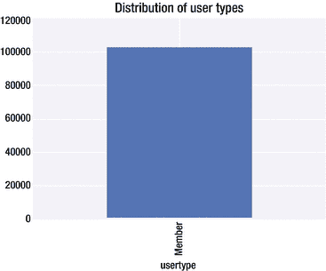

图 1-4。

Bar graph of member types for millenials

看了图 [1-4](#Fig4) 后，Eric 惊讶地发现 Nancy 的推断似乎是正确的，Nancy 做了记录以确保该品牌将千禧一代作为营销计划的一部分。

Eric 知道，当不止一个特征被用作分析的一部分时，会出现更多的见解。因此，他决定让 Nancy 先看一眼多变量分析，然后再继续深入了解。

### 多变量分析

多变量分析是指结合多个探索性变量来理解响应变量的行为。考虑到这个世界中的实体通常是相互连接的，这似乎是最可行和最现实的方法。因此，响应变量的可变性可能会受到相互关联的探索变量的可变性的影响。

南希认为，就完成的旅行而言，男性将会支配女性。图 [1-2](#Fig2) 中的图表显示，男性完成的旅行远多于任何其他性别类型，这让她接受了这一观点。埃里克认为验证这一观点的最佳方法是一个堆积条形图(即，一个代表出生年份的条形图，但每个条形图有两种颜色，每种颜色代表一种性别)(见图 [1-5](#Fig5) )。

```py
groupby_birthyear_gender = data.groupby(['birthyear', 'gender'])['birthyear'].count().unstack('gender').fillna(0)
groupby_birthyear_gender[['Male','Female','Other']].plot.bar(title = 'Distribution of birth years by Gender', stacked=True, figsize = (15,4))
Listing 1-9.Plotting the Distribution of Birth Years by Gender Type

```


图 1-5。

Bar graph signifying the distribution of birth years by gender type

清单 [1-9](#Par80) 中的代码片段带来了一些以前没有突出显示的新方面。

> First, we transform the data frame by splitting, that is, splitting the gender column into three columns, namely male, female and others. This means that for each year of birth, we have travel counts of all three gender types. Finally, create a stacked bar chart by using this transformed data frame.

看起来似乎是雄性主宰了这一分布。这也说得通。没有吗？的确如此。如前所述，大多数旅行都是由男性利用的，因此这种分布偏向于男性。然而，1947 年出生的订户都是女性。此外，1964 年和 1994 年出生的人也以女性为主。因此，南希的假设和推理确实成立。

清单 [1-4](#Par59) 中的分析显示，所有千禧一代都是会员。Nancy 很想知道其他年龄段用户类型的分布情况。是不是其他年龄段的大多数人都是短期通行证持有者？因此，Eric 再次在应用程序中引入了一个堆积条形图(见图 [1-6](#Fig6) )。

```py
groupby_birthyear_user = data.groupby(['birthyear', 'usertype'])['birthyear'].count().unstack('usertype').fillna(0)

groupby_birthyear_user['Member'].plot.bar(title = 'Distribution of birth years by Usertype', stacked=True, figsize = (15,4))

Listing 1-10.Plotting the Distribution of Birth Years by User Types

```


图 1-6。

Bar graph signifying the distribution of birth years by user types

哇哦。Nancy 惊讶地发现只有一种用户类型的分布，而不是两种(即会员和短期通行证持有者)？这是否意味着出生年份信息只存在于一种用户类型中？Eric 决定进一步挖掘并验证这一点(参见清单 [1-11](#Par87) )。

```py
data[data['usertype']=='Short-Term Pass Holder']['birthyear'].isnull().values.all()
Listing 1-11.Validation If We Don’t Have Birth Year Available for Short-Term Pass Holders

```

输出

```py
True

```

在清单 [1-11](#Par87) 的代码中，Eric 首先对数据帧进行切片，只考虑短期通行证持有者。然后，他继续寻找这个切片中出生年份的所有值是否都缺失(即 null)。既然如此，Nancy 最初推断的假设是正确的——出生年份数据只对成员可用。这让她回想起自己之前对千禧一代品牌忠诚度的推断。因此，列表 [1-11](#Par87) 的输出否定了南希在图 [1-4](#Fig4) 中分析后的推断。这让南希很难过，因为千禧一代的忠诚度无法从手头的数据中得到验证。埃里克认为，会员在申请会员资格时必须提供出生年份等详细信息，这不是短期通行证持有者的先决条件。Eric 决定通过检查性别是否适用于短期通行证持有者来测试他的推论，为此他在清单 [1-12](#Par91) 中编写了代码。

```py
data[data['usertype']=='Short-Term Pass Holder']['gender'].isnull().values.all()
Listing 1-12.Validation If We Don’t Have Gender Available for Short-Term Pass Holders

```

输出

```py
True

```

因此，Eric 得出结论，我们没有“短期通行证持有者”用户类型的人口统计变量。

Nancy 有兴趣了解旅行频率如何随日期和时间而变化(即时间序列分析)。Eric 知道旅行开始时间是由数据给出的，但是为了绘制时间序列图，他必须将日期从字符串转换为日期时间格式(参见清单 [1-13](#Par96) )。他还决定做更多的事情:也就是说，将日期时间分成日期部分(例如，年、月、日和小时)。

```py
List_ = list(data['starttime'])

List_ = [datetime.datetime.strptime(x, "%m/%d/%Y %H:%M") for x in List_]
data['starttime_mod'] = pd.Series(List_,index=data.index)
data['starttime_date'] = pd.Series([x.date() for x in List_],index=data.index)
data['starttime_year'] = pd.Series([x.year for x in List_],index=data.index)
data['starttime_month'] = pd.Series([x.month for x in List_],index=data.index)
data['starttime_day'] = pd.Series([x.day for x in List_],index=data.index)
data['starttime_hour'] = pd.Series([x.hour for x in List_],index=data.index)

Listing 1-13.Converting String to datetime, and Deriving New Features

```

埃里克一定要解释清单 [1-13](#Par96) 中的那段代码，就像他向南希解释的一样:

> First, we convert the start time column of the data frame into a list. Next, we will convert the string date into a python datetime object. Then, we convert the list into a series of objects, and the dates are converted from datetime objects to pandas date objects. The time part of year, month, day and hour is derived from the list with datetime object.

现在是时候对数据集中提供的全天出行频率进行时间序列分析了(参见清单 [1-14](#Par100) )。

```py
data.groupby('starttime_date')['tripduration'].mean().plot.bar(title = 'Distribution of Trip duration by date', figsize = (15,4))
Listing 1-14.Plotting the Distribution of Trip Duration over Daily Time

```


图 1-7。

Bar graph signifying the distribution of trip duration over daily time

哇！随着时间的推移，旅行持续时间似乎有一个确定的模式。

### 时间序列组件

Eric 决定向 Nancy 简要介绍时间序列分析中存在的模式类型。他相信这将有助于南希理解图 1-7 中的确定模式。

#### 季节性模式

季节性模式(见图 [1-8](#Fig8) )指的是在一个固定的已知时期后发生的季节性效应。该时间段可以是月中的周、年中的周、年中的月、年中的季度等等。这就是季节性时间序列也被称为周期性时间序列的原因。


图 1-8。

Illustration of seasonal pattern

#### 环型

周期性模式(见图 [1-9](#Fig9) )与季节性模式的不同之处在于模式在非周期性时间周期内重复。


图 1-9。

Illustration of cyclic pattern

#### 趋势

趋势(见图 [1-10](#Fig10) )是连续变量的长期增加或减少。随着时间的推移，这种模式可能不完全是线性的，但是当应用平滑时，它可以推广到任何一个方向。


图 1-10。

Illustration of trend

Eric 决定测试 Nancy 对时间序列的概念，因此他请她提供她对图 [1-7](#Fig7) 中时间序列情节的想法。“你觉得时间系列的剧情怎么样？这种模式是季节性的还是周期性的？季节性的对不对？”

南希的回答再次让埃里克大吃一惊。她说:

> Yes, this is because this pattern repeats at regular intervals-that is, seasonality. In fact, we can split the distribution into three distributions. One pattern is seasonality that repeats over time. The second is flat density distribution. Finally, the last pattern is the line on the density function (that is, rising). In the case of time series prediction, we can use these two distributions to estimate the future time, and add them to make prediction according to the calculated confidence interval.

根据她的推断，南希统计学选修课的成绩似乎有了回报。南希想知道她更多问题的答案。因此，她决定用下面的练习来挑战读者。

Exercises

1.  确定每年旅行次数的分布。你看到一个特定的模式了吗？
2.  确定每月旅行次数的分布。你看到一个特定的模式了吗？
3.  确定每天出行次数的分布。你看到一个特定的模式了吗？
4.  确定每天出行次数的分布。你看到一个特定的模式了吗？
5.  绘制每日出行的频率分布图。

## 测量中心

Eric 认为，像平均值、中值和众数这样的度量有助于给出所讨论的特征的概要视图。考虑到这一点，他决定向 Nancy 介绍度量中心的概念。

### 平均

用外行人的话来说，平均值是指平均数受异常值的影响很大，因为异常值引入的偏斜度会将平均值拉向极值。

*   符号:
    *   μ->参数->总体均值
    *    - >统计- >样本均值
*   均值规则:
    *   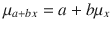

    *   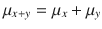

我们将在编码示例中使用 statistics.mean(data)。这将返回数据的样本算术平均值，一个实数值的序列或迭代器。

均值有两种主要的变体。

#### 等差中项

算术平均值比几何平均值简单，因为它对数字进行平均(即，它将所有数字相加，然后将总和除以这些数字的频率)。以一次数学测验中出现的十名学生的成绩为例。

*   78, 65, 89, 93, 87, 56, 45, 73, 51, 81

计算算术平均值将意味着

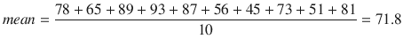

因此，学生数学考试成绩的算术平均值为 71.8。算术平均值最适用于观察值(即数学分数)相互独立的情况。在这种情况下，这意味着一个学生在测试中的分数不会影响另一个学生在同一测试中的分数。

#### 几何平均值

正如我们前面看到的，算术平均值是为相互独立的观察值计算的。然而，这在几何平均值的情况下并不成立，因为它用于计算相互依赖的观察值的平均值。举个例子，假设你把五年的积蓄投资在股票上。每年的收益将会在下一年再投资到股票上。假设我们在五年中的每一年都有以下回报:

*   60%, 80%, 50%, -30%, 10%

这些回报是相互依赖的吗？嗯，是的！为什么？因为下一年的投资是基于上一年积累的资本，因此第一年的亏损意味着下一年投资的资本减少，反之亦然。所以，是的，我们会计算几何平均值。但是怎么做呢？我们将这样做:

*   [(0.6+1)*(0.8+1)*(0.5+1)*(-0.3+1)*(0.1+1)]<sup>1/5</sup>-1 = 0.2713

因此，具有这些回报的投资在第五年末将产生 27.13%的回报。查看上面的计算，您可以看到，起初我们首先将百分比转换为小数。接下来，我们在每个项上加 1，以抵消负项带来的影响。然后，我们将所有项相乘，并对结果进行幂运算。施加的功率是 1 除以观察频率(即，在这种情况下是 5)。最后我们把结果减去 1。做减法是为了抵消加 1 带来的影响，这是我们最初对每一项做的。如果我们没有在每一项(即年回报率)上加 1，就不会减去 1。

### 中位数

中位数是对平均值和众数的中心位置的一种度量，它受数据中异常值的影响较小。当数据中的观察频率为奇数时，中间的数据点作为中值返回。

在本章中，我们将使用 statistics.median(数据)来计算中位数。如果值的频率是奇数，则返回数值数据的中间值；如果值的频率是偶数，则使用“中间两个的平均值”方法返回中间值的平均值。如果数据为空，将引发 StatisticsError。

### 方式

模式适用于离散或名义上的数据。模式返回数据集中频率最高的观测值。模式不受数据中异常值的影响。

### 变化

方差代表数据点相对于平均值的可变性。高方差意味着数据高度分散，而小方差意味着数据紧密聚集。

1.  Symbol:

    

2.  公式:
    1.  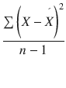

    2.  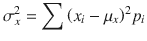

3.  为什么 n-1 低于方差计算？样本方差的平均值小于总体方差；因此，自由度被认为是转换因子。
4.  差异规则:
    1.  

    2.  (If X and Y are independent variables)

        

    3.  (if X and Y have correlation r)

        

我们将在编码练习中加入 statistics.variance(data，xbar=None)来计算方差。这将返回至少两个实数值序列的样本方差。

### 标准偏差

与方差一样，标准差也捕捉了数据沿平均值的分布。唯一的区别是它是方差的平方根。这使得它能够与数据具有相同的单位，从而为从洞察中推断解释提供了便利。标准差受异常值和偏斜分布的影响很大。

*   符号:σ
*   公式:

我们测量标准差而不是方差，因为

*   它是正态分布中传播的自然量度
*   与原始观测值相同的单位

### 由于常数的存在而引起的中心统计量的变化

让我们评估一下当数据通过引入常数进行转换时，中心统计量的表现。我们将评估结果的平均值，中位数，IQR(四分位间距)，标准差和方差。让我们先来看看，当一个常数“a”被加上或减去时，它们会表现出什么样的行为。

添加:添加

*   

*   

*   

*   

*   

给每个观察值增加一个常数会影响平均值、中值和 IQR。然而，标准差和方差保持不变。请注意，当从常数中减去数据中的观察值时，也会出现相同的行为。让我们看看，当我们将一个常数(即“b”)乘以数据中的每个观察值时，是否会重复相同的行为。

乘法:乘以 b

*   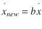

*   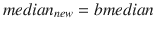

*   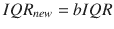

*   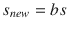

*   

哇！将数据中的每个观察值乘以一个常数会改变中心统计的所有五个测量值。请注意，当数据中的所有观察值除以一个常数项时，您将获得相同的效果。

在阅读完测量中心的描述后，Nancy 有兴趣详细了解旅行持续时间。因此，Eric 想出了计算平均和中间旅行持续时间的主意。此外，Nancy 希望确定大多数旅行的始发站，以便为现有客户开展促销活动。因此，Eric 决定确定“from_station_name”字段的模式。

Note

使用统计包确定中心的测量值需要我们将输入数据结构转换为列表类型。

```py
trip_duration = list(data['tripduration'])
station_from = list(data['from_station_name'])
print 'Mean of trip duration: %f'%statistics.mean(trip_duration)
print 'Median of trip duration: %f'%statistics.median(trip_duration)
print 'Mode of station originating from: %s'%statistics.mode(station_from)
Listing 1-15.Determining the Measures of Center Using Statistics Package

```

输出

```py
Mean of trip duration: 1202.612210
Median of trip duration: 633.235000
Mode of station originating from: Pier 69 / Alaskan Way & Clay St

```

清单 [1-15](#Par100) 的输出显示，大部分行程从 69 号码头/阿拉斯加道&克雷站出发。因此，这是针对现有客户开展促销活动的理想地点。此外，输出显示平均值大于平均值。南希很好奇为什么平均值(即均值)大于中心值(即中值)。根据她所读到的内容，她意识到这可能是由于中间值之后的一些极值，或者是由于大多数值位于中间值之后。埃里克决定绘制旅行持续时间的分布图(见清单 [1-16](#Par180) ，以确定哪个前提成立。

```py
data['tripduration'].plot.hist(bins=100, title='Frequency distribution of Trip duration')
plt.show()
Listing 1-16.Plotting Histogram of Trip Duration

```


图 1-11。

Frequency distribution of trip duration

图 [1-11](#Fig11) 中的分布只有一个峰值(即众数)。该分布是不对称的，并且具有朝向模式右侧的大部分值。这些向右的极值在数量上可以忽略不计，但它们的极端性质往往会将平均值拉向自己。因此均值大于中值的原因。

图 [1-11](#Fig11) 中的分布称为正态分布。

### 正态分布

正态分布，或者说高斯分布，是一种钟形的连续概率分布。这种分布的重要特征是平均值位于这种分布的中心，其周围有一个分布(即标准偏差)。正态分布中的大多数观察值位于平均值附近，并且随着远离平均值而逐渐消失。大约 68%的观察值位于平均值的 1 个标准偏差内；95%的观察值位于平均值的 2 个标准偏差内，而 99.7%的观察值位于平均值的 3 个标准偏差内。平均值为零且标准差为 1 的正态分布称为标准正态分布。图 [1-12](#Fig12) 显示了正态分布和置信区间。


图 1-12。

Normal distribution and confidence levels

以下是最常见的置信水平:

<colgroup><col> <col></colgroup> 
| 可信度 | 公式 |
| --- | --- |
| 68% | 平均 1 个标准差。 |
| 95% | 平均值±2 标准偏差。 |
| 99.7% | 平均值±3 标准偏差。 |

#### 歪斜

偏斜度是对缺乏对称性的一种度量。前面显示的正态分布是对称的，因此没有偏态元素。存在两种类型的偏斜度(即正偏斜度和负偏斜度)。

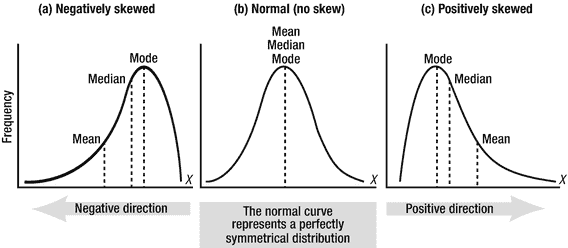

图 1-13。

Skewed and symmetric normal distributions

如图 [1-13](#Fig13) 所示，以下每个变化的中心测量值之间存在关系:

*   对称分布:均值=中位数=众数
*   正偏态:平均值
*   负偏态:均值>中值>众数

浏览图 [1-12](#Fig12) 你会发现图 [1-13(c)](#Fig13) 中的分布右边有一条长尾。这可能是由于异常值的存在。

#### 极端值

异常值是指与大多数观察值不同的值。这些或者是自然发生的，由于设备故障，或者是由于输入错误。

为了理解什么是异常值，我们需要看一下图 [1-14](#Fig14) 。

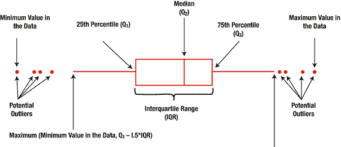

图 1-14。

Illustration of outliers using a box plot

从图 [1-14](#Fig14) 中我们可以看到，位于晶须外部的观察值被称为异常值。

```py
[Q1 – 1.5 (IQR) ,  Q3 + 1.5 (IQR) ] (i.e. IQR = Q3 - Q1)

Listing 1-17.
Interval of Values

Not Considered Outliers

```

不在此区间内的值被视为异常值。知道 Q1 和 Q3 的值是进行计算的基础。

数据集中出现异常值有好处吗？通常不会！那么，我们如何处理数据集中的异常值呢？以下是最常用的方法:

*   去除异常值:只有当异常值与有意义值的比例很低，并且数据值不在时间序列范围内时，这才是可能的。如果离群值的比例很高，那么删除这些值将会损害数据的丰富性，并且应用的模型将无法捕捉到其中的真正本质。然而，在数据具有时间序列性质的情况下，从数据中移除异常值是不可行的，原因是对于要有效训练的时间序列模型，数据应该相对于时间是连续的。在这种情况下，移除异常值会在连续分布中引入间断。
*   用平均值代替异常值:另一种方法是取位于图 [1-14](#Fig14) 所示区间的值的平均值，计算平均值，并用这些值代替异常值。这将成功地将异常值转换为与有效观测值一致；然而，这将移除数据集中原本存在的异常，他们的发现可能会提供有趣的见解。
*   转换异常值:处理异常值的另一种方法是将它们限制在可接受数据的上限和下限。上限可以通过将 Q3 和 IQR 的值代入 Q3 + 1.5IQR 来计算，下限可以通过将 Q1 和 IQR 的值代入 Q1-1.5 iqr 来计算。
*   变量转换:转换用于将继承分布转换为正态分布。离群值给数据带来非正态性，因此转换变量可以减少离群值的影响。转换方法包括但不限于自然对数、将数据转换成比率变量等。

Nancy 很想知道异常值是否存在于我们的数据集中——更准确地说是在`tripduration`特性中。为此，Eric 决定首先通过编写清单 [1-18](#Par202) 中的代码来创建一个箱线图(参见图 [1-15](#Fig15) ),以便直观地查看异常值，然后通过应用清单 [1-19](#Par204) 中的区间计算方法来检查异常值。

```py
box = data.boxplot(column=['tripduration'])
plt.show()
Listing 1-18.Plotting a Box plot of Trip Duration

```

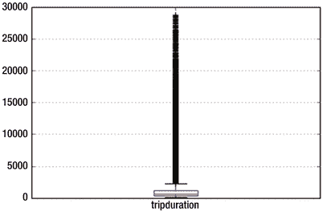

图 1-15。

Box plot of trip duration

南希惊讶地发现，在图 [1-15](#Fig15) 的箱线图中，出行持续时间存在大量异常值。她问 Eric 是否可以确定异常值在旅行持续时间值中所占的比例。她想知道异常值是数据集的一小部分还是大部分。为此，Eric 编写了清单 [1-19](#Par204) 中的代码。

```py
q75, q25 = np.percentile(trip_duration, [75 ,25])
iqr = q75 - q25
print 'Proportion of values as outlier: %f percent'%(
(len(data) - len([x for x in trip_duration if q75+(1.5*iqr) >=x>= q25-(1.5*iqr)]))*100/float(len(data)))
Listing 1-19.Determining Ratio of Values in Observations of tripduration Which Are Outliers

```

输出

```py
Proportion of values as outlier: 9.548218 percent

```

埃里克对南希解释了清单 [1-19](#Par204) 中的代码如下:

> As shown in Figure [1-14](#Fig14) , Q3 represents the 75th percentile and Q1 represents the 25th percentile. Therefore, we use the `numpy.percentile()` method to determine the values of Q1 and Q3\. Next, we calculate IQR by subtracting them. Then, we determine the subset of values by applying the intervals specified in Listing [1-18](#Par202) . Then, we use this formula to get the number of outliers.

```py
Number of outliers values = Length of all values - Length of all non outliers values
Listing 1-20.Formula for Calculating Number of Outliers

```

在我们的代码中，`len(data)`决定所有值的长度，所有非异常值的长度由`len([x for x in trip_duration if q75+(1.5*iqr) >=x>= q25-(1.5*iqr)]))`决定。

因此，清单 [1-20](#Par209) 中的公式被用于计算被视为异常值的比率。

```py
Ratio of outliers = ( Number of outliers values / Length of all values ) * 100
Listing 1-21.Formula for Calculating Ratio of Outlier Values

```

Nancy 看到数据集中只有 9.5%的值是异常值时松了一口气。考虑到数据集的时间序列性质，她知道移除这些异常值不是一个选项。因此，她知道她唯一可以依赖的选择是对这些离群值进行转换，以否定它们的极端性质。然而，她对观察旅行持续时间的非异常值的平均值感兴趣。然后，她想将这个值与清单 [1-15](#Par176) 中之前计算的所有值的平均值进行比较。

```py
mean_trip_duration = np.mean([x for x in trip_duration if q75+(1.5*iqr) >=x>= q25-(1.5*iqr)])
upper_whisker = q75+(1.5*iqr)
print 'Mean of trip duration: %f'%mean_trip_duration
Listing 1-22.Calculating z scores for Observations Lying Within tripduration

```

输出

```py
Mean of trip duration: 711.726573

```

清单 [1-22](#Par214) 中的非异常值行程持续时间值的平均值(即大约 712)远低于清单 [1-15](#Par176) 中异常值的计算值(即大约 1203)。这最好地描述了均值受数据集中异常值的影响很大的概念。

南希很好奇为什么埃里克要初始化变量`upper_whisker`，因为在清单 [1-22](#Par214) 的代码中没有用到它。Eric 对此有一个免责声明:“upper_whisker 是右(即正)须的最大值，即所有值都有效的边界 uptill，任何大于该值的值都被视为异常值。你很快就会明白为什么我们在这里初始化它。”

一旦离群值被转换成有效值集，Eric 对结果统计很感兴趣。因此，他决定从一个简单的异常值转换开始，转换为清单 [1-22](#Par214) 中计算的有效值的平均值。

```py
def transform_tripduration(x):

    if x > upper_whisker:
        return mean_trip_duration
    return x

data['tripduration_mean'] = data['tripduration'].apply(lambda x: transform_tripduration(x))

data['tripduration_mean'].plot.hist(bins=100, title='Frequency distribution of mean transformed Trip duration')
plt.show()

Listing 1-23.Calculating Mean Scores for Observations Lying Within tripduration

```

埃里克记得带着南希看了清单 [1-23](#Par220) 中的代码。我们初始化了一个名为`transform_tripduration`的函数。该函数将检查行程持续时间值是否大于上限晶须边界值，如果是这样，它将用平均值替换它。接下来，我们将`tripduration_mean`作为一个新列添加到数据帧中。我们这样做是通过应用`transform_tripduration`函数定制修改已经存在的`tripduration`列。

南希认为图 [1-16](#Fig16) 中的转换分布是一个正态分布。比较图 [1-16](#Fig16) 和图 [1-10](#Fig10) 可知，改造后偏斜度已经大大降低。此外，大多数观察值的`tripduration`为 712，这主要是因为所有大于晶须上边界的值都没有转换为清单 [1-22](#Par214) 中计算的非异常值的平均值。南希现在有兴趣了解这种转换后的分布的度量中心是如何出现的。因此 Eric 想出了清单 [1-24](#Par224) 中的代码。

```py
print 'Mean of trip duration: %f'%data['tripduration_mean'].mean()
print 'Standard deviation of trip duration: %f'%data['tripduration_mean'].std()
print 'Median of trip duration: %f'%data['tripduration_mean'].median()

Output

Mean of trip duration: 711.726573
Standard deviation of trip duration: 435.517297
Median of trip duration: 633.235000

Listing 1-24.Deternining the Measures of Center in Absence of Outliers

```


图 1-16。

Frequency distribution of mean transformed trip duration

由于异常值的平均值变换，Nancy 期望平均值与清单 [1-22](#Par214) 中的平均值相同。在图 [1-16](#Fig16) 中，她知道 711.7 处的提升是众数，这意味着在变换之后，均值与众数的均值相同。最让她惊讶的是，中位数正在接近均值，这意味着我们在图 [1-16](#Fig16) 中看到的正偏度并没有那么强。

根据图 [1-1](#Fig1) 中的发现，Nancy 知道男性在出行方面占主导地位。因此，她有兴趣看到男性的旅行持续时间，并重复对他们的异常处理。因此，她为你想出了这些练习题，希望你能获得进一步的见解。

Exercises

1.  找出性别类型为男性的旅行持续时间的平均值、中值和众数。
2.  通过查看之前获得的数字，您认为分布是对称的还是偏斜的？如果是偏斜的，那么是正偏斜还是负偏斜？
3.  绘制按性别类型划分的出行持续时间的频率分布图。它是否像你在上一个问题中那样验证了你的推断？
4.  绘制一个雄性出行持续时间的方框图。你认为有离群值存在吗？
5.  应用清单 [1-6](#Par70) 中的公式确定存在异常值的观察值的百分比。
6.  通过结合我们之前讨论的异常值处理方法之一来执行异常值处理。

南希和埃里克进行的多元分析得出了一些好的见解。然而，南希很想知道是否存在一些统计测试来确定两个变量之间的关系强度。她想利用这些信息来确定对旅行持续时间影响最大的要素。相关性的概念突然出现在 Eric 的脑海中，他决定在进一步分析之前分享他的知识库。

## 相互关系

相关性是指两个数量特征之间关系的强度和方向。相关值 1 意味着正方向上的强相关，而相关值-1 意味着负方向上的强相关。值为 0 表示定量特征之间没有相关性。请注意，相关性并不意味着因果关系；也就是说，一个实体中的变化不会强制另一个实体中的变化。

属性与其自身的相关性意味着相关值为 1。由于多重共线性的存在，许多机器学习算法无法提供最佳性能。多重共线性是指所选要素之间存在相关性，因此通常建议在考虑进行分析之前检查数据集要素之间的所有成对相关性。

以下是最常见的关联类型:

### 皮尔逊相关

Pearson R 相关性是三种相关性中最常见的，通常适用于计算两个线性相关且呈正态分布的定量变量之间的关系。例如，以股票市场中两种密切相关的证券为例，检查它们之间的关联程度。

### 肯德尔等级相关

与适合于正态分布数据的 Pearson 相比，Kendall 秩相关是一种非参数检验，用于确定两个数量特征之间关系的强度和方向。非参数技术的目标是正态分布以外的分布。相反，参数技术的目标是正态分布。

### 斯皮尔曼等级相关

Spearman 等级相关是一种非参数检验，就像 Kendall 等级相关一样，不同之处在于 Spearman 等级相关不对数据的分布做出任何假设。Spearman 秩相关最适合于有序数据。

南希很想知道年龄的变化是否会带来旅行持续时间的线性变化。为此，Eric 决定将 Pearson R 相关性应用到实践中，并决定在两个量之间绘制散点图，以便直观地查看它们之间的关系。

```py
data = data.dropna()
seaborn.pairplot(data, vars=['age', 'tripduration'], kind='reg')
plt.show()
Listing 1-25.Pairplot of trip duration and age

```

。

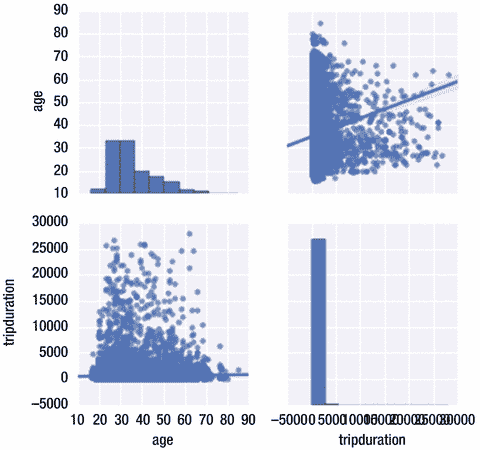

图 1-17。

Pairplot between trip duration and age

在查看图 [1-17](#Fig17) 时，Nancy 没有发现旅行持续时间和年龄之间的任何确定模式。如图 [1-18](#Fig18) 所示，存在较小的正相关性

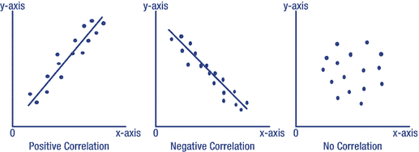

图 1-18。

Correlation directions

南希知道完美的正相关意味着数值为 1；因此，她想知道年龄和`tripduration`之间的相关值是否为正，是否接近 1。Eric 编写了清单 [1-26](#Par245) 中的代码来实现这一点。

```py
pd.set_option('display.width', 100)
pd.set_option('precision', 3)

data['age'] = data['starttime_year'] - data['birthyear']

correlations = data[['tripduration','age']].corr(method='pearson')
print(correlations)

Listing 1-26.Correlation Coefficient Between trip duration and age

```

输出

```py
                tripduration    age
tripduration    1.000           0.058
age             0.058           1.000

```

相关系数大于 0，根据南希的推断，这是正相关，但远小于 1 意味着本质上是弱相关。

南希意识到简单的分析意味着考虑并分析一个特征。另一个更复杂的方法是将特征分成其类别(例如，将性别分成男性和女性)，然后分别对这两个组块进行分析。她不知道哪种方法是正确的，因此询问埃里克的意见。Eric 想到引入 t 统计的概念，并为 Nancy 做了一个小演示。

## 假设检验:比较两组

在通过方法论来比较两组之前，理解无效假设和替代假设是很重要的。

零假设是我们试图在假设检验中找到反对的证据。零假设通常是研究人员基于以前的知识或经验做出的初始主张。替代假设具有不同于零假设的总体参数值。另类假设是你希望最终成为事实的东西。进行统计检验是为了确定在假设检验中哪一个是正确的。如果实验支持零假设，那么我们说实验在拒绝零假设上失败了。你可能会想，这和接受零假设不是一样的吗？哦，不！无罪实际上并不意味着一个人是无辜的。

### t 统计

t-指以标准误差单位表示的差异。这存在于两种最常见的变体中:

单样本测试

这是对总体平均值和假设值之间显著差异的证据的搜索。

双样本 t

这是当你试图找到人口平均数之间的显著差异的证据。注意，来自两个分布的样本应该是相互独立的。

t 值和 p 值有内在联系。t 值的绝对值越大，p 值越小，因为分布集中在平均值周围，因此拒绝零假设的概率越高。

t 值可以是正值也可以是负值。T 在任一方向上的数值越大，反对没有显著差异(即零假设)的证据就越多。反之亦然，如果 t 值接近 0，则意味着总体平均值之间或总体平均值与假设值之间没有显著差异。

与相关等统计现象相反，t 值是通过从整个总体中抽取一个值来计算的。假设采样是随机的，那么每次计算 t 值时，答案都会出现随机采样误差(即，与之前计算的 t 值有所不同)。

t 分布有助于确定从整个群体中随机抽样所导致的变化幅度。

### t 分布和样本量

自由度指的是你可以从多个选项中自由选择的情况。通常这是样本大小- 1。自由度(DF)定义了高斯分布的扩散。DF 越大，尾部的概率密度越小，分布紧密地聚集在平均值周围。小样本量更有可能是不寻常的，因此即使零假设成立，也有进一步远离零假设的危险。因此，在计算 t 值时，最好有一个大样本量。

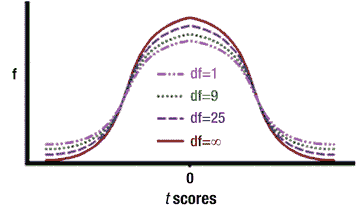

图 1-19。

Change in t-distributions due to changes in sample size

让我们计算所有类别的性别和用户类型的双尾 t 检验(见清单 [1-27](#Par263) )。我们这样做是为了了解不同的类别在方差上是否有相似之处。如果他们这样做，那么他们将被认为是一个群体；否则，它们将在分析模式中被分开处理。

```py
for cat in ['gender','usertype']:
    print 'Category: %s\n'%cat
    groupby_category = data.groupby(['starttime_date', cat])['starttime_date'].count().unstack(cat)
    groupby_category = groupby_category.dropna()
    category_names = list(groupby_category.columns)

    for comb in [(category_names[i],category_names[j]) for i in range(len(category_names)) for j in range(i+1, len(category_names))]:

        print '%s %s'%(comb[0], comb[1])
        t_statistics = stats.ttest_ind(list(groupby_category[comb[0]]), list(groupby_category[comb[1]]))
        print 'Statistic: %f, P value: %f'%(t_statistics.statistic, t_statistics.pvalue)
        print '\n'

Listing 1-27.Computing Two-Tail t-test of Categories of gender and user types

```

输出

```py
Category: gender

Female Male
Statistic: -38.572176, P value: 0.000000

Female Other
Statistic: 48.248666, P value: 0.000000

Male Other
Statistic: 53.180282, P value: 0.000000

Category: usertype

Member Short-Term Pass Holder
Statistic: 14.393456, P value: 0.000000

```

代码和输出对南希来说都没有任何意义；因此 Eric 解释如下:

> First, we cycle two characteristics: gender and age. For each of these features, we first divide its columns into category columns. For example, gender is divided into male, female and other. Next, we made category pairs and made T statistics on them. For example, male-female, male-other and so on. The results of all categories seem to be the same. What do I mean by that? For all comparisons, the value of p in the output seems to be about 0\. If we adopt the 95% confidence interval, it will be converted into a P value of 0.05\. None of the above statistics has exceeded the P value benchmark we set. This leads us to the conclusion that in modeling, we need to treat all these categories separately, because they all have different variances.

南希现在在一定程度上了解她的听众，但她想知道更多，为此，她计划提出一个问题并进行抽样调查。因此，她问埃里克是否能给她讲一两个这方面的概念。埃里克知道中心极限定理在抽样和分析中有着举足轻重的价值，所以他想出了一个例证。

## 中心极限定理

例如，考虑由具有明确定义的平均值和标准偏差的随机样本组成的任何分布。现在，让我们从分布中随机选取一些样本，并计算平均值和标准偏差。随着样本量(即 n)的增加，均值和标准差收敛于高斯正态分布。换句话说，随着从任意分布增加采样，它收敛到具有给定平均值和标准偏差的正态分布。那么，该定理影响行为的抽样规模应该有多大呢？

*   样本量越大，抽样分布就越接近正态分布。
*   任意分布越接近正态分布，满足定理所需的采样就越少。在这种情况下，统计学家通常建议样本大小为 30 到 40。

Eric 决定用手头的数据来辅助解释中心极限定理(见清单 [1-28](#Par274) )。

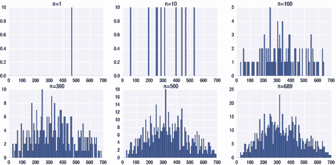

图 1-20。

Distributions of daily tickets on different sample sizes

```py
daily_tickets = list(data.groupby('starttime_date').size())
sample_tickets = []
checkpoints = [1, 10, 100, 300, 500, 1000]
plot_count = 1

random.shuffle(daily_tickets)

plt.figure(figsize=(15,7))
binrange=np.array(np.linspace(0,700,101))

for i in xrange(1000):
    if daily_tickets:
        sample_tickets.append(daily_tickets.pop())

    if i+1 in checkpoints or not daily_tickets:
        plt.subplot(2,3,plot_count)
        plt.hist(sample_tickets, binrange)
        plt.title('n=%d' % (i+1),fontsize=15)        
        plot_count+=1

    if not daily_tickets:
       break

plt.show()

Listing 1-28.Script to Validate Central Limit Theorem on Trips Dataset

```

Eric 对清单 [1-28](#Par274) 中的代码解释如下:

> Shuffle randomly is to change the order of tickets every day. Once completed, then fix different sample sizes to observe the distribution change as a function of sample size. Note that in Figure [1-20](#Fig20) , with the increase of sample size, the distribution seems to change to normal distribution. This verifies the central limit theorem.

## 案例研究结果

埃里克和南希的演绎帮助他们更好地理解他们的观众，并获得有价值的见解。这些见解是根据 2014 年至 2016 年收集的数据得出的，人口统计信息仅适用于会员，不适用于短期通行证持有者。因此，为了获得关于短期通行证持有者的信息，南希知道她必须通过市场调查练习，在那里中心极限定理将派上用场。旅行持续时间遵循一定的季节性模式，并随着时间的推移而重复。预测这一时间序列可以帮助 Nancy 预测公司需要推进其营销工作的时间，以及预期的大多数差旅有助于确保运营效率的时间。至于促销活动，南希现在知道，启动活动的最佳地点是 69 号码头/阿拉斯加路&克莱街，离群值只是数据集的一小部分；然而，他们的时间序列性质意味着这些离群值不能被删除，因此转换被应用。关于进一步的分析，Nancy 现在意识到由于特征不是同质的，所以必须在单个类别级别上进行分析。

Nancy 不确定他们应用的技术是否已经过时，或者在现实世界中是否也有应用。因此，Eric 编辑了下面的应用程序列表，他的业内朋友使用这些应用程序将统计和概率带入生活。

## 统计和概率的应用

统计和概率的应用在几个研究领域都很活跃。

### 保险统计计算科学

精算师使用数学、概率论、统计学、金融、经济学、计算机科学和建模的概念来评估和定价风险。它们的应用案例存在于保险、咨询公司和政府领域。

### 生物统计学

统计学在生物学的各个分支中都有应用。这包括生物实验的设计和从中做出推论。深入研究生物统计学揭示了受试者(病人、细胞等)的例子。)对某些刺激(如药物)表现出变异。生物统计学家使用推理统计学来解释这些异常现象。

### 天体统计学

天体统计学是统计分析、天体物理学和数据挖掘的结合。从自动扫描 cosmos 收集的数据被用来进行推断。

### 商业分析

业务分析使用运营和统计理论来制作预测模型。它还结合了优化技术，为客户和业务主管提供有效的见解。

这些见解使公司能够自动化和优化其业务流程。商业智能与商业分析的不同之处在于，商业智能帮助我们回答发生了什么，而商业分析帮助我们理解这种异常现象的原因(即，它首先发生的原因以及它再次发生的可能性)。这些分析用于各种业务领域，如企业优化、欺诈分析、定价分析、供应链分析等。

### 计量经济学

应用统计方法估计经济关系构成计量经济学。一些例子包括衡量离婚法对离婚和结婚率的影响，移民政策影响下本地工人工资的变化，或预测通货膨胀率、利率或国内生产总值的宏观经济变量。

### 机器学习

几种机器学习算法都是基于统计理论或统计理论的高级版本。这方面的一个例子是通常使用的贝叶斯理论。

### 统计信号处理

使用过去的语音语料库来确定口语单词的最高概率。此外，统计信号处理用于以下应用:

*   博弈论
*   估计和过滤
*   信号处理
*   线性系统

### 选举

竞选经理利用民意调查的结果来推断他们的政党在即将到来的选举中获胜。