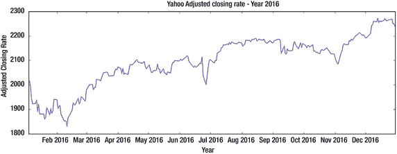
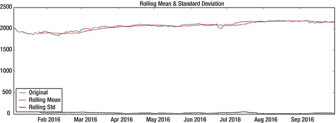
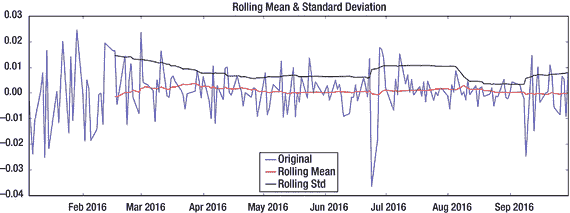
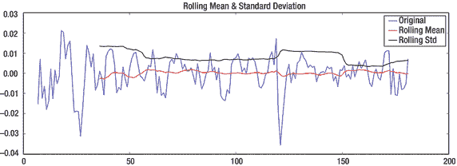
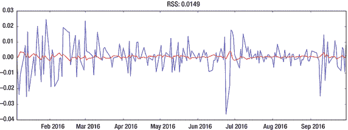

# 三、时间序列

本章的目标是让你开始时间序列预测。时间序列预测不同于回归预测，因为时间作为一个探索性变量，应该是等间隔连续的。本章将涵盖平稳的概念，它的重要性，以及检查它在时间序列对象中的存在的方法。将应用几个时间序列模型，并用最有效的评估技术来检验它们的预测。

Note

本书将 Python 2.7.11 作为编码示例的事实标准。此外，您需要为练习安装它。

## 案例研究:预测雅虎每日调整收盘价格

大卫和他的客户贾尼斯约好第二天见面。他们正在开会调查贾尼斯收益下降的原因。贾尼斯是一位百万富翁商人的女儿，她在听到市场预计将随着经济形势的不断升级而增长的猜测后找到了大卫。她有兴趣采取长期高风险的立场，以享受潜在的高投资回报。然而，尽管资本市场前景良好，但本季度她的回报率却有所下降。

大卫搜索了珍妮丝的投资组合，开始逐个查看每只股票的表现，看看每只股票在上一季度的表现如何。他发现投资组合回报和预期回报之间不匹配的原因是雅虎股票预测中的巨大残差。如果股票数量只占整个投资组合的一小部分，这种预测误差的影响会很小，但在这种情况下并非如此。

大卫回忆了他在哈佛商学院学习的公司财务和商业分析课程，并决定尝试用这些概念来解决这个问题。他应该应用回归还是时间序列？他可以运用哪些技术来预测雅虎股票？

David 从 Python 提供的 Matplotlib 财务包中提取了有关雅虎股票的数据(代码片段见清单 [3-2](#Par12) )。

David 做了一些研究，以了解数据中的每个要素都包含哪些信息。他为雅虎股票价格数据集设计了一个数据字典(见表 [3-1](#Tab1) )。

表 3-1。

Data Dictionary for the Yahoo Stock Prices Dataset

<colgroup><col> <col></colgroup> 
| 功能名称 | 描述 |
| --- | --- |
| 日期 | 给定交易日的日期 |
| 年 | 给定交易日的年份 |
| 月 | 给定交易日的月份 |
| 一天 | 给定交易日的月份 |
| D | 日的浮点表示法 |
| 打开 | 给定交易日的开盘价 |
| 关闭 | 特定交易日的收盘汇率 |
| 高的 | 特定交易日的高汇率 |
| 低的 | 特定交易日的低利率 |
| 卷 | 特定交易日的股票交易量 |
| 已调整 _ 关闭 | 给定交易日的收盘汇率。这也考虑了当天开市前发生的分配和公司行为。 |

在继续之前，David 考虑初始化下面的包。他更喜欢这样做，以避免在本地机器上实现代码片段时出现瓶颈。

```py
%matplotlib inline

import pandas as pd
import numpy as np
from datetime import datetime
import statsmodels.api as sm
import matplotlib.pyplot as plt
from IPython.display import Image
from matplotlib.pylab import rcParams
from statsmodels.tsa.stattools import adfuller
from statsmodels.tsa.stattools import acf, pacf
from sklearn.linear_model import LinearRegression
from statsmodels.tsa.arima_model import ARMA, ARIMA
from sklearn.metrics import explained_variance_score
from matplotlib.finance import fetch_historical_yahoo, parse_yahoo_historical_ochl

rcParams['figure.figsize'] = 15, 5

Listing 3-1.Importing Packages Required for This Chapter

```

David 确信，在开始任何分析之前，理解数据是最基本的。他的计划是将数据集加载到内存中，并查看调整后的收盘比率的时间图，以了解时间序列对象中是否存在任何模式。

## 特征探索

大卫首先把数据装入内存。

```py
fh = fetch_historical_yahoo('^GSPC', (2016, 1, 1), (2016, 12, 31))
yahoo_data = parse_yahoo_historical_ochl(fh, asobject=True, adjusted=False)

Listing 3-2.Reading the Data in the Memory

```

在解释代码的时候，他首先解释了`fetch_historical_yahoo`类是用来取 2016 年所有交易日的雅虎指数的对象。接下来，他将该对象传递给`parse_yahoo_historical_ochl`方法，以获取表 [3-1](#Tab1) 中描述的特性的数据。



图 3-1。

Time series plot of adjusted closing rate of Yahoo stock for year 2016

```py
dates = [x[0] for x in list(yahoo_data)]
values = [x[-1] for x in list(yahoo_data)]
data = pd.DataFrame({'Close_Adj':values}, index=dates)

date_thresh = datetime.strptime('2016-10-01',"%Y-%m-%d").date()

data_train = data[:date_thresh]
data_test = data[date_thresh:]

plt.plot(data_train.index, data['Close_Adj'])
plt.xlabel('Year')
plt.ylabel('Adjusted Closing Rate')
plt.title('Yahoo Adjusted closing rate - Year 2016')

Listing 3-3.Plotting Adjusted Closing Rate of Yahoo Stock for 2016 on a Time Series

```

根据清单 [3-3](#Par14) ，大卫在图 [3-1](#Fig1) 中绘制了 2016 年雅虎股票收盘价。他把原始数据序列拆分成测试数据(即`data_test`)和训练数据(即`data_train`)。因此，从那时起，大卫决定使用`data_train`作为制定时间序列模型的数据。

查看图 [3-1](#Fig1) 中的分布，David 注意到确实存在上升趋势。此外，他发现季节性存在(即向下倾斜)，每 4.5 个月重复一次。

因为贾尼斯的投资组合中的大部分包括雅虎股票，大卫知道他必须采取一些措施来减少预测误差。为了验证他的模型，他决定分割数据集。他的目标是使用 2016 年前九个月的数据作为训练数据集，最后三个月用于交叉验证模型的预测。一个想法浮现在脑海中，他可以使用预测技术为雅虎股票时间序列绘制出一条通用曲线。然后，根据曲线的形状，他可以决定回归模型，这将使未来某个时间点的预测成为可能。使用预测技术的基本原理是捕获时序对象中存在的季节性和趋势成分。

因此，大卫从专注于第一个目标开始——也就是，制定一个时间序列预测模型，捕捉雅虎股票时间序列的最佳组成部分。他回忆说，在他的公司金融课程中，他们曾经应用时间序列方法进行股票预测。他做了一些研究来了解什么是时间序列建模，以及什么时候应该首选它。

### 时间序列建模

以固定周期时间间隔收集的数据点构成一个时间序列。时间序列分析的目的通常是根据问题的基本假设预测长期趋势。

这是星期五，大卫现在期待着和他的朋友和家人一起过周末。他也很高兴见到他的朋友玛丽亚，她是他在学校的同学，她的研究倾向于统计学。

那天是星期六，大卫和玛丽亚在一家著名的快餐店吃午饭。大卫没有浪费太多时间，就提出了这个问题以及他打算如何解决它。他知道，最好在分析中进行尽职调查，以得出富有成效的研究结论。因此，他很想听听 Maria 关于时间序列分析所必需的统计概念和技术的意见，在继续之前，Maria 建议他检查一下他的时间序列数据是否是平稳的，因为大多数时间序列模型都是为平稳数据设计的。

## 评估时间序列对象的静态性质

大卫把他的计划粉碎了。首先，他打算看看一个时间序列对象应该具有什么样的属性才能保持静止。然后他必须检查手头的数据是否是稳定的；如果不是，他不得不寻找使它静止的技术。大卫从找出使时间序列对象静止的属性开始。

### 本质上是平稳的时间序列的性质

大多数时间序列模型都假设数据是稳定的。此外，与平稳时间序列相关的相反理论比非平稳时间序列理论更容易实现。如果时序对象具有以下属性，则它是静止的:

*   不存在趋势
*   平均值随时间保持不变
*   方差随时间保持不变
*   不存在自相关。自相关是当前时间序列与其自身滞后版本之间的相关性。

一旦 David 知道了时间序列对象应该具有的四个稳定属性，他就开始寻找测试时间序列数据是否稳定的技术。

### 确定时间序列是否平稳的测试

他的研究为他提供了两种验证方法:探索性数据分析和 Dickey-Fuller 检验。探索性数据分析方法可以帮助检测雅虎股票数据集中的平稳性。

#### 探索性数据分析

这是一种更直观的方法，可以发现分布是否是稳定的。它包括使用滚动平均值和滚动方差来回答基本问题。如果这些滚动指标在一段时间内保持不变，那么该分布将被视为一个稳定的时间序列对象。那么，滚动平均值是如何计算的呢？首先，我们定义必须计算滚动平均值的子集的长度(例如，5)。然后，我们通过对 5 个一组的数字进行平均来生成我们自己的时间序列。例如，以具有以下值的时间序列为例:

*   10, 50, 34, -5, 15, 19, 1, -30, 16, 37

那么随后的轧制方法将如下:

*   拿，拿，拿，拿，拿，20.8，22.6，12.8，0，4.2，8.6

滚动方差也是如此，只是我们将在每个实例中计算方差，而不是平均值。

然后将这些滚动平均值绘制在时间序列图上。然而，通过查看上面的滚动平均值，我们可以推断出这些值似乎变化很大，根本不是常数。因此，上例中显示的时间序列不是静态的。

尽管第一种方法看起来简单明了且易于实现，但 David 一直在寻找一种统计技术来验证时间序列对象是否稳定。他的研究也让他进行了迪基-富勒测试。

#### 迪基-富勒试验

这更像是一种检查时间序列对象是否稳定的统计方法。该测试在其零假设中假设时间序列对象是非平稳的。一旦应用于给定的时间序列对象，Dickey-Fuller 测试将返回不同置信区间的测试统计数据和临界值。如果测试统计值低于临界值，则零假设不成立，我们选择另一个假设(即时间序列对象是静止的)。

一旦他知道了是什么属性使得时间序列对象是稳定的，并且在浏览了识别它的技术之后，David 决定检查手头的数据是否是稳定的。因此，他想出了清单 [3-4](#Par39) 中的代码片段。

```py
def evaluate_stationarity(timeseries, t=30):

    #Determing rolling statistics
    rolmean = timeseries.rolling(window=t).mean()
    rolstd = timeseries.rolling(window=t).std()

    #Plot rolling statistics:
    orig = plt.plot(timeseries, color='blue',label='Original')
    mean = plt.plot(rolmean, color='red', label='Rolling Mean')
    std = plt.plot(rolstd, color='black', label = 'Rolling Std')
    plt.legend(loc='best')
    plt.title('Rolling Mean & Standard Deviation')
    plt.show(block=False)

    #Perform Dickey-Fuller test:
    print 'Results of Dickey-Fuller Test:'
    dftest = adfuller(timeseries, autolag='AIC')
    dfoutput = pd.Series(dftest[0:4], index=['Test Statistic','p-value','#Lags Used','Number of Observations Used'])
    for key,value in dftest[4].items():
        dfoutput['Critical Value (%s)'%key] = value
    print dfoutput

Listing 3-4.Method to Evaluate If a Time Series Object Is Stationary

```

对于 David 来说，编写清单 [3-4](#Par39) 中的代码片段并不是一件容易的事情，他没有丰富的编程经验。他知道时间序列验证的这种功能会被一次又一次地重用。因此，他将代码写在一个函数中，这样他可以在任何需要的时候使用这个功能。他决定把他写的任何代码都记录下来，这样当他在理解它时遇到困难时，他可以参考它。他回忆道:

> By default, I initialize the window size' t' to 30, which is one month. Then I calculated the rolling mean and standard deviation of our time series objects. Next, I drew the time series, rolling average and rolling standard deviation to apply the exploratory data analysis method to practice. I know that this will enable me to determine whether the time series object is static or not. Later, I decided to try statistical test and apply Dickey-Fuller test to practice. I made sure that I printed the output of Dickey-Fuller test and determined the critical interval according to the confidence interval.

既然 David 已经定义了清单 [3-4](#Par39) 中的方法，他决定调用它并将时间序列对象作为参数传递，同时保持窗口大小‘t’为 15(即两周)。他调用了清单 [3-5](#Par43) 中所示的`evaluate_stationary`方法。

```py
evaluate_stationarity(data_train['Close_Adj'], 15)
Listing 3-5.Using the Method to Test If Time Series Object Is Stationary

```

输出



图 3-2。

Plot of rolling mean and standard deviation of time series object

```py
Results of Dickey-Fuller Test:

Test Statistic                 -1.114302
p-value                        0.709335
#Lags Used                     0.000000
Number of Observations Used    188.000000
Critical Value (5%)            -2.877040
Critical Value (1%)            -3.465620
Critical Value (10%)           -2.575032
dtype: float64

```

在查看图 [3-2](#Fig2) 中的探索性数据分析时，David 注意到，尽管滚动标准差的变化很小，但滚动平均值显然似乎变化很大。因此，他推断时间序列对象是不稳定的。然后，他查看了迪基-富勒测试的结果，看看它是否也描绘了同样的结果。他注意到测试统计值大于临界值；因此，他没有拒绝零假设，这意味着数据在本质上是不稳定的。

时间序列对象是不稳定的，这意味着现在预测不再是简单的了。在对时间序列对象进行预测之前，他首先必须使其保持稳定。因此，他做了一些研究，并提出了几种方法，使时间序列对象静止。

### 使时间序列对象静止的方法

虽然有几种方法可以完成这项工作，但没有一种方法能保证时间序列对象完全静止。这些方法的作用是转换时间序列对象，使其看起来更接近静止的对象。这些方法通过从时序对象中删除趋势和季节性来实现这一点。以下是可以使时间序列对象更接近静止对象的一些方法:

*   应用变换
*   估计趋势并将其从原始序列中移除
*   区别
*   分解

David 决定逐一应用所有这些方法，以确定能够使时间序列对象尽可能稳定的方法。他从观察应用转换如何帮助实现这个短期目标开始。

#### 应用变换

像 log、cube root 和 square root 这样的转换会对较大的值产生不利影响，从而使序列变得稳定。David 决定应用这些变换中的每一个来找出使这个时间序列对象几乎静止的变换。他从对数转换开始

##### 对数变换

David 编写了清单 [3-6](#Par56) 中的代码片段，看看对数变换是否能产生本质上稳定的时间序列。

```py
data_log = np.log(data_train['Close_Adj'])
evaluate_stationarity(data_log, 15)
Listing 3-6.Applying Log Transformation to Time Series Object

```

输出


图 3-3。

Log transformed time series along with rolling mean and standard deviation

```py
Results of Dickey-Fuller Test:

Test Statistic                  -1.136109
p-value                         0.700460
#Lags Used                      0.000000
Number of Observations Used     188.000000
Critical Value (5%)             -2.877040
Critical Value (1%)             -3.465620
Critical Value (10%)            -2.575032
dtype: float64

```

查看图 [3-3](#Fig3) ，David 注意到这种变换确实有效，因为它设法使滚动平均值和滚动标准偏差保持不变。然而，他惊讶地发现，迪基-富勒检验证明并非如此(即，变换后的序列仍然是非平稳的)。他在注意到测试统计值大于临界值后推出了这一结论，这意味着零假设成立，对数变换对象本质上是不稳定的。他很想知道为什么两种方法产生的结果相互矛盾。他能想到的唯一解释是，虽然滚动平均值看起来是恒定的，但一旦他放大到图 [3-3](#Fig3) 时，它可能会发生变化。因此他添加了一些代码行，如清单 [3-7](#Par60) 所示。


图 3-4。

Plot of a zoomed figure of rolling mean from a log transformed distribution

```py
data_log = np.log(data_train['Close_Adj'])

#Determing rolling statistics
rolmean = data_log.rolling(window=15).mean()
rolstd = data_log.rolling(window=15).std()

#Plot rolling statistics:
orig = plt.plot(data_log, color='blue',label='Original')
mean = plt.plot(rolmean, color='red', label='Rolling Mean')
std = plt.plot(rolstd, color='black', label = 'Rolling Std')
plt.legend(loc='best')
plt.ylim([7.4,7.8])
plt.title('Rolling Mean & Standard Deviation')
plt.show(block=False)

Listing 3-7.Zooomed Figure of Rolling Mean from a Log Transformed Distribution

```

图 [3-4](#Fig4) 中的放大图显示滚动平均值随时间变化，而不是恒定的。根据 David 的说法，这一推理表明，Dickey-Fuller 测试的结果表明，变换后的序列是非平稳的。对数变换未能使物体在本质上保持静止，因此大卫将平方根变换作为下一个手段。

##### 平方根变换

David 通过编写清单 [3-8](#Par63) 中的脚本，将平方根(Sqrt)转换应用于 Yahoo 股票数据。

```py
data_sqrt = np.sqrt(data_train['Close_Adj'])
evaluate_stationarity(data_sqrt, 15)
Listing 3-8.Applying Sqrt Transformation to Time Series Object

```

输出


图 3-5。

Sqrt transformed time series along with rolling mean and standard deviation

```py
Results of Dickey-Fuller Test:

Test Statistic                   -1.124704
p-value                          0.705121
#Lags Used                       0.000000
Number of Observations Used     188.000000
Critical Value (5%)             -2.877040
Critical Value (1%)             -3.465620
Critical Value (10%)            -2.575032
dtype: float64

```

大卫从图 [3-5](#Fig5) 中推导出以下内容:

> When we see the above graph, the rolling average and standard deviation seem to be constant, but they are not much compared with what we see in the logarithmic transformation series graph. This is the reason why the test statistics are greater than the critical value in the Dickey-Fuller test results, which means that the null hypothesis holds, and the logarithmic transformation object is essentially non-stationary.

对数和平方变换不能使手边的时间序列对象更接近于静止的性质。对数转换确实有助于缩小时间序列主题的规模，使其更加扁平。因此，David 决定对对数变换后的序列应用其他方法，使其保持平稳。他开始寻找统计社区推荐的其他变换，这时他了解了立方体变换。然而，他该回家了，因此他请求你在业余时间应用立方体变换，并与他分享结果。

Exercise

1.  确定我们的时间序列的立方变换。它是否提高了测试统计的价值？

这是新的一天，大卫继续他的短期任务，将时间序列对象的性质转变为静止的。在转型方法失败后，他在寻找其他可以帮助他实现短期目标的技术。他重新开始，开始查看图 [3-1](#Fig1) 中时序对象的初始图。就在那时，一个想法浮现在脑海中:如果他从数据中移除上升趋势，使其保持平稳，会怎么样？

#### 估计趋势并将其从原始序列中移除

他知道这种方法是双重的:首先，他需要估计趋势，然后将它从 Yahoo 股票时间序列对象中删除。他开始寻找估计趋势的技术，幸运的是他找到了两种方法:移动平均平滑法和指数加权移动平均法。他从移动平均平滑开始。

#### 移动平均平滑

移动平均平滑类似于滚动平均，在这两种方法中，计算固定窗口大小内的观察值的平均值，以估计给定时间的观察值。

David 决定应用移动平均平滑来估计经过对数变换的时间序列的趋势。他决定通过编写清单 [3-9](#Par75) 中的代码来应用过去两周的滚动平均值(即最后 15 个值)。


图 3-6。

Moving average smoothed time series

```py
moving_avg = pd.rolling_mean(data_log,15)
plt.plot(data_log)
plt.plot(moving_avg, color='red')
Listing 3-9.Applying Moving Average Smoothing to the Time Series Object

```

大卫从图 [3-6](#Fig6) 中做了如下推导:“红线表示滚动均值，即从移动平均平滑得到的估计趋势。现在的目标是从经过对数转换的时间序列中减去这一估计趋势。”请注意，由于 David 取了最后 15 个值的平均值，因此没有为前 14 个值定义滚动平均值。这可以从清单 [3-10](#Par77) 的输出中观察到。

```py
data_log_moving_avg_diff = data_log - moving_avg
data_log_moving_avg_diff.head(15)

Listing 3-10.Printing Trendless Time Series Object

```

输出

```py
2016-01-04      NaN
2016-01-05      NaN
2016-01-06      NaN
2016-01-07      NaN
2016-01-08      NaN
2016-01-11      NaN
2016-01-12      NaN
2016-01-13      NaN
2016-01-14      NaN
2016-01-15      NaN
2016-01-19      NaN
2016-01-20      NaN
2016-01-21      NaN
2016-01-22      NaN
2016-01-25      -0.023439

Name: Close_Adj, dtype: float64

```

大卫知道这种趋势已经`NaN`在其最初的 14 次观察中显现出来。因此，他决定从趋势中删除`NaN`,然后从原始时间序列对象中减去这个趋势。他期望结果是稳定的，并计划从清单 [3-4](#Par39) 中定义的函数测试它(见清单 [3-11](#Par81) )。

```py
data_log_moving_avg_diff.dropna(inplace=True)
evaluate_stationarity(data_log_moving_avg_diff)

Listing 3-11.Evaluating Trendless Time Series for Stationary

```

输出


图 3-7。

Time series with moving average removed along with rolling mean and standard deviation

```py
Results of Dickey-Fuller Test:

Test Statistic                  -4.375719
p-value                         0.000328
#Lags Used                      0.000000
Number of Observations Used     174.000000
Critical Value (5%)             -2.878298
Critical Value (1%)             -3.468502
Critical Value (10%)            -2.575704
dtype: float64

```

当大卫看着图 3-7 时，他被一些具体的结果惊呆了。探索性分析方法证明了无趋势数据是稳定的，因为滚动平均值和标准偏差接近恒定。Dickey-Fuller 检验也证明了这一点，因为检验统计结果小于所有的临界值。这意味着零假设被拒绝，无趋势时间序列对象静止不动，置信度为 99%。

大卫得到了他想要的；也就是说，他将经过对数变换的时间序列对象的性质更改为静态对象。然而，他想探索其他技术是否能使它更接近静止的自然状态。因此，他决定尝试指数加权移动平均线来估计趋势。

#### 指数加权移动平均

指数加权移动平均法类似于滚动平均法，只是最近的观察值被赋予最高的权重，而不同的观察值被赋予最低的权重。换句话说，权重分配从最近的观察到最明显的观察呈指数下降。

然后，David 将指数加权移动平均应用于经过对数转换的时间序列对象，看看他是否能看到时间序列对象在与静态对象相似方面有了显著的改进。

```py
expwighted_avg = pd.ewma(data_log, halflife=15)
data_log_ewma_diff = data_log - expwighted_avg
evaluate_stationarity(data_log_ewma_diff)

Listing 3-12.Applying Exponential Weighted Moving Average Smoothing to the Time Series Object

```

输出


图 3-8。

Exponentially weighted moving average smoothed time series

```py
Results of Dickey-Fuller Test:

Test Statistic                  -3.273472
p-value                         0.016107
#Lags Used                      0.000000
Number of Observations Used     188.000000
Critical Value (5%)             -2.877040
Critical Value (1%)             -3.465620
Critical Value (10%)            -2.575032
dtype: float64

```

在查看图 [3-8](#Fig8) 时，大卫注意到滚动平均值比图 [3-7](#Fig7) 中的变化更大。因此他对使用探索性数据分析方法得出结论漠不关心。然而，来自 Dickey-Fuller 测试的测试统计几乎没有超过 5%的临界值。因此，小于临界值的检验统计量意味着拒绝零假设。这使 David 得出结论，对数转换后的无趋势时间序列对象在本质上已经成功地变得稳定。

到目前为止，David 取得的唯一显著成功是从对数转换时间序列中去除了移动平均平滑估计趋势。然而，在查看其探索性数据分析图时，他不相信时间序列的平稳性。根据他在图 [3-1](#Fig1) 中的推论，时间序列对象同时具有趋势性和季节性。如果趋势减少可以做得这么好，他想知道，从逻辑上讲，趋势和季节性减少是否应该做得更好。他开始寻找减少趋势和季节性的技术。他没花多长时间就发现差异可以完成这项工作。

#### 区别

差分法从时间序列的滞后版本(即前一时刻的观测值)中减去时间序列。差分通过消除电平的变化来稳定时间序列的平均值。David 相信，根据其定义，差分将更有效地使时间序列对象保持不变。

他期待一个更接近平稳的时间序列主题。因此，他编写了清单 [3-13](#Par95) 中的脚本来实现他的期望。

```py
data_log_diff = data_log - data_log.shift()
data_log_diff.dropna(inplace=True)
evaluate_stationarity(data_log_diff)

Listing 3-13.Applying First-Order Differencing to the Log Version of the Time Series Object

```

输出



图 3-9。

Statistics for the differencing applied time series

```py
Results of Dickey-Fuller Test: 

Test Statistic                  -1.038969e+01
p-value                         2.036243e-18
#Lags Used                      1.000000e+00
Number of Observations Used     1.860000e+02
Critical Value (5%)             -2.877208e+00
Critical Value (1%)             -3.466005e+00
Critical Value (10%)            -2.575122e+00
dtype: float64

```

David 在图 [3-9](#Fig9) 中看到了显著的改善，因为滚动平均值和滚动标准偏差几乎保持不变。Dickey-Fuller 测试也反映了同样的情况，因为测试统计数据远小于 1%的临界值。去除季节性和趋势的时间序列现在在本质上似乎几乎是平稳的。大卫应用了一阶差分；也就是说，在求差异时，产生了 1 的滞后。他很想知道二阶或三阶差分是否可以改善时间序列对象的静态特性。他邀请你通过尝试这些练习来合作。

Exercise

1.  对我们的对数转换序列应用二阶和三阶差分。它使对数变换序列平稳了吗？

David 好奇的想法让他思考是否可以从 log 转换的时间序列对象中移除季节性和趋势，就像他之前在趋势估计和移除中所做的那样。早些时候，他应用了两种技术来估计趋势，并将其从时间序列对象中移除，使其在本质上保持稳定。他开始寻找方法，如果有的话，通过这种方法他可以将时间序列对象分解成趋势和季节性部分。然后，他计划从时间序列对象中移除这两个组件，使其更接近于一个静止的性质。他的研究使他想到了分解的概念。

#### 分解

分解是另一种从时间序列中消除趋势和季节性以使其在本质上稳定的方法。它通过将时间序列分为三个部分来实现:趋势、季节性和残差。在这种情况下，感兴趣的部分是残差(即没有趋势和季节性的时间序列)。

David 很想知道对数转换时间序列的三个组成部分是什么样子的。因此，没有浪费任何时间，他编写了清单 [3-14](#Par104) 中的代码。


图 3-10。

Decomposed log transformed time series

```py
from statsmodels.tsa.seasonal import seasonal_decompose
decomposition = seasonal_decompose(list(data_log), freq=15)

trend = decomposition.trend
seasonal = decomposition.seasonal
residual = decomposition.resid

plt.subplot(411)
plt.plot(data_log, label='Original')
plt.legend(loc='best')
plt.subplot(412)
plt.plot(trend, label='Trend')
plt.legend(loc='best')
plt.subplot(413)
plt.plot(seasonal,label='Seasonality')
plt.legend(loc='best')
plt.subplot(414)
plt.plot(residual, label='Residuals')
plt.legend(loc='best')
plt.tight_layout()

Listing 3-14.Decomposing the Log Transformed Time Series

```

David 了解到趋势本质上是线性的，图 [3-10](#Fig10) 中的趋势部分显示了这一点的真实描述。然而，当 David 将这一趋势分量与图 [3-6](#Fig6) 和 [3-8](#Fig8) 中的趋势估计值进行比较时，他注意到尽管这些估计值描绘了趋势，但其中也存在季节性。图 [3-10](#Fig10) 中的季节性成分也符合季节性的定义——也就是说，一种在固定时间间隔后重复自身的模式。最后，David 推断剩余分量在一段时间内相当恒定，如图 [3-10](#Fig10) 所示。现在他的目标是评估残差，看看它们在本质上是否是稳定的。

```py
data_log_decompose = pd.Series(residual)
data_log_decompose.dropna(inplace=True)
evaluate_stationarity(data_log_decompose)

Listing 3-15.Evaluating the Residuals for Stationary

```

输出



图 3-11。

Stationary-related statistics for residuals

```py
Results of Dickey-Fuller Test:

Test Statistic                  -7.557158e+00
p-value                         3.077807e-11
#Lags Used                      4.000000e+00
Number of Observations Used     1.700000e+02
Critical Value (5%)             -2.878696e+00
Critical Value (1%)            -3.469413e+00
Critical Value (10%)           -2.575917e+00
dtype: float64

```

对滚动平均值和滚动标准偏差的探索性数据分析表明，这两个指标在一段时间内几乎保持不变。大卫向前移动，看看迪基-富勒试验是否得出同样的结论。测试统计数据显示低于所有三个临界值。因此，在 99%的置信水平下，他得出残差图是稳定的结论。然而，如果与我们在一阶差分技术中看到的情况(即清单 [3-13](#Par95) 的输出)相比，测试统计数据并不比临界值少多少。

由于静止物体的四个条件，大卫在一定程度上放松了，他能够通过一阶差分技术确定前三个条件。他能够消除这种趋势，并使滚动统计数据保持不变。现在他必须检查第四个条件——也就是说，时间序列对象中是否存在自相关。如果时间序列对象的自相关性随时间变化，他就必须想出一种技术来使自相关性保持不变。

## 测试以确定时间序列是否具有自相关性

自相关是当前时间序列与其自身滞后版本之间的相关性。在阅读关于自相关的文献时，David 了解到自相关存在两种变体。

### 自相关函数

自相关函数(ACF)决定了时间序列与其自身滞后版本的相关性。例如，具有 10 个观察值且滞后 5 的数据将计算以下系列之间的相关性:

*   t4，t5，t6，t7，t8，t9
*   t0，t1，t2，t3，t4，t5

### 部分自相关函数

部分自相关函数(PACF)也测量时间序列与其自身滞后版本的相关性，只是它消除了先前比较已经解释过的变化。例如，在我们的例子中，滞后 5，它将删除 t0 和 t3 之间已经捕获的变化。

现在 David 知道了什么是自相关，他的下一步是确定在对数转换差分应用时间序列中测量自相关的可用方法。

### 测量自相关

David 取得了一些成功，因为他能够找到一种统计方法来测量对数变换时间序列中的自相关性(即 Durbin Watson 统计)。

#### 杜宾·沃森统计

与自相关相关图相反，Durbin Watson 统计更像是一种确定数据中是否存在自相关的统计方法。它通过统计回归分析计算残差之间的自相关来实现。它返回一个介于 0 和 4 之间的数字，其中 0 表示强正自相关，4 表示强负自相关，2 表示完全没有自相关。

在研究自相关的时候，大卫回忆起曾经读到过差分可以用来消除 ACF 和 PACF。由于已经对经过对数转换的时间序列对象应用了差分，大卫预计不会出现 ACF 和 PACF。首先，他计划使用清单 [3-16](#Par120) 中的 Durbin Watson 统计方法来检查自相关的存在。

```py
sm.stats.durbin_watson(data_log_diff)
Listing 3-16.Calculating the Durbin Watson Statistics for Log Transformed Differencing Applied Time Series

```

输出

```py
2.1859293629518555

```

David 很兴奋地看到结果是接近 2 的分数，这表明在对数变换差分应用时间序列中不存在自相关。然而，他很想知道在没有自相关的情况下，ACF 和 PACF 会是什么样子。因此，他想出了清单 [3-17](#Par124) 中的代码片段。


图 3-12。

Plotting correlograms for ACF and PACF on log transformed differencing applied time series

```py
ax1 = plt.subplot(211)
fig = sm.graphics.tsa.plot_acf(data_log_diff.squeeze(), lags=40, ax=ax1)
ax2 = plt.subplot(212)
fig = sm.graphics.tsa.plot_pacf(data_log_diff, lags=40, ax=ax2)

Listing 3-17.Plotting Correlograms for ACF and PACF on Log Transformed Differencing Applied Time Series

```

大卫注意到 ACF 和 PACF 相关图都应该在 1 个滞后处出现尖峰，而在随后的时间滞后上没有相关性。使时间序列平稳后的下一步是最让 David 兴奋的(即，将预测应用于雅虎股票数据集，以获得残差最小的预测)。

## 时间序列建模

在应用不同的时间序列模型之前，David 认为最好先了解许多模型使用的基本概念。经过研究，他对自回归数(AR)、移动平均数(MA)和差异数(D)的含义进行了解释。他认为这些术语很重要，因为它们为时间序列模型制定了预测方程。

*   自回归(AR)项或 p: AR 项的数量是响应变量的滞后。例如，取 p = 5 的值。因此，为了预测 t5 时的响应变量，t0 和 t4 之间的时间序列将被视为探索变量。
*   移动平均(MA)项或 q: MA 项的数量是响应变量中的滞后预测误差。例如，取 q = 5 的值。因此，为了预测 t5 时的响应变量，将考虑 t0 和 t4 之间的时间序列。因此，这意味着在该时刻移动平均值和实际值之间的差异。
*   差异数(d):这是指我们有兴趣应用于时间序列对象的差异顺序。

给定时间序列模型的参数如下所示:p，d，q。一旦 David 了解了时间序列技术的常用参数，他决定编制一个统计测试列表来衡量预测时间序列的准确性。

### 验证预测者系列的测试

经过适当的研究，David 了解了一些用于测量预测时间序列准确性的最著名的测试。

#### 平均预测误差

这是每个时间点的残差的平均值。平均预测误差值的范围从负无穷大到正无穷大。

#### 绝对平均误差

平均绝对误差与平均预测误差相同，只是残差被转换为绝对项；也就是说，正残差保持不变，而负残差被转换为正残差。值的范围可以是零到正无穷大。

#### 残差平方和

残差平方和(RSS)通常用于回归，以了解回归模型无法解释的方差分数。它的计算方法是计算每个时间点的残差，取它们的平方，然后将它们相加。残差的平方确保这些值为正。RSS 可以有一个最小值 0，表示方差被时间序列模型估计到最大程度。

#### 均方根误差

均方根误差(RMSE)，也称为均方根偏差(RMSD)，是 RSS 的高级版本，其中平方根应用于 RSS 的输出。

David 现在对术语 p、q 和 d 的含义有了一个大致的概念。但是，他不确定在时间序列模型中传递这些术语时，每个术语应该包含什么值。他的研究揭示了一些决定 p、q 和 d 值的规则，这些规则取决于 ACF 和 PACF 的模式。

### 决定建模的参数

David 计划查看对数转换差分应用时间序列的 ACF 和 PACF，以确定它最匹配的规则。


图 3-17。

ACF and PACF plots for p = 1 and q = 1

*   Rule 1: p = 1 when ACF shows exponential decay, and PACF has a spike at lag 1 with no correlation further on (See Figure [3-13](#Fig13)).

    

    图 3-13。

    ACF and PACF plots for p = 1
*   Rule 2: p = 2, when ACF shows a set of exponential decays or sine wave-shaped pattern, and PACF has spikes at lags 1 and 2, with no correlation further on (See Figure [3-14](#Fig14)).

    

    图 3-14。

    ACF and PACF plots for p=2
*   Rule 3: q = 1 when ACF has a spike at lag 1 with no correlation further on, and PACF shows exponential decay (See Figure [3-15](#Fig15)).

    

    图 3-15。

    ACF and PACF plots for q = 1
*   Rule 4: q = 2, when ACF has spikes at lags 1 and 2, with no correlation further on, and PACF shows a set of exponential decays or sine wave-shaped pattern (See Figure [3-16](#Fig16)).

    

    图 3-16。

    ACF and PACF plots for q = 2
*   规则 5: p = 1，q = 1，当 ACF 和 PACF 都从滞后 1 开始显示指数衰减时(见图 [3-17](#Fig17) )。

查看图 [3-12](#Fig12) ，David 不确定哪个规则满足相关图中明显的 ACF 和 PACF 模式。ACF 和 PACF 都有一个峰值 1，与进程滞后无关。他没有发现这种行为被任何规则所涵盖，因此他决定为模型选择精确的 p、d 和 q 值。了解了时间序列的评估方法和参数值的选择规则后，David 知道是时候将时间序列模型应用于差分应用对数变换时间序列了。他对时间序列模型的研究使他认识到 ARIMA 模型在各种时间序列应用中显示的有效性。因此，他从了解 ARIMA 开始。

## 自回归综合移动平均数

ARIMA 代表自回归综合移动平均线。ARIMA 预测围绕一个线性方程，其行为取决于 p、d 和 q 的值。换句话说，ARIMA 模型从噪声中过滤信号，并预测未来时间点的信号。ARIMA 模型被定义为 ARIMA (p，d，q)。

本节讨论 ARIMA 模型的一些变体。

### 自回归移动平均数

ARMA(自回归移动平均)模型类似于 ARIMA 模型，只是现在我们使用 p 和 q 来确定线性方程。此外，现在预测是在平均调整序列上进行的；也就是说，通过从时间序列中减去样本均值，将时间序列转换为零均值变量。

这种现象可以用下面的等式来定义:

y<sub>t</sub>= y<sub>t</sub>–ā

在哪里，

*   Y <sub>t</sub> :原始时间序列
*   ⑤:平均调整时间序列

ARMA 模型定义为 ARMA (p，q)

### 自回归的

ARMA 模型根据时间序列过去值的线性函数来预测时间序列。AR(自回归)模型中定义了时滞，用于预测时间序列的未来值。AR 模型可由以下等式定义:

y<sub>t</sub>=β<sub>【0】</sub>+β<sub>1</sub>和<sub>-t-1</sub>+t

在哪里，

*   β <sub>`0`</sub> ，β<sub>`1`</sub>:β系数
*   `y` <sub>`t-1`</sub> :时间序列的滞后版本
*   ϵ <sub>`t`</sub> :残差，假设在时间上是正态分布和随机的

AR 模型定义为 AR (p，d)

David 决定将 AR 模型应用于差分应用对数转换时间序列。他知道因为这种技术没有术语‘q’，它的值将是 0(即 q = 0)。他决定用清单 [3-18](#Par161) 中 p = 2 和 d = 1 的任意项来应用 AR。


图 3-18。

Plotting MA model smoothing on log transformed differencing applied time series

```py
model = ARIMA(data_log, order=(2, 1, 0), dates=data_log.index.to_datetime())  
results_AR_210 = model.fit(disp=-1)
plt.plot(data_log_diff)
plt.plot(results_AR_210.fittedvalues, color='red')
plt.title('RSS: %.4f'% sum((results_AR_210.fittedvalues-data_log_diff)**2))

Listing 3-18.Applying AR Model to Log Transformed Differencing Applied Time Series

```

David 确保在图 [3-18](#Fig18) 中使用 AR 技术绘制原始差分应用和对数转换时间序列以及预测时间序列。他很高兴地看到这个预测序列的 RSS 接近 0，这意味着该模型在捕捉输入序列的差异方面相当准确。对他来说，雅虎股票的预测是可以忽略不计的。然后他继续寻找其他技术，这时他发现了移动平均线技术。

### 移动平均数

MA 代表移动平均线模型。MA 最适合我们有一个单变量时间序列对象的情况。MA 通过对本质上随机的时间序列的当前和过去值进行训练来预测未来值。MA 模型定义为 MA (d，q)。

MA 型号没有 p 这个术语；因此 David 将其初始化为 p = 0。David 决定将 MA 模型应用于对数转换差分应用时间序列，其中 q = 1，d = 1。


图 3-19。

Plotting MA model smoothing on log transformed differencing applied time series

```py
model = ARIMA(data_log, order=(0, 1, 1), dates=data_log.index.to_datetime())  
results_MA_011 = model.fit(disp=-1)  
plt.plot(data_log_diff)
plt.plot(results_MA_011.fittedvalues, color='red')
plt.title('RSS: %.4f'% sum((results_MA_011.fittedvalues-data_log_diff)**2))

Listing 3-19.Applying MA Model to Log Transformed Differencing Applied Time Series

```

David 注意到，在将 MA 应用于差分应用对数转换时间序列后，RSS 得分没有显著提高。他决定合并 AR 和 MA 模型，希望看到一个更强大的模型来预测雅虎股票。

### 组合模型

组合模型指的是 AR 和 MA 相加。该模型将具有所有三个参数——p、d 和 q——并且最初将被定义为 ARIMA——ARIMA(p、d、q)。组合模型意味着所有的参数都将被考虑在内。大卫预计 RSS 评分会降低；因此，在没有浪费任何不当时间的情况下，他应用了清单 [3-20](#Par168) 中的组合模型，参数值为 p = 1，d = 1，q = 1。



图 3-20。

Plotting combined model smoothing on log transformed differencing applied time series

```py
model = ARIMA(data_log, order=(1, 1, 1), dates=data_log.index.to_datetime())
results_ARIMA_111 = model.fit(disp=-1)
plt.plot(data_log_diff)
plt.plot(results_ARIMA_111.fittedvalues, color='red')
plt.title('RSS: %.4f'% sum((results_ARIMA_111.fittedvalues-data_log_diff)**2))

Listing 3-20.Applying Combined Model to Log Transformed Differencing Applied Time Series

```

这一预测系列的 RSS 也接近 0；因此，该模型在捕捉输入序列的方差方面相当准确。然而，David 困惑地发现所有这些方法的 RSS 分数都是一样的。他随机挑选了一个，决定继续使用组合模型。

到目前为止，这是一个漫长的旅程。David 应用对数变换，使用差分使时间序列平稳，最后将组合模型应用于对数变换差分应用时间序列。时间序列现在与他最初看到的不同，因为他应用了对数变换和差分。由于预测是在修改后的时间序列上进行的，所以现在必须将其缩小，以查看其对初始雅虎股票时间序列的预测效果。

## 缩减预测

在将预测缩减到原始单位之前，David 认为打印预测时间序列的初始观察值是明智的。

```py
predictions_ARIMA_diff = pd.Series(results_ARIMA_111.fittedvalues, copy=True)
print predictions_ARIMA_diff.head()

Listing 3-21.Printing First Few Observations of the Forecasted Series

```

输出

```py
2016-01-05    0.000401
2016-01-06    0.000237
2016-01-07    0.001781
2016-01-08    0.003630
2016-01-11    0.003035
dtype: float64

```

清单 [3-21](#Par176) 的输出为 David 提供了一个有趣的视角。清单 [3-2](#Par12) 中最初加载的数据日期从 2016 年 1 月 4 日开始，而清单 [3-2](#Par12) 的输出日期从 2016 年 1 月 5 日开始。经过深思熟虑，他找到了答案。当使用组合建模进行预测时，参数 d’(即差异数)的值为 1。这导致了 1 的滞后，因此第一个元素在滞后版本中没有任何东西可以减去。在对时间序列模型进行研究时，David 还发现这些模型的输出给出的是绝对变化，而不是每个时间间隔的累积和。如果数据是离散的，进行绝对的改变将是一个合理的策略。然而，在这种情况下，预测序列将是一个连续的分布，累积和是必要的。因此 David 决定将这些绝对变化转换成清单 [3-22](#Par176) 中所有时间间隔的累积和。

```py
predictions_ARIMA_diff_cumsum = predictions_ARIMA_diff.cumsum()
print predictions_ARIMA_diff_cumsum.head()
Listing 3-22.Printing Cumulative Sum of the Forecasted Series

```

输出

```py
2016-01-05    0.000401
2016-01-06    0.000638
2016-01-07    0.002418
2016-01-08    0.006049
2016-01-11    0.009084
dtype: float64

```

David 知道，从 RSS 得分来看，该模型在最小化残差方面表现良好。然而，他也关心模型的质量，因此他开始寻找测量模型的方法。他的研究结束时，他发现了赤池信息标准(AIC)来测试时间序列模型的质量。根据解释，AIC 的分数越低，时间序列模型的质量越好。因此，他在清单 3-23 中对预测的时间序列进行了测试。

```py
print results_ARIMA_111.aic
Listing 3-23.Printing AIC BIC, and HQIC scores of the Forecasted Series

```

输出

```py
(-1234.0564146247877)

```

清单 [3-23](#Par180) 的输出得分非常低，从而证明了模型的良好性。现在大卫的行动计划是通过反转差分和对数变换来缩小预测系列。为此，他采取了以下步骤:

*   从预测序列中删除差异。
*   通过应用指数来反转对数变换。
*   通过计算平均预测误差、平均绝对误差和根平均绝对误差来评估预测序列。
*   绘制原始序列和预测序列。

David 首先专注于消除预测序列中的差异。他计划通过向预测序列的所有观测值添加一个基础值来实现这一点。他假设对数转换时间序列的第一个值是基值，并继续使用清单 [3-24](#Par189) 中的实现。

```py
predictions_ARIMA_log = pd.Series(data_log.ix[0], index=data_log.index)
predictions_ARIMA_log = predictions_ARIMA_log.add(predictions_ARIMA_diff_cumsum,fill_value=0)
predictions_ARIMA_log.head()

Listing 3-24.Printing Differencing Removed Forecasted Time Series

```

输出

```py
2016-01-04    7.607213
2016-01-05    7.607614
2016-01-06    7.607850
2016-01-07    7.609631
2016-01-08    7.613261
dtype: float64

```

下一步是从预测时间序列中移除对数变换。回忆起他在大学微积分课程中的学习，他知道指数是以 10 为底的对数的倒数。在清单 [3-25](#Par193) 中，他计划这样做，并借助评估指标对预测的系列进行评级。


图 3-21。

Plotting forecasted series vs. the original time series

```py
def mean_forecast_err(y, yhat):
    return y.sub(yhat).mean()

def mean_absolute_err(y, yhat):
    return np.mean((np.abs(y.sub(yhat).mean()) / yhat)) # or percent error = * 100

def rmse(y, yhat):
    return np.sqrt(sum((yhat-y)**2)/len(y))

predictions_ARIMA = np.exp(predictions_ARIMA_log)
plt.plot(data_train['Close_Adj'])
plt.plot(predictions_ARIMA)

plt.title('RMSE: %.4f | MFE: %.4f | MAE: %.4f'% (
        rmse(data_train['Close_Adj'], predictions_ARIMA), mean_forecast_
            err(data_train['Close_Adj'], predictions_ARIMA), mean_absolute_
            err(data_train['Close_Adj'], predictions_ARIMA)))

Listing 3-25.Evaluating the Forecasted Series vs. the Original One

```

在清单 [3-24](#Par189) 中，David 首先为每个评估指标初始化了一个单独的方法。然后，他从预测系列中删除了日志。最后，他通过统计和图表的方式将预测序列与真实序列进行比较，从而验证了预测序列的有效性。RMSE、MFE 和 MAE 的测试统计表明，该模型成功地进行了正确预测，这对大卫来说是个好消息。预测图用绿线表示，原始时间序列用蓝线表示。大卫惊讶地看到图 [3-21](#Fig21) 中预测的时间序列类似于线性回归线。

因此，David 决定对图 [3-21](#Fig21) 所示的近线性预测序列进行回归。他计划根据线性预测序列训练回归线，预测 2016 年 10 月至 12 月的数据，然后根据该时间段的真实值交叉验证。他通过编写清单 [3-26](#Par196) 中的代码做到了这一点。

```py
regr = LinearRegression()

x_train = [[x] for x in range(len(data_train))]
y_train = [[y] for y in list(data_train['Close_Adj'])]

x_test = [[z] for z in range(x+1, x + 1+len(data_test))]

regr.fit(x_train, y_train)

y_pred = regr.predict(x_test)

explained_variance_score(data_test['Close_Adj'], y_pred)

plt.scatter(range(len(data_test)), data_test['Close_Adj'],  color='black')
plt.plot(range(len(data_test)), y_pred, color='blue',
             linewidth=3)
plt.ylabel('Concrete strength')

Listing 3-26.Predicting and Evaluating Future Time Series Using a Linear Regression Model

```

输出


图 3-22。

Plotting forecasted series along with the predicted regression line for Oct-Dec 2016

```py
0.63472586609437109

```

David 很高兴看到图 [3-22](#Fig22) 中的回归线很好地捕捉了数据集中的趋势。他对预测的时间序列进行了模型训练，并根据雅虎股票的原始时间序列对其进行了评估。他还确保计算解释的方差分数，以查看最佳拟合线正确捕捉了多少时间序列的方差。该值为 0.63，这表明时间序列中 63%的方差被线性回归线捕获。

鉴于他在短时间内取得的成绩，大卫乐观地认为，如果他有更多的空闲时间，他可以取得更多的成绩。然而，他希望你加入进来，帮助他尝试不同的时间序列预测策略。他的理由是，他还想提高预测序列的准确性，因为它是输入回归线的输入。因此，他把下面的练习留给你来解决。

Exercises

1.  通过应用分解而不是差分来重复上述步骤。是否提高了预测准确率？
2.  通过更改 ARMA 和 ARIMA 模型的 p、d 和 q 的参数值来重复练习。然后计算测试统计量，看看这些参数的给定组合是否能产生更好的预测准确性。

## 时间序列分析的应用

### 销售预测

公司组织关心下一个时期的预期销售额。销售预测有助于他们做出合理的决策，以实现手头的目标。销售通常带有很强的季节性。例如，假设我们预测每天食品杂货的美元销售额。随着每月第一周销售额的增加，我们将看到季节性每月重复出现。此外，人们习惯(即支出和消费)的变化可以在该系列中灌输积极和消极的趋势。

### 天气预报

这是时间序列分析的实际应用。除了温度之外，天气预报还伴随着许多因素。对降雨量、湿度和风速也进行了预测。

### 失业估计

时间序列分析也被用来估计我们经济中的失业人数。外国直接投资的变化、一个国家的安全形势、熟练劳动力比率的变化等等都强烈地影响着失业率。这些估计非常重要，因为它们影响到政府的社会和救济项目的支出。此外，随着消费水平因创造就业机会而提高，它们有助于政府估计直接税和间接税的变化量。

### 疾病爆发

非政府组织和社会组织对预测全球疾病的爆发感兴趣。这对他们来说很重要，这样他们就可以在特别容易感染某种疾病或流行病的地区启动意识项目和预防策略。

### 股票市场预测

股票在交易时间内短期波动很大，这使得投资者很难预测他们最能受益的时间点。然而，当投资者投资于股票投资组合，并担心他们未来应该从中获得的回报或调整股票以获得对他们有利的回报时，这个问题变得更加关键。这就是时间序列分析派上用场的地方。

大卫没有忘记总结得出最终结果的方法。他回忆起自己第一次定义了问题陈述(即，用最小残差预测雅虎股票)。首先，他必须理解什么是时间序列，然后他验证了针对时间序列对象的静态测试。进行变换和差分以使序列对象静止。然后他应用时间序列模型，选择 RSS 最低的那个。然后，将预测的时间序列按比例缩小，并用作线性回归线的输入。回归线使未来值的外推成为可能，并且进行交叉验证以确定由最佳拟合线解释的方差。

大卫现在计划用这个模型来预测贾尼斯的预期收益，以避免由于预测不准确而导致的重大挫折。