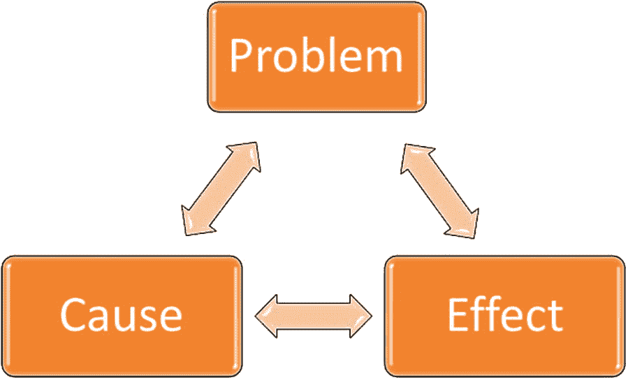

# 二、网络信息的准确性

[The Problem](#Sec1) [The Causes](#Sec2) [The Effects](#Sec3) [The Remedies](#Sec4) [Characteristics of a Trusted Website](#Sec5) [Summary](#Sec6)

大数据的准确性问题可以通过大数据的一个主要来源——网络来理解。拥有数十亿索引页面和数十亿字节大小的 Web 信息构成了大数据的重要组成部分。它在影响人们日常生活中的观点、决定和行为方面起着至关重要的作用。网络可能以最低的成本提供了最强大的出版媒介。只要能上网，任何人都可以成为记者。这很好，因为它将许多真相和许多原本不为人知的人推到了风口浪尖。然而，使网络强大的原因也使它容易受到恶意活动的攻击。网络的很大一部分是虚假信息。网络的开放性使得有时甚至很难准确地识别网络上信息的来源。

即使在过去，电子媒体也被用来误导人们。1938 年 10 月 30 日，一部 62 分钟的广播剧改编自 H. G. Wells 的科幻小说《世界之战》,其真实的报道吓坏了纽约的许多人，他们相信纽约正在遭受外星人的攻击。网络时代的信息传播得更广更快。在几微秒内，即使是世界上偏远的角落也能收到警报。信息几乎以光速传播，谎言和说谎的倾向也是如此。由于网络提供的匿名和非个人化的界面，网络无与伦比的影响力和对网络的依赖越来越多地被用来延续谎言。

我们已经看到许多人利用社交媒体成名。最近，许多推文已经成为热门的新闻话题。网络是独一无二的，它允许少数人影响、操纵和监控大多数人的思想。标签、喜欢、分析和其他工件有助于监控。来自这些工件的反馈可以用来微调影响和操纵人们。网络的确为促进公共利益提供了一个极好的工具。但是同样的网络力量也可以被用来反对公共利益，以利于少数人，他们已经学会了在网络上操纵的艺术。在这一章中，我们将研究网络信息的真实性问题:它的影响、原因、补救措施和识别特征。

Note

网络是大数据的重要贡献者，尤其容易出现准确性问题。

## 问题是

当美国弗吉尼亚州里士满附近发生地震时，居住在纽约市约 350 英里外的人们在他们所在的地方实际感受到地震前 30 秒，在热门的微博网站 Twitter 上阅读了相关信息。政府在需要提供服务的时候使用 Twitter 来定位他们的公民。网络在多国政府与民众互动和管理认知的策略中占据重要地位。这本书本身在某种程度上依赖于网络信息的真实性，从脚注引用中可以看出这一点。世界各地的人们越来越依赖网络进行日常活动，例如在地图上寻找地点的方向，根据在线评论选择餐馆，或通过评论微博根据热门话题发表意见。所有这些活动以及更多的活动都会受到所依赖内容的不准确性的负面影响。

一般来说，谎言的成本很高，而网络谎言的成本会成倍增加。例如，在 2013 年 1 月 [1](#Fn1) ，几个公司正在接受调查的虚假推文使各自公司的市值损失了 28%和 16%——这对投资者来说是一个巨大的损失。这些都是明目张胆的企图。还有一些微妙的方式，网络被用来操纵观点和看法。第四章“变化检测技术”讨论了网络上的感知操纵是如何成功改变南美国家总统选举结果的案例。认知黑客指的是这种出于不可告人的目的对感知的操纵。认知黑客是对网络信息真实性的严重威胁，因为它导致用户行为的不正确改变。2018 年 4 月 10 日，脸书的马克·扎克伯格在向美国国会作证时承认，在防止外国干涉美国选举方面做得不够。这就是社交媒体和认知黑客在当今治理中扮演的角色。

所有贴在网上的别有用心的信息，与公认的人类价值观相冲突，都可以被认为是损害了真实性。有很多网站方案符合这种描述。最受欢迎的是股票交易领域，这里的货币风险很高。美国证券交易委员会(SEC)已经发布了几份警报和信息公告 [2](#Fn2) ，详细说明欺诈计划，保护投资者。还有其他一些微妙的方式损害了网络的完整性。在 spamdexing 或“黑帽搜索引擎优化”中，网络搜索引擎以多种方式显示不正确的搜索查询结果。其中一些技巧包括发布与背景颜色匹配的不相关文本，这样搜索引擎就可以看到这些文本，但用户看不到，以及使用空 div 将不相关文本隐藏在 HTML 代码本身中。

这个问题有多种表现形式。几乎每一件有用的艺术品都有被滥用的可能。例如，LinkedIn 和 Twitter 等相当多的网站为了方便使用，缩短了用户帖子中的长 URL。有像 Tinyurl.com 这样的网站，免费提供缩短网址的服务。缩短的 URL 通常没有目标页面的指示，这一功能被滥用来使容易受骗的用户访问他们本来不会访问的网站。缩短的网址通过电子邮件发送，带有误导但有吸引力的标题，往往会让收件人点击它，将他们带到不知名的网站。皮尤研究中心(Pew Research Center)估计，Twitter 上分享的 66%的网址来自机器人，这些机器人是在互联网上运行的软件程序，可以自动执行人类通常应该执行的任务。

沿着这些思路是伪装 URL 的技术，它看起来是真实的，但可能具有隐藏的控制字符或使用域转发来隐藏 URL 所打开的网站的实际地址。几乎从网络诞生之日起，以这些和其他方式欺骗网站的行为就一直存在。不法分子创建的网站看起来与原始的真实网站一模一样，并具有相似的 URL，但带有误导性内容和假新闻。一种更严重的欺骗形式是网络钓鱼，当用户访问一个看起来与相应的正版网站几乎相同的虚假网站时，用户被误导共享他们的敏感信息，如密码、社会安全号码和信用卡详细信息。

Note

网络欺诈问题有多种形式。从技术和社会学的角度来看，这个问题很复杂。

## 原因

Web 2.0 从世界各地的人们那里产生了数 Pb 的数据，以至于今天，数字世界主要是由消费者和普通用户而不是企业构建的。自 2.0 版网络出现以来，消费者生成的数据已经成倍增长。这意味着大部分数据没有经过验证，也没有像商业数据那样得到机构的支持。在许多情况下，网络作为真理的单一来源的角色被滥用来为隐藏的议程服务。尽管它扮演着拟人化的角色，但与人类不同，网络没有良知。尽管如此，人们还是更依赖网络而不是口头语言。

就像原子能等许多发明一样，当设想网络时，对其预期的适当使用的兴奋似乎主导了防止滥用的谨慎。一方面，事实上，如果它是限制性的，只允许认证的、真实的和高质量的内容，网络可能不会像今天这样发展。另一方面，网络的放任导致对网络贡献的大量大数据完全缺乏控制。创建网络的最初目的显然是为了鼓励全世界人民之间和平、互利的交流。然而，宽松的控制不仅使人，而且使成群的伪装机器人能够出于恶意动机在网络上自动发布误导信息。

当作者在一次会议上介绍他关于确定网络微博真实性的工作时，听众中的一名研究生表达了这样的观点:网络是一种随意的信息交流媒体，不应该对真实性进行判断。坚持一个真实的网站会使它变得不那么有趣，更少被使用，这是她的合理化建议。它反映了大量网络内容贡献者的看法。用户发布信息的随意态度是网络信息缺乏真实性的主要原因之一。允许发布建设性内容和限制滥用信息之间的灰色界限很难辨别。监管恶意的网络行为当然不容易。

在网上进行欺诈有很多动机。正如我们将在后面的章节中看到的，甚至一个国家的总统选举也会受到网络上发布的信息的影响，而且有时是不正确的影响。舆论的最大影响可能是在政治家身上。政治议程可能是利用网络操纵的最重要原因。下一个激励因素是金钱，正如我们在操纵股价的案例中看到的那样。金钱奖励也以欺骗和虚假新闻网站上的广告形式出现。报复和公开羞辱也是一个常见的原因，以至于美国大多数州都通过了禁止在网上发布报复色情的法律。

认知黑客在网络上尤其有效，因为这种互动缺少一些有助于衡量话语真实性的因素。例如，如果说话者在前面，话语的真实性会反映在肢体语言、眼神交流、语气以及说话者和听者之间持续的反馈循环中。如图 [2-1](#Fig1) 所示。随着生活变得越来越个人化，人们越来越依赖网络获取信息，错过了图 [2-1](#Fig1) 中双向箭头所示的一些真实成分，这些成分存在于现场对话中。有许多网站被利用这种情况来误导公众的不可告人的动机，通常是非法的。

图 2-1

Communication on the Web does not have some of the veracity components or the feedback loop of a live conversation

在越来越多的趋势中，软件不仅被编写来做被告知的事情，而且被编写来根据训练数据和偏好的结果来制定自己的行动过程。这一趋势也导致了虚假数据的不断增加。例如，语音合成软件现在能够模仿人的声音。Lyrebird [3](#Fn3) 是一家制作这种软件的公司，它允许人们从一个人的声音中记录一分钟。利用录音，该公司的软件生成一个独特的密钥，就像一个人声音的 DNA 一样。使用这个键，软件就可以用这个人的声音产生任何语音。

斯坦福大学的 Face2Face [4](#Fn4) 可以拍摄一个人的面部，并重新渲染另一个人的视频，使其看起来好像是这个新人的视频。该软件用获得的人脸替换原始人脸，并生成伪造人脸的面部表情，使其看起来好像视频中的人是新的人。有趣的是，像这样的项目开始实际检测视频操作，但最终更多地用于实际操作视频。结合上一段描述的语音合成软件，有可能使视频看起来真实。假视频从无到有产生的时间可能不会太久。

生成欺诈性内容的成本也很低，导致了真实性问题。有多种业务，产生假新闻，并以惊人的低成本沉迷于网络欺诈操纵。中国的一家营销公司“协作帮”对一篇 800 字的假新闻文章仅收取 15 美元。有许多公司提供类似的欺诈服务来操纵来自网络的数据。在社交媒体上购买关注者、+1 和喜欢；不适当地提升网站或视频在搜索结果中的排名；而欺诈性点击“点击付费”广告不仅是可能的，而且是负担得起的。事实上，在网上造假的成本往往远低于宣传正版内容。一些影响点击流数据(大数据的重要组成部分)的恶意黑客行为，如“点击欺诈”，已经通过使用技术得到遏制。但是，不断涌现出更新、负担得起的机制来破坏大数据的完整性。

Note

在网上比面对面交流更容易误导人。

## 效果

网络欺诈的影响是严重的，在某些情况下甚至是致命的。有大量关于网络虚假性的文献。很难相信，但网络基础设施的宽容允许网站宣传犯罪服务，如谋杀和致残。此类服务通常基于谎言和欺诈性信息。甚至像 Craigslist 和脸书这样最受欢迎的网站也被用来寻找杀手。在一个例子中，脸书上的一个帖子写道，“……这个女孩现在就离开”500 美元 [5](#Fn5) 。有许多关于“黑暗网络”更糟糕的场景的不为人知的故事，它在互联网上运行，但不连续，需要特殊的软件、设置和授权才能访问。

网络欺诈的影响因我们之前讨论的方案而异。例如，在股票价格操纵计划中流行的是“抽水-转储”模式，即首先通过在网上发布误导、不正确和乐观的公司信息来“抽水”股票价格，然后以过高的价格将歹徒的股票“转储”到市场。从长远来看，这种炒作影响了许多投资者和公司。然而，当网络被用于反民主活动，操纵舆论以改变国家总统选举的结果时，人们可能会感受到最大的影响。

类似于我们之前讨论的网站欺骗，域名仿冒或 URL 劫持是指一个著名网站的 URL 中的一个错别字导致一个完全不同的网站，该网站显示令人讨厌的广告或以其他方式恶意影响用户。Whitehouse.com，甚至今天似乎没有做任何与美国总统的家，而是被用来宣传无关的东西。至少现在，网站上有一个小字，说明他们“不隶属于美国政府，也没有得到美国政府的认可”，而一年前并非如此。如果用户想输入 whitehouse.gov 而不是 whitehouse.com，他们将登陆这个意想不到的网站，该网站声称正在庆祝其成立 20 周年。也有域名恶意抢注的案例。例如，域，[麦当娜。com](http://www.madonna.com) 被一个与著名流行歌手麦当娜无关的人收购。该网站被用来显示色情，而不是歌手的信息。在这种情况下，影响从仅仅是烦恼到严重的名誉损失不等。

早在 1995 年，代表“人道对待动物的人”的 PETA 就被 peta.org 羞辱，因为它错误地提到“人们吃美味的动物”我们不断听到知名网站被黑客攻击和篡改的消息。一个名为“蜥蜴小组”的组织在过去篡改了许多公司的主页，包括联想和谷歌(越南语)。英国《Vogue》杂志的网站一度被涂上了恐龙戴帽子的图案。很多时候，政治网站，比如 2001 年激进组织哈马斯的网站，被黑客重定向到色情网站。即使是对网络拥有巨大控制权的互联网公司也不能幸免于这些攻击。前面提到谷歌的越南主页被“蜥蜴小组”丑化了。2013 年和 2014 年，数百万雅虎用户账户遭到黑客攻击，对该公司的净资产产生了不利影响。

在其《2016 年网站安全状况》报告中， [6](#Fn6) 谷歌曾警告，被黑网站数量增长了 32%，相当惊人。随着时间的推移，黑客变得越来越聪明，他们利用先进的技术来实现犯罪。有这样一种情况，黑客使用脸书照片的 3D 渲染，试图欺骗使用面部识别的认证系统，以获得进入权。移动虚拟现实能够从某人面部的 2D 照片提供认证系统所需的 3D 细节。众所周知，破坏系统的安全性会带来严重的后果。

Web 上的不准确性会对依赖于 Web 准确性的应用产生连锁反应。随着越来越多来自物联网空间的东西开始利用网络，这个问题变得更加复杂。如果连接到网络的设备不够安全，机器人可以用来以各种方式攻击网站，甚至使网站瘫痪。

Note

今天的网络及其谬误能够改变国家的轨迹和数十亿人的生活。

## 补救措施

大数据准确性问题的因果形成恶性循环，如图 [2-2](#Fig2) 所示，一个馈入另一个。有效的补救措施需要打破这种恶性循环。消除原因或减少影响或两者都有助于控制问题。抑制、惩罚和防止欺诈的发生是各种实体打击网络欺诈的一些好策略。

鉴于网络欺诈的影响和后果，一些政府已经将解决滥用问题作为国家优先事项。像俄罗斯这样的政府维护着含有假新闻的网站。 [7](#Fn7) 有意思的是，欧盟太过评论和发帖造谣， [8](#Fn8) 不过那哪个是亲俄政府。还有许多像 snopes.com 这样的独立组织和网站，他们不断地揭露网络和互联网上的虚假信息。社交媒体提供商也积极参与遏制其网站的虚假性。互联网公司正在尝试的一些实验包括暂停虚假账户、宣传活动、增强软件以标记新闻源中的欺诈行为，以及允许用户提供可信度评级。政府不时通过法律来打击网络犯罪。

图 2-2

The Cause-Effect Vicious Cycle of the Veracity Problem

《土地法》的不同章节涵盖了前几节中强调的一些罪行。例如，根据 1934 年证券交易法第 10(b)条和规则 10b-5，发布关于两家公司的虚假推文，导致其股价大幅下跌的人被起诉。该罪行还导致 SEC 在 2015 年 11 月发布了投资者警报 [9](#Fn9) 。然而，法律或警告并没有使证券市场上的网络欺诈停止。新的案件仍在被发现和起诉。美国联邦调查局在其互联网犯罪投诉中心(IC3)设立了一个表格，用于报告网上犯罪 [10](#Fn10) 并就该主题发布年度报告。然而，提交人本人使用该表格报告了一起严重罪行，但没有得到联邦调查局的答复，甚至没有得到报告的编号，这表明法律补救措施不充分。此外，法律甚至不存在，或者对网络上的许多恶作剧过于宽容。当务之急是，不仅要使用法律技术，还要使用其他学科的技术，尤其是技术。

技术本身在解决几个法律谜团中发挥了重要作用，但它远未获得所需的可信度。贝叶斯定理的一个简单应用在许多法律案例中发挥了重要作用，其中一些列在 [`https://sites.google.com/site/bayeslegal/legal-cases-relevant-to-bayes`](https://sites.google.com/site/bayeslegal/legal-cases-relevant-to-bayes) 中。截至目前，该网站列出了 81 起此类案件。然而，随着多本书和互联网搜索字符串，“并以百分比的形式表达某些事件发生的概率”，英国上诉法院禁止使用贝叶斯定理。有必要通过加强这些方法，使人们对真实性问题的技术解决办法充满信心。

Note

在高中数学中学到的贝叶斯定理的一个简单应用帮助解开了许多法律案件的谜团。

隐私保护使得起诉网络犯罪变得困难，尤其是当犯罪跨越国界时。即使起诉成功，造成的损害往往是不可弥补的，损失的时间和物质是无法挽回的。罪犯往往没有资源支付损害赔偿金，例如在由于少数个人的"抽水和倾倒"活动而造成公司净值损失的情况下。因此，预防比惩罚更重要。技术在预防方面远胜于法律补救。接下来的章节将深入探讨有助于防止在线欺诈的技术。

目前的技术也需要重新命名，以解决数据的准确性问题。例如，在显示搜索结果时，将流行度优先于可信度，像 PageRank 这样的搜索算法忽略了这个问题。根据可信度对检索到的信息进行排序比递归计算页面链接的数量要困难得多，而递归计算是当前搜索算法关注的重点。脸书、谷歌和 Twitter 等互联网公司已经想出了应对虚假和恶意内容的方法。例如，谷歌在 2016 年第四季度禁止了其广告网络中的 200 家公司的误导性内容。脸书在 2018 年的前 90 天里，除了每天阻止数百万人试图创建虚假账户外，还删除了 5.83 亿个虚假账户和 8.658 亿条帖子。

现实世界是许多工程解决方案的来源。计算机科学中相当多的概念，如面向对象的范例，都是受现实世界现象的启发。真实性也是现实世界中的一个主要问题。那里是怎么铲球的？执法人员如何知道一个人是否在说真话？正是有了审查各种案件中涉及的许多人的经验，他们才能够弄清真相。软件世界中类似的概念是机器学习。通过检查大量案例(训练数据)中的模式，机器学习算法能够得出结论。结论之一可以是数据是真是假。我们将研究更多关于如何使用机器学习技术来解决大数据准确性问题的细节。

生物识别、双因素身份验证、强密码和这些基本的安全功能可以防止数据泄露、黑客攻击和信息窃取。但是正如我们所看到的，就像总是领先一步的小偷一样，黑客在他们的方式上更加巧妙。我们能否开发一个类似中央情报局(CIA)的平台来检测来自黑客的威胁？威胁情报平台(TIP)与此非常接近。就像中央情报局一样，TIP 设想从各种来源收集威胁信息，关联和分析这些信息，并根据分析采取行动。该领域仍处于发展阶段，洛克希德·马丁公司等公司正在研究稳健的解决方案。

Note

现实世界是许多工程解决方案的灵感来源，包括大数据的准确性问题。

尽管网络很脆弱，但它的一小部分仍合理地保持着它的完整性。不仅个人，搜索公司也依赖维基百科页面。尽管允许匿名，除了一些冲突和“报复”编辑事件，维基百科在维护内容的完整性和高标准方面从其贡献者那里获得了巨大的利益。与现实世界中厨师太多会糟蹋汤的例子不同，协作编辑出人意料地被证明非常成功。合作编辑是否是解决真实性问题的灵丹妙药还有待观察，但一般来说，是什么让一个网站值得信赖呢？在下一节中，我们将检查网站的成分，这些网站看起来相对更可靠。

## 可信网站的特征

可信网站具有某些特征。可信网站类似于可信的人。当一个人客观，没有任何隐藏的议程或不可告人的动机，代表一家成熟的公司，说话清晰而正式，表现出专业知识，乐于助人，由值得信赖的人推荐，容易接近，总体上看起来正式而真实，并随时了解最新发展，等等，我们就会信任他。网站也是如此。我们通常不会怀疑天气网站，因为信息是客观的。几乎没有任何操纵天气信息的动机。这些信息简单易懂。不难看出这些信息是真是假，因为温度或湿度可以很容易地感觉到，并与网页上发布的信息进行对比。任何预测也可以从历史上与真实发生的事情联系起来。所有名副其实的天气网站都会经常更新，这样才能保持业务。

信息与既定事实的相关性也是真实性的一个很好的指标。例如，如果网页引用了许多期刊文章，它可能更值得信赖。网站的来源，如政府或知名出版商，也是决定网站可信度的一个因素。所用语言的语气、风格、清晰度和正式程度也是信息真实性的良好指标。网页上出现的大量广告，特别是令人讨厌的弹出窗口、阻止内容或强迫鼠标点击的广告，使网站变得不太可靠。其中一些广告甚至可以注入间谍软件或病毒。

可信的网站往往包括联系信息，如电话号码和电子邮件地址。外观、一致性、所用语言的质量、社区参与和支持、可理解性、简洁性、粒度、组织良好的分层结构、流通性和信息的有用性等因素也有助于网站上呈现的信息的准确性。另一方面，缺少任何个人姓名或联系信息、拼写错误、不专业的外观和布局、模糊的引用、侵扰性广告等都是欺诈网站的迹象。在后面的章节中，我们将会看到这些特性和其他特性是如何帮助解决准确性问题的。

Note

受信任的网站通常表现出受信任的人的许多特征。

## 摘要

在这一章中，我们讨论了真实性问题的因果恶性循环，并研究了一些可能的补救措施。下一章将从技术角度进一步探讨补救措施，并讨论处理信息真实性问题的一般方法。本章还回顾了可靠网站的特征。软件程序可以自动检测这些特征中的一些，如有效联系信息的存在、断开的链接或以指数表示的受欢迎程度，如 PageRank。然而，诸如信息的客观性或完整性或它们的更新程度等特征只有在人类参与的情况下才能得到确认。下一章将探讨建立信息可信度的一些方法。

Exercises

1.  尽可能多地列出现实世界中影响可信度的因素。检查哪些适用于网络信息的准确性。
2.  本章主要关注 Web 信息，这是当今大数据的主要组成部分。对其他来源的大数据(如来自物联网传感器的数据或地理空间数据)的准确性问题的原因、影响和补救措施进行类似的讨论。

Footnotes [1](#Fn1_source)

美国证券交易委员会；SEC 指控:虚假推文导致两只股票陷入市场操纵，2015 年 11 月 5 日，新闻稿， [`https://www.sec.gov/news/pressrelease/2015-254.html`](https://www.sec.gov/news/pressrelease/2015-254.html)

  [2](#Fn2_source)

美国证券交易委员会；SEC [指控](https://www.sec.gov/reportspubs/investor-publications/investorpubscyberfraudhtm.html):网络欺诈，2011 年 2 月 1 日，《投资者报》， [`https://www.sec.gov/reportspubs/investor-publications/investorpubscyberfraudhtm.html`](https://www.sec.gov/reportspubs/investor-publications/investorpubscyberfraudhtm.html)

  [3](#Fn3_source)

Lyrebird，测试版，用自己的声音生成句子，最后检索时间:2018 年 4 月 6 日， [https:// lyrebird. ai/](https://lyrebird.ai/)

  [4](#Fn4_source)

斯坦福大学，Face 2 Face:RGB 视频的实时人脸捕捉与重现，最后检索时间:2018 年 4 月 6 日， [http:// www。图形。斯坦福。edu/~尼斯纳/论文/2016/1 face to face/thies 2016 face。pdf](http://www.graphics.stanford.edu/%7Eniessner/papers/2016/1facetoface/thies2016face.pdf)

  [5](#Fn5_source)

黑色，卡罗琳；脸书雇凶杀人的阴谋。少年科里·亚当斯承认他利用网站追踪强奸原告，哥伦比亚广播公司新闻，2011 年 2 月 14 日。CBS 新闻。com/news/Facebook-murder-for-hire-plot-pa-teen-corey-ADAMS-admisses-he-use-site-go-after-rape-原告/

  [6](#Fn6_source)

Google，#NoHacked:一年回顾，站长中央博客，2017 年 3 月 20 日， [`https://webmasters.googleblog.com/2017/03/nohacked-year-in-review.html`](https://webmasters.googleblog.com/2017/03/nohacked-year-in-review.html)

  [7](#Fn7_source)

俄罗斯联邦外交部，复制有关俄罗斯的不可靠信息的出版物示例，新闻稿，最后检索:2018 年 4 月 6 日， [`http://www.mid.ru/nedostovernie-publikacii`](http://www.mid.ru/nedostovernie-publikacii)

  [8](#Fn8_source)

欧盟，造谣评论，对外行动署，2016 年 9 月 2 日， [`https://eeas.europa.eu/headquarters/headquarters-homepage_en/9443/Disinformation%20Review`](https://eeas.europa.eu/headquarters/headquarters-homepage_en/9443/Disinformation%20Review)

  [9](#Fn9_source)

美国证券交易委员会，社交媒体和投资-股票谣言，投资者警报和公告，2015 年 11 月 5 日， [`https://www.sec.gov/oiea/investor-alerts-bulletins/ia_rumors.html`](https://www.sec.gov/oiea/investor-alerts-bulletins/ia_rumors.html)

  [10](#Fn10_source)

美国 FBI，提交投诉，互联网犯罪投诉中心，最后检索:2018 年 4 月 6 日， [`https://www.ic3.gov/complaint/default.aspx`](https://www.ic3.gov/complaint/default.aspx)

  [11](#Fn11_source)

美国司法部，2015 年互联网犯罪报告，互联网犯罪投诉中心，最后检索:2018 年 4 月 6 日， [`https://pdf.ic3.gov/2015_IC3Report.pdf`](https://pdf.ic3.gov/2015_IC3Report.pdf)