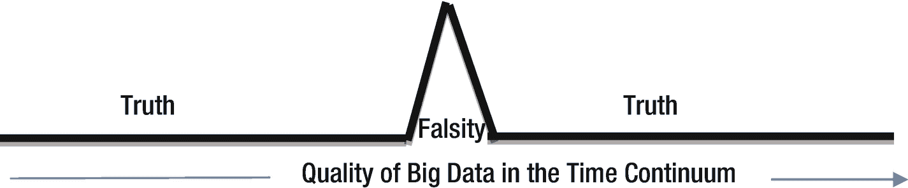
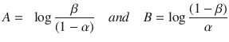
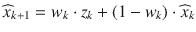
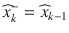
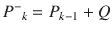
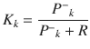
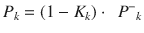
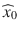
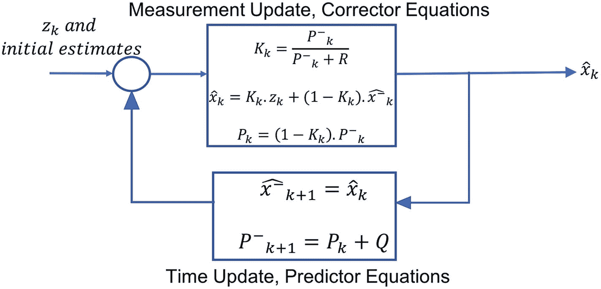

# 4.变化检测技术

[Sequential Probability Ratio Test (SPRT)](#Sec1) [The CUSUM Technique](#Sec2) [Kalman Filter](#Sec3) [Summary](#Sec4)

大数据中的虚假和不准确以不同的形式表现出来。在这一章中，我们研究一种这样的表现，并考虑识别它的方法。这种现象在网上发布的信息中尤为常见。通过张贴在网络上的信息以这样或那样的方式影响网上的朋友和追随者并不罕见。当这种影响有一个隐藏的议程，是基于谎言，是邪恶的意图，并影响到大量人口时，这是一个问题。这就是本章介绍的技巧所要解决的虚假性的表现。该技术还可以应用于其他场景，例如当来自物联网传感器的数据质量在短时间内下降时。

只有真理才能持续。其他一切都被遗忘了。谎言不会长久。真理是纯洁的。它是人类交流、共存和文明本身的基础。真相可以被视为现状，常态。那么，虚假可以被认为是一种变化，一种不洁，一种对预期的偏离。用电气工程来类比，真理是信号，谎言是噪音。因此，通过使用变化和噪声检测技术，可以从真相中辨别出谎言。举个简单的例子，考虑一个分析学校论文的软件程序。如果所有的学校作文都暗示大象是一种四条腿的动物，而其中一篇作文把大象描述成一种鸟，那么后者可以被认为是错误的。如果程序将不同文章中对大象的描述制成表格，那么文章中把大象描述成鸟的错误主张就会突出出来，表现为变化或噪音。

变化检测是许多工程、生物和金融过程中常用的仪式。这些技术本质上主要是统计的。我们对从量化过程中获得的数据点的时间序列使用这些技术，如第三章“建立大数据准确性的方法”中所述在微博的情况下，时间序列包括从情感分析中获得的分数。通过部署黑客来影响和左右公众舆论而发布的微博必然会有不正常的情绪得分，因此可以使用本章描述的一些技术来检测它们。

Note

谎言是对常规的改变。真相是迟早的事。没有谎言能瞒过时间。不诚实是一个高峰，一个不会持续很久的炒作。

微博被证明对公众舆论有实质性的影响。从巴拉克·奥巴马 2008 年第一次参加竞选开始，我们就已经看到了他们在美国总统选举中的影响力。在 Twitter 等微博网站上发布虚假、破坏性的信息，类似于在电影院喊“着火了”。安德烈斯·塞普尔韦达意识到了微博在总统选举等重要社会进程中的作用。“当我意识到人们更相信网络上说的而不是现实时，我发现我有能力让人们相信几乎任何事情，”他说。

图 4-1

Graphical depiction of untruthfulness in the time series of Big Data

忠实于他的信念，近十年来，人们相信他对微博网站注入影响力的黑客攻击。这种注入的影响左右了南美国家 10 年的总统选举结果，其肇事者安德烈斯·塞普尔韦达(Andrés Sepúlveda)目前正在监狱服刑 10 年。这个故事是关于大数据准确性重要性的另一个强有力的信息。如果微博网站有适当的检查来检测这种注入影响力的攻击，安德烈斯·塞普尔韦达左右的总统选举结果可能会有所不同。正如我们将在本章中看到的那样，这些检查并不难实施。

Note

对微博网站的注入式影响攻击可以定义为故意发布恶意微博的活动，通常但不总是使用自动化手段和黑客手段，以影响其他用户的意见。

图 [4-1](#Fig1) 是对大数据虚假性的一种解读。这些线并不意味着是直的，因为数据的质量确实会随时间而变化。但是与不诚实占优势的时候相比，这些波动是最小的。为了检测不准确和不确定的数据点(如图所示)的时间序列中的变化，我们需要一种方法来捕获所有数据点直到任何给定时间的代表性状态。它是最小的工件，完整地、递归地总结了给定系统的所有先前状态。这种代表性的状态应该累积状态的相关方面，直到给定的时间。监控这种代表性的状态将有助于检测可疑的变化。

打个比方就是一个人进入抑郁状态。随着时间的推移，不好的感觉、失败和其他各种影响人的心理的因素积累起来，最终导致抑郁。当一个通常快乐和乐观的人悲伤时，我们能够察觉到这种变化并试图阻止它。快乐是常态或“信号”，悲伤是可以察觉的变化或“噪音”。人的精神状态代表了时间线上发生的所有事情。如果我们监测人类的精神状态，就有可能检测出精神抑郁症的进展。当心灵悲伤和沮丧超过一定程度时，不良的变化已经发生，需要采取纠正措施。

Note

为了进行变更检测，我们需要一种方法来对大数据值的时间序列的代表性状态进行建模。

本章描述的技术促进了上述类比中描述的应用于数据的过程。这些技术是统计学上的，所以只能对数字起作用。因此，如果微博等数据不是数字的，量化是必不可少的。即使是数值，重要的是数据本身的值是准确的。因此，正如我们在第一章中介绍的那样，估价也起着重要的作用。本章介绍的变化检测技术也假设了底层数据的某些统计特性。

一个常见的假设统计属性是“高斯假设”，即数据符合正态概率分布。高斯分布的均值、众数和中位数都是相等的。这一假设没有太大的限制性，因为大多数自然科学和社会科学数据无论如何都有望收敛于正态分布，尤其是从大数据中发现的大量样本中提取的数据。有兴趣的读者可以参考中心极限定理了解更多细节。经典统计学在相当多的估值方案中也扮演着重要的角色。因此，大数据理论需要相当多的理论概率和统计背景知识。

本章介绍的技术的一个优点是，它们的相关性很弱，对基础数据的概率分布不太敏感。应用这些技术时，我们不必精确地确保数据是正态分布的。此外，研究表明，大数据(如来自微博的数据)具有一定的统计属性，通过对微博进行情感分析来进行观点挖掘是可行的。例如，美国语言学家乔治·金斯利·齐夫(1902-1950)的一个令人惊讶的发现是，在任何大型语料库中，英语或任何自然语言中一个词的频率与该词在频率降序中的排名成反比。

例如，单词“the”是当代美国英语(COCA)语料库中最常用的单词，其次是单词“be”根据 Zipf 的发现,“the”在古柯中出现的次数应该是“be”的两倍，这令人惊讶地是正确的。当语料库遵循 Zipf 定律时，它被称为由 Zipfian 概率分布近似，这是一种幂律分布。幂律分布的特点是在图中有一个长尾，只有几个值支配着分布。根据这一特征，在美国英语文本的布朗语料库中，发现只有 135 个单词占语料库的一半，并且许多单词仅使用几次，使得较少使用的许多单词的分布具有长尾。研究证明，微博数据符合齐夫定律，呈现出齐夫分布的统计特征。在这些发现的保证下，我们现在开始检查一些用于变化检测的技术。

Note

令人惊讶的是，我们周围看似混乱的数据是有序的，特别是当数据像大数据一样大时。

既然我们已经确信大数据具有某些统计属性，我们就继续通过监控数据来识别虚假性。一种强力、粗略且简单的检测变化的方法是监视任何异常模式的值，并根据观察结果得出数据被操纵的结论。但是这样做，我们就忽略了问题中的不确定因素。如果不正常的模式确实是真实的，而不是任何操纵的结果呢？例如，一个人变得易怒和极度悲伤不一定意味着他得了抑郁症。偶尔的情绪波动并不少见。因此，仅仅监控时间序列值或本例中的情绪是不够的。在此之前，我们需要监控整个时间序列的代表性状态。因此需要稳健的算法。

我们不确定一个特定的变化是否真的意味着虚假。我们需要涉及概率来处理这种不确定性。正如我们将在下面的章节中看到的，使用统计和概率来监控数据流也使得检测变化更快。该算法对变化更加敏感。事实上，通过使用概率，我们可能能够在操纵或虚假开始时检测到不期望的变化，而不是观察异常模式一段时间以得出相同的结论。我们首先从一项测试开始，这项测试自 1945 年发明以来一直很流行。

## 序贯概率比检验(SPRT)

SPRT 是亚伯拉罕·瓦尔德发明的，并于 1945 年 6 月发表在他的论文《统计假设的序贯检验》中。他证明了该测试在速度与准确性权衡(SAT)方面是最优的，并且它只需要很少的数据点来检测变化，只要数据点是独立的并且同分布的，这是一个常见的假设，缩写为 i.i.d

在统计假设检验中，SPRT 提出了两个假设，并在这两个假设的背景下评估了时间序列数据:

H 0 :数据质量没有受到损害，并且是可接受的真实数据；

H 1 :数据错误，触发报警；

H 0 被称为零假设——现状或常态，H 1 被称为替代假设，表示变化。

在序贯概率比检验中，对于每个数据点，我们计算对数似然比(LLR)。LLR 是似然比的对数。LLR 有四个组成部分:

1.  假设 H 1 为真且数据已被处理，从估价流程中获取数据点的可能性
2.  假设 H 0 为真且数据未被泄露，从估价流程中获取数据点的可能性
3.  上述两者的比率(a)和(b)
4.  (c)中比率的对数

在方程形式中，

(4.1)

分子和分母的似然性取决于基础数据的分布。例如，如果基础数据符合正态分布，则概率密度函数(PDF)由

(4.2)给出，其中μ是分布的平均值，σ是标准偏差，这对于给定的总体可以很容易地推断出来。对于每个数据值，LLR 在累积 LLR 中累积，如下面的等式(4-3)

(4.3)所示，缩写为 CLLR i

我们现在知道为什么这种技术被命名为 SPRT——这个过程是连续的(S ),并且使用概率(P)比率(R)来测试(T)变化。累积 LLR (CLLR)是迄今收集的数据的代表性状态。监控累积 LLR 可以帮助我们发现变化。我们使用 CLLR 来决定以下三种结果之一:

1.  接受 H 0 并停止监控数据，得出数据质量完好无损的结论
2.  接受 H 1 并停止监控数据，得出错误已经发生的结论
3.  推迟决定并继续监控

上述每个决策的触发时间取决于两种常见的直观错误类型:

1.  类型一:当 H o 为真时接受 H 1 ，导致误报
2.  类型二:当 H 1 为真时，接受 H o ，导致假阴性

我们需要事先决定系统可以容忍的 I 型和 II 型错误的级别。设α表示遇到 I 类错误的可接受概率，β表示遇到 II 类错误的可接受概率，这是预先确定的。可以看出，决策边界如下:

(4.4)

以下是基于上述界限的决策，也如图 [4-2](#Fig2) 所示:

图 4-2

Decision Boundaries in SPRT using CLLR

1.  如果 CLLR < A, accept H o 并停止
2.  如果 CLLR > B，接受 H 1 ，断定有假并停止
3.  如果 CLLR 在两个值 A 和 B 之间，推迟决定并继续监控

Note

序贯概率比检验就是:对按顺序计算的可能性的累积比率的检验。

正如我们所看到的，在解决方案中加入概率会使它变得稍微复杂一些，因为监控现在依赖于底层数据的分布，并且以一种更加复杂的方式使用数学。我们需要一种更简单的技术来从算法中摆脱诸如等式(4.2)中的指数运算。正如我们将在下一节中看到的，CUSUM 解决了这种复杂性，并使算法更加简单。

必须指出的是，SPRT 决定了两个假设中的哪一个产生了数据，而不是从根本上检测变化。可以通过引入“阈值”来修改它以检测变化当 LLR 超过这个预定的阈值时，我们停止监控，并断定已经检测到变化。由此产生的技术称为 CUSUM，将在下一节讨论。

## 累积和技术

CUSUM 是累积和的缩写。这是 E. S. Page 在 1954 年发明的一种简单却聪明、直观的技术。该技术通常用于金融领域的股票投资组合监控和工程领域的流程控制，以检测被监控价值的变化，从而关注可能出现问题的产品。尽管数学推导假设了基础数据的某些统计特性，但该技术对数据的统计和概率特性大多不敏感。这是已知的检测变化最快的技术，即使是很小的变化。它的性能更好，而不必像在 SPRT 那样，在等式(4.2)中计算涉及指数的移动平均值。

尽管与 SPRT 相比，CUSUM 实现起来非常简单，但实际上它是 SPRT 的一种形式。与 SPRT 的两个边界 A 和 B 不同，我们只有一个停止点，当代表状态超过某个阈值时就会出现。这里的代表状态是每个数据点的累积残差。残差可以简单地认为是数据值和目标值之间的差值。很直观地说，目标值是到那时为止数据值的平均值。因此，该算法是简单的算法，无需处理 pdf 和指数移动平均。

CUSUM 既简单又复杂。我们刚刚看到，CUSUM 的应用是简单的算术。我们将采取一种中间方法，给出足够的细节来欣赏简单背后的数学。让我们首先给出代表状态的方程，r k 在累积和算法中:

上述等式中的对数比可以立即识别为我们在 SPRT 使用的 LLR。假设也和我们之前用的一样。CUSUM 的改进在于，我们现在正在累积 LLR，并且累积值有了一个下限。当数据的分布是高斯或正态分布时，这是常见的情况，我们可以将下面的 PDF 代入方程:

平均值μ 0 和μ 1 分别对应两个假设。代表状态 r k 的等式现在简化为:

并进一步简化为:

其中‘ρ’是决定累积和算法灵敏度的常数。ρ值越小，算法对变化越敏感。上面的等式是我们之前描述过的简单算法。我们主要监控数据值的变化平均值，并累加平均值上新数据值的差值或残差。我们现在需要知道何时停止监控数据流，并确定数据已经受损。为此，我们引入一个阈值τ。当代表状态 r k 超过阈值τ时，我们停止监控。发生这种情况时的ρ值称为停止时间。还必须指出的是，即使我们通过替代高斯 PDF 推导出简化的方程，已经证明简化的方程即使在分布不是高斯的情况下也能很好地工作。Note

世界上所有的复杂都是为了让生活变得简单。CUSUM 求导就是一个例子。

通常，我们不想一发现虚假就停下来。我们希望继续监控和检测所有的谎言事件。我们不想确定停止时间，而是想检测数据受损的所有时间间隔。可以很容易地扩展 CUSUM 来做到这一点。先前的“停止时间”现在变成了可疑间隔的“开始时间”。该间隔的结束时间是代表状态处于其峰值的时间。回到一个人陷入抑郁症的类比，当这个人的精神状态开始恶化或超过阈值时，我们得出抑郁症发作的结论。我们的结论是，这个人在精神状态最糟糕并开始好转后，很快就走出了抑郁。这同样适用于检测所有可疑间隔的扩展 CUSUM 算法。

图 4-3

Extended CUSUM to detect suspicious intervals; the dots in the upper plot represent data values

图 [4-3](#Fig3) 是刚刚讨论的过程的图示。本例中的数据值在-5 和+5 之间变化。该图的上半部分显示了作为离散点绘制的值。大约有两千个数据值。x 轴代表时间。它按时间顺序显示了两千个索引，代表数据收集的顺序。从图的前半部分可以看出，即使有可能，仅通过查看数据值也很难判断数据是否已经被破坏。一旦我们绘制了 CUSUM 代表状态，r k 在下图中，以较浅的阴影(绿色)显示，可疑区间变得几乎显而易见，如图所示。曲线在整个可疑区间都是上升的。

当累积和超过阈值时，间隔开始，在累积和值达到峰值并开始下降后不久结束。阈值被确定为接近于零，因此接近于数据值，所以它与略暗阴影(蓝色)的数据值的线图混合在一起，不太明显。CUSUM 算法从预期平均值中累加每个数据值的残差，从图中可以看出，对于量值不超过 5 的值，可以一直接近 500。在图的上半部分的图中，点的模式有所不同，但是除非像图的下半部分那样绘制 CUSUM 代表状态，否则我们不能真正确定。右侧相当多的点也形成了有点类似的模式，但下面的图显示它们并不真正可疑，事实确实如此。

Note

除非用一种方法——一种统计过程——来评估，否则数据可能是欺骗性的。

图 4-4

Extended CUSUM when the spurious values occur intermittently. The figure in color is in the source code file and in the ebook.

在图 [4-3](#Fig3) 中，所有的虚假数据在一个大的时间间隔内同时出现。但是，有时也会出现可疑值。图 [4-4](#Fig4) 显示了当错误数据值间歇出现时，以较浅阴影(绿色)绘制的累积和状态。在这种情况下，可疑间隔仅包含一个假值，同样的逻辑仍然适用。在这种情况下，累加和技术不是很有效，因为残差的累加受到中间真值的影响。图 [4-3](#Fig3) 中的最大累积残差接近 500，而图 [4-4](#Fig4) 中的最大累积残差仅为 5。在这种情况下，CUSUM 算法显然不太敏感。

这就是卡尔曼滤波器的优势所在。它基于先前的状态递归地估计下一个值，因此伪值之前的真实值越多，下一个值的估计就越好。先前状态中真实值的优势越大，估计就越好。下一节将讨论这一在许多实际应用中广泛使用的重要技术。

## 卡尔曼滤波器

米（meter 的缩写））S. Grewal 等人是这方面最受欢迎的书籍之一的作者，他们称卡尔曼滤波器为“20 世纪最伟大的发现”。它是一种线性状态空间方法，应用范围从预测天体的失控轨迹到控制制造过程和航空学。简单地说，给定一系列数据点，卡尔曼滤波器计算下一个数据点的最佳猜测。当信号被高斯白噪声扰乱时，它本质上是线性动态系统下一状态的估计器。如前所述，高斯假设在许多随机过程中非常普遍，并且在大多数情况下成立，至少近似成立。由于预测信号，卡尔曼滤波器可以自动被视为过滤掉噪声。噪声是卡尔曼滤波器检测到的变化，从这个意义上说，我们在这里将其用作变化检测技术。可以理解的是，它被广泛用于电气、电信工程和信号处理。

正如本章开头所提到的，在一个以诚实为主导的文明中，谎言本质上是噪音。大数据中的虚假性可被视为统计噪声，其检测方式与信号处理系统中的噪声过滤方式相同。这就是卡尔曼滤波器派上用场的地方。这种强大技术背后的复杂数学可以通过一个直观的例子来理解，比如股票价格。假设我们预期今天一只股票的价格是，但是我们观察到它在现实中是 z k 。给定这两个值，我们对明天的最佳估计就是这两个值的平均值:

但是谣言和股票市场的影响使它不那么理想，我们可能要比我们自己的预期更多地权衡它们。让我们称这个重量为 w k 。那么上面的等式就转化为:

这实质上是线性情况下卡尔曼滤波器的状态方程。等式的右边有一个观察分量和一个预期分量。我们对期望值进行计算猜测，并基于现实世界的观察或测量来更新它。在卡尔曼滤波器的说法中，比例项或权重 w k 被称为“卡尔曼增益，K k ”，以纪念发明者鲁道夫·卡尔曼，麻省理工学院的毕业生。权重 w k 代表噪音——股票市场中的谣言和其他影响。

我们可以理解，权重 w k 或卡尔曼增益 K k 不能简单地通过直觉来估计，还需要一些数学上的严谨性。它是使用另一组前向递归方程估计的，该方程涉及另一个状态方差变量 P k 和两个噪声方差常数 Q 和 r。方差是一种常用的统计度量，用于指示变量偏离其平均值的程度。q 是估计值的噪声方差，R 是观测值的噪声方差。实际上，Q 和 R 可以随着状态或观察而变化，但为了简单起见，在大多数情况下，它们被假设为常数。和之前一样，z k 是观测值。结合所有这些讨论，下面给出了在数据值的时间序列的线性情况下的卡尔曼滤波器的方程组。

在一般形式下，上述等式中的项都是矩阵，P k ，Q 和 R 是协方差矩阵。但是为了简单和应用到数据值的一维时间序列，我们可以假设它们是标量和方差。尽管它们的值取决于域，但为了简单起见，初始估计均值的初始值被设置为零，并且先验状态方差 P 0 可以被设置为一或通过直觉来确定。上述等式中的其他变量可以递归计算。假设常数 Q 和 R 的最佳值可以通过将该算法应用于机器学习术语中称为“训练数据”的内容来获得在训练数据或基础事实中，我们已经知道哪些值是真的，哪些值是假的。因此，我们使用这个已知数据样本来校准常数，以实现高准确率。

图 4-5

Kalman Filter interpreted as a Feedback Control System

卡尔曼滤波器是最佳的，因为可以证明它最小化估计值的均方误差。均方误差(MSE)是一种常用的度量标准，用于确定预测或估计算法的准确性。必须注意的是，卡尔曼滤波方程以多种形式存在，所有形式都可以用代数方法表示为彼此等价。这些方程实质上实现了一个反馈控制系统。通过观察值来自先前估计的反馈被合并到下一个估计中。从这个意义上说，前两个方程可以归类为“时间更新”方程，接下来的三个方程可以归类为“测量更新”方程。后者是整合反馈，而前者是将当前的代表性状态投射到未来。因此，时间更新方程也可以称为预测方程，而后者称为校正方程。图 [4-5](#Fig5) 说明了这些概念。

这些方程都有直观的解释，并基于概率论。例如，随着观测值的不准确度的方差 R 趋向于零，卡尔曼增益 K k 趋向于 1，指示观测值 z k 可以越来越可信。在这种情况下，这也意味着估计分量的权重越来越小。在初始状态方差趋近于零的情况下，卡尔曼增益 K k 也趋近于零，这表明对估计值的依赖大于对观测值的依赖。卡尔曼滤波器的概率或贝叶斯解释是，给定观察值，递归方程本质上传播数据流中信号的条件概率分布。

还必须注意，Q 和 R 随时间收敛到稳态值。这些稳态值可以预先使用训练数据获得。r 是基于测量的，所以它比基于估计过程的 Q 更容易获得。卡尔曼滤波过程的精度取决于噪声方差 Q 和 R 估计得有多好。

Note

卡尔曼滤波器使用一组数学方程递归地计算下一个数据值的最佳估计值，合并到那时为止所有可用的信息。先前的估计值和观测值都被加权到新的估计值中。

图 [4-6](#Fig6) 显示了卡尔曼滤波器如何帮助分离伪值和真值。数据是来自注入负面情绪的微博的情绪得分。使用前面段落中列出的公式递归计算的估计值显示为蓝线。可以看出，它或多或少是直的，接近零值。因为我们不能总是期望真实数据值与估计值完全匹配，所以我们允许有一个容差范围，一个固定的偏移量，在图中显示为蓝色线下面的一条红线。卡尔曼滤波算法将红色公差线以下的所有数据值确定为虚假数据。由于数据是来自注入负面情绪的微博的情绪得分，我们只考虑低于容忍线的数据。在其他情况下，我们可以用上面的一条线和下面的一条线来界定公差区间。间隔之外的数据值被认为是虚假的。在这种情绪得分的情况下，虚假值用红色“+”标记，真实值用上面深绿色阴影中的“*”表示。容限是与期望值的固定偏移，再次校准容限以最大化通过在训练数据上尝试算法而获得的精度。

图 4-6

Kalman Filter applied to the same data as in Figure [4-4](#Fig4)

卡尔曼滤波器正确工作的一个先决条件是信号应该比噪声强得多，这是典型的情况。在图 [4-6](#Fig6) 的例子中，绿色阴影星的数量大约是红色十字的四倍。大多数值都是正的和真实的，因此低于一定容限的负值被确定为虚假的，这在这种情况下是正确的。

## 摘要

不诚实是对常规的一种改变。在大数据的真实估值中，它可以被视为噪音。因此，我们可以应用变化检测技术来确定大数据的准确性。在这一章中，我们研究了三种有趣而重要的变化检测技术。SPRT 展示了一个简单的可能性比率如何在检测中被证明是有用的。CUSUM 进一步发展并简化了这一思想，使用简单的累积残差算法来识别数据流中前所未有的变化的虚假区间。关于卡尔曼滤波器的讨论显示了如何从信号或正常数据中滤除与预测相反的噪声或虚假性。我们了解到，训练数据有助于校准算法或模型的重要参数。在下一章中，我们将扩展使用训练数据来学习模型本身的想法。在这个过程中，我们将研究一些机器学习算法，并将它们应用到准确性领域。

Exercises

1.  现实世界中有哪些检测变化的方法？这些能适用于大数据的准确性问题吗？想一想有助于解决这个问题的任何其他现实世界的过程。
2.  研究如何在各种应用中使用卡尔曼滤波器。你确信卡尔曼滤波器是“二十世纪最伟大的发现”吗？
3.  从矢量形式的状态空间表示中推导出本章给出的卡尔曼滤波器的方程，这在任何关于该主题的书中都有给出。