# 5.机器学习算法

[The Microblogging Example](#Sec1) [Collecting the Ground Truth](#Sec2) [Logistic Regression](#Sec3) [Naïve Bayes Classifier](#Sec4) [Support Vector Machine](#Sec5) [Artificial Neural Networks](#Sec6) [K-Means Clustering](#Sec7) [Summary](#Sec8)

在上一章中，我们看到了应用于更细粒度数据级别的技术，处理单个数据值。在这一章中，我们在更宏观的层面上考虑大量的数据，以提取特征、模式和它们的相对权重。有趣的是，机器学习是一把双刃剑。它可以用来创建虚假内容，也可以用来检测虚假内容。谷歌的“DeepDream”项目就是一个很好的例子。该项目从构建图像识别软件开始。但现在，该软件更注重生成想象中的图画，就像来自幻觉机器一样。在这一章中，我们将重点关注可以帮助检测欺诈和虚假信息的机器学习算法。

机器学习受到人类学习概念的启发。例如，一个孩子如何学会认出一只猫？她的父母或其他长辈给她看许多狗、猫和其他宠物的样品，并反复向孩子辨认每种宠物。换句话说，父母给孩子大量用于训练的标记数据，也称为训练数据。孩子开始识别这些宠物的一些特征——脸型、皮肤纹理、躯干长度、耳朵大小、眼睛颜色等等。孩子识别的特征越多，看到的标记样本越多，孩子就能更好地识别猫。

这种确定特征、它们的相对重要性并基于它们得出结论的学习过程并不局限于猫和狗。几乎所有的事情，包括辨别真相和谎言，都是通过使用类似的方法从经验中学习的。长辈有和孩子“开玩笑”的做法。很快，随着经验的积累，孩子们学会了知道长辈什么时候是在“开玩笑”，什么时候是在说真话。尽管问题在于确定真相，但确定性方法并不用于此目的。真理没有确定的定义，给孩子提供一些规则来描述一只猫，或者决定什么时候长辈在开玩笑。用软件术语来说，这个过程是棘手的，或者说是 NP 难的。相反，孩子从大量的样本中凭经验学习。让我们更详细地看看这个过程。

Note

准确定义什么构成真理是困难的。真理和信仰一样，最好通过经验来学习，而不是通过确定性的定义。

当孩子看到一只新的四条腿的动物，而附近没有长者来识别这种动物时，孩子对宠物的了解就要用这些新数据来测试。它以多种方式之一启动思维过程。一种方法是频率主义者方法——看到圆脸、绿眼睛、小耳朵、短鼻子等的猫的频率越高。，孩子就越有可能断定这种新动物长着圆脸、绿眼睛、小耳朵、短鼻子等。，是一只猫。这种方法被形式化为朴素贝叶斯方法，这是频率主义方法的一个例子。

我们也可以建立一个决策树——这种动物是圆脸吗？如果是，眼睛是绿色的，耳朵是小的，等等。我们越“聪明地”构思这些问题，我们就能越快地得出结论。在这种情况下，“智能”的目标是选择导致两个类别之间最大分离的问题。例如，如果我们在检查脸部形状之前选择了一个关于躯干长度的问题，我们必然会生成一个次优的决策树，因为可能会有躯干和猫一样短的狗。因此，关于躯干长度的问题并没有像面部形状那样将两个类别分开。因此，后一个问题应取代前一个问题。

Note

机器学习算法等经验方法倾向于结合智能来快速得出最佳答案，而不是通过蛮力涵盖所有可能性。

一种常用的获得真相的方法是剥洋葱皮——一层层地剥。我们从现有的信息输入开始，并开始分层询问。问题越复杂，问题的层数就越多。所有这些问题的答案需要联系起来才能得出结论。大脑中收集和连接多层神经元答案的过程可以在使用神经网络的机器上模拟。神经网络接受输入，并使用一系列层来计算分类结果是真还是假。

我们在本章中考虑的所有学习过程或算法的最终目标是对解空间进行划分或分类。分离得越好越清晰，算法越有效。虽然有可供学习的标记样本是好的，但经常会有这样的数据不可用的情况。在这种情况下，学习在无人监督的情况下进行——没有长者通过展示样本和标记样本来监督学习过程。一个例子是孩子学习从玩具箱中挑选所有的芭比娃娃，里面有许多不同的玩具。这个孩子学会把她最喜欢的芭比娃娃聚集在一起，而不需要任何人告诉她怎么做。

Note

学习可以在有人监督或无人监督的情况下进行。出于真实性的目的，这两种方法的最终目标都是将问题空间分成两类——真实的和不真实的。

聚类也是基于特征。给定不完全真实的数据和信息，无监督学习方法基于数据或信息的特征将数据分组为真桶和假桶。在这一章中，我们将研究监督学习方法(如神经网络)和非监督学习方法(如)来解决数据准确性问题。但首先，让我们考虑一个合适的例子来说明这些概念。

## 微博的例子

像 Twitter 这样的微博网站已经发展成为强大的媒体，可以产生实质性的影响。在第二章中，我们已经看到了 Twitter 是如何被用来抬高股票并抛售股票以获取非法利润的，在 Twitter 上发布的谎言导致公司损失了高达 28%的市值。在第四章中，我们看到了安德烈斯·塞普尔韦达是如何利用推特来改变总统选举结果的。有很多这样的例子，微博网站上的欺诈造成了巨大的损失。因此，我们以 Twitter 为例来说明机器学习如何用于检测虚假推文。

该问题在下图 [5-1](#Fig1) 中进行了说明。给定一些推文，需要提出一个分类器，它显示为一条曲线，将真正的推文(在图中显示为星星)与错误的推文(显示为圆环)分开。可以看出，我们仍然用数学来表达问题，使它变得容易处理。该图是一个笛卡尔平面，tweets 以点的形式指向。乍一看，该图提出了三个问题:

1.  我们如何在图中所示的空间中绘制推文？
2.  在这样的空间中，轴应该代表什么？
3.  我们怎样才能想出分类器呢？

图 5-1

Illustration of the example problem: Separating true from the false tweets

在第 [3](3.html) 和 [4](4.html) 章中，我们学习了量化、提取特征和使用数学抽象的概念。回答上述问题时，这些想法就派上用场了。

微博，比如推文，有特点。一些功能可能如下:

*   转发、回复和点赞的数量
*   推文中的标签数量
*   使用的标签被列为(全球)趋势
*   存在的网址及其网页排名，真实的实体，如 NIMH，世卫组织，NCI
*   存在对另一个用户的引用
*   推文语气中的形式主义(没有‘d’、‘n’等缩写。)
*   使用肯定的、明确的、绝对的词语，而不是“可能”
*   多媒体内容(照片、视频、音频)
*   数字、引号的存在
*   推文是否被钉住

这些特征表明了推文的真实性。例如，如果一条推文有很多赞和回复，它更有可能是真的。一条引用了另一个用户的推文不太可能说谎，因为被引用用户的名誉也岌岌可危。同样，用图片和音频证实的推文更有可能是真实的。这些特征中的每一个都可以沿着轴来表示，并且它们的值对于每条推文来说都可以被绘制出来，这给了我们一个多维空间，所有的推文都被绘制在这个空间中。对于那些熟悉向量代数的人来说，多维空间可以被认为是一个向量空间，而点就是向量。图 [5-1](#Fig1) 是这个多维空间的二维投影，分类器实际上是多维空间中的超曲面。因为当空间超过三个维度时，很难想象一个超曲面，所以如图 [5-1](#Fig1) 所示的正交投影非常有用。

超曲面将多维空间一分为二。在 n 维空间中，超曲面具有(n-1)维。例如，在图 [5-1](#Fig1) 所示的二维空间中，超曲面是一维曲面，它是一条直线(曲线或直线),如果空间是三维的，则超曲面是二维平面或曲面。超曲面的方程是线性的。对于二维情况，我们知道直线方程的形式为

更一般地表达，我们可以把方程写成

将上述方程推广到 n 维空间，超曲面的方程可以写成

(5.0)

随后我们会不断以不同的形式遇到(5.0)。上面的等式将多维空间分成由下面的等式给出的两个空间。

T2】

给定一条新推文的特征，并且在从训练集计算参数(我们将在后面看到如何计算)之后，我们可以根据上述不等式轻松确定新数据点将落在哪一边。我们从训练数据集中确定权重或参数，并在测试数据集中使用它们来分类新的数据点，就像孩子识别猫一样。当然，算法应该确保学习不太依赖于训练数据集——这种情况称为过拟合。我们不希望孩子只认出与她之前看到的猫非常相似的猫的某个子集。我们想让她学会从总体上认识一只猫。

Note

机器学习算法可以被认为是将数据视为多维空间中的一组点，每个维度代表数据的一个特征。

下面列出了一些与用户相关的其他特征，这些特征有助于确定推文的真实性。

*   关注者数量，用户所在的列表，一段时间内的推文，个人资料和推文中的照片和视频
*   社会地位:用户是名人吗？
*   在句柄中出现诸如“博士”、“教授”、“总督”、“市长”等头衔，验证帐户
*   用户资料的可信特征:真实姓名，照片，职业，学校，协会，加入日期，电子邮件 id 中的域名(如 stanford.edu)等。
*   他个人资料中网址的 PageRank
*   用户所属的列表类别的数量
*   转发、收藏和回复的帖子数量
*   其他人的推文中对用户的引用次数(推文中的@用户)
*   此用户的推文中@user 引用的数量；这些用户的质量
*   一段时间内他的帖子(知识贩子)的 URL 数
*   根据关注者加权的关注者数量等等——类似于页面排名

Note

用户的可信度越高，她的推文就越有可能是真的。

这些特征不言自明，可以很容易地看出推文的真实性。使用这些功能，我们现在有了一个多维空间来绘制推文。这一章的大部分时间都在讨论分类器，即区分真实推文和虚假推文的线(超曲面)。但在此之前，让我们简单了解一下机器学习算法的一个重要方面——收集训练数据集。

## 收集地面真相

一个孩子看到的样本越多，他就越能了解真相。因此，我们用于训练的标签数据集越多，我们就能更好地了解如何确定真相。训练集充当学习过程中的基础事实。如果是 Twitter 数据集，训练集的大小通常是几千条推文。Twitter 等微博网站提供流媒体 API，利用这些 API 可以自动推送帖子、事件和其他数据，从而避免客户进行昂贵的轮询。还可以使用 REST APIs 从这些网站收集静态数据。一些静态数据集也由论文作者提供，他们可能在他们发表的项目中使用过它们。

收集用于训练的数据集后，下一步是对数据进行分类或标记。如果没有标记，除非我们使用无监督或半监督的学习算法，否则数据集无法在训练中有所帮助。标记数据需要有人仔细检查每个样本，并在仔细检查后贴上标签。这通常是通过众包来完成的——利用互联网让许多人完成任务的过程。如果有 30 万个样本，我们可以众包 3000 个人每人做 100 个样本。这方面的费用取决于任务和接受任务的人。

在我们的微博例子中，如果我们只考虑与健康相关的推文，即使不完全真实，也有很高的负面影响，这个过程可能会非常昂贵。给健康相关的推文贴上真假标签需要大量的医学专业知识，而我们知道这是稀缺和昂贵的。即使假设美国的护士等医疗专业人员每小时的工资约为 50 美元，每小时可以标记 30 条推文，30 万个样本将需要 1 万个小时和 50 万美元的巨额费用！

Note

收集训练数据可能是相当昂贵的操作。

上述例子清楚地表明，迫切需要自动化地面真相收集过程。一种方法是收集推文，我们知道这些推文是真的，另一组推文是假的。例如，对于后一种情况，许多人基于某些既定的神话发推特。其中一个误区是“微波会杀死营养物质。”令人惊讶的是，许多实时推文都是基于这个被证明是错误的神话。我们可以找到这样的推文“打赌你不知道当你用微波炉加热食物时，它会减少营养成分”和“烤箱和炉子也一样工作。炉子的热量和烤箱的干热也会杀死营养物质，但没有微波炉或生活的快速压力和方便食品那么多。微波炉烹饪的食物杀死了所有的营养物质。

Note

神话和被误解的真理仍然是公共话语中虚假的主要来源。

通过搜索这种基于神话的帖子，可以收集到错误的推文。这可以通过简单地搜索流行神话中的短语来实现，比如“微波营养素”这给了我们一类数据集。对于真实的推文，我们类似地搜索具有确定为真实的模式的推文。例如，引用知名医学杂志的带有引号的推文通常是真实的。类似地，打破神话的推文肯定是真实的。作者在 Twitter 上发现的这样的推文包括，“经常用微波炉加热你的蔬菜？这样做，你可以保存重要的营养成分”和“随机土豆事实:保存烤土豆营养成分的最好方法是用微波炉加热。真正的科学已经完成 [#EatWellForLess](https://twitter.com/hashtag/EatWellForLess?src=hash) 。”一旦我们收集了所有这些自动标记的推文，我们可能需要手动检查其中的一些，以剔除任何误报。

通过一些创造性的思考，我们可以在相当多的情况下自动收集基础事实。必须指出的是，推文只是作为一个例子来讨论算法。这些技术也适用于其他形式的数据，只是功能不同，取决于数据域。现在我们有了训练集，我们进入下一步——寻找分类器。有许多机器学习算法及其变体可以完成这项任务。我们只讨论其中的几个，以了解其中涉及的内容。

Note

创造性思维是自动化的核心，包括收集基本事实。

## 逻辑回归

我们在第 [3](3.html) 章中简要介绍了逻辑回归，所以让我们从这个算法开始，考虑更多的细节。在我们的 Twitter 示例中，tweets 有许多特征，可以在多维空间的轴上表示为独立变量。让我们把这个特征向量称为 X.

(5.1)

我们知道，并非所有这些特征都同等重要。例如，我们看到基于神话的推文也获得了赞、回复和转发。当涉及到确定真实性时，喜欢、回复和转发的数量显然不是很重要——比如说，与推文被钉上的特征相比，它的权重较小。用户通常不会把一条已知为虚假的推文钉在上面。很明显，需要权衡这些特征，才能对推文的真实性打分。我们计算得分 s，如下:

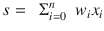

(5.2)

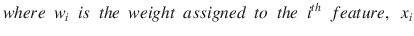

可以看出(5.2)和(5.0)差不多。事实上，两者是相同的，权重确实是需要估计的参数。

但我们真正需要的是推文为真且上述得分 s 不保证在 0 到 1 之间的估计概率，a 概率应该是。我们使用一个称为逻辑函数的特殊函数将这个分数转换成概率。我们说，我们的解决方案采用的参数统计模型是“逻辑回归”逻辑函数定义为

(5.3)

该功能绘制在图 [5-2](#Fig2) 中。可以看出，它的值从 0 到 1 不等。更具体地说，从图 [5-2](#Fig2) 可以看出

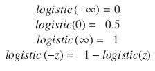

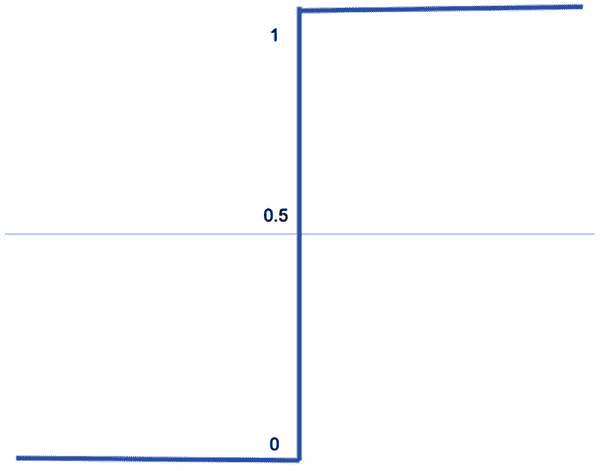

图 5-3

The Step Function

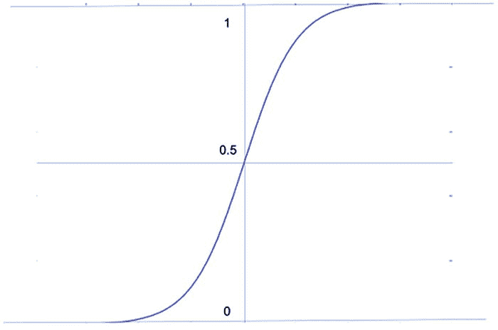

图 5-2

The plot of a logistic function

图 [5-2](#Fig2) 中的另一个观察结果是，逻辑函数的图具有字母 S 的形状。其图具有 S 形状的函数类通常被称为 Sigmoid 函数。

图 [5-3](#Fig3) 显示了一个阶跃函数。逻辑函数图在形状上与阶跃函数非常相似，具有一些独特而有用的特征。它是平滑、连续和单调的。许多现实世界的现象都符合这个模型，其中的值连续变化，而不是像阶跃函数那样离散变化。逻辑函数也与优势比相关。我们知道，odds 这个词指的是一个事件发生的可能性。如果 p 是事件发生的概率，几率由给出。逻辑函数的逆函数，称为 logit 函数，本质上是这些概率的对数。

Note

逻辑函数与概率密切相关，在概率、统计和机器学习中被广泛使用。

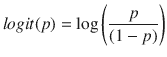

(5.4)

(5.5)

可以看出，物流功能在多个方面非常适合我们的目的。因此，我们使用此函数，通过对分数进行如下逻辑运算，将我们的真实性分数表示为概率:

(5.6)

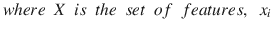

我们只是用表达式代替了逻辑函数(5.3)中的分数(5.2)而不是 z。现在，机器学习问题简化为寻找训练数据中推文的权重 w i 给定 x i 以及它们各自的概率 1 或 0。一旦我们从训练数据中知道了权重，我们就可以使用相同的权重来确定任何新推文的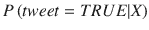，使用(5.6)。操作如图 [5-4](#Fig4) 所示。

图 5-4

Pictorial representation of equation (5.6) in terms of the features, weights, the sum of their product, and finally substituted in the Sigmoid function

值得注意的观察是(5.7)中(5.6)的以下重排，重申了逻辑函数的倒数是对数概率的事实。

(5.7)

我们可以很容易地认识到(5.7)的 L.H.S 是几率。

寻找权重的问题，也称为参数估计，可以通过使用所谓的最大似然估计(MLE)来解决，其目的是最大化关于权重的似然性。MLE 是统计学的一个基本概念，用来估计参数。数学上，我们发现权重 w i 使得由以下表达式给出的所有概率的乘积最大。【T2

更明确地说，π表示 P 后面各项的乘积，P 是推文真实的概率；y，推文的标签值(真或假)，表示单词“given”；x 是该推文的特征集；并且 W 是需要确定的一组权重。

出于最大化的目的，上面的表达式更容易和等价，即使我们取表达式的对数，称为对数似然。我们通过最大化对数似然得到同样的结果。使(5.7)中表达式的对数最大化的相同权重也使函数本身最大化。取对数(log)很有用，因为 log 函数把上面的乘积变成了一个和，注意

Y 只能取两个值，1 或 0，这一事实进一步简化了最大化的求解。优化技术可用于确定最大化(5.7)的权重。使用我们从训练数据中获得的权重，对于一条新的推文，我们可以计算

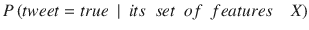

Note

机器学习的复杂问题通常被简化为寻找所选模型的权重或参数的看似简单的问题:在这种情况下，就是逻辑回归。

## 朴素贝叶斯分类器

到目前为止，在我们对真实性问题的讨论中，概率扮演了一个关键的角色。概率研究的核心是贝叶斯定理。本节将探讨贝叶斯定理的直接应用如何帮助解决准确性问题。

在逻辑回归中，我们假设逻辑函数帮助我们区分真假推文。我们直接估计了推文真实性的分数，也是所谓的条件概率的指示，作为等式(5.2)中特征的线性函数。我们不知道什么是真实的推文，什么是虚假的推文。我们只是关心如何区分这两者。这被称为机器学习的区别方法。如果我们只需要区分两个类，这是一个更实用的方法。例如，如果我们必须区分两种口语，比如英语和汉语，根据单词的发音比学习每种语言更实际。然而，在某些情况下，我们确实学习语言来确定一个给定的句子属于哪种语言。这被称为生成方法。朴素贝叶斯技术就属于这种生成算法。

一方面，生成式方法之所以如此，是因为我们能够自己生成数据点。例如，如果我们学习汉语和英语来区分两者，我们也能够生成我们自己的句子——而不仅仅是区分两者。另一方面，区别性方法只能在两个类别之间进行区分，但不能生成新的数据点。按照概率的说法，生成模型从训练数据中学习先验概率和条件概率分布，而在判别模型(如逻辑回归)中，我们并不试图计算这样的概率。在概率世界中“学习”诸如英语这样的类本质上是计算属于该类的概率分布函数。

Note

机器学习算法可以分为判别型或生成型，后者具有生成数据点的能力。

学习语言示例只是为了说明生成性方法和区别性方法之间的区别，不应该从字面上理解。事实上，通常，生成方法产生的结果不如辨别方法准确，而在学习语言的例子中，直觉上，生成方法应该产生更好的结果，因为语言是被学习的。所以，这个类比只是象征性的，并不精确。

在我们的推文准确性问题中，用特征集 X，涉及到的概率有几个:

准确性问题是计算。一条真实(或虚假)的推文拥有特征 X 的概率是。在 frequentist 方法中，p(Y)告诉我们一条真实(或虚假)的推文在给定数据集中出现的频率。p(X)实际上是无关紧要的，因为它对于真实推文和虚假推文是一样的，但仍然用于计算我们的目标，如下所示。

熟悉概率的读者会记得 18 世纪英国统计学家托马斯·贝叶斯给出的基本定理，由下面的等式(5.8)给出。

(5.8)

我们的目标是找到一条推文为真的概率，给定其特征，可以使用上面的贝叶斯定理(5.8)来实现，如下面的(5.9)所示。

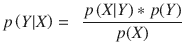

(5.9)

大多数算法都是基于一定的假设。朴素贝叶斯分类器的一个基本假设是所有特征都是相互独立的。这意味着，例如，转发次数多与喜欢次数多没有关系。在现实世界中，这不一定完全正确，但在大多数情况下，这是一个合理的近似值。独立性假设导致下面(5.10)中的等式。

(5.10)

示例:p(包含多媒体内容的推文被锁定，引用另一个用户|推文被标记为真)

= p(推文有多媒体内容|推文标注为真)*

p(推文被钉住|推文被标为真)*

p(推文引用另一用户|推文标注为真)

同样，

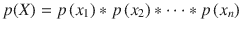

(5.11)Note

过去的频率，作为出现的次数，转换成概率，概率有助于预测未来。

(5.10)右侧的概率可以通过记录相应出现的频率从训练数据中计算出来。例如，训练数据可以告诉我们有多少条推文被标记为真实的。那么，条件概率就是这些事件的数量与数据集中真实推文总数的比率。利用(5.10)，我们可以计算出。类似地，p(X)可以用(5.11)式计算。p(x i 简单来说就是具有特定特征的推文数量除以推文总数的比率。我们将每个特征的这些概率相乘，得到 p(X)。

在计算左边的目标之前，唯一需要计算的(5.9)式右边的项是 p(Y)。这只是在给定的数据集中找到一条随机推文为真(或假)的概率。这类似于计算在包含 m 个红色球和 n 个绿色球的袋子中找到一个红色球的概率。对于训练数据，p(Y)只是标记为真(或假)的推文数量与训练数据集中推文总数的比率。既然我们在右边有了所有的项，那么左边的项就可以很容易地计算出来，这就给出了一条新推文的预期概率，考虑到它的特征。

Note

机器学习的复杂问题有时可以通过贝叶斯定理的简单应用来解决，假设给定标签，这些特征有条件地相互独立。

## 支持向量机

一种相对较新的机器学习算法，在 20 世纪 90 年代流行，用于分类的任务，在我们的情况下，分为真和假数据点，被称为支持向量机(SVM)。SVM 背后的想法是绘制图 [5-1](#Fig1) 中的分类器，以便最大化分离的训练数据的余量。边距是距离分类器最近的两侧数据点之间的距离。让我们以 Twitter 为例来了解更多细节。

正如本章开头所讨论的，让我们假设训练数据如图 [5-5](#Fig5) 所示。我们在左边标绘了真实的推文，在右边标绘了虚假的推文。

图 5-5

A new tweet falls in between the True and False tweets

现在，我们希望找到一条新推文的真实性，该推文在情节中处于真假推文之间，如图 [5-5](#Fig5) 所示。有多种方法可以得出一个分类器，在训练集中区分真假推文。让我们首先把自己局限于线性分类器。图 [5-6](#Fig6) 展示了一些可能的线性分类器。根据我们选择的分类器，新推文可以被标记为真或假。例如，选择图中的分类器 2 或分类器 5 将导致新推文被标记为假，而选择任何其他分类器将导致新推文被标记为真。

图 5-6

The new tweet can be classified differently by the various possible classifiers that we can choose from

我们显然需要一种更具决定性的方法来选择分类器。理想情况下，分类器应该尽可能地从虚假推文中分离出真实推文。这个尽可能分离出推文的问题可以用数学来表达，更清楚地如下。我们希望找到一个分类器，使得最接近的真实推文和最接近的虚假推文之间的距离尽可能宽。为此，我们确定了位于两个类别之间的边界上的点，更确切地说是向量。在图 [5-7](#Fig7) 中，这些点或向量显示为支持向量。我们想要确定一个与这些向量距离最大的超曲面。图 [5-8](#Fig8) 显示了这样一个超曲面，也称为最大间隔分类器。超曲面之所以被称为超曲面，是因为它最大化了两个类的边界之间的余量。

图 5-8

The Hypersurface that is at a maximum distance from both boundaries

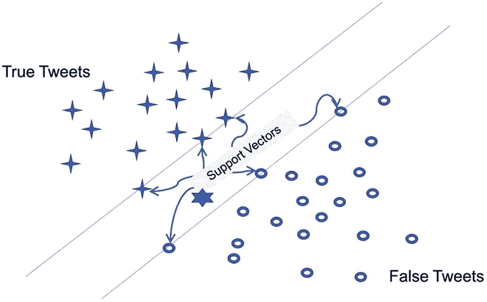

图 5-7

Vectors that are on the boundaries

图 [5-9](#Fig9) 说明了为什么边界上的向量被称为支持向量——它们可以被视为支持分类超曲面。如果这些向量稍微移动，超曲面将不得不随之移动。需要注意的相关点是，超曲面仅依赖于这些点，而不依赖于训练集中的其他数据点，当然，除非这些点跨越边界成为支持向量。

图 5-9

The vectors on the boundaries can be seen as “supporting” the Maximum Margin Classifier hypersurface Note

过去数据集中的几个数据点可以帮助预测所有未来数据点的类别。

最大间隔分类器的数学方程仍然是(5.0)的形式。只是参数的发现方式不同，使用了一些不同于逻辑回归的标准。然而，必须注意的是，我们通过仅考虑线性分类器来简化讨论。情况可能并不总是如此。例如，在图 [5-10](#Fig10) 中，决策边界根本不是线性的。(5.0)中的超曲面方程不再适用。在这种情况下，我们使用所谓的核函数来建模分类器。寻找最大利润所需的数学使用二次规划，这超出了本书的范围。然而，即使不知道二次规划的复杂性，也可以掌握实现支持向量机的软件。

图 5-10

Class boundaries may not always be linear, as can be seen in this case

## 人工神经网络

我们的大脑通过连接许多神经元并利用这些连接在神经元之间传输信号来发挥作用。学习是通过神经元、神经元之间的连接以及通过神经元传递的信号逐步进行的。让我们更仔细地看看学习是如何在我们的算法中实现的。图 [5-11](#Fig11) 说明了在我们的机器学习算法(如逻辑回归)中会发生什么。我们从训练数据集中提取一些特征，并将它们用作输入，x i 。使用每个输入的权重 x i 来分解输入。使用函数(如逻辑函数)将权重和输入组合在一起，以产生真或假的输出分类。

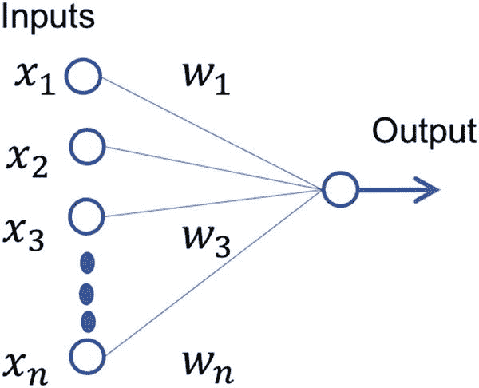

图 5-11

A number of input nodes connect to the output node, which does some processing and classifies a new datapoint as true or false

使用人脑类比，每个输入可以被认为是一个神经元，更正确地说，是一个接受输入的人工神经元。每个输入神经元连接到另一个神经元，后者进行一些处理并产生输出。产生输出的节点称为输出神经元。这是简单的学习。很直观，通过在输入和输出层之间引入更多的神经元、更多的连接和更多的处理，可以使输出更加准确。他们的功能是中介——他们既不从外部来源收集输入，也不向外部来源输出。因此，它们对外界是隐藏的。因此，它们可以被称为隐藏节点。图 [5-12](#Fig12) 显示了人工神经元的一种这样的排列。在这种情况下，隐藏层有三个节点。回到我们的 Twitter 示例，让我们假设三个隐藏节点回答以下三个问题:a)发布推文的用户的声誉如何？b)该推文是否吸引了大量关注？c)推文内容的真实性如何？这三个答案是从输入图层中的节点获得的，这些节点实际上代表了要素。为了回答第一个问题，对应于用户相关特征的权重被期望在幅度上较高，而其他权重较低。

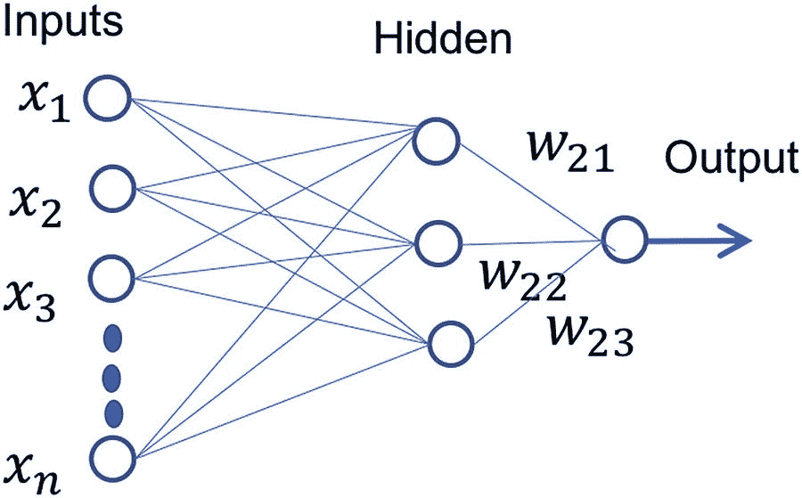

图 5-12

Introducing the “Hidden Layer” of neurons for more detailed processing Note

人工神经网络展示了机器学习与人类学习的生物过程有多接近。

类似地，为了回答第二和第三个问题，与用户相关的特征的权重被分配一个量值较低的值。为了避免混乱，这些权重没有在图中示出。对于第二个问题，与转发、喜欢和回复的数量相关的特征的权重被赋予较高的量值。第三个问题要求关于内容的特征的权重较高，例如它是否包含多媒体或对其他用户、杂志等的引用。这三个隐藏节点的值与它们自己的权重相结合，在图中显示为 w 21 、w 22 和 w 23 ，以达到最终分类为真或假。如图 [5-12](#Fig12) 所示的网络被称为人工神经网络(ANN)。它们可以包含任意数量的隐藏层。隐藏层和输出节点的数量由经验决定。对于我们的例子，输出节点当然只有一个，因为分类是二进制的——不是真就是假。

隐藏层数越多，学习越深入，导致深度学习。前面的讨论可能会提出逻辑回归与神经网络处理有何不同的问题。事实上，图 [5-11](#Fig11) 是逻辑回归的一种表示，类似于图 [5-4](#Fig4) 。在这个意义上，逻辑回归可以被认为是最简单的人工神经网络(ANN)。在人工神经网络的隐节点和输出节点上进行的处理类似于逻辑回归中进行的处理。这些节点的处理包括使用 sigmoid 函数(通常是逻辑函数本身)对加权要素进行变换。多层人工神经网络中的神经元本身可以被认为是逻辑回归单元。因此，当特征集很大并且在最终分类之前有许多中间问题要解决时，神经网络是有用的。

Note

人工神经网络比其他一些机器学习算法(如逻辑回归)强大许多倍。因此，人们对基于神经网络的深度学习越来越感兴趣。

## k 均值聚类

到目前为止，我们一直假设我们有一个带标签的数据集，可用于训练模型来计算权重。然而，正如最初讨论的那样，获取训练数据集并不总是容易的，我们需要仅基于未标记的数据对数据进行分类。这是无监督学习的任务之一。一种广泛使用的无监督学习方法是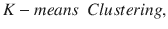，其中项目被自动分组到不同的簇中。产生的数据集被划分成 K 个聚类或子集，每个子集中的数据共享共同的特征。对于我们的准确性问题，K=2，因为我们的分类是二元的，并且两个聚类是真的和假的。

请注意使用了 cluster 这个词，而不是 class。类是人定义的，而聚类是自动确定的，没有任何人的参与。但是对于我们的微博问题，我们希望这些聚类代表人类定义的真实或虚假推文的类别。这可以通过适当地选择特征来实现，使得所有真实推文具有相似的特征，并且所有虚假推文具有与真实推文不同的相似特征。当绘制时，所有真实推文彼此接近，而虚假推文也彼此接近但远离真实推文。正如我们在图 [5-1](#Fig1) 中看到的，确实是这样。K-means 算法找到这两个组，而不求助于图 [5-1](#Fig1) 中的分类器。

在没有任何标记的训练数据的情况下，图 [5-1](#Fig1) 看起来像图[5-13](#Fig13)——空间中表示推文的点或向量看起来都一样，并且从一开始就属于同一类。现在的问题是将它们分为两类:真实推文和虚假推文，每一类都根据其特征的性质而聚集在一起。就像我们在支持向量机(SVM)中看到的那样，我们的目标是将识别出的两个集合尽可能地分开。与支持向量机一样，分离过程需要使用距离的概念。有几种方法可以测量两点或向量或数据点之间的距离。其中包括堪培拉度量，相关系数，余弦相似性和曼哈顿距离。为了保持我们的讨论直观，并且与普遍使用的一致，我们将自己限制在欧几里德距离，这是两点之间距离的常见几何概念。

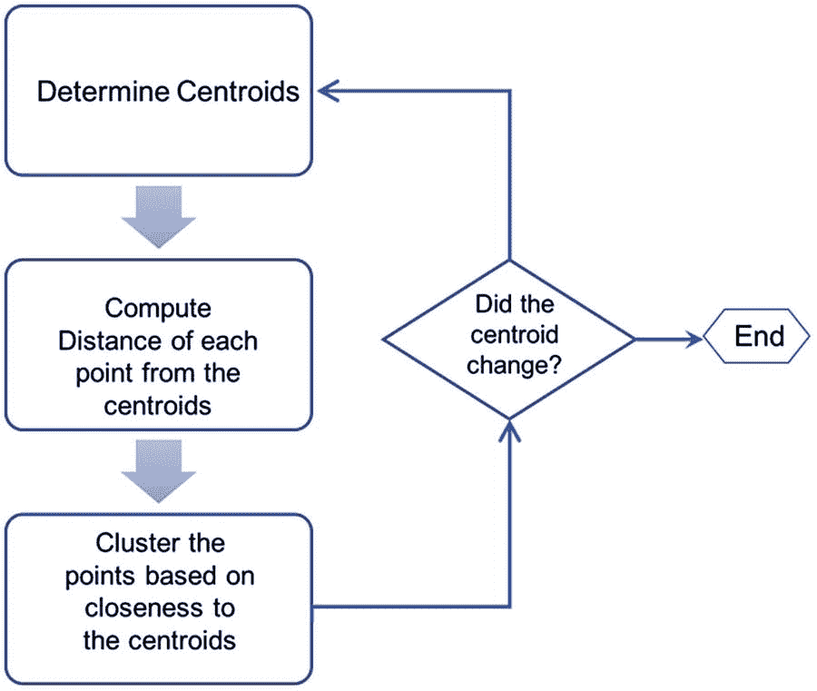

图 5-14

The K-Means Algorithm Flowchart

图 5-13

Unsupervised Learning: All tweets are unlabeled and undistinguishable to start with

K-Means 是一种迭代算法。聚类基于形心的概念，形心可以被视为聚类的中心。数学上，

在我们的例子中，K=2，所以首先，随机选择两个点作为两个群集的质心。对于每个其他点，计算两个距离:a)距质心-1 的距离，和 b)距质心-2 的距离。如果该点更靠近质心-1，则与聚类-1 成组，否则与聚类-2 成组。有了这个新的分组，中心必然会发生变化。为新的聚类计算新的质心。计算新的质心和重新分组这些点的过程继续进行，直到所有点都保留在它们在前一次迭代中被分配到的聚类中，并且质心没有改变。

K-means 算法保证收敛，其证明超出了本书的范围。它属于被称为坐标下降算法的一类。我们确信，当算法停止时，在一些迭代之后，质心不会改变。该过程如图 [5-14](#Fig13) 所示。这些质心周围的聚类是真实推文和虚假推文的组。

Note

对真数据点和假数据点的分类可以在无人监督的情况下进行。

## 摘要

学习区分真理和谎言是一个有趣的机器学习问题。我们看到了一些有助于实现这一目标的算法。这些算法要么通过提供标记的训练数据来监督，要么是无监督的。独立于此，算法可以是生成性的或鉴别性的，前者能够在学习概率分布之后合成数据点。判别方法的一个基本要素是参数估计。模型参数需要以优化算法精度的方式进行估计。在下一章，我们将改变方向，检查逻辑和形式方法如何在准确性领域帮助我们。

Exercises

1.  Sigmoid 函数，如逻辑函数，在本章的讨论中起着重要的作用。有哪些其他函数有可能取代 Sigmoid 函数并帮助机器学习？
2.  本章介绍了一些机器学习算法，可用于解决准确性问题。探索其他算法，如随机森林和线性判别分析，看它们是否适合准确性问题。
3.  K-means 算法假设平均值代表聚类。然而，在现实世界中，最经常的情况是，“最”大声疾呼，“最”有影响力，“最”富有，或者其他一些“最”__ 的人被选为代表一个选区的人民。检查基于“模式”而不是“平均值”的聚类算法在准确性和应用有用性方面的性能
4.  实现一个人工神经网络来解决本章讨论的 tweets 的准确性问题。
5.  比较本章中讨论的各种算法对于微博准确性问题的性能和适用性。