# 6.形式化方法

[Terminology](#Sec1) [Propositional Logic](#Sec2) [Predicate Calculus](#Sec3) [Fuzzy Logic](#Sec4) [Summary](#Sec5)

我们能强加一个真实信息的语法吗？当作者在他发表主题语音的一些会议上向观众提出这个问题时，答案主要是“不”。事实上，常识告诉我们，真理更多地与语义而不是句法相关。处理语义，尤其是自然语言的语义，远比处理语法复杂，这使得寻找真理成为一项艰巨的任务。数学又一次拯救了我们，只是形式不同。本章中的数学触及了问题的关键——信息的表示。信息的表示在处理信息的算法中起着关键的作用。表达越精确和正式，信息就越容易被自动化处理。

代表性在现实生活中也很重要。当思想用侵略性的、好战的、对抗的语言表达时，问题就升级了。同样的想法，用有益的、真实的、支持性的句子表达出来，实际上可以解决问题。那些熟悉计算机科学中的数据结构的人可以很容易地联想到如何将数据表示为链表、栈或散列在解决问题时产生巨大的差异。在这一章中，我们将研究表示数据的逻辑符号，并使用这种表示来解决准确性问题。在大数据中使用逻辑的一个很好的例子是语义网中使用的三重存储。三重存储使用资源描述框架(RDF)进行数据表示。本章介绍的技术要求大数据的表示方式也有类似的转变。

以前的方法是事后的——我们检查过去已经发生的事情，并确定其真实性。到目前为止，这些方法不能直接用于防止误传。他们只是帮助遏制错误信息。如果我们能给真实的信息强加一种语法，我们就有可能阻止错误的信息进入系统。毕竟，事实是信息的唯一形式。只是在思想、互动和行为开始变坏之后，人们才发明语言结构来表达错误信息。

如果这种表达能够再次被限制在一组严格的声音结构中，那么就有可能建立完全健全的系统，没有不精确和虚假的地方。这些想法并不像看起来那么牵强。上一章讨论的区块链技术是一个例子，它接近于建立一个完全可靠的系统的想法。很快，通过开发表示构造，就有可能建立完全可靠的系统。这种表示当然应该有定义明确的语义支持，便于推断真理或真理的缺失。

Note

知识和信息表示在进化系统中一直扮演着重要的角色，并将继续如此。

形式方法是数学技术，用于计算系统的严格表示，以帮助它们的设计和验证。方法是正式的，因为规范和操作是精确的，并且符合规则。关于系统行为和属性的数据以简洁的语法捕获，有助于系统的推理。数理逻辑是形式方法的组成部分之一。正如我们将看到的，逻辑是关于语法、公理和用语法进行操作的规则。验证、推理或证明真理成为公理和规则的战略应用问题，将信息转换为包含真理或不包含真理。当使用逻辑结构表示数据时，通过将数据转换成逻辑推理问题，有助于解决准确性问题。

Note

形式化方法提供了强大的技术，可以使用标准化的语法将关于系统的一般描述翻译成精确的规范语言，并以越来越自动化的方式进行推理。

正式的规范可以帮助检查一致性，但可以理解的是，不能保证是完整的。不可能捕获与系统相关的每个细节来使规格完整。因此，通常的假设是，如果在一个系统中不知道一个陈述为真，那么它就被假设为假。这就是所谓的封闭世界假设。直觉上，自动推理中使用的句法操作不太可能使用特定领域的规则和知识；因此，它被认为是一个薄弱的方法。然而，也有软件程序，如专家系统，它们基于逻辑，在规则库中获取领域知识，以提供更强的推理方法。

系统需求和描述有时含糊不清且不一致。将它们翻译成正式的规格说明可以揭示任何这样的不精确性并消除它。因此，知识表示有望防止错误信息进入系统。任何需要成为系统一部分的新陈述都需要经历蕴涵过程，这确保了被接受的陈述是真实的。许多公司，如 IBM、Microsoft 和 Intel，已经成功地使用了软件和硬件验证的正式方法。

我们在第 [3](3.html) 章简要地检查了基于正式方法的方法。接下来的几节给出了关于这个主题的更正式的论述。

## 术语

我们已经在导言和本章开始时使用了一些形式方法的术语。让我们用更精确、更严谨的说法来形式化更多的术语。这些术语和它们的定义紧跟现实世界的现象，所以它们应该不需要很多解释，就像我们在第 [3](3.html) 章和本章开头几段看到的那样。首先是一个证明的最有用的概念。证据是一种论证形式，由一系列符合推理规则的步骤组成。这些规则有助于从前面的陈述中得出结论。证明的目的是证明某事是真实的。如果目标失败了，并且不能被证明是真的，在封闭世界假设(CWA)中，它被认为是假的。

被正式证明为真的陈述称为定理。有时候，定理的证明会变得很长。在这种情况下，一个引理被用作证明另一个定理的中间定理。一个定理经常导致其他被称为推论的结论。这些也是定理，可以从其他已经证明的定理建立起来。在现实世界中，我们发现许多事实是不言而喻的，不需要证明。这些是最基本的事实。用来暗示那些总是被假定为真理的基本真理的术语是公理。

如果我们不能证明一个定理和它的逆定理，我们就说一个系统是相容的。一个相同的概念是可靠性，它要求所有可证明的陈述都为真。通常，研究论文被拒绝是因为工作不完善。为了急于发表更多的论文，一些研究人员试图证明他们的假设，这可能不是真的。编辑委员会退回这样的论文，并评论说这项工作不完善。在每一种可能的解释中都成立的表达式称为重言式。另一方面，一个总是假的陈述叫做矛盾。不属于这两类的报表被称为偶发事件。

正如我们将看到的，定理证明是如此机械，以至于构造证明是用计算机编程语言编码的。这种自动定理证明(ATP)广泛用于数学、软件设计和验证以及硬件验证中的各种应用。今天有许多成功的 ATP 系统在使用。还有许多其他术语，其中一些将在本章中介绍。现在，我们有足够的说法来开始讨论当我们拥有的数据用逻辑符号表示时，如何解决准确性问题。

Note

正式方法由许多定义明确的术语组成，这些术语本身是正式陈述的，没有任何歧义。

## 命题逻辑

命题是可以为真或为假的陈述。这些命题可以用逻辑连接词连接起来。命题逻辑提供了联接或改变命题以构造其他命题的方法。用 and、or 组合自然语言句子的常见方法也适用于命题逻辑。可以使用 and 和 or 等运算符组合命题。同样，就像 not 被用来改变英语句子的意思一样，它在命题逻辑中也被用作具有相同语义的运算符。所有这些听起来像英语和其他自然语言。逻辑的不同之处是什么，使得它在处理准确性问题时如此有用？正是数学抽象赋予了这些概念将准确性问题转化为数学推理问题的能力。

数学需要符号。表 [6-1](#Tab1) 显示了我们在上一段中讨论的操作符的语法(符号)。否定运算符只是将一个真命题的值改为假，反之亦然。其他运算符的语义在表 [6-2](#Tab2) 至 [6-5](#Tab5) 中给出。语义解释非常直观，并且与现实世界的解释非常接近。例如，由 and 运算符连接的两个 true 语句产生一个 true 语句。如果这两个语句中的任何一个为假，则 and 合取的结果语句将为假。例如，如果“约翰获得了英语 A 级”和“约翰获得了科学 A 级”是真陈述，那么组合陈述“约翰获得了英语 C 级和科学 A 级”直观上是假的，并且即使根据表 [6-2](#Tab2) 中的真值表也是假的。表中的 T 代表真，F 代表假。

运算符可以在一个句子中使用任意多次。例如，(p → q) ∧ (q → p)就是一个有效的句子。事实上，如果为这个表达式绘制一个真值表，它可以被验证为等价于(p ↔ q)。真值表同样用于确定不同表达式的等价性。利用真值表，可以确定(p ∨ p)是重言式，而(p ∧ p)是始终为假的矛盾式。也可以确定(p → q)等价于(p ∨ q)，(p ∨ q)等价于(p ∧ q)。

表 6-6

Converse, Inverse, and Contrapositive of an implication

<colgroup><col align="left"> <col align="left"></colgroup> 
| 注释 | 意义 |
| :-- | :-- |
| `p → q` | `If p then q` |
| `q → p` | `Converse of the 1st row (if q then p)` |
| `¬p → ¬q` | `Inverse of the 1st row (if not p then not q)` |
| `¬q → ¬p` | `Contrapositive of the 1st row (if not q then not p)` |

表 6-5

Semantics for the equivalence operator

<colgroup><col align="left"> <col align="left"> <col align="left"></colgroup> 
| 建议 p | 提案 q | p·q |
| :-- | :-- | :-- |
| `T` | `T` | `T` |
| `T` | `F` | `F` |
| `F` | `T` | `F` |
| `F` | `F` | `T` |

表 6-4

Semantics for the implication operator

<colgroup><col align="left"> <col align="left"> <col align="left"></colgroup> 
| 建议 p | 提案 q | p → q |
| :-- | :-- | :-- |
| `T` | `T` | `T` |
| `T` | `F` | `F` |
| `F` | `T` | `T` |
| `F` | `F` | `T` |

表 6-3

Semantics for the disjunctive or operator

<colgroup><col align="left"> <col align="left"> <col align="left"></colgroup> 
| 建议 p | 提案 q | 问什么 |
| :-- | :-- | :-- |
| `T` | `T` | `T` |
| `T` | `F` | `T` |
| `F` | `T` | `T` |
| `F` | `F` | `F` |

表 6-2

Semantics for the conjunctive and operator

<colgroup><col align="left"> <col align="left"> <col align="left"></colgroup> 
| 建议 p | 提案 q | -什么 |
| :-- | :-- | :-- |
| `T` | `T` | `T` |
| `T` | `F` | `F` |
| `F` | `T` | `F` |
| `F` | `F` | `F` |

表 6-1

Propositional Logic Notation

<colgroup><col align="left"> <col align="left"></colgroup> 
| 标志 | 意义 |
| :-- | :-- |
| `⋏` | `And (conjunction)` |
| `⋎` | `Or (disjunction)` |
| `→` | `If (implication)` |
| `¬` | `Not (negation)` |
| `↔` | `If and only if (equivalence)` |

表 [6-6](#Tab6) 说明了术语逆、逆和逆正的语义，当构造引理、定理的证明和绘制推论时，这些术语有时是有用的。这种解释也很直观。假设 p 是“约翰得了 A”，q 是“约翰很努力。”那么，他们言下之意的反命题是“如果约翰不努力学习，那么约翰就得不到 A。”

可以看出，我们围绕信息表示开发的数学越多，我们就有越多的工具来确定复杂陈述的真实性。真值表就是这样一种结构。然而，如果一个表达式中有 n 个命题，我们需要表中的 2 n 行和那么多的计算。显然，这样的计算变得难以处理。因此，大多数逻辑系统依赖于推理规则。真理可以通过真值表，逐行或使用推理规则来检查。我们在第 3 章[中看到了一个推理规则的例子，叫做假言假语。表](3.html) [6-7](#Tab7) 中列出了更多此类规则。请注意，表中的 c 代表矛盾。如果第二列中给出的命题为真，那么第三列中的命题也可以推断为真。因此，给定的表达式可以转换成推断的表达式。

Note

推理规则！

表 6-7

Inference rules of Propositional Logic; c stands for contradiction

<colgroup><col align="left"> <col align="left"> <col align="left"></colgroup> 
| 推理规则 | 考虑到 | 暗示 |
| :-- | :-- | :-- |
| `Modus ponens` | `p, p → q` | `q` |
| `Modus tollens` | `¬ q, p → q` | `¬ p` |
| `Generalization` | `Either p or q` | `p ∨ q` |
| `Specialization` | `p ∧ q` | `Either p or q` |
| `Conjunction introduction` | `p, q` | `p ∧ q` |
| `Replacement` | `p →q` | `¬ p ∨ q` |
| `Disjunctive Syllogism` | `p ∨ q, ¬ p` | `q` |
| `Disjunctive Syllogism` | `p ∨ q, ¬ q` | `p` |
| `Transitivity` | `p → q, q → r` | `p → r` |
| `Contradiction` | `¬ p →` | `p` |
| `Division into cases` | `p ∨ q, p →r, q → r` | `r` |

就像在犯罪现场的情况下，规则是非常直观的。以表 [6-7](#Tab7) 中描述的析取三段论为例。说 p 是“约翰很聪明”，q 是“约翰考试不及格。”如果我们知道 p 和 p ∨ q 为真，表示“约翰不聪明”，“要么约翰聪明，要么约翰考试不及格”，那么直觉上，“约翰考试不及格”一定为真。表 [6-7](#Tab7) 中选言三段论的一行基本上证实了这一点。同样，传递性规则也可以直观地理解。如果约翰聪明，那么约翰会通过考试，如果约翰会通过考试，那么约翰就会毕业。从前面的暗示可以推断，如果约翰很聪明，那么约翰将会毕业。表 [6-8](#Tab8) 给出了 LHS 与 RHS 相同的逻辑恒等式列表。这些身份可以通过构建 LHS 和 RHS 的真值表来验证。这些逻辑恒等式在开发证明时也会派上用场。

表 [6-7](#Tab7) 中的规则也有不同的名称。例如，一般化规则也称为 or 简介，有时表示为∨I——第一个符号代表 or，第二个符号代表简介。这是因为我们从前提开始，并在 RHS 上引入 or。类似地，专门化与引入相同，表示为∧I。必须注意，所有推理规则都可以被证明是合理的。

Note

推理所需的语义被封装在命题逻辑的语法中，因此定理证明或推导真理的任务就变成了语法操作。

表 6-8

Propositional Logic Identities

<colgroup><col align="left"> <col align="left"> <col align="left"></colgroup> 
| 身份名称 | lhs | 皇家健康保险公司 |
| :-- | :-- | :-- |
| `Identity` | `` | `p p` |
| `Idempotent` | `` | `p p` |
| `DeMorgan’s` | `` | `` |
| `Commutative` | `` | `` |
| `Absorption` | `` | `p p` |
| `Negation` | `` | `` |
| `Distributive` | `` | `` |
| `Associative` | `` | `` |
| `Double Negation` | `` | `p` |
| `Implication` | `` | `` |
| `Biconditional` | `` | `` |

使用推理规则、给定的公理和逻辑恒等式，通过用推导出的表达式替换给定的表达式来机械地进行证明。因此，证明变成了一系列的句法替换，每次替换都保留了真理。让我们考虑一个例子问题。在约翰的学校，要想进入科 EN498，他必须完成科 EN490 和科 EN200 或科 EN220。科 EN498、科 EN490、科 EN200 和科 EN220 是学校提供的不同课程。我们知道，约翰没有完成科 EN200，但完成了科 EN498。约翰声称他完成了 COEN220。他说的是事实吗？

使用命题逻辑寻找真理的第一步是将问题转化为命题，使用我们刚刚学到的符号。我们首先从以下命题开始:

*   p 代表“约翰完成科恩 498”
*   q 代表“约翰完成科恩 490”
*   r 代表“约翰完成科恩 200”
*   s 代表“约翰完成 COEN220”

现在，问题是证明 s 给定以下前提

(6.1)

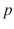

(6.2)

(6.3)

我们从前两个公理开始进行证明，并应用基于推理规则的替换，到时候使用第三个公理。证据如表 [6-9](#Tab9) 所示，证明约翰的主张是真实的，他确实完成了考 EN220。从表中可以看出，这个证明是纯句法的，证明了我们在本章开始时提出的问题。从公理开始，依次应用规则以达到目标，这叫做正向链接。另一方面，从目标开始，反向工作到公理，这叫做反向链接。这两种算法都可以被证明是可靠和完整的，并且是 O(n)阶的，其中 n 是包含给定前提集的知识库的大小。

Note

正向链接是数据驱动的，而反向链接是目标驱动的。

表 6-9

Proof that John completed COEN220

<colgroup><col align="left"> <col align="left"> <col align="left"></colgroup> 
| 序列编号 | 转换 | 应用的规则 |
| :-- | :-- | :-- |
| `1` | `p → q ∧ (r ∨ s)` | `Given axiom` |
| `2` | `p` | `Given axiom` |
| `3` | `q ∧ (r ∨ s)` | `Modus Ponens on 1 and 2` |
| `4` | `r ∨ s` | `Specialization` |
| `5` | `¬r` | `Given axiom` |
| `6` | `s` | `Disjunctive Syllogism on 4 and 5` |

在上面的例子中，我们从许多前提(6.1)、(6.2)、(6.3)开始，并从它们进行推论。一般来说，当数据用逻辑符号表示时，准确性问题可以转化为给定若干前提，p 1 ，p 2 ，p 3 ，…，p n 的结论 s 的问题。这就写成:

(6.4)

像(6.4)这样的表达式，从一组给定的前提中得出一个结论，叫做数列。用于这种证明的逻辑系统被称为顺序演算。

Prolog 是一种非常成功的语言，它使用了上面讨论的一些概念。Prolog 程序包含由一组事实和规则组成的用户提供的知识库(KB)。Prolog 的推理引擎主要基于一个推理规则——modus ponens。使用用户提供的知识库和推理引擎，Prolog 能够得出结论并确定一个声明是真还是假。如图 [6-1](#Fig1) 所示。知识库事实和规则以条款的形式出现。子句是使用析取(或运算符)连接的文字。文字是原子命题或它们的否定。Prolog 程序中的事实和规则称为 Horn 子句，以逻辑学家 Alfred Horn 的名字命名。

图 6-1

Determining truth in Prolog

Prolog 现在甚至以意想不到的方式在应用中使用，例如代码评审工具 Gerrit。它在欧洲和日本被广泛使用，特别是在 20 世纪 80 年代和 90 年代初作为第五代项目的一部分。Prolog 程序是一组 Horn 子句，带有一些附加值，如支持算术函数和构造，如防止回溯的 cut。对新声明真实性的评估通过前面描述的反向链接进行。在向后链接的过程中，回溯是当当前子目标失败时，返回到前一个分裂以查看是否有其他解决方案的过程。

Prolog 中的目标搜索以深度优先的方式从左到右进行，由下面两个子句中的递归表示。

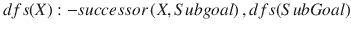

Prolog 运算符:–代表 if。在上面几行中，X 是一个变量。给定一个被证明为真或假的目标，Prolog 以上述递归方式进行。第一行是递归的终止条件。如果我们已经有了一个前提，即变量 X 代表知识库，那么第一个条件匹配，程序以给定目标的真返回值终止。否则，第二条规则开始生效。Prolog 通过以深度优先的搜索方式遍历知识库来尝试这个目标。按照前面讨论的封闭世界假设(CWA)，如果 Prolog 不能证明目标，则假设它是假的。

Note

逻辑惊人地将验证真理的问题转化为对符号的机械操作。

命题逻辑也称为零阶逻辑。它的表现力和能力是有限的。高阶逻辑(HOL)系统更具表现力和更强大。例如，一阶逻辑(FOL)允许对变量进行量化，二阶逻辑允许对变量集合进行量化，三阶逻辑允许对集合集合进行量化。诸如此类。使用量化，我们可以对数量进行操作，例如一个实体的所有实例或至少一个实例。对于大多数目的，一阶逻辑，也称为一阶谓词演算或简单谓词演算，通常在复杂性限制内就足够了。我们将在下一节中研究这一重要的逻辑顺序，它是强大逻辑系统的基础。

## 谓词演算

到目前为止，我们还没有使用过变量的概念。每个实体都是一个常数。想象一下没有变量概念的数学！我们仍然做了很多没有使用任何占位符变量的工作。当我们谈论大数据时，我们应该能够代表许多变量，因此也就代表了变量的需求。真实世界的数据大量处理实体，这也是直到现在才使用的。结合两者，一阶逻辑(FOL)提供了变量的量化，这在命题逻辑中是不可能的。变量的数量方面通常在自然语言(如英语)中使用短语(如存在和全部)来表示。这些短语表示实体的数量；因此它们在逻辑上被称为量子化子。

命题不是真的就是假的。他们的真实性没有变化。例如，命题“玛丽是安的母亲”要么是真的，要么是假的。如果这是真的，那就永远是真的。另一方面，诸如“x 是安的母亲”的谓词可以是真或假，并根据变量 x 的值来改变该值。在这里，玛丽和安是恒定的符号，是世界的真实实体。谓词象征着一种关系。前面的谓语可以象征性地写成

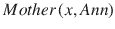

(6.4)

在(6.4)的上述谓词中，x 和 Ann 被称为术语，表示对象。上面的谓词是二元的，因为它包含两个术语。谓词可以使用我们在命题逻辑中使用的运算符来组合。例如，(6.5)中的句子可能意味着玛丽是安的妈妈，安是可可的妈妈。

(6.5)

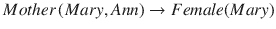

(6.6)

句子(6.6)使用 if 运算符来组合谓词，意思是“如果玛丽是安的母亲，那么玛丽是女性。”可以看出，在一阶逻辑中形成句子在表示数据和用数据进行推理以确定主张的真实性方面起着至关重要的作用。

如前所述，FOL 提供了另外两个操作符，全称量词∀，意思是“对于所有人”，以及存在量词∃，意思是“存在”使用全称量词，(6.6)可以概括为下面的(6.7)和(6.8)。(6.7)可以解释为，“对于所有实体 x，如果 x 是任何其他实体 y 的母，那么 x 是母。”另一方面，(6.8)可以解释为，“存在一个实体 x，使得如果另一个实体 y 是活的，那么 x 是 y 的母亲”

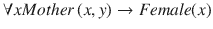

(6.7)

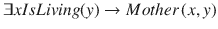

(6.8)

从真实性的角度来看，我们最关心的是推理真理。新的连接词需要新的推理规则。就像在命题逻辑中，我们有两个量词的引入和排除规则。也像在命题逻辑中一样，这些规则可以被证明是合理的。让我们先从最简单的开始——去掉全称量词。我们可以通过用一个特定的实例实例化变量来消除∀算子。例如，在(6.7)中，我们可以用一个特定的值 Mary 来实例化 x，并去掉全称量词。由此产生的句子见下文(6.9)。

(6.9)

在(6.9)中，我们用常数玛丽代替了 x。我们也可以用一个函数实例化变量，比如 MotherOf(Ann)，它看起来很像一个谓词，但又非常不同。谓词要么为真，要么为假，除此之外别无其他。另一方面，函数返回一个域中的值。例如，MotherOf(Ann)可以返回 Mary，而 Mother(Mary，Ann)只能返回 true 或 false。我们也可以把(6.7)的全称量词去掉，转化成下面的(6.10)。

(6.10)

必须注意，实例化必须在整个句子中统一出现。因此，在(6.9)中，我们不能用左边的玛丽(LHS)和右边的其他值(RHS)来实例化 x。全称量词消去规则被表示为∀E.

下一个更容易的规则是存在 Introduction,∃I，有时被称为存在概括。这很简单，因为如果一个句子对一个实例来说是真的，那么我们可以概括说存在一个实体使得这个句子是真的。利用这个规则，(6.9)可以推广为下面的(6.11)。

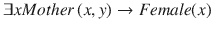

(6.11)

我们在句子(6.9)中用变量 x 代替了 Mary，并引入了存在量词。

在一阶逻辑中构造证明有时需要引入全称量词，表示为∀I.。这里的目标是将类似(6.10)的句子转换为类似(6.7)的一般化形式。只有当可以证明(6.9)中的值 Mary 没有特定的东西使其仅在该实例中为真，并且即使对于可以代替 Mary 的其他值，该句子也为真时，才能做到这一点。在(6.10)的情况下，这很容易证明，因为(6.10)是从(6.7)普遍消去的结果。因此，普遍引入一个句子很容易发生在从同一个句子中普遍排除一系列句子之后。

现在，对于最困难的规则，存在 Elimination,∃E.它可以用于通过替换变量 x 的特定值来将诸如(6.11)这样的包含存在量词的句子转换为消除量词的(6.9)。但是我们如何知道实例化的特定值使句子为真呢？因此，只有当可以证明特定实例在整个句子中代替变量时满足句子时，存在消除才能发生。

让我们考虑一个例子。我们想知道，鉴于“班上一名学生获得了 A”和“班上每个学生都毕业了”的事实，老师声称的“一名学生毕业后获得了 A”是真是假。如同前面的命题逻辑例子一样，我们首先构建以下前提:

*   学生(x)代表“x 是这个班的学生”
*   Agrade(x)代表“x 获得 A 级”
*   毕业(x)代表“x 毕业”

这个领域，更正式的说法是话语的领域，或者说话语的世界，是这个班所有学生的集合。给定的前提可以写成下面的(6.12)和(6.13)。

(6.12)

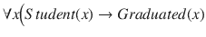

(6.13)

需要评价其真实性的老师的说法可以写成下面的(6.14)。

(6.14)

从表 [6-10](#Tab10) 中的证明来看，确实出现了教师在(6.14)中的主张确实是真实的。

表 6-10

Proof that the teacher’s claim is true

<colgroup><col align="left"> <col align="left"> <col align="left"></colgroup> 
| 序列编号 | 转换 | 应用的规则 |
| :-- | :-- | :-- |
| `1` | `` | `Given premise (6.12)` |
| `2` | `` | `` |
| `3` | `Student (joe)` | `Specialization of # 2 above` |
| `4` | `` | `Given premise (6.13)` |
| `5` | `` | `` |
| `6` | `Graduated (joe)` | `Modus ponens on # 3 and # 5` |
| `7` | `Agrade (joe)` | `Specialization from # 2` |
| `8` | `` | `Conjunction introduction into# 6 and # 7` |
| `9` | `` | `` |

Note

逻辑是真理的语言。真理或真理的缺乏在逻辑面前显露出来。

## 模糊逻辑

前面的讨论假设数据可以被精确地表示而没有任何模糊性或不确定性。然而，这种精确度对现实世界的要求太苛刻了——我们不能总是用绝对的真与假或 1 与 0 来谈论。在 Twitter 的例子中，我们在关于机器学习的章节中看到，第 [5](5.html) 章，我们不能确定地表达依赖性。例如，如果一条推文有多媒体内容，我们就不能断定它是真实的。我们只能断定这很有可能是真的。显然，这样一个不精确的论域不能用布尔逻辑来建模，在布尔逻辑中只有两种结果，真或假，是可能的。此外，像神经网络这样的机器学习算法可能会变得计算密集型和难以处理。我们显然需要一种在不确定环境下进行推理的方法。

模糊逻辑是由洛夫蒂·扎德在 20 世纪 60 年代发明的，它将布尔逻辑概念扩展到了不精确。它更接近真实世界和人们的想法。布尔逻辑实际上是模糊逻辑的一种边界情况。我们用弹性约束来定义场景，而不是精确建模。这些弹性约束通过推理过程传播。弹性约束是主观的，基于意见，而不是频率或精确的测量。类之间的边界是柔和的，它们之间的过渡是平滑的。一个很好的类比是，教授有时会对学生手软，给答案一些分数，而不是只给零分。像模糊逻辑这样的技术，其中类的边界是软的，属于所谓的软计算。

Note

模糊逻辑比理想的布尔逻辑更接近真实世界。

在经典集合论中，一个元素的成员是明确的——要么它存在于集合中，要么不存在。在模糊理论中，集合 A 中元素的隶属度是模糊的，由隶属函数μ A 给出，其取值在 0 和 1 之间。隶属函数表示一个元素属于一个集合的程度。图 [6-2](#Fig2) 和 [6-3](#Fig3) 显示了我们在第 [5](5.html) 章中讨论的 tweets 示例的两种隶属函数。隶属度函数根据收到的转发次数，将每条推文的隶属度划分为三类(图中由细、粗、虚线包围的区域):a)假，b)真，c)不确定。可以看出，这些阶层之间的界限并不清晰。事实上，这两个类别之间有明显的重叠。这意味着有一定转发次数的推文可能是真的，也可能是假的，或者我们不知道它们是真的还是假的。这个场景更接近真实世界的情况。仅仅因为一条推文有一定数量的转发并不意味着它是真的或假的。因此，我们已经成功地模拟了一个真实世界的情况，这在布尔逻辑中是不可能的。

图 6-3

Gaussian Membership Function

图 6-2

Trapezoidal Membership Function

图 [6-2](#Fig2) 中的隶属函数为梯形，具有平行的水平边。但是从概率和统计中，我们知道在许多话语领域中的数据是正态分布的，并且由形式为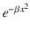的高斯函数表示，其中β是正实数。例如，正态分布的概率密度函数由高斯函数给出，它是后者的形式。因此，模糊隶属度函数通常采用高斯函数的形式，其曲线看起来类似于图 [6-3](#Fig3) 中的曲线。

作为另一个例子，几乎等于 1 的实数的模糊集合的隶属函数可以由下面(6.15)中给出的高斯函数来建模。

(6.15)

必须注意，隶属函数可以采取多种形式。图 [6-2](#Fig2) 和图 [6-3](#Fig3) 是其中两种形状，可能是更受欢迎的形状。梯形隶属函数的值如下表 [6-11](#Tab11) 所示。

表 6-11

Value of a trapezoidal membership function

<colgroup><col align="left"> <col align="left"></colgroup> 
| μ X 的值 | 当 x 的值为 |
| :-- | :-- |
| `` | `` |
| `1` | `` |
| `` | `` |
| `0` | `all other values` |

使用隶属函数的概念，命题逻辑和谓词演算可以扩展到模型模糊性。如表 [6-12](#Tab12) 所示，运算符的定义发生了变化，以包含模糊性。在表中给出的例子中，假设 T 是真实推文的集合，F 是虚假推文的集合。隶属函数μ T 给出一条推文为真的可能性，而μ F 表示一条推文为假的可能性。可以看出，它们加起来大于 1.0，表明模糊集的粒化和分级。粒化指的是这样一个事实，即一个类有一个关联的范围，而不仅仅是一个值。毕业意味着不同类别之间的过渡是渐进的，有一些重叠。

表 6-12

Fuzzy interpretation of the logical operators

<colgroup><col align="left"> <col align="left"> <col align="left"> <col align="left"></colgroup> 
| 操作员 | 意义 | 模糊解释 | 例(μ T = 0.7，μ F = 0.4 |
| :-- | :-- | :-- | :-- |
| `⋏` | `And (conjunction)` | `min(μ T , μ F )` | `0.4` |
| `⋎` | `Or (disjunction)` | `max(μ T , μ F )` | `0.7` |
| `¬` | `Not (negation)` | `` | `0.3` |

通过将μ T 和μ F 限制为仅 1 或 0，并与布尔逻辑解释交叉检查，可以验证表 [6-12](#Tab12) 中的解释为真。例如，当时，因为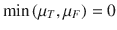，合取导致 0，而析取导致 1。命题逻辑部分的表 [6-8](#Tab8) 中给出的交换律、结合律、分配律、幂等律和德摩根定律同样适用于模糊逻辑。布尔逻辑的推理机制同样可以扩展到处理模糊逻辑中的不精确性。

模糊集的一个有用的度量是它的熵。它在下面的(6.16)中定义。

(6.16)

熵是类中无序或不精确的指示。对于一个脆集和布尔逻辑，很容易看出熵为零，因为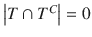。

Note

尽管在时间上被发明得更早，古典布尔逻辑可以被看作是模糊逻辑的一个特例。

## 摘要

以适当的方式表示数据有助于用数据进行推理以确定其真实性。在这一章中，我们研究了如何使用经典布尔逻辑和模糊逻辑来模拟现实世界和进行推理。我们使用了我们在第 5 章[中使用的同一个 Twitter 例子来演示模糊逻辑如何帮助处理推文真实性中的熵。本章介绍的技术要求改变大数据的表示方式。这个主题有很大的发展空间，可以涵盖各种形式的大数据。在下一章中，我们将检查更多的方法，特别是来自信息检索领域的方法，以解决准确性问题。](5.html)

Exercises

1.  画一张表，描述一个蕴涵的逆命题的语义。比较下表和那张表的含意。
2.  回想一些真实世界的场景，人们被骗去相信一些事情，因为他们不能推理和看透逻辑。构建证据，如表 [6-10](#Tab10) 中的证据，以证明此类场景中的相反主张。
3.  在这一章中，我们研究了一些逻辑操作符，比如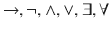。我们研究了最后两个操作符，即量词，是如何对命题逻辑中的可能性进行显著增值的。你还能想到其他操作符吗，它们的引入可以实质性地增强用布尔逻辑对真实世界建模的能力？如果是这样，提供它们的语法、语义，并讨论它们如何进一步提供帮助。
4.  现实世界中有哪些可以被建模为模糊集的集合？描述它们的隶属函数的特征，最好是方程形式，如(6.15)或表 [6-11](#Tab11) 。