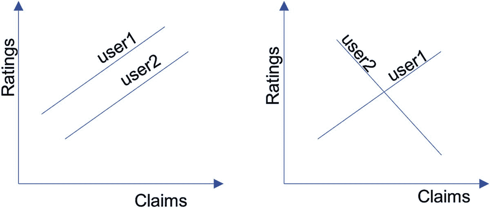
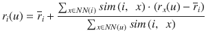
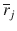
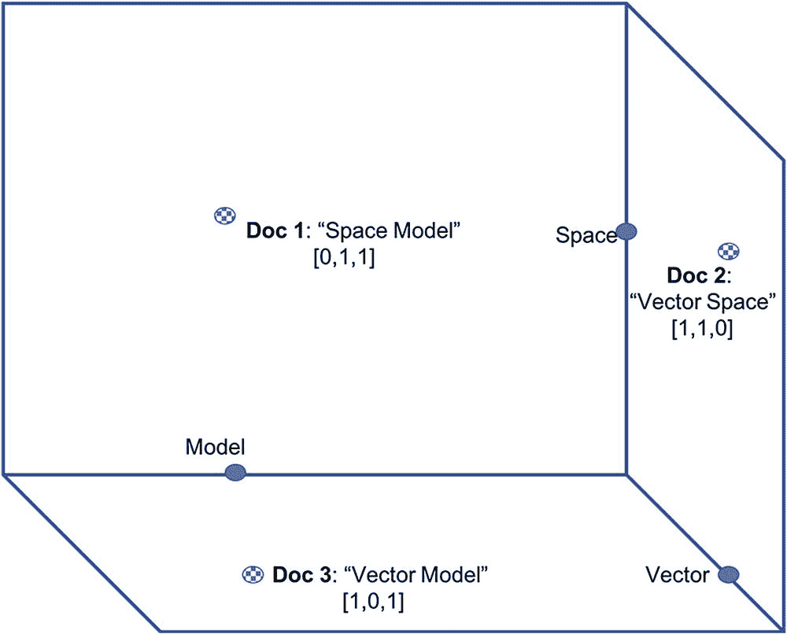
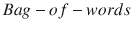
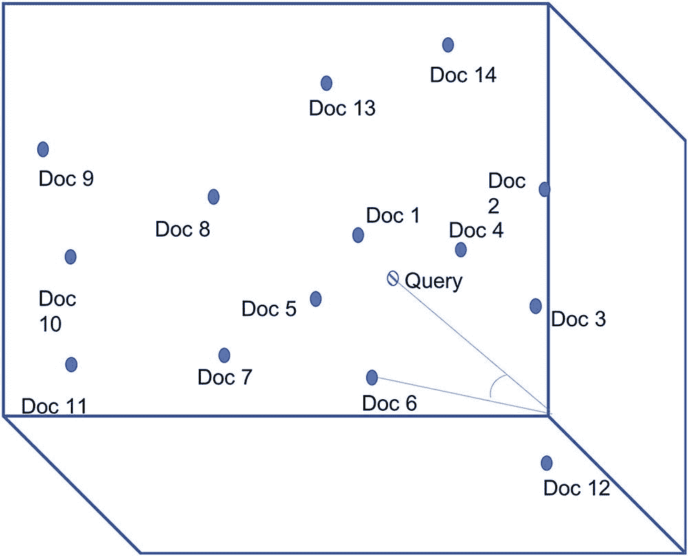

# 7.更多方法的组合

[Collaborative Filtering](#Sec1) [Vector Space Model](#Sec2) [Summary](#Sec3)

大数据有多种类型，包括文本、视频、音频、结构化数据、非结构化数据、传统数据、来自新来源的数据等等。大数据的多样性也体现了准确性问题。因此我们需要多种方法来解决各种表现形式的真实性问题。这些方法的主要类别将在其余章节中介绍。这一章是为不属于本书中描述的任何其他大类的方法而写的，并且不能归纳为一个单独的类别。因此，我们称这些方法的集合为一个混合体。我们在第 [3](3.html) 章简单介绍了一下。在本章中，我们将更详细地研究它们。

## 协同过滤

谣言制造厂依靠非正式的合作发展壮大。谣言非正式地从一个人传到另一个人，并在这个过程中愈演愈烈。以类似的方式，在正式的环境中，真相也通过合作而进化。谷歌学者的口号是，“站在巨人的肩膀上”，表明研究工作的高度协作性。研究学者利用诸如 Google scholar 这样的平台相互合作，发现最微妙的真相。在大多数正式的环境中，真相和基于真相的工作通过合作而进化。人们以相关的方式得出关于声明真实性的结论。我们常常可以根据相似人的动作来猜测一个人的动作。协同过滤(CF)是这些概念的数学、编程抽象。它利用人们的判断来处理不确定性和不完整的信息。协同过滤是一个主要领域，使用了许多概率和非概率算法。本章用非概率方法介绍这个主题。

协同过滤主要用于基于相似用户和相似物品的个人品味来推荐物品。这一章将这些想法扩展到了真实性领域。在准确性领域使用 CF 可能有助于搜索引擎提供更符合用户信仰、价值观和直觉的结果。搜索引擎可以从用户的角度分配一个真实性指数。问答(QA)系统可以从相似用户的角度确定用户所作声明的真实性。回到我们的微博示例，可以基于用户的帖子相对于其他用户的帖子的相关系数的变化来确定用户的帐户是否被黑客攻击。微博用户可以找到和他们有相似信仰的其他用户。例如，对于一个发布全球变暖是真实的用户，Twitter 可以建议其他相信全球变暖真实程度相似的用户进行未来的合作和互动。

Note

由于互动、教养、文化和其他社会原因，个人判断往往是相关的。

协同过滤是基于人类判断过滤信息的过程。假设有 n 个索赔，v 1 ，v 2 ，…，v n 。通过分配等级 r 1 ，r 2 ，…，r n ，m 个人或用户 u 1 ，u 2 ，…，u m 已经判断声明可能是真实的。例如，被称为 u 1 的用户 Joe 认为声明 v 1 “全球变暖是真实的”90%是真实的，因此他给该声明的评分 r 1 为 9，满分为 10 分。另一位用户 Don，u 2 根本不相信全球变暖，所以他给 r 2 的评分是 0。第三个用户账单 u 3 完全按照 u 1 的思路思考，同样给索赔打了 9 分。由于数据不足，经常会出现某些评级缺失的情况。协同过滤试图以数学上严格的方式预测这些缺失的评分。

当我们有了所有的评级，就可以通过对数据进行统计处理来判断索赔的真假。表 [7-1](#Tab1) 用前面的简单例子说明了 CF 试图解决的问题。如表中所示，三个用户对三个不同的索赔进行评级，除了我们仍然没有用户 u 3 将对索赔 v 3 给出的评级。CF 的问题是从可以被认为是真理矩阵的东西中找出这个缺失的评级。从表中可以直观地看出，第一个和第三个用户 Joe 和 Bill 的判断似乎相似，因此 Bill 更有可能像 Joe 一样将第三个索赔评为 7。通过使用相似性度量，协同过滤在数学上得出相同的结论。

表 7-1

The Problem of Collaborative Filtering: Truth Matrix

<colgroup><col align="left"> <col align="left"> <col align="left"> <col align="left"></colgroup> 
|   | 全球变暖是真实的 | v 2 :飞行汽车将于 2020 年出现 | 爱因斯坦是个调情高手 |
| :-- | :-- | :-- | :-- |
| u 1 :乔 | nine | seven | seven |
| u 2 :唐 | Zero | nine | nine |
| 3 :比尔 | nine | seven | ？ |

Note

这些评级可能是由用户明确给出的，也可能是使用大数据分析从他们的在线活动中得出的。

协同过滤可以基于用户或基于声明。上一段中的示例以及表 [7-1](#Tab1) 中的示例是基于用户的 CF。基于用户的 CF 背后的想法是，做出相似判断的用户将一直这样做，对其他索赔也是如此。在这个前提下，我们根据相似判断者的评价来预测用户对某个主张真实性的评价。在统计学中，相似性是通过相关性来衡量的。有各种统计相关性的措施，但基本的想法是量化两个用户之间的判断重叠。相似性或缺乏相似性的简单度量可以是两个用户的评价之间的平均绝对差，用下面的等式(7.1)表示。等式中，n 是判断等级为 u 1 和 u 2 的索赔的数量，r i (u 1 )和 r i (u 2 )是两个用户分别对 i th 索赔给出的等级，由两个用户进行评定。这真的是一个距离的度量，和相似度成反比。它表明缺乏相似性。

(7.1)

对(7.1)中的上述度量的改进被称为皮尔逊相关系数，在下面的(7.2)中给出。在等式中，和是各个用户对各种索赔给出的所有评级的平均值。

(7.2)

皮尔逊相关系数的值在-1 和+1 之间。值+1 表示用户之间完全一致，而值-1 表示完全相反的一致。这些想法如图 [7-1](#Fig1) 所示。皮尔逊相关系数的值为 0 意味着用户之间没有相关性。由于我们有一个数据集来开始和训练我们的预测模型，与机器学习方法相比，CF 更像是监督学习。

图 7-1

Users Correlation: The plots of the ratings given by similar users (left) are parallel and dissimilar users (right) are orthogonal. Note

对于那些熟悉向量代数的人来说，等式(7.2)可以被认为与两个向量之间的余弦相似性的等式相似。

使用(7.2)，我们可以计算任意两个用户的接近度。我们通常选择 k 个与给定用户最接近的用户，来预测给定用户的意见。k 值通常根据经验确定，在较高的 k 值导致的计算强度和较低的 k 值导致的次优精度之间进行权衡。这种方法称为 k-最近邻算法，简称 k-NN 算法。使用(7.2)和 k-NN 算法，可以通过下面(7.3)中给出的公式来预测给定用户对给定索赔的评级 u，I。

(7.3)

在上面的等式(7.3)中，x 表示用户 u 的 k 个最近邻居之一，并且对于每个 x，从(7.2)获得 sim(u，x)

到目前为止，我们只看到了基于用户的 CF。有时，一个新用户可能没有给出足够的评级来确定他的 k 个最近邻居。我们可以在这种情况下使用基于索赔的 CF。等式(7.2)和(7.3)保持不变，我们仍然可以使用基于声明的 CF 的 k-NN 算法，只是我们计算声明之间的相似性，而不是用户之间的相似性。与基于用户的 CF 类似，在基于索赔的 CF 中，如果两个索赔的评级相似，则这两个索赔也是相似的。在基于用户的 CF 的情况下，这在语义上是有意义的，因为有相似观点的两个用户在思维上确实是相似的。但是在基于索赔的 CF 中，这并不总是有意义的。

例如，两种说法，“全球变暖是真实的”和“爱因斯坦是个调情者”在意思上可能根本不相似。但是，如果许多用户对它们的评价相似，为了基于索赔的 CF 的目的，它们被视为相似。我们查看特定用户对 k 个索赔给出的评级，与给定的索赔相似，并使用下面给出的类似等式(7.2)和(7.3)来预测新索赔的评级。例如，参考表[7-1](#Tab1),《v2:飞行汽车将于 2020 年出现》和《v 3 :爱因斯坦是一个调情者》有相似的评级。直观地说，可以预测《v 3 :爱因斯坦是个调情高手》的缺失评分也会和 v 2 一样，都是 7。以下两个等式也将提供相同的结果。

(7.4)

(7.5)

在上述等式(7.4)和(7.5)中，权利要求 I 的平均评级由给出，权利要求 j 为，权利要求 x 为。在(7.4)中，求和对评价索赔 I 和 j 的用户进行迭代，而在(7.5)中，对 k 个类似的索赔进行迭代。如果用户相对较新，并且只评价了一个类似的索赔，那么 k 是 1。

Note

协同过滤中的相似性是对其现实世界解释的高度简化的抽象。

## 向量空间模型

按照 CF 的思路，另一个基于相似性的模型是向量空间模型。它可用于对文档进行分组，并根据它们与已知真实或欺诈文档的相似性来确定它们的真实性。它可以用来检测基于相似性度量的剽窃。向量空间模型的概念非常简单，但影响深远。与 CF 的情况一样，向量空间模型(VSM)的主要用途不在准确性领域。除了剽窃之外，VSM 也被用于检测修辞结构层面的真实性。因此，我们在这一章中考察 VSM 所涉及的概念。一些向量代数的知识可能有助于更好地理解这个主题，但不是必需的。向量可以被认为是一个具有给定方向和离原点一定距离的点。其他概念会在介绍时进行解释。

正如我们在第 [3](3.html) 章中看到的，VSM 的概念由每个文档表示为多维空间中的一个向量，每个轴表示语料库中的一个单词。让我们从一个简单的例子开始。假设我们的语料库只有三个词:向量、空间和模型。图 [7-2](#Fig2) 在三维空间中绘制这些单词，x 轴代表单词“矢量”，y 轴代表单词“空间”，z 轴代表单词“模型”图中显示了名为文档 1、文档 2 和文档 3 的三个文档。这些文档分别包含“空间模型”、“向量空间”和“向量模型”。因为每个单词在文档中最多出现一次，所以如果该单词在文档中出现，则沿着该单词的轴的对应向量的值为 1，如果该单词不存在，则为 0。如图所示，因此 Doc 1 由坐标为[0，1，1]的向量表示，Doc 2 由坐标为[1，1，0]的向量表示，Doc 3 由[1，0，1]表示。

图 7-2

The Vector Space Model of a three-word Corpus

以上是由向量空间模型表示的有限语料库的简单方案。在一个典型的几千字的语料库中，维度也有几千。每个文档都被建模为这个多维空间中的一个向量。正如我们在第 [3](3.html) 章中看到的，每个维度上的值不仅仅是字数，而是 TF。IDF 值。正如您现在可能已经理解的那样，我们不关心文档的语法或语义结构。我们将文档视为一个单词包。因此，VSM 是一个的代表。一旦文档被表示为向量，寻找文档之间的相似性就是应用向量代数运算符的问题。简单的欧几里德距离或简单的距离可能不是很有效。这可以用一个例子来说明。假设文档 d1 被附加到其自身以产生 d2。对应向量之间的欧几里德距离将会很长，即使它们是相似的。

更好的相似性度量是度量向量之间的角度。在上面的例子中，d1 和 d2 之间的角度是 0 度。因此，我们经常使用被称为向量之间的夹角余弦的三角比值来度量相应文档之间的相似性。必须注意，余弦在[0，180]度区间内是单调递减函数。这意味着，角度越大，余弦值越小，文档越不相似。余弦相似度如图 [7-3](#Fig3) 所示。让我们称这个文档为“查询”它与名为 Doc 6 的文档的相似性如图所示。同样，为了更好地可视化，向量被绘制在三维空间中，但实际上，可能有成千上万个维度——与语料库中的唯一单词一样多。三维可视化可以被认为是正交投影。

图 7-3

Cosine Similarity of the Query with Doc 6

向量之间的角度的余弦值等相似性度量可以指示抄袭。在我们的微博示例中，如果包含用户在一段时间内的帖子的文本的文档与包含在此之前其他用户关于相同主题的帖子的文档非常不同，如两个文档之间的低余弦相似性值所证明的，则很有可能该用户是假冒的或者具有个人议程来漂移影响。

## 摘要

在这一章中，我们考察了两种基于相似性度量的方法，这在准确性领域有所帮助。进入下一章，对被吹捧为 21 世纪不可信计算革命的区块链进行激动人心的讨论。

Exercises

1.  本章仅列举了协同过滤和向量空间模型在准确性领域的一些应用。想想其他的应用场景。尽可能多地列出，并简要描述。
2.  检查 k 的选择对 k-NN 算法的准确性的影响。请随意使用算法的开源实现来进行您的实验。
3.  计算图 [7-2](#Fig2) 中三个文档的余弦相似度。