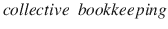
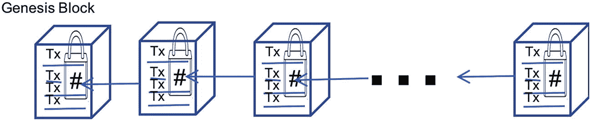
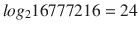
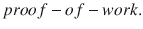

# 8.未来:区块链及其他

[Blockchain Explained](#Sec1) [Blockchain for Big Data Veracity](#Sec2) [Future Directions](#Sec3) [Summary](#Sec4)

按照梵文流行的说法，这个世界的基础或根源在于金钱。当世界只把钱托付给一项技术——既没有政府也没有人民的支持，这项技术应该是完全可信的。区块链是一种技术，它正在彻底改变世界交易的方式，大大提高了准确性。基于区块链技术的加密货币正在各地迅速获得认可。比特币是最受欢迎的加密货币之一，截至 2017 年底，其市值超过 3000 亿美元，与脸书等公司相当。2016 年初，包括比特币在内的所有加密货币的市值约为 70 亿美元。显然，这种快速增长令人震惊地证明了这项技术的前景。鉴于加密货币缺乏政府的支持或后盾，它们所享有的信任几乎完全归功于底层技术——区块链。

在第 6 章“形式方法”中，我们解释了如何将信息的底层表示转换成逻辑来提高它的可验证性和准确性。一方面，这是应用程序使用大数据方式的根本性转变。另一方面，区块链可以实现大数据生成方式的根本转变。当使用区块链技术跟踪产生大数据的来源时，数据的真实性大大增强。区块链提供了一个不可信的网络，参与者彼此不信任，但由于底层技术，他们之间的交易仍然可以完全信任。

假设有一个小世界——一个封闭的世界，任何新信息只有在世界上所有人都同意它是真实的情况下才被认为是真实的。在这个小小的世界里，每个人都知道每一个事实。那就没有谎言的容身之处。区块链试图建立这个完全数字化的理想世界。这个概念类似于我们在第 [6](6.html) 章“形式方法”中看到的 CWA 封闭世界假设我们看到 Prolog 程序如何包含事实和规则的知识库(KB ),任何新的句子都必须与现有的知识库一致，这是通过推理过程验证的。如果新的索赔与知识库中现有的事实不一致或不符合，则不能进入知识库。图 [8-1](#Fig1) 说明了这个概念。封闭世界中的每一个参与者都知道所有的真相，只有在达成共识的情况下，一个主张才是真实的。

Note

区块链是一个完全技术性的解决方案，用来解决一个主要的社会问题——谎言。

然而，区块链不是一种基于逻辑的方法。相反，区块链使用数据库、密码术和 P2P 网络为交易及其产生的大量数据建立一个真实、可信和防篡改的封闭世界。区块链有助于减少公证人等中间人在交易中获得信任或中央权威机构认证其有效性的需要。它还具有许多其他优势，如提高交易效率、增加透明度以及实现支付自动化的潜力。该技术的重要贡献仍然在于通过任何交易周期产生的数据的准确性。交易数据是大数据蜕变的重要组成部分。鉴于大部分大数据分析都是在交易数据上运行的，区块链可以开创一个数据质量不打折扣的时代。

图 8-1

Consensus-based truth in a closed world

区块链的流行归功于它在加密货币中的应用。区块链填补了传统金融系统的许多空白。它消除了集中控制的需要；并减少系统的低效率、成本和漏洞。相当多的区块链概念都是从金融界借来的。财务会计的准确性围绕着分类账的概念。资金流动和资产移动在分类账中被细致地跟踪。分类账中的每一笔分录都是一笔交易。管理交易的规则构成了合同。任何随后的信息都可以对照分类账进行确认或反驳。

分类账构成了真理的基础，就像形式方法中的知识库一样。迄今为止，分类账主要用于记录财务信息。它由银行和其他金融机构等可信机构集中维护。区块链使账本更加无处不在，并极大地扩展了它的范围，特别是物联网(IoT)的交易。我们之前讨论的“封闭世界”的每个参与者都有一份相同的账本。从这个意义上来说，区块链可以被描述为一个分布式账本。分类帐可以被认为是一个没有修改功能的数据库。它对任何被追踪的东西都有可靠的踪迹。

Note

区块链有可能成为不可改变、防篡改、无处不在的大数据账本，从根本上解决准确性问题。

## 区块链解释

图 [8-2](#Fig2) 中描述的简单方案存在问题。我们如何确保封闭世界中的一方恶意地不同意交易，并且不允许达成共识？什么会阻止一个人去改变被所有人遗忘的真相？如果其中一个参与者拒绝接受新数据怎么办？因此，我们需要通过添加更多的需求来收紧设计。其中一些要求可能如下:

*   交易应该在不信任的环境中进行，在这种环境中，没有人信任其他人，但仍然是完全值得信任的。
*   每个参与者的数据必须是不可变的，并且与其他参与者的数据相同，这需要和透明性。
*   如果有疑问的数据是真实的，参与者之间必须有共识。
*   为了广泛应用，数据必须足够通用，而不是特定于任何测量单位。
*   为了扩展使用，参与者不一定是人类。

前面的要求中出现了一些实现要求:

*   每个参与者的信息都必须数字化，使其成为数字账本。
*   这个过程应该尽可能完全自动化，不需要人为因素，这样就不会有主观性。
*   为了确保数据是防篡改的，我们需要使用加密校验和，或者更好的加密哈希函数，下面的方框对此进行了解释。
*   数据必须按时间顺序记录，为了保持时间顺序，数据块必须像链一样链接。
*   必须有复制流程，以确保在参与者之间分发的数字分类账副本是相同的。
*   为了防止黑客攻击和添加欺诈性信息块的轻率尝试，添加信息块的过程必须是重要的。
*   由于我们正在处理大数据，我们需要高效的数据结构来处理信息，以减少带宽、存储和计算资源。

Note

区块链解决方案的新颖性在于将大量已知的解决方案结合起来解决一个重要问题。

Cryptographic Hash Functions

安全哈希算法(SHA)值越来越多地被用作标识对象和确保数据段完整性的签名。流行的版本控制系统 Git 严重依赖 sha 值(读作“SHA”)来存储数据并在以后识别数据。哈希是一种数据结构，它将值映射到它们的标识符，就像标签标识包一样。哈希函数是一种数学函数，它从任意大小的数据中生成固定大小的标识符。一个简单的例子是将全名映射到姓名首字母的函数。全名可以是任意长度，但是哈希函数总是只生成两个字母。

加密散列函数对散列函数施加了更多的约束。最重要的是抗碰撞性能。当哈希函数为两个不同的数据段返回相同的标识符时，我们说存在哈希冲突。例如，在前面的例子中，Vishnu Pendyala 和 Victor Peng 的哈希值发生冲突。加密哈希函数确保冲突极其罕见。例如，使用国家标准和技术研究所(NIST)发布的 SHA-1 函数，碰撞的几率是 2 80 分之一——产生一次碰撞需要很多次强力迭代，因此需要大量的计算能力和巨大的金钱成本。

加密哈希函数的另一个重要属性是，即使对数据进行非常小的更改也会导致哈希值发生巨大变化，以至于前后值之间没有任何相似性或相关性。加密散列函数的这一特性和其他特性使得几乎不可能使用散列值生成原始数据，并且即使原始数据的微小篡改也会使散列值完全不可识别。因此，哈希值充当它所代表的数据的真实且唯一的签名。

很容易看出加密哈希函数如何帮助实现区块链。当数据块通过它们的签名哈希值链接时，在不改变链中所有块的所有签名的情况下，篡改数据是不可能的。

从上面的需求来看，很明显我们需要一个类似链表的数据结构，必须是防篡改的。这种数据结构就是区块链。它是一个数据块链，按时间顺序记录，在时间上密封，使用加密哈希函数。它作为分类账来记录正在进行的交易。数据结构在对等(P2P)网络上共享，没有单点故障。因此，区块链中的数据可以被 P2P 网络上的任何实体审计。该实体可以是自主代理。数据结构可用于跟踪任何值得跟踪的东西，而不仅仅是钱或资产，尽管它在金融应用中的作用更大。区块链也可以被视为加密货币等应用程序运行的操作系统。

区块链构成了所有参与者都有的分布式账本。理解区块链的一个很好的类比是在线垄断的游戏。每个玩家都必须有一份游戏当前状态的副本。所有玩家必须同意棋盘上的每一步棋和每一笔交易。移动和交易是不可改变的——过去是不可改变的。每个远程玩家都有一份棋盘，很像区块链账本。每个动作都可以触发一个规则，一个要执行的智能契约——智能是因为契约的实现是在软件中自动进行的。智能合约功能可以在自治系统的发展中发挥关键作用，自治系统无需任何手动干预即可运行。

Note

有许多方法可以将区块链可视化——作为数据库、操作系统、账本、软件数据结构、棋盘游戏。

图 8-2

Blockchain schematic

虽然区块链用于跟踪任何实体，但让我们称被区块链跟踪的实体为资产。区块链中的资产使用其哈希值进行跟踪，类似于签名，即唯一的 id。块是分类帐中的交易列表，以及前一个块的加密哈希值和一些其他元数据。示意图如图 [8-2](#Fig2) 所示。每个块包含多个事务，在图中标记为 Tx，由保存在下一个块中的加密哈希值密封。是对前一个块的散列值的引用给出了按时间顺序的链接效果。块之间的箭头表示对前一个块的哈希值的引用。

哈希值由块的内容生成，块是交易列表，唯一标识内容，如标题为“加密哈希函数”的框中所述。正如那里指出的，碰撞在 SHA-1 极其罕见，而且到目前为止还没有在 SHA-2 算法集中发现。因此，可以合理安全地假设散列唯一地代表了块中包含的信息。对内容的任何微小改变，例如通过篡改，都将极大地改变散列值。这被称为雪崩效应。第一个块称为 genesis 块，没有存储任何引用，因为没有前面的块。

这种简单的链接确保了块的内容不会被篡改。对任何块中包含的信息的任何篡改都将显著改变其散列值。因为这个哈希值存储在下一个块中，所以下一个块的哈希值也会改变，以此类推。在不改变区块链中每个随后的块的情况下，不可能改变任何块的内容。还必须注意，加密哈希值有另一个称为的属性，这意味着即使我们知道哈希值，也不可能生成它所代表的信息。加密哈希值的所有这些属性使它们非常适合在区块链中使用。

Note

按照设计，区块链随着时间和区块数量的增加变得越来越不可改变。

存储在块中的事务也表示为加密哈希树，称为 Merkle 树。Merkle 树是一种软件数据结构，其中信息记录(在这种情况下是事务)存储为图形的叶节点并相互连接。这是一个看起来像倒置的树的图形，根在顶部，每一层都有分支。它是一个二叉树，任何节点下都有两个子节点，每个节点都由它的两个子节点的哈希值标记。这个加密散列值是对篡改单个交易的进一步保护。

图 [8-3](#Fig3) 展示了一个块中事务的 Merkle 树。交易被分成两个一组。如果事务的数量是奇数，则复制最后一个事务以使数量为偶数。两个节点的每个桶的哈希值存储在父节点中。树自底向上生长，计算每一层的桶的哈希值，直到我们在顶部的单个根中结束。图 [8-3](#Fig3) 只有四个事务，所以三层足以构建 Merkle 树。如果还有两个事务，我们添加另一层节点，包含较低层中存储桶的哈希值。Merkle 树数据结构通过在整个树中跟踪散列值来进一步帮助验证事务的完整性。

Note

密码学是许多安全解决方案的共同主题。

除了哈希值之外，每个块还包含更多的元数据。它包含时间戳，即以 Unix 纪元形式创建块的时间(秒)。由于加密散列值，该时间戳也变得不可变，并且进一步帮助保护时间顺序免受任何篡改。事务的 Merkle 树顶部的 Merkle 根哈希值也存储在元数据中。将 Merkle 根散列存储在元数据中极大地简化了验证过程。这使得轻量级实体也能够在区块链 P2P 网络上。轻量级实体不需要保存整个事务树，整个事务树可能会达到几千兆字节。他们只需要存储 Merkle 根。只有全服务实体存储整个 Merkle 树。

为了验证交易记录在块中，P2P 网络上的轻量级实体只需要元数据，通常每个块 80 字节，包括 Merkle 根散列。它可以查询区块链上的任何全服务节点，以返回事务的 Merkle 路径，该路径包括从事务叶到达根所需的节点。在图 [8-3](#Fig3) 中，为了验证多边形中的事务是否在块中，所需的 Merkle 路径只是两个圈起来的节点——一个与事务相邻，另一个标记为“Bucket 1 #”。如果这两个节点由任何全服务实体给出，则可以验证 Merkle 路径是否确实通向元数据中的根。在这个过程中，轻量级节点需要计算“Bucket 2 #”。

图 8-3

Merkle Tree of Transactions in a block and Merkle Path

当事务数量增加时，Merkle 树非常有用。在图 [8-3](#Fig3) 的例子中，只有四个事务，我们需要两个节点组成 Merkle 路径到达根。一般来说，对于 Merkle 路径，我们需要 ceil(log 2 N)个节点，其中 N 是事务的数量。例如，如果我们有 16777216 个事务，我们只需要节点，这在网络带宽、计算能力和存储空间方面节省了大量资源。

Note

Merkle 树证明了表示所带来的巨大差异，以及为什么形式方法和知识表示是解决真实性问题的关键。

发送垃圾邮件是因为发送垃圾邮件通常没有多少成本。为了避免在区块链中添加积木时出现类似的情况，想要添加积木的参赛者需要在 10 分钟内解决一道数学难题。难题是生成一个小于给定值的哈希值。回到我们的大富翁棋盘游戏的例子，这就像让在线玩家先掷骰子得到一个数字，这个数字小于某个值，然后再进行移动。数字越低，难度越大。如果目标是得到一个小于 12 的数字，那么除了两个骰子都显示 6 以外的所有投掷都是有效的。满足要求可能不超过一分钟。但是如果目标是得到一个小于 3 的数字，可能需要几分钟的骰子尝试才能得到 2。

哈希值对于给定的消息是唯一的。那么，我们如何生成小于给定值的哈希值呢？要生成新的哈希值，它所代表的信息需要改变。块中的信息通过添加一个 nonce 值来改变。Nonce 是一个 4 字节的数字，它将改变计算出的哈希值。由于哈希算法的雪崩效应，nonce 值的微小变化会导致加密哈希值的巨大差异。按照这个词的英文意思，nonce 只使用一次来为加密哈希生成一个新值。如果生成的值满足标准并解决了难题，则随机数被记录在块头中，并且该块被提交以包含在链中。但是，如果 nonce 没有帮助生成符合标准的值，它将被丢弃，并分配一个新值。因此，改变随机数类似于掷骰子来获得新值。

谜题的目标通常是生成一个带有多个前导零的加密哈希值。这是生成的哈希值应该小于给定值的另一种说法。例如，如果目标是在十六进制 32 字节哈希值中生成 60 个前导零，则可以将其转换为一个约束，即生成的哈希值必须小于 0x10000000。前导零的数量越多，生成就越困难。因此，有一个难度系数，它也记录在块的头中。解决难题的节点被称为生成了。解决难题的计算开销很大的过程被称为挖掘。

解决这个难题的反复试验过程以一种相当暴力的方式进行。随机数值简单地随着每次迭代而递增，并且为这个新的随机数计算散列值。一旦哈希值具有所需数量的前导零，迭代就停止。区块链算法确保总是需要 10 分钟来解决这个难题。这个时间取决于计算能力和难度系数。随着计算能力随时间增加，难度系数也需要增加，以保持时间恒定在 10 分钟。对于每个固定数量的块，调整难度系数。

Note

区块链是多种成熟技术的聚合，以确保在完全不信任的环境中可以完全信任的安全交易。

## 区块链促进大数据准确性

区块链最大的贡献是跟踪数据生成的可信方式。区块链技术在物联网和大数据时代尤其有用。这可以通过联网汽车的例子来理解，联网汽车预计每小时会产生数千兆字节的数据。这些数据被发送到云端进行处理。自动驾驶和联网汽车容易受到黑客攻击，因为它们过度依赖数据。但是，当汽车产生的每一点数据都被跟踪并公开接受审计时，黑客入侵的可能性就会大大降低或完全消除。

区块链可以导致大数据源的去中心化控制。由于智能合同功能，来源以自主方式发挥作用的可能性越来越大，从而减少了主观性、人为错误和欺诈的范围。区块链所在的 P2P 网络可以跨越国界，并且由于共识机制，消除了特定国家的偏见和篡改。共识机制确保不正确的块不能进入系统。任何攻击都可能导致拒绝服务，但不能篡改数据块，尤其是后面的数据块，因为篡改意味着在一个数据块被篡改后修改另一个数据块。

## 未来方向

很少有技术能使应用程序彻底改变世界。区块链可能会对涉及价值实体的交易产生影响，就像 TCP/IP 对信息流产生的影响一样。TCP/IP 使互联网成为可能。区块链正在实现信任和准确性。区块链还在进化。随着时间的推移，将会有许多区块链投入使用。物联网的爆炸必然保证区块链的广泛使用。当务之急是为互操作性和实现制定标准。开发需要工具。需要广泛提供 API 和工具来帮助构建区块链。

目前，添加数据块的速度似乎与区块链的预期用途不相称。对于大规模使用，交易处理速度需要大幅提升。对于广泛应用来说，所涉及的成本也是相当可观的。鉴于目前的成本，对于很多可以受益于精确跟踪的事情，使用区块链没有意义。尽管采取了所有的保护和安全措施，区块链仍然容易受到攻击，例如拒绝服务攻击。随着区块链的使用和发展，更多的问题可能会被发现和解决。从长远来看，最大的影响可能是大数据的准确性，而不是其他任何东西。越来越多产生大数据的源将加入区块链，提高它们产生的数据的质量。

Note

区块链是一项关键技术，也是未来重要的商业驱动力。

## 摘要

区块链技术实现了跟踪和审计安全检查的完美结合，极大地提高了大数据的准确性。在这一章中，我们考察了许多表征区块链的技术，并简要研究了区块链如何帮助提高大数据的准确性。时间顺序、信息的不变性、无处不在的元数据以及自动实现规则的智能合约都使区块链成为解决影响大数据准确性问题的有希望的解决方案。

Exercises

1.  如果我们使用区块链技术的唯一目的是确保数据的准确性，我们可以进一步简化它吗？如果我们可以简化，那么它是否可以应用于更多的场景，而不仅仅是交易？
2.  社交媒体是大数据的重要组成部分。评估区块链技术解决社交媒体准确性问题的适用性。