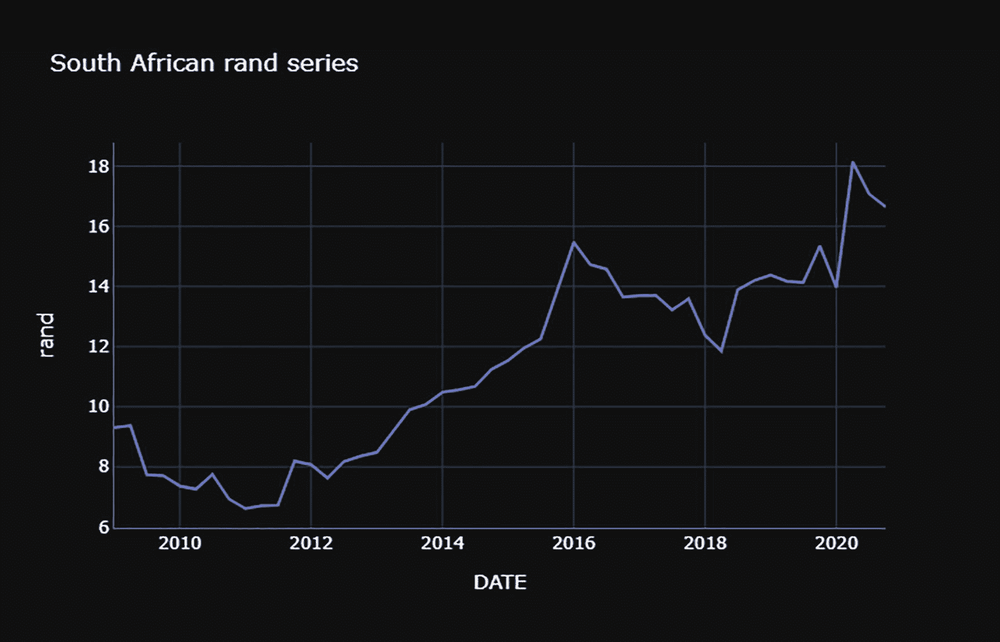
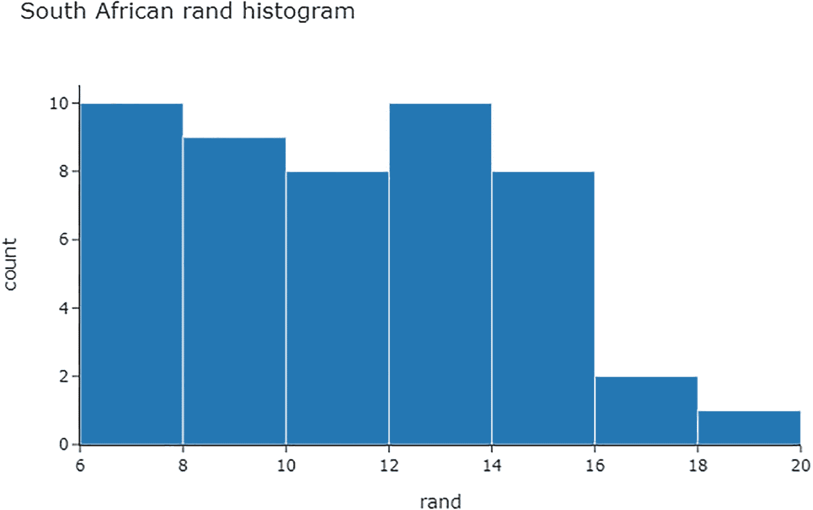
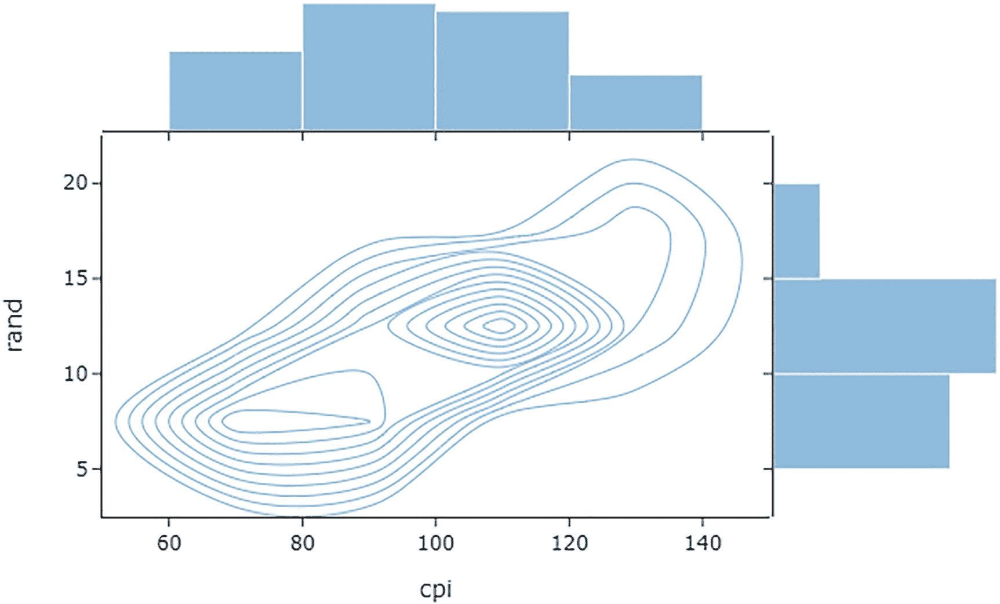
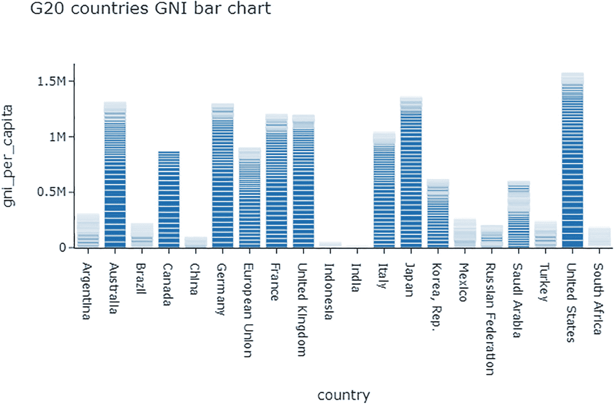
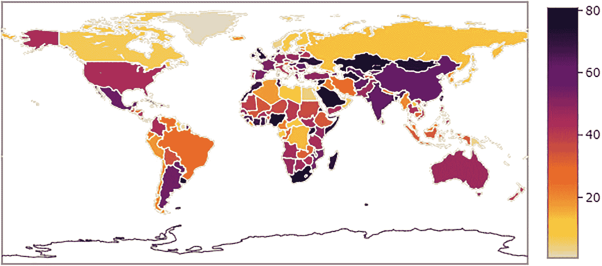

# 2.交互式制表和制图

第 [1](01.html) 章介绍了通过实现 pandas 库将数据制成表格以及通过实现 Matplotlib 库在 2D 和 3D 空间中以图形方式表示数据的基础知识。虽然 Matplotlib 和 seaborn 库对于静态图表很有用，但是对于 web 应用，您需要交互式图表。

本章介绍了一种通过实现 Plotly(最流行的库)将数据制成表格和构建交互式图表(即，盒须图、直方图、散点图、散点图、密度图、热图、小提琴图、旭日图、条形图、饼图和 choropleth 图)的方法。它帮助您创建图表，使电脑能够响应应用用户。

## Plotly

Plotly 是最流行的交互式图表 Python 库。它使您能够在没有 JavaScript 和 CSS 等 web 开发技术的丰富知识和经验的情况下创建交互式图表。除了其他环境之外，您还可以在 R 环境中实现它。在 [`https://plotly.com/python/`](https://plotly.com/python/) 了解更多关于 Plotly 的信息。

这本书实现了 Plotly 交互式制图。首先，确保您的环境中安装了 Plotly 库。要在 Python 环境中安装它，使用`pip install plotly`。同样，要在 conda 环境中安装库，使用`conda install -c plotly`。另外，如果你用的是 Jupyter 笔记本，用`pip install jupyter-dash`安装 JupyterDash。

## 用 Plotly 将数据制成表格

除了构建交互式图表之外，Plotly 还允许您构建表格。清单 [2-1](#PC1) 使用来自`graph_objects`函数的`Table()`方法构造一个表(参见表 [2-1](#Tab1) )。首先，它从`subplots`函数中导入`make_subplots`。然后，它将`graph_objects`作为`go`导入。接下来，它重置数据的索引，并通过指定子情节组成的`rows`和`cols`的数量来构建子情节的结构，包括`vertical_space`和`specs`(即`[{"type": "table"}]`)。之后在字典中指定`header`和`cells`的名称，作为`font`的`size`(见表 [2-1](#Tab1) )。

表 2-1

列入总汇表的数据

<colgroup><col class="tcol1 align-left"> <col class="tcol2 align-left"></colgroup> 
|  |

```py
import plotly.graph_objects as go
from plotly.subplots import make_subplots
df = df.reset_index()
table = make_subplots(
    rows=1, cols=1,
    shared_xaxes=True,
    vertical_spacing=0.03,
    specs=[[{"type": "table"}]]
)
table.add_trace(go.Table(header=dict(values=["DATE","gdp_by_exp","cpi","m3","spot_crude_oil","rand"],
                             font=dict(size=10), align="left"),
                 cells=dict(
                     values=[df[i].tolist() for i in df.columns],
                     align = "left")),
         row=1, col=1)
table.show()

Listing 2-1Tabulating Data

```

## 交互式图表

Matplotlib 适用于 2D 和 3D 静态制图，因此便于原型制作和打印。对于 web 应用，加入交互式图表，使用户能够更好地浏览图表。有许多用于交互式制图的 Python 库(例如 Bokeh、Streamlit 和 Plotly)。

## 2D 制图

Plotly 有两个主要的制图模块:Plotly Express ( `plotly.express`)和`graph_objects`。本章实现了 Plotly Express 的交互式制图。清单 [2-2](#PC2) 进口 Plotly Express。

```py
import plotly.express as px

Listing 2-2Import Plotly Express

```

Plotly Express 包括多个图表(即，线形图、直方图、盒须图、密度图和散点图等)。

要为图表设置通用主题，请执行`io`功能。清单 [2-3](#PC3) 通过实现`io`函数将图表的主题设置为`"simple_white"` `template`(见图 [2-1](#Fig1) )。


图 2-1

用简单的白色模板绘制图形

```py
import plotly.io as pio
pio.templates.default = "simple_white"
figure = px.line(df, x=df.index, y="rand",
                 title="South African rand series")
figure.show()

Listing 2-3Plotly Graph with the Simple White Template

```

清单 [2-4](#PC4) 通过实现`io`函数将图表的主题设置为`"plotly_dark"`模板(参见图 [2-2](#Fig2) )。



图 2-2

使用 Plotly dark 模板绘制 plotly 图形

```py
pio.templates.default = "plotly_dark"
figure = px.line(df, x=df.index, y="rand",
                 title="South African rand series")
figure.show()

Listing 2-4Plotly Graph with the Plotly Dark Template

```

清单 [2-5](#PC5) 通过实现`io`函数将图表的主题设置为`"seaborn"`模板(见图 [2-3](#Fig3) )。


图 2-3

使用 seaborn 模板的 Plotly 图形

```py
pio.templates.default = "seaborn"
figure = px.line(df, x=df.index, y="rand",
                 title="South African rand series")
figure.show()

Listing 2-5Plotly Graph with the Seaborn Template

```

第[章 3](03.html) 遵循前一章的结构。它描述了一种构建盒须图、直方图、散点图、散点图矩阵、密度图、热图、小提琴图、旭日图、条形图、饼图和 choropleth 图的方法。

### 箱形图

清单 [2-6](#PC6) 通过实现`express`函数的`box()`方法构建了一个盒图(也称为*盒和* *须图*)(见图 [2-4](#Fig4) )。


图 2-4

箱形图

```py
figure = px.box(df, y="rand",
                title="South African rand box-whisker plot")
figure.show()

Listing 2-6Box Plot

```

图 [2-4](#Fig4) 略偏左(上尾比下尾长)。

### 小提琴情节

您还可以构建一个 violin 图，它用核密度估计函数捕捉分布。清单 [2-7](#PC7) 通过实现 Plotly 库中`express`函数的`violin()`方法构建了一个小提琴情节(见图 [2-5](#Fig5) )。


图 2-5

小提琴情节

```py
figure = px.violin(df, y="rand", box=True,
                points='all', title="South African rand violin plot")
figure.show()

Listing 2-7Violin Plot

```

图 [2-5](#Fig5) 显示了一个小提琴图，该图没有显示数据中的任何异常。

### 柱状图

清单 [2-8](#PC8) 通过从`express`函数实现`histogram()`方法来构建一个直方图(参见图 [2-6](#Fig6) )。



图 2-6

柱状图

```py
figure = px.histogram(df, x="rand",
                      title="South African rand histogram")
figure.show()

Listing 2-8Histogram

```

图 [2-6](#Fig6) 显示分布稍微向左倾斜。

您也可以在柱状图顶部显示其他图(参见清单 [2-9](#PC9) 和图 [2-7](#Fig7) )。以下示例在直方图的顶部添加一个方框图。


图 2-7

带方框图的直方图

```py
figure = px.histogram(df, x="cpi", y="rand",
                         marginal="box")
figure.show()

Listing 2-9Histogram with a Box Plot

```

图 [2-7](#Fig7) 显示直方图和箱线图信号。南非消费价格指数的分布稍微偏右。

#### 2D 直方图

Plotly 通过实现核密度估计来构造 2D 直方图以在两个轴上展示两个特征。清单 [2-10](#PC10) 通过实现 Plotly 库中`express`函数中的`density_heatmap()`方法来构建一个分布图(见图 [2-8](#Fig8) )。


图 2-8

二维热图

```py
figure = px.density_heatmap(df, x="cpi", y="rand",
                           title="South African consumer price index and rand 2D histogram")
figure.show()

Listing 2-102D Heatmap

```

图 [2-8](#Fig8) 显示高度集中的南非消费者物价指数大约在 80 到 100 之间，而兰特大约在 10 到 12 之间。

#### 分布图

分布图(也称为 *distplot* )结合了许多图(如直方图和核密度估计)。清单 [2-11](#PC11) 通过实现 Plotly 库中`figure_factory`函数中的`create_distplot()`方法来构建 distplot(参见图 [2-9](#Fig9) )。首先，它指定了数据和标签。


图 2-9

分布图

```py
import plotly.figure_factory as ff
data = [df["m3"],df["rand"]]
labels = ["Money Supply", "Rand"]
figure = ff.create_distplot(data, labels)
figure.show()

Listing 2-11Distribution Plot

```

图 [2-9](#Fig9) 展示了两个分布图，其中橙色图代表南非兰特的分布，蓝色图代表南非的货币供应量。

### 散点图

清单 [2-12](#PC12) 通过实现`express`函数的`scatter()`方法构建了一个散点图(参见图 [2-10](#Fig10) )。


图 2-10

散点图

```py
figure = px.scatter(df, x="gdp_by_exp", y="rand",
                    title="South African GDP by expenditure and rand scatter plot")
figure.show()

Listing 2-12Scatter Plot

```

图 [2-10](#Fig10) 显示分散点超过–5，除了一个点靠近–15 GDP 支出标记和 18 兰特标记。

#### 散布矩阵

您可以一次绘制所有数据，而不是单独绘制数据的散点图。通过实现 Plotly 库中`express`函数的`scatter_matrix()`方法，列出 [2-13](#PC13) 图(见图 [2-11](#Fig11) )。


图 2-11

散布矩阵

```py
figure = px.scatter_matrix(df)
figure.show()

Listing 2-13Scatter Matrix

```

图 [2-11](#Fig11) 呈现正线性关系(即南非消费者价格指数和兰特，兰特和 m3)和负线性关系(现货原油和兰特)。

### 密度图

清单 [2-14](#PC14) 通过实现`express`函数中的`scatter()`方法，构建了一个密度图，x 轴为“消费者价格指数”，y 轴为“兰特”(见图 [2-12](#Fig12) )。


图 2-12

密度图

```py
figure = px.density_contour(df, x="cpi", y="rand",
                            title="South African consumer price index and rand density plot")
figure.show()

Listing 2-14Density Plot

```

除了密度图，您还可以通过指定`marginal_x`和`marginal_y`来显示每个特征的统计分布(参见清单 [2-15](#PC15) 和图 [2-13](#Fig13) )。



图 2-13

带直方图的密度图

```py
figure = px.density_contour(df, x="cpi", y="rand",
                         marginal_x="histogram", marginal_y="histogram")
figure.show()

Listing 2-15Density Plot with Histogram

```

图 [2-13](#Fig13) 显示南非消费价格指数接近正态分布。与此同时，兰特的分布向左倾斜。

### 条形图

条形图在 x 轴上突出显示功能，在 y 轴上突出显示计数。这些数据是使用 wbdata 库从世界银行数据库中提取的。使用`pip install wbdata`在 Python 环境中安装 wbdata。

清单 [2-16](#PC16) 通过实现`express`函数的`bar()`方法构建了一个条形图(见图 [2-14](#Fig14) )。



图 2-14

条形图

```py
import wbdata
g20_countries = ["ARG","AUS","BRA","CAN","CHN" ,
                 "FRA","DEU","IND" ,"IDN","ITA",
                 "JPN","MEX","RUS","SAU","ZAF",
                 "KOR","TUR","GBR","USA","EUU"]
economicInd = {"NY.GNP.PCAP.CD":"gni_per_capita"}
indicators = economicInd
gni_per_capita = wbdata.get_dataframe(indicators, country=g20_countries, convert_date=True)
gni_per_capita_data = gni_per_capita["gni_per_capita"]
gni_per_capita_descr = pd.DataFrame(gni_per_capita)
gni_per_capita_descr = gni_per_capita_descr.reset_index()
gni_per_capita_dfu = gni_per_capita_data.unstack(level=0)
figure = px.bar(gni_per_capita_descr, x="country", y="gni_per_capita",
                title= "G20 countries GNI bar chart")
figure.show()

Listing 2-16Bar Chart

```

图 [2-14](#Fig14) 显示，美国以超过 150 万美元的人均国民总收入(GNI)在世界上占比最多，其次是日本、澳大利亚、德国、法国、英国和意大利，均超过 100 万美元。其余国家低于 100 万美元大关。

### 圆形分格统计图表

饼图显示每个类别的百分比计数。清单 [2-17](#PC17) 通过实现`express`函数的`pie()`方法构建了一个饼图(见图 [2-15](#Fig15) )。


图 2-15

圆形分格统计图表

```py
figure = px.pie(gni_per_capita_descr, values="gni_per_capita", names="country",
               title= "G20 countries GNI pie chart")
figure.show()

Listing 2-17Pie Chart

```

图 [2-15](#Fig15) 显示美国占世界人均 GNI 的 11.5%，其次是日本 9.99%，然后是澳大利亚 9.63%，以此类推。

### 旭日

当有几个特征时，旭日是方便的，因为它简化了它们。清单 [2-18](#PC18) 通过从`express`函数中实现`sunburst()`方法来构造一个旭日。随后指定路径为“`parent`”、`labels`”、`hover_data`为`"values"`、`color_continuous_scale`为`RdBu`(见图 [2-16](#Fig16) )。使用`world-bank-data`库从世界银行数据库中提取数据。您可以使用`pip install world-bank-data`在 Python 环境中安装它。


图 2-16

旭日

```py
import world_bank_data as wb
countries_set = wb.get_countries()
gni_per_capita_int = pd.DataFrame(wb.get_series("NY.GNP.PCAP.CD", mrv=1))
gni_per_capita_int.columns = ["gni_per_capita"]
gni_per_capita_int = gni_per_capita_int.reset_index()
countries_set = wb.get_countries()
gni_per_capita = wb.get_series('AG.LND.AGRI.ZS', id_or_value='id', simplify_index=True, mrv=1)
gni_per_capita_df = countries_set[['region', 'name']].rename(columns={'name': 'country'}).loc[
    countries_set.region != 'Aggregates']
gni_per_capita_df['gni_per_capita'] = gni_per_capita
columns = ['parents', 'labels', 'values']
level1 = gni_per_capita_df.copy()
level1.columns = columns
level1['text'] = level1['values'].apply(lambda pop: '{:,.0f}'.format(pop))
level2 = gni_per_capita_df.groupby('region').gni_per_capita.sum().reset_index()[['region', 'region', 'gni_per_capita']]
level2.columns = columns
level2['parents'] = 'World'
level2['text'] = level2['values'].apply(lambda pop: '{:,.0f}'.format(pop))
level2['values'] = 0
level3 = pd.DataFrame({'parents': [''], 'labels': ['World'],
                       'values': [0.0], 'text': ['{:,.0f}'.format(gni_per_capita.loc['WLD'])]})
sunburst_gni_per_capita_all_levels = pd.concat([level1, level2, level3], axis=0).reset_index(drop=True)
gni_per_capita_sunburst = px.sunburst(sunburst_gni_per_capita_all_levels, path=['parents', 'labels'], values='values',
                                     color='text', hover_data=['values'],
                                     color_continuous_scale='RdBu')
gni_per_capita_sunburst.update_layout(margin=dict(t=10, l=10, r=10, b=10))
gni_per_capita_sunburst.show()

Listing 2-18Sunburst

```

## 等值区域图

如果您要处理来自不同国家或地区的大量数据，您需要使用 choropleth 地图。choropleth 地图呈现了跨越不同地理边界的数据分布。本节介绍几个国家的国民总收入分布情况。

清单 [2-19](#PC19) 构建了一个 choropleth 图(见图 [2-17](#Fig17) )。首先，它将`world_bank_data`库作为`wb`导入，然后获取世界银行数据库中所有国家的列表。随后，它从`world_bank_data`库中实现`get_series()`方法来获取每个国家的序列。接下来，它指定国家名称和地区。之后，它执行一个字典来指定绘图图形的设置(`colorscale`、`reversescale`、`locations`和`locationmode`等等)。



图 2-17

等值区域图

```py
gni_per_capita_chro_data = dict(type = 'choropleth',
                               colorscale = 'Inferno',
                               reversescale = True,
                               locations = gni_per_capita_df['country'],
                               locationmode = "country names",
                               z = gni_per_capita_df['gni_per_capita'],
                               text = gni_per_capita_df['country'],
                               marker = dict(line = dict(color = 'rgb(255,255,255)',width = 1)),
                               colorbar = {'title' : ''})
gni_per_capita_map = go.Figure(data=[gni_per_capita_chro_data])
gni_per_capita_map.show()

Listing 2-19Choropleth Map

```

### Heatmap(热图)

热图可用于显示特定范围内的数据强度。清单 [2-20](#PC20) 通过实现 Plotly 中`express`函数的`imshow()`方法来对比热图(见图 [2-18](#Fig18) )。


图 2-18

Heatmap(热图)

```py
figure = figure = px.imshow(df,color_continuous_scale=px.colors.sequential.Inferno,
                  title="South African economic data heatmap")
figure.show()

Listing 2-20Heatmap

```

## 三维图表

或者，您可以用图形表示 3D 空间中的数据。清单 [2-21](#PC21) 构建了一个 3D 散点图，通过从`express`函数中实现`scatter_3d()`方法来展示“gdp_by_exp”、“消费者价格指数”和“rand”之间的关系(见图 [2-19](#Fig19) )。


图 2-19

散点图

```py
figure = px.scatter_3d(df, x="gdp_by_exp", y="cpi", z="rand",
                       color="rand",
                       title="South African GDP by expenditure, consumer price index and rand 3D scatter plot")
figure.show()

Listing 2-213D Scatter Plot

```

## 指示器

除了目前显示的图表，指标用于简化数据的变化。指标使您能够衡量数据中的变化。清单 [2-22](#PC22) 通过实现 Plotly 库中`graph_objects`函数的`Indicator()`方法来创建一个指示器(参见图 [2-20](#Fig20) )。首先，它通过实现 pandas 的`min()`方法找到“rand”特性的最小值，通过实现`tail()`方法和`iat[]`找到当前值。然后，它指定增量的值和参考。


图 2-20

指示器

```py
mininum_rand = df["rand"].min()
current_rand = pd.DataFrame(df["rand"].tail(2))
current_rand = df["rand"].tail(2).iat[-2]
fig_indicator = go.Figure()
fig_indicator.add_trace(go.Indicator(
    mode = "number+delta",
    value = current_rand,
    title = {"text": "South African rand<br><span style='font-size:0.8em;color:gray'>"},
    delta = {'reference': mininum_rand, 'relative': True},
    domain = {'x': [0, 1], 'y': [0.5, 1]}))
fig_indicator.show()

Listing 2-22Indicator

```

## 结论

本章向您介绍了如何通过实现 plotly(最流行的 Python 库)来构建交互式 2D 和 3D 图表。它展示了基本图表(即盒须图、直方图、散点图、散点图矩阵、密度图、热图、小提琴图、旭日图、条形图、饼图和 choropleth 图)。

第 [3](03.html) 章向您介绍使用`express`或`graph_objects`功能创建的交互式功能。