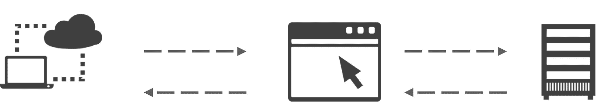
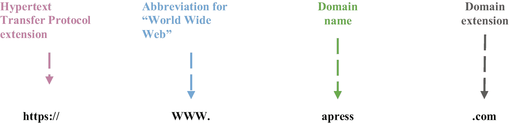
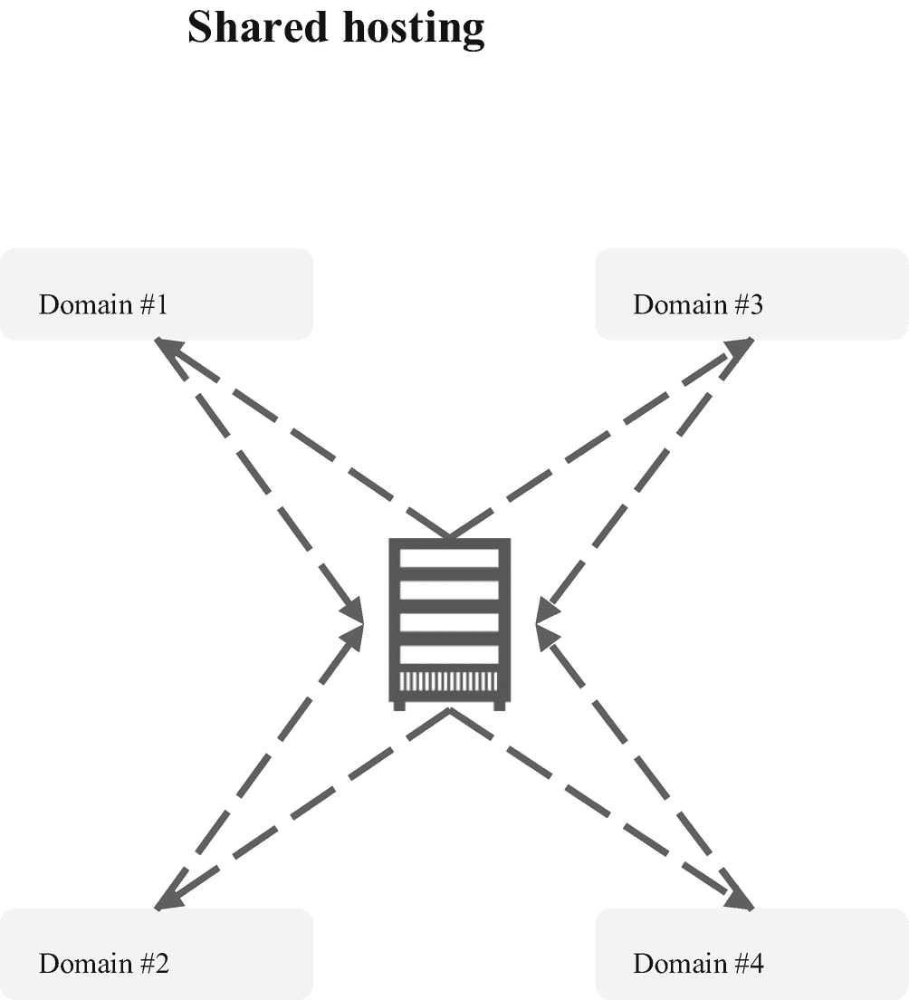
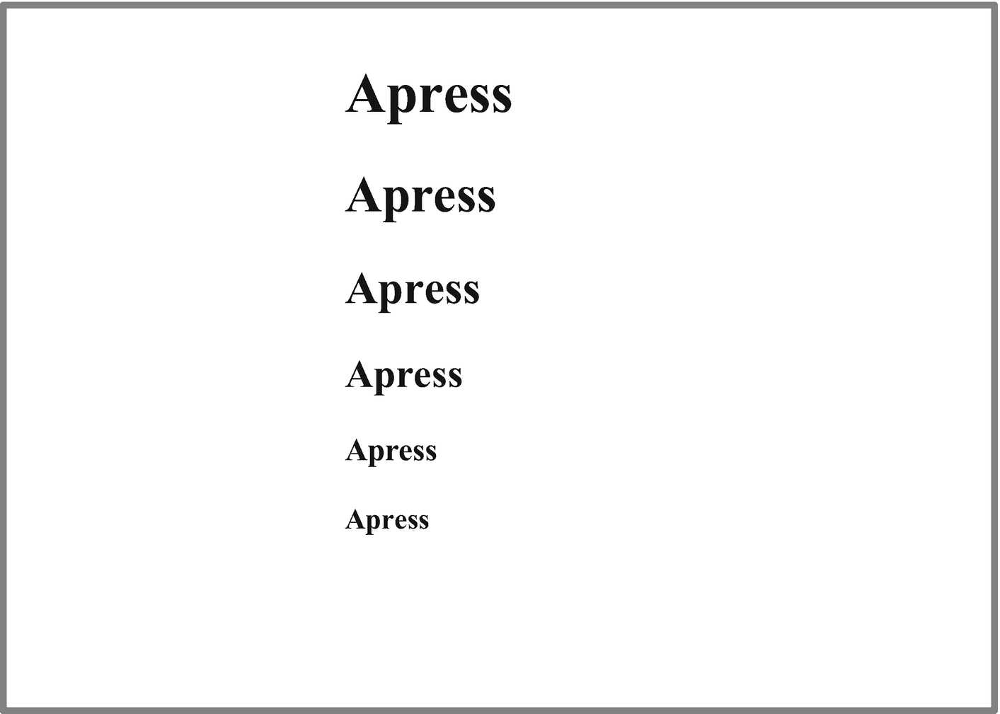
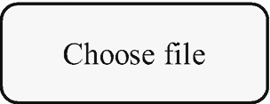
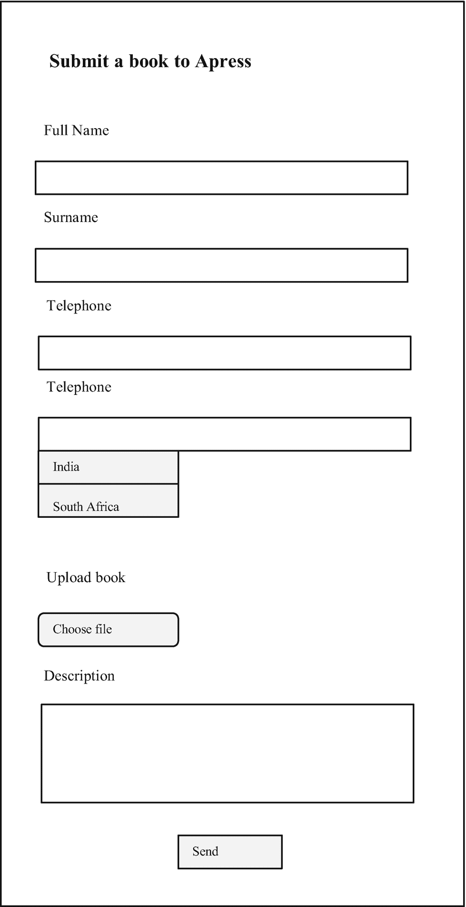
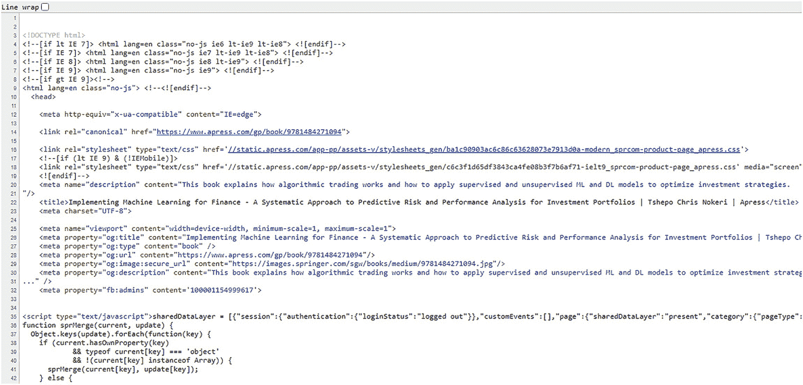

# 四、HTML 的本质

本章介绍了开发网站最广泛使用的标记语言，并让你了解设计网站的要点。本章中的例子将帮助你开始学习 HTML。

## 网络浏览器和网络服务器之间的通信

具有互联网连接的网络用户可以通过网络浏览器访问网站的内容，网络浏览器通过建立到网络服务器上特定端口的传输控制协议(TCP)来启动超文本传输协议(HTTP)会话。随后，web 服务器用浏览器呈现的网页内容来响应该请求。图 [4-1](#Fig1) 说明了网络浏览器和网络服务器之间的基本通信。



图 4-1

网站的基本结构

## URL 结构

每个网站都有自己的域名(这是附加到某个互联网协议(IP)地址的唯一名称)，以将其与其他网页区分开来(即，网页)。而且，每个网站都有自己的域名扩展名(即。com)(见图 [4-2](#Fig2) )。



图 4-2

URL 结构

HTTPS 的`S`代表*安全*。它表示该域由安全套接字层/传输层安全性(SSL/TLS)通配符证书组成，该证书保护该域及其子域的安全。SSL/TLS 通配符证书的主要发行者是 DigiCert ( [`www.websecurity.digicert.com/security-topics/what-is-ssl-tls-https`](http://www.websecurity.digicert.com/security-topics/what-is-ssl-tls-https) )。

## 域名托管

部署网站最流行的方式是从第三方公司外包服务。这些公司管理 web 服务，使开发人员能够使用 URL 在互联网上部署网站。平台提供两种服务:共享虚拟主机和托管虚拟主机。下一节从背景和角度区分了共享和托管虚拟主机。

### 共享虚拟主机

共享虚拟主机包括与其他域共享 web 服务器资源和服务。例如，假设六个域共享一个具有 6gb 存储空间和 6 RAM(随机存取存储器)的 web 服务器，每个域分配有 1 GB 存储空间和 1 GB RAM。图 [4-3](#Fig3) 简化共享虚拟主机。



图 4-3

共享虚拟主机

图 [4-3](#Fig3) 显示了在共享 web 托管中，一个域与其他域共享 web 服务器资源。

### 托管虚拟主机

或者，您可以选择托管 web 主机，这样一个域就可以完全访问 web 服务器资源和服务。使用前面的示例，这需要一个域具有完整的 6 GB 存储空间和 6 GB RAM。开发人员也可以自己管理资源和服务。图 [4-4](#Fig4) 简化共享虚拟主机。


图 4-4

托管虚拟主机

图 [4-4](#Fig4) 展示了托管 web 主机为特定域保留 web 服务器资源和服务。

### 网络服务器

web 服务器是一种应用，使开发人员能够通过 URL 部署网站。它通过端口Bootstrap连接来响应 web 浏览器在互联网上发出的请求。两种最流行的 web 服务器是 Windows Server 和 Linux servers。这些服务器存储和管理 HTML 文档和支持文件。

现在你有了一些背景和视角，让我们来探讨一下本章的核心，也就是 HTML 的要义。

## 超文本标记语言

超文本标记语言(HTML)是编写网页最流行的语言。您可以应用其他语言和框架来获得最佳结果。

### HTML 元素

清单 4-1 展示了一个 HTML 文件的基本结构。`<!DOCTYPE html>`指定它是一个 HTML 文件。所有的 HTML 代码都以`<html>`开始，以`</html>`结束。

```py
<!DOCTYPE html>
<html>
<title> Apress About Us <title>
<body> </body>
</html>

Listing 4-1Basic HTML

```

所有元素都以开始标记(`<>`)开始，以结束标记(`</>`)结束。图 [4-5](#Fig5) 展示了这些 HTML 元素和标签的用法。


图 4-5

HTML 元素

图 [4-5](#Fig5) 显示 HTML 元素以开始标签开始，`<body>,`指定正文内容，并通过规定结束标签`</body>`结束。

#### 标题

标题有不同的大小。清单 [4-2](#PC2) 构造标题(见图 [4-6](#Fig6) )。



图 4-6

HTML 标题

```py
<!DOCTYPE html>
<html>
<h1>Apress</h1>
<h2>Apress</h2>
<h3>Apress</h3>
<h4>Apress</h4>
<h5>Apress</h5>
<h6>Apress</h6>
</html>

Listing 4-2HTML Headings

```

#### 段落

你可以在正文中写段落。清单 [4-3](#PC3) 构造标题(见图 [4-7](#Fig7) )。


图 4-7

HTML 标题和段落

```py
<!DOCTYPE html>
<html>
<body>
<h1>Submit a book to Apress</h1>
<p>Becoming an Apress Author. Apress is looking for authors with both technical expertise and the ability to clearly explain complicated technical concepts. We want authors who are passionate, innovative, and original. </p>
</body>
</html>

Listing 4-3HTML Headings and Paragraphs

```

#### 差异

`div`使用户能够创建用于造型的部分。清单 [4-4](#PC4) 构造`div`。注意它应用`<style> </ style>`来设置一个带有`5px outset gray`的 div，一个`background-color`是白色的，`text-align`是`center`(见图 [4-8](#Fig8) )。


图 4-8

HTML div 格式

```py
<!DOCTYPE html>
<html>
<head>
<style>
.div_1{
  border: 5px outset gray;
  background-color: white;
  text-align: center;
}
</style>
</head>
<body>

<div class="div_1">
  <h2>Real-Time Dashboards and Web Apps with Python</h2>
  <p>A book brought to you by Apress</p>
</div>
</body>
</html>

Listing 4-4Div

```

#### 跨度

span 是一个内嵌元素，其功能与 div 相同(参见清单 [4-4](#PC4) )。清单 [4-5](#PC5) 构造一个跨度。

```py
<!DOCTYPE html>
<html>
<span> </span>
</html>

Listing 4-5Div

```

#### 小跟班

按钮使用户能够点击并执行某些操作。清单 [4-6](#PC6) 构造一个按钮(见图 [4-9](#Fig9) )。


图 4-9

HTML 按钮

```py
<!DOCTYPE html>
<html>
<button type="button">Send</button>
</html>

Listing 4-6HTML Button

```

#### 文本框

文本框区域使用户能够插入文本。清单 [4-7](#PC7) 构造一个文本区域输入(见图 [4-10](#Fig10)


图 4-10

html 文本区域

```py
<!DOCTYPE html>
<html>
<label for="Description">Description:</label>
<br>
<textarea id="textbox" name="textbox" rows="5" cols="60">
</textarea>
</html>

Listing 4-7HTML Text Area

```

#### 投入

最多，您希望用户输入一些数据，比如文本或数字数据。清单 [4-8](#PC8) 构造一个数字输入(见图 [4-11](#Fig11) )。`min`指定最小数字输入，`max`指定最大数字输入。


图 4-11

HTML 数字输入

```py
<!DOCTYPE html>
<html>
<label for="Telephone">Telephone:</label>
<br>
<input type="number" type="number" min="1" max="20" >
</html>

Listing 4-8HTML Numeric Input

```

清单 [4-9](#PC9) 构造一个数字输入(参见图 [4-12](#Fig12) )。


图 4-12

HTML 数字输入

```py
<!DOCTYPE html>
<html>
<label for="FullName">Full Name:</label>
<br>
<input type="text" id="fullname" name=" fullname ">
</html>

Listing 4-9HTML Single Line Text Input

```

#### 文件上传

您可能希望用户上传文件。清单 [4-10](#PC10) 构造一个文件上传输入(见图 [4-13](#Fig13) )。



图 4-13

HTML 文件上传

```py
<!DOCTYPE html>
<html>
<head>
<body>
<p> "Choose File" </p>
<form>
<input type="file" id="fileupload" name="fileupload">
</form>
</body>
</html>

Listing 4-10HTML File Upload

```

#### 标签

标签命名一个元素。清单 [4-11](#PC11) 构造了一个标签。

```py
</label>Full name</label>

Listing 4-11HTML Label

```

#### 形式

表单包含一组元素，并允许您控制一组元素。清单 [4-12](#PC12) 构造一个表单(见图 [4-14](#Fig14) )。


图 4-14

HTML 文件上传

```py
<!DOCTYPE html>
<html>
<head>
<body>
<p> "Choose File" </p>
<form>
<input type="file" id="fileupload" name="fileupload">
</form>
</body>
</html>

Listing 4-12Form

```

## 当标记

元标记涉及提供与网站相关的元数据(基本信息)(即，字符集、关键字、网页大小和缩放比例等)。清单 [4-13](#PC13) 构造了一个元标签。

```py
<head>
  <meta charset="UTF-8">
  <meta name="description" content="Apress">
  <meta name="keywords" content="Programming, Technical, Machine Learning">
  <meta name="author" content="Apress Inc.">
  <meta name="viewport" content="width=device-width, initial-scale=1.0">
</head>

Listing 4-13HTML Meta Tag

```

## 实际例子

为了更好地理解，清单 [4-14](#PC14) 给出了一个表单，要求用户输入他们的基本信息(即全名、姓氏、电话、上传文件、输入评论)并提交(见图 [4-15](#Fig15) )。



图 4-15

HTML 表单示例

```py
<!DOCTYPE html>
<html>
<head>
  <meta charset="UTF-8">
  <meta name="description" content="Apress">
  <meta name="keywords" content="Programming, Technical, Machine Learning">
  <meta name="author" content="Apre">
  <meta name="viewport" content="width=device-width, initial-scale=1.0">
</head>
<form>
<h1>Submit a book to Apress</h1>
<label for="FullName">Full Name:</label>
<br>
<input type="text" name="FullName">
<br>
<label for=" Surname">Surname:</label>
<br>
<input type="text" name="Surname">
<br>
<label for="Telephone">Telephone:</label>
<br>
<input type="number" type="number" min="1" max="20" >
<br>
<label for="country">Country:</label>
<br>
<select name="country" id="country"
<option value="India">India</option>
<option value="SouthAfrica">South Africa</option>
</select>
<br>
<label for="fileselect">Upload Book</label>
<br>
        <input type="file" name="upload" id="fileselect">
<br>
<label for="Description">Message:</label>
<br>
<textarea rows="5" cols="50" name="Message" id="Description"></textarea>
<br>
<input type="submit" value="Submit">
</form>
</html>

Listing 4-14HTML Form Example

```

## 查看网页源代码

您可以通过在网页 URL 前指定`view-source:`来查看任何网页的源代码；例如，参见 [`www.apress.com/gp/book/9781484271094`](http://www.apress.com/gp/book/9781484271094) 处的`view-source:`(参见图 [4-16](#Fig16) 中的输出)。这有助于您理解 HTML 代码的基本结构，包括为构建网页而实现的 web 技术。



图 4-16

查看源代码

## 结论

本章介绍了 web 开发的基础知识。它通过代码示例展示了关键的 HTML 元素。第 5 章介绍了对 web 开发有用的关键 Python 库。