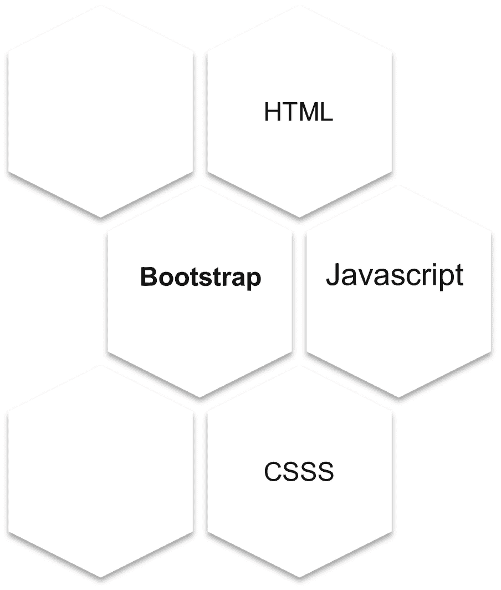
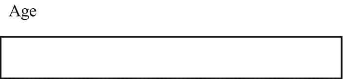
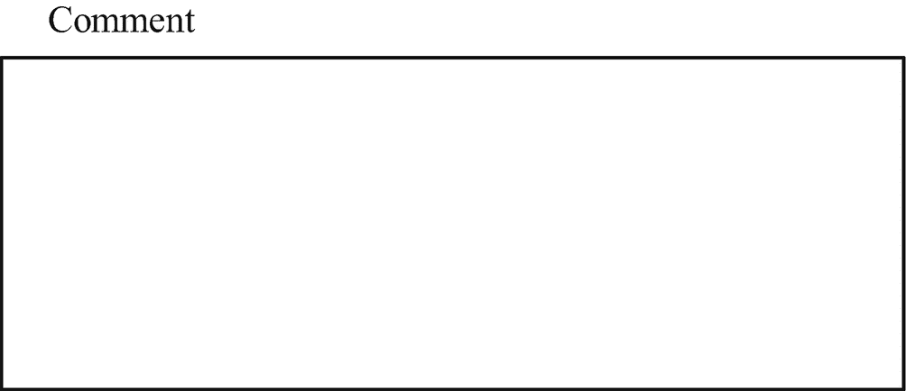
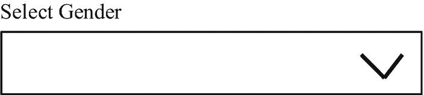
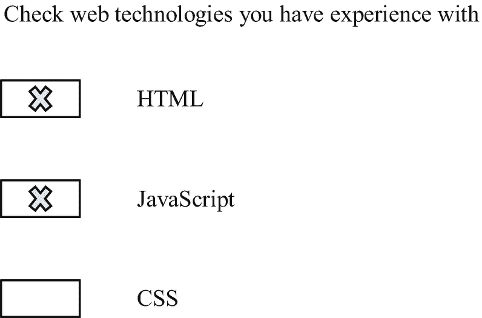

# 6.仪表板引导组件

本章介绍 Dash Bootstrap 组件，这是一个来自 Plotly 系列的 Python 库，可在 Dash web 应用程序上实现关键的引导功能，从而简化 web 应用程序开发。Bootstrap 借鉴了 HTML、CSS 和 JavaScript。图 [6-1](#Fig1) 说明了 Bootstrap 的构建模块，因此`dash_bootstrap_components`。



图 6-1

引导程序

阅读完本章内容后，你应该能够实现关键的`dash_bootstrap_components`方法。

仪表板自举组件。使用`pip install dash-bootstrap-components.`将其安装在 Python 环境中。同样，使用`conda install -c conda-forge dash-bootstrap-components`将其安装在 conda 环境中。

```py
import dash
import dash_html_components as html
import dash_bootstrap_components as dbc
import dash_core_components as dcc

Listing 6-1Dash Bootstrap Components

```

## 数字输入

清单 [6-2](#PC2) 通过实现`dash_core_components`库中的`Input()`方法来构造一个数字输入(参见图 [6-2](#Fig2) )。



图 6-2

数字输入

```py
app = JupyterDash(external_stylesheets=[dbc.themes.BOOTSTRAP])
number_input = html.Div(
    [
        html.P("Age"),
        dbc.Input(type="number", min=0, max=65, step=1),
    ],
    id="styled-numeric-input",
)
app.layout = html.Div([dcc.Location(id="url"), number_input])
app.run_server(mode = "external",
               dev_tools_ui = False,
               dev_tools_props_check = False)

Listing 6-2Number Input

```

## 文本区域

清单 [6-3](#PC3) 通过实现`dash_core_components`库中的`Textarea()`方法来构造一个文本区域(参见图 [6-3](#Fig3) )。



图 6-3

文本区域

```py
app = JupyterDash(external_stylesheets=[dbc.themes.BOOTSTRAP])
textareas = html.Div(
    [
        dbc.Label("Comment"),
        html.Br(),
        dbc.Textarea(
            bs_size="lg",
            placeholder="Enter comment"
        ),
    ]
)

app.layout = html.Div([dcc.Location(id="url"), textareas])
app.run_server(mode = "external",
               dev_tools_ui = False,
               dev_tools_props_check = False)

Listing 6-3Text Area

```

## 挑选

清单 [6-4](#PC4) 通过实现`dash_bootstrap_components`库中的`Select()`方法来构造选择(参见图 [6-4](#Fig4) )。



图 6-4

挑选

```py
app = JupyterDash(external_stylesheets=[dbc.themes.BOOTSTRAP])
select = html.Div([
    dbc.Label("Select Gender")
    dbc.Select(
    id="select",
    options=[
        {"label": "Male", "value": "1"},
        {"label": "Female", "value": "2"}
    ],
)
])
app.layout = html.Div([dcc.Location(id="url"), select])
app.run_server(mode = "external",
               dev_tools_ui = False,
               dev_tools_props_check = False)

Listing 6-4Select

```

## 单选项目

清单 [6-5](#PC5) 通过实现`dash_bootstrap_components`库中的`RadioItems()`方法来构造单选项(参见图 [6-5](#Fig5) )。


图 6-5

单选项目

```py
app = JupyterDash(external_stylesheets=[dbc.themes.BOOTSTRAP])
radioitems = dbc.FormGroup(
    [
        dbc.Label("Choose preferred programming language"),
        dbc.RadioItems(
            options=[
                {"label": "Python", "value": 1},
                {"label": "R", "value": 2},
            ],
            value=1,
            id="radioitems-input",
        ),
    ]
)
app.layout = html.Div([dcc.Location(id="url"), radioitems])
app.run_server(mode = "external",
               dev_tools_ui = False,
               dev_tools_props_check = False)

Listing 6-5Radio Items

```

## 清单

清单 [6-6](#PC6) 通过实现`dash_bootstrap_components`库中的`Checklist()`方法来构建一个检查表(参见图 [6-6](#Fig6) )。



图 6-6

清单

```py
app = JupyterDash(external_stylesheets=[dbc.themes.BOOTSTRAP])
checklist = dbc.FormGroup(
    [
        dbc.Label("Check web technologies you have experience with"),
        dbc.Checklist(
            options=[
                {"label": "HTML", "value": 1},
                {"label": "JavaScript", "value": 2},
                {"label": "CSS", "value": 3}
            ],
            value=[1],
            id="checklist-input",
        ),
    ]
)
app.layout = html.Div([dcc.Location(id="url"), checklist])
app.run_server(mode = "external",
               dev_tools_ui = False,
               dev_tools_props_check = False)

Listing 6-6Checklist

```

## 开关

清单 [6-7](#PC7) 通过实现`dash_bootstrap_components`库中的`Checklist()`方法来构造开关(参见图 [6-7](#Fig7) )。


图 6-7

开关

```py
app = JupyterDash(external_stylesheets=[dbc.themes.BOOTSTRAP])
switches = dbc.FormGroup(
    [
        dbc.Label("Do you enjoy reading programming books? (No/Yes)?"),
        dbc.Checklist(
            options=[
                {"label": "Yes", "value": 1},
            ],
            value=[1],
            id="switches-input",
            switch=True,
        ),
    ]
)

app.layout = html.Div([dcc.Location(id="url"), switches])
app.run_server(mode = "external",
               dev_tools_ui = False,
               dev_tools_props_check = False)

Listing 6-7Switches

```

## 制表符

清单 [6-8](#PC8) 通过实现`dash_bootstrap_components`库中的`Tab()`方法来构造标签(参见图 [6-8](#Fig8) )。


图 6-8

开关

```py
app = JupyterDash(external_stylesheets=[dbc.themes.BOOTSTRAP])
tab1_content = html.P("Tab 1 content")
tab2_content = html.P("Tab 2 content")
tabs = dbc.Tabs(
    [
        dbc.Tab(tab1_content, label="Tab 1"),
        dbc.Tab(tab2_content, label="Tab 2")
    ]
)
app.layout = html.Div([dcc.Location(id="url"), tabs])
app.run_server(mode = "external",
               dev_tools_ui = False,
               dev_tools_props_check = False)

Listing 6-8Tabs

```

## 纽扣

清单 [6-9](#PC9) 通过实现`dash_bootstrap_components`库中的`Button()`方法来构造一个按钮(见图 [6-9](#Fig9) )。


图 6-9

开关

```py
app = JupyterDash(external_stylesheets=[dbc.themes.BOOTSTRAP])
callback_button = html.Div(
    [
        dbc.Button("Submit",
                   id = "submit-button",
                   className = "mr-2",
                   n_clicks = 0,
                   color = "light"
        )
    ]
)

app.layout = html.Div([dcc.Location(id="url"), callback_button])
app.run_server(mode = "external",
               dev_tools_ui = False,
               dev_tools_props_check = False)

Listing 6-9Button

```

## 桌子

应用`dash_bootstrap_components`和`dash_html_components`从头开始创建一个 HTML 表格。清单 [6-10](#PC10) 创建一个 HTML 表格。`Tr`代表一行，`Th`代表一列，`Td`代表一个单元格中的输入(见表 [6-1](#Tab1) )。

表 6-1

HTML 表格

<colgroup><col class="tcol1 align-left"> <col class="tcol2 align-left"></colgroup> 
| 

国家

 | 

国民总收入(gross national income)

 |
| --- | --- |
| 哈萨克斯坦共和国 | Eight thousand six hundred and eighty |
| 肯尼亚 | One thousand seven hundred and sixty |
| 吉尔吉斯共和国 | One thousand one hundred and sixty |
| 柬埔寨 | One thousand four hundred and ninety |

```py
app = JupyterDash(external_stylesheets=[dbc.themes.BOOTSTRAP])
table_header = [
    html.Thead(html.Tr([html.Th("Country"), html.Th("GNI")]))]
row1 = html.Tr([html.Td("Kazakhstan"), html.Td("8680")])
row2 = html.Tr([html.Td("Kenya"), html.Td("1760")])
row3 = html.Tr([html.Td("Kyrgyz Republic"), html.Td("1160")])
row4 = html.Tr([html.Td("Cambodia"), html.Td("1490")])
table_body = [html.Tbody([row1, row2, row3, row4])]
table = dbc.Table(table_header + table_body, bordered=True, hover=True, responsive=True,striped=True)
app.layout = html.Div([dcc.Location(id="url"), table])
app.run_server(mode = "external",
               dev_tools_ui = False,
               dev_tools_props_check = False)

Listing 6-10Constructing an HTML Table

```

或者，通过实现`dash_bootstrap_components`库中的`from_dataframe`方法，将熊猫数据帧转换成 HTML 表格组件(参见清单 [6-11](#PC11) 和表格 [6-2](#Tab2) )。

表 6-2

数据帧

<colgroup><col class="tcol1 align-left"> <col class="tcol2 align-left"> <col class="tcol3 align-left"> <col class="tcol4 align-left"> <col class="tcol5 align-left"> <col class="tcol6 align-left"></colgroup> 
|   | 

国内生产总值指数

 | 

居民消费价格指数

 | 

m3

 | 

现货原油

 | 

边缘

 |
| --- | --- | --- | --- | --- | --- |
| **日期** |   |   |   |   |   |
| 2009 年 1 月 1 日 | -1.718249 | 71.178127 | 13.831098 | Forty-one point seven four | 9.3000 |
| 2009 年 4 月 1 日 | -2.801610 | 73.249160 | 9.774203 | Forty-nine point seven nine | 9.3705 |
| 2009 年 7 月 1 日 | -2.963243 | 74.448179 | 5.931918 | Sixty-four point zero nine | 7.7356 |
| 2009 年 10 月 1 日 | -2.881582 | 74.884186 | 3.194678 | Seventy-five point eight two | 7.7040 |
| 2010-01-01 | 0.286515 | 75.320193 | 0.961220 | Seventy-eight point two two | 7.3613 |

```py
import pandas as pd
app = JupyterDash(external_stylesheets=[dbc.themes.BOOTSTRAP])
df = pd.read_csv(r"filepath\data.csv")
table = dbc.Table.from_dataframe(df, striped=True, bordered=True, hover=True)
app.layout = html.Div([dcc.Location(id="url"), table])
app.run_server(mode = "external",
               dev_tools_ui = False,
               dev_tools_props_check = False)

Listing 6-11Constructing an HTML Table

```

## 结论

本章讲述了对构建功能性 web 应用程序有用的关键 Dash 引导组件。您还可以在应用程序中包含其他组件。更多信息请访问 Dash Bootstrap Components 官方网站( [`https://dash-bootstrap-components.opensource.faculty.ai/`](https://dash-bootstrap-components.opensource.faculty.ai/) )。第 7 章介绍了实现风格和主题来统一设置组件的外观和感觉。