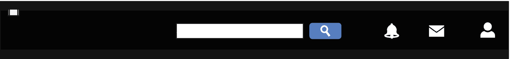
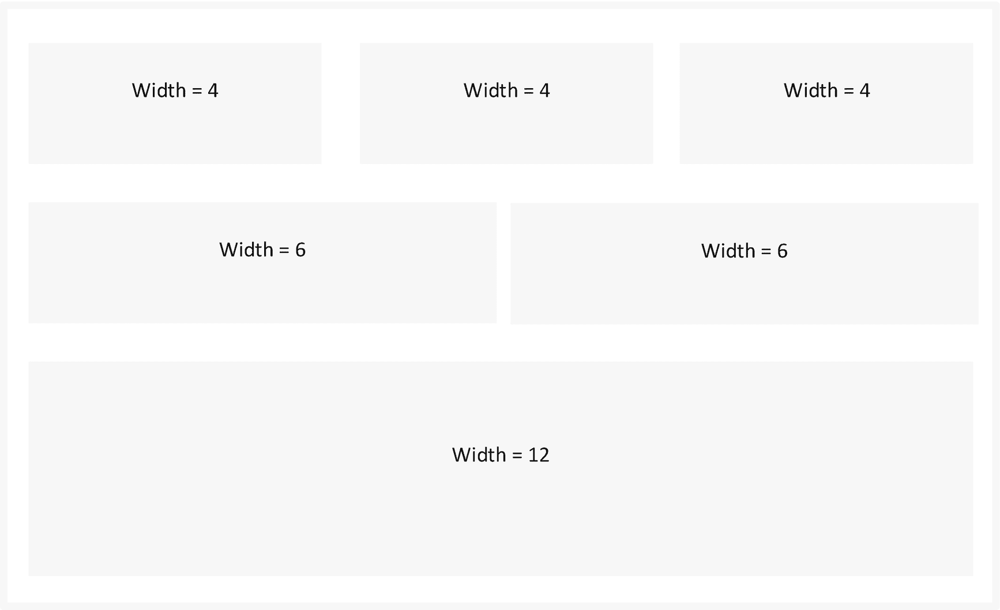

# 7.Web 应用的样式和主题

本章介绍了 web 应用样式和主题的基础知识。首先，它介绍了 HTML 网页的样式。随后，它会让您熟悉级联样式表(CSS ),并在 Dash web 应用的架构内调用 CSS 代码。接下来，本文介绍了 Bootstrap 技术，包括一种通过使用默认主题模板(包括来自外部的模板)来通用设置 Dash web 应用主题的方法。接下来，它将让您熟悉使用`dash_bootstrap_components`库设置 web 应用布局的技术。

## 式样

样式使您能够自定义 HTML 页面的外观。例如，您可以指定边框、背景颜色、文本颜色、过渡和基本响应。第 [3 章](03.html)介绍了`div`元素。

清单 [7-1](#PC1) 展示了创建`div`的方法。注意，它应用`<style> </style>`将`div`设置为`5px outset gray`，一个`background-color`即`white`，一个`text-align`即`center`。

```py
<html>
<head>
<style>
.div_1{
  border: 5px outset gray;
  background-color: white;
  text-align: center;
}
</style>
</head>
<body>

<div class="div_1">
  <h2>Apress Books</h2>
  <p>Books brought to you by Apress</p>
</div>

</body>
</html>

Listing 7-1Div

```

## 级联样式表

CSS 是最流行的样式技术。它和 HTML 一起实现，用来控制页面的设计。您可以通过在 HTML 页面中包含代码或使用外部 CSS 文件来应用 CSS 样式。

清单 7-2 展示了一种在 HTML 代码中包含 CSS 代码的方法。

```py
<!DOCTYPE html>
<html>
<head>
<style>
body {background-color: gray;}
h1   {color: navy;}
p    {color: orange;}
</style>
</head>
<body>
<h1>An Apress Book</h1>
<p> This book introduces you to web application development and deployment using Python web frameworks >
</body>
</html>

Listing 7-2CSS

```

清单 [7-3](#PC3) 引用了一个外部 CSS 文件。

```py
<!DOCTYPE html>
<html>
<head>
  <link rel="stylesheet" href="styles.css">
</head>
<body>

<h1>An Apress Book</h1>
<p>This book introduces you to web application development and deployment using Python web frameworks>

</body>
</html>

Listing 7-3Referencing a CSS File

```

清单 [7-4](#PC4) 包含 CSS 代码规范。如你所见，大多数论点都是不言自明的。rem 指定大小。如果你熟悉像素(`px`)，你可以这样指定尺寸。像素代表填充任何数字设备屏幕的可管理元素。您可以通过操作属性来控制屏幕上的输出。例如，指定`10px`比指定`5px`显示更大的内容。指定`10rem`显示比指定`5rem`大的内容。

```py
css_style = {"position": "fixed",
             "top": 0,
             "left": 0,
             "bottom": 0,
             "width": "14rem",
             "height": "100%",
             "margin-bottom": "0rem",
             "padding": "0.5rem 1rem",
             "background-color": "#f8f9fa"}

Listing 7-4CSS Code

```

如果您想将清单 [7-4](#PC4) 中的 CSS 代码实现到某个组件，请将其指定为样式(参见清单 [7-5](#PC5) )。

```py
html = Div([], style=css_style)

Listing 7-5Calling Specific CSS

```

## 引导程序

Bootstrap 是一个流行的 web 应用主题库。它集成了 HTML、CSS 和 JavaScript。你不需要有广泛的 CSS 编程知识或经验。这是一个最初由推特开发的开源库。它支持响应网格系统的设计，并提供了无数的组件，包括一些功能。

创新的 Bootstrap 框架的一个关键特性是使 web 应用的特定内容能够不受设备限制地扩展。它是基于将移动设备放在首位而构建的。这非常令人印象深刻，因为您通常不必为移动设备重写代码。

Bootstrap 的另一种网络技术是谷歌的材料设计。它是为结构化用户交互而开发的，更确切地说，是为屏幕方向而开发的。它和 Bootstrap 的主要区别在于材料设计更倾向于 web 应用的外观。与此同时，Bootstrap 采用了一种包含组件和行为控制(包括外观控制)的远程方法。鉴于此，Bootstrap 涵盖了比材料设计更广泛的 web 开发领域。而且，学起来很直白。您可以在 [`https://material.io/design/introduction`](https://material.io/design/introduction) 了解更多信息。

清单 7-6 从流行的引导主题库中获取一个 CSS 文件。点击 [`https://getbootstrap.com`](https://getbootstrap.com) 了解更多信息。

```py
getbootstrap = "https://cdn.jsdelivr.net/npm/bootstrap@5.0.2/dist/css/bootstrap.min.css" rel="stylesheet" integrity="sha384-EVSTQN3/azprG1Anm3QDgpJLIm9Nao0Yz1ztcQTwFspd3yD65VohhpuuCOmLASjC" crossorigin="anonymous"
app = dash.Dash(external_stylesheets=[getbootstrap])

Listing 7-6Sourcing External CSS File

```

如果您想使用外部库中的图标，请指定它的 URL(参见清单 [7-7](#PC7) )。对于这个例子，图标来自字体 Awesome，一个流行的图标库。

```py
FA = https://use.fontawesome.com/releases/v5.8.1/css/all.css
app = JupyterDash(external_stylesheets=[dbc.themes.MATERIA, FA])

Listing 7-7Specify Theme Template and Icons Library

```

将图标集成到 web 应用中的最佳方式是将图标的名称指定为`className`参数，这将调用 CSS 功能，而无需为每次使用重写代码。例如，如果您希望使用警告图标，请将`className`指定为“`far fa-bell`”。同样，要包含消息图标，请使用“`far fa-envelope`”。这适用于所有图标。在 [`https://fontawesome.com/v4.7/icons/`](https://fontawesome.com/v4.7/icons/) 了解更多字体牛逼图标。

## Dash 自举

本书实现了`dash_bootstrap_components`库，基于 Bootstrap 技术。因此，创建仪表板和 web 应用并不是一件费力的事情。您不需要有丰富的引导程序编程知识或经验。

首先，让我们导入 Dash(参见清单 [7-8](#PC8) )。

```py
import dash

Listing 7-8Import Dash

```

### 仪表板核心部件

`dash_core_components`库实现了关键的 Dash 功能。首先，确保您已经在您的环境中安装了`dash_core_components`库。要在 Python 环境中安装它，请使用`pip install dash-core-components`。同样，要在 conda 环境中安装它，使用`conda install -c conda-forge dash-core-components`。

清单 [7-9](#PC9) 进口`dash_core_components`。

```py
import dash_core_components as dcc

Listing 7-9Import Dash Core Components

```

### 仪表板引导组件

`dash_bootstrap_components`库实现了引导功能。首先，确保您已经在您的环境中安装了`dash_bootstrap_components`库。要在 Python 环境中安装它，请使用`pip install dash-bootstrap-components`。要在 conda 环境中安装，请使用`conda install -c conda-forge dash-bootstrap-components`。

清单 [7-10](#PC10) 进口`dash_bootstrap_components`。

```py
import dash_bootstrap_components as dbc

Listing 7-10Dash Bootstrap Components

```

### 实现 Dash 引导组件主题化

清单 [7-11](#PC11) 通过指定`external_stylesheets`参数获得 Dash 中的主题方案(在本例中，将其指定为`BOOTSTRAP`)。假设有一个导航栏，结果看起来如图 [7-1](#Fig1) 。


图 7-1

导航栏

```py
app = dash.Dash(external_stylesheets=[dbc.themes.BOOTSTRAP])

Listing 7-11Implementing Dash Bootstrap Components Theming

```

除了`BOOTSTRAP`，还有类似`CERULEAN, COSMO, CYBORG, DARKLY, FLATLY, JOURNAL, LITERA, LUMEN, LUX, MATERIA, MINTY, PULSE, SANDSTONE, SIMPLEX, SKETCHY, SLATE, SOLAR, SPACELAB, SUPERHERO, UNITED, YETI.`的另类主题

应用图 [7-1](#Fig1) 中的示例。假设有一个导航栏，主题被指定为`DARKLY`(见清单 [7-12](#PC12) ，结果看起来如图 [7-2](#Fig2) 。



图 7-2

导航栏

```py
app = dash.Dash(external_stylesheets=[dbc.themes.DARKLY])

Listing 7-12Implementing Dash Bootstrap Components Theming

```

应用图 [7-1](#Fig1) 中的示例。假设有一个导航栏，主题被指定为`CERULEAN`(见清单 [7-13](#PC13) ，结果看起来如图 [7-3](#Fig3) 。


图 7-3

导航栏

```py
app = dash.Dash(external_stylesheets=[dbc.themes.CERULEAN])

Listing 7-13Implementing Dash Bootstrap Components Theming

```

或者，从外部网站提取一个 CSS 文件(参见清单 [7-14](#PC14) )。

```py
BS = "https://stackpath.bootstrapcdn.com/bootstrap/4.4.1/css/bootstrap.min.css"
app = dash.Dash(external_stylesheets=[BS])

Listing 7-14Implementing Dash Bootstrap Components Theming

```

### Dash HTML 组件

`dash_html_components`库实现了 HTML 功能。首先，确保您已经在您的环境中安装了`dash_html_components`库。要在 Python 环境中安装它，请使用`pip install dash-html-components`。要在 conda 环境中安装，请使用`conda install -c conda-forge dash-html-components`。

清单 [7-15](#PC15) 进口`dash_html_components`。

```py
import dash_html_components as html

Listing 7-15Import Dash HTML Components

```

### Dash Web 应用布局设计

在运行 Dash web 应用之前，您需要指定它的布局结构。清单 [7-16](#PC16) 通过实现`layout()`方法指定了结构。

```py
from jupyterdash import JupyterDash
app = JupyterDash(__name__)
@app.route("/")
def index():
    return "An Apress book"
app.layout = html.Div()
if __name__ == '__main__':
   app.run(mode='offline')

Listing 7-16Dash Web Application Layout Design

```

## 响应网格系统

布局有助于构建响应性网格系统。执行此操作时，请确保指定行数和列数。引导布局包含 12 的行宽(见图 [7-4](#Fig4) )。

给定规格，确保每行的宽度不超过 12。

```py
row = html.Div([
    dbc.Row(
        dbc.Col([html.Div("Width = 12")],
                width=12)),
    dbc.Row([
        dbc.Col(html.Div("Width = 6"),
                width=6),
        dbc.Col(html.Div("Width = 6"),
                width=6)]),
    dbc.Row([
        dbc.Col(html.Div("Width = 4"),
                width=4),
        dbc.Col(html.Div("Width = 4"),
                        width=4),
        dbc.Col(html.Div("Width = 4"),
                        width = 4)])])

Listing 7-17Grid System

```



图 7-4

网格系统

图 [7-4](#Fig4) 显示了一个有三行的网格。第一行包括三列，第二行包括两列，第三列包括三列。

或者，您可以单独指定每一行(参见清单 [7-17](#PC17) )。

```py
row1 = dbc.Row([
    dbc.Col(html.Div("Width = 12"),
                        width=12)])
row2 = dbc.Row([
    dbc.Col(html.Div("Width = 6"),
            width=6),
    dbc.Col(html.Div("Width = 6"),
            width=6)])
row3 = dbc.Row([
    dbc.Col(html.Div("Width = 4"),
            width=4),
    dbc.Col(html.Div("Width = 4"),
            width=4),
    dbc.Col(html.Div("Width = 4"),
            width = 4)])
rows = html.Div([row1, row2, row3])

Listing 7-18Grid System

```

## 结论

这一章足够让你熟悉 CSS 样式的基本要素。除此之外，它立即提出了一个整体的方法，使用一些免费的引导主题模板来设置 web 应用的主题

第 [8](08.html) 章重点介绍通过将 Dash 库、CSS 和 Plotly 与其他标准 Python 库集成来开发实时 web 分析仪表盘和 web 应用。