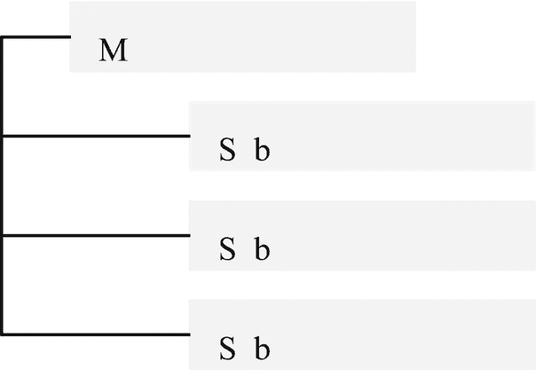
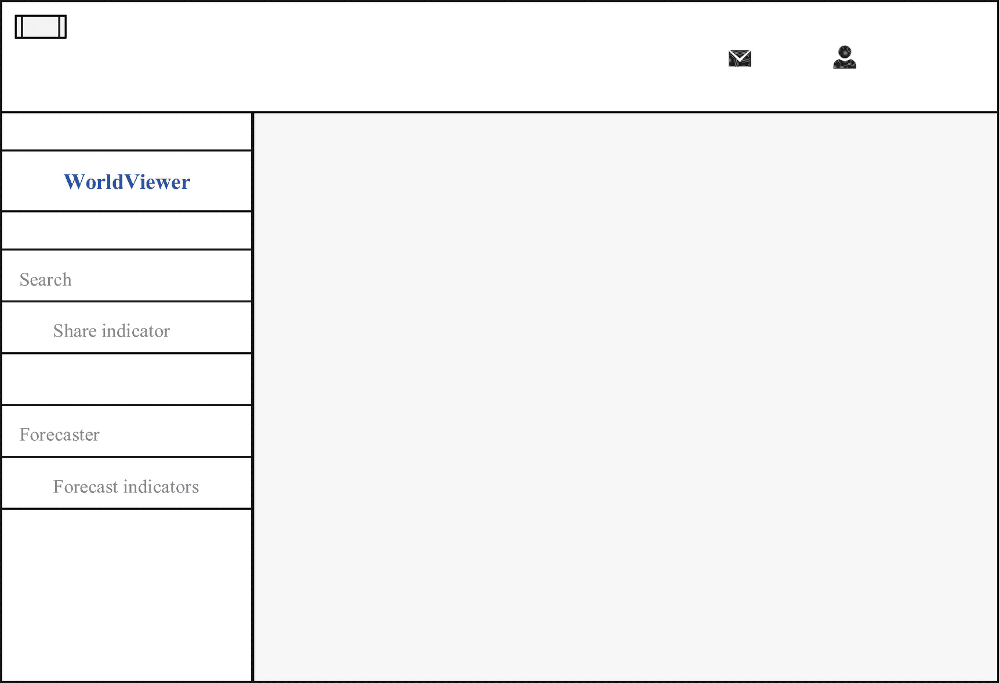
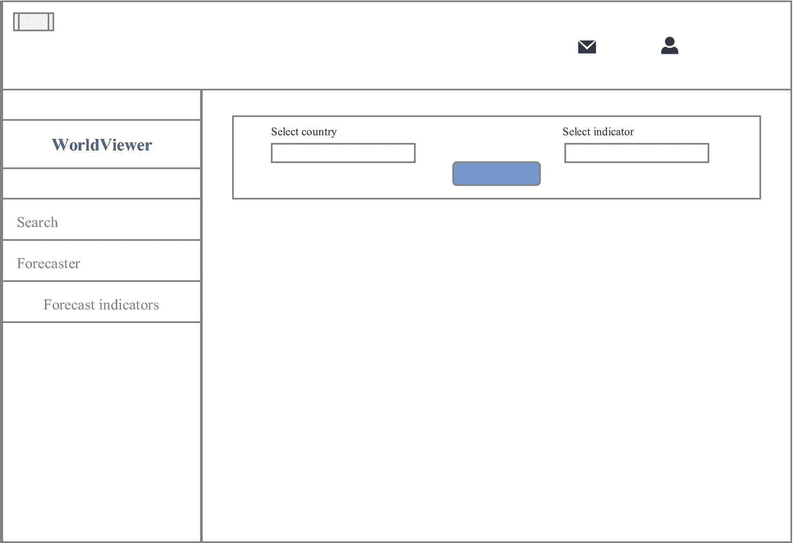

# 八、构建实时 Web 应用

这一章很快向你介绍了如何用 Python 构建实时交互式 web 应用，包括响应性导航栏、侧边栏、图表、表格、回调和 URL 路由。参考本章的独特内容后，您应该能够通过实现以 HTML 和Bootstrap技术为中心的关键 web 框架(即 Dash、Dash 核心组件、Dash HTML 组件和 Dash Bootstrap组件)以及 Plotly 交互式图表库，熟练地将功能强大、响应迅速的仪表板开发为 web 应用。它充分地让你了解了一种实现 CSS 来定制 web 应用的整体方法。它还包括搜索、报告生成和下载等功能。

使用以下提示来阅读本章。

Tip

确保为每个组件分配一个 ID，以便可以重用。

合并一个 CSS 文件或在 Dash 应用中指定它，以控制组件的样式和行为，而无需为每个组件重写 CSS 代码。或者，使用Bootstrap主题模板。

要安装本例所需的依赖项，请访问源代码文件夹，并使用`pip install -r requirements.txt`。此外，请参考清单 [8-1](#PC1) 。

## 仪表板应用结构

图 [8-1](#Fig1) 展示了一种构建 Dash web 应用代码的方法。


图 8-1

构建 Dash 应用代码

图 [8-1](#Fig1) 呈现步骤如下:导入关键依赖，初始化 Dash web app，指定主题，构造组件，指定 app 布局和内容，然后运行 app。

## 导入关键依赖项

构建 Dash web 应用的第一步包括导入关键依赖项。

清单 [8-1](#PC1) 导入关键依赖项来设计最佳的 web 应用。

```py
import pandas as pd
import dash_table as dt
import plotly
import plotly.express as px
import plotly.graph_objects as go
import plotly.io as pio
pio.templates.default = "simple_white"
import dash
import dash_core_components as dcc
import dash_html_components as html
from dash.dependencies import Input, Output, State
import dash_bootstrap_components as dbc
from dash_extensions import Download
from dash_extensions.snippets import send_data_frame
from jupyter_dash import JupyterDash
from pandas_datareader import wb
import wbdata
import re

Listing 8-1Importing Key Dependencies

```

下一部分介绍了将搜索功能整合到应用中的策略，该组件使用户能够搜索和选择一个国家，以及从 Microsoft Excel 文件文档派生的选项列表中的一个指示符。

清单 [8-2](#PC2) 通过实现熊猫库中的`read_excel()`方法来提取数据。它通过实现熊猫库中的`append()`方法，捕获列表中的符号和国家名称，作为 Dash 应用中搜索下拉菜单中的`options`。

表 [8-1](#Tab1) 突出显示了包含在 Microsoft Excel 文件文档中的数据。

表 8-1

国家列表

<colgroup><col class="tcol1 align-left"> <col class="tcol2 align-left"> <col class="tcol3 align-left"></colgroup> 
|   | 

未命名:0

 | 

名字

 |
| --- | --- | --- |
| **符号** |   |   |
| abw | Zero | 阿鲁巴岛 |
| **AFG** | one | 阿富汗 |
| AFR | Two | 非洲 |
| **以前** | three | 安哥拉 |
| **ALB** | four | 阿尔巴尼亚 |
| **...** | ... | ... |
| **XZN** | Two hundred and ninety-two | 撒哈拉以南非洲不包括南非和... |
| **YEM** | Two hundred and ninety-three | 也门共和国。 |
| **ZAF** | Two hundred and ninety-four | 南非 |
| **ZMB** | Two hundred and ninety-five | 赞比亚 |
| **ZWE** | Two hundred and ninety-six | 津巴布韦 |

```py
country_ticker = pd.read_excel(r"filepath\list_of_countries.xlsx")
country_ticker = country_ticker.set_index("Symbol")
country_options = []
for country_tic in country_ticker.index:
    country_options.append({"label":"{} {}".format(country_tic, country_ticker.loc[country_tic]["Name"]), "value":country_tic})

Listing 8-2Extracting Country Search Options

```

清单 [8-3](#PC3) 通过实现熊猫库中的`read_excel()`方法来提取数据。随后，它通过实现 pandas 库中的`append()`方法，捕获列表中指示器的符号和名称，作为 Dash 应用中搜索下拉菜单中的选项。

表 [8-2](#Tab2) 突出显示了包含在 Microsoft Excel 文件文档中的数据。

表 8-2

指示器列表

<colgroup><col class="tcol1 align-left"> <col class="tcol2 align-left"></colgroup> 
|   | 

名字

 |
| --- | --- |
| **符号** |   |
| **AG。TRAC . no .** | 农业机械、拖拉机 |
| **ag . com . fert . zs** | 化肥消耗量(化肥产量的%)... |
| **ag . com . fert . zs** | 肥料消耗量(千克/公顷... |
| **我是阿格里. K2** | 农业用地(平方。公里) |
| **我是阿格里. ZS** | 农业用地(占土地面积的%) |
| **...** | ... |
| **VC。国内流离失所者 TOCV** | 境内流离失所者，流离失所者总数... |
| **你。PSRC.FE.P5** | 故意杀人，女性(每 10 万女性... |
| **你。PSRC.MA.P5** | 故意杀人，男性(每 10 万名男性) |
| **你。PSRC.P5** | 故意杀人(每 100，000 人) |
| **你。pkp . tot . un〔t1〕** | 维持和平人员的存在(部队人数，p... |

```py
global_ind_ticker = pd.read_excel(r"filepath\global_ind.xlsx")
global_ind_ticker = global_ind_ticker.set_index("Symbol")
global_ind_options = []
for global_ind_tic in global_ind_ticker.index:
    global_ind_options.append({"label":"{} {}".format(global_ind_tic, global_ind_ticker.loc[global_ind_tic]["Name"]), "value":global_ind_tic})

Listing 8-3Extracting Indicators Search Options

```

### 加载外部 CSS 文件

清单 [8-4](#PC4) 从一个流行的 CSS 提供者 Bootstrap([`https://getbootstrap`)中提取一个 CSS 文件。`com/docs/5.1/getting-started/introduction/`](https://getbootstrap.com/docs/5.1/getting-started/introduction/) `)`。或者，使用另一个 CSS 提供者，比如 Font Awesome ( [`https://use.fontawesome.com/releases/v5.8.1/css/all.css`](https://use.fontawesome.com/releases/v5.8.1/css/all.css) )。

```py
get_bootstrap_css = "https://cdn.jsdelivr.net/npm/bootstrap@5.0.0-beta2/dist/css/bootstrap.min.css"

Listing 8-4Loading an External CSS File

```

## 加载Bootstrap图标库

为了让 Dash web 应用更有吸引力，你可以加入图标。清单 [8-5](#PC5) 提取Bootstrap图标库。可以在 [`https://icons.getbootstrap`复习。`com`T5。](https://icons.getbootstrap.com)

```py
get_bootstrap_icon = "https://cdn.jsdelivr.net/npm/bootstrap-icons@1.4.0/font/bootstrap-icons.css"

Listing 8-5Loading the Bootstrap Icons Library

```

### 初始化 Web 应用

在导入关键 Python 库、加载 CSS 文件和图标库之后，下一步包括初始化 Dash web 应用。首先，清单 [8-6](#PC6) 通过实现 JupyterDash 库来初始化应用。接下来，它将`external_stylesheets`指定为清单 [8-4](#PC4) 中加载的Bootstrap CSS 文件和清单 [8-5](#PC5) 中加载的图标库。

它将`meta_tags`指定为“`name`”、`:`、`viewport`、`charset`、`:`、`utf-8`、`,`、`content`、`:`、`width=device-width,initial-scale=1, shrink-to-fit=no`，使 web app 移动友好。

```py
app = JupyterDash(external_stylesheets=[get_bootstrap_css, get_bootsrap_icon],
                  meta_tags=[{"name": "viewport",
                              "charset":"utf-8",
                              "content": "width=device-width,initial-scale=1, shrink-to-fit=no"}])

Listing 8-6Initializing a Web App

```

## 导航栏

Web 应用包含一个导航栏，它使用户能够通过应用进行规划。本章展示了正确构建顶部导航栏和侧面导航栏的例子。最初，它构建了一个顶部导航栏，其中嵌入了图标。

### 顶部导航栏

本章中的顶部导航栏包括三个导航项目:警报和通知(将用户路由到“警报和通知”页面)、消息(将用户路由到收件箱)和配置文件(释放包含编辑配置文件、帐户设置、计费和注销等项目的下拉菜单；每个项目都有自己的链接)。除此之外，它还包括一个隐藏和取消隐藏侧面导航栏的开关。

#### 警报和通知

清单 [8-7](#PC7) 通过实现`dash_bootstrap_components`库中的`NavLink()`方法来构造警报和通知。它将`className`指定为`bi bi-alarm`，从Bootstrap图标库中提取一个图标，然后将`font-size`指定为`20px`，将`color`指定为`gray`，将`width`指定为`auto`，根据用户的设备启用自动缩放(见图 [8-2](#Fig2) )。同样，它将 URL 指定为`page-1/1`。请注意，ID 被指定为“`submenu-1-collapse`”，下面的导航项目被指定为“`submenu-2-collapse`”。指定 ID 使您能够一次 URL 路由所有组件，而不是为每个组件编写单独的代码行。


图 8-2

警报和通知

```py
messages = dbc.Row(
    [
        dbc.Col(
            dbc.NavLink(className = "bi bi-envelope",
                        href = "/page-3/1",
                        style = {"font-size" : "20px", "color" : "gray"}),
            width="auto"
        ),
    ],
    no_gutters = True,
    className = "ml-auto flex-nowrap mt-3 mt-md-0",
    align = "right",
     style = {"font-size" : "16px"},
    id = "responsivemenu-4-collapse"
)

Listing 8-7Alerts and Notifications

```

#### 信息

清单 [8-8](#PC8) 通过实现`dash_bootstrap_components`库中的`NavLink()`方法来构造消息。首先，它指定`className`为`bi bi-envelope`，从Bootstrap图标库中提取一个图标。接下来，它将`font-size`指定为`20px`、`color`指定为`gray`、`width`指定为`auto`，以根据用户的设备启用自动缩放(参见图 [8-3](#Fig3) )。此外，它将 URL 指定为`page-1/2`。


图 8-3

信息

```py
messages = dbc.Row(
    [
        dbc.Col(
            dbc.NavLink(className = "bi bi-envelope",
                        href = "/page-3/1",
                        style = {"font-size" : "20px", "color" : "gray"}),
            width="auto"
        ),
    ],
    no_gutters = True,
    className = "ml-auto flex-nowrap mt-3 mt-md-0",
    align = "right",
     style = {"font-size" : "16px"},
    id = "responsivemenu-4-collapse"
)

Listing 8-8Messages

```

#### 轮廓

清单 [8-9](#PC9) 通过实现`dash_bootstrap_components`库中的`dbc.DropdownMenu()`方法构建了一个被称为*概要文件*的导航项目(参见图 [8-4](#Fig4) )。下拉菜单包括以下项目:编辑个人资料、账户设置、账单和注销，每个项目都有自己的链接(参见`href`)。下拉菜单的方向是“`left`”。


图 8-4

轮廓

```py
profile = dbc.DropdownMenu(
    children=[
        dbc.DropdownMenuItem("Edit Profile",
                             href = "/page-4/1"),
        dbc.DropdownMenuItem("Privacy & Safety",
                             href = "/page-4/2"),
        dbc.DropdownMenuItem("Account Settings",
                             href = "/page-4/3"),
        dbc.DropdownMenuItem("Billing",
                             href = "/page-4/4"),
        dbc.DropdownMenuItem(divider = True),
        dbc.DropdownMenuItem("Sign Out",
                             href = "/page-4/5"),
    ],
    nav = True,
    in_navbar = True,
    className = "bi bi-person",
    direction = "left",
    style = {"font-size" : "20px"},
    id = "responsivemenu-5-collapse"
)

Listing 8-9Profile

```

#### 带有切换按钮的导航栏

本节开发了一个带有切换按钮的导航栏。一个*开关*折叠项目(即响应侧导航栏)。由于笔记本电脑/PC 显示器和移动设备的屏幕宽度不同，用户可以轻松地在移动设备上导航应用，而无需在屏幕上显示所有组件。在本章中，它隐藏和取消隐藏响应侧导航栏(参见图 [8-5](#Fig5) )。


图 8-5

导航栏

清单 [8-10](#PC10) 通过实现`dash_bootstrap_components`库中的`Navbar()`方法，完成了带有切换按钮的顶部导航栏(参见图 [8-5](#Fig5) )。将`className`指定为`navbar-toggler-icon`，将`n_clicks`(点击次数)指定为`0`。将`n_clicks`指定为`0`可以确保在用户点击按钮之前没有动作发生。除此之外，它通过将“`padding`”指定为“`1rem 0rem`”来在下拉列表中的项目之间创建空间，并将导航栏的颜色指定为“`white`”。

Note

有空列用于间隔。Bootstrap 构建在响应式网格系统上，该系统使用列(最大宽度为 12)和行来定位应用中的组件。

```py
navbar = dbc.Navbar(
    [
        dbc.Col([],width=2),
        dbc.Col([
            dbc.Button(id = "toggle-button",
                       n_clicks = 0,
                       children = "",
                       outline = True,
                       className = "navbar-toggler-icon")],
            width = 1),
        dbc.Col([],
                width = 3),
        dbc.Col([messages],
                width = "auto"),
        dbc.Col([alerts_notif],
                width = "auto"),
        dbc.Col([], width = 2),
        dbc.Col([profile],
                width = 2)],
    color = "white",
    style={"margin-right" : "0rem",
           "margin-top" : "0rem",
           "margin-bottom" : "0.5rem",
           "padding" : "1rem 0rem"})

Listing 8-10Navigation Bar

```

### 指定响应侧导航栏

除了顶部导航栏之外，在应用中包含侧面导航栏，其中包含顶部导航栏中未包含的项目。首先，指定 CSS。清单 [8-11](#PC11) 指定了侧面导航栏的 CSS 代码。它还将`background-color`指定为“`#f8f9fa`”(浅灰色)，并将`padding`(元素之间的间距)指定为“`0.5rem 1rem`”。

```py
RESPONSIVE_MENU_STYLE = {
    "position" : "fixed",
    "top" : 0,
    "left" : 0,
    "bottom" : 0,
    "width" : "14rem",
    "height" : "100%",
    "margin-top" : "0rem",
    "margin-bottom" : "0rem",
    "z-index" : 1,
    "overflow-x" : "hidden",
    "transition" : "all 0.5s",
    "padding" : "0.5rem 1rem"
}

Listing 8-11Visible Sidebar Navigation Bar CSS Code

```

确保边栏导航栏在点击切换按钮时隐藏和取消隐藏的最好方法是为边栏指定一个单独的 CSS 代码。本章的“回调”部分确保在单击切换按钮时隐藏和取消隐藏侧面导航栏。

清单 [8-12](#PC12) 指定了能够隐藏和取消隐藏侧边栏导航栏的 CSS 代码。清单 [8-11](#PC11) 和清单 [8-12](#PC12) 中 CSS 代码的主要区别在于，清单 [8-12](#PC12) 将`left`指定为`-16rem`，这隐藏了侧边栏导航栏。

```py
RESPONSIVE_MENU_HIDEN = {
    "position" : "fixed",
    "top" : 0,
    "left" : "-16rem",
    "bottom" : 0,
    "width" : "14rem",
    "height" : "100%",
    "z-index" : 1,
    "overflow-x" : "hidden",
    "transition" : "all 0.5s",
    "padding" : "0rem 0rem",
}

Listing 8-12Hidden Sidebar Navigation Bar CSS Code

```

## 指定 Web 应用 CSS 代码

导入重要的依赖项，初始化应用，开发导航栏，然后开发应用的内容。内容可能包含交互式表格和图表，包括组件。

清单 [8-13](#PC13) 指定了 Dash 应用内容的 CSS 代码。

```py
APP_CONTENT_STYLE = {
    "transition" : "margin-left .5s",
    "margin-left" : "14.5rem",
    "margin-right" : "0.5rem",
    "margin-bottom" : "0.5rem",
    "padding" : "0rem 0rem"
}

Listing 8-13Content CSS Code

```

本节开发了一个`toggle`，用于触发侧面导航栏的隐藏或取消隐藏。

要在隐藏侧面导航栏时拉伸应用内容，请将“`14rem`”中的“`margin-left`”替换为“`0rem`”(参见清单 [8-14](#PC14) )。

```py
APP_CONTENT_STYLE1 = {
    "transition" : "margin-left .5s",
    "margin-left" : "0.5rem",
    "margin-right" : "0.5rem",
    "margin-bottom" : "0.5rem",
    "padding" : "0rem 0rem"
}

Listing 8-14Content CSS Code

```

## 侧面导航栏菜单和子菜单

指定侧边栏导航栏的 CSS 代码后，下一步是开发它必须包含的项目。

图 [8-6](#Fig6) 显示了包含子菜单的侧边栏导航栏菜单的结构。



图 8-6

侧栏导航栏菜单

清单 [8-15](#PC15) 通过实现`dash_html_components`库中的`NavLink()`方法来开发菜单和子菜单。

请注意，市场菜单的 ID 被指定为“`responsivemenu-1`”，预测菜单为“`responsivemenu-2`”。另外，包含在“`Forecaster`”的`Collapse()`方法中的子菜单的 ID 是“`responsivemenu-2-collapse`”。

```py
RESPONSIVE_RESPONSIVEMENU_1 = [
    html.Li(
        dbc.Row(
            [
                dbc.Col(dbc.NavLink("Search indicators",
                        href = "/page-1/1",
                        style = {"color" : "#616161"})),
            ],
            className = "my-1",
        ),
        style = {"cursor" : "pointer"},
        id = "responsivemenu-1",
    )
]
RESPONSIVE_RESPONSIVEMENU_2 = [
    html.Li(
        dbc.Row(
            [
                dbc.Col("Forecaster"),
                dbc.Col(
                    [html.I(className = "bi bi-chevron-down")],
                    width = "auto")],
            className = "my-1"),
        style = {"cursor" : "pointer"},
        id = "responsivemenu-2"
    ),
    dbc.Collapse(
        [
            dbc.NavLink("Forecast indicators",
                        href = "/page-2/1",
                        style = {"color" : "#616161"}),
        ],
        id = "responsivemenu-2-collapse"
    ),
]

Listing 8-15Developing Submenus

```

指定子菜单后，完成侧面导航栏。

清单 [8-16](#PC16) 通过实现`dash_bootstrap_components`库中的`Nav()`并将它们包含在`Card()`方法中来完成侧面导航栏(参见图 [8-7](#Fig7) )。

Note

它将`vertical`指定为`True`,以确保项目垂直放置。

```py
RESPONSIVE_SIDE_NAVIGATION_BAR = html.Div(
    [
        dbc.Card(
            [
                dbc.CardBody(
                    [
                        html.H4("WorldViewer",
                                className = "btn btn-outline-primary"),
                        html.Hr(),
                        html.P(
                            "",
                            className = "lead"),
                        dbc.Nav(
                            RESPONSIVE_RESPONSIVEMENU_1,
                            vertical = True),
                        html.Hr(),
                        dbc.Nav(
                            RESPONSIVE_RESPONSIVEMENU_2,
                            vertical = True
                        ),
                    ]
                )
            ],
            id = "responsivesidebar")
    ]
)

Listing 8-16Developing a Side Navigation Bar

```



图 8-7

侧面导航栏

## 搜索功能

清单 [8-17](#PC17) 通过实现`dash_core_components`库中的`Dropdown()`方法开发了一个搜索组件。它将 o `ptions`指定为`options`，这在清单 [8-3](#PC3) 中指定。这个方法的目的是避免必须单独创建一个`options`列表。

它将`multi`指定为`False`，这意味着用户只能为每个搜索程序选择一个国家和指标。同样，它将占位符(出现在组件上的文本，通知用户所需的输入类型)指定为“`Search country`”、(`id =`“`country-symbol`”)和“`Search indicator`”(`id =`“`country-indicator`”`).`

```py
INPUT_CARD = dbc.Card([dbc.CardBody([
    dbc.Row([
        dbc.Col([
            dbc.Label("Select country"),
            html.Br(),
            dcc.Dropdown(id="country-symbol",
                         className="border-bottom",
                         options=country_options,
                         multi=False,
                         placeholder="Search country")]),
        dbc.Col([
            dbc.Label("Select indicator"),
            html.Br(),
            dcc.Dropdown(id = "country-indicator",
                         className=  "border-bottom",
                         options = global_ind_options,
                         multi = False,
                         placeholder = "Search indicator")])]),
    html.Br(),
    dbc.Row([
        dbc.Col([], width=5),
        dbc.Col([
            dbc.Button("Show results",
                       id = "worldviewer-submit-button",
                       color = "primary")],
            width=4)])])])

Listing 8-17Developing the Search Component

```



图 8-8

搜索栏

### 创建交互式图表

要为用户简化数据，请在应用中包含交互式图表。

清单 [8-18](#PC18) 通过实现`dash_core_components`库中的`Graph()`方法并将其包含在`dash_bootstrap_components`中的`Card()`方法中，开发了一个普通图表，当用户选择一个国家和一个指标并点击“显示结果”按钮时，该图表会更新。

本章的`callback`部分更新了图表。为了确保在用户采取行动之前图表是清晰的，它将`displayModeBar`指定为`False`。

图 [8-9](#Fig9) 是用户选择国家和指标并点击“显示结果”按钮时的输出示例。


图 8-9

包含交互式图表

```py
INTERACTIVE_CHARTS = dbc.Row([
    dbc.Col([
        dbc.Card([
            dbc.CardBody([
                dbc.Row([
                    dbc.Col([
                        dcc.Graph(id = "worldviewer-lineplot",
                                  figure = {"data" : [{"x" : [1 , 2], "y" : [3 , 1]}]},
                                  config = {"displayModeBar" : False})],
                        width = 12)]),
                dbc.Row([
                    dbc.Col([
                        dcc.Graph(id = "worldviewer-histogram",
                                  figure = {"data" : [{"x" : [1 , 2], "y" : [3 , 1]}]},
                                  config = {"displayModeBar" : False})],
                        width = 6),
                    dbc.Col([
                        dcc.Graph(id = "worldviewer-boxplot",
                                  figure = {"data" : [{"x" : [1 , 2], "y" : [3 , 1]}]},
                                  config = {"displayModeBar" : False})],
                        width = 6)],
                    align = "center")])],
            style={"width" : "auto"})],
        width=12)],
    align = "center")

Listing 8-18Containing an Interactive Chart

```

### 包含交互式表格并允许生成报告和允许下载

显示数据的另一种流行方式是制表。清单 [8-19](#PC19) 通过实现`dash_html_components`库中的`Div()`方法开发了一个空组件，并指定了`id =`“`worldviewer-table`”。随后，用`id =``share-market-series-and-data`开发另一种`Div()`方法，包含清单 [8-18](#PC18) 中的交互图和表格。当用户选择一个国家、指标和“显示结果”按钮时,`callback`段更新表格。

它开发了一个生成报告的按钮，并通过从`dash_bootstrap_components`库中实现`Button()`方法来实现下载，并指定`id = "download-original-data-button"`。按钮(`id =` " `download-worldviewer-results`")下方的`dash_extensions`库中的`Download()`方法方便了下载功能。

图 [8-10](#Fig10) 是用户点击“显示数据”按钮时的输出示例。

```py
INTERACTIVE_TABLE = dbc.Row([
    dbc.Col([
        dbc.Button(id = "collapsemarket-worldviewer-results-button",
                   n_clicks = 0,
                   children = "Show descriptive statistics",
                   className = "mr-1",color="primary"),
        dbc.Collapse(
            dbc.Card([
                dbc.CardBody([
                    html.Div(id = "worldviewer-table"),
                    html.Br(),
                    dbc.Row([
                        dbc.Col([
                             dbc.Button(id = "download-worldviewer-results-button",
                                        n_clicks = 0,
                                        children = "Download descriptive statistics",
                                        className = "mr-1",color="primary"),
                            Download(id = "download-worldviewer-results")],
                            width = 3)])])],
                style={"width" : "12",
                       "paper_bgcolor" : "rgba(0,0,0,0)"}),
            id = "collapse-worldviewer-results")],
        width = 12)])

Listing 8-19Containing an Interactive Table and Generating a Report and Enabling Download

```

清单 [8-20](#PC20) 使用`Div()`方法合并组件。

```py
WORDVIEWER_SUMMARY = html.Div([
    dbc.Row([dbc.Col([INTERACTIVE_CHARTS])]),
    dbc.Row([
        dbc.Col([INTERACTIVE_TABLE])])],
    id="collapse-worldviewer-page")

Listing 8-20Merge Components

```

清单 [8-21](#PC21) 使用`Div()`方法完成搜索导航条。

```py
WORDVIEWER_LAYOUT = html.Div([
    html.Br(),
    dbc.Row([
        dbc.Col([INPUT_CARD],width=12)]),
    html.Br(),
    dbc.Row([
        dbc.Col([],width=5),
        dbc.Col([])]),
    dbc.Collapse([WORDVIEWER_SUMMARY],
                 id="collapse-worldviewer-menu")])

Listing 8-21Complete the Search Navigation Bar

```


图 8-10

包含交互式表格

## 指定应用布局

完成 Dash 应用设计后，指定应用布局。为此，使用带有包含`Store()`和`Location()`方法的`Div()`方法的`app.layout`来使侧面导航栏响应。

清单 [8-22](#PC22) 指定了 Dash 应用布局。

```py
content = html.Div(
    id = "app-content",
    style=APP_CONTENT_STYLE)
app.layout = html.Div(
    [
        dcc.Store(id = "responsive-sidebar-click"),
        dcc.Location(id = "url"),
        navbar,
        RESPONSIVE_SIDE_NAVIGATION_BAR,
        content,
    ],
)

Listing 8-22Specifying the App Layout

```

## 指定回调函数

Dash web 应用最关键的部分是一个*回调*，它的工作方式类似于“`get-post`方法。它包括三个关键的依赖项，即用于指定输入的`Input()`方法、用于指定采取行动的状态的`State()`方法(通过它`Input()`方法依赖于行动)和用于指定输出的`Output()`方法。

图 [8-11](#Fig11) 简化了回调函数，它构造了一个侧面导航栏，当用户点击切换按钮时，导航栏隐藏和取消隐藏。


图 8-11

回调函数示例

图 [8-11](#Fig11) 显示当用户点击切换按钮时，侧面导航栏隐藏或取消隐藏。

回调代码以`@app.callback()`开始，包含`Input()`、`State()`和`Output()`方法。对于每种方法，指定操作的组件 ID 和参数。

清单 [8-23](#PC23) 显示了`Input()`方法中的组件(切换按钮)ID 为“`btn_sidebar`”，参数为“`n_clicks`”(表示点击次数)。`Output()`方法的 id 为“`sidebar`”、“`page-content`”和“`side_click`”。前两个的自变量是“`style`”，最后一个是“`data`”。

Tip

在指定 app.layout 之后指定回调。通过将 define 函数指定为`def (): return`来结束回调。

### 响应侧导航栏的回调

清单 [8-23](#PC23) 构造了一个`callback`，用于根据用户点击切换按钮隐藏和取消隐藏侧面导航栏。请注意，`def()`功能包含隐藏和取消隐藏侧面导航栏的条件语句(`if else`)。

```py
@app.callback(
    [
        Output("responsivesidebar", "style"),
        Output("app-content", "style"),
        Output("responsive-sidebar-click", "data"),
    ],

    [Input("toggle-button", "n_clicks")],
    [
        State("responsive-sidebar-click", "data"),
    ]
)
def toggle_responsivesidebar(n, nclick):
    if n:
        if nclick == "SHOW":
            RESPONSIVE_MENU_style = RESPONSIVE_MENU_HIDEN
            APP_CONTENT_style = APP_CONTENT_STYLE1
            NO_OF_CURRENT_CLICKS = "HIDDEN"
        else:
            RESPONSIVE_MENU_style = RESPONSIVE_MENU_STYLE
            APP_CONTENT_style = APP_CONTENT_STYLE
            NO_OF_CURRENT_CLICKS = "SHOW"
    else:
        RESPONSIVE_MENU_style = RESPONSIVE_MENU_STYLE
        APP_CONTENT_style = APP_CONTENT_STYLE
        NO_OF_CURRENT_CLICKS = "SHOW"
    return RESPONSIVE_MENU_style, APP_CONTENT_style, NO_OF_CURRENT_CLICKS
def toggle_collapse(n, is_open):
    if n:
        return not is_open
    return is_open
def set_navitem_class(is_open):
    if is_open:
        return "open"
    return ""

Listing 8-23Callback for a Responsive Side Navigation Bar

```

### URL 路由的回调

在进行大规模 web 应用开发时，将所有源代码放在一个`.py`文件中是不明智的。这使得管理项目变得困难。此外，一行代码中的微小错误会影响整个文件。解决这个问题的最好方法是在不同的`.py`文件中有不同的页面，并通过 URL 路由在它们之间建立连接，从而指定一个`URL`链接，将用户带到应用中的特定区域。

清单 [8-24](#PC24) 通过实现`callback()`方法来指定 URL 路由，该方法包含一个 ID 为“`url`、参数为“`pathname`”的`Input()`方法和一个 ID 为“`page-content`、参数为“`children`”的`Output()`方法。同样，它包含一个包含条件语句(`if elif`)的`def()`函数，将用户导向一个特定的 URL。如果用户指定了无效的 URL，将出现 404 消息。

```py
path_name_map = {"/": WORDVIEWER_LAYOUT,
                 "/page-1/1": WORDVIEWER_LAYOUT,
                 "/page-2/1": "Forecast Indicators",
                 "/page-3/1": "Profile",
                 "/page-4/1": "Edit Profile",
                 "/page-4/2": "Privacy & Safety",
                 "/page-4/3": "Account Settings",
                 "/page-4/4": "Billing",
                 "/page-4/5": "Sign Out"}
for i in range(0, 4):
    app.callback(
        Output(f"responsivemenu-{i}-collapse", "is_open"),
        [Input(f"responsivemenu-{i}", "n_clicks")],
        [State(f"responsivemenu-{i}-collapse", "is_open")],
    )(toggle_collapse)
    app.callback(
        Output(f"responsivemenu-{i}", "className"),
        [Input(f"responsivemenu-{i}-collapse", "is_open")],
    )(set_navitem_class)
@app.callback(Output("app-content", "children"), [Input("url", "pathname")])
def render_page_content(pathname):
    return html.P(path_name_map[pathname])

Listing 8-24Callback for URL Routing

```

### 指定取消隐藏内容的回调函数

清单 [8-25](#PC25) 指定了一个回调函数，用于在用户点击“显示结果”按钮时显示内容。

```py
@app.callback(Output("collapse-worldviewer-menu", "is_open"),
              [Input("worldviewer-submit-button", "n_clicks")])
def toggle_collapse_worldviewer_menu(n):
    return n

Listing 8-25Specifying a Callback Function for an Unhiding Content

```

### 为交互式图表指定回调函数

本节开发了一个回调函数，用于在用户选择一个国家和一个指标并单击 search 按钮时更新图表。有三张图表；因此，有三个回调函数。

注意，`def()`函数从`pandas-datareader`库中提取股票数据，并将预定义的日期作为今天的日期。

清单 [8-26](#PC26) 为交互式线图指定了一个回调函数。

```py
@app.callback(Output("worldviewer-lineplot", "figure"),
              [Input("country-indicator", "value")],
              [State("country-symbol", "value")])
def draw_worldviewer_lineplot(indicator, country):
    df = wb.download(indicator = indicator, country = [country], start = 2000, end = 2021)
    df_country = pd.DataFrame(df)
    df_country = df_country.reset_index()
    country_name = [df_country.country[0]]
    ind = wbdata.get_indicator(indicator)
    text = ind[0]["name"]
    title = text[:text.find("(")-1]
    df.columns = [title]
    figure = go.Figure(data=go.Scatter(x = df_country.year,
                                       y = df_country.iloc[::,-1],
                                       mode = "lines",
                                       line = dict(color = "#1266F1",
                                                   width = 4)))
    figure['layout'] = {"title":  "".join(country_name) + " " + "".join(title),
                        "xaxis": {"anchor": "y", "domain": [0.0, 1.0],
                                      "title": "Year"},
                        "yaxis": {"anchor": "x", "domain" : [0.0, 1.0],
                                      "title": "".join(title)}}
    figure['layout'].update(autosize=True,
                            template="simple_white",
                            showlegend=False)
    figure.update_xaxes(rangeslider_visible=True)
    return figure

Listing 8-26Specifying a Callback Function for an Interactive Line Plot

```

清单 [8-27](#PC27) 指定了交互式直方图的回调函数。

```py
@app.callback(Output("worldviewer-histogram", "figure"),
              [Input("country-indicator", "value")],
              [State("country-symbol", "value")])
def draw_worldviewer_histogram(indicator, country):
    df = wb.download(indicator = indicator, country = [country], start = 2000, end=2021)
    df_country = pd.DataFrame(df)
    df_country = df_country.reset_index()
    country_name = [df_country.country[0]]
    ind = wbdata.get_indicator(indicator)
    text = ind[0]["name"]
    title = text[:text.find("(")-1]
    df.columns = [title]
    figure = px.histogram(df,
                          color_discrete_sequence = ["lightskyblue"])
    figure['layout'] = {"title":  "",
                        "xaxis": {"anchor": "y", "domain": [0.0, 1.0],
                                      "title": "".join(title)},
                        "yaxis": {"anchor": "x", "domain" : [0.0, 1.0],
                                      "title": "Frequency"}}
    figure["layout"].update(showlegend=False)
    return figure

Listing 8-27Specifying a Callback Function for an Interactive Histogram

```

清单 [8-28](#PC28) 指定了一个交互式方框图的回调函数。

```py
@app.callback(Output("worldviewer-boxplot", "figure"),
              [Input("country-indicator", "value")],
              [State("country-symbol", "value")])
def draw_worldviewer_boxplot(indicator, country):
    df = wb.download(indicator = indicator, country = [country], start = 2000, end = 2021)
    df_country = pd.DataFrame(df)
    df_country = df_country.reset_index()
    country_name = [df_country.country[0]]
    ind = wbdata.get_indicator(indicator)
    text = ind[0]["name"]
    title = text[:text.find("(")-1]
    df.columns = [title]
    figure = px.box(df,
                    color_discrete_sequence=["darkorange"],
                    points="all")
    figure["layout"].update(showlegend=False)
    figure['layout'] = {"title":  "",
                        "xaxis": {"anchor": "y", "domain": [0.0, 1.0],
                                  "title": ""},
                        "yaxis": {"anchor": "x", "domain" : [0.0, 1.0],
                                  "title": "Count"}}
    return figure

Listing 8-28Specifying a Callback Function for an Interactive Box Plot

```

### 指定取消隐藏交互式表格的回调函数

清单 [8-29](#PC29) 指定了一个用于取消隐藏交互式表格的回调函数。

```py
@app.callback(Output("collapse-worldviewer-results", "is_open"),
              [Input("collapsemarket-worldviewer-results-button", "n_clicks")],
              [State("collapse-worldviewer-results", "is_open")])
def toggle_collapse_worldviewer_results_table(n, is_open):
    if n:
        return not is_open
    return is_open

Listing 8-29Specifying a Callback Function for Unhiding an Interactive Table

```

### 为交互式表格指定回调函数

清单 [8-30](#PC30) 开发了一个回调函数，用于在用户选择一个国家和一个指标并点击“显示描述性统计”按钮时更新表格。请注意，`def()`函数从`pandas-datareader`库中提取指标数据，并将预定义的日期作为今天的日期。

为了更新表格，它使用了`dash_table`库。

```py
@app.callback(Output("worldviewer-table", "children"),
              [Input("country-indicator","value")],
              [State("country-symbol","value")])
def draw_worldviewer_table(indicator, country):
    df = wb.download(indicator = indicator, country = [country], start = 2000, end = 2021)
    df_country = pd.DataFrame(df)
    df_country = df_country.reset_index()
    country_name = [df_country.country[0]]
    ind = wbdata.get_indicator(indicator)
    text = ind[0]["name"]
    title = text[:text.find("(")-1]
    df.columns = [title]
    descriptive_statistics = df.describe().transpose()
    data = descriptive_statistics.to_dict("rows")
    columns = [{"name": i, "id": i,} for i in (descriptive_statistics.columns)]
    return dt.DataTable(data=data,columns=columns,style_table={"overflow": "auto",
                                                         "striped":"True",
                                                         "bordered":"True",
                                                           "hover":"True"})

Listing 8-30Specifying a Callback Function for an Interactive Table

```

### 为数据下载的回调指定回调函数

清单 [8-31](#PC31) 开发了一个回调函数，当用户点击“下载描述性统计数据”按钮时，它会下载一个 Microsoft Excel 文件。请注意，`def()`函数从`pandas-datareader`库中提取指标数据，并将预定义的日期作为今天的日期。它还应用`dash_extensions`库中的`send_frame()`方法来启用下载。

```py
@app.callback(Output("download-worldviewer-results", "data"),
              [Input("download-worldviewer-results-button", "n_clicks")],
              [State("country-indicator","value"),
               State("country-symbol","value")])
def download_worldviewer_results_data(n_clicks, indicator, country):
    df = wb.download(indicator = indicator, country = [country], start = 2000, end = 2021)
    df_country = pd.DataFrame(df)
    df_country = df_country.reset_index()
    country_name = [df_country.country[0]]
    ind = wbdata.get_indicator(indicator)
    text = ind[0]["name"]
    title = text[:text.find("(")-1]
    df.columns = [title]
    describe = df.describe().transpose()
    return send_data_frame(df.to_excel,
                           filename = "".join(country_name) + " " + "".join(title) + " descriptive statistics.xlsx")

Listing 8-31Specifying a Callback Function for Callback for Data Download

```

## 运行 Dash 应用

清单 [8-32](#PC32) 通过实现`run_server()`方法并指定`mode`为`external`，包括`dev_tools_ui`和`dev_tools_props_check`为`False`来运行 Dash 应用，这样它就不会在运行之前调试应用。

```py
app.run_server(mode="external",
               dev_tools_ui = False,
               dev_tools_props_check = False)

Listing 8-32Specifying a Callback Function for URL Routing

```

## 结论

本章介绍了一种创建 web 应用的功能方法，该应用包含一个顶部和侧面的导航栏，用于响应用户输入。首先，它介绍了一种获取 CSS 脚本以利用图标的技术。然后，它提出了一种创建带有超链接的图标的方法，从而使用户能够从一个页面移动到另一个页面。后来，它在侧边栏显示了战术子菜单。除此之外，它还揭示了一种在单击特定组件时折叠项目的方法。最重要的是，它让你熟悉`callback()`方法，以促进反应。