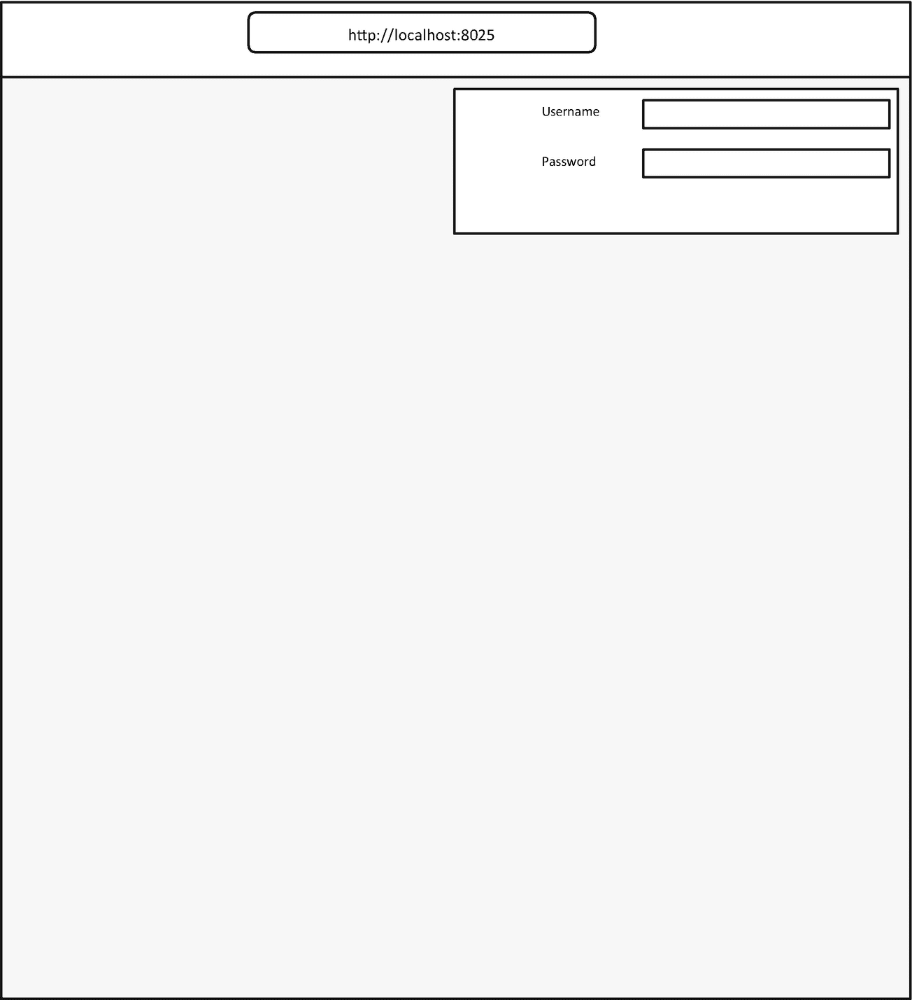
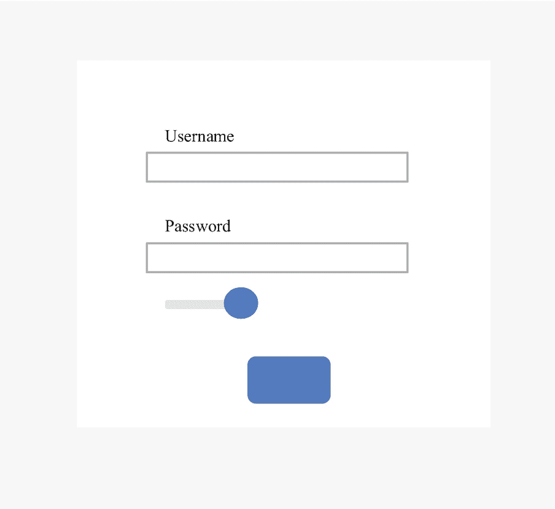
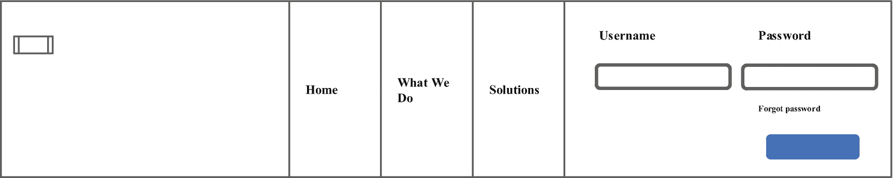

# 9.基本 Web 应用身份验证

如果您打算在用户之间共享 Dash web 应用，尤其是在组织环境中，请确保充分保护应用，并根据用户级别限制某些功能。从一个组织到另一个组织，从一个项目到另一个项目，用户管理和隐私的复杂性有很大的不同；因此，没有通用的用户认证方法。

本章不是说明性的；相反，它大胆地试图让您熟悉基本的 web 应用用户身份验证。它通过实现关键的 Python web 框架(即`dash_auth`和`flask`)来展示基本原理。除此之外，它还提出了通过实现`dash_core_components`来构建认证输入的方案。它合理地总结了与 Dash web app 用户认证相关的重要资源。

## 使用破折号验证进行验证

Dash 库的`dash_auth`模块使得 web 应用认证相对容易。确保您的环境中安装了`dash_auth`。要在 Python 环境`t`中安装它，使用`pip install dash-auth`。要将它安装在康达上，请使用`conda install -c conda-forge dash-auth`。

清单 [9-1](#PC1) 构建了一个基本的 Dash web app 认证(见图 [9-1](#Fig1) )。请注意，将用户名和密码存储在`.py`文件中并不是实现应用安全性的最安全的方式；这里是为了演示的目的。



图 9-1

基本认证

```py
import dash
import dash_auth
import dash_html_components as html
user_details = [
    ["Tshepo", "Tshepo!Password!#$897"]
]
external_stylesheets = ['https://codepen.io/chriddyp/pen/bWLwgP.css']
app = dash.Dash(__name__, external_stylesheets=external_stylesheets)
auth = dash_auth.BasicAuth(
    app,
    user_details
)
app.layout = html.Div(
    [
        html.P("Login successful")
    ],
    className = "container")
app.scripts.config.serve_locally = True
if __name__ == '__main__':
    app.run_server(debug=False)

Listing 9-1Dash Basic Authentication

```

图 [9-1](#Fig1) 显示了一个弹出窗口，要求用户在使用 web 应用之前输入用户名和密码。

或者，升级到 Dash Enterprise，无需代码即可轻松配置安全功能。在 Plotly 官方网站( [`https://dash.plotly.com/dash-enterprise`](https://dash.plotly.com/dash-enterprise) )了解更多关于 Dash Enterprise 的信息。

## 用烧瓶验证

下一部分将通过实现 Flask 库来演示一种基本的 Dash web 应用身份验证方法。首先，确保您已经在您的环境中安装了它。要在 Python 环境中安装 Flask 库，请使用`pip install flask`。要在 conda 环境中安装它，请使用`conda install -c conda-forge flask`。

接下来，创建一个保存用户名和密码的`.py`文件，然后构建另一个包含功能的文件(带有输入的表单和一个用于应用路由的`get-post`方法)。

```py
user_profile.py
authentication.py

```

清单 [9-2](#PC3) 展示了包含用户名和密码的`user_profile.py`文件中的代码。它从加密库中实现 Fernet，使用`generate_key()`方法生成一个密钥。接下来，它会打开一个包含密码的`.bin`文件。随后，它对密码进行加密和解码。在 [`https://cryptography.io/en/latest/fernet/`](https://cryptography.io/en/latest/fernet/) 了解更多密码学知识。

```py
import pandas as pd
import io
key = Fernet.generate_key()
fernet_key = Fernet(key)
password_file = r"filepath\password.bin"
with open(password_file, mode='rb') as file:
    password = file.read()
encrypted_token = fernet_key.encrypt(password)
decrypted_token = fernet_key.decrypt(encrypted_token)
user_password = decrypted_token.decode()
user_name_file = r"filepath\user__name.bin"
with open(user_name_file, mode='rb') as file:
    user_names = file.read()
def users_details():
    return user_password, user_names

Listing 9-2Specifying Usernames and Passwords

```

其他支持密码加密的库，包括`werkzeug` ( [`https://werkzeug.palletsprojects.com/en/2.0.x/utils/#module-werkzeug.security`](https://werkzeug.palletsprojects.com/en/2.0.x/utils/%2523module-werkzeug.security) )。请注意，`.bin`文件用于演示目的；最好使用安全的数据库。

清单 [9-3](#PC4) 导入 Flask 和在`user_profile.py`文件中指定为`users_details`的函数。接下来，它指定了应用路由和身份验证的条件语句。

```py
import flask
import dash_html_components as html
import dash_core_components as dcc
from Jupyter_dash import JupyterDash
from user_profile import users_details
user_password, user_names = user_profile()
app = JupyterDash(external_stylesheets=[dbc.themes.BOOTSTRAP])
CONTENT_STYLE = {"margin-left": "16rem",
                 "padding": "0.5rem 0.5rem",
                 "color": "gray"}
sign_in_form = html.Div([
    html.Form([
        dcc.Input(placeholder="Enter username",
                  name="username",
                  type="email"),
        dcc.Input(placeholder="Enter password",
                  name="password",
                  type="password"),
        html.Button("Login", type='submit')],
        action="/login",
        method="post")])
_app_route = ""/""
@app.server.route("/login", methods=["POST"])
def routes():
    data = flask.request.form
    username = data.get("username")
    password = data.get("password")
    if username not in user_password.keys() or  user_password[username] != password:
        return flask.redirect("/login")
    else:
        return_sess = flask.redirect(_app_route)
        return_sess.set_cookie("custom-auth-session", username)
        return return_sess
content = html.Div(id="page-content",
                   style=CONTENT_STYLE)
app.layout = html.Div([sign_in_form,
                       content])
app.run_server(mode='external',
               dev_tools_ui=False,
               dev_tools_props_check=False)

Listing 9-3Authentication with Flask

```

## 登录表单

或者，构建一个单独的页面来登录 web 应用。清单 [9-4](#PC5) 在登录页面上创建一个表单(参见图 [9-2](#Fig2) )。



图 9-2

登录表单

```py
app = JupyterDash(external_stylesheets = [dbc.themes.MATERIA],
                  meta_tags = [{"charset":"utf-8",
                                "name": "viewport",
                                "content": "width=device-width, initial-scale=1"}])
CONTENT_STYLE = {"margin-left": "16rem",
                 "padding": "0.5rem 0.5rem",
                 "color": "gray"}
user_email_input = dbc.FormGroup([
    dbc.Label("Email",
              html_for = "user-email-input",
              width = 4),
    dbc.Col([
        dbc.Input(type = "email",
                  id = "user-email-input",
                  placeholder = "Enter email address")],
        width = 8)],
    row = True)
user_password_input = dbc.FormGroup([
    dbc.Label("Password",
              html_for ="user-password-input",
              width = 4),
        dbc.Col([
            dbc.Input(type = "password",
                      id = "user-password-input",
                      placeholder = "Enter password")],
            width = 8)],
    row = True)
sign_in_button = html.Div([
    dbc.Button("Login",
               color = "primary",
               id = "user-login-input")])
remember_password_input = dbc.FormGroup([
    dbc.Label("",
              html_for = "remember-password-checklist",
              width = 2),
        dbc.Col([
            dbc.Checklist(id = "remember-password-checklist",
                          options = [{"label": "Remember Password",
                                      "value": 1}],
                          switch = True )
        ],
            width = 10)],
    row = True)
forgot_password = html.Label(["",
                              html.A("Create an account",
                                     href = "#")])
form = dbc.Form([
    dbc.Row([
        dbc.Col( [
            user_email_input
        ]
        )
    ]
    ),
    dbc.Row([
        dbc.Col(
            [
                user_password_input
            ]
        )
    ]
    ),
    dbc.Row([
        dbc.Col(
            [
                remember_password_input
            ]
        )
    ]
    ),
    dbc.Row([
        dbc.Col([], width = 5),
             dbc.Col(
                 [
                     sign_in_button
                 ]
             )
    ]
    )
]
)

sign_in_form = dbc.Card([
    dbc.CardBody([
        dbc.Row([
            dbc.Col(
                [
                    html.H4("Sign in",
                            style = {"text-align":"center"}),
                    form
                ]
            )
        ]
        ),
        html.Br(),
        dbc.Row([
            dbc.Col(
                [
                    forgot_password
                ]
            )
        ]
        )
    ]
    )
],
    style = {"margin-left": "28rem",
             "margin-right": "28rem",
             "margin-top":"8rem",
             "margin-bottom":"8rem",
             "padding": "0.5rem 0.5rem",
             "background-color": "#FFFFFF"},
    className = "card-header")
copyrights = dbc.Card([
    dbc.CardBody([
        html.Br(),
        dbc.Row([
            dbc.Col([], width = 5),
            dbc.Col(
                [
                    html.P("Copyright © 2021 WorldViewer. All rights reserved.",
                           style = {"color":"dark"}
                          )
                ]
            )
        ]
        )
    ]
    )
],
    color="light")
sign_in_jumbotron = dbc.Jumbotron(
    [
        sign_in_form
    ]
)
content = html.Div(id="page-content",
                   style = CONTENT_STYLE)
app.layout = html.Div(
    [
        sign_in_jumbotron,
        copyrights,
        content
    ]
)
app.run_server(mode = "external",
               dev_tools_ui = False,
               dev_tools_props_check = False)

Listing 9-4Login Form

```

图 [9-2](#Fig2) 显示了输入用户名的输入类型和输入密码的输入类型，包括登录按钮。这些组件可以被配置成使用某个用户数据库来触发用户简档的认证。

## 登录主页

有时，您可能希望将登录表单放在主页上，以便用户更容易登录到仪表板或 web 应用的某个部分。清单 [9-5](#PC6) 在主页上创建一个登录部分(参见图 [9-3](#Fig3) )。



图 9-3

登录主页

```py
app = JupyterDash(external_stylesheets=[dbc.themes.BOOTSTRAP])
user_email_input = dbc.FormGroup([
    dbc.Label("Email",
              html_for = "user-email-input",
              width = 3),
    dbc.Col([
        dbc.Input(type ="email",
                  id = "user-email-input",
                  placeholder = "Enter email")
    ],
        width = 10
    )
],
    row = True)
user_password_input = dbc.FormGroup([
    dbc.Label("Email",
              html_for = "user-password-input",
              width = 3),
    dbc.Col(
        [
            dbc.Input(type="password",
                      id="user-password-input",
                      placeholder="Enter email"
                     )
        ],
        width = 10
    )
],
    row = True)
sign_in_button = html.Div(
    [
        dbc.Button("Login",
                   color="primary",
                   id="user-login-input"
                  )
    ]
)
login_div = html.Div(
    [
        dbc.Row(
            [
                dbc.Col(
                    [
                        user_email_input,
                    ]
                ),
                dbc.Col(
                    [
                        user_password_input,
                        sign_in_button]
                )
            ]
        )
    ]
)
navigation_bar_item_1 = dbc.NavItem(
    [
        dbc.NavLink("Home",
                    href = "#")
    ]
)
navigation_bar_item_2 = dbc.NavItem(
    [
        dbc.NavLink("What We Do",
                    href = "#")
    ]
)
navigation_bar_item_3 = dbc.NavItem(
    [
        dbc.NavLink("Solutions",
                    href = "#")
    ]
)
navigation_bar = dbc.NavbarSimple(
    children=[navigation_bar_item_1,
              navigation_bar_item_2,
              navigation_bar_item_3,
              login_div],
    brand="Worldviewer",
    brand_href="#",
    sticky="top",
    className="mb-5",
    color="light")
content = html.Div(id = "page-content")
app.layout = html.Div(
    [
        navigation_bar,
        content
    ]
)
app.run_server(mode="external",
               dev_tools_ui=False,
               dev_tools_props_check=False)

Listing 9-5Login on Home Page

```

## 结论

本章介绍了使用 Dash 库进行基本认证的要点。为了获得更多的安全特性，你可以整合其他的 web APIs，比如 Auth0 ( [`https://auth0.com/authenticate/python/amazon/`](https://auth0.com/authenticate/python/amazon/) )或者 Okta ( `https://developer.okta.com/code/python/`)，以及云服务附带的安全特性，比如微软 Azure、亚马逊 web 服务或者 IBM Cloud。

我建议你看看 Dash Enterprise ( [`https://plotly.com/dash/authentication/`](https://plotly.com/dash/authentication/) )，它可以相对容易地在 Dash web app 中设置安全功能，而无需显式编程。